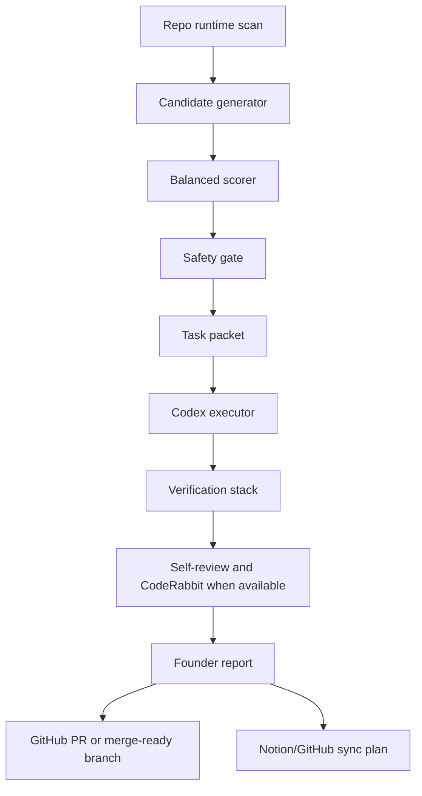

# Active Holidays Autonomous Product Operating System

## Target Configuration

- Autonomy level: executor mode.
- Execution scope: full cycle until merge-ready.
- Main input source: repo runtime analysis.
- Decision model: balanced score across trust, conversion, market-grade polish, and engineering health.
- Approval gates: explicit founder approval only for irreversible or external actions.
- UI generator boundary: Lovable may be used only as a temporary UI-layer handoff tool; it is not a core dependency for domain logic, task selection, verification, sync, or long-term product architecture.

## System Goal

Continuously improve Active Holidays toward market-grade product quality by selecting small, high-value, safe tasks and driving them to a merge-ready branch with evidence.

The system must not behave like a broad backlog generator. It must create one clear next task from current repo reality, execute only safe increments, verify the result, self-review the diff, and produce a concise founder report.

At this stage, the system must keep profit, brand, service quality, and competitive advantage in the strategic lens without prematurely making revenue the dominant scoring axis. Early tasks should first raise decision quality, trust, product clarity, operability, and speed of learning, because those are the foundation for later monetization and brand strength.

The autonomous core must stay independent from any UI generator. Lovable can accelerate screen composition while the project is early, but the durable system of record remains repo contracts, domain logic, API behavior, verification evidence, Notion/GitHub sync plans, and founder decisions.

## Architecture

## Target Components

### Runtime Scanner

Reads repo-local evidence:

- `src/`, `server/`, `shared/`, `data/db/`
- `package.json` scripts
- `.codex/automations/`
- `reports/automations/state/gate-eligibility-snapshot.json`
- `automation/yepcode/active-holidays-orchestrator/`
- current git status

Lovable output is treated as optional UI evidence only when a UI task has passed the PNG approval gate. It must not replace repo contracts or become the source of truth for non-UI decisions.

### Candidate Generator

Turns evidence into candidate tasks. Every candidate needs:

- product reason
- evidence path
- expected impact
- implementation scope
- verification plan
- safety flags

### Balanced Scorer

Scores candidates using:

- user trust
- conversion / growth
- UX/UI polish
- engineering health
- strategic fit
- risk
- implementation effort

### Safety Gate

Blocks or downgrades tasks that require founder approval:

- merge into `main`
- production deploy
- strategic/product Notion writeback
- paid API action
- legal/commercial claim
- secrets, billing, credentials
- destructive database or production action

### Executor

When a safe task is selected, the executor should:

1. create a branch
2. implement the smallest high-quality change
3. run checks
4. self-review
5. run CodeRabbit when available
6. fix real findings
7. prepare PR or merge-ready branch

### Founder Report

Every run ends with:

- what changed
- why it matters
- product impact
- technical impact
- risks
- next best action

## Current Minimal Working Version

This branch implements the repo-owned Stage A control layer:

- `.autonomous/*` operating docs
- deterministic scoring candidates
- repo-owned task lifecycle status
- `scripts/autonomous/runtime.ts`
- `scripts/autonomous/health.ts`
- `scripts/autonomous/level-b.ts`
- `scripts/autonomous/next-best-task-loop.ts`
- `scripts/autonomous/execute-autonomous-task.ts`
- `scripts/autonomous/verify-autonomous-os.ts`
- `npm run autonomous:next`
- `npm run autonomous:cycle`
- `npm run autonomous:execute`
- `npm run autonomous:health`
- `npm run autonomous:level-b`
- `npm run autonomous:level-b:write`
- `npm run autonomous:verify`
- GitHub Actions check workflow

Stage A now supports executor-safe task selection, persisted dry-run cycle reports, dry-run execution packets, local `codex/*` branch preparation, and baseline verification without enabling live external writes.

The control tower now exposes first-class readiness levels in every execution packet:

- `localExecutor`: whether the local Codex executor may safely prepare or run the selected task.
- `directorDryRun`: whether Notion/GitHub sync planning may produce dry-run packets.
- `notionWriteback`: whether live Notion writeback is allowed.
- `externalExecutor`: whether downstream automation may run from eligible sync packets.

This means a green local autonomous check is no longer treated as full external autonomy. The system can be operational in safe local mode while live Notion writeback, external executor promotion, or stale feeder reports remain blocked.

## Repo-Local Level B

Level B is repo-local only. It means the local control loop can continuously diagnose itself, produce next-action artifacts, audit multi-agent coverage for every operating mode, and classify corrective work without mutating product code, Notion, GitHub, deploy targets, or `main`.

Level B readiness requires:

- `localExecutor = passed`
- every skill mode has a valid three-agent pack with owner, verifier, and reviewer-equivalent coverage
- every cycle can expose health, agent-state, gate-state, and next-action state
- stale feeders and blocked gates produce explicit self-healing recommendations
- external write gates stay fail-closed unless separate Notion/GitHub promotion checks pass

Primary commands:

- `npm run autonomous:health -- --json` reports subsystem health without writing artifacts.
- `npm run autonomous:level-b -- --json` runs the dry-run Level B cycle without writing artifacts.
- `npm run autonomous:level-b:write -- --json` writes `health-latest.*` and `level-b-latest.*` into `reports/autonomous/`.

The plain commands fail closed on tracked working-tree changes. Verifier-only schema checks may pass `--allow-dirty-tracked --allow-non-base-branch`; those flags are for diagnostics and do not permit product-code mutation or external writes.

The implemented Stage A selector is intentionally static: it reads `.autonomous/task-candidates.json`, applies `.autonomous/task-status.json`, validates evidence and approval gates, scores candidates, blocks completed or paused candidates, and fails closed on unknown gates. A full runtime scanner/generator remains target architecture, not current implementation.

It still does not autonomously edit product code, push branches, open PRs, merge into `main`, or perform live Notion/GitHub writeback by itself. Those remain explicitly gated.

## Done Boundary For Autonomous v1

Autonomous v1 is considered usable when:

- `npm run autonomous:next -- --json` selects one executor-safe task or explains why none is safe.
- `npm run autonomous:execute -- --json` produces a packet with explicit local and external gate readiness.
- `npm run autonomous:cycle -- --skip-verify -- --json` writes the full artifact set in `reports/autonomous/`.
- `npm run autonomous:verify` passes.
- live Notion writeback remains blocked unless the gate snapshot says `directorLiveWrite.status = passed`.

Autonomous v2 starts only after:

- required feeder reports are fresh.
- operational Notion surfaces have locked target ids or data source ids.
- dry-run diffs exist.
- manual approval tuples match the planned writeback.
- external executor packets are `ready_for_sync`.
