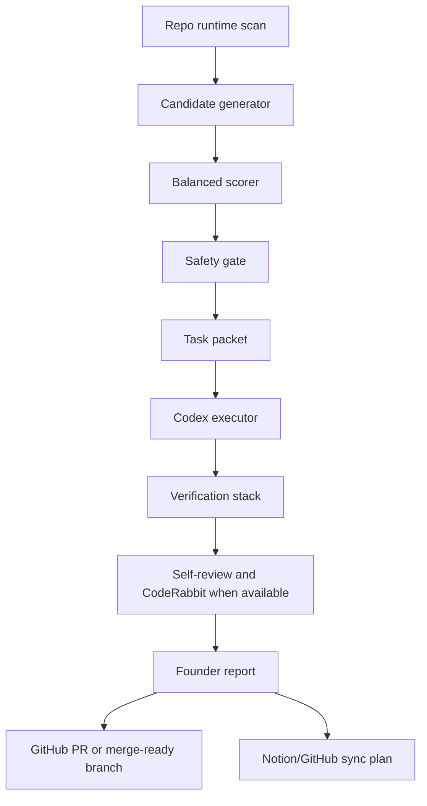

# Active Holidays Autonomous Product Operating System

## Target Configuration

- Autonomy level: executor mode.
- Execution scope: full cycle until merge-ready.
- Main input source: repo runtime analysis.
- Decision model: balanced score across trust, conversion, market-grade polish, and engineering health.
- Approval gates: explicit founder approval only for irreversible or external actions.

## System Goal

Continuously improve Active Holidays toward market-grade product quality by selecting small, high-value, safe tasks and driving them to a merge-ready branch with evidence.

The system must not behave like a broad backlog generator. It must create one clear next task from current repo reality, execute only safe increments, verify the result, self-review the diff, and produce a concise founder report.

## Architecture

## Target Components

### Runtime Scanner

Reads repo-local evidence:

- `src/`, `server/`, `shared/`, `data/db/`
- `package.json` scripts
- `.codex/automations/`
- `reports/automations/state/gate-eligibility-snapshot.json`
- `automation/yepcode/active-holidays-orchestrator/`
- current git status

### Candidate Generator

Turns evidence into candidate tasks. Every candidate needs:

- product reason
- evidence path
- expected impact
- implementation scope
- verification plan
- safety flags

### Balanced Scorer

Scores candidates using:

- user trust
- conversion / growth
- UX/UI polish
- engineering health
- strategic fit
- risk
- implementation effort

### Safety Gate

Blocks or downgrades tasks that require founder approval:

- merge into `main`
- production deploy
- strategic/product Notion writeback
- paid API action
- legal/commercial claim
- secrets, billing, credentials
- destructive database or production action

### Executor

When a safe task is selected, the executor should:

1. create a branch
2. implement the smallest high-quality change
3. run checks
4. self-review
5. run CodeRabbit when available
6. fix real findings
7. prepare PR or merge-ready branch

### Founder Report

Every run ends with:

- what changed
- why it matters
- product impact
- technical impact
- risks
- next best action

## Current Minimal Working Version

This branch implements the repo-owned Stage A control layer:

- `.autonomous/*` operating docs
- deterministic scoring candidates
- `scripts/autonomous/runtime.ts`
- `scripts/autonomous/next-best-task-loop.ts`
- `scripts/autonomous/execute-autonomous-task.ts`
- `scripts/autonomous/verify-autonomous-os.ts`
- `npm run autonomous:next`
- `npm run autonomous:execute`
- `npm run autonomous:verify`
- GitHub Actions check workflow

Stage A now supports executor-safe task selection, dry-run execution packets, local `codex/*` branch preparation, and baseline verification without enabling live external writes.

The implemented Stage A selector is intentionally static: it reads `.autonomous/task-candidates.json`, validates evidence and approval gates, scores candidates, and fails closed on unknown gates. A full runtime scanner/generator remains target architecture, not current implementation.

It still does not autonomously edit product code, push branches, open PRs, merge into `main`, or perform live Notion/GitHub writeback by itself. Those remain explicitly gated.
