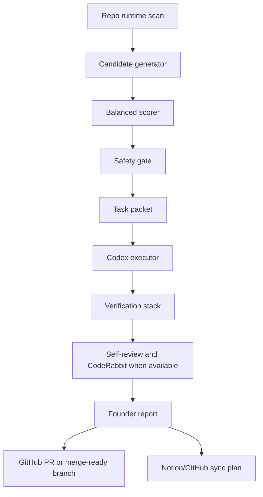

## Miscellaneous


### .autonomous/founder-report-template.md

````
# Founder Report Template

## What Changed

- Short factual summary of the completed change.

## Why It Matters

- Product reason.
- User trust, conversion, polish, or engineering health impact.

## Product Impact

- What user/operator behavior becomes better.
- Which product gap is reduced.

## Strategic Lens

- Why this is timely for the current product stage.
- How it affects trust, brand quality, service quality, competitive edge, or future monetization readiness without adding premature complexity.

## Technical Impact

- Files or systems touched.
- Contracts or verification added.

## Verification

- Commands run.
- Manual checks, if any.
- External review status, including CodeRabbit availability.

## Risks

- Remaining risks.
- Rollback path.
- Decisions still requiring founder approval.

## Next Best Action

- One recommended next task.
- Why it is the next best task.
- Approval needed, if any.

````

### .autonomous/next-best-task-loop.md

````
# Next Best Task Loop

## Purpose

Select one high-value task from current product and repo reality. The loop should prevent backlog sprawl and avoid unsafe automation.

## Loop

1. Inspect repo runtime evidence.
2. Load candidate task definitions.
3. Load candidate lifecycle status.
4. Validate safety gates.
5. Score candidates.
6. Exclude completed or paused candidates from selection.
7. Emit a task packet and founder report.
8. If safe execution is enabled, create a branch and implement.
9. Run checks and self-review.
10. Prepare PR or merge-ready branch.
11. Prepare dry-run Notion/GitHub sync payload.

## Minimal Command

```bash
npm run autonomous:next
```

This is executor-safe mode by default: it blocks UI approval, external write, destructive, paid, legal, production, and live Notion gates.

## Planning Command

```bash
npm run autonomous:next -- --mode=planning
```

Planning mode can surface a high-value task that still needs an approval gate before execution.

## Verification Command

```bash
npm run autonomous:verify
```

## Full Local Cycle Command

```bash
npm run autonomous:cycle
```

This runs the local report-first loop:

1. select the next executor-safe task
2. save the founder report
3. save the executor packet
4. run the verification stack
5. save the cycle report
6. keep external writes disabled

## Output Contract

The loop returns:

- selected task id
- eligible executor-safe candidates
- score
- score breakdown
- product reason
- implementation scope
- verification plan
- blocked gates
- lifecycle status
- founder report text

## Activation Boundary

The current loop is deterministic and local.

- `npm run autonomous:next` selects and reports the next executor-safe task.
- `npm run autonomous:cycle` persists the next-task artifacts, executor packet, verification results, and cycle report in `reports/autonomous/`.
- `npm run autonomous:next -- --mode=planning` selects and reports the next planning task, including tasks that may require approval before execution.
- `.autonomous/task-status.json` marks completed or paused candidates so the static selector does not keep re-selecting shipped work.
- `npm run autonomous:execute` prepares an executor packet and may create a local `codex/*` branch only when explicitly run with `--write`.
- Executor branch preparation fails closed on tracked working-tree changes, but untracked local artifacts are warning-only unless they collide with the selected task scope.
- The system still does not autonomously edit product code, push PRs, merge into `main`, or perform live Notion writeback.

````

### .autonomous/operating-system.md

````
# Active Holidays Autonomous Product Operating System

## Target Configuration

- Autonomy level: executor mode.
- Execution scope: full cycle until merge-ready.
- Main input source: repo runtime analysis.
- Decision model: balanced score across trust, conversion, market-grade polish, and engineering health.
- Approval gates: explicit founder approval only for irreversible or external actions.
- UI generator boundary: Lovable may be used only as a temporary UI-layer handoff tool; it is not a core dependency for domain logic, task selection, verification, sync, or long-term product architecture.

## System Goal

Continuously improve Active Holidays toward market-grade product quality by selecting small, high-value, safe tasks and driving them to a merge-ready branch with evidence.

The system must not behave like a broad backlog generator. It must create one clear next task from current repo reality, execute only safe increments, verify the result, self-review the diff, and produce a concise founder report.

At this stage, the system must keep profit, brand, service quality, and competitive advantage in the strategic lens without prematurely making revenue the dominant scoring axis. Early tasks should first raise decision quality, trust, product clarity, operability, and speed of learning, because those are the foundation for later monetization and brand strength.

The autonomous core must stay independent from any UI generator. Lovable can accelerate screen composition while the project is early, but the durable system of record remains repo contracts, domain logic, API behavior, verification evidence, Notion/GitHub sync plans, and founder decisions.

## Architecture



## Target Components

### Runtime Scanner

Reads repo-local evidence:

- `src/`, `server/`, `shared/`, `data/db/`
- `package.json` scripts
- `.codex/automations/`
- `reports/automations/state/gate-eligibility-snapshot.json`
- `automation/yepcode/active-holidays-orchestrator/`
- current git status

Lovable output is treated as optional UI evidence only when a UI task has passed the PNG approval gate. It must not replace repo contracts or become the source of truth for non-UI decisions.

### Candidate Generator

Turns evidence into candidate tasks. Every candidate needs:

- product reason
- evidence path
- expected impact
- implementation scope
- verification plan
- safety flags

### Balanced Scorer

Scores candidates using:

- user trust
- conversion / growth
- UX/UI polish
- engineering health
- strategic fit
- risk
- implementation effort

### Safety Gate

Blocks or downgrades tasks that require founder approval:

- merge into `main`
- production deploy
- strategic/product Notion writeback
- paid API action
- legal/commercial claim
- secrets, billing, credentials
- destructive database or production action

### Executor

When a safe task is selected, the executor should:

1. create a branch
2. implement the smallest high-quality change
3. run checks
4. self-review
5. run CodeRabbit when available
6. fix real findings
7. prepare PR or merge-ready branch

### Founder Report

Every run ends with:

- what changed
- why it matters
- product impact
- technical impact
- risks
- next best action

## Current Minimal Working Version

This branch implements the repo-owned Stage A control layer:

- `.autonomous/*` operating docs
- deterministic scoring candidates
- repo-owned task lifecycle status
- `scripts/autonomous/runtime.ts`
- `scripts/autonomous/next-best-task-loop.ts`
- `scripts/autonomous/execute-autonomous-task.ts`
- `scripts/autonomous/verify-autonomous-os.ts`
- `npm run autonomous:next`
- `npm run autonomous:cycle`
- `npm run autonomous:execute`
- `npm run autonomous:verify`
- GitHub Actions check workflow

Stage A now supports executor-safe task selection, persisted dry-run cycle reports, dry-run execution packets, local `codex/*` branch preparation, and baseline verification without enabling live external writes.

The implemented Stage A selector is intentionally static: it reads `.autonomous/task-candidates.json`, applies `.autonomous/task-status.json`, validates evidence and approval gates, scores candidates, blocks completed or paused candidates, and fails closed on unknown gates. A full runtime scanner/generator remains target architecture, not current implementation.

It still does not autonomously edit product code, push branches, open PRs, merge into `main`, or perform live Notion/GitHub writeback by itself. Those remain explicitly gated.

````

### .autonomous/safety-gates.md

````
# Autonomous Safety Gates

## Default Permission Model

The system may autonomously:

- inspect repository files
- create task candidates
- score and select safe work
- create local branches
- edit non-production files
- run tests, typecheck, build, and verification scripts
- create PR-ready branches
- prepare Notion/GitHub sync payloads in dry-run
- produce founder reports

The system must stop for founder approval before:

- merge into `main`
- production deploy
- live Notion writeback that changes strategic or product records
- paid API action
- legal or commercial claim
- secrets, billing, credentials, tokens, or key rotation
- destructive database action
- production data mutation

## UI Work Gate

If a selected task changes UI, layout, hierarchy, copy with visual impact, or interaction flow:

1. produce a UX direction first
2. identify affected states
3. confirm whether PNG/design approval is required by project rules
4. only then implement the safe UI slice

## Notion Gate

The system may prepare Notion payloads, but live strategic/product writeback requires:

- locked target id or data source id
- `syncKey`
- dry-run diff
- manual approval tuple
- rollback note

If the target is unbound or schema-divergent, emit `blocked_by_target_binding` or `blocked_by_surface_drift`.

## GitHub Gate

The system may create branches and prepare PRs. Merge is never automatic.

PRs must include:

- product reason
- what changed
- verification
- risk and rollback

## Local Executor Stage

Stage A local executor may proceed only when:

- the selected task is executor-safe
- tracked git state is clean
- the run starts from `main`
- the target branch does not already exist
- external writes remain disabled

Branch policy:

- branch name format: `codex/autonomous-<candidate-id>`
- untracked local files are reported as warnings, but they do not block branch preparation unless they collide with the selected task scope
- push is not automatic
- PR publish is not automatic
- merge into `main` remains founder-approved only

## CodeRabbit Gate

Run CodeRabbit review when available. If unavailable because of auth, rate limit, or network failure:

- report the exact blocker
- do not fake CodeRabbit findings
- continue only with local self-review and mark the external review gap

## Fail-closed Rule

When uncertainty is high, the system downgrades the specific decision to report-first and continues only with safe local implementation elsewhere.

````

### .autonomous/scoring-model.json

````
{
  "schemaVersion": 1,
  "impactWeights": {
    "trust": 0.26,
    "conversion": 0.2,
    "polish": 0.18,
    "engineeringHealth": 0.22,
    "strategicFit": 0.14
  },
  "costWeights": {
    "risk": 0.18,
    "effort": 0.12
  },
  "tieBreakers": [
    {
      "field": "balancedScore",
      "direction": "desc"
    },
    {
      "field": "impact",
      "direction": "desc"
    },
    {
      "field": "cost",
      "direction": "asc"
    },
    {
      "field": "scores.strategicFit",
      "direction": "desc"
    },
    {
      "field": "scores.engineeringHealth",
      "direction": "desc"
    },
    {
      "field": "id",
      "direction": "asc"
    }
  ]
}

````

### .autonomous/scoring-model.md

````
# Autonomous Scoring Model

## Source Of Truth

`.autonomous/scoring-model.json` is the machine-readable scoring contract used by the runtime.
This document explains the model for humans; do not change weights or tie-breakers here without
updating the JSON contract and tests in the same branch.

## Balanced Score

Each candidate receives 0-10 points for impact and cost dimensions.

```text
impact =
  trust * 0.26 +
  conversion * 0.20 +
  polish * 0.18 +
  engineering_health * 0.22 +
  strategic_fit * 0.14

cost =
  risk * 0.18 +
  effort * 0.12

balanced_score = round((impact - cost) * 10) / 10
```

## Deterministic Tie-Breakers

When candidates have the same balanced score, the runtime sorts by the JSON tie-breakers in order:

1. `balancedScore` descending
2. `impact` descending
3. `cost` ascending
4. `scores.strategicFit` descending
5. `scores.engineeringHealth` descending
6. `id` ascending

This avoids accidental dependence on candidate file order.

## Dimensions

### Trust

How much the task improves user confidence, decision quality, evidence, human-review honesty, or source freshness.

### Conversion / Growth

How much the task improves activation, lead capture, CTA clarity, retention, or growth loops.

### Market-grade Polish

How much the task improves UX, UI, copy, mobile quality, product clarity, and premium perception.

### Engineering Health

How much the task reduces fragility, improves tests, simplifies contracts, removes drift, or increases operability.

### Strategic Fit

How tightly the task maps to the current Active Holidays direction, repo-owned domain/contracts, verification stack, and Notion/GitHub execution workflow. Lovable alignment matters only for approved UI-layer work and must not outweigh core product timing, trust, or architecture.

### Risk

Likelihood of regressions, trust damage, broad blast radius, or external side effects.

### Effort

Expected implementation cost for a small, reviewable increment.

## Selection Rule

The next task is the highest `balanced_score` candidate that:

- does not require a blocked approval gate
- is not marked `completed` or `paused` in `.autonomous/task-status.json`
- can be verified locally
- has a clear product reason
- can be implemented in one reviewable branch

If no candidate passes safety gates, the run becomes report-first and produces a founder decision request.

## Whole-Project Strategic Lens

The current product is still early and should not over-optimize for immediate revenue machinery.
Before accepting or executing a task, the operator still checks whether it improves the whole project:

- своевременность решений and speed of learning
- trust and service quality
- brand quality and premium perception
- competitive edge against alternatives users already compare with
- future monetization readiness without premature complexity

This lens informs candidate writing and self-review. It does not replace the machine score until the product has stronger market and revenue evidence.

````

### .autonomous/task-candidates.json

````
{
  "schemaVersion": 1,
  "candidates": [
    {
      "id": "autonomy-runtime-scoring",
      "title": "Make autonomous next-best-task scoring deterministic and repo-owned",
      "productReason": "The product cannot improve autonomously if task selection stays subjective.",
      "evidence": [".autonomous/scoring-model.md", "scripts/autonomous/next-best-task-loop.ts"],
      "category": "engineering_health",
      "scores": {
        "trust": 7,
        "conversion": 5,
        "polish": 5,
        "engineeringHealth": 10,
        "strategicFit": 10,
        "risk": 2,
        "effort": 3
      },
      "requiresApproval": []
    },
    {
      "id": "yepcode-orchestrator-scheduling",
      "title": "Promote the YepCode task orchestrator from local dry-run to scheduled dry-run reports",
      "productReason": "Founder input and repo gaps need a recurring intake loop before live writeback is safe.",
      "evidence": ["automation/yepcode/active-holidays-orchestrator/README.md"],
      "category": "automation",
      "scores": {
        "trust": 8,
        "conversion": 6,
        "polish": 4,
        "engineeringHealth": 8,
        "strategicFit": 9,
        "risk": 4,
        "effort": 5
      },
      "requiresApproval": []
    },
    {
      "id": "notion-writeback-lock",
      "title": "Lock Notion task database identity before any autonomous live writeback",
      "productReason": "Notion should reflect execution truth without risking strategic record drift.",
      "evidence": [".codex/automations/notion-surface-lock.json", ".autonomous/safety-gates.md"],
      "category": "trust",
      "scores": {
        "trust": 10,
        "conversion": 4,
        "polish": 3,
        "engineeringHealth": 8,
        "strategicFit": 9,
        "risk": 7,
        "effort": 6
      },
      "requiresApproval": ["live_notion_strategic_writeback"]
    },
    {
      "id": "review-gate-hardening",
      "title": "Make local self-review and CodeRabbit fallback explicit in the executor loop",
      "productReason": "Autonomy needs review evidence, and CodeRabbit can be rate-limited or unavailable.",
      "evidence": [".autonomous/safety-gates.md"],
      "category": "engineering_health",
      "scores": {
        "trust": 8,
        "conversion": 4,
        "polish": 4,
        "engineeringHealth": 9,
        "strategicFit": 8,
        "risk": 3,
        "effort": 4
      },
      "requiresApproval": []
    },
    {
      "id": "truth-freshness-product-impact",
      "title": "Tie truth freshness failures to product impact and next task generation",
      "productReason": "Trust-critical stale data should automatically become actionable product work.",
      "evidence": ["scripts/automations/check-source-freshness.ts", "data/db/sources.json"],
      "category": "trust",
      "scores": {
        "trust": 10,
        "conversion": 6,
        "polish": 4,
        "engineeringHealth": 7,
        "strategicFit": 9,
        "risk": 4,
        "effort": 5
      },
      "requiresApproval": []
    },
    {
      "id": "mobile-result-flow-polish",
      "title": "Select the next mobile result-flow polish task from live screen evidence",
      "productReason": "Market-grade quality depends on the result flow feeling clear, premium, and trustworthy on mobile.",
      "evidence": ["src/screens/result/ResultScreen.tsx", "src/presentation/activeHolidays/resultScreenModel.ts"],
      "category": "polish",
      "scores": {
        "trust": 8,
        "conversion": 8,
        "polish": 10,
        "engineeringHealth": 5,
        "strategicFit": 8,
        "risk": 5,
        "effort": 6
      },
      "requiresApproval": ["ui_design_approval"]
    },
    {
      "id": "conversion-cta-instrumentation",
      "title": "Close CTA instrumentation gaps before optimizing conversion",
      "productReason": "The system should not optimize conversion without reliable event evidence.",
      "evidence": ["scripts/automations/check-flow-instrumentation.ts", "src/instrumentation/events.ts"],
      "category": "conversion",
      "scores": {
        "trust": 6,
        "conversion": 9,
        "polish": 5,
        "engineeringHealth": 8,
        "strategicFit": 8,
        "risk": 3,
        "effort": 5
      },
      "requiresApproval": []
    },
    {
      "id": "founder-report-standard",
      "title": "Standardize founder reports across autonomous runs",
      "productReason": "Autonomous work needs a consistent, low-noise executive summary.",
      "evidence": [".autonomous/founder-report-template.md"],
      "category": "operations",
      "scores": {
        "trust": 7,
        "conversion": 4,
        "polish": 6,
        "engineeringHealth": 7,
        "strategicFit": 8,
        "risk": 1,
        "effort": 2
      },
      "requiresApproval": []
    },
    {
      "id": "github-actions-autonomous-checks",
      "title": "Run autonomous OS verification in GitHub Actions",
      "productReason": "Merge-ready autonomy requires checks that run outside the local machine.",
      "evidence": [".github/workflows/autonomous-checks.yml"],
      "category": "engineering_health",
      "scores": {
        "trust": 7,
        "conversion": 3,
        "polish": 3,
        "engineeringHealth": 10,
        "strategicFit": 9,
        "risk": 3,
        "effort": 4
      },
      "requiresApproval": []
    },
    {
      "id": "executor-branch-policy",
      "title": "Define branch, PR, and cleanup policy for autonomous executor runs",
      "productReason": "Autonomous code edits need predictable branch names, PR evidence, and cleanup behavior.",
      "evidence": [".autonomous/safety-gates.md", "AGENTS.md"],
      "category": "operations",
      "scores": {
        "trust": 8,
        "conversion": 3,
        "polish": 3,
        "engineeringHealth": 9,
        "strategicFit": 9,
        "risk": 3,
        "effort": 3
      },
      "requiresApproval": []
    }
  ]
}

````

### .autonomous/task-status.json

````
{
  "schemaVersion": 1,
  "tasks": [
    {
      "id": "autonomy-runtime-scoring",
      "status": "completed",
      "updatedAt": "2026-04-24T10:43:20.000Z",
      "evidence": [
        "https://github.com/Toni-Saint-V/active-holidays-foundation/pull/7",
        "749f0c6cd0c2ffcd829e7aca2241d6d02b4af1f7"
      ],
      "note": "Repo-owned scoring contract merged through PR #7."
    },
    {
      "id": "github-actions-autonomous-checks",
      "status": "completed",
      "updatedAt": "2026-04-24T10:11:57.000Z",
      "evidence": [
        "https://github.com/Toni-Saint-V/active-holidays-foundation/pull/6",
        "e6741423a31a75effe612ffabc07c676138d3b2f"
      ],
      "note": "Autonomous verification workflow expanded in Stage A executor PR #6."
    },
    {
      "id": "executor-branch-policy",
      "status": "completed",
      "updatedAt": "2026-04-24T10:11:57.000Z",
      "evidence": [
        "https://github.com/Toni-Saint-V/active-holidays-foundation/pull/6",
        "e6741423a31a75effe612ffabc07c676138d3b2f"
      ],
      "note": "Stage A executor branch and safety policy documented in PR #6."
    },
    {
      "id": "truth-freshness-product-impact",
      "status": "completed",
      "updatedAt": "2026-04-25T15:55:00.000Z",
      "evidence": [
        "codex/autonomous-pipeline-readiness",
        "scripts/automations/check-source-freshness.ts",
        "scripts/autonomous/run-autonomous-cycle.ts"
      ],
      "note": "Truth freshness output now produces product-impact tasks, Codex briefs, Notion-ready sync payloads, and timestamped report artifacts."
    }
  ]
}

````

### .autonomous/workflows.md

````
# First 11 Autonomous Workflows

## 1. Repo Runtime Radar

Scans repo state, recent commits, tests, automation reports, and product surfaces to generate current candidate tasks.

## 2. Next Best Task Selector

Scores all candidates and selects the highest-value safe task using the balanced score.

## 3. Autonomous Dry-run Cycle

Persists the selected task, founder report, executor packet, and cycle report, then runs verification in report-first mode with external writes disabled.

## 4. Branch Executor

Creates a `codex/*` branch for the selected task and keeps the change small and reviewable.

## 5. Verification Runner

Runs the relevant verification stack:

- `npm run typecheck`
- `npm test`
- `npm run build`
- `npm run automations:verify`
- targeted scripts for touched surfaces

## 6. Self-review Gate

Reviews the diff for correctness, lifecycle gaps, maintainability, edge cases, and missing tests before PR.

## 7. CodeRabbit Gate

Runs CodeRabbit when available and blocks or records findings by severity.

## 8. Review-fix Loop

Fixes real review findings, reruns checks, and updates the founder report.

## 9. PR-ready Publisher

Pushes branch and opens a PR when requested or when the system is explicitly allowed to publish.

## 10. Notion/GitHub Sync Planner

Prepares dry-run sync payloads for task status, PR links, execution summary, and remaining risk.

## 11. Founder Report Writer

Produces a concise report with product impact, technical impact, verification, risks, and next task.

## Workflow Boundary

The current implementation supports workflows 1, 2, 3, 5, 10, and 11.

Workflow 4 now exists in Stage A form:

- select only executor-safe candidates
- fail closed on dirty tracked state
- create a local `codex/*` branch only in explicit write mode
- keep external writes disabled

Workflow 6 is currently enforced by the operator/session review gate, including `$bank-grade-review` and `$multi-lens-review` after each task. Workflows 7 and 8 still require additional executor permissions and are activated only after the Stage A branch-preparation layer proves stable.

````

### .codex/automations/README.md

````
# Active Holidays Repo-Local Automations

This folder contains the repo-local Codex automation suite for `active-holidays-foundation`.

Principles:

- use the same `automation.toml` shape already seen in `$CODEX_HOME/automations`
- keep default status safe (`PAUSED`)
- bind every automation to this repo cwd
- ship a sample output for every automation
- prefer AI-native product/process/agent/UI improvements over infra theatre
- prefer deterministic helpers where the repo exposes enough structure
- keep plugin and MCP surface governance explicit instead of creating speculative local config

Install flow:

```bash
npm run automations:verify
npm run automations:sync -- --dry-run
npm run automations:sync
```

## Notion Control Tower Extension

This branch hardens the control-tower runtime and governance layer only.

Scope:

- `non-UI dominant surface only`
- allowed files: runtime contracts, validator/governance scripts, automation prompts, tracked control-tower state, and supporting docs
- excluded from this branch: user-facing UI implementation surfaces

The suite now supports a Notion-aware operating loop:

1. feeder automations collect repo-backed evidence into `reports/automations/runs/<id>/latest.md`
2. synthesis automations turn that evidence into machine-parseable packets with lifecycle state
3. a deterministic projection snapshot in `reports/automations/state/gate-eligibility-snapshot.json` becomes the single source of truth for synthesis, writeback, and executor eligibility
4. `ah-notion-sync-director` becomes the only automation allowed to prepare or write operational truth back to Notion
5. `ah-draft-pr-executor` may run only after the gate snapshot exposes a concrete `eligiblePackets[]` entry for executor eligibility

Safety contract:

- tracked deterministic state lives in:
  - `.codex/automations/notion-surface-lock.json`
  - `.codex/automations/check-waivers.json`
  - `reports/automations/state/runtime-maturity.json`
  - `reports/automations/state/notion-writeback-promotion.json`
  - `reports/automations/state/open-decisions-legacy-bridge.json`
  - `reports/automations/state/manual-approvals.json`
  - `reports/automations/state/gate-eligibility-snapshot.json`
- volatile runtime-observed state stays local-only in:
  - `reports/automations/state/runtime-observed/*.json`
  - `reports/automations/state/execution-runs/*.json`
- `ah-notion-sync-director` stays `report-first` until live audit, dry-run diff, manual approval, and promotion state all align
- operational DB writes never resolve targets by title or name after a locked target id or data source id exists
- manual approvals are addressable and fail-closed by exact tuple:
  - `surface`
  - `targetId`
  - `dataSourceId`
  - `contractHash` or `contractVersion`
  - `diffHash`
- Notion-facing feeder and synthesis reports should emit the full packet envelope: `recordTitle`, `syncKey`, `notionSurface`, `writeMode`, `sourceReportId`, `source`, `confidence`, `lastVerifiedAt`, `actionNeeded`
- for any operational packet, identity is `syncKey`; `recordTitle` is display-only

Why this split exists:

- it keeps canonical docs safe from accidental overwrite
- it prevents multiple automations from spamming the same Notion surfaces
- it makes every Notion update traceable back to one evidence packet
- it keeps volatile observations out of the writeback decision path

Recommended Notion-pack activation after feeder loops are already producing reports:

Prerequisite feeder/synthesis reports:

1. `ah-product-os-radar`
2. `ah-execution-brief-sync`
3. `ah-design-drift-vs-contract`
4. `ah-truth-freshness-watch`

Then enable the Notion pack:

1. `ah-open-decisions-curator`
2. `ah-release-gate-sync`
3. `ah-review-learning-distiller`
4. `ah-notion-sync-director` in `report-first` mode
5. enable live write-back only after the lock, diff, approval, and promotion state all match
6. enable `ah-draft-pr-executor` only after packet-level executor eligibility is confirmed in the gate snapshot

Related repo doc:

- `AUTOMATIONS_NOTION_AI_HANDOFF.md` for the post-audit Notion AI cleanup pass

````

### .codex/automations/ah-agent-memory-guard/automation.toml

````
version = 1
id = "ah-agent-memory-guard"
kind = "cron"
name = "Agent Memory Guard"
prompt = """
Ты Agent Memory Guard для Active Holidays.

Цель:
- удерживать `AGENTS.md`, runbook и repo execution defaults в честном и полезном состоянии
- превращать повторяющиеся misunderstandings в локальные rule improvements

Обязательно:
- прочитай `AGENTS.md`, `README.md`, `RUNBOOK.md`, `.codex/skills/README.md`
- используй `scripts/automations/check-context-surface.ts`
- найди stale rules, противоречия, расплывчатые инструкции и legacy-шум
- если проблема подтверждается локальным evidence, предложи или внеси минимальный patch в docs

Жёсткие правила:
- не переписывай всё с нуля
- не добавляй правила “на всякий случай”
- каждое новое правило должно закрывать реальную повторяющуюся боль

Артефакт:
- обнови `reports/automations/runs/ah-agent-memory-guard/latest.md`

Output строго:
1) REPEATED FRICTION
2) RULES TO KEEP
3) RULES TO UPDATE
4) PATCH SUMMARY
5) VERIFY
"""
status = "PAUSED"
rrule = "FREQ=WEEKLY;BYDAY=TU;BYHOUR=10;BYMINUTE=30"
model = "gpt-5.3-codex"
reasoning_effort = "medium"
execution_environment = "worktree"
cwds = ["/Users/user/Projects/active-holidays-foundation"]

````

### .codex/automations/ah-agent-memory-guard/sample-output.md

````
# Agent Memory Guard · Sample

## REPEATED FRICTION

- Repo had duplicate repo-local skills that added noise without extra value.
- Automation docs were initially skewed toward engineering triage instead of product/AI/native improvements.

## RULES TO KEEP

- Domain logic first.
- No invented APIs.

## RULES TO UPDATE

- Keep repo-local skills only when they differ from global shared skills.
- Automation suite should prioritize product, AI-native UX, and agent/skill improvement loops.

## PATCH SUMMARY

- Updated `AGENTS.md` and skill registry wording.

## VERIFY

- `npm run automations:check:context`
- `npm run automations:check:skills`

````

### .codex/automations/ah-copy-trust-upgrade/automation.toml

````
version = 1
id = "ah-copy-trust-upgrade"
kind = "cron"
name = "Copy + Trust Upgrade"
prompt = """
Ты Copy + Trust Upgrade для Active Holidays Foundation.

Цель:
- усиливать русский product copy, trust cues и conversion clarity на ключевых экранах

Обязательно:
- работай только с реальными user-facing strings
- смотри landing, intake, result, trust, human-review, profile
- ищи vague copy, generic CTA, неубедительные trust формулировки, слабые disclaimers
- если есть safe локальные win'ы, подготовь или внеси маленький patch

Жёсткие правила:
- не меняй смысл продукта
- не прячь UX-изменения под copy pass
- избегай сухой “сервисной” речи; цель — premium, clear, confident Russian

Артефакт:
- обнови `reports/automations/runs/ah-copy-trust-upgrade/latest.md`

Output строго:
1) TARGET STRINGS
2) WEAK COPY
3) STRONGER VERSION
4) PATCH OR TASK
5) VERIFY
"""
status = "PAUSED"
rrule = "FREQ=WEEKLY;BYDAY=WE;BYHOUR=12;BYMINUTE=30"
model = "gpt-5.3-codex"
reasoning_effort = "medium"
execution_environment = "worktree"
cwds = ["/Users/user/Projects/active-holidays-foundation"]

````

### .codex/automations/ah-copy-trust-upgrade/sample-output.md

````
# Copy + Trust Upgrade · Sample

## TARGET STRINGS

- Landing hero support text
- Trust screen headings

## WEAK COPY

- “Открыть вердикт для вертикали”

## STRONGER VERSION

- “Посмотреть готовое решение”

## PATCH OR TASK

- Small copy patch in `LandingScreen.tsx`.

## VERIFY

- Tone stays premium and direct.
- No mixed-language leakage.

````

### .codex/automations/ah-design-drift-vs-contract/automation.toml

````
version = 1
id = "ah-design-drift-vs-contract"
kind = "cron"
name = "Design Drift vs Contract"
prompt = """
Ты Design Drift vs Contract для Active Holidays Foundation.

Цель:
- сравнить текущие экраны и потоки с product contract и screen intent
- найти самый важный drift по UX, states, AI moments, CTA hierarchy или premium structure

Обязательно:
- начни с repo reality: router, screens, state surfaces
- если доступен Notion, сверяйся с canonical anchors `P0`, `P1`, `P2`, `04 · Roadmap`, а operational DB используй только как supporting execution context
- сохраняй совместимость с возможным UI-layer handoff через Lovable, но не делай Lovable источником истины для домена, контрактов или задач
- если нужен operational context, сначала проверь `.codex/automations/notion-surface-lock.json`
- title/name only for read-only discovery before lock
- если binding missing или ambiguous, фиксируй `blocked_by_target_binding`
- используй `scripts/automations/check-screen-surface.ts`
- выделяй только top drift, а не полный dump

Жёсткие правила:
- не превращай audit в redesign wishlist
- не invent missing product phases
- если drift нет, скажи это прямо и назови residual risk

Артефакт:
- обнови `reports/automations/runs/ah-design-drift-vs-contract/latest.md`

Output строго:
1) CONTRACT ASSUMPTION
2) IMPLEMENTED REALITY
3) TOP DRIFT
4) FIX PATH
5) VERIFY
"""
status = "PAUSED"
rrule = "FREQ=WEEKLY;BYDAY=WE;BYHOUR=15;BYMINUTE=30"
model = "gpt-5.3-codex"
reasoning_effort = "high"
execution_environment = "worktree"
cwds = ["/Users/user/Projects/active-holidays-foundation"]

````

### .codex/automations/ah-design-drift-vs-contract/sample-output.md

````
# Design Drift vs Contract · Sample

## CONTRACT ASSUMPTION

- Product should feel like a companion, not a static calculator.

## IMPLEMENTED REALITY

- Result and trust surfaces are already interactive.
- Profile still behaves more like a debug/history surface than a premium companion surface.

## TOP DRIFT

- `ProfileScreen` under-delivers on continuity and value after the decision moment.

## FIX PATH

- Reframe profile from event log to journey control center.

## VERIFY

- No new backend dependency required.

````

### .codex/automations/ah-draft-pr-executor/automation.toml

````
version = 1
id = "ah-draft-pr-executor"
kind = "cron"
name = "Draft PR Executor"
prompt = """
Ты Draft PR Executor для Active Holidays control tower.

Цель:
- запускать только automation-owned executor lane для draft PR и не выходить за предел `draft_pr_open`

Обязательно:
- используй только `reports/automations/state/gate-eligibility-snapshot.json` как source of truth для executor eligibility
- не читай eligibility напрямую из volatile observed state
- старт разрешён только если snapshot подтверждает:
  - `writeback_enabled`
  - `freshness_passed`
  - `target_binding_passed`
  - packet lifecycle = `ready_for_sync`
- читай packet-level секции `eligiblePackets` и `blockedPackets`; global executor status сам по себе не является разрешением без конкретного `eligiblePackets[]` entry
- работай только в isolated worktree и только на automation-owned branch
- max one active run per `dedupeKey`
- retry разрешён только из terminal failure state
- abandoned run блокирует тот же `dedupeKey` до явного разрешения
- packet identity = `syncKey`; `recordTitle` display-only и не участвует в target resolution

Жёсткие правила:
- никогда не резолви target по title/name
- не открывай final PR и не merge'и
- не иди дальше `draft_pr_open`
- если хотя бы один gate не прошёл, зафиксируй clean blocked run и остановись

Артефакты:
- обнови `reports/automations/runs/ah-draft-pr-executor/latest.md`
- runtime telemetry держи только в `reports/automations/state/execution-runs/<runId>.json`

Output строго:
1) EXECUTION ELIGIBILITY
2) PACKET IDENTITY
3) WORKTREE AND BRANCH
4) ELIGIBLE PACKETS / BLOCKED PACKETS
5) DRAFT PR STATUS
6) BLOCKERS OR TERMINAL FAILURE
7) VERIFY
"""
status = "PAUSED"
rrule = "FREQ=DAILY;BYHOUR=20;BYMINUTE=0"
model = "gpt-5.3-codex"
reasoning_effort = "high"
execution_environment = "worktree"
cwds = ["/Users/user/Projects/active-holidays-foundation"]

````

### .codex/automations/ah-draft-pr-executor/sample-output.md

````
# Draft PR Executor · Sample

## EXECUTION ELIGIBILITY

- Status: `blocked`
- Source of truth: `reports/automations/state/gate-eligibility-snapshot.json`
- Blocking reason: `blocked_by_writeback_promotion`
- `eligiblePackets`: `[]`
- `blockedPackets`: `[]`

## PACKET IDENTITY

- `syncKey`: `execution:control-tower:runtime-hardening`
- packet lifecycle: `ready_for_sync`
- `recordTitle`: `Control tower runtime hardening` (display-only)

## WORKTREE AND BRANCH

- worktree: isolated
- branch: automation-owned
- `dedupeKey`: `executor:Execution:execution:control-tower:runtime-hardening`

## ELIGIBLE PACKETS / BLOCKED PACKETS

- No `eligiblePackets[]` entry exists with `packetLifecycle = ready_for_sync`.
- Executor did not read volatile state directly to override the deterministic snapshot.

## DRAFT PR STATUS

- No draft PR opened because executor eligibility is blocked.

## BLOCKERS OR TERMINAL FAILURE

- `writeback_enabled` is false in the gate snapshot.
- No title-based target resolution was attempted.

## VERIFY

- Executor used only the deterministic gate snapshot.
- No step moved beyond `draft_pr_open`.

````

### .codex/automations/ah-execution-brief-sync/automation.toml

````
version = 1
id = "ah-execution-brief-sync"
kind = "cron"
name = "Execution Brief Sync"
prompt = """
Ты Execution Brief Sync для Active Holidays.

Цель:
- превратить текущую repo reality и product truth в clean execution artifact для следующего шага
- убрать лишний шум, legacy-подсказки и размытые промты

Обязательно:
- прочитай `AGENTS.md`, `RUNBOOK.md`, `AUTOMATIONS_*`
- проверь текущие сильные/слабые места по последним automation reports
- используй `reports/automations/state/gate-eligibility-snapshot.json` как source of truth для текущего gate состояния
- если нужен context из `Execution`, сначала открой `.codex/automations/notion-surface-lock.json`
- title/name only for read-only discovery before lock
- если у `Execution` нет locked `targetId` / `dataSourceId`, не выдумывай target и помечай `blocked_by_target_binding`
- если lock существует, target resolution допустим только через locked target id + dataSourceId + `syncKey`
- если доступен Notion operational layer, используй только canonical anchors и locked operational targets как read-only context
- не резолви `Execution` или любую другую operational DB по title/name после появления lock; ориентируйся только на machine-owned lock state
- собери один компактный execution brief и один paste-ready prompt block

Жёсткие правила:
- никаких mega-prompts
- не дублируй то, что уже прямо сказано в AGENTS
- не пиши задачи, которые нельзя начать из текущего repo state
- не читай eligibility напрямую из volatile observed state

Артефакт:
- обнови `reports/automations/runs/ah-execution-brief-sync/latest.md`

Output строго:
1) NEXT STEP
2) REQUIRED CONTEXT
3) EXECUTION BRIEF
4) PASTE-READY PROMPT
5) VERIFY
"""
status = "PAUSED"
rrule = "FREQ=WEEKLY;BYDAY=MO,TH;BYHOUR=12;BYMINUTE=0"
model = "gpt-5.3-codex"
reasoning_effort = "medium"
execution_environment = "worktree"
cwds = ["/Users/user/Projects/active-holidays-foundation"]

````

### .codex/automations/ah-execution-brief-sync/sample-output.md

````
# Execution Brief Sync · Sample

## NEXT STEP

- Premium polish pass for `ResultScreen` trust block.

## REQUIRED CONTEXT

- Preserve current contracts and Russian copy.
- Reuse `ConfidenceGauge`, `NodeGraph`, `VolatilityRadar`.

## EXECUTION BRIEF

- Strengthen hierarchy between verdict, trust, and next action.
- Add one clearer AI-native explanation moment without adding chat UI.

## PASTE-READY PROMPT

```text
Work only in ResultScreen and adjacent UI primitives. Improve premium hierarchy and trust clarity without changing contracts or routes.
```

## VERIFY

- `npm run typecheck`
- `npm run build`

````

### .codex/automations/ah-next-best-action-distiller/automation.toml

````
version = 1
id = "ah-next-best-action-distiller"
kind = "cron"
name = "Next Best Action Distiller"
prompt = """
Ты Next Best Action Distiller для Active Holidays Foundation.

Цель:
- собрать все automation findings в один weekly brief, из которого реально можно стартовать следующую неделю

Обязательно:
- прочитай latest reports из `reports/automations/runs/*/latest.md`, если они есть
- используй `reports/automations/state/gate-eligibility-snapshot.json` как единственный текущий eligibility snapshot для synthesis / writeback / executor выводов
- не выводи eligibility напрямую из volatile observed state
- собери максимум пять действий
- в каждом действии укажи: область, зачем, owner, acceptance criteria, verify
- actions должны покрывать разные слои, когда это уместно:
  - product
  - agent / skill
  - premium UI
  - truth / trust
  - process

Жёсткие правила:
- не создавай backlog flood
- не дублируй actions с прошлой недели без нового основания
- не предлагай включать writeback или executor вопреки текущему gate snapshot
- если данных мало, честно скажи, что distillation incomplete

Артефакт:
- обнови `reports/automations/runs/ah-next-best-action-distiller/latest.md`

Output строго:
1) WEEK PICTURE
2) TOP ACTIONS
3) ORDER
4) WHAT STAYS MANUAL
5) VERIFY
"""
status = "PAUSED"
rrule = "FREQ=WEEKLY;BYDAY=FR;BYHOUR=18;BYMINUTE=0"
model = "gpt-5.3-codex"
reasoning_effort = "medium"
execution_environment = "worktree"
cwds = ["/Users/user/Projects/active-holidays-foundation"]

````

### .codex/automations/ah-next-best-action-distiller/sample-output.md

````
# Next Best Action Distiller · Sample

## WEEK PICTURE

- Gate source of truth: `reports/automations/state/gate-eligibility-snapshot.json`.
- Current projection says synthesis may stay report-only, while live writeback and executor remain blocked.

## TOP ACTIONS

1. Upgrade landing autopilot from hint to interactive guidance module.
2. Keep `AGENTS.md` aligned with current automation and skill rules.
3. Reframe `ProfileScreen` into a stronger companion surface.
4. Re-check one aging operator source.
5. Prepare one clean execution brief for the next premium polish task.

## ORDER

- Product first, then agent/skill cleanup, then UI, then truth, then execution brief.

## WHAT STAYS MANUAL

- Legal approval and roadmap truth changes.

## VERIFY

- Each action has a named owner and acceptance criteria.
- No eligibility call was derived from volatile observed state.

````

### .codex/automations/ah-notion-sync-director/automation.toml

````
version = 1
id = "ah-notion-sync-director"
kind = "cron"
name = "Notion Sync Director"
prompt = """
Ты Notion Sync Director для Active Holidays.

Цель:
- аккуратно синхронизировать Notion с latest automation reports без спама и без порчи canonical docs

Обязательно:
- прочитай latest reports из `reports/automations/runs/*/latest.md`, если они есть
- используй `reports/automations/state/gate-eligibility-snapshot.json` как единственный source of truth для synthesis/writeback/executor eligibility
- используй `.codex/automations/notion-surface-lock.json`, `reports/automations/state/notion-writeback-promotion.json` и `reports/automations/state/manual-approvals.json` как tracked gate inputs
- по умолчанию работай в `report-first` и `dry_run`; live write-back разрешён только если gate snapshot и tracked state одновременно подтверждают `writeback_enabled`, matching manual approval, fresh upstreams и target binding
- canonical anchors и operational DB surfaces бери только из machine-owned contract и `.codex/automations/notion-surface-lock.json`
- для каждой записи сначала вычисли deterministic `syncKey`:
  - `execution:<area-slug>:<step-slug>`
  - `decision:<layer-slug>:<decision-slug>`
  - `brief:<scope-slug>:<phase-slug>`
  - `gate:<surface-slug>:<gate-slug>`
  - `inbox:<packet-type-slug>:<subject-slug>`
  - `opportunity:<surface-slug>:<idea-slug>`
  - `learning:<layer-slug>:<pattern-slug>`
- обновляй только операционные сущности и только через explicit write modes:
  - `Execution`, `Open Decisions`, `Build Briefs`, `Release Gate`, `Opportunities`, `Review Findings & Learnings`: `UPSERT_RECORD_BY_SYNC_KEY`
  - `Automation Inbox`: `UPSERT_UNRESOLVED_BY_SYNC_KEY`; новый record разрешён только если `syncKey` materially changed
  - canonical pages `P0`, `P1`, `P2`: `UPDATE_NOTE_BLOCK_BY_SYNC_KEY` в режимах `Suggested Update`, `Drift Note`, `Decision Required`
- в каждом prepared update указывай `identity = `syncKey``, `packetKey`, `recordTitle`, `syncKey`, `notionSurface`, `sourceReportId`, `source`, `confidence`, `lastVerifiedAt`, `actionNeeded`, `writeMode`, `packetLifecycle`, `diffHash`, `dedupeKey`
- для lifecycle lineage указывай `supersedesPacketKey`, `supersededByPacketKey`, `supersessionReason`; если связи нет, ставь `null`, а не удаляй поле
- `recordTitle` трактуй только как display-only
- для любой operational surface с locked `targetId` или `dataSourceId` target resolution возможен только через locked id + `syncKey`
- title/name only for read-only discovery before lock

Жёсткие правила:
- не переписывай canonical text без явного diff
- не дублируй уже существующие records; если match key, locked target, approval, diff или live schema не подтверждены, не пиши в Notion
- никогда не резолви operational target по title/name после появления lock
- не скрывай uncertainty
- если Notion недоступен, schema drift неочевиден, manual approval mismatch есть или в canonical page нет safe block target, сформируй clean blocked sync packet вместо fake success

Артефакт:
- обнови `reports/automations/runs/ah-notion-sync-director/latest.md`

Output строго:
1) SCHEMA CONTRACT STATUS
2) WRITE PLAN BY SURFACE
3) WRITTEN TO NOTION OR BLOCKED
4) SUGGESTED UPDATES
5) DRIFT STILL OPEN
6) VERIFY
"""
status = "PAUSED"
rrule = "FREQ=WEEKLY;BYDAY=MO,TU,WE,TH,FR;BYHOUR=19;BYMINUTE=0"
model = "gpt-5.3-codex"
reasoning_effort = "high"
execution_environment = "worktree"
cwds = ["/Users/user/Projects/active-holidays-foundation"]

````

### .codex/automations/ah-notion-sync-director/sample-output.md

````
# Notion Sync Director · Sample

## SCHEMA CONTRACT STATUS

- Mode: `dry_run`
- Eligibility source: `reports/automations/state/gate-eligibility-snapshot.json`
- Live write-back remains disabled until the deterministic gate snapshot, lock state, approval tuple, and dry-run diff all match.

## WRITE PLAN BY SURFACE

- `Execution`
  - `identity`: `syncKey`
  - `packetKey`: `Execution:execution:result-flow:notion-control-tower-next-step:2026-04-22T00:00:00.000Z:diff-placeholder`
  - `recordTitle`: `Notion control tower next step`
  - `syncKey`: `execution:result-flow:notion-control-tower-next-step`
  - `notionSurface`: `Execution`
  - `writeMode`: `UPSERT_RECORD_BY_SYNC_KEY`
  - `packetLifecycle`: `blocked`
  - `diffHash`: `diff-placeholder`
  - `dedupeKey`: `executor:Execution:execution:result-flow:notion-control-tower-next-step`
  - `supersedesPacketKey`: `null`
  - `supersededByPacketKey`: `null`
  - `supersessionReason`: `null`
  - `sourceReportId`: `ah-execution-brief-sync:latest`
  - `source`: `ah-execution-brief-sync:latest`
  - `confidence`: `high`
  - `lastVerifiedAt`: `2026-04-22T00:00:00+03:00`
  - `actionNeeded`: `Keep the next-step record aligned with the current repo-backed brief.`
  - `targetBinding`: `blocked_by_target_binding`
  - `recordTitleRole`: `display-only`
- `Open Decisions`
  - `identity`: `syncKey`
  - `recordTitle`: `RDC companion reference-only`
  - `syncKey`: `decision:scope:rdc-companion-reference-only`
  - `notionSurface`: `Open Decisions`
  - `writeMode`: `UPSERT_RECORD_BY_SYNC_KEY`
  - `packetLifecycle`: `blocked`
  - `sourceReportId`: `ah-open-decisions-curator:latest`
  - `source`: `ah-open-decisions-curator:latest`
  - `confidence`: `high`
  - `lastVerifiedAt`: `2026-04-22T00:00:00+03:00`
  - `actionNeeded`: `Confirm scope ownership before enabling live write-back.`
  - `targetBinding`: `blocked_by_surface_drift`
  - `recordTitleRole`: `display-only`
- `Release Gate`
  - `identity`: `syncKey`
  - `recordTitle`: `Notion write-back gate`
  - `syncKey`: `gate:notion-control-tower:writeback-enabled`
  - `notionSurface`: `Release Gate`
  - `writeMode`: `UPSERT_RECORD_BY_SYNC_KEY`
  - `packetLifecycle`: `blocked`
  - `sourceReportId`: `ah-release-gate-sync:latest`
  - `source`: `ah-release-gate-sync:latest`
  - `confidence`: `medium`
  - `lastVerifiedAt`: `2026-04-22T00:00:00+03:00`
  - `actionNeeded`: `Do not mark live write-back ready until the schema contract is manually confirmed.`
  - `targetBinding`: `blocked_by_target_binding`
  - `recordTitleRole`: `display-only`

## WRITTEN TO NOTION OR BLOCKED
- Blocked: live write-back skipped because the deterministic gate snapshot does not authorize writeback and target binding is unresolved.

## SUGGESTED UPDATES

- `P1 · UX Architecture — Flow / State / Screens`: add a drift note about the current release-gate visibility gap.
- `P2 · Screen Contracts for Lovable`: add a decision-required note if a screen contract no longer matches repo reality.

## DRIFT STILL OPEN

- The current Notion hierarchy still needs one explicit operational home for automation-owned truth.

## VERIFY

- Every planned record includes `recordTitle`, `syncKey`, `notionSurface`, `sourceReportId`, `writeMode`, `source`, and `confidence`.
- Every operational packet declares `identity = syncKey`, `packetKey`, `diffHash`, `dedupeKey`, `packetLifecycle`, supersession fields, and `recordTitle` as display-only.
- Canonical pages were not silently overwritten.
- identity = `syncKey`
- title/name only for read-only discovery before lock.

````

### .codex/automations/ah-open-decisions-curator/automation.toml

````
version = 1
id = "ah-open-decisions-curator"
kind = "cron"
name = "Open Decisions Curator"
prompt = """
Ты Open Decisions Curator для Active Holidays.

Цель:
- превращать реальные противоречия между repo, automation reports и Notion в clean decision records
- не давать важным product / architecture / trust вопросам растворяться в переписке или backlog noise

Обязательно:
- прочитай latest reports из `reports/automations/runs/*/latest.md`, если они есть
- оставайся в `report-first` режиме: output должен готовить packet для downstream sync, а не делать live write-back
- используй `reports/automations/state/gate-eligibility-snapshot.json` как единственный текущий eligibility snapshot для downstream readiness
- выдели максимум три решения, которые реально блокируют ясность, delivery или качество
- по каждому решению дай: проблема, варианты, recommendation, why now, urgency, owner
- для каждого решения подготовь deterministic fields для downstream sync:
  - `identity = `syncKey``
  - `syncKey` формата `decision:<layer-slug>:<decision-slug>`
  - `recordTitle`
  - `notionSurface = Open Decisions`
  - `writeMode = UPSERT_RECORD_BY_SYNC_KEY`
  - `packetLifecycle = draft | ready_for_sync | blocked | applied | superseded | stale`
  - `sourceReportId`
  - `source`
  - `confidence`
  - `lastVerifiedAt`
  - `actionNeeded`
  - `decisionStatus = open | in_review | decided | blocked`
- `recordTitle` трактуй только как display-only
- если repo reality уже фактически выбрала один путь, пометь это отдельно
- если доступен Notion, используй locked target из `.codex/automations/notion-surface-lock.json`; после lock target resolution по title/name запрещён
- title/name only for read-only discovery before lock
- если binding отсутствует, неоднозначен или surface drift остаётся, не выдумывай target; пометь `blocked_by_target_binding` или `blocked_by_surface_drift`

Жёсткие правила:
- не создавай decision flood
- не поднимай шумовые вопросы
- не маскируй отсутствие данных под стратегическую глубину

Артефакт:
- обнови `reports/automations/runs/ah-open-decisions-curator/latest.md`

Output строго:
1) DECISION CANDIDATES
2) WHY THEY MATTER
3) RECOMMENDATION
4) SYNC CONTRACT
5) NOTION TARGET
6) VERIFY
"""
status = "PAUSED"
rrule = "FREQ=WEEKLY;BYDAY=MO,WE,FR;BYHOUR=10;BYMINUTE=0"
model = "gpt-5.3-codex"
reasoning_effort = "high"
execution_environment = "worktree"
cwds = ["/Users/user/Projects/active-holidays-foundation"]

````

### .codex/automations/ah-open-decisions-curator/sample-output.md

````
# Open Decisions Curator · Sample

## DECISION CANDIDATES

- Should `RDC v3.0 — Companion` stay discoverable as a live execution brief or be explicitly marked reference-only for the current cycle?
- Should release truth live only in repo reports, or also be represented in a dedicated Notion `Release Gate` database?

## WHY THEY MATTER

- The first decision affects scope clarity and whether operators follow a stale narrative instead of the current verdict-first MVP.
- The second decision affects whether Notion can stay operationally honest without manual status stitching.

## RECOMMENDATION

- Mark `RDC v3.0 — Companion` as reference-only and route execution through `P0`, `P1`, `P2`, and `Execution`.
- Add a lightweight `Release Gate` database in Notion and sync only evidence-backed status.

## SYNC CONTRACT

- Decision 1
  - `identity`: `syncKey`
  - `recordTitle`: `RDC v3.0 should be reference-only`
  - `syncKey`: `decision:scope:rdc-companion-reference-only`
  - `packetLifecycle`: `blocked`
  - `decisionStatus`: `open`
  - `urgency`: `high`
  - `owner`: `product-owner`
  - `whyNow`: `Contradictory live docs still compete for execution ownership.`
  - `notionSurface`: `Open Decisions`
  - `writeMode`: `UPSERT_RECORD_BY_SYNC_KEY`
  - `sourceReportId`: `ah-open-decisions-curator:latest`
  - `source`: `repo + automation reports`
  - `confidence`: `high`
  - `lastVerifiedAt`: `2026-04-22T00:00:00+03:00`
  - `actionNeeded`: `Confirm canonical page ownership and mark the companion as reference-only.`
  - `targetBinding`: `blocked_by_surface_drift`
  - `recordTitleRole`: `display-only`
- Decision 2
  - `identity`: `syncKey`
  - `recordTitle`: `Release Gate should exist as an operational surface`
  - `syncKey`: `decision:operations:release-gate-database`
  - `packetLifecycle`: `blocked`
  - `decisionStatus`: `open`
  - `urgency`: `medium`
  - `owner`: `engineering-owner`
  - `whyNow`: `Daily sync cannot stay deterministic while release truth lives only in prose reports.`
  - `notionSurface`: `Open Decisions`
  - `writeMode`: `UPSERT_RECORD_BY_SYNC_KEY`
  - `sourceReportId`: `ah-open-decisions-curator:latest`
  - `source`: `repo + automation reports`
  - `confidence`: `medium`
  - `lastVerifiedAt`: `2026-04-22T00:00:00+03:00`
  - `actionNeeded`: `Confirm whether Release Gate should be created before live write-back is enabled.`
  - `targetBinding`: `blocked_by_target_binding`
  - `recordTitleRole`: `display-only`

## NOTION TARGET

- Locked target required from `.codex/automations/notion-surface-lock.json`
- No title-based resolution after lock
- Linked references: `P0 · Master Doc — Vision & Boundaries`, `P0 · Definition of Final`

## VERIFY

- Each decision has one concrete owner.
- No more than three decisions were raised.
- identity = `syncKey`
- title/name only for read-only discovery before lock.

````

### .codex/automations/ah-plugin-mcp-surface-watch/automation.toml

````
version = 1
id = "ah-plugin-mcp-surface-watch"
kind = "cron"
name = "Plugin + MCP Surface Watch"
prompt = """
Ты Plugin + MCP Surface Watch для Active Holidays.

Цель:
- держать `.codex`, optional `.cursor`, MCP/plugin/context surface в чистом и полезном состоянии
- находить missing config surfaces, лишние слои и реальные улучшения среды выполнения

Обязательно:
- используй `scripts/automations/check-context-surface.ts`
- проверь `.codex/skills`, `.codex/automations`, repo docs, optional `.cursor/mcp.json`, optional `.agents/plugins/marketplace.json`, optional `plugins/*/.codex-plugin/plugin.json`
- смотри на practical impact: уменьшает ли изменение friction для product/design/agent workflows
- зафиксируй, покрывают ли уже задачу существующие runtime plugins и skills до идеи локального plugin scaffold
- если есть real low-risk improvement, подготовь patch plan or config note

Жёсткие правила:
- не выдумывай plugin formats
- не создавай MCP config без реального назначения
- не создавай repo-local plugin, если это можно закрыть skills/docs/automation слоем
- не дублируй один и тот же context в трёх местах

Артефакт:
- обнови `reports/automations/runs/ah-plugin-mcp-surface-watch/latest.md`

Output строго:
1) CURRENT SURFACE
2) NOISE / GAPS
3) RECOMMENDED IMPROVEMENT
4) PATCH OR TODO
5) VERIFY
"""
status = "PAUSED"
rrule = "FREQ=WEEKLY;BYDAY=WE;BYHOUR=10;BYMINUTE=0"
model = "gpt-5.3-codex"
reasoning_effort = "medium"
execution_environment = "worktree"
cwds = ["/Users/user/Projects/active-holidays-foundation"]

````

### .codex/automations/ah-plugin-mcp-surface-watch/sample-output.md

````
# Plugin + MCP Surface Watch · Sample

## CURRENT SURFACE

- `.codex/skills` and `.codex/automations` are present.
- Repo-local plugin manifests are absent.
- Repo-local plugin marketplace is absent.
- Repo-local `.cursor/mcp.json` is absent.

## NOISE / GAPS

- Context surface is clean but still minimal.
- Plugin routing exists at the docs and validation layer, not as a local plugin scaffold.
- Missing `.cursor` config is acceptable until there is a concrete repo-local MCP need.

## RECOMMENDED IMPROVEMENT

- Do not add `.cursor/mcp.json` yet.
- Do not add a repo-local plugin until runtime plugins or the existing skill layer prove insufficient.
- Keep Codex-first workflow and revisit only when a repo-local MCP or plugin dependency appears.

## PATCH OR TODO

- No config patch this run.

## VERIFY

- `npm run automations:check:context`

````

### .codex/automations/ah-product-os-radar/automation.toml

````
version = 1
id = "ah-product-os-radar"
kind = "cron"
name = "Product OS Radar"
prompt = """
Ты Product OS Radar для Active Holidays.

Цель:
- найти следующую лучшую product / AI-native / interactive возможность, которая реально усиливает продукт сейчас
- смотреть не на абстракцию, а на текущие repo surfaces: landing, intake, result, trust, profile, autopilot, what-if, replay, source trust

Обязательно:
- сначала собери repo reality: routes, screen surfaces, product autopilot, signal autopilot, trust surfaces, live preview, what-if, replay
- затем, если доступен Notion, сравни repo reality с canonical anchors `P0`, `P1`, `P2`, `04 · Roadmap` и operational layer как read-only context через `.codex/automations/notion-surface-lock.json`
- title/name only for read-only discovery before lock
- если binding missing или ambiguous, фиксируй `blocked_by_target_binding`
- не опирайся на legacy backbone wording как на текущий contract
- ищи только улучшения, совместимые с текущей архитектурой
- приоритет: clarity > trust > AI-native usefulness > speed > premium feel
- если есть low-complexity / high-impact improvement, подготовь маленький patch plan или точечный patch

Жёсткие правила:
- не выдумывай новый backend, ML-pipeline, API или аналитику
- не делай broad redesign
- не предлагай десять идей; выбери 1-3 сильных
- сохраняй совместимость с возможным UI-layer handoff через Lovable, но не строй target logic на Lovable или exact surface name

Артефакт:
- обнови `reports/automations/runs/ah-product-os-radar/latest.md` и dated report, если запись файлов уместна

Output строго:
1) CURRENT PRODUCT PICTURE
2) TOP OPPORTUNITY
3) WHY NOW
4) RECOMMENDED MOVE
5) PATCH OR BRIEF
6) VERIFY
"""
status = "PAUSED"
rrule = "FREQ=WEEKLY;BYDAY=MO;BYHOUR=9;BYMINUTE=15"
model = "gpt-5.3-codex"
reasoning_effort = "high"
execution_environment = "worktree"
cwds = ["/Users/user/Projects/active-holidays-foundation"]

````

### .codex/automations/ah-product-os-radar/sample-output.md

````
# Product OS Radar · Sample

## CURRENT PRODUCT PICTURE

- AI-native surfaces already exist in `landing`, `intake`, `result`, `trust`.
- The strongest current value is deterministic guidance plus explainability.
- The weakest zone is the gap between “interesting AI building blocks” and “one obvious premium interactive moment per screen”.

## TOP OPPORTUNITY

- Turn `landing` from a scenario picker into a more interactive AI orientation surface:
  - show one live “autopilot suggestion” card
  - expose one tiny `what-if` preview before entering intake

## WHY NOW

- It upgrades perceived intelligence without requiring backend changes.
- It makes the product feel like a companion, not a menu.

## RECOMMENDED MOVE

- Add one interactive “Если подача через 2 недели?” teaser block on landing.

## PATCH OR BRIEF

- Small brief ready for `LandingScreen.tsx`.

## VERIFY

- Mobile hierarchy still obvious.
- CTA remains singular.
- No new backend dependency introduced.

````

### .codex/automations/ah-release-gate-sync/automation.toml

````
version = 1
id = "ah-release-gate-sync"
kind = "cron"
name = "Release Gate Sync"
prompt = """
Ты Release Gate Sync для Active Holidays.

Цель:
- держать в актуальном состоянии release truth: что реально green, что blocking, что требует human verification

Обязательно:
- собери build / typecheck / test / review / automation report signals
- оставайся в `report-first` режиме: output должен готовить packet для downstream sync, а не делать live write-back
- используй `reports/automations/state/gate-eligibility-snapshot.json` как единственный текущий eligibility snapshot для downstream readiness
- используй `.codex/automations/notion-surface-lock.json` как единственный live binding source
- если есть свежие findings, не прячь их в summary
- разложи состояние по слоям: domain, API, UI, trust, automation layer
- если snapshot годится для downstream Notion sync, для каждого gate record дай deterministic packet:
  - `identity = `syncKey``
  - `recordTitle`
  - `syncKey` формата `gate:<surface-slug>:<gate-slug>`
  - `notionSurface = Release Gate`
  - `writeMode = UPSERT_RECORD_BY_SYNC_KEY`
  - `packetLifecycle = draft | ready_for_sync | blocked | applied | superseded | stale`
  - `surface`
  - `gate`
  - `status`
  - `blockingReason`
  - `sourceReportId`
  - `source`
  - `confidence`
  - `lastVerifiedAt`
  - `actionNeeded`
- `recordTitle` трактуй только как display-only
- если surface уже locked, target resolution для write/update возможен только через locked id + `syncKey`
- title/name only for read-only discovery before lock
- если binding или schema conflict неочевидны, не выдумывай target; пометь `blocked_by_target_binding` или `blocked_by_surface_drift`

Жёсткие правила:
- не называй ready то, что не подтверждено
- не выдумывай verification
- не смешивай `не проверено` и `прошло`

Артефакт:
- обнови `reports/automations/runs/ah-release-gate-sync/latest.md`

Output строго:
1) GATE SNAPSHOT
2) GREEN
3) BLOCKING
4) MANUAL VERIFY NEEDED
5) SYNC CONTRACT
6) NOTION TARGET
7) VERIFY
"""
status = "PAUSED"
rrule = "FREQ=WEEKLY;BYDAY=MO,TU,WE,TH,FR;BYHOUR=13;BYMINUTE=30"
model = "gpt-5.3-codex"
reasoning_effort = "medium"
execution_environment = "worktree"
cwds = ["/Users/user/Projects/active-holidays-foundation"]

````

### .codex/automations/ah-release-gate-sync/sample-output.md

````
# Release Gate Sync · Sample

## GATE SNAPSHOT

- Domain and repo-automation docs are green.
- UI surface remains under active change and is not merge-ready by default.
- Notion sync layer is still proposal-only until the sync director writes evidence-backed records.

## GREEN

- `npm run automations:verify`
- `npm run automations:check:context`

## BLOCKING

- No single `Release Gate` record exists yet in Notion.
- Live Notion audit is unresolved while the connector is unavailable.

## MANUAL VERIFY NEEDED

- Confirm which branches or flows should surface as release candidates in Notion.
- Verify any UI-facing gate after PNG approval and visual QA.

## SYNC CONTRACT

- Gate 1
  - `identity`: `syncKey`
  - `recordTitle`: `Notion control tower write-back gate`
  - `syncKey`: `gate:notion-control-tower:writeback-enabled`
  - `notionSurface`: `Release Gate`
  - `writeMode`: `UPSERT_RECORD_BY_SYNC_KEY`
  - `packetLifecycle`: `blocked`
  - `surface`: `notion-control-tower`
  - `gate`: `writeback-enabled`
  - `status`: `blocked`
  - `blockingReason`: `Schema contract is not yet confirmed against the live workspace.`
  - `sourceReportId`: `ah-release-gate-sync:latest`
  - `source`: `repo verification + automation reports`
  - `confidence`: `high`
  - `lastVerifiedAt`: `2026-04-22T00:00:00+03:00`
  - `actionNeeded`: `Keep live write-back disabled until the schema contract is manually confirmed.`
  - `targetBinding`: `blocked_by_target_binding`
  - `recordTitleRole`: `display-only`

## NOTION TARGET

- Locked `Release Gate` target required from `.codex/automations/notion-surface-lock.json`
- If the live workspace does not expose a locked compatible surface, mark `blocked_by_target_binding` or `blocked_by_surface_drift`.

## VERIFY

- Every blocking item includes evidence.
- No `ready` label is used without proof.
- identity = `syncKey`
- title/name only for read-only discovery before lock.

````

### .codex/automations/ah-review-learning-distiller/automation.toml

````
version = 1
id = "ah-review-learning-distiller"
kind = "cron"
name = "Review Learning Distiller"
prompt = """
Ты Review Learning Distiller для Active Holidays.

Цель:
- превращать review findings, QA regressions и recurring mistakes в систему улучшений, а не в одноразовые фиксы

Обязательно:
- прочитай свежие review findings и latest automation reports, если они есть
- оставайся в `report-first` режиме: output должен готовить packet для downstream sync, а не делать live write-back
- используй `reports/automations/state/gate-eligibility-snapshot.json` как единственный текущий eligibility snapshot для downstream readiness
- используй `.codex/automations/notion-surface-lock.json` как единственный live binding source
- выдели recurring failure patterns: correctness, lifecycle, maintainability, trust, UX clarity
- для каждого паттерна предложи одно системное улучшение: rule, checklist, skill update, test gap или execution guardrail
- отделяй point fix от systemic fix
- для каждого learning, который годится для downstream Notion sync, дай deterministic packet:
  - `identity = `syncKey``
  - `recordTitle`
  - `syncKey` формата `learning:<layer-slug>:<pattern-slug>`
  - `notionSurface = Review Findings & Learnings`
  - `writeMode = UPSERT_RECORD_BY_SYNC_KEY`
  - `packetLifecycle = draft | ready_for_sync | blocked | applied | superseded | stale`
  - `layer`
  - `severity`
  - `fixPath`
  - `status`
  - `sourceReportId`
  - `source`
  - `confidence`
  - `lastVerifiedAt`
  - `actionNeeded`
- `recordTitle` трактуй только как display-only
- если паттерн на самом деле требует отдельного решения, укажи `rerouteTo = Open Decisions` вместо выдуманного learning record
- если surface уже locked, target resolution для write/update возможен только через locked id + `syncKey`
- title/name only for read-only discovery before lock
- если binding или schema conflict неочевидны, не выдумывай target; пометь `blocked_by_target_binding` или `blocked_by_surface_drift`

Жёсткие правила:
- не дублируй одиночные баги без broader lesson
- не придумывай процессы ради процессов
- не делай больше пяти learnings за прогон

Артефакт:
- обнови `reports/automations/runs/ah-review-learning-distiller/latest.md`

Output строго:
1) RECURRING PATTERNS
2) SYSTEMIC LEARNINGS
3) WHAT TO UPDATE
4) SYNC CONTRACT
5) NOTION TARGET
6) VERIFY
"""
status = "PAUSED"
rrule = "FREQ=WEEKLY;BYDAY=TU,FR;BYHOUR=16;BYMINUTE=0"
model = "gpt-5.3-codex"
reasoning_effort = "medium"
execution_environment = "worktree"
cwds = ["/Users/user/Projects/active-holidays-foundation"]

````

### .codex/automations/ah-review-learning-distiller/sample-output.md

````
# Review Learning Distiller · Sample

## RECURRING PATTERNS

- Review findings keep exposing the same gap between “looks complete” and “verified complete”.
- Product and execution docs drift when a repo change lands without a matching Notion or automation update.

## SYSTEMIC LEARNINGS

- Release-ready language should stay blocked until the smallest relevant verification stack actually ran.
- Notion-facing execution truth needs a dedicated owner layer instead of ad hoc mentions inside unrelated docs.

## WHAT TO UPDATE

- Tighten `Release Gate` automation expectations.
- Add a clearer `Notion Sync Director` contract to the automation operating model.

## SYNC CONTRACT

- Learning 1
  - `identity`: `syncKey`
  - `recordTitle`: `Release-ready language must stay verification-bound`
  - `syncKey`: `learning:release:verification-bound-language`
  - `notionSurface`: `Review Findings & Learnings`
  - `writeMode`: `UPSERT_RECORD_BY_SYNC_KEY`
  - `packetLifecycle`: `blocked`
  - `layer`: `release`
  - `severity`: `high`
  - `fixPath`: `Tighten release gate wording and proof requirements before any ready verdict.`
  - `status`: `open`
  - `sourceReportId`: `ah-review-learning-distiller:latest`
  - `source`: `review findings + automation reports`
  - `confidence`: `high`
  - `lastVerifiedAt`: `2026-04-22T00:00:00+03:00`
  - `actionNeeded`: `Keep release language blocked until the smallest relevant verification stack actually ran.`
  - `targetBinding`: `blocked_by_target_binding`
  - `recordTitleRole`: `display-only`
- Learning 2
  - `identity`: `syncKey`
  - `recordTitle`: `Notion-facing execution truth needs one owner layer`
  - `syncKey`: `learning:notion:notion-sync-director-owner-layer`
  - `notionSurface`: `Review Findings & Learnings`
  - `writeMode`: `UPSERT_RECORD_BY_SYNC_KEY`
  - `packetLifecycle`: `blocked`
  - `layer`: `notion`
  - `severity`: `medium`
  - `fixPath`: `Keep operational truth flowing through the sync director instead of ad hoc doc edits.`
  - `status`: `open`
  - `sourceReportId`: `ah-review-learning-distiller:latest`
  - `source`: `review findings + automation reports`
  - `confidence`: `medium`
  - `lastVerifiedAt`: `2026-04-22T00:00:00+03:00`
  - `actionNeeded`: `Keep new Notion-facing automations packetized and routed through the director.`
  - `targetBinding`: `blocked_by_target_binding`
  - `recordTitleRole`: `display-only`

## NOTION TARGET

- Locked `Review Findings & Learnings` target required from `.codex/automations/notion-surface-lock.json`
- Cross-link to `Execution` when a repeated pattern affects live work

## VERIFY

- Each learning maps to a repeated pattern, not a one-off bug.
- identity = `syncKey`
- title/name only for read-only discovery before lock.

````

### .codex/automations/ah-skill-dedupe-gap-harvester/automation.toml

````
version = 1
id = "ah-skill-dedupe-gap-harvester"
kind = "cron"
name = "Skill Dedupe + Gap Harvester"
prompt = """
Ты Skill Dedupe + Gap Harvester для Active Holidays.

Цель:
- убрать дублирование repo-local skills
- найти recurring prompt patterns, которые заслуживают превращения в новые repo-local skills

Обязательно:
- используй `scripts/automations/check-skill-duplication.ts`
- прочитай `.codex/skills/README.md`
- проверь последние automation reports на повторяющиеся prompt shapes или recurring workflows
- если repo-local skill не даёт уникальной ценности, пометь его на removal
- если recurring pattern действительно повторяется и repo-specific, предложи новый skill skeleton

Жёсткие правила:
- не создавай skill ради красивой папки
- не держи byte-identical shadow копии
- один новый skill-кандидат максимум за прогон

Артефакт:
- обнови `reports/automations/runs/ah-skill-dedupe-gap-harvester/latest.md`

Output строго:
1) DUPLICATE STATUS
2) UNIQUE OVERRIDES
3) GAP CANDIDATE
4) ACTION
5) VERIFY
"""
status = "PAUSED"
rrule = "FREQ=WEEKLY;BYDAY=TU;BYHOUR=11;BYMINUTE=10"
model = "gpt-5.3-codex"
reasoning_effort = "medium"
execution_environment = "worktree"
cwds = ["/Users/user/Projects/active-holidays-foundation"]

````

### .codex/automations/ah-skill-dedupe-gap-harvester/sample-output.md

````
# Skill Dedupe + Gap Harvester · Sample

## DUPLICATE STATUS

- Repo-local duplicates removed from `.codex/skills`.
- `bank-grade-review` remains a real override.

## UNIQUE OVERRIDES

- `bank-grade-review` points to repo-local path and contains repo-specific handoff behavior.

## GAP CANDIDATE

- Candidate: `product-ai-upgrade-pass`
- Why: repeated need to turn AI-native product ideas into one safe implementation brief.

## ACTION

- Keep observing recurrence before creating the skill.

## VERIFY

- `npm run automations:check:skills`

````

### .codex/automations/ah-truth-freshness-watch/automation.toml

````
version = 1
id = "ah-truth-freshness-watch"
kind = "cron"
name = "Truth + Freshness Watch"
prompt = """
Ты Truth + Freshness Watch для Active Holidays Foundation.

Цель:
- защищать trust-critical source layer, на котором держится decision system

Обязательно:
- сначала используй `scripts/automations/check-source-freshness.ts`
- если нужно machine-readable evidence, используй `npm --silent run automations:check:truth -- --json`
- затем интерпретируй output с product точки зрения: какие stale or broken source mappings реально подрывают доверие
- приоритет: official/operator freshness, missing mappings, risky crowdsourced dependencies
- если report содержит `nextTasks[]`, перенеси highest-severity item в REQUIRED ACTION с owner/manual-review boundary
- если нужен downstream sync, используй `task-packet-latest.json`: там есть Codex brief, acceptance criteria и Notion-ready `notionSync`

Жёсткие правила:
- не обновляй product truth автоматически
- не называй данные свежими без evidence
- если signal низкого риска, пометь как warning, а не раздувай severity

Артефакт:
- обнови `reports/automations/runs/ah-truth-freshness-watch/latest.md`
- обнови `reports/automations/runs/ah-truth-freshness-watch/task-packet-latest.json`

Output строго:
1) SOURCE HEALTH
2) RISKS TO TRUST
3) REQUIRED ACTION
4) SAFE PATCH OR MANUAL REVIEW
5) VERIFY
"""
status = "PAUSED"
rrule = "FREQ=WEEKLY;BYDAY=MO,WE,FR;BYHOUR=8;BYMINUTE=45"
model = "gpt-5.3-codex"
reasoning_effort = "medium"
execution_environment = "worktree"
cwds = ["/Users/user/Projects/active-holidays-foundation"]

````

### .codex/automations/ah-truth-freshness-watch/sample-output.md

````
# Truth + Freshness Watch · Sample

## SOURCE HEALTH

- Official source freshness baseline mostly green.
- One operator source is nearing the stale threshold.

## RISKS TO TRUST

- If operator freshness drifts, cost/timing recommendations may become less credible.
- `npm --silent run automations:check:truth -- --json` emits `issues[].productImpact`
  and `nextTasks[]` so stale truth can become actionable product work instead of
  staying as terminal-only warning text.
- `npm run automations:check:truth -- --write` persists `task-packet-latest.json`
  with a Codex brief, acceptance criteria, and a Notion-ready sync payload.

## REQUIRED ACTION

- Re-check the operator source and refresh `lastCheckedAt` only after manual verification.
- If the JSON report emits `nextTasks[]`, copy the highest-severity task into the
  next execution packet or mark it with an explicit owner.
- Prefer `task-packet-latest.json` for Notion/GitHub sync instead of manually
  rewriting the terminal warning.

## SAFE PATCH OR MANUAL REVIEW

- Manual review first.

## VERIFY

- `npm run automations:check:truth`
- `npm --silent run automations:check:truth -- --json`

````

### .codex/automations/ah-ui-premium-polish-pass/automation.toml

````
version = 1
id = "ah-ui-premium-polish-pass"
kind = "cron"
name = "UI Premium Polish Pass"
prompt = """
Ты UI Premium Polish Pass для Active Holidays Foundation.

Цель:
- выбрать один самый перспективный экран и сделать его сильнее по hierarchy, motion, AI-native interactivity и premium feel

Обязательно:
- сначала посмотри реальные routed screens в этом repo
- используй `scripts/automations/check-screen-surface.ts`
- приоритет экранов: landing, intake, result, trust, profile
- ищи improvement не только в визуале, но и в интерактивности: live previews, simulations, explanation moments, better next-action clarity
- если видишь safe и локальный win, подготовь или внеси маленький patch

Жёсткие правила:
- не ломай existing contracts
- не делай широкую переработку layout across the whole app
- не добавляй chat ради chat; AI/interactivity must improve clarity or confidence

Артефакт:
- обнови `reports/automations/runs/ah-ui-premium-polish-pass/latest.md`

Output строго:
1) TARGET SCREEN
2) PREMIUM GAPS
3) AI / INTERACTIVE UPGRADE
4) PATCH OR TASK
5) VERIFY
"""
status = "PAUSED"
rrule = "FREQ=WEEKLY;BYDAY=TU,TH;BYHOUR=16;BYMINUTE=0"
model = "gpt-5.3-codex"
reasoning_effort = "high"
execution_environment = "worktree"
cwds = ["/Users/user/Projects/active-holidays-foundation"]

````

### .codex/automations/ah-ui-premium-polish-pass/sample-output.md

````
# UI Premium Polish Pass · Sample

## TARGET SCREEN

- `LandingScreen`

## PREMIUM GAPS

- Hero is strong, but still reads more like a selector than a premium decision companion.
- The autopilot hint is text-only and underpowered.

## AI / INTERACTIVE UPGRADE

- Convert the autopilot hint into a tactile suggestion module with one live recommendation and one “what changes if…” teaser.

## PATCH OR TASK

- Small polish task for `LandingScreen.tsx`.

## VERIFY

- Mobile CTA remains primary.
- No route or contract changes.

````

### .codex/automations/check-waivers.json

````
{
  "schemaVersion": 1,
  "waivers": [
    {
      "waiverId": "wv-src-russia-mfa-tr-2026-04-24",
      "appliesTo": "src_russia_mfa_tr",
      "affectedChecks": ["freshness:ah-truth-freshness-watch"],
      "affectedAutomationIds": ["ah-truth-freshness-watch"],
      "affectedSurfaces": ["Execution"],
      "reason": "Official MID Russia Turkey source returned an empty response during the merge gate; keep the blocker visible as a time-boxed waiver instead of falsifying lastCheckedAt.",
      "severity": "medium",
      "owner": "operator",
      "approvedAt": "2026-04-24T10:06:27.000Z",
      "expiresAt": "2026-04-26T10:06:27.000Z"
    }
  ]
}

````

### .codex/automations/notion-surface-lock.json

````
{
  "schemaVersion": 1,
  "auditedAt": "2026-04-23T00:00:00+03:00",
  "canonicalAnchors": {
    "P0_MASTER_DOC": {
      "pageId": "62aa65b6-4df5-4918-99a8-c47cde375a3e",
      "title": "P0 · Master Doc — Vision & Boundaries",
      "status": "confirmed"
    },
    "P0_DEFINITION_OF_FINAL": {
      "pageId": "f130eddd-1b5b-46db-aae9-dcae074665bc",
      "title": "P0 · Definition of Final (core release)",
      "status": "confirmed"
    },
    "P1_UX_ARCHITECTURE": {
      "pageId": "d480a873-bf72-4b8e-93b6-17925f938ef8",
      "title": "P1 · UX Architecture — Flow / State / Screens",
      "status": "confirmed"
    },
    "P2_SCREEN_CONTRACTS": {
      "pageId": "5a87ff18-a536-4887-95c1-f5dcf166ac5f",
      "title": "P2 · Screen Contracts for Lovable",
      "status": "confirmed"
    },
    "ROADMAP_INDEX": {
      "pageId": "e41c9947-13c5-46fd-a53c-d0414f9fbd36",
      "title": "04 · Roadmap",
      "status": "confirmed"
    },
    "LEGACY_OPEN_DECISIONS_PAGE": {
      "pageId": "170110c8-be95-49c9-9062-262ac953840c",
      "title": "P0 · Open Decisions",
      "status": "legacy_read_only"
    }
  },
  "operationalSurfaces": {
    "Execution": {
      "auditOutcome": "blocked_by_missing_binding",
      "liveTitle": null,
      "targetId": null,
      "dataSourceId": null,
      "surfaceContractHash": "1fbef467f815239b9dc924ba9caca969303008b5c46660c5f2f8256ea96c6028",
      "surfaceContractVersion": "2026-04-23-control-tower-v2.1:execution",
      "targetResolutionLifecycle": "hard_fail_unbound",
      "compat": {
        "additiveOnly": true,
        "missingProperties": [
          "Record",
          "Sync Key",
          "Area",
          "Status",
          "Source",
          "Confidence",
          "Last Verified At",
          "Action Needed",
          "Evidence"
        ],
        "conflictingProperties": [],
        "matchedProperties": []
      },
      "notes": [
        "Separate Execution database was not found during the read-only audit.",
        "Title-based discovery may stay read-only only until a locked Execution database exists.",
        "Any write or update attempt before a locked target exists must fail as blocked_by_target_binding."
      ]
    },
    "Open Decisions": {
      "auditOutcome": "blocked_by_surface_drift",
      "liveTitle": "🧭 Decisions — Live",
      "targetId": "e6b27485-090f-469b-985d-798bec015f0a",
      "dataSourceId": "collection://4a24fd69-3601-4542-9e61-33c38dd92468",
      "surfaceContractHash": "21f374e3d0cea71844c657497d74be0c471ae399a400f6c6f7562cec0b491fdd",
      "surfaceContractVersion": "2026-04-23-control-tower-v2.1:decision",
      "targetResolutionLifecycle": "live_id_bound",
      "compat": {
        "additiveOnly": false,
        "missingProperties": [
          "Record",
          "Sync Key",
          "Layer",
          "Decision Status",
          "Recommendation",
          "Why Now",
          "Urgency",
          "Action Needed"
        ],
        "conflictingProperties": [
          "Decision",
          "Date",
          "Type",
          "Phase",
          "Summary",
          "Tags",
          "Related Briefs",
          "Related Roadmap",
          "Supersedes"
        ],
        "matchedProperties": [
          "Owner",
          "Status",
          "Source",
          "Confidence",
          "Evidence"
        ]
      },
      "notes": [
        "A same-purpose live database exists under a divergent name and schema.",
        "Legacy same-page table on P0 · Open Decisions remains read-only until explicit cutover.",
        "Post-lock writes or updates must resolve through the locked target id + dataSourceId + syncKey only.",
        "Any title- or name-based write attempt must fail as blocked_by_target_binding."
      ]
    },
    "Build Briefs": {
      "auditOutcome": "blocked_by_property_conflict",
      "liveTitle": "📦 Build Briefs",
      "targetId": "2d1b987d-d3f5-4344-ba19-440ca8e6e144",
      "dataSourceId": "collection://27cb05df-75bf-471c-8e06-1e29e5655051",
      "surfaceContractHash": "26469586b8f1a2de587c5fcab6c52d61f653f8ed191256604268af703be8ef87",
      "surfaceContractVersion": "2026-04-23-control-tower-v2.1:brief",
      "targetResolutionLifecycle": "live_id_bound",
      "compat": {
        "additiveOnly": true,
        "missingProperties": [
          "Record",
          "Sync Key",
          "Scope",
          "Ready",
          "Inputs Verified",
          "Acceptance Criteria",
          "Verify",
          "Prompt Block",
          "Source"
        ],
        "conflictingProperties": [
          "Brief Name",
          "Brief Type",
          "Executor",
          "Feature",
          "Priority",
          "Screens",
          "Task",
          "UX Flows",
          "Status",
          "Owner",
          "Created",
          "Updated"
        ],
        "matchedProperties": [
          "✅ Acceptance Criteria"
        ]
      },
      "notes": [
        "Live Build Briefs target is locked by page id and data source id.",
        "Compat must stay additive-only against the current live property types.",
        "Post-lock writes or updates must resolve through the locked target id + dataSourceId + syncKey only.",
        "Any title- or name-based write attempt must fail as blocked_by_target_binding."
      ]
    },
    "Release Gate": {
      "auditOutcome": "blocked_by_missing_binding",
      "liveTitle": null,
      "targetId": null,
      "dataSourceId": null,
      "surfaceContractHash": "c9e88925a0d214f1380265e64c091d3279d494f225321e07f4a224c22dbbc4bf",
      "surfaceContractVersion": "2026-04-23-control-tower-v2.1:gate",
      "targetResolutionLifecycle": "hard_fail_unbound",
      "compat": {
        "additiveOnly": true,
        "missingProperties": [
          "Record",
          "Sync Key",
          "Surface",
          "Gate",
          "Status",
          "Blocking Reason",
          "Source",
          "Confidence",
          "Last Verified At",
          "Evidence"
        ],
        "conflictingProperties": [],
        "matchedProperties": []
      },
      "notes": [
        "Exact Release Gate database not found during the read-only audit.",
        "Any write or update attempt before a locked target exists must fail as blocked_by_target_binding."
      ]
    },
    "Automation Inbox": {
      "auditOutcome": "blocked_by_missing_binding",
      "liveTitle": null,
      "targetId": null,
      "dataSourceId": null,
      "surfaceContractHash": "e22006850d436482156d47686fdf20dbf0ab97b9dbb4653b1addb7d970bc7a92",
      "surfaceContractVersion": "2026-04-23-control-tower-v2.1:inbox",
      "targetResolutionLifecycle": "hard_fail_unbound",
      "compat": {
        "additiveOnly": true,
        "missingProperties": [
          "Record",
          "Sync Key",
          "Packet Type",
          "Severity",
          "Status",
          "Action Needed",
          "Routed To",
          "Source",
          "Confidence",
          "Last Verified At"
        ],
        "conflictingProperties": [],
        "matchedProperties": []
      },
      "notes": [
        "Exact Automation Inbox database not found during the read-only audit.",
        "Any write or update attempt before a locked target exists must fail as blocked_by_target_binding."
      ]
    },
    "Opportunities": {
      "auditOutcome": "blocked_by_missing_binding",
      "liveTitle": null,
      "targetId": null,
      "dataSourceId": null,
      "surfaceContractHash": "d17743882ca9416fcb025fa6de8682bd61bbac9fceff3c4064106851c791ed01",
      "surfaceContractVersion": "2026-04-23-control-tower-v2.1:opportunity",
      "targetResolutionLifecycle": "hard_fail_unbound",
      "compat": {
        "additiveOnly": true,
        "missingProperties": [
          "Record",
          "Sync Key",
          "Idea",
          "Why Now",
          "Impact",
          "Complexity",
          "Source",
          "Confidence",
          "Status"
        ],
        "conflictingProperties": [],
        "matchedProperties": []
      },
      "notes": [
        "Exact Opportunities database not found during the read-only audit.",
        "Any write or update attempt before a locked target exists must fail as blocked_by_target_binding."
      ]
    },
    "Review Findings & Learnings": {
      "auditOutcome": "blocked_by_missing_binding",
      "liveTitle": null,
      "targetId": null,
      "dataSourceId": null,
      "surfaceContractHash": "747c7d41a8280b8af769baafbf5529de8ba2b2bfc6c5aad0952b981e025ab061",
      "surfaceContractVersion": "2026-04-23-control-tower-v2.1:learning",
      "targetResolutionLifecycle": "hard_fail_unbound",
      "compat": {
        "additiveOnly": true,
        "missingProperties": [
          "Record",
          "Sync Key",
          "Layer",
          "Severity",
          "Fix Path",
          "Source",
          "Confidence",
          "Status",
          "Evidence"
        ],
        "conflictingProperties": [],
        "matchedProperties": []
      },
      "notes": [
        "Exact Review Findings & Learnings database not found during the read-only audit.",
        "Any write or update attempt before a locked target exists must fail as blocked_by_target_binding."
      ]
    }
  }
}

````

### .codex/skills/README.md

````
# Active Holidays Repo-Local Skill System

This repository keeps a repo-local override layer for Active Holidays-specific rules. The shared base skill catalog still lives in `~/.codex/skills`.

## Operating Model

- `index.md` is the human router entrypoint.
- `modes.md` resolves the single primary operating mode.
- `bundles.md` supplies the lean skill loadout for that mode.
- `task-templates.md` supplies the execution shape for that mode.
- `skills:autopilot` is the fastest machine entrypoint when you want a ready execution packet instead of only a mode.
- Repo-local skills stay thin: they sharpen Active Holidays rules, they do not introduce a second framework on top of the router.

## Primary Mode Rule

- Resolve exactly one primary mode first.
- If `npm run skills:detect-mode` or `npm run skills:start` returns multiple candidates, only the top `mode` is active.
- Add secondary skills only inside that chosen mode.
- `skill-system-governance` is the primary mode for repo-local router, docs, modes, bundles, templates, validator guidance, and `.codex` operating surface maintenance.
- `skill-system-governance` is not a standalone meta-layer. It is the router-maintenance mode inside the existing system.

## Efficiency Layer

The repo-local router now has an explicit efficiency layer on top of raw mode selection.

- `npm run skills:detect-mode`:
  use when you only need the primary mode and candidate context.
- `npm run skills:start`:
  use when you want mode, verify commands, first steps, execution plan, and the adaptive agent recommendation.
- `npm run skills:autopilot`:
  use when you want the full packet: routing confidence, execution lane, `recommendedAgentPack`, canonical `multiAgentPack`, and telemetry report.

Routing confidence:

- `high`: mode choice is strong enough to trust the runtime packet directly.
- `medium`: mode is still valid, but candidate context matters and shortcuts should stay limited.
- `low`: keep stronger human oversight and treat the packet as guidance, not blind automation.

Execution lanes:

- `manual-routing`: no strong primary mode, choose manually first.
- `blocked-png`: correct UI mode, but code stays blocked until PNG approval.
- `review-lane`: review-only or merge-gate work; do not shortcut evidence gathering.
- `fast-lane`: narrow high-confidence task with a short verify path.
- `standard-lane`: the normal implementation path for most work.

Agent packs:

- `recommendedAgentPack` is adaptive. It changes with file surface, confidence, blocked state, and lane.
- `multiAgentPack` is canonical. It comes from the selected mode and gives the durable ownership split for that task family.

Telemetry:

- pass `--telemetry` to `skills:detect-mode`, `skills:start`, or `skills:autopilot` to write runtime telemetry
- pass `--telemetry-file <path>` to override the default JSONL log path
- use `npm run skills:telemetry:report` to summarize recent telemetry

## Layout

- `.codex/skills/index.md`
  Canonical repo-local router and override boundary.
- `.codex/skills/protocol-structured-json-and-png-gate/SKILL.md`
  Mandatory operator protocol: execution-critical structure plus PNG approval gate for UI work.
- `.codex/skills/bundles.md`
  Lean default bundles split into `Core`, `Optional`, and `Finish` skills.
- `.codex/skills/task-templates.md`
  Paste-ready execution shapes for recurring repository task types.
- `.codex/skills/modes.md`
  Concrete operating modes and automatic mode detection for this repository.
- `.codex/skills/_shared/active-holidays/`
  Shared context for product boundaries, architecture, terminology, trust rules, premium UI patterns, review checklists, and anti-patterns.
- `.codex/skills/plugin-surface-governance/SKILL.md`
  Repo-local decision layer for plugin and MCP surface work.
- `.codex/skills/<skill-name>/SKILL.md`
  Narrow repo-local skills for recurring Active Holidays execution paths.

## Operating Rules

- Keep shared product context in `_shared/active-holidays`; do not duplicate it inside every skill.
- Route from `index.md`, narrow with `bundles.md`, and execute with the closest task template in `task-templates.md`.
- Resolve exactly one primary mode first with `modes.md`, `npm run skills:detect-mode`, or `npm run skills:autopilot` before widening the bundle.
- Prefer `npm run skills:start` when you want a ready execution packet; prefer `npm run skills:autopilot` when you also want confidence, lanes, telemetry, and multi-agent orchestration.
- Prefer repo-local skills only for repo-specific behavior, protocol, constraints, or review discipline.
- Prefer runtime plugins and shared skills before adding repo-local plugin scaffolds.
- Default to the smallest bundle that can honestly cover the task; do not load every adjacent skill “just in case”.
- Keep global curated skills as companions instead of shadow copies when the repo does not need a different contract.
- Every non-trivial change should end with `multi-lens-review` plus `release-readiness`.
- UI work must load `protocol-structured-json-and-png-gate` first and stays blocked until the user approves a PNG preview.
- Approved UI implementation must then load `frontend-premium-ui` and `design-system-enforcer`.
- AI/recommendation work must load `ai-boundary-and-trust`, `offer-semantics`, and `fallback-safe-behavior`.

## Global Companion Skills

Use these from `~/.codex/skills` instead of duplicating them locally:

- `product-os-audit`
- `build-brief-orchestrator`
- `frontend-skill`
- `ui-redline-orchestrator`
- `playwright`
- `plugin-creator`
- `phase-gate-sync`
- `market-reality-product-innovation`

`bank-grade-review` remains repo-local because this checkout needs a stricter Russian review/handoff contract than the shared default.
`protocol-structured-json-and-png-gate` is also an intentional repo-local overlap because this checkout adds an Active Holidays-specific PNG/UI gate and keeps its communication boundary aligned with `AGENTS.md`.

## Audit Notes

- Direct name overlap with the shared catalog is intentionally allowlisted for `bank-grade-review` and `protocol-structured-json-and-png-gate`.
- The main cleanup target was semantic routing clutter, not duplicate skill folders.
- Repo-local plugin manifests are not part of the current baseline; plugin work should start from governance and validation before scaffolding.

## Picker Metadata Coverage

UI metadata is intentionally curated, not universal.

Tier 1 entry skills with `agents/openai.yaml`:

- `bank-grade-review`
- `protocol-structured-json-and-png-gate`
- `frontend-premium-ui`
- `multi-lens-review`
- `plugin-surface-governance`

Tier 2 frequent companion skills with `agents/openai.yaml`:

- `qa-self-review`
- `release-readiness`
- `architecture-guardrails`
- `result-flow-integration`
- `russian-trust-safe-copy`

Keep the rest lean until there is a real picker/discoverability need.

## Operating Modes

Use `.codex/skills/modes.md` as the concrete mode layer above bundles.

Router flow:

1. detect the primary mode
2. load the matching bundle
3. load the matching template
4. add only necessary secondary skills
5. finish through review and verification

The current automatic mode surface covers:

- `skill-system-governance`
- `ai-recommendation-boundary`
- `contract-boundary`
- `result-flow`
- `premium-ui`
- `reliability-hardening`
- `regression-proof`
- `plugin-surface`
- `review-gate`

Automatic mode detection lives in:

- `npm run skills:detect-mode -- --prompt "<request>"`
- `npm run skills:detect-mode -- --files "<csv paths>"`
- `npm run skills:detect-mode -- --review-only`
- `npm run skills:evaluate-agents`

Executable mode runtime:

- `npm run skills:start -- --prompt "<request>"`
- `npm run skills:start -- --files "<csv paths>"`
- `npm run skills:start -- --review-only`
- `npm run skills:autopilot -- --prompt "<request>"`
- `npm run skills:autopilot -- --files "<csv paths>"`
- `npm run skills:autopilot -- --review-only`

## Verification

- `npm run skills:verify`
- `npm run skills:evaluate-agents`
- `npm run skills:autopilot -- --prompt "<request>"` when you need to inspect the real runtime packet
- `npm run skills:telemetry:report` when telemetry is enabled and you want the aggregate report
- `npm run automations:check:skills`
- `npm run automations:check:context`
- `npm run typecheck` after TypeScript helper-script changes inside `scripts/codex/` or `scripts/automations/`

````

### .codex/skills/_shared/active-holidays/anti-patterns.md

````
# Active Holidays Anti-Patterns

- generic SaaS card soup instead of a clear result-led composition
- AI copy that sounds more certain than the deterministic result
- alternative offers or paths styled like confirmed primary actions
- new detached screens for logic that belongs inside the existing result loop
- server-only data shapes leaking into browser UI
- fake verification claims without commands, screenshots, or explicit manual checks
- byte-identical repo-local skill shadows of global skills
- one bloated "do everything" skill instead of narrow skills plus shared context
- broad rewrites when a smaller contract-preserving change would solve the problem
- prompts that ask the model to invent documents, rules, prices, or user intent
- trust UI that explains confidence for `HUMAN_REVIEW` as if the answer is final

````

### .codex/skills/_shared/active-holidays/architecture-map.md

````
# Active Holidays Architecture Map

## Layer Ownership

- `src/`
  Browser-facing UI, screen routing, client-side instrumentation, Zustand state, and visual components
- `server/`
  Express routes, case store, scenario lab, recommendations, logger, and seed/catalog loading
- `shared/contracts/`
  DTOs, schemas, enums, and stable cross-layer contracts
- `shared/domain/`
  Deterministic engine, fingerprints, rules, confidence, offers, volatility, and next-action logic
- `data/`
  seed cases, catalogs, sources, scenarios, and baselines
- `scripts/`
  deterministic verification for engine drift and Codex automation/context checks

## State Ownership

- `src/state/caseStore.ts`
  Active case, result, scenario-lab state, audit data, bootstrap status
- `server/lib/caseStore.ts`
  persisted case mutations, ledger snapshots, replayable records, dedupe rules
- `shared/contracts/*`
  stable shapes that UI and server share

Do not leak `server/lib/caseStore.ts` shapes into the browser directly. Go through contracts and routes.

## Key File Map

### Result and trust loop

- `src/screens/result/ResultScreen.tsx`
- `src/screens/result/ResultCompareSurface.tsx`
- `src/screens/result/AiRecommendationPanel.tsx`
- `src/screens/documents/DocumentsScreen.tsx`
- `src/screens/trust/TrustScreen.tsx`
- `src/screens/human-review/HumanReviewScreen.tsx`

### Deterministic engine and actions

- `shared/domain/engine/orchestrator.ts`
- `shared/domain/engine/fingerprint.ts`
- `shared/domain/action/resolve.ts`
- `shared/domain/offers/*`
- `shared/domain/rules/*`

### API and persistence

- `server/routes/cases.ts`
- `server/routes/decisions.ts`
- `server/lib/caseStore.ts`
- `server/lib/decisionScenarioLab.ts`
- `server/lib/recommendations.ts`

### Visual system

- `src/styles/index.css`
- `src/theme/tokens.ts`
- `src/ui/primitives.tsx`
- `src/ui/*`

### Instrumentation and verification

- `src/instrumentation/events.ts`
- `src/instrumentation/screenView.ts`
- `server/middleware/logger.ts`
- `scripts/verify-engine-drift.ts`
- `scripts/automations/check-*.ts`

## Boundary Rules

- `src/` must not import `server/`
- shared contracts define browser-visible shapes
- server routes should validate request/response surfaces through contracts or explicit zod schemas
- UI screens should consume derived result state, not seed JSON details
- AI recommendation output must stay subordinate to deterministic result payloads and scenario compare output

````

### .codex/skills/_shared/active-holidays/flow-map.md

````
# Active Holidays Flow Map

## Primary User Flow

1. `LandingScreen`
   Product selection and entry into a seeded case or intake.
2. `IntakeScreen`
   Structured signals and preview of the deterministic outcome.
3. `ResultScreen`
   Verdict, next action, primary path, alternatives, risks, documents, trust entry, and AI recommendation panel.
4. Branches from result
   - `DocumentsScreen` for readiness gaps
   - `TrustScreen` for explanation of confidence and sources
   - `HumanReviewScreen` when the system must stop or the user escalates

## Scenario And Compare Flow

- `ResultCompareSurface` shows "Как улучшить шанс" inside the result loop.
- `server/lib/decisionScenarioLab.ts` builds scenario candidates grounded in the live case and engine.
- `server/lib/scenarioLab.ts` compares baseline vs candidate and records `changedSignalIds` / `changedPreferenceIds`.
- If a scenario cannot produce a safe normal path, the plan should escalate honestly to `human-review`.

## AI Recommendation Flow

- deterministic base: result payload + offer shortlist from current engine output
- server enriches via `server/lib/recommendations.ts`
- UI renders via `AiRecommendationPanel`
- primary offer is action-ready
- alternative offers are compare-only until deterministic compare confirms them
- if AI fails, deterministic result flow still works

## Decision Integrity Flow

- recompute / override / fork create decision records
- records can be replayed and drift-checked
- `server/routes/decisions.ts` and `GET /api/cases/:id/drift` expose integrity surfaces
- fingerprints and replayable snapshots protect against silent regressions

## Flow Rules

- extend the existing result loop before adding a new screen
- do not bypass the result loop with a detached AI-only surface
- do not let an alternative path feel like the confirmed next action
- do not show trust detail for `HUMAN_REVIEW` as if the confidence is settled

````

### .codex/skills/_shared/active-holidays/plugin-surface.md

````
# Active Holidays Plugin Surface

## Goal

Keep plugin and MCP surface minimal, real, and worth maintaining.

## Default Decision Order

1. Existing repo-local skills, shared context, and task templates
2. Existing runtime plugins available in the active Codex session
3. Repo-local automation or validation upgrade
4. Repo-local plugin scaffold only when the first three options are not enough

## Runtime Plugin Usage

When available in the current Codex session, prefer existing runtime plugins before creating repo-local plugin scaffolds:

- Figma: design reads, code-connect, design-system translation, and Figma write workflows
- GitHub: PR, review, issue, and CI inspection work
- Notion: source-of-truth reconciliation, execution docs, and planning sync

Do not assume a plugin is available in every environment. Check the live session first.

## Repo-Local Plugin Files

- `plugins/*/.codex-plugin/plugin.json`
- optional `.agents/plugins/marketplace.json`
- optional `.cursor/mcp.json`
- supporting repo docs or checks when the surface becomes part of normal workflow

## Local Plugin Threshold

Create or keep a repo-local plugin only when all of the following are true:

- the workflow is repeated enough to justify a maintained local surface
- a normal skill, shared doc, or automation cannot express the workflow cleanly
- the plugin has a clear owner and stable local path in this repository
- the manifest and any marketplace entry follow the real plugin contract instead of an invented shape
- the plugin measurably reduces operator friction instead of adding another layer to reason about

## Anti-Patterns

- creating a plugin for a one-off task or a vague future idea
- adding `.cursor/mcp.json` without a concrete repo-local need
- inventing marketplace fields or plugin manifest structure
- keeping the same workflow rules duplicated across skills, automations, and plugin docs
- creating a repo-local plugin when an existing runtime plugin already covers the job well enough

## Verify

- `npm run skills:verify`
- `npm run automations:check:context`
- `npm run automations:verify` when automation prompts or supporting docs changed

## Companion Skills

- repo-local `plugin-surface-governance`
- repo-local `repo-hygiene-and-structure`
- global `plugin-creator`

````

### .codex/skills/_shared/active-holidays/premium-ui-playbook.md

````
# Active Holidays Premium UI Playbook

Use this file when a screen needs to feel commercially strong, intentional, and trustworthy without drifting away from the repo's real product contracts.

## What Premium Means Here

- stronger hierarchy, not more decoration
- calmer surfaces, not more cards
- explicit next action, not persuasive fog
- visible trust cues, not fake certainty

## First Viewport Contract

Every important screen should answer these questions in order:

1. What is this screen deciding or helping with?
2. What should the user do next?
3. Why is that the right next move?
4. Where does the user go when certainty is not enough?

Above the fold, prefer exactly these elements:

- one concise context cue or eyebrow
- one dominant title or verdict line
- one primary CTA cluster
- one compact proof or trust rail
- one explicit escalation or fallback hint when risk exists

## Surface Recipes

### Result screen

- put verdict, next action, and primary path first
- keep compare and AI below the deterministic answer
- use one compact evidence rail for trust, documents, or blockers
- alternative paths must look secondary before the user reads the copy

Reference surfaces:

- `src/screens/result/ResultScreen.tsx`
- `src/screens/result/ResultCompareSurface.tsx`
- `src/screens/result/AiRecommendationPanel.tsx`

### Recommendation UI

- only the deterministic primary path may feel ready to act on
- alternative options use verbs like `проверить`, `сравнить`, or `сверить`
- disclaimer text sits close to the recommendation header, not buried below long content
- if detail is unavailable, preserve orientation and honesty; do not fake a full explanation

### Trust and human review

- trust screens should explain caps, sources, and uncertainty with structure, not drama
- `HUMAN_REVIEW` must look like a deliberate escalation, not a broken happy path
- bad news gets a clear action ladder, not a neutral card stack

Reference surfaces:

- `src/screens/trust/TrustScreen.tsx`
- `src/screens/human-review/HumanReviewScreen.tsx`

### Landing and discovery

- hero copy must describe the real product job, not generic inspiration
- one route starts the flow, one route opens a real example
- proof points should sound operational and specific, not like marketing wallpaper

Reference surface:

- `src/screens/landing/LandingScreen.tsx`

## Mobile-First Restraint

- one dominant CTA per viewport
- avoid two dense grids back-to-back
- prefer four to six meaningful sections over a long card ladder
- keep important copy within short paragraphs or compact bullet rails
- if a block needs horizontal scrolling, the information is probably too dense

## Russian Trust-Safe Wording

- prefer verbs like `проверить`, `сверить`, `подготовить`, `загрузить`, `передать на ручную проверку`
- avoid adjectives like `идеально`, `гарантированно`, `лучший` unless deterministic proof exists
- CTA labels should describe the action, not the aspiration
- remove filler before adding more explanatory text

## De-Clutter Moves

- merge adjacent weak cards into one stronger section
- pull disclaimers closer to the thing they qualify
- demote tertiary metadata into compact rows
- delete duplicate headings and repeated explanation sentences
- if the surface only works because of shadow or glow, fix spacing and order first

## Failure Modes To Reject

- premium equals more chrome
- AI panel visually outranks the deterministic result
- compare CTA styled like the confirmed primary action
- too many badges, accents, or conflicting tones
- long paragraphs where the user needs action structure

## Validation

- three-second CTA test
- no-shadow test
- grayscale test
- one-hand mobile thumb test

````

### .codex/skills/_shared/active-holidays/product-context.md

````
# Active Holidays Product Context

## Product Job

Active Holidays is a deterministic decision assistant for three verticals:

- travel routes and visa readiness
- Spain residency programs
- adult travel/medical insurance

The product job is not "generate advice." The job is:

- collect structured case facts
- run deterministic rules and ranking
- show an honest verdict, next action, documents, risks, and trust surface
- let users compare safe scenario deltas
- escalate to human review when the system should stop

## Source Of Truth

Use the stricter source of truth in this order:

1. live repo contracts and tests
2. current repo implementation
3. current Notion product/exec pages when the task explicitly needs them

Never let an old brief override the repo's current contracts.

## Core Invariants

- visible UI copy is Russian
- deterministic engine owns verdict, next action, documents, risks, trust, and compare outcomes
- UI depends on `shared/contracts/*`, not raw storage shapes
- server-only logic stays in `server/`
- AI explains or compresses existing facts; it does not invent rules, documents, routes, prices, or probabilities
- result flow is the primary product loop; extend it before creating new side surfaces
- honest escalation to `human-review` is a feature, not a fallback to hide

## Primary Product Surfaces

- landing: `src/screens/landing/LandingScreen.tsx`
- intake: `src/screens/intake/IntakeScreen.tsx`
- result: `src/screens/result/ResultScreen.tsx`
- compare/scenario lab: `src/screens/result/ResultCompareSurface.tsx`
- AI recommendation panel: `src/screens/result/AiRecommendationPanel.tsx`
- documents: `src/screens/documents/DocumentsScreen.tsx`
- trust: `src/screens/trust/TrustScreen.tsx`
- human review: `src/screens/human-review/HumanReviewScreen.tsx`

## Current Real Strengths

- seeded deterministic engine with contracts and tests
- decision ledger, replay, and drift surfaces
- AI recommendation layer with fallback mode
- scenario lab / compare primitives
- instrumentation and screen view hooks
- automation layer for repo/process/UI/context checks

## Current Real Weaknesses

- no repo-local skill router or shared context before this change
- no repo-local premium UI executor or final multi-lens review bundle
- no Playwright test suite or visual baseline harness yet
- dark UI baseline is coherent but still exposed to generic spacing/card defaults without stronger skill discipline

````

### .codex/skills/_shared/active-holidays/review-checklists.md

````
# Active Holidays Review Checklists

## Architect Lens

- Are client/server/shared boundaries still clean?
- Did any new code bypass `shared/contracts/*`?
- Is state ownership obvious between `src/state/caseStore.ts`, route handlers, and domain functions?
- Did the change add hidden coupling or duplicate derivation?
- Would the next engineer know where to extend this safely?

## UI Director Lens

- Is the first screenful clear without reading every paragraph?
- Is the main CTA visually dominant?
- Does the surface still feel strong if shadows are removed?
- Is spacing consistent across sections and cards?
- Are alternative paths visibly less committal than the primary action?
- On mobile, does anything collapse into cramped or noisy layout?

## UX / Product Lens

- Can the user understand what to do next in 3 seconds?
- Did the change remove or add confusion?
- Are empty/loading/error/success states explicit?
- Did any new copy create fake certainty or hide escalation?
- Does the result loop remain the center of gravity?

## QA / Regression Lens

- Are happy path and critical non-happy paths covered?
- Were existing seeded scenarios or compare flows regressed?
- If automation is missing, what exact manual sanity checks were run?
- Are state refresh and retry paths safe?

## Performance / Stability Lens

- Did the change add heavy re-renders, large derived work in render, or noisy motion?
- Does the screen still feel responsive on mobile?
- Are new effects scoped and deterministic?

## Trust / Risk Lens

- Did AI stay within explanatory ownership?
- Does compare-only remain compare-only?
- Are human-review paths still explicit and honest?
- Is all visible Russian copy concrete and non-generic?

## Finish Conditions

- run the smallest relevant automated checks first, then full repo gates when justified
- for product surface changes, default repo gates are:
  - `npm run typecheck`
  - `npm run test`
  - `npm run build`
- for deterministic engine or baseline-sensitive work:
  - `npm run verify:engine`
- for repo-local Codex skill work:
  - `npm run skills:verify`
  - `npm run automations:check:skills`
  - `npm run automations:check:context`
- if automation files or their supporting docs changed:
  - `npm run automations:verify`
- if UI could not be browser-verified, state the missing artifact or missing harness explicitly

````

### .codex/skills/_shared/active-holidays/terminology.md

````
# Active Holidays Terminology

- `primary path`
  The deterministic best current route or offer. This is the only path allowed to feel action-confirmed.
- `alternative path`
  A non-primary route or offer surfaced for comparison, not confirmation.
- `compare-only`
  UX state where the user may inspect or fork/compare a variant, but must not treat it as already approved.
- `scenario lab`
  Repo term for the deterministic "Как улучшить шанс" surface and server-side candidate generation.
- `fork`
  Independent case copy used for side-by-side scenario comparison.
- `trust surface`
  Confidence, source, volatility, and explanation UI rooted in deterministic output.
- `human review`
  Explicit escalation when automation should stop or a manager/operator must confirm the case.
- `replay`
  Historical rerun of a stored decision snapshot.
- `drift`
  Difference between stored and replayed/current results, including fingerprint-only drift.
- `golden evals`
  Stable seeded scenarios and targeted regression tests that prove the decision surface still behaves as intended.

````

### .codex/skills/_shared/active-holidays/trust-and-ai-boundaries.md

````
# Trust And AI Boundaries

## Core Principle

AI explains. The deterministic engine decides.

## Server-Owned Fields

These must stay deterministic and server-owned:

- verdict
- next action and target screen
- primary path and alternative paths
- documents readiness
- risks and rule results
- trust/confidence values and source list
- scenario compare outcome and deltas
- decision record ids, fingerprints, replay/drift data
- shortlist rank, fit, recommended offer id, and fallback source flag

## Model-Owned Fields

The model may only enrich explanatory text on top of the current JSON context:

- recommendation shortlist copy: `title`, `summary`, `fitReason`, `caution`
- recommendation detail copy: `title`, `summary`, `whyThisFits`, `watchouts`, `trustSignals`

`nextSteps` in detail stays deterministic in the current implementation.

## Compare-Only Semantics

- `best_match` may align with the current primary path and can use the real next step
- `good_option` and `watch` are not confirmed paths
- non-primary recommendations must route through deterministic compare before action-like follow-up
- copy must say "проверить", "сравнить", or "сверить", not "оформить сейчас"

## Fallback Rules

- if OpenAI is unavailable, server fallback still returns a structured shortlist/detail when possible
- if shortlist itself is unavailable, the deterministic result surface remains fully usable
- error states must never imply the deterministic result is invalid
- do not hide missing AI behind fake confidence or silent empty space

## Prompt Rules

- Russian only
- work only from JSON context
- do not invent checks, routes, documents, prices, advantages, or probabilities
- do not imply approval or guarantee where the engine did not

## Human Review Rules

- `HUMAN_REVIEW` is a safe stop
- do not expose detailed confidence as settled truth for human-review cases
- escalation reason should stay explicit
- any "bad path" must look like escalation, not like a degraded happy path

````

### .codex/skills/a11y-trust-usability/SKILL.md

````
---
name: a11y-trust-usability
description: Use when Active Holidays UI work touches interaction controls, dialogs, sheets, copy, or navigation. Improves accessibility, focus behavior, contrast, and trust-oriented usability for real decision flows.
---

# A11y Trust Usability

## Goal

Make the product easier to use and easier to trust.

## When To Use

- any interactive UI change
- dialogs, sheets, accordions, toggles, toasts
- CTA and copy changes on critical flows

## Inspect

- touched screen/component files
- `src/hooks/useReducedMotion.ts`
- `src/ui/BottomSheet.tsx`
- `src/ui/Accordion.tsx`
- `src/ui/Toast.tsx`

## Workflow

1. Check focus path and keyboard affordance.
2. Check contrast, tap targets, and readable hierarchy.
3. Confirm screen-reader-friendly labels or states where relevant.
4. Ensure motion remains optional where it could overwhelm.
5. Make trust-critical states explicit, not color-only.

## Hard Rules

- No hidden meaning carried only by color.
- No modal/sheet without usable dismissal and focus logic.
- No CTA wording that hides risk or escalation.
- If accessibility was not verified, say so plainly.

````

### .codex/skills/ai-boundary-and-trust/SKILL.md

````
---
name: ai-boundary-and-trust
description: Use when touching Active Holidays AI recommendation/explanation surfaces, prompts, schemas, disclaimers, or fallback behavior. Protects the strict contract that AI explains current facts while the deterministic engine owns verdicts, actions, paths, trust, and compare outcomes.
---

# AI Boundary And Trust

## Goal

Keep AI subordinate to deterministic product truth.

## When To Use

- `server/lib/recommendations.ts`
- `shared/contracts/recommendations.ts`
- `src/screens/result/AiRecommendationPanel.tsx`
- any prompt, disclaimer, shortlist/detail field, or fallback change

## When Not To Use

- pure engine/rule changes with no AI explanation surface
- generic copy-only edits without AI ownership questions

## Load Shared Context

- `../_shared/active-holidays/trust-and-ai-boundaries.md`
- `../_shared/active-holidays/architecture-map.md`

## Inspect

- `server/lib/recommendations.ts`
- `shared/contracts/recommendations.ts`
- `src/screens/result/AiRecommendationPanel.tsx`
- related recommendation tests

## Workflow

1. Separate server-owned fields from model-owned explanatory text.
2. Keep rank, fit, recommended offer, next steps, and compare gating deterministic.
3. Make disclaimers explicit and honest for both `openai` and `fallback`.
4. Check that Russian copy does not imply approval, certainty, or hidden requirements.
5. Add or update regression coverage before finish.

## Hard Rules

- Never let the model choose verdict, next action, compare outcome, or trust score.
- Never let alternative recommendations look action-confirmed before compare.
- Never invent documents, routes, prices, or new checks in prompt output.
- Keep human-review cases explicitly escalated.

## Expected Output

- bounded AI ownership
- honest fallback behavior
- tests or clear verification notes for trust boundaries

## Finish Checks

- targeted recommendation tests
- `trust-boundary-regression`
- `release-readiness`

````

### .codex/skills/ai-boundary-and-trust/agents/openai.yaml

````
interface:
  display_name: "AI Boundary And Trust"
  short_description: "Детерминированная trust boundary для AI explanations без ownership drift"
  default_prompt: "Use $ai-boundary-and-trust to verify AI recommendation ownership, deterministic trust boundaries, and regression-safe behavior before shipping."

````

### .codex/skills/ai-cache-and-state/SKILL.md

````
---
name: ai-cache-and-state
description: Use when changing Active Holidays AI recommendation state, case-bound invalidation, refresh behavior, or stale-safe UI handling. Prevents cross-case bleed, broken invalidation, and trust-breaking state loss.
---

# AI Cache And State

## Goal

Keep AI state scoped, fresh enough, and safe under refresh failures.

## When To Use

- `src/screens/result/AiRecommendationPanel.tsx`
- `src/state/caseStore.ts`
- `src/lib/apiClient.ts`
- recommendation or scenario-lab state tests

## When Not To Use

- prompt-only copy edits

## Load Shared Context

- `../_shared/active-holidays/architecture-map.md`
- `../_shared/active-holidays/trust-and-ai-boundaries.md`

## Workflow

1. Identify the cache key or invalidation boundary.
2. Scope state by `caseId` and any deterministic freshness marker such as `computedAt`.
3. Preserve the last good payload only where stale-safe behavior is part of the contract.
4. Make AI failure non-fatal for deterministic surfaces.
5. Add regression coverage for retry, refresh, and case switching.

## Hard Rules

- No cross-case data reuse.
- No stale AI detail shown for a new result silently.
- Do not clear useful deterministic UI because an AI fetch failed.
- Preserve compare-only safety under reload and retry.

## Companion Skills

- `fallback-safe-behavior`
- `trust-boundary-regression`

````

### .codex/skills/ai-observability/SKILL.md

````
---
name: ai-observability
description: Use when changing AI generation paths, fallback selection, or explanation UX in Active Holidays. Adds enough logging, eventing, and state visibility to debug AI behavior without noisy instrumentation theatre.
---

# AI Observability

## Goal

Make AI-path behavior inspectable and debuggable.

## When To Use

- recommendation request path changes
- fallback logic changes
- new AI-visible states in UI
- instrumentation changes around result or trust surfaces

## Inspect

- `server/lib/recommendations.ts`
- `src/instrumentation/events.ts`
- `src/instrumentation/screenView.ts`
- `server/middleware/logger.ts`

## Workflow

1. Identify the minimum events or logs needed to explain behavior.
2. Track source selection (`openai` vs `fallback`) and notable failure branches.
3. Keep UI-visible state aligned with backend behavior.
4. Avoid duplicative or high-volume noise.
5. Verify that instrumentation still reflects real user actions.

## Hard Rules

- Observability must answer a debugging question, not just increase event count.
- Do not log secrets or raw prompts unnecessarily.
- Do not emit success-looking events from degraded states.

## Companion Skills

- `minimal-tool-calling`
- `release-readiness`

````

### .codex/skills/architecture-guardrails/SKILL.md

````
---
name: architecture-guardrails
description: Use when Active Holidays work changes state, routes, shared contracts, or domain boundaries and must keep client, server, and shared ownership clean.
---

# Architecture Guardrails

## Goal

Keep the codebase easy to reason about and safe to extend.

## When To Use

- `src/state/caseStore.ts`
- `src/lib/apiClient.ts`
- `server/routes/*`
- `server/lib/*`
- `shared/contracts/*`
- `shared/domain/*`

## Load Shared Context

- `../_shared/active-holidays/architecture-map.md`
- `../_shared/active-holidays/anti-patterns.md`

## Workflow

1. Identify the owning layer and the public contract the change will affect.
2. For schema or payload changes, update the shared contract, server validation / route, client parser / caller, and the nearest real tests in one pass.
3. Keep business rules in `shared/domain` or server-side orchestration, not in presentational UI.
4. Make state ownership explicit.
5. Add tests where a boundary or lifecycle assumption changed.

## Hard Rules

- `src/` must not import `server/`.
- Do not change a shared contract without updating the real callers and parsers in the same change.
- Do not leak raw storage shapes into UI components.
- Do not create a second owner for the same state.
- Prefer extending contracts over hidden ad-hoc payload shapes.
- If payload meaning changes materially, keep rollout or version coordination explicit.

## Companion Skills

- `golden-evals`
- `production-hardening`
- `docs-and-handoff`

````

### .codex/skills/architecture-guardrails/agents/openai.yaml

````
interface:
  display_name: "Architecture Guardrails"
  short_description: "Границы client/server/shared без дрейфа"
  default_prompt: "Use $architecture-guardrails to review this Active Holidays change for ownership, contract integrity, and clean client-server-shared boundaries."

````

### .codex/skills/bank-grade-review/SKILL.md

````
---
name: bank-grade-review
description: Review code, diffs, pull requests, migrations, schemas, API contracts, product flows, and implementation plans with a production-grade, forward-looking lens. Use when Codex needs to identify correctness risks, regression paths, maintainability debt, extensibility traps, state-machine gaps, data integrity issues, ownership leaks, operational blind spots, or missing validation. Prefer this skill for review requests where findings must be prioritized, evidence-based, optimized for long-term cleanliness rather than quick approval, written in Russian, and followed by a ready-to-paste Codex CLI handoff block.
---

# Bank Grade Review

## Goal

Produce strict, future-aware review findings that protect correctness today and changeability tomorrow.

## Quick start

- Read the artifact itself before concluding. Prefer source code, contracts, migrations, tests, and live config over summaries.
- Default to impact-first review. Report bugs, regressions, lifecycle gaps, and architecture traps before style concerns.
- Write all user-facing output in Russian, including finding titles, explanations, open questions, summaries, and any inline review comments when the environment supports them.
- Load references only when needed:
  - `references/review-rubric.md` for lens selection and artifact-specific checklists
  - `references/severity-model.md` for prioritization and finding quality
  - `references/forward-risk-checklist.md` for maintainability and extensibility stress tests

## Workflow

1. Bound the review surface.
   - Identify exactly what is under review: diff, PR, feature branch, plan, route, schema, migration, state machine, or service.
   - Pull only the files that define behavior, contracts, persistence, and tests for that surface.
   - If a critical artifact is missing, ask for one concrete artifact only.

2. Review in layers.
   - Layer 1: correctness and regressions
   - Layer 2: contract integrity and state transitions
   - Layer 3: maintainability and extensibility
   - Layer 4: operability, auditability, and test coverage

3. Stress future change.
   - Ask what happens when this feature grows, is retried, fails partially, or is extended by another engineer in six months.
   - Flag shortcuts that turn into systemic debt: duplicated rules, hidden coupling, magic strings, cross-layer leaks, raw storage shapes in UI, partial lifecycle handling, schema drift, silent fallbacks, or unowned side effects.

4. Keep only defensible findings.
   - A finding must explain:
     - what breaks or degrades
     - why the implementation allows it
     - what impact follows
     - what smallest safe fix would reduce the risk
   - If evidence is incomplete, downgrade certainty or move it to open questions.

5. Self-check independently.
   - If subagents are available and the task is non-trivial, run two independent passes:
     - Pass A: correctness, regressions, contract and lifecycle gaps
     - Pass B: maintainability, extensibility, and forward risk
   - Give subagents the artifact and the task only. Do not pass your conclusions.
   - Merge only findings that survive source review.
   - If subagents are unavailable, do two manual passes with the same split.

6. Prepare the handoff block.
   - Immediately after the review, produce a ready-to-paste Russian block for Codex CLI.
   - If the reviewed artifact belongs to a git branch, PR branch, or the current checkout branch can be resolved, include the exact branch name.
   - Never invent a branch. If the branch cannot be determined from the artifact or environment, write `Ветка: <указать_ветку>` and explicitly note that the branch must be filled in before execution.
   - In that block, always ask Codex CLI to:
     - work in the specified branch
     - connect subagents for help when available
     - split the help into at least two independent review lenses: correctness/lifecycle and maintainability/forward risk
     - run a final self-review of the completed task with `$bank-grade-review`
     - fix all real findings from that post-implementation review before finalizing
   - Keep the block specific to the review above; it must reference the actual findings or the verified absence of findings.

## Review lenses

- Contract lens: payload versions, schema alignment, enum drift, migration safety, backward compatibility.
- Lifecycle lens: missing states, invalid transitions, retry and idempotency gaps, partial-failure handling.
- Boundary lens: client/server separation, ownership clarity, dependency direction, layering, hidden shared assumptions.
- Data lens: persistence integrity, stale snapshots, duplicated derivation, normalization, audit history.
- Test lens: meaningful coverage of critical paths, negative paths, state transitions, replay or rollback.
- UX lens: only when user-visible behavior is affected; check clarity, dead ends, trust, and empty/loading/error/success states.

## Output requirements

- Put findings first and order them by severity.
- For each finding include:
  - short title
  - why it matters
  - exact artifact reference
  - concrete fix direction
- After findings, add:
  - open questions or assumptions
  - short summary of residual risk
- Immediately after the review content, add a section titled `Задание для Codex CLI`.
- Render that section as a ready-to-paste fenced text block in Russian.
- That handoff block must include:
  - the exact branch when known, otherwise `Ветка: <указать_ветку>`
  - a direct instruction to use agents in help when available
  - a direct instruction to run post-task review with `$bank-grade-review` at `.codex/skills/bank-grade-review/SKILL.md`
  - a direct instruction to fix real findings from that post-task review before final completion
- If no findings are discovered, say so explicitly and still include the Codex CLI handoff block with the safest next step or validation task.
- If no findings are discovered, say so explicitly and still mention testing or validation gaps.
- If the environment supports inline review comments, anchor findings to the narrowest file and line span possible.

## Rules

- Do not praise.
- Do not confuse "works now" with "safe to extend".
- Do not nitpick naming or formatting unless it affects correctness, operability, or future change cost.
- Do not invent hidden requirements; tie findings to actual code, contracts, tests, or user-visible behavior.
- Do not invent branch names or execution context in the handoff block.
- Prefer the stricter source of truth when documents and implementation diverge.

````

### .codex/skills/bank-grade-review/agents/openai.yaml

````
interface:
  display_name: "Bank-Grade Review"
  short_description: "Строгое ревью с фокусом на будущее и передачу в Codex CLI"
  default_prompt: "Используй $bank-grade-review, чтобы провести строгое ревью этого кода, плана или диффа на корректность, поддерживаемость, расширяемость и forward risk, а после ревью сразу дай русский блок передачи для Codex CLI."

````

### .codex/skills/bank-grade-review/references/forward-risk-checklist.md

````
# Forward Risk Checklist

Use this reference after the first correctness pass. The goal is to find what becomes expensive later even if the current diff "works".

## Extensibility

- What breaks when a new enum value or status is added?
- What breaks when a second product flow reuses this module?
- Does this design force future contributors to edit many files for one change?
- Is there one canonical place for the rule, or multiple partial versions?

## Lifecycle and concurrency

- What happens on retry?
- What happens on duplicate submission?
- What happens when updates arrive out of order?
- What happens when the action succeeds partially?
- Can a terminal state still be mutated accidentally?
- Does an idempotent reuse path still depend on recomputation or other fragile current-state work?

## Ownership and boundaries

- Is the owner of this logic obvious?
- Is the domain contract leaking transport or UI concerns?
- Is view code deciding business rules?
- Is persistence shape being treated as product API?
- Is actor identity derived on the server, or can the caller claim arbitrary ownership?

## Data and auditability

- Can we reconstruct what happened later?
- Do snapshots capture the moment that matters?
- Is history append-only where it needs to be?
- Are timestamps and actor fields sufficient for operator workflows?
- Will the state survive restart, crash, or multi-process deployment if the workflow implies auditability?

## Operational readiness

- Can support or ops understand the current state from stored data?
- Is there a meaningful error state instead of generic failure?
- Is there a recovery path for stuck or unassigned work?
- Are monitoring, alerts, or logs at least conceptually supported?

## Testing

- Do tests cover the exact transition or failure that is risky?
- Are edge cases represented, or only happy paths?
- Are integration tests exercising the real contract surface?
- Are unit tests carrying the negative-path burden when integration tests stay happy-path only?

````

### .codex/skills/bank-grade-review/references/review-rubric.md

````
# Review Rubric

Use this reference when the review surface is broad or when the artifact type changes what "good" means.

## 1. Diff or PR review

Check in this order:

1. Behavior change
   - Does the diff change the user-visible or system-visible contract?
   - Are old call sites still valid?
   - Are fallback paths still correct?

2. Contract integrity
   - Are schema changes versioned or coordinated?
   - Are enums, route names, or status values duplicated across layers?
   - Does the diff tighten validation without updating callers?

3. State and lifecycle
   - Are all valid states represented?
   - Are invalid transitions blocked?
   - Are retry, re-entry, cancellation, and partial completion covered?

4. Data integrity
   - Does persistence remain canonical?
   - Is any value derived in multiple places?
   - Are snapshots, caches, or history records updated consistently?

5. Tests
   - Is the critical path covered?
   - Is at least one negative or conflict path covered?
   - Do tests assert behavior, not only structure?

## 2. API or schema review

Look for:

- unversioned payload drift
- nullable vs required mismatch
- backward-incompatible field renames
- leaky transport details in domain contracts
- ambiguous timestamps, ids, or state ownership
- missing error envelope or inconsistent failure codes
- missing auditability for operator-facing flows

## 3. Migration or persistence review

Look for:

- irreversible or unsafe mutations
- partial-write hazards
- non-idempotent backfills
- derived columns that can drift from the source of truth
- missing rollback or replay path
- hidden dependencies on seed order or record ordering
- workflow state stored only in process memory while the feature implies durability or audit history

## 4. State machine or workflow review

Look for:

- states that exist in prose but not in code
- transitions allowed without required context
- terminal states that can still mutate
- closed states that still allow same-status updates, note appends, or ownership changes
- manager or owner assignment missing from owned states
- "success" paths that skip conflict resolution
- no distinction between "submitted", "received", "assigned", and "resolved"
- actor identity or ownership fields accepted from untrusted clients instead of server-derived context

## 5. UI or product-flow review

Only use this lens when the artifact affects user behavior.

Look for:

- unclear primary next step
- trust claims unsupported by the system
- hidden failure or waiting states
- CTA mismatch with backend readiness
- routes that depend on raw storage shape rather than stable contracts

## 6. Architecture review

Look for:

- dependencies flowing in the wrong direction
- cross-layer imports that will block future modularization
- duplicated orchestration rules
- domain logic inside view or transport layers
- feature code that cannot be extended without editing many unrelated files
- shared utility layers becoming unowned dumping grounds
- process-local stores acting as accidental system-of-record for multi-step operator workflows

## 7. Anti-patterns worth flagging

Escalate when you see:

- magic strings duplicated across files
- boolean flags standing in for real states
- "optional" fields that are actually required for behavior
- background assumptions encoded only in UI copy
- silent fallback behavior that hides invalid input
- tests that mock away the exact risk surface under review

````

### .codex/skills/bank-grade-review/references/severity-model.md

````
# Severity Model

Use this reference to keep findings prioritized and honest.

## Severity levels

- `P0`
  - Ship blocker
  - Data loss, broken critical flow, security/privacy leak, irreversible corruption, or invalid state progression on a core path

- `P1`
  - High-impact defect or architecture gap
  - Likely wrong behavior, major regression risk, unsafe contract drift, or lifecycle hole that will create incidents or expensive rework

- `P2`
  - Meaningful maintainability or edge-case risk
  - Not immediately catastrophic, but likely to slow delivery, cause future defects, or break under extension

- `P3`
  - Low-impact cleanup with real value
  - Keep only if it improves clarity, ownership, or future change cost

## Finding acceptance checklist

Keep a finding only if you can answer "yes" to all of these:

- Is the behavior or risk real, not hypothetical hand-waving?
- Can I point to the exact mechanism in code or contract?
- Can I explain the impact in one paragraph?
- Would a teammate know what to fix next?

## False-positive guard

Before publishing a finding, ask:

- Is this already prevented elsewhere in the same flow?
- Is this path intentionally unreachable?
- Is the stricter contract defined in another source of truth?
- Am I mistaking "not implemented yet" for "broken" when the scope excludes it?
- Is this only a style preference with no correctness or future-cost impact?

If the answer is unclear, downgrade confidence or move it to open questions.

## Minimal finding shape

Each finding should contain:

1. short title
2. one-paragraph explanation
3. file and line reference when available
4. severity
5. concrete fix direction

## "No findings" standard

If you find nothing actionable:

- say explicitly that no findings were identified
- mention what was validated
- mention what was not validated
- mention residual risk or missing tests if any remain

````

### .codex/skills/bugfix-root-cause/SKILL.md

````
---
name: bugfix-root-cause
description: Use when fixing a bug in Active Holidays. Traces the failure through contracts, state, routes, and UI to find the real cause, then applies the smallest deterministic fix with proof.
---

# Bugfix Root Cause

## Goal

Fix the cause, not the symptom.

## When To Use

- regressions
- flaky state behavior
- wrong verdict/action/rendering
- stale compare or trust surfaces

## Workflow

1. Reproduce the bug or locate the failing contract/test.
2. Trace the path through browser state, route handler, shared contract, and domain logic.
3. Identify the smallest layer that can fix the issue safely.
4. Add or update regression coverage.
5. Re-check the neighboring flows.

## Hard Rules

- No speculative patch without a failure path.
- No broad cleanup hidden inside a bugfix.
- If the bug is contract drift, fix the contract first.

## Companion Skills

- `architecture-guardrails`
- `trust-boundary-regression`

````

### .codex/skills/bundles.md

````
# Active Holidays Default Bundles

Use this file after [index.md](/Users/user/Projects/active-holidays-foundation/.codex/skills/index.md) when the task family is known and you need a lean, repeatable skill stack.

## Bundle Contract

- Resolve one primary mode first in `.codex/skills/modes.md`.
- Load the single bundle attached to that mode.
- `Optional` skills widen the same mode; they do not create a second mode.
- `Finish` is the closing stack for the selected mode.
- If the task is mainly repo-local docs, router, modes, bundles, templates, or automation guidance, the correct primary bundle is `Skill-system governance`.
- Escalate from `Skill-system governance` to `Plugin / MCP surface governance` only when plugin or MCP files are the dominant changed surface.

## Bundle Rules

- Load `protocol-structured-json-and-png-gate` before every non-trivial task.
- Start with the `Core` bundle only. Add `Optional` skills only when the touched surface truly needs them.
- If visible Russian copy changes, add `russian-trust-safe-copy`.
- If the task is non-trivial, finish with `qa-self-review`, `multi-lens-review`, and `release-readiness`.
- If the task is a review, PR gate, or merge-readiness check, add `bank-grade-review`.
- If the task touches result, trust, compare, recommendation, or `human-review`, add `trust-boundary-regression`.
- If the task touches `.cursor/mcp.json`, `.agents/plugins/marketplace.json`, or `plugins/*/.codex-plugin/plugin.json`, add `plugin-surface-governance`.
- If the task touches UI, the bundle does not authorize code changes until a PNG preview is shown and approved.

## Task Families

### Skill-system governance

This is the bundle for maintaining the existing router and repo-local Codex operating surface.

Core:

- `repo-hygiene-and-structure`
- `architecture-guardrails`
- `qa-self-review`

Optional:

- `plugin-surface-governance` when the `.codex` task includes plugin or MCP boundary work
- `docs-and-handoff` when the output is mainly routing guidance or operator docs
- `release-readiness` when validator or repo checks changed

Finish:

- `multi-lens-review`
- `release-readiness`

### AI recommendation boundary fix

Core:

- `ai-boundary-and-trust`
- `offer-semantics`
- `ai-cache-and-state`
- `trust-boundary-regression`
- `golden-evals`

Optional:

- `fallback-safe-behavior` when degraded-state UX or retry logic changes
- `prompt-hardening` when prompt text or model payload changes
- `ai-observability` when request-path visibility or source flags change
- `minimal-tool-calling` only when model/tool behavior itself changes
- `result-flow-integration` only when the result-loop UI contract changes
- `russian-trust-safe-copy` when disclaimers or recommendation copy changes

Finish:

- `qa-self-review`
- `multi-lens-review`
- `release-readiness`

### Structured contract or schema change

Core:

- `architecture-guardrails`
- `golden-evals`
- `production-hardening`

Optional:

- `bugfix-root-cause` when the schema change is driven by an actual defect
- `ai-boundary-and-trust` when the contract belongs to recommendation surfaces
- `result-flow-integration` when the change alters result-loop behavior
- `docs-and-handoff` when callers, rollout assumptions, or follow-up work must be stated explicitly

Finish:

- `qa-self-review`
- `multi-lens-review`
- `release-readiness`

### Result flow integration change

Core:

- `result-flow-integration`
- `product-ux-flow-review`
- `russian-trust-safe-copy`
- `trust-boundary-regression`
- `a11y-trust-usability`

Optional:

- `frontend-premium-ui` when hierarchy, CTA, or visual composition changes
- `design-system-enforcer` when shared visual primitives or spacing change
- `architecture-guardrails` when state, route params, or contracts change
- `offer-semantics` when compare or recommendation semantics change

Finish:

- `qa-self-review`
- `multi-lens-review`
- `release-readiness`

### Premium UI or UX refinement

Core:

- `protocol-structured-json-and-png-gate`
- `frontend-premium-ui`
- `design-system-enforcer`
- `product-ux-flow-review`
- `russian-trust-safe-copy`
- `a11y-trust-usability`

Optional:

- global `premium-png-screen-design` before implementation approval
- `trust-boundary-regression` for result, trust, recommendation, or human-review surfaces
- `performance-sanity` when motion, dense layouts, or large component trees are touched
- `playwright-e2e-visual-qa` when browser verification or screenshots are realistic

Finish:

- `qa-self-review`
- `multi-lens-review`
- `release-readiness`

### Reliability or fallback hardening

Core:

- `fallback-safe-behavior`
- `ai-cache-and-state`
- `production-hardening`
- `trust-boundary-regression`
- `bugfix-root-cause`

Optional:

- `ai-boundary-and-trust` when recommendation ownership changes
- `result-flow-integration` when the degraded state changes visible result-loop UX
- `golden-evals` when deterministic semantics or compare output may drift
- `docs-and-handoff` when the degraded path has explicit operational caveats

Finish:

- `qa-self-review`
- `multi-lens-review`
- `release-readiness`

### Regression-test expansion

Core:

- `golden-evals`
- `qa-self-review`
- `release-readiness`

Optional:

- `architecture-guardrails` when the missing coverage belongs at a contract boundary
- `trust-boundary-regression` when the risk is trust-critical or recommendation-related
- `playwright-e2e-visual-qa` when browser verification is the real missing proof
- `docs-and-handoff` when the new coverage closes a known release gap

Finish:

- `multi-lens-review`
- `release-readiness`

### Plugin / MCP surface governance

Use this bundle only when plugin or MCP surface is the actual dominant problem, not merely mentioned in repo docs.

Core:

- `plugin-surface-governance`
- `repo-hygiene-and-structure`
- `architecture-guardrails`

Optional:

- global `plugin-creator` when a real repo-local plugin scaffold is justified
- `docs-and-handoff` when the main output is operator guidance or environment notes
- `production-hardening` when plugin or MCP state affects repeated workflows or automation safety

Finish:

- `qa-self-review`
- `multi-lens-review`
- `release-readiness`

### Final multi-lens review of a moderate change

Core:

- `qa-self-review`
- `multi-lens-review`
- `release-readiness`

Optional:

- `bank-grade-review` for review or merge gates
- `trust-boundary-regression` for result/trust/AI/user-facing diffs
- `performance-sanity` for UI, motion, or render-heavy changes

Output:

- findings ordered by risk
- exact proof that was run
- explicit remaining gaps
- ship / block verdict

````

### .codex/skills/design-system-enforcer/SKILL.md

````
---
name: design-system-enforcer
description: Use when Active Holidays UI work touches tokens, spacing, surfaces, typography, radii, buttons, cards, or shared components. Enforces consistency on top of the current dark visual system instead of ad-hoc local styling.
---

# Design System Enforcer

## Goal

Keep the visual system coherent while it evolves.

## When To Use

- `src/styles/index.css`
- `src/theme/tokens.ts`
- `src/ui/primitives.tsx`
- shared UI components

## Workflow

1. Reuse existing tokens and primitives first.
2. If a new token is needed, prove it repeats across more than one surface.
3. Keep spacing and surface treatment consistent across siblings.
4. Prefer semantic tones over hard-coded colors in screen files.
5. Remove one-off visual hacks during the change when safe.

## Hard Rules

- No new accent colors without system reason.
- No inline color/radius/shadow drift.
- No duplicate button/card primitives.
- Do not solve hierarchy problems by stacking more chrome.

## Companion Skills

- `frontend-premium-ui`
- `a11y-trust-usability`

````

### .codex/skills/docs-and-handoff/SKILL.md

````
---
name: docs-and-handoff
description: Use when Active Holidays changes need concise documentation, review notes, QA evidence, or next-step handoff. Keeps repo docs and delivery notes short, factual, and aligned with the real implementation.
---

# Docs And Handoff

## Goal

Leave the next operator with clear, minimal evidence.

## When To Use

- after non-trivial implementation
- when router/index, runbooks, or repo-local Codex docs changed
- when summarizing verification or residual risks

## Workflow

1. Update the smallest canonical doc set.
2. Record what changed, why, and how it was verified.
3. Remove or rewrite stale references instead of appending more caveats.
4. Keep handoff text actionable and repo-specific.

## Hard Rules

- No changelog-style noise when one compact note will do.
- No claims of verification without commands or artifacts.
- No doc duplication across multiple files without a routing reason.

````

### .codex/skills/fallback-safe-behavior/SKILL.md

````
---
name: fallback-safe-behavior
description: Use when AI, scenario-lab, or other non-core assistance layers can fail or be absent in Active Holidays. Keeps deterministic result surfaces useful, explicit, and trust-safe under degraded conditions.
---

# Fallback Safe Behavior

## Goal

Make degraded states honest and still operational.

## When To Use

- AI recommendation errors or no-API-key mode
- scenario-lab refresh failures
- optional enhancement layers around result/trust flows

## Load Shared Context

- `../_shared/active-holidays/trust-and-ai-boundaries.md`
- `../_shared/active-holidays/flow-map.md`

## Inspect

- `server/lib/recommendations.ts`
- `src/screens/result/AiRecommendationPanel.tsx`
- `src/state/caseStore.ts`
- related tests for failed refresh or missing shortlist

## Workflow

1. Decide what remains deterministic and usable.
2. Show explicit degraded-state messaging.
3. Keep retry paths visible and minimal.
4. Preserve previous useful state only when it reduces confusion and stays truthful.
5. Verify the fallback path visually or through tests.

## Hard Rules

- Never imply the base verdict is invalid because AI is unavailable.
- Never hide an unavailable enhancement behind a blank area.
- Never route a degraded alternative as a confirmed next action.

````

### .codex/skills/fallback-safe-behavior/agents/openai.yaml

````
interface:
  display_name: "Fallback Safe Behavior"
  short_description: "Fallback и trust-safe degraded behavior без ложной уверенности"
  default_prompt: "Use $fallback-safe-behavior to keep fallback messaging, retries, and deterministic trust-safe behavior honest when optional AI layers fail."

````

### .codex/skills/frontend-premium-ui/SKILL.md

````
---
name: frontend-premium-ui
description: Use for Active Holidays screen or shared UI work that changes hierarchy, layout, spacing, CTA weight, or premium visual polish after PNG approval.
---

# Frontend Premium UI

## Goal

Ship screens that feel deliberate, trustworthy, and product-strong, not generic.

## When To Use

- any `src/screens/*`
- shared UI surface changes in `src/ui/*`
- layout, hierarchy, spacing, motion, or CTA work

## When Not To Use

- backend-only tasks
- broad redesigns that ignore current repo contracts

## Load Shared Context

- `../_shared/active-holidays/product-context.md`
- `../_shared/active-holidays/flow-map.md`
- `../_shared/active-holidays/premium-ui-playbook.md`
- `../_shared/active-holidays/review-checklists.md`
- `../_shared/active-holidays/anti-patterns.md`

## Inspect

- `src/styles/index.css`
- `src/theme/tokens.ts`
- `src/ui/primitives.tsx`
- `src/app/AppShell.tsx`
- touched screen files
- the sibling screen in the same user flow

## Workflow

1. Communicate with the user only through structured JSON.
2. Produce a PNG preview and get explicit approval before changing UI code.
3. State the screen promise, dominant CTA, and fallback CTA in one sentence each.
4. Choose one surface recipe from `premium-ui-playbook.md` and strengthen the first viewport before touching lower sections.
5. Keep deterministic verdict, next action, or user job above AI helpers, compare tools, or tertiary metadata.
6. Rewrite visible copy into short Russian action language before adding more visual treatment.
7. Reduce section count, card count, and badge count until the layout feels calmer, not busier.
8. Use existing tokens and primitives before inventing new surface styles.
9. Validate mobile spacing, thumb reach, and compare-only honesty.

## Hard Rules

- No UI code before PNG approval.
- No prose replies outside structured JSON.
- No generic SaaS card soup.
- No random colors, radii, borders, or shadows.
- No more than one dominant CTA cluster in the same viewport.
- No AI or compare surface visually outranking the deterministic answer on result screens.
- No alternative path styled like a confirmed primary action.
- No decorative motion without hierarchy value.
- No generic marketing filler on product screens.
- All visible copy stays Russian and trust-safe.

## Typical Upgrade Moves

- Merge two weak cards into one stronger section with a clearer title and action.
- Pull disclaimers or trust language closer to the UI element they qualify.
- Convert long explanation paragraphs into verdict / proof / action structure.
- Demote tertiary metadata into compact rows instead of separate cards.
- Remove the visual flourish first if the hierarchy already works without it.

## Companion Skills

- `protocol-structured-json-and-png-gate`
- `design-system-enforcer`
- `product-ux-flow-review`
- `russian-trust-safe-copy`
- `a11y-trust-usability`
- `performance-sanity`
- `playwright-e2e-visual-qa`

## Litmus Checks

- Remove the nav: does the screen still feel branded and clear?
- Remove the shadow: does the design still hold?
- Three seconds: is the next action obvious?
- Mobile: does anything feel cramped or noisy?
- Compare-only: could a user mistake the secondary path for the confirmed next step?

````

### .codex/skills/frontend-premium-ui/agents/openai.yaml

````
interface:
  display_name: "Frontend Premium UI"
  short_description: "Премиум UI для экранов Active Holidays"
  default_prompt: "Use $frontend-premium-ui to refine this Active Holidays screen with premium hierarchy, stronger CTA logic, and trust-safe Russian UI."

````

### .codex/skills/golden-evals/SKILL.md

````
---
name: golden-evals
description: Use when changes could affect seeded Active Holidays scenarios, result semantics, compare behavior, or AI recommendation contracts. Anchors verification to golden cases, baselines, and existing tests before accepting drift.
---

# Golden Evals

## Goal

Verify behavior against stable seeded cases instead of memory.

## When To Use

- engine, result, action, or recommendation changes
- scenario-lab or compare changes
- trust-boundary-sensitive UI changes

## Inspect

- `data/scenarios/scenarios.json`
- `data/scenarios/baseline/*.json`
- `scripts/verify-engine-drift.ts`
- integration tests under `server/routes/`

## Workflow

1. Map the touched surface to the relevant seeded cases.
2. Run existing targeted tests first.
3. Run `npm run verify:engine` when result semantics may drift.
4. Only update baselines when the product change is intentional and explained.
5. Record what changed and why.

## Hard Rules

- Do not bless unexplained drift by rewriting baselines first.
- Prefer narrow regression evidence over broad claims of stability.
- If no golden check exists for a new trust boundary, add one.

````

### .codex/skills/index.md

````
# Active Holidays Skill Router

Use this file as the repo-local routing map for Codex work in `active-holidays-foundation`.

## Start Here

1. Load [protocol-structured-json-and-png-gate/SKILL.md](/Users/user/Projects/active-holidays-foundation/.codex/skills/protocol-structured-json-and-png-gate/SKILL.md) first.
2. Resolve exactly one primary mode from [modes.md](/Users/user/Projects/active-holidays-foundation/.codex/skills/modes.md), `npm run skills:detect-mode`, `npm run skills:start`, or `npm run skills:autopilot`.
3. Load the smallest shared context that answers the task.
4. Match the task either by problem type or by the changed files.
5. Open [bundles.md](/Users/user/Projects/active-holidays-foundation/.codex/skills/bundles.md) for the one bundle attached to that mode.
6. Open [task-templates.md](/Users/user/Projects/active-holidays-foundation/.codex/skills/task-templates.md) for the exact execution shape attached to that mode.
7. Add only the secondary skills the touched surface truly needs.
8. Finish with the review bundle from this file before calling the work complete.

## Routing Contract

- `modes.md` chooses the single primary mode.
- `bundles.md` narrows that mode into a lean loadout.
- `task-templates.md` gives the execution shape for that same mode.
- Default-on rules add supporting skills; they do not create a second primary mode.
- If `skills:detect-mode` or `skills:start` returns multiple candidates, only the top `mode` is active.

## Autopilot Flow

Use the entrypoints by intent:

- `skills:detect-mode`:
  only resolve the primary mode and candidate context.
- `skills:start`:
  resolve the mode and get the execution packet, file surface, verify commands, and adaptive agent recommendation.
- `skills:autopilot`:
  resolve the mode and get the full efficiency layer: routing confidence, execution lane, `recommendedAgentPack`, `executionPlan`, canonical `multiAgentPack`, and telemetry report.

Read the autopilot packet in this order:

1. `mode`
2. `routingConfidence`
3. `executionLane`
4. `recommendedAgentPack`
5. `executionPlan`
6. `verifyCommands`
7. `multiAgentPack`
8. `telemetryReport`

## Automatic Multi-Agent Packs

- `recommendedAgentPack` is adaptive for the current run.
  It reacts to surface complexity, confidence, review-only state, and PNG blocking.
- `multiAgentPack` is the stable mode-level ownership map from the registry.
  It should stay consistent across tasks in the same mode family.

Use both:

- start from `recommendedAgentPack` when you need the fastest safe split right now
- use `multiAgentPack` when you are shaping a durable repeatable operating model

## `skill-system-governance` Boundary

- `skill-system-governance` is the primary mode for repo-local Codex surface work.
- It owns routing docs, bundles, templates, `.codex` guidance, validator docs, and repo operating docs such as `README.md` and `AGENTS.md`.
- It is not a new abstraction layer over the router. It is the mode that maintains the existing router.
- If the task is truly about plugin or MCP surface behavior, switch to `plugin-surface`. If it is just `.codex` docs that mention plugins, stay in `skill-system-governance`.

## Base Context

Load the smallest shared context that answers the task:

- `./_shared/active-holidays/product-context.md`
  Product scope, source-of-truth rules, invariants, and core surfaces.
- `./_shared/active-holidays/architecture-map.md`
  Layer boundaries, state ownership, and important files.
- `./_shared/active-holidays/flow-map.md`
  Landing -> intake -> result -> trust/documents/human-review plus scenario-lab and AI recommendation branches.
- `./_shared/active-holidays/trust-and-ai-boundaries.md`
  Exact "AI explains, engine decides" contract, compare-only semantics, and fallback rules.
- `./_shared/active-holidays/terminology.md`
  Shared naming for verdicts, scenarios, compare-only, replay, drift, and trust surfaces.
- `./_shared/active-holidays/review-checklists.md`
  Architect/UI/UX/QA/Perf/Trust/Release checklists and finish conditions.
- `./_shared/active-holidays/anti-patterns.md`
  Repeated failure modes to reject before shipping.
- `./_shared/active-holidays/premium-ui-playbook.md`
  Premium UI rules for result, recommendation, trust, human-review, and landing surfaces.
- `./_shared/active-holidays/plugin-surface.md`
  Decision boundary for runtime plugins, local plugin scaffolds, and MCP surface changes.
- `./modes.md`
  Concrete operating modes and automatic mode detection rules for this repository.

## Route By Task Family

- Skill-system governance:
  use the `Skill-system governance` bundle and template.
- AI recommendation boundary fix:
  use [bundles.md](/Users/user/Projects/active-holidays-foundation/.codex/skills/bundles.md) section `AI recommendation boundary fix` and the matching template in [task-templates.md](/Users/user/Projects/active-holidays-foundation/.codex/skills/task-templates.md).
- Structured contract or schema change:
  use the `Structured contract or schema change` bundle and template.
- Result flow integration change:
  use the `Result flow integration change` bundle and template.
- Premium UI or UX refinement:
  use the `Premium UI or UX refinement` bundle and template.
- Reliability or fallback hardening:
  use the `Reliability or fallback hardening` bundle and template.
- Regression-test expansion:
  use the `Regression-test expansion` bundle and template.
- Plugin / MCP surface governance:
  use the `Plugin / MCP surface governance` bundle and template.
- Final multi-lens review of a moderate change:
  use the `Final multi-lens review of a moderate change` bundle and template.

## File-First Routing

These file patterns are primary-mode hints. They do not justify loading multiple primary bundles.

- `.codex/skills/*`, `.codex/automations/*`, `scripts/codex/*`, `scripts/automations/*`, `AGENTS.md`, `README.md`, `RUNBOOK.md`, `AUTOMATIONS_*.md`:
  start with the skill-system governance bundle.
- `server/lib/recommendations.ts`, `shared/contracts/recommendations.ts`, `src/screens/result/AiRecommendationPanel.tsx`, `server/routes/recommendations.integration.test.ts`:
  start with the AI recommendation boundary bundle.
- `shared/contracts/*`, `server/routes/*`, `src/lib/apiClient.ts`, `shared/contracts/*.compat.test.ts`:
  start with the structured contract or schema bundle.
- `src/screens/result/*`, `src/screens/trust/*`, `src/screens/documents/*`, `src/screens/human-review/*`, `src/state/caseStore.ts`:
  start with the result flow integration bundle.
- `src/screens/landing/*`, `src/screens/result/*`, `src/ui/*`, `src/theme/tokens.ts`, `src/styles/index.css`:
  start with the premium UI or UX refinement bundle.
- `src/state/caseStore.ts`, `server/lib/recommendations.ts`, `server/lib/decisionScenarioLab.ts`, `src/screens/result/AiRecommendationPanel.tsx`:
  start with the reliability or fallback hardening bundle when the issue is retry, stale state, missing enhancement data, or degraded UX.
- `*.test.ts`, `*.integration.test.ts`, `scripts/verify-engine-drift.ts`, `data/scenarios/*`:
  start with the regression-test expansion bundle.
- `.cursor/mcp.json`, `.agents/plugins/marketplace.json`, `plugins/*/.codex-plugin/plugin.json`, `.codex/automations/ah-plugin-mcp-surface-watch/automation.toml`, `scripts/automations/check-context-surface.ts`:
  start with the plugin / MCP surface governance bundle.
- diff / PR / review-only work:
  start with the final multi-lens review bundle and add `bank-grade-review` for merge gates.

## Default-On Rules

- Every non-trivial task: `protocol-structured-json-and-png-gate`
- Every non-trivial change: `qa-self-review` + `multi-lens-review` + `release-readiness`
- Any state, route, domain, or shared-contract change: `architecture-guardrails`
- Any user-facing copy: `russian-trust-safe-copy`
- Any UI/screen/layout work: PNG preview first, user approval second, then `frontend-premium-ui` + `design-system-enforcer` + `product-ux-flow-review`
- Any AI/recommendation/prompt surface: `ai-boundary-and-trust` + `offer-semantics` + `fallback-safe-behavior`
- Any bugfix: `bugfix-root-cause`
- Any docs/handoff/summary for implemented work: `docs-and-handoff`
- Any repo-local plugin / MCP / connector surface change: `plugin-surface-governance` + `repo-hygiene-and-structure`
- Any `.codex` surface, repo-local routing, validator, or automation-governance work: `repo-hygiene-and-structure` + `architecture-guardrails`

## Skill Registry

### Domain and trust

- `ai-boundary-and-trust`: protects server-owned result fields and trust-safe AI explanation boundaries
- `offer-semantics`: keeps primary vs alternative path semantics and compare-only discipline honest
- `russian-trust-safe-copy`: rewrites visible copy into concise, concrete, non-fake Russian trust language
- `result-flow-integration`: extends the existing result loop without side screens or broad rewrites
- `ai-cache-and-state`: manages case-bound invalidation, stale-safe state, and no-cross-case AI bleed
- `fallback-safe-behavior`: keeps deterministic UX useful when AI is missing, slow, or failing
- `trust-boundary-regression`: regression lens for compare-only, human review, disclaimers, and deterministic ownership
- `prompt-hardening`: tight prompt edits for current repo AI surfaces only
- `ai-observability`: event, audit, and request-path visibility for AI generation and fallback choice
- `golden-evals`: seeded scenario coverage and contract-aligned golden checks
- `minimal-tool-calling`: keeps model/tool surface intentionally narrow and justified
- `production-hardening`: protects rollout safety, edge states, and long-term maintainability

### Engineering and delivery

- `protocol-structured-json-and-png-gate`: mandatory operator protocol for execution-critical structure and PNG-before-UI approval
- `bank-grade-review`: strict repo-local review and Russian handoff skill for merge gates and review tasks
- `frontend-premium-ui`: strong repo-local UI executor for premium hierarchy, composition, CTA clarity, and trust-safe Russian UI
- `playwright-e2e-visual-qa`: browser-based flow verification, screenshots, desktop/mobile sanity, and state coverage
- `repo-hygiene-and-structure`: naming, folder hygiene, dead code pressure, and repo-level clarity
- `plugin-surface-governance`: governs runtime-plugin usage, local plugin thresholds, marketplace state, and MCP config drift
- `architecture-guardrails`: client/server/shared boundaries, state ownership, contract discipline
- `design-system-enforcer`: tokens, spacing, radii, surfaces, borders, and component consistency
- `qa-self-review`: second-pass defect hunt before claiming completion
- `bugfix-root-cause`: deterministic reproduction, contract tracing, smallest safe fix
- `performance-sanity`: render, bundle, motion, and interaction-cost review
- `a11y-trust-usability`: focus, contrast, tap targets, assistive clarity, and trust-safe affordances
- `product-ux-flow-review`: friction, dead ends, CTA logic, and trust/conversion blockers
- `docs-and-handoff`: concise engineering notes, architecture notes, QA evidence, next-step handoff
- `release-readiness`: repo command gates, known limitations, rollback awareness, CI sanity
- `multi-lens-review`: mandatory final architect/UI/UX/QA/perf/trust self-check bundle

## Finish Bundles

- Non-trivial implementation:
  `qa-self-review` -> `multi-lens-review` -> `release-readiness`
- Skill-system or repo-local Codex surface work:
  `repo-hygiene-and-structure` -> `architecture-guardrails` -> `qa-self-review` -> `multi-lens-review` -> `release-readiness`
- User-facing trust-critical implementation:
  add `trust-boundary-regression`
- Merge or review gate:
  add `bank-grade-review`
- Skill-system changes:
  run `npm run skills:verify`, `npm run automations:check:skills`, and `npm run automations:check:context`
- When telemetry is enabled:
  run `npm run skills:telemetry:report` to confirm what the router is actually choosing over time

## Conflict Resolution

- Correctness beats speed.
- One primary mode beats loading three adjacent bundles “just in case”.
- Stable contracts beat clever local shortcuts.
- Approved PNG direction beats live UI improvisation.
- Result-loop integration beats new standalone screens.
- Honest Russian copy beats persuasive fake confidence.
- Deterministic compare beats AI suggestion when they disagree.
- Existing runtime plugin coverage beats a new repo-local plugin until repeated local value is proven.
- If a repo-local skill overlaps with a global one, keep the repo-local version only when it adds Active Holidays-specific rules.

## Finish Flow

1. Load the minimal base context and task bundle.
2. Resolve exactly one primary mode with [modes.md](/Users/user/Projects/active-holidays-foundation/.codex/skills/modes.md), `npm run skills:detect-mode`, `npm run skills:start`, or `npm run skills:autopilot`.
3. Narrow the bundle with [bundles.md](/Users/user/Projects/active-holidays-foundation/.codex/skills/bundles.md) instead of loading every adjacent skill.
4. Execute with the matching template in [task-templates.md](/Users/user/Projects/active-holidays-foundation/.codex/skills/task-templates.md).
5. Run `qa-self-review` during the working pass for obvious weak spots.
6. Run `multi-lens-review` before finalizing.
7. Run `release-readiness` commands for the touched surface.
8. If automation or skill surfaces changed, also run repo-local Codex checks.
9. If plugin or MCP surface changed, also state whether the result was docs-only, validation-only, or a real local plugin addition.

````

### .codex/skills/minimal-tool-calling/SKILL.md

````
---
name: minimal-tool-calling
description: Use when considering new model or tool-calling behavior in Active Holidays AI surfaces. Keeps the AI layer intentionally narrow, deterministic-friendly, and easy to reason about.
---

# Minimal Tool Calling

## Goal

Avoid turning a bounded explanation layer into an uncontrolled agent surface.

## When To Use

- any proposal to add model tools, function calls, or multi-step AI behavior
- changes to `server/lib/recommendations.ts` that expand model responsibility

## Workflow

1. Start from zero extra tools.
2. Prove the deterministic UX cannot be solved by current structured inputs/outputs.
3. Define the smallest callable surface.
4. Require a deterministic fallback for tool failure.
5. Add observability and regression coverage.

## Hard Rules

- Never let a tool mutate server-owned decision truth directly.
- Never add tool-calling just to feel more AI-native.
- Every new tool must have a bounded schema, timeout, and fallback story.

## Companion Skills

- `ai-boundary-and-trust`
- `ai-observability`

````

### .codex/skills/modes.md

````
# Active Holidays Operating Modes

Use this file to resolve exactly one primary operating mode before loading a bundle.

## Goal

Turn routing into a repeatable runtime:

1. detect the primary mode
2. load the matching bundle
3. execute with the matching template
4. add only the secondary skills the touched surface really needs

## Router Vocabulary

- `mode`: the single primary routing decision for the task
- `bundle`: the lean skill stack attached to that mode
- `template`: the execution shape attached to that mode
- `defaultSkills`: skills the runtime recommends automatically for that mode
- `candidates`: other matched modes returned for context, not additional primary modes
- `routingConfidence`: how strongly the runtime believes the top mode should be trusted
- `executionLane`: the current execution path such as `manual-routing`, `blocked-png`, `review-lane`, `fast-lane`, or `standard-lane`
- `recommendedAgentPack`: adaptive multi-agent pack built from the current surface, confidence, and lane
- `multiAgentPack`: canonical mode-level ownership map from the registry
- `telemetryReport`: compact runtime summary for evaluator and efficiency tracking

Mode chooses direction. Bundle chooses loadout. Template chooses execution shape.

## Machine-Readable Source

The machine-readable source of truth for mode logic lives in:

- `scripts/codex/skill-mode-registry.ts`

This file explains the same runtime in operator-facing form. If they diverge, the registry wins and the docs should be corrected.

## Router Flow

1. Use `npm run skills:detect-mode`, `npm run skills:start`, or `npm run skills:autopilot` with the user prompt, touched files, or both.
2. Read the returned `mode` field first. That is the single primary mode for the task.
3. Treat `candidates` as fallback context only. They do not authorize loading multiple primary bundles.
4. Open the matching bundle in `.codex/skills/bundles.md`.
5. Open the matching template in `.codex/skills/task-templates.md`.
6. Add secondary skills only when the touched surface requires them.
7. Run the verify commands for the selected mode and the finish stack for the changed surface.

## Routing Confidence

- `high`: the runtime has enough aligned file/prompt signals to trust the primary mode directly.
- `medium`: the runtime still has a valid primary mode, but the nearby candidates should stay visible.
- `low`: keep the packet as guidance and put a human tighter in the loop before widening scope.

The runtime computes confidence from:

- score of the top candidate
- gap to the next candidate
- prompt signals
- file signals
- review-only pinning and file-pinning when relevant

The richer confidence object is returned in `skills:start` and `skills:autopilot`. Evaluator fixtures compress it to `none` / `medium` / `high` for stability.

## Execution Lanes

- `manual-routing`: no strong primary mode; route manually first.
- `blocked-png`: the mode is correct, but UI code must wait for PNG approval.
- `review-lane`: review-only or merge-gate work; keep the full evidence bar.
- `fast-lane`: high-confidence narrow surface with a short execution packet.
- `standard-lane`: the normal execution path when the task is real but not a hot path.

Execution lane is not the same as primary mode. The same mode can land in different lanes depending on confidence, review-only state, PNG gate, and file-surface complexity.

## Automatic Multi-Agent Packs

The runtime exposes two complementary packs:

- `recommendedAgentPack`:
  adaptive pack for the current run. It reacts to file surface, lane, confidence, blocked state, and review-only context.
- `multiAgentPack`:
  canonical mode pack from the registry. It is the durable ownership map for that mode family.

Use `recommendedAgentPack` to start execution now. Use `multiAgentPack` to keep the repo-wide operating model stable.

## Single Primary Mode Rule

- Every task gets one primary mode.
- Automatic detection may return multiple candidates, but only the top `mode` is operative.
- If the task spans multiple surfaces, choose the mode that owns the dominant changed files or the first risky decision.
- Review-only work should resolve to `review-gate` even when implementation-related candidates also match.
- `premium-ui` still stays blocked until PNG approval even when it is the correct primary mode.
- Do not create a second meta-router on top of this file. Strengthen this router instead.

## Where `skill-system-governance` Fits

- `skill-system-governance` is a primary operating mode, not a standalone meta-skill and not a parallel abstraction layer.
- Use it when the task is mainly about repo-local Codex surface maintenance:
  `.codex/skills/*`, `.codex/automations/*`, `scripts/codex/*`, `scripts/automations/*`, `README.md`, `AGENTS.md`, `RUNBOOK.md`, and related routing or operating docs.
- Its job is to tighten the existing router, docs, validators, or automation guidance without inventing new layers.
- If plugin or MCP files are the real dominant surface, use `plugin-surface` instead.
- If the work is on `.codex` docs that mention plugins, `skill-system-governance` still wins unless the task is actually changing plugin or MCP surface behavior.

## Mode Set

### `skill-system-governance`

- Use for `.codex/skills/*`, `.codex/automations/*`, `scripts/codex/*`, repo routing docs, and repo-local agent surface maintenance.
- This is the router-maintenance mode for the existing `.codex` surface.
- Bundle: `Skill-system governance`
- Template: `Skill-system governance`

### `ai-recommendation-boundary`

- Use for recommendation ownership, recommendation schema, AI explanations, disclaimers, or recommendation trust boundary work.
- Bundle: `AI recommendation boundary fix`
- Template: `AI recommendation boundary fix`

### `contract-boundary`

- Use for shared contracts, route validation, payload shape, schema compatibility, and cross-layer parser/caller changes.
- Bundle: `Structured contract or schema change`
- Template: `Structured contract or schema change`

### `result-flow`

- Use for result, trust, documents, compare, or human-review loop changes that should stay inside the existing product flow.
- Bundle: `Result flow integration change`
- Template: `Result flow integration change`

### `premium-ui`

- Use for screen hierarchy, layout, spacing, CTA, or visual polish work after PNG approval.
- Bundle: `Premium UI or UX refinement`
- Template: `Premium UI or UX refinement`

### `reliability-hardening`

- Use for degraded-state, stale-state, retry, fallback, or resilience work.
- Bundle: `Reliability or fallback hardening`
- Template: `Reliability or fallback hardening`

### `regression-proof`

- Use for narrow regression coverage, scenario coverage, or seeded proof expansion.
- Bundle: `Regression-test expansion`
- Template: `Regression-test expansion`

### `plugin-surface`

- Use for plugin, MCP, `.cursor/mcp.json`, marketplace, or repo-local plugin threshold work.
- Bundle: `Plugin / MCP surface governance`
- Template: `Plugin / MCP surface governance`

### `review-gate`

- Use for merge-readiness, review-only, diff review, or final ship/block decisions.
- Bundle: `Final multi-lens review of a moderate change`
- Template: `Final multi-lens review of a moderate change`

## Auto-Detection Priority

When multiple modes match with similar strength, use this priority order as the tie-break:

1. `skill-system-governance`
2. `plugin-surface`
3. `review-gate`
4. `premium-ui`
5. `ai-recommendation-boundary`
6. `contract-boundary`
7. `result-flow`
8. `reliability-hardening`
9. `regression-proof`

This tie-break order keeps repo-surface and review-gate work from being swallowed by broader product-flow matches.

## Auto-Detection Inputs

Use any available combination of:

- explicit user wording
- changed files
- touched routes or contracts
- whether the task is review-only
- whether the task is UI and therefore blocked by PNG approval

## Auto-Detection Script

Use:

- `npm run skills:detect-mode -- --prompt "<user request>"`
- `npm run skills:detect-mode -- --files "src/screens/result/ResultScreen.tsx,src/state/caseStore.ts"`
- `npm run skills:start -- --prompt "<user request>"`
- `npm run skills:autopilot -- --prompt "<user request>"`
- combine both when you have them

`skills:detect-mode` returns:

- primary mode
- why it matched
- recommended bundle
- recommended template
- suggested default-on skills
- candidate modes in priority order when more than one mode matches

Interpretation rule:

- the returned `mode` field is the only primary mode
- `candidates` are comparison data, not additional active modes

`skills:start` returns the fuller execution packet:

- primary mode
- why it matched
- recommended bundle
- recommended template
- default-on skills
- file surface summary
- routing confidence
- execution lane
- adaptive `recommendedAgentPack`
- blocked or unblocked state
- verify commands
- first execution steps
- execution plan
- candidate modes for operator context only

## Autopilot Entrypoint

Use `npm run skills:autopilot` when you want the full runtime packet in one command.

Examples:

- `npm run skills:autopilot -- --prompt "<user request>"`
- `npm run skills:autopilot -- --files "src/screens/result/ResultScreen.tsx,src/state/caseStore.ts"`
- `npm run skills:autopilot -- --prompt "<user request>" --files "README.md,scripts/codex/skill-mode-registry.ts"`
- add `--telemetry` to write JSONL telemetry for detect/start/autopilot runs
- add `--telemetry-file reports/skills/custom-skill-mode.jsonl` to override the default telemetry path

Read the packet in this order:

1. `mode`
2. `routingConfidence`
3. `executionLane`
4. `recommendedAgentPack`
5. `executionPlan`
6. `verifyCommands`
7. `multiAgentPack`

## Telemetry Report

Runtime telemetry is optional and off by default.

Enable it by:

- passing `--telemetry` to `skills:detect-mode`, `skills:start`, or `skills:autopilot`
- or setting `SKILL_MODE_TELEMETRY=1`
- optionally setting `SKILL_MODE_TELEMETRY_FILE` to choose a custom log path

Then use:

- `npm run skills:telemetry:report`

The current report summarizes:

- total runs
- runs by source
- runs by mode
- runs by lane
- blocked runs
- average routing confidence

## Hard Rules

- Pick one primary mode first; add secondary skills later only if the surface truly needs them.
- Review-only work should prefer `review-gate` over an implementation mode.
- UI wording alone does not authorize `premium-ui`; the PNG gate still applies.
- If the work is on `.codex` surface itself, prefer `skill-system-governance` even when the content mentions UI or plugins.
- Bundle or template selection never overrides the chosen primary mode.

````

### .codex/skills/multi-lens-review/SKILL.md

````
---
name: multi-lens-review
description: Use as the final Active Holidays ship or merge gate after non-trivial work to run architect, UX, QA, performance, trust, and maintainability review lenses.
---

# Multi Lens Review

## Goal

Force one last high-signal critique before finalizing.

## When To Use

- every non-trivial implementation before final answer
- any change that touches result, trust, compare, state, routes, or shared contracts
- any review/merge gate where residual risk matters

## Load Shared Context

- `../_shared/active-holidays/review-checklists.md`
- `../_shared/active-holidays/anti-patterns.md`
- `../bank-grade-review/references/severity-model.md`

## Lenses

- Architect: boundaries, ownership, contract integrity
- UI Director: hierarchy, CTA, spacing, premium restraint, mobile quality
- UX Critic: friction, dead ends, state clarity, trust
- QA Reviewer: regression paths, state coverage, verification gaps
- Perf Reviewer: render cost, motion cost, bundle smell
- Trust Reviewer: deterministic ownership, compare-only semantics, human-review honesty
- Maintainability Reviewer: duplication, shortcuts, unclear future extension

## Structured Loop

1. Threat model.
   Name the changed files, visible flows, and the most likely regressions.
2. Lens pass.
   Walk each relevant lens against code, visible UI, and verification proof.
3. Cheap blocker fix.
   Fix the sharpest safe issue immediately when the improvement is obvious and bounded.
4. Verify.
   Run `release-readiness` after any review-driven fix.
5. Verdict.
   State findings, proof, remaining gaps, and ship / block status.

## Default Review Bundle

- Start with `qa-self-review`.
- Add `trust-boundary-regression` for result, trust, recommendation, compare, or human-review changes.
- Add `bank-grade-review` for PR review, merge readiness, or explicit review asks.
- Finish with `release-readiness`.

## Subagent Rule

- If the user explicitly asked for delegation or multi-agent help, run independent lens passes with explorers/workers when useful.
- If not, run the same lenses manually in sequence.
- Never simulate fake complexity: use only the lenses that materially improve the task.

## Hard Rules

- Findings outrank summary.
- Trust regressions are blocking findings.
- “Looks okay” is not a conclusion; cite the concrete risk or the concrete proof.
- If a check was not run, list it under gaps instead of softening the verdict.

## Output Shape

- Findings:
  ordered by risk, with concrete file / flow references when possible.
- Proof:
  commands, tests, screenshots, or manual reads actually performed.
- Gaps:
  exact missing checks or blocked validation.
- Verdict:
  `ship`, `ship with named risk`, or `block`.

## Companion Skills

- `qa-self-review`
- `release-readiness`
- `bank-grade-review` when the task is a review or merge gate

````

### .codex/skills/multi-lens-review/agents/openai.yaml

````
interface:
  display_name: "Multi-Lens Review"
  short_description: "Финальный multi-lens review перед сдачей"
  default_prompt: "Use $multi-lens-review to run the final ship gate on this Active Holidays change and return findings, proof, gaps, and a ship or block verdict."

````

### .codex/skills/offer-semantics/SKILL.md

````
---
name: offer-semantics
description: Use when changing recommendation ranking, shortlist/detail UX, primary-path presentation, or compare flows in Active Holidays. Preserves the semantic split between confirmed primary paths and compare-only alternatives.
---

# Offer Semantics

## Goal

Keep primary vs alternative offers unmistakable in data and UI.

## When To Use

- `server/lib/recommendations.ts`
- `src/screens/result/AiRecommendationPanel.tsx`
- `shared/contracts/recommendations.ts`
- `shared/contracts/offers.ts`
- `shared/domain/action/resolve.ts`

## When Not To Use

- non-offer engine work unrelated to result path presentation

## Load Shared Context

- `../_shared/active-holidays/trust-and-ai-boundaries.md`
- `../_shared/active-holidays/terminology.md`

## Workflow

1. Identify the true deterministic primary path.
2. Ensure non-primary offers stay in compare-only mode.
3. Keep labels, badges, CTA copy, and next steps aligned with that distinction.
4. Verify that `recommendedOfferId` reflects deterministic ownership, not model preference.
5. Test or manually verify primary and alternative states side by side.

## Hard Rules

- Only the primary path may feel action-confirmed.
- `good_option` and `watch` must route through compare, not direct action.
- Do not let copy hide blockers just because the surface is visually premium.
- If semantics are ambiguous, bias toward compare-only and human review.

## Companion Skills

- `ai-boundary-and-trust`
- `result-flow-integration`
- `trust-boundary-regression`

## Finish Checks

- validate shortlist/detail semantics
- verify compare CTA behavior

````

### .codex/skills/performance-sanity/SKILL.md

````
---
name: performance-sanity
description: Use when Active Holidays UI changes could increase bundle size, render cost, motion overhead, or interaction latency. Runs a pragmatic performance lens without premature micro-optimization.
---

# Performance Sanity

## Goal

Keep the product responsive while preserving clarity.

## When To Use

- dense result/trust screens
- motion-heavy changes
- new derived collections or expensive render logic
- bundle-sensitive route additions

## Workflow

1. Look for work happening on every render.
2. Check whether motion and charts are doing useful work.
3. Avoid creating new heavyweight surfaces on already dense routes.
4. Note build-time bundle warnings and the probable cause.
5. Prefer structural wins over tiny memoization theatre.

## Hard Rules

- No expensive derivation in render when it can be computed once per state change.
- No motion layers that make mobile interaction feel heavy.
- No large new dependency without a real product need.
- Respect reduced-motion needs when animation is introduced.

````

### .codex/skills/playwright-e2e-visual-qa/SKILL.md

````
---
name: playwright-e2e-visual-qa
description: Use when Active Holidays UI changes need real browser verification, mobile/desktop screenshots, or state-flow sanity checks. Wraps the global `playwright` skill with repo-specific routes, artifact locations, and verification expectations.
---

# Playwright E2E Visual QA

## Goal

Verify the real UI, not just component intuition.

## When To Use

- screen/layout changes
- interaction or navigation changes
- loading/error/empty-state work
- trust/result/compare/human-review flows

## Load Shared Context

- `../_shared/active-holidays/flow-map.md`
- `../_shared/active-holidays/review-checklists.md`

## Repo Notes

- The repo has no committed Playwright test suite or config right now.
- Use the global `playwright` skill in CLI mode.
- Keep captured artifacts under `output/playwright/`.

## Workflow

1. Start the correct local surface.
2. Verify the real port before browsing.
3. Check desktop and mobile for the touched routes.
4. Capture screenshots for the primary state and the risky state.
5. If browser verification is blocked, say exactly what blocked it.

## Priority Routes

- `/`
- `/intake`
- `/result`
- `/documents`
- `/trust`
- `/human-review`

## Hard Rules

- Do not use live browser screenshots as pre-implementation design approval for UI work.
- PNG preview approval still happens before UI code changes.
- Do not claim visual QA from code inspection alone.
- Re-snapshot after significant DOM changes.
- Verify the exact route/query state you changed.
- Prefer one strong screenshot set over vague “looks fine”.

````

### .codex/skills/plugin-surface-governance/SKILL.md

````
---
name: plugin-surface-governance
description: Use when auditing or changing Active Holidays plugin or MCP surface, especially `.cursor/mcp.json`, `.agents/plugins/marketplace.json`, `plugins/*/.codex-plugin/plugin.json`, or runtime-plugin decision rules.
---

# Plugin Surface Governance

## Goal

Keep plugin and MCP additions justified, minimal, and aligned with the existing skill and automation layer.

## When To Use

- plugin or MCP audit work
- deciding whether a repo-local plugin should exist at all
- editing `.cursor/mcp.json`
- editing `.agents/plugins/marketplace.json`
- editing `plugins/*/.codex-plugin/plugin.json`
- tightening plugin discoverability or validation around repo-local workflows

## Load Shared Context

- `../_shared/active-holidays/plugin-surface.md`
- `../_shared/active-holidays/product-context.md`
- `../_shared/active-holidays/anti-patterns.md`
- `../_shared/active-holidays/review-checklists.md`

## Inspect

- `plugins/*/.codex-plugin/plugin.json`
- `.agents/plugins/marketplace.json`
- `.cursor/mcp.json`
- `.codex/skills/README.md`
- `.codex/automations/README.md`
- `.codex/automations/ah-plugin-mcp-surface-watch/automation.toml`
- `scripts/automations/check-context-surface.ts`

## Workflow

1. Inventory the live plugin and MCP surface before proposing any new layer.
2. Separate runtime-plugin capability, repo-local docs/routing gaps, and true repo-local plugin needs.
3. Prefer the smallest durable fix:
   - docs or router update
   - validator or automation upgrade
   - repo-local plugin scaffold only if the first two are not enough
4. If a repo-local plugin is still justified, use the real `plugin-creator` contract and keep manifest plus marketplace state coherent.
5. Verify the surface and state clearly whether the result was a docs-only improvement, a validation improvement, or a real plugin addition.

## Hard Rules

- No invented plugin formats or marketplace fields.
- No repo-local plugin for a one-off task.
- No `.cursor/mcp.json` without a concrete repo-local use case.
- No marketplace entry without a deliberate relationship to the local plugin manifest.
- No duplicated operator context across skills, automations, and plugin docs.

## Companion Skills

- `repo-hygiene-and-structure`
- `release-readiness`
- global `plugin-creator`

````

### .codex/skills/plugin-surface-governance/agents/openai.yaml

````
interface:
  display_name: "Plugin Surface Governance"
  short_description: "Аудит plugin и MCP surface без лишних слоёв"
  default_prompt: "Use $plugin-surface-governance to audit this Active Holidays plugin or MCP surface and decide whether docs, validation, or a real local plugin is justified."

````

### .codex/skills/product-ux-flow-review/SKILL.md

````
---
name: product-ux-flow-review
description: Use when evaluating or changing Active Holidays user flows. Reviews friction, CTA logic, dead ends, trust cues, state clarity, and conversion quality across landing, intake, result, trust, documents, and human-review routes.
---

# Product UX Flow Review

## Goal

Make the next action obvious and believable.

## When To Use

- route changes
- state/CTA changes
- result-loop additions
- trust or human-review messaging changes

## Load Shared Context

- `../_shared/active-holidays/flow-map.md`
- `../_shared/active-holidays/review-checklists.md`

## Workflow

1. State the user job and the business goal for the touched flow.
2. Identify the main CTA and the fallback CTA.
3. Check whether the flow adds confusion, dead ends, or overload.
4. Verify empty/loading/error/success states.
5. Ensure trust and escalation copy match the actual system behavior.

## Hard Rules

- No new screen whose job can fit into the result loop.
- No CTA that outruns the current deterministic truth.
- No “helpful” copy that hides uncertainty.

````

### .codex/skills/production-hardening/SKILL.md

````
---
name: production-hardening
description: Use when finishing substantial Active Holidays work that touches routes, persistence, state, AI, or critical UX flows. Adds the final pass for edge states, idempotency, rollback safety, and long-term maintainability.
---

# Production Hardening

## Goal

Raise a working change to production-minded quality.

## When To Use

- route and state changes
- decision ledger or scenario-lab changes
- AI recommendation or trust-surface changes
- any feature that is almost done but still needs edge-state hardening

## Load Shared Context

- `../_shared/active-holidays/architecture-map.md`
- `../_shared/active-holidays/review-checklists.md`

## Workflow

1. Stress retries, partial failures, and repeated actions.
2. Check contract stability and idempotent behavior.
3. Look for stale-state, missing-state, and rollback gaps.
4. Remove shortcuts that would confuse the next change.
5. Finish with full relevant verification.

## Hard Rules

- Do not leave TODO-level behavior in critical flows without naming the limit.
- Do not ship implicit assumptions about process-local state.
- Prefer small, testable hardening changes over broad rewrites.

## Companion Skills

- `architecture-guardrails`
- `release-readiness`
- `multi-lens-review`

````

### .codex/skills/production-hardening/agents/openai.yaml

````
interface:
  display_name: "Production Hardening"
  short_description: "Fallback, edge-state и regression-ready hardening для production"
  default_prompt: "Use $production-hardening to verify fallback behavior, retries, stale-safe state, and regression-ready production hardening for this Active Holidays change."

````

### .codex/skills/prompt-hardening/SKILL.md

````
---
name: prompt-hardening
description: Use when editing AI prompts in Active Holidays. Produces short, grounded, Russian prompts that constrain model behavior to current JSON facts and preserve product trust boundaries.
---

# Prompt Hardening

## Goal

Write prompts that are narrow enough to be safe and useful.

## When To Use

- `server/lib/recommendations.ts`
- future repo-local AI prompts tied to existing contracts

## When Not To Use

- generic prompt-writing for unrelated repos

## Load Shared Context

- `../_shared/active-holidays/trust-and-ai-boundaries.md`
- `../_shared/active-holidays/terminology.md`

## Workflow

1. Start from the exact contract fields the model may influence.
2. State the working context and language.
3. Explicitly ban invention of rules, routes, documents, prices, or actions.
4. Keep the instruction short enough that the real payload stays primary.
5. Verify fallback behavior still produces a coherent surface.

## Hard Rules

- Do not ask the model to decide anything the server already decides.
- Do not use vague style language when concrete guardrails are needed.
- Prefer one precise sentence over a long policy paragraph.

## Finish Checks

- review final prompt against the current output schema
- run `ai-boundary-and-trust`

````

### .codex/skills/protocol-structured-json-and-png-gate/SKILL.md

````
---
name: protocol-structured-json-and-png-gate
description: Use first for every non-trivial Active Holidays task to keep execution-critical communication structured and block UI code until a PNG preview is approved.
---

# Protocol: Structured JSON And PNG Gate

## Goal

Remove ambiguity in operator behavior.

## Default Rule

Load this skill first for every non-trivial task in this repository.

## When To Use

- every non-trivial task in this repository
- any task that involves user-facing communication
- any task that might include UI work, even if only part of the task is visual
- any mixed task where non-UI work may proceed but UI work must stay blocked

## Workflow

1. Load this skill before task-specific repo-local skills.
2. Keep ordinary discussion in normal natural language unless the user explicitly requested JSON.
3. Use structured formatting only for execution-critical artifacts: specs, plans, handoff blocks, checklists, risks, and acceptance criteria.
4. If the task includes UI work, stop before code changes and produce a PNG preview for approval.
5. If the task mixes UI and non-UI work, continue only the non-UI slice until the UI approval arrives.

## Communication Contract

- Follow `AGENTS.md` as the durable communication contract.
- Ordinary discussion and clarification may stay in natural language.
- Structure only execution-critical outputs:
  - specs
  - implementation plans
  - handoff / paste-ready task blocks
  - status blocks when they affect execution
  - checklists, risks, and acceptance criteria
- Do not force JSON unless the user explicitly asked for JSON or another machine-readable format.
- Keep structured outputs concise, Russian-first, and execution-oriented.

## UI Gate

- Any UI task is blocked until the user has seen a PNG preview and explicitly approved it.
- UI task means:
  - new screen
  - visual redesign
  - layout / hierarchy / spacing / motion / CTA changes
  - meaningful interaction changes
  - notable user-visible state redesign
- Before touching UI code:
  1. Produce a PNG preview.
  2. Show it to the user.
  3. Wait for explicit approval.
- After approval, implement the UI in code.
- Live browser screenshots are proof of implementation, not a substitute for pre-implementation PNG approval.

## Non-UI Exception

- Backend, contracts, tests, infra, docs, data, and pure bugfixes without user-visible UI changes do not require the PNG gate.
- If a task mixes backend and UI, split the work mentally and do not start the UI slice before approval.

## Hard Rules

- No UI code changes before PNG approval.
- Do not redefine a communication rule that conflicts with `AGENTS.md`.
- No “helpful” live UI improvisation when the user asked for audit, protocol, or strategy work.
- If the user overrides the protocol explicitly, follow the new explicit rule.

## Companion Skills

- `frontend-premium-ui`
- `playwright-e2e-visual-qa`
- global `premium-png-screen-design`

````

### .codex/skills/protocol-structured-json-and-png-gate/agents/openai.yaml

````
interface:
  display_name: "Protocol + PNG Gate"
  short_description: "JSON-only replies and PNG approval for UI"
  default_prompt: "Use $protocol-structured-json-and-png-gate to keep replies in structured JSON and block UI code until a PNG preview is approved."

````

### .codex/skills/qa-self-review/SKILL.md

````
---
name: qa-self-review
description: Use during or after non-trivial Active Holidays implementation to run a second-pass defect hunt for weak states, regressions, and verification gaps before final handoff.
---

# QA Self Review

## Goal

Find the obvious and non-obvious cracks before the final handoff.

## When To Use

- any non-trivial code change
- especially result/trust/compare/state/route changes

## Load Shared Context

- `../_shared/active-holidays/review-checklists.md`
- `../_shared/active-holidays/anti-patterns.md`

## Workflow

1. Re-read the touched files after implementation.
2. Check loading, error, empty, and success states.
3. Check the neighboring flow, not just the changed route.
4. Compare what was intended vs what was actually verified.
5. Fix the weak point immediately when the fix is small and safe.

## Hard Rules

- Do not confuse green tests with complete verification.
- Do not hide uncertainty; name it.
- If the fix is still brittle, escalate to `multi-lens-review`.

````

### .codex/skills/qa-self-review/agents/openai.yaml

````
interface:
  display_name: "QA Self Review"
  short_description: "Второй QA-проход перед финальной сдачей"
  default_prompt: "Use $qa-self-review to run a second-pass QA review on this Active Holidays change and surface weak states, regressions, and verification gaps."

````

### .codex/skills/release-readiness/SKILL.md

````
---
name: release-readiness
description: Use as the final Active Holidays repo gate before calling substantial work ready, with explicit checks, proof, remaining gaps, and rollback or regression risk.
---

# Release Readiness

## Goal

Turn “implemented” into “defensibly ready”.

## When To Use

- before finalizing any non-trivial change
- after route/state/domain/skill-system edits
- before saying a branch or patch is merge-ready

## Default Repo Gates

- `npm run typecheck`
- `npm run test`
- `npm run build`

## Additional Gates By Surface

- engine/result semantics: `npm run verify:engine`
- repo-local skill router / bundles / templates / shared context: `npm run skills:verify`
- repo-local Codex context: `npm run automations:check:skills` and `npm run automations:check:context`
- automation/supporting docs: `npm run automations:verify`
- instrumentation-sensitive screen work: `node --experimental-strip-types scripts/automations/check-flow-instrumentation.ts`
- TypeScript helper scripts under `scripts/codex/` or `scripts/automations/`: `npm run typecheck`

## Workflow

1. Pick the smallest relevant gate set.
2. Run targeted tests before full repo gates when helpful.
3. Separate automated proof, manual proof, and missing proof.
4. Record failures, warnings, and what they mean.
5. Decide whether each failure blocks the task or is pre-existing.
6. State rollback or follow-up risk if not fully clean.

## Hard Rules

- Do not say “done” before the chosen gates actually ran.
- Do not hide pre-existing red checks.
- If browser verification is still missing, name it as an explicit gap.
- Failing repo-local skill checks are blocking for skill-system work.

## Output Shape

- Automated:
  exact commands and whether they passed.
- Manual:
  any browser read, screenshot set, or route sanity check actually performed.
- Gaps:
  what could not be verified and why.
- Risk:
  rollback or residual regression risk.

````

### .codex/skills/release-readiness/agents/openai.yaml

````
interface:
  display_name: "Release Readiness"
  short_description: "Финальный repo gate перед готовностью"
  default_prompt: "Use $release-readiness to check this Active Holidays change for the right repo gates, proof, gaps, and residual risk before calling it ready."

````

### .codex/skills/repo-hygiene-and-structure/SKILL.md

````
---
name: repo-hygiene-and-structure
description: Use when cleaning folders, docs, scripts, or repo-local Codex surfaces in Active Holidays. Keeps naming, directory structure, context docs, skill and automation layers, and plugin or MCP surface lean and internally consistent.
---

# Repo Hygiene And Structure

## Goal

Reduce drift, duplicates, and dead repo surface.

## When To Use

- `.codex/skills/*`
- `.codex/automations/*`
- `plugins/*`, `.agents/plugins/*`, `.cursor/mcp.json`
- `README.md`, runbooks, repo scripts
- cleanup of unused or misleading files

## Workflow

1. Compare docs to the live filesystem before editing.
2. Remove stale references instead of layering more notes on top.
3. Prefer one canonical index/router file over repeated lists.
4. Keep repo-local skills only when they add repo-specific value.
5. Keep plugin and MCP surface justified, not speculative.
6. Flag empty placeholder directories and orphan surfaces.

## Hard Rules

- No duplicate repo-local shadow skills without a real override.
- No docs that promise files or skills that do not exist.
- No empty placeholder structures left unexplained.
- No speculative local plugin or MCP config layer.
- Do not change working paths casually; they are part of the repo contract.

## Companion Skills

- `docs-and-handoff`
- `release-readiness`

````

### .codex/skills/result-flow-integration/SKILL.md

````
---
name: result-flow-integration
description: Use when adding or changing features inside the Active Holidays result loop across result, trust, documents, compare, or human-review surfaces.
---

# Result Flow Integration

## Goal

Improve the result loop without breaking its center of gravity.

## When To Use

- `src/screens/result/ResultScreen.tsx`
- `src/screens/result/ResultCompareSurface.tsx`
- `src/screens/documents/DocumentsScreen.tsx`
- `src/screens/trust/TrustScreen.tsx`
- `src/screens/human-review/HumanReviewScreen.tsx`
- `src/state/caseStore.ts`
- `server/routes/cases.ts`

## When Not To Use

- isolated backend work that never reaches result-loop UX

## Load Shared Context

- `../_shared/active-holidays/flow-map.md`
- `../_shared/active-holidays/product-context.md`

## Workflow

1. Start from the existing result loop and its current routes.
2. Decide whether the change belongs in result, trust, documents, or human review.
3. Prefer augmenting the active screen over adding a new screen.
4. Keep next action, compare flow, and escalation consistent across sibling surfaces.
5. Verify the non-happy path, not just the default loaded state.

## Hard Rules

- No detached AI-only screen when the result loop can hold the feature.
- No side surface that duplicates trust/documents/human-review responsibilities.
- Keep route and query-param behavior intact.
- Preserve honest `human-review` escalation.

## Companion Skills

- `product-ux-flow-review`
- `offer-semantics`
- `frontend-premium-ui`

````

### .codex/skills/result-flow-integration/agents/openai.yaml

````
interface:
  display_name: "Result Flow Integration"
  short_description: "Изменения внутри result loop без side screens"
  default_prompt: "Use $result-flow-integration to extend this Active Holidays result-loop change without breaking result, trust, documents, compare, or human-review flow."

````

### .codex/skills/russian-trust-safe-copy/SKILL.md

````
---
name: russian-trust-safe-copy
description: Use when editing any user-visible Active Holidays copy that must stay concise, Russian, concrete, and trust-safe without fake certainty.
---

# Russian Trust Safe Copy

## Goal

Make visible copy clear, concrete, and honest in Russian.

## When To Use

- any screen text in `src/screens/*`
- disclaimers and AI copy
- CTA labels, empty states, loading states, and human-review messaging

## When Not To Use

- backend-only work with no user-facing text
- legal claims that require external approval

## Load Shared Context

- `../_shared/active-holidays/product-context.md`
- `../_shared/active-holidays/trust-and-ai-boundaries.md`
- `../_shared/active-holidays/anti-patterns.md`

## Workflow

1. Read the surrounding UI and state before rewriting.
2. Prefer one short concrete sentence over layered explanation.
3. Name the next action, blocker, or uncertainty directly.
4. Keep alternative-path copy clearly non-committal.
5. Remove filler, hype, and fake assurance.

## Hard Rules

- Russian only.
- No fake confidence, guarantees, or invented requirements.
- No English product jargon when a plain Russian label exists.
- Human review should sound deliberate, not like an error.

## Expected Output

- short, specific copy
- CTA text that matches the real state
- empty/error/loading states that reduce confusion

````

### .codex/skills/russian-trust-safe-copy/agents/openai.yaml

````
interface:
  display_name: "Russian Trust-Safe Copy"
  short_description: "Краткий русский copy без фальшивой уверенности"
  default_prompt: "Use $russian-trust-safe-copy to rewrite this Active Holidays copy into concise Russian wording with clear next action and no fake certainty."

````

### .codex/skills/task-templates.md

````
# Active Holidays Task Templates

Use these templates after choosing the task family in [index.md](/Users/user/Projects/active-holidays-foundation/.codex/skills/index.md) and the lean bundle in [bundles.md](/Users/user/Projects/active-holidays-foundation/.codex/skills/bundles.md).

## Template Contract

- Pick the template that matches the single primary mode.
- Do not choose a second template because a secondary skill was added.
- If `skills:start` gives one mode and several candidates, the template follows the returned primary mode only.
- `skill-system-governance` is the execution template for router/docs/automation-governance work on the repo-local Codex surface.

## Template Shape

1. User goal
2. Business goal
3. Primary flow
4. Constraints
5. Protocol
6. Load
7. Inspect
8. Implement
9. Verify

### Skill-system governance

User goal:

- keep the repo-local Codex surface coherent, lean, and easy to route

Business goal:

- reduce operator friction without creating duplicate skills, docs, or automation drift

Primary flow:

- current `.codex` surface -> strongest narrow improvement -> validation -> updated router contract

Constraints:

- strengthen the existing router and docs instead of creating a parallel abstraction
- keep `skill-system-governance` as the primary mode for repo-local Codex surface maintenance
- move to plugin governance only when plugin or MCP files are the dominant changed surface

Protocol:

- resolve one primary mode first, then keep bundle and template aligned to it
- treat `skills:detect-mode` candidates as context, not as permission to mix templates

Load:

- `repo-hygiene-and-structure`
- `architecture-guardrails`
- `qa-self-review`

Inspect:

- `.codex/skills/*`
- `.codex/automations/*`
- `scripts/codex/*`
- `scripts/automations/*`
- `AGENTS.md`
- `README.md`
- `RUNBOOK.md`

Implement:

- prefer one canonical router or modes surface over repeated lists
- make the mode -> bundle -> template flow explicit when docs are ambiguous
- keep mode selection, bundle selection, and verification aligned
- do not add a new skill or doc when a tighter existing surface would solve the problem
- if plugin or MCP surface is involved, hand off to `plugin-surface-governance`

Verify:

- `npm run skills:verify`
- `npm run automations:check:skills`
- `npm run automations:check:context`
- `npm run typecheck` when `scripts/codex/*` or `scripts/automations/*` changed

### AI recommendation boundary fix

User goal:

- keep recommendations useful without letting AI outrun the deterministic result

Business goal:

- preserve trust and compare semantics while still delivering concise guidance

Primary flow:

- `ResultScreen` -> `AiRecommendationPanel` -> deterministic compare when the option is non-primary

Load:

- `ai-boundary-and-trust`
- `offer-semantics`
- `ai-cache-and-state`
- `trust-boundary-regression`
- `golden-evals`

Inspect:

- `server/lib/recommendations.ts`
- `shared/contracts/recommendations.ts`
- `src/screens/result/AiRecommendationPanel.tsx`
- `server/lib/recommendations.test.ts`
- `server/routes/recommendations.integration.test.ts`

Implement:

- keep server-owned and model-owned fields separated
- keep non-primary options compare-only
- make fallback and disclaimer text explicit
- add or tighten the narrowest regression that proves the boundary

Verify:

- `npm run test -- server/lib/recommendations.test.ts server/routes/recommendations.integration.test.ts src/screens/result/AiRecommendationPanel.test.tsx`
- `npm run typecheck`
- `npm run verify:engine` only if deterministic semantics changed

### Structured contract or schema change

User goal:

- change a contract without drifting callers, routes, or validation

Business goal:

- keep shared contracts stable and easy to extend across client, server, and tests

Primary flow:

- shared schema -> route validation -> client parser / caller -> tests

Load:

- `architecture-guardrails`
- `golden-evals`
- `production-hardening`

Inspect:

- touched `shared/contracts/*`
- touched `server/routes/*`
- `src/lib/apiClient.ts`
- nearest integration test or compat test

Implement:

- update the contract and all real callers in one pass
- keep versioning or rollout coordination explicit when payload meaning changes
- add the thinnest real contract test instead of broad snapshots

Verify:

- targeted contract / route tests for the changed surface
- `npm run typecheck`
- `npm run test`

### Result flow integration change

User goal:

- improve the result loop without creating a detached side surface

Business goal:

- make the next action clearer, more trustworthy, and easier to follow

Primary flow:

- `ResultScreen` -> trust / documents / compare / human review branches

Load:

- `result-flow-integration`
- `product-ux-flow-review`
- `russian-trust-safe-copy`
- `trust-boundary-regression`
- `a11y-trust-usability`

Inspect:

- `src/screens/result/ResultScreen.tsx`
- `src/screens/result/ResultCompareSurface.tsx`
- `src/screens/trust/TrustScreen.tsx`
- `src/screens/documents/DocumentsScreen.tsx`
- `src/screens/human-review/HumanReviewScreen.tsx`
- `src/state/caseStore.ts`

Implement:

- strengthen the active screen before adding a new route
- keep deterministic truth above AI or compare helpers
- cover loading, empty, error, and escalation states

Verify:

- targeted component / integration tests for the touched route
- browser verification if layout or interaction changed
- `npm run typecheck`

### Premium UI or UX refinement

User goal:

- make a real product surface feel premium, restrained, and commercially strong

Business goal:

- improve hierarchy and trust without adding visual noise or generic SaaS styling

Primary flow:

- first viewport clarity -> dominant CTA -> supporting trust / proof -> secondary exploration

Load:

- `protocol-structured-json-and-png-gate`
- `frontend-premium-ui`
- `design-system-enforcer`
- `product-ux-flow-review`
- `russian-trust-safe-copy`
- `a11y-trust-usability`

Inspect:

- touched `src/screens/*`
- `src/theme/tokens.ts`
- `src/ui/primitives.tsx`
- sibling screen in the same flow
- `./_shared/active-holidays/premium-ui-playbook.md`

Implement:

- do not touch UI code before a PNG preview is shown and explicitly approved
- choose one composition pattern and strengthen the first viewport first
- reduce clutter before adding new chrome
- rewrite weak copy into short Russian action language
- keep alternative or compare actions visibly secondary

Verify:

- preserve structured JSON in user-facing communication
- browser check on desktop and mobile when practical
- screenshot the risky state, not only the happy path
- `npm run typecheck`

### Reliability or fallback hardening

User goal:

- keep the product honest and usable when enhancement layers fail or reload awkwardly

Business goal:

- prevent degraded states from breaking trust or blocking deterministic progress

Primary flow:

- initial load -> failure / retry -> stale-safe recovery -> deterministic fallback remains usable

Load:

- `fallback-safe-behavior`
- `ai-cache-and-state`
- `production-hardening`
- `trust-boundary-regression`
- `bugfix-root-cause`

Inspect:

- `src/screens/result/AiRecommendationPanel.tsx`
- `src/state/caseStore.ts`
- `server/lib/recommendations.ts`
- nearest retry / refresh / fallback tests

Implement:

- keep useful deterministic UI alive through enhancement failures
- preserve last-good state only when it stays truthful
- make retry and degraded messaging explicit

Verify:

- targeted failure-path tests
- `npm run typecheck`
- `npm run test`

### Regression-test expansion

User goal:

- add proof exactly where the current system can regress

Business goal:

- catch high-signal failures without creating noisy or fake coverage

Primary flow:

- risk -> closest real failing surface -> targeted regression -> repo gate

Load:

- `golden-evals`
- `qa-self-review`
- `release-readiness`

Inspect:

- nearest unit, component, integration, or engine-drift test
- exact code path that could regress

Implement:

- assert behavior, not incidental structure
- add at least one negative or conflict path when the risk warrants it
- prefer the narrowest layer that can truly catch the bug

Verify:

- run the new test directly first
- run `npm run test`
- run `npm run verify:engine` when seeded scenario semantics are involved

### Plugin / MCP surface governance

User goal:

- keep plugin and MCP surface useful without creating speculative local layers

Business goal:

- reduce operator friction while keeping repo-local integration minimal and verifiable

Primary flow:

- live plugin surface -> gap classification -> smallest durable fix -> verification

Load:

- `plugin-surface-governance`
- `repo-hygiene-and-structure`
- `architecture-guardrails`

Inspect:

- `plugins/*/.codex-plugin/plugin.json`
- `.agents/plugins/marketplace.json`
- `.cursor/mcp.json`
- `.codex/automations/ah-plugin-mcp-surface-watch/automation.toml`
- `scripts/automations/check-context-surface.ts`
- repo-local routing docs that mention skills or environment surface

Implement:

- prefer docs, routing, or validation improvements before introducing a repo-local plugin
- keep runtime-plugin usage explicit when the active session already provides the needed capability
- if a repo-local plugin is justified, keep manifest and marketplace state coherent in the same pass
- call out clearly whether the result is docs-only, validation-only, or a real plugin addition

Verify:

- `npm run skills:verify`
- `npm run automations:check:context`
- `npm run automations:verify` when automation prompts or supporting docs changed

### Final multi-lens review of a moderate change

User goal:

- decide whether the change is actually safe to ship or merge

Business goal:

- stop weak, trust-breaking, or incomplete work from passing as “done”

Primary flow:

- changed files -> review lenses -> verification proof -> ship / block verdict

Load:

- `qa-self-review`
- `multi-lens-review`
- `release-readiness`

Inspect:

- touched files
- touched tests
- commands already run
- visible routes or flows affected

Implement:

- restate what changed and what could break
- list findings before summary
- fix the cheap high-signal issue immediately if safe

Verify:

- rerun the relevant gates after any review-driven fix
- if the task is a merge gate, add `bank-grade-review`

````

### .codex/skills/trust-boundary-regression/SKILL.md

````
---
name: trust-boundary-regression
description: Use when changing result, trust, compare, recommendation, or human-review behavior in Active Holidays. Runs a regression lens over deterministic ownership, compare-only semantics, disclaimers, and honest escalation.
---

# Trust Boundary Regression

## Goal

Catch product-trust regressions before they ship.

## When To Use

- result or compare UX changes
- recommendation shortlist/detail changes
- human-review or trust-surface changes
- action or disclaimer changes

## Load Shared Context

- `../_shared/active-holidays/trust-and-ai-boundaries.md`
- `../_shared/active-holidays/review-checklists.md`

## Workflow

1. Identify the trust promise affected by the change.
2. Check primary vs alternative semantics.
3. Check `HUMAN_REVIEW` and degraded states.
4. Check Russian copy for fake certainty.
5. Run targeted tests and at least one manual sanity read of the visible UI.

## Hard Rules

- Treat trust regressions as blockers, not polish.
- Do not update baselines or tests just to bless drift without explanation.
- If automated coverage is missing, state the exact gap.

## Typical Checks

- shortlist source/disclaimer
- compare-only CTA copy
- human-review escalation
- fallback messaging
- trust screen gating for human-review cases

````

### .github/workflows/autonomous-checks.yml

````
name: Autonomous Product OS Checks

on:
  pull_request:
  push:
    branches:
      - main

jobs:
  verify:
    runs-on: ubuntu-latest
    timeout-minutes: 20
    steps:
      - name: Checkout
        uses: actions/checkout@v4

      - name: Setup Node
        uses: actions/setup-node@v4
        with:
          node-version: 24
          cache: npm

      - name: Install dependencies
        run: npm ci

      - name: Verify autonomous OS
        run: npm run autonomous:verify

      - name: Typecheck
        run: npm run typecheck

      - name: Test
        run: npm test

      - name: Build
        run: npm run build

      - name: Verify repo automations
        run: npm run automations:check:all

      - name: Verify repo skills
        run: npm run skills:verify

      - name: Verify YepCode orchestrator tests
        run: npm run yepcode:orchestrator:test

      - name: Verify YepCode orchestrator dry-run
        run: npm run yepcode:orchestrator:dry-run

````

### .playwright-cli/page-2026-04-19T08-40-32-811Z.yml

````
- generic [active] [ref=e1]:
  - main [ref=e2]:
    - generic [ref=e3]:
      - generic [ref=e4]:
        - generic [ref=e5]: Active Holidays
        - generic [ref=e6]: v0 · foundation
      - generic [ref=e7]:
        - paragraph [ref=e8]: Visual system
        - heading "Quiet Instrument. Тёмная палитра. Один сигнал." [level=1] [ref=e9]:
          - text: Quiet Instrument.
          - text: Тёмная палитра. Один сигнал.
        - paragraph [ref=e10]: Foundation готов. Landing и Visa Result собираются на этих токенах следующим шагом.
        - generic [ref=e11]:
          - generic [ref=e12]:
            - generic [ref=e13]: bg
            - generic [ref=e16]: var(--bg)
          - generic [ref=e17]:
            - generic [ref=e18]: surface
            - generic [ref=e21]: var(--surface)
          - generic [ref=e22]:
            - generic [ref=e23]: surface-raised
            - generic [ref=e26]: var(--surface-raised)
          - generic [ref=e27]:
            - generic [ref=e28]: ink
            - generic [ref=e31]: var(--ink)
          - generic [ref=e32]:
            - generic [ref=e33]: ink-muted
            - generic [ref=e36]: var(--ink-muted)
          - generic [ref=e37]:
            - generic [ref=e38]: ink-faint
            - generic [ref=e41]: var(--ink-faint)
          - generic [ref=e42]:
            - generic [ref=e43]: signal
            - generic [ref=e46]: var(--signal)
          - generic [ref=e47]:
            - generic [ref=e48]: verdict-go
            - generic [ref=e51]: var(--verdict-go)
          - generic [ref=e52]:
            - generic [ref=e53]: verdict-stop
            - generic [ref=e56]: var(--verdict-stop)
      - generic [ref=e57]: dark-only · no gradients · single accent
  - complementary "Edit with Lovable" [ref=e58]:
    - link "Edit with Lovable" [ref=e59] [cursor=pointer]:
      - /url: https://lovable.dev/projects/24c64f39-f12b-48d2-8ef3-2d6861c4bc7d?utm_source=lovable-badge
      - generic [ref=e60]: Edit with
      - img [ref=e61]
    - button "Dismiss" [ref=e66] [cursor=pointer]:
      - img [ref=e67]
````

### .playwright-cli/page-2026-04-19T08-40-57-368Z.yml

````
- generic [active] [ref=e1]:
  - main [ref=e2]:
    - generic [ref=e4]:
      - generic [ref=e5]: Active Holidays
      - generic [ref=e6]: Виза
    - generic [ref=e7]:
      - region "Вердикт" [ref=e8]:
        - generic [ref=e11]: Решение с условиями
        - heading "Можно — с условиями." [level=1] [ref=e12]
        - paragraph [ref=e13]: Шенген, туристическая виза через Италию
        - paragraph [ref=e14]: Подавайтесь по основному маршруту, есть пара условий ниже.
        - paragraph [ref=e15]:
          - text: Уверенность средняя · проверено 8 дн. назад ·
          - button "разобрать уверенность" [ref=e16]
      - region "Главный риск" [ref=e17]:
        - paragraph [ref=e18]: Важно учесть
        - paragraph [ref=e19]: Нет ранее выданных шенгенских виз — выше шанс ручной проверки
      - generic [ref=e20]:
        - heading "Почему такое решение" [level=2] [ref=e21]
        - list [ref=e23]:
          - listitem [ref=e24]:
            - generic [ref=e25]: "01"
            - generic [ref=e26]:
              - paragraph [ref=e27]: Гражданам России для поездки в Шенген нужна виза — без неё въезд невозможен.
              - group [ref=e28]:
                - generic "технические основания" [ref=e29] [cursor=pointer]
          - listitem [ref=e30]:
            - generic [ref=e31]: "02"
            - generic [ref=e32]:
              - paragraph [ref=e33]: У вас ещё не было шенгенских виз, поэтому консульство будет смотреть заявку внимательнее.
              - group [ref=e34]:
                - generic "технические основания" [ref=e35] [cursor=pointer]
          - listitem [ref=e36]:
            - generic [ref=e37]: "03"
            - generic [ref=e38]:
              - paragraph [ref=e39]: Документы готовы частично — собрать оставшиеся нужно до записи в визовый центр.
              - group [ref=e40]:
                - generic "технические основания" [ref=e41] [cursor=pointer]
      - generic [ref=e42]:
        - heading "Другие пути" [level=2] [ref=e43]
        - list [ref=e45]:
          - listitem [ref=e46]:
            - paragraph [ref=e47]: Шенген через Испанию
            - paragraph [ref=e48]: "плюс: больше слотов на запись·минус: дольше обработка"
            - paragraph [ref=e49]: условие · загранпаспорт ≥ 6 мес.
          - listitem [ref=e50]:
            - paragraph [ref=e51]: Шенген через Грецию
            - paragraph [ref=e52]: "плюс: ниже консульский сбор·минус: меньше прямых рейсов"
            - paragraph [ref=e53]: условие · проживание ≥ 50% в Греции
      - generic [ref=e54]:
        - heading "Что ещё может измениться" [level=2] [ref=e55]
        - list [ref=e57]:
          - listitem [ref=e58]: Доступность слотов в консульстве Италии → может стать выгоднее путь через Испанию
      - generic [ref=e59]:
        - heading "На чём построено решение" [level=2] [ref=e60]
        - list [ref=e62]:
          - listitem [ref=e63]:
            - generic [ref=e64]: citizenship = RU
            - generic [ref=e65]: официальный источник
          - listitem [ref=e66]:
            - generic [ref=e67]: destination_region = Schengen
            - generic [ref=e68]: официальный источник
          - listitem [ref=e69]:
            - generic [ref=e70]: previous_schengen_visas = 0
            - generic [ref=e71]: наши правила
          - listitem [ref=e72]:
            - generic [ref=e73]: docs_status = partial
            - generic [ref=e74]: ваши данные
    - generic [ref=e76]:
      - button "Записаться в визовый центр" [ref=e77]
      - button "передать эксперту" [ref=e79]
  - complementary "Edit with Lovable" [ref=e80]:
    - link "Edit with Lovable" [ref=e81] [cursor=pointer]:
      - /url: https://lovable.dev/projects/24c64f39-f12b-48d2-8ef3-2d6861c4bc7d?utm_source=lovable-badge
      - generic [ref=e82]: Edit with
      - img [ref=e83]
    - button "Dismiss" [ref=e88] [cursor=pointer]:
      - img [ref=e89]
````

### .playwright-cli/page-2026-04-19T10-58-31-860Z.yml

````
- generic [active] [ref=e1]:
  - main [ref=e2]:
    - generic [ref=e3]:
      - generic [ref=e4]:
        - generic [ref=e5]: Active Holidays
        - generic [ref=e6]: v0 · foundation
      - generic [ref=e7]:
        - paragraph [ref=e8]: Visual system
        - heading "Quiet Instrument. Тёмная палитра. Один сигнал." [level=1] [ref=e9]:
          - text: Quiet Instrument.
          - text: Тёмная палитра. Один сигнал.
        - paragraph [ref=e10]: Foundation готов. Landing и Visa Result собираются на этих токенах следующим шагом.
        - generic [ref=e11]:
          - generic [ref=e12]:
            - generic [ref=e13]: bg
            - generic [ref=e16]: var(--bg)
          - generic [ref=e17]:
            - generic [ref=e18]: surface
            - generic [ref=e21]: var(--surface)
          - generic [ref=e22]:
            - generic [ref=e23]: surface-raised
            - generic [ref=e26]: var(--surface-raised)
          - generic [ref=e27]:
            - generic [ref=e28]: ink
            - generic [ref=e31]: var(--ink)
          - generic [ref=e32]:
            - generic [ref=e33]: ink-muted
            - generic [ref=e36]: var(--ink-muted)
          - generic [ref=e37]:
            - generic [ref=e38]: ink-faint
            - generic [ref=e41]: var(--ink-faint)
          - generic [ref=e42]:
            - generic [ref=e43]: signal
            - generic [ref=e46]: var(--signal)
          - generic [ref=e47]:
            - generic [ref=e48]: verdict-go
            - generic [ref=e51]: var(--verdict-go)
          - generic [ref=e52]:
            - generic [ref=e53]: verdict-stop
            - generic [ref=e56]: var(--verdict-stop)
      - generic [ref=e57]: dark-only · no gradients · single accent
  - complementary "Edit with Lovable" [ref=e58]:
    - link "Edit with Lovable" [ref=e59] [cursor=pointer]:
      - /url: https://lovable.dev/projects/24c64f39-f12b-48d2-8ef3-2d6861c4bc7d?utm_source=lovable-badge
      - generic [ref=e60]: Edit with
      - img [ref=e61]
    - button "Dismiss" [ref=e66] [cursor=pointer]:
      - img [ref=e67]
````

### .playwright-cli/page-2026-04-19T11-00-12-599Z.yml

````
- generic [active] [ref=e1]:
  - main [ref=e2]:
    - generic [ref=e3]:
      - generic [ref=e4]:
        - generic [ref=e5]: Active Holidays
        - generic [ref=e6]: v0 · foundation
      - generic [ref=e7]:
        - paragraph [ref=e8]: Visual system
        - heading "Quiet Instrument. Тёмная палитра. Один сигнал." [level=1] [ref=e9]:
          - text: Quiet Instrument.
          - text: Тёмная палитра. Один сигнал.
        - paragraph [ref=e10]: Foundation готов. Landing и Visa Result собираются на этих токенах следующим шагом.
        - generic [ref=e11]:
          - generic [ref=e12]:
            - generic [ref=e13]: bg
            - generic [ref=e16]: var(--bg)
          - generic [ref=e17]:
            - generic [ref=e18]: surface
            - generic [ref=e21]: var(--surface)
          - generic [ref=e22]:
            - generic [ref=e23]: surface-raised
            - generic [ref=e26]: var(--surface-raised)
          - generic [ref=e27]:
            - generic [ref=e28]: ink
            - generic [ref=e31]: var(--ink)
          - generic [ref=e32]:
            - generic [ref=e33]: ink-muted
            - generic [ref=e36]: var(--ink-muted)
          - generic [ref=e37]:
            - generic [ref=e38]: ink-faint
            - generic [ref=e41]: var(--ink-faint)
          - generic [ref=e42]:
            - generic [ref=e43]: signal
            - generic [ref=e46]: var(--signal)
          - generic [ref=e47]:
            - generic [ref=e48]: verdict-go
            - generic [ref=e51]: var(--verdict-go)
          - generic [ref=e52]:
            - generic [ref=e53]: verdict-stop
            - generic [ref=e56]: var(--verdict-stop)
      - generic [ref=e57]: dark-only · no gradients · single accent
  - complementary "Edit with Lovable" [ref=e58]:
    - link "Edit with Lovable" [ref=e59] [cursor=pointer]:
      - /url: https://lovable.dev/projects/24c64f39-f12b-48d2-8ef3-2d6861c4bc7d?utm_source=lovable-badge
      - generic [ref=e60]: Edit with
      - img [ref=e61]
    - button "Dismiss" [ref=e66] [cursor=pointer]:
      - img [ref=e67]
````

### .playwright-cli/page-2026-04-19T11-12-00-323Z.yml

````
- generic [active] [ref=e1]:
  - main [ref=e2]:
    - generic [ref=e3]:
      - generic [ref=e4]:
        - generic [ref=e7]: Active Holidays
        - generic [ref=e8]: AI · визы
      - generic [ref=e9]:
        - generic [ref=e10]: Персональная оценка визы
        - heading "Поймите свои шансы на визу за пару минут." [level=1] [ref=e12]:
          - text: Поймите свои шансы
          - text: на визу за пару минут.
        - paragraph [ref=e13]: Active Holidays собирает ваш профиль, сравнивает маршруты и показывает, что реально получить, что подождать, а что — не пробовать. С документами помогаем до самой поездки.
        - generic [ref=e14]:
          - link "Проверить свои шансы" [ref=e15] [cursor=pointer]:
            - /url: /result
          - paragraph [ref=e16]: Без регистрации. Ответ — сразу.
        - list [ref=e17]:
          - listitem [ref=e18]:
            - paragraph [ref=e19]: Понятный вердикт
            - paragraph [ref=e20]: "Не «может быть», а ясно: можно, с условиями или не сейчас."
          - listitem [ref=e21]:
            - paragraph [ref=e22]: Сценарии маршрута
            - paragraph [ref=e23]: Видно лучший путь, запасной и тот, что лучше исключить.
          - listitem [ref=e24]:
            - paragraph [ref=e25]: Документы под контролем
            - paragraph [ref=e26]: Что готово, что проверено, что осталось закрыть.
      - generic [ref=e27]:
        - generic [ref=e28]:
          - paragraph [ref=e29]: как это работает
          - heading "Четыре спокойных шага до решения" [level=2] [ref=e30]
        - list [ref=e31]:
          - listitem [ref=e32]:
            - generic [ref=e33]:
              - generic [ref=e34]: "01"
              - generic [ref=e35]:
                - paragraph [ref=e36]: Расскажите коротко о себе
                - paragraph [ref=e37]: Гражданство, история поездок, цель. Без анкет на двадцать страниц.
          - listitem [ref=e38]:
            - generic [ref=e39]:
              - generic [ref=e40]: "02"
              - generic [ref=e41]:
                - paragraph [ref=e42]: Получите персональный вердикт
                - paragraph [ref=e43]: Решение объяснено простыми словами и подкреплено правилами маршрута.
          - listitem [ref=e44]:
            - generic [ref=e45]:
              - generic [ref=e46]: "03"
              - generic [ref=e47]:
                - paragraph [ref=e48]: Сравните сценарии
                - paragraph [ref=e49]: Лучший путь, запасной и тот, который сейчас лучше отложить.
          - listitem [ref=e50]:
            - generic [ref=e51]:
              - generic [ref=e52]: "04"
              - generic [ref=e53]:
                - paragraph [ref=e54]: Соберите документы и готовьтесь
                - paragraph [ref=e55]: Кошелёк подскажет, что загрузить, что проверить и что обновить.
      - generic [ref=e56]:
        - generic [ref=e57]:
          - paragraph [ref=e58]: пример результата
          - heading "Не «да или нет», а ранжированные маршруты" [level=2] [ref=e59]
        - paragraph [ref=e60]: Видно, какой путь сильнее, какой держим в запасе и какой сейчас не стоит свеч.
        - generic [ref=e61]:
          - generic [ref=e62]:
            - generic [ref=e63]: результат · демо
            - generic [ref=e64]: 3 сценария
          - list [ref=e65]:
            - listitem [ref=e66]:
              - generic [ref=e67]:
                - generic [ref=e68]: Лучший сценарий
                - generic [ref=e69]: 86/100
              - paragraph [ref=e70]: Шенген через Италию
              - paragraph [ref=e71]: Сильный профиль поездок, документы почти готовы.
            - listitem [ref=e74]:
              - generic [ref=e75]:
                - generic [ref=e76]: Запасной сценарий
                - generic [ref=e77]: 64/100
              - paragraph [ref=e78]: Шенген через Францию
              - paragraph [ref=e79]: Понадобится подтверждение брони и страховка.
            - listitem [ref=e82]:
              - generic [ref=e83]:
                - generic [ref=e84]: Лучше исключить
                - generic [ref=e85]: 22/100
              - paragraph [ref=e86]: Прямая виза в США
              - paragraph [ref=e87]: Слишком слабая история поездок для текущего окна.
      - generic [ref=e90]:
        - generic [ref=e91]:
          - paragraph [ref=e92]: кошелёк документов
          - heading "Один раз загрузили — дальше всё прозрачно" [level=2] [ref=e93]
        - paragraph [ref=e94]: Видно, что готово, что проверено и что ещё стоит закрыть. Без таблиц и админки.
        - generic [ref=e95]:
          - generic [ref=e96]:
            - generic [ref=e97]:
              - paragraph [ref=e98]: Готовность
              - paragraph [ref=e99]: 2 из 4
            - paragraph [ref=e100]: 50%
          - list [ref=e103]:
            - listitem [ref=e104]:
              - generic [ref=e107]: Загранпаспорт
              - generic [ref=e108]: Проверен
            - listitem [ref=e109]:
              - generic [ref=e112]: Справка с работы
              - generic [ref=e113]: Проверен
            - listitem [ref=e114]:
              - generic [ref=e117]: Выписка по счёту
              - generic [ref=e118]: Нужно обновить
            - listitem [ref=e119]:
              - generic [ref=e122]: Бронь отеля
              - generic [ref=e123]: Не загружено
      - generic [ref=e125]:
        - paragraph [ref=e126]: спокойное сопровождение
        - paragraph [ref=e127]: Мы остаёмся рядом до самой поездки. Если решение спорное — подключаем человека.
        - paragraph [ref=e128]: Каждый шаг объяснён. Каждое ограничение названо честно. Никаких ложных обещаний.
      - generic [ref=e130]:
        - heading "Узнайте свои шансы прямо сейчас." [level=2] [ref=e131]:
          - text: Узнайте свои шансы
          - text: прямо сейчас.
        - paragraph [ref=e132]: Несколько минут — и у вас понятный вердикт, сценарии и список документов.
        - link "Проверить шансы" [ref=e134] [cursor=pointer]:
          - /url: /result
        - paragraph [ref=e135]: Бесплатно · без регистрации
      - paragraph [ref=e137]: Active Holidays · AI-сопровождение виз
  - complementary "Edit with Lovable" [ref=e138]:
    - link "Edit with Lovable" [ref=e139] [cursor=pointer]:
      - /url: https://lovable.dev/projects/24c64f39-f12b-48d2-8ef3-2d6861c4bc7d?utm_source=lovable-badge
      - generic [ref=e140]: Edit with
      - img [ref=e141]
    - button "Dismiss" [ref=e146] [cursor=pointer]:
      - img [ref=e147]
````

### .playwright-cli/page-2026-04-19T11-19-34-346Z.yml

````
- generic [active] [ref=e1]:
  - main [ref=e2]:
    - generic [ref=e4]:
      - generic [ref=e5]: Active Holidays
      - generic [ref=e6]: Виза
    - generic [ref=e7]:
      - region "Вердикт" [ref=e8]:
        - generic [ref=e11]: Решение с условиями
        - heading "Можно — с условиями." [level=1] [ref=e12]
        - paragraph [ref=e13]: Шенген, туристическая виза через Италию
        - paragraph [ref=e14]: Подавайтесь по основному маршруту — есть пара условий ниже.
        - button "Уверенность средняя · проверено 8 дн. назад разобрать" [ref=e15]:
          - generic [ref=e17]:
            - text: Уверенность средняя
            - generic [ref=e18]: · проверено 8 дн. назад
          - generic [ref=e19]: разобрать
      - region "Главный риск" [ref=e20]:
        - generic [ref=e21]:
          - paragraph [ref=e22]: Важно учесть
          - paragraph [ref=e23]: Нет ранее выданных шенгенских виз — выше шанс ручной проверки
      - generic [ref=e25]:
        - heading "Почему такое решение" [level=2] [ref=e26]
        - list [ref=e28]:
          - listitem [ref=e29]:
            - generic [ref=e30]: "01"
            - generic [ref=e31]:
              - paragraph [ref=e32]: Гражданам России для поездки в Шенген нужна виза — без неё въезд невозможен.
              - group [ref=e33]:
                - generic "подробнее" [ref=e34] [cursor=pointer]
          - listitem [ref=e35]:
            - generic [ref=e36]: "02"
            - generic [ref=e37]:
              - paragraph [ref=e38]: У вас ещё не было шенгенских виз, поэтому консульство будет смотреть заявку внимательнее.
              - group [ref=e39]:
                - generic "подробнее" [ref=e40] [cursor=pointer]
          - listitem [ref=e41]:
            - generic [ref=e42]: "03"
            - generic [ref=e43]:
              - paragraph [ref=e44]: Документы готовы частично — собрать оставшиеся нужно до записи в визовый центр.
              - group [ref=e45]:
                - generic "подробнее" [ref=e46] [cursor=pointer]
      - generic [ref=e48]:
        - heading "Другие пути" [level=2] [ref=e49]
        - list [ref=e51]:
          - listitem [ref=e52]:
            - paragraph [ref=e53]: Шенген через Испанию
            - generic [ref=e54]:
              - term [ref=e55]: плюс
              - definition [ref=e56]: больше слотов на запись
              - term [ref=e57]: минус
              - definition [ref=e58]: дольше обработка
              - term [ref=e59]: условие
              - definition [ref=e60]: загранпаспорт ≥ 6 мес.
          - listitem [ref=e61]:
            - paragraph [ref=e62]: Шенген через Грецию
            - generic [ref=e63]:
              - term [ref=e64]: плюс
              - definition [ref=e65]: ниже консульский сбор
              - term [ref=e66]: минус
              - definition [ref=e67]: меньше прямых рейсов
              - term [ref=e68]: условие
              - definition [ref=e69]: проживание ≥ 50% в Греции
      - generic [ref=e71]:
        - heading "Что ещё может сдвинуть решение" [level=2] [ref=e72]
        - list [ref=e74]:
          - listitem [ref=e75]:
            - paragraph [ref=e76]: Доступность слотов в консульстве Италии
            - paragraph [ref=e77]: может стать выгоднее путь через Испанию
      - generic [ref=e79]:
        - heading "Что учтено в решении" [level=2] [ref=e80]
        - list [ref=e82]:
          - listitem [ref=e83]:
            - generic [ref=e84]:
              - generic [ref=e85]: "Гражданство:"
              - text: Россия
            - generic [ref=e86]: официальный источник
          - listitem [ref=e87]:
            - generic [ref=e88]:
              - generic [ref=e89]: "Регион поездки:"
              - text: Шенген
            - generic [ref=e90]: официальный источник
          - listitem [ref=e91]:
            - generic [ref=e92]:
              - generic [ref=e93]: "Шенгенские визы:"
              - text: ранее не было
            - generic [ref=e94]: правила маршрута
          - listitem [ref=e95]:
            - generic [ref=e96]:
              - generic [ref=e97]: "Документы:"
              - text: готовы частично
            - generic [ref=e98]: ваши данные
    - generic [ref=e99]:
      - button "Записаться в визовый центр" [ref=e100]
      - paragraph [ref=e101]:
        - text: не уверены?
        - button "передайте кейс эксперту" [ref=e102]
  - complementary "Edit with Lovable" [ref=e103]:
    - link "Edit with Lovable" [ref=e104] [cursor=pointer]:
      - /url: https://lovable.dev/projects/24c64f39-f12b-48d2-8ef3-2d6861c4bc7d?utm_source=lovable-badge
      - generic [ref=e105]: Edit with
      - img [ref=e106]
    - button "Dismiss" [ref=e111] [cursor=pointer]:
      - img [ref=e112]
````

### .playwright-cli/page-2026-04-19T11-34-59-196Z.yml

````
- generic [active] [ref=e1]:
  - main [ref=e2]:
    - generic [ref=e4]:
      - generic [ref=e5]: Active Holidays
      - generic [ref=e6]: Виза
    - generic [ref=e7]:
      - region "Вердикт" [ref=e8]:
        - generic [ref=e11]: Решение с условиями
        - heading "Можно — с условиями." [level=1] [ref=e12]
        - paragraph [ref=e13]: Шенген, туристическая виза через Италию
        - paragraph [ref=e14]: Подавайтесь по основному маршруту — есть пара условий ниже.
        - button "Уверенность средняя · проверено 8 дн. назад разобрать" [ref=e15]:
          - generic [ref=e17]:
            - text: Уверенность средняя
            - generic [ref=e18]: · проверено 8 дн. назад
          - generic [ref=e19]: разобрать
      - region "Главный риск" [ref=e20]:
        - generic [ref=e21]:
          - paragraph [ref=e22]: Важно учесть
          - paragraph [ref=e23]: Нет ранее выданных шенгенских виз — выше шанс ручной проверки
      - generic [ref=e25]:
        - heading "Почему такое решение" [level=2] [ref=e26]
        - list [ref=e28]:
          - listitem [ref=e29]:
            - generic [ref=e30]: "01"
            - generic [ref=e31]:
              - paragraph [ref=e32]: Гражданам России для поездки в Шенген нужна виза — без неё въезд невозможен.
              - group [ref=e33]:
                - generic "подробнее" [ref=e34] [cursor=pointer]
          - listitem [ref=e35]:
            - generic [ref=e36]: "02"
            - generic [ref=e37]:
              - paragraph [ref=e38]: У вас ещё не было шенгенских виз, поэтому консульство будет смотреть заявку внимательнее.
              - group [ref=e39]:
                - generic "подробнее" [ref=e40] [cursor=pointer]
          - listitem [ref=e41]:
            - generic [ref=e42]: "03"
            - generic [ref=e43]:
              - paragraph [ref=e44]: Документы готовы частично — собрать оставшиеся нужно до записи в визовый центр.
              - group [ref=e45]:
                - generic "подробнее" [ref=e46] [cursor=pointer]
      - generic [ref=e48]:
        - heading "Другие пути" [level=2] [ref=e49]
        - list [ref=e51]:
          - listitem [ref=e52]:
            - paragraph [ref=e53]: Шенген через Испанию
            - generic [ref=e54]:
              - term [ref=e55]: плюс
              - definition [ref=e56]: больше слотов на запись
              - term [ref=e57]: минус
              - definition [ref=e58]: дольше обработка
              - term [ref=e59]: условие
              - definition [ref=e60]: загранпаспорт ≥ 6 мес.
          - listitem [ref=e61]:
            - paragraph [ref=e62]: Шенген через Грецию
            - generic [ref=e63]:
              - term [ref=e64]: плюс
              - definition [ref=e65]: ниже консульский сбор
              - term [ref=e66]: минус
              - definition [ref=e67]: меньше прямых рейсов
              - term [ref=e68]: условие
              - definition [ref=e69]: проживание ≥ 50% в Греции
      - generic [ref=e71]:
        - heading "Что ещё может сдвинуть решение" [level=2] [ref=e72]
        - list [ref=e74]:
          - listitem [ref=e75]:
            - paragraph [ref=e76]: Доступность слотов в консульстве Италии
            - paragraph [ref=e77]: может стать выгоднее путь через Испанию
      - generic [ref=e79]:
        - heading "Что учтено в решении" [level=2] [ref=e80]
        - list [ref=e82]:
          - listitem [ref=e83]:
            - generic [ref=e84]:
              - generic [ref=e85]: "Гражданство:"
              - text: Россия
            - generic [ref=e86]: официальный источник
          - listitem [ref=e87]:
            - generic [ref=e88]:
              - generic [ref=e89]: "Регион поездки:"
              - text: Шенген
            - generic [ref=e90]: официальный источник
          - listitem [ref=e91]:
            - generic [ref=e92]:
              - generic [ref=e93]: "Шенгенские визы:"
              - text: ранее не было
            - generic [ref=e94]: правила маршрута
          - listitem [ref=e95]:
            - generic [ref=e96]:
              - generic [ref=e97]: "Документы:"
              - text: готовы частично
            - generic [ref=e98]: ваши данные
    - generic [ref=e99]:
      - button "Записаться в визовый центр" [ref=e100]
      - paragraph [ref=e101]:
        - text: не уверены?
        - button "передайте кейс эксперту" [ref=e102]
  - complementary "Edit with Lovable" [ref=e103]:
    - link "Edit with Lovable" [ref=e104] [cursor=pointer]:
      - /url: https://lovable.dev/projects/24c64f39-f12b-48d2-8ef3-2d6861c4bc7d?utm_source=lovable-badge
      - generic [ref=e105]: Edit with
      - img [ref=e106]
    - button "Dismiss" [ref=e111] [cursor=pointer]:
      - img [ref=e112]
````

### .playwright-cli/page-2026-04-19T11-34-59-281Z.yml

````
- generic [active] [ref=e1]:
  - main [ref=e2]:
    - generic [ref=e3]:
      - generic [ref=e4]:
        - generic [ref=e7]: Active Holidays
        - generic [ref=e8]: AH · 01
      - generic [ref=e9]:
        - generic [ref=e11]: AI-оценка визы
        - heading "Понятный ответ по визе. За пару минут." [level=1] [ref=e13]:
          - text: Понятный
          - text: ответ по визе.
          - generic [ref=e14]: За пару минут.
        - paragraph [ref=e15]: Active Holidays оценивает ваш профиль, ранжирует маршруты и ведёт по документам — до момента, когда виза в руках.
        - generic [ref=e16]:
          - generic [ref=e17]:
            - generic [ref=e18]: предварительный вердикт
            - generic [ref=e19]: обновлено · сейчас
          - generic [ref=e20]:
            - generic [ref=e23]: можно ехать · с условиями
            - paragraph [ref=e24]: Шенген через Италию
            - paragraph [ref=e25]: Сильный профиль поездок. Подтянуть выписку и страховку.
            - generic [ref=e26]:
              - generic [ref=e27]:
                - generic [ref=e28]: Италия
                - generic [ref=e31]: "86"
              - generic [ref=e32]:
                - generic [ref=e33]: Франция
                - generic [ref=e36]: "64"
              - generic [ref=e37]:
                - generic [ref=e38]: США напрямую
                - generic [ref=e41]: "22"
          - generic [ref=e42]:
            - generic [ref=e43]: 3 маршрута · 1 рекомендован
            - generic [ref=e44]: живой пример
        - generic [ref=e45]:
          - link "Проверить шансы" [ref=e46] [cursor=pointer]:
            - /url: /result
            - text: Проверить шансы
            - generic [ref=e47]: →
          - paragraph [ref=e48]: Без регистрации · ответ сразу
      - generic [ref=e49]:
        - generic [ref=e50]:
          - paragraph [ref=e51]: как это работает
          - heading "Четыре спокойных шага" [level=2] [ref=e52]
        - list [ref=e53]:
          - listitem [ref=e54]:
            - generic [ref=e55]: "01"
            - generic [ref=e56]:
              - paragraph [ref=e57]: Коротко о себе
              - paragraph [ref=e58]: Гражданство, история поездок, цель. Без анкет на двадцать страниц.
          - listitem [ref=e59]:
            - generic [ref=e60]: "02"
            - generic [ref=e61]:
              - paragraph [ref=e62]: Персональный вердикт
              - paragraph [ref=e63]: Решение объяснено простыми словами и подкреплено правилами маршрута.
          - listitem [ref=e64]:
            - generic [ref=e65]: "03"
            - generic [ref=e66]:
              - paragraph [ref=e67]: Сравнение маршрутов
              - paragraph [ref=e68]: Лучший путь, запасной и тот, который сейчас лучше отложить.
          - listitem [ref=e69]:
            - generic [ref=e70]: "04"
            - generic [ref=e71]:
              - paragraph [ref=e72]: Готовность к поездке
              - paragraph [ref=e73]: Кошелёк подскажет, что загрузить, что проверить и что обновить.
      - generic [ref=e74]:
        - generic [ref=e75]:
          - paragraph [ref=e76]: ранжирование маршрутов
          - heading "Не «да или нет», а понятный порядок." [level=2] [ref=e77]:
            - text: Не «да или нет»,
            - text: а понятный порядок.
        - paragraph [ref=e78]: Видно, какой путь сильнее, какой держим в запасе и какой сейчас не стоит свеч.
        - list [ref=e80]:
          - listitem [ref=e81]:
            - generic [ref=e82]:
              - generic [ref=e83]: Лучший сценарий
              - generic [ref=e84]: 86/100
            - paragraph [ref=e85]: Шенген через Италию
            - paragraph [ref=e86]: Сильный профиль поездок, документы почти готовы.
          - listitem [ref=e89]:
            - generic [ref=e90]:
              - generic [ref=e91]: Запасной сценарий
              - generic [ref=e92]: 64/100
            - paragraph [ref=e93]: Шенген через Францию
            - paragraph [ref=e94]: Понадобится подтверждение брони и страховка.
          - listitem [ref=e97]:
            - generic [ref=e98]:
              - generic [ref=e99]: Лучше исключить
              - generic [ref=e100]: 22/100
            - paragraph [ref=e101]: Прямая виза в США
            - paragraph [ref=e102]: Слишком слабая история поездок для текущего окна.
      - generic [ref=e105]:
        - generic [ref=e106]:
          - paragraph [ref=e107]: кошелёк документов
          - heading "Один раз загрузили — дальше всё прозрачно." [level=2] [ref=e108]:
            - text: Один раз загрузили —
            - text: дальше всё прозрачно.
        - paragraph [ref=e109]: Видно, что готово, что проверено и что ещё стоит закрыть. Без таблиц и админки.
        - generic [ref=e110]:
          - generic [ref=e111]:
            - generic [ref=e112]:
              - paragraph [ref=e113]: готовность
              - paragraph [ref=e114]: 2 из 4
            - generic [ref=e115]:
              - paragraph [ref=e116]: "50"
              - paragraph [ref=e117]: "%"
          - list [ref=e120]:
            - listitem [ref=e121]:
              - generic [ref=e124]: Загранпаспорт
              - generic [ref=e125]: Проверен
            - listitem [ref=e126]:
              - generic [ref=e129]: Справка с работы
              - generic [ref=e130]: Проверен
            - listitem [ref=e131]:
              - generic [ref=e134]: Выписка по счёту
              - generic [ref=e135]: Нужно обновить
            - listitem [ref=e136]:
              - generic [ref=e139]: Бронь отеля
              - generic [ref=e140]: Не загружено
      - generic [ref=e142]:
        - paragraph [ref=e143]: спокойное сопровождение
        - paragraph [ref=e144]:
          - text: Мы остаёмся рядом до самой поездки.
          - generic [ref=e145]: Если решение спорное — подключаем человека.
        - paragraph [ref=e146]: Каждый шаг объяснён. Каждое ограничение названо честно. Никаких ложных обещаний и громких цифр.
      - generic [ref=e148]:
        - paragraph [ref=e149]: ваш ход
        - heading "Узнайте свои шансы прямо сейчас." [level=2] [ref=e150]:
          - text: Узнайте свои шансы
          - generic [ref=e151]: прямо сейчас.
        - paragraph [ref=e152]: Несколько минут — и у вас вердикт, сценарии и список документов.
        - link "Проверить шансы" [ref=e154] [cursor=pointer]:
          - /url: /result
          - text: Проверить шансы
          - generic [ref=e155]: →
        - paragraph [ref=e156]: Бесплатно · без регистрации
      - generic [ref=e157]:
        - generic [ref=e158]: Active Holidays
        - generic [ref=e159]: AI · визы
  - complementary "Edit with Lovable" [ref=e160]:
    - link "Edit with Lovable" [ref=e161] [cursor=pointer]:
      - /url: https://lovable.dev/projects/24c64f39-f12b-48d2-8ef3-2d6861c4bc7d?utm_source=lovable-badge
      - generic [ref=e162]: Edit with
      - img [ref=e163]
    - button "Dismiss" [ref=e168] [cursor=pointer]:
      - img [ref=e169]
````

### .playwright-cli/page-2026-04-19T11-35-34-759Z.yml

````
- generic [active] [ref=e1]:
  - main [ref=e2]:
    - generic [ref=e3]:
      - generic [ref=e4]:
        - generic [ref=e7]: Active Holidays
        - generic [ref=e8]: AH · 01
      - generic [ref=e9]:
        - generic [ref=e11]: AI-оценка визы
        - heading "Понятный ответ по визе. За пару минут." [level=1] [ref=e13]:
          - text: Понятный
          - text: ответ по визе.
          - generic [ref=e14]: За пару минут.
        - paragraph [ref=e15]: Active Holidays оценивает ваш профиль, ранжирует маршруты и ведёт по документам — до момента, когда виза в руках.
        - generic [ref=e16]:
          - generic [ref=e17]:
            - generic [ref=e18]: предварительный вердикт
            - generic [ref=e19]: обновлено · сейчас
          - generic [ref=e20]:
            - generic [ref=e23]: можно ехать · с условиями
            - paragraph [ref=e24]: Шенген через Италию
            - paragraph [ref=e25]: Сильный профиль поездок. Подтянуть выписку и страховку.
            - generic [ref=e26]:
              - generic [ref=e27]:
                - generic [ref=e28]: Италия
                - generic [ref=e31]: "86"
              - generic [ref=e32]:
                - generic [ref=e33]: Франция
                - generic [ref=e36]: "64"
              - generic [ref=e37]:
                - generic [ref=e38]: США напрямую
                - generic [ref=e41]: "22"
          - generic [ref=e42]:
            - generic [ref=e43]: 3 маршрута · 1 рекомендован
            - generic [ref=e44]: живой пример
        - generic [ref=e45]:
          - link "Проверить шансы" [ref=e46] [cursor=pointer]:
            - /url: /result
            - text: Проверить шансы
            - generic [ref=e47]: →
          - paragraph [ref=e48]: Без регистрации · ответ сразу
      - generic [ref=e49]:
        - generic [ref=e50]:
          - paragraph [ref=e51]: как это работает
          - heading "Четыре спокойных шага" [level=2] [ref=e52]
        - list [ref=e53]:
          - listitem [ref=e54]:
            - generic [ref=e55]: "01"
            - generic [ref=e56]:
              - paragraph [ref=e57]: Коротко о себе
              - paragraph [ref=e58]: Гражданство, история поездок, цель. Без анкет на двадцать страниц.
          - listitem [ref=e59]:
            - generic [ref=e60]: "02"
            - generic [ref=e61]:
              - paragraph [ref=e62]: Персональный вердикт
              - paragraph [ref=e63]: Решение объяснено простыми словами и подкреплено правилами маршрута.
          - listitem [ref=e64]:
            - generic [ref=e65]: "03"
            - generic [ref=e66]:
              - paragraph [ref=e67]: Сравнение маршрутов
              - paragraph [ref=e68]: Лучший путь, запасной и тот, который сейчас лучше отложить.
          - listitem [ref=e69]:
            - generic [ref=e70]: "04"
            - generic [ref=e71]:
              - paragraph [ref=e72]: Готовность к поездке
              - paragraph [ref=e73]: Кошелёк подскажет, что загрузить, что проверить и что обновить.
      - generic [ref=e74]:
        - generic [ref=e75]:
          - paragraph [ref=e76]: ранжирование маршрутов
          - heading "Не «да или нет», а понятный порядок." [level=2] [ref=e77]:
            - text: Не «да или нет»,
            - text: а понятный порядок.
        - paragraph [ref=e78]: Видно, какой путь сильнее, какой держим в запасе и какой сейчас не стоит свеч.
        - list [ref=e80]:
          - listitem [ref=e81]:
            - generic [ref=e82]:
              - generic [ref=e83]: Лучший сценарий
              - generic [ref=e84]: 86/100
            - paragraph [ref=e85]: Шенген через Италию
            - paragraph [ref=e86]: Сильный профиль поездок, документы почти готовы.
          - listitem [ref=e89]:
            - generic [ref=e90]:
              - generic [ref=e91]: Запасной сценарий
              - generic [ref=e92]: 64/100
            - paragraph [ref=e93]: Шенген через Францию
            - paragraph [ref=e94]: Понадобится подтверждение брони и страховка.
          - listitem [ref=e97]:
            - generic [ref=e98]:
              - generic [ref=e99]: Лучше исключить
              - generic [ref=e100]: 22/100
            - paragraph [ref=e101]: Прямая виза в США
            - paragraph [ref=e102]: Слишком слабая история поездок для текущего окна.
      - generic [ref=e105]:
        - generic [ref=e106]:
          - paragraph [ref=e107]: кошелёк документов
          - heading "Один раз загрузили — дальше всё прозрачно." [level=2] [ref=e108]:
            - text: Один раз загрузили —
            - text: дальше всё прозрачно.
        - paragraph [ref=e109]: Видно, что готово, что проверено и что ещё стоит закрыть. Без таблиц и админки.
        - generic [ref=e110]:
          - generic [ref=e111]:
            - generic [ref=e112]:
              - paragraph [ref=e113]: готовность
              - paragraph [ref=e114]: 2 из 4
            - generic [ref=e115]:
              - paragraph [ref=e116]: "50"
              - paragraph [ref=e117]: "%"
          - list [ref=e120]:
            - listitem [ref=e121]:
              - generic [ref=e124]: Загранпаспорт
              - generic [ref=e125]: Проверен
            - listitem [ref=e126]:
              - generic [ref=e129]: Справка с работы
              - generic [ref=e130]: Проверен
            - listitem [ref=e131]:
              - generic [ref=e134]: Выписка по счёту
              - generic [ref=e135]: Нужно обновить
            - listitem [ref=e136]:
              - generic [ref=e139]: Бронь отеля
              - generic [ref=e140]: Не загружено
      - generic [ref=e142]:
        - paragraph [ref=e143]: спокойное сопровождение
        - paragraph [ref=e144]:
          - text: Мы остаёмся рядом до самой поездки.
          - generic [ref=e145]: Если решение спорное — подключаем человека.
        - paragraph [ref=e146]: Каждый шаг объяснён. Каждое ограничение названо честно. Никаких ложных обещаний и громких цифр.
      - generic [ref=e148]:
        - paragraph [ref=e149]: ваш ход
        - heading "Узнайте свои шансы прямо сейчас." [level=2] [ref=e150]:
          - text: Узнайте свои шансы
          - generic [ref=e151]: прямо сейчас.
        - paragraph [ref=e152]: Несколько минут — и у вас вердикт, сценарии и список документов.
        - link "Проверить шансы" [ref=e154] [cursor=pointer]:
          - /url: /result
          - text: Проверить шансы
          - generic [ref=e155]: →
        - paragraph [ref=e156]: Бесплатно · без регистрации
      - generic [ref=e157]:
        - generic [ref=e158]: Active Holidays
        - generic [ref=e159]: AI · визы
  - complementary "Edit with Lovable" [ref=e160]:
    - link "Edit with Lovable" [ref=e161] [cursor=pointer]:
      - /url: https://lovable.dev/projects/24c64f39-f12b-48d2-8ef3-2d6861c4bc7d?utm_source=lovable-badge
      - generic [ref=e162]: Edit with
      - img [ref=e163]
    - button "Dismiss" [ref=e168] [cursor=pointer]:
      - img [ref=e169]
````

### .playwright-cli/page-2026-04-19T11-36-00-710Z.yml

````
- generic [active] [ref=e1]:
  - main [ref=e2]:
    - generic [ref=e4]:
      - generic [ref=e5]: Active Holidays
      - generic [ref=e6]: Виза
    - generic [ref=e7]:
      - region "Вердикт" [ref=e8]:
        - generic [ref=e11]: Решение с условиями
        - heading "Можно — с условиями." [level=1] [ref=e12]
        - paragraph [ref=e13]: Шенген, туристическая виза через Италию
        - paragraph [ref=e14]: Подавайтесь по основному маршруту — есть пара условий ниже.
        - button "Уверенность средняя · проверено 8 дн. назад разобрать" [ref=e15]:
          - generic [ref=e17]:
            - text: Уверенность средняя
            - generic [ref=e18]: · проверено 8 дн. назад
          - generic [ref=e19]: разобрать
      - region "Главный риск" [ref=e20]:
        - generic [ref=e21]:
          - paragraph [ref=e22]: Важно учесть
          - paragraph [ref=e23]: Нет ранее выданных шенгенских виз — выше шанс ручной проверки
      - generic [ref=e25]:
        - heading "Почему такое решение" [level=2] [ref=e26]
        - list [ref=e28]:
          - listitem [ref=e29]:
            - generic [ref=e30]: "01"
            - generic [ref=e31]:
              - paragraph [ref=e32]: Гражданам России для поездки в Шенген нужна виза — без неё въезд невозможен.
              - group [ref=e33]:
                - generic "подробнее" [ref=e34] [cursor=pointer]
          - listitem [ref=e35]:
            - generic [ref=e36]: "02"
            - generic [ref=e37]:
              - paragraph [ref=e38]: У вас ещё не было шенгенских виз, поэтому консульство будет смотреть заявку внимательнее.
              - group [ref=e39]:
                - generic "подробнее" [ref=e40] [cursor=pointer]
          - listitem [ref=e41]:
            - generic [ref=e42]: "03"
            - generic [ref=e43]:
              - paragraph [ref=e44]: Документы готовы частично — собрать оставшиеся нужно до записи в визовый центр.
              - group [ref=e45]:
                - generic "подробнее" [ref=e46] [cursor=pointer]
      - generic [ref=e48]:
        - heading "Другие пути" [level=2] [ref=e49]
        - list [ref=e51]:
          - listitem [ref=e52]:
            - paragraph [ref=e53]: Шенген через Испанию
            - generic [ref=e54]:
              - term [ref=e55]: плюс
              - definition [ref=e56]: больше слотов на запись
              - term [ref=e57]: минус
              - definition [ref=e58]: дольше обработка
              - term [ref=e59]: условие
              - definition [ref=e60]: загранпаспорт ≥ 6 мес.
          - listitem [ref=e61]:
            - paragraph [ref=e62]: Шенген через Грецию
            - generic [ref=e63]:
              - term [ref=e64]: плюс
              - definition [ref=e65]: ниже консульский сбор
              - term [ref=e66]: минус
              - definition [ref=e67]: меньше прямых рейсов
              - term [ref=e68]: условие
              - definition [ref=e69]: проживание ≥ 50% в Греции
      - generic [ref=e71]:
        - heading "Что ещё может сдвинуть решение" [level=2] [ref=e72]
        - list [ref=e74]:
          - listitem [ref=e75]:
            - paragraph [ref=e76]: Доступность слотов в консульстве Италии
            - paragraph [ref=e77]: может стать выгоднее путь через Испанию
      - generic [ref=e79]:
        - heading "Что учтено в решении" [level=2] [ref=e80]
        - list [ref=e82]:
          - listitem [ref=e83]:
            - generic [ref=e84]:
              - generic [ref=e85]: "Гражданство:"
              - text: Россия
            - generic [ref=e86]: официальный источник
          - listitem [ref=e87]:
            - generic [ref=e88]:
              - generic [ref=e89]: "Регион поездки:"
              - text: Шенген
            - generic [ref=e90]: официальный источник
          - listitem [ref=e91]:
            - generic [ref=e92]:
              - generic [ref=e93]: "Шенгенские визы:"
              - text: ранее не было
            - generic [ref=e94]: правила маршрута
          - listitem [ref=e95]:
            - generic [ref=e96]:
              - generic [ref=e97]: "Документы:"
              - text: готовы частично
            - generic [ref=e98]: ваши данные
    - generic [ref=e99]:
      - button "Записаться в визовый центр" [ref=e100]
      - paragraph [ref=e101]:
        - text: не уверены?
        - button "передайте кейс эксперту" [ref=e102]
  - complementary "Edit with Lovable" [ref=e103]:
    - link "Edit with Lovable" [ref=e104] [cursor=pointer]:
      - /url: https://lovable.dev/projects/24c64f39-f12b-48d2-8ef3-2d6861c4bc7d?utm_source=lovable-badge
      - generic [ref=e105]: Edit with
      - img [ref=e106]
    - button "Dismiss" [ref=e111] [cursor=pointer]:
      - img [ref=e112]
````

### .playwright-cli/page-2026-04-19T11-36-33-478Z.yml

````
- generic [active] [ref=e1]:
  - main [ref=e2]:
    - generic [ref=e3]:
      - generic [ref=e4]:
        - generic [ref=e7]: Active Holidays
        - generic [ref=e8]: AH · 01
      - generic [ref=e9]:
        - generic [ref=e11]: AI-оценка визы
        - heading "Понятный ответ по визе. За пару минут." [level=1] [ref=e13]:
          - text: Понятный
          - text: ответ по визе.
          - generic [ref=e14]: За пару минут.
        - paragraph [ref=e15]: Active Holidays оценивает ваш профиль, ранжирует маршруты и ведёт по документам — до момента, когда виза в руках.
        - generic [ref=e16]:
          - generic [ref=e17]:
            - generic [ref=e18]: предварительный вердикт
            - generic [ref=e19]: обновлено · сейчас
          - generic [ref=e20]:
            - generic [ref=e23]: можно ехать · с условиями
            - paragraph [ref=e24]: Шенген через Италию
            - paragraph [ref=e25]: Сильный профиль поездок. Подтянуть выписку и страховку.
            - generic [ref=e26]:
              - generic [ref=e27]:
                - generic [ref=e28]: Италия
                - generic [ref=e30]: "86"
              - generic [ref=e31]:
                - generic [ref=e32]: Франция
                - generic [ref=e34]: "64"
              - generic [ref=e35]:
                - generic [ref=e36]: США напрямую
                - generic [ref=e38]: "22"
          - generic [ref=e39]:
            - generic [ref=e40]: 3 маршрута · 1 рекомендован
            - generic [ref=e41]: живой пример
        - generic [ref=e42]:
          - link "Проверить шансы" [ref=e43] [cursor=pointer]:
            - /url: /result
            - text: Проверить шансы
            - generic [ref=e44]: →
          - paragraph [ref=e45]: Без регистрации · ответ сразу
      - generic [ref=e46]:
        - generic [ref=e47]:
          - paragraph [ref=e48]: как это работает
          - heading "Четыре спокойных шага" [level=2] [ref=e49]
        - list [ref=e50]:
          - listitem [ref=e51]:
            - generic [ref=e52]: "01"
            - generic [ref=e53]:
              - paragraph [ref=e54]: Коротко о себе
              - paragraph [ref=e55]: Гражданство, история поездок, цель. Без анкет на двадцать страниц.
          - listitem [ref=e56]:
            - generic [ref=e57]: "02"
            - generic [ref=e58]:
              - paragraph [ref=e59]: Персональный вердикт
              - paragraph [ref=e60]: Решение объяснено простыми словами и подкреплено правилами маршрута.
          - listitem [ref=e61]:
            - generic [ref=e62]: "03"
            - generic [ref=e63]:
              - paragraph [ref=e64]: Сравнение маршрутов
              - paragraph [ref=e65]: Лучший путь, запасной и тот, который сейчас лучше отложить.
          - listitem [ref=e66]:
            - generic [ref=e67]: "04"
            - generic [ref=e68]:
              - paragraph [ref=e69]: Готовность к поездке
              - paragraph [ref=e70]: Кошелёк подскажет, что загрузить, что проверить и что обновить.
      - generic [ref=e71]:
        - generic [ref=e72]:
          - paragraph [ref=e73]: ранжирование маршрутов
          - heading "Не «да или нет», а понятный порядок." [level=2] [ref=e74]:
            - text: Не «да или нет»,
            - text: а понятный порядок.
        - paragraph [ref=e75]: Видно, какой путь сильнее, какой держим в запасе и какой сейчас не стоит свеч.
        - list [ref=e77]:
          - listitem [ref=e78]:
            - generic [ref=e79]:
              - generic [ref=e80]: Лучший сценарий
              - generic [ref=e81]: 86/100
            - paragraph [ref=e82]: Шенген через Италию
            - paragraph [ref=e83]: Сильный профиль поездок, документы почти готовы.
          - listitem [ref=e85]:
            - generic [ref=e86]:
              - generic [ref=e87]: Запасной сценарий
              - generic [ref=e88]: 64/100
            - paragraph [ref=e89]: Шенген через Францию
            - paragraph [ref=e90]: Понадобится подтверждение брони и страховка.
          - listitem [ref=e92]:
            - generic [ref=e93]:
              - generic [ref=e94]: Лучше исключить
              - generic [ref=e95]: 22/100
            - paragraph [ref=e96]: Прямая виза в США
            - paragraph [ref=e97]: Слишком слабая история поездок для текущего окна.
      - generic [ref=e99]:
        - generic [ref=e100]:
          - paragraph [ref=e101]: кошелёк документов
          - heading "Один раз загрузили — дальше всё прозрачно." [level=2] [ref=e102]:
            - text: Один раз загрузили —
            - text: дальше всё прозрачно.
        - paragraph [ref=e103]: Видно, что готово, что проверено и что ещё стоит закрыть. Без таблиц и админки.
        - generic [ref=e104]:
          - generic [ref=e105]:
            - generic [ref=e106]:
              - paragraph [ref=e107]: готовность
              - paragraph [ref=e108]: 2 из 4
            - generic [ref=e109]:
              - paragraph [ref=e110]: "50"
              - paragraph [ref=e111]: "%"
          - list [ref=e113]:
            - listitem [ref=e114]:
              - generic [ref=e117]: Загранпаспорт
              - generic [ref=e118]: Проверен
            - listitem [ref=e119]:
              - generic [ref=e122]: Справка с работы
              - generic [ref=e123]: Проверен
            - listitem [ref=e124]:
              - generic [ref=e127]: Выписка по счёту
              - generic [ref=e128]: Нужно обновить
            - listitem [ref=e129]:
              - generic [ref=e132]: Бронь отеля
              - generic [ref=e133]: Не загружено
      - generic [ref=e135]:
        - paragraph [ref=e136]: спокойное сопровождение
        - paragraph [ref=e137]:
          - text: Мы остаёмся рядом до самой поездки.
          - generic [ref=e138]: Если решение спорное — подключаем человека.
        - paragraph [ref=e139]: Каждый шаг объяснён. Каждое ограничение названо честно. Никаких ложных обещаний и громких цифр.
      - generic [ref=e141]:
        - paragraph [ref=e142]: ваш ход
        - heading "Узнайте свои шансы прямо сейчас." [level=2] [ref=e143]:
          - text: Узнайте свои шансы
          - generic [ref=e144]: прямо сейчас.
        - paragraph [ref=e145]: Несколько минут — и у вас вердикт, сценарии и список документов.
        - link "Проверить шансы" [ref=e147] [cursor=pointer]:
          - /url: /result
          - text: Проверить шансы
          - generic [ref=e148]: →
        - paragraph [ref=e149]: Бесплатно · без регистрации
      - generic [ref=e150]:
        - generic [ref=e151]: Active Holidays
        - generic [ref=e152]: AI · визы
  - complementary "Edit with Lovable" [ref=e153]:
    - link "Edit with Lovable" [ref=e154] [cursor=pointer]:
      - /url: https://lovable.dev/projects/24c64f39-f12b-48d2-8ef3-2d6861c4bc7d?utm_source=lovable-badge
      - generic [ref=e155]: Edit with
      - img [ref=e156]
    - button "Dismiss" [ref=e161] [cursor=pointer]:
      - img [ref=e162]
````

### .playwright-cli/page-2026-04-19T11-38-17-026Z.yml

````
- generic [active] [ref=e1]:
  - main [ref=e2]:
    - generic [ref=e4]:
      - generic [ref=e5]: Active Holidays
      - generic [ref=e6]: Виза
    - generic [ref=e7]:
      - region "Вердикт" [ref=e8]:
        - generic [ref=e11]: Решение с условиями
        - heading "Можно — с условиями." [level=1] [ref=e12]
        - paragraph [ref=e13]: Шенген, туристическая виза через Италию
        - paragraph [ref=e14]: Подавайтесь по основному маршруту — есть пара условий ниже.
        - button "Уверенность средняя · проверено 8 дн. назад разобрать" [ref=e15]:
          - generic [ref=e17]:
            - text: Уверенность средняя
            - generic [ref=e18]: · проверено 8 дн. назад
          - generic [ref=e19]: разобрать
      - region "Главный риск" [ref=e20]:
        - generic [ref=e21]:
          - paragraph [ref=e22]: Важно учесть
          - paragraph [ref=e23]: Нет ранее выданных шенгенских виз — выше шанс ручной проверки
      - generic [ref=e25]:
        - heading "Почему такое решение" [level=2] [ref=e26]
        - list [ref=e28]:
          - listitem [ref=e29]:
            - generic [ref=e30]: "01"
            - generic [ref=e31]:
              - paragraph [ref=e32]: Гражданам России для поездки в Шенген нужна виза — без неё въезд невозможен.
              - group [ref=e33]:
                - generic "подробнее" [ref=e34] [cursor=pointer]
          - listitem [ref=e35]:
            - generic [ref=e36]: "02"
            - generic [ref=e37]:
              - paragraph [ref=e38]: У вас ещё не было шенгенских виз, поэтому консульство будет смотреть заявку внимательнее.
              - group [ref=e39]:
                - generic "подробнее" [ref=e40] [cursor=pointer]
          - listitem [ref=e41]:
            - generic [ref=e42]: "03"
            - generic [ref=e43]:
              - paragraph [ref=e44]: Документы готовы частично — собрать оставшиеся нужно до записи в визовый центр.
              - group [ref=e45]:
                - generic "подробнее" [ref=e46] [cursor=pointer]
      - generic [ref=e48]:
        - heading "Другие пути" [level=2] [ref=e49]
        - list [ref=e51]:
          - listitem [ref=e52]:
            - paragraph [ref=e53]: Шенген через Испанию
            - generic [ref=e54]:
              - term [ref=e55]: плюс
              - definition [ref=e56]: больше слотов на запись
              - term [ref=e57]: минус
              - definition [ref=e58]: дольше обработка
              - term [ref=e59]: условие
              - definition [ref=e60]: загранпаспорт ≥ 6 мес.
          - listitem [ref=e61]:
            - paragraph [ref=e62]: Шенген через Грецию
            - generic [ref=e63]:
              - term [ref=e64]: плюс
              - definition [ref=e65]: ниже консульский сбор
              - term [ref=e66]: минус
              - definition [ref=e67]: меньше прямых рейсов
              - term [ref=e68]: условие
              - definition [ref=e69]: проживание ≥ 50% в Греции
      - generic [ref=e71]:
        - heading "Что ещё может сдвинуть решение" [level=2] [ref=e72]
        - list [ref=e74]:
          - listitem [ref=e75]:
            - paragraph [ref=e76]: Доступность слотов в консульстве Италии
            - paragraph [ref=e77]: может стать выгоднее путь через Испанию
      - generic [ref=e79]:
        - heading "Что учтено в решении" [level=2] [ref=e80]
        - list [ref=e82]:
          - listitem [ref=e83]:
            - generic [ref=e84]:
              - generic [ref=e85]: "Гражданство:"
              - text: Россия
            - generic [ref=e86]: официальный источник
          - listitem [ref=e87]:
            - generic [ref=e88]:
              - generic [ref=e89]: "Регион поездки:"
              - text: Шенген
            - generic [ref=e90]: официальный источник
          - listitem [ref=e91]:
            - generic [ref=e92]:
              - generic [ref=e93]: "Шенгенские визы:"
              - text: ранее не было
            - generic [ref=e94]: правила маршрута
          - listitem [ref=e95]:
            - generic [ref=e96]:
              - generic [ref=e97]: "Документы:"
              - text: готовы частично
            - generic [ref=e98]: ваши данные
    - generic [ref=e99]:
      - button "Записаться в визовый центр" [ref=e100]
      - paragraph [ref=e101]:
        - text: не уверены?
        - button "передайте кейс эксперту" [ref=e102]
  - complementary "Edit with Lovable" [ref=e103]:
    - link "Edit with Lovable" [ref=e104] [cursor=pointer]:
      - /url: https://lovable.dev/projects/24c64f39-f12b-48d2-8ef3-2d6861c4bc7d?utm_source=lovable-badge
      - generic [ref=e105]: Edit with
      - img [ref=e106]
    - button "Dismiss" [ref=e111] [cursor=pointer]:
      - img [ref=e112]
````

### .playwright-cli/page-2026-04-19T11-39-02-628Z.yml

````
- generic [active] [ref=e1]:
  - main [ref=e2]:
    - generic [ref=e3]:
      - generic [ref=e4]:
        - generic [ref=e7]: Active Holidays
        - generic [ref=e8]: AH · 01
      - generic [ref=e9]:
        - generic [ref=e11]: AI-оценка визы
        - heading "Понятный ответ по визе. За пару минут." [level=1] [ref=e13]:
          - text: Понятный
          - text: ответ по визе.
          - generic [ref=e14]: За пару минут.
        - paragraph [ref=e15]: Active Holidays оценивает ваш профиль, ранжирует маршруты и ведёт по документам — до момента, когда виза в руках.
        - generic [ref=e16]:
          - generic [ref=e17]:
            - generic [ref=e18]: предварительный вердикт
            - generic [ref=e19]: обновлено · сейчас
          - generic [ref=e20]:
            - generic [ref=e23]: можно ехать · с условиями
            - paragraph [ref=e24]: Шенген через Италию
            - paragraph [ref=e25]: Сильный профиль поездок. Подтянуть выписку и страховку.
            - generic [ref=e26]:
              - generic [ref=e27]:
                - generic [ref=e28]: Италия
                - generic [ref=e30]: "86"
              - generic [ref=e31]:
                - generic [ref=e32]: Франция
                - generic [ref=e34]: "64"
              - generic [ref=e35]:
                - generic [ref=e36]: США напрямую
                - generic [ref=e38]: "22"
          - generic [ref=e39]:
            - generic [ref=e40]: 3 маршрута · 1 рекомендован
            - generic [ref=e41]: живой пример
        - generic [ref=e42]:
          - link "Проверить шансы" [ref=e43] [cursor=pointer]:
            - /url: /result
            - text: Проверить шансы
            - generic [ref=e44]: →
          - paragraph [ref=e45]: Без регистрации · ответ сразу
      - generic [ref=e46]:
        - generic [ref=e47]:
          - paragraph [ref=e48]: как это работает
          - heading "Четыре спокойных шага" [level=2] [ref=e49]
        - list [ref=e50]:
          - listitem [ref=e51]:
            - generic [ref=e52]: "01"
            - generic [ref=e53]:
              - paragraph [ref=e54]: Коротко о себе
              - paragraph [ref=e55]: Гражданство, история поездок, цель. Без анкет на двадцать страниц.
          - listitem [ref=e56]:
            - generic [ref=e57]: "02"
            - generic [ref=e58]:
              - paragraph [ref=e59]: Персональный вердикт
              - paragraph [ref=e60]: Решение объяснено простыми словами и подкреплено правилами маршрута.
          - listitem [ref=e61]:
            - generic [ref=e62]: "03"
            - generic [ref=e63]:
              - paragraph [ref=e64]: Сравнение маршрутов
              - paragraph [ref=e65]: Лучший путь, запасной и тот, который сейчас лучше отложить.
          - listitem [ref=e66]:
            - generic [ref=e67]: "04"
            - generic [ref=e68]:
              - paragraph [ref=e69]: Готовность к поездке
              - paragraph [ref=e70]: Кошелёк подскажет, что загрузить, что проверить и что обновить.
      - generic [ref=e71]:
        - generic [ref=e72]:
          - paragraph [ref=e73]: ранжирование маршрутов
          - heading "Не «да или нет», а понятный порядок." [level=2] [ref=e74]:
            - text: Не «да или нет»,
            - text: а понятный порядок.
        - paragraph [ref=e75]: Видно, какой путь сильнее, какой держим в запасе и какой сейчас не стоит свеч.
        - list [ref=e77]:
          - listitem [ref=e78]:
            - generic [ref=e79]:
              - generic [ref=e80]: Лучший сценарий
              - generic [ref=e81]: 86/100
            - paragraph [ref=e82]: Шенген через Италию
            - paragraph [ref=e83]: Сильный профиль поездок, документы почти готовы.
          - listitem [ref=e85]:
            - generic [ref=e86]:
              - generic [ref=e87]: Запасной сценарий
              - generic [ref=e88]: 64/100
            - paragraph [ref=e89]: Шенген через Францию
            - paragraph [ref=e90]: Понадобится подтверждение брони и страховка.
          - listitem [ref=e92]:
            - generic [ref=e93]:
              - generic [ref=e94]: Лучше исключить
              - generic [ref=e95]: 22/100
            - paragraph [ref=e96]: Прямая виза в США
            - paragraph [ref=e97]: Слишком слабая история поездок для текущего окна.
      - generic [ref=e99]:
        - generic [ref=e100]:
          - paragraph [ref=e101]: кошелёк документов
          - heading "Один раз загрузили — дальше всё прозрачно." [level=2] [ref=e102]:
            - text: Один раз загрузили —
            - text: дальше всё прозрачно.
        - paragraph [ref=e103]: Видно, что готово, что проверено и что ещё стоит закрыть. Без таблиц и админки.
        - generic [ref=e104]:
          - generic [ref=e105]:
            - generic [ref=e106]:
              - paragraph [ref=e107]: готовность
              - paragraph [ref=e108]: 2 из 4
            - generic [ref=e109]:
              - paragraph [ref=e110]: "50"
              - paragraph [ref=e111]: "%"
          - list [ref=e113]:
            - listitem [ref=e114]:
              - generic [ref=e117]: Загранпаспорт
              - generic [ref=e118]: Проверен
            - listitem [ref=e119]:
              - generic [ref=e122]: Справка с работы
              - generic [ref=e123]: Проверен
            - listitem [ref=e124]:
              - generic [ref=e127]: Выписка по счёту
              - generic [ref=e128]: Нужно обновить
            - listitem [ref=e129]:
              - generic [ref=e132]: Бронь отеля
              - generic [ref=e133]: Не загружено
      - generic [ref=e135]:
        - paragraph [ref=e136]: спокойное сопровождение
        - paragraph [ref=e137]:
          - text: Мы остаёмся рядом до самой поездки.
          - generic [ref=e138]: Если решение спорное — подключаем человека.
        - paragraph [ref=e139]: Каждый шаг объяснён. Каждое ограничение названо честно. Никаких ложных обещаний и громких цифр.
      - generic [ref=e141]:
        - paragraph [ref=e142]: ваш ход
        - heading "Узнайте свои шансы прямо сейчас." [level=2] [ref=e143]:
          - text: Узнайте свои шансы
          - generic [ref=e144]: прямо сейчас.
        - paragraph [ref=e145]: Несколько минут — и у вас вердикт, сценарии и список документов.
        - link "Проверить шансы" [ref=e147] [cursor=pointer]:
          - /url: /result
          - text: Проверить шансы
          - generic [ref=e148]: →
        - paragraph [ref=e149]: Бесплатно · без регистрации
      - generic [ref=e150]:
        - generic [ref=e151]: Active Holidays
        - generic [ref=e152]: AI · визы
  - complementary "Edit with Lovable" [ref=e153]:
    - link "Edit with Lovable" [ref=e154] [cursor=pointer]:
      - /url: https://lovable.dev/projects/24c64f39-f12b-48d2-8ef3-2d6861c4bc7d?utm_source=lovable-badge
      - generic [ref=e155]: Edit with
      - img [ref=e156]
    - button "Dismiss" [ref=e161] [cursor=pointer]:
      - img [ref=e162]
````

### .playwright-cli/page-2026-04-19T11-39-23-895Z.yml

````
- generic [active] [ref=e1]:
  - main [ref=e2]:
    - generic [ref=e4]:
      - generic [ref=e5]: Active Holidays
      - generic [ref=e6]: Виза
    - generic [ref=e7]:
      - region "Вердикт" [ref=e8]:
        - generic [ref=e11]: Решение с условиями
        - heading "Можно — с условиями." [level=1] [ref=e12]
        - paragraph [ref=e13]: Шенген, туристическая виза через Италию
        - paragraph [ref=e14]: Подавайтесь по основному маршруту — есть пара условий ниже.
        - button "Уверенность средняя · проверено 8 дн. назад разобрать" [ref=e15]:
          - generic [ref=e17]:
            - text: Уверенность средняя
            - generic [ref=e18]: · проверено 8 дн. назад
          - generic [ref=e19]: разобрать
      - region "Главный риск" [ref=e20]:
        - generic [ref=e21]:
          - paragraph [ref=e22]: Важно учесть
          - paragraph [ref=e23]: Нет ранее выданных шенгенских виз — выше шанс ручной проверки
      - generic [ref=e25]:
        - heading "Почему такое решение" [level=2] [ref=e26]
        - list [ref=e28]:
          - listitem [ref=e29]:
            - generic [ref=e30]: "01"
            - generic [ref=e31]:
              - paragraph [ref=e32]: Гражданам России для поездки в Шенген нужна виза — без неё въезд невозможен.
              - group [ref=e33]:
                - generic "подробнее" [ref=e34] [cursor=pointer]
          - listitem [ref=e35]:
            - generic [ref=e36]: "02"
            - generic [ref=e37]:
              - paragraph [ref=e38]: У вас ещё не было шенгенских виз, поэтому консульство будет смотреть заявку внимательнее.
              - group [ref=e39]:
                - generic "подробнее" [ref=e40] [cursor=pointer]
          - listitem [ref=e41]:
            - generic [ref=e42]: "03"
            - generic [ref=e43]:
              - paragraph [ref=e44]: Документы готовы частично — собрать оставшиеся нужно до записи в визовый центр.
              - group [ref=e45]:
                - generic "подробнее" [ref=e46] [cursor=pointer]
      - generic [ref=e48]:
        - heading "Другие пути" [level=2] [ref=e49]
        - list [ref=e51]:
          - listitem [ref=e52]:
            - paragraph [ref=e53]: Шенген через Испанию
            - generic [ref=e54]:
              - term [ref=e55]: плюс
              - definition [ref=e56]: больше слотов на запись
              - term [ref=e57]: минус
              - definition [ref=e58]: дольше обработка
              - term [ref=e59]: условие
              - definition [ref=e60]: загранпаспорт ≥ 6 мес.
          - listitem [ref=e61]:
            - paragraph [ref=e62]: Шенген через Грецию
            - generic [ref=e63]:
              - term [ref=e64]: плюс
              - definition [ref=e65]: ниже консульский сбор
              - term [ref=e66]: минус
              - definition [ref=e67]: меньше прямых рейсов
              - term [ref=e68]: условие
              - definition [ref=e69]: проживание ≥ 50% в Греции
      - generic [ref=e71]:
        - heading "Что ещё может сдвинуть решение" [level=2] [ref=e72]
        - list [ref=e74]:
          - listitem [ref=e75]:
            - paragraph [ref=e76]: Доступность слотов в консульстве Италии
            - paragraph [ref=e77]: может стать выгоднее путь через Испанию
      - generic [ref=e79]:
        - heading "Что учтено в решении" [level=2] [ref=e80]
        - list [ref=e82]:
          - listitem [ref=e83]:
            - generic [ref=e84]:
              - generic [ref=e85]: "Гражданство:"
              - text: Россия
            - generic [ref=e86]: официальный источник
          - listitem [ref=e87]:
            - generic [ref=e88]:
              - generic [ref=e89]: "Регион поездки:"
              - text: Шенген
            - generic [ref=e90]: официальный источник
          - listitem [ref=e91]:
            - generic [ref=e92]:
              - generic [ref=e93]: "Шенгенские визы:"
              - text: ранее не было
            - generic [ref=e94]: правила маршрута
          - listitem [ref=e95]:
            - generic [ref=e96]:
              - generic [ref=e97]: "Документы:"
              - text: готовы частично
            - generic [ref=e98]: ваши данные
    - generic [ref=e99]:
      - button "Записаться в визовый центр" [ref=e100]
      - paragraph [ref=e101]:
        - text: не уверены?
        - button "передайте кейс эксперту" [ref=e102]
  - complementary "Edit with Lovable" [ref=e103]:
    - link "Edit with Lovable" [ref=e104] [cursor=pointer]:
      - /url: https://lovable.dev/projects/24c64f39-f12b-48d2-8ef3-2d6861c4bc7d?utm_source=lovable-badge
      - generic [ref=e105]: Edit with
      - img [ref=e106]
    - button "Dismiss" [ref=e111] [cursor=pointer]:
      - img [ref=e112]
````

### .playwright-cli/page-2026-04-19T11-40-04-325Z.yml

````
- generic [active] [ref=e1]:
  - main [ref=e2]:
    - generic [ref=e3]:
      - generic [ref=e4]:
        - generic [ref=e7]: Active Holidays
        - generic [ref=e8]: AH · 01
      - generic [ref=e9]:
        - generic [ref=e11]: AI-оценка визы
        - heading "Понятный ответ по визе. За пару минут." [level=1] [ref=e13]:
          - text: Понятный
          - text: ответ по визе.
          - generic [ref=e14]: За пару минут.
        - paragraph [ref=e15]: Active Holidays оценивает ваш профиль, ранжирует маршруты и ведёт по документам — до момента, когда виза в руках.
        - generic [ref=e16]:
          - generic [ref=e17]:
            - generic [ref=e18]: предварительный вердикт
            - generic [ref=e19]: обновлено · сейчас
          - generic [ref=e20]:
            - generic [ref=e23]: можно ехать · с условиями
            - paragraph [ref=e24]: Шенген через Италию
            - paragraph [ref=e25]: Сильный профиль поездок. Подтянуть выписку и страховку.
            - generic [ref=e26]:
              - generic [ref=e27]:
                - generic [ref=e28]: Италия
                - generic [ref=e31]: "86"
              - generic [ref=e32]:
                - generic [ref=e33]: Франция
                - generic [ref=e36]: "64"
              - generic [ref=e37]:
                - generic [ref=e38]: США напрямую
                - generic [ref=e41]: "22"
          - generic [ref=e42]:
            - generic [ref=e43]: 3 маршрута · 1 рекомендован
            - generic [ref=e44]: живой пример
        - generic [ref=e45]:
          - link "Проверить шансы" [ref=e46] [cursor=pointer]:
            - /url: /result
            - text: Проверить шансы
            - generic [ref=e47]: →
          - paragraph [ref=e48]: Без регистрации · ответ сразу
      - generic [ref=e49]:
        - generic [ref=e50]:
          - paragraph [ref=e51]: как это работает
          - heading "Четыре спокойных шага" [level=2] [ref=e52]
        - list [ref=e53]:
          - listitem [ref=e54]:
            - generic [ref=e55]: "01"
            - generic [ref=e56]:
              - paragraph [ref=e57]: Коротко о себе
              - paragraph [ref=e58]: Гражданство, история поездок, цель. Без анкет на двадцать страниц.
          - listitem [ref=e59]:
            - generic [ref=e60]: "02"
            - generic [ref=e61]:
              - paragraph [ref=e62]: Персональный вердикт
              - paragraph [ref=e63]: Решение объяснено простыми словами и подкреплено правилами маршрута.
          - listitem [ref=e64]:
            - generic [ref=e65]: "03"
            - generic [ref=e66]:
              - paragraph [ref=e67]: Сравнение маршрутов
              - paragraph [ref=e68]: Лучший путь, запасной и тот, который сейчас лучше отложить.
          - listitem [ref=e69]:
            - generic [ref=e70]: "04"
            - generic [ref=e71]:
              - paragraph [ref=e72]: Готовность к поездке
              - paragraph [ref=e73]: Кошелёк подскажет, что загрузить, что проверить и что обновить.
      - generic [ref=e74]:
        - generic [ref=e75]:
          - paragraph [ref=e76]: ранжирование маршрутов
          - heading "Не «да или нет», а понятный порядок." [level=2] [ref=e77]:
            - text: Не «да или нет»,
            - text: а понятный порядок.
        - paragraph [ref=e78]: Видно, какой путь сильнее, какой держим в запасе и какой сейчас не стоит свеч.
        - list [ref=e80]:
          - listitem [ref=e81]:
            - generic [ref=e82]:
              - generic [ref=e83]: Лучший сценарий
              - generic [ref=e84]: 86/100
            - paragraph [ref=e85]: Шенген через Италию
            - paragraph [ref=e86]: Сильный профиль поездок, документы почти готовы.
          - listitem [ref=e89]:
            - generic [ref=e90]:
              - generic [ref=e91]: Запасной сценарий
              - generic [ref=e92]: 64/100
            - paragraph [ref=e93]: Шенген через Францию
            - paragraph [ref=e94]: Понадобится подтверждение брони и страховка.
          - listitem [ref=e97]:
            - generic [ref=e98]:
              - generic [ref=e99]: Лучше исключить
              - generic [ref=e100]: 22/100
            - paragraph [ref=e101]: Прямая виза в США
            - paragraph [ref=e102]: Слишком слабая история поездок для текущего окна.
      - generic [ref=e105]:
        - generic [ref=e106]:
          - paragraph [ref=e107]: кошелёк документов
          - heading "Один раз загрузили — дальше всё прозрачно." [level=2] [ref=e108]:
            - text: Один раз загрузили —
            - text: дальше всё прозрачно.
        - paragraph [ref=e109]: Видно, что готово, что проверено и что ещё стоит закрыть. Без таблиц и админки.
        - generic [ref=e110]:
          - generic [ref=e111]:
            - generic [ref=e112]:
              - paragraph [ref=e113]: готовность
              - paragraph [ref=e114]: 2 из 4
            - generic [ref=e115]:
              - paragraph [ref=e116]: "50"
              - paragraph [ref=e117]: "%"
          - list [ref=e120]:
            - listitem [ref=e121]:
              - generic [ref=e124]: Загранпаспорт
              - generic [ref=e125]: Проверен
            - listitem [ref=e126]:
              - generic [ref=e129]: Справка с работы
              - generic [ref=e130]: Проверен
            - listitem [ref=e131]:
              - generic [ref=e134]: Выписка по счёту
              - generic [ref=e135]: Нужно обновить
            - listitem [ref=e136]:
              - generic [ref=e139]: Бронь отеля
              - generic [ref=e140]: Не загружено
      - generic [ref=e142]:
        - paragraph [ref=e143]: спокойное сопровождение
        - paragraph [ref=e144]:
          - text: Мы остаёмся рядом до самой поездки.
          - generic [ref=e145]: Если решение спорное — подключаем человека.
        - paragraph [ref=e146]: Каждый шаг объяснён. Каждое ограничение названо честно. Никаких ложных обещаний и громких цифр.
      - generic [ref=e148]:
        - paragraph [ref=e149]: ваш ход
        - heading "Узнайте свои шансы прямо сейчас." [level=2] [ref=e150]:
          - text: Узнайте свои шансы
          - generic [ref=e151]: прямо сейчас.
        - paragraph [ref=e152]: Несколько минут — и у вас вердикт, сценарии и список документов.
        - link "Проверить шансы" [ref=e154] [cursor=pointer]:
          - /url: /result
          - text: Проверить шансы
          - generic [ref=e155]: →
        - paragraph [ref=e156]: Бесплатно · без регистрации
      - generic [ref=e157]:
        - generic [ref=e158]: Active Holidays
        - generic [ref=e159]: AI · визы
  - complementary "Edit with Lovable" [ref=e160]:
    - link "Edit with Lovable" [ref=e161] [cursor=pointer]:
      - /url: https://lovable.dev/projects/24c64f39-f12b-48d2-8ef3-2d6861c4bc7d?utm_source=lovable-badge
      - generic [ref=e162]: Edit with
      - img [ref=e163]
    - button "Dismiss" [ref=e168] [cursor=pointer]:
      - img [ref=e169]
````

### .playwright-cli/page-2026-04-19T11-40-58-685Z.yml

````
- generic [active] [ref=e1]:
  - main [ref=e2]:
    - generic [ref=e4]:
      - generic [ref=e5]: Active Holidays
      - generic [ref=e6]: Виза
    - generic [ref=e7]:
      - region "Вердикт" [ref=e8]:
        - generic [ref=e11]: Решение с условиями
        - heading "Можно — с условиями." [level=1] [ref=e12]
        - paragraph [ref=e13]: Шенген, туристическая виза через Италию
        - paragraph [ref=e14]: Подавайтесь по основному маршруту — есть пара условий ниже.
        - button "Уверенность средняя · проверено 8 дн. назад разобрать" [ref=e15]:
          - generic [ref=e17]:
            - text: Уверенность средняя
            - generic [ref=e18]: · проверено 8 дн. назад
          - generic [ref=e19]: разобрать
      - region "Главный риск" [ref=e20]:
        - generic [ref=e21]:
          - paragraph [ref=e22]: Важно учесть
          - paragraph [ref=e23]: Нет ранее выданных шенгенских виз — выше шанс ручной проверки
      - generic [ref=e25]:
        - heading "Почему такое решение" [level=2] [ref=e26]
        - list [ref=e28]:
          - listitem [ref=e29]:
            - generic [ref=e30]: "01"
            - generic [ref=e31]:
              - paragraph [ref=e32]: Гражданам России для поездки в Шенген нужна виза — без неё въезд невозможен.
              - group [ref=e33]:
                - generic "подробнее" [ref=e34] [cursor=pointer]
          - listitem [ref=e35]:
            - generic [ref=e36]: "02"
            - generic [ref=e37]:
              - paragraph [ref=e38]: У вас ещё не было шенгенских виз, поэтому консульство будет смотреть заявку внимательнее.
              - group [ref=e39]:
                - generic "подробнее" [ref=e40] [cursor=pointer]
          - listitem [ref=e41]:
            - generic [ref=e42]: "03"
            - generic [ref=e43]:
              - paragraph [ref=e44]: Документы готовы частично — собрать оставшиеся нужно до записи в визовый центр.
              - group [ref=e45]:
                - generic "подробнее" [ref=e46] [cursor=pointer]
      - generic [ref=e48]:
        - heading "Другие пути" [level=2] [ref=e49]
        - list [ref=e51]:
          - listitem [ref=e52]:
            - paragraph [ref=e53]: Шенген через Испанию
            - generic [ref=e54]:
              - term [ref=e55]: плюс
              - definition [ref=e56]: больше слотов на запись
              - term [ref=e57]: минус
              - definition [ref=e58]: дольше обработка
              - term [ref=e59]: условие
              - definition [ref=e60]: загранпаспорт ≥ 6 мес.
          - listitem [ref=e61]:
            - paragraph [ref=e62]: Шенген через Грецию
            - generic [ref=e63]:
              - term [ref=e64]: плюс
              - definition [ref=e65]: ниже консульский сбор
              - term [ref=e66]: минус
              - definition [ref=e67]: меньше прямых рейсов
              - term [ref=e68]: условие
              - definition [ref=e69]: проживание ≥ 50% в Греции
      - generic [ref=e71]:
        - heading "Что ещё может сдвинуть решение" [level=2] [ref=e72]
        - list [ref=e74]:
          - listitem [ref=e75]:
            - paragraph [ref=e76]: Доступность слотов в консульстве Италии
            - paragraph [ref=e77]: может стать выгоднее путь через Испанию
      - generic [ref=e79]:
        - heading "Что учтено в решении" [level=2] [ref=e80]
        - list [ref=e82]:
          - listitem [ref=e83]:
            - generic [ref=e84]:
              - generic [ref=e85]: "Гражданство:"
              - text: Россия
            - generic [ref=e86]: официальный источник
          - listitem [ref=e87]:
            - generic [ref=e88]:
              - generic [ref=e89]: "Регион поездки:"
              - text: Шенген
            - generic [ref=e90]: официальный источник
          - listitem [ref=e91]:
            - generic [ref=e92]:
              - generic [ref=e93]: "Шенгенские визы:"
              - text: ранее не было
            - generic [ref=e94]: правила маршрута
          - listitem [ref=e95]:
            - generic [ref=e96]:
              - generic [ref=e97]: "Документы:"
              - text: готовы частично
            - generic [ref=e98]: ваши данные
    - generic [ref=e99]:
      - button "Записаться в визовый центр" [ref=e100]
      - paragraph [ref=e101]:
        - text: не уверены?
        - button "передайте кейс эксперту" [ref=e102]
  - complementary "Edit with Lovable" [ref=e103]:
    - link "Edit with Lovable" [ref=e104] [cursor=pointer]:
      - /url: https://lovable.dev/projects/24c64f39-f12b-48d2-8ef3-2d6861c4bc7d?utm_source=lovable-badge
      - generic [ref=e105]: Edit with
      - img [ref=e106]
    - button "Dismiss" [ref=e111] [cursor=pointer]:
      - img [ref=e112]
````

### .playwright-cli/page-2026-04-19T12-22-52-668Z.yml

````
- generic [active] [ref=e1]:
  - main [ref=e2]:
    - generic [ref=e3]:
      - generic [ref=e4]:
        - generic [ref=e7]: Active Holidays
        - generic [ref=e8]: AI-оценка визы
      - generic [ref=e10]:
        - heading "Узнайте свои шансы на визу за 2 минуты" [level=1] [ref=e11]:
          - text: Узнайте свои шансы
          - text: на визу за 2 минуты
        - paragraph [ref=e12]: Персональная оценка, понятные риски, пошаговый план сбора документов. От неопределённости — к готовности.
        - generic [ref=e13]:
          - generic [ref=e14]:
            - generic [ref=e15]: предварительный вердикт
            - generic [ref=e16]: обновлено · сейчас
          - generic [ref=e17]:
            - generic [ref=e20]: можно ехать · с условиями
            - paragraph [ref=e21]: Шенген через Италию
            - paragraph [ref=e22]: Сильный профиль поездок. Подтянуть выписку и страховку.
            - generic [ref=e23]:
              - generic [ref=e24]:
                - generic [ref=e25]: Италия
                - generic [ref=e28]: "86"
              - generic [ref=e29]:
                - generic [ref=e30]: Франция
                - generic [ref=e33]: "64"
              - generic [ref=e34]:
                - generic [ref=e35]: США напрямую
                - generic [ref=e38]: "22"
          - generic [ref=e39]:
            - generic [ref=e40]: 3 маршрута · 1 рекомендован
            - generic [ref=e41]: живой пример
        - generic [ref=e42]:
          - link "Проверить шансы" [ref=e43] [cursor=pointer]:
            - /url: /result
            - text: Проверить шансы
            - generic [ref=e44]: →
          - paragraph [ref=e45]: Без регистрации · ответ сразу
      - generic [ref=e46]:
        - generic [ref=e47]:
          - generic [ref=e48]: как это работает
          - heading "Четыре спокойных шага" [level=2] [ref=e50]
        - list [ref=e51]:
          - listitem [ref=e52]:
            - generic [ref=e54]: "01"
            - paragraph [ref=e56]: Коротко о себе
            - paragraph [ref=e57]: Гражданство, история поездок, цель. Без анкет на двадцать страниц.
          - listitem [ref=e58]:
            - generic [ref=e60]: "02"
            - paragraph [ref=e62]: Персональный вердикт
            - paragraph [ref=e63]: Решение объяснено простыми словами и подкреплено правилами маршрута.
          - listitem [ref=e64]:
            - generic [ref=e66]: "03"
            - paragraph [ref=e68]: Сравнение маршрутов
            - paragraph [ref=e69]: Лучший путь, запасной и тот, который сейчас лучше отложить.
          - listitem [ref=e70]:
            - generic [ref=e72]: "04"
            - paragraph [ref=e74]: Готовность к поездке
            - paragraph [ref=e75]: Кошелёк подскажет, что загрузить, что проверить и что обновить.
      - generic [ref=e76]:
        - generic [ref=e77]:
          - generic [ref=e78]: ранжирование маршрутов
          - heading "Не «да или нет», а понятный порядок." [level=2] [ref=e80]:
            - text: Не «да или нет»,
            - text: а понятный порядок.
        - paragraph [ref=e81]: Видно, какой путь сильнее, какой держим в запасе и какой сейчас не стоит свеч.
        - list [ref=e83]:
          - listitem [ref=e84]:
            - generic [ref=e85]:
              - generic [ref=e86]: Лучший сценарий
              - generic [ref=e87]: 86/100
            - paragraph [ref=e88]: Шенген через Италию
            - paragraph [ref=e89]: Сильный профиль поездок, документы почти готовы.
          - listitem [ref=e92]:
            - generic [ref=e93]:
              - generic [ref=e94]: Запасной сценарий
              - generic [ref=e95]: 64/100
            - paragraph [ref=e96]: Шенген через Францию
            - paragraph [ref=e97]: Понадобится подтверждение брони и страховка.
          - listitem [ref=e100]:
            - generic [ref=e101]:
              - generic [ref=e102]: Лучше исключить
              - generic [ref=e103]: 22/100
            - paragraph [ref=e104]: Прямая виза в США
            - paragraph [ref=e105]: Слишком слабая история поездок для текущего окна.
      - generic [ref=e108]:
        - generic [ref=e109]:
          - generic [ref=e110]: кошелёк документов
          - heading "Один раз загрузили — дальше всё прозрачно." [level=2] [ref=e112]:
            - text: Один раз загрузили —
            - text: дальше всё прозрачно.
        - paragraph [ref=e113]: Видно, что готово, что проверено и что ещё стоит закрыть. Без таблиц и админки.
        - generic [ref=e114]:
          - generic [ref=e115]:
            - generic [ref=e116]:
              - paragraph [ref=e117]: готовность
              - paragraph [ref=e118]: 2 из 4
            - generic [ref=e119]:
              - paragraph [ref=e120]: "50"
              - paragraph [ref=e121]: "%"
          - list [ref=e124]:
            - listitem [ref=e125]:
              - generic [ref=e128]: Загранпаспорт
              - generic [ref=e129]: Проверен
            - listitem [ref=e130]:
              - generic [ref=e133]: Справка с работы
              - generic [ref=e134]: Проверен
            - listitem [ref=e135]:
              - generic [ref=e138]: Выписка по счёту
              - generic [ref=e139]: Нужно обновить
            - listitem [ref=e140]:
              - generic [ref=e143]: Бронь отеля
              - generic [ref=e144]: Не загружено
      - generic [ref=e146]:
        - paragraph [ref=e147]: спокойное сопровождение
        - paragraph [ref=e148]:
          - text: Мы остаёмся рядом до самой поездки.
          - generic [ref=e149]: Если решение спорное — подключаем человека.
        - paragraph [ref=e150]: Каждый шаг объяснён. Каждое ограничение названо честно. Никаких ложных обещаний и громких цифр.
      - generic [ref=e152]:
        - paragraph [ref=e153]: ваш ход
        - heading "Узнайте свои шансы прямо сейчас." [level=2] [ref=e154]:
          - text: Узнайте свои шансы
          - generic [ref=e155]: прямо сейчас.
        - paragraph [ref=e156]: Несколько минут — и у вас вердикт, сценарии и список документов.
        - link "Проверить шансы" [ref=e158] [cursor=pointer]:
          - /url: /result
          - text: Проверить шансы
          - generic [ref=e159]: →
        - paragraph [ref=e160]: Бесплатно · без регистрации
      - generic [ref=e161]:
        - generic [ref=e162]: Active Holidays
        - generic [ref=e163]: AI · визы
  - complementary "Edit with Lovable" [ref=e164]:
    - link "Edit with Lovable" [ref=e165] [cursor=pointer]:
      - /url: https://lovable.dev/projects/24c64f39-f12b-48d2-8ef3-2d6861c4bc7d?utm_source=lovable-badge
      - generic [ref=e166]: Edit with
      - img [ref=e167]
    - button "Dismiss" [ref=e172] [cursor=pointer]:
      - img [ref=e173]
````

### .playwright-cli/page-2026-04-19T12-24-04-680Z.yml

````
- generic [active] [ref=e1]:
  - main [ref=e2]:
    - generic [ref=e4]:
      - generic [ref=e91]: Active Holidays
      - generic [ref=e92]: Виза
    - generic [ref=e5]:
      - region "Вердикт" [ref=e6]:
        - generic [ref=e94]: Решение с условиями
        - heading "Можно — с условиями." [level=1] [ref=e8]
        - paragraph [ref=e9]: Шенген, туристическая виза через Италию
        - paragraph [ref=e10]: Подавайтесь по основному маршруту — есть пара условий ниже.
        - button "Уверенность средняя · проверено 9 дн. назад разобрать" [ref=e95]:
          - generic [ref=e12]:
            - text: Уверенность средняя
            - generic [ref=e13]: · проверено 9 дн. назад
          - generic [ref=e97]: разобрать
      - region "Главный риск" [ref=e14]:
        - generic [ref=e15]:
          - paragraph [ref=e16]: Важно учесть
          - paragraph [ref=e17]: Нет ранее выданных шенгенских виз — выше шанс ручной проверки
      - generic [ref=e19]:
        - heading "Почему такое решение" [level=2] [ref=e20]
        - list [ref=e22]:
          - listitem [ref=e23]:
            - generic [ref=e98]: "01"
            - generic [ref=e24]:
              - paragraph [ref=e25]: Гражданам России для поездки в Шенген нужна виза — без неё въезд невозможен.
              - group [ref=e26]:
                - generic "подробнее" [ref=e27] [cursor=pointer]
          - listitem [ref=e28]:
            - generic [ref=e99]: "02"
            - generic [ref=e29]:
              - paragraph [ref=e30]: У вас ещё не было шенгенских виз, поэтому консульство будет смотреть заявку внимательнее.
              - group [ref=e31]:
                - generic "подробнее" [ref=e32] [cursor=pointer]
          - listitem [ref=e33]:
            - generic [ref=e100]: "03"
            - generic [ref=e34]:
              - paragraph [ref=e35]: Документы готовы частично — собрать оставшиеся нужно до записи в визовый центр.
              - group [ref=e36]:
                - generic "подробнее" [ref=e37] [cursor=pointer]
      - generic [ref=e39]:
        - heading "Другие пути" [level=2] [ref=e40]
        - list [ref=e42]:
          - listitem [ref=e43]:
            - paragraph [ref=e44]: Шенген через Испанию
            - generic [ref=e45]:
              - term [ref=e46]: плюс
              - definition [ref=e47]: больше слотов на запись
              - term [ref=e48]: минус
              - definition [ref=e49]: дольше обработка
              - term [ref=e50]: условие
              - definition [ref=e51]: загранпаспорт ≥ 6 мес.
          - listitem [ref=e52]:
            - paragraph [ref=e53]: Шенген через Грецию
            - generic [ref=e54]:
              - term [ref=e55]: плюс
              - definition [ref=e56]: ниже консульский сбор
              - term [ref=e57]: минус
              - definition [ref=e58]: меньше прямых рейсов
              - term [ref=e59]: условие
              - definition [ref=e60]: проживание ≥ 50% в Греции
      - generic [ref=e62]:
        - heading "Что ещё может сдвинуть решение" [level=2] [ref=e63]
        - list [ref=e65]:
          - listitem [ref=e66]:
            - paragraph [ref=e67]: Доступность слотов в консульстве Италии
            - paragraph [ref=e68]: может стать выгоднее путь через Испанию
      - generic [ref=e70]:
        - heading "Что учтено в решении" [level=2] [ref=e71]
        - list [ref=e73]:
          - listitem [ref=e74]:
            - generic [ref=e75]:
              - generic [ref=e76]: "Гражданство:"
              - text: Россия
            - generic [ref=e101]: официальный источник
          - listitem [ref=e77]:
            - generic [ref=e78]:
              - generic [ref=e79]: "Регион поездки:"
              - text: Шенген
            - generic [ref=e102]: официальный источник
          - listitem [ref=e80]:
            - generic [ref=e81]:
              - generic [ref=e82]: "Шенгенские визы:"
              - text: ранее не было
            - generic [ref=e103]: правила маршрута
          - listitem [ref=e83]:
            - generic [ref=e84]:
              - generic [ref=e85]: "Документы:"
              - text: готовы частично
            - generic [ref=e104]: ваши данные
    - generic [ref=e87]:
      - button "Записаться в визовый центр" [ref=e88]
      - paragraph [ref=e89]:
        - text: не уверены?
        - button "передайте кейс эксперту" [ref=e90]
  - complementary "Edit with Lovable" [ref=e105]:
    - link "Edit with Lovable" [ref=e106] [cursor=pointer]:
      - /url: https://lovable.dev/projects/24c64f39-f12b-48d2-8ef3-2d6861c4bc7d?utm_source=lovable-badge
      - generic [ref=e107]: Edit with
      - img [ref=e108]
    - button "Dismiss" [ref=e113] [cursor=pointer]:
      - img [ref=e114]
````

### .playwright-cli/page-2026-04-19T12-24-41-437Z.yml

````
- generic [active] [ref=e1]:
  - main [ref=e2]:
    - generic [ref=e4]:
      - generic [ref=e91]: Active Holidays
      - generic [ref=e92]: Виза
    - generic [ref=e5]:
      - region "Вердикт" [ref=e6]:
        - generic [ref=e94]: Решение с условиями
        - heading "Можно — с условиями." [level=1] [ref=e8]
        - paragraph [ref=e9]: Шенген, туристическая виза через Италию
        - paragraph [ref=e10]: Подавайтесь по основному маршруту — есть пара условий ниже.
        - button "Уверенность средняя · проверено 9 дн. назад разобрать" [ref=e95]:
          - generic [ref=e12]:
            - text: Уверенность средняя
            - generic [ref=e13]: · проверено 9 дн. назад
          - generic [ref=e97]: разобрать
      - region "Главный риск" [ref=e14]:
        - generic [ref=e15]:
          - paragraph [ref=e16]: Важно учесть
          - paragraph [ref=e17]: Нет ранее выданных шенгенских виз — выше шанс ручной проверки
      - generic [ref=e19]:
        - heading "Почему такое решение" [level=2] [ref=e20]
        - list [ref=e22]:
          - listitem [ref=e23]:
            - generic [ref=e98]: "01"
            - generic [ref=e24]:
              - paragraph [ref=e25]: Гражданам России для поездки в Шенген нужна виза — без неё въезд невозможен.
              - group [ref=e26]:
                - generic "подробнее" [ref=e27] [cursor=pointer]
          - listitem [ref=e28]:
            - generic [ref=e99]: "02"
            - generic [ref=e29]:
              - paragraph [ref=e30]: У вас ещё не было шенгенских виз, поэтому консульство будет смотреть заявку внимательнее.
              - group [ref=e31]:
                - generic "подробнее" [ref=e32] [cursor=pointer]
          - listitem [ref=e33]:
            - generic [ref=e100]: "03"
            - generic [ref=e34]:
              - paragraph [ref=e35]: Документы готовы частично — собрать оставшиеся нужно до записи в визовый центр.
              - group [ref=e36]:
                - generic "подробнее" [ref=e37] [cursor=pointer]
      - generic [ref=e39]:
        - heading "Другие пути" [level=2] [ref=e40]
        - list [ref=e42]:
          - listitem [ref=e43]:
            - paragraph [ref=e44]: Шенген через Испанию
            - generic [ref=e45]:
              - term [ref=e46]: плюс
              - definition [ref=e47]: больше слотов на запись
              - term [ref=e48]: минус
              - definition [ref=e49]: дольше обработка
              - term [ref=e50]: условие
              - definition [ref=e51]: загранпаспорт ≥ 6 мес.
          - listitem [ref=e52]:
            - paragraph [ref=e53]: Шенген через Грецию
            - generic [ref=e54]:
              - term [ref=e55]: плюс
              - definition [ref=e56]: ниже консульский сбор
              - term [ref=e57]: минус
              - definition [ref=e58]: меньше прямых рейсов
              - term [ref=e59]: условие
              - definition [ref=e60]: проживание ≥ 50% в Греции
      - generic [ref=e62]:
        - heading "Что ещё может сдвинуть решение" [level=2] [ref=e63]
        - list [ref=e65]:
          - listitem [ref=e66]:
            - paragraph [ref=e67]: Доступность слотов в консульстве Италии
            - paragraph [ref=e68]: может стать выгоднее путь через Испанию
      - generic [ref=e70]:
        - heading "Что учтено в решении" [level=2] [ref=e71]
        - list [ref=e73]:
          - listitem [ref=e74]:
            - generic [ref=e75]:
              - generic [ref=e76]: "Гражданство:"
              - text: Россия
            - generic [ref=e101]: официальный источник
          - listitem [ref=e77]:
            - generic [ref=e78]:
              - generic [ref=e79]: "Регион поездки:"
              - text: Шенген
            - generic [ref=e102]: официальный источник
          - listitem [ref=e80]:
            - generic [ref=e81]:
              - generic [ref=e82]: "Шенгенские визы:"
              - text: ранее не было
            - generic [ref=e103]: правила маршрута
          - listitem [ref=e83]:
            - generic [ref=e84]:
              - generic [ref=e85]: "Документы:"
              - text: готовы частично
            - generic [ref=e104]: ваши данные
    - generic [ref=e87]:
      - button "Записаться в визовый центр" [ref=e88]
      - paragraph [ref=e89]:
        - text: не уверены?
        - button "передайте кейс эксперту" [ref=e90]
  - complementary "Edit with Lovable" [ref=e105]:
    - link "Edit with Lovable" [ref=e106] [cursor=pointer]:
      - /url: https://lovable.dev/projects/24c64f39-f12b-48d2-8ef3-2d6861c4bc7d?utm_source=lovable-badge
      - generic [ref=e107]: Edit with
      - img [ref=e108]
    - button "Dismiss" [ref=e113] [cursor=pointer]:
      - img [ref=e114]
````

### .playwright-cli/page-2026-04-19T12-25-25-181Z.yml

````
- generic [ref=e1]:
  - main [ref=e2]:
    - generic [ref=e4]:
      - generic [ref=e91]: Active Holidays
      - generic [ref=e92]: Виза
    - generic [ref=e5]:
      - region "Вердикт" [ref=e6]:
        - generic [ref=e94]: Решение с условиями
        - heading "Можно — с условиями." [level=1] [ref=e8]
        - paragraph [ref=e9]: Шенген, туристическая виза через Италию
        - paragraph [ref=e10]: Подавайтесь по основному маршруту — есть пара условий ниже.
        - button "Уверенность средняя · проверено 9 дн. назад разобрать" [active] [ref=e95]:
          - generic [ref=e12]:
            - text: Уверенность средняя
            - generic [ref=e13]: · проверено 9 дн. назад
          - generic [ref=e97]: разобрать
      - region "Главный риск" [ref=e14]:
        - generic [ref=e15]:
          - paragraph [ref=e16]: Важно учесть
          - paragraph [ref=e17]: Нет ранее выданных шенгенских виз — выше шанс ручной проверки
      - generic [ref=e19]:
        - heading "Почему такое решение" [level=2] [ref=e20]
        - list [ref=e22]:
          - listitem [ref=e23]:
            - generic [ref=e98]: "01"
            - generic [ref=e24]:
              - paragraph [ref=e25]: Гражданам России для поездки в Шенген нужна виза — без неё въезд невозможен.
              - group [ref=e26]:
                - generic "подробнее" [ref=e27] [cursor=pointer]
          - listitem [ref=e28]:
            - generic [ref=e99]: "02"
            - generic [ref=e29]:
              - paragraph [ref=e30]: У вас ещё не было шенгенских виз, поэтому консульство будет смотреть заявку внимательнее.
              - group [ref=e31]:
                - generic "подробнее" [ref=e32] [cursor=pointer]
          - listitem [ref=e33]:
            - generic [ref=e100]: "03"
            - generic [ref=e34]:
              - paragraph [ref=e35]: Документы готовы частично — собрать оставшиеся нужно до записи в визовый центр.
              - group [ref=e36]:
                - generic "подробнее" [ref=e37] [cursor=pointer]
      - generic [ref=e39]:
        - heading "Другие пути" [level=2] [ref=e40]
        - list [ref=e42]:
          - listitem [ref=e43]:
            - paragraph [ref=e44]: Шенген через Испанию
            - generic [ref=e45]:
              - term [ref=e46]: плюс
              - definition [ref=e47]: больше слотов на запись
              - term [ref=e48]: минус
              - definition [ref=e49]: дольше обработка
              - term [ref=e50]: условие
              - definition [ref=e51]: загранпаспорт ≥ 6 мес.
          - listitem [ref=e52]:
            - paragraph [ref=e53]: Шенген через Грецию
            - generic [ref=e54]:
              - term [ref=e55]: плюс
              - definition [ref=e56]: ниже консульский сбор
              - term [ref=e57]: минус
              - definition [ref=e58]: меньше прямых рейсов
              - term [ref=e59]: условие
              - definition [ref=e60]: проживание ≥ 50% в Греции
      - generic [ref=e62]:
        - heading "Что ещё может сдвинуть решение" [level=2] [ref=e63]
        - list [ref=e65]:
          - listitem [ref=e66]:
            - paragraph [ref=e67]: Доступность слотов в консульстве Италии
            - paragraph [ref=e68]: может стать выгоднее путь через Испанию
      - generic [ref=e70]:
        - heading "Что учтено в решении" [level=2] [ref=e71]
        - list [ref=e73]:
          - listitem [ref=e74]:
            - generic [ref=e75]:
              - generic [ref=e76]: "Гражданство:"
              - text: Россия
            - generic [ref=e101]: официальный источник
          - listitem [ref=e77]:
            - generic [ref=e78]:
              - generic [ref=e79]: "Регион поездки:"
              - text: Шенген
            - generic [ref=e102]: официальный источник
          - listitem [ref=e80]:
            - generic [ref=e81]:
              - generic [ref=e82]: "Шенгенские визы:"
              - text: ранее не было
            - generic [ref=e103]: правила маршрута
          - listitem [ref=e83]:
            - generic [ref=e84]:
              - generic [ref=e85]: "Документы:"
              - text: готовы частично
            - generic [ref=e104]: ваши данные
    - generic [ref=e87]:
      - button "Записаться в визовый центр" [ref=e88]
      - paragraph [ref=e89]:
        - text: не уверены?
        - button "передайте кейс эксперту" [ref=e90]
  - complementary "Edit with Lovable" [ref=e105]:
    - link "Edit with Lovable" [ref=e106] [cursor=pointer]:
      - /url: https://lovable.dev/projects/24c64f39-f12b-48d2-8ef3-2d6861c4bc7d?utm_source=lovable-badge
      - generic [ref=e107]: Edit with
      - img [ref=e108]
    - button "Dismiss" [ref=e113] [cursor=pointer]:
      - img [ref=e114]
````

### .playwright-cli/page-2026-04-19T12-25-49-737Z.yml

````
- generic [ref=e1]:
  - main [ref=e2]:
    - generic [ref=e4]:
      - generic [ref=e91]: Active Holidays
      - generic [ref=e92]: Виза
    - generic [ref=e5]:
      - region "Вердикт" [ref=e6]:
        - generic [ref=e94]: Решение с условиями
        - heading "Можно — с условиями." [level=1] [ref=e8]
        - paragraph [ref=e9]: Шенген, туристическая виза через Италию
        - paragraph [ref=e10]: Подавайтесь по основному маршруту — есть пара условий ниже.
        - button "Уверенность средняя · проверено 9 дн. назад разобрать" [ref=e95]:
          - generic [ref=e12]:
            - text: Уверенность средняя
            - generic [ref=e13]: · проверено 9 дн. назад
          - generic [ref=e97]: разобрать
      - region "Главный риск" [ref=e14]:
        - generic [ref=e15]:
          - paragraph [ref=e16]: Важно учесть
          - paragraph [ref=e17]: Нет ранее выданных шенгенских виз — выше шанс ручной проверки
      - generic [ref=e19]:
        - heading "Почему такое решение" [level=2] [ref=e20]
        - list [ref=e22]:
          - listitem [ref=e23]:
            - generic [ref=e98]: "01"
            - generic [ref=e24]:
              - paragraph [ref=e25]: Гражданам России для поездки в Шенген нужна виза — без неё въезд невозможен.
              - group [ref=e26]:
                - generic "подробнее" [active] [ref=e27] [cursor=pointer]
                - paragraph [ref=e116]: signal:citizenship · signal:destination_region
          - listitem [ref=e28]:
            - generic [ref=e99]: "02"
            - generic [ref=e29]:
              - paragraph [ref=e30]: У вас ещё не было шенгенских виз, поэтому консульство будет смотреть заявку внимательнее.
              - group [ref=e31]:
                - generic "подробнее" [ref=e32] [cursor=pointer]
          - listitem [ref=e33]:
            - generic [ref=e100]: "03"
            - generic [ref=e34]:
              - paragraph [ref=e35]: Документы готовы частично — собрать оставшиеся нужно до записи в визовый центр.
              - group [ref=e36]:
                - generic "подробнее" [ref=e37] [cursor=pointer]
      - generic [ref=e39]:
        - heading "Другие пути" [level=2] [ref=e40]
        - list [ref=e42]:
          - listitem [ref=e43]:
            - paragraph [ref=e44]: Шенген через Испанию
            - generic [ref=e45]:
              - term [ref=e46]: плюс
              - definition [ref=e47]: больше слотов на запись
              - term [ref=e48]: минус
              - definition [ref=e49]: дольше обработка
              - term [ref=e50]: условие
              - definition [ref=e51]: загранпаспорт ≥ 6 мес.
          - listitem [ref=e52]:
            - paragraph [ref=e53]: Шенген через Грецию
            - generic [ref=e54]:
              - term [ref=e55]: плюс
              - definition [ref=e56]: ниже консульский сбор
              - term [ref=e57]: минус
              - definition [ref=e58]: меньше прямых рейсов
              - term [ref=e59]: условие
              - definition [ref=e60]: проживание ≥ 50% в Греции
      - generic [ref=e62]:
        - heading "Что ещё может сдвинуть решение" [level=2] [ref=e63]
        - list [ref=e65]:
          - listitem [ref=e66]:
            - paragraph [ref=e67]: Доступность слотов в консульстве Италии
            - paragraph [ref=e68]: может стать выгоднее путь через Испанию
      - generic [ref=e70]:
        - heading "Что учтено в решении" [level=2] [ref=e71]
        - list [ref=e73]:
          - listitem [ref=e74]:
            - generic [ref=e75]:
              - generic [ref=e76]: "Гражданство:"
              - text: Россия
            - generic [ref=e101]: официальный источник
          - listitem [ref=e77]:
            - generic [ref=e78]:
              - generic [ref=e79]: "Регион поездки:"
              - text: Шенген
            - generic [ref=e102]: официальный источник
          - listitem [ref=e80]:
            - generic [ref=e81]:
              - generic [ref=e82]: "Шенгенские визы:"
              - text: ранее не было
            - generic [ref=e103]: правила маршрута
          - listitem [ref=e83]:
            - generic [ref=e84]:
              - generic [ref=e85]: "Документы:"
              - text: готовы частично
            - generic [ref=e104]: ваши данные
    - generic [ref=e87]:
      - button "Записаться в визовый центр" [ref=e88]
      - paragraph [ref=e89]:
        - text: не уверены?
        - button "передайте кейс эксперту" [ref=e90]
  - complementary "Edit with Lovable" [ref=e105]:
    - link "Edit with Lovable" [ref=e106] [cursor=pointer]:
      - /url: https://lovable.dev/projects/24c64f39-f12b-48d2-8ef3-2d6861c4bc7d?utm_source=lovable-badge
      - generic [ref=e107]: Edit with
      - img [ref=e108]
    - button "Dismiss" [ref=e113] [cursor=pointer]:
      - img [ref=e114]
````

### .playwright-cli/page-2026-04-19T14-34-11-409Z.yml

````
- generic [active] [ref=e1]:
  - main [ref=e2]:
    - generic [ref=e3]:
      - generic [ref=e4]:
        - generic [ref=e7]: Active Holidays
        - generic [ref=e8]: AI-оценка визы
      - generic [ref=e10]:
        - heading "Узнайте свои шансы на визу за 2 минуты" [level=1] [ref=e11]:
          - text: Узнайте свои шансы
          - text: на визу за 2 минуты
        - paragraph [ref=e12]: Персональная оценка, понятные риски, пошаговый план сбора документов. От неопределённости — к готовности.
        - generic [ref=e13]:
          - generic [ref=e14]:
            - generic [ref=e15]: предварительный вердикт
            - generic [ref=e16]: обновлено · сейчас
          - generic [ref=e17]:
            - generic [ref=e20]: можно ехать · с условиями
            - paragraph [ref=e21]: Шенген через Италию
            - paragraph [ref=e22]: Сильный профиль поездок. Подтянуть выписку и страховку.
            - generic [ref=e23]:
              - generic [ref=e24]:
                - generic [ref=e25]: Италия
                - generic [ref=e28]: "86"
              - generic [ref=e29]:
                - generic [ref=e30]: Франция
                - generic [ref=e33]: "64"
              - generic [ref=e34]:
                - generic [ref=e35]: США напрямую
                - generic [ref=e38]: "22"
          - generic [ref=e39]:
            - generic [ref=e40]: 3 маршрута · 1 рекомендован
            - generic [ref=e41]: живой пример
        - generic [ref=e42]:
          - link "Проверить шансы" [ref=e43] [cursor=pointer]:
            - /url: /result
            - text: Проверить шансы
            - generic [ref=e44]: →
          - paragraph [ref=e45]: Без регистрации · ответ сразу
      - generic [ref=e46]:
        - generic [ref=e47]:
          - generic [ref=e48]: как это работает
          - heading "Четыре спокойных шага" [level=2] [ref=e50]
        - list [ref=e51]:
          - listitem [ref=e52]:
            - generic [ref=e54]: "01"
            - paragraph [ref=e56]: Коротко о себе
            - paragraph [ref=e57]: Гражданство, история поездок, цель. Без анкет на двадцать страниц.
          - listitem [ref=e58]:
            - generic [ref=e60]: "02"
            - paragraph [ref=e62]: Персональный вердикт
            - paragraph [ref=e63]: Решение объяснено простыми словами и подкреплено правилами маршрута.
          - listitem [ref=e64]:
            - generic [ref=e66]: "03"
            - paragraph [ref=e68]: Сравнение маршрутов
            - paragraph [ref=e69]: Лучший путь, запасной и тот, который сейчас лучше отложить.
          - listitem [ref=e70]:
            - generic [ref=e72]: "04"
            - paragraph [ref=e74]: Готовность к поездке
            - paragraph [ref=e75]: Кошелёк подскажет, что загрузить, что проверить и что обновить.
      - generic [ref=e76]:
        - generic [ref=e77]:
          - generic [ref=e78]: ранжирование маршрутов
          - heading "Не «да или нет», а понятный порядок." [level=2] [ref=e80]:
            - text: Не «да или нет»,
            - text: а понятный порядок.
        - paragraph [ref=e81]: Видно, какой путь сильнее, какой держим в запасе и какой сейчас не стоит свеч.
        - list [ref=e83]:
          - listitem [ref=e84]:
            - generic [ref=e85]:
              - generic [ref=e86]: Лучший сценарий
              - generic [ref=e87]: 86/100
            - paragraph [ref=e88]: Шенген через Италию
            - paragraph [ref=e89]: Сильный профиль поездок, документы почти готовы.
          - listitem [ref=e92]:
            - generic [ref=e93]:
              - generic [ref=e94]: Запасной сценарий
              - generic [ref=e95]: 64/100
            - paragraph [ref=e96]: Шенген через Францию
            - paragraph [ref=e97]: Понадобится подтверждение брони и страховка.
          - listitem [ref=e100]:
            - generic [ref=e101]:
              - generic [ref=e102]: Лучше исключить
              - generic [ref=e103]: 22/100
            - paragraph [ref=e104]: Прямая виза в США
            - paragraph [ref=e105]: Слишком слабая история поездок для текущего окна.
      - generic [ref=e108]:
        - generic [ref=e109]:
          - generic [ref=e110]: кошелёк документов
          - heading "Один раз загрузили — дальше всё прозрачно." [level=2] [ref=e112]:
            - text: Один раз загрузили —
            - text: дальше всё прозрачно.
        - paragraph [ref=e113]: Видно, что готово, что проверено и что ещё стоит закрыть. Без таблиц и админки.
        - generic [ref=e114]:
          - generic [ref=e115]:
            - generic [ref=e116]:
              - paragraph [ref=e117]: готовность
              - paragraph [ref=e118]: 2 из 4
            - generic [ref=e119]:
              - paragraph [ref=e120]: "50"
              - paragraph [ref=e121]: "%"
          - list [ref=e124]:
            - listitem [ref=e125]:
              - generic [ref=e128]: Загранпаспорт
              - generic [ref=e129]: Проверен
            - listitem [ref=e130]:
              - generic [ref=e133]: Справка с работы
              - generic [ref=e134]: Проверен
            - listitem [ref=e135]:
              - generic [ref=e138]: Выписка по счёту
              - generic [ref=e139]: Нужно обновить
            - listitem [ref=e140]:
              - generic [ref=e143]: Бронь отеля
              - generic [ref=e144]: Не загружено
      - generic [ref=e146]:
        - paragraph [ref=e147]: спокойное сопровождение
        - paragraph [ref=e148]:
          - text: Мы остаёмся рядом до самой поездки.
          - generic [ref=e149]: Если решение спорное — подключаем человека.
        - paragraph [ref=e150]: Каждый шаг объяснён. Каждое ограничение названо честно. Никаких ложных обещаний и громких цифр.
      - generic [ref=e152]:
        - paragraph [ref=e153]: ваш ход
        - heading "Узнайте свои шансы прямо сейчас." [level=2] [ref=e154]:
          - text: Узнайте свои шансы
          - generic [ref=e155]: прямо сейчас.
        - paragraph [ref=e156]: Несколько минут — и у вас вердикт, сценарии и список документов.
        - link "Проверить шансы" [ref=e158] [cursor=pointer]:
          - /url: /result
          - text: Проверить шансы
          - generic [ref=e159]: →
        - paragraph [ref=e160]: Бесплатно · без регистрации
      - generic [ref=e161]:
        - generic [ref=e162]: Active Holidays
        - generic [ref=e163]: AI · визы
  - complementary "Edit with Lovable" [ref=e164]:
    - link "Edit with Lovable" [ref=e165] [cursor=pointer]:
      - /url: https://lovable.dev/projects/24c64f39-f12b-48d2-8ef3-2d6861c4bc7d?utm_source=lovable-badge
      - generic [ref=e166]: Edit with
      - img [ref=e167]
    - button "Dismiss" [ref=e172] [cursor=pointer]:
      - img [ref=e173]
````

### .playwright-cli/page-2026-04-19T15-01-35-771Z.yml

````
- generic [ref=e3]:
  - banner [ref=e4]:
    - generic [ref=e5]:
      - generic [ref=e6]:
        - paragraph [ref=e7]: Active Holidays · Result-first
        - heading "Вердикт, trust и следующий шаг в одном потоке" [level=1] [ref=e8]
      - generic [ref=e9]:
        - generic [ref=e10]: RDC v1
        - link "Открыть вердикт" [ref=e12] [cursor=pointer]:
          - /url: /result
        - link "Мои кейсы" [ref=e13] [cursor=pointer]:
          - /url: /profile
  - main [ref=e14]:
    - generic [ref=e16]:
      - generic [ref=e19]:
        - generic [ref=e20]:
          - generic [ref=e21]:
            - generic [ref=e22]: Active Holidays
            - generic [ref=e23]: Поездка
            - generic [ref=e24]: Детерминированный помощник по поездкам
          - generic [ref=e25]:
            - heading "Понять шанс на поездку до подачи, а не после отказа." [level=2] [ref=e26]
            - paragraph [ref=e27]: Result-first поток показывает вердикт, слабые места, документы и следующий шаг на одном кейсе. Если автомат не может честно подтвердить маршрут, экран переводит кейс в ручную проверку.
          - tablist [ref=e29]:
            - tab "Поездка" [selected] [ref=e30] [cursor=pointer]: Поездка
            - tab "ВНЖ Испании" [ref=e32] [cursor=pointer]
            - tab "Страховка" [ref=e33] [cursor=pointer]
          - generic [ref=e34]:
            - button "Начать анкету · Поездка" [ref=e35] [cursor=pointer]:
              - generic [ref=e36]:
                - text: Начать анкету · Поездка
                - img [ref=e37]
            - link "Открыть экран вердикта" [ref=e39] [cursor=pointer]:
              - /url: /result
              - button "Открыть экран вердикта" [ref=e40]:
                - generic [ref=e41]: Открыть экран вердикта
          - generic [ref=e42]:
            - paragraph [ref=e44]: Вердикт и действие видны сразу
            - paragraph [ref=e46]: Документы и trust живут на том же кейсе
            - paragraph [ref=e48]: Сценарии compare не маскируют слабые места
        - generic [ref=e49]:
          - generic [ref=e50]:
            - generic [ref=e51]:
              - paragraph [ref=e52]: Интерактивный preview
              - heading "Что человек увидит на Result screen" [level=3] [ref=e53]
            - generic [ref=e54]: Визовый маршрут
          - generic [ref=e55]:
            - paragraph [ref=e56]: Сначала вывод, потом расшифровка, затем действия.
            - generic [ref=e57]:
              - paragraph [ref=e58]: 1. Вердикт и следующий шаг без длинного вступления.
              - paragraph [ref=e59]: 2. Compare и trust не прячутся в соседние мёртвые экраны.
              - paragraph [ref=e60]: 3. Сложные случаи честно уходят в ручную проверку.
          - generic [ref=e61]:
            - generic [ref=e62]:
              - paragraph [ref=e63]: Вывод
              - paragraph [ref=e64]: Вердикт
            - generic [ref=e65]:
              - paragraph [ref=e66]: Разбор
              - paragraph [ref=e67]: Trust + risks
            - generic [ref=e68]:
              - paragraph [ref=e69]: Действие
              - paragraph [ref=e70]: Следующий шаг
          - generic [ref=e71]: "Экран не обещает лишнего: AI объясняет, но решение остаётся у движка и у человека там, где автомату нельзя доверять до конца."
      - generic [ref=e73]:
        - generic [ref=e75]:
          - generic [ref=e76]:
            - paragraph [ref=e77]: Живые сценарии
            - heading "Выберите кейс и сразу посмотрите, как выглядит решение" [level=3] [ref=e78]
          - generic [ref=e79]: данные на 17 апреля 2026 г.
        - generic [ref=e85]: Выберите сценарий слева, чтобы увидеть preview результата.
      - generic [ref=e87]:
        - generic [ref=e88]:
          - paragraph [ref=e89]: Как работает
          - heading "Сначала вывод, потом детали" [level=3] [ref=e90]
          - paragraph [ref=e91]: "Человек не блуждает по меню: сначала получает решение, потом открывает документы, trust и сравнение сценариев на том же кейсе."
        - generic [ref=e92]:
          - paragraph [ref=e93]: Границы
          - heading "AI не подменяет движок" [level=3] [ref=e94]
          - paragraph [ref=e95]: AI объясняет и помогает с shortlist, но не владеет вердиктом, primary-path и compare semantics. Сильные и слабые места остаются детерминированными.
        - generic [ref=e96]:
          - paragraph [ref=e97]: Эскалация
          - heading "Сложные кейсы не маскируются" [level=3] [ref=e98]
          - paragraph [ref=e99]: Когда автомату нельзя доверять до конца, result flow честно переводит кейс в ручную проверку вместо декоративной уверенности.
      - generic [ref=e101]:
        - generic [ref=e102]:
          - paragraph [ref=e103]: Следующий шаг
          - paragraph [ref=e104]: Хотите просто посмотреть поток решения или сразу пройти его на своём кейсе.
        - generic [ref=e105]:
          - button "Начать с анкеты" [ref=e106] [cursor=pointer]:
            - generic [ref=e107]:
              - text: Начать с анкеты
              - img [ref=e108]
          - link "Мои кейсы и форки" [ref=e110] [cursor=pointer]:
            - /url: /profile
            - button "Мои кейсы и форки" [ref=e111]:
              - img [ref=e112]
              - generic [ref=e116]: Мои кейсы и форки
````

### .playwright-cli/page-2026-04-19T15-05-05-689Z.yml

````
- generic [ref=e3]:
  - banner [ref=e4]:
    - generic [ref=e5]:
      - generic [ref=e6]:
        - paragraph [ref=e7]: Active Holidays · Result-first
        - heading "Вердикт, trust и следующий шаг в одном потоке" [level=1] [ref=e8]
      - generic [ref=e9]:
        - generic [ref=e10]: RDC v1
        - link "Открыть вердикт" [ref=e12] [cursor=pointer]:
          - /url: /result
        - link "Мои кейсы" [ref=e13] [cursor=pointer]:
          - /url: /profile
  - main [ref=e14]:
    - generic [ref=e16]:
      - generic [ref=e19]:
        - generic [ref=e20]:
          - generic [ref=e21]:
            - generic [ref=e22]: Active Holidays
            - generic [ref=e23]: Поездка
            - generic [ref=e24]: Детерминированный помощник по поездкам
          - generic [ref=e25]:
            - heading "Понять шанс на поездку до подачи, а не после отказа." [level=2] [ref=e26]
            - paragraph [ref=e27]: Result-first поток показывает вердикт, слабые места, документы и следующий шаг на одном кейсе. Если автомат не может честно подтвердить маршрут, экран переводит кейс в ручную проверку.
          - tablist [ref=e29]:
            - tab "Поездка" [selected] [ref=e30] [cursor=pointer]: Поездка
            - tab "ВНЖ Испании" [ref=e32] [cursor=pointer]
            - tab "Страховка" [ref=e33] [cursor=pointer]
          - generic [ref=e34]:
            - button "Начать анкету · Поездка" [ref=e35] [cursor=pointer]:
              - generic [ref=e36]:
                - text: Начать анкету · Поездка
                - img [ref=e37]
            - link "Открыть экран вердикта" [ref=e39] [cursor=pointer]:
              - /url: /result
              - button "Открыть экран вердикта" [ref=e40]:
                - generic [ref=e41]: Открыть экран вердикта
          - generic [ref=e42]:
            - paragraph [ref=e44]: Вердикт и действие видны сразу
            - paragraph [ref=e46]: Документы и trust живут на том же кейсе
            - paragraph [ref=e48]: Сценарии compare не маскируют слабые места
        - generic [ref=e49]:
          - generic [ref=e50]:
            - generic [ref=e51]:
              - paragraph [ref=e52]: Signature preview
              - heading "Экран как личный travel brief" [level=3] [ref=e53]
            - generic [ref=e54]: Визовый маршрут
          - generic [ref=e56]:
            - generic [ref=e57]:
              - generic [ref=e58]:
                - img "RU" [ref=e59]: 🇷🇺
                - img [ref=e60]
                - img "IT" [ref=e63]: 🇮🇹
              - generic [ref=e64]: Можно, но с условиями
            - generic [ref=e65]:
              - paragraph [ref=e66]: curated route
              - heading "Шенген через Италию" [level=4] [ref=e67]
              - paragraph [ref=e68]: Сильный маршрут для поездки, если закрыть выписку и страховку до подачи.
            - generic [ref=e69]:
              - generic [ref=e70]: Основной маршрут виден в первом экране
              - generic [ref=e71]: Compare показывает, что реально усиливает шанс
              - generic [ref=e72]: Trust не прячется за общими формулировками
            - paragraph [ref=e73]: Хороший travel-интерфейс ощущается как личный concierge brief, а не как перегруженный кабинет.
          - generic [ref=e74]:
            - generic [ref=e75]:
              - paragraph [ref=e76]: Вывод
              - paragraph [ref=e77]: Вердикт
            - generic [ref=e78]:
              - paragraph [ref=e79]: Разбор
              - paragraph [ref=e80]: Trust + risks
            - generic [ref=e81]:
              - paragraph [ref=e82]: Действие
              - paragraph [ref=e83]: Следующий шаг
          - generic [ref=e84]: "Экран не обещает лишнего: AI объясняет, но решение остаётся у движка и у человека там, где автомату нельзя доверять до конца."
      - generic [ref=e86]:
        - generic [ref=e88]:
          - generic [ref=e89]:
            - paragraph [ref=e90]: Живые сценарии
            - heading "Выберите кейс и сразу посмотрите, как выглядит решение" [level=3] [ref=e91]
          - generic [ref=e92]: данные на 17 апреля 2026 г.
        - generic [ref=e98]:
          - generic [ref=e99]:
            - generic [ref=e100]:
              - img "RU" [ref=e101]: 🇷🇺
              - img [ref=e102]
              - img "IT" [ref=e105]: 🇮🇹
            - generic [ref=e106]: Можно, но с условиями
          - generic [ref=e107]:
            - paragraph [ref=e108]: Пока грузим живые кейсы
            - heading "Шенген через Италию" [level=3] [ref=e109]
            - paragraph [ref=e110]: Сильный маршрут для поездки, если закрыть выписку и страховку до подачи.
          - generic [ref=e111]:
            - generic [ref=e112]: Основной маршрут виден в первом экране
            - generic [ref=e113]: Compare показывает, что реально усиливает шанс
            - generic [ref=e114]: Trust не прячется за общими формулировками
          - paragraph [ref=e115]: Хороший travel-интерфейс ощущается как личный concierge brief, а не как перегруженный кабинет.
      - generic [ref=e117]:
        - generic [ref=e118]:
          - paragraph [ref=e119]: Как работает
          - heading "Сначала вывод, потом детали" [level=3] [ref=e120]
          - paragraph [ref=e121]: "Человек не блуждает по меню: сначала получает решение, потом открывает документы, trust и сравнение сценариев на том же кейсе."
        - generic [ref=e122]:
          - paragraph [ref=e123]: Границы
          - heading "AI не подменяет движок" [level=3] [ref=e124]
          - paragraph [ref=e125]: AI объясняет и помогает с shortlist, но не владеет вердиктом, primary-path и compare semantics. Сильные и слабые места остаются детерминированными.
        - generic [ref=e126]:
          - paragraph [ref=e127]: Эскалация
          - heading "Сложные кейсы не маскируются" [level=3] [ref=e128]
          - paragraph [ref=e129]: Когда автомату нельзя доверять до конца, result flow честно переводит кейс в ручную проверку вместо декоративной уверенности.
      - generic [ref=e131]:
        - generic [ref=e132]:
          - paragraph [ref=e133]: Следующий шаг
          - paragraph [ref=e134]: Хотите просто посмотреть поток решения или сразу пройти его на своём кейсе.
        - generic [ref=e135]:
          - button "Начать с анкеты" [ref=e136] [cursor=pointer]:
            - generic [ref=e137]:
              - text: Начать с анкеты
              - img [ref=e138]
          - link "Мои кейсы и форки" [ref=e140] [cursor=pointer]:
            - /url: /profile
            - button "Мои кейсы и форки" [ref=e141]:
              - img [ref=e142]
              - generic [ref=e146]: Мои кейсы и форки
````

### .playwright-cli/page-2026-04-19T15-06-15-095Z.yml

````
- generic [ref=e3]:
  - banner [ref=e4]:
    - generic [ref=e5]:
      - generic [ref=e6]:
        - paragraph [ref=e7]: Active Holidays · Санкт-Петербург
        - heading "Детерминированный помощник по поездкам" [level=1] [ref=e8]
      - generic [ref=e9]: движок RDC v1
    - navigation [ref=e11]:
      - link "Главная" [ref=e12] [cursor=pointer]:
        - /url: /
        - img [ref=e13]
        - generic [ref=e16]: Главная
      - link "Анкета" [ref=e17] [cursor=pointer]:
        - /url: /intake
        - img [ref=e18]
        - generic [ref=e21]: Анкета
      - link "Вердикт" [ref=e22] [cursor=pointer]:
        - /url: /result
        - img [ref=e23]
        - generic [ref=e26]: Вердикт
      - link "Документы" [ref=e27] [cursor=pointer]:
        - /url: /documents
        - img [ref=e28]
        - generic [ref=e31]: Документы
      - link "Доверие" [ref=e32] [cursor=pointer]:
        - /url: /trust
        - img [ref=e33]
        - generic [ref=e36]: Доверие
      - link "Проверка" [ref=e37] [cursor=pointer]:
        - /url: /human-review
        - img [ref=e38]
        - generic [ref=e41]: Проверка
      - link "Сигналы" [ref=e42] [cursor=pointer]:
        - /url: /notifications
        - img [ref=e43]
        - generic [ref=e46]: Сигналы
      - link "Профиль" [ref=e47] [cursor=pointer]:
        - /url: /profile
        - img [ref=e48]
        - generic [ref=e52]: Профиль
  - main [ref=e53]:
    - paragraph [ref=e56]: Прогоняем движок…
````

### .playwright-cli/page-2026-04-20T20-22-27-529Z.yml

````
- generic [ref=e3]:
  - banner [ref=e4]:
    - generic [ref=e5]:
      - generic [ref=e6]:
        - paragraph [ref=e7]: Active Holidays · Санкт-Петербург
        - heading "Детерминированный помощник по поездкам" [level=1] [ref=e8]
      - generic [ref=e9]: движок RDC v1
    - navigation [ref=e11]:
      - link "Главная" [ref=e12] [cursor=pointer]:
        - /url: /
        - img [ref=e13]
        - generic [ref=e16]: Главная
      - link "Анкета" [ref=e17] [cursor=pointer]:
        - /url: /intake
        - img [ref=e18]
        - generic [ref=e21]: Анкета
      - link "Вердикт" [ref=e22] [cursor=pointer]:
        - /url: /result
        - img [ref=e23]
        - generic [ref=e26]: Вердикт
      - link "Документы" [ref=e27] [cursor=pointer]:
        - /url: /documents
        - img [ref=e28]
        - generic [ref=e31]: Документы
      - link "Доверие" [ref=e32] [cursor=pointer]:
        - /url: /trust
        - img [ref=e33]
        - generic [ref=e36]: Доверие
      - link "Проверка" [ref=e37] [cursor=pointer]:
        - /url: /human-review
        - img [ref=e38]
        - generic [ref=e41]: Проверка
      - link "Сигналы" [ref=e42] [cursor=pointer]:
        - /url: /notifications
        - img [ref=e43]
        - generic [ref=e46]: Сигналы
      - link "Профиль" [ref=e47] [cursor=pointer]:
        - /url: /profile
        - img [ref=e48]
        - generic [ref=e52]: Профиль
  - main [ref=e53]:
    - paragraph [ref=e56]: Готовим пакет для менеджера…
````

### .playwright-cli/page-2026-04-20T20-22-54-050Z.yml

````
- generic [ref=e2]:
  - generic [ref=e3]:
    - banner [ref=e4]:
      - generic [ref=e5]:
        - generic [ref=e6]:
          - paragraph [ref=e7]: Active Holidays · Санкт-Петербург
          - heading "Детерминированный помощник по поездкам" [level=1] [ref=e8]
        - generic [ref=e9]: движок RDC v1
    - main [ref=e53]:
      - generic [ref=e57]:
        - generic [ref=e59]:
          - generic [ref=e60]:
            - generic [ref=e61]:
              - paragraph [ref=e62]: Ручная проверка
              - heading "Запрос уже в работе" [level=2] [ref=e179]
              - paragraph [ref=e64]: "Статус запроса живёт на сервере и показывается честно: без выдуманного ETA и без повторного пересчёта кейса."
            - generic [ref=e65]: Принято
          - generic [ref=e66]:
            - generic [ref=e67]: "Последнее обновление: 17.04.2026, 12:00"
            - generic [ref=e68]: "Следующее действие: Передать менеджеру"
            - generic [ref=e180]: Статус ручной проверки хранится только в текущей сессии сервера. Если сервер перезапустится, попросим отправить запрос заново, а не покажем фейковый pipeline.
          - generic [ref=e69]:
            - generic [ref=e70]:
              - paragraph [ref=e71]: статус запроса
              - generic [ref=e181]:
                - generic [ref=e182]:
                  - paragraph [ref=e183]: Принято
                  - paragraph [ref=e184]: текущий этап
                - generic [ref=e185]:
                  - paragraph [ref=e186]: В очереди
                  - paragraph [ref=e187]: ожидает
                - generic [ref=e188]:
                  - paragraph [ref=e189]: У человека
                  - paragraph [ref=e190]: ожидает
                - generic [ref=e191]:
                  - paragraph [ref=e192]: Ответ готов
                  - paragraph [ref=e193]: ожидает
            - generic [ref=e74]:
              - paragraph [ref=e75]: Что зафиксировали в запросе
              - paragraph [ref=e194]: "Канал: Почта"
              - paragraph [ref=e195]: "Контакт: demo@example.com"
              - paragraph [ref=e196]: "Вердикт на момент отправки: Нужна ручная проверка"
              - paragraph [ref=e197]: "Следующий шаг: Передать менеджеру"
              - paragraph [ref=e198]: Был отказ в 2024 году. Планирую поездку в США из Санкт-Петербурга и хочу понять, есть ли шанс подать документы в этом окне.
          - button "Открыть кейс" [ref=e200] [cursor=pointer]:
            - img [ref=e201]
            - generic [ref=e204]: Открыть кейс
        - generic [ref=e92]:
          - paragraph [ref=e93]: Что именно требует ручной проверки
          - generic [ref=e95]:
            - paragraph [ref=e96]: Причина проверки
            - paragraph [ref=e97]: Санкционный контекст (Санкционный контекст US↔RU) требует ручной проверки менеджером.
        - generic [ref=e99]:
          - paragraph [ref=e100]: Активные предупреждения
          - generic [ref=e101]:
            - generic [ref=e105]:
              - paragraph [ref=e106]: Ближайший слот через 12 нед
              - paragraph [ref=e107]: Ближайший слот через 12 нед., но выезд запланирован через 10 нед. — нужен план Б или альтернативный трек.
              - paragraph [ref=e108]: "Сработало: R04 · Высокий риск"
            - generic [ref=e112]:
              - paragraph [ref=e113]: Не хватает 4 документов из 6 — доготовить перед подачей
              - paragraph [ref=e114]: Не хватает 4 документов из 6 — доготовить перед подачей.
              - paragraph [ref=e115]: "Сработало: R10 · Высокий риск"
            - generic [ref=e119]:
              - paragraph [ref=e120]: "Ограничения платежей: без проверенного платёжного канала поездка будет некомфортной"
              - paragraph [ref=e121]: "Ограничения платежей: без проверенного платёжного канала поездка будет некомфортной."
              - paragraph [ref=e122]: "Сработало: R08 · Высокий риск"
            - generic [ref=e126]:
              - paragraph [ref=e127]: Страховка не подтверждена — нужно оформить полис с покрытием 30000€ и более
              - paragraph [ref=e128]: Страховка не подтверждена — нужно оформить полис с покрытием 30000€ и более.
              - paragraph [ref=e129]: "Сработало: R09 · Средний риск"
            - generic [ref=e133]:
              - paragraph [ref=e134]: Страна требует регистрацию в течение 3 дней — нужно подтвердить готовность
              - paragraph [ref=e135]: Страна требует регистрацию в течение 3 дней — нужно подтвердить готовность.
              - paragraph [ref=e136]: "Сработало: R14 · Средний риск"
    - navigation [ref=e137]:
      - link "Главная" [ref=e138] [cursor=pointer]:
        - /url: /
        - img [ref=e139]
        - generic [ref=e142]: Главная
      - link "Анкета" [ref=e143] [cursor=pointer]:
        - /url: /intake
        - img [ref=e144]
        - generic [ref=e147]: Анкета
      - link "Вердикт" [ref=e148] [cursor=pointer]:
        - /url: /result
        - img [ref=e149]
        - generic [ref=e152]: Вердикт
      - link "Документы" [ref=e153] [cursor=pointer]:
        - /url: /documents
        - img [ref=e154]
        - generic [ref=e157]: Документы
      - link "Доверие" [ref=e158] [cursor=pointer]:
        - /url: /trust
        - img [ref=e159]
        - generic [ref=e162]: Доверие
      - link "Проверка" [ref=e163] [cursor=pointer]:
        - /url: /human-review
        - img [ref=e164]
        - generic [ref=e167]: Проверка
      - link "Сигналы" [ref=e168] [cursor=pointer]:
        - /url: /notifications
        - img [ref=e169]
        - generic [ref=e172]: Сигналы
      - link "Профиль" [ref=e173] [cursor=pointer]:
        - /url: /profile
        - img [ref=e174]
        - generic [ref=e178]: Профиль
  - generic [ref=e205]: Запрос передан в ручную проверку.
````

### .superpowers/brainstorm/47292-1776999265/state/server-stopped

````
{"reason":"idle timeout","timestamp":1777001065659}

````

### .superpowers/brainstorm/47292-1776999265/state/server.pid

````
47292

````

### .superpowers/brainstorm/48843-1777002173/content/autonomy-approaches.html

````
<h2>Выбор архитектуры автономной системы</h2>
<p class="subtitle">Цель: Executor mode, repo-runtime as input, balanced score, approval only for irreversible/external actions.</p>

<div class="cards">
  <div class="card" data-choice="a" onclick="toggleSelect(this)">
    <div class="card-image">
      <div class="mockup">
        <div class="mockup-header">A · Repo-local Control Tower</div>
        <div class="mockup-body">
          <div class="mock-nav">Repo scan → Codex automations → reports</div>
          <div class="placeholder">Notion/GitHub as mostly manual sync</div>
          <div class="mock-button">Low external risk</div>
        </div>
      </div>
    </div>
    <div class="card-body">
      <h3>A · Conservative repo-local</h3>
      <p>Best safety and fastest to trust. But it will not feel like a real autonomous product engine because external orchestration stays weak.</p>
    </div>
  </div>

  <div class="card" data-choice="b" onclick="toggleSelect(this)">
    <div class="card-image">
      <div class="mockup">
        <div class="mockup-header">B · YepCode-first Orchestrator</div>
        <div class="mockup-body">
          <div class="mock-nav">YepCode → Notion/GitHub/Codex</div>
          <div class="placeholder">External scheduler owns most lifecycle</div>
          <div class="mock-button">Strong automation</div>
        </div>
      </div>
    </div>
    <div class="card-body">
      <h3>B · External orchestrator first</h3>
      <p>Looks powerful quickly, but high risk: too much product truth moves outside the repo before gates, schemas, and rollback are mature.</p>
    </div>
  </div>

  <div class="card" data-choice="c" onclick="toggleSelect(this)">
    <div class="card-image">
      <div class="mockup">
        <div class="mockup-header">C · Hybrid Autonomy OS (recommended)</div>
        <div class="mockup-body">
          <div class="mock-nav">Repo runtime → scoring → task packet</div>
          <div style="display:flex; gap: 12px;">
            <div class="mock-sidebar">Codex executor<br>tests<br>review fixes</div>
            <div class="mock-content">YepCode scheduler<br>Notion/GitHub sync<br>health audit</div>
          </div>
          <div class="mock-button">Stop gates: merge, prod, legal, paid actions</div>
        </div>
      </div>
    </div>
    <div class="card-body">
      <h3>C · Hybrid Autonomy OS</h3>
      <p>Repo stays the source of executable truth; YepCode coordinates the loop; Codex executes. Best balance of autonomy, traceability, and market-grade quality.</p>
    </div>
  </div>
</div>

<div class="section">
  <h3>My recommendation</h3>
  <p>Choose C. It matches your answers without giving an external automation too much authority before the trust and rollback layer is mature.</p>
</div>

````

### .superpowers/brainstorm/48843-1777002173/state/server-info

````
{"type":"server-started","port":59852,"host":"127.0.0.1","url_host":"localhost","url":"http://localhost:59852","screen_dir":"/Users/user/Projects/active-holidays-foundation/.superpowers/brainstorm/48843-1777002173/content","state_dir":"/Users/user/Projects/active-holidays-foundation/.superpowers/brainstorm/48843-1777002173/state"}

````

### automation/yepcode/active-holidays-orchestrator/README.md

````
# Active Holidays Task Orchestrator

YepCode-compatible automation layer for turning messy founder input into traceable Active Holidays product, engineering, design, and operations tasks.

The orchestrator is deliberately dry-run first. It can generate Notion payloads, GitHub issue payloads, and Codex implementation briefs without writing to external systems. Production writes require explicit env vars and `allow_external_writes=true`.

## What It Does

Pipeline:

1. Raw idea, transcript, founder note, bug report, or task fragment.
2. Normalize into structured task JSON.
3. Classify type, priority, product area, design approval, GitHub/Codex need.
4. Deduplicate against existing task snapshots.
5. Run a quality gate before allowing `Ready`.
6. Prepare Notion create/update payload.
7. Prepare GitHub issue payload for engineering work.
8. Generate a Codex-ready implementation brief.
9. Project GitHub events back into Notion status.
10. Run daily health audit checks for drift.

## Repository Discovery

- Framework: Vite + React + TypeScript.
- Server: Express.
- Package manager: npm.
- Tests: Vitest plus TypeScript `tsc --noEmit`.
- Existing automation layer: `.codex/automations`, `scripts/codex/*`, `reports/automations/*`.
- Existing env pattern: root `.env.example`, secrets ignored by `.gitignore`.
- Notion state: repo has `notion-surface-lock.json`, but several operational surfaces are unbound or schema-divergent. Live writes must remain fail-closed until the task database is explicitly configured.
- GitHub state: repository remote is GitHub. Issues/PRs are the correct bridge for Lovable-synced work.
- Lovable state: no direct Lovable API/config was detected in this repository. Treat GitHub as the integration bridge unless a direct API is later verified.
- YepCode capability available in Codex: `mcp__codex_apps__yepcode._run_code`, a JS/Python sandbox with env vars, datastore/storage, and packages. No deploy/list YepCode-process tool is exposed here.

## Required Environment Variables

Dry-run requires none.

Production writes require:

```bash
ACTIVE_HOLIDAYS_ENV=dev
NOTION_API_KEY=
NOTION_DATABASE_ID=
GITHUB_TOKEN=
GITHUB_OWNER=Toni-Saint-V
GITHUB_REPO=active-holidays-foundation
```

Optional:

```bash
YEP_CODE_API_KEY=
```

Never commit filled env files.

## Local Commands

```bash
npm run yepcode:orchestrator:dry-run
npm run yepcode:orchestrator:test
```

Run a specific example:

```bash
node automation/yepcode/active-holidays-orchestrator/workflows/index.cjs \
  --input automation/yepcode/active-holidays-orchestrator/examples/example-inputs.json \
  --case bug-report
```

Run health audit mode from JSON stdin:

```bash
printf '{"workflow":"health_audit","tasks":[],"github_issues":[],"github_prs":[]}' | \
  node automation/yepcode/active-holidays-orchestrator/workflows/index.cjs
```

## YepCode Usage

Create a Node.js YepCode process and use the workflow code from:

- `workflows/index.cjs`
- `workflows/orchestrator.cjs`

The exported entrypoint is:

```js
module.exports = { main };
```

Example YepCode parameters:

```json
{
  "mode": "dry-run",
  "raw_input": "Bug: human review form can be submitted twice after network retry.",
  "source": "founder_note"
}
```

Production write mode:

```json
{
  "mode": "production",
  "allow_external_writes": true,
  "raw_input": "Bug: human review form can be submitted twice after network retry.",
  "source": "founder_note"
}
```

Production mode fails loudly when required env vars are missing.

## Failure Modes

- Missing `raw_input`: throws an error.
- Weak task: status becomes `Needs Clarification`.
- Likely duplicate: updates existing task intent or marks uncertain duplicate as `Needs Clarification`.
- Missing Notion/GitHub env in production: throws an error before writing.
- Notion schema mismatch: Notion API returns an error; use `notion-database-schema.md`.
- GitHub label mismatch: GitHub may reject unknown labels; create labels first.
- Direct Lovable API missing: route through GitHub issues/branches/PRs.

## Manual Recovery

- If a wrong task was created, close the GitHub issue and mark the Notion task `Blocked` or `Needs Clarification`.
- If a duplicate was created, keep the better task, link the duplicate, and close/archive the duplicate.
- If Notion write fails, rerun in dry-run and compare payload to `notion-database-schema.md`.
- If GitHub write fails, verify token scope, repository owner/name, and labels.

## Files

- `schemas/input.schema.json`
- `schemas/task.schema.json`
- `examples/example-inputs.json`
- `workflows/orchestrator.cjs`
- `workflows/index.cjs`
- `tests/orchestrator.check.cjs`
- `generated-codex-brief-template.md`
- `notion-database-schema.md`
- `github-issue-template.md`
- `health-audit-template.md`
- `setup-checklist.md`

````

### automation/yepcode/active-holidays-orchestrator/examples/example-inputs.json

````
[
  {
    "id": "feature-idea",
    "raw_input": "Feature idea: add a guided result flow that explains why the trip decision is safe and what the user should do next.",
    "source": "founder_note"
  },
  {
    "id": "bug-report",
    "raw_input": "Bug: human review form can be submitted twice after a network retry and creates confusing follow-up state.",
    "source": "qa"
  },
  {
    "id": "ux-improvement",
    "raw_input": "UX improvement: the result page should make the primary action and fallback path obvious without technical terms.",
    "source": "product_review"
  },
  {
    "id": "design-task",
    "raw_input": "Design task: prepare a Lovable-ready mobile screen for the result decision page and approval state.",
    "source": "design_planning"
  },
  {
    "id": "technical-debt",
    "raw_input": "Tech debt: consolidate automation status logic so Notion sync, release gate, and executor eligibility use one projection.",
    "source": "engineering_review"
  },
  {
    "id": "growth-idea",
    "raw_input": "Growth idea: create an SEO content path around Schengen decision readiness and collect leads for complex cases.",
    "source": "founder_note"
  }
]

````

### automation/yepcode/active-holidays-orchestrator/generated-codex-brief-template.md

````
# Codex Implementation Brief: {{title}}

## Objective
{{summary}}

## Product Rationale
{{business_value}}

## User Problem
{{user_problem}}

## Relevant Files To Inspect
- `README.md`
- `AGENTS.md`
- `AUTOMATIONS_OPERATING_MODEL.md`
- `.codex/automations/README.md`
- Add exact product-area files before handing to Codex.

## Implementation Constraints
- Keep changes scoped to the named product area.
- Reuse existing architecture and contracts.
- Do not invent APIs, endpoints, metrics, or user behavior.
- Use env vars for secrets.
- If UI is affected, do not implement before design approval is recorded.

## Scope
{{technical_scope_or_design_scope}}

## Non-goals
{{non_goals}}

## Acceptance Criteria
{{acceptance_criteria}}

## Test Plan
{{test_plan}}

## Risks
{{risks}}

## Rollback Notes
Revert the implementation commit or disable the affected automation/feature flag if one is introduced.

## What Not To Change
- Do not modify unrelated product areas.
- Do not broaden scope after implementation starts.
- Do not turn a research/design task into code unless the task is explicitly ready for Codex.

## Self-review Checklist
- Correctness and lifecycle state are coherent.
- Notion/GitHub links are preserved or prepared in dry-run.
- No secrets or server-only data are exposed.
- The task remains traceable to the original founder input.

````

### automation/yepcode/active-holidays-orchestrator/github-issue-template.md

````
# GitHub Issue Template

## Title

`[Type] Clear task name`

Examples:

- `[feature] Guided result flow next action`
- `[bug] Human review retry creates duplicate request`
- `[tech-debt] Unify automation eligibility projection`

## Labels

- `type:feature`
- `type:bug`
- `type:ux`
- `type:design`
- `type:tech-debt`
- `type:research`
- `priority:P0`
- `priority:P1`
- `priority:P2`
- `priority:P3`
- `area:<product_area>`
- `needs-design-approval`
- `ready-for-codex`

## Body

```md
## Context
Why this task exists and where it came from.

## User problem
The concrete user or operator problem.

## Product value
Why this matters for Active Holidays now.

## Scope
What is included.

## Non-goals
What must not be changed.

## Acceptance criteria
- Testable outcome 1.
- Testable outcome 2.

## Test plan
- Exact check or command.
- Manual check, if needed.

## UX/design notes
Approval state, affected screen, and constraints.

## Risks
- Known risk or edge case.

## Links
- Notion: <url-or-page-id>
- PR: <url-when-available>

## Codex implementation brief
Paste the generated Codex brief here.
```

````

### automation/yepcode/active-holidays-orchestrator/health-audit-template.md

````
# Daily Project Health Audit Template

## Summary

- Generated at:
- Notion task count:
- GitHub issue count:
- GitHub PR count:
- High-priority blocked:
- Stale in-progress:

## Findings

### Notion Tasks Without GitHub Issues

- Task:
- Priority:
- Required action:

### GitHub Issues Without Notion Links

- Issue:
- Required action:

### PRs Without Linked Tasks

- PR:
- Required action:

### Done Tasks Without PR Or Result

- Task:
- Required action:

### Ready Tasks Missing Acceptance Criteria

- Task:
- Required action:

### Stale In Progress Tasks

- Task:
- Last updated:
- Required action:

### Duplicate Or Overlapping Tasks

- Dedupe key:
- Candidate tasks:
- Required action:

### Design Tasks Missing Approval

- Task:
- Required action:

## Recommended Next Actions

1. Resolve orphan links.
2. Move weak Ready tasks back to Needs Clarification.
3. Escalate stale or blocked P0/P1 work.
4. Update Notion only when the target binding and schema are confirmed.

````

### automation/yepcode/active-holidays-orchestrator/notion-database-schema.md

````
# Notion Task Database Schema

Use this schema for the Active Holidays Task Orchestrator database.

If this database cannot be detected, do not write task data silently. Keep the orchestrator in dry-run and use this file as the setup document.

## Required Properties

| Property | Type | Notes |
| --- | --- | --- |
| Name | Title | Task name |
| Type | Select | feature, bug, ux, design, tech_debt, research, growth, seo, monetization, ops |
| Status | Select | Inbox, Needs Clarification, Ready, In Progress, In Review, Done, Blocked |
| Priority | Select | P0, P1, P2, P3 |
| Product Area | Text | Stable product area key |
| Source | Text | founder_input, qa, product_review, etc. |
| User Problem | Text | Concrete problem |
| Business Value | Text | Why this matters |
| Technical Scope | Text | Engineering scope |
| Design Scope | Text | Design/UI scope |
| Acceptance Criteria | Text | Newline-separated criteria |
| Test Plan | Text | Newline-separated checks |
| Risks | Text | Newline-separated risks |
| Dependencies | Text | Newline-separated dependencies |
| Requires Design Approval | Checkbox | True for visual/design/UI tasks |
| Requires GitHub Issue | Checkbox | True for engineering work |
| Requires Codex Execution | Checkbox | True when Codex should implement |
| Dedupe Key | Text | Stable dedupe identity |
| GitHub Issue URL | URL | Linked engineering issue |
| GitHub PR URL | URL | Linked implementation PR |
| Codex Brief | Text | Generated implementation brief |
| Last Sync | Date | Last orchestrator update |
| Execution Summary | Text | Result after execution |
| Remaining Risks | Text | Open risks after execution |

## Write Rules

- Dry-run is default.
- Production write requires `NOTION_API_KEY`, `NOTION_DATABASE_ID`, `ACTIVE_HOLIDAYS_ENV`, `mode=production`, and `allow_external_writes=true`.
- Updates should prefer `notion_page_id` or exact `Dedupe Key`.
- If the database schema differs, fix the schema or add an explicit adapter. Do not guess property names.
- Existing repo `notion-surface-lock.json` shows multiple operational surfaces are still unbound or schema-divergent; keep live writes blocked until the target task database is confirmed.

````

### automation/yepcode/active-holidays-orchestrator/schemas/input.schema.json

````
{
  "$schema": "https://json-schema.org/draft/2020-12/schema",
  "$id": "https://active-holidays.local/yepcode/orchestrator/input.schema.json",
  "title": "Active Holidays Orchestrator Raw Input",
  "type": "object",
  "additionalProperties": true,
  "required": ["raw_input"],
  "properties": {
    "id": {
      "type": "string",
      "description": "Optional local example or source id."
    },
    "raw_input": {
      "type": "string",
      "minLength": 3,
      "description": "Messy founder note, transcript, bug report, idea, or task fragment."
    },
    "source": {
      "type": "string",
      "default": "founder_input"
    },
    "mode": {
      "type": "string",
      "enum": ["dry-run", "production"],
      "default": "dry-run"
    },
    "allow_external_writes": {
      "type": "boolean",
      "default": false,
      "description": "Must be true together with mode=production before Notion or GitHub writes run."
    },
    "hints": {
      "type": "object",
      "additionalProperties": true,
      "properties": {
        "title": { "type": "string" },
        "summary": { "type": "string" },
        "type": {
          "type": "string",
          "enum": [
            "feature",
            "bug",
            "ux",
            "design",
            "tech_debt",
            "research",
            "growth",
            "seo",
            "monetization",
            "ops"
          ]
        },
        "priority": {
          "type": "string",
          "enum": ["P0", "P1", "P2", "P3"]
        },
        "status": {
          "type": "string",
          "enum": [
            "Inbox",
            "Needs Clarification",
            "Ready",
            "In Progress",
            "In Review",
            "Done",
            "Blocked"
          ]
        },
        "product_area": { "type": "string" },
        "user_problem": { "type": "string" },
        "business_value": { "type": "string" },
        "technical_scope": { "type": "string" },
        "design_scope": { "type": "string" },
        "acceptance_criteria": {
          "type": "array",
          "items": { "type": "string" }
        },
        "test_plan": {
          "type": "array",
          "items": { "type": "string" }
        },
        "risks": {
          "type": "array",
          "items": { "type": "string" }
        },
        "dependencies": {
          "type": "array",
          "items": { "type": "string" }
        },
        "non_goals": {
          "type": "array",
          "items": { "type": "string" }
        },
        "requires_design_approval": { "type": "boolean" },
        "requires_github_issue": { "type": "boolean" },
        "requires_codex_execution": { "type": "boolean" },
        "dedupe_key": { "type": "string" },
        "notion_page_id": { "type": "string" },
        "github_issue_url": { "type": "string" },
        "github_pr_url": { "type": "string" }
      }
    },
    "existing_tasks": {
      "type": "array",
      "description": "Optional Notion/GitHub task snapshots for dedupe.",
      "items": { "type": "object" }
    },
    "github_event": {
      "type": "object",
      "description": "Optional GitHub event projection for Notion status sync."
    }
  }
}

````

### automation/yepcode/active-holidays-orchestrator/schemas/task.schema.json

````
{
  "$schema": "https://json-schema.org/draft/2020-12/schema",
  "$id": "https://active-holidays.local/yepcode/orchestrator/task.schema.json",
  "title": "Active Holidays Normalized Task",
  "type": "object",
  "additionalProperties": false,
  "required": [
    "title",
    "summary",
    "type",
    "priority",
    "status",
    "product_area",
    "user_problem",
    "business_value",
    "technical_scope",
    "design_scope",
    "acceptance_criteria",
    "test_plan",
    "risks",
    "dependencies",
    "requires_design_approval",
    "requires_github_issue",
    "requires_codex_execution",
    "dedupe_key",
    "codex_brief",
    "notion_page_id",
    "github_issue_url",
    "github_pr_url"
  ],
  "properties": {
    "title": { "type": "string", "minLength": 3 },
    "summary": { "type": "string", "minLength": 3 },
    "type": {
      "type": "string",
      "enum": [
        "feature",
        "bug",
        "ux",
        "design",
        "tech_debt",
        "research",
        "growth",
        "seo",
        "monetization",
        "ops"
      ]
    },
    "priority": {
      "type": "string",
      "enum": ["P0", "P1", "P2", "P3"]
    },
    "status": {
      "type": "string",
      "enum": [
        "Inbox",
        "Needs Clarification",
        "Ready",
        "In Progress",
        "In Review",
        "Done",
        "Blocked"
      ]
    },
    "product_area": { "type": "string", "minLength": 1 },
    "user_problem": { "type": "string" },
    "business_value": { "type": "string" },
    "technical_scope": { "type": "string" },
    "design_scope": { "type": "string" },
    "acceptance_criteria": {
      "type": "array",
      "items": { "type": "string" }
    },
    "test_plan": {
      "type": "array",
      "items": { "type": "string" }
    },
    "risks": {
      "type": "array",
      "items": { "type": "string" }
    },
    "dependencies": {
      "type": "array",
      "items": { "type": "string" }
    },
    "non_goals": {
      "type": "array",
      "items": { "type": "string" }
    },
    "requires_design_approval": { "type": "boolean" },
    "requires_github_issue": { "type": "boolean" },
    "requires_codex_execution": { "type": "boolean" },
    "dedupe_key": { "type": "string", "minLength": 3 },
    "codex_brief": { "type": "string" },
    "notion_page_id": { "type": "string" },
    "github_issue_url": { "type": "string" },
    "github_pr_url": { "type": "string" },
    "source": { "type": "string" },
    "raw_input": { "type": "string" }
  }
}

````

### automation/yepcode/active-holidays-orchestrator/setup-checklist.md

````
# Active Holidays Task Orchestrator Setup Checklist

## Local Dry-run

- [ ] Run `npm run yepcode:orchestrator:test`.
- [ ] Run `npm run yepcode:orchestrator:dry-run`.
- [ ] Confirm output contains `task`, `notion`, `github`, `codex_brief`, and `external_write_state`.
- [ ] Confirm no external Notion or GitHub write happened.

## Notion Setup

- [ ] Create or identify the Active Holidays task database.
- [ ] Apply the fields from `notion-database-schema.md`.
- [ ] Share the database with the Notion integration.
- [ ] Set `NOTION_API_KEY`.
- [ ] Set `NOTION_DATABASE_ID`.
- [ ] Test in dry-run before production.

## GitHub Setup

- [ ] Create labels listed in `github-issue-template.md`.
- [ ] Set `GITHUB_TOKEN` with issue write access.
- [ ] Set `GITHUB_OWNER`.
- [ ] Set `GITHUB_REPO`.
- [ ] Confirm Lovable sync is connected through the same repository if Lovable is used.

## YepCode Setup

- [ ] Create a Node.js YepCode process.
- [ ] Use `workflows/index.cjs` / `workflows/orchestrator.cjs` as the process code, preserving `module.exports = { main }`.
- [ ] Add env vars in YepCode secrets/environment, not in code.
- [ ] Start with `mode=dry-run`.
- [ ] Enable production only with `mode=production` and `allow_external_writes=true`.

## Production Gate

- [ ] Dry-run payload reviewed.
- [ ] Notion task database schema confirmed.
- [ ] GitHub labels confirmed.
- [ ] Duplicate behavior tested.
- [ ] Health audit tested.
- [ ] Manual rollback path understood.

````

### automation/yepcode/active-holidays-orchestrator/tests/orchestrator.check.cjs

````
const assert = require("node:assert/strict");
const {
  run,
  normalizeTask,
  findDuplicate,
  syncGithubEvent,
  healthAudit
} = require("../workflows/orchestrator.cjs");

async function testFeatureIdeaBecomesStructuredTask() {
  const result = await run({
    raw_input: "Feature idea: add a guided result flow that explains why the trip decision is safe and what to do next.",
    source: "founder_note"
  });

  assert.equal(result.task.type, "feature");
  assert.equal(result.task.status, "Ready");
  assert.ok(result.task.acceptance_criteria.length > 0);
  assert.ok(result.codex_brief.includes("Acceptance Criteria"));
}

async function testBugReportCreatesGithubIssue() {
  const result = await run({
    raw_input: "Bug: human review form can be submitted twice after network retry.",
    source: "qa"
  });

  assert.equal(result.task.type, "bug");
  assert.equal(result.github.operation, "create");
  assert.match(result.github.issue.title, /^\[bug\]/);
  assert.ok(result.github.issue.labels.includes("type:bug"));
}

function testDesignTaskRequiresApproval() {
  const { task } = normalizeTask({
    raw_input: "Design task: prepare Lovable mobile screen for the decision result page."
  });

  assert.equal(task.type, "design");
  assert.equal(task.requires_design_approval, true);
  assert.equal(task.status, "Ready");
}

function testDuplicateTaskIsDetected() {
  const { task } = normalizeTask({
    raw_input: "Improve result decision flow clarity for documents and next steps."
  });
  const duplicate = findDuplicate(task, [
    {
      title: "Improve result decision flow clarity for documents and next steps",
      dedupe_key: task.dedupe_key,
      product_area: task.product_area,
      notion_page_id: "notion-123"
    }
  ]);

  assert.equal(duplicate.action, "update_existing");
  assert.equal(duplicate.matched_task.notion_page_id, "notion-123");
}

function testMissingAcceptanceCriteriaBlocksReadyStatus() {
  const { task, quality_gate: qualityGate } = normalizeTask({
    raw_input: "Make the app better.",
    hints: {
      acceptance_criteria: []
    }
  });

  assert.equal(task.status, "Needs Clarification");
  assert.equal(qualityGate.allowed_ready, false);
  assert.ok(qualityGate.missing.includes("acceptance_criteria"));
}

function testPrUrlCanSyncBackToNotionTask() {
  const { task } = normalizeTask({
    raw_input: "Fix stale task sync between GitHub PRs and Notion."
  });
  const synced = syncGithubEvent(task, {
    type: "pr_opened",
    url: "https://github.com/Toni-Saint-V/active-holidays-foundation/pull/12"
  });

  assert.equal(synced.status, "In Review");
  assert.equal(synced.github_pr_url, "https://github.com/Toni-Saint-V/active-holidays-foundation/pull/12");
}

function testHealthAuditFindsOrphanGithubIssue() {
  const audit = healthAudit({
    tasks: [],
    github_issues: [
      {
        url: "https://github.com/Toni-Saint-V/active-holidays-foundation/issues/77",
        title: "[bug] orphan",
        body: "No linked Notion task."
      }
    ],
    now: "2026-04-24T00:00:00.000Z"
  });

  assert.equal(audit.findings.github_issues_without_notion_links.length, 1);
}

function testHealthAuditFindsStaleNotionTask() {
  const audit = healthAudit({
    tasks: [
      {
        title: "Long-running task",
        status: "In Progress",
        updated_at: "2026-03-01T00:00:00.000Z"
      }
    ],
    now: "2026-04-24T00:00:00.000Z",
    stale_task_days: 14
  });

  assert.equal(audit.findings.stale_in_progress_tasks.length, 1);
}

async function main() {
  await testFeatureIdeaBecomesStructuredTask();
  await testBugReportCreatesGithubIssue();
  testDesignTaskRequiresApproval();
  testDuplicateTaskIsDetected();
  testMissingAcceptanceCriteriaBlocksReadyStatus();
  testPrUrlCanSyncBackToNotionTask();
  testHealthAuditFindsOrphanGithubIssue();
  testHealthAuditFindsStaleNotionTask();
  console.log("orchestrator tests: 8 passed");
}

main().catch((error) => {
  console.error(error);
  process.exitCode = 1;
});

````

### automation/yepcode/active-holidays-orchestrator/workflows/index.cjs

````
const { main, runCli } = require("./orchestrator.cjs");

if (require.main === module) {
  runCli().catch((error) => {
    console.error(error instanceof Error ? error.message : error);
    process.exitCode = 1;
  });
}

module.exports = { main };

````

### automation/yepcode/active-holidays-orchestrator/workflows/orchestrator.cjs

````
const fs = require("node:fs");
const path = require("node:path");

const TASK_TYPES = [
  "feature",
  "bug",
  "ux",
  "design",
  "tech_debt",
  "research",
  "growth",
  "seo",
  "monetization",
  "ops"
];

const PRIORITIES = ["P0", "P1", "P2", "P3"];
const STATUSES = [
  "Inbox",
  "Needs Clarification",
  "Ready",
  "In Progress",
  "In Review",
  "Done",
  "Blocked"
];

const ENGINEERING_TYPES = new Set(["feature", "bug", "ux", "design", "tech_debt"]);
const VISUAL_TYPES = new Set(["ux", "design"]);
const TECHNICAL_TASK_TYPES = new Set(["feature", "bug", "tech_debt"]);

const TYPE_LABELS = {
  feature: "feature",
  bug: "bug",
  ux: "ux",
  design: "design",
  tech_debt: "tech-debt",
  research: "research",
  growth: "growth",
  seo: "seo",
  monetization: "monetization",
  ops: "ops"
};

const PRODUCT_AREA_PATTERNS = [
  { area: "result_flow", pattern: /result|verdict|decision|compare|результ|вердикт|решени|сравнен/i },
  { area: "intake", pattern: /intake|questionnaire|анкета|опрос|форма/i },
  { area: "human_review", pattern: /human review|manual review|ручн|эксперт|оператор/i },
  { area: "documents", pattern: /document|docs|документ/i },
  { area: "trust", pattern: /trust|confidence|source|довер|источник|риск/i },
  { area: "automation", pattern: /automation|orchestrator|notion|github|codex|yepcode|автомат/i },
  { area: "lovable_bridge", pattern: /lovable|prototype|прототип/i },
  { area: "growth", pattern: /growth|seo|content|traffic|conversion|монетиза|рост|контент/i },
  { area: "platform", pattern: /api|server|state|store|contract|infra|runtime|schema|техдолг/i }
];

function compact(value) {
  return String(value ?? "").replace(/\s+/g, " ").trim();
}

function toArray(value) {
  if (Array.isArray(value)) return value.map(compact).filter(Boolean);
  if (typeof value === "string" && compact(value)) return [compact(value)];
  return [];
}

function hasOwn(object, key) {
  return Object.prototype.hasOwnProperty.call(object ?? {}, key);
}

function slugify(value) {
  return compact(value)
    .normalize("NFKD")
    .toLowerCase()
    .replace(/[^\p{L}\p{N}]+/gu, "-")
    .replace(/^-+|-+$/g, "")
    .slice(0, 96);
}

function firstSentence(rawInput) {
  const text = compact(rawInput);
  const sentence = text.split(/(?<=[.!?])\s+/u)[0] || text;
  return sentence.length > 220 ? `${sentence.slice(0, 217)}...` : sentence;
}

function titleCase(value) {
  const text = compact(value);
  if (!text) return "";
  return text.charAt(0).toUpperCase() + text.slice(1);
}

function normalizeEnum(value, allowed, fallback) {
  const normalized = compact(value).toLowerCase().replace(/[-\s]+/g, "_");
  return allowed.includes(normalized) ? normalized : fallback;
}

function inferType(rawInput, hints = {}) {
  const hinted = normalizeEnum(hints.type, TASK_TYPES, "");
  if (hinted) return hinted;

  const text = compact(rawInput).toLowerCase();
  if (/bug|ошиб|слом|crash|не работает|regression|баг/.test(text)) return "bug";
  if (/feature|new capability|add|build|create|добав|созда|сделать/.test(text)) return "feature";
  if (/ux|flow|friction|confus|понятн|ясност|путь пользователя/.test(text)) return "ux";
  if (/design|visual|layout|screen|ui|lovable|макет|визуал|экран/.test(text)) return "design";
  if (/tech debt|refactor|debt|cleanup|архитект|рефактор|долг/.test(text)) return "tech_debt";
  if (/research|market|competitor|исслед|рынок|конкурент/.test(text)) return "research";
  if (/growth|conversion|activation|retention|рост|воронк|конвер/.test(text)) return "growth";
  if (/seo|content|article|keyword|контент|ключев/.test(text)) return "seo";
  if (/price|pricing|revenue|monetization|оплат|доход|монетиза/.test(text)) return "monetization";
  if (/ops|process|support|handoff|операц|процесс/.test(text)) return "ops";
  return "feature";
}

function inferPriority(rawInput, hints = {}) {
  const hinted = compact(hints.priority).toUpperCase();
  if (PRIORITIES.includes(hinted)) return hinted;

  const text = compact(rawInput).toLowerCase();
  if (/\bp0\b|critical|blocker|\bdown\b|launch blocker|критич|блокер|релиз/.test(text)) return "P0";
  if (/\bp1\b|\bhigh\b|\bcore\b|\bmust\b|важн|ключев|срочн/.test(text)) return "P1";
  if (/\bp3\b|\blow\b|\blater\b|nice to have|потом|низк/.test(text)) return "P3";
  return "P2";
}

function inferProductArea(rawInput, hints = {}) {
  if (compact(hints.product_area)) return slugify(hints.product_area);
  const match = PRODUCT_AREA_PATTERNS.find(({ pattern }) => pattern.test(rawInput));
  return match?.area ?? "product_ops";
}

function buildTitle(rawInput, type, productArea, hints = {}) {
  if (compact(hints.title)) return titleCase(hints.title);
  const sentence = firstSentence(rawInput).replace(/^(please|need to|нужно|надо)\s+/i, "");
  const fallback = `${type.replace("_", " ")} for ${productArea.replace(/_/g, " ")}`;
  return titleCase(sentence || fallback);
}

function defaultUserProblem(type, productArea, rawInput) {
  if (type === "bug") {
    return `Пользователь или команда сталкивается с неисправностью в зоне ${productArea}, которая мешает надежному выполнению сценария.`;
  }
  if (VISUAL_TYPES.has(type)) {
    return `Пользователю не хватает ясности, доверия или управляемости в визуальном сценарии ${productArea}.`;
  }
  if (type === "research") {
    return `Команде не хватает проверенного понимания, чтобы принять решение по зоне ${productArea}.`;
  }
  return `Нужно превратить входной запрос в проверяемое улучшение зоны ${productArea}: ${firstSentence(rawInput)}`;
}

function defaultBusinessValue(type, productArea) {
  if (type === "bug") return "Снижает риск поломки ключевого сценария и повышает надежность продукта.";
  if (type === "growth" || type === "seo") return "Помогает привлекать или активировать больше релевантных пользователей.";
  if (type === "monetization") return "Проясняет путь к выручке без разрушения доверия к продукту.";
  if (type === "research") return "Снижает риск неверной продуктовой ставки перед реализацией.";
  return `Усиливает качество принятия решения и скорость исполнения в зоне ${productArea}.`;
}

function defaultTechnicalScope(type, productArea) {
  if (TECHNICAL_TASK_TYPES.has(type)) {
    return `Inspect existing contracts, state, routes, tests, and automation docs for ${productArea}; implement the smallest safe change.`;
  }
  if (type === "ux" || type === "design") {
    return "No UI implementation until design scope is approved; prepare contracts, data needs, and acceptance criteria first.";
  }
  return "No code change by default; produce a decision-ready brief or operational update.";
}

function defaultDesignScope(type, rawInput) {
  if (!VISUAL_TYPES.has(type)) return "";
  return `Define the exact screen, state, or interaction affected by: ${firstSentence(rawInput)}`;
}

function defaultAcceptanceCriteria(taskLike) {
  const criteria = [
    "The user problem, scope, non-goals, and expected outcome are explicit.",
    "The implementation can be verified with the listed test plan.",
    "The task links back to Notion and GitHub when engineering work is required."
  ];
  if (taskLike.requires_design_approval) {
    criteria.push("Visual or UI implementation is blocked until design approval is recorded.");
  }
  if (taskLike.type === "bug") {
    criteria.push("The regression is reproduced or described, fixed at the root cause, and covered by a relevant check.");
  }
  return criteria;
}

function defaultTestPlan(taskLike) {
  const checks = ["Run the narrowest relevant automated check for the changed surface."];
  if (taskLike.requires_github_issue) checks.push("Confirm the GitHub issue body has acceptance criteria and rollback notes.");
  if (taskLike.requires_design_approval) checks.push("Confirm design approval before any UI code is assigned to Codex.");
  checks.push("Run a self-review for correctness, drift, and remaining risks before marking Done.");
  return checks;
}

function defaultNonGoals(taskLike) {
  const nonGoals = ["Do not invent APIs, endpoints, metrics, or user behavior."];
  if (taskLike.requires_design_approval) {
    nonGoals.push("Do not implement UI code before approved design scope exists.");
  }
  nonGoals.push("Do not broaden the task beyond the named product area without a new decision.");
  return nonGoals;
}

function buildDedupeKey(type, productArea, title) {
  return `${type}:${productArea}:${slugify(title)}`;
}

function normalizeTask(input) {
  const rawInput = compact(input.raw_input ?? input.text ?? input.note);
  if (!rawInput) throw new Error("raw_input is required.");

  const hints = input.hints ?? {};
  const type = inferType(rawInput, hints);
  const priority = inferPriority(rawInput, hints);
  const productArea = inferProductArea(rawInput, hints);
  const title = buildTitle(rawInput, type, productArea, hints);
  const requiresDesignApproval =
    hasOwn(hints, "requires_design_approval")
      ? Boolean(hints.requires_design_approval)
      : VISUAL_TYPES.has(type) || /\bui\b|screen|visual|design|lovable|макет|экран|визуал/i.test(rawInput);
  const requiresGithubIssue =
    hasOwn(hints, "requires_github_issue")
      ? Boolean(hints.requires_github_issue)
      : ENGINEERING_TYPES.has(type);
  const requiresCodexExecution =
    hasOwn(hints, "requires_codex_execution")
      ? Boolean(hints.requires_codex_execution)
      : requiresGithubIssue;

  const taskSeed = { type, product_area: productArea, requires_design_approval: requiresDesignApproval, requires_github_issue: requiresGithubIssue };
  const acceptanceCriteria = hasOwn(hints, "acceptance_criteria")
    ? toArray(hints.acceptance_criteria)
    : defaultAcceptanceCriteria(taskSeed);
  const testPlan = hasOwn(hints, "test_plan") ? toArray(hints.test_plan) : defaultTestPlan(taskSeed);
  const nonGoals = hasOwn(hints, "non_goals") ? toArray(hints.non_goals) : defaultNonGoals(taskSeed);
  const dedupeKey = compact(hints.dedupe_key) || buildDedupeKey(type, productArea, title);

  const task = {
    title,
    summary: compact(hints.summary) || firstSentence(rawInput),
    type,
    priority,
    status: STATUSES.includes(hints.status) ? hints.status : "Inbox",
    product_area: productArea,
    user_problem: hasOwn(hints, "user_problem") ? compact(hints.user_problem) : defaultUserProblem(type, productArea, rawInput),
    business_value: hasOwn(hints, "business_value") ? compact(hints.business_value) : defaultBusinessValue(type, productArea),
    technical_scope: hasOwn(hints, "technical_scope") ? compact(hints.technical_scope) : defaultTechnicalScope(type, productArea),
    design_scope: hasOwn(hints, "design_scope") ? compact(hints.design_scope) : defaultDesignScope(type, rawInput),
    acceptance_criteria: acceptanceCriteria,
    test_plan: testPlan,
    risks: hasOwn(hints, "risks") ? toArray(hints.risks) : ["Task may drift if Notion and GitHub links are not kept in sync."],
    dependencies: hasOwn(hints, "dependencies") ? toArray(hints.dependencies) : [],
    non_goals: nonGoals,
    requires_design_approval: requiresDesignApproval,
    requires_github_issue: requiresGithubIssue,
    requires_codex_execution: requiresCodexExecution,
    dedupe_key: dedupeKey,
    codex_brief: "",
    notion_page_id: compact(hints.notion_page_id),
    github_issue_url: compact(hints.github_issue_url),
    github_pr_url: compact(hints.github_pr_url),
    source: compact(input.source) || "founder_input",
    raw_input: rawInput
  };

  const qualityGate = applyQualityGate(task);
  task.status = qualityGate.allowed_ready ? "Ready" : "Needs Clarification";
  return { task, quality_gate: qualityGate };
}

function applyQualityGate(task) {
  const missing = [];
  const checks = [
    ["user_problem", compact(task.user_problem)],
    ["business_value", compact(task.business_value)],
    ["scope", compact(task.technical_scope) || compact(task.design_scope)],
    ["non_goals", task.non_goals?.length > 0],
    ["acceptance_criteria", task.acceptance_criteria?.length > 0],
    ["test_plan", task.test_plan?.length > 0],
    ["risk_notes", task.risks?.length > 0],
    ["design_approval_flag", typeof task.requires_design_approval === "boolean"]
  ];

  for (const [field, ok] of checks) {
    if (!ok) missing.push(field);
  }

  if (task.requires_design_approval && !compact(task.design_scope)) {
    missing.push("design_scope");
  }

  return {
    allowed_ready: missing.length === 0,
    missing,
    notes: missing.length === 0
      ? ["Task is allowed to become Ready."]
      : [`Task must stay Needs Clarification until missing fields are fixed: ${missing.join(", ")}.`]
  };
}

function tokenSet(value) {
  return new Set(
    compact(value)
      .toLowerCase()
      .split(/[^\p{L}\p{N}]+/u)
      .filter((token) => token.length > 2)
  );
}

function titleSimilarity(a, b) {
  const left = tokenSet(a);
  const right = tokenSet(b);
  if (left.size === 0 || right.size === 0) return 0;
  const intersection = [...left].filter((token) => right.has(token)).length;
  const union = new Set([...left, ...right]).size;
  return intersection / union;
}

function findDuplicate(task, existingTasks = []) {
  const normalizedExisting = Array.isArray(existingTasks) ? existingTasks : [];
  const exact = normalizedExisting.find((candidate) => compact(candidate.dedupe_key) === task.dedupe_key);
  if (exact) {
    return {
      action: "update_existing",
      confidence: 1,
      reason: "Exact dedupe_key match.",
      matched_task: exact
    };
  }

  let best = null;
  for (const candidate of normalizedExisting) {
    const score = titleSimilarity(task.title, candidate.title ?? candidate.name ?? "");
    const sameArea = compact(candidate.product_area) === task.product_area;
    const sameType = compact(candidate.type) === task.type;
    const adjusted = score + (sameArea ? 0.12 : 0) + (sameType ? 0.08 : 0);
    if (!best || adjusted > best.confidence) {
      best = {
        action: adjusted >= 0.72 ? "update_existing" : adjusted >= 0.45 ? "needs_clarification" : "create_new",
        confidence: Number(adjusted.toFixed(3)),
        reason: sameArea || sameType
          ? "Title similarity with same area or type."
          : "Title similarity only.",
        matched_task: candidate
      };
    }
  }

  if (best && best.action !== "create_new") return best;
  return {
    action: "create_new",
    confidence: best?.confidence ?? 0,
    reason: "No likely duplicate found.",
    matched_task: null
  };
}

function markdownList(items) {
  return items?.length ? items.map((item) => `- ${item}`).join("\n") : "- None.";
}

function generateCodexBrief(task) {
  const relevantFiles = [
    "README.md",
    "AGENTS.md",
    "AUTOMATIONS_OPERATING_MODEL.md",
    ".codex/automations/README.md",
    task.product_area === "automation" ? "scripts/codex/*" : "",
    task.product_area === "automation" ? ".codex/automations/*" : "",
    task.product_area === "result_flow" ? "src/screens/result/*" : "",
    task.product_area === "human_review" ? "server/routes/humanReview.integration.test.ts" : ""
  ].filter(Boolean);

  return [
    `# Codex Implementation Brief: ${task.title}`,
    "",
    "## Objective",
    task.summary,
    "",
    "## Product Rationale",
    task.business_value,
    "",
    "## User Problem",
    task.user_problem,
    "",
    "## Relevant Files To Inspect",
    markdownList(relevantFiles),
    "",
    "## Implementation Constraints",
    markdownList([
      "Keep changes scoped to the product area and existing architecture.",
      "Do not invent APIs, endpoints, metrics, or user behavior.",
      "Use env vars for secrets; never hardcode credentials.",
      task.requires_design_approval
        ? "Do not implement UI before approved design scope is attached."
        : "Do not add UI scope unless explicitly required."
    ]),
    "",
    "## Scope",
    task.technical_scope || task.design_scope,
    "",
    "## Non-goals",
    markdownList(task.non_goals),
    "",
    "## Acceptance Criteria",
    markdownList(task.acceptance_criteria),
    "",
    "## Test Plan",
    markdownList(task.test_plan),
    "",
    "## Risks",
    markdownList(task.risks),
    "",
    "## Rollback Notes",
    "Revert the implementation commit or disable the affected automation/feature flag if one is introduced.",
    "",
    "## Self-review Checklist",
    markdownList([
      "Correctness and lifecycle state are coherent.",
      "Notion/GitHub links are preserved or prepared in dry-run.",
      "No secrets or server-only data are exposed.",
      "The task remains traceable to the original founder input."
    ]),
    ""
  ].join("\n");
}

function buildGithubIssue(task) {
  const labels = [
    `type:${TYPE_LABELS[task.type]}`,
    `priority:${task.priority}`,
    `area:${task.product_area}`
  ];
  if (task.requires_design_approval) labels.push("needs-design-approval");
  if (task.status === "Ready" && task.requires_codex_execution) labels.push("ready-for-codex");

  const body = [
    "## Context",
    task.summary,
    "",
    "## User problem",
    task.user_problem,
    "",
    "## Product value",
    task.business_value,
    "",
    "## Scope",
    task.technical_scope || task.design_scope || "TBD.",
    "",
    "## Non-goals",
    markdownList(task.non_goals),
    "",
    "## Acceptance criteria",
    markdownList(task.acceptance_criteria),
    "",
    "## Test plan",
    markdownList(task.test_plan),
    "",
    "## UX/design notes",
    task.requires_design_approval ? task.design_scope || "Design approval is required before UI implementation." : "No visual scope expected.",
    "",
    "## Risks",
    markdownList(task.risks),
    "",
    "## Links",
    markdownList([
      task.notion_page_id ? `Notion: ${task.notion_page_id}` : "Notion: pending",
      task.github_pr_url ? `PR: ${task.github_pr_url}` : "PR: pending"
    ]),
    "",
    "## Codex implementation brief",
    task.codex_brief || generateCodexBrief(task)
  ].join("\n");

  return {
    title: `[${TYPE_LABELS[task.type]}] ${task.title}`,
    body,
    labels
  };
}

function buildNotionTaskPayload(task) {
  return {
    Name: task.title,
    Type: task.type,
    Status: task.status,
    Priority: task.priority,
    "Product Area": task.product_area,
    Source: task.source,
    "User Problem": task.user_problem,
    "Business Value": task.business_value,
    "Technical Scope": task.technical_scope,
    "Design Scope": task.design_scope,
    "Acceptance Criteria": task.acceptance_criteria,
    "Test Plan": task.test_plan,
    Risks: task.risks,
    Dependencies: task.dependencies,
    "Requires Design Approval": task.requires_design_approval,
    "Requires GitHub Issue": task.requires_github_issue,
    "Requires Codex Execution": task.requires_codex_execution,
    "Dedupe Key": task.dedupe_key,
    "GitHub Issue URL": task.github_issue_url,
    "GitHub PR URL": task.github_pr_url,
    "Codex Brief": task.codex_brief,
    "Last Sync": new Date().toISOString(),
    "Execution Summary": "",
    "Remaining Risks": task.risks
  };
}

function buildIntents(task, duplicate) {
  const notionOperation = duplicate.action === "update_existing" ? "update" : "create";
  const githubOperation = task.requires_github_issue
    ? duplicate.action === "update_existing" && task.github_issue_url
      ? "update"
      : "create"
    : "skip";

  return {
    notion: {
      operation: notionOperation,
      target: task.notion_page_id || "NOTION_DATABASE_ID",
      payload: buildNotionTaskPayload(task)
    },
    github: {
      operation: githubOperation,
      repository: "${GITHUB_OWNER}/${GITHUB_REPO}",
      issue: task.requires_github_issue ? buildGithubIssue(task) : null
    }
  };
}

function syncGithubEvent(task, event) {
  const next = { ...task };
  const type = compact(event?.type);
  if (type === "issue_opened") {
    next.status = event.labels?.includes("in-progress") ? "In Progress" : "Ready";
    if (event.url) next.github_issue_url = event.url;
  } else if (type === "branch_created") {
    next.status = "In Progress";
  } else if (type === "pr_opened") {
    next.status = "In Review";
    if (event.url) next.github_pr_url = event.url;
  } else if (type === "pr_merged") {
    next.status = "Done";
    if (event.url) next.github_pr_url = event.url;
  } else if (type === "pr_closed_unmerged") {
    next.status = event.unresolved_risk ? "Blocked" : "Needs Clarification";
    if (event.url) next.github_pr_url = event.url;
  } else if (type === "issue_closed") {
    next.status = event.unresolved_risk ? "Blocked" : "Done";
    if (event.url) next.github_issue_url = event.url;
  }
  return next;
}

function daysBetween(left, right) {
  const a = new Date(left).getTime();
  const b = new Date(right).getTime();
  if (!Number.isFinite(a) || !Number.isFinite(b)) return 0;
  return Math.max(0, Math.floor((b - a) / 86400000));
}

function healthAudit(input = {}) {
  const tasks = Array.isArray(input.tasks) ? input.tasks : [];
  const issues = Array.isArray(input.github_issues) ? input.github_issues : [];
  const prs = Array.isArray(input.github_prs) ? input.github_prs : [];
  const now = input.now || new Date().toISOString();
  const staleDays = Number(input.stale_task_days ?? 14);

  const taskIssueUrls = new Set(tasks.map((task) => compact(task.github_issue_url)).filter(Boolean));
  const taskPrUrls = new Set(tasks.map((task) => compact(task.github_pr_url)).filter(Boolean));
  const taskKeys = new Map();
  const duplicates = [];

  for (const task of tasks) {
    const key = compact(task.dedupe_key);
    if (!key) continue;
    if (taskKeys.has(key)) duplicates.push({ dedupe_key: key, tasks: [taskKeys.get(key), task] });
    else taskKeys.set(key, task);
  }

  return {
    generated_at: now,
    summary: {
      task_count: tasks.length,
      github_issue_count: issues.length,
      github_pr_count: prs.length
    },
    findings: {
      notion_tasks_without_github_issues: tasks.filter(
        (task) => task.requires_github_issue && !compact(task.github_issue_url)
      ),
      github_issues_without_notion_links: issues.filter(
        (issue) =>
          !taskIssueUrls.has(compact(issue.url)) &&
          !/(notion:\s*(https?:\/\/|[0-9a-f-]{16,})|notion\.so)/i.test(compact(issue.body))
      ),
      prs_without_linked_tasks: prs.filter(
        (pr) =>
          !taskPrUrls.has(compact(pr.url)) &&
          !/(notion:\s*(https?:\/\/|[0-9a-f-]{16,})|notion\.so|dedupe[_\s-]?key)/i.test(compact(pr.body))
      ),
      done_tasks_without_pr_or_result: tasks.filter(
        (task) => task.status === "Done" && !compact(task.github_pr_url) && !compact(task.execution_summary)
      ),
      ready_tasks_missing_acceptance_criteria: tasks.filter(
        (task) => task.status === "Ready" && toArray(task.acceptance_criteria).length === 0
      ),
      stale_in_progress_tasks: tasks.filter(
        (task) => task.status === "In Progress" && daysBetween(task.updated_at || task.last_sync, now) > staleDays
      ),
      duplicate_or_overlapping_tasks: duplicates,
      design_tasks_missing_approval: tasks.filter(
        (task) => task.requires_design_approval && task.design_approved !== true
      ),
      high_priority_blocked_tasks: tasks.filter(
        (task) => (task.priority === "P0" || task.priority === "P1") && task.status === "Blocked"
      )
    },
    recommended_next_actions: [
      "Resolve orphan GitHub issues by adding Notion links or closing duplicates.",
      "Move Ready tasks without acceptance criteria back to Needs Clarification.",
      "Escalate stale In Progress tasks with owner, blocker, and next checkpoint."
    ]
  };
}

function requiredEnvFor(task) {
  const required = ["ACTIVE_HOLIDAYS_ENV"];
  if (task.requires_github_issue) required.push("GITHUB_TOKEN", "GITHUB_OWNER", "GITHUB_REPO");
  required.push("NOTION_API_KEY", "NOTION_DATABASE_ID");
  return required;
}

function notionRichText(value) {
  const text = Array.isArray(value) ? value.join("\n") : compact(value);
  return { rich_text: [{ text: { content: text.slice(0, 1900) } }] };
}

function notionProperties(task) {
  return {
    Name: { title: [{ text: { content: task.title.slice(0, 1900) } }] },
    Type: { select: { name: task.type } },
    Status: { select: { name: task.status } },
    Priority: { select: { name: task.priority } },
    "Product Area": notionRichText(task.product_area),
    Source: notionRichText(task.source),
    "User Problem": notionRichText(task.user_problem),
    "Business Value": notionRichText(task.business_value),
    "Technical Scope": notionRichText(task.technical_scope),
    "Design Scope": notionRichText(task.design_scope),
    "Acceptance Criteria": notionRichText(task.acceptance_criteria),
    "Test Plan": notionRichText(task.test_plan),
    Risks: notionRichText(task.risks),
    Dependencies: notionRichText(task.dependencies),
    "Requires Design Approval": { checkbox: task.requires_design_approval },
    "Requires GitHub Issue": { checkbox: task.requires_github_issue },
    "Requires Codex Execution": { checkbox: task.requires_codex_execution },
    "Dedupe Key": notionRichText(task.dedupe_key),
    "GitHub Issue URL": task.github_issue_url ? { url: task.github_issue_url } : { url: null },
    "GitHub PR URL": task.github_pr_url ? { url: task.github_pr_url } : { url: null },
    "Codex Brief": notionRichText(task.codex_brief),
    "Last Sync": { date: { start: new Date().toISOString() } },
    "Execution Summary": notionRichText(""),
    "Remaining Risks": notionRichText(task.risks)
  };
}

async function writeGithubIssue(task, issue, env) {
  const owner = env.GITHUB_OWNER;
  const repo = env.GITHUB_REPO;
  const issueNumber = task.github_issue_url?.match(/\/issues\/(\d+)/)?.[1];
  const url = issueNumber
    ? `https://api.github.com/repos/${owner}/${repo}/issues/${issueNumber}`
    : `https://api.github.com/repos/${owner}/${repo}/issues`;
  const response = await fetch(url, {
    method: issueNumber ? "PATCH" : "POST",
    headers: {
      Authorization: `Bearer ${env.GITHUB_TOKEN}`,
      Accept: "application/vnd.github+json",
      "X-GitHub-Api-Version": "2022-11-28",
      "Content-Type": "application/json"
    },
    body: JSON.stringify(issue)
  });
  if (!response.ok) {
    throw new Error(`GitHub issue write failed (${response.status}): ${await response.text()}`);
  }
  return response.json();
}

async function writeNotionTask(task, env) {
  const payload = task.notion_page_id
    ? { properties: notionProperties(task) }
    : { parent: { database_id: env.NOTION_DATABASE_ID }, properties: notionProperties(task) };
  const response = await fetch(
    task.notion_page_id ? `https://api.notion.com/v1/pages/${task.notion_page_id}` : "https://api.notion.com/v1/pages",
    {
      method: task.notion_page_id ? "PATCH" : "POST",
      headers: {
        Authorization: `Bearer ${env.NOTION_API_KEY}`,
        "Notion-Version": "2022-06-28",
        "Content-Type": "application/json"
      },
      body: JSON.stringify(payload)
    }
  );
  if (!response.ok) {
    throw new Error(`Notion task write failed (${response.status}): ${await response.text()}`);
  }
  return response.json();
}

async function maybeWriteExternal({ mode, allowExternalWrites, task, intents, env }) {
  if (mode !== "production") {
    return { write_performed: false, reason: "dry-run mode is default", results: {} };
  }
  if (allowExternalWrites !== true) {
    throw new Error("production mode requires allow_external_writes=true.");
  }

  const missing = requiredEnvFor(task).filter((key) => !compact(env[key]));
  if (missing.length > 0) {
    throw new Error(`Missing required env vars for production mode: ${missing.join(", ")}`);
  }

  const results = {};
  if (task.requires_github_issue && intents.github.issue) {
    results.github_issue = await writeGithubIssue(task, intents.github.issue, env);
    task.github_issue_url = results.github_issue.html_url || task.github_issue_url;
  }
  results.notion_task = await writeNotionTask(task, env);
  task.notion_page_id = results.notion_task.id || task.notion_page_id;
  return { write_performed: true, reason: "production writes completed", results };
}

async function run(parameters = {}) {
  if (parameters.workflow === "health_audit" || parameters.health_audit === true) {
    return {
      schema_version: "active-holidays-task-orchestrator/v1",
      mode: parameters.mode || "dry-run",
      dry_run: parameters.mode !== "production",
      health_audit: healthAudit(parameters)
    };
  }

  const input = parameters.input ?? parameters;
  const mode = input.mode || parameters.mode || "dry-run";
  const { task, quality_gate: initialQualityGate } = normalizeTask(input);
  const dedupe = findDuplicate(task, input.existing_tasks ?? parameters.existing_tasks ?? []);

  if (dedupe.action === "needs_clarification") {
    task.status = "Needs Clarification";
    task.risks = [...task.risks, "Possible duplicate needs human confirmation before creating a new task."];
  } else if (dedupe.action === "update_existing" && dedupe.matched_task) {
    task.notion_page_id = task.notion_page_id || compact(dedupe.matched_task.notion_page_id);
    task.github_issue_url = task.github_issue_url || compact(dedupe.matched_task.github_issue_url);
  }

  const qualityGate = applyQualityGate(task);
  if (!qualityGate.allowed_ready) task.status = "Needs Clarification";
  task.codex_brief = generateCodexBrief(task);

  if (parameters.github_event) {
    Object.assign(task, syncGithubEvent(task, parameters.github_event));
  }

  const intents = buildIntents(task, dedupe);
  const externalWriteState = await maybeWriteExternal({
    mode,
    allowExternalWrites: parameters.allow_external_writes === true,
    task,
    intents,
    env: parameters.env ?? process.env
  });

  return {
    schema_version: "active-holidays-task-orchestrator/v1",
    mode,
    dry_run: mode !== "production",
    task,
    quality_gate: qualityGate.allowed_ready ? qualityGate : initialQualityGate,
    dedupe,
    notion: intents.notion,
    github: intents.github,
    codex_brief: task.codex_brief,
    lovable: {
      direct_api_verified: false,
      integration_bridge: "GitHub issue / branch / PR",
      note: "No direct Lovable API or repo config was detected; route Lovable-synced work through GitHub."
    },
    external_write_state: externalWriteState
  };
}

async function main() {
  const parameters = typeof yepcode !== "undefined" ? yepcode.context.parameters : {};
  try {
    return await run(parameters);
  } catch (error) {
    console.error(error instanceof Error ? error.message : error);
    throw error;
  }
}

function parseCliArgs(argv) {
  const args = { _: [] };
  for (let index = 2; index < argv.length; index += 1) {
    const token = argv[index];
    if (!token.startsWith("--")) {
      args._.push(token);
      continue;
    }
    const key = token.slice(2).replace(/-+/g, "_");
    const next = argv[index + 1];
    if (!next || next.startsWith("--")) args[key] = true;
    else {
      args[key] = next;
      index += 1;
    }
  }
  return args;
}

function loadCliInput(args) {
  if (args.input) {
    const fullPath = path.resolve(process.cwd(), args.input);
    const parsed = JSON.parse(fs.readFileSync(fullPath, "utf8"));
    if (Array.isArray(parsed)) {
      if (args.case) return parsed.find((item) => item.id === args.case) ?? parsed[0];
      return parsed[0];
    }
    return parsed;
  }
  if (args.raw_input) return { raw_input: args.raw_input };
  const stdin = fs.readFileSync(0, "utf8").trim();
  if (stdin) return JSON.parse(stdin);
  throw new Error("Pass --input <json> or --raw-input <text>.");
}

async function runCli() {
  const args = parseCliArgs(process.argv);
  const mode = args.mode || "dry-run";
  const input = loadCliInput(args);
  const result = await run({
    ...input,
    mode,
    workflow: args.workflow,
    health_audit: args.health_audit === true,
    allow_external_writes: args.allow_external_writes === "true"
  });
  process.stdout.write(`${JSON.stringify(result, null, 2)}\n`);
}

module.exports = {
  TASK_TYPES,
  main,
  run,
  runCli,
  normalizeTask,
  applyQualityGate,
  findDuplicate,
  generateCodexBrief,
  buildGithubIssue,
  buildNotionTaskPayload,
  syncGithubEvent,
  healthAudit,
  titleSimilarity
};

````

### data/db/cases.json

````
[
  {
    "id": "s1-rf-italy",
    "title": "S1 — Петербург → Италия (туризм)",
    "productType": "travel",
    "createdAt": "2026-04-15T09:00:00.000Z",
    "updatedAt": "2026-04-17T09:00:00.000Z",
    "forkedFrom": null,
    "overrides": [],
    "preferences": [],
    "signals": [
      { "id": "citizenship", "value": "RU", "source": "seed", "capturedAt": "2026-04-15T09:00:00.000Z" },
      { "id": "destination", "value": "IT", "source": "seed", "capturedAt": "2026-04-15T09:00:00.000Z" },
      { "id": "travel_purpose", "value": "tourism", "source": "seed", "capturedAt": "2026-04-15T09:00:00.000Z" },
      { "id": "passport_validity_months", "value": 24, "source": "seed", "capturedAt": "2026-04-15T09:00:00.000Z" },
      { "id": "timeline_weeks", "value": 8, "source": "seed", "capturedAt": "2026-04-15T09:00:00.000Z" },
      { "id": "previous_schengen_visa", "value": false, "source": "seed", "capturedAt": "2026-04-15T09:00:00.000Z" },
      { "id": "insurance_ok", "value": false, "source": "seed", "capturedAt": "2026-04-15T09:00:00.000Z" },
      { "id": "payment_cards_ok", "value": true, "source": "seed", "capturedAt": "2026-04-15T09:00:00.000Z" },
      { "id": "sanctions_exposure", "value": false, "source": "seed", "capturedAt": "2026-04-15T09:00:00.000Z" },
      { "id": "registration_on_arrival_ok", "value": true, "source": "seed", "capturedAt": "2026-04-15T09:00:00.000Z" },
      { "id": "documents_ready_count", "value": 5, "source": "seed", "capturedAt": "2026-04-15T09:00:00.000Z" },
      { "id": "documents_required_count", "value": 7, "source": "seed", "capturedAt": "2026-04-15T09:00:00.000Z" },
      { "id": "slot_available_weeks", "value": 3, "source": "seed", "capturedAt": "2026-04-15T09:00:00.000Z" }
    ]
  },
  {
    "id": "s2-tr-spb",
    "title": "S2 — Анкара → Санкт-Петербург (туризм)",
    "productType": "travel",
    "createdAt": "2026-04-16T09:00:00.000Z",
    "updatedAt": "2026-04-17T09:00:00.000Z",
    "forkedFrom": null,
    "overrides": [],
    "preferences": [],
    "signals": [
      { "id": "citizenship", "value": "TR", "source": "seed", "capturedAt": "2026-04-16T09:00:00.000Z" },
      { "id": "destination", "value": "RU", "source": "seed", "capturedAt": "2026-04-16T09:00:00.000Z" },
      { "id": "travel_purpose", "value": "tourism", "source": "seed", "capturedAt": "2026-04-16T09:00:00.000Z" },
      { "id": "passport_validity_months", "value": 20, "source": "seed", "capturedAt": "2026-04-16T09:00:00.000Z" },
      { "id": "timeline_weeks", "value": 4, "source": "seed", "capturedAt": "2026-04-16T09:00:00.000Z" },
      { "id": "previous_schengen_visa", "value": true, "source": "seed", "capturedAt": "2026-04-16T09:00:00.000Z" },
      { "id": "insurance_ok", "value": true, "source": "seed", "capturedAt": "2026-04-16T09:00:00.000Z" },
      { "id": "payment_cards_ok", "value": true, "source": "seed", "capturedAt": "2026-04-16T09:00:00.000Z" },
      { "id": "sanctions_exposure", "value": false, "source": "seed", "capturedAt": "2026-04-16T09:00:00.000Z" },
      { "id": "registration_on_arrival_ok", "value": true, "source": "seed", "capturedAt": "2026-04-16T09:00:00.000Z" },
      { "id": "documents_ready_count", "value": 3, "source": "seed", "capturedAt": "2026-04-16T09:00:00.000Z" },
      { "id": "documents_required_count", "value": 3, "source": "seed", "capturedAt": "2026-04-16T09:00:00.000Z" },
      { "id": "slot_available_weeks", "value": 0, "source": "seed", "capturedAt": "2026-04-16T09:00:00.000Z" }
    ]
  },
  {
    "id": "s3-us-spb-business",
    "title": "S3 — Нью-Йорк → Санкт-Петербург (бизнес)",
    "productType": "travel",
    "createdAt": "2026-04-13T09:00:00.000Z",
    "updatedAt": "2026-04-17T09:00:00.000Z",
    "forkedFrom": null,
    "overrides": [],
    "preferences": [],
    "signals": [
      { "id": "citizenship", "value": "US", "source": "seed", "capturedAt": "2026-04-13T09:00:00.000Z" },
      { "id": "destination", "value": "RU", "source": "seed", "capturedAt": "2026-04-13T09:00:00.000Z" },
      { "id": "travel_purpose", "value": "business", "source": "seed", "capturedAt": "2026-04-13T09:00:00.000Z" },
      { "id": "passport_validity_months", "value": 18, "source": "seed", "capturedAt": "2026-04-13T09:00:00.000Z" },
      { "id": "timeline_weeks", "value": 10, "source": "seed", "capturedAt": "2026-04-13T09:00:00.000Z" },
      { "id": "previous_schengen_visa", "value": false, "source": "seed", "capturedAt": "2026-04-13T09:00:00.000Z" },
      { "id": "insurance_ok", "value": false, "source": "seed", "capturedAt": "2026-04-13T09:00:00.000Z" },
      { "id": "payment_cards_ok", "value": false, "source": "seed", "capturedAt": "2026-04-13T09:00:00.000Z" },
      { "id": "sanctions_exposure", "value": true, "source": "seed", "capturedAt": "2026-04-13T09:00:00.000Z" },
      { "id": "registration_on_arrival_ok", "value": false, "source": "seed", "capturedAt": "2026-04-13T09:00:00.000Z" },
      { "id": "documents_ready_count", "value": 2, "source": "seed", "capturedAt": "2026-04-13T09:00:00.000Z" },
      { "id": "documents_required_count", "value": 6, "source": "seed", "capturedAt": "2026-04-13T09:00:00.000Z" },
      { "id": "slot_available_weeks", "value": 12, "source": "seed", "capturedAt": "2026-04-13T09:00:00.000Z" }
    ]
  },
  {
    "id": "s4-rf-residency-dnv",
    "title": "S4 — Петербург → ВНЖ Испании через DNV",
    "productType": "residency_es",
    "createdAt": "2026-04-14T09:00:00.000Z",
    "updatedAt": "2026-04-17T09:00:00.000Z",
    "forkedFrom": null,
    "overrides": [],
    "preferences": [],
    "signals": [
      { "id": "citizenship", "value": "RU", "source": "seed", "capturedAt": "2026-04-14T09:00:00.000Z" },
      { "id": "passport_validity_months", "value": 24, "source": "seed", "capturedAt": "2026-04-14T09:00:00.000Z" },
      { "id": "income_monthly_eur", "value": 3200, "source": "seed", "capturedAt": "2026-04-14T09:00:00.000Z" },
      { "id": "income_source", "value": "remote_tech", "source": "seed", "capturedAt": "2026-04-14T09:00:00.000Z" },
      { "id": "remote_employer_country", "value": "US", "source": "seed", "capturedAt": "2026-04-14T09:00:00.000Z" },
      { "id": "savings_eur", "value": 25000, "source": "seed", "capturedAt": "2026-04-14T09:00:00.000Z" },
      { "id": "has_dependents", "value": false, "source": "seed", "capturedAt": "2026-04-14T09:00:00.000Z" },
      { "id": "dependents_count", "value": 0, "source": "seed", "capturedAt": "2026-04-14T09:00:00.000Z" },
      { "id": "spanish_language_level", "value": "B1", "source": "seed", "capturedAt": "2026-04-14T09:00:00.000Z" },
      { "id": "criminal_record_clean", "value": true, "source": "seed", "capturedAt": "2026-04-14T09:00:00.000Z" },
      { "id": "health_insurance_type", "value": "private_comprehensive", "source": "seed", "capturedAt": "2026-04-14T09:00:00.000Z" },
      { "id": "target_residency_city", "value": "BCN", "source": "seed", "capturedAt": "2026-04-14T09:00:00.000Z" },
      { "id": "intended_stay_years", "value": 3, "source": "seed", "capturedAt": "2026-04-14T09:00:00.000Z" },
      { "id": "documents_ready_count", "value": 2, "source": "seed", "capturedAt": "2026-04-14T09:00:00.000Z" },
      { "id": "documents_required_count", "value": 5, "source": "seed", "capturedAt": "2026-04-14T09:00:00.000Z" }
    ]
  },
  {
    "id": "s5-rf-italy-insurance",
    "title": "S5 — Петербург → Италия, страховка на 10 дней с хрониками",
    "productType": "insurance_adult",
    "createdAt": "2026-04-12T09:00:00.000Z",
    "updatedAt": "2026-04-17T09:00:00.000Z",
    "forkedFrom": null,
    "overrides": [],
    "preferences": [],
    "signals": [
      { "id": "citizenship", "value": "RU", "source": "seed", "capturedAt": "2026-04-12T09:00:00.000Z" },
      { "id": "destination", "value": "IT", "source": "seed", "capturedAt": "2026-04-12T09:00:00.000Z" },
      { "id": "traveler_age", "value": 42, "source": "seed", "capturedAt": "2026-04-12T09:00:00.000Z" },
      { "id": "has_chronic_conditions", "value": true, "source": "seed", "capturedAt": "2026-04-12T09:00:00.000Z" },
      { "id": "chronic_list", "value": ["hypertension", "diabetes_type2"], "source": "seed", "capturedAt": "2026-04-12T09:00:00.000Z" },
      { "id": "planned_activities", "value": ["city_tour"], "source": "seed", "capturedAt": "2026-04-12T09:00:00.000Z" },
      { "id": "trip_duration_days", "value": 10, "source": "seed", "capturedAt": "2026-04-12T09:00:00.000Z" },
      { "id": "coverage_amount_needed_eur", "value": 50000, "source": "seed", "capturedAt": "2026-04-12T09:00:00.000Z" },
      { "id": "schengen_compliance_required", "value": true, "source": "seed", "capturedAt": "2026-04-12T09:00:00.000Z" }
    ]
  }
]

````

### data/db/country_restrictions.json

````
[
  {
    "citizenship": "US",
    "destination": "RU",
    "severity": "sanctions",
    "label": "Санкционный контекст US↔RU",
    "detail": "Бизнес-поездки граждан США требуют дополнительной проверки на санкционные списки и контрагентов.",
    "sourceId": "src_sanctions_watch"
  },
  {
    "citizenship": "US",
    "destination": "RU",
    "severity": "payment",
    "label": "Ограничения платежей",
    "detail": "Карты, выпущенные американскими банками, в России не принимаются — нужно готовить наличные или альтернативу.",
    "sourceId": "src_russia_mfa_us"
  },
  {
    "citizenship": "US",
    "destination": "RU",
    "severity": "advisory",
    "label": "Государственный совет США",
    "detail": "Госдеп США сохраняет предупреждение уровня 4 для поездок в Россию.",
    "sourceId": "src_sanctions_watch"
  },
  {
    "citizenship": "RU",
    "destination": "IT",
    "severity": "advisory",
    "label": "Усиленная проверка туристических виз",
    "detail": "Консульство усилило проверку целей поездки, сроки по-прежнему в рамках 4 недель.",
    "sourceId": "src_italy_consulate_spb"
  }
]

````

### data/db/decisions_log.json

````
[
  {
    "id": "log_s1_init",
    "caseId": "s1-rf-italy",
    "verdict": "GO_WITH_CONDITIONS",
    "confidence": 0.62,
    "summary": "Исходный пересчёт: шенген C возможен, но нужна страховка и проверка дат.",
    "kind": "recompute",
    "changedSignalIds": [],
    "recordedAt": "2026-04-15T10:00:00.000Z"
  },
  {
    "id": "log_s2_init",
    "caseId": "s2-tr-spb",
    "verdict": "GO",
    "confidence": 0.84,
    "summary": "Турция: безвизовый режим подтверждён, регистрация в 7 дней возможна.",
    "kind": "recompute",
    "changedSignalIds": [],
    "recordedAt": "2026-04-16T10:00:00.000Z"
  },
  {
    "id": "log_s3_init",
    "caseId": "s3-us-spb-business",
    "verdict": "HUMAN_REVIEW",
    "confidence": 0.38,
    "summary": "Санкционный контекст и платёжные ограничения — заявка передана менеджеру.",
    "kind": "recompute",
    "changedSignalIds": [],
    "recordedAt": "2026-04-13T10:00:00.000Z"
  },
  {
    "id": "log_src_update",
    "caseId": "s1-rf-italy",
    "verdict": "GO_WITH_CONDITIONS",
    "confidence": 0.66,
    "summary": "Источник обновлён: новые сроки VFS Italy.",
    "kind": "source_update",
    "changedSignalIds": [],
    "recordedAt": "2026-04-16T12:00:00.000Z"
  }
]

````

### data/db/insurance_products.json

````
[
  {
    "id": "alfa_standard",
    "providerNameRu": "АльфаСтрахование",
    "productNameRu": "Стандарт Шенген",
    "description": "Базовый шенгенский полис с COVID-покрытием.",
    "coverageAmountEur": 30000,
    "coverageAreas": ["schengen", "europe"],
    "includes": {
      "covid": true,
      "chronic": false,
      "extreme_sports": false,
      "pregnancy": false,
      "evacuation": true,
      "dental_emergency": true
    },
    "pricePerDayEur": 1.2,
    "minDurationDays": 1,
    "maxDurationDays": 180,
    "ageMin": 1,
    "ageMax": 75,
    "payoutSpeedDays": 3,
    "schengenCompliant": true,
    "acceptedByConsulates": ["IT", "FR", "DE", "ES", "GR", "PT"],
    "sourceId": "src_alfa_insurance",
    "trustLevel": "a"
  },
  {
    "id": "alfa_plus",
    "providerNameRu": "АльфаСтрахование",
    "productNameRu": "Премиум с хрониками",
    "description": "Расширенный полис с покрытием хроник и беременности.",
    "coverageAmountEur": 50000,
    "coverageAreas": ["schengen", "europe", "worldwide"],
    "includes": {
      "covid": true,
      "chronic": true,
      "extreme_sports": false,
      "pregnancy": true,
      "evacuation": true,
      "dental_emergency": true
    },
    "pricePerDayEur": 2.1,
    "minDurationDays": 1,
    "maxDurationDays": 180,
    "ageMin": 1,
    "ageMax": 75,
    "payoutSpeedDays": 2,
    "schengenCompliant": true,
    "acceptedByConsulates": ["IT", "FR", "DE", "ES", "GR", "PT"],
    "sourceId": "src_alfa_insurance",
    "trustLevel": "a_plus"
  },
  {
    "id": "ingos_schengen",
    "providerNameRu": "Ингосстрах",
    "productNameRu": "Шенген Актив",
    "description": "Шенген-совместимый полис для активных путешественников.",
    "coverageAmountEur": 35000,
    "coverageAreas": ["schengen", "europe"],
    "includes": {
      "covid": true,
      "chronic": false,
      "extreme_sports": true,
      "pregnancy": false,
      "evacuation": true,
      "dental_emergency": true
    },
    "pricePerDayEur": 1.4,
    "minDurationDays": 1,
    "maxDurationDays": 180,
    "ageMin": 1,
    "ageMax": 80,
    "payoutSpeedDays": 4,
    "schengenCompliant": true,
    "acceptedByConsulates": ["IT", "FR", "DE", "ES", "GR", "PT"],
    "sourceId": "src_ingos",
    "trustLevel": "a"
  },
  {
    "id": "sogaz_premium",
    "providerNameRu": "СОГАЗ",
    "productNameRu": "Премиум Комплекс",
    "description": "Максимальное покрытие с хрониками и экстремальными активностями.",
    "coverageAmountEur": 100000,
    "coverageAreas": ["worldwide"],
    "includes": {
      "covid": true,
      "chronic": true,
      "extreme_sports": true,
      "pregnancy": true,
      "evacuation": true,
      "dental_emergency": true
    },
    "pricePerDayEur": 3.8,
    "minDurationDays": 1,
    "maxDurationDays": 365,
    "ageMin": 1,
    "ageMax": 85,
    "payoutSpeedDays": 1,
    "schengenCompliant": true,
    "acceptedByConsulates": ["IT", "FR", "DE", "ES", "GR", "PT"],
    "sourceId": "src_sogaz",
    "trustLevel": "a_plus"
  },
  {
    "id": "tinkoff_basic",
    "providerNameRu": "Т-Банк Страхование",
    "productNameRu": "Базовый",
    "description": "Бюджетный полис без шенгенской совместимости.",
    "coverageAmountEur": 20000,
    "coverageAreas": ["russia", "europe"],
    "includes": {
      "covid": true,
      "chronic": false,
      "extreme_sports": false,
      "pregnancy": false,
      "evacuation": false,
      "dental_emergency": false
    },
    "pricePerDayEur": 0.9,
    "minDurationDays": 1,
    "maxDurationDays": 90,
    "ageMin": 1,
    "ageMax": 70,
    "payoutSpeedDays": 5,
    "schengenCompliant": false,
    "acceptedByConsulates": [],
    "sourceId": "src_tinkoff",
    "trustLevel": "b"
  },
  {
    "id": "rosgosstrakh_family",
    "providerNameRu": "Росгосстрах",
    "productNameRu": "Семейный Шенген",
    "description": "Семейный полис с покрытием беременности и хроник.",
    "coverageAmountEur": 35000,
    "coverageAreas": ["schengen", "europe"],
    "includes": {
      "covid": true,
      "chronic": true,
      "extreme_sports": false,
      "pregnancy": true,
      "evacuation": true,
      "dental_emergency": true
    },
    "pricePerDayEur": 1.8,
    "minDurationDays": 1,
    "maxDurationDays": 180,
    "ageMin": 1,
    "ageMax": 75,
    "payoutSpeedDays": 3,
    "schengenCompliant": true,
    "acceptedByConsulates": ["IT", "FR", "DE", "ES", "GR"],
    "sourceId": "src_rosgosstrakh",
    "trustLevel": "a"
  }
]

````

### data/db/paths.json

````
[
  {
    "id": "italy_c_tourism",
    "title": "Италия C — туристическая виза",
    "kind": "consular_visa",
    "citizenship": "RU",
    "destination": "IT",
    "processingWeeks": 4,
    "estCostRub": 22000,
    "description": "Классический Шенген C через VFS Italy: бронь отеля, страховка 30000€, выписка и маршрут.",
    "requirements": [
      { "id": "passport", "label": "Заграничный паспорт с запасом 6 месяцев", "mandatory": true },
      { "id": "photos", "label": "Две цветные визовые фотографии", "mandatory": true },
      { "id": "insurance", "label": "Страховка на весь срок поездки, 30000€", "mandatory": true },
      { "id": "hotel", "label": "Бронь отелей на весь маршрут", "mandatory": true },
      { "id": "flight", "label": "Бронь обратного билета", "mandatory": true },
      { "id": "finance", "label": "Выписка со счёта или спонсорское письмо", "mandatory": true },
      { "id": "application", "label": "Заполненная анкета VFS", "mandatory": true }
    ]
  },
  {
    "id": "serbia_visa_free",
    "title": "Сербия — безвизовый маршрут",
    "kind": "visa_free",
    "citizenship": "RU",
    "destination": "RS",
    "processingWeeks": 0,
    "estCostRub": 0,
    "description": "До 30 дней без визы, минимальный документный пакет.",
    "requirements": [
      { "id": "passport", "label": "Заграничный паспорт, действующий на время поездки", "mandatory": true },
      { "id": "return_ticket", "label": "Обратный билет", "mandatory": true }
    ]
  },
  {
    "id": "uae_visa_on_arrival",
    "title": "ОАЭ — виза по прибытии",
    "kind": "visa_on_arrival",
    "citizenship": "RU",
    "destination": "AE",
    "processingWeeks": 0,
    "estCostRub": 0,
    "description": "Бесплатная виза по прибытии до 90 дней, стандартный пакет на въезде.",
    "requirements": [
      { "id": "passport", "label": "Заграничный паспорт, действующий 6+ месяцев", "mandatory": true },
      { "id": "return_ticket", "label": "Обратный билет", "mandatory": true }
    ]
  },
  {
    "id": "saint_petersburg_domestic",
    "title": "Санкт-Петербург — внутренний маршрут",
    "kind": "domestic",
    "citizenship": "RU",
    "destination": "RU",
    "processingWeeks": 0,
    "estCostRub": 0,
    "description": "Поездка по России без визы и регистрации для граждан РФ.",
    "requirements": [
      { "id": "passport_ru", "label": "Паспорт гражданина РФ", "mandatory": true }
    ]
  },
  {
    "id": "turkey_visa_free_spb",
    "title": "Турция → Санкт-Петербург — безвизовый маршрут",
    "kind": "visa_free",
    "citizenship": "TR",
    "destination": "RU",
    "processingWeeks": 0,
    "estCostRub": 0,
    "description": "До 60 дней без визы, регистрация в течение 7 дней по прибытии.",
    "requirements": [
      { "id": "passport", "label": "Заграничный паспорт, действующий 6+ месяцев", "mandatory": true },
      { "id": "registration", "label": "Регистрация по месту пребывания в 7 дней", "mandatory": true },
      { "id": "insurance", "label": "Медицинская страховка на весь срок", "mandatory": false }
    ]
  },
  {
    "id": "us_business_spb",
    "title": "США → Санкт-Петербург — бизнес-виза",
    "kind": "consular_visa",
    "citizenship": "US",
    "destination": "RU",
    "processingWeeks": 8,
    "estCostRub": 45000,
    "description": "Консульская деловая виза с приглашением и подтверждением санкционного комплаенса.",
    "requirements": [
      { "id": "passport_us", "label": "Паспорт США со сроком 6+ месяцев", "mandatory": true },
      { "id": "invitation", "label": "Официальное приглашение от российской компании", "mandatory": true },
      { "id": "sanctions_clearance", "label": "Проверка санкционного комплаенса партнёра", "mandatory": true },
      { "id": "payment_backup", "label": "Альтернативный способ оплаты на территории РФ", "mandatory": true },
      { "id": "insurance", "label": "Страховка на весь срок поездки", "mandatory": true },
      { "id": "registration", "label": "Регистрация по месту пребывания", "mandatory": true }
    ]
  }
]

````

### data/db/residency_programs.json

````
[
  {
    "id": "nlv_espana",
    "nameRu": "NLV — Non-Lucrative Visa",
    "description": "Пассивная виза без права работы: для семей и финансово независимых заявителей.",
    "eligibilityRequirements": [
      "Доход ≥ 400% IPREM на основного заявителя",
      "Справка о несудимости с апостилем",
      "Полная частная медицинская страховка без соплатежей",
      "Подтверждение адреса в Испании",
      "Фотографии и анкета национальной визы D"
    ],
    "minIncomeEur": 2400,
    "processingDays": 90,
    "costRangeEur": [600, 1200],
    "consulateOptions": ["Алматы", "Ереван", "Белград"],
    "successProbability": 0.72,
    "sourceId": "src_spain_consulate",
    "status": "active",
    "preferredCities": ["MAD", "VAL", "MLG"]
  },
  {
    "id": "dnv_espana",
    "nameRu": "DNV — Виза цифрового кочевника",
    "description": "Для удалённых сотрудников зарубежных компаний. Даёт право работать на иностранного работодателя из Испании.",
    "eligibilityRequirements": [
      "Стабильный удалённый доход ≥ 2646€/мес",
      "Контракт с зарубежным работодателем ≥ 3 мес",
      "Справка о несудимости с апостилем",
      "Частная медицинская страховка",
      "Подтверждение квалификации (диплом или 3+ года опыта)"
    ],
    "minIncomeEur": 2646,
    "processingDays": 60,
    "costRangeEur": [800, 1500],
    "consulateOptions": ["UGE Мадрид", "Ереван", "Белград"],
    "successProbability": 0.78,
    "sourceId": "src_spain_uge",
    "status": "active",
    "preferredCities": ["MAD", "BCN", "VAL", "MLG"]
  },
  {
    "id": "golden_visa_espana",
    "nameRu": "Golden Visa",
    "description": "Программа инвестиционной резиденции закрыта законом от 3 апреля 2025 года.",
    "eligibilityRequirements": [
      "Программа больше не принимает заявки на инвестиции в недвижимость"
    ],
    "minIncomeEur": 0,
    "processingDays": 0,
    "costRangeEur": [0, 0],
    "consulateOptions": [],
    "successProbability": 0,
    "sourceId": "src_spain_legal_2025",
    "status": "closed",
    "statusReason": "Программа Golden Visa отменена законом 3 апреля 2025 года. Переходите на NLV, DNV или Arraigo.",
    "preferredCities": []
  },
  {
    "id": "arraigo_social",
    "nameRu": "Arraigo Social",
    "description": "Укоренение после 3 лет фактического проживания в Испании без прерываний.",
    "eligibilityRequirements": [
      "3 года фактического проживания в Испании",
      "Контракт работы на 1 год минимум",
      "Отчёт о социальной интеграции",
      "Справка о несудимости и прописка"
    ],
    "minIncomeEur": 1080,
    "processingDays": 120,
    "costRangeEur": [400, 900],
    "consulateOptions": ["Oficina de Extranjería (внутри Испании)"],
    "successProbability": 0.65,
    "sourceId": "src_spain_extranjeria",
    "status": "active",
    "preferredCities": ["BCN", "MAD", "VAL", "SVQ"]
  },
  {
    "id": "student_residency_es",
    "nameRu": "Student → Residency",
    "description": "Долгосрочная студенческая виза с последующей модификацией в рабочий резиденс.",
    "eligibilityRequirements": [
      "Зачисление в аккредитованный вуз или языковую школу (≥ 20 ч/нед)",
      "Подтверждение финансирования ≥ 100% IPREM",
      "Медицинская страховка с полным покрытием",
      "Справка о несудимости"
    ],
    "minIncomeEur": 600,
    "processingDays": 45,
    "costRangeEur": [500, 1000],
    "consulateOptions": ["Алматы", "Ереван", "Белград"],
    "successProbability": 0.81,
    "sourceId": "src_spain_ministry_edu",
    "status": "active",
    "preferredCities": ["MAD", "BCN", "VAL", "BIO"]
  }
]

````

### data/db/sources.json

````
[
  {
    "id": "src_italy_consulate_spb",
    "label": "Генконсульство Италии в Санкт-Петербурге",
    "url": "https://conssanpietroburgo.esteri.it/",
    "tier": "official",
    "lastCheckedAt": "2026-04-23T12:25:00.000Z",
    "volatilityScore": 0.15,
    "summary": "Консульская страница со сроками подачи и составом документов по типу С (туризм)."
  },
  {
    "id": "src_vfs_italy",
    "label": "Визовый центр VFS Italy Санкт-Петербург",
    "url": "https://visa.vfsglobal.com/rus/ru/ita",
    "tier": "operator",
    "lastCheckedAt": "2026-04-12T09:00:00.000Z",
    "volatilityScore": 0.25,
    "summary": "Оператор визового центра, свежие слоты и актуальные сборы."
  },
  {
    "id": "src_russia_mfa_tr",
    "label": "МИД России: безвизовый режим с Турцией",
    "url": "https://www.mid.ru/ru/countries/turkey",
    "tier": "official",
    "lastCheckedAt": "2026-04-16T09:00:00.000Z",
    "volatilityScore": 0.1,
    "summary": "Официальная памятка о порядке пребывания граждан Турции до 60 дней."
  },
  {
    "id": "src_russia_mfa_us",
    "label": "МИД России: порядок въезда для граждан США",
    "url": "https://www.mid.ru/ru/countries/usa",
    "tier": "official",
    "lastCheckedAt": "2026-04-23T12:25:00.000Z",
    "volatilityScore": 0.2,
    "summary": "Общие правила въезда для граждан США, включая бизнес-цели."
  },
  {
    "id": "src_sanctions_watch",
    "label": "Санкционный мониторинг ЕС",
    "url": "https://sanctionsmap.eu/",
    "tier": "official",
    "lastCheckedAt": "2026-04-23T12:25:00.000Z",
    "volatilityScore": 0.2,
    "summary": "Обзор действующих санкционных мер по странам и отраслям."
  },
  {
    "id": "src_visa_forum_spb",
    "label": "Форум визовых историй Санкт-Петербурга",
    "url": "https://visa-history.spb",
    "tier": "crowdsourced",
    "lastCheckedAt": "2026-04-08T09:00:00.000Z",
    "volatilityScore": 0.6,
    "summary": "Краудсорсинговые отзывы — только как вторичный сигнал."
  },
  {
    "id": "src_spain_consulate",
    "label": "Консульство Испании в Алматы / Ереване",
    "url": "https://www.exteriores.gob.es/",
    "tier": "official",
    "lastCheckedAt": "2026-04-23T12:25:00.000Z",
    "volatilityScore": 0.15,
    "summary": "Актуальные сроки и состав документов по NLV и студенческой визе."
  },
  {
    "id": "src_spain_uge",
    "label": "UGE — управление по крупным проектам (DNV)",
    "url": "https://extranjeros.inclusion.gob.es/",
    "tier": "official",
    "lastCheckedAt": "2026-04-23T12:25:00.000Z",
    "volatilityScore": 0.2,
    "summary": "Обзор требований DNV по закону о стартапах 28/2022."
  },
  {
    "id": "src_spain_legal_2025",
    "label": "BOE — отмена Golden Visa 2025",
    "url": "https://www.boe.es/",
    "tier": "official",
    "lastCheckedAt": "2026-04-23T12:25:00.000Z",
    "volatilityScore": 0.15,
    "summary": "Закон 14/2024 от 3 апреля 2025 — Golden Visa приостановлена."
  },
  {
    "id": "src_spain_extranjeria",
    "label": "Oficina de Extranjería",
    "url": "https://www.inclusion.gob.es/",
    "tier": "official",
    "lastCheckedAt": "2026-04-23T12:25:00.000Z",
    "volatilityScore": 0.2,
    "summary": "Правила Arraigo Social: срок, подтверждения, форма 790."
  },
  {
    "id": "src_spain_ministry_edu",
    "label": "Министерство образования Испании",
    "url": "https://www.educacionyfp.gob.es/",
    "tier": "official",
    "lastCheckedAt": "2026-04-23T12:25:00.000Z",
    "volatilityScore": 0.2,
    "summary": "Требования к студенческой визе и переходу в резиденс."
  },
  {
    "id": "src_alfa_insurance",
    "label": "АльфаСтрахование — страховка для выезжающих",
    "url": "https://www.alfastrah.ru/",
    "tier": "operator",
    "lastCheckedAt": "2026-04-23T12:25:00.000Z",
    "volatilityScore": 0.2,
    "summary": "Шенгенские продукты АльфаСтрахование с лимитами 30 000 и 50 000€."
  },
  {
    "id": "src_ingos",
    "label": "Ингосстрах — Шенген Актив",
    "url": "https://www.ingos.ru/",
    "tier": "operator",
    "lastCheckedAt": "2026-04-23T12:25:00.000Z",
    "volatilityScore": 0.25,
    "summary": "Полис для путешествующих с активным отдыхом."
  },
  {
    "id": "src_sogaz",
    "label": "СОГАЗ Путешественник Премиум",
    "url": "https://www.sogaz.ru/",
    "tier": "operator",
    "lastCheckedAt": "2026-04-23T12:25:00.000Z",
    "volatilityScore": 0.2,
    "summary": "Полис с максимальным покрытием и быстрым выплатным циклом."
  },
  {
    "id": "src_tinkoff",
    "label": "Т-Банк Страхование — Базовый",
    "url": "https://www.tbank.ru/",
    "tier": "operator",
    "lastCheckedAt": "2026-04-23T12:25:00.000Z",
    "volatilityScore": 0.3,
    "summary": "Базовый продукт без Schengen-сертификации."
  },
  {
    "id": "src_rosgosstrakh",
    "label": "Росгосстрах — Семейный Шенген",
    "url": "https://www.rgs.ru/",
    "tier": "operator",
    "lastCheckedAt": "2026-04-23T12:25:00.000Z",
    "volatilityScore": 0.2,
    "summary": "Семейный шенгенский полис с хрониками и беременностью."
  }
]

````

### data/db/visa_rules.json

````
[
  {
    "citizenship": "RU",
    "destination": "IT",
    "regime": "consular_visa",
    "maxStayDays": 90,
    "processingWeeks": 4,
    "feeEur": 80,
    "registrationRequired": false,
    "sourceId": "src_italy_consulate_spb",
    "note": "Шенгенская виза типа C, подача через VFS Italy."
  },
  {
    "citizenship": "RU",
    "destination": "RS",
    "regime": "visa_free",
    "maxStayDays": 30,
    "processingWeeks": 0,
    "feeEur": 0,
    "registrationRequired": false,
    "sourceId": "src_russia_mfa_tr",
    "note": "Сербия: безвизовый въезд до 30 дней."
  },
  {
    "citizenship": "RU",
    "destination": "AE",
    "regime": "visa_on_arrival",
    "maxStayDays": 90,
    "processingWeeks": 0,
    "feeEur": 0,
    "registrationRequired": false,
    "sourceId": "src_russia_mfa_us",
    "note": "ОАЭ: виза по прибытии на 90 дней."
  },
  {
    "citizenship": "RU",
    "destination": "GE",
    "regime": "visa_free",
    "maxStayDays": 365,
    "processingWeeks": 0,
    "feeEur": 0,
    "registrationRequired": false,
    "sourceId": "src_russia_mfa_tr",
    "note": "Грузия: безвизовый въезд до 365 дней."
  },
  {
    "citizenship": "RU",
    "destination": "AM",
    "regime": "visa_free",
    "maxStayDays": 180,
    "processingWeeks": 0,
    "feeEur": 0,
    "registrationRequired": false,
    "sourceId": "src_russia_mfa_tr",
    "note": "Армения: безвизовый въезд до 180 дней."
  },
  {
    "citizenship": "TR",
    "destination": "RU",
    "regime": "visa_free",
    "maxStayDays": 60,
    "processingWeeks": 0,
    "feeEur": 0,
    "registrationRequired": true,
    "sourceId": "src_russia_mfa_tr",
    "note": "Турция: безвизовый въезд в РФ, регистрация по прибытии в течение 7 дней."
  },
  {
    "citizenship": "US",
    "destination": "RU",
    "regime": "consular_visa",
    "maxStayDays": 30,
    "processingWeeks": 8,
    "feeEur": 160,
    "registrationRequired": true,
    "sourceId": "src_russia_mfa_us",
    "note": "США: визовая подача в консульстве с учётом санкционного контекста."
  },
  {
    "citizenship": "RU",
    "destination": "RU",
    "regime": "visa_free",
    "maxStayDays": 365,
    "processingWeeks": 0,
    "feeEur": 0,
    "registrationRequired": false,
    "sourceId": "src_russia_mfa_tr",
    "note": "Внутренняя поездка по России не требует визы."
  }
]

````

### data/scenarios/baseline/s1-rf-italy.json

````
{
  "caseId": "s1-rf-italy",
  "engineVersion": "rdc.v1",
  "engineRevision": "2026.04.18",
  "resultFingerprint": "3732019c8d5554fae14e78148da4ed6a285da4680fb2afa54173bdee976a714a",
  "catalogFingerprint": "0ec5b3179da255f64cea54403d4cac2de2d7b8675ade889b85c7346c52853455",
  "verdict": "GO_WITH_CONDITIONS",
  "nextActionType": "book_appointment",
  "primaryPathId": "italy_c_tourism",
  "confidence": 0.79
}

````

### data/scenarios/baseline/s2-tr-spb.json

````
{
  "caseId": "s2-tr-spb",
  "engineVersion": "rdc.v1",
  "engineRevision": "2026.04.18",
  "resultFingerprint": "b5c3d475231b61f38c2e7a07d6f7245b5423b5a3a5b1075b1355148b6e4e4bcb",
  "catalogFingerprint": "0ec5b3179da255f64cea54403d4cac2de2d7b8675ade889b85c7346c52853455",
  "verdict": "GO_WITH_CONDITIONS",
  "nextActionType": "start_application",
  "primaryPathId": "turkey_visa_free_spb",
  "confidence": 0.75
}

````

### data/scenarios/baseline/s3-us-spb-business.json

````
{
  "caseId": "s3-us-spb-business",
  "engineVersion": "rdc.v1",
  "engineRevision": "2026.04.18",
  "resultFingerprint": "4993b45274b11bad1d1caa186db6b3ef71c82728ff2ecb3c65d3350d78ed4c90",
  "catalogFingerprint": "0ec5b3179da255f64cea54403d4cac2de2d7b8675ade889b85c7346c52853455",
  "verdict": "HUMAN_REVIEW",
  "nextActionType": "send_for_review",
  "primaryPathId": null,
  "confidence": 0
}

````

### data/scenarios/baseline/s4-rf-residency-dnv.json

````
{
  "caseId": "s4-rf-residency-dnv",
  "engineVersion": "rdc.v1",
  "engineRevision": "2026.04.18",
  "resultFingerprint": "095221f58bd059095908614f4b9a6d42c000dedc4bf0e80c4db93f4b7466f79d",
  "catalogFingerprint": "0ec5b3179da255f64cea54403d4cac2de2d7b8675ade889b85c7346c52853455",
  "verdict": "GO",
  "nextActionType": "collect_financial_docs",
  "primaryPathId": "dnv_espana",
  "confidence": 0.83
}

````

### data/scenarios/baseline/s5-rf-italy-insurance.json

````
{
  "caseId": "s5-rf-italy-insurance",
  "engineVersion": "rdc.v1",
  "engineRevision": "2026.04.18",
  "resultFingerprint": "86610bd10f976929a204742f3c401e8957115ea3f24641c036a12ab01b5a2d97",
  "catalogFingerprint": "0ec5b3179da255f64cea54403d4cac2de2d7b8675ade889b85c7346c52853455",
  "verdict": "GO_WITH_CONDITIONS",
  "nextActionType": "request_medical_questionnaire",
  "primaryPathId": "alfa_plus",
  "confidence": 0.73
}

````

### data/scenarios/scenarios.json

````
[
  {
    "caseId": "s1-rf-italy",
    "productType": "travel",
    "title": "S1 · Петербург → Италия",
    "subtitle": "Туризм, 8 недель, нет страховки",
    "expectedVerdict": "GO_WITH_CONDITIONS",
    "expectedActionType": "book_appointment",
    "expectedPrimaryPath": "italy_c_tourism",
    "note": "Шенген C через VFS Italy — нужно добрать страховку и несколько документов."
  },
  {
    "caseId": "s2-tr-spb",
    "productType": "travel",
    "title": "S2 · Анкара → Санкт-Петербург",
    "subtitle": "Туризм, безвиз, регистрация за 7 дней",
    "expectedVerdict": "GO_WITH_CONDITIONS",
    "expectedActionType": "start_application",
    "expectedPrimaryPath": "turkey_visa_free_spb",
    "note": "Турция → РФ: безвизовый режим, регистрация по прибытии."
  },
  {
    "caseId": "s3-us-spb-business",
    "productType": "travel",
    "title": "S3 · Нью-Йорк → Санкт-Петербург",
    "subtitle": "Бизнес, санкции, платежи",
    "expectedVerdict": "HUMAN_REVIEW",
    "expectedActionType": "send_for_review",
    "expectedPrimaryPath": null,
    "note": "Санкционный контекст и платёжные ограничения — передаём менеджеру."
  },
  {
    "caseId": "s4-rf-residency-dnv",
    "productType": "residency_es",
    "title": "S4 · Петербург → ВНЖ Испании",
    "subtitle": "DNV, удалённый доход 3200€, B1",
    "expectedVerdict": "GO",
    "expectedActionType": "collect_financial_docs",
    "expectedPrimaryPath": "dnv_espana",
    "note": "Digital Nomad Visa: доход выше порога, осталось добрать финансовые документы и апостиль."
  },
  {
    "caseId": "s5-rf-italy-insurance",
    "productType": "insurance_adult",
    "title": "S5 · Страховка в Италию",
    "subtitle": "42 года, хроники, 10 дней",
    "expectedVerdict": "GO_WITH_CONDITIONS",
    "expectedActionType": "request_medical_questionnaire",
    "expectedPrimaryPath": "alfa_plus",
    "note": "Хроники требуют полиса с расширенным покрытием; базовые скрыты фильтром."
  }
]

````

### output/figma-make-opus47-pack/product-dna-opus47-expressive.txt

````
{
  "meta": {
    "brief_id": "AH-DNA-EXPRESSIVE-V1",
    "intent": "product DNA and expressive first visual concept, not screen specification",
    "model": "Opus 4.7 in Figma Make",
    "language_ui": "ru-RU",
    "freedom_level": "maximum_visual_and_product_freedom",
    "rule_for_model": "Сначала пойми эмоциональный и коммерческий смысл продукта. Потом изобрети форму, которая делает продукт желанным, понятным и запоминающимся. Не делай визовый портал, не делай премиальные Госуслуги, не делай обычный booking app. Результат должен быть usable high-fidelity product concept with strong visual emotion."
  },
  "soul": {
    "name": "Active Holidays",
    "essence_ru": "Active Holidays превращает тревожный хаос «куда я могу поехать, какая виза, какой тур, какие документы, какая страховка, успею ли» в красивый, честный и управляемый маршрут.",
    "deeper_idea_ru": "Это продукт не только про проверку визы. Это про возвращение ощущения свободы путешествовать в мире, где поездки стали сложными.",
    "what_it_replaces_ru": "Визовые сайты, форумы, тревожные чаты, турагентства, страховые, советы знакомых и ощущение, что никто не видит твою поездку целиком.",
    "core_tension_ru": "Человек хочет не форму заполнить. Он хочет снова почувствовать: я могу поехать, я понимаю путь, я контролирую риск, я могу выбрать тур и не ошибиться.",
    "what_we_solve_ru": "Даём честный ответ, красивую картину возможностей и понятный следующий шаг: проверить, купить тур, собрать поездку или передать сложный кейс человеку."
  },
  "audience_ru": "Граждане РФ, которые хотят поехать за границу, понять реальные визовые возможности, выбрать тур или собрать поездку целиком. Они занятые, требовательные, визуально насмотренные, не хотят дешевого турагентского вайба и не хотят чувствовать себя просителями в визовом центре. Они готовы платить за ясность, вкус, спокойствие и ощущение, что за них разобрались профессионально.",
  "three_user_intents_ru": [
    "Хочу понять, куда я сейчас реально могу и на какую визу могу рассчитывать.",
    "Хочу купить тур, но безопасный по визе, срокам, документам и риску.",
    "Хочу собрать поездку целиком: страна, тур, виза, документы, страховка, сопровождение."
  ],
  "promise_ru": "Мы покажем, куда вы реально можете поехать, что для этого нужно, какой тур подходит вашему сценарию и какой следующий шаг самый безопасный. Если что-то нельзя — скажем прямо. Если сложно — подключим человека.",
  "business_logic_ru": [
    "Продукт не только отвечает, но и продаёт путешествие как уверенный следующий шаг.",
    "Туры должны ощущаться как персональные маршруты, а не как баннерная витрина.",
    "Визовая готовность, сроки, документы, страховка и риск влияют на то, какие туры и сервисы предлагаются.",
    "Коммерция должна быть красивой, спокойной и встроенной в маршрут: купить тур, добавить страховку, заказать сопровождение, передать кейс менеджеру."
  ],
  "honesty_constraints": {
    "must_be_true": [
      "Никаких обещаний «виза гарантирована».",
      "Если шанс низкий — говорим честно, но не пугаем.",
      "Если кейс сложный — красиво и спокойно передаём человеку.",
      "Цена, сроки и риски не прячутся.",
      "AI объясняет и помогает выбрать путь, но не делает пустых советов.",
      "Продажа тура не должна конфликтовать с честным визовым выводом."
    ]
  },
  "desired_feeling_ru": [
    "вау, я наконец-то вижу свою поездку целиком",
    "это не тревожная бюрократия, а красивый персональный маршрут",
    "это дорого, спокойно и умно",
    "мне не продают вслепую, мне показывают путь",
    "я хочу этим пользоваться даже до покупки тура",
    "это похоже на travel product из будущего, но для реального человека"
  ],
  "visual_direction_ru": {
    "style": "dark expressive premium",
    "mood": "futuristic travel, cinematic journey, digital passport, private airline lounge, visa radar, luxury fintech, AI-native concierge, premium tour atelier",
    "must_feel": "космически круто, дорого, живо, технологично, желанно, но не sci-fi игрушка и не бюрократический портал",
    "visual_energy": "Больше чувства путешествия, пространства, света, маршрута, движения и желания. Меньше админки, таблиц, форм и сухой верификации.",
    "materials": [
      "deep black / graphite / midnight backgrounds",
      "ivory typography",
      "controlled amber/gold accents",
      "cyan/blue route or signal lights",
      "premium pass / route / ticket / itinerary artifacts",
      "cinematic map or travel light motifs with meaning",
      "soft depth, atmospheric glow, refined motion cues",
      "beautiful destination/tour moments without stock-travel cheapness"
    ]
  },
  "personality_ru": [
    "умный, но не холодный",
    "премиальный, но не пафосный",
    "честный, но не пугающий",
    "коммерческий, но не давящий",
    "визуально смелый, но usable",
    "travel-native, а не office-dashboard-native"
  ],
  "what_we_are_not": [
    "не Госуслуги в премиальной теме",
    "не визовый портал",
    "не скучная анкета",
    "не дешевое турагентство",
    "не маркетплейс туров",
    "не booking-clone",
    "не AI-чат с пустыми советами",
    "не dashboard ради dashboard",
    "не сухой compliance tool"
  ],
  "anti_patterns_aesthetic": [
    "generic startup gradients",
    "random glassmorphism",
    "псевдо-премиальные серые карточки без эмоции",
    "карточки туров маркетплейс-стиля",
    "перегруженный dashboard",
    "таблица стран и виз как в справочнике",
    "псевдо-скидки и баннерная реклама",
    "декоративные карты без смысла",
    "AI-маркетинг без сути",
    "визовая анкета как госформа",
    "слишком официальный тон",
    "интерфейс, где всё правильно, но не хочется пользоваться"
  ],
  "open_for_reinvention": {
    "rule": "Форма продукта открыта. Можно придумать digital travel pass, living itinerary, visa radar, route object, private concierge, travel OS, cinematic command center или что-то сильнее. Главное — не стандарт ради стандарта. Концепция должна быть понятной, желанной, visually memorable и пригодной для реального продукта.",
    "open_questions": [
      "Какая центральная метафора сделает продукт желанным, а не только полезным?",
      "Как выглядит момент, когда человек впервые видит: куда ему реально можно?",
      "Как показать визовую возможность как красивую карту будущей поездки, а не как бюрократический результат?",
      "Как встроить туры так, чтобы они ощущались как curated routes, а не реклама?",
      "Как выглядит честное «нет» без ощущения отказа?",
      "Где AI присутствует как intelligence layer, а не как чат-бот?",
      "Какой микро-момент пользователь запомнит и захочет показать другому?",
      "Как сделать dark premium не мрачным, а вдохновляющим?"
    ]
  },
  "output_request": {
    "deliverable_ru": "Создай выразительную high-fidelity продуктовую концепцию, способную стать основой дизайн-системы и продуктовой логики. Покажи только то, что нужно, чтобы идея была понятна, желанна и доказана. Не делай набор экранов ради набора.",
    "format": "Свободный. Если это экраны — сделай столько, сколько нужно. Если это другой формат — обоснуй и покажи. Главное: результат должен быть usable, premium, visually world-class, emotionally strong и понятен за несколько секунд.",
    "show_your_thinking": "Перед визуальной частью коротко объясни: центральную метафору, визуальный язык, почему это не визовый портал и не booking clone, и какой момент делает продукт запоминающимся."
  },
  "evaluation_axes_1to5": [
    "новизна продуктовой идеи",
    "визуальная интересность",
    "эмоциональное желание пользоваться",
    "честность тона",
    "ясность смысла за 5 секунд",
    "узнаваемость",
    "премиальность",
    "коммерческая логика без давления"
  ]
}

````

### output/figma-make-opus47-pack/product-dna-opus47-free.txt

````
{
  "meta": {
    "brief_id": "AH-DNA-FREE-V1",
    "intent": "product DNA and first visual concept, not screen specification",
    "model": "Opus 4.7 in Figma Make",
    "language_ui": "ru-RU",
    "freedom_level": "maximum",
    "rule_for_model": "Не следуй стандартным паттернам travel app, visa portal, booking marketplace, SaaS dashboard или AI chat. Не предполагай заранее, что у продукта должны быть привычные экраны, вкладки, карточки, формы или flow. Сначала пойми смысл продукта. Потом изобрети форму, которая этому смыслу служит лучше всего. Результат должен быть usable high-fidelity product concept, но не обязан быть стандартным приложением."
  },
  "soul": {
    "name": "Active Holidays",
    "essence_ru": "Продукт, который превращает хаос «куда я могу поехать, какая виза, какие документы, какой тур, какая страховка, успею ли» в один честный ответ и один следующий шаг.",
    "what_it_replaces_ru": "Десяток вкладок: визовые сайты, форумы, агентства, страховые, чаты с менеджерами, советы знакомых.",
    "core_tension_ru": "Человек хочет поехать. Мир усложнился. Никто не говорит честно, что реально можно, а что нет. Все либо продают, либо пугают, либо отказывают молча.",
    "what_we_solve_ru": "Даём честный вердикт, понятный следующий шаг и возможность собрать поездку в одном месте, если человек этого хочет."
  },
  "audience_ru": "Граждане РФ, которым нужно поехать за границу, понять визовые возможности, купить подходящий тур или собрать поездку целиком. Они умные, занятые, готовы платить за ясность и спокойствие. Не хотят чувствовать себя ни просителями в визовом центре, ни лохами в турагентстве.",
  "three_user_intents_ru": [
    "Хочу понять, куда я сейчас реально могу и на какую визу могу рассчитывать.",
    "Хочу купить тур, но безопасный по визе, срокам, документам и риску.",
    "Хочу собрать поездку целиком: страна, тур, виза, документы, страховка, сопровождение."
  ],
  "promise_ru": "Мы покажем, куда вы реально можете поехать, что для этого нужно, какой тур подходит вашему визовому сценарию и какой маршрут будет самым безопасным. Если что-то нельзя — скажем прямо. Если сложно — возьмём в ручную проверку.",
  "business_logic_ru": [
    "Продукт не только информирует, но и продаёт следующие шаги.",
    "Туры продаются не как баннеры и не как маркетплейс-карточки, а как логичное продолжение подтверждённого маршрута.",
    "Визовая готовность, сроки, документы, страховка и риск должны влиять на то, какие туры и сервисы предлагаются.",
    "Пользователь может начать с визовой проверки, с покупки тура или с полного сценария «собрать поездку»."
  ],
  "honesty_constraints": {
    "must_be_true": [
      "Никаких обещаний типа «виза гарантирована».",
      "Если шанс низкий — говорим это открыто.",
      "Если кейс сложный — отдаём человеку, не маскируем под автомат.",
      "Цена, сроки и риски не прячутся.",
      "AI объясняет, почему рекомендует именно так.",
      "Коммерческое предложение не должно конфликтовать с честным визовым выводом."
    ]
  },
  "quality_bar_ru": "Продукт должен ощущаться как новый стандарт для travel decision + visa readiness + premium tour booking. Уровень бренд-доверия — как у премиум-авиалинии или Revolut Metal. Уровень ясности — как у Linear. Уровень честности — как у врача, который не продаёт лишнее.",
  "visual_direction_ru": {
    "style": "dark premium",
    "mood": "futuristic travel, digital passport, private airline lounge, visa control tower, luxury fintech, AI-native concierge",
    "must_feel": "космически круто, дорого, спокойно, технологично, но не sci-fi игрушка",
    "materials": [
      "deep black / graphite backgrounds",
      "ivory typography",
      "controlled amber/gold accents",
      "cyan/blue route or signal lights",
      "premium pass / document / route artifacts",
      "cinematic depth without noisy gradients"
    ]
  },
  "feel_ru": [
    "спокойствие вместо тревоги",
    "ясность вместо перегруза",
    "уважение к пользователю как к взрослому",
    "ощущение что кто-то компетентный разобрался за тебя",
    "премиум без понтов",
    "коммерция без давления"
  ],
  "what_we_are_not": [
    "не туристическое агентство",
    "не визовый портал",
    "не маркетплейс туров",
    "не AI-чат с пустыми советами",
    "не booking-clone",
    "не государственный сервис",
    "не дашборд ради дашборда"
  ],
  "anti_patterns_aesthetic": [
    "generic startup gradients",
    "random glassmorphism",
    "карточки туров маркетплейс-стиля",
    "перегруженный dashboard",
    "псевдо-скидки и баннерная реклама",
    "декоративные карты без данных",
    "красивый UI, который не объясняет следующий шаг",
    "AI-маркетинг без сути",
    "визовая анкета как госформа",
    "дешевый тревел-агентский визуал"
  ],
  "open_for_reinvention": {
    "rule": "Ничего в форме продукта не задано заранее. Если стандартное приложение — лучшее решение, используй его, но сделай на уровне нового премиального стандарта. Если нет — удиви. Можно придумать digital object, living pass, command center, route artifact, concierge layer, visa radar, travel OS или другую форму.",
    "open_questions": [
      "Какая центральная метафора у продукта?",
      "Это вообще приложение с экранами — или что-то другое: живой документ, цифровой пропуск, маршрутный объект, private concierge, travel OS?",
      "Как выглядит момент честного вердикта?",
      "Как показать, куда человек реально может поехать, без скучной таблицы стран?",
      "Как встроить туры так, чтобы они ощущались как безопасный next step, а не реклама?",
      "Где живёт AI: в фоне, в объекте, в интерфейсе, в объяснении?",
      "Как выглядит «нет» так, чтобы пользователь не потерял доверие?",
      "Как выглядит «собрать поездку целиком» без типичной booking-витрины?",
      "Какой микро-момент делает продукт незабываемым?"
    ]
  },
  "output_request": {
    "deliverable_ru": "Создай сильную продуктовую концепцию, способную стать основой дизайн-системы и продуктовой логики. Покажи только то, что нужно, чтобы концепция была понятна, доказана и запоминалась. Не делай набор экранов ради набора.",
    "format": "Свободный. Если это экраны — сделай столько, сколько нужно. Если это другой формат — обоснуй и покажи. Главное: результат должен быть usable, high-fidelity, visually world-class и понятен за несколько секунд.",
    "show_your_thinking": "Перед визуальной частью коротко объясни: центральную идею, выбранную метафору, визуальный язык, почему это не обычный travel app, и какой характерный момент делает продукт запоминающимся."
  },
  "evaluation_axes_1to5": [
    "новизна продуктовой идеи",
    "честность тона",
    "ясность смысла за 5 секунд",
    "узнаваемость",
    "премиальность",
    "коммерческая логика без давления",
    "желание пользоваться"
  ]
}

````

### output/figma-make-opus47-pack/product-dna-opus47.md

````
# Active Holidays — Product DNA Prompt for Figma Make / Opus 4.7

```json
{
  "meta": {
    "brief_id": "AH-DNA-V1",
    "intent": "product DNA and first visual concept, not final wireframe specification",
    "model": "Opus 4.7 in Figma Make",
    "language_ui": "ru-RU",
    "freedom_level": "maximum_but_product_proven",
    "rule_for_model": "Не следуй стандартным паттернам travel app, visa portal, booking marketplace или SaaS dashboard. Сначала пойми смысл продукта. Потом изобрети форму, которая служит этому смыслу лучше всего. Но результат должен быть не абстрактным арт-концептом, а usable high-fidelity product concept."
  },
  "soul": {
    "name": "Active Holidays",
    "essence_ru": "Продукт, который превращает хаос «куда я могу поехать, какая виза, какие документы, какой тур, какая страховка, успею ли» в один честный ответ и один следующий шаг.",
    "what_it_replaces_ru": "Десяток вкладок: визовые сайты, форумы, агентства, страховые, чаты с менеджерами, советы знакомых.",
    "core_tension_ru": "Человек хочет поехать. Мир усложнился. Никто не говорит честно, что реально можно, а что нет. Все либо продают, либо пугают, либо отказывают молча.",
    "what_we_solve_ru": "Даём честный вердикт, понятный следующий шаг и возможность собрать поездку в одном месте, если человек этого хочет."
  },
  "audience_ru": "Граждане РФ, которым нужно поехать за границу, понять визовые возможности, купить подходящий тур или собрать поездку целиком. Они умные, занятые, готовы платить за ясность и спокойствие. Не хотят чувствовать себя ни просителями в визовом центре, ни лохами в турагентстве.",
  "three_user_intents_ru": [
    "Хочу понять, куда я сейчас реально могу и на какую визу могу рассчитывать.",
    "Хочу купить тур, но безопасный по визе, срокам, документам и риску.",
    "Хочу собрать поездку целиком: страна, тур, виза, документы, страховка, сопровождение."
  ],
  "promise_ru": "Мы покажем, куда вы реально можете поехать, что для этого нужно, какой тур подходит вашему визовому сценарию и какой маршрут будет самым безопасным. Если что-то нельзя — скажем прямо. Если сложно — возьмём в ручную проверку.",
  "business_logic_ru": [
    "Продукт не только информирует, но и продаёт следующие шаги.",
    "Туры продаются не как баннеры и не как маркетплейс-карточки, а как логичное продолжение подтверждённого маршрута.",
    "Визовая готовность, сроки, документы, страховка и риск должны влиять на то, какие туры и сервисы предлагаются.",
    "Пользователь может начать с визовой проверки, с покупки тура или с полного сценария «собрать поездку»."
  ],
  "honesty_constraints": {
    "must_be_true": [
      "Никаких обещаний типа «виза гарантирована».",
      "Если шанс низкий — говорим это открыто.",
      "Если кейс сложный — отдаём человеку, не маскируем под автомат.",
      "Цена, сроки и риски не прячутся.",
      "AI объясняет, почему рекомендует именно так.",
      "Коммерческое предложение не должно конфликтовать с честным визовым выводом."
    ]
  },
  "quality_bar_ru": "Продукт должен ощущаться как новый стандарт для travel decision + visa readiness + premium tour booking. Уровень бренд-доверия — как у премиум-авиалинии или Revolut Metal. Уровень ясности — как у Linear. Уровень честности — как у врача, который не продаёт лишнее.",
  "visual_direction_ru": {
    "style": "dark premium",
    "mood": "futuristic travel, digital passport, private airline lounge, visa control tower, luxury fintech, AI-native concierge",
    "must_feel": "космически круто, дорого, спокойно, технологично, но не sci-fi игрушка",
    "materials": [
      "deep black / graphite backgrounds",
      "ivory typography",
      "controlled amber/gold accents",
      "cyan/blue route or signal lights",
      "premium pass / document / route artifacts",
      "cinematic depth without noisy gradients"
    ]
  },
  "feel_ru": [
    "спокойствие вместо тревоги",
    "ясность вместо перегруза",
    "уважение к пользователю как к взрослому",
    "ощущение что кто-то компетентный разобрался за тебя",
    "премиум без понтов",
    "коммерция без давления"
  ],
  "what_we_are_not": [
    "не туристическое агентство",
    "не визовый портал",
    "не маркетплейс туров",
    "не AI-чат с пустыми советами",
    "не booking-clone",
    "не государственный сервис",
    "не дашборд ради дашборда"
  ],
  "anti_patterns_aesthetic": [
    "generic startup gradients",
    "random glassmorphism",
    "карточки туров маркетплейс-стиля",
    "перегруженный dashboard",
    "псевдо-скидки и баннерная реклама",
    "декоративные карты без данных",
    "красивый UI, который не объясняет следующий шаг",
    "AI-маркетинг без сути",
    "визовая анкета как госформа",
    "дешевый тревел-агентский визуал"
  ],
  "open_for_reinvention": {
    "rule": "Всё ниже открыто для изобретения. Если стандартное приложение — лучшее решение, используй его, но сделай на уровне нового премиального стандарта. Если нет — удиви.",
    "open_questions": [
      "Какая центральная метафора у продукта: travel pass, command center, route oracle, private concierge, visa radar или что-то сильнее?",
      "Как выглядит момент честного вердикта?",
      "Как показать, куда человек реально может поехать, без скучной таблицы стран?",
      "Как встроить туры так, чтобы они ощущались как безопасный next step, а не реклама?",
      "Где живёт AI: в фоне, в объекте, в интерфейсе, в объяснении?",
      "Как выглядит «нет» так, чтобы пользователь не потерял доверие?",
      "Как выглядит «собрать поездку целиком» без типичной booking-витрины?",
      "Какой микро-момент делает продукт незабываемым?"
    ]
  },
  "minimum_surfaces_to_prove_concept": [
    "Home / intent selection: проверить визу, купить тур, собрать поездку.",
    "Smart eligibility moment: пользователь понимает, куда и на какую визу может рассчитывать.",
    "Digital Travel Pass / verdict: честный статус маршрута, документы, риск, следующий шаг.",
    "Tour offer surface: туры связаны с визовой готовностью и риском, не выглядят как marketplace spam.",
    "Human review or trust surface: сложный кейс честно уходит человеку или объясняется через сигналы."
  ],
  "output_request": {
    "deliverable_ru": "Создай сильную продуктовую концепцию, способную стать основой дизайн-системы и продуктовой логики. Покажи только те high-fidelity surfaces, которые доказывают идею. Не делай набор экранов ради набора.",
    "format": "Свободный, но результат должен быть usable: человек должен понять продукт, главный flow и коммерческую логику.",
    "show_your_thinking": "Перед визуальной частью коротко объясни: центральную идею, выбранную метафору, визуальный язык, почему это не обычный travel app, и какой характерный момент делает продукт запоминающимся."
  },
  "evaluation_axes_1to5": [
    "новизна продуктовой идеи",
    "честность тона",
    "ясность смысла за 5 секунд",
    "узнаваемость",
    "премиальность",
    "коммерческая логика без давления",
    "желание пользоваться"
  ]
}
```

````

### output/figma-make-opus47-pack/product-dna-opus47.txt

````
{
  "meta": {
    "brief_id": "AH-DNA-V1",
    "intent": "product DNA and first visual concept, not final wireframe specification",
    "model": "Opus 4.7 in Figma Make",
    "language_ui": "ru-RU",
    "freedom_level": "maximum_but_product_proven",
    "rule_for_model": "Не следуй стандартным паттернам travel app, visa portal, booking marketplace или SaaS dashboard. Сначала пойми смысл продукта. Потом изобрети форму, которая служит этому смыслу лучше всего. Но результат должен быть не абстрактным арт-концептом, а usable high-fidelity product concept."
  },
  "soul": {
    "name": "Active Holidays",
    "essence_ru": "Продукт, который превращает хаос «куда я могу поехать, какая виза, какие документы, какой тур, какая страховка, успею ли» в один честный ответ и один следующий шаг.",
    "what_it_replaces_ru": "Десяток вкладок: визовые сайты, форумы, агентства, страховые, чаты с менеджерами, советы знакомых.",
    "core_tension_ru": "Человек хочет поехать. Мир усложнился. Никто не говорит честно, что реально можно, а что нет. Все либо продают, либо пугают, либо отказывают молча.",
    "what_we_solve_ru": "Даём честный вердикт, понятный следующий шаг и возможность собрать поездку в одном месте, если человек этого хочет."
  },
  "audience_ru": "Граждане РФ, которым нужно поехать за границу, понять визовые возможности, купить подходящий тур или собрать поездку целиком. Они умные, занятые, готовы платить за ясность и спокойствие. Не хотят чувствовать себя ни просителями в визовом центре, ни лохами в турагентстве.",
  "three_user_intents_ru": [
    "Хочу понять, куда я сейчас реально могу и на какую визу могу рассчитывать.",
    "Хочу купить тур, но безопасный по визе, срокам, документам и риску.",
    "Хочу собрать поездку целиком: страна, тур, виза, документы, страховка, сопровождение."
  ],
  "promise_ru": "Мы покажем, куда вы реально можете поехать, что для этого нужно, какой тур подходит вашему визовому сценарию и какой маршрут будет самым безопасным. Если что-то нельзя — скажем прямо. Если сложно — возьмём в ручную проверку.",
  "business_logic_ru": [
    "Продукт не только информирует, но и продаёт следующие шаги.",
    "Туры продаются не как баннеры и не как маркетплейс-карточки, а как логичное продолжение подтверждённого маршрута.",
    "Визовая готовность, сроки, документы, страховка и риск должны влиять на то, какие туры и сервисы предлагаются.",
    "Пользователь может начать с визовой проверки, с покупки тура или с полного сценария «собрать поездку»."
  ],
  "honesty_constraints": {
    "must_be_true": [
      "Никаких обещаний типа «виза гарантирована».",
      "Если шанс низкий — говорим это открыто.",
      "Если кейс сложный — отдаём человеку, не маскируем под автомат.",
      "Цена, сроки и риски не прячутся.",
      "AI объясняет, почему рекомендует именно так.",
      "Коммерческое предложение не должно конфликтовать с честным визовым выводом."
    ]
  },
  "quality_bar_ru": "Продукт должен ощущаться как новый стандарт для travel decision + visa readiness + premium tour booking. Уровень бренд-доверия — как у премиум-авиалинии или Revolut Metal. Уровень ясности — как у Linear. Уровень честности — как у врача, который не продаёт лишнее.",
  "visual_direction_ru": {
    "style": "dark premium",
    "mood": "futuristic travel, digital passport, private airline lounge, visa control tower, luxury fintech, AI-native concierge",
    "must_feel": "космически круто, дорого, спокойно, технологично, но не sci-fi игрушка",
    "materials": [
      "deep black / graphite backgrounds",
      "ivory typography",
      "controlled amber/gold accents",
      "cyan/blue route or signal lights",
      "premium pass / document / route artifacts",
      "cinematic depth without noisy gradients"
    ]
  },
  "feel_ru": [
    "спокойствие вместо тревоги",
    "ясность вместо перегруза",
    "уважение к пользователю как к взрослому",
    "ощущение что кто-то компетентный разобрался за тебя",
    "премиум без понтов",
    "коммерция без давления"
  ],
  "what_we_are_not": [
    "не туристическое агентство",
    "не визовый портал",
    "не маркетплейс туров",
    "не AI-чат с пустыми советами",
    "не booking-clone",
    "не государственный сервис",
    "не дашборд ради дашборда"
  ],
  "anti_patterns_aesthetic": [
    "generic startup gradients",
    "random glassmorphism",
    "карточки туров маркетплейс-стиля",
    "перегруженный dashboard",
    "псевдо-скидки и баннерная реклама",
    "декоративные карты без данных",
    "красивый UI, который не объясняет следующий шаг",
    "AI-маркетинг без сути",
    "визовая анкета как госформа",
    "дешевый тревел-агентский визуал"
  ],
  "open_for_reinvention": {
    "rule": "Всё ниже открыто для изобретения. Если стандартное приложение — лучшее решение, используй его, но сделай на уровне нового премиального стандарта. Если нет — удиви.",
    "open_questions": [
      "Какая центральная метафора у продукта: travel pass, command center, route oracle, private concierge, visa radar или что-то сильнее?",
      "Как выглядит момент честного вердикта?",
      "Как показать, куда человек реально может поехать, без скучной таблицы стран?",
      "Как встроить туры так, чтобы они ощущались как безопасный next step, а не реклама?",
      "Где живёт AI: в фоне, в объекте, в интерфейсе, в объяснении?",
      "Как выглядит «нет» так, чтобы пользователь не потерял доверие?",
      "Как выглядит «собрать поездку целиком» без типичной booking-витрины?",
      "Какой микро-момент делает продукт незабываемым?"
    ]
  },
  "minimum_surfaces_to_prove_concept": [
    "Home / intent selection: проверить визу, купить тур, собрать поездку.",
    "Smart eligibility moment: пользователь понимает, куда и на какую визу может рассчитывать.",
    "Digital Travel Pass / verdict: честный статус маршрута, документы, риск, следующий шаг.",
    "Tour offer surface: туры связаны с визовой готовностью и риском, не выглядят как marketplace spam.",
    "Human review or trust surface: сложный кейс честно уходит человеку или объясняется через сигналы."
  ],
  "output_request": {
    "deliverable_ru": "Создай сильную продуктовую концепцию, способную стать основой дизайн-системы и продуктовой логики. Покажи только те high-fidelity surfaces, которые доказывают идею. Не делай набор экранов ради набора.",
    "format": "Свободный, но результат должен быть usable: человек должен понять продукт, главный flow и коммерческую логику.",
    "show_your_thinking": "Перед визуальной частью коротко объясни: центральную идею, выбранную метафору, визуальный язык, почему это не обычный travel app, и какой характерный момент делает продукт запоминающимся."
  },
  "evaluation_axes_1to5": [
    "новизна продуктовой идеи",
    "честность тона",
    "ясность смысла за 5 секунд",
    "узнаваемость",
    "премиальность",
    "коммерческая логика без давления",
    "желание пользоваться"
  ]
}

````

### output/lovable-active-holidays-m1-prompt.md

````
# Lovable Prompt — Active Holidays M1

Create a functional Lovable web app for Active Holidays M1: a Russian-language AI travel control tower for visa, migration, residency and insurance decision support. This is not a beautiful demo. It must be a working M1 product with local mock logic, routing, state, documents, trust explanation and human review.

## Mission

Active Holidays helps a user understand a visa/migration/insurance route, see a verdict, collect documents, understand why the system can be trusted, and send the case to human review when automatic decisioning is not reliable.

All visible UI copy must be in Russian.

Mandatory disclaimer on Result, Trust and Human Review surfaces:

> Информация требует проверки по официальным источникам и не является юридической консультацией.

## Routes

- `/` — Landing
- `/intake` — Intake form
- `/result` — Verdict cockpit
- `/documents` — Documents readiness
- `/trust` — Trust / explainability
- `/human-review` — Human review form
- `/human-review/status` — Sent/status confirmation

## Visual Direction

Use two clearly separated visual systems:

- Landing uses Concept A: expressive premium travel-poster hero style.
- Internal product screens use Concept B: premium digital travel pass / ticket / route map system.

Do not mix Concept A and Concept B by default.

Internal screens should feel like a serious digital travel pass:

- ticket cards
- status chips
- route map hints
- confidence indicators
- calm premium typography
- mobile-first responsive layout
- clear next action
- no chaotic dashboard
- no generic SaaS blocks
- no fake government integrations

## State

Implement local app state:

- `selectedScenarioId`
- `intakeDraft`
- `currentResult`
- `documentsReadyByCase`
- `humanReviewRequestByCase`
- loading/submitting states

Use local mock data only. Do not create backend/API calls.

## Product Types

- `travel` — `Поездка / виза`
- `residency_es` — `ВНЖ Испании`
- `insurance_adult` — `Страховка`

## Screens

### Landing

Required copy:

- Brand: `Active Holidays`
- H1: `Пойми маршрут. Собери пакет. Подайся спокойно.`
- Subcopy: `AI control tower для визовых, миграционных и страховых решений: вердикт, документы, риски и следующий шаг в одном маршруте.`
- CTA: `Начать проверку`

Required blocks:

- product type selector
- trust block with source tiers
- preview cards: `Вердикт`, `Документы`, `Следующее действие`
- quick-start scenario cards for all five scenarios

### Intake

Fields:

- product type
- citizenship: `RU`, `TR`, `US`
- destination: `IT`, `RU`, `ES`
- purpose: `tourism`, `business`, `residency`, `insurance`
- dates or duration
- current documents
- insurance status
- risk signals
- scenario selector

UX:

- progress: `Маршрут`, `Данные`, `Проверка`
- inline validation in Russian
- submit state: `Собираем вердикт...`
- CTA: `Рассчитать маршрут`

### Result / Verdict

This must be the strongest screen.

Required sections:

- verdict card
- primary path
- alternative paths
- AI recommendation panel
- critical risks
- why bullets
- decision signals
- next action
- documents readiness score
- trust / confidence
- source references
- disclaimer

Verdict labels:

- `GO` — `Подача возможна`
- `GO_WITH_CONDITIONS` — `Можно идти дальше с условиями`
- `NOT_NOW` / `NO_GO` — `Пока не подавать`
- `HUMAN_REVIEW` — `Нужна ручная проверка`

For `HUMAN_REVIEW`, show:

`Автомат не подтвердил путь. Дальше — ручная проверка.`

### Documents

Required:

- readiness index
- required documents
- ready / missing / optional / blocked states
- ability to mark documents as ready
- next step from result
- empty state if no primary path

For `HUMAN_REVIEW`, gate the flow:

`Пока кейс на ручной проверке, мы не показываем пакет документов и шаги подачи.`

### Trust

Required:

- signals → rules → conclusions
- confidence score
- volatility score
- source tiers: official / operator / crowdsourced
- assumptions
- disclaimer

For `HUMAN_REVIEW`, gate details:

`Для этого кейса мы не показываем детальную оценку уверенности до завершения ручной проверки.`

### Human Review

Required:

- reason for review
- issue severity
- contact channel: email / telegram
- contact input
- message/context field
- submit state
- already-submitted state
- no fake ETA

Form copy:

- label: `Опишите случай`
- placeholder: `Например: был отказ в 2024, лечу в Италию 12 мая, хочу понять, можно ли подаваться сейчас.`
- channel label: `Как ответить`
- options: `Почта`, `Телеграм`
- CTA: `Передать менеджеру`
- availability note: `Мы не обещаем точное время ответа. Менеджер посмотрит кейс и вернётся с уточнениями или следующим шагом.`

### Human Review Status

Required:

- title: `Кейс передан на ручную проверку`
- calm confirmation
- fixed snapshot: verdict, next action, channel/contact
- status pipeline: pending / in review / completed / cancelled
- copy: `Мы не показываем фейковый ETA. Статус обновится, когда менеджер возьмёт кейс в работу.`
- CTA: `Вернуться к вердикту`

## Scenarios

### 1. `s1-rf-italy`

- title: `S1 · Петербург → Италия`
- subtitle: `Туризм, 8 недель, нет страховки`
- productType: `travel`
- verdict: `GO_WITH_CONDITIONS`
- nextActionType: `book_appointment`
- primaryPathId: `italy_c_tourism`
- confidence: `0.79`
- note: `Шенген C через VFS Italy — нужно добрать страховку и несколько документов.`

Signals:

- citizenship `RU`
- destination `IT`
- purpose `tourism`
- passport validity `24 months`
- timeline `8 weeks`
- previous Schengen visa `false`
- insurance ok `false`
- payment cards ok `true`
- sanctions exposure `false`
- registration on arrival ok `true`
- documents ready `5`
- documents required `7`
- slot available `3 weeks`

### 2. `s2-tr-spb`

- title: `S2 · Анкара → Санкт-Петербург`
- subtitle: `Туризм, безвиз, регистрация за 7 дней`
- productType: `travel`
- verdict: `GO_WITH_CONDITIONS`
- nextActionType: `start_application`
- primaryPathId: `turkey_visa_free_spb`
- confidence: `0.75`
- note: `Турция → РФ: безвизовый режим, регистрация по прибытии.`

### 3. `s3-us-spb-business`

- title: `S3 · Нью-Йорк → Санкт-Петербург`
- subtitle: `Бизнес, санкции, платежи`
- productType: `travel`
- verdict: `HUMAN_REVIEW`
- nextActionType: `send_for_review`
- primaryPathId: `null`
- confidence: `0`
- note: `Санкционный контекст и платёжные ограничения — передаём менеджеру.`

This scenario must route to Human Review and must not show automatic document flow as available.

### 4. `s4-rf-residency-dnv`

- title: `S4 · Петербург → ВНЖ Испании`
- subtitle: `DNV, удалённый доход 3200€, B1`
- productType: `residency_es`
- verdict: `GO`
- nextActionType: `collect_financial_docs`
- primaryPathId: `dnv_espana`
- confidence: `0.83`
- note: `Digital Nomad Visa: доход выше порога, осталось добрать финансовые документы и апостиль.`

### 5. `s5-rf-italy-insurance`

- title: `S5 · Страховка в Италию`
- subtitle: `42 года, хроники, 10 дней`
- productType: `insurance_adult`
- verdict: `GO_WITH_CONDITIONS`
- nextActionType: `request_medical_questionnaire`
- primaryPathId: `alfa_plus`
- confidence: `0.73`
- note: `Хроники требуют полиса с расширенным покрытием; базовые скрыты фильтром.`

## Local Decision Logic

Implement a deterministic local `generateResult(caseId | intakeDraft)`:

- selected scenario returns exact scenario result
- if `citizenship=US`, `destination=RU`, `purpose=business` → `s3-us-spb-business`
- if `productType=insurance_adult` and chronic conditions are true → `s5-rf-italy-insurance`
- if `productType=residency_es` and income >= 2646 → `s4-rf-residency-dnv`
- if `citizenship=TR` and `destination=RU` → `s2-tr-spb`
- else → `s1-rf-italy`

## Primary Paths

### `italy_c_tourism`

- title: `Италия C — туристическая виза`
- kind: `consular_visa`
- processing: `4 weeks`
- estimated cost: `22000 RUB`
- description: `Классический Шенген C через VFS Italy: бронь отеля, страховка 30000€, выписка и маршрут.`

Documents:

- `Заграничный паспорт с запасом 6 месяцев`
- `Две цветные визовые фотографии`
- `Страховка на весь срок поездки, 30000€`
- `Бронь отелей на весь маршрут`
- `Бронь обратного билета`
- `Выписка со счёта или спонсорское письмо`
- `Заполненная анкета VFS`

### `turkey_visa_free_spb`

- title: `Турция → Санкт-Петербург — безвизовый маршрут`
- kind: `visa_free`
- max stay: `60 days`
- description: `До 60 дней без визы, регистрация в течение 7 дней по прибытии.`

Documents:

- `Заграничный паспорт, действующий 6+ месяцев`
- `Регистрация по месту пребывания в 7 дней`
- optional: `Медицинская страховка на весь срок`

### `dnv_espana`

- title: `DNV — Виза цифрового кочевника`
- description: `Для удалённых сотрудников зарубежных компаний. Даёт право работать на иностранного работодателя из Испании.`
- min income: `2646€/мес`
- processing: `60 days`

Requirements:

- `Стабильный удалённый доход ≥ 2646€/мес`
- `Контракт с зарубежным работодателем ≥ 3 мес`
- `Справка о несудимости с апостилем`
- `Частная медицинская страховка`
- `Подтверждение квалификации`

### `alfa_plus`

- provider: `АльфаСтрахование`
- product: `Премиум с хрониками`
- coverage: `50000€`
- chronic coverage: true
- Schengen compliant: true
- price: `2.1€/день`

## Documents Scores

- `s1-rf-italy`: `5/7`, missing insurance and application
- `s2-tr-spb`: `3/3`
- `s3-us-spb-business`: gated, score `0`
- `s4-rf-residency-dnv`: `2/5`, missing financial docs, apostille/police certificate, employer contract
- `s5-rf-italy-insurance`: `65%`, missing medical questionnaire and expanded policy confirmation

## AI Recommendation Panel

Use deterministic local mock data. No AI calls.

- `s1`: rank 1 Italy C tourism. Caution: missing insurance/application. Next steps: buy Schengen insurance → complete VFS form → book appointment.
- `s2`: rank 1 Turkey → Saint Petersburg visa-free. Caution: registration after arrival. Next steps: verify passport → prepare address → register within 7 days.
- `s3`: do not recommend route. Copy: `AI не выбирает маршрут: санкционный и платёжный контекст требуют менеджера.`
- `s4`: rank 1 DNV Spain. Caution: remote employer evidence and apostille. Mark Golden Visa closed and not recommended.
- `s5`: rank 1 Alfa Plus, rank 2 SOGAZ Premium, rank 3 Rosgosstrakh Family. Do not recommend Tinkoff Basic.

## Sources

Show sources in Trust and Result:

- `Генконсульство Италии в Санкт-Петербурге`, official, volatility `0.15`
- `Визовый центр VFS Italy Санкт-Петербург`, operator, volatility `0.25`
- `МИД России: безвизовый режим с Турцией`, official, volatility `0.10`
- `МИД России: порядок въезда для граждан США`, official, volatility `0.20`
- `Санкционный мониторинг ЕС`, official, volatility `0.20`
- `UGE — управление по крупным проектам (DNV)`, official, volatility `0.20`
- `АльфаСтрахование — страховка для выезжающих`, operator, volatility `0.20`

## Risks

Use these exact risk concepts:

- `Санкционный контекст US↔RU`: `Бизнес-поездки граждан США требуют дополнительной проверки на санкционные списки и контрагентов.`
- `Ограничения платежей`: `Карты, выпущенные американскими банками, в России не принимаются — нужно готовить наличные или альтернативу.`
- `Государственный совет США`: `Госдеп США сохраняет предупреждение уровня 4 для поездок в Россию.`
- `Усиленная проверка туристических виз`: `Консульство усилило проверку целей поездки, сроки по-прежнему в рамках 4 недель.`

## Non-Negotiables

- No fake APIs.
- No invented legal claims.
- No fake ETA.
- No fake government integrations.
- No placeholder UI.
- No generic SaaS dashboard.
- All primary flows clickable.
- HUMAN_REVIEW disables automatic documents.
- All visible UI copy in Russian.
- Result screen is the strongest screen.
- Mobile-first responsive.

## Done When

- User can run each of five scenarios from Landing or Intake.
- Each scenario generates the expected verdict.
- Result drives Documents, Trust and Human Review.
- HUMAN_REVIEW disables automatic documents and routes to review.
- Documents can be marked ready and readiness changes.
- Human review can be submitted and status screen works.
- App is responsive and polished.
- Disclaimer is present where needed.

````

### output/m1-input-pack/active-holidays-m1-input-pack-2026-04-25/01_reference_design/aura-pass-reference/benchmark-mobile.html

````
<!doctype html>
<html lang="ru">
  <head>
    <meta charset="utf-8" />
    <meta name="viewport" content="width=device-width, initial-scale=1" />
    <title>Aura Pass Benchmark Mobile</title>
    <style>
      * {
        box-sizing: border-box;
      }

      body {
        margin: 0;
        min-height: 100vh;
        background: #05070d;
        color: #f6ecd8;
        font-family:
          Inter, ui-sans-serif, system-ui, -apple-system, BlinkMacSystemFont, "Segoe UI", sans-serif;
      }

      .screen {
        position: relative;
        width: 390px;
        height: 844px;
        overflow: hidden;
        background:
          radial-gradient(circle at 24% 10%, rgba(96, 47, 58, 0.74), transparent 38%),
          radial-gradient(circle at 74% 22%, rgba(221, 157, 49, 0.16), transparent 34%),
          linear-gradient(158deg, #080c15 0%, #110d15 45%, #1b0f18 100%);
      }

      .screen::before {
        content: "";
        position: absolute;
        inset: -70px -80px;
        opacity: 0.2;
        background:
          repeating-linear-gradient(95deg, rgba(238, 184, 82, 0.13) 0 1px, transparent 1px 23px),
          repeating-linear-gradient(176deg, rgba(246, 236, 216, 0.07) 0 1px, transparent 1px 28px);
        transform: rotate(-6deg);
      }

      .screen::after {
        content: "";
        position: absolute;
        inset: 0;
        background:
          linear-gradient(180deg, rgba(0, 0, 0, 0.04), transparent 38%, rgba(0, 0, 0, 0.32)),
          radial-gradient(circle at 50% 48%, transparent 0 42%, rgba(0, 0, 0, 0.22) 80%);
        pointer-events: none;
      }

      .topbar {
        position: relative;
        z-index: 4;
        display: flex;
        align-items: center;
        justify-content: space-between;
        padding: 22px 20px 0;
      }

      .brand {
        display: flex;
        align-items: center;
        gap: 10px;
        color: rgba(246, 236, 216, 0.92);
        font-size: 13px;
        font-weight: 760;
      }

      .brand-mark {
        width: 12px;
        height: 12px;
        border: 2px solid #dda13a;
        border-radius: 50%;
        box-shadow: 0 0 18px rgba(221, 161, 58, 0.82);
      }

      .utility {
        display: inline-flex;
        align-items: center;
        gap: 7px;
        color: rgba(246, 236, 216, 0.62);
        font-size: 9px;
        font-weight: 850;
        letter-spacing: 0.18em;
        text-transform: uppercase;
      }

      .utility::before {
        content: "";
        width: 7px;
        height: 7px;
        border-radius: 50%;
        background: #71d8ff;
        box-shadow: 0 0 15px rgba(113, 216, 255, 0.8);
      }

      .hero {
        position: relative;
        z-index: 3;
        padding: 58px 22px 0;
      }

      .eyebrow {
        color: #f0c46a;
        font-size: 9px;
        font-weight: 900;
        letter-spacing: 0.28em;
        text-transform: uppercase;
      }

      h1 {
        margin: 14px 0 12px;
        max-width: 345px;
        color: #fff2d8;
        font-size: 40px;
        line-height: 1;
        font-weight: 910;
        letter-spacing: 0;
      }

      h1 span {
        color: #dca03a;
      }

      .lead {
        margin: 0;
        max-width: 315px;
        color: rgba(246, 236, 216, 0.66);
        font-size: 13px;
        line-height: 1.48;
        font-weight: 520;
      }

      .passport-shell {
        position: absolute;
        z-index: 1;
        left: 12px;
        right: 12px;
        top: 260px;
        height: 534px;
        border-radius: 34px;
        background:
          radial-gradient(circle at 48% 20%, rgba(240, 196, 106, 0.16), transparent 33%),
          radial-gradient(circle at 50% 58%, rgba(255, 255, 255, 0.055), transparent 44%),
          linear-gradient(140deg, rgba(87, 39, 50, 0.9), rgba(32, 19, 30, 0.94) 43%, #11131b 100%);
        border: 1px solid rgba(240, 196, 106, 0.25);
        box-shadow:
          0 36px 78px rgba(0, 0, 0, 0.58),
          inset 0 0 0 1px rgba(255, 255, 255, 0.04);
      }

      .passport-shell::before {
        content: "";
        position: absolute;
        inset: 18px;
        border-radius: 26px;
        border: 1px solid rgba(240, 196, 106, 0.18);
        background:
          repeating-radial-gradient(circle at 50% 28%, transparent 0 15px, rgba(240, 196, 106, 0.052) 16px 17px),
          linear-gradient(110deg, transparent, rgba(246, 236, 216, 0.04), transparent 55%);
      }

      .passport-shell::after {
        content: "AURA";
        position: absolute;
        right: 35px;
        top: 56px;
        color: rgba(240, 196, 106, 0.055);
        font-size: 62px;
        line-height: 1;
        font-weight: 920;
        letter-spacing: 0.18em;
        transform: rotate(90deg);
        transform-origin: right top;
      }

      .pass {
        position: absolute;
        z-index: 3;
        left: 28px;
        right: 28px;
        top: 284px;
        height: 494px;
        padding: 18px 18px 22px;
        border-radius: 27px;
        background:
          radial-gradient(circle at 82% 18%, rgba(240, 196, 106, 0.16), transparent 27%),
          linear-gradient(180deg, rgba(255, 255, 255, 0.055), transparent 38%),
          rgba(12, 14, 21, 0.84);
        border: 1px solid rgba(240, 196, 106, 0.25);
        box-shadow:
          0 30px 76px rgba(0, 0, 0, 0.54),
          inset 0 0 0 1px rgba(255, 255, 255, 0.04);
        backdrop-filter: blur(14px);
      }

      .pass-top {
        display: flex;
        align-items: center;
        justify-content: space-between;
      }

      .ai {
        display: inline-flex;
        align-items: center;
        gap: 7px;
        color: rgba(246, 236, 216, 0.9);
        font-size: 9px;
        font-weight: 920;
        letter-spacing: 0.18em;
        text-transform: uppercase;
      }

      .ai::before {
        content: "";
        width: 8px;
        height: 8px;
        border-radius: 50%;
        background: #e3a53d;
        box-shadow: 0 0 18px rgba(240, 196, 106, 1);
      }

      .zone {
        color: #f0c46a;
        font-size: 9px;
        font-weight: 920;
        letter-spacing: 0.2em;
        text-transform: uppercase;
      }

      .pass-kicker {
        margin-top: 12px;
        color: rgba(246, 236, 216, 0.52);
        font-size: 7px;
        font-weight: 920;
        letter-spacing: 0.3em;
        text-transform: uppercase;
      }

      .pass-heading {
        display: grid;
        grid-template-columns: 1fr 94px;
        gap: 10px;
        align-items: end;
        margin-top: 9px;
      }

      .destination {
        color: #fff2d8;
        font-size: 31px;
        line-height: 0.94;
        font-weight: 950;
        letter-spacing: 0;
      }

      .destination span {
        color: #dfa23b;
      }

      .stamp {
        height: 62px;
        display: grid;
        place-items: center;
        border: 1.3px solid rgba(240, 196, 106, 0.72);
        border-radius: 18px;
        color: rgba(240, 196, 106, 0.94);
        background: rgba(240, 196, 106, 0.035);
        font-size: 11px;
        line-height: 1.02;
        font-weight: 950;
        letter-spacing: 0.06em;
        text-align: center;
        text-transform: uppercase;
        transform: rotate(-3deg);
        box-shadow: inset 0 0 18px rgba(240, 196, 106, 0.055);
      }

      .meta {
        display: flex;
        align-items: center;
        justify-content: space-between;
        margin-top: 14px;
        padding-bottom: 10px;
        border-bottom: 1px solid rgba(240, 196, 106, 0.14);
        color: rgba(246, 236, 216, 0.54);
        font-size: 7px;
        font-weight: 900;
        letter-spacing: 0.22em;
        text-transform: uppercase;
      }

      .map-card {
        position: relative;
        height: 188px;
        margin-top: 14px;
        overflow: hidden;
        border-radius: 20px;
        border: 1px solid rgba(240, 196, 106, 0.25);
        background:
          radial-gradient(circle at 56% 50%, rgba(221, 161, 58, 0.13), transparent 42%),
          linear-gradient(145deg, rgba(18, 23, 32, 0.98), rgba(8, 11, 18, 0.99));
      }

      .map-card::before {
        content: "";
        position: absolute;
        inset: 0;
        background-image:
          linear-gradient(rgba(246, 236, 216, 0.036) 1px, transparent 1px),
          linear-gradient(90deg, rgba(246, 236, 216, 0.036) 1px, transparent 1px);
        background-size: 25px 25px;
        mask-image: linear-gradient(180deg, transparent, black 16%, black 86%, transparent);
      }

      .map {
        position: absolute;
        z-index: 1;
        inset: 12px 10px 20px;
        width: calc(100% - 20px);
        height: calc(100% - 32px);
        object-fit: contain;
      }

      .map-caption {
        position: absolute;
        z-index: 2;
        left: 14px;
        bottom: 11px;
        display: flex;
        align-items: center;
        gap: 8px;
        color: rgba(246, 236, 216, 0.74);
        font-size: 8px;
        font-weight: 920;
        letter-spacing: 0.19em;
        text-transform: uppercase;
      }

      .map-caption::before {
        content: "";
        width: 7px;
        height: 7px;
        border-radius: 50%;
        background: #71d8ff;
        box-shadow: 0 0 14px rgba(113, 216, 255, 0.92);
      }

      .trust-strip {
        display: grid;
        grid-template-columns: 1fr 1fr;
        gap: 8px;
        margin-top: 10px;
      }

      .trust-item {
        min-height: 38px;
        border-radius: 13px;
        padding: 8px 10px;
        background: rgba(246, 236, 216, 0.045);
        border: 1px solid rgba(246, 236, 216, 0.07);
      }

      .trust-label {
        color: rgba(246, 236, 216, 0.46);
        font-size: 7px;
        font-weight: 850;
        letter-spacing: 0.18em;
        text-transform: uppercase;
      }

      .trust-value {
        margin-top: 4px;
        color: rgba(246, 236, 216, 0.9);
        font-size: 10.5px;
        font-weight: 820;
        letter-spacing: 0;
      }

      .bottom {
        display: grid;
        grid-template-columns: minmax(0, 1fr) 54px;
        gap: 14px;
        align-items: end;
        margin-top: 12px;
      }

      .cta {
        height: 44px;
        border-radius: 14px;
        display: flex;
        align-items: center;
        justify-content: space-between;
        padding: 0 16px;
        background: linear-gradient(180deg, #f0ab35, #ca8420);
        color: #111018;
        box-shadow: 0 17px 38px rgba(221, 161, 58, 0.25);
        font-size: 10px;
        font-weight: 960;
        letter-spacing: 0.22em;
        text-transform: uppercase;
      }

      .barcode {
        width: 54px;
        height: 34px;
        opacity: 0.82;
        background: repeating-linear-gradient(90deg, #f6ecd8 0 2px, transparent 2px 5px, #f6ecd8 5px 6px, transparent 6px 9px);
      }

      .serial {
        display: grid;
        grid-template-columns: minmax(0, 1fr) 54px;
        gap: 14px;
        margin-top: 7px;
        text-align: right;
        color: rgba(246, 236, 216, 0.42);
        font-size: 7px;
        font-weight: 920;
        letter-spacing: 0.28em;
      }

      .serial span {
        grid-column: 1;
      }
    </style>
  </head>
  <body>
    <main class="screen">
      <header class="topbar">
        <div class="brand">
          <span class="brand-mark"></span>
          <span>Active Holidays</span>
        </div>
          <div class="utility">Проверка</div>
      </header>

      <section class="hero">
        <div class="eyebrow">Aura travel check</div>
        <h1>Пакет к подаче <span>без догадок</span></h1>
        <p class="lead">Aura показывает, что уже готово, а что нужно проверить перед подачей.</p>
      </section>

      <div class="passport-shell" aria-hidden="true"></div>

      <section class="pass" aria-label="Цифровой тревел-пасс">
        <div class="pass-top">
          <div class="ai">Aura проверяет</div>
          <div class="zone">Schengen</div>
        </div>
        <div class="pass-kicker">Цифровой тревел-пасс</div>

        <div class="pass-heading">
          <div class="destination">ИТАЛИЯ <span>·</span><br />ШЕНГЕН</div>
          <div class="stamp">Готово<br />к проверке</div>
        </div>

        <div class="meta">
          <span>Италия</span>
          <span>Без явных разрывов</span>
        </div>

        <div class="map-card">
          
          <div class="map-caption">Маршрут в зоне Шенгена</div>
        </div>

        <div class="trust-strip">
          <div class="trust-item">
            <div class="trust-label">Готовность</div>
            <div class="trust-value">Документы собраны</div>
          </div>
          <div class="trust-item">
            <div class="trust-label">Проверка</div>
            <div class="trust-value">Финальная сверка</div>
          </div>
        </div>

        <div class="bottom">
          <div class="cta">Проверить пакет <span>→</span></div>
          <div class="barcode" aria-hidden="true"></div>
        </div>
        <div class="serial"><span>AH · IT · SC24 · 0512</span></div>
      </section>
    </main>
  </body>
</html>

````

### output/m1-input-pack/active-holidays-m1-input-pack-2026-04-25/01_reference_design/aura-pass-reference/flow-concepts.html

````
<!doctype html>
<html lang="ru">
  <head>
    <meta charset="utf-8" />
    <meta name="viewport" content="width=device-width, initial-scale=1" />
    <title>Aura Flow Concepts</title>
    <style>
      * { box-sizing: border-box; }
      body {
        margin: 0;
        background: #05070d;
        font-family: Inter, ui-sans-serif, system-ui, -apple-system, BlinkMacSystemFont, "Segoe UI", sans-serif;
      }
      .board {
        display: grid;
        grid-template-columns: repeat(7, 390px);
        gap: 28px;
        width: max-content;
        padding: 36px;
      }
      .board.dark { background: #05070d; }
      .board.light { background: #e5dcc8; }
      .screen {
        position: relative;
        width: 390px;
        height: 844px;
        overflow: hidden;
        color: var(--text);
        background: var(--bg);
      }
      .dark-screen {
        --text: #fff2d8;
        --muted: rgba(246,236,216,.62);
        --soft: rgba(246,236,216,.08);
        --line: rgba(240,196,106,.24);
        --accent: #eca633;
        --blue: #71d8ff;
        --panel: rgba(12,14,21,.84);
        --bg:
          radial-gradient(circle at 28% 12%, rgba(100,45,59,.72), transparent 38%),
          radial-gradient(circle at 76% 22%, rgba(221,157,49,.18), transparent 36%),
          linear-gradient(158deg,#080c15 0%,#120d16 50%,#1b0f18 100%);
      }
      .light-screen {
        --text: #22170f;
        --muted: rgba(34,23,15,.62);
        --soft: rgba(34,23,15,.06);
        --line: rgba(94,62,34,.2);
        --accent: #9f2f24;
        --blue: #1b6f78;
        --panel: rgba(255,249,235,.82);
        --bg:
          radial-gradient(circle at 16% 8%, rgba(255,255,255,.72), transparent 34%),
          radial-gradient(circle at 78% 18%, rgba(159,47,36,.13), transparent 34%),
          linear-gradient(155deg,#f2e8d2,#d9c7a9);
      }
      .screen::before {
        content: "";
        position: absolute;
        inset: -60px;
        opacity: var(--grid-opacity, .16);
        background:
          repeating-linear-gradient(95deg, currentColor 0 1px, transparent 1px 26px),
          repeating-linear-gradient(176deg, currentColor 0 1px, transparent 1px 31px);
        color: var(--line);
        transform: rotate(-6deg);
      }
      .top {
        position: relative;
        z-index: 4;
        display: flex;
        justify-content: space-between;
        align-items: center;
        padding: 22px 20px 0;
        font-size: 13px;
        font-weight: 830;
      }
      .brand, .status { display: inline-flex; align-items: center; gap: 9px; }
      .ring { width: 12px; height: 12px; border-radius: 50%; border: 2px solid var(--accent); box-shadow: 0 0 16px color-mix(in srgb, var(--accent), transparent 30%); }
      .pulse { width: 8px; height: 8px; border-radius: 50%; background: var(--blue); box-shadow: 0 0 16px color-mix(in srgb, var(--blue), transparent 25%); }
      .status {
        color: var(--muted);
        font-size: 9px;
        letter-spacing: .2em;
        text-transform: uppercase;
      }
      .hero {
        position: relative;
        z-index: 3;
        padding: 54px 22px 0;
      }
      .eyebrow {
        color: var(--accent);
        font-size: 9px;
        font-weight: 950;
        letter-spacing: .28em;
        text-transform: uppercase;
      }
      h1 {
        margin: 14px 0 12px;
        color: var(--text);
        font-size: 39px;
        line-height: 1;
        font-weight: 950;
        letter-spacing: 0;
      }
      h1 span { color: var(--accent); }
      .lead { margin: 0; color: var(--muted); font-size: 13px; line-height: 1.48; font-weight: 560; }
      .panel {
        position: absolute;
        z-index: 3;
        left: 22px;
        right: 22px;
        border: 1px solid var(--line);
        background: var(--panel);
        box-shadow: 0 26px 64px rgba(0,0,0,.24);
        backdrop-filter: blur(14px);
      }
      .dark-screen .panel { box-shadow: 0 30px 76px rgba(0,0,0,.54); }
      .caps {
        color: var(--muted);
        font-size: 8px;
        font-weight: 900;
        letter-spacing: .22em;
        text-transform: uppercase;
      }
      .btn {
        height: 48px;
        border-radius: 15px;
        display: flex;
        align-items: center;
        justify-content: space-between;
        padding: 0 16px;
        background: var(--accent);
        color: var(--btn-text, #111018);
        font-size: 10px;
        font-weight: 960;
        letter-spacing: .2em;
        text-transform: uppercase;
      }
      .dark-screen .btn { background: linear-gradient(180deg,#f0ab35,#ca8420); }
      .light-screen .btn { color: #fff8ec; }
      .map-img { width: 100%; height: 100%; object-fit: contain; }
      .mapbox {
        position: relative;
        overflow: hidden;
        border: 1px solid var(--line);
        background:
          linear-gradient(rgba(113,216,255,.04) 1px, transparent 1px),
          linear-gradient(90deg, rgba(113,216,255,.04) 1px, transparent 1px),
          rgba(4,8,14,.45);
        background-size: 25px 25px;
      }
      .light-screen .mapbox { background-color: rgba(255,255,255,.28); }
      .mini {
        border: 1px solid color-mix(in srgb, var(--line), transparent 20%);
        background: var(--soft);
        border-radius: 16px;
        padding: 12px;
      }
      .mini strong { display: block; color: var(--text); font-size: 13px; }
      .mini span { display: block; margin-top: 4px; color: var(--muted); font-size: 10px; line-height: 1.35; }
      .barcode { width: 54px; height: 34px; opacity: .75; background: repeating-linear-gradient(90deg, currentColor 0 2px, transparent 2px 5px, currentColor 5px 6px, transparent 6px 9px); color: var(--text); }

      /* Concept A: Cinematic Atlas */
      .atlas .home-hero-map { position: absolute; left: -20px; right: -20px; top: 272px; height: 368px; opacity: .88; filter: drop-shadow(0 0 20px rgba(236,166,51,.18)); }
      .atlas .home-pass { left: 20px; right: 20px; bottom: 28px; height: 224px; border-radius: 30px; padding: 20px; }
      .atlas .home-pass h2 { margin: 10px 0 8px; font-size: 34px; line-height: .95; }
      .atlas .home-pass .row { display: grid; grid-template-columns: 1fr 90px; gap: 12px; align-items: end; margin-top: 20px; }
      .atlas .stamp { height: 64px; border: 1px solid var(--line); border-radius: 18px; display:grid; place-items:center; color:var(--accent); font-size:11px; font-weight:950; letter-spacing:.06em; text-align:center; transform:rotate(-3deg); }
      .atlas .intake-stack { top: 280px; bottom: 28px; border-radius: 34px; padding: 22px; }
      .atlas .ticket { border-radius: 20px; padding: 15px; margin-top: 12px; background: var(--soft); border:1px solid var(--line); transform: rotate(var(--r)); }
      .atlas .ticket strong,
      .atlas .ticket span,
      .dossier .field strong,
      .dossier .field span {
        display: block;
      }
      .atlas .ticket span {
        margin-top: 4px;
        color: var(--muted);
        font-size: 11px;
      }
      .atlas .route-map { top: 156px; left: 18px; right: 18px; height: 452px; border-radius: 32px; padding: 18px; }
      .atlas .route-map .mapbox { height: 330px; border-radius: 24px; }
      .atlas .route-footer { left: 22px; right: 22px; bottom: 28px; height: 190px; border-radius: 30px; padding: 18px; }
      .atlas .docs-radial { top: 296px; height: 502px; border-radius: 36px; padding: 24px; }
      .atlas .big-number { font-size: 96px; line-height: .8; font-weight: 960; color: var(--text); }
      .atlas .doc-orbit { position: relative; height: 210px; margin-top: 20px; border-radius: 50%; border: 1px solid var(--line); }
      .atlas .doc-orbit .mini { position: absolute; width: 142px; }
      .atlas .doc-orbit .a { left: 10px; top: 18px; } .atlas .doc-orbit .b { right: 0; top: 72px; } .atlas .doc-orbit .c { left: 68px; bottom: 8px; }
      .atlas .verdict-stamp { top: 274px; height: 322px; border-radius: 40px; padding: 28px; display:grid; place-items:center; text-align:center; }
      .atlas .verdict-stamp h2 { margin:0; font-size:46px; line-height:.95; }
      .atlas .verdict-actions { left: 22px; right: 22px; bottom: 28px; height: 206px; border-radius: 30px; padding: 18px; }
      .atlas .trust-gauge { top: 272px; height: 530px; border-radius: 38px; padding: 24px; }
      .atlas .gauge { margin: 18px auto 24px; width: 218px; height: 218px; border-radius: 50%; display:grid; place-items:center; border:18px solid rgba(113,216,255,.28); box-shadow: inset 0 0 0 16px rgba(236,166,51,.42); font-size:70px; font-weight:960; }
      .atlas .review-ticket { top: 300px; height: 494px; border-radius: 34px; padding: 22px; }
      .atlas .review-steps { display:grid; grid-template-columns:repeat(3,1fr); gap:8px; margin:20px 0; }
      .atlas .review-steps div { padding:12px 8px; border-radius:15px; background:var(--soft); text-align:center; font-size:9px; font-weight:880; }
      .atlas .review-steps .active { background:var(--accent); color:#111018; }

      /* Concept B: Embassy Dossier */
      .dossier .screen { --grid-opacity: .11; }
      .dossier h1 { font-size: 37px; }
      .dossier .paper-hero { position:absolute; z-index:2; left:20px; right:20px; top:190px; height:248px; border-radius: 8px 8px 28px 8px; background:rgba(255,249,235,.72); border:1px solid var(--line); padding:20px; box-shadow:0 18px 44px rgba(86,62,34,.16); }
      .dossier .screen[data-shot="dossier_01_home"] .paper-hero {
        top: 306px;
        height: 202px;
      }
      .dossier .screen[data-shot="dossier_01_home"] .bottom-sheet {
        height: 286px;
      }
      .dossier .screen[data-shot="dossier_01_home"] h1 {
        font-size: 35px;
      }
      .dossier .paper-hero h2 { margin:8px 0; font-size:38px; line-height:.92; }
      .dossier .bottom-sheet { left:0; right:0; bottom:0; height:330px; border-radius:34px 34px 0 0; padding:24px; }
      .dossier .form-flow { left:22px; right:22px; top:250px; bottom:28px; border-radius:28px; padding:18px; }
      .dossier .field { display:grid; grid-template-columns:34px 1fr; gap:12px; align-items:center; padding:14px 0; border-bottom:1px solid var(--line); }
      .dossier .num { width:34px; height:34px; border-radius:50%; display:grid; place-items:center; background:var(--accent); color:white; font-weight:900; }
      .dossier .atlas-card { left:20px; right:20px; top:180px; height:390px; border-radius:18px; padding:18px; transform:rotate(-2deg); }
      .dossier .atlas-card .mapbox { height:285px; border-radius:14px; }
      .dossier .route-note { left:42px; right:20px; bottom:58px; height:178px; border-radius:8px 26px 8px 26px; padding:18px; transform:rotate(2deg); }
      .dossier .checklist { left:20px; right:20px; top:226px; bottom:28px; border-radius:8px 30px 8px 30px; padding:20px; }
      .dossier .check { display:grid; grid-template-columns:22px 1fr auto; gap:10px; align-items:center; padding:13px 0; border-bottom:1px solid var(--line); }
      .dossier .check i { width:16px; height:16px; border-radius:50%; background:var(--blue); }
      .dossier .decision { left:20px; right:20px; top:238px; height:360px; border-radius:30px 8px 30px 8px; padding:24px; }
      .dossier .decision h2 { margin:18px 0 12px; font-size:48px; line-height:.9; }
      .dossier .actions { left:20px; right:20px; bottom:34px; height:188px; border-radius:8px 28px 8px 28px; padding:18px; }
      .dossier .evidence { left:20px; right:20px; top:232px; bottom:28px; border-radius:30px 8px 30px 8px; padding:22px; }
      .dossier .source-line { display:grid; grid-template-columns:70px 1fr; gap:12px; align-items:center; margin-top:18px; }
      .dossier .bar { height:8px; border-radius:99px; background:rgba(34,23,15,.1); overflow:hidden; }
      .dossier .bar b { display:block; height:100%; width:var(--w); background:var(--accent); }
      .dossier .handoff { left:20px; right:20px; top:260px; bottom:28px; border-radius:8px 34px 8px 34px; padding:22px; }
      .dossier .message { margin-top:18px; padding:16px; border-radius:18px; background:rgba(159,47,36,.08); border:1px solid rgba(159,47,36,.24); }
    </style>
  </head>
  <body>
    <div class="board dark atlas" id="atlas">
      <section class="screen dark-screen" data-shot="atlas_01_home">
        <div class="top"><div class="brand"><span class="ring"></span>Active Holidays</div><div class="status"><span class="pulse"></span>Aura</div></div>
        <div class="hero"><div class="eyebrow">Cinematic atlas</div><h1>Пакет к подаче <span>без догадок</span></h1><p class="lead">Главный объект — маршрутный паспорт, а не страница с карточками.</p></div>
        <div class="home-hero-map"></div>
        <div class="panel home-pass"><div class="caps">Цифровой тревел-пасс</div><h2>Италия · Шенген</h2><div class="row"><div class="btn">Проверить пакет <span>→</span></div><div class="stamp">Готово<br>к проверке</div></div></div>
      </section>
      <section class="screen dark-screen" data-shot="atlas_02_intake">
        <div class="top"><div class="brand"><span class="ring"></span>Active Holidays</div><div class="status"><span class="pulse"></span>Вводные</div></div>
        <div class="hero"><div class="eyebrow">Step 01</div><h1>Вводные как <span>досье</span></h1><p class="lead">Каждый ответ становится частью passport dossier, без тяжёлой анкеты.</p></div>
        <div class="panel intake-stack"><div class="caps">Aura задаёт только нужное</div><div class="ticket" style="--r:-2deg"><strong>Маршрут</strong><span>Россия → Италия, Шенген</span></div><div class="ticket" style="--r:1deg"><strong>Даты</strong><span>Сроки поездки и запас до подачи</span></div><div class="ticket" style="--r:-1deg"><strong>Документы</strong><span>Что готово и что влияет на решение</span></div><div class="btn" style="margin-top:18px">Проверить маршрут <span>→</span></div></div>
      </section>
      <section class="screen dark-screen" data-shot="atlas_03_route">
        <div class="top"><div class="brand"><span class="ring"></span>Active Holidays</div><div class="status"><span class="pulse"></span>Карта</div></div>
        <div class="panel route-map"><div class="caps">Маршрут в зоне Шенгена</div><div class="mapbox"></div></div>
        <div class="panel route-footer"><h1 style="font-size:30px;margin:0 0 10px">Карта как рабочий слой</h1><p class="lead">Точки не висят в воздухе: они показывают опорные зоны проверки.</p><div class="btn" style="margin-top:18px">Открыть документы <span>→</span></div></div>
      </section>
      <section class="screen dark-screen" data-shot="atlas_04_documents">
        <div class="top"><div class="brand"><span class="ring"></span>Active Holidays</div><div class="status"><span class="pulse"></span>Документы</div></div>
        <div class="hero"><div class="eyebrow">Readiness</div><h1>Готовность <span>как орбита</span></h1><p class="lead">Документы вращаются вокруг решения, а не лежат списком ради списка.</p></div>
        <div class="panel docs-radial"><div class="caps">5 из 7 закрыто</div><div class="big-number">72%</div><div class="doc-orbit"><div class="mini a"><strong>Паспорт</strong><span>готов</span></div><div class="mini b"><strong>Финансы</strong><span>обновить</span></div><div class="mini c"><strong>Страховка</strong><span>сверить даты</span></div></div><div class="btn">Добрать документы <span>→</span></div></div>
      </section>
      <section class="screen dark-screen" data-shot="atlas_05_verdict">
        <div class="top"><div class="brand"><span class="ring"></span>Active Holidays</div><div class="status"><span class="pulse"></span>Вердикт</div></div>
        <div class="hero"><div class="eyebrow">Decision</div><h1>Вердикт как <span>штамп</span></h1><p class="lead">Сначала ответ, потом доказательство и следующий безопасный шаг.</p></div>
        <div class="panel verdict-stamp"><div><div class="caps">Go + условия</div><h2>Можно идти дальше</h2><p class="lead">После закрытия двух документов.</p></div></div>
        <div class="panel verdict-actions"><div class="mini"><strong>Основание</strong><span>Маршрут подтверждён по текущим сигналам.</span></div><div class="btn" style="margin-top:14px">Перейти к шагу <span>→</span></div></div>
      </section>
      <section class="screen dark-screen" data-shot="atlas_06_trust">
        <div class="top"><div class="brand"><span class="ring"></span>Active Holidays</div><div class="status"><span class="pulse"></span>Доверие</div></div>
        <div class="hero"><div class="eyebrow">Evidence</div><h1>Доверие <span>не в тексте</span></h1><p class="lead">Уверенность видна как прибор: сигналы, правила, источники.</p></div>
        <div class="panel trust-gauge"><div class="caps">уровень уверенности</div><div class="gauge">82</div><div class="mini"><strong>Сигналы → правила → вывод</strong><span>Паспорт, даты, документы, маршрут.</span></div><div class="btn" style="margin-top:16px">Показать основание <span>→</span></div></div>
      </section>
      <section class="screen dark-screen" data-shot="atlas_07_review">
        <div class="top"><div class="brand"><span class="ring"></span>Active Holidays</div><div class="status"><span class="pulse"></span>Оператор</div></div>
        <div class="hero"><div class="eyebrow">Human review</div><h1>Когда автомат <span>молчит честно</span></h1><p class="lead">Сложный кейс не получает фальшивый зелёный статус.</p></div>
        <div class="panel review-ticket"><div class="caps">Case lock</div><h1 style="font-size:32px">Передаём менеджеру</h1><div class="review-steps"><div class="active">Запрос</div><div>Разбор</div><div>Ответ</div></div><div class="mini"><strong>Причина</strong><span>Есть неоднозначность, которую нельзя закрыть автоматически.</span></div><div class="btn" style="margin-top:18px">Передать кейс <span>→</span></div></div>
      </section>
    </div>

    <div class="board light dossier" id="dossier">
      <section class="screen light-screen" data-shot="dossier_01_home">
        <div class="top"><div class="brand"><span class="ring"></span>Active Holidays</div><div class="status"><span class="pulse"></span>Aura</div></div>
        <div class="hero"><div class="eyebrow">Embassy dossier</div><h1>Подача начинается <span>с ясности</span></h1><p class="lead">Более спокойный, светлый, консульский визуальный язык.</p></div>
        <div class="paper-hero"><div class="caps">Тревел-пасс</div><h2>Италия · Шенген</h2><p class="lead">Маршрут, документы, проверка.</p></div>
        <div class="panel bottom-sheet"><div class="mini"><strong>Готово к проверке</strong><span>Без обещания результата до финальной сверки.</span></div><div class="btn" style="margin-top:18px">Проверить пакет <span>→</span></div></div>
      </section>
      <section class="screen light-screen" data-shot="dossier_02_intake">
        <div class="top"><div class="brand"><span class="ring"></span>Active Holidays</div><div class="status"><span class="pulse"></span>Ввод</div></div>
        <div class="hero"><div class="eyebrow">Case intake</div><h1>Три вопроса <span>вместо анкеты</span></h1><p class="lead">Собираем только то, что влияет на маршрут и документы.</p></div>
        <div class="panel form-flow"><div class="field"><div class="num">1</div><div><strong>Куда и зачем</strong><span class="lead">Италия, Шенген, туризм</span></div></div><div class="field"><div class="num">2</div><div><strong>Когда подача</strong><span class="lead">Даты и запас времени</span></div></div><div class="field"><div class="num">3</div><div><strong>Что уже готово</strong><span class="lead">Паспорт, финансы, страховка</span></div></div><div class="btn" style="margin-top:20px">Собрать досье <span>→</span></div></div>
      </section>
      <section class="screen light-screen" data-shot="dossier_03_route">
        <div class="top"><div class="brand"><span class="ring"></span>Active Holidays</div><div class="status"><span class="pulse"></span>Карта</div></div>
        <div class="hero"><div class="eyebrow">Route sheet</div><h1>Маршрут как <span>лист дела</span></h1><p class="lead">Карта — основной документ экрана, не декоративный блок.</p></div>
        <div class="panel atlas-card"><div class="mapbox"></div></div>
        <div class="panel route-note"><div class="caps">Сверка Aura</div><h1 style="font-size:27px">Зона Шенгена видна</h1><p class="lead">Точки стоят внутри маршрута и на дистанции друг от друга.</p></div>
      </section>
      <section class="screen light-screen" data-shot="dossier_04_docs">
        <div class="top"><div class="brand"><span class="ring"></span>Active Holidays</div><div class="status"><span class="pulse"></span>Пакет</div></div>
        <div class="hero"><div class="eyebrow">Checklist</div><h1>Документы как <span>контрольный лист</span></h1><p class="lead">Светлая система лучше работает для спокойной подготовки.</p></div>
        <div class="panel checklist"><div class="caps">5 из 7 закрыто</div><div class="check"><i></i><strong>Паспорт</strong><span>готов</span></div><div class="check"><i></i><strong>Бронь</strong><span>готова</span></div><div class="check"><i></i><strong>Финансы</strong><span>обновить</span></div><div class="check"><i></i><strong>Страховка</strong><span>сверить</span></div><div class="btn" style="margin-top:24px">Добрать пакет <span>→</span></div></div>
      </section>
      <section class="screen light-screen" data-shot="dossier_05_verdict">
        <div class="top"><div class="brand"><span class="ring"></span>Active Holidays</div><div class="status"><span class="pulse"></span>Решение</div></div>
        <div class="hero"><div class="eyebrow">Verdict memo</div><h1>Решение как <span>служебная записка</span></h1><p class="lead">Менее эффектно, зато очень доверительно и взросло.</p></div>
        <div class="panel decision"><div class="caps">Go + условия</div><h2>Можно продолжать</h2><p class="lead">Финансы и страховка требуют финальной сверки.</p></div>
        <div class="panel actions"><div class="mini"><strong>Следующий шаг</strong><span>Добрать два документа.</span></div><div class="btn" style="margin-top:14px">Открыть шаг <span>→</span></div></div>
      </section>
      <section class="screen light-screen" data-shot="dossier_06_trust">
        <div class="top"><div class="brand"><span class="ring"></span>Active Holidays</div><div class="status"><span class="pulse"></span>Основание</div></div>
        <div class="hero"><div class="eyebrow">Evidence sheet</div><h1>Доверие как <span>источники</span></h1><p class="lead">Показываем цепочку проверки без AI-театра.</p></div>
        <div class="panel evidence"><div class="caps">Уверенность 82%</div><div class="source-line"><strong>Сигналы</strong><div class="bar"><b style="--w:82%"></b></div></div><div class="source-line"><strong>Правила</strong><div class="bar"><b style="--w:74%"></b></div></div><div class="source-line"><strong>Источники</strong><div class="bar"><b style="--w:66%"></b></div></div><div class="message"><strong>Почему это важно</strong><p class="lead">Пользователь видит не магию, а проверяемое основание.</p></div><div class="btn" style="margin-top:18px">Показать основание <span>→</span></div></div>
      </section>
      <section class="screen light-screen" data-shot="dossier_07_review">
        <div class="top"><div class="brand"><span class="ring"></span>Active Holidays</div><div class="status"><span class="pulse"></span>Менеджер</div></div>
        <div class="hero"><div class="eyebrow">Manual review</div><h1>Сложный кейс <span>не форсируем</span></h1><p class="lead">Если автомат не должен обещать, экран спокойно передаёт кейс человеку.</p></div>
        <div class="panel handoff"><div class="caps">Запрос менеджеру</div><h1 style="font-size:33px">Передача без тревоги</h1><div class="message"><strong>Что уйдёт</strong><p class="lead">Маршрут, документы, риски и история решений.</p></div><div class="message"><strong>Что дальше</strong><p class="lead">Менеджер закрывает неоднозначность и возвращает статус.</p></div><div class="btn" style="margin-top:18px">Передать кейс <span>→</span></div></div>
      </section>
    </div>
  </body>
</html>

````

### output/m1-input-pack/active-holidays-m1-input-pack-2026-04-25/01_reference_design/aura-pass-reference/flow-pack.html

````
<!doctype html>
<html lang="ru">
  <head>
    <meta charset="utf-8" />
    <meta name="viewport" content="width=device-width, initial-scale=1" />
    <title>Aura Flow PNG Pack</title>
    <style>
      * { box-sizing: border-box; }
      body {
        margin: 0;
        background: #05070d;
        color: #f6ecd8;
        font-family: Inter, ui-sans-serif, system-ui, -apple-system, BlinkMacSystemFont, "Segoe UI", sans-serif;
      }
      .board {
        display: grid;
        grid-template-columns: repeat(7, 390px);
        gap: 28px;
        width: max-content;
        padding: 36px;
        background: #05070d;
      }
      .screen {
        position: relative;
        width: 390px;
        height: 844px;
        overflow: hidden;
        border-radius: 0;
        background:
          radial-gradient(circle at 24% 10%, rgba(96, 47, 58, 0.72), transparent 38%),
          radial-gradient(circle at 76% 24%, rgba(221, 157, 49, 0.16), transparent 34%),
          linear-gradient(158deg, #080c15 0%, #110d15 45%, #1b0f18 100%);
      }
      .screen::before {
        content: "";
        position: absolute;
        inset: -70px -80px;
        opacity: 0.2;
        background:
          repeating-linear-gradient(95deg, rgba(238, 184, 82, 0.13) 0 1px, transparent 1px 23px),
          repeating-linear-gradient(176deg, rgba(246, 236, 216, 0.07) 0 1px, transparent 1px 28px);
        transform: rotate(-6deg);
      }
      .screen::after {
        content: "";
        position: absolute;
        inset: 0;
        pointer-events: none;
        background:
          linear-gradient(180deg, rgba(0, 0, 0, 0.02), transparent 40%, rgba(0, 0, 0, 0.3)),
          radial-gradient(circle at 50% 50%, transparent 0 45%, rgba(0, 0, 0, 0.22) 82%);
      }
      .topbar {
        position: relative;
        z-index: 4;
        display: flex;
        align-items: center;
        justify-content: space-between;
        padding: 22px 20px 0;
      }
      .brand, .utility, .ai {
        display: inline-flex;
        align-items: center;
        gap: 9px;
        color: rgba(246, 236, 216, 0.92);
        font-size: 13px;
        font-weight: 780;
      }
      .brand-mark, .dot {
        width: 12px;
        height: 12px;
        border-radius: 50%;
        border: 2px solid #dda13a;
        box-shadow: 0 0 18px rgba(221, 161, 58, 0.8);
      }
      .dot {
        width: 8px;
        height: 8px;
        border: 0;
        background: #71d8ff;
        box-shadow: 0 0 15px rgba(113, 216, 255, 0.8);
      }
      .utility {
        color: rgba(246, 236, 216, 0.62);
        font-size: 9px;
        letter-spacing: 0.18em;
        text-transform: uppercase;
      }
      .hero {
        position: relative;
        z-index: 3;
        padding: 54px 22px 0;
      }
      .eyebrow {
        color: #f0c46a;
        font-size: 9px;
        font-weight: 900;
        letter-spacing: 0.28em;
        text-transform: uppercase;
      }
      h1 {
        margin: 14px 0 12px;
        max-width: 345px;
        color: #fff2d8;
        font-size: 39px;
        line-height: 1;
        font-weight: 920;
        letter-spacing: 0;
      }
      h1 span { color: #dca03a; }
      .lead {
        margin: 0;
        max-width: 322px;
        color: rgba(246, 236, 216, 0.66);
        font-size: 13px;
        line-height: 1.48;
        font-weight: 520;
      }
      .passport-shell {
        position: absolute;
        z-index: 1;
        left: 12px;
        right: 12px;
        top: 260px;
        height: 534px;
        border-radius: 34px;
        background:
          radial-gradient(circle at 48% 20%, rgba(240, 196, 106, 0.16), transparent 33%),
          radial-gradient(circle at 50% 58%, rgba(255, 255, 255, 0.055), transparent 44%),
          linear-gradient(140deg, rgba(87, 39, 50, 0.9), rgba(32, 19, 30, 0.94) 43%, #11131b 100%);
        border: 1px solid rgba(240, 196, 106, 0.25);
        box-shadow: 0 36px 78px rgba(0, 0, 0, 0.58), inset 0 0 0 1px rgba(255,255,255,.04);
      }
      .passport-shell::before {
        content: "";
        position: absolute;
        inset: 18px;
        border-radius: 26px;
        border: 1px solid rgba(240, 196, 106, 0.18);
        background:
          repeating-radial-gradient(circle at 50% 28%, transparent 0 15px, rgba(240, 196, 106, 0.052) 16px 17px),
          linear-gradient(110deg, transparent, rgba(246, 236, 216, 0.04), transparent 55%);
      }
      .ghost {
        position: absolute;
        right: 26px;
        top: 205px;
        z-index: 1;
        color: rgba(240, 196, 106, 0.055);
        font-size: 78px;
        line-height: 1;
        font-weight: 950;
        letter-spacing: 0.08em;
        transform: rotate(90deg);
        transform-origin: right top;
      }
      .pass, .panel {
        position: absolute;
        z-index: 3;
        left: 28px;
        right: 28px;
        top: 284px;
        height: 494px;
        padding: 18px 18px 22px;
        border-radius: 27px;
        background:
          radial-gradient(circle at 82% 18%, rgba(240, 196, 106, 0.16), transparent 27%),
          linear-gradient(180deg, rgba(255, 255, 255, 0.055), transparent 38%),
          rgba(12, 14, 21, 0.84);
        border: 1px solid rgba(240, 196, 106, 0.25);
        box-shadow: 0 30px 76px rgba(0,0,0,.54), inset 0 0 0 1px rgba(255,255,255,.04);
        backdrop-filter: blur(14px);
      }
      .panel { top: 296px; height: 508px; }
      .screen[data-shot="02_intake"] .panel,
      .screen[data-shot="04_documents"] .panel {
        top: 332px;
        height: 472px;
      }
      .screen[data-shot="02_intake"] h1,
      .screen[data-shot="04_documents"] h1 {
        font-size: 35px;
      }
      .screen[data-shot="02_intake"] .item,
      .screen[data-shot="04_documents"] .item {
        padding: 10px 12px;
      }
      .screen[data-shot="04_documents"] .metric {
        margin-top: 10px;
      }
      .pass-top, .row, .split, .bottom {
        display: flex;
        align-items: center;
        justify-content: space-between;
        gap: 12px;
      }
      .ai {
        gap: 7px;
        font-size: 9px;
        font-weight: 920;
        letter-spacing: 0.18em;
        text-transform: uppercase;
      }
      .ai::before {
        content: "";
        width: 8px;
        height: 8px;
        border-radius: 50%;
        background: #e3a53d;
        box-shadow: 0 0 18px rgba(240,196,106,1);
      }
      .zone, .label {
        color: #f0c46a;
        font-size: 9px;
        font-weight: 920;
        letter-spacing: 0.2em;
        text-transform: uppercase;
      }
      .kicker {
        margin-top: 12px;
        color: rgba(246, 236, 216, 0.52);
        font-size: 7px;
        font-weight: 920;
        letter-spacing: 0.3em;
        text-transform: uppercase;
      }
      .pass-heading {
        display: grid;
        grid-template-columns: 1fr 94px;
        gap: 10px;
        align-items: end;
        margin-top: 9px;
      }
      .destination {
        color: #fff2d8;
        font-size: 31px;
        line-height: .94;
        font-weight: 950;
      }
      .destination span { color: #dfa23b; }
      .stamp {
        height: 62px;
        display: grid;
        place-items: center;
        border: 1.3px solid rgba(240,196,106,.72);
        border-radius: 18px;
        color: rgba(240,196,106,.94);
        background: rgba(240,196,106,.035);
        font-size: 11px;
        line-height: 1.02;
        font-weight: 950;
        letter-spacing: .06em;
        text-align: center;
        text-transform: uppercase;
        transform: rotate(-3deg);
      }
      .meta {
        display: flex;
        justify-content: space-between;
        margin-top: 14px;
        padding-bottom: 10px;
        border-bottom: 1px solid rgba(240,196,106,.14);
        color: rgba(246,236,216,.54);
        font-size: 7px;
        font-weight: 900;
        letter-spacing: .22em;
        text-transform: uppercase;
      }
      .map-card {
        position: relative;
        height: 188px;
        margin-top: 14px;
        overflow: hidden;
        border-radius: 20px;
        border: 1px solid rgba(240,196,106,.25);
        background:
          radial-gradient(circle at 56% 50%, rgba(221,161,58,.13), transparent 42%),
          linear-gradient(145deg, rgba(18,23,32,.98), rgba(8,11,18,.99));
      }
      .map-card::before {
        content: "";
        position: absolute;
        inset: 0;
        background-image: linear-gradient(rgba(246,236,216,.036) 1px, transparent 1px), linear-gradient(90deg, rgba(246,236,216,.036) 1px, transparent 1px);
        background-size: 25px 25px;
      }
      .map { position: absolute; z-index: 1; inset: 12px 10px 20px; width: calc(100% - 20px); height: calc(100% - 32px); object-fit: contain; }
      .caption {
        position: absolute;
        z-index: 2;
        left: 14px;
        bottom: 11px;
        display: flex;
        align-items: center;
        gap: 8px;
        color: rgba(246,236,216,.74);
        font-size: 8px;
        font-weight: 920;
        letter-spacing: .19em;
        text-transform: uppercase;
      }
      .caption::before { content:""; width:7px; height:7px; border-radius:50%; background:#71d8ff; box-shadow:0 0 14px rgba(113,216,255,.92); }
      .cards, .trust-strip { display:grid; grid-template-columns: 1fr 1fr; gap: 10px; margin-top: 12px; }
      .mini {
        min-height: 40px;
        border-radius: 14px;
        padding: 9px 10px;
        background: rgba(246,236,216,.045);
        border: 1px solid rgba(246,236,216,.075);
      }
      .mini .t, .small-label {
        color: rgba(246,236,216,.46);
        font-size: 7px;
        font-weight: 850;
        letter-spacing: .18em;
        text-transform: uppercase;
      }
      .mini .v {
        margin-top: 4px;
        color: rgba(246,236,216,.92);
        font-size: 10.5px;
        font-weight: 820;
      }
      .bottom { display:grid; grid-template-columns:minmax(0,1fr) 54px; gap:14px; align-items:end; margin-top:12px; }
      .cta {
        height: 44px;
        border-radius: 14px;
        display:flex;
        align-items:center;
        justify-content:space-between;
        padding:0 16px;
        background: linear-gradient(180deg, #f0ab35, #ca8420);
        color:#111018;
        font-size:10px;
        font-weight:960;
        letter-spacing:.22em;
        text-transform:uppercase;
        box-shadow:0 17px 38px rgba(221,161,58,.25);
      }
      .barcode { width:54px; height:34px; opacity:.82; background:repeating-linear-gradient(90deg,#f6ecd8 0 2px,transparent 2px 5px,#f6ecd8 5px 6px,transparent 6px 9px); }
      .serial { display:grid; grid-template-columns:minmax(0,1fr) 54px; gap:14px; margin-top:7px; text-align:right; color:rgba(246,236,216,.42); font-size:7px; font-weight:920; letter-spacing:.28em; }
      .serial span { grid-column:1; }
      .section-title { margin: 14px 0 10px; color:#fff2d8; font-size:26px; line-height:1; font-weight:930; }
      .sub { color:rgba(246,236,216,.64); font-size:12px; line-height:1.45; }
      .list { display:grid; gap:10px; margin-top:16px; }
      .item {
        border-radius: 16px;
        padding: 12px;
        background: rgba(246,236,216,.045);
        border: 1px solid rgba(246,236,216,.08);
      }
      .item strong { display:block; color:#fff2d8; font-size:13px; }
      .item span { display:block; margin-top:4px; color:rgba(246,236,216,.56); font-size:10px; line-height:1.35; }
      .progress {
        height: 8px;
        border-radius: 999px;
        overflow: hidden;
        background: rgba(246,236,216,.08);
        margin-top: 12px;
      }
      .progress b { display:block; height:100%; border-radius:inherit; background:linear-gradient(90deg,#71d8ff,#f0ab35); }
      .timeline { position:relative; margin-top:18px; display:grid; gap:12px; }
      .step { display:grid; grid-template-columns:18px 1fr auto; gap:10px; align-items:start; }
      .step i { width:10px; height:10px; border-radius:50%; margin-top:4px; background:#dda13a; box-shadow:0 0 14px rgba(221,161,58,.8); }
      .step strong { font-size:12px; color:#fff2d8; }
      .step em { font-style:normal; font-size:9px; color:rgba(246,236,216,.48); letter-spacing:.12em; text-transform:uppercase; }
      .sheet {
        position:absolute;
        z-index:3;
        left:20px;
        right:20px;
        bottom:28px;
        border-radius: 28px;
        padding: 18px;
        background: rgba(12,14,21,.88);
        border:1px solid rgba(240,196,106,.22);
        box-shadow:0 30px 70px rgba(0,0,0,.5);
      }
      .metric { margin-top:18px; display:flex; align-items:flex-end; justify-content:space-between; }
      .metric .num { color:#fff2d8; font-size:64px; line-height:.85; font-weight:960; }
      .metric .txt { color:rgba(246,236,216,.58); font-size:10px; letter-spacing:.16em; text-transform:uppercase; text-align:right; }
      .risk {
        margin-top: 16px;
        border-radius: 18px;
        padding: 14px;
        background: rgba(113,216,255,.08);
        border: 1px solid rgba(113,216,255,.22);
      }
      .review-path { margin-top:18px; display:grid; grid-template-columns:repeat(3,1fr); gap:8px; }
      .review-path div { border-radius:14px; padding:10px 8px; background:rgba(246,236,216,.045); border:1px solid rgba(246,236,216,.07); text-align:center; font-size:9px; font-weight:850; color:rgba(246,236,216,.72); }
      .review-path .active { color:#111018; background:#f0ab35; border-color:#f0ab35; }
    </style>
  </head>
  <body>
    <div class="board">
      <section class="screen" data-shot="01_pass_home">
        <header class="topbar"><div class="brand"><span class="brand-mark"></span><span>Active Holidays</span></div><div class="utility"><span class="dot"></span>Проверка</div></header>
        <div class="hero"><div class="eyebrow">Aura travel check</div><h1>Пакет к подаче <span>без догадок</span></h1><p class="lead">Aura показывает, что уже готово, а что нужно проверить перед подачей.</p></div>
        <div class="ghost">AURA</div><div class="passport-shell"></div>
        <div class="pass">
          <div class="pass-top"><div class="ai">Aura проверяет</div><div class="zone">Schengen</div></div>
          <div class="kicker">Цифровой тревел-пасс</div>
          <div class="pass-heading"><div class="destination">ИТАЛИЯ <span>·</span><br>ШЕНГЕН</div><div class="stamp">Готово<br>к проверке</div></div>
          <div class="meta"><span>Италия</span><span>Без явных разрывов</span></div>
          <div class="map-card"><div class="caption">Маршрут в зоне Шенгена</div></div>
          <div class="trust-strip"><div class="mini"><div class="t">Готовность</div><div class="v">Документы собраны</div></div><div class="mini"><div class="t">Проверка</div><div class="v">Финальная сверка</div></div></div>
          <div class="bottom"><div class="cta">Проверить пакет <span>→</span></div><div class="barcode"></div></div><div class="serial"><span>AH · IT · SC24 · 0512</span></div>
        </div>
      </section>

      <section class="screen" data-shot="02_intake">
        <header class="topbar"><div class="brand"><span class="brand-mark"></span><span>Active Holidays</span></div><div class="utility"><span class="dot"></span>Вводные</div></header>
        <div class="hero"><div class="eyebrow">Шаг 1</div><h1>Соберите вводные <span>без анкеты на час</span></h1><p class="lead">Только поля, которые меняют маршрут, документы или необходимость ручной проверки.</p></div>
        <div class="ghost">CASE</div><div class="passport-shell"></div>
        <div class="panel">
          <div class="pass-top"><div class="ai">Aura задаёт вопросы</div><div class="zone">4 сигнала</div></div>
          <div class="section-title">Кейс поездки</div><p class="sub">Гражданство, цель, сроки и документы собираются как паспортный dossier.</p>
          <div class="list">
            <div class="item"><strong>Гражданство и маршрут</strong><span>Россия → Италия, Шенген, туристическая цель</span></div>
            <div class="item"><strong>Сроки поездки</strong><span>Дата старта, длительность, запас до подачи</span></div>
            <div class="item"><strong>Документы на руках</strong><span>Паспорт, страховка, финансы, бронь</span></div>
          </div>
          <div class="risk"><div class="small-label">Aura подсказка</div><div class="v">Сначала проверьте паспорт и финансовые документы.</div></div>
          <div class="bottom"><div class="cta">Проверить маршрут <span>→</span></div><div class="barcode"></div></div>
        </div>
      </section>

      <section class="screen" data-shot="03_route_map">
        <header class="topbar"><div class="brand"><span class="brand-mark"></span><span>Active Holidays</span></div><div class="utility"><span class="dot"></span>Маршрут</div></header>
        <div class="hero"><div class="eyebrow">Шаг 2</div><h1>Маршрут виден <span>до документов</span></h1><p class="lead">Карта показывает зону, опорные точки и места, где нужна дополнительная проверка.</p></div>
        <div class="passport-shell"></div>
        <div class="panel">
          <div class="pass-top"><div class="ai">Aura сверяет путь</div><div class="zone">EUROPE</div></div>
          <div class="map-card" style="height:260px;margin-top:16px"><div class="caption">Точки внутри зоны</div></div>
          <div class="timeline">
            <div class="step"><i></i><strong>Старт маршрута</strong><em>Россия</em></div>
            <div class="step"><i></i><strong>Основная зона</strong><em>Шенген</em></div>
            <div class="step"><i></i><strong>Финальная сверка</strong><em>до подачи</em></div>
          </div>
          <div class="cards"><div class="mini"><div class="t">Статус</div><div class="v">Без явных разрывов</div></div><div class="mini"><div class="t">Риск</div><div class="v">Нужна сверка дат</div></div></div>
          <div class="bottom"><div class="cta">Открыть документы <span>→</span></div><div class="barcode"></div></div>
        </div>
      </section>

      <section class="screen" data-shot="04_documents">
        <header class="topbar"><div class="brand"><span class="brand-mark"></span><span>Active Holidays</span></div><div class="utility"><span class="dot"></span>Документы</div></header>
        <div class="hero"><div class="eyebrow">Шаг 3</div><h1>Документы <span>как индекс готовности</span></h1><p class="lead">Не папка файлов, а понятный индекс: что уже закрыто и что блокирует следующий шаг.</p></div>
        <div class="passport-shell"></div>
        <div class="panel">
          <div class="pass-top"><div class="ai">Aura считает готовность</div><div class="zone">72%</div></div>
          <div class="metric"><div class="num">5/7</div><div class="txt">обязательных<br>документов</div></div><div class="progress"><b style="width:72%"></b></div>
          <div class="list">
            <div class="item"><strong>Паспорт</strong><span>Готов, запас срока достаточный</span></div>
            <div class="item"><strong>Финансовые документы</strong><span>Нужно обновить выписку</span></div>
            <div class="item"><strong>Страховка</strong><span>Проверить покрытие под даты</span></div>
          </div>
          <div class="risk"><div class="small-label">Следующий шаг</div><div class="v">Закрыть два пункта перед финальной сверкой.</div></div>
          <div class="bottom"><div class="cta">Добрать документы <span>→</span></div><div class="barcode"></div></div>
        </div>
      </section>

      <section class="screen" data-shot="05_verdict">
        <header class="topbar"><div class="brand"><span class="brand-mark"></span><span>Active Holidays</span></div><div class="utility"><span class="dot"></span>Вердикт</div></header>
        <div class="hero"><div class="eyebrow">Шаг 4</div><h1>Ответ первым, <span>детали ниже</span></h1><p class="lead">Экран не прячет неопределённость: показывает следующий шаг и почему он безопасен.</p></div>
        <div class="passport-shell"></div>
        <div class="panel">
          <div class="pass-top"><div class="ai">Aura сформировала вывод</div><div class="zone">GO + условия</div></div>
          <div class="section-title">Можно идти дальше</div><p class="sub">Но сначала закрыть документы, которые влияют на силу пакета.</p>
          <div class="cards"><div class="mini"><div class="t">Документы</div><div class="v">2 пункта сейчас</div></div><div class="mini"><div class="t">Действие</div><div class="v">Добрать пакет</div></div></div>
          <div class="list">
            <div class="item"><strong>Основание решения</strong><span>Маршрут подтверждён по текущим сигналам.</span></div>
            <div class="item"><strong>Сценарий усиления</strong><span>Финансы и страховка дадут более чистую подачу.</span></div>
          </div>
          <div class="bottom"><div class="cta">Перейти к шагу <span>→</span></div><div class="barcode"></div></div>
        </div>
      </section>

      <section class="screen" data-shot="06_trust">
        <header class="topbar"><div class="brand"><span class="brand-mark"></span><span>Active Holidays</span></div><div class="utility"><span class="dot"></span>Доверие</div></header>
        <div class="hero"><div class="eyebrow">Шаг 5</div><h1>Почему выводу <span>можно верить</span></h1><p class="lead">Показываем не магию AI, а цепочку: сигналы, правила, источники и свежесть проверки.</p></div>
        <div class="passport-shell"></div>
        <div class="panel">
          <div class="pass-top"><div class="ai">Aura показывает основание</div><div class="zone">82%</div></div>
          <div class="metric"><div class="num">82</div><div class="txt">уровень<br>уверенности</div></div><div class="progress"><b style="width:82%"></b></div>
          <div class="list">
            <div class="item"><strong>Сигналы</strong><span>Паспорт, даты, документы, маршрут</span></div>
            <div class="item"><strong>Правила</strong><span>Проверка требований основного пути</span></div>
            <div class="item"><strong>Источники</strong><span>Средняя волатильность, нужна периодическая сверка</span></div>
          </div>
          <div class="bottom"><div class="cta">Показать основание <span>→</span></div><div class="barcode"></div></div>
        </div>
      </section>

      <section class="screen" data-shot="07_human_review">
        <header class="topbar"><div class="brand"><span class="brand-mark"></span><span>Active Holidays</span></div><div class="utility"><span class="dot"></span>Оператор</div></header>
        <div class="hero"><div class="eyebrow">Эскалация</div><h1>Если автомат <span>не должен обещать</span></h1><p class="lead">Сложный кейс уходит человеку: без выдуманного ETA и без фальшивого “всё готово”.</p></div>
        <div class="passport-shell"></div>
        <div class="panel">
          <div class="pass-top"><div class="ai">Нужна ручная проверка</div><div class="zone">Case lock</div></div>
          <div class="section-title">Передаём менеджеру</div><p class="sub">Собираем снимок кейса, причины проверки и контакт для ответа.</p>
          <div class="review-path"><div class="active">Запрос</div><div>Разбор</div><div>Ответ</div></div>
          <div class="list">
            <div class="item"><strong>Причина проверки</strong><span>Есть неоднозначность, которую нельзя закрыть автоматически.</span></div>
            <div class="item"><strong>Что уйдёт менеджеру</strong><span>Маршрут, документы, риски и история решений.</span></div>
          </div>
          <div class="bottom"><div class="cta">Передать кейс <span>→</span></div><div class="barcode"></div></div>
        </div>
      </section>
    </div>
  </body>
</html>

````

### output/m1-input-pack/active-holidays-m1-input-pack-2026-04-25/01_reference_design/aura-pass-reference/index.html

````
<!doctype html>
<html lang="ru">
  <head>
    <meta charset="utf-8" />
    <meta name="viewport" content="width=device-width, initial-scale=1" />
    <title>Aura Pass Reference</title>
    <style>
      :root {
        --paper: #f5ead2;
        --gold: #d59a31;
        --gold-2: #f0c46a;
        --ink: #090d18;
        --passport: #15101a;
        --passport-2: #241523;
        --line: rgba(232, 174, 77, 0.36);
        --muted: rgba(245, 234, 210, 0.64);
      }

      * {
        box-sizing: border-box;
      }

      body {
        margin: 0;
        min-height: 100vh;
        background: #070b13;
        color: var(--paper);
        font-family:
          Inter, ui-sans-serif, system-ui, -apple-system, BlinkMacSystemFont, "Segoe UI", sans-serif;
      }

      .screen {
        position: relative;
        width: 1440px;
        height: 1100px;
        overflow: hidden;
        background:
          radial-gradient(circle at 76% 36%, rgba(213, 154, 49, 0.2), transparent 31%),
          radial-gradient(circle at 19% 20%, rgba(92, 51, 72, 0.45), transparent 37%),
          linear-gradient(132deg, #070c16 0%, #0b101b 42%, #180f18 100%);
      }

      .screen::before {
        content: "";
        position: absolute;
        inset: -12%;
        opacity: 0.25;
        background:
          repeating-linear-gradient(94deg, rgba(240, 196, 106, 0.14) 0 1px, transparent 1px 23px),
          repeating-linear-gradient(176deg, rgba(245, 234, 210, 0.08) 0 1px, transparent 1px 29px);
        mask-image: radial-gradient(circle at 72% 52%, black 0 36%, transparent 72%);
        transform: rotate(-8deg);
      }

      .passport-back {
        position: absolute;
        top: 82px;
        right: 88px;
        width: 670px;
        height: 900px;
        border-radius: 42px;
        background:
          radial-gradient(circle at 50% 35%, rgba(240, 196, 106, 0.08), transparent 31%),
          linear-gradient(135deg, rgba(88, 42, 50, 0.55), transparent 48%),
          linear-gradient(145deg, #221525 0%, #14101a 62%, #0c0d14 100%);
        box-shadow:
          0 44px 100px rgba(0, 0, 0, 0.55),
          inset 0 0 0 1px rgba(240, 196, 106, 0.22),
          inset 0 0 72px rgba(240, 196, 106, 0.06);
        transform: rotate(1.5deg);
      }

      .passport-back::before {
        content: "";
        position: absolute;
        inset: 24px;
        border-radius: 32px;
        border: 1px solid rgba(240, 196, 106, 0.2);
        background:
          repeating-radial-gradient(circle at 50% 40%, transparent 0 17px, rgba(240, 196, 106, 0.055) 18px 19px),
          linear-gradient(90deg, transparent, rgba(245, 234, 210, 0.035), transparent);
      }

      .brand {
        position: absolute;
        top: 28px;
        left: 24px;
        display: flex;
        align-items: center;
        gap: 12px;
        font-size: 15px;
        letter-spacing: 0;
        color: rgba(245, 234, 210, 0.9);
      }

      .brand-mark {
        width: 11px;
        height: 11px;
        border: 2px solid var(--gold);
        border-radius: 50%;
        box-shadow: 0 0 16px rgba(213, 154, 49, 0.5);
      }

      .hero {
        position: absolute;
        left: 128px;
        top: 288px;
        width: 500px;
      }

      .eyebrow {
        color: var(--gold-2);
        font-size: 11px;
        font-weight: 700;
        letter-spacing: 0.28em;
        text-transform: uppercase;
      }

      h1 {
        margin: 28px 0 26px;
        max-width: 500px;
        font-size: 66px;
        line-height: 0.96;
        letter-spacing: 0;
        font-weight: 850;
      }

      h1 span {
        color: var(--gold);
      }

      .lead {
        margin: 0 0 36px;
        width: 430px;
        color: rgba(245, 234, 210, 0.64);
        font-size: 16px;
        line-height: 1.55;
      }

      .primary {
        display: inline-flex;
        align-items: center;
        justify-content: space-between;
        gap: 52px;
        width: 320px;
        height: 56px;
        padding: 0 22px;
        border-radius: 12px;
        background: linear-gradient(180deg, #e9a734, #c9851f);
        color: #111018;
        font-size: 12px;
        font-weight: 900;
        letter-spacing: 0.23em;
        text-transform: uppercase;
        box-shadow: 0 18px 36px rgba(213, 154, 49, 0.26);
      }

      .pass {
        position: absolute;
        top: 106px;
        right: 128px;
        width: 548px;
        height: 810px;
        padding: 34px 34px 28px;
        border-radius: 30px;
        background:
          radial-gradient(circle at 78% 20%, rgba(240, 196, 106, 0.16), transparent 34%),
          linear-gradient(180deg, rgba(255, 255, 255, 0.03), transparent 46%),
          rgba(14, 16, 23, 0.73);
        border: 1px solid rgba(240, 196, 106, 0.22);
        box-shadow:
          0 40px 96px rgba(0, 0, 0, 0.46),
          inset 0 0 0 1px rgba(255, 255, 255, 0.035);
        backdrop-filter: blur(14px);
      }

      .pass-top {
        display: grid;
        grid-template-columns: 1fr auto 1fr;
        align-items: center;
        gap: 18px;
        min-height: 34px;
      }

      .ai-badge {
        justify-self: start;
        display: inline-flex;
        align-items: center;
        gap: 8px;
        color: rgba(245, 234, 210, 0.82);
        font-size: 11px;
        font-weight: 800;
        letter-spacing: 0.18em;
        text-transform: uppercase;
      }

      .ai-badge::before {
        content: "";
        width: 9px;
        height: 9px;
        border-radius: 50%;
        background: var(--gold);
        box-shadow: 0 0 18px rgba(240, 196, 106, 0.9);
      }

      .pass-label {
        color: rgba(245, 234, 210, 0.62);
        font-size: 10px;
        font-weight: 800;
        letter-spacing: 0.36em;
        text-transform: uppercase;
        white-space: nowrap;
      }

      .zone {
        justify-self: end;
        color: var(--gold-2);
        font-size: 10px;
        font-weight: 900;
        letter-spacing: 0.2em;
        text-transform: uppercase;
      }

      .pass-title {
        display: grid;
        grid-template-columns: 1fr auto;
        gap: 22px;
        align-items: end;
        padding-top: 24px;
      }

      .destination {
        font-size: 48px;
        line-height: 0.95;
        font-weight: 900;
        letter-spacing: 0;
      }

      .destination span {
        color: var(--gold);
      }

      .stamp {
        width: 142px;
        height: 88px;
        border: 1.5px solid rgba(240, 196, 106, 0.66);
        border-radius: 22px;
        display: grid;
        place-items: center;
        color: rgba(240, 196, 106, 0.88);
        font-size: 18px;
        line-height: 1.04;
        font-weight: 900;
        letter-spacing: 0.08em;
        text-align: center;
        text-transform: uppercase;
        transform: rotate(-3deg);
        background: rgba(213, 154, 49, 0.035);
        box-shadow: inset 0 0 18px rgba(213, 154, 49, 0.08);
      }

      .pass-meta {
        display: flex;
        justify-content: space-between;
        padding: 22px 0 16px;
        border-bottom: 1px solid rgba(240, 196, 106, 0.14);
        color: rgba(245, 234, 210, 0.58);
        font-size: 10px;
        letter-spacing: 0.22em;
        text-transform: uppercase;
      }

      .map-card {
        position: relative;
        height: 396px;
        margin-top: 24px;
        border-radius: 22px;
        overflow: hidden;
        border: 1px solid rgba(240, 196, 106, 0.22);
        background:
          radial-gradient(circle at 58% 44%, rgba(213, 154, 49, 0.13), transparent 36%),
          linear-gradient(145deg, rgba(20, 25, 34, 0.95), rgba(11, 13, 20, 0.98));
      }

      .map-card::after {
        content: "";
        position: absolute;
        inset: 0;
        background-image:
          linear-gradient(rgba(245, 234, 210, 0.035) 1px, transparent 1px),
          linear-gradient(90deg, rgba(245, 234, 210, 0.035) 1px, transparent 1px);
        background-size: 36px 36px;
        mask-image: linear-gradient(180deg, transparent, black 18%, black 82%, transparent);
      }

      .map {
        position: absolute;
        inset: 20px 18px 16px;
        z-index: 1;
        width: calc(100% - 36px);
        height: calc(100% - 36px);
        object-fit: contain;
      }

      .map-status {
        position: absolute;
        left: 20px;
        bottom: 16px;
        z-index: 2;
        display: flex;
        align-items: center;
        gap: 10px;
        color: rgba(245, 234, 210, 0.68);
        font-size: 10px;
        font-weight: 800;
        letter-spacing: 0.22em;
        text-transform: uppercase;
      }

      .map-status::before {
        content: "";
        width: 8px;
        height: 8px;
        border-radius: 50%;
        background: #70d6ff;
        box-shadow: 0 0 14px rgba(112, 214, 255, 0.85);
      }

      .action-row {
        display: flex;
        align-items: center;
        justify-content: space-between;
        gap: 16px;
        margin-top: 26px;
      }

      .pass-button {
        flex: 1;
        height: 58px;
        border-radius: 12px;
        background: linear-gradient(180deg, #e9a734, #c8841e);
        color: #111018;
        display: flex;
        align-items: center;
        justify-content: space-between;
        padding: 0 22px;
        font-size: 12px;
        font-weight: 950;
        letter-spacing: 0.23em;
        text-transform: uppercase;
        box-shadow: 0 18px 44px rgba(213, 154, 49, 0.22);
      }

      .barcode {
        width: 126px;
        height: 42px;
        background: repeating-linear-gradient(90deg, #f5ead2 0 2px, transparent 2px 5px, #f5ead2 5px 6px, transparent 6px 10px);
        opacity: 0.86;
      }

      .serial {
        margin-top: 16px;
        color: rgba(245, 234, 210, 0.42);
        font-size: 10px;
        font-weight: 800;
        letter-spacing: 0.34em;
        text-align: right;
        text-transform: uppercase;
      }

    </style>
  </head>
  <body>
    <main class="screen">
      <div class="passport-back" aria-hidden="true"></div>

      <div class="brand">
        <div class="brand-mark"></div>
        <div>Active Holidays</div>
      </div>

      <section class="hero">
        <div class="eyebrow">Active Holidays · Aura</div>
        <h1>Поймите свой маршрут <span>до подачи</span></h1>
        <p class="lead">
          Цифровой тревел-пасс собирает маршрут, документы и визовую готовность в одном понятном артефакте.
        </p>
        <div class="primary">Собрать пакет <span>→</span></div>
      </section>

      <section class="pass" aria-label="Digital travel pass">
        <div class="pass-top">
          <div class="ai-badge">AI готов</div>
          <div class="pass-label">Digital Travel Pass</div>
          <div class="zone">Schengen</div>
        </div>

        <div class="pass-title">
          <div class="destination">ITALY <span>·</span><br />SCHENGEN</div>
          <div class="stamp">Подача<br />возможна</div>
        </div>

        <div class="pass-meta">
          <span>Destination · Italia</span>
          <span>Visa route · clean</span>
        </div>

        <div class="map-card">
          
          <div class="map-status">Маршрут проверен</div>
        </div>

        <div class="action-row">
          <div class="pass-button">Собрать пакет <span>→</span></div>
          <div class="barcode" aria-hidden="true"></div>
        </div>
        <div class="serial">AH · IT · SC24 · 0512 · 1030</div>
      </section>
    </main>
  </body>
</html>

````

### output/m1-input-pack/active-holidays-m1-input-pack-2026-04-25/01_reference_design/aura-pass-reference/mobile.html

````
<!doctype html>
<html lang="ru">
  <head>
    <meta charset="utf-8" />
    <meta name="viewport" content="width=device-width, initial-scale=1" />
    <title>Aura Pass Mobile Reference</title>
    <style>
      * {
        box-sizing: border-box;
      }

      body {
        margin: 0;
        min-height: 100vh;
        background: #070b13;
        color: #f5ead2;
        font-family:
          Inter, ui-sans-serif, system-ui, -apple-system, BlinkMacSystemFont, "Segoe UI", sans-serif;
      }

      .screen {
        position: relative;
        width: 390px;
        height: 844px;
        overflow: hidden;
        background:
          radial-gradient(circle at 54% 28%, rgba(213, 154, 49, 0.17), transparent 34%),
          radial-gradient(circle at 20% 10%, rgba(92, 51, 72, 0.5), transparent 45%),
          linear-gradient(155deg, #080d17 0%, #11101a 48%, #1a1018 100%);
      }

      .screen::before {
        content: "";
        position: absolute;
        inset: -80px -100px;
        opacity: 0.22;
        background:
          repeating-linear-gradient(95deg, rgba(240, 196, 106, 0.13) 0 1px, transparent 1px 21px),
          repeating-linear-gradient(176deg, rgba(245, 234, 210, 0.08) 0 1px, transparent 1px 26px);
        transform: rotate(-7deg);
      }

      .brand {
        position: absolute;
        top: 18px;
        left: 18px;
        display: flex;
        align-items: center;
        gap: 9px;
        z-index: 3;
        color: rgba(245, 234, 210, 0.9);
        font-size: 13px;
        font-weight: 650;
      }

      .brand-mark {
        width: 10px;
        height: 10px;
        border: 2px solid #d59a31;
        border-radius: 50%;
        box-shadow: 0 0 14px rgba(213, 154, 49, 0.7);
      }

      .top-copy {
        position: relative;
        z-index: 2;
        padding: 78px 20px 0;
      }

      .eyebrow {
        color: #f0c46a;
        font-size: 9px;
        font-weight: 850;
        letter-spacing: 0.26em;
        text-transform: uppercase;
      }

      h1 {
        margin: 16px 0 12px;
        width: 350px;
        color: #f5ead2;
        font-size: 40px;
        line-height: 0.98;
        letter-spacing: 0;
        font-weight: 900;
      }

      h1 span {
        color: #d99a2d;
      }

      .lead {
        margin: 0;
        width: 320px;
        color: rgba(245, 234, 210, 0.66);
        font-size: 13px;
        line-height: 1.45;
      }

      .passport-cover {
        position: absolute;
        left: 14px;
        right: 14px;
        top: 286px;
        height: 510px;
        border-radius: 30px;
        background:
          radial-gradient(circle at 54% 20%, rgba(240, 196, 106, 0.14), transparent 35%),
          linear-gradient(140deg, rgba(92, 43, 48, 0.7), transparent 48%),
          linear-gradient(160deg, #261522 0%, #15111b 62%, #0b0d14 100%);
        border: 1px solid rgba(240, 196, 106, 0.26);
        box-shadow:
          0 32px 72px rgba(0, 0, 0, 0.55),
          inset 0 0 0 1px rgba(255, 255, 255, 0.035);
      }

      .passport-cover::before {
        content: "";
        position: absolute;
        inset: 17px;
        border-radius: 23px;
        border: 1px solid rgba(240, 196, 106, 0.17);
        background:
          repeating-radial-gradient(circle at 50% 33%, transparent 0 14px, rgba(240, 196, 106, 0.052) 15px 16px),
          linear-gradient(90deg, transparent, rgba(245, 234, 210, 0.035), transparent);
      }

      .pass {
        position: absolute;
        left: 30px;
        right: 30px;
        top: 309px;
        height: 462px;
        z-index: 2;
        padding: 19px 17px 15px;
        border-radius: 23px;
        background:
          radial-gradient(circle at 80% 16%, rgba(240, 196, 106, 0.14), transparent 28%),
          linear-gradient(180deg, rgba(255, 255, 255, 0.04), transparent 45%),
          rgba(13, 15, 22, 0.78);
        border: 1px solid rgba(240, 196, 106, 0.24);
        box-shadow:
          0 28px 70px rgba(0, 0, 0, 0.48),
          inset 0 0 0 1px rgba(255, 255, 255, 0.035);
        backdrop-filter: blur(12px);
      }

      .pass-top {
        display: grid;
        grid-template-columns: 1fr auto;
        align-items: center;
        gap: 10px;
      }

      .ai {
        display: inline-flex;
        align-items: center;
        gap: 7px;
        color: rgba(245, 234, 210, 0.86);
        font-size: 9px;
        font-weight: 900;
        letter-spacing: 0.18em;
        text-transform: uppercase;
      }

      .ai::before {
        content: "";
        width: 8px;
        height: 8px;
        border-radius: 50%;
        background: #d59a31;
        box-shadow: 0 0 18px rgba(240, 196, 106, 0.95);
      }

      .pass-label {
        color: #f0c46a;
        font-size: 9px;
        font-weight: 900;
        letter-spacing: 0.2em;
        text-transform: uppercase;
      }

      .travel-pass {
        margin-top: 12px;
        color: rgba(245, 234, 210, 0.56);
        font-size: 8px;
        font-weight: 900;
        letter-spacing: 0.34em;
        text-transform: uppercase;
      }

      .title-row {
        display: grid;
        grid-template-columns: 1fr 92px;
        align-items: end;
        gap: 10px;
        margin-top: 10px;
      }

      .destination {
        font-size: 34px;
        line-height: 0.92;
        letter-spacing: 0;
        font-weight: 950;
      }

      .destination span {
        color: #d99a2d;
      }

      .stamp {
        height: 58px;
        display: grid;
        place-items: center;
        border: 1.2px solid rgba(240, 196, 106, 0.68);
        border-radius: 17px;
        color: rgba(240, 196, 106, 0.9);
        background: rgba(213, 154, 49, 0.035);
        font-size: 12px;
        line-height: 1.02;
        font-weight: 950;
        letter-spacing: 0.08em;
        text-align: center;
        text-transform: uppercase;
        transform: rotate(-3deg);
      }

      .meta {
        display: flex;
        justify-content: space-between;
        margin-top: 15px;
        padding-bottom: 10px;
        border-bottom: 1px solid rgba(240, 196, 106, 0.14);
        color: rgba(245, 234, 210, 0.52);
        font-size: 7px;
        font-weight: 850;
        letter-spacing: 0.2em;
        text-transform: uppercase;
      }

      .map-card {
        position: relative;
        height: 204px;
        margin-top: 15px;
        overflow: hidden;
        border-radius: 18px;
        border: 1px solid rgba(240, 196, 106, 0.24);
        background:
          radial-gradient(circle at 54% 48%, rgba(213, 154, 49, 0.12), transparent 38%),
          linear-gradient(145deg, rgba(18, 23, 32, 0.95), rgba(9, 12, 19, 0.99));
      }

      .map-card::after {
        content: "";
        position: absolute;
        inset: 0;
        background-image:
          linear-gradient(rgba(245, 234, 210, 0.032) 1px, transparent 1px),
          linear-gradient(90deg, rgba(245, 234, 210, 0.032) 1px, transparent 1px);
        background-size: 25px 25px;
        mask-image: linear-gradient(180deg, transparent, black 18%, black 82%, transparent);
      }

      .map {
        position: absolute;
        inset: 13px 10px 18px;
        z-index: 1;
        width: calc(100% - 20px);
        height: calc(100% - 31px);
        object-fit: contain;
      }

      .map-status {
        position: absolute;
        left: 14px;
        bottom: 11px;
        z-index: 2;
        display: flex;
        align-items: center;
        gap: 8px;
        color: rgba(245, 234, 210, 0.68);
        font-size: 8px;
        font-weight: 900;
        letter-spacing: 0.2em;
        text-transform: uppercase;
      }

      .map-status::before {
        content: "";
        width: 7px;
        height: 7px;
        border-radius: 50%;
        background: #70d6ff;
        box-shadow: 0 0 14px rgba(112, 214, 255, 0.9);
      }

      .pass-bottom {
        display: grid;
        grid-template-columns: 1fr 64px;
        gap: 12px;
        align-items: center;
        margin-top: 15px;
      }

      .cta {
        height: 48px;
        border-radius: 12px;
        display: flex;
        align-items: center;
        justify-content: space-between;
        padding: 0 16px;
        background: linear-gradient(180deg, #e9a734, #c9851f);
        color: #111018;
        box-shadow: 0 16px 34px rgba(213, 154, 49, 0.24);
        font-size: 10px;
        font-weight: 950;
        letter-spacing: 0.22em;
        text-transform: uppercase;
      }

      .barcode {
        width: 64px;
        height: 34px;
        opacity: 0.84;
        background: repeating-linear-gradient(90deg, #f5ead2 0 2px, transparent 2px 5px, #f5ead2 5px 6px, transparent 6px 9px);
      }

      .serial {
        margin-top: 9px;
        text-align: right;
        color: rgba(245, 234, 210, 0.42);
        font-size: 7px;
        font-weight: 900;
        letter-spacing: 0.28em;
      }
    </style>
  </head>
  <body>
    <main class="screen">
      <div class="brand">
        <div class="brand-mark"></div>
        <div>Active Holidays</div>
      </div>

      <section class="top-copy">
        <div class="eyebrow">Active Holidays · Aura</div>
        <h1>Поймите маршрут <span>до подачи</span></h1>
        <p class="lead">Тревел-пасс собирает маршрут, документы и визовую готовность в один понятный артефакт.</p>
      </section>

      <div class="passport-cover"></div>

      <section class="pass" aria-label="Digital travel pass">
        <div class="pass-top">
          <div class="ai">AI готов</div>
          <div class="pass-label">Schengen</div>
        </div>
        <div class="travel-pass">Digital Travel Pass</div>

        <div class="title-row">
          <div class="destination">ITALY <span>·</span><br />SCHENGEN</div>
          <div class="stamp">Подача<br />возможна</div>
        </div>

        <div class="meta">
          <span>Italia</span>
          <span>Route clean</span>
        </div>

        <div class="map-card">
          
          <div class="map-status">Маршрут проверен</div>
        </div>

        <div class="pass-bottom">
          <div class="cta">Собрать пакет <span>→</span></div>
          <div class="barcode" aria-hidden="true"></div>
        </div>
        <div class="serial">AH · IT · SC24 · 0512</div>
      </section>
    </main>
  </body>
</html>

````

### output/m1-input-pack/active-holidays-m1-input-pack-2026-04-25/02_contracts/shared-contracts/action.ts

````
import { z } from "zod";

export const actionTypeSchema = z.enum([
  "start_application",
  "book_appointment",
  "upload_missing_docs",
  "wait_for_window",
  "switch_path",
  "send_for_review",
  "collect_financial_docs",
  "apostille_documents",
  "schedule_consulate_appointment",
  "buy_policy",
  "request_medical_questionnaire",
  "upgrade_coverage"
]);
export type ActionType = z.infer<typeof actionTypeSchema>;

export const actionPrioritySchema = z.enum([
  "human_review",
  "blocking",
  "path",
  "advisory",
  "fallback"
]);
export type ActionPriority = z.infer<typeof actionPrioritySchema>;

export const actionTargetScreenSchema = z.enum([
  "intake",
  "result",
  "documents",
  "trust",
  "human-review",
  "notifications",
  "profile",
  "residency-es",
  "insurance-adult"
]);
export type ActionTargetScreen = z.infer<typeof actionTargetScreenSchema>;

export const nextActionSchema = z.object({
  type: actionTypeSchema,
  priority: actionPrioritySchema,
  label: z.string().min(1),
  detail: z.string().min(1),
  targetScreen: actionTargetScreenSchema,
  triggeredBy: z.array(z.string().min(1))
});
export type NextAction = z.infer<typeof nextActionSchema>;

````

### output/m1-input-pack/active-holidays-m1-input-pack-2026-04-25/02_contracts/shared-contracts/audit.ts

````
import { z } from "zod";

export const auditStepNameSchema = z.enum([
  "collectSignals",
  "validateSignals",
  "resolveVisaRules",
  "evaluateRules",
  "rankPaths",
  "computeRisks",
  "computeVerdict",
  "resolveAction",
  "computeConfidence",
  "generateWhy",
  "assemblePayload"
]);
export type AuditStepName = z.infer<typeof auditStepNameSchema>;

export const auditStepSchema = z.object({
  index: z.number().int().min(0),
  name: auditStepNameSchema,
  tookMs: z.number().min(0),
  inputsSummary: z.string().min(1),
  outputSummary: z.string().min(1),
  firedRuleIds: z.array(z.string().min(1)).default([]),
  notes: z.array(z.string()).default([])
});
export type AuditStep = z.infer<typeof auditStepSchema>;

export const auditTrailSchema = z.object({
  version: z.literal("rdc.v1"),
  caseId: z.string().min(1),
  startedAt: z.string().datetime(),
  finishedAt: z.string().datetime(),
  totalMs: z.number().min(0),
  steps: z.array(auditStepSchema).min(1),
  preview: z.boolean().default(false)
});
export type AuditTrail = z.infer<typeof auditTrailSchema>;

````

### output/m1-input-pack/active-holidays-m1-input-pack-2026-04-25/02_contracts/shared-contracts/case.ts

````
import { z } from "zod";
import { caseSignalsSchema } from "./signals";
import { pathPreferencesSchema } from "./paths";
import { productTypeSchema } from "./product";

export const caseOverrideSchema = z.object({
  signalId: z.string().min(1),
  value: z.unknown(),
  reason: z.string().min(1),
  appliedAt: z.string().datetime()
});
export type CaseOverride = z.infer<typeof caseOverrideSchema>;

export const caseSchema = z.object({
  id: z.string().min(1),
  title: z.string().min(1),
  productType: productTypeSchema.default("travel"),
  createdAt: z.string().datetime(),
  updatedAt: z.string().datetime(),
  signals: caseSignalsSchema,
  overrides: z.array(caseOverrideSchema).default([]),
  preferences: pathPreferencesSchema.default([]),
  forkedFrom: z.string().nullable().default(null)
});
export type Case = z.infer<typeof caseSchema>;

export const casesSchema = z.array(caseSchema);
export type Cases = z.infer<typeof casesSchema>;

export const caseSummarySchema = z.object({
  id: z.string().min(1),
  title: z.string().min(1),
  productType: productTypeSchema,
  createdAt: z.string().datetime(),
  updatedAt: z.string().datetime(),
  signalCount: z.number().int().min(0),
  forkedFrom: z.string().nullable()
});
export type CaseSummary = z.infer<typeof caseSummarySchema>;

````

### output/m1-input-pack/active-holidays-m1-input-pack-2026-04-25/02_contracts/shared-contracts/decisions.ts

````
import { z } from "zod";
import { verdictSchema } from "./verdict";
import { auditTrailSchema } from "./audit";
import { resultPayloadSchema } from "./result";
import {
  engineFingerprintSchema,
  engineVersionSchema,
  replayableSnapshotSchema
} from "./engine";

// Legacy summary shape (prior to the decision-integrity-layer). Kept as an
// exported schema so the seed file `data/db/decisions_log.json` still parses
// and so existing HTTP consumers of GET /api/decisions keep their shape.
export const decisionKindSchema = z.enum([
  "recompute",
  "override",
  "fork",
  "source_update"
]);
export type DecisionKind = z.infer<typeof decisionKindSchema>;

export const decisionLogEntrySchema = z.object({
  id: z.string().min(1),
  caseId: z.string().min(1),
  verdict: verdictSchema,
  confidence: z.number().min(0).max(1),
  summary: z.string().min(1),
  kind: decisionKindSchema,
  changedSignalIds: z.array(z.string()).default([]),
  recordedAt: z.string().datetime()
});
export type DecisionLogEntry = z.infer<typeof decisionLogEntrySchema>;

export const decisionsLogSchema = z.array(decisionLogEntrySchema);
export type DecisionsLog = z.infer<typeof decisionsLogSchema>;

// Full production ledger record. Captured on every non-deduped recompute so
// replay, drift checks, and audit trails have bit-stable inputs.
export const decisionRecordSchema = z.object({
  decisionId: z.string().min(1),
  caseId: z.string().min(1),
  engineVersion: engineVersionSchema,
  engineRevision: z.string().min(1),
  computedAt: z.string().datetime(),
  recordedAt: z.string().datetime(),
  inputFingerprint: engineFingerprintSchema,
  catalogFingerprint: engineFingerprintSchema,
  resultFingerprint: engineFingerprintSchema,
  replayableSnapshot: replayableSnapshotSchema.nullable(),
  result: resultPayloadSchema.nullable(),
  auditTrail: auditTrailSchema.nullable(),
  verdict: verdictSchema,
  confidence: z.number().min(0).max(1),
  summary: z.string().min(1),
  kind: decisionKindSchema,
  changedSignalIds: z.array(z.string()).default([]),
  changedPreferenceIds: z.array(z.string()).default([])
});
export type DecisionRecord = z.infer<typeof decisionRecordSchema>;

export const decisionRecordsSchema = z.array(decisionRecordSchema);
export type DecisionRecords = z.infer<typeof decisionRecordsSchema>;

// Union that accepts either a legacy row or a full record. The CaseStore uses
// this to migrate seed data into records at boot without breaking backward
// compatibility with the existing decisions_log.json file.
export const decisionLedgerEntrySchema = z.union([
  decisionRecordSchema,
  decisionLogEntrySchema
]);
export type DecisionLedgerEntry = z.infer<typeof decisionLedgerEntrySchema>;
export const decisionLedgerSchema = z.array(decisionLedgerEntrySchema);
export type DecisionLedger = z.infer<typeof decisionLedgerSchema>;

export function isDecisionRecord(entry: DecisionLedgerEntry): entry is DecisionRecord {
  return "decisionId" in entry;
}

export function decisionRecordToLogEntry(record: DecisionRecord): DecisionLogEntry {
  return {
    id: record.decisionId,
    caseId: record.caseId,
    verdict: record.verdict,
    confidence: record.confidence,
    summary: record.summary,
    kind: record.kind,
    changedSignalIds: record.changedSignalIds,
    recordedAt: record.recordedAt
  };
}

````

### output/m1-input-pack/active-holidays-m1-input-pack-2026-04-25/02_contracts/shared-contracts/engine.ts

````
import { z } from "zod";
import { caseSchema } from "./case";
import { countryRestrictionsSchema, visaRulesSchema } from "./visa";
import { pathsCatalogSchema } from "./paths";
import { sourcesCatalogSchema } from "./sources";
import { residencyProgramsCatalogSchema } from "./residency";
import { insuranceProductsCatalogSchema } from "./insurance";

export const orchestratorCatalogsSchema = z.object({
  paths: pathsCatalogSchema,
  visaRules: visaRulesSchema,
  restrictions: countryRestrictionsSchema,
  sources: sourcesCatalogSchema,
  residencyPrograms: residencyProgramsCatalogSchema,
  insuranceProducts: insuranceProductsCatalogSchema
});
export type OrchestratorCatalogsPayload = z.infer<typeof orchestratorCatalogsSchema>;

// Engine version families. "legacy" is reserved for records migrated from the
// pre-integrity-layer decisions_log.json seed; they lack fingerprints/snapshot.
export const engineVersionSchema = z.enum(["rdc.v1", "legacy"]);
export type EngineVersion = z.infer<typeof engineVersionSchema>;

// SHA-256 hex digest (64 chars) or a "legacy:<id>" placeholder for migrated rows.
export const engineFingerprintSchema = z
  .string()
  .min(1)
  .refine(
    (value) => /^[0-9a-f]{64}$/.test(value) || value.startsWith("legacy:"),
    "Ожидался SHA-256 hex или legacy-плейсхолдер."
  );
export type EngineFingerprint = z.infer<typeof engineFingerprintSchema>;

export const replayableSnapshotSchema = z.object({
  case: caseSchema,
  catalogs: orchestratorCatalogsSchema,
  now: z.string().datetime()
});
export type ReplayableSnapshot = z.infer<typeof replayableSnapshotSchema>;

````

### output/m1-input-pack/active-holidays-m1-input-pack-2026-04-25/02_contracts/shared-contracts/health.ts

````
import { z } from "zod";

export const healthResponseSchema = z.object({
  status: z.literal("ok"),
  service: z.literal("active-holidays-foundation"),
  phase: z.literal("m1"),
  version: z.literal("rdc.v1")
});

export type HealthResponse = z.infer<typeof healthResponseSchema>;

````

### output/m1-input-pack/active-holidays-m1-input-pack-2026-04-25/02_contracts/shared-contracts/humanReview.ts

````
import { z } from "zod";
import { verdictSchema } from "./verdict";

export const humanReviewStatusSchema = z.enum([
  "submitted",
  "in_queue",
  "in_review",
  "resolved",
  "cancelled"
]);
export type HumanReviewStatus = z.infer<typeof humanReviewStatusSchema>;

export const humanReviewTerminalStatusSchema = z.enum(["resolved", "cancelled"]);
export type HumanReviewTerminalStatus = z.infer<typeof humanReviewTerminalStatusSchema>;

export const humanReviewChannelSchema = z.enum(["email", "telegram"]);
export type HumanReviewChannel = z.infer<typeof humanReviewChannelSchema>;

export const humanReviewActorSchema = z.enum(["traveler", "ops", "system"]);
export type HumanReviewActor = z.infer<typeof humanReviewActorSchema>;

export const humanReviewDurabilitySchema = z.enum(["volatile", "persisted"]);
export type HumanReviewDurability = z.infer<typeof humanReviewDurabilitySchema>;

export const humanReviewSnapshotSchema = z.object({
  decisionId: z.string().min(1).nullable(),
  verdict: verdictSchema,
  confidence: z.number().min(0).max(1),
  computedAt: z.string().datetime(),
  lastCheckedAt: z.string().datetime(),
  nextActionLabel: z.string().min(1),
  summary: z.string().min(1)
});
export type HumanReviewSnapshot = z.infer<typeof humanReviewSnapshotSchema>;

export const humanReviewEventTypeSchema = z.enum(["submitted", "status_changed"]);
export type HumanReviewEventType = z.infer<typeof humanReviewEventTypeSchema>;

export const humanReviewEventSchema = z.object({
  id: z.string().min(1),
  at: z.string().datetime(),
  type: humanReviewEventTypeSchema,
  status: humanReviewStatusSchema,
  changedBy: humanReviewActorSchema,
  note: z.string().min(1).nullable()
});
export type HumanReviewEvent = z.infer<typeof humanReviewEventSchema>;

export const humanReviewRequestSchema = z.object({
  id: z.string().min(1),
  caseId: z.string().min(1),
  status: humanReviewStatusSchema,
  channel: humanReviewChannelSchema,
  contact: z.string().min(3),
  message: z.string().min(10),
  createdAt: z.string().datetime(),
  updatedAt: z.string().datetime(),
  closedAt: z.string().datetime().nullable(),
  durability: humanReviewDurabilitySchema,
  snapshot: humanReviewSnapshotSchema,
  events: z.array(humanReviewEventSchema).min(1)
});
export type HumanReviewRequest = z.infer<typeof humanReviewRequestSchema>;

export const humanReviewRequestsSchema = z.array(humanReviewRequestSchema);
export type HumanReviewRequests = z.infer<typeof humanReviewRequestsSchema>;

export const humanReviewCreateRequestSchema = z
  .object({
    channel: humanReviewChannelSchema,
    contact: z.string().min(3),
    message: z.string().min(10)
  })
  .strict();
export type HumanReviewCreateRequest = z.infer<typeof humanReviewCreateRequestSchema>;

export const humanReviewCreateResponseSchema = z.object({
  request: humanReviewRequestSchema,
  reused: z.boolean()
});
export type HumanReviewCreateResponse = z.infer<typeof humanReviewCreateResponseSchema>;

export const humanReviewTransitionRequestSchema = z
  .object({
    requestId: z.string().min(1),
    status: humanReviewStatusSchema,
    note: z.string().min(1).max(2000).optional()
  })
  .strict();
export type HumanReviewTransitionRequest = z.infer<typeof humanReviewTransitionRequestSchema>;

export const humanReviewTransitionResponseSchema = z.object({
  request: humanReviewRequestSchema
});
export type HumanReviewTransitionResponse = z.infer<typeof humanReviewTransitionResponseSchema>;

export const humanReviewResponseSchema = z.object({
  request: humanReviewRequestSchema.nullable()
});
export type HumanReviewResponse = z.infer<typeof humanReviewResponseSchema>;

export function isHumanReviewTerminalStatus(status: HumanReviewStatus): status is HumanReviewTerminalStatus {
  return status === "resolved" || status === "cancelled";
}

````

### output/m1-input-pack/active-holidays-m1-input-pack-2026-04-25/02_contracts/shared-contracts/index.ts

````
export * from "./product";
export * from "./verdict";
export * from "./signals";
export * from "./visa";
export * from "./sources";
export * from "./paths";
export * from "./residency";
export * from "./insurance";
export * from "./offers";
export * from "./rules";
export * from "./risk";
export * from "./action";
export * from "./trust";
export * from "./audit";
export * from "./case";
export * from "./humanReview";
export * from "./result";
export * from "./scenario";
export * from "./intake";
export * from "./engine";
export * from "./decisions";
export * from "./health";
export * from "./scenarioLab";
export * from "./recommendations";

````

### output/m1-input-pack/active-holidays-m1-input-pack-2026-04-25/02_contracts/shared-contracts/insurance.ts

````
import { z } from "zod";
import { iso2Schema } from "./signals";
import { offerScoringSchema } from "./paths";

export const insuranceTrustLevelSchema = z.enum(["a_plus", "a", "b"]);
export type InsuranceTrustLevel = z.infer<typeof insuranceTrustLevelSchema>;

export const insuranceIncludesSchema = z.object({
  covid: z.boolean(),
  chronic: z.boolean(),
  extreme_sports: z.boolean(),
  pregnancy: z.boolean(),
  evacuation: z.boolean(),
  dental_emergency: z.boolean()
});
export type InsuranceIncludes = z.infer<typeof insuranceIncludesSchema>;

export const insuranceProductIdSchema = z.enum([
  "alfa_standard",
  "alfa_plus",
  "ingos_schengen",
  "sogaz_premium",
  "tinkoff_basic",
  "rosgosstrakh_family"
]);
export type InsuranceProductId = z.infer<typeof insuranceProductIdSchema>;

export const insuranceProductDefinitionSchema = z.object({
  id: insuranceProductIdSchema,
  providerNameRu: z.string().min(1),
  productNameRu: z.string().min(1),
  coverageAmountEur: z.number().int().min(0).max(1_000_000),
  coverageAreas: z.array(z.enum(["schengen", "europe", "worldwide", "asia", "russia"])).min(1),
  includes: insuranceIncludesSchema,
  pricePerDayEur: z.number().min(0).max(100),
  minDurationDays: z.number().int().min(1).max(365),
  maxDurationDays: z.number().int().min(1).max(365),
  ageMin: z.number().int().min(0).max(120),
  ageMax: z.number().int().min(0).max(120),
  payoutSpeedDays: z.number().int().min(0).max(90),
  schengenCompliant: z.boolean(),
  acceptedByConsulates: z.array(iso2Schema),
  sourceId: z.string().min(1),
  trustLevel: insuranceTrustLevelSchema,
  description: z.string().min(1)
});
export type InsuranceProductDefinition = z.infer<typeof insuranceProductDefinitionSchema>;

export const insuranceProductsCatalogSchema = z.array(insuranceProductDefinitionSchema);
export type InsuranceProductsCatalog = z.infer<typeof insuranceProductsCatalogSchema>;

export const insuranceOfferSchema = insuranceProductDefinitionSchema
  .extend({ productType: z.literal("insurance_adult") })
  .merge(offerScoringSchema);
export type InsuranceOffer = z.infer<typeof insuranceOfferSchema>;

````

### output/m1-input-pack/active-holidays-m1-input-pack-2026-04-25/02_contracts/shared-contracts/intake.ts

````
import { z } from "zod";
import { signalIdSchema, signalDefinitionSchema } from "./signals";
import { verdictSchema } from "./verdict";

export const intakeQuestionSchema = signalDefinitionSchema.extend({
  informationGain: z.number().min(0).max(1),
  unlocksRules: z.array(z.string().min(1)),
  answered: z.boolean()
});
export type IntakeQuestion = z.infer<typeof intakeQuestionSchema>;

export const intakeQueueSchema = z.object({
  nextQuestion: intakeQuestionSchema.nullable(),
  remaining: z.array(intakeQuestionSchema),
  completedSignalIds: z.array(signalIdSchema),
  progress: z.number().min(0).max(1)
});
export type IntakeQueue = z.infer<typeof intakeQueueSchema>;

export const intakePreviewSchema = z.object({
  caseId: z.string().min(1),
  tentativeVerdict: verdictSchema,
  tentativeConfidence: z.number().min(0).max(1),
  capsApplied: z.array(z.string().min(1)),
  resolvedSignalCount: z.number().int().min(0),
  requiredMandatoryCount: z.number().int().min(0),
  hasBlockingRule: z.boolean(),
  hasHumanReviewTrigger: z.boolean()
});
export type IntakePreview = z.infer<typeof intakePreviewSchema>;

export const intakeNextQuestionRequestSchema = z.object({
  caseId: z.string().min(1)
});
export type IntakeNextQuestionRequest = z.infer<
  typeof intakeNextQuestionRequestSchema
>;

````

### output/m1-input-pack/active-holidays-m1-input-pack-2026-04-25/02_contracts/shared-contracts/offers.ts

````
import { z } from "zod";
import { travelOfferSchema, type TravelOffer } from "./paths";
import { residencyOfferSchema, type ResidencyOffer } from "./residency";
import { insuranceOfferSchema, type InsuranceOffer } from "./insurance";

export const offerSchema = z.discriminatedUnion("productType", [
  travelOfferSchema,
  residencyOfferSchema,
  insuranceOfferSchema
]);
export type Offer = TravelOffer | ResidencyOffer | InsuranceOffer;

export const offersSchema = z.array(offerSchema);
export type Offers = Offer[];

export function isTravelOffer(offer: Offer): offer is TravelOffer {
  return offer.productType === "travel";
}

export function isResidencyOffer(offer: Offer): offer is ResidencyOffer {
  return offer.productType === "residency_es";
}

export function isInsuranceOffer(offer: Offer): offer is InsuranceOffer {
  return offer.productType === "insurance_adult";
}

````

### output/m1-input-pack/active-holidays-m1-input-pack-2026-04-25/02_contracts/shared-contracts/paths.ts

````
import { z } from "zod";
import { iso2Schema } from "./signals";

export const pathKindSchema = z.enum([
  "domestic",
  "visa_free",
  "visa_on_arrival",
  "e_visa",
  "consular_visa",
  "transit"
]);
export type PathKind = z.infer<typeof pathKindSchema>;

export const pathRequirementSchema = z.object({
  id: z.string().min(1),
  label: z.string().min(1),
  mandatory: z.boolean()
});
export type PathRequirement = z.infer<typeof pathRequirementSchema>;

export const pathDefinitionSchema = z.object({
  id: z.string().min(1),
  title: z.string().min(1),
  kind: pathKindSchema,
  citizenship: iso2Schema,
  destination: iso2Schema,
  processingWeeks: z.number().int().min(0).max(52),
  estCostRub: z.number().int().min(0).max(10_000_000),
  description: z.string().min(1),
  requirements: z.array(pathRequirementSchema).min(1)
});
export type PathDefinition = z.infer<typeof pathDefinitionSchema>;

export const pathsCatalogSchema = z.array(pathDefinitionSchema);
export type PathsCatalog = z.infer<typeof pathsCatalogSchema>;

export const offerScoringSchema = z.object({
  score: z.number(),
  baseScore: z.number(),
  ruleBoosts: z.array(z.object({ ruleId: z.string(), delta: z.number() })),
  blockers: z.array(z.object({ ruleId: z.string(), text: z.string().min(1) })),
  eligible: z.boolean()
});
export type OfferScoring = z.infer<typeof offerScoringSchema>;

export const travelOfferSchema = pathDefinitionSchema
  .extend({ productType: z.literal("travel") })
  .merge(offerScoringSchema);
export type TravelOffer = z.infer<typeof travelOfferSchema>;

// Keep rankedPathSchema alias for backward-compatible imports.
export const rankedPathSchema = travelOfferSchema;
export type RankedPath = TravelOffer;

export const rankedPathsSchema = z.array(rankedPathSchema);
export type RankedPaths = z.infer<typeof rankedPathsSchema>;

export const pathPreferenceSchema = z.object({
  id: z.string().min(1),
  weight: z.number().min(-1).max(1)
});
export type PathPreference = z.infer<typeof pathPreferenceSchema>;

export const pathPreferencesSchema = z.array(pathPreferenceSchema);
export type PathPreferences = z.infer<typeof pathPreferencesSchema>;

````

### output/m1-input-pack/active-holidays-m1-input-pack-2026-04-25/02_contracts/shared-contracts/product.ts

````
import { z } from "zod";

export const productTypeSchema = z.enum([
  "travel",
  "residency_es",
  "insurance_adult"
]);
export type ProductType = z.infer<typeof productTypeSchema>;

export const productLabelsRu: Record<ProductType, string> = {
  travel: "Поездка",
  residency_es: "ВНЖ Испании",
  insurance_adult: "Страховка"
};

export const productEyebrowRu: Record<ProductType, string> = {
  travel: "Детерминированный помощник по поездкам",
  residency_es: "Резидентский помощник по Испании",
  insurance_adult: "Помощник по медицинской страховке"
};

````

### output/m1-input-pack/active-holidays-m1-input-pack-2026-04-25/02_contracts/shared-contracts/recommendations.ts

````
import { z } from "zod";

export const recommendationSourceSchema = z.enum(["openai", "fallback"]);
export type RecommendationSource = z.infer<typeof recommendationSourceSchema>;

export const recommendationFitSchema = z.enum([
  "best_match",
  "good_option",
  "watch"
]);
export type RecommendationFit = z.infer<typeof recommendationFitSchema>;

export const recommendationShortlistItemSchema = z.object({
  offerId: z.string().min(1),
  rank: z.number().int().min(1).max(3),
  fit: recommendationFitSchema,
  title: z.string().min(1),
  summary: z.string().min(1),
  fitReason: z.string().min(1),
  caution: z.string().min(1)
});
export type RecommendationShortlistItem = z.infer<typeof recommendationShortlistItemSchema>;

export const recommendationShortlistSchema = z.object({
  version: z.literal("recommendation-ai.v1"),
  caseId: z.string().min(1),
  generatedAt: z.string().datetime(),
  basedOnComputedAt: z.string().datetime(),
  source: recommendationSourceSchema,
  recommendedOfferId: z.string().min(1).nullable(),
  items: z.array(recommendationShortlistItemSchema).min(1).max(3),
  disclaimer: z.string().min(1)
});
export type RecommendationShortlist = z.infer<typeof recommendationShortlistSchema>;

export const recommendationDetailRequestSchema = z.object({
  offerId: z.string().min(1)
});
export type RecommendationDetailRequest = z.infer<typeof recommendationDetailRequestSchema>;

export const recommendationDetailSchema = z.object({
  version: z.literal("recommendation-ai.v1"),
  caseId: z.string().min(1),
  offerId: z.string().min(1),
  generatedAt: z.string().datetime(),
  basedOnComputedAt: z.string().datetime(),
  source: recommendationSourceSchema,
  fit: recommendationFitSchema,
  title: z.string().min(1),
  summary: z.string().min(1),
  whyThisFits: z.array(z.string().min(1)).min(1).max(3),
  watchouts: z.array(z.string().min(1)).min(1).max(3),
  nextSteps: z.array(z.string().min(1)).min(1).max(3),
  trustSignals: z.array(z.string().min(1)).min(1).max(3),
  disclaimer: z.string().min(1)
});
export type RecommendationDetail = z.infer<typeof recommendationDetailSchema>;

````

### output/m1-input-pack/active-holidays-m1-input-pack-2026-04-25/02_contracts/shared-contracts/residency.ts

````
import { z } from "zod";
import { offerScoringSchema } from "./paths";
import { residencyCitySchema } from "./signals";

export const residencyProgramStatusSchema = z.enum(["active", "closed", "limited"]);
export type ResidencyProgramStatus = z.infer<typeof residencyProgramStatusSchema>;

export const residencyProgramIdSchema = z.enum([
  "nlv_espana",
  "dnv_espana",
  "golden_visa_espana",
  "arraigo_social",
  "student_residency_es"
]);
export type ResidencyProgramId = z.infer<typeof residencyProgramIdSchema>;

export const residencyProgramDefinitionSchema = z.object({
  id: residencyProgramIdSchema,
  nameRu: z.string().min(1),
  eligibilityRequirements: z.array(z.string().min(1)).min(1),
  minIncomeEur: z.number().int().min(0).max(100000),
  processingDays: z.number().int().min(0).max(720),
  costRangeEur: z.tuple([
    z.number().int().min(0).max(100_000),
    z.number().int().min(0).max(100_000)
  ]),
  consulateOptions: z.array(z.string().min(1)),
  successProbability: z.number().min(0).max(1),
  sourceId: z.string().min(1),
  status: residencyProgramStatusSchema,
  statusReason: z.string().min(1).optional(),
  preferredCities: z.array(residencyCitySchema).default([]),
  description: z.string().min(1)
});
export type ResidencyProgramDefinition = z.infer<typeof residencyProgramDefinitionSchema>;

export const residencyProgramsCatalogSchema = z.array(residencyProgramDefinitionSchema);
export type ResidencyProgramsCatalog = z.infer<typeof residencyProgramsCatalogSchema>;

export const residencyOfferSchema = residencyProgramDefinitionSchema
  .extend({ productType: z.literal("residency_es") })
  .merge(offerScoringSchema);
export type ResidencyOffer = z.infer<typeof residencyOfferSchema>;

````

### output/m1-input-pack/active-holidays-m1-input-pack-2026-04-25/02_contracts/shared-contracts/result.ts

````
import { z } from "zod";
import { verdictSchema } from "./verdict";
import { nextActionSchema } from "./action";
import { criticalRiskSchema, risksSchema } from "./risk";
import { ruleResultsSchema } from "./rules";
import { trustSchema } from "./trust";
import { auditTrailSchema } from "./audit";
import { signalIdSchema } from "./signals";
import { productTypeSchema } from "./product";
import { offerSchema } from "./offers";

export const whyBulletSchema = z.object({
  id: z.string().min(1),
  text: z.string().min(1),
  ruleId: z.string().min(1),
  signalIds: z.array(signalIdSchema).min(1),
  tone: z.enum(["positive", "warning", "negative", "review", "neutral"])
});
export type WhyBullet = z.infer<typeof whyBulletSchema>;

export const decisionSignalSchema = z.object({
  id: signalIdSchema,
  label: z.string().min(1),
  displayValue: z.string().min(1),
  importance: z.number().min(0).max(1),
  present: z.boolean()
});
export type DecisionSignal = z.infer<typeof decisionSignalSchema>;

export const documentsReadinessItemSchema = z.object({
  id: z.string().min(1),
  label: z.string().min(1),
  status: z.enum(["ready", "attention_needed", "blocked"]),
  detail: z.string().min(1),
  pathId: z.string().min(1).nullable()
});
export type DocumentsReadinessItem = z.infer<typeof documentsReadinessItemSchema>;

export const documentsReadinessSchema = z.object({
  score: z.number().min(0).max(1),
  readyCount: z.number().int().min(0),
  requiredCount: z.number().int().min(0),
  items: z.array(documentsReadinessItemSchema)
});
export type DocumentsReadiness = z.infer<typeof documentsReadinessSchema>;

export const assumptionSchema = z.object({
  id: z.string().min(1),
  label: z.string().min(1),
  detail: z.string().min(1)
});
export type Assumption = z.infer<typeof assumptionSchema>;

export const resultPayloadSchema = z.object({
  version: z.literal("rdc.v1"),
  productType: productTypeSchema.default("travel"),
  caseId: z.string().min(1),
  computedAt: z.string().datetime(),
  verdict: verdictSchema,
  primaryPath: offerSchema.nullable(),
  alternativePaths: z.array(offerSchema),
  criticalRisk: criticalRiskSchema,
  risks: risksSchema,
  nextAction: nextActionSchema,
  decisionSignals: z.array(decisionSignalSchema),
  whyBullets: z.array(whyBulletSchema),
  ruleResults: ruleResultsSchema,
  documents: documentsReadinessSchema,
  trust: trustSchema,
  assumptions: z.array(assumptionSchema),
  auditTrail: auditTrailSchema,
  preview: z.boolean().default(false)
});
export type ResultPayload = z.infer<typeof resultPayloadSchema>;

````

### output/m1-input-pack/active-holidays-m1-input-pack-2026-04-25/02_contracts/shared-contracts/risk.ts

````
import { z } from "zod";

export const riskSeveritySchema = z.enum(["critical", "high", "medium", "low"]);
export type RiskSeverity = z.infer<typeof riskSeveritySchema>;

export const riskSchema = z.object({
  id: z.string().min(1),
  severity: riskSeveritySchema,
  label: z.string().min(1),
  detail: z.string().min(1),
  triggeredBy: z.array(z.string().min(1)),
  pulseAmplitude: z.number().min(0).max(1)
});
export type Risk = z.infer<typeof riskSchema>;

export const risksSchema = z.array(riskSchema);
export type Risks = z.infer<typeof risksSchema>;

export const criticalRiskSchema = riskSchema.nullable();
export type CriticalRisk = z.infer<typeof criticalRiskSchema>;

````

### output/m1-input-pack/active-holidays-m1-input-pack-2026-04-25/02_contracts/shared-contracts/rules.ts

````
import { z } from "zod";
import { signalIdSchema } from "./signals";
import { productTypeSchema } from "./product";

export const ruleCategorySchema = z.enum([
  "document",
  "visa",
  "slot",
  "timeline",
  "sanctions",
  "advisory",
  "payment",
  "insurance",
  "path_strategy",
  "cost",
  "transit",
  "registration",
  "seasonal",
  "completeness",
  "residency_eligibility",
  "residency_program",
  "residency_compliance",
  "insurance_coverage",
  "insurance_age",
  "insurance_chronic",
  "insurance_compliance",
  "insurance_activities"
]);
export type RuleCategory = z.infer<typeof ruleCategorySchema>;

export const ruleOutputTypeSchema = z.enum([
  "blocker",
  "warning",
  "advisory",
  "path_boost",
  "path_penalty",
  "human_review_trigger",
  "confidence_modifier"
]);
export type RuleOutputType = z.infer<typeof ruleOutputTypeSchema>;

export const ruleOutputSchema = z.object({
  type: ruleOutputTypeSchema,
  pathIds: z.array(z.string()).optional(),
  severity: z.enum(["critical", "high", "medium", "low"]).optional(),
  delta: z.number().optional(),
  confidenceDelta: z.number().optional()
});
export type RuleOutput = z.infer<typeof ruleOutputSchema>;

export const ruleMetadataSchema = z.object({
  id: z.string().min(1),
  priority: z.number().int().min(0).max(100),
  category: ruleCategorySchema,
  productType: productTypeSchema.default("travel"),
  consumes_signal_ids: z.array(signalIdSchema),
  output_type: ruleOutputTypeSchema,
  output_value: ruleOutputSchema,
  explanation_template: z.string().min(1),
  title: z.string().min(1)
});
export type RuleMetadata = z.infer<typeof ruleMetadataSchema>;

export const rulesCatalogSchema = z.array(ruleMetadataSchema);
export type RulesCatalog = z.infer<typeof rulesCatalogSchema>;

export const ruleResultSchema = z.object({
  ruleId: z.string().min(1),
  fired: z.boolean(),
  category: ruleCategorySchema,
  priority: z.number().int().min(0).max(100),
  productType: productTypeSchema.default("travel"),
  output: ruleOutputSchema,
  consumedSignals: z.array(signalIdSchema),
  explanation: z.string().min(1)
});
export type RuleResult = z.infer<typeof ruleResultSchema>;

export const ruleResultsSchema = z.array(ruleResultSchema);
export type RuleResults = z.infer<typeof ruleResultsSchema>;

````

### output/m1-input-pack/active-holidays-m1-input-pack-2026-04-25/02_contracts/shared-contracts/scenario.ts

````
import { z } from "zod";
import { nextActionSchema } from "./action";
import { signalIdSchema } from "./signals";
import {
  documentsReadinessItemSchema,
  resultPayloadSchema
} from "./result";
import { verdictSchema } from "./verdict";

export const scenarioIssueSchema = z.object({
  id: z.string().min(1),
  title: z.string().min(1),
  detail: z.string().min(1),
  severity: z.enum(["critical", "high", "medium", "low"]),
  kind: z.enum(["blocking", "warning", "review"]),
  ruleId: z.string().min(1).nullable(),
  signalIds: z.array(signalIdSchema)
});
export type ScenarioIssue = z.infer<typeof scenarioIssueSchema>;

export const scenarioActionPlanSchema = z.object({
  headline: z.string().min(1),
  firstSteps: z.array(z.string().min(1)),
  criticalSteps: z.array(z.string().min(1)),
  canWait: z.array(z.string().min(1)),
  humanReviewRequired: z.boolean(),
  humanReviewReason: z.string().min(1).nullable()
});
export type ScenarioActionPlan = z.infer<typeof scenarioActionPlanSchema>;

export const scenarioPathSnapshotSchema = z.object({
  id: z.string().min(1).nullable(),
  label: z.string().min(1).nullable()
});
export type ScenarioPathSnapshot = z.infer<typeof scenarioPathSnapshotSchema>;

export const scenarioDocumentsDeltaSchema = z.object({
  readyCountBefore: z.number().int().min(0),
  readyCountAfter: z.number().int().min(0),
  requiredCount: z.number().int().min(0),
  itemsToCollect: z.array(documentsReadinessItemSchema)
});
export type ScenarioDocumentsDelta = z.infer<typeof scenarioDocumentsDeltaSchema>;

export const scenarioComparisonSchema = z.object({
  verdictBefore: verdictSchema,
  verdictAfter: verdictSchema,
  confidenceBefore: z.number().min(0).max(1),
  confidenceAfter: z.number().min(0).max(1),
  primaryPathBefore: scenarioPathSnapshotSchema,
  primaryPathAfter: scenarioPathSnapshotSchema,
  resolvedRisks: z.array(z.string().min(1)),
  remainingRisks: z.array(z.string().min(1)),
  documents: scenarioDocumentsDeltaSchema,
  whyChanged: z.array(z.string().min(1)).min(1).max(4)
});
export type ScenarioComparison = z.infer<typeof scenarioComparisonSchema>;

export const scenarioCandidateTypeSchema = z.enum([
  "documents",
  "signal_fix",
  "path_switch",
  "timing_shift",
  "human_review"
]);
export type ScenarioCandidateType = z.infer<typeof scenarioCandidateTypeSchema>;

export const scenarioCandidateSchema = z.object({
  id: z.string().min(1),
  type: scenarioCandidateTypeSchema,
  title: z.string().min(1),
  summary: z.string().min(1),
  recommended: z.boolean(),
  nextAction: nextActionSchema,
  comparison: scenarioComparisonSchema,
  plan: scenarioActionPlanSchema
});
export type ScenarioCandidate = z.infer<typeof scenarioCandidateSchema>;

export const scenarioLabPayloadSchema = z.object({
  version: z.literal("scenario-lab.v1"),
  caseId: z.string().min(1),
  generatedAt: z.string().datetime(),
  baseResult: resultPayloadSchema,
  issues: z.array(scenarioIssueSchema),
  scenarios: z.array(scenarioCandidateSchema),
  recommendedScenarioId: z.string().min(1).nullable(),
  noHelpfulScenarios: z.boolean(),
  humanReviewEscalation: z.object({
    required: z.boolean(),
    title: z.string().min(1),
    detail: z.string().min(1),
    triggeredBy: z.array(z.string().min(1))
  })
});
export type ScenarioLabPayload = z.infer<typeof scenarioLabPayloadSchema>;

````

### output/m1-input-pack/active-holidays-m1-input-pack-2026-04-25/02_contracts/shared-contracts/scenarioLab.ts

````
import { z } from "zod";
import { caseSchema } from "./case";
import { nextActionSchema, actionTargetScreenSchema } from "./action";
import { productTypeSchema } from "./product";
import { signalIdSchema } from "./signals";
import { verdictSchema } from "./verdict";

export const scenarioLabPlanStatusSchema = z.enum(["normal", "human_review"]);
export type ScenarioLabPlanStatus = z.infer<typeof scenarioLabPlanStatusSchema>;

export const scenarioLabPlanStepKindSchema = z.enum([
  "next_action",
  "documents",
  "trust",
  "review"
]);
export type ScenarioLabPlanStepKind = z.infer<typeof scenarioLabPlanStepKindSchema>;

export const scenarioLabPlanStepStateSchema = z.enum(["todo", "watch", "blocked"]);
export type ScenarioLabPlanStepState = z.infer<typeof scenarioLabPlanStepStateSchema>;

export const scenarioLabPlanStepSchema = z.object({
  id: z.string().min(1),
  kind: scenarioLabPlanStepKindSchema,
  state: scenarioLabPlanStepStateSchema,
  label: z.string().min(1),
  detail: z.string().min(1),
  targetScreen: actionTargetScreenSchema.nullable(),
  triggeredBy: z.array(z.string().min(1)).default([])
});
export type ScenarioLabPlanStep = z.infer<typeof scenarioLabPlanStepSchema>;

export const scenarioLabActionPlanSchema = z.object({
  status: scenarioLabPlanStatusSchema,
  headline: z.string().min(1),
  detail: z.string().min(1),
  escalationReason: z.string().min(1).nullable(),
  primaryAction: nextActionSchema,
  steps: z.array(scenarioLabPlanStepSchema)
});
export type ScenarioLabActionPlan = z.infer<typeof scenarioLabActionPlanSchema>;

export const scenarioLabOutcomeSchema = z.object({
  verdict: verdictSchema,
  confidence: z.number().min(0).max(1),
  primaryPathId: z.string().min(1).nullable(),
  primaryPathLabel: z.string().min(1).nullable(),
  alternativePathIds: z.array(z.string().min(1)),
  alternativePathLabels: z.array(z.string().min(1)),
  documentsScore: z.number().min(0).max(1),
  documentsReadyCount: z.number().int().min(0),
  documentsRequiredCount: z.number().int().min(0),
  nextActionType: nextActionSchema.shape.type,
  nextActionLabel: z.string().min(1),
  humanReview: z.boolean()
});
export type ScenarioLabOutcome = z.infer<typeof scenarioLabOutcomeSchema>;

export const scenarioLabSignalChangeSchema = z.object({
  signalId: signalIdSchema,
  before: z.string().nullable(),
  after: z.string().nullable()
});
export type ScenarioLabSignalChange = z.infer<typeof scenarioLabSignalChangeSchema>;

export const scenarioLabSummarySchema = z.object({
  caseId: z.string().min(1),
  title: z.string().min(1),
  productType: productTypeSchema,
  forkedFrom: z.string().min(1).nullable(),
  signalCount: z.number().int().min(0),
  changedSignalIds: z.array(signalIdSchema),
  changedPreferenceIds: z.array(z.string().min(1)),
  changedSignals: z.array(scenarioLabSignalChangeSchema),
  outcome: scenarioLabOutcomeSchema,
  actionPlan: scenarioLabActionPlanSchema
});
export type ScenarioLabSummary = z.infer<typeof scenarioLabSummarySchema>;

export const scenarioLabComparisonDeltaSchema = z.object({
  verdictChanged: z.boolean(),
  confidenceDelta: z.number(),
  primaryPathChanged: z.boolean(),
  documentsScoreDelta: z.number(),
  documentsReadyDelta: z.number().int(),
  nextActionChanged: z.boolean(),
  humanReviewChanged: z.boolean(),
  addedAlternativePathIds: z.array(z.string().min(1)),
  removedAlternativePathIds: z.array(z.string().min(1)),
  changedSignalIds: z.array(signalIdSchema),
  changedPreferenceIds: z.array(z.string().min(1)),
  changedSignals: z.array(scenarioLabSignalChangeSchema)
});
export type ScenarioLabComparisonDelta = z.infer<typeof scenarioLabComparisonDeltaSchema>;

export const scenarioLabComparisonSchema = z.object({
  baseline: scenarioLabSummarySchema,
  candidate: scenarioLabSummarySchema,
  delta: scenarioLabComparisonDeltaSchema
});
export type ScenarioLabComparison = z.infer<typeof scenarioLabComparisonSchema>;

export const scenarioLabFamilySchema = z.object({
  rootCaseId: z.string().min(1),
  focusCaseId: z.string().min(1),
  baseline: scenarioLabSummarySchema,
  scenarios: z.array(scenarioLabSummarySchema),
  comparisons: z.array(scenarioLabComparisonSchema)
});
export type ScenarioLabFamily = z.infer<typeof scenarioLabFamilySchema>;

export const scenarioLabCompareRequestSchema = z
  .object({
    compareToCaseId: z.string().min(1).optional(),
    title: z.string().min(1).optional(),
    signals: caseSchema.shape.signals.default([]),
    preferences: caseSchema.shape.preferences.optional()
  })
  .refine(
    (value) =>
      !value.compareToCaseId ||
      (!value.title && value.signals.length === 0 && value.preferences === undefined),
    {
      message: "Нельзя одновременно сравнивать существующий кейс и создавать новый fork.",
      path: ["compareToCaseId"]
    }
  )
  .refine(
    (value) =>
      Boolean(value.compareToCaseId) ||
      Boolean(value.title) ||
      value.signals.length > 0 ||
      (value.preferences?.length ?? 0) > 0,
    {
      message: "Для нового fork нужен хотя бы один сценарный сдвиг: title, signals или preferences.",
      path: ["signals"]
    }
  );
export type ScenarioLabCompareRequest = z.infer<typeof scenarioLabCompareRequestSchema>;

export const scenarioLabCompareResponseSchema = z.object({
  rootCaseId: z.string().min(1),
  baseline: scenarioLabSummarySchema,
  candidateCase: caseSchema,
  comparison: scenarioLabComparisonSchema,
  candidateDecisionRecordId: z.string().min(1).nullable()
});
export type ScenarioLabCompareResponse = z.infer<typeof scenarioLabCompareResponseSchema>;

````

### output/m1-input-pack/active-holidays-m1-input-pack-2026-04-25/02_contracts/shared-contracts/signals.ts

````
import { z } from "zod";

export const signalIdSchema = z.enum([
  "citizenship",
  "destination",
  "travel_purpose",
  "passport_validity_months",
  "previous_schengen_visa",
  "timeline_weeks",
  "insurance_ok",
  "payment_cards_ok",
  "sanctions_exposure",
  "registration_on_arrival_ok",
  "documents_ready_count",
  "documents_required_count",
  "slot_available_weeks",
  // residency_es
  "income_monthly_eur",
  "income_source",
  "savings_eur",
  "has_dependents",
  "dependents_count",
  "spanish_language_level",
  "criminal_record_clean",
  "health_insurance_type",
  "target_residency_city",
  "intended_stay_years",
  "remote_employer_country",
  // insurance_adult
  "traveler_age",
  "has_chronic_conditions",
  "chronic_list",
  "planned_activities",
  "trip_duration_days",
  "coverage_amount_needed_eur",
  "schengen_compliance_required"
]);
export type SignalId = z.infer<typeof signalIdSchema>;

export const travelPurposeSchema = z.enum([
  "tourism",
  "business",
  "study",
  "family",
  "transit"
]);
export type TravelPurpose = z.infer<typeof travelPurposeSchema>;

export const iso2Schema = z
  .string()
  .regex(/^[A-Z]{2}$/, "Код страны должен быть двухбуквенным ISO2 кодом.");

export const incomeSourceSchema = z.enum([
  "remote_tech",
  "remote_other",
  "freelance",
  "local_employment",
  "savings",
  "business_owner",
  "pension"
]);
export type IncomeSource = z.infer<typeof incomeSourceSchema>;

export const spanishLevelSchema = z.enum(["none", "A1", "A2", "B1", "B2", "C1"]);
export type SpanishLevel = z.infer<typeof spanishLevelSchema>;

export const healthInsuranceTypeSchema = z.enum([
  "none",
  "travel_only",
  "private_basic",
  "private_comprehensive",
  "public_es"
]);
export type HealthInsuranceType = z.infer<typeof healthInsuranceTypeSchema>;

export const residencyCitySchema = z.enum([
  "MAD",
  "BCN",
  "VAL",
  "SVQ",
  "BIO",
  "MLG"
]);
export type ResidencyCity = z.infer<typeof residencyCitySchema>;

export const chronicConditionSchema = z.enum([
  "hypertension",
  "diabetes_type2",
  "asthma",
  "heart_disease",
  "arthritis",
  "thyroid"
]);
export type ChronicCondition = z.infer<typeof chronicConditionSchema>;

export const activitySchema = z.enum([
  "city_tour",
  "beach",
  "ski",
  "diving",
  "hiking",
  "motorsport",
  "cycling"
]);
export type Activity = z.infer<typeof activitySchema>;

export const signalValueSchema = z.union([
  z.object({ id: z.literal("citizenship"), value: iso2Schema }),
  z.object({ id: z.literal("destination"), value: iso2Schema }),
  z.object({ id: z.literal("travel_purpose"), value: travelPurposeSchema }),
  z.object({ id: z.literal("passport_validity_months"), value: z.number().int().min(0).max(120) }),
  z.object({ id: z.literal("previous_schengen_visa"), value: z.boolean() }),
  z.object({ id: z.literal("timeline_weeks"), value: z.number().int().min(0).max(104) }),
  z.object({ id: z.literal("insurance_ok"), value: z.boolean() }),
  z.object({ id: z.literal("payment_cards_ok"), value: z.boolean() }),
  z.object({ id: z.literal("sanctions_exposure"), value: z.boolean() }),
  z.object({ id: z.literal("registration_on_arrival_ok"), value: z.boolean() }),
  z.object({ id: z.literal("documents_ready_count"), value: z.number().int().min(0).max(50) }),
  z.object({ id: z.literal("documents_required_count"), value: z.number().int().min(0).max(50) }),
  z.object({ id: z.literal("slot_available_weeks"), value: z.number().int().min(0).max(104) }),
  z.object({ id: z.literal("income_monthly_eur"), value: z.number().int().min(0).max(100000) }),
  z.object({ id: z.literal("income_source"), value: incomeSourceSchema }),
  z.object({ id: z.literal("savings_eur"), value: z.number().int().min(0).max(10_000_000) }),
  z.object({ id: z.literal("has_dependents"), value: z.boolean() }),
  z.object({ id: z.literal("dependents_count"), value: z.number().int().min(0).max(20) }),
  z.object({ id: z.literal("spanish_language_level"), value: spanishLevelSchema }),
  z.object({ id: z.literal("criminal_record_clean"), value: z.boolean() }),
  z.object({ id: z.literal("health_insurance_type"), value: healthInsuranceTypeSchema }),
  z.object({ id: z.literal("target_residency_city"), value: residencyCitySchema }),
  z.object({ id: z.literal("intended_stay_years"), value: z.number().int().min(1).max(30) }),
  z.object({ id: z.literal("remote_employer_country"), value: iso2Schema }),
  z.object({ id: z.literal("traveler_age"), value: z.number().int().min(0).max(120) }),
  z.object({ id: z.literal("has_chronic_conditions"), value: z.boolean() }),
  z.object({ id: z.literal("chronic_list"), value: z.array(chronicConditionSchema) }),
  z.object({ id: z.literal("planned_activities"), value: z.array(activitySchema) }),
  z.object({ id: z.literal("trip_duration_days"), value: z.number().int().min(1).max(365) }),
  z.object({ id: z.literal("coverage_amount_needed_eur"), value: z.number().int().min(0).max(1_000_000) }),
  z.object({ id: z.literal("schengen_compliance_required"), value: z.boolean() })
]);
export type SignalValue = z.infer<typeof signalValueSchema>;

export const signalSourceSchema = z.enum(["user", "autopilot", "override", "seed"]);
export type SignalSource = z.infer<typeof signalSourceSchema>;

export const signalRecordSchema = z.object({
  id: signalIdSchema,
  value: z.unknown(),
  source: signalSourceSchema,
  capturedAt: z.string().datetime()
});
export type SignalRecord = z.infer<typeof signalRecordSchema>;

export const caseSignalsSchema = z.array(signalRecordSchema);
export type CaseSignals = z.infer<typeof caseSignalsSchema>;

export const signalDefinitionSchema = z.object({
  id: signalIdSchema,
  label: z.string().min(1),
  kind: z.enum(["enum", "boolean", "number", "enum_multi"]),
  mandatory: z.boolean(),
  productTypes: z.array(z.enum(["travel", "residency_es", "insurance_adult"])),
  prompt: z.string().min(1),
  options: z
    .array(z.object({ value: z.string(), label: z.string().min(1) }))
    .optional(),
  min: z.number().optional(),
  max: z.number().optional(),
  helper: z.string().min(1).optional()
});
export type SignalDefinition = z.infer<typeof signalDefinitionSchema>;

export const signalsRegistrySchema = z.array(signalDefinitionSchema);
export type SignalsRegistry = z.infer<typeof signalsRegistrySchema>;

````

### output/m1-input-pack/active-holidays-m1-input-pack-2026-04-25/02_contracts/shared-contracts/sources.ts

````
import { z } from "zod";

export const sourceTierSchema = z.enum(["official", "operator", "crowdsourced"]);
export type SourceTier = z.infer<typeof sourceTierSchema>;

export const sourceSchema = z.object({
  id: z.string().min(1),
  label: z.string().min(1),
  url: z.string().url(),
  tier: sourceTierSchema,
  lastCheckedAt: z.string().datetime(),
  volatilityScore: z.number().min(0).max(1),
  summary: z.string().min(1)
});
export type Source = z.infer<typeof sourceSchema>;

export const sourcesCatalogSchema = z.array(sourceSchema);
export type SourcesCatalog = z.infer<typeof sourcesCatalogSchema>;

export const sourceRefSchema = z.object({
  id: z.string().min(1),
  label: z.string().min(1),
  url: z.string().url(),
  tier: sourceTierSchema,
  lastCheckedAt: z.string().datetime(),
  volatilityScore: z.number().min(0).max(1)
});
export type SourceRef = z.infer<typeof sourceRefSchema>;

````

### output/m1-input-pack/active-holidays-m1-input-pack-2026-04-25/02_contracts/shared-contracts/trust.ts

````
import { z } from "zod";
import { sourceRefSchema } from "./sources";

export const confidenceFactorSchema = z.object({
  id: z.string().min(1),
  label: z.string().min(1),
  detail: z.string().min(1),
  value: z.number().min(-1).max(1),
  weight: z.number().min(0).max(1),
  children: z
    .array(
      z.object({
        id: z.string().min(1),
        label: z.string().min(1),
        value: z.number().min(-1).max(1)
      })
    )
    .default([])
});
export type ConfidenceFactor = z.infer<typeof confidenceFactorSchema>;

export const confidenceBreakdownSchema = z.object({
  value: z.number().min(0).max(1),
  base: z.number().min(0).max(1),
  capsApplied: z.array(z.string().min(1)),
  factors: z.array(confidenceFactorSchema)
});
export type ConfidenceBreakdown = z.infer<typeof confidenceBreakdownSchema>;

export const trustSchema = z.object({
  confidence: z.number().min(0).max(1),
  confidenceBreakdown: confidenceBreakdownSchema,
  volatilityScore: z.number().min(0).max(1),
  sources: z.array(sourceRefSchema),
  lastCheckedAt: z.string().datetime()
});
export type Trust = z.infer<typeof trustSchema>;

````

### output/m1-input-pack/active-holidays-m1-input-pack-2026-04-25/02_contracts/shared-contracts/verdict.ts

````
import { z } from "zod";

export const verdictSchema = z.enum([
  "GO",
  "GO_WITH_CONDITIONS",
  "NOT_NOW",
  "HUMAN_REVIEW"
]);

export type Verdict = z.infer<typeof verdictSchema>;

export const verdictToneSchema = z.enum(["positive", "warning", "negative", "review"]);
export type VerdictTone = z.infer<typeof verdictToneSchema>;

export const verdictToneByVerdict: Record<Verdict, VerdictTone> = {
  GO: "positive",
  GO_WITH_CONDITIONS: "warning",
  NOT_NOW: "negative",
  HUMAN_REVIEW: "review"
};

````

### output/m1-input-pack/active-holidays-m1-input-pack-2026-04-25/02_contracts/shared-contracts/visa.ts

````
import { z } from "zod";
import { iso2Schema } from "./signals";

export const visaRegimeSchema = z.enum([
  "visa_free",
  "visa_on_arrival",
  "e_visa",
  "consular_visa",
  "not_admissible"
]);
export type VisaRegime = z.infer<typeof visaRegimeSchema>;

export const visaRuleSchema = z.object({
  citizenship: iso2Schema,
  destination: iso2Schema,
  regime: visaRegimeSchema,
  maxStayDays: z.number().int().min(0).max(365),
  processingWeeks: z.number().int().min(0).max(52),
  feeEur: z.number().int().min(0).max(5000),
  registrationRequired: z.boolean(),
  sourceId: z.string().min(1),
  note: z.string().min(1)
});
export type VisaRule = z.infer<typeof visaRuleSchema>;

export const visaRulesSchema = z.array(visaRuleSchema);
export type VisaRules = z.infer<typeof visaRulesSchema>;

export const countryRestrictionSchema = z.object({
  citizenship: iso2Schema,
  destination: iso2Schema,
  severity: z.enum(["advisory", "payment", "sanctions", "blocking"]),
  label: z.string().min(1),
  detail: z.string().min(1),
  sourceId: z.string().min(1)
});
export type CountryRestriction = z.infer<typeof countryRestrictionSchema>;

export const countryRestrictionsSchema = z.array(countryRestrictionSchema);
export type CountryRestrictions = z.infer<typeof countryRestrictionsSchema>;

````

### output/m1-input-pack/active-holidays-m1-input-pack-2026-04-25/03_screen_models/activeHolidays/documentsScreenModel.ts

````
import type { DocumentsReadinessItem, ResultPayload } from "@shared/contracts";
import {
  scoreBadgeTone,
  type PresentationBadgeTone
} from "./screenModelUtils";

export type DocumentsScreenModel = {
  gate:
    | {
        title: string;
        description: string;
        actionLabel: string;
      }
    | null;
  readiness: {
    eyebrow: string;
    heading: string;
    summary: string;
    badgeLabel: string;
    badgeTone: PresentationBadgeTone;
    primaryActionLabel: string;
    secondaryActionLabel: string;
  };
  requirements: {
    heading: string;
    emptyMessage: string;
    items: Array<Pick<DocumentsReadinessItem, "id" | "label" | "status" | "detail">>;
  };
  nextStep: {
    heading: string;
    description: string;
    ctaLabel: string;
    targetScreen: string;
  };
};

function readinessSummary(score: number): string {
  if (score >= 0.99) return "Пакет собран — можно подавать.";
  if (score >= 0.5) return "Базовая часть готова, осталось добрать несколько документов.";
  return "Рано подавать: нужно готовить ключевые документы.";
}

export function buildDocumentsScreenModel({
  result
}: {
  result: ResultPayload;
}): DocumentsScreenModel {
  return {
    gate:
      result.verdict === "HUMAN_REVIEW"
        ? {
            title: "Документный трек откроет оператор",
            description:
              "Пока кейс на ручной проверке, мы не показываем пакет документов и шаги подачи.",
            actionLabel: "Вернуться к ручной проверке"
          }
        : null,
    readiness: {
      eyebrow: "Документы",
      heading: "Индекс готовности",
      summary: readinessSummary(result.documents.score),
      badgeLabel: `${Math.round(result.documents.score * 100)}%`,
      badgeTone: scoreBadgeTone(result.documents.score),
      primaryActionLabel: "Отметить документ как готовый",
      secondaryActionLabel: "Вернуться к вердикту"
    },
    requirements: {
      heading: "Требования основного маршрута",
      emptyMessage: "Список появится, когда движок найдёт основной маршрут.",
      items: result.documents.items.map(({ id, label, status, detail }) => ({
        id,
        label,
        status,
        detail
      }))
    },
    nextStep: {
      heading: "Следующий шаг от движка",
      description: result.nextAction.detail,
      ctaLabel: result.nextAction.label,
      targetScreen: result.nextAction.targetScreen
    }
  };
}

````

### output/m1-input-pack/active-holidays-m1-input-pack-2026-04-25/03_screen_models/activeHolidays/humanReviewScreenModel.ts

````
import type {
  AuditTrail,
  DecisionLogEntry,
  HumanReviewChannel,
  HumanReviewRequest,
  ResultPayload,
  RuleResult
} from "@shared/contracts";
import { formatDate } from "@/lib/format";
import {
  HUMAN_REVIEW_PIPELINE_ORDER,
  HUMAN_REVIEW_STATUS_LABELS,
  HUMAN_REVIEW_VERDICT_LABELS,
  pulseAmplitudeForSeverity
} from "./screenModelUtils";

type AuditSnapshot = {
  trail: AuditTrail;
  decisions: DecisionLogEntry[];
};

type OverviewTone = "default" | "notice";
type PipelineState = "completed" | "current" | "pending";
type HumanReviewScreenMode = "loading" | "open_review" | "required_review" | "optional_review";

export type HumanReviewScreenModel = {
  mode: HumanReviewScreenMode;
  header: {
    eyebrow: string;
    heading: string;
    description: string;
    badgeLabel: string;
    badgeTone: "review" | "neutral";
  };
  loadingState:
    | {
        title: string;
        description: string;
      }
    | null;
  overview: {
    rows: Array<{
      id: string;
      text: string;
      tone: OverviewTone;
    }>;
  };
  openReview:
    | {
        pipelineEyebrow: string;
        pipeline: Array<{
          id: HumanReviewRequest["status"];
          label: string;
          state: PipelineState;
        }>;
        snapshotTitle: string;
        channelLabel: string;
        contactLabel: string;
        verdictLabel: string;
        nextActionLabel: string;
        message: string;
        openCaseLabel: string;
      }
    | null;
  submitForm:
    | {
        messageLabel: string;
        messagePlaceholder: string;
        messageHint: string;
        channelLabel: string;
        channels: Array<{
          value: HumanReviewChannel;
          label: string;
        }>;
        contactPlaceholders: Record<HumanReviewChannel, string>;
        primaryActionLabel: string;
        secondaryActionLabel: string;
        availabilityNote: string;
      }
    | null;
  triggersSection:
    | {
        heading: string;
        items: Array<{
          id: string;
          title: string;
          detail: string;
        }>;
      }
    | null;
  warningsSection:
    | {
        heading: string;
        items: Array<{
          id: string;
          severity: "critical" | "high" | "medium" | "low";
          label: string;
          detail: string;
          triggeredBy: string[];
          pulseAmplitude: number;
        }>;
      }
    | null;
  auditSection:
    | {
        heading: string;
        historyLabel: string;
        steps: AuditTrail["steps"];
        history: Array<{
          id: string;
          label: string;
        }>;
      }
    | null;
};

function openRequest(request: HumanReviewRequest | null): HumanReviewRequest | null {
  if (!request) return null;
  if (request.status === "resolved" || request.status === "cancelled") return null;
  return request;
}

function headerDescription(result: ResultPayload, hasOpenReview: boolean): string {
  if (hasOpenReview) {
    return "Статус запроса живёт на сервере и показывается честно: без выдуманного ETA и без повторного пересчёта кейса.";
  }

  if (result.verdict === "HUMAN_REVIEW") {
    return "Автомат ушёл в ручную проверку: есть неоднозначности, которые должен закрыть человек.";
  }

  return "Для этого кейса ручная проверка не обязательна, но можно передать его менеджеру вручную.";
}

function humanReviewTriggers(ruleResults: RuleResult[]) {
  return ruleResults
    .filter((rule) => rule.fired && rule.output.type === "human_review_trigger")
    .map((rule) => ({
      id: rule.ruleId,
      title: "Причина проверки",
      detail: rule.explanation
    }));
}

function warningRows(ruleResults: RuleResult[]) {
  return ruleResults
    .filter((rule) => rule.fired && rule.output.type === "warning")
    .map((rule) => ({
      id: rule.ruleId,
      severity: rule.output.severity ?? "medium",
      label: rule.explanation.split(".")[0],
      detail: rule.explanation,
      triggeredBy: [rule.ruleId],
      pulseAmplitude: pulseAmplitudeForSeverity(rule.output.severity)
    }));
}

export function buildHumanReviewScreenModel({
  result,
  caseUpdatedAt,
  request,
  audit,
  humanReviewStatus
}: {
  result: ResultPayload;
  caseUpdatedAt: string;
  request: HumanReviewRequest | null;
  audit: AuditSnapshot | null;
  humanReviewStatus: "idle" | "loading" | "ready" | "error";
}): HumanReviewScreenModel {
  const activeRequest = openRequest(request);
  const hasOpenReview = activeRequest !== null;
  const isLoadingCurrentState =
    activeRequest === null && humanReviewStatus !== "ready" && humanReviewStatus !== "error";
  const mode: HumanReviewScreenMode = isLoadingCurrentState
    ? "loading"
    : hasOpenReview
      ? "open_review"
      : result.verdict === "HUMAN_REVIEW"
        ? "required_review"
        : "optional_review";
  const triggerItems = humanReviewTriggers(result.ruleResults);
  const warningItems = warningRows(result.ruleResults);
  const currentPipelineIndex = hasOpenReview
    ? HUMAN_REVIEW_PIPELINE_ORDER.indexOf(activeRequest.status)
    : -1;

  return {
    mode,
    header: {
      eyebrow: "Ручная проверка",
      heading:
        mode === "loading"
          ? "Проверяем активный запрос"
          : hasOpenReview
            ? "Запрос уже в работе"
            : "Передаём кейс менеджеру",
      description:
        mode === "loading"
          ? "Сначала честно проверим, есть ли уже активный запрос по этому кейсу. Только потом покажем форму или текущий статус."
          : headerDescription(result, hasOpenReview),
      badgeLabel:
        mode === "loading"
          ? "проверяем"
          : hasOpenReview
            ? HUMAN_REVIEW_STATUS_LABELS[activeRequest.status]
            : mode === "required_review"
              ? "нужна ручная проверка"
              : "по запросу",
      badgeTone: mode === "optional_review" ? "neutral" : "review"
    },
    loadingState:
      mode === "loading"
        ? {
            title: "Проверяем, есть ли активный запрос",
            description:
              "Если запрос уже отправлен, покажем его текущий статус. Если нет — откроем форму передачи кейса."
          }
        : null,
    overview: {
      rows: [
        {
          id: "updated-at",
          text: `Последнее обновление: ${formatDate(caseUpdatedAt)}`,
          tone: "default"
        },
        {
          id: "next-action",
          text: `Следующее действие: ${result.nextAction.label}`,
          tone: "default"
        },
        ...(request
          ? [
              {
                id: "durability",
                text:
                  request.durability === "persisted"
                    ? "Статус ручной проверки хранится на сервере и вернётся после обновления страницы или повторного открытия кейса."
                    : "Статус ручной проверки хранится только в текущей сессии сервера. Если сервер перезапустится, попросим отправить запрос заново, а не покажем фейковый pipeline.",
                tone: "notice" as const
              }
            ]
          : [])
      ]
    },
    openReview: hasOpenReview
      ? {
          pipelineEyebrow: "статус запроса",
          pipeline: HUMAN_REVIEW_PIPELINE_ORDER.map((step, index) => ({
            id: step,
            label: HUMAN_REVIEW_STATUS_LABELS[step],
            state:
              activeRequest.status === step
                ? "current"
                : currentPipelineIndex >= index
                  ? "completed"
                  : "pending"
          })),
          snapshotTitle: "Что зафиксировали в запросе",
          channelLabel: activeRequest.channel === "email" ? "Почта" : "Телеграм",
          contactLabel: activeRequest.contact,
          verdictLabel: HUMAN_REVIEW_VERDICT_LABELS[activeRequest.snapshot.verdict],
          nextActionLabel: activeRequest.snapshot.nextActionLabel,
          message: activeRequest.message,
          openCaseLabel: "Открыть кейс"
        }
      : null,
    submitForm: hasOpenReview
      ? null
      : mode === "loading"
      ? null
      : {
          messageLabel: "Опишите случай",
          messagePlaceholder:
            "Например: был отказ в 2024, лечу в Италию 12 мая, хочу понять, можно ли подаваться сейчас.",
          messageHint:
            "Эксперт увидит исходный текст без переписывания. Чем конкретнее контекст, тем меньше уточнений потом.",
          channelLabel: "Как ответить",
          channels: [
            { value: "email", label: "Почта" },
            { value: "telegram", label: "Телеграм" }
          ],
          contactPlaceholders: {
            email: "you@example.com",
            telegram: "@username"
          },
          primaryActionLabel: "Передать менеджеру",
          secondaryActionLabel: "Открыть кейс",
          availabilityNote:
            "Обычно отвечаем в течение рабочего дня. Пока backend не стал durable, здесь нет fake ETA и нет обещаний, что статус переживёт restart."
        },
    triggersSection:
      triggerItems.length > 0
        ? {
            heading: "Что именно требует ручной проверки",
            items: triggerItems
          }
        : null,
    warningsSection:
      warningItems.length > 0
        ? {
            heading: "Активные предупреждения",
            items: warningItems
          }
        : null,
    auditSection:
      audit && result.verdict !== "HUMAN_REVIEW"
        ? {
            heading: "Аудит решения",
            historyLabel: "История пересчётов",
            steps: audit.trail.steps,
            history: audit.decisions.slice(0, 5).map((entry) => ({
              id: entry.id,
              label: `${formatDate(entry.recordedAt)} · ${entry.summary}`
            }))
          }
        : null
  };
}

````

### output/m1-input-pack/active-holidays-m1-input-pack-2026-04-25/03_screen_models/activeHolidays/index.ts

````
export {
  buildLandingScreenModel,
  type LandingBenefitTone,
  type LandingScreenModel
} from "./landingScreenModel";
export { buildDocumentsScreenModel, type DocumentsScreenModel } from "./documentsScreenModel";
export { buildHumanReviewScreenModel, type HumanReviewScreenModel } from "./humanReviewScreenModel";
export { buildResultScreenModel, type ResultScreenModel } from "./resultScreenModel";
export { buildTrustScreenModel, type TrustScreenModel } from "./trustScreenModel";

````

### output/m1-input-pack/active-holidays-m1-input-pack-2026-04-25/03_screen_models/activeHolidays/landingScreenModel.ts

````
import type { ProductType } from "@shared/contracts";
import { productLabelsRu } from "@shared/contracts";

export type LandingBenefitTone = "result" | "need" | "ai";

export type LandingScreenModel = {
  eyebrow: string;
  headline: [string, string, string];
  subline: string;
  productPills: Array<{
    productType: ProductType;
    label: string;
  }>;
  bridge: {
    leftChip: string;
    rightChip: string;
    nodes: Array<{
      id: string;
      label: string;
      tone: "info" | "need" | "result";
    }>;
    defaultNodeId: string;
    nodeSummary: Record<string, string>;
  };
  benefits: Array<{
    id: string;
    title: string;
    text: string;
    tone: LandingBenefitTone;
  }>;
  ai: {
    summary: string;
    reasons: string[];
    action: string;
  };
  cta: {
    label: string;
    subcopy: string;
    startPath: string;
    examplePath: string;
  };
};

type LandingCopy = Omit<
  LandingScreenModel,
  "productPills" | "bridge" | "cta"
> & {
  ctaSubcopy: string;
  leftChip: string;
  rightChip: string;
};

const routeByProduct: Record<ProductType, string> = {
  travel: "/result",
  residency_es: "/residency-es",
  insurance_adult: "/insurance-adult"
};

const productOrder: ProductType[] = ["travel", "residency_es", "insurance_adult"];

const bridgeNodes: LandingScreenModel["bridge"]["nodes"] = [
  { id: "check", label: "Проверка", tone: "info" },
  { id: "documents", label: "Документы", tone: "need" },
  { id: "submit", label: "Подача", tone: "result" }
];

const bridgeNodeSummary = {
  check: "Сначала сверяем кейс и не обещаем лишнего.",
  documents: "Потом собираем ровно тот пакет, который влияет на маршрут.",
  submit: "Только после этого ведём к следующему действию."
};

const landingCopyByProduct: Record<ProductType, LandingCopy> = {
  travel: {
    eyebrow: "умный помощник по визам",
    headline: ["Пойми маршрут.", "Собери пакет.", "Подайся спокойно."],
    subline:
      "Active Holidays помогает понять, можно ли подавать, что собрать и какой следующий шаг действительно правильный.",
    leftChip: "Паспорт",
    rightChip: "Италия 🇮🇹",
    benefits: [
      {
        id: "result",
        title: "Ясный результат",
        text: "Сразу видишь, можно ли идти дальше",
        tone: "result"
      },
      {
        id: "plan",
        title: "Пакет действий",
        text: "Сразу понимаешь, что нужно собрать",
        tone: "need"
      },
      {
        id: "ai",
        title: "AI-подсказки",
        text: "Получаешь живые рекомендации по шагам",
        tone: "ai"
      }
    ],
    ai: {
      summary: "AI: сначала собери выписку — это самый долгий шаг",
      reasons: [
        "Сначала фиксируем маршрут и слабые места, а не обещаем подачу заранее.",
        "Если кейс спорный, экран сразу переводит его в ручную проверку."
      ],
      action: "Следующий шаг: откроем первый сценарий и покажем результат."
    },
    ctaSubcopy: "Откроем первый сценарий и покажем результат."
  },
  residency_es: {
    eyebrow: "умный помощник по ВНЖ",
    headline: ["Определи путь.", "Собери досье.", "Подавайся спокойно."],
    subline:
      "Active Holidays раскладывает путь к ВНЖ на допустимый маршрут, нужные документы и момент, когда уже нужен человек.",
    leftChip: "Досье",
    rightChip: "Испания 🇪🇸",
    benefits: [
      {
        id: "path",
        title: "Допустимый путь",
        text: "Сразу видно, какой маршрут реально рабочий",
        tone: "result"
      },
      {
        id: "steps",
        title: "Список шагов",
        text: "Документы и сроки собраны в один план",
        tone: "need"
      },
      {
        id: "ai",
        title: "AI-подсказки",
        text: "Подсказываем, с какого шага начинать",
        tone: "ai"
      }
    ],
    ai: {
      summary: "AI: сначала проверь доход — это главный фильтр по маршруту",
      reasons: [
        "Сервис держит маршрут, документы и эскалацию в одном экране.",
        "Закрытые направления не выглядят как готовое действие."
      ],
      action: "Следующий шаг: откроем рабочий путь и первый блок документов."
    },
    ctaSubcopy: "Откроем рабочий путь и первый блок документов."
  },
  insurance_adult: {
    eyebrow: "умный помощник по страховке",
    headline: ["Проверь допуск.", "Собери условия.", "Покупай спокойно."],
    subline:
      "Active Holidays помогает выбрать полис по реальной пригодности к кейсу, а не по витрине или красивому обещанию.",
    leftChip: "Полис",
    rightChip: "Шенген 🇪🇺",
    benefits: [
      {
        id: "eligibility",
        title: "Ясный допуск",
        text: "Сразу видно, подходит ли полис под кейс",
        tone: "result"
      },
      {
        id: "terms",
        title: "Чёткие условия",
        text: "Понимаешь, что нужно добрать до покупки",
        tone: "need"
      },
      {
        id: "ai",
        title: "AI-подсказки",
        text: "Получаешь краткий разбор по шагам",
        tone: "ai"
      }
    ],
    ai: {
      summary: "AI: сначала проверь покрытие — это главный фильтр перед покупкой",
      reasons: [
        "Primary path не выглядит подтверждённым раньше времени.",
        "Слабые места показываются до целевого действия."
      ],
      action: "Следующий шаг: откроем результат и покажем пригодный сценарий."
    },
    ctaSubcopy: "Откроем результат и покажем пригодный сценарий."
  }
};

export function buildLandingScreenModel({
  productType,
  selectedScenarioCaseId
}: {
  productType: ProductType;
  selectedScenarioCaseId?: string | null;
}): LandingScreenModel {
  const copy = landingCopyByProduct[productType];
  const route = routeByProduct[productType];
  const query = selectedScenarioCaseId
    ? `?case=${encodeURIComponent(selectedScenarioCaseId)}`
    : "";

  return {
    eyebrow: copy.eyebrow,
    headline: copy.headline,
    subline: copy.subline,
    productPills: productOrder.map((item) => ({
      productType: item,
      label: productLabelsRu[item]
    })),
    bridge: {
      leftChip: copy.leftChip,
      rightChip: copy.rightChip,
      nodes: bridgeNodes,
      defaultNodeId: "check",
      nodeSummary: bridgeNodeSummary
    },
    benefits: copy.benefits,
    ai: copy.ai,
    cta: {
      label: "Начать маршрут",
      subcopy: copy.ctaSubcopy,
      startPath: selectedScenarioCaseId
        ? `/intake?case=${encodeURIComponent(selectedScenarioCaseId)}`
        : "/intake",
      examplePath: `${route}${query}`
    }
  };
}

````

### output/m1-input-pack/active-holidays-m1-input-pack-2026-04-25/03_screen_models/activeHolidays/resultScreenModel.ts

````
import type {
  DocumentsReadinessItem,
  ResultPayload,
  ScenarioLabPayload
} from "@shared/contracts";
import { productTypeLabel } from "@/lib/caseDefaults";
import { documentsCountLabel } from "./screenModelUtils";

export type ResultScreenModel = {
  eyebrow: string;
  heading: string;
  meta: string;
  supportingLine: string;
  cta: {
    label: string;
    subcopy: string;
    targetScreen: string;
  };
  bridge: {
    leftChip: string;
    rightChip: string;
    activeNodeId: "docs" | "step" | "review";
    nodes: Array<{
      id: "docs" | "step" | "review";
      label: string;
      tone: "need" | "info" | "manual";
    }>;
    summary: Record<string, string>;
  };
  evidence: Array<{
    id: string;
    label: string;
    tone: "need" | "info" | "manual" | "result";
  }>;
  workSection: {
    eyebrow: string;
    heading: string;
    rows: Array<{
      id: string;
      title: string;
      meta: string;
      status: string;
      tone: "need" | "info" | "manual" | "result";
    }>;
  };
  ai: {
    summary: string;
    reasons: string[];
    action: string;
  };
  compareCard:
    | {
        title: string;
        summary: string;
      }
    | null;
  basisSheet: {
    whyBullets: string[];
    trustSummary: string;
    topRiskLabels: string[];
  };
};

const bridgeNodes: ResultScreenModel["bridge"]["nodes"] = [
  { id: "docs", label: "Документы", tone: "need" },
  { id: "step", label: "Действие", tone: "info" },
  { id: "review", label: "Проверка", tone: "manual" }
];

const bridgeSummary: ResultScreenModel["bridge"]["summary"] = {
  docs: "Показываем, что нужно закрыть до следующего шага.",
  step: "Следующее действие всегда опирается на текущий результат движка.",
  review: "Если автомат не может честно подтвердить маршрут, кейс уходит человеку."
};

const verdictHeadingByType: Record<ResultPayload["verdict"], string> = {
  GO: "Подача возможна",
  GO_WITH_CONDITIONS: "Можно идти дальше",
  NOT_NOW: "Пока не подавать",
  HUMAN_REVIEW: "Нужна ручная проверка"
};

const countryLabels: Record<string, string> = {
  IT: "Италия",
  ES: "Испания",
  RU: "Россия",
  TR: "Турция",
  US: "США"
};

const countryFlags: Record<string, string> = {
  IT: "🇮🇹",
  ES: "🇪🇸",
  RU: "🇷🇺",
  TR: "🇹🇷",
  US: "🇺🇸"
};

function countryLabel(code: string | undefined): string | null {
  if (!code) return null;
  return countryLabels[code] ?? code;
}

function resultMeta(result: ResultPayload): string {
  const primary = result.primaryPath;
  if (!primary) return productTypeLabel(result.productType);

  if (primary.productType === "travel") {
    return `${countryLabel(primary.destination) ?? primary.destination} • ${primary.title}`;
  }

  if (primary.productType === "residency_es") {
    return `Испания • ${primary.nameRu}`;
  }

  return `${primary.providerNameRu} • ${primary.productNameRu}`;
}

function actionSummary(result: ResultPayload): string {
  switch (result.nextAction.type) {
    case "book_appointment":
    case "schedule_consulate_appointment":
      return "запись на подачу";
    case "upload_missing_docs":
    case "collect_financial_docs":
      return "документы";
    case "send_for_review":
      return "ручная проверка";
    case "buy_policy":
    case "upgrade_coverage":
      return "страховой шаг";
    case "start_application":
      return "следующий шаг";
    default:
      return result.nextAction.label.toLowerCase();
  }
}

function supportingLine(
  result: ResultPayload,
  missingDocs: DocumentsReadinessItem[],
  isHumanReview: boolean
): string {
  if (isHumanReview) return "Автомат не подтвердил путь. Дальше — ручная проверка.";
  if (missingDocs.length > 0) {
    return `Нужно ${documentsCountLabel(missingDocs.length)}. Дальше — ${actionSummary(result)}.`;
  }
  return `Маршрут собран. Дальше — ${actionSummary(result)}.`;
}

function bridgeChipLabel(result: ResultPayload): string {
  if (result.productType === "residency_es") return "Досье";
  if (result.productType === "insurance_adult") return "Полис";
  return "Пакет";
}

function bridgeDestinationLabel(result: ResultPayload): string {
  const primary = result.primaryPath;
  if (primary?.productType === "travel") {
    const label = countryLabel(primary.destination) ?? primary.destination;
    const flag = countryFlags[primary.destination] ?? "";
    return `${label}${flag ? ` ${flag}` : ""}`;
  }
  if (result.productType === "residency_es") return "Испания 🇪🇸";
  if (result.productType === "insurance_adult") return "Шенген 🇪🇺";
  return productTypeLabel(result.productType);
}

function bridgeActiveNode(
  result: ResultPayload,
  missingDocs: DocumentsReadinessItem[]
): "docs" | "step" | "review" {
  if (result.verdict === "HUMAN_REVIEW") return "review";
  if (missingDocs.length > 0) return "docs";
  return "step";
}

function ctaSubcopy(result: ResultPayload): string {
  switch (result.nextAction.type) {
    case "book_appointment":
    case "schedule_consulate_appointment":
      return "Откроем запись и собранный шаг по кейсу.";
    case "upload_missing_docs":
    case "collect_financial_docs":
      return "Откроем документы и недостающий чеклист.";
    case "send_for_review":
      return "Откроем ручную проверку по текущему кейсу.";
    default:
      return "Откроем следующий шаг по текущему кейсу.";
  }
}

function evidenceSignals(
  result: ResultPayload,
  recommendedScenario: ScenarioLabPayload["scenarios"][number] | null,
  missingDocs: DocumentsReadinessItem[]
): ResultScreenModel["evidence"] {
  return [
    {
      id: "docs",
      label:
        missingDocs.length > 0
          ? `${documentsCountLabel(missingDocs.length)} сейчас`
          : "Пакет собран",
      tone: missingDocs.length > 0 ? "need" : "result"
    },
    {
      id: "next-step",
      label: result.nextAction.label,
      tone: "info"
    },
    {
      id: "scenario",
      label:
        result.verdict === "HUMAN_REVIEW"
          ? "Нужен оператор"
          : recommendedScenario
            ? "Есть сценарий усиления"
            : "Маршрут зафиксирован",
      tone:
        result.verdict === "HUMAN_REVIEW"
          ? "manual"
          : recommendedScenario
            ? "manual"
            : "result"
    }
  ];
}

function aiInsight(
  result: ResultPayload,
  recommendedScenario: ScenarioLabPayload["scenarios"][number] | null,
  missingDocs: DocumentsReadinessItem[]
): ResultScreenModel["ai"] {
  if (result.verdict === "HUMAN_REVIEW") {
    return {
      summary: "AI: подготовьте кейс для менеджера — автомат не может честно подтвердить маршрут",
      reasons: [
        "Система не показывает подтверждённый путь, пока кейс не разберёт человек.",
        "Лучше передать материалы сразу, чем пытаться пройти дальше вслепую."
      ],
      action: "Следующий шаг: открыть ручную проверку и передать текущий пакет."
    };
  }

  if (missingDocs.length > 0) {
    return {
      summary: `AI: сначала ${missingDocs[0].label.toLowerCase()} — это блокирует следующий шаг`,
      reasons: [
        "Движок уже показал рабочий маршрут, но пакет ещё не закреплён.",
        "Чем раньше закрыть недостающий документ, тем проще следующий переход."
      ],
      action: "Следующий шаг: открыть документы и закрыть обязательный чеклист."
    };
  }

  if (recommendedScenario) {
    return {
      summary: `AI: проверьте сценарий «${recommendedScenario.title}» — он может усилить путь`,
      reasons: [
        "У вас уже есть рабочий маршрут, поэтому сравнение помогает улучшать, а не спасать кейс.",
        "Сценарии ниже не подменяют основной путь и остаются compare-only."
      ],
      action: "Следующий шаг: открыть сценарии и сравнить усиление без смены базового маршрута."
    };
  }

  return {
    summary: "AI: маршрут подтверждён — можно переходить к следующему действию",
    reasons: [
      "Основной путь уже зафиксирован детерминированным движком.",
      "Сейчас важно не распыляться и пройти основной шаг без лишних отклонений."
    ],
    action: `Следующий шаг: ${result.nextAction.label}.`
  };
}

function documentRows(
  result: ResultPayload,
  missingDocs: DocumentsReadinessItem[],
  recommendedScenario: ScenarioLabPayload["scenarios"][number] | null
): ResultScreenModel["workSection"]["rows"] {
  if (missingDocs.length > 0) {
    return missingDocs.slice(0, 2).map((item) => ({
      id: item.id,
      title: item.label,
      meta: item.detail,
      status: item.status === "blocked" ? "стоп" : "нужно",
      tone: item.status === "blocked" ? "manual" : "need"
    }));
  }

  if (result.verdict === "HUMAN_REVIEW") {
    return [
      {
        id: "manual-review",
        title: "Передать кейс",
        meta: result.nextAction.detail,
        status: "проверка",
        tone: "manual"
      }
    ];
  }

  if (recommendedScenario) {
    return [
      {
        id: recommendedScenario.id,
        title: recommendedScenario.title,
        meta: recommendedScenario.summary,
        status: "сценарий",
        tone: "info"
      }
    ];
  }

  return [
    {
      id: "next-action",
      title: result.nextAction.label,
      meta: result.nextAction.detail,
      status: "дальше",
      tone: "result"
    }
  ];
}

export function buildResultScreenModel({
  result,
  scenarioLab
}: {
  result: ResultPayload;
  scenarioLab: ScenarioLabPayload | null;
}): ResultScreenModel {
  const missingDocs = result.documents.items.filter((item) => item.status !== "ready");
  const isHumanReview = result.verdict === "HUMAN_REVIEW";
  const recommendedScenario =
    scenarioLab?.scenarios.find((scenario) => scenario.id === scenarioLab.recommendedScenarioId) ??
    scenarioLab?.scenarios[0] ??
    null;

  return {
    eyebrow: isHumanReview ? "ручная проверка" : "основной маршрут",
    heading: verdictHeadingByType[result.verdict],
    meta: resultMeta(result),
    supportingLine: supportingLine(result, missingDocs, isHumanReview),
    cta: {
      label: result.nextAction.label,
      subcopy: ctaSubcopy(result),
      targetScreen: result.nextAction.targetScreen
    },
    bridge: {
      leftChip: bridgeChipLabel(result),
      rightChip: bridgeDestinationLabel(result),
      activeNodeId: bridgeActiveNode(result, missingDocs),
      nodes: bridgeNodes,
      summary: bridgeSummary
    },
    evidence: evidenceSignals(result, recommendedScenario, missingDocs),
    workSection: {
      eyebrow: "нужно сейчас",
      heading: "Собрать пакет",
      rows: documentRows(result, missingDocs, recommendedScenario)
    },
    ai: aiInsight(result, recommendedScenario, missingDocs),
    compareCard:
      recommendedScenario || result.alternativePaths.length > 0
        ? {
            title: recommendedScenario?.title ?? "Есть альтернативный путь",
            summary:
              recommendedScenario?.summary ??
              "Сравните запасной маршрут, не ломая основной путь."
          }
        : null,
    basisSheet: {
      whyBullets:
        result.whyBullets.length > 0
          ? result.whyBullets.slice(0, 4).map((bullet) => bullet.text)
          : [result.nextAction.detail],
      trustSummary: `Уверенность движка: ${Math.round(result.trust.confidence * 100)}%. Пределы: ${
        result.trust.confidenceBreakdown.capsApplied.length > 0
          ? result.trust.confidenceBreakdown.capsApplied.join(", ")
          : "нет активных ограничителей"
      }.`,
      topRiskLabels: result.risks.slice(0, 3).map((risk) => risk.label)
    }
  };
}

````

### output/m1-input-pack/active-holidays-m1-input-pack-2026-04-25/03_screen_models/activeHolidays/screenModelUtils.ts

````
import type { HumanReviewRequest, SourceTier } from "@shared/contracts";

export type PresentationBadgeTone = "positive" | "warning" | "negative" | "review";

export const HUMAN_REVIEW_STATUS_LABELS: Record<HumanReviewRequest["status"], string> = {
  submitted: "Принято",
  in_queue: "В очереди",
  in_review: "У человека",
  resolved: "Ответ готов",
  cancelled: "Закрыто"
};

export const HUMAN_REVIEW_PIPELINE_ORDER: HumanReviewRequest["status"][] = [
  "submitted",
  "in_queue",
  "in_review",
  "resolved"
];

export const HUMAN_REVIEW_VERDICT_LABELS: Record<
  HumanReviewRequest["snapshot"]["verdict"],
  string
> = {
  GO: "Можно идти дальше",
  GO_WITH_CONDITIONS: "Можно, но с условиями",
  NOT_NOW: "Пока рано",
  HUMAN_REVIEW: "Нужна ручная проверка"
};

export function scoreBadgeTone(score: number): PresentationBadgeTone {
  if (score >= 0.8) return "positive";
  if (score >= 0.5) return "warning";
  return "negative";
}

export function documentsCountLabel(count: number): string {
  const mod10 = count % 10;
  const mod100 = count % 100;
  if (mod100 >= 11 && mod100 <= 14) return `${count} документов`;
  if (mod10 === 1) return `${count} документ`;
  if (mod10 >= 2 && mod10 <= 4) return `${count} документа`;
  return `${count} документов`;
}

export function sourceSummaryByTier(tier: SourceTier): string {
  if (tier === "official") {
    return "Официальный источник — учитываем с минимальной волатильностью.";
  }

  if (tier === "operator") {
    return "Оператор: актуальные слоты и цены.";
  }

  return "Краудсорс: учитываем как вторичный сигнал.";
}

export function pulseAmplitudeForSeverity(
  severity: HumanReviewWarningSeverity | undefined
): number {
  if (severity === "critical") return 1;
  if (severity === "high") return 0.75;
  if (severity === "medium") return 0.5;
  return 0.25;
}

type HumanReviewWarningSeverity = "critical" | "high" | "medium" | "low";

````

### output/m1-input-pack/active-holidays-m1-input-pack-2026-04-25/03_screen_models/activeHolidays/trustScreenModel.ts

````
import type { ResultPayload, Source } from "@shared/contracts";
import { formatPercent } from "@/lib/format";
import {
  scoreBadgeTone,
  sourceSummaryByTier,
  type PresentationBadgeTone
} from "./screenModelUtils";

export type TrustScreenModel = {
  gate:
    | {
        title: string;
        description: string;
      }
    | null;
  hero: {
    eyebrow: string;
    heading: string;
    badgeLabel: string;
    badgeTone: PresentationBadgeTone;
  };
  explanation: {
    eyebrow: string;
    heading: string;
  };
  sourcesSection: {
    heading: string;
    volatilityLabel: string;
    items: Source[];
  };
};

export function buildTrustScreenModel({
  result
}: {
  result: ResultPayload;
}): TrustScreenModel {
  return {
    gate:
      result.verdict === "HUMAN_REVIEW"
        ? {
            title: "Доверие уточнит оператор",
            description:
              "Для этого кейса мы не показываем детальную оценку уверенности до завершения ручной проверки."
          }
        : null,
    hero: {
      eyebrow: "Доверие",
      heading: "Почему движку можно верить",
      badgeLabel: formatPercent(result.trust.confidence),
      badgeTone: scoreBadgeTone(result.trust.confidence)
    },
    explanation: {
      eyebrow: "Цепочка объяснения",
      heading: "Сигналы → правила → выводы"
    },
    sourcesSection: {
      heading: "Источники",
      volatilityLabel: `Средняя волатильность ${formatPercent(result.trust.volatilityScore, 0)}`,
      items: result.trust.sources.map((source) => ({
        ...source,
        summary: sourceSummaryByTier(source.tier)
      }))
    }
  };
}

````

### output/m1-input-pack/active-holidays-m1-input-pack-2026-04-25/04_screens/src-screens/documents/DocumentsScreen.tsx

````
import { useEffect } from "react";
import { useNavigate, useSearchParams, Link } from "react-router-dom";
import { motion } from "framer-motion";
import { FileText } from "lucide-react";
import { useCaseStore } from "@/state/caseStore";
import { Badge, Button, Card } from "@/ui/primitives";
import { ReadinessCircle } from "@/ui/ReadinessCircle";
import { DocumentCard } from "@/ui/DocumentCard";
import { EmptyState } from "@/ui/EmptyState";
import { staggerChild, staggerParent } from "@/animations/variants";
import { useScreenView } from "@/instrumentation/screenView";
import { useToast } from "@/ui/Toast";
import { track } from "@/instrumentation/events";
import { defaultCaseIdForProduct } from "@/lib/caseDefaults";
import { buildDocumentsScreenModel } from "@/presentation/activeHolidays";

export function DocumentsScreen() {
  useScreenView("documents");
  const [searchParams] = useSearchParams();
  const navigate = useNavigate();
  const toast = useToast();
  const caseIdFromUrl = searchParams.get("case");
  const {
    activeCase,
    activeCaseId,
    activeResult,
    scenarios,
    bootstrap,
    loadCase,
    patchSignal,
    status,
    errorMessage
  } = useCaseStore();

  useEffect(() => {
    if (scenarios.length === 0) void bootstrap();
  }, [bootstrap, scenarios.length]);

  useEffect(() => {
    const target =
      caseIdFromUrl ??
      activeCaseId ??
      defaultCaseIdForProduct(activeCase?.productType ?? activeResult?.productType ?? "travel");
    if (target && target !== activeCaseId) {
      void loadCase(target);
    }
  }, [caseIdFromUrl, activeCaseId, activeCase?.productType, activeResult?.productType, loadCase]);

  if (status === "error") {
    return (
      <EmptyState
        title="Ошибка загрузки документов"
        description={errorMessage ?? "Попробуйте обновить страницу."}
      />
    );
  }

  if (!activeCase || !activeResult) {
    return (
      <Card>
        <p className="animate-pulse text-sm text-textSecondary">Готовим документный трек…</p>
      </Card>
    );
  }

  const readiness = activeResult.documents;
  const screenModel = buildDocumentsScreenModel({ result: activeResult });

  if (activeResult.verdict === "HUMAN_REVIEW") {
    return (
      <EmptyState
        title={screenModel.gate?.title ?? "Документный трек откроет оператор"}
        description={
          screenModel.gate?.description ??
          "Пока кейс на ручной проверке, мы не показываем пакет документов и шаги подачи."
        }
        action={
          <Button variant="secondary" onClick={() => navigate("/human-review")}>
            {screenModel.gate?.actionLabel ?? "Вернуться к ручной проверке"}
          </Button>
        }
      />
    );
  }

  async function markReady() {
    if (!activeCase) return;
    const next = Math.min(readiness.readyCount + 1, readiness.requiredCount);
    track({ type: "cta_clicked", cta: "documents_mark_ready" });
    await patchSignal(activeCase.id, "documents_ready_count", next);
    toast.push("Отметили документ как готовый — пересчитали движком.", "success");
  }

  return (
    <motion.div
      variants={staggerParent}
      initial="initial"
      animate="animate"
      className="grid gap-4"
    >
      <motion.section variants={staggerChild}>
        <Card>
          <div className="flex flex-wrap items-center justify-between gap-3">
            <div>
              <p className="text-[11px] uppercase tracking-[0.28em] text-textMuted">
                {screenModel.readiness.eyebrow}
              </p>
              <h2 className="mt-1 text-2xl font-semibold text-textPrimary">
                {screenModel.readiness.heading}
              </h2>
              <p className="mt-2 text-sm text-textSecondary">{screenModel.readiness.summary}</p>
            </div>
            <Badge tone={screenModel.readiness.badgeTone}>
              {screenModel.readiness.badgeLabel}
            </Badge>
          </div>
          <div className="mt-4">
            <ReadinessCircle readiness={readiness} />
          </div>
          <div className="mt-4 flex flex-wrap gap-2">
            <Button size="sm" onClick={markReady}>
              <FileText className="h-3 w-3" /> {screenModel.readiness.primaryActionLabel}
            </Button>
            <Link to={`/result?case=${encodeURIComponent(activeCase.id)}`}>
              <Button variant="secondary" size="sm">
                {screenModel.readiness.secondaryActionLabel}
              </Button>
            </Link>
          </div>
        </Card>
      </motion.section>

      <motion.section variants={staggerChild}>
        <Card>
          <p className="mb-3 text-sm font-medium text-textPrimary">{screenModel.requirements.heading}</p>
          {screenModel.requirements.items.length === 0 ? (
            <p className="text-sm text-textSecondary">
              {screenModel.requirements.emptyMessage}
            </p>
          ) : (
            <div className="grid gap-2">
              {screenModel.requirements.items.map((item) => (
                <DocumentCard
                  key={item.id}
                  item={{ id: item.id, label: item.label, status: item.status, detail: item.detail }}
                />
              ))}
            </div>
          )}
        </Card>
      </motion.section>

      <motion.section variants={staggerChild}>
        <Card>
          <p className="mb-2 text-sm font-medium text-textPrimary">{screenModel.nextStep.heading}</p>
          <p className="text-sm text-textSecondary">{screenModel.nextStep.description}</p>
          <div className="mt-3 flex flex-wrap gap-2">
            <Button onClick={() => navigate(`/${screenModel.nextStep.targetScreen}?case=${encodeURIComponent(activeCase.id)}`)}>
              {screenModel.nextStep.ctaLabel}
            </Button>
          </div>
        </Card>
      </motion.section>
    </motion.div>
  );
}

````

### output/m1-input-pack/active-holidays-m1-input-pack-2026-04-25/04_screens/src-screens/human-review/HumanReviewScreen.tsx

````
import { useEffect, useRef, useState } from "react";
import { useNavigate, useSearchParams } from "react-router-dom";
import { motion } from "framer-motion";
import { Briefcase, Phone } from "lucide-react";
import { useCaseStore } from "@/state/caseStore";
import type { HumanReviewChannel } from "@shared/contracts";
import { Badge, Button, Card, Chip } from "@/ui/primitives";
import { RiskPulse } from "@/ui/RiskPulse";
import { TimelineStep } from "@/ui/TimelineStep";
import { EmptyState } from "@/ui/EmptyState";
import { useScreenView } from "@/instrumentation/screenView";
import { useToast } from "@/ui/Toast";
import { staggerChild, staggerParent } from "@/animations/variants";
import { findHumanReviewCaseId } from "@/lib/caseDefaults";
import { buildHumanReviewScreenModel } from "@/presentation/activeHolidays";

export function HumanReviewScreen() {
  useScreenView("human-review");
  const [searchParams] = useSearchParams();
  const navigate = useNavigate();
  const toast = useToast();
  const mountedRef = useRef(true);
  const [channel, setChannel] = useState<HumanReviewChannel>("email");
  const [contact, setContact] = useState("");
  const [message, setMessage] = useState("");
  const caseIdFromUrl = searchParams.get("case");
  const {
    activeCase,
    activeCaseId,
    activeResult,
    activeHumanReview,
    scenarios,
    audit,
    bootstrap,
    loadCase,
    loadAudit,
    loadHumanReview,
    submitHumanReview,
    status,
    errorMessage,
    humanReviewStatus,
    humanReviewError
  } = useCaseStore();
  const currentReview = activeHumanReview?.caseId === activeCase?.id ? activeHumanReview : null;

  useEffect(() => {
    mountedRef.current = true;
    return () => {
      mountedRef.current = false;
    };
  }, []);

  useEffect(() => {
    if (scenarios.length === 0) void bootstrap();
  }, [bootstrap, scenarios.length]);

  useEffect(() => {
    const target =
      caseIdFromUrl ??
      activeCaseId ??
      findHumanReviewCaseId(scenarios);
    if (target && target !== activeCaseId) {
      void loadCase(target);
    }
  }, [caseIdFromUrl, activeCaseId, scenarios, loadCase]);

  useEffect(() => {
    if (activeCase && activeResult?.verdict !== "HUMAN_REVIEW") {
      void loadAudit(activeCase.id);
    }
  }, [activeCase, activeResult?.verdict, loadAudit]);

  useEffect(() => {
    if (activeCase?.id) {
      void loadHumanReview(activeCase.id);
    }
  }, [activeCase?.id, loadHumanReview]);

  useEffect(() => {
    setChannel("email");
    setContact("");
    setMessage("");
  }, [activeCase?.id]);

  if (status === "error") {
    return (
      <EmptyState
        title="Не удалось открыть ручную проверку"
        description={errorMessage ?? "Попробуйте снова или выберите другой кейс."}
      />
    );
  }

  if (!activeResult || !activeCase) {
    return (
      <Card>
        <p className="animate-pulse text-sm text-textSecondary">Готовим пакет для менеджера…</p>
      </Card>
    );
  }

  const screenModel = buildHumanReviewScreenModel({
    result: activeResult,
    caseUpdatedAt: activeCase.updatedAt,
    request: currentReview,
    audit,
    humanReviewStatus
  });
  const openReview = screenModel.openReview !== null;
  const auditSection = screenModel.auditSection;

  async function handleSubmit() {
    if (!activeCase) return;
    const submittedCaseId = activeCase.id;
    if (message.trim().length < 10) {
      toast.push("Опишите случай чуть подробнее: минимум 10 символов.", "error");
      return;
    }
    if (contact.trim().length < 3) {
      toast.push("Добавьте контакт, чтобы менеджер мог ответить.", "error");
      return;
    }

    try {
      const response = await submitHumanReview(activeCase.id, {
        channel,
        contact: contact.trim(),
        message: message.trim()
      });
      if (!mountedRef.current || useCaseStore.getState().humanReviewCaseId !== submittedCaseId) return;
      toast.push(
        response.reused
          ? "Активный запрос уже есть — открыли его текущий статус."
          : "Запрос передан в ручную проверку.",
        "success"
      );
    } catch (error) {
      if (!mountedRef.current || useCaseStore.getState().humanReviewCaseId !== submittedCaseId) return;
      toast.push(
        error instanceof Error ? error.message : "Не удалось отправить запрос менеджеру.",
        "error"
      );
    }
  }

  return (
    <motion.div
      variants={staggerParent}
      initial="initial"
      animate="animate"
      className="grid gap-4"
    >
      <motion.section variants={staggerChild}>
        <Card>
          <div className="flex flex-wrap items-center justify-between gap-3">
            <div>
              <p className="text-[11px] uppercase tracking-[0.28em] text-textMuted">
                {screenModel.header.eyebrow}
              </p>
              <h2 className="text-2xl font-semibold text-textPrimary">{screenModel.header.heading}</h2>
              <p className="mt-2 text-sm text-textSecondary">{screenModel.header.description}</p>
            </div>
            <Badge tone={screenModel.header.badgeTone}>{screenModel.header.badgeLabel}</Badge>
          </div>
          <div className="mt-4 grid gap-2">
            {screenModel.overview.rows.map((row) => (
              <div
                key={row.id}
                className={
                  row.tone === "notice"
                    ? "rounded-xl border border-amber-400/30 bg-amber-500/10 px-4 py-3 text-sm text-amber-100"
                    : "rounded-xl bg-surface-2 px-4 py-3 text-sm text-textSecondary"
                }
              >
                {row.text}
              </div>
            ))}
          </div>
          {screenModel.loadingState ? (
            <div className="mt-4 rounded-2xl bg-surface-2 px-4 py-4 text-sm text-textSecondary">
              <p className="font-medium text-textPrimary">{screenModel.loadingState.title}</p>
              <p className="mt-2">{screenModel.loadingState.description}</p>
            </div>
          ) : screenModel.openReview ? (
            <div className="mt-4 grid gap-3">
              <div className="grid gap-2 rounded-2xl bg-surface-2 px-4 py-4">
                <p className="text-xs uppercase tracking-[0.24em] text-textMuted">
                  {screenModel.openReview.pipelineEyebrow}
                </p>
                <div className="grid gap-2 sm:grid-cols-4">
                  {screenModel.openReview.pipeline.map((step) => {
                    return (
                      <div
                        key={step.id}
                        className={`rounded-xl border px-3 py-3 text-sm ${
                          step.state === "current" || step.state === "completed"
                            ? "border-sky-400/40 bg-sky-500/10 text-sky-100"
                            : "border-border bg-surface text-textMuted"
                        }`}
                      >
                        <p className="font-medium">{step.label}</p>
                        <p className="mt-1 text-xs opacity-80">
                          {step.state === "current"
                            ? "текущий этап"
                            : step.state === "completed"
                              ? "этап пройден"
                              : "ожидает"}
                        </p>
                      </div>
                    );
                  })}
                </div>
              </div>
              <div className="rounded-2xl bg-surface-2 px-4 py-4 text-sm text-textSecondary">
                <p className="font-medium text-textPrimary">{screenModel.openReview.snapshotTitle}</p>
                <p className="mt-2">Канал: {screenModel.openReview.channelLabel}</p>
                <p className="mt-1">Контакт: {screenModel.openReview.contactLabel}</p>
                <p className="mt-1">Вердикт на момент отправки: {screenModel.openReview.verdictLabel}</p>
                <p className="mt-1">Следующий шаг: {screenModel.openReview.nextActionLabel}</p>
                <p className="mt-3 whitespace-pre-wrap rounded-xl bg-surface px-3 py-3 text-textPrimary">
                  {screenModel.openReview.message}
                </p>
              </div>
            </div>
          ) : (
            <div className="mt-4 grid gap-3">
              <div className="grid gap-2">
                <p className="text-sm font-medium text-textPrimary">{screenModel.submitForm?.messageLabel}</p>
                <textarea
                  value={message}
                  onChange={(event) => setMessage(event.target.value)}
                  rows={6}
                  className="min-h-36 rounded-2xl border border-border bg-surface-2 px-4 py-3 text-sm text-textPrimary outline-none transition focus:border-accent/60"
                  placeholder={screenModel.submitForm?.messagePlaceholder}
                />
                <p className="text-xs text-textMuted">
                  {screenModel.submitForm?.messageHint}
                </p>
              </div>
              <div className="grid gap-2">
                <p className="text-sm font-medium text-textPrimary">{screenModel.submitForm?.channelLabel}</p>
                <div className="flex flex-wrap gap-2">
                  {screenModel.submitForm?.channels.map((item) => (
                    <Chip
                      key={item.value}
                      selected={channel === item.value}
                      onClick={() => setChannel(item.value)}
                    >
                      {item.label}
                    </Chip>
                  ))}
                </div>
                <input
                  value={contact}
                  onChange={(event) => setContact(event.target.value)}
                  className="rounded-2xl border border-border bg-surface-2 px-4 py-3 text-sm text-textPrimary outline-none transition focus:border-accent/60"
                  placeholder={screenModel.submitForm?.contactPlaceholders[channel]}
                />
              </div>
              {humanReviewError && (
                <div className="rounded-xl border border-rose-400/30 bg-rose-500/10 px-4 py-3 text-sm text-rose-100">
                  {humanReviewError}
                </div>
              )}
              <div className="flex flex-wrap gap-2">
                <Button
                  leadingIcon={<Phone className="h-4 w-4" />}
                  onClick={() => void handleSubmit()}
                  loading={humanReviewStatus === "loading"}
                >
                  {screenModel.submitForm?.primaryActionLabel}
                </Button>
                <Button
                  variant="secondary"
                  leadingIcon={<Briefcase className="h-4 w-4" />}
                  onClick={() => navigate(`/result?case=${encodeURIComponent(activeCase.id)}`)}
                >
                  {screenModel.submitForm?.secondaryActionLabel}
                </Button>
              </div>
            </div>
          )}
          {!openReview && !screenModel.loadingState && (
            <div className="mt-3 rounded-xl bg-surface-2 px-4 py-3 text-sm text-textSecondary">
              {screenModel.submitForm?.availabilityNote}
            </div>
          )}
          {screenModel.openReview && (
            <div className="mt-4 flex flex-wrap gap-2">
              <Button
                variant="secondary"
                leadingIcon={<Briefcase className="h-4 w-4" />}
                onClick={() => navigate(`/result?case=${encodeURIComponent(activeCase.id)}`)}
              >
                {screenModel.openReview.openCaseLabel}
              </Button>
            </div>
          )}
        </Card>
      </motion.section>

      {screenModel.triggersSection && (
        <motion.section variants={staggerChild}>
          <Card>
            <p className="mb-3 text-sm font-medium text-textPrimary">{screenModel.triggersSection.heading}</p>
            <div className="grid gap-2">
              {screenModel.triggersSection.items.map((item) => (
                <div
                  key={item.id}
                  className="rounded-xl border border-sky-400/30 bg-sky-500/10 px-4 py-3"
                >
                  <p className="text-sm font-medium text-sky-100">{item.title}</p>
                  <p className="mt-1 text-xs text-sky-100/80">{item.detail}</p>
                </div>
              ))}
            </div>
          </Card>
        </motion.section>
      )}

      {screenModel.warningsSection && (
        <motion.section variants={staggerChild}>
          <Card>
            <p className="mb-3 text-sm font-medium text-textPrimary">{screenModel.warningsSection.heading}</p>
            <div className="grid gap-2">
              {screenModel.warningsSection.items.map((item) => (
                <RiskPulse
                  key={item.id}
                  risk={{
                    id: item.id,
                    severity: item.severity,
                    label: item.label,
                    detail: item.detail,
                    triggeredBy: item.triggeredBy,
                    pulseAmplitude: item.pulseAmplitude
                  }}
                />
              ))}
            </div>
          </Card>
        </motion.section>
      )}

      {auditSection && (
        <motion.section variants={staggerChild}>
          <Card>
            <p className="mb-3 text-sm font-medium text-textPrimary">{auditSection.heading}</p>
            <div className="grid gap-1">
              {auditSection.steps.map((step, index) => (
                <TimelineStep
                  key={step.index}
                  index={step.index}
                  title={step.name}
                  detail={step.outputSummary}
                  tookMs={step.tookMs}
                  active={index === auditSection.steps.length - 1}
                />
              ))}
            </div>
            {auditSection.history.length > 0 && (
              <div className="mt-4 grid gap-2">
                <p className="text-xs uppercase tracking-wide text-textMuted">{auditSection.historyLabel}</p>
                {auditSection.history.map((entry) => (
                  <div key={entry.id} className="rounded-xl bg-surface-2 px-4 py-3 text-xs text-textSecondary">
                    {entry.label}
                  </div>
                ))}
              </div>
            )}
          </Card>
        </motion.section>
      )}
    </motion.div>
  );
}

````

### output/m1-input-pack/active-holidays-m1-input-pack-2026-04-25/04_screens/src-screens/insurance-adult/InsuranceScreen.tsx

````
import { ResultScreen } from "@/screens/result/ResultScreen";

export function InsuranceScreen() {
  return <ResultScreen productType="insurance_adult" screenName="insurance-adult" />;
}

````

### output/m1-input-pack/active-holidays-m1-input-pack-2026-04-25/04_screens/src-screens/intake/IntakeScreen.tsx

````
import { useEffect, useMemo, useState } from "react";
import { useNavigate, useSearchParams } from "react-router-dom";
import { motion } from "framer-motion";
import { Sparkles, Zap } from "lucide-react";
import { useCaseStore } from "@/state/caseStore";
import { Badge, Button, Card } from "@/ui/primitives";
import { QuestionCard } from "@/ui/QuestionCard";
import { MiniVerdictPreview } from "@/ui/MiniVerdictPreview";
import { ProgressMeter } from "@/ui/ProgressMeter";
import { EmptyState } from "@/ui/EmptyState";
import { StickyFooter } from "@/ui/StickyFooter";
import { SignalRow } from "@/ui/SignalRow";
import { staggerChild, staggerParent } from "@/animations/variants";
import { track } from "@/instrumentation/events";
import { useScreenView } from "@/instrumentation/screenView";
import { useSignalAutopilot } from "@/hooks/useSignalAutopilot";
import { useToast } from "@/ui/Toast";

export function IntakeScreen() {
  useScreenView("intake");
  const [searchParams] = useSearchParams();
  const navigate = useNavigate();
  const toast = useToast();
  const caseIdFromUrl = searchParams.get("case");
  const {
    activeCase,
    activeCaseId,
    activeResult,
    intakeQueue,
    intakePreview,
    scenarios,
    bootstrap,
    loadCase,
    patchSignal,
    patchSignals,
    status,
    errorMessage
  } = useCaseStore();
  const [autopilotRan, setAutopilotRan] = useState(false);
  const autopilotFn = useSignalAutopilot();

  useEffect(() => {
    if (scenarios.length === 0) void bootstrap();
  }, [bootstrap, scenarios.length]);

  useEffect(() => {
    const target = caseIdFromUrl ?? activeCaseId ?? scenarios[0]?.caseId ?? "s1-rf-italy";
    if (target && target !== activeCaseId) {
      void loadCase(target);
    }
  }, [caseIdFromUrl, activeCaseId, scenarios, loadCase]);

  const currentQuestion = intakeQueue?.nextQuestion ?? null;
  const progress = intakeQueue?.progress ?? 0;

  const answeredPreview = useMemo(() => {
    if (!activeResult) return null;
    return activeResult.decisionSignals.filter((signal) => signal.present).slice(0, 6);
  }, [activeResult]);

  async function handleAnswer(value: string | number | boolean | null) {
    if (!activeCase || !currentQuestion) return;
    track({
      type: "intake_answered",
      signalId: currentQuestion.id,
      informationGain: currentQuestion.informationGain
    });
    await patchSignal(activeCase.id, currentQuestion.id, value);
    if (intakePreview) {
      track({
        type: "preview_seen",
        verdict: intakePreview.tentativeVerdict,
        confidence: intakePreview.tentativeConfidence
      });
    }
  }

  async function handleAutopilot() {
    if (!activeCase) return;
    const inferred = autopilotFn();
    if (inferred.length === 0) {
      toast.push("Автопилот не нашёл подсказок по локали — заполните вручную.", "warning");
      setAutopilotRan(true);
      return;
    }
    await patchSignals(activeCase.id, inferred);
    toast.push(`Автопилот заполнил ${inferred.length} сигналов из локали браузера.`, "success");
    setAutopilotRan(true);
  }

  function handleContinue() {
    if (!activeCase) return;
    track({ type: "cta_clicked", cta: "intake_to_result" });
    navigate(`/result?case=${encodeURIComponent(activeCase.id)}`);
  }

  if (status === "error") {
    return (
      <EmptyState
        title="Не удалось загрузить анкету"
        description={errorMessage ?? "Попробуйте обновить страницу или выбрать другой кейс."}
        action={
          <Button variant="secondary" onClick={() => loadCase(caseIdFromUrl ?? "s1-rf-italy")}>
            Попробовать снова
          </Button>
        }
      />
    );
  }

  if (!activeCase || !intakeQueue || !intakePreview) {
    return (
      <Card className="animate-pulse">
        <p className="text-sm text-textSecondary">Готовим адаптивную анкету…</p>
      </Card>
    );
  }

  return (
    <motion.div
      variants={staggerParent}
      initial="initial"
      animate="animate"
      className="grid gap-4"
    >
      <motion.div variants={staggerChild}>
        <Card className="grid gap-3">
          <div className="flex flex-wrap items-center justify-between gap-3">
            <div>
              <p className="text-[11px] uppercase tracking-[0.28em] text-textMuted">
                Анкета · {activeCase.id}
              </p>
              <h2 className="text-xl font-semibold text-textPrimary">{activeCase.title}</h2>
            </div>
            <Badge tone="warning">
              <Sparkles className="h-3 w-3" />
              адаптивный порядок
            </Badge>
          </div>
          <ProgressMeter
            value={progress}
            label="Готовность обязательных сигналов"
            detail="Порядок вопросов пересчитывается движком по прибыли информации."
          />
          <div className="flex flex-wrap gap-2">
            <Button
              size="sm"
              variant="secondary"
              onClick={() => void handleAutopilot()}
              disabled={autopilotRan}
              leadingIcon={<Zap className="h-3.5 w-3.5" />}
            >
              {autopilotRan ? "Автопилот отработал" : "Автопилот: предложить сигналы"}
            </Button>
            <span className="text-xs text-textSecondary">
              Детерминированно: читаем `navigator.languages` и часовой пояс.
            </span>
          </div>
        </Card>
      </motion.div>

      <motion.div variants={staggerChild}>
        <MiniVerdictPreview preview={intakePreview} />
      </motion.div>

      {currentQuestion ? (
        <motion.div variants={staggerChild}>
          <QuestionCard question={currentQuestion} onAnswer={handleAnswer} />
        </motion.div>
      ) : (
        <motion.div variants={staggerChild}>
          <EmptyState
            title="Все обязательные сигналы собраны"
            description="Можно переходить к итоговому вердикту и подбору маршрута."
            action={<Button onClick={handleContinue}>Открыть вердикт</Button>}
          />
        </motion.div>
      )}

      {intakeQueue.remaining.length > 1 && (
        <motion.div variants={staggerChild}>
          <Card>
            <div className="mb-3 flex items-center justify-between gap-3">
              <p className="text-sm font-medium text-textPrimary">
                Что спросим дальше
              </p>
              <Badge tone="neutral">очередь по информативности</Badge>
            </div>
            <div className="grid gap-2">
              {intakeQueue.remaining.slice(1, 4).map((question) => (
                <div
                  key={question.id}
                  className="rounded-xl border border-border bg-surface-2 px-3 py-2 text-sm text-textSecondary"
                >
                  <div className="flex items-center justify-between gap-3">
                    <span className="text-textPrimary">{question.prompt}</span>
                    <span className="text-[11px] text-textMuted">
                      +{Math.round(question.informationGain * 100)}% инфо
                    </span>
                  </div>
                  <p className="mt-1 text-[11px] text-textMuted">
                    Разблокирует: {question.unlocksRules.join(", ") || "—"}
                  </p>
                </div>
              ))}
            </div>
          </Card>
        </motion.div>
      )}

      {answeredPreview && (
        <motion.div variants={staggerChild}>
          <Card>
            <p className="mb-3 text-sm font-medium text-textPrimary">
              Уже в работе движка
            </p>
            <div className="grid gap-2">
              {answeredPreview.map((signal) => (
                <SignalRow key={signal.id} signal={signal} />
              ))}
            </div>
          </Card>
        </motion.div>
      )}

      <StickyFooter>
        <div className="flex flex-wrap items-center justify-between gap-3">
          <div className="text-xs text-textSecondary">
            Живой вердикт: {intakePreview.tentativeVerdict} · уверенность {(intakePreview.tentativeConfidence * 100).toFixed(0)}%
          </div>
          <Button onClick={handleContinue} disabled={!intakePreview}>
            Перейти к вердикту
          </Button>
        </div>
      </StickyFooter>
    </motion.div>
  );
}

````

### output/m1-input-pack/active-holidays-m1-input-pack-2026-04-25/04_screens/src-screens/landing/LandingScreen.tsx

````
import { useEffect, useMemo, useState } from "react";
import { motion } from "framer-motion";
import { ArrowRight, ListChecks, Menu, ShieldCheck, Sparkles } from "lucide-react";
import type { ProductType } from "@shared/contracts";
import { useNavigate } from "react-router-dom";
import { useCaseStore } from "@/state/caseStore";
import { useProductAutopilot } from "@/hooks/useProductAutopilot";
import { useScreenView } from "@/instrumentation/screenView";
import { track } from "@/instrumentation/events";
import { fadeRise, staggerChild, staggerParent } from "@/animations/variants";
import {
  BrandMark,
  HeaderButton,
  PrimaryCTA,
  ScreenHeader,
  SectionLabel,
  SurfacePill
} from "@/components/ah/ScreenCore";
import { SemanticBridge } from "@/components/ah/SemanticBridge";
import { AIInsightChip } from "@/components/ah/SignalBlocks";
import {
  buildLandingScreenModel,
  type LandingBenefitTone
} from "@/presentation/activeHolidays";

const benefitIconByTone: Record<LandingBenefitTone, typeof ShieldCheck> = {
  result: ShieldCheck,
  need: ListChecks,
  ai: Sparkles
};

const benefitIconClassByTone: Record<LandingBenefitTone, string> = {
  result: "text-success",
  need: "text-accent",
  ai: "text-ai"
};

export function LandingScreen() {
  useScreenView("landing");

  const navigate = useNavigate();
  const bootstrap = useCaseStore((state) => state.bootstrap);
  const scenarios = useCaseStore((state) => state.scenarios);
  const status = useCaseStore((state) => state.status);
  const autopilotProduct = useProductAutopilot();
  const [productType, setProductType] = useState<ProductType>(autopilotProduct.suggestion);
  const [activeBridgeNode, setActiveBridgeNode] = useState<string>("check");
  const [aiOpen, setAiOpen] = useState(false);

  useEffect(() => {
    if (scenarios.length === 0) void bootstrap();
  }, [bootstrap, scenarios.length]);

  const selectedScenario = useMemo(
    () => scenarios.find((scenario) => scenario.productType === productType) ?? null,
    [scenarios, productType]
  );
  const screenModel = useMemo(
    () =>
      buildLandingScreenModel({
        productType,
        selectedScenarioCaseId: selectedScenario?.caseId ?? null
      }),
    [productType, selectedScenario?.caseId]
  );

  useEffect(() => {
    setActiveBridgeNode(screenModel.bridge.defaultNodeId);
  }, [screenModel.bridge.defaultNodeId]);

  function handleStart() {
    track({ type: "cta_clicked", cta: `landing_start_${productType}` });
    navigate(screenModel.cta.startPath);
  }

  function handleOpenExample() {
    if (selectedScenario) {
      track({ type: "cta_clicked", cta: `landing_scenario_${selectedScenario.caseId}` });
    }
    navigate(screenModel.cta.examplePath);
  }

  return (
    <motion.div
      variants={staggerParent}
      initial="initial"
      animate="animate"
      className="ah-ambient-frame min-h-screen bg-base px-4 py-4"
    >
      <div className="relative mx-auto flex min-h-[calc(100dvh-32px)] w-full max-w-[430px] flex-col gap-6">
        <motion.div variants={staggerChild}>
          <ScreenHeader
            left={
              <div className="flex min-w-0 items-center gap-4">
                <BrandMark className="h-12 w-12" />
                <span className="text-[16px] font-bold text-textPrimary">
                  Active Holidays
                </span>
              </div>
            }
            right={
              <HeaderButton
                icon={<Menu className="h-5 w-5" />}
                onClick={() => navigate("/profile")}
                aria-label="Открыть меню"
              />
            }
          />
        </motion.div>

        <motion.section variants={staggerChild} className="grid gap-6">
          <SectionLabel tone="ai">{screenModel.eyebrow}</SectionLabel>
          <motion.div variants={fadeRise} className="grid gap-4">
            <h1 className="max-w-[360px] text-[58px] font-extrabold leading-[0.92] tracking-[-0.05em] text-textPrimary">
              <span className="block">{screenModel.headline[0]}</span>
              <span className="mt-1 block">{screenModel.headline[1]}</span>
              <span className="mt-1 block text-success">{screenModel.headline[2]}</span>
            </h1>
            <p className="max-w-[380px] text-[16px] leading-[1.35] text-textSecondary">
              {screenModel.subline}
            </p>
          </motion.div>
        </motion.section>

        <motion.section variants={staggerChild} className="flex gap-2 overflow-x-auto pb-1 no-scrollbar">
          {screenModel.productPills.map((item) => (
            <SurfacePill
              key={item.productType}
              label={item.label}
              active={item.productType === productType}
              onClick={() => {
                setProductType(item.productType);
                setAiOpen(false);
                track({ type: "cta_clicked", cta: `landing_switch_${item.productType}` });
              }}
            />
          ))}
        </motion.section>

        <motion.section variants={staggerChild} className="grid gap-3">
          <p className="text-[11px] font-bold uppercase tracking-[0.28em] text-textMuted">
            Живой маршрут
          </p>
          <SemanticBridge
            leftChip={screenModel.bridge.leftChip}
            rightChip={screenModel.bridge.rightChip}
            nodes={screenModel.bridge.nodes}
            activeNodeId={activeBridgeNode}
            onNodeSelect={setActiveBridgeNode}
            onBridgeTap={() => setActiveBridgeNode((current) => {
              const index = screenModel.bridge.nodes.findIndex((node) => node.id === current);
              return (
                screenModel.bridge.nodes[(index + 1) % screenModel.bridge.nodes.length]?.id ??
                screenModel.bridge.defaultNodeId
              );
            })}
          />
          <p className="text-sm text-textSecondary">{screenModel.bridge.nodeSummary[activeBridgeNode]}</p>
        </motion.section>

        <motion.section variants={staggerChild} className="grid gap-3">
          <p className="text-[11px] font-bold uppercase tracking-[0.28em] text-textMuted">
            Что получаешь сразу
          </p>
          <div className="grid gap-3">
            {screenModel.benefits.map((item) => {
              const Icon = benefitIconByTone[item.tone];
              return (
                <div
                  key={item.id}
                  className="flex items-start gap-4 rounded-[24px] border border-border bg-surface px-4 py-4"
                >
                  <span
                    className={`inline-flex h-11 w-11 shrink-0 items-center justify-center rounded-full bg-surface2 ${benefitIconClassByTone[item.tone]}`}
                  >
                    <Icon className="h-4 w-4" />
                  </span>
                  <div className="min-w-0">
                    <p className="text-[18px] font-semibold text-textPrimary">{item.title}</p>
                    <p className="mt-1 text-sm text-textSecondary">{item.text}</p>
                  </div>
                </div>
              );
            })}
          </div>
        </motion.section>

        <motion.section variants={staggerChild}>
          <AIInsightChip
            summary={screenModel.ai.summary}
            reasons={screenModel.ai.reasons}
            action={screenModel.ai.action}
            expanded={aiOpen}
            onToggle={() => setAiOpen((current) => !current)}
          />
        </motion.section>

        <motion.section variants={staggerChild} className="mt-auto grid gap-4 pb-2">
          <PrimaryCTA
            label={screenModel.cta.label}
            subcopy={screenModel.cta.subcopy}
            onClick={handleStart}
            trailing={<ArrowRight className="h-4 w-4" />}
          />
          <button
            type="button"
            onClick={handleOpenExample}
            className="text-center text-sm font-semibold text-textSecondary transition hover:text-textPrimary"
            data-testid="landing-primary-cta"
          >
            {status === "loading"
              ? "Подгружаем живой пример"
              : selectedScenario
                ? "Посмотреть пример результата"
                : "Открыть экран результата"}
          </button>
        </motion.section>
      </div>
    </motion.div>
  );
}

````

### output/m1-input-pack/active-holidays-m1-input-pack-2026-04-25/04_screens/src-screens/not-found/NotFoundScreen.tsx

````
import { useLocation, useNavigate } from "react-router-dom";
import { Button } from "@/ui/primitives";
import { EmptyState } from "@/ui/EmptyState";
import { Compass } from "lucide-react";
import { useScreenView } from "@/instrumentation/screenView";

export function NotFoundScreen() {
  useScreenView("not-found");
  const location = useLocation();
  const navigate = useNavigate();
  const target = location.pathname;
  return (
    <EmptyState
      icon={<Compass className="h-5 w-5" />}
      title="Такого маршрута в приложении нет"
      description={`Адрес «${target}» не входит в карту экранов M1. Вернитесь к сценариям или откройте последнюю анкету — данные никуда не делись.`}
      action={
        <div className="flex gap-2">
          <Button onClick={() => navigate("/")}>К сценариям</Button>
          <Button variant="secondary" onClick={() => navigate("/intake")}>
            К анкете
          </Button>
        </div>
      }
    />
  );
}

````

### output/m1-input-pack/active-holidays-m1-input-pack-2026-04-25/04_screens/src-screens/notifications/NotificationsScreen.tsx

````
import { useEffect, useMemo } from "react";
import { motion } from "framer-motion";
import { Bell } from "lucide-react";
import { useCaseStore } from "@/state/caseStore";
import { apiClient } from "@/lib/apiClient";
import { Card, Badge, Button } from "@/ui/primitives";
import { ChangeCard } from "@/ui/ChangeCard";
import { EmptyState } from "@/ui/EmptyState";
import { usePullToRefresh } from "@/hooks/usePullToRefresh";
import { staggerChild, staggerParent } from "@/animations/variants";
import { useScreenView } from "@/instrumentation/screenView";
import { track } from "@/instrumentation/events";

export function NotificationsScreen() {
  useScreenView("notifications");
  const { decisions, bootstrap, status, errorMessage } = useCaseStore();

  useEffect(() => {
    if (decisions.length === 0) void bootstrap();
  }, [bootstrap, decisions.length]);

  const refresh = async () => {
    try {
      const next = await apiClient.decisions();
      useCaseStore.setState({ decisions: next });
      track({ type: "cta_clicked", cta: "notifications_refresh" });
    } catch (error) {
      useCaseStore.setState({
        errorMessage:
          error instanceof Error ? error.message : "Не удалось обновить ленту."
      });
    }
  };

  const { containerRef, pullDistance, isRefreshing } = usePullToRefresh({
    onRefresh: refresh,
    threshold: 70
  });

  const sorted = useMemo(
    () =>
      decisions.slice().sort((a, b) => b.recordedAt.localeCompare(a.recordedAt)),
    [decisions]
  );

  if (status === "error") {
    return (
      <EmptyState
        title="Лента не загрузилась"
        description={errorMessage ?? "Попробуйте обновить страницу."}
      />
    );
  }

  return (
    <motion.div
      ref={containerRef}
      variants={staggerParent}
      initial="initial"
      animate="animate"
      className="grid gap-4"
    >
      <motion.section variants={staggerChild}>
        <Card>
          <div className="flex flex-wrap items-center justify-between gap-3">
            <div>
              <p className="text-[11px] uppercase tracking-[0.28em] text-textMuted">Сигналы</p>
              <h2 className="text-2xl font-semibold text-textPrimary">
                Изменения и пересчёты
              </h2>
              <p className="mt-2 text-sm text-textSecondary">
                Каждый пересчёт, override или обновление источника фиксируются в логе.
                Потяните вниз, чтобы обновить вручную.
              </p>
            </div>
            <Badge tone="neutral">
              <Bell className="h-3 w-3" />
              {sorted.length}
            </Badge>
          </div>
          <div className="mt-3">
            <Button size="sm" variant="secondary" onClick={() => void refresh()} loading={isRefreshing}>
              Обновить вручную
            </Button>
          </div>
        </Card>
      </motion.section>

      {pullDistance > 0 && (
        <motion.div
          className="flex h-10 items-center justify-center text-xs text-textSecondary"
          style={{ opacity: Math.min(1, pullDistance / 70) }}
        >
          {isRefreshing ? "Обновляем…" : pullDistance >= 70 ? "Отпустите для обновления" : "Тяните вниз…"}
        </motion.div>
      )}

      {sorted.length === 0 ? (
        <motion.section variants={staggerChild}>
          <EmptyState
            title="Пока тихо"
            description="Как только вы что-то пересчитаете или источник обновится, здесь появится событие."
          />
        </motion.section>
      ) : (
        <motion.section variants={staggerChild} className="grid gap-2">
          {sorted.map((entry) => (
            <ChangeCard key={entry.id} entry={entry} />
          ))}
        </motion.section>
      )}
    </motion.div>
  );
}

````

### output/m1-input-pack/active-holidays-m1-input-pack-2026-04-25/04_screens/src-screens/profile/ProfileScreen.tsx

````
import { useEffect, useState } from "react";
import { useNavigate } from "react-router-dom";
import { motion } from "framer-motion";
import { useCaseStore } from "@/state/caseStore";
import { apiClient } from "@/lib/apiClient";
import { Badge, Button, Card } from "@/ui/primitives";
import { CaseCard } from "@/ui/CaseCard";
import { EmptyState } from "@/ui/EmptyState";
import { staggerChild, staggerParent } from "@/animations/variants";
import { useScreenView } from "@/instrumentation/screenView";
import { useToast } from "@/ui/Toast";
import { recentEvents } from "@/instrumentation/events";

export function ProfileScreen() {
  useScreenView("profile");
  const navigate = useNavigate();
  const toast = useToast();
  const { activeCaseId, bootstrap } = useCaseStore();
  const [cases, setCases] = useState<
    Array<{ id: string; title: string; createdAt: string; updatedAt: string; signalCount: number; forkedFrom: string | null }>
  >([]);

  useEffect(() => {
    void bootstrap();
    void (async () => {
      try {
        const loaded = await apiClient.listCases();
        setCases(
          loaded.map((item) => ({
            id: item.id,
            title: item.title,
            createdAt: item.createdAt,
            updatedAt: item.updatedAt,
            signalCount: item.signalCount,
            forkedFrom: item.forkedFrom
          }))
        );
      } catch (error) {
        toast.push(
          error instanceof Error ? error.message : "Не удалось загрузить список кейсов.",
          "error"
        );
      }
    })();
  }, [bootstrap, toast]);

  const events = recentEvents();

  return (
    <motion.div
      variants={staggerParent}
      initial="initial"
      animate="animate"
      className="grid gap-4"
    >
      <motion.section variants={staggerChild}>
        <Card>
          <div className="flex flex-wrap items-center justify-between gap-3">
            <div>
              <p className="text-[11px] uppercase tracking-[0.28em] text-textMuted">Профиль</p>
              <h2 className="text-2xl font-semibold text-textPrimary">
                Ваши кейсы и события
              </h2>
              <p className="mt-2 text-sm text-textSecondary">
                Каждый кейс живёт в памяти сервера, форки создают независимые копии,
                которые можно сравнивать рядом.
              </p>
            </div>
            <Badge tone="neutral">{cases.length} кейсов</Badge>
          </div>
        </Card>
      </motion.section>

      <motion.section variants={staggerChild} className="grid gap-2">
        {cases.length === 0 ? (
          <EmptyState
            title="Пока нет кейсов"
            description="Создайте первый кейс с анкеты или откройте запечатанный сценарий с главного экрана."
            action={
              <Button variant="secondary" onClick={() => navigate("/")}>
                Открыть сценарии
              </Button>
            }
          />
        ) : (
          cases.map((caseData) => (
            <CaseCard
              key={caseData.id}
              caseData={{
                id: caseData.id,
                title: caseData.title,
                updatedAt: caseData.updatedAt,
                signals: Array.from({ length: caseData.signalCount }, () => ({
                  id: "citizenship" as const,
                  value: "RU",
                  source: "seed" as const,
                  capturedAt: caseData.updatedAt
                })),
                forkedFrom: caseData.forkedFrom
              }}
              active={caseData.id === activeCaseId}
              onOpen={(id) => navigate(`/result?case=${encodeURIComponent(id)}`)}
            />
          ))
        )}
      </motion.section>

      <motion.section variants={staggerChild}>
        <Card>
          <p className="mb-3 text-sm font-medium text-textPrimary">Последние события</p>
          {events.length === 0 ? (
            <p className="text-xs text-textSecondary">
              Аналитика пишется в кольцевой буфер — события появятся после взаимодействий.
            </p>
          ) : (
            <ul className="grid gap-1 text-xs text-textSecondary">
              {events.slice(-8).reverse().map((event, index) => (
                <li key={index} className="flex items-center justify-between gap-3 rounded-lg bg-surface-2 px-3 py-1.5">
                  <span className="text-textPrimary">{event.type}</span>
                  <span className="text-textMuted">{JSON.stringify(event).slice(0, 64)}…</span>
                </li>
              ))}
            </ul>
          )}
        </Card>
      </motion.section>
    </motion.div>
  );
}

````

### output/m1-input-pack/active-holidays-m1-input-pack-2026-04-25/04_screens/src-screens/residency-es/ResidencyScreen.tsx

````
import { ResultScreen } from "@/screens/result/ResultScreen";

export function ResidencyScreen() {
  return <ResultScreen productType="residency_es" screenName="residency-es" />;
}

````

### output/m1-input-pack/active-holidays-m1-input-pack-2026-04-25/04_screens/src-screens/result/AiRecommendationPanel.tsx

````
import { useEffect, useMemo, useState } from "react";
import type {
  PathPreference,
  RecommendationDetail,
  RecommendationFit,
  RecommendationShortlist,
  ScenarioLabCompareResponse
} from "@shared/contracts";
import { ApiError, apiClient } from "@/lib/apiClient";
import { formatDate, formatPercent } from "@/lib/format";
import { verdictTone } from "@/theme/tokens";
import { Badge, Button, Card, Skeleton } from "@/ui/primitives";

type Props = {
  caseId: string;
  computedAt: string;
  preferences: PathPreference[];
  onOpenScenario: (caseId: string) => void;
};

type Status = "idle" | "loading" | "ready" | "error";

const fitTone: Record<RecommendationFit, "positive" | "neutral" | "warning"> = {
  best_match: "positive",
  good_option: "neutral",
  watch: "warning"
};

const fitLabel: Record<RecommendationFit, string> = {
  best_match: "лучший матч",
  good_option: "вариант в запасе",
  watch: "смотреть внимательно"
};

function preferredScenarioPreferences(
  preferences: PathPreference[],
  offerId: string
): PathPreference[] {
  const next = new Map(preferences.map((item) => [item.id, item.weight]));
  next.set(offerId, 1);
  return Array.from(next.entries()).map(([id, weight]) => ({ id, weight }));
}

function formatDelta(value: number): string {
  const points = Math.round(value * 100);
  if (points === 0) return "без изменения";
  return `${points > 0 ? "+" : ""}${points} п.п.`;
}

function pathLabel(value: string | null): string {
  return value ?? "не подтверждён";
}

export function AiRecommendationPanel({
  caseId,
  computedAt,
  preferences,
  onOpenScenario
}: Props) {
  const [shortlistStatus, setShortlistStatus] = useState<Status>("idle");
  const [shortlistError, setShortlistError] = useState<string | null>(null);
  const [shortlist, setShortlist] = useState<RecommendationShortlist | null>(null);
  const [reloadKey, setReloadKey] = useState(0);
  const [selectedOfferId, setSelectedOfferId] = useState<string | null>(null);
  const [detailStatus, setDetailStatus] = useState<Status>("idle");
  const [detailError, setDetailError] = useState<string | null>(null);
  const [details, setDetails] = useState<Record<string, RecommendationDetail>>({});
  const [compareLoadingOfferId, setCompareLoadingOfferId] = useState<string | null>(null);
  const [compareResults, setCompareResults] = useState<
    Record<string, ScenarioLabCompareResponse>
  >({});
  const [compareErrors, setCompareErrors] = useState<Record<string, string>>({});

  useEffect(() => {
    let cancelled = false;

    async function loadShortlist() {
      setShortlistStatus("loading");
      setShortlistError(null);
      setShortlist(null);
      setSelectedOfferId(null);
      setDetailStatus("idle");
      setDetailError(null);
      setDetails({});
      setCompareLoadingOfferId(null);
      setCompareResults({});
      setCompareErrors({});

      try {
        const response = await apiClient.recommendationShortlist(caseId);
        if (cancelled) return;
        setShortlist(response);
        setShortlistStatus("ready");

        const defaultOfferId = response.recommendedOfferId ?? response.items[0]?.offerId ?? null;
        setSelectedOfferId(defaultOfferId);
      } catch (error) {
        if (cancelled) return;
        if (error instanceof ApiError && error.status === 404) {
          setShortlistStatus("ready");
          return;
        }
        setShortlistStatus("error");
        setShortlistError(
          error instanceof Error ? error.message : "Не удалось собрать короткий список рекомендаций."
        );
      }
    }

    void loadShortlist();

    return () => {
      cancelled = true;
    };
  }, [caseId, computedAt, reloadKey]);

  useEffect(() => {
    let cancelled = false;
    if (!selectedOfferId) return;
    const selectedId = selectedOfferId;
    if (details[selectedId]) {
      setDetailStatus("ready");
      return;
    }

    async function loadDetail() {
      setDetailStatus("loading");
      setDetailError(null);
      try {
        const response = await apiClient.recommendationDetail(caseId, selectedId);
        if (cancelled) return;
        setDetails((current) => ({ ...current, [selectedId]: response }));
        setDetailStatus("ready");
      } catch (error) {
        if (cancelled) return;
        setDetailStatus("error");
        setDetailError(
          error instanceof Error ? error.message : "Не удалось загрузить детальный разбор."
        );
      }
    }

    void loadDetail();

    return () => {
      cancelled = true;
    };
  }, [caseId, details, selectedOfferId]);

  const activeDetail = selectedOfferId ? details[selectedOfferId] ?? null : null;
  const activeItem = useMemo(
    () => shortlist?.items.find((item) => item.offerId === selectedOfferId) ?? null,
    [selectedOfferId, shortlist]
  );
  const activeCompare = selectedOfferId ? compareResults[selectedOfferId] ?? null : null;
  const activeCompareError = selectedOfferId ? compareErrors[selectedOfferId] ?? null : null;
  const comparison = activeCompare?.comparison ?? null;
  const compareBaselineTone = comparison
    ? verdictTone[comparison.baseline.outcome.verdict]
    : null;
  const compareCandidateTone = comparison
    ? verdictTone[comparison.candidate.outcome.verdict]
    : null;
  const isPrimaryByContract = Boolean(
    activeDetail
      ? activeDetail.fit === "best_match"
      : selectedOfferId && shortlist?.recommendedOfferId === selectedOfferId
  );
  const isPrimaryDetail = isPrimaryByContract;
  const canCompareWithEngine = Boolean(activeDetail && !isPrimaryDetail);
  const showDetailSteps = Boolean(activeDetail && (isPrimaryDetail || !activeCompare));
  const detailSteps = activeDetail?.nextSteps ?? [];

  async function handleCompareWithEngine() {
    if (!activeDetail) return;
    if (compareResults[activeDetail.offerId]) return;

    const offerId = activeDetail.offerId;
    setCompareLoadingOfferId(offerId);
    setCompareErrors((current) => {
      const next = { ...current };
      delete next[offerId];
      return next;
    });

    try {
      const response = await apiClient.compareScenario(caseId, {
        title: `AI-проверка · ${activeDetail.title}`,
        signals: [],
        preferences: preferredScenarioPreferences(preferences, offerId)
      });
      setCompareResults((current) => ({ ...current, [offerId]: response }));
    } catch (error) {
      setCompareErrors((current) => ({
        ...current,
        [offerId]:
          error instanceof Error
            ? error.message
            : "Не удалось проверить вариант детерминированным движком."
      }));
    } finally {
      setCompareLoadingOfferId((current) => (current === offerId ? null : current));
    }
  }

  if (shortlistStatus === "ready" && (!shortlist || shortlist.items.length === 0)) {
    return null;
  }

  if (shortlistStatus === "error") {
    return (
      <Card className="grid gap-3">
        <div className="flex items-center justify-between gap-3">
          <div>
            <p className="text-sm font-medium text-textPrimary">AI-разбор рекомендаций</p>
            <p className="mt-1 text-sm text-textSecondary">
              AI-слой не загрузился, но основной детерминированный вердикт остаётся рабочим.
            </p>
          </div>
          <Button
            size="sm"
            variant="secondary"
            onClick={() => setReloadKey((value) => value + 1)}
          >
            Повторить
          </Button>
        </div>
        {shortlistError && <p className="text-xs text-textMuted">{shortlistError}</p>}
      </Card>
    );
  }

  if (shortlistStatus === "loading" || !shortlist) {
    return (
      <Card className="grid gap-3">
        <div className="flex items-center justify-between gap-3">
          <div>
            <p className="text-sm font-medium text-textPrimary">AI-разбор рекомендаций</p>
            <p className="mt-1 text-sm text-textSecondary">
              Собираем короткий разбор поверх текущего результата движка.
            </p>
          </div>
          <Badge tone="neutral">загрузка</Badge>
        </div>
        <div className="grid gap-3 md:grid-cols-3">
          {Array.from({ length: 3 }).map((_, index) => (
            <div key={index} className="rounded-2xl border border-border bg-surface-2 p-4">
              <Skeleton className="h-4 w-20" />
              <Skeleton className="mt-3 h-6 w-2/3" />
              <Skeleton className="mt-3 h-16 w-full" />
            </div>
          ))}
        </div>
      </Card>
    );
  }

  return (
    <Card className="grid gap-4">
      <div className="flex flex-wrap items-center justify-between gap-3">
        <div>
          <p className="text-sm font-medium text-textPrimary">AI-разбор рекомендаций</p>
          <p className="mt-1 max-w-2xl text-sm text-textSecondary">
            Сначала короткий список вариантов, затем детальный разбор по выбранному сценарию.
          </p>
        </div>
        <div className="flex flex-wrap items-center gap-2">
          <Badge tone={shortlist.source === "openai" ? "positive" : "neutral"}>
            {shortlist.source === "openai" ? "строгий AI-ответ" : "серверный резерв"}
          </Badge>
          <Badge tone="neutral">привязано к вердикту</Badge>
        </div>
      </div>

      <div className="grid gap-3 lg:grid-cols-3">
        {shortlist.items.map((item) => {
          const active = item.offerId === selectedOfferId;
          return (
            <button
              key={item.offerId}
              type="button"
              onClick={() => {
                setSelectedOfferId(item.offerId);
                setDetailError(null);
              }}
              className={`rounded-2xl border p-4 text-left transition ${
                active
                  ? "border-accent/60 bg-accent/10"
                  : "border-border bg-surface-2 hover:border-borderStrong hover:bg-surface-3"
              }`}
            >
              <div className="flex items-center justify-between gap-3">
                <span className="text-xs uppercase tracking-wide text-textMuted">
                  #{item.rank}
                </span>
                <Badge tone={fitTone[item.fit]}>{fitLabel[item.fit]}</Badge>
              </div>
              <p className="mt-3 text-base font-semibold text-textPrimary">{item.title}</p>
              <p className="mt-2 text-sm text-textSecondary">{item.summary}</p>
              <div className="mt-4 grid gap-2">
                <div>
                  <p className="text-[11px] uppercase tracking-wide text-textMuted">
                    Почему в коротком списке
                  </p>
                  <p className="mt-1 text-sm text-textPrimary">{item.fitReason}</p>
                </div>
                <div>
                  <p className="text-[11px] uppercase tracking-wide text-textMuted">
                    На что смотреть
                  </p>
                  <p className="mt-1 text-sm text-textSecondary">{item.caution}</p>
                </div>
              </div>
            </button>
          );
        })}
      </div>

      <Card className="grid gap-4 bg-surface-2">
        <div className="flex flex-wrap items-center justify-between gap-3">
          <div>
            <p className="text-sm font-medium text-textPrimary">
              Детальный разбор{activeItem ? ` · ${activeItem.title}` : ""}
            </p>
            <p className="mt-1 text-sm text-textSecondary">
              Разбор не меняет вердикт движка, а объясняет выбранный вариант простым языком.
            </p>
          </div>
          {activeItem ? <Badge tone={fitTone[activeItem.fit]}>{fitLabel[activeItem.fit]}</Badge> : null}
        </div>

        {detailStatus === "loading" && !activeDetail ? (
          <div className="grid gap-3">
            <Skeleton className="h-6 w-2/5" />
            <Skeleton className="h-20 w-full" />
            <Skeleton className="h-24 w-full" />
          </div>
        ) : null}

        {detailStatus === "error" ? (
          <div className="grid gap-3">
            <p className="text-sm text-textSecondary">
              Детальный разбор не загрузился. Основной сценарий рекомендации остаётся доступным.
            </p>
            {detailError ? <p className="text-xs text-textMuted">{detailError}</p> : null}
          </div>
        ) : null}

        {activeDetail ? (
          <div className="grid gap-4">
            <div>
              <p className="text-lg font-semibold text-textPrimary">{activeDetail.title}</p>
              <p className="mt-2 text-sm text-textSecondary">{activeDetail.summary}</p>
            </div>

            <div className="grid gap-3 md:grid-cols-2">
              <section>
                <p className="text-[11px] uppercase tracking-wide text-textMuted">
                  Почему подходит
                </p>
                <ul className="mt-2 grid gap-2 text-sm text-textPrimary">
                  {activeDetail.whyThisFits.map((item) => (
                    <li key={item} className="rounded-xl bg-surface p-3">
                      {item}
                    </li>
                  ))}
                </ul>
              </section>

              <section>
                <p className="text-[11px] uppercase tracking-wide text-textMuted">
                  Что проверить
                </p>
                <ul className="mt-2 grid gap-2 text-sm text-textPrimary">
                  {activeDetail.watchouts.map((item) => (
                    <li key={item} className="rounded-xl bg-surface p-3">
                      {item}
                    </li>
                  ))}
                </ul>
              </section>
            </div>

            <div className="grid gap-3 md:grid-cols-2">
              {showDetailSteps ? (
                <section>
                  <p className="text-[11px] uppercase tracking-wide text-textMuted">
                    {isPrimaryDetail ? "Следующие шаги" : "Что проверить перед compare"}
                  </p>
                  <ul className="mt-2 grid gap-2 text-sm text-textPrimary">
                    {detailSteps.map((item) => (
                      <li key={item} className="rounded-xl bg-surface p-3">
                        {item}
                      </li>
                    ))}
                  </ul>
                </section>
              ) : null}

              <section>
                <p className="text-[11px] uppercase tracking-wide text-textMuted">
                  Сигналы доверия
                </p>
                <ul className="mt-2 grid gap-2 text-sm text-textPrimary">
                  {activeDetail.trustSignals.map((item) => (
                    <li key={item} className="rounded-xl bg-surface p-3">
                      {item}
                    </li>
                  ))}
                </ul>
              </section>
            </div>

            <section className="grid gap-3 rounded-2xl border border-border bg-surface p-4">
              <div className="flex flex-wrap items-start justify-between gap-3">
                <div>
                  <p className="text-[11px] uppercase tracking-wide text-textMuted">
                    Проверка движком
                  </p>
                  <p className="mt-1 text-sm text-textSecondary">
                    AI объясняет вариант. Кнопка ниже запускает отдельный fork и
                    показывает, что реально подтверждает детерминированный compare.
                  </p>
                </div>
                {canCompareWithEngine ? (
                  <Button
                    size="sm"
                    variant={activeCompare ? "secondary" : "primary"}
                    loading={compareLoadingOfferId === activeDetail.offerId}
                    onClick={() => void handleCompareWithEngine()}
                  >
                    {activeCompare ? "Проверено движком" : "Проверить движком"}
                  </Button>
                ) : (
                  <Badge tone="positive">уже основной вариант</Badge>
                )}
              </div>

              {!canCompareWithEngine ? (
                <p className="text-sm text-textSecondary">
                  Этот вариант уже подтверждён как основной. Отдельный compare не нужен:
                  ниже на экране уже показан рабочий сценарий по текущему кейсу.
                </p>
              ) : null}

              {activeCompareError ? (
                <p className="text-sm text-textSecondary">{activeCompareError}</p>
              ) : null}

              {compareLoadingOfferId === activeDetail.offerId && !activeCompare ? (
                <div className="grid gap-3">
                  <Skeleton className="h-16 w-full" />
                  <Skeleton className="h-20 w-full" />
                </div>
              ) : null}

              {activeCompare && comparison && compareBaselineTone && compareCandidateTone ? (
                <div className="grid gap-4">
                  <div className="grid gap-3 md:grid-cols-3">
                    <div className="rounded-xl bg-surface-2 p-3">
                      <p className="text-[11px] uppercase tracking-wide text-textMuted">
                        Вердикт
                      </p>
                      <p className="mt-1 text-sm font-medium text-textPrimary">
                        {compareBaselineTone.label} → {compareCandidateTone.label}
                      </p>
                    </div>
                    <div className="rounded-xl bg-surface-2 p-3">
                      <p className="text-[11px] uppercase tracking-wide text-textMuted">
                        Уверенность
                      </p>
                      <p className="mt-1 text-sm font-medium text-textPrimary">
                        {formatPercent(comparison.baseline.outcome.confidence)} →{" "}
                        {formatPercent(comparison.candidate.outcome.confidence)} (
                        {formatDelta(comparison.delta.confidenceDelta)})
                      </p>
                    </div>
                    <div className="rounded-xl bg-surface-2 p-3">
                      <p className="text-[11px] uppercase tracking-wide text-textMuted">
                        Основной путь
                      </p>
                      <p className="mt-1 text-sm font-medium text-textPrimary">
                        {pathLabel(comparison.baseline.outcome.primaryPathLabel)} →{" "}
                        {pathLabel(comparison.candidate.outcome.primaryPathLabel)}
                      </p>
                    </div>
                  </div>

                  <div className="rounded-xl bg-surface-2 p-3">
                    <p className="text-[11px] uppercase tracking-wide text-textMuted">
                      Что делать после compare
                    </p>
                    <p className="mt-1 text-sm font-medium text-textPrimary">
                      {comparison.candidate.actionPlan.headline}
                    </p>
                    <p className="mt-1 text-sm text-textSecondary">
                      {comparison.candidate.actionPlan.detail}
                    </p>
                  </div>

                  <div className="flex flex-wrap items-center justify-between gap-3">
                    <p className="max-w-2xl text-xs text-textMuted">
                      Проверка прошла в отдельном fork-сценарии и не изменила исходный кейс.
                    </p>
                    <Button
                      size="sm"
                      variant="secondary"
                      onClick={() => onOpenScenario(activeCompare.candidateCase.id)}
                    >
                      Открыть полный сценарий
                    </Button>
                  </div>
                </div>
              ) : null}
            </section>

            <div className="flex flex-wrap items-center justify-between gap-3 border-t border-border pt-4">
              <p className="max-w-3xl text-xs text-textMuted">{activeDetail.disclaimer}</p>
              <span className="text-xs text-textMuted">
                Основано на результате от {formatDate(shortlist.basedOnComputedAt)}
              </span>
            </div>
          </div>
        ) : null}
      </Card>

      <p className="text-xs text-textMuted">{shortlist.disclaimer}</p>
    </Card>
  );
}

````

### output/m1-input-pack/active-holidays-m1-input-pack-2026-04-25/04_screens/src-screens/result/ResultCompareSurface.tsx

````
import { useEffect, useMemo, useState } from "react";
import type { ScenarioCandidate, ScenarioIssue, ScenarioLabPayload } from "@shared/contracts";
import { Badge, Button, Card } from "@/ui/primitives";
import { EmptyState } from "@/ui/EmptyState";
import { formatPercent } from "@/lib/format";
import { verdictTone } from "@/theme/tokens";

type Props = {
  errorMessage?: string | null;
  lab: ScenarioLabPayload | null;
  loading?: boolean;
  onOpenTarget: (targetScreen: string) => void;
};

function issueTone(issue: ScenarioIssue): "negative" | "warning" | "review" {
  if (issue.kind === "review") return "review";
  if (issue.kind === "blocking") return "negative";
  return "warning";
}

function screenHint(candidate: ScenarioCandidate): string {
  switch (candidate.nextAction.targetScreen) {
    case "documents":
      return "Открыть документы";
    case "trust":
      return "Разобрать уверенность";
    case "human-review":
      return "Открыть ручную проверку";
    default:
      return candidate.nextAction.label;
  }
}

function formatDelta(before: number, after: number): string {
  const delta = Math.round((after - before) * 100);
  if (delta === 0) return "без изменения";
  return `${delta > 0 ? "+" : ""}${delta} п.п.`;
}

function summaryText(lab: ScenarioLabPayload): string {
  if (lab.baseResult.verdict === "GO") {
    return "Решение уже рабочее. Ниже — что поможет сделать его устойчивее.";
  }
  if (lab.baseResult.verdict === "HUMAN_REVIEW") {
    return "Автомат остановился там, где нужен человек. Ниже — что подготовить перед ручной проверкой.";
  }
  return "Сейчас шанс упирается в конкретные блокеры. Сначала уберите их, потом пересчитайте кейс.";
}

function PlanColumn({
  title,
  items,
  emptyText
}: {
  title: string;
  items: string[];
  emptyText: string;
}) {
  return (
    <div className="rounded-2xl border border-border bg-surface-2 p-4">
      <p className="text-[11px] uppercase tracking-wide text-textMuted">{title}</p>
      {items.length > 0 ? (
        <ul className="mt-3 grid gap-2 text-sm text-textSecondary">
          {items.map((item) => (
            <li key={item} className="rounded-xl bg-surface px-3 py-2">
              {item}
            </li>
          ))}
        </ul>
      ) : (
        <p className="mt-3 text-sm text-textSecondary">{emptyText}</p>
      )}
    </div>
  );
}

export function ResultCompareSurface({
  errorMessage,
  lab,
  loading,
  onOpenTarget
}: Props) {
  const [selectedScenarioId, setSelectedScenarioId] = useState<string | null>(null);

  useEffect(() => {
    if (!lab) {
      setSelectedScenarioId(null);
      return;
    }
    setSelectedScenarioId((current) => {
      if (current && lab.scenarios.some((scenario) => scenario.id === current)) {
        return current;
      }
      return lab.recommendedScenarioId ?? lab.scenarios[0]?.id ?? null;
    });
  }, [lab]);

  const selectedScenario = useMemo(
    () => lab?.scenarios.find((scenario) => scenario.id === selectedScenarioId) ?? null,
    [lab, selectedScenarioId]
  );

  if (loading) {
    return (
      <Card className="grid gap-3">
        <p className="text-sm font-medium text-textPrimary">Как улучшить шанс</p>
        <p className="text-sm text-textSecondary">Собираем честное сравнение…</p>
        <div className="grid gap-2 md:grid-cols-2">
          {[0, 1].map((index) => (
            <div key={index} className="h-32 animate-pulse rounded-2xl bg-surface-2" />
          ))}
        </div>
      </Card>
    );
  }

  if (errorMessage) {
    return (
      <Card className="grid gap-3">
        <p className="text-sm font-medium text-textPrimary">Как улучшить шанс</p>
        <EmptyState
          title="Не удалось собрать сравнение"
          description={errorMessage}
        />
      </Card>
    );
  }

  if (!lab) {
    return (
      <Card className="grid gap-3">
        <p className="text-sm font-medium text-textPrimary">Как улучшить шанс</p>
        <EmptyState
          title="Сценарная лаборатория пока недоступна"
          description="Попробуйте пересчитать кейс ещё раз. Когда сервер соберёт сценарии, сравнение появится прямо здесь."
        />
      </Card>
    );
  }

  return (
    <Card className="grid gap-5">
      <div className="flex flex-wrap items-start justify-between gap-3">
        <div>
          <p className="text-sm font-medium text-textPrimary">Как улучшить шанс</p>
          <p className="mt-1 max-w-3xl text-sm text-textSecondary">
            Ниже только то, что можно подтвердить на текущем кейсе. Без догадок и без обещаний "на глаз".
          </p>
          <p className="mt-2 text-sm text-textSecondary">{summaryText(lab)}</p>
        </div>
        <Badge tone={lab.noHelpfulScenarios ? "review" : "neutral"}>
          {lab.scenarios.length} сценария
        </Badge>
      </div>

      <div className="grid gap-3">
        <p className="text-sm font-medium text-textPrimary">Что мешает сейчас</p>
        {lab.issues.length > 0 ? (
          <div className="grid gap-2 md:grid-cols-2">
            {lab.issues.map((issue) => (
              <div key={issue.id} className="rounded-2xl border border-border bg-surface-2 p-4">
                <div className="flex flex-wrap items-center gap-2">
                  <Badge tone={issueTone(issue)}>{issue.title}</Badge>
                  <span className="text-xs text-textMuted">
                    {issue.severity === "critical"
                      ? "критично"
                      : issue.severity === "high"
                        ? "сильный риск"
                        : issue.severity === "medium"
                          ? "нужно подтянуть"
                          : "можно усилить"}
                  </span>
                </div>
                <p className="mt-3 text-sm text-textSecondary">{issue.detail}</p>
              </div>
            ))}
          </div>
        ) : (
          <EmptyState
            title="Явных блокеров сейчас нет"
            description="Можно сразу смотреть, какие сценарии делают кейс устойчивее."
          />
        )}
      </div>

      <div className="grid gap-3">
        <div className="flex flex-wrap items-center justify-between gap-2">
          <p className="text-sm font-medium text-textPrimary">Что можно сделать сейчас</p>
          {lab.noHelpfulScenarios && (
            <Badge tone="review">полезных сравнений нет</Badge>
          )}
        </div>
        <div className="grid gap-2 lg:grid-cols-2">
          {lab.scenarios.map((scenario) => {
            const selected = scenario.id === selectedScenarioId;
            const beforeTone = verdictTone[scenario.comparison.verdictBefore];
            const afterTone = verdictTone[scenario.comparison.verdictAfter];
            return (
              <button
                key={scenario.id}
                type="button"
                onClick={() => setSelectedScenarioId(scenario.id)}
                className={`rounded-2xl border p-4 text-left transition ${
                  selected
                    ? "border-accent/60 bg-accent/10"
                    : "border-border bg-surface-2 hover:border-borderStrong hover:bg-surface-3"
                }`}
              >
                <div className="flex flex-wrap items-center justify-between gap-2">
                  <div className="flex flex-wrap items-center gap-2">
                    <Badge tone={scenario.recommended ? "positive" : "neutral"}>
                      {scenario.recommended ? "рекомендуем" : "сценарий"}
                    </Badge>
                    <Badge tone={afterTone.label === beforeTone.label ? "neutral" : "warning"}>
                      {scenario.type === "documents"
                        ? "документы"
                        : scenario.type === "signal_fix"
                          ? "исправление"
                          : scenario.type === "path_switch"
                            ? "альтернативный путь"
                            : scenario.type === "timing_shift"
                              ? "сроки"
                              : "ручная проверка"}
                    </Badge>
                  </div>
                  <span className="text-xs text-textMuted">
                    {scenario.comparison.primaryPathAfter.label ?? "без маршрута"}
                  </span>
                </div>

                <p className="mt-3 text-sm font-medium text-textPrimary">{scenario.title}</p>
                <p className="mt-2 text-sm text-textSecondary">{scenario.summary}</p>

                <div className="mt-4 grid gap-2 sm:grid-cols-2">
                  <div className="rounded-xl bg-surface px-3 py-2">
                    <p className="text-[11px] uppercase tracking-wide text-textMuted">Вердикт</p>
                    <p className="mt-1 text-sm font-medium text-textPrimary">
                      {beforeTone.label} → {afterTone.label}
                    </p>
                  </div>
                  <div className="rounded-xl bg-surface px-3 py-2">
                    <p className="text-[11px] uppercase tracking-wide text-textMuted">Уверенность</p>
                    <p className="mt-1 text-sm font-medium text-textPrimary">
                      {formatPercent(scenario.comparison.confidenceBefore)} →{" "}
                      {formatPercent(scenario.comparison.confidenceAfter)} (
                      {formatDelta(
                        scenario.comparison.confidenceBefore,
                        scenario.comparison.confidenceAfter
                      )}
                      )
                    </p>
                  </div>
                </div>

                <div className="mt-3 grid gap-1 text-xs text-textSecondary">
                  <p>
                    Основной путь:{" "}
                    {scenario.comparison.primaryPathBefore.label ?? "не подтверждён"} →{" "}
                    {scenario.comparison.primaryPathAfter.label ?? "не подтверждён"}
                  </p>
                  <p>
                    Документы: {scenario.comparison.documents.readyCountBefore}/
                    {scenario.comparison.documents.requiredCount} →{" "}
                    {scenario.comparison.documents.readyCountAfter}/
                    {scenario.comparison.documents.requiredCount}
                  </p>
                </div>
              </button>
            );
          })}
        </div>
      </div>

      {selectedScenario ? (
        <div className="grid gap-4">
          <div className="rounded-2xl border border-border bg-surface-2 p-4">
            <p className="text-sm font-medium text-textPrimary">Сравнение до / после</p>
            <div className="mt-4 grid gap-4 lg:grid-cols-[minmax(0,0.9fr)_minmax(0,1.1fr)]">
              <div className="grid gap-3">
                <div className="rounded-2xl bg-surface px-4 py-3">
                  <p className="text-[11px] uppercase tracking-wide text-textMuted">Что исчезло</p>
                  {selectedScenario.comparison.resolvedRisks.length > 0 ? (
                    <ul className="mt-2 grid gap-2 text-sm text-textSecondary">
                      {selectedScenario.comparison.resolvedRisks.map((item) => (
                        <li key={item}>{item}</li>
                      ))}
                    </ul>
                  ) : (
                    <p className="mt-2 text-sm text-textSecondary">
                      Ничего критичного не исчезает автоматически.
                    </p>
                  )}
                </div>
                <div className="rounded-2xl bg-surface px-4 py-3">
                  <p className="text-[11px] uppercase tracking-wide text-textMuted">Что осталось</p>
                  {selectedScenario.comparison.remainingRisks.length > 0 ? (
                    <ul className="mt-2 grid gap-2 text-sm text-textSecondary">
                      {selectedScenario.comparison.remainingRisks.map((item) => (
                        <li key={item}>{item}</li>
                      ))}
                    </ul>
                  ) : (
                    <p className="mt-2 text-sm text-textSecondary">
                      После этого сценария критичные риски не остаются.
                    </p>
                  )}
                </div>
                <div className="rounded-2xl bg-surface px-4 py-3">
                  <p className="text-[11px] uppercase tracking-wide text-textMuted">Почему изменилось</p>
                  <ul className="mt-2 grid gap-2 text-sm text-textSecondary">
                    {selectedScenario.comparison.whyChanged.map((item) => (
                      <li key={item}>{item}</li>
                    ))}
                  </ul>
                </div>
              </div>

              <div className="grid gap-3">
                <div className="rounded-2xl border border-border bg-surface p-4">
                  <p className="text-sm font-medium text-textPrimary">План действий</p>
                  <p className="mt-2 text-sm text-textSecondary">
                    {selectedScenario.plan.headline}
                  </p>
                </div>

                <div className="grid gap-3 lg:grid-cols-3">
                  <PlanColumn
                    title="Сначала"
                    items={selectedScenario.plan.firstSteps}
                    emptyText="Сразу переходите к следующему шагу движка."
                  />
                  <PlanColumn
                    title="Критично"
                    items={selectedScenario.plan.criticalSteps}
                    emptyText="Критичных дополнительных шагов нет."
                  />
                  <PlanColumn
                    title="Можно отложить"
                    items={selectedScenario.plan.canWait}
                    emptyText="Лучше закрыть основные шаги без откладывания."
                  />
                </div>

                {selectedScenario.comparison.documents.itemsToCollect.length > 0 && (
                  <div className="rounded-2xl border border-border bg-surface p-4">
                    <p className="text-sm font-medium text-textPrimary">Что нужно дособрать</p>
                    <ul className="mt-3 grid gap-2 text-sm text-textSecondary">
                      {selectedScenario.comparison.documents.itemsToCollect.map((item) => (
                        <li key={item.id} className="rounded-xl bg-surface-2 px-3 py-2">
                          <p className="text-textPrimary">{item.label}</p>
                          <p className="mt-1 text-xs text-textMuted">{item.detail}</p>
                        </li>
                      ))}
                    </ul>
                  </div>
                )}

                {selectedScenario.plan.humanReviewRequired && (
                  <div className="rounded-2xl border border-sky-400/30 bg-sky-500/10 px-4 py-3 text-sm text-sky-100">
                    {selectedScenario.plan.humanReviewReason ??
                      "Автоматического сценария недостаточно — нужен человек."}
                  </div>
                )}

                <div className="flex flex-wrap gap-2">
                  <Button onClick={() => onOpenTarget(selectedScenario.nextAction.targetScreen)}>
                    {screenHint(selectedScenario)}
                  </Button>
                  <Button
                    variant="secondary"
                    onClick={() => onOpenTarget("result")}
                  >
                    Вернуться к текущему кейсу
                  </Button>
                </div>
              </div>
            </div>
          </div>
        </div>
      ) : (
        <EmptyState
          title="Выберите, что хотите проверить"
          description="Мы покажем только то сравнение, которое можно честно пересчитать на этом кейсе."
        />
      )}

      {lab.noHelpfulScenarios && (
        <div className="rounded-2xl border border-sky-400/30 bg-sky-500/10 px-4 py-3 text-sm text-sky-100">
          {lab.humanReviewEscalation.detail}
        </div>
      )}

      <p className="text-xs text-textMuted">
        Лаборатория не меняет сигналы автоматически: она показывает безопасный план, что делать дальше по текущему кейсу.
      </p>
    </Card>
  );
}

````

### output/m1-input-pack/active-holidays-m1-input-pack-2026-04-25/04_screens/src-screens/result/ResultScreen.tsx

````
import { useEffect, useMemo, useState } from "react";
import { Link, useNavigate, useSearchParams } from "react-router-dom";
import { AnimatePresence, motion } from "framer-motion";
import { ArrowLeft, ArrowRight, MoreHorizontal } from "lucide-react";
import type { ProductType } from "@shared/contracts";
import { useCaseStore } from "@/state/caseStore";
import { EmptyState } from "@/ui/EmptyState";
import { BottomSheet } from "@/ui/BottomSheet";
import { useToast } from "@/ui/Toast";
import { defaultCaseByProduct, findScenarioCaseId } from "@/lib/caseDefaults";
import { useScreenView } from "@/instrumentation/screenView";
import { track } from "@/instrumentation/events";
import { fadeRise, staggerChild, staggerParent } from "@/animations/variants";
import {
  HeaderButton,
  PrimaryCTA,
  ScreenHeader,
  SectionLabel,
  UtilityLink
} from "@/components/ah/ScreenCore";
import { SemanticBridge } from "@/components/ah/SemanticBridge";
import {
  AIInsightChip,
  DocumentRow,
  EvidenceStrip
} from "@/components/ah/SignalBlocks";
import { ResultCompareSurface } from "./ResultCompareSurface";
import { AiRecommendationPanel } from "./AiRecommendationPanel";
import { buildResultScreenModel } from "@/presentation/activeHolidays";

type ResultScreenProps = {
  productType?: ProductType;
  screenName?: string;
};

type SheetMode = "basis" | "compare" | "tools" | "ai" | null;

export function ResultScreen({ productType, screenName = "result" }: ResultScreenProps = {}) {
  useScreenView(screenName);

  const [searchParams] = useSearchParams();
  const navigate = useNavigate();
  const toast = useToast();
  const [sheet, setSheet] = useState<SheetMode>(null);
  const [aiOpen, setAiOpen] = useState(false);
  const [activeBridgeNode, setActiveBridgeNode] = useState<"docs" | "step" | "review">("docs");

  const caseIdFromUrl = searchParams.get("case");
  const {
    activeCase,
    activeCaseId,
    activeResult,
    activeScenarioLab,
    scenarios,
    audit,
    bootstrap,
    loadCase,
    loadAudit,
    recompute,
    fork,
    scenarioLabError,
    scenarioLabStatus,
    status,
    errorMessage
  } = useCaseStore();

  useEffect(() => {
    if (scenarios.length === 0) void bootstrap();
  }, [bootstrap, scenarios.length]);

  const defaultCaseId = useMemo(() => {
    if (!productType) return scenarios[0]?.caseId ?? defaultCaseByProduct.travel;
    return findScenarioCaseId(scenarios, productType);
  }, [productType, scenarios]);

  const requestedCaseId = useMemo(() => {
    if (!caseIdFromUrl) return null;
    if (!productType) return caseIdFromUrl;
    const scenario = scenarios.find((item) => item.caseId === caseIdFromUrl);
    if (!scenario || scenario.productType !== productType) return null;
    return scenario.caseId;
  }, [caseIdFromUrl, productType, scenarios]);

  const activeCaseProductType = activeCase?.productType ?? activeResult?.productType;
  const activeCaseMatchesProduct = !productType || activeCaseProductType === productType;

  useEffect(() => {
    const target =
      requestedCaseId ?? (activeCaseMatchesProduct ? activeCaseId : null) ?? defaultCaseId;
    if (target && target !== activeCaseId) {
      void loadCase(target);
    }
  }, [requestedCaseId, activeCaseMatchesProduct, activeCaseId, defaultCaseId, loadCase]);

  const screenModel = useMemo(
    () =>
      activeResult
        ? buildResultScreenModel({
            result: activeResult,
            scenarioLab: activeScenarioLab
          })
        : null,
    [activeResult, activeScenarioLab]
  );

  useEffect(() => {
    if (!screenModel) return;
    setActiveBridgeNode(screenModel.bridge.activeNodeId);
  }, [screenModel]);

  if (status === "error") {
    return (
      <EmptyState
        title="Ошибка загрузки"
        description={errorMessage ?? "Попробуйте обновить кейс или открыть другой сценарий."}
        action={
          <button
            type="button"
            className="inline-flex h-11 items-center justify-center rounded-full border border-border bg-surface2 px-4 text-sm font-semibold text-textPrimary"
            onClick={() => loadCase(defaultCaseId)}
          >
            Загрузить сценарий
          </button>
        }
      />
    );
  }

  if (!activeResult || !activeCase) {
    return (
      <div className="min-h-screen bg-base px-4 py-4">
        <div className="mx-auto flex min-h-[calc(100dvh-32px)] max-w-[430px] items-center justify-center rounded-[32px] border border-border bg-surface">
          <p className="text-sm text-textSecondary">Собираем результат по кейсу…</p>
        </div>
      </div>
    );
  }

  const result = activeResult;
  const caseData = activeCase;
  const model = buildResultScreenModel({
    result,
    scenarioLab: activeScenarioLab
  });

  function handleNextActionClick() {
    track({ type: "cta_clicked", cta: `result_primary_${result.nextAction.type}` });
    navigate(`/${model.cta.targetScreen}?case=${encodeURIComponent(caseData.id)}`);
  }

  async function handleFork() {
    const forkedId = await fork(caseData.id, `Форк кейса ${caseData.title}`);
    if (forkedId) {
      toast.push("Создан форк кейса.", "success");
      navigate(`/result?case=${encodeURIComponent(forkedId)}`);
      setSheet(null);
    }
  }

  function handleBack() {
    if (window.history.length > 1) {
      navigate(-1);
      return;
    }
    navigate("/");
  }

  return (
    <>
      <motion.div
        variants={staggerParent}
        initial="initial"
        animate="animate"
        className="ah-ambient-frame min-h-screen bg-base px-4 py-4"
      >
        <div className="relative mx-auto flex min-h-[calc(100dvh-32px)] w-full max-w-[430px] flex-col gap-4">
          <motion.div variants={staggerChild}>
            <ScreenHeader
              left={
                <HeaderButton
                  icon={<ArrowLeft className="h-5 w-5" />}
                  onClick={handleBack}
                  aria-label="Назад"
                />
              }
              center={
                <span className="text-base font-semibold text-textPrimary">Результат</span>
              }
              right={
                <HeaderButton
                  icon={<MoreHorizontal className="h-5 w-5" />}
                  onClick={() => setSheet("tools")}
                  aria-label="Открыть инструменты"
                />
              }
            />
          </motion.div>

          <motion.section variants={staggerChild} className="grid gap-4">
            <SectionLabel tone={result.verdict === "HUMAN_REVIEW" ? "info" : "need"}>
              {model.eyebrow}
            </SectionLabel>
            <motion.div variants={fadeRise} className="grid gap-3">
              <h1 className="text-[38px] font-extrabold leading-[0.96] tracking-[-0.05em] text-textPrimary">
                {model.heading}
              </h1>
              <p className="text-[14px] text-textMuted">{model.meta}</p>
              <p className="max-w-[380px] text-[16px] leading-[1.34] text-textSecondary">
                {model.supportingLine}
              </p>
            </motion.div>
          </motion.section>

          <motion.section variants={staggerChild}>
            <PrimaryCTA
              label={model.cta.label}
              subcopy={model.cta.subcopy}
              onClick={handleNextActionClick}
              trailing={<ArrowRight className="h-4 w-4" />}
              compact
            />
          </motion.section>

          <motion.section variants={staggerChild} className="grid gap-3">
            <SemanticBridge
              leftChip={model.bridge.leftChip}
              rightChip={model.bridge.rightChip}
              nodes={model.bridge.nodes}
              activeNodeId={activeBridgeNode}
              onNodeSelect={(id) => setActiveBridgeNode(id as "docs" | "step" | "review")}
              onBridgeTap={() => setSheet("basis")}
            />
            <p className="text-sm text-textSecondary">{model.bridge.summary[activeBridgeNode]}</p>
          </motion.section>

          <motion.section variants={staggerChild}>
            <EvidenceStrip signals={model.evidence} />
          </motion.section>

          <motion.section variants={staggerChild} className="grid gap-4">
            <div className="flex items-end justify-between gap-4">
              <div className="grid gap-1">
                <SectionLabel tone="need">{model.workSection.eyebrow}</SectionLabel>
                <h2 className="text-[32px] font-extrabold leading-[1] tracking-[-0.03em] text-textPrimary">
                  {model.workSection.heading}
                </h2>
              </div>
              <div className="flex items-center gap-4">
                <UtilityLink onClick={() => setSheet("basis")}>Основание</UtilityLink>
                <UtilityLink onClick={() => setSheet("compare")}>Сравнить</UtilityLink>
              </div>
            </div>
            <div className="grid gap-3">
              {model.workSection.rows.map((item) => (
                <DocumentRow
                  key={item.id}
                  title={item.title}
                  meta={item.meta}
                  status={item.status}
                  tone={item.tone}
                />
              ))}
            </div>
          </motion.section>

          <motion.section variants={staggerChild}>
            <AIInsightChip
              summary={model.ai.summary}
              reasons={model.ai.reasons}
              action={model.ai.action}
              expanded={aiOpen}
              onToggle={() => setAiOpen((current) => !current)}
              onOpenFull={() => setSheet("ai")}
            />
          </motion.section>

          {model.compareCard ? (
            <motion.section variants={staggerChild} className="mt-auto pb-2">
              <button
                type="button"
                onClick={() => setSheet("compare")}
                className="flex w-full items-center justify-between rounded-[24px] border border-border bg-surface2 px-4 py-4 text-left transition hover:border-borderStrong"
              >
                <div>
                  <p className="text-sm font-semibold text-textPrimary">
                    {model.compareCard.title}
                  </p>
                  <p className="mt-1 text-sm text-textSecondary">
                    {model.compareCard.summary}
                  </p>
                </div>
                <span className="text-xs font-semibold uppercase tracking-[0.18em] text-textMuted">
                  secondary
                </span>
              </button>
            </motion.section>
          ) : null}
        </div>
      </motion.div>

      <BottomSheet
        open={sheet === "basis"}
        onClose={() => setSheet(null)}
        title="Основание решения"
      >
        <div className="grid gap-4">
          <div className="rounded-[20px] border border-border bg-surface2 px-4 py-4">
            <p className="text-sm font-semibold text-textPrimary">Почему такое решение</p>
            <div className="mt-3 grid gap-2">
              {model.basisSheet.whyBullets.map((bullet) => (
                <p key={bullet} className="text-sm text-textSecondary">
                  {bullet}
                </p>
              ))}
            </div>
          </div>
          <div className="rounded-[20px] border border-border bg-surface2 px-4 py-4">
            <p className="text-sm font-semibold text-textPrimary">Доверие и ограничения</p>
            <p className="mt-3 text-sm text-textSecondary">{model.basisSheet.trustSummary}</p>
            {model.basisSheet.topRiskLabels.map((riskLabel) => (
              <p key={riskLabel} className="mt-2 text-sm text-textSecondary">
                {riskLabel}
              </p>
            ))}
            <div className="mt-4">
              <Link
                to={`/trust?case=${encodeURIComponent(caseData.id)}`}
                className="text-sm font-semibold text-info"
                onClick={() => setSheet(null)}
              >
                Открыть экран доверия
              </Link>
            </div>
          </div>
        </div>
      </BottomSheet>

      <BottomSheet
        open={sheet === "compare"}
        onClose={() => setSheet(null)}
        title="Сравнить сценарии"
      >
        <ResultCompareSurface
          lab={activeScenarioLab}
          loading={scenarioLabStatus === "loading"}
          errorMessage={scenarioLabError}
          onOpenTarget={(targetScreen) => {
            setSheet(null);
            navigate(`/${targetScreen}?case=${encodeURIComponent(caseData.id)}`);
          }}
        />
      </BottomSheet>

      <BottomSheet
        open={sheet === "ai"}
        onClose={() => setSheet(null)}
        title="AI-разбор"
      >
        <AiRecommendationPanel
          caseId={caseData.id}
          computedAt={result.computedAt}
          preferences={caseData.preferences}
          onOpenScenario={(scenarioCaseId) => {
            setSheet(null);
            navigate(`/result?case=${encodeURIComponent(scenarioCaseId)}`);
          }}
        />
      </BottomSheet>

      <BottomSheet
        open={sheet === "tools"}
        onClose={() => setSheet(null)}
        title="Инструменты кейса"
      >
        <div className="grid gap-3">
          <button
            type="button"
            className="rounded-[18px] border border-border bg-surface2 px-4 py-4 text-left text-sm font-semibold text-textPrimary"
            onClick={() => {
              void recompute(caseData.id);
              setSheet(null);
            }}
          >
            Пересчитать кейс
          </button>
          <button
            type="button"
            className="rounded-[18px] border border-border bg-surface2 px-4 py-4 text-left text-sm font-semibold text-textPrimary"
            onClick={() => void handleFork()}
          >
            Форкнуть кейс
          </button>
          <button
            type="button"
            className="rounded-[18px] border border-border bg-surface2 px-4 py-4 text-left text-sm font-semibold text-textPrimary"
            onClick={() => {
              void loadAudit(caseData.id);
              setSheet(null);
            }}
          >
            Загрузить аудит
          </button>
          {audit ? (
            <div className="rounded-[18px] border border-border bg-surface2 px-4 py-4">
              <p className="text-sm text-textSecondary">
                Аудит загружен: {audit.trail.totalMs.toFixed(1)} мс.
              </p>
            </div>
          ) : null}
        </div>
      </BottomSheet>
    </>
  );
}

````

### output/m1-input-pack/active-holidays-m1-input-pack-2026-04-25/04_screens/src-screens/trust/TrustScreen.tsx

````
import { useEffect, useState } from "react";
import { useSearchParams } from "react-router-dom";
import { motion } from "framer-motion";
import { useCaseStore } from "@/state/caseStore";
import { Badge, Button, Card } from "@/ui/primitives";
import { ConfidenceGauge } from "@/ui/ConfidenceGauge";
import { NodeGraph } from "@/ui/NodeGraph";
import { SourceBadge } from "@/ui/SourceBadge";
import { VolatilityRadar } from "@/ui/VolatilityRadar";
import { FractalConfidence } from "@/ui/FractalConfidence";
import { EmptyState } from "@/ui/EmptyState";
import { staggerChild, staggerParent } from "@/animations/variants";
import { defaultCaseIdForProduct } from "@/lib/caseDefaults";
import { useScreenView } from "@/instrumentation/screenView";
import { buildTrustScreenModel } from "@/presentation/activeHolidays";

export function TrustScreen() {
  useScreenView("trust");
  const [searchParams] = useSearchParams();
  const caseIdFromUrl = searchParams.get("case");
  const {
    activeCase,
    activeCaseId,
    activeResult,
    scenarios,
    bootstrap,
    loadCase,
    status,
    errorMessage
  } = useCaseStore();
  const [selectedFactor, setSelectedFactor] = useState<string | null>(null);

  useEffect(() => {
    if (scenarios.length === 0) void bootstrap();
  }, [bootstrap, scenarios.length]);

  useEffect(() => {
    const target =
      caseIdFromUrl ??
      activeCaseId ??
      defaultCaseIdForProduct(activeCase?.productType ?? activeResult?.productType ?? "travel");
    if (target && target !== activeCaseId) {
      void loadCase(target);
    }
  }, [caseIdFromUrl, activeCaseId, activeCase?.productType, activeResult?.productType, loadCase]);

  if (status === "error") {
    return (
      <EmptyState
        title="Не удалось построить доверие"
        description={errorMessage ?? "Попробуйте обновить страницу."}
        action={
          <Button variant="secondary" onClick={() => loadCase("s1-rf-italy")}>
            Загрузить S1
          </Button>
        }
      />
    );
  }

  if (!activeResult || !activeCase) {
    return (
      <Card>
        <p className="animate-pulse text-sm text-textSecondary">Считаем доверие…</p>
      </Card>
    );
  }

  const screenModel = buildTrustScreenModel({ result: activeResult });

  if (activeResult.verdict === "HUMAN_REVIEW") {
    return (
      <EmptyState
        title={screenModel.gate?.title ?? "Доверие уточнит оператор"}
        description={
          screenModel.gate?.description ??
          "Для этого кейса мы не показываем детальную оценку уверенности до завершения ручной проверки."
        }
      />
    );
  }

  const { confidenceBreakdown } = activeResult.trust;

  return (
    <motion.div
      variants={staggerParent}
      initial="initial"
      animate="animate"
      className="grid gap-4"
    >
      <motion.section variants={staggerChild}>
        <Card className="grid gap-3">
          <div className="flex flex-wrap items-center justify-between gap-3">
            <div>
              <p className="text-[11px] uppercase tracking-[0.28em] text-textMuted">
                {screenModel.hero.eyebrow}
              </p>
              <h2 className="text-2xl font-semibold text-textPrimary">{screenModel.hero.heading}</h2>
            </div>
            <Badge tone={screenModel.hero.badgeTone}>{screenModel.hero.badgeLabel}</Badge>
          </div>
          <ConfidenceGauge
            breakdown={confidenceBreakdown}
            selectedFactorId={selectedFactor}
            onFactorClick={(factorId) =>
              setSelectedFactor((current) => (current === factorId ? null : factorId))
            }
          />
        </Card>
      </motion.section>

      <motion.section variants={staggerChild}>
        <Card className="grid gap-3">
          <div>
            <p className="text-[11px] uppercase tracking-wide text-textMuted">
              {screenModel.explanation.eyebrow}
            </p>
            <p className="text-sm text-textPrimary">{screenModel.explanation.heading}</p>
          </div>
          <NodeGraph ruleResults={activeResult.ruleResults} />
        </Card>
      </motion.section>

      <motion.section variants={staggerChild}>
        <VolatilityRadar sources={screenModel.sourcesSection.items} />
      </motion.section>

      <motion.section variants={staggerChild}>
        <FractalConfidence breakdown={confidenceBreakdown} />
      </motion.section>

      <motion.section variants={staggerChild}>
        <Card className="grid gap-3">
          <div className="flex flex-wrap items-center justify-between gap-3">
            <p className="text-sm font-medium text-textPrimary">{screenModel.sourcesSection.heading}</p>
            <span className="text-xs text-textSecondary">{screenModel.sourcesSection.volatilityLabel}</span>
          </div>
          <div className="grid gap-2 md:grid-cols-2">
            {screenModel.sourcesSection.items.map((source) => (
              <SourceBadge
                key={source.id}
                source={source}
              />
            ))}
          </div>
        </Card>
      </motion.section>
    </motion.div>
  );
}

````

### output/m1-input-pack/active-holidays-m1-input-pack-2026-04-25/05_data/codex-fixtures/agent-system-fixtures.ts

````
import type { ModeId } from "../skill-mode-registry.ts";

export const QUALITY_AXES = [
  "governance",
  "plugin-governance",
  "architecture",
  "verification",
  "review",
  "premium-ui",
  "png-gate",
  "russian-copy",
  "trust-boundary",
  "result-flow",
  "fallback",
  "regression",
  "manual-routing"
] as const;

export type QualityAxis = (typeof QUALITY_AXES)[number];

export const ROUTING_CONFIDENCE_LEVELS = ["none", "low", "medium", "high"] as const;

export type RoutingConfidence = (typeof ROUTING_CONFIDENCE_LEVELS)[number];

export const EXECUTION_LANES = [
  "manual-routing",
  "blocked-png",
  "review-lane",
  "fast-lane",
  "standard-lane"
] as const;

export type ExecutionLane = (typeof EXECUTION_LANES)[number];

export const AGENT_PACK_ROLES = ["lead", "verifier", "reviewer"] as const;

export type AgentPackRole = (typeof AGENT_PACK_ROLES)[number];

export const REQUIRED_TELEMETRY_FIELDS = [
  "mode",
  "candidateCount",
  "topScore",
  "topScoreGap",
  "routingConfidence",
  "executionLane",
  "blockedState",
  "verifyCommandCount",
  "firstStepCount",
  "defaultSkillCount",
  "recommendedAgentPack"
] as const;

export type TelemetryField = (typeof REQUIRED_TELEMETRY_FIELDS)[number];

export const CRITICAL_EXECUTION_LANES: ExecutionLane[] = [
  "manual-routing",
  "blocked-png",
  "review-lane",
  "fast-lane",
  "standard-lane"
];

export const CRITICAL_ROUTING_CONFIDENCE: RoutingConfidence[] = [
  "none",
  "low",
  "medium",
  "high"
];

export const CRITICAL_QUALITY_AXES: QualityAxis[] = [
  "governance",
  "plugin-governance",
  "architecture",
  "verification",
  "review",
  "premium-ui",
  "png-gate",
  "russian-copy",
  "trust-boundary",
  "result-flow",
  "fallback",
  "regression",
  "manual-routing"
];

export type AgentSystemFixture = {
  id: string;
  title: string;
  prompt: string;
  files: string[];
  syntheticFilesAllowed?: boolean;
  reviewOnly?: boolean;
  expectedPrimaryMode: ModeId | null;
  expectedBlockedState: "blocked" | "unblocked" | "unknown";
  expectedRoutingConfidence: RoutingConfidence;
  expectedExecutionLane: ExecutionLane;
  expectedCandidateModes?: ModeId[];
  requiredAxes: QualityAxis[];
  preferredEntrySkills?: string[];
  requiredAgentRoles?: AgentPackRole[];
  expectedAgentPackSkills?: string[];
};

export const AGENT_SYSTEM_FIXTURES: AgentSystemFixture[] = [
  {
    id: "skill-system-governance-control-tower-runtime",
    title: "Control tower runtime governance",
    prompt:
      "Нужно усилить control tower runtime contracts, manual approvals, notion lock, gate projection и validator без UI implementation.",
    files: [
      "scripts/codex/automation-registry.ts",
      "scripts/codex/notion-operational-contract.ts",
      "scripts/codex/shared-skill-compat.ts",
      ".codex/automations/notion-surface-lock.json",
      ".codex/automations/check-waivers.json",
      "reports/automations/state/runtime-maturity.json",
      "reports/automations/state/notion-writeback-promotion.json",
      "reports/automations/state/manual-approvals.json",
      "reports/automations/state/gate-eligibility-snapshot.json"
    ],
    expectedPrimaryMode: "skill-system-governance",
    expectedBlockedState: "unblocked",
    expectedRoutingConfidence: "high",
    expectedExecutionLane: "standard-lane",
    requiredAxes: ["governance", "verification", "architecture"],
    preferredEntrySkills: [
      "protocol-structured-json-and-png-gate",
      "release-readiness"
    ],
    requiredAgentRoles: ["lead", "verifier", "reviewer"],
    expectedAgentPackSkills: [
      "protocol-structured-json-and-png-gate",
      "architecture-guardrails",
      "qa-self-review",
      "release-readiness"
    ]
  },
  {
    id: "skill-system-governance-mixed-ui-language",
    title: "Governance wins over mixed UI language",
    prompt:
      "Нужно не трогать UI, но укрепить governance/runtime contracts для Lovable integration, Notion lock и automation packets.",
    files: [
      "scripts/codex/automation-registry.ts",
      "scripts/codex/notion-operational-contract.ts",
      "scripts/codex/verify-automations.ts",
      ".codex/automations/notion-surface-lock.json"
    ],
    expectedPrimaryMode: "skill-system-governance",
    expectedBlockedState: "unblocked",
    expectedRoutingConfidence: "high",
    expectedExecutionLane: "standard-lane",
    requiredAxes: ["governance", "verification"],
    preferredEntrySkills: ["protocol-structured-json-and-png-gate"],
    requiredAgentRoles: ["lead", "verifier", "reviewer"],
    expectedAgentPackSkills: [
      "protocol-structured-json-and-png-gate",
      "architecture-guardrails",
      "qa-self-review",
      "release-readiness"
    ]
  },
  {
    id: "skill-system-governance-runtime",
    title: "Skill system runtime governance",
    prompt:
      "Нужно усилить skill router, mode detection, openai.yaml metadata и automation context surface без дублирования правил.",
    files: [
      "scripts/codex/verify-skills.ts",
      "scripts/codex/start-skill-mode.ts",
      "scripts/automations/check-context-surface.ts"
    ],
    expectedPrimaryMode: "skill-system-governance",
    expectedBlockedState: "unblocked",
    expectedRoutingConfidence: "high",
    expectedExecutionLane: "standard-lane",
    requiredAxes: ["governance", "verification"],
    preferredEntrySkills: [
      "protocol-structured-json-and-png-gate",
      "multi-lens-review",
      "release-readiness"
    ],
    requiredAgentRoles: ["lead", "verifier", "reviewer"],
    expectedAgentPackSkills: [
      "protocol-structured-json-and-png-gate",
      "architecture-guardrails",
      "qa-self-review",
      "release-readiness"
    ]
  },
  {
    id: "plugin-surface-governance",
    title: "Plugin and MCP surface governance",
    prompt:
      "Проверь plugin marketplace, local plugin manifest и Cursor MCP surface перед добавлением нового plugin.",
    files: [
      "plugins/ah-runtime/.codex-plugin/plugin.json",
      ".agents/plugins/marketplace.json",
      ".cursor/mcp.json"
    ],
    syntheticFilesAllowed: true,
    expectedPrimaryMode: "plugin-surface",
    expectedBlockedState: "unblocked",
    expectedRoutingConfidence: "high",
    expectedExecutionLane: "standard-lane",
    requiredAxes: ["plugin-governance", "architecture", "verification"],
    preferredEntrySkills: ["plugin-surface-governance"],
    requiredAgentRoles: ["lead", "verifier", "reviewer"],
    expectedAgentPackSkills: [
      "protocol-structured-json-and-png-gate",
      "plugin-surface-governance",
      "qa-self-review",
      "release-readiness"
    ]
  },
  {
    id: "review-gate-merge-readiness",
    title: "Review gate before merge",
    prompt:
      "Проведи review diff перед merge, перечисли findings, proof, gaps и дай ship или block verdict.",
    files: ["src/screens/result/ResultScreen.tsx"],
    reviewOnly: true,
    expectedPrimaryMode: "review-gate",
    expectedBlockedState: "unblocked",
    expectedRoutingConfidence: "high",
    expectedExecutionLane: "review-lane",
    requiredAxes: ["review", "verification", "regression"],
    preferredEntrySkills: ["bank-grade-review", "multi-lens-review"],
    requiredAgentRoles: ["lead", "verifier", "reviewer"],
    expectedAgentPackSkills: [
      "bank-grade-review",
      "qa-self-review",
      "multi-lens-review"
    ]
  },
  {
    id: "review-gate-governance-override",
    title: "Review gate must override governance implementation routing",
    prompt:
      "Нужно сделать review merge diff и findings по skill router и docs surface.",
    files: [".codex/skills/README.md", "scripts/codex/skill-mode-registry.ts"],
    reviewOnly: true,
    expectedPrimaryMode: "review-gate",
    expectedBlockedState: "unblocked",
    expectedRoutingConfidence: "high",
    expectedExecutionLane: "review-lane",
    expectedCandidateModes: ["skill-system-governance"],
    requiredAxes: ["review", "verification", "governance"],
    preferredEntrySkills: ["bank-grade-review", "multi-lens-review"],
    requiredAgentRoles: ["lead", "verifier", "reviewer"],
    expectedAgentPackSkills: [
      "bank-grade-review",
      "qa-self-review",
      "multi-lens-review"
    ]
  },
  {
    id: "premium-ui-png-gate",
    title: "Premium UI with PNG gate",
    prompt:
      "Нужно усилить premium UI, hierarchy, spacing и CTA для нового screen и не трогать код до PNG approval.",
    files: ["src/screens/landing/LandingScreen.tsx", "src/ui/OfferCard.tsx"],
    expectedPrimaryMode: "premium-ui",
    expectedBlockedState: "blocked",
    expectedRoutingConfidence: "high",
    expectedExecutionLane: "blocked-png",
    requiredAxes: ["premium-ui", "png-gate", "russian-copy"],
    preferredEntrySkills: [
      "protocol-structured-json-and-png-gate",
      "frontend-premium-ui"
    ],
    requiredAgentRoles: ["lead", "verifier", "reviewer"],
    expectedAgentPackSkills: [
      "protocol-structured-json-and-png-gate",
      "frontend-premium-ui",
      "design-system-enforcer",
      "a11y-trust-usability"
    ]
  },
  {
    id: "ai-recommendation-boundary",
    title: "AI recommendation boundary fix",
    prompt:
      "Нужно исправить AI recommendation copy и ownership boundary для recommended offer и next steps без подмены детерминированного решения.",
    files: [
      "server/lib/recommendations.ts",
      "shared/contracts/recommendations.ts",
      "server/routes/recommendations.integration.test.ts"
    ],
    syntheticFilesAllowed: true,
    expectedPrimaryMode: "ai-recommendation-boundary",
    expectedBlockedState: "unblocked",
    expectedRoutingConfidence: "high",
    expectedExecutionLane: "standard-lane",
    expectedCandidateModes: ["contract-boundary"],
    requiredAxes: ["trust-boundary", "verification"],
    requiredAgentRoles: ["lead", "verifier", "reviewer"],
    expectedAgentPackSkills: [
      "protocol-structured-json-and-png-gate",
      "ai-boundary-and-trust",
      "offer-semantics",
      "trust-boundary-regression",
      "golden-evals"
    ]
  },
  {
    id: "ai-boundary-medium-confidence",
    title: "AI boundary medium-confidence routing",
    prompt: "",
    files: [
      "shared/contracts/recommendations.ts",
      "server/routes/recommendations.integration.test.ts"
    ],
    syntheticFilesAllowed: true,
    expectedPrimaryMode: "ai-recommendation-boundary",
    expectedBlockedState: "unblocked",
    expectedRoutingConfidence: "medium",
    expectedExecutionLane: "standard-lane",
    expectedCandidateModes: ["contract-boundary"],
    requiredAxes: ["trust-boundary", "verification"],
    requiredAgentRoles: ["lead", "verifier", "reviewer"],
    expectedAgentPackSkills: [
      "protocol-structured-json-and-png-gate",
      "ai-boundary-and-trust",
      "offer-semantics",
      "golden-evals"
    ]
  },
  {
    id: "ai-boundary-low-confidence",
    title: "AI boundary low-confidence routing",
    prompt: "Нужно понять куда это вообще отнести.",
    files: ["shared/contracts/recommendations.ts"],
    expectedPrimaryMode: "ai-recommendation-boundary",
    expectedBlockedState: "unblocked",
    expectedRoutingConfidence: "low",
    expectedExecutionLane: "standard-lane",
    expectedCandidateModes: ["contract-boundary"],
    requiredAxes: ["trust-boundary", "verification"],
    requiredAgentRoles: ["lead", "verifier", "reviewer"],
    expectedAgentPackSkills: [
      "protocol-structured-json-and-png-gate",
      "ai-boundary-and-trust",
      "offer-semantics",
      "golden-evals"
    ]
  },
  {
    id: "contract-boundary-dto",
    title: "Contract boundary DTO change",
    prompt:
      "Изменился DTO payload и route validation, нужно обновить shared contract и реальных callers без скрытого compat drift.",
    files: [
      "shared/contracts/recommendations.ts",
      "server/routes/recommendations.integration.test.ts",
      "src/lib/apiClient.ts"
    ],
    syntheticFilesAllowed: true,
    expectedPrimaryMode: "contract-boundary",
    expectedBlockedState: "unblocked",
    expectedRoutingConfidence: "high",
    expectedExecutionLane: "standard-lane",
    expectedCandidateModes: ["ai-recommendation-boundary"],
    requiredAxes: ["architecture", "verification"],
    preferredEntrySkills: ["architecture-guardrails"],
    requiredAgentRoles: ["lead", "verifier", "reviewer"],
    expectedAgentPackSkills: [
      "protocol-structured-json-and-png-gate",
      "architecture-guardrails",
      "golden-evals",
      "production-hardening"
    ]
  },
  {
    id: "result-flow-integration",
    title: "Result flow integration",
    prompt:
      "Нужно усилить result flow: compare, documents и human review states прямо внутри текущего result loop.",
    files: [
      "src/screens/result/ResultScreen.tsx",
      "src/screens/documents/DocumentsScreen.tsx",
      "src/screens/human-review/HumanReviewScreen.tsx"
    ],
    expectedPrimaryMode: "result-flow",
    expectedBlockedState: "unblocked",
    expectedRoutingConfidence: "high",
    expectedExecutionLane: "fast-lane",
    requiredAxes: ["result-flow", "trust-boundary", "russian-copy"],
    preferredEntrySkills: ["result-flow-integration", "russian-trust-safe-copy"],
    requiredAgentRoles: ["lead", "verifier", "reviewer"],
    expectedAgentPackSkills: [
      "protocol-structured-json-and-png-gate",
      "result-flow-integration",
      "russian-trust-safe-copy",
      "trust-boundary-regression",
      "a11y-trust-usability"
    ]
  },
  {
    id: "reliability-hardening-fallback",
    title: "Reliability and fallback hardening",
    prompt:
      "Нужно укрепить fallback, retry, stale-safe state и degraded messaging без потери truthful last-good state.",
    files: [
      "server/lib/recommendations.ts",
      "src/state/caseStore.ts",
      "src/screens/result/AiRecommendationPanel.tsx"
    ],
    expectedPrimaryMode: "reliability-hardening",
    expectedBlockedState: "unblocked",
    expectedRoutingConfidence: "high",
    expectedExecutionLane: "standard-lane",
    expectedCandidateModes: ["result-flow"],
    requiredAxes: ["fallback", "trust-boundary", "verification"],
    requiredAgentRoles: ["lead", "verifier", "reviewer"],
    expectedAgentPackSkills: [
      "protocol-structured-json-and-png-gate",
      "fallback-safe-behavior",
      "production-hardening",
      "trust-boundary-regression"
    ]
  },
  {
    id: "regression-proof-golden",
    title: "Regression proof with golden scenarios",
    prompt:
      "Нужно расширить regression coverage, golden scenario checks и verify drift на конфликтном кейсе.",
    files: [
      "server/routes/recommendations.integration.test.ts",
      "scripts/verify-engine-drift.ts",
      "data/scenarios/baseline/s5-rf-italy-insurance.json"
    ],
    expectedPrimaryMode: "regression-proof",
    expectedBlockedState: "unblocked",
    expectedRoutingConfidence: "high",
    expectedExecutionLane: "fast-lane",
    requiredAxes: ["regression", "verification"],
    preferredEntrySkills: ["qa-self-review", "release-readiness"],
    requiredAgentRoles: ["lead", "verifier", "reviewer"],
    expectedAgentPackSkills: [
      "protocol-structured-json-and-png-gate",
      "golden-evals",
      "qa-self-review",
      "release-readiness"
    ]
  },
  {
    id: "manual-routing-no-signal",
    title: "No signal should stay manual",
    prompt: "",
    files: [],
    expectedPrimaryMode: null,
    expectedBlockedState: "unknown",
    expectedRoutingConfidence: "none",
    expectedExecutionLane: "manual-routing",
    requiredAxes: ["manual-routing"]
  }
];

````

### output/m1-input-pack/active-holidays-m1-input-pack-2026-04-25/05_data/data/db/cases.json

````
[
  {
    "id": "s1-rf-italy",
    "title": "S1 — Петербург → Италия (туризм)",
    "productType": "travel",
    "createdAt": "2026-04-15T09:00:00.000Z",
    "updatedAt": "2026-04-17T09:00:00.000Z",
    "forkedFrom": null,
    "overrides": [],
    "preferences": [],
    "signals": [
      { "id": "citizenship", "value": "RU", "source": "seed", "capturedAt": "2026-04-15T09:00:00.000Z" },
      { "id": "destination", "value": "IT", "source": "seed", "capturedAt": "2026-04-15T09:00:00.000Z" },
      { "id": "travel_purpose", "value": "tourism", "source": "seed", "capturedAt": "2026-04-15T09:00:00.000Z" },
      { "id": "passport_validity_months", "value": 24, "source": "seed", "capturedAt": "2026-04-15T09:00:00.000Z" },
      { "id": "timeline_weeks", "value": 8, "source": "seed", "capturedAt": "2026-04-15T09:00:00.000Z" },
      { "id": "previous_schengen_visa", "value": false, "source": "seed", "capturedAt": "2026-04-15T09:00:00.000Z" },
      { "id": "insurance_ok", "value": false, "source": "seed", "capturedAt": "2026-04-15T09:00:00.000Z" },
      { "id": "payment_cards_ok", "value": true, "source": "seed", "capturedAt": "2026-04-15T09:00:00.000Z" },
      { "id": "sanctions_exposure", "value": false, "source": "seed", "capturedAt": "2026-04-15T09:00:00.000Z" },
      { "id": "registration_on_arrival_ok", "value": true, "source": "seed", "capturedAt": "2026-04-15T09:00:00.000Z" },
      { "id": "documents_ready_count", "value": 5, "source": "seed", "capturedAt": "2026-04-15T09:00:00.000Z" },
      { "id": "documents_required_count", "value": 7, "source": "seed", "capturedAt": "2026-04-15T09:00:00.000Z" },
      { "id": "slot_available_weeks", "value": 3, "source": "seed", "capturedAt": "2026-04-15T09:00:00.000Z" }
    ]
  },
  {
    "id": "s2-tr-spb",
    "title": "S2 — Анкара → Санкт-Петербург (туризм)",
    "productType": "travel",
    "createdAt": "2026-04-16T09:00:00.000Z",
    "updatedAt": "2026-04-17T09:00:00.000Z",
    "forkedFrom": null,
    "overrides": [],
    "preferences": [],
    "signals": [
      { "id": "citizenship", "value": "TR", "source": "seed", "capturedAt": "2026-04-16T09:00:00.000Z" },
      { "id": "destination", "value": "RU", "source": "seed", "capturedAt": "2026-04-16T09:00:00.000Z" },
      { "id": "travel_purpose", "value": "tourism", "source": "seed", "capturedAt": "2026-04-16T09:00:00.000Z" },
      { "id": "passport_validity_months", "value": 20, "source": "seed", "capturedAt": "2026-04-16T09:00:00.000Z" },
      { "id": "timeline_weeks", "value": 4, "source": "seed", "capturedAt": "2026-04-16T09:00:00.000Z" },
      { "id": "previous_schengen_visa", "value": true, "source": "seed", "capturedAt": "2026-04-16T09:00:00.000Z" },
      { "id": "insurance_ok", "value": true, "source": "seed", "capturedAt": "2026-04-16T09:00:00.000Z" },
      { "id": "payment_cards_ok", "value": true, "source": "seed", "capturedAt": "2026-04-16T09:00:00.000Z" },
      { "id": "sanctions_exposure", "value": false, "source": "seed", "capturedAt": "2026-04-16T09:00:00.000Z" },
      { "id": "registration_on_arrival_ok", "value": true, "source": "seed", "capturedAt": "2026-04-16T09:00:00.000Z" },
      { "id": "documents_ready_count", "value": 3, "source": "seed", "capturedAt": "2026-04-16T09:00:00.000Z" },
      { "id": "documents_required_count", "value": 3, "source": "seed", "capturedAt": "2026-04-16T09:00:00.000Z" },
      { "id": "slot_available_weeks", "value": 0, "source": "seed", "capturedAt": "2026-04-16T09:00:00.000Z" }
    ]
  },
  {
    "id": "s3-us-spb-business",
    "title": "S3 — Нью-Йорк → Санкт-Петербург (бизнес)",
    "productType": "travel",
    "createdAt": "2026-04-13T09:00:00.000Z",
    "updatedAt": "2026-04-17T09:00:00.000Z",
    "forkedFrom": null,
    "overrides": [],
    "preferences": [],
    "signals": [
      { "id": "citizenship", "value": "US", "source": "seed", "capturedAt": "2026-04-13T09:00:00.000Z" },
      { "id": "destination", "value": "RU", "source": "seed", "capturedAt": "2026-04-13T09:00:00.000Z" },
      { "id": "travel_purpose", "value": "business", "source": "seed", "capturedAt": "2026-04-13T09:00:00.000Z" },
      { "id": "passport_validity_months", "value": 18, "source": "seed", "capturedAt": "2026-04-13T09:00:00.000Z" },
      { "id": "timeline_weeks", "value": 10, "source": "seed", "capturedAt": "2026-04-13T09:00:00.000Z" },
      { "id": "previous_schengen_visa", "value": false, "source": "seed", "capturedAt": "2026-04-13T09:00:00.000Z" },
      { "id": "insurance_ok", "value": false, "source": "seed", "capturedAt": "2026-04-13T09:00:00.000Z" },
      { "id": "payment_cards_ok", "value": false, "source": "seed", "capturedAt": "2026-04-13T09:00:00.000Z" },
      { "id": "sanctions_exposure", "value": true, "source": "seed", "capturedAt": "2026-04-13T09:00:00.000Z" },
      { "id": "registration_on_arrival_ok", "value": false, "source": "seed", "capturedAt": "2026-04-13T09:00:00.000Z" },
      { "id": "documents_ready_count", "value": 2, "source": "seed", "capturedAt": "2026-04-13T09:00:00.000Z" },
      { "id": "documents_required_count", "value": 6, "source": "seed", "capturedAt": "2026-04-13T09:00:00.000Z" },
      { "id": "slot_available_weeks", "value": 12, "source": "seed", "capturedAt": "2026-04-13T09:00:00.000Z" }
    ]
  },
  {
    "id": "s4-rf-residency-dnv",
    "title": "S4 — Петербург → ВНЖ Испании через DNV",
    "productType": "residency_es",
    "createdAt": "2026-04-14T09:00:00.000Z",
    "updatedAt": "2026-04-17T09:00:00.000Z",
    "forkedFrom": null,
    "overrides": [],
    "preferences": [],
    "signals": [
      { "id": "citizenship", "value": "RU", "source": "seed", "capturedAt": "2026-04-14T09:00:00.000Z" },
      { "id": "passport_validity_months", "value": 24, "source": "seed", "capturedAt": "2026-04-14T09:00:00.000Z" },
      { "id": "income_monthly_eur", "value": 3200, "source": "seed", "capturedAt": "2026-04-14T09:00:00.000Z" },
      { "id": "income_source", "value": "remote_tech", "source": "seed", "capturedAt": "2026-04-14T09:00:00.000Z" },
      { "id": "remote_employer_country", "value": "US", "source": "seed", "capturedAt": "2026-04-14T09:00:00.000Z" },
      { "id": "savings_eur", "value": 25000, "source": "seed", "capturedAt": "2026-04-14T09:00:00.000Z" },
      { "id": "has_dependents", "value": false, "source": "seed", "capturedAt": "2026-04-14T09:00:00.000Z" },
      { "id": "dependents_count", "value": 0, "source": "seed", "capturedAt": "2026-04-14T09:00:00.000Z" },
      { "id": "spanish_language_level", "value": "B1", "source": "seed", "capturedAt": "2026-04-14T09:00:00.000Z" },
      { "id": "criminal_record_clean", "value": true, "source": "seed", "capturedAt": "2026-04-14T09:00:00.000Z" },
      { "id": "health_insurance_type", "value": "private_comprehensive", "source": "seed", "capturedAt": "2026-04-14T09:00:00.000Z" },
      { "id": "target_residency_city", "value": "BCN", "source": "seed", "capturedAt": "2026-04-14T09:00:00.000Z" },
      { "id": "intended_stay_years", "value": 3, "source": "seed", "capturedAt": "2026-04-14T09:00:00.000Z" },
      { "id": "documents_ready_count", "value": 2, "source": "seed", "capturedAt": "2026-04-14T09:00:00.000Z" },
      { "id": "documents_required_count", "value": 5, "source": "seed", "capturedAt": "2026-04-14T09:00:00.000Z" }
    ]
  },
  {
    "id": "s5-rf-italy-insurance",
    "title": "S5 — Петербург → Италия, страховка на 10 дней с хрониками",
    "productType": "insurance_adult",
    "createdAt": "2026-04-12T09:00:00.000Z",
    "updatedAt": "2026-04-17T09:00:00.000Z",
    "forkedFrom": null,
    "overrides": [],
    "preferences": [],
    "signals": [
      { "id": "citizenship", "value": "RU", "source": "seed", "capturedAt": "2026-04-12T09:00:00.000Z" },
      { "id": "destination", "value": "IT", "source": "seed", "capturedAt": "2026-04-12T09:00:00.000Z" },
      { "id": "traveler_age", "value": 42, "source": "seed", "capturedAt": "2026-04-12T09:00:00.000Z" },
      { "id": "has_chronic_conditions", "value": true, "source": "seed", "capturedAt": "2026-04-12T09:00:00.000Z" },
      { "id": "chronic_list", "value": ["hypertension", "diabetes_type2"], "source": "seed", "capturedAt": "2026-04-12T09:00:00.000Z" },
      { "id": "planned_activities", "value": ["city_tour"], "source": "seed", "capturedAt": "2026-04-12T09:00:00.000Z" },
      { "id": "trip_duration_days", "value": 10, "source": "seed", "capturedAt": "2026-04-12T09:00:00.000Z" },
      { "id": "coverage_amount_needed_eur", "value": 50000, "source": "seed", "capturedAt": "2026-04-12T09:00:00.000Z" },
      { "id": "schengen_compliance_required", "value": true, "source": "seed", "capturedAt": "2026-04-12T09:00:00.000Z" }
    ]
  }
]

````

### output/m1-input-pack/active-holidays-m1-input-pack-2026-04-25/05_data/data/db/country_restrictions.json

````
[
  {
    "citizenship": "US",
    "destination": "RU",
    "severity": "sanctions",
    "label": "Санкционный контекст US↔RU",
    "detail": "Бизнес-поездки граждан США требуют дополнительной проверки на санкционные списки и контрагентов.",
    "sourceId": "src_sanctions_watch"
  },
  {
    "citizenship": "US",
    "destination": "RU",
    "severity": "payment",
    "label": "Ограничения платежей",
    "detail": "Карты, выпущенные американскими банками, в России не принимаются — нужно готовить наличные или альтернативу.",
    "sourceId": "src_russia_mfa_us"
  },
  {
    "citizenship": "US",
    "destination": "RU",
    "severity": "advisory",
    "label": "Государственный совет США",
    "detail": "Госдеп США сохраняет предупреждение уровня 4 для поездок в Россию.",
    "sourceId": "src_sanctions_watch"
  },
  {
    "citizenship": "RU",
    "destination": "IT",
    "severity": "advisory",
    "label": "Усиленная проверка туристических виз",
    "detail": "Консульство усилило проверку целей поездки, сроки по-прежнему в рамках 4 недель.",
    "sourceId": "src_italy_consulate_spb"
  }
]

````

### output/m1-input-pack/active-holidays-m1-input-pack-2026-04-25/05_data/data/db/decisions_log.json

````
[
  {
    "id": "log_s1_init",
    "caseId": "s1-rf-italy",
    "verdict": "GO_WITH_CONDITIONS",
    "confidence": 0.62,
    "summary": "Исходный пересчёт: шенген C возможен, но нужна страховка и проверка дат.",
    "kind": "recompute",
    "changedSignalIds": [],
    "recordedAt": "2026-04-15T10:00:00.000Z"
  },
  {
    "id": "log_s2_init",
    "caseId": "s2-tr-spb",
    "verdict": "GO",
    "confidence": 0.84,
    "summary": "Турция: безвизовый режим подтверждён, регистрация в 7 дней возможна.",
    "kind": "recompute",
    "changedSignalIds": [],
    "recordedAt": "2026-04-16T10:00:00.000Z"
  },
  {
    "id": "log_s3_init",
    "caseId": "s3-us-spb-business",
    "verdict": "HUMAN_REVIEW",
    "confidence": 0.38,
    "summary": "Санкционный контекст и платёжные ограничения — заявка передана менеджеру.",
    "kind": "recompute",
    "changedSignalIds": [],
    "recordedAt": "2026-04-13T10:00:00.000Z"
  },
  {
    "id": "log_src_update",
    "caseId": "s1-rf-italy",
    "verdict": "GO_WITH_CONDITIONS",
    "confidence": 0.66,
    "summary": "Источник обновлён: новые сроки VFS Italy.",
    "kind": "source_update",
    "changedSignalIds": [],
    "recordedAt": "2026-04-16T12:00:00.000Z"
  }
]

````

### output/m1-input-pack/active-holidays-m1-input-pack-2026-04-25/05_data/data/db/insurance_products.json

````
[
  {
    "id": "alfa_standard",
    "providerNameRu": "АльфаСтрахование",
    "productNameRu": "Стандарт Шенген",
    "description": "Базовый шенгенский полис с COVID-покрытием.",
    "coverageAmountEur": 30000,
    "coverageAreas": ["schengen", "europe"],
    "includes": {
      "covid": true,
      "chronic": false,
      "extreme_sports": false,
      "pregnancy": false,
      "evacuation": true,
      "dental_emergency": true
    },
    "pricePerDayEur": 1.2,
    "minDurationDays": 1,
    "maxDurationDays": 180,
    "ageMin": 1,
    "ageMax": 75,
    "payoutSpeedDays": 3,
    "schengenCompliant": true,
    "acceptedByConsulates": ["IT", "FR", "DE", "ES", "GR", "PT"],
    "sourceId": "src_alfa_insurance",
    "trustLevel": "a"
  },
  {
    "id": "alfa_plus",
    "providerNameRu": "АльфаСтрахование",
    "productNameRu": "Премиум с хрониками",
    "description": "Расширенный полис с покрытием хроник и беременности.",
    "coverageAmountEur": 50000,
    "coverageAreas": ["schengen", "europe", "worldwide"],
    "includes": {
      "covid": true,
      "chronic": true,
      "extreme_sports": false,
      "pregnancy": true,
      "evacuation": true,
      "dental_emergency": true
    },
    "pricePerDayEur": 2.1,
    "minDurationDays": 1,
    "maxDurationDays": 180,
    "ageMin": 1,
    "ageMax": 75,
    "payoutSpeedDays": 2,
    "schengenCompliant": true,
    "acceptedByConsulates": ["IT", "FR", "DE", "ES", "GR", "PT"],
    "sourceId": "src_alfa_insurance",
    "trustLevel": "a_plus"
  },
  {
    "id": "ingos_schengen",
    "providerNameRu": "Ингосстрах",
    "productNameRu": "Шенген Актив",
    "description": "Шенген-совместимый полис для активных путешественников.",
    "coverageAmountEur": 35000,
    "coverageAreas": ["schengen", "europe"],
    "includes": {
      "covid": true,
      "chronic": false,
      "extreme_sports": true,
      "pregnancy": false,
      "evacuation": true,
      "dental_emergency": true
    },
    "pricePerDayEur": 1.4,
    "minDurationDays": 1,
    "maxDurationDays": 180,
    "ageMin": 1,
    "ageMax": 80,
    "payoutSpeedDays": 4,
    "schengenCompliant": true,
    "acceptedByConsulates": ["IT", "FR", "DE", "ES", "GR", "PT"],
    "sourceId": "src_ingos",
    "trustLevel": "a"
  },
  {
    "id": "sogaz_premium",
    "providerNameRu": "СОГАЗ",
    "productNameRu": "Премиум Комплекс",
    "description": "Максимальное покрытие с хрониками и экстремальными активностями.",
    "coverageAmountEur": 100000,
    "coverageAreas": ["worldwide"],
    "includes": {
      "covid": true,
      "chronic": true,
      "extreme_sports": true,
      "pregnancy": true,
      "evacuation": true,
      "dental_emergency": true
    },
    "pricePerDayEur": 3.8,
    "minDurationDays": 1,
    "maxDurationDays": 365,
    "ageMin": 1,
    "ageMax": 85,
    "payoutSpeedDays": 1,
    "schengenCompliant": true,
    "acceptedByConsulates": ["IT", "FR", "DE", "ES", "GR", "PT"],
    "sourceId": "src_sogaz",
    "trustLevel": "a_plus"
  },
  {
    "id": "tinkoff_basic",
    "providerNameRu": "Т-Банк Страхование",
    "productNameRu": "Базовый",
    "description": "Бюджетный полис без шенгенской совместимости.",
    "coverageAmountEur": 20000,
    "coverageAreas": ["russia", "europe"],
    "includes": {
      "covid": true,
      "chronic": false,
      "extreme_sports": false,
      "pregnancy": false,
      "evacuation": false,
      "dental_emergency": false
    },
    "pricePerDayEur": 0.9,
    "minDurationDays": 1,
    "maxDurationDays": 90,
    "ageMin": 1,
    "ageMax": 70,
    "payoutSpeedDays": 5,
    "schengenCompliant": false,
    "acceptedByConsulates": [],
    "sourceId": "src_tinkoff",
    "trustLevel": "b"
  },
  {
    "id": "rosgosstrakh_family",
    "providerNameRu": "Росгосстрах",
    "productNameRu": "Семейный Шенген",
    "description": "Семейный полис с покрытием беременности и хроник.",
    "coverageAmountEur": 35000,
    "coverageAreas": ["schengen", "europe"],
    "includes": {
      "covid": true,
      "chronic": true,
      "extreme_sports": false,
      "pregnancy": true,
      "evacuation": true,
      "dental_emergency": true
    },
    "pricePerDayEur": 1.8,
    "minDurationDays": 1,
    "maxDurationDays": 180,
    "ageMin": 1,
    "ageMax": 75,
    "payoutSpeedDays": 3,
    "schengenCompliant": true,
    "acceptedByConsulates": ["IT", "FR", "DE", "ES", "GR"],
    "sourceId": "src_rosgosstrakh",
    "trustLevel": "a"
  }
]

````

### output/m1-input-pack/active-holidays-m1-input-pack-2026-04-25/05_data/data/db/paths.json

````
[
  {
    "id": "italy_c_tourism",
    "title": "Италия C — туристическая виза",
    "kind": "consular_visa",
    "citizenship": "RU",
    "destination": "IT",
    "processingWeeks": 4,
    "estCostRub": 22000,
    "description": "Классический Шенген C через VFS Italy: бронь отеля, страховка 30000€, выписка и маршрут.",
    "requirements": [
      { "id": "passport", "label": "Заграничный паспорт с запасом 6 месяцев", "mandatory": true },
      { "id": "photos", "label": "Две цветные визовые фотографии", "mandatory": true },
      { "id": "insurance", "label": "Страховка на весь срок поездки, 30000€", "mandatory": true },
      { "id": "hotel", "label": "Бронь отелей на весь маршрут", "mandatory": true },
      { "id": "flight", "label": "Бронь обратного билета", "mandatory": true },
      { "id": "finance", "label": "Выписка со счёта или спонсорское письмо", "mandatory": true },
      { "id": "application", "label": "Заполненная анкета VFS", "mandatory": true }
    ]
  },
  {
    "id": "serbia_visa_free",
    "title": "Сербия — безвизовый маршрут",
    "kind": "visa_free",
    "citizenship": "RU",
    "destination": "RS",
    "processingWeeks": 0,
    "estCostRub": 0,
    "description": "До 30 дней без визы, минимальный документный пакет.",
    "requirements": [
      { "id": "passport", "label": "Заграничный паспорт, действующий на время поездки", "mandatory": true },
      { "id": "return_ticket", "label": "Обратный билет", "mandatory": true }
    ]
  },
  {
    "id": "uae_visa_on_arrival",
    "title": "ОАЭ — виза по прибытии",
    "kind": "visa_on_arrival",
    "citizenship": "RU",
    "destination": "AE",
    "processingWeeks": 0,
    "estCostRub": 0,
    "description": "Бесплатная виза по прибытии до 90 дней, стандартный пакет на въезде.",
    "requirements": [
      { "id": "passport", "label": "Заграничный паспорт, действующий 6+ месяцев", "mandatory": true },
      { "id": "return_ticket", "label": "Обратный билет", "mandatory": true }
    ]
  },
  {
    "id": "saint_petersburg_domestic",
    "title": "Санкт-Петербург — внутренний маршрут",
    "kind": "domestic",
    "citizenship": "RU",
    "destination": "RU",
    "processingWeeks": 0,
    "estCostRub": 0,
    "description": "Поездка по России без визы и регистрации для граждан РФ.",
    "requirements": [
      { "id": "passport_ru", "label": "Паспорт гражданина РФ", "mandatory": true }
    ]
  },
  {
    "id": "turkey_visa_free_spb",
    "title": "Турция → Санкт-Петербург — безвизовый маршрут",
    "kind": "visa_free",
    "citizenship": "TR",
    "destination": "RU",
    "processingWeeks": 0,
    "estCostRub": 0,
    "description": "До 60 дней без визы, регистрация в течение 7 дней по прибытии.",
    "requirements": [
      { "id": "passport", "label": "Заграничный паспорт, действующий 6+ месяцев", "mandatory": true },
      { "id": "registration", "label": "Регистрация по месту пребывания в 7 дней", "mandatory": true },
      { "id": "insurance", "label": "Медицинская страховка на весь срок", "mandatory": false }
    ]
  },
  {
    "id": "us_business_spb",
    "title": "США → Санкт-Петербург — бизнес-виза",
    "kind": "consular_visa",
    "citizenship": "US",
    "destination": "RU",
    "processingWeeks": 8,
    "estCostRub": 45000,
    "description": "Консульская деловая виза с приглашением и подтверждением санкционного комплаенса.",
    "requirements": [
      { "id": "passport_us", "label": "Паспорт США со сроком 6+ месяцев", "mandatory": true },
      { "id": "invitation", "label": "Официальное приглашение от российской компании", "mandatory": true },
      { "id": "sanctions_clearance", "label": "Проверка санкционного комплаенса партнёра", "mandatory": true },
      { "id": "payment_backup", "label": "Альтернативный способ оплаты на территории РФ", "mandatory": true },
      { "id": "insurance", "label": "Страховка на весь срок поездки", "mandatory": true },
      { "id": "registration", "label": "Регистрация по месту пребывания", "mandatory": true }
    ]
  }
]

````

### output/m1-input-pack/active-holidays-m1-input-pack-2026-04-25/05_data/data/db/residency_programs.json

````
[
  {
    "id": "nlv_espana",
    "nameRu": "NLV — Non-Lucrative Visa",
    "description": "Пассивная виза без права работы: для семей и финансово независимых заявителей.",
    "eligibilityRequirements": [
      "Доход ≥ 400% IPREM на основного заявителя",
      "Справка о несудимости с апостилем",
      "Полная частная медицинская страховка без соплатежей",
      "Подтверждение адреса в Испании",
      "Фотографии и анкета национальной визы D"
    ],
    "minIncomeEur": 2400,
    "processingDays": 90,
    "costRangeEur": [600, 1200],
    "consulateOptions": ["Алматы", "Ереван", "Белград"],
    "successProbability": 0.72,
    "sourceId": "src_spain_consulate",
    "status": "active",
    "preferredCities": ["MAD", "VAL", "MLG"]
  },
  {
    "id": "dnv_espana",
    "nameRu": "DNV — Виза цифрового кочевника",
    "description": "Для удалённых сотрудников зарубежных компаний. Даёт право работать на иностранного работодателя из Испании.",
    "eligibilityRequirements": [
      "Стабильный удалённый доход ≥ 2646€/мес",
      "Контракт с зарубежным работодателем ≥ 3 мес",
      "Справка о несудимости с апостилем",
      "Частная медицинская страховка",
      "Подтверждение квалификации (диплом или 3+ года опыта)"
    ],
    "minIncomeEur": 2646,
    "processingDays": 60,
    "costRangeEur": [800, 1500],
    "consulateOptions": ["UGE Мадрид", "Ереван", "Белград"],
    "successProbability": 0.78,
    "sourceId": "src_spain_uge",
    "status": "active",
    "preferredCities": ["MAD", "BCN", "VAL", "MLG"]
  },
  {
    "id": "golden_visa_espana",
    "nameRu": "Golden Visa",
    "description": "Программа инвестиционной резиденции закрыта законом от 3 апреля 2025 года.",
    "eligibilityRequirements": [
      "Программа больше не принимает заявки на инвестиции в недвижимость"
    ],
    "minIncomeEur": 0,
    "processingDays": 0,
    "costRangeEur": [0, 0],
    "consulateOptions": [],
    "successProbability": 0,
    "sourceId": "src_spain_legal_2025",
    "status": "closed",
    "statusReason": "Программа Golden Visa отменена законом 3 апреля 2025 года. Переходите на NLV, DNV или Arraigo.",
    "preferredCities": []
  },
  {
    "id": "arraigo_social",
    "nameRu": "Arraigo Social",
    "description": "Укоренение после 3 лет фактического проживания в Испании без прерываний.",
    "eligibilityRequirements": [
      "3 года фактического проживания в Испании",
      "Контракт работы на 1 год минимум",
      "Отчёт о социальной интеграции",
      "Справка о несудимости и прописка"
    ],
    "minIncomeEur": 1080,
    "processingDays": 120,
    "costRangeEur": [400, 900],
    "consulateOptions": ["Oficina de Extranjería (внутри Испании)"],
    "successProbability": 0.65,
    "sourceId": "src_spain_extranjeria",
    "status": "active",
    "preferredCities": ["BCN", "MAD", "VAL", "SVQ"]
  },
  {
    "id": "student_residency_es",
    "nameRu": "Student → Residency",
    "description": "Долгосрочная студенческая виза с последующей модификацией в рабочий резиденс.",
    "eligibilityRequirements": [
      "Зачисление в аккредитованный вуз или языковую школу (≥ 20 ч/нед)",
      "Подтверждение финансирования ≥ 100% IPREM",
      "Медицинская страховка с полным покрытием",
      "Справка о несудимости"
    ],
    "minIncomeEur": 600,
    "processingDays": 45,
    "costRangeEur": [500, 1000],
    "consulateOptions": ["Алматы", "Ереван", "Белград"],
    "successProbability": 0.81,
    "sourceId": "src_spain_ministry_edu",
    "status": "active",
    "preferredCities": ["MAD", "BCN", "VAL", "BIO"]
  }
]

````

### output/m1-input-pack/active-holidays-m1-input-pack-2026-04-25/05_data/data/db/sources.json

````
[
  {
    "id": "src_italy_consulate_spb",
    "label": "Генконсульство Италии в Санкт-Петербурге",
    "url": "https://conssanpietroburgo.esteri.it/",
    "tier": "official",
    "lastCheckedAt": "2026-04-23T12:25:00.000Z",
    "volatilityScore": 0.15,
    "summary": "Консульская страница со сроками подачи и составом документов по типу С (туризм)."
  },
  {
    "id": "src_vfs_italy",
    "label": "Визовый центр VFS Italy Санкт-Петербург",
    "url": "https://visa.vfsglobal.com/rus/ru/ita",
    "tier": "operator",
    "lastCheckedAt": "2026-04-12T09:00:00.000Z",
    "volatilityScore": 0.25,
    "summary": "Оператор визового центра, свежие слоты и актуальные сборы."
  },
  {
    "id": "src_russia_mfa_tr",
    "label": "МИД России: безвизовый режим с Турцией",
    "url": "https://www.mid.ru/ru/countries/turkey",
    "tier": "official",
    "lastCheckedAt": "2026-04-16T09:00:00.000Z",
    "volatilityScore": 0.1,
    "summary": "Официальная памятка о порядке пребывания граждан Турции до 60 дней."
  },
  {
    "id": "src_russia_mfa_us",
    "label": "МИД России: порядок въезда для граждан США",
    "url": "https://www.mid.ru/ru/countries/usa",
    "tier": "official",
    "lastCheckedAt": "2026-04-23T12:25:00.000Z",
    "volatilityScore": 0.2,
    "summary": "Общие правила въезда для граждан США, включая бизнес-цели."
  },
  {
    "id": "src_sanctions_watch",
    "label": "Санкционный мониторинг ЕС",
    "url": "https://sanctionsmap.eu/",
    "tier": "official",
    "lastCheckedAt": "2026-04-23T12:25:00.000Z",
    "volatilityScore": 0.2,
    "summary": "Обзор действующих санкционных мер по странам и отраслям."
  },
  {
    "id": "src_visa_forum_spb",
    "label": "Форум визовых историй Санкт-Петербурга",
    "url": "https://visa-history.spb",
    "tier": "crowdsourced",
    "lastCheckedAt": "2026-04-08T09:00:00.000Z",
    "volatilityScore": 0.6,
    "summary": "Краудсорсинговые отзывы — только как вторичный сигнал."
  },
  {
    "id": "src_spain_consulate",
    "label": "Консульство Испании в Алматы / Ереване",
    "url": "https://www.exteriores.gob.es/",
    "tier": "official",
    "lastCheckedAt": "2026-04-23T12:25:00.000Z",
    "volatilityScore": 0.15,
    "summary": "Актуальные сроки и состав документов по NLV и студенческой визе."
  },
  {
    "id": "src_spain_uge",
    "label": "UGE — управление по крупным проектам (DNV)",
    "url": "https://extranjeros.inclusion.gob.es/",
    "tier": "official",
    "lastCheckedAt": "2026-04-23T12:25:00.000Z",
    "volatilityScore": 0.2,
    "summary": "Обзор требований DNV по закону о стартапах 28/2022."
  },
  {
    "id": "src_spain_legal_2025",
    "label": "BOE — отмена Golden Visa 2025",
    "url": "https://www.boe.es/",
    "tier": "official",
    "lastCheckedAt": "2026-04-23T12:25:00.000Z",
    "volatilityScore": 0.15,
    "summary": "Закон 14/2024 от 3 апреля 2025 — Golden Visa приостановлена."
  },
  {
    "id": "src_spain_extranjeria",
    "label": "Oficina de Extranjería",
    "url": "https://www.inclusion.gob.es/",
    "tier": "official",
    "lastCheckedAt": "2026-04-23T12:25:00.000Z",
    "volatilityScore": 0.2,
    "summary": "Правила Arraigo Social: срок, подтверждения, форма 790."
  },
  {
    "id": "src_spain_ministry_edu",
    "label": "Министерство образования Испании",
    "url": "https://www.educacionyfp.gob.es/",
    "tier": "official",
    "lastCheckedAt": "2026-04-23T12:25:00.000Z",
    "volatilityScore": 0.2,
    "summary": "Требования к студенческой визе и переходу в резиденс."
  },
  {
    "id": "src_alfa_insurance",
    "label": "АльфаСтрахование — страховка для выезжающих",
    "url": "https://www.alfastrah.ru/",
    "tier": "operator",
    "lastCheckedAt": "2026-04-23T12:25:00.000Z",
    "volatilityScore": 0.2,
    "summary": "Шенгенские продукты АльфаСтрахование с лимитами 30 000 и 50 000€."
  },
  {
    "id": "src_ingos",
    "label": "Ингосстрах — Шенген Актив",
    "url": "https://www.ingos.ru/",
    "tier": "operator",
    "lastCheckedAt": "2026-04-23T12:25:00.000Z",
    "volatilityScore": 0.25,
    "summary": "Полис для путешествующих с активным отдыхом."
  },
  {
    "id": "src_sogaz",
    "label": "СОГАЗ Путешественник Премиум",
    "url": "https://www.sogaz.ru/",
    "tier": "operator",
    "lastCheckedAt": "2026-04-23T12:25:00.000Z",
    "volatilityScore": 0.2,
    "summary": "Полис с максимальным покрытием и быстрым выплатным циклом."
  },
  {
    "id": "src_tinkoff",
    "label": "Т-Банк Страхование — Базовый",
    "url": "https://www.tbank.ru/",
    "tier": "operator",
    "lastCheckedAt": "2026-04-23T12:25:00.000Z",
    "volatilityScore": 0.3,
    "summary": "Базовый продукт без Schengen-сертификации."
  },
  {
    "id": "src_rosgosstrakh",
    "label": "Росгосстрах — Семейный Шенген",
    "url": "https://www.rgs.ru/",
    "tier": "operator",
    "lastCheckedAt": "2026-04-23T12:25:00.000Z",
    "volatilityScore": 0.2,
    "summary": "Семейный шенгенский полис с хрониками и беременностью."
  }
]

````

### output/m1-input-pack/active-holidays-m1-input-pack-2026-04-25/05_data/data/db/visa_rules.json

````
[
  {
    "citizenship": "RU",
    "destination": "IT",
    "regime": "consular_visa",
    "maxStayDays": 90,
    "processingWeeks": 4,
    "feeEur": 80,
    "registrationRequired": false,
    "sourceId": "src_italy_consulate_spb",
    "note": "Шенгенская виза типа C, подача через VFS Italy."
  },
  {
    "citizenship": "RU",
    "destination": "RS",
    "regime": "visa_free",
    "maxStayDays": 30,
    "processingWeeks": 0,
    "feeEur": 0,
    "registrationRequired": false,
    "sourceId": "src_russia_mfa_tr",
    "note": "Сербия: безвизовый въезд до 30 дней."
  },
  {
    "citizenship": "RU",
    "destination": "AE",
    "regime": "visa_on_arrival",
    "maxStayDays": 90,
    "processingWeeks": 0,
    "feeEur": 0,
    "registrationRequired": false,
    "sourceId": "src_russia_mfa_us",
    "note": "ОАЭ: виза по прибытии на 90 дней."
  },
  {
    "citizenship": "RU",
    "destination": "GE",
    "regime": "visa_free",
    "maxStayDays": 365,
    "processingWeeks": 0,
    "feeEur": 0,
    "registrationRequired": false,
    "sourceId": "src_russia_mfa_tr",
    "note": "Грузия: безвизовый въезд до 365 дней."
  },
  {
    "citizenship": "RU",
    "destination": "AM",
    "regime": "visa_free",
    "maxStayDays": 180,
    "processingWeeks": 0,
    "feeEur": 0,
    "registrationRequired": false,
    "sourceId": "src_russia_mfa_tr",
    "note": "Армения: безвизовый въезд до 180 дней."
  },
  {
    "citizenship": "TR",
    "destination": "RU",
    "regime": "visa_free",
    "maxStayDays": 60,
    "processingWeeks": 0,
    "feeEur": 0,
    "registrationRequired": true,
    "sourceId": "src_russia_mfa_tr",
    "note": "Турция: безвизовый въезд в РФ, регистрация по прибытии в течение 7 дней."
  },
  {
    "citizenship": "US",
    "destination": "RU",
    "regime": "consular_visa",
    "maxStayDays": 30,
    "processingWeeks": 8,
    "feeEur": 160,
    "registrationRequired": true,
    "sourceId": "src_russia_mfa_us",
    "note": "США: визовая подача в консульстве с учётом санкционного контекста."
  },
  {
    "citizenship": "RU",
    "destination": "RU",
    "regime": "visa_free",
    "maxStayDays": 365,
    "processingWeeks": 0,
    "feeEur": 0,
    "registrationRequired": false,
    "sourceId": "src_russia_mfa_tr",
    "note": "Внутренняя поездка по России не требует визы."
  }
]

````

### output/m1-input-pack/active-holidays-m1-input-pack-2026-04-25/05_data/data/scenarios/baseline/s1-rf-italy.json

````
{
  "caseId": "s1-rf-italy",
  "engineVersion": "rdc.v1",
  "engineRevision": "2026.04.18",
  "resultFingerprint": "3732019c8d5554fae14e78148da4ed6a285da4680fb2afa54173bdee976a714a",
  "catalogFingerprint": "0ec5b3179da255f64cea54403d4cac2de2d7b8675ade889b85c7346c52853455",
  "verdict": "GO_WITH_CONDITIONS",
  "nextActionType": "book_appointment",
  "primaryPathId": "italy_c_tourism",
  "confidence": 0.79
}

````

### output/m1-input-pack/active-holidays-m1-input-pack-2026-04-25/05_data/data/scenarios/baseline/s2-tr-spb.json

````
{
  "caseId": "s2-tr-spb",
  "engineVersion": "rdc.v1",
  "engineRevision": "2026.04.18",
  "resultFingerprint": "b5c3d475231b61f38c2e7a07d6f7245b5423b5a3a5b1075b1355148b6e4e4bcb",
  "catalogFingerprint": "0ec5b3179da255f64cea54403d4cac2de2d7b8675ade889b85c7346c52853455",
  "verdict": "GO_WITH_CONDITIONS",
  "nextActionType": "start_application",
  "primaryPathId": "turkey_visa_free_spb",
  "confidence": 0.75
}

````

### output/m1-input-pack/active-holidays-m1-input-pack-2026-04-25/05_data/data/scenarios/baseline/s3-us-spb-business.json

````
{
  "caseId": "s3-us-spb-business",
  "engineVersion": "rdc.v1",
  "engineRevision": "2026.04.18",
  "resultFingerprint": "4993b45274b11bad1d1caa186db6b3ef71c82728ff2ecb3c65d3350d78ed4c90",
  "catalogFingerprint": "0ec5b3179da255f64cea54403d4cac2de2d7b8675ade889b85c7346c52853455",
  "verdict": "HUMAN_REVIEW",
  "nextActionType": "send_for_review",
  "primaryPathId": null,
  "confidence": 0
}

````

### output/m1-input-pack/active-holidays-m1-input-pack-2026-04-25/05_data/data/scenarios/baseline/s4-rf-residency-dnv.json

````
{
  "caseId": "s4-rf-residency-dnv",
  "engineVersion": "rdc.v1",
  "engineRevision": "2026.04.18",
  "resultFingerprint": "095221f58bd059095908614f4b9a6d42c000dedc4bf0e80c4db93f4b7466f79d",
  "catalogFingerprint": "0ec5b3179da255f64cea54403d4cac2de2d7b8675ade889b85c7346c52853455",
  "verdict": "GO",
  "nextActionType": "collect_financial_docs",
  "primaryPathId": "dnv_espana",
  "confidence": 0.83
}

````

### output/m1-input-pack/active-holidays-m1-input-pack-2026-04-25/05_data/data/scenarios/baseline/s5-rf-italy-insurance.json

````
{
  "caseId": "s5-rf-italy-insurance",
  "engineVersion": "rdc.v1",
  "engineRevision": "2026.04.18",
  "resultFingerprint": "86610bd10f976929a204742f3c401e8957115ea3f24641c036a12ab01b5a2d97",
  "catalogFingerprint": "0ec5b3179da255f64cea54403d4cac2de2d7b8675ade889b85c7346c52853455",
  "verdict": "GO_WITH_CONDITIONS",
  "nextActionType": "request_medical_questionnaire",
  "primaryPathId": "alfa_plus",
  "confidence": 0.73
}

````

### output/m1-input-pack/active-holidays-m1-input-pack-2026-04-25/05_data/data/scenarios/scenarios.json

````
[
  {
    "caseId": "s1-rf-italy",
    "productType": "travel",
    "title": "S1 · Петербург → Италия",
    "subtitle": "Туризм, 8 недель, нет страховки",
    "expectedVerdict": "GO_WITH_CONDITIONS",
    "expectedActionType": "book_appointment",
    "expectedPrimaryPath": "italy_c_tourism",
    "note": "Шенген C через VFS Italy — нужно добрать страховку и несколько документов."
  },
  {
    "caseId": "s2-tr-spb",
    "productType": "travel",
    "title": "S2 · Анкара → Санкт-Петербург",
    "subtitle": "Туризм, безвиз, регистрация за 7 дней",
    "expectedVerdict": "GO_WITH_CONDITIONS",
    "expectedActionType": "start_application",
    "expectedPrimaryPath": "turkey_visa_free_spb",
    "note": "Турция → РФ: безвизовый режим, регистрация по прибытии."
  },
  {
    "caseId": "s3-us-spb-business",
    "productType": "travel",
    "title": "S3 · Нью-Йорк → Санкт-Петербург",
    "subtitle": "Бизнес, санкции, платежи",
    "expectedVerdict": "HUMAN_REVIEW",
    "expectedActionType": "send_for_review",
    "expectedPrimaryPath": null,
    "note": "Санкционный контекст и платёжные ограничения — передаём менеджеру."
  },
  {
    "caseId": "s4-rf-residency-dnv",
    "productType": "residency_es",
    "title": "S4 · Петербург → ВНЖ Испании",
    "subtitle": "DNV, удалённый доход 3200€, B1",
    "expectedVerdict": "GO",
    "expectedActionType": "collect_financial_docs",
    "expectedPrimaryPath": "dnv_espana",
    "note": "Digital Nomad Visa: доход выше порога, осталось добрать финансовые документы и апостиль."
  },
  {
    "caseId": "s5-rf-italy-insurance",
    "productType": "insurance_adult",
    "title": "S5 · Страховка в Италию",
    "subtitle": "42 года, хроники, 10 дней",
    "expectedVerdict": "GO_WITH_CONDITIONS",
    "expectedActionType": "request_medical_questionnaire",
    "expectedPrimaryPath": "alfa_plus",
    "note": "Хроники требуют полиса с расширенным покрытием; базовые скрыты фильтром."
  }
]

````

### output/m1-input-pack/active-holidays-m1-input-pack-2026-04-25/06_copy/copy-pack.md

````
# Active Holidays - Control Tower Copy Pack

Этот файл нужен для быстрого копирования. PDF читай глазами, отсюда копируй команды и промты.

## Что запускать

- Любая задача по repo
  ```bash
  npm run skills:autopilot -- --prompt "<task>" --files "<csv paths>"
  ```
- Только понять mode
  ```bash
  npm run skills:detect-mode -- --prompt "<task>" --files "<csv paths>"
  ```
- Packet без полной orchestration
  ```bash
  npm run skills:start -- --prompt "<task>" --files "<csv paths>"
  ```
- Проверить весь skill system
  ```bash
  npm run skills:evaluate-agents && npm run skills:verify
  ```
- Проверить automation контур
  ```bash
  npm run automations:check:all
  ```
- Dry-run sync automations
  ```bash
  npm run automations:sync -- --dry-run
  ```

## Ежедневный локальный дефолт

```bash
npm run skills:autopilot -- --prompt "исправь ownership boundary для AI recommendation" --files "server/lib/recommendations.ts,shared/contracts/recommendations.ts"
```

## Notion control tower prompt для Codex

```text
У тебя есть доступ к repo и ко всему Notion Active Holidays.
Сделай один control tower pass без воды.

Сначала:
- собери repo reality из `AGENTS.md`, `README.md`,
  `AUTOMATIONS_OPERATING_MODEL.md`,
  `.codex/skills/README.md`,
  `.codex/automations/*`,
  `reports/automations/runs/*/latest.md`, если они есть
- затем сверь это с Notion backbone:
  Vision, Execution, Open Decisions,
  roadmap, build briefs, active tasks
- выбери только одну strongest next task,
  которую реально можно начать сейчас

Верни только structured JSON:
{
  "current_state": {
    "repo_truth": [],
    "notion_truth": [],
    "automation_truth": []
  },
  "drift": [],
  "next_ideal_task": {
    "title": "",
    "why_now": "",
    "owner": "",
    "surface": [],
    "acceptance_criteria": [],
    "verify": []
  },
  "codex_prompt": "",
  "lovable_prompt": "",
  "notion_update": {
    "pages_or_dbs": [],
    "update_blocks": []
  },
  "manual_control": []
}

Жесткие правила:
- не выдумывай repo facts, API, ветки, статусы
- не делай backlog flood
- если есть low-complexity / high-impact move,
  приоритизируй его
- если задача не требует Lovable, честно скажи это
```

## Sync-back prompt после выполненной задачи

```text
У тебя есть repo и Notion Active Holidays.
Я только что закончил задачу.
Сделай sync-back pass по всем слоям.

Сначала:
- сверь текущий repo state, relevant diff и latest reports
- затем сверь связанные Notion pages / DB items
- обнови framing без выдумок
- выбери следующую strongest task

Верни только structured JSON:
{
  "what_changed": [],
  "notion_updates": [
    {
      "target": "",
      "update_block": ""
    }
  ],
  "repo_followups": [],
  "next_ideal_task": {
    "title": "",
    "why_now": "",
    "surface": [],
    "acceptance_criteria": [],
    "verify": []
  },
  "risks": [],
  "manual_control": []
}

Если критически не хватает одного артефакта,
запроси ровно один артефакт и остановись.
```

## Notion AI sync-pass prompt

```text
Ты делаешь первый основной sync-pass по Notion для Active Holidays.

Источники:
- master pages: Vision, Execution, Open Decisions
- roadmap pages и relevant DB items
- build briefs
- repo reality summary от Codex

Что сделать:
- выровнять terminology
- убрать stale references
- подтянуть wording под текущую operating model
- отметить противоречия, а не замазывать их
- подготовить список unresolved items
  для ручной проверки Codex

Что не делать:
- не выдумывать repo paths, пакеты, API, ветки, статусы
- не закрывать open decisions
- не менять legal / provider wording без явного источника

Deliverables в Notion:
1. Обновленные страницы
2. Список найденных противоречий
3. Список того, что должен дочистить Codex вручную
```

## Lovable review loop prompt

Твоя задача - не писать код в repo,
а провести premium review интерфейса
и вернуть один сильный consolidated prompt
для следующего прохода в Lovable.

Смотри сразу на слои:
- продуктовая сила экрана
- UX и ясность сценария
- визуальная иерархия и attractiveness
- качество AI слоя или его отсутствие
- современность, innovation и wow-value

Верни только structured JSON:
{
  "what_is_already_strong": [],
  "what_is_weak": [],
  "upgrade_axes": {
    "product": [],
    "ux_ui": [],
    "ai_layer": [],
    "visual": [],
    "innovation": []
  },
  "lovable_super_prompt": ""
}

Важно:
- не давай россыпь мелких замечаний
- не ограничивайся косметикой
- не делай generic advice
- усили именно ценность продукта,
  ясность UX, качество AI слоя
  и силу визуального впечатления

проект https://travel-vision-core.lovable.app

## Прямой super prompt для Lovable

```text
Нужно не косметически подправить текущий экран,
а вывести его на уровень premium product surface.

Сохрани сильные части решения,
но существенно усили:
- продуктовую ясность и ценность
  с первого взгляда
- визуальную иерархию, composition,
  spacing и ощущение premium quality
- UX логику и понятность key next action
- AI слой: он должен быть полезным,
  встроенным и усиливающим core experience
- общую привлекательность приложения
  и ощущение современности
- innovation layer: добавь 1-3 сильные идеи,
  которые реально делают experience умнее
  и запоминающимся

Что хочу в результате:
- сильнее first impression
- выразительнее visual language
- меньше generic blocks,
  больше product-led composition
- AI встроен в основной сценарий
- экран выглядит как часть сильного
  современного приложения

Сделай редизайн смелее, но не ломай usability.
Не делай перегруженный интерфейс.
Избегай generic startup aesthetic.
```

## Второй проход для Lovable

```text
Это уже лучше, но все еще недостаточно сильно.
Сделай второй проход и подними решение еще на уровень выше.

Нужно усилить:
- выразительность и чистоту композиции
- ощущение продукта с реальной ценностью,
  а не просто красивого UI
- глубину AI слоя и его встроенность
  в сценарий
- уникальность и memorability
- premium feel на уровне сильного
  современного приложения

Не распыляйся на мелкие украшения.
Сконцентрируйся на самых сильных изменениях,
которые дают максимальный скачок качества.
```

## Полезные команды под реальные случаи

- Только классифицировать задачу
  ```bash
  npm run skills:detect-mode -- --prompt "<task>" --files "<csv paths>"
  ```
- Получить рабочий packet
  ```bash
  npm run skills:start -- --prompt "<task>" --files "<csv paths>"
  ```
- Лучший локальный дефолт
  ```bash
  npm run skills:autopilot -- --prompt "<task>" --files "<csv paths>"
  ```
- Review diff и ship-or-block
  ```bash
  npm run skills:autopilot -- --review-only --prompt "сделай review diff и скажи ship or block" --files "<csv paths>"
  ```
- AI boundary / ownership
  ```bash
  npm run skills:autopilot -- --prompt "fix AI recommendation ownership boundary" --files "server/lib/recommendations.ts,shared/contracts/recommendations.ts"
  ```
- Plugin / MCP surface
  ```bash
  npm run skills:autopilot -- --prompt "проверь plugin and mcp surface" --files "plugins/foo/.codex-plugin/plugin.json,.cursor/mcp.json"
  ```
- Включить telemetry
  ```bash
  npm run skills:autopilot -- --prompt "<task>" --files "<csv paths>" --telemetry --telemetry-file reports/skills/my-run.jsonl
  ```
- Посмотреть telemetry report
  ```bash
  npm run skills:telemetry:report -- --file reports/skills/my-run.jsonl
  ```
- Закрыть scripts-пасс
  ```bash
  npm run typecheck && npm run test && npm run build
  ```
- Проверить automation changes
  ```bash
  npm run automations:verify && npm run automations:check:all
  ```

## Главный принцип

- Для repo-задач почти всегда начинай с `skills:autopilot`.
- Для repo плюс Notion loop используй prompt, а не npm-команду.
- Для Lovable сначала покажи реальный UI, потом проси consolidated prompt.
- После существенной задачи прогоняй sync-back, чтобы repo и Notion не расходились.

````

### output/m1-input-pack/active-holidays-m1-input-pack-2026-04-25/MANIFEST.json

````
{
  "package": "active-holidays-m1-input-pack",
  "created_at": "2026-04-25",
  "project": "active-holidays-foundation",
  "purpose": "Input package for assembling M1 screens: Landing, Visa Intake, Visa Verdict, HR Form, HR Sent.",
  "design_concepts": {
    "concept_a": {
      "name": "Aura Landing Poster",
      "role": "Landing / hero direction",
      "file": "01_reference_design/concepts/concept-a-landing-poster.png",
      "notes": "Separate landing concept. Do not merge its marketing-poster composition into internal product screens without explicit design decision."
    },
    "concept_b": {
      "name": "Ticket / Digital Travel Pass System",
      "role": "Primary internal product/pass direction for Visa Intake, Visa Verdict, HR Form, HR Sent",
      "files": [
        "01_reference_design/concepts/concept-b-ticket-status.png",
        "01_reference_design/concepts/concept-b-minimal-map-pass.png"
      ],
      "notes": "Both files belong to the same second concept. The ticket-status variant carries detailed mechanics; the minimal-map variant is the cleaner base visual language."
    }
  },
  "included_groups": [
    {
      "id": "01_reference_design",
      "status": "partial",
      "paths": [
        "01_reference_design/aura-pass-reference/",
        "01_reference_design/concepts/"
      ],
      "notes": "Includes local aura-pass-reference HTML/SVG/GeoJSON and three supplied PNG references classified into two concepts."
    },
    {
      "id": "02_contracts",
      "status": "included",
      "paths": [
        "02_contracts/shared-contracts/"
      ],
      "notes": "Copied from shared/contracts."
    },
    {
      "id": "03_screen_models",
      "status": "included",
      "paths": [
        "03_screen_models/activeHolidays/"
      ],
      "notes": "Copied from src/presentation/activeHolidays."
    },
    {
      "id": "04_screens",
      "status": "included",
      "paths": [
        "04_screens/src-screens/"
      ],
      "notes": "Copied from src/screens."
    },
    {
      "id": "05_data",
      "status": "included",
      "paths": [
        "05_data/data/",
        "05_data/codex-fixtures/"
      ],
      "notes": "Includes data/db, data/scenarios, and scripts/codex/fixtures."
    },
    {
      "id": "06_copy",
      "status": "partial",
      "paths": [
        "06_copy/copy-pack.md"
      ],
      "notes": "Copied existing copy pack if present. Final per-screen RU copy, legal texts, FAQ, and HR notification copy still need confirmation."
    },
    {
      "id": "07_existing_design_artifacts",
      "status": "included",
      "paths": [
        "07_existing_design_artifacts/flow-pack/"
      ],
      "notes": "Includes existing output/png-design/flow-pack artifacts as supporting references, not as the new approved visual source."
    }
  ],
  "known_gaps": [
    {
      "group": "design_tokens_brandbook",
      "gap": "No separate tokens.json, brandbook, logo pack, font files, or explicit icon-system file was found in this packaging pass."
    },
    {
      "group": "state_taxonomy",
      "gap": "No single authoritative file listing default/loading/error/empty/partial/offline/submitting/submitted/disabled/success states per M1 screen was found."
    },
    {
      "group": "error_taxonomy",
      "gap": "No dedicated code-to-RU-message-to-user-action taxonomy file was found."
    },
    {
      "group": "notion_sources",
      "gap": "Live Notion links/pages were not exported into this archive. Add links for Screen Map, Screen Contracts, Decisions Live, Briefs Pipeline, P1 UX Architecture, and RDC v3.0 Companion before handing this off as final Definition of Ready."
    },
    {
      "group": "legal_copy",
      "gap": "Consent, offer, refund policy, privacy policy, and HR email/UI notification copy were not confirmed as final legal text."
    }
  ],
  "handoff_recommendation": {
    "landing": "Use Concept A as the landing/hero visual track.",
    "visa_intake": "Use Concept B minimal-map/pass language; borrow mechanics only where the screen needs progress or document-state detail.",
    "visa_verdict": "Use Concept B as the primary pass/verdict system.",
    "hr_form": "Use Concept B ticket-status mechanics for blockers, document scan, SLA, and review submission states.",
    "hr_sent": "Use Concept B with calmer confirmation/sent state and explicit next-step/SLA copy."
  }
}

````

### output/m1-input-pack/active-holidays-m1-input-pack-2026-04-25/README.md

````
# Active Holidays M1 Input Pack

This archive is an input bundle for assembling the M1 screen set:

- Landing
- Visa Intake
- Visa Verdict
- HR Form
- HR Sent

## Design Concept Split

`Concept A` is a separate landing/hero direction:

- `01_reference_design/concepts/concept-a-landing-poster.png`

`Concept B` is the internal Digital Travel Pass product system:

- `01_reference_design/concepts/concept-b-ticket-status.png`
- `01_reference_design/concepts/concept-b-minimal-map-pass.png`

Do not merge Concept A and Concept B into one visual language by default. Use Concept A for Landing and Concept B for internal M1 screens unless a later design decision says otherwise.

## Included

- `01_reference_design/` - local HTML reference and supplied PNG concepts.
- `02_contracts/` - `shared/contracts`.
- `03_screen_models/` - `src/presentation/activeHolidays`.
- `04_screens/` - `src/screens`.
- `05_data/` - `data` and Codex fixtures.
- `06_copy/` - existing copy pack, if present.
- `07_existing_design_artifacts/` - existing flow-pack PNG artifacts.

## Not Final Yet

The archive is strong enough for a first design/build handoff, but not a final Definition of Ready until these are added or explicitly waived:

- final per-screen RU copy and legal copy;
- authoritative screen-state matrix;
- error taxonomy;
- Notion source links;
- separate brandbook/tokens/logo/font package if it exists outside the repo.

````

### output/m1-input-pack/stage/01_reference_design/aura-pass-reference/benchmark-mobile.html

````
<!doctype html>
<html lang="ru">
  <head>
    <meta charset="utf-8" />
    <meta name="viewport" content="width=device-width, initial-scale=1" />
    <title>Aura Pass Benchmark Mobile</title>
    <style>
      * {
        box-sizing: border-box;
      }

      body {
        margin: 0;
        min-height: 100vh;
        background: #05070d;
        color: #f6ecd8;
        font-family:
          Inter, ui-sans-serif, system-ui, -apple-system, BlinkMacSystemFont, "Segoe UI", sans-serif;
      }

      .screen {
        position: relative;
        width: 390px;
        height: 844px;
        overflow: hidden;
        background:
          radial-gradient(circle at 24% 10%, rgba(96, 47, 58, 0.74), transparent 38%),
          radial-gradient(circle at 74% 22%, rgba(221, 157, 49, 0.16), transparent 34%),
          linear-gradient(158deg, #080c15 0%, #110d15 45%, #1b0f18 100%);
      }

      .screen::before {
        content: "";
        position: absolute;
        inset: -70px -80px;
        opacity: 0.2;
        background:
          repeating-linear-gradient(95deg, rgba(238, 184, 82, 0.13) 0 1px, transparent 1px 23px),
          repeating-linear-gradient(176deg, rgba(246, 236, 216, 0.07) 0 1px, transparent 1px 28px);
        transform: rotate(-6deg);
      }

      .screen::after {
        content: "";
        position: absolute;
        inset: 0;
        background:
          linear-gradient(180deg, rgba(0, 0, 0, 0.04), transparent 38%, rgba(0, 0, 0, 0.32)),
          radial-gradient(circle at 50% 48%, transparent 0 42%, rgba(0, 0, 0, 0.22) 80%);
        pointer-events: none;
      }

      .topbar {
        position: relative;
        z-index: 4;
        display: flex;
        align-items: center;
        justify-content: space-between;
        padding: 22px 20px 0;
      }

      .brand {
        display: flex;
        align-items: center;
        gap: 10px;
        color: rgba(246, 236, 216, 0.92);
        font-size: 13px;
        font-weight: 760;
      }

      .brand-mark {
        width: 12px;
        height: 12px;
        border: 2px solid #dda13a;
        border-radius: 50%;
        box-shadow: 0 0 18px rgba(221, 161, 58, 0.82);
      }

      .utility {
        display: inline-flex;
        align-items: center;
        gap: 7px;
        color: rgba(246, 236, 216, 0.62);
        font-size: 9px;
        font-weight: 850;
        letter-spacing: 0.18em;
        text-transform: uppercase;
      }

      .utility::before {
        content: "";
        width: 7px;
        height: 7px;
        border-radius: 50%;
        background: #71d8ff;
        box-shadow: 0 0 15px rgba(113, 216, 255, 0.8);
      }

      .hero {
        position: relative;
        z-index: 3;
        padding: 58px 22px 0;
      }

      .eyebrow {
        color: #f0c46a;
        font-size: 9px;
        font-weight: 900;
        letter-spacing: 0.28em;
        text-transform: uppercase;
      }

      h1 {
        margin: 14px 0 12px;
        max-width: 345px;
        color: #fff2d8;
        font-size: 40px;
        line-height: 1;
        font-weight: 910;
        letter-spacing: 0;
      }

      h1 span {
        color: #dca03a;
      }

      .lead {
        margin: 0;
        max-width: 315px;
        color: rgba(246, 236, 216, 0.66);
        font-size: 13px;
        line-height: 1.48;
        font-weight: 520;
      }

      .passport-shell {
        position: absolute;
        z-index: 1;
        left: 12px;
        right: 12px;
        top: 260px;
        height: 534px;
        border-radius: 34px;
        background:
          radial-gradient(circle at 48% 20%, rgba(240, 196, 106, 0.16), transparent 33%),
          radial-gradient(circle at 50% 58%, rgba(255, 255, 255, 0.055), transparent 44%),
          linear-gradient(140deg, rgba(87, 39, 50, 0.9), rgba(32, 19, 30, 0.94) 43%, #11131b 100%);
        border: 1px solid rgba(240, 196, 106, 0.25);
        box-shadow:
          0 36px 78px rgba(0, 0, 0, 0.58),
          inset 0 0 0 1px rgba(255, 255, 255, 0.04);
      }

      .passport-shell::before {
        content: "";
        position: absolute;
        inset: 18px;
        border-radius: 26px;
        border: 1px solid rgba(240, 196, 106, 0.18);
        background:
          repeating-radial-gradient(circle at 50% 28%, transparent 0 15px, rgba(240, 196, 106, 0.052) 16px 17px),
          linear-gradient(110deg, transparent, rgba(246, 236, 216, 0.04), transparent 55%);
      }

      .passport-shell::after {
        content: "AURA";
        position: absolute;
        right: 35px;
        top: 56px;
        color: rgba(240, 196, 106, 0.055);
        font-size: 62px;
        line-height: 1;
        font-weight: 920;
        letter-spacing: 0.18em;
        transform: rotate(90deg);
        transform-origin: right top;
      }

      .pass {
        position: absolute;
        z-index: 3;
        left: 28px;
        right: 28px;
        top: 284px;
        height: 494px;
        padding: 18px 18px 22px;
        border-radius: 27px;
        background:
          radial-gradient(circle at 82% 18%, rgba(240, 196, 106, 0.16), transparent 27%),
          linear-gradient(180deg, rgba(255, 255, 255, 0.055), transparent 38%),
          rgba(12, 14, 21, 0.84);
        border: 1px solid rgba(240, 196, 106, 0.25);
        box-shadow:
          0 30px 76px rgba(0, 0, 0, 0.54),
          inset 0 0 0 1px rgba(255, 255, 255, 0.04);
        backdrop-filter: blur(14px);
      }

      .pass-top {
        display: flex;
        align-items: center;
        justify-content: space-between;
      }

      .ai {
        display: inline-flex;
        align-items: center;
        gap: 7px;
        color: rgba(246, 236, 216, 0.9);
        font-size: 9px;
        font-weight: 920;
        letter-spacing: 0.18em;
        text-transform: uppercase;
      }

      .ai::before {
        content: "";
        width: 8px;
        height: 8px;
        border-radius: 50%;
        background: #e3a53d;
        box-shadow: 0 0 18px rgba(240, 196, 106, 1);
      }

      .zone {
        color: #f0c46a;
        font-size: 9px;
        font-weight: 920;
        letter-spacing: 0.2em;
        text-transform: uppercase;
      }

      .pass-kicker {
        margin-top: 12px;
        color: rgba(246, 236, 216, 0.52);
        font-size: 7px;
        font-weight: 920;
        letter-spacing: 0.3em;
        text-transform: uppercase;
      }

      .pass-heading {
        display: grid;
        grid-template-columns: 1fr 94px;
        gap: 10px;
        align-items: end;
        margin-top: 9px;
      }

      .destination {
        color: #fff2d8;
        font-size: 31px;
        line-height: 0.94;
        font-weight: 950;
        letter-spacing: 0;
      }

      .destination span {
        color: #dfa23b;
      }

      .stamp {
        height: 62px;
        display: grid;
        place-items: center;
        border: 1.3px solid rgba(240, 196, 106, 0.72);
        border-radius: 18px;
        color: rgba(240, 196, 106, 0.94);
        background: rgba(240, 196, 106, 0.035);
        font-size: 11px;
        line-height: 1.02;
        font-weight: 950;
        letter-spacing: 0.06em;
        text-align: center;
        text-transform: uppercase;
        transform: rotate(-3deg);
        box-shadow: inset 0 0 18px rgba(240, 196, 106, 0.055);
      }

      .meta {
        display: flex;
        align-items: center;
        justify-content: space-between;
        margin-top: 14px;
        padding-bottom: 10px;
        border-bottom: 1px solid rgba(240, 196, 106, 0.14);
        color: rgba(246, 236, 216, 0.54);
        font-size: 7px;
        font-weight: 900;
        letter-spacing: 0.22em;
        text-transform: uppercase;
      }

      .map-card {
        position: relative;
        height: 188px;
        margin-top: 14px;
        overflow: hidden;
        border-radius: 20px;
        border: 1px solid rgba(240, 196, 106, 0.25);
        background:
          radial-gradient(circle at 56% 50%, rgba(221, 161, 58, 0.13), transparent 42%),
          linear-gradient(145deg, rgba(18, 23, 32, 0.98), rgba(8, 11, 18, 0.99));
      }

      .map-card::before {
        content: "";
        position: absolute;
        inset: 0;
        background-image:
          linear-gradient(rgba(246, 236, 216, 0.036) 1px, transparent 1px),
          linear-gradient(90deg, rgba(246, 236, 216, 0.036) 1px, transparent 1px);
        background-size: 25px 25px;
        mask-image: linear-gradient(180deg, transparent, black 16%, black 86%, transparent);
      }

      .map {
        position: absolute;
        z-index: 1;
        inset: 12px 10px 20px;
        width: calc(100% - 20px);
        height: calc(100% - 32px);
        object-fit: contain;
      }

      .map-caption {
        position: absolute;
        z-index: 2;
        left: 14px;
        bottom: 11px;
        display: flex;
        align-items: center;
        gap: 8px;
        color: rgba(246, 236, 216, 0.74);
        font-size: 8px;
        font-weight: 920;
        letter-spacing: 0.19em;
        text-transform: uppercase;
      }

      .map-caption::before {
        content: "";
        width: 7px;
        height: 7px;
        border-radius: 50%;
        background: #71d8ff;
        box-shadow: 0 0 14px rgba(113, 216, 255, 0.92);
      }

      .trust-strip {
        display: grid;
        grid-template-columns: 1fr 1fr;
        gap: 8px;
        margin-top: 10px;
      }

      .trust-item {
        min-height: 38px;
        border-radius: 13px;
        padding: 8px 10px;
        background: rgba(246, 236, 216, 0.045);
        border: 1px solid rgba(246, 236, 216, 0.07);
      }

      .trust-label {
        color: rgba(246, 236, 216, 0.46);
        font-size: 7px;
        font-weight: 850;
        letter-spacing: 0.18em;
        text-transform: uppercase;
      }

      .trust-value {
        margin-top: 4px;
        color: rgba(246, 236, 216, 0.9);
        font-size: 10.5px;
        font-weight: 820;
        letter-spacing: 0;
      }

      .bottom {
        display: grid;
        grid-template-columns: minmax(0, 1fr) 54px;
        gap: 14px;
        align-items: end;
        margin-top: 12px;
      }

      .cta {
        height: 44px;
        border-radius: 14px;
        display: flex;
        align-items: center;
        justify-content: space-between;
        padding: 0 16px;
        background: linear-gradient(180deg, #f0ab35, #ca8420);
        color: #111018;
        box-shadow: 0 17px 38px rgba(221, 161, 58, 0.25);
        font-size: 10px;
        font-weight: 960;
        letter-spacing: 0.22em;
        text-transform: uppercase;
      }

      .barcode {
        width: 54px;
        height: 34px;
        opacity: 0.82;
        background: repeating-linear-gradient(90deg, #f6ecd8 0 2px, transparent 2px 5px, #f6ecd8 5px 6px, transparent 6px 9px);
      }

      .serial {
        display: grid;
        grid-template-columns: minmax(0, 1fr) 54px;
        gap: 14px;
        margin-top: 7px;
        text-align: right;
        color: rgba(246, 236, 216, 0.42);
        font-size: 7px;
        font-weight: 920;
        letter-spacing: 0.28em;
      }

      .serial span {
        grid-column: 1;
      }
    </style>
  </head>
  <body>
    <main class="screen">
      <header class="topbar">
        <div class="brand">
          <span class="brand-mark"></span>
          <span>Active Holidays</span>
        </div>
          <div class="utility">Проверка</div>
      </header>

      <section class="hero">
        <div class="eyebrow">Aura travel check</div>
        <h1>Пакет к подаче <span>без догадок</span></h1>
        <p class="lead">Aura показывает, что уже готово, а что нужно проверить перед подачей.</p>
      </section>

      <div class="passport-shell" aria-hidden="true"></div>

      <section class="pass" aria-label="Цифровой тревел-пасс">
        <div class="pass-top">
          <div class="ai">Aura проверяет</div>
          <div class="zone">Schengen</div>
        </div>
        <div class="pass-kicker">Цифровой тревел-пасс</div>

        <div class="pass-heading">
          <div class="destination">ИТАЛИЯ <span>·</span><br />ШЕНГЕН</div>
          <div class="stamp">Готово<br />к проверке</div>
        </div>

        <div class="meta">
          <span>Италия</span>
          <span>Без явных разрывов</span>
        </div>

        <div class="map-card">
          
          <div class="map-caption">Маршрут в зоне Шенгена</div>
        </div>

        <div class="trust-strip">
          <div class="trust-item">
            <div class="trust-label">Готовность</div>
            <div class="trust-value">Документы собраны</div>
          </div>
          <div class="trust-item">
            <div class="trust-label">Проверка</div>
            <div class="trust-value">Финальная сверка</div>
          </div>
        </div>

        <div class="bottom">
          <div class="cta">Проверить пакет <span>→</span></div>
          <div class="barcode" aria-hidden="true"></div>
        </div>
        <div class="serial"><span>AH · IT · SC24 · 0512</span></div>
      </section>
    </main>
  </body>
</html>

````

### output/m1-input-pack/stage/01_reference_design/aura-pass-reference/flow-concepts.html

````
<!doctype html>
<html lang="ru">
  <head>
    <meta charset="utf-8" />
    <meta name="viewport" content="width=device-width, initial-scale=1" />
    <title>Aura Flow Concepts</title>
    <style>
      * { box-sizing: border-box; }
      body {
        margin: 0;
        background: #05070d;
        font-family: Inter, ui-sans-serif, system-ui, -apple-system, BlinkMacSystemFont, "Segoe UI", sans-serif;
      }
      .board {
        display: grid;
        grid-template-columns: repeat(7, 390px);
        gap: 28px;
        width: max-content;
        padding: 36px;
      }
      .board.dark { background: #05070d; }
      .board.light { background: #e5dcc8; }
      .screen {
        position: relative;
        width: 390px;
        height: 844px;
        overflow: hidden;
        color: var(--text);
        background: var(--bg);
      }
      .dark-screen {
        --text: #fff2d8;
        --muted: rgba(246,236,216,.62);
        --soft: rgba(246,236,216,.08);
        --line: rgba(240,196,106,.24);
        --accent: #eca633;
        --blue: #71d8ff;
        --panel: rgba(12,14,21,.84);
        --bg:
          radial-gradient(circle at 28% 12%, rgba(100,45,59,.72), transparent 38%),
          radial-gradient(circle at 76% 22%, rgba(221,157,49,.18), transparent 36%),
          linear-gradient(158deg,#080c15 0%,#120d16 50%,#1b0f18 100%);
      }
      .light-screen {
        --text: #22170f;
        --muted: rgba(34,23,15,.62);
        --soft: rgba(34,23,15,.06);
        --line: rgba(94,62,34,.2);
        --accent: #9f2f24;
        --blue: #1b6f78;
        --panel: rgba(255,249,235,.82);
        --bg:
          radial-gradient(circle at 16% 8%, rgba(255,255,255,.72), transparent 34%),
          radial-gradient(circle at 78% 18%, rgba(159,47,36,.13), transparent 34%),
          linear-gradient(155deg,#f2e8d2,#d9c7a9);
      }
      .screen::before {
        content: "";
        position: absolute;
        inset: -60px;
        opacity: var(--grid-opacity, .16);
        background:
          repeating-linear-gradient(95deg, currentColor 0 1px, transparent 1px 26px),
          repeating-linear-gradient(176deg, currentColor 0 1px, transparent 1px 31px);
        color: var(--line);
        transform: rotate(-6deg);
      }
      .top {
        position: relative;
        z-index: 4;
        display: flex;
        justify-content: space-between;
        align-items: center;
        padding: 22px 20px 0;
        font-size: 13px;
        font-weight: 830;
      }
      .brand, .status { display: inline-flex; align-items: center; gap: 9px; }
      .ring { width: 12px; height: 12px; border-radius: 50%; border: 2px solid var(--accent); box-shadow: 0 0 16px color-mix(in srgb, var(--accent), transparent 30%); }
      .pulse { width: 8px; height: 8px; border-radius: 50%; background: var(--blue); box-shadow: 0 0 16px color-mix(in srgb, var(--blue), transparent 25%); }
      .status {
        color: var(--muted);
        font-size: 9px;
        letter-spacing: .2em;
        text-transform: uppercase;
      }
      .hero {
        position: relative;
        z-index: 3;
        padding: 54px 22px 0;
      }
      .eyebrow {
        color: var(--accent);
        font-size: 9px;
        font-weight: 950;
        letter-spacing: .28em;
        text-transform: uppercase;
      }
      h1 {
        margin: 14px 0 12px;
        color: var(--text);
        font-size: 39px;
        line-height: 1;
        font-weight: 950;
        letter-spacing: 0;
      }
      h1 span { color: var(--accent); }
      .lead { margin: 0; color: var(--muted); font-size: 13px; line-height: 1.48; font-weight: 560; }
      .panel {
        position: absolute;
        z-index: 3;
        left: 22px;
        right: 22px;
        border: 1px solid var(--line);
        background: var(--panel);
        box-shadow: 0 26px 64px rgba(0,0,0,.24);
        backdrop-filter: blur(14px);
      }
      .dark-screen .panel { box-shadow: 0 30px 76px rgba(0,0,0,.54); }
      .caps {
        color: var(--muted);
        font-size: 8px;
        font-weight: 900;
        letter-spacing: .22em;
        text-transform: uppercase;
      }
      .btn {
        height: 48px;
        border-radius: 15px;
        display: flex;
        align-items: center;
        justify-content: space-between;
        padding: 0 16px;
        background: var(--accent);
        color: var(--btn-text, #111018);
        font-size: 10px;
        font-weight: 960;
        letter-spacing: .2em;
        text-transform: uppercase;
      }
      .dark-screen .btn { background: linear-gradient(180deg,#f0ab35,#ca8420); }
      .light-screen .btn { color: #fff8ec; }
      .map-img { width: 100%; height: 100%; object-fit: contain; }
      .mapbox {
        position: relative;
        overflow: hidden;
        border: 1px solid var(--line);
        background:
          linear-gradient(rgba(113,216,255,.04) 1px, transparent 1px),
          linear-gradient(90deg, rgba(113,216,255,.04) 1px, transparent 1px),
          rgba(4,8,14,.45);
        background-size: 25px 25px;
      }
      .light-screen .mapbox { background-color: rgba(255,255,255,.28); }
      .mini {
        border: 1px solid color-mix(in srgb, var(--line), transparent 20%);
        background: var(--soft);
        border-radius: 16px;
        padding: 12px;
      }
      .mini strong { display: block; color: var(--text); font-size: 13px; }
      .mini span { display: block; margin-top: 4px; color: var(--muted); font-size: 10px; line-height: 1.35; }
      .barcode { width: 54px; height: 34px; opacity: .75; background: repeating-linear-gradient(90deg, currentColor 0 2px, transparent 2px 5px, currentColor 5px 6px, transparent 6px 9px); color: var(--text); }

      /* Concept A: Cinematic Atlas */
      .atlas .home-hero-map { position: absolute; left: -20px; right: -20px; top: 272px; height: 368px; opacity: .88; filter: drop-shadow(0 0 20px rgba(236,166,51,.18)); }
      .atlas .home-pass { left: 20px; right: 20px; bottom: 28px; height: 224px; border-radius: 30px; padding: 20px; }
      .atlas .home-pass h2 { margin: 10px 0 8px; font-size: 34px; line-height: .95; }
      .atlas .home-pass .row { display: grid; grid-template-columns: 1fr 90px; gap: 12px; align-items: end; margin-top: 20px; }
      .atlas .stamp { height: 64px; border: 1px solid var(--line); border-radius: 18px; display:grid; place-items:center; color:var(--accent); font-size:11px; font-weight:950; letter-spacing:.06em; text-align:center; transform:rotate(-3deg); }
      .atlas .intake-stack { top: 280px; bottom: 28px; border-radius: 34px; padding: 22px; }
      .atlas .ticket { border-radius: 20px; padding: 15px; margin-top: 12px; background: var(--soft); border:1px solid var(--line); transform: rotate(var(--r)); }
      .atlas .ticket strong,
      .atlas .ticket span,
      .dossier .field strong,
      .dossier .field span {
        display: block;
      }
      .atlas .ticket span {
        margin-top: 4px;
        color: var(--muted);
        font-size: 11px;
      }
      .atlas .route-map { top: 156px; left: 18px; right: 18px; height: 452px; border-radius: 32px; padding: 18px; }
      .atlas .route-map .mapbox { height: 330px; border-radius: 24px; }
      .atlas .route-footer { left: 22px; right: 22px; bottom: 28px; height: 190px; border-radius: 30px; padding: 18px; }
      .atlas .docs-radial { top: 296px; height: 502px; border-radius: 36px; padding: 24px; }
      .atlas .big-number { font-size: 96px; line-height: .8; font-weight: 960; color: var(--text); }
      .atlas .doc-orbit { position: relative; height: 210px; margin-top: 20px; border-radius: 50%; border: 1px solid var(--line); }
      .atlas .doc-orbit .mini { position: absolute; width: 142px; }
      .atlas .doc-orbit .a { left: 10px; top: 18px; } .atlas .doc-orbit .b { right: 0; top: 72px; } .atlas .doc-orbit .c { left: 68px; bottom: 8px; }
      .atlas .verdict-stamp { top: 274px; height: 322px; border-radius: 40px; padding: 28px; display:grid; place-items:center; text-align:center; }
      .atlas .verdict-stamp h2 { margin:0; font-size:46px; line-height:.95; }
      .atlas .verdict-actions { left: 22px; right: 22px; bottom: 28px; height: 206px; border-radius: 30px; padding: 18px; }
      .atlas .trust-gauge { top: 272px; height: 530px; border-radius: 38px; padding: 24px; }
      .atlas .gauge { margin: 18px auto 24px; width: 218px; height: 218px; border-radius: 50%; display:grid; place-items:center; border:18px solid rgba(113,216,255,.28); box-shadow: inset 0 0 0 16px rgba(236,166,51,.42); font-size:70px; font-weight:960; }
      .atlas .review-ticket { top: 300px; height: 494px; border-radius: 34px; padding: 22px; }
      .atlas .review-steps { display:grid; grid-template-columns:repeat(3,1fr); gap:8px; margin:20px 0; }
      .atlas .review-steps div { padding:12px 8px; border-radius:15px; background:var(--soft); text-align:center; font-size:9px; font-weight:880; }
      .atlas .review-steps .active { background:var(--accent); color:#111018; }

      /* Concept B: Embassy Dossier */
      .dossier .screen { --grid-opacity: .11; }
      .dossier h1 { font-size: 37px; }
      .dossier .paper-hero { position:absolute; z-index:2; left:20px; right:20px; top:190px; height:248px; border-radius: 8px 8px 28px 8px; background:rgba(255,249,235,.72); border:1px solid var(--line); padding:20px; box-shadow:0 18px 44px rgba(86,62,34,.16); }
      .dossier .screen[data-shot="dossier_01_home"] .paper-hero {
        top: 306px;
        height: 202px;
      }
      .dossier .screen[data-shot="dossier_01_home"] .bottom-sheet {
        height: 286px;
      }
      .dossier .screen[data-shot="dossier_01_home"] h1 {
        font-size: 35px;
      }
      .dossier .paper-hero h2 { margin:8px 0; font-size:38px; line-height:.92; }
      .dossier .bottom-sheet { left:0; right:0; bottom:0; height:330px; border-radius:34px 34px 0 0; padding:24px; }
      .dossier .form-flow { left:22px; right:22px; top:250px; bottom:28px; border-radius:28px; padding:18px; }
      .dossier .field { display:grid; grid-template-columns:34px 1fr; gap:12px; align-items:center; padding:14px 0; border-bottom:1px solid var(--line); }
      .dossier .num { width:34px; height:34px; border-radius:50%; display:grid; place-items:center; background:var(--accent); color:white; font-weight:900; }
      .dossier .atlas-card { left:20px; right:20px; top:180px; height:390px; border-radius:18px; padding:18px; transform:rotate(-2deg); }
      .dossier .atlas-card .mapbox { height:285px; border-radius:14px; }
      .dossier .route-note { left:42px; right:20px; bottom:58px; height:178px; border-radius:8px 26px 8px 26px; padding:18px; transform:rotate(2deg); }
      .dossier .checklist { left:20px; right:20px; top:226px; bottom:28px; border-radius:8px 30px 8px 30px; padding:20px; }
      .dossier .check { display:grid; grid-template-columns:22px 1fr auto; gap:10px; align-items:center; padding:13px 0; border-bottom:1px solid var(--line); }
      .dossier .check i { width:16px; height:16px; border-radius:50%; background:var(--blue); }
      .dossier .decision { left:20px; right:20px; top:238px; height:360px; border-radius:30px 8px 30px 8px; padding:24px; }
      .dossier .decision h2 { margin:18px 0 12px; font-size:48px; line-height:.9; }
      .dossier .actions { left:20px; right:20px; bottom:34px; height:188px; border-radius:8px 28px 8px 28px; padding:18px; }
      .dossier .evidence { left:20px; right:20px; top:232px; bottom:28px; border-radius:30px 8px 30px 8px; padding:22px; }
      .dossier .source-line { display:grid; grid-template-columns:70px 1fr; gap:12px; align-items:center; margin-top:18px; }
      .dossier .bar { height:8px; border-radius:99px; background:rgba(34,23,15,.1); overflow:hidden; }
      .dossier .bar b { display:block; height:100%; width:var(--w); background:var(--accent); }
      .dossier .handoff { left:20px; right:20px; top:260px; bottom:28px; border-radius:8px 34px 8px 34px; padding:22px; }
      .dossier .message { margin-top:18px; padding:16px; border-radius:18px; background:rgba(159,47,36,.08); border:1px solid rgba(159,47,36,.24); }
    </style>
  </head>
  <body>
    <div class="board dark atlas" id="atlas">
      <section class="screen dark-screen" data-shot="atlas_01_home">
        <div class="top"><div class="brand"><span class="ring"></span>Active Holidays</div><div class="status"><span class="pulse"></span>Aura</div></div>
        <div class="hero"><div class="eyebrow">Cinematic atlas</div><h1>Пакет к подаче <span>без догадок</span></h1><p class="lead">Главный объект — маршрутный паспорт, а не страница с карточками.</p></div>
        <div class="home-hero-map"></div>
        <div class="panel home-pass"><div class="caps">Цифровой тревел-пасс</div><h2>Италия · Шенген</h2><div class="row"><div class="btn">Проверить пакет <span>→</span></div><div class="stamp">Готово<br>к проверке</div></div></div>
      </section>
      <section class="screen dark-screen" data-shot="atlas_02_intake">
        <div class="top"><div class="brand"><span class="ring"></span>Active Holidays</div><div class="status"><span class="pulse"></span>Вводные</div></div>
        <div class="hero"><div class="eyebrow">Step 01</div><h1>Вводные как <span>досье</span></h1><p class="lead">Каждый ответ становится частью passport dossier, без тяжёлой анкеты.</p></div>
        <div class="panel intake-stack"><div class="caps">Aura задаёт только нужное</div><div class="ticket" style="--r:-2deg"><strong>Маршрут</strong><span>Россия → Италия, Шенген</span></div><div class="ticket" style="--r:1deg"><strong>Даты</strong><span>Сроки поездки и запас до подачи</span></div><div class="ticket" style="--r:-1deg"><strong>Документы</strong><span>Что готово и что влияет на решение</span></div><div class="btn" style="margin-top:18px">Проверить маршрут <span>→</span></div></div>
      </section>
      <section class="screen dark-screen" data-shot="atlas_03_route">
        <div class="top"><div class="brand"><span class="ring"></span>Active Holidays</div><div class="status"><span class="pulse"></span>Карта</div></div>
        <div class="panel route-map"><div class="caps">Маршрут в зоне Шенгена</div><div class="mapbox"></div></div>
        <div class="panel route-footer"><h1 style="font-size:30px;margin:0 0 10px">Карта как рабочий слой</h1><p class="lead">Точки не висят в воздухе: они показывают опорные зоны проверки.</p><div class="btn" style="margin-top:18px">Открыть документы <span>→</span></div></div>
      </section>
      <section class="screen dark-screen" data-shot="atlas_04_documents">
        <div class="top"><div class="brand"><span class="ring"></span>Active Holidays</div><div class="status"><span class="pulse"></span>Документы</div></div>
        <div class="hero"><div class="eyebrow">Readiness</div><h1>Готовность <span>как орбита</span></h1><p class="lead">Документы вращаются вокруг решения, а не лежат списком ради списка.</p></div>
        <div class="panel docs-radial"><div class="caps">5 из 7 закрыто</div><div class="big-number">72%</div><div class="doc-orbit"><div class="mini a"><strong>Паспорт</strong><span>готов</span></div><div class="mini b"><strong>Финансы</strong><span>обновить</span></div><div class="mini c"><strong>Страховка</strong><span>сверить даты</span></div></div><div class="btn">Добрать документы <span>→</span></div></div>
      </section>
      <section class="screen dark-screen" data-shot="atlas_05_verdict">
        <div class="top"><div class="brand"><span class="ring"></span>Active Holidays</div><div class="status"><span class="pulse"></span>Вердикт</div></div>
        <div class="hero"><div class="eyebrow">Decision</div><h1>Вердикт как <span>штамп</span></h1><p class="lead">Сначала ответ, потом доказательство и следующий безопасный шаг.</p></div>
        <div class="panel verdict-stamp"><div><div class="caps">Go + условия</div><h2>Можно идти дальше</h2><p class="lead">После закрытия двух документов.</p></div></div>
        <div class="panel verdict-actions"><div class="mini"><strong>Основание</strong><span>Маршрут подтверждён по текущим сигналам.</span></div><div class="btn" style="margin-top:14px">Перейти к шагу <span>→</span></div></div>
      </section>
      <section class="screen dark-screen" data-shot="atlas_06_trust">
        <div class="top"><div class="brand"><span class="ring"></span>Active Holidays</div><div class="status"><span class="pulse"></span>Доверие</div></div>
        <div class="hero"><div class="eyebrow">Evidence</div><h1>Доверие <span>не в тексте</span></h1><p class="lead">Уверенность видна как прибор: сигналы, правила, источники.</p></div>
        <div class="panel trust-gauge"><div class="caps">уровень уверенности</div><div class="gauge">82</div><div class="mini"><strong>Сигналы → правила → вывод</strong><span>Паспорт, даты, документы, маршрут.</span></div><div class="btn" style="margin-top:16px">Показать основание <span>→</span></div></div>
      </section>
      <section class="screen dark-screen" data-shot="atlas_07_review">
        <div class="top"><div class="brand"><span class="ring"></span>Active Holidays</div><div class="status"><span class="pulse"></span>Оператор</div></div>
        <div class="hero"><div class="eyebrow">Human review</div><h1>Когда автомат <span>молчит честно</span></h1><p class="lead">Сложный кейс не получает фальшивый зелёный статус.</p></div>
        <div class="panel review-ticket"><div class="caps">Case lock</div><h1 style="font-size:32px">Передаём менеджеру</h1><div class="review-steps"><div class="active">Запрос</div><div>Разбор</div><div>Ответ</div></div><div class="mini"><strong>Причина</strong><span>Есть неоднозначность, которую нельзя закрыть автоматически.</span></div><div class="btn" style="margin-top:18px">Передать кейс <span>→</span></div></div>
      </section>
    </div>

    <div class="board light dossier" id="dossier">
      <section class="screen light-screen" data-shot="dossier_01_home">
        <div class="top"><div class="brand"><span class="ring"></span>Active Holidays</div><div class="status"><span class="pulse"></span>Aura</div></div>
        <div class="hero"><div class="eyebrow">Embassy dossier</div><h1>Подача начинается <span>с ясности</span></h1><p class="lead">Более спокойный, светлый, консульский визуальный язык.</p></div>
        <div class="paper-hero"><div class="caps">Тревел-пасс</div><h2>Италия · Шенген</h2><p class="lead">Маршрут, документы, проверка.</p></div>
        <div class="panel bottom-sheet"><div class="mini"><strong>Готово к проверке</strong><span>Без обещания результата до финальной сверки.</span></div><div class="btn" style="margin-top:18px">Проверить пакет <span>→</span></div></div>
      </section>
      <section class="screen light-screen" data-shot="dossier_02_intake">
        <div class="top"><div class="brand"><span class="ring"></span>Active Holidays</div><div class="status"><span class="pulse"></span>Ввод</div></div>
        <div class="hero"><div class="eyebrow">Case intake</div><h1>Три вопроса <span>вместо анкеты</span></h1><p class="lead">Собираем только то, что влияет на маршрут и документы.</p></div>
        <div class="panel form-flow"><div class="field"><div class="num">1</div><div><strong>Куда и зачем</strong><span class="lead">Италия, Шенген, туризм</span></div></div><div class="field"><div class="num">2</div><div><strong>Когда подача</strong><span class="lead">Даты и запас времени</span></div></div><div class="field"><div class="num">3</div><div><strong>Что уже готово</strong><span class="lead">Паспорт, финансы, страховка</span></div></div><div class="btn" style="margin-top:20px">Собрать досье <span>→</span></div></div>
      </section>
      <section class="screen light-screen" data-shot="dossier_03_route">
        <div class="top"><div class="brand"><span class="ring"></span>Active Holidays</div><div class="status"><span class="pulse"></span>Карта</div></div>
        <div class="hero"><div class="eyebrow">Route sheet</div><h1>Маршрут как <span>лист дела</span></h1><p class="lead">Карта — основной документ экрана, не декоративный блок.</p></div>
        <div class="panel atlas-card"><div class="mapbox"></div></div>
        <div class="panel route-note"><div class="caps">Сверка Aura</div><h1 style="font-size:27px">Зона Шенгена видна</h1><p class="lead">Точки стоят внутри маршрута и на дистанции друг от друга.</p></div>
      </section>
      <section class="screen light-screen" data-shot="dossier_04_docs">
        <div class="top"><div class="brand"><span class="ring"></span>Active Holidays</div><div class="status"><span class="pulse"></span>Пакет</div></div>
        <div class="hero"><div class="eyebrow">Checklist</div><h1>Документы как <span>контрольный лист</span></h1><p class="lead">Светлая система лучше работает для спокойной подготовки.</p></div>
        <div class="panel checklist"><div class="caps">5 из 7 закрыто</div><div class="check"><i></i><strong>Паспорт</strong><span>готов</span></div><div class="check"><i></i><strong>Бронь</strong><span>готова</span></div><div class="check"><i></i><strong>Финансы</strong><span>обновить</span></div><div class="check"><i></i><strong>Страховка</strong><span>сверить</span></div><div class="btn" style="margin-top:24px">Добрать пакет <span>→</span></div></div>
      </section>
      <section class="screen light-screen" data-shot="dossier_05_verdict">
        <div class="top"><div class="brand"><span class="ring"></span>Active Holidays</div><div class="status"><span class="pulse"></span>Решение</div></div>
        <div class="hero"><div class="eyebrow">Verdict memo</div><h1>Решение как <span>служебная записка</span></h1><p class="lead">Менее эффектно, зато очень доверительно и взросло.</p></div>
        <div class="panel decision"><div class="caps">Go + условия</div><h2>Можно продолжать</h2><p class="lead">Финансы и страховка требуют финальной сверки.</p></div>
        <div class="panel actions"><div class="mini"><strong>Следующий шаг</strong><span>Добрать два документа.</span></div><div class="btn" style="margin-top:14px">Открыть шаг <span>→</span></div></div>
      </section>
      <section class="screen light-screen" data-shot="dossier_06_trust">
        <div class="top"><div class="brand"><span class="ring"></span>Active Holidays</div><div class="status"><span class="pulse"></span>Основание</div></div>
        <div class="hero"><div class="eyebrow">Evidence sheet</div><h1>Доверие как <span>источники</span></h1><p class="lead">Показываем цепочку проверки без AI-театра.</p></div>
        <div class="panel evidence"><div class="caps">Уверенность 82%</div><div class="source-line"><strong>Сигналы</strong><div class="bar"><b style="--w:82%"></b></div></div><div class="source-line"><strong>Правила</strong><div class="bar"><b style="--w:74%"></b></div></div><div class="source-line"><strong>Источники</strong><div class="bar"><b style="--w:66%"></b></div></div><div class="message"><strong>Почему это важно</strong><p class="lead">Пользователь видит не магию, а проверяемое основание.</p></div><div class="btn" style="margin-top:18px">Показать основание <span>→</span></div></div>
      </section>
      <section class="screen light-screen" data-shot="dossier_07_review">
        <div class="top"><div class="brand"><span class="ring"></span>Active Holidays</div><div class="status"><span class="pulse"></span>Менеджер</div></div>
        <div class="hero"><div class="eyebrow">Manual review</div><h1>Сложный кейс <span>не форсируем</span></h1><p class="lead">Если автомат не должен обещать, экран спокойно передаёт кейс человеку.</p></div>
        <div class="panel handoff"><div class="caps">Запрос менеджеру</div><h1 style="font-size:33px">Передача без тревоги</h1><div class="message"><strong>Что уйдёт</strong><p class="lead">Маршрут, документы, риски и история решений.</p></div><div class="message"><strong>Что дальше</strong><p class="lead">Менеджер закрывает неоднозначность и возвращает статус.</p></div><div class="btn" style="margin-top:18px">Передать кейс <span>→</span></div></div>
      </section>
    </div>
  </body>
</html>

````

### output/m1-input-pack/stage/01_reference_design/aura-pass-reference/flow-pack.html

````
<!doctype html>
<html lang="ru">
  <head>
    <meta charset="utf-8" />
    <meta name="viewport" content="width=device-width, initial-scale=1" />
    <title>Aura Flow PNG Pack</title>
    <style>
      * { box-sizing: border-box; }
      body {
        margin: 0;
        background: #05070d;
        color: #f6ecd8;
        font-family: Inter, ui-sans-serif, system-ui, -apple-system, BlinkMacSystemFont, "Segoe UI", sans-serif;
      }
      .board {
        display: grid;
        grid-template-columns: repeat(7, 390px);
        gap: 28px;
        width: max-content;
        padding: 36px;
        background: #05070d;
      }
      .screen {
        position: relative;
        width: 390px;
        height: 844px;
        overflow: hidden;
        border-radius: 0;
        background:
          radial-gradient(circle at 24% 10%, rgba(96, 47, 58, 0.72), transparent 38%),
          radial-gradient(circle at 76% 24%, rgba(221, 157, 49, 0.16), transparent 34%),
          linear-gradient(158deg, #080c15 0%, #110d15 45%, #1b0f18 100%);
      }
      .screen::before {
        content: "";
        position: absolute;
        inset: -70px -80px;
        opacity: 0.2;
        background:
          repeating-linear-gradient(95deg, rgba(238, 184, 82, 0.13) 0 1px, transparent 1px 23px),
          repeating-linear-gradient(176deg, rgba(246, 236, 216, 0.07) 0 1px, transparent 1px 28px);
        transform: rotate(-6deg);
      }
      .screen::after {
        content: "";
        position: absolute;
        inset: 0;
        pointer-events: none;
        background:
          linear-gradient(180deg, rgba(0, 0, 0, 0.02), transparent 40%, rgba(0, 0, 0, 0.3)),
          radial-gradient(circle at 50% 50%, transparent 0 45%, rgba(0, 0, 0, 0.22) 82%);
      }
      .topbar {
        position: relative;
        z-index: 4;
        display: flex;
        align-items: center;
        justify-content: space-between;
        padding: 22px 20px 0;
      }
      .brand, .utility, .ai {
        display: inline-flex;
        align-items: center;
        gap: 9px;
        color: rgba(246, 236, 216, 0.92);
        font-size: 13px;
        font-weight: 780;
      }
      .brand-mark, .dot {
        width: 12px;
        height: 12px;
        border-radius: 50%;
        border: 2px solid #dda13a;
        box-shadow: 0 0 18px rgba(221, 161, 58, 0.8);
      }
      .dot {
        width: 8px;
        height: 8px;
        border: 0;
        background: #71d8ff;
        box-shadow: 0 0 15px rgba(113, 216, 255, 0.8);
      }
      .utility {
        color: rgba(246, 236, 216, 0.62);
        font-size: 9px;
        letter-spacing: 0.18em;
        text-transform: uppercase;
      }
      .hero {
        position: relative;
        z-index: 3;
        padding: 54px 22px 0;
      }
      .eyebrow {
        color: #f0c46a;
        font-size: 9px;
        font-weight: 900;
        letter-spacing: 0.28em;
        text-transform: uppercase;
      }
      h1 {
        margin: 14px 0 12px;
        max-width: 345px;
        color: #fff2d8;
        font-size: 39px;
        line-height: 1;
        font-weight: 920;
        letter-spacing: 0;
      }
      h1 span { color: #dca03a; }
      .lead {
        margin: 0;
        max-width: 322px;
        color: rgba(246, 236, 216, 0.66);
        font-size: 13px;
        line-height: 1.48;
        font-weight: 520;
      }
      .passport-shell {
        position: absolute;
        z-index: 1;
        left: 12px;
        right: 12px;
        top: 260px;
        height: 534px;
        border-radius: 34px;
        background:
          radial-gradient(circle at 48% 20%, rgba(240, 196, 106, 0.16), transparent 33%),
          radial-gradient(circle at 50% 58%, rgba(255, 255, 255, 0.055), transparent 44%),
          linear-gradient(140deg, rgba(87, 39, 50, 0.9), rgba(32, 19, 30, 0.94) 43%, #11131b 100%);
        border: 1px solid rgba(240, 196, 106, 0.25);
        box-shadow: 0 36px 78px rgba(0, 0, 0, 0.58), inset 0 0 0 1px rgba(255,255,255,.04);
      }
      .passport-shell::before {
        content: "";
        position: absolute;
        inset: 18px;
        border-radius: 26px;
        border: 1px solid rgba(240, 196, 106, 0.18);
        background:
          repeating-radial-gradient(circle at 50% 28%, transparent 0 15px, rgba(240, 196, 106, 0.052) 16px 17px),
          linear-gradient(110deg, transparent, rgba(246, 236, 216, 0.04), transparent 55%);
      }
      .ghost {
        position: absolute;
        right: 26px;
        top: 205px;
        z-index: 1;
        color: rgba(240, 196, 106, 0.055);
        font-size: 78px;
        line-height: 1;
        font-weight: 950;
        letter-spacing: 0.08em;
        transform: rotate(90deg);
        transform-origin: right top;
      }
      .pass, .panel {
        position: absolute;
        z-index: 3;
        left: 28px;
        right: 28px;
        top: 284px;
        height: 494px;
        padding: 18px 18px 22px;
        border-radius: 27px;
        background:
          radial-gradient(circle at 82% 18%, rgba(240, 196, 106, 0.16), transparent 27%),
          linear-gradient(180deg, rgba(255, 255, 255, 0.055), transparent 38%),
          rgba(12, 14, 21, 0.84);
        border: 1px solid rgba(240, 196, 106, 0.25);
        box-shadow: 0 30px 76px rgba(0,0,0,.54), inset 0 0 0 1px rgba(255,255,255,.04);
        backdrop-filter: blur(14px);
      }
      .panel { top: 296px; height: 508px; }
      .screen[data-shot="02_intake"] .panel,
      .screen[data-shot="04_documents"] .panel {
        top: 332px;
        height: 472px;
      }
      .screen[data-shot="02_intake"] h1,
      .screen[data-shot="04_documents"] h1 {
        font-size: 35px;
      }
      .screen[data-shot="02_intake"] .item,
      .screen[data-shot="04_documents"] .item {
        padding: 10px 12px;
      }
      .screen[data-shot="04_documents"] .metric {
        margin-top: 10px;
      }
      .pass-top, .row, .split, .bottom {
        display: flex;
        align-items: center;
        justify-content: space-between;
        gap: 12px;
      }
      .ai {
        gap: 7px;
        font-size: 9px;
        font-weight: 920;
        letter-spacing: 0.18em;
        text-transform: uppercase;
      }
      .ai::before {
        content: "";
        width: 8px;
        height: 8px;
        border-radius: 50%;
        background: #e3a53d;
        box-shadow: 0 0 18px rgba(240,196,106,1);
      }
      .zone, .label {
        color: #f0c46a;
        font-size: 9px;
        font-weight: 920;
        letter-spacing: 0.2em;
        text-transform: uppercase;
      }
      .kicker {
        margin-top: 12px;
        color: rgba(246, 236, 216, 0.52);
        font-size: 7px;
        font-weight: 920;
        letter-spacing: 0.3em;
        text-transform: uppercase;
      }
      .pass-heading {
        display: grid;
        grid-template-columns: 1fr 94px;
        gap: 10px;
        align-items: end;
        margin-top: 9px;
      }
      .destination {
        color: #fff2d8;
        font-size: 31px;
        line-height: .94;
        font-weight: 950;
      }
      .destination span { color: #dfa23b; }
      .stamp {
        height: 62px;
        display: grid;
        place-items: center;
        border: 1.3px solid rgba(240,196,106,.72);
        border-radius: 18px;
        color: rgba(240,196,106,.94);
        background: rgba(240,196,106,.035);
        font-size: 11px;
        line-height: 1.02;
        font-weight: 950;
        letter-spacing: .06em;
        text-align: center;
        text-transform: uppercase;
        transform: rotate(-3deg);
      }
      .meta {
        display: flex;
        justify-content: space-between;
        margin-top: 14px;
        padding-bottom: 10px;
        border-bottom: 1px solid rgba(240,196,106,.14);
        color: rgba(246,236,216,.54);
        font-size: 7px;
        font-weight: 900;
        letter-spacing: .22em;
        text-transform: uppercase;
      }
      .map-card {
        position: relative;
        height: 188px;
        margin-top: 14px;
        overflow: hidden;
        border-radius: 20px;
        border: 1px solid rgba(240,196,106,.25);
        background:
          radial-gradient(circle at 56% 50%, rgba(221,161,58,.13), transparent 42%),
          linear-gradient(145deg, rgba(18,23,32,.98), rgba(8,11,18,.99));
      }
      .map-card::before {
        content: "";
        position: absolute;
        inset: 0;
        background-image: linear-gradient(rgba(246,236,216,.036) 1px, transparent 1px), linear-gradient(90deg, rgba(246,236,216,.036) 1px, transparent 1px);
        background-size: 25px 25px;
      }
      .map { position: absolute; z-index: 1; inset: 12px 10px 20px; width: calc(100% - 20px); height: calc(100% - 32px); object-fit: contain; }
      .caption {
        position: absolute;
        z-index: 2;
        left: 14px;
        bottom: 11px;
        display: flex;
        align-items: center;
        gap: 8px;
        color: rgba(246,236,216,.74);
        font-size: 8px;
        font-weight: 920;
        letter-spacing: .19em;
        text-transform: uppercase;
      }
      .caption::before { content:""; width:7px; height:7px; border-radius:50%; background:#71d8ff; box-shadow:0 0 14px rgba(113,216,255,.92); }
      .cards, .trust-strip { display:grid; grid-template-columns: 1fr 1fr; gap: 10px; margin-top: 12px; }
      .mini {
        min-height: 40px;
        border-radius: 14px;
        padding: 9px 10px;
        background: rgba(246,236,216,.045);
        border: 1px solid rgba(246,236,216,.075);
      }
      .mini .t, .small-label {
        color: rgba(246,236,216,.46);
        font-size: 7px;
        font-weight: 850;
        letter-spacing: .18em;
        text-transform: uppercase;
      }
      .mini .v {
        margin-top: 4px;
        color: rgba(246,236,216,.92);
        font-size: 10.5px;
        font-weight: 820;
      }
      .bottom { display:grid; grid-template-columns:minmax(0,1fr) 54px; gap:14px; align-items:end; margin-top:12px; }
      .cta {
        height: 44px;
        border-radius: 14px;
        display:flex;
        align-items:center;
        justify-content:space-between;
        padding:0 16px;
        background: linear-gradient(180deg, #f0ab35, #ca8420);
        color:#111018;
        font-size:10px;
        font-weight:960;
        letter-spacing:.22em;
        text-transform:uppercase;
        box-shadow:0 17px 38px rgba(221,161,58,.25);
      }
      .barcode { width:54px; height:34px; opacity:.82; background:repeating-linear-gradient(90deg,#f6ecd8 0 2px,transparent 2px 5px,#f6ecd8 5px 6px,transparent 6px 9px); }
      .serial { display:grid; grid-template-columns:minmax(0,1fr) 54px; gap:14px; margin-top:7px; text-align:right; color:rgba(246,236,216,.42); font-size:7px; font-weight:920; letter-spacing:.28em; }
      .serial span { grid-column:1; }
      .section-title { margin: 14px 0 10px; color:#fff2d8; font-size:26px; line-height:1; font-weight:930; }
      .sub { color:rgba(246,236,216,.64); font-size:12px; line-height:1.45; }
      .list { display:grid; gap:10px; margin-top:16px; }
      .item {
        border-radius: 16px;
        padding: 12px;
        background: rgba(246,236,216,.045);
        border: 1px solid rgba(246,236,216,.08);
      }
      .item strong { display:block; color:#fff2d8; font-size:13px; }
      .item span { display:block; margin-top:4px; color:rgba(246,236,216,.56); font-size:10px; line-height:1.35; }
      .progress {
        height: 8px;
        border-radius: 999px;
        overflow: hidden;
        background: rgba(246,236,216,.08);
        margin-top: 12px;
      }
      .progress b { display:block; height:100%; border-radius:inherit; background:linear-gradient(90deg,#71d8ff,#f0ab35); }
      .timeline { position:relative; margin-top:18px; display:grid; gap:12px; }
      .step { display:grid; grid-template-columns:18px 1fr auto; gap:10px; align-items:start; }
      .step i { width:10px; height:10px; border-radius:50%; margin-top:4px; background:#dda13a; box-shadow:0 0 14px rgba(221,161,58,.8); }
      .step strong { font-size:12px; color:#fff2d8; }
      .step em { font-style:normal; font-size:9px; color:rgba(246,236,216,.48); letter-spacing:.12em; text-transform:uppercase; }
      .sheet {
        position:absolute;
        z-index:3;
        left:20px;
        right:20px;
        bottom:28px;
        border-radius: 28px;
        padding: 18px;
        background: rgba(12,14,21,.88);
        border:1px solid rgba(240,196,106,.22);
        box-shadow:0 30px 70px rgba(0,0,0,.5);
      }
      .metric { margin-top:18px; display:flex; align-items:flex-end; justify-content:space-between; }
      .metric .num { color:#fff2d8; font-size:64px; line-height:.85; font-weight:960; }
      .metric .txt { color:rgba(246,236,216,.58); font-size:10px; letter-spacing:.16em; text-transform:uppercase; text-align:right; }
      .risk {
        margin-top: 16px;
        border-radius: 18px;
        padding: 14px;
        background: rgba(113,216,255,.08);
        border: 1px solid rgba(113,216,255,.22);
      }
      .review-path { margin-top:18px; display:grid; grid-template-columns:repeat(3,1fr); gap:8px; }
      .review-path div { border-radius:14px; padding:10px 8px; background:rgba(246,236,216,.045); border:1px solid rgba(246,236,216,.07); text-align:center; font-size:9px; font-weight:850; color:rgba(246,236,216,.72); }
      .review-path .active { color:#111018; background:#f0ab35; border-color:#f0ab35; }
    </style>
  </head>
  <body>
    <div class="board">
      <section class="screen" data-shot="01_pass_home">
        <header class="topbar"><div class="brand"><span class="brand-mark"></span><span>Active Holidays</span></div><div class="utility"><span class="dot"></span>Проверка</div></header>
        <div class="hero"><div class="eyebrow">Aura travel check</div><h1>Пакет к подаче <span>без догадок</span></h1><p class="lead">Aura показывает, что уже готово, а что нужно проверить перед подачей.</p></div>
        <div class="ghost">AURA</div><div class="passport-shell"></div>
        <div class="pass">
          <div class="pass-top"><div class="ai">Aura проверяет</div><div class="zone">Schengen</div></div>
          <div class="kicker">Цифровой тревел-пасс</div>
          <div class="pass-heading"><div class="destination">ИТАЛИЯ <span>·</span><br>ШЕНГЕН</div><div class="stamp">Готово<br>к проверке</div></div>
          <div class="meta"><span>Италия</span><span>Без явных разрывов</span></div>
          <div class="map-card"><div class="caption">Маршрут в зоне Шенгена</div></div>
          <div class="trust-strip"><div class="mini"><div class="t">Готовность</div><div class="v">Документы собраны</div></div><div class="mini"><div class="t">Проверка</div><div class="v">Финальная сверка</div></div></div>
          <div class="bottom"><div class="cta">Проверить пакет <span>→</span></div><div class="barcode"></div></div><div class="serial"><span>AH · IT · SC24 · 0512</span></div>
        </div>
      </section>

      <section class="screen" data-shot="02_intake">
        <header class="topbar"><div class="brand"><span class="brand-mark"></span><span>Active Holidays</span></div><div class="utility"><span class="dot"></span>Вводные</div></header>
        <div class="hero"><div class="eyebrow">Шаг 1</div><h1>Соберите вводные <span>без анкеты на час</span></h1><p class="lead">Только поля, которые меняют маршрут, документы или необходимость ручной проверки.</p></div>
        <div class="ghost">CASE</div><div class="passport-shell"></div>
        <div class="panel">
          <div class="pass-top"><div class="ai">Aura задаёт вопросы</div><div class="zone">4 сигнала</div></div>
          <div class="section-title">Кейс поездки</div><p class="sub">Гражданство, цель, сроки и документы собираются как паспортный dossier.</p>
          <div class="list">
            <div class="item"><strong>Гражданство и маршрут</strong><span>Россия → Италия, Шенген, туристическая цель</span></div>
            <div class="item"><strong>Сроки поездки</strong><span>Дата старта, длительность, запас до подачи</span></div>
            <div class="item"><strong>Документы на руках</strong><span>Паспорт, страховка, финансы, бронь</span></div>
          </div>
          <div class="risk"><div class="small-label">Aura подсказка</div><div class="v">Сначала проверьте паспорт и финансовые документы.</div></div>
          <div class="bottom"><div class="cta">Проверить маршрут <span>→</span></div><div class="barcode"></div></div>
        </div>
      </section>

      <section class="screen" data-shot="03_route_map">
        <header class="topbar"><div class="brand"><span class="brand-mark"></span><span>Active Holidays</span></div><div class="utility"><span class="dot"></span>Маршрут</div></header>
        <div class="hero"><div class="eyebrow">Шаг 2</div><h1>Маршрут виден <span>до документов</span></h1><p class="lead">Карта показывает зону, опорные точки и места, где нужна дополнительная проверка.</p></div>
        <div class="passport-shell"></div>
        <div class="panel">
          <div class="pass-top"><div class="ai">Aura сверяет путь</div><div class="zone">EUROPE</div></div>
          <div class="map-card" style="height:260px;margin-top:16px"><div class="caption">Точки внутри зоны</div></div>
          <div class="timeline">
            <div class="step"><i></i><strong>Старт маршрута</strong><em>Россия</em></div>
            <div class="step"><i></i><strong>Основная зона</strong><em>Шенген</em></div>
            <div class="step"><i></i><strong>Финальная сверка</strong><em>до подачи</em></div>
          </div>
          <div class="cards"><div class="mini"><div class="t">Статус</div><div class="v">Без явных разрывов</div></div><div class="mini"><div class="t">Риск</div><div class="v">Нужна сверка дат</div></div></div>
          <div class="bottom"><div class="cta">Открыть документы <span>→</span></div><div class="barcode"></div></div>
        </div>
      </section>

      <section class="screen" data-shot="04_documents">
        <header class="topbar"><div class="brand"><span class="brand-mark"></span><span>Active Holidays</span></div><div class="utility"><span class="dot"></span>Документы</div></header>
        <div class="hero"><div class="eyebrow">Шаг 3</div><h1>Документы <span>как индекс готовности</span></h1><p class="lead">Не папка файлов, а понятный индекс: что уже закрыто и что блокирует следующий шаг.</p></div>
        <div class="passport-shell"></div>
        <div class="panel">
          <div class="pass-top"><div class="ai">Aura считает готовность</div><div class="zone">72%</div></div>
          <div class="metric"><div class="num">5/7</div><div class="txt">обязательных<br>документов</div></div><div class="progress"><b style="width:72%"></b></div>
          <div class="list">
            <div class="item"><strong>Паспорт</strong><span>Готов, запас срока достаточный</span></div>
            <div class="item"><strong>Финансовые документы</strong><span>Нужно обновить выписку</span></div>
            <div class="item"><strong>Страховка</strong><span>Проверить покрытие под даты</span></div>
          </div>
          <div class="risk"><div class="small-label">Следующий шаг</div><div class="v">Закрыть два пункта перед финальной сверкой.</div></div>
          <div class="bottom"><div class="cta">Добрать документы <span>→</span></div><div class="barcode"></div></div>
        </div>
      </section>

      <section class="screen" data-shot="05_verdict">
        <header class="topbar"><div class="brand"><span class="brand-mark"></span><span>Active Holidays</span></div><div class="utility"><span class="dot"></span>Вердикт</div></header>
        <div class="hero"><div class="eyebrow">Шаг 4</div><h1>Ответ первым, <span>детали ниже</span></h1><p class="lead">Экран не прячет неопределённость: показывает следующий шаг и почему он безопасен.</p></div>
        <div class="passport-shell"></div>
        <div class="panel">
          <div class="pass-top"><div class="ai">Aura сформировала вывод</div><div class="zone">GO + условия</div></div>
          <div class="section-title">Можно идти дальше</div><p class="sub">Но сначала закрыть документы, которые влияют на силу пакета.</p>
          <div class="cards"><div class="mini"><div class="t">Документы</div><div class="v">2 пункта сейчас</div></div><div class="mini"><div class="t">Действие</div><div class="v">Добрать пакет</div></div></div>
          <div class="list">
            <div class="item"><strong>Основание решения</strong><span>Маршрут подтверждён по текущим сигналам.</span></div>
            <div class="item"><strong>Сценарий усиления</strong><span>Финансы и страховка дадут более чистую подачу.</span></div>
          </div>
          <div class="bottom"><div class="cta">Перейти к шагу <span>→</span></div><div class="barcode"></div></div>
        </div>
      </section>

      <section class="screen" data-shot="06_trust">
        <header class="topbar"><div class="brand"><span class="brand-mark"></span><span>Active Holidays</span></div><div class="utility"><span class="dot"></span>Доверие</div></header>
        <div class="hero"><div class="eyebrow">Шаг 5</div><h1>Почему выводу <span>можно верить</span></h1><p class="lead">Показываем не магию AI, а цепочку: сигналы, правила, источники и свежесть проверки.</p></div>
        <div class="passport-shell"></div>
        <div class="panel">
          <div class="pass-top"><div class="ai">Aura показывает основание</div><div class="zone">82%</div></div>
          <div class="metric"><div class="num">82</div><div class="txt">уровень<br>уверенности</div></div><div class="progress"><b style="width:82%"></b></div>
          <div class="list">
            <div class="item"><strong>Сигналы</strong><span>Паспорт, даты, документы, маршрут</span></div>
            <div class="item"><strong>Правила</strong><span>Проверка требований основного пути</span></div>
            <div class="item"><strong>Источники</strong><span>Средняя волатильность, нужна периодическая сверка</span></div>
          </div>
          <div class="bottom"><div class="cta">Показать основание <span>→</span></div><div class="barcode"></div></div>
        </div>
      </section>

      <section class="screen" data-shot="07_human_review">
        <header class="topbar"><div class="brand"><span class="brand-mark"></span><span>Active Holidays</span></div><div class="utility"><span class="dot"></span>Оператор</div></header>
        <div class="hero"><div class="eyebrow">Эскалация</div><h1>Если автомат <span>не должен обещать</span></h1><p class="lead">Сложный кейс уходит человеку: без выдуманного ETA и без фальшивого “всё готово”.</p></div>
        <div class="passport-shell"></div>
        <div class="panel">
          <div class="pass-top"><div class="ai">Нужна ручная проверка</div><div class="zone">Case lock</div></div>
          <div class="section-title">Передаём менеджеру</div><p class="sub">Собираем снимок кейса, причины проверки и контакт для ответа.</p>
          <div class="review-path"><div class="active">Запрос</div><div>Разбор</div><div>Ответ</div></div>
          <div class="list">
            <div class="item"><strong>Причина проверки</strong><span>Есть неоднозначность, которую нельзя закрыть автоматически.</span></div>
            <div class="item"><strong>Что уйдёт менеджеру</strong><span>Маршрут, документы, риски и история решений.</span></div>
          </div>
          <div class="bottom"><div class="cta">Передать кейс <span>→</span></div><div class="barcode"></div></div>
        </div>
      </section>
    </div>
  </body>
</html>

````

### output/m1-input-pack/stage/01_reference_design/aura-pass-reference/index.html

````
<!doctype html>
<html lang="ru">
  <head>
    <meta charset="utf-8" />
    <meta name="viewport" content="width=device-width, initial-scale=1" />
    <title>Aura Pass Reference</title>
    <style>
      :root {
        --paper: #f5ead2;
        --gold: #d59a31;
        --gold-2: #f0c46a;
        --ink: #090d18;
        --passport: #15101a;
        --passport-2: #241523;
        --line: rgba(232, 174, 77, 0.36);
        --muted: rgba(245, 234, 210, 0.64);
      }

      * {
        box-sizing: border-box;
      }

      body {
        margin: 0;
        min-height: 100vh;
        background: #070b13;
        color: var(--paper);
        font-family:
          Inter, ui-sans-serif, system-ui, -apple-system, BlinkMacSystemFont, "Segoe UI", sans-serif;
      }

      .screen {
        position: relative;
        width: 1440px;
        height: 1100px;
        overflow: hidden;
        background:
          radial-gradient(circle at 76% 36%, rgba(213, 154, 49, 0.2), transparent 31%),
          radial-gradient(circle at 19% 20%, rgba(92, 51, 72, 0.45), transparent 37%),
          linear-gradient(132deg, #070c16 0%, #0b101b 42%, #180f18 100%);
      }

      .screen::before {
        content: "";
        position: absolute;
        inset: -12%;
        opacity: 0.25;
        background:
          repeating-linear-gradient(94deg, rgba(240, 196, 106, 0.14) 0 1px, transparent 1px 23px),
          repeating-linear-gradient(176deg, rgba(245, 234, 210, 0.08) 0 1px, transparent 1px 29px);
        mask-image: radial-gradient(circle at 72% 52%, black 0 36%, transparent 72%);
        transform: rotate(-8deg);
      }

      .passport-back {
        position: absolute;
        top: 82px;
        right: 88px;
        width: 670px;
        height: 900px;
        border-radius: 42px;
        background:
          radial-gradient(circle at 50% 35%, rgba(240, 196, 106, 0.08), transparent 31%),
          linear-gradient(135deg, rgba(88, 42, 50, 0.55), transparent 48%),
          linear-gradient(145deg, #221525 0%, #14101a 62%, #0c0d14 100%);
        box-shadow:
          0 44px 100px rgba(0, 0, 0, 0.55),
          inset 0 0 0 1px rgba(240, 196, 106, 0.22),
          inset 0 0 72px rgba(240, 196, 106, 0.06);
        transform: rotate(1.5deg);
      }

      .passport-back::before {
        content: "";
        position: absolute;
        inset: 24px;
        border-radius: 32px;
        border: 1px solid rgba(240, 196, 106, 0.2);
        background:
          repeating-radial-gradient(circle at 50% 40%, transparent 0 17px, rgba(240, 196, 106, 0.055) 18px 19px),
          linear-gradient(90deg, transparent, rgba(245, 234, 210, 0.035), transparent);
      }

      .brand {
        position: absolute;
        top: 28px;
        left: 24px;
        display: flex;
        align-items: center;
        gap: 12px;
        font-size: 15px;
        letter-spacing: 0;
        color: rgba(245, 234, 210, 0.9);
      }

      .brand-mark {
        width: 11px;
        height: 11px;
        border: 2px solid var(--gold);
        border-radius: 50%;
        box-shadow: 0 0 16px rgba(213, 154, 49, 0.5);
      }

      .hero {
        position: absolute;
        left: 128px;
        top: 288px;
        width: 500px;
      }

      .eyebrow {
        color: var(--gold-2);
        font-size: 11px;
        font-weight: 700;
        letter-spacing: 0.28em;
        text-transform: uppercase;
      }

      h1 {
        margin: 28px 0 26px;
        max-width: 500px;
        font-size: 66px;
        line-height: 0.96;
        letter-spacing: 0;
        font-weight: 850;
      }

      h1 span {
        color: var(--gold);
      }

      .lead {
        margin: 0 0 36px;
        width: 430px;
        color: rgba(245, 234, 210, 0.64);
        font-size: 16px;
        line-height: 1.55;
      }

      .primary {
        display: inline-flex;
        align-items: center;
        justify-content: space-between;
        gap: 52px;
        width: 320px;
        height: 56px;
        padding: 0 22px;
        border-radius: 12px;
        background: linear-gradient(180deg, #e9a734, #c9851f);
        color: #111018;
        font-size: 12px;
        font-weight: 900;
        letter-spacing: 0.23em;
        text-transform: uppercase;
        box-shadow: 0 18px 36px rgba(213, 154, 49, 0.26);
      }

      .pass {
        position: absolute;
        top: 106px;
        right: 128px;
        width: 548px;
        height: 810px;
        padding: 34px 34px 28px;
        border-radius: 30px;
        background:
          radial-gradient(circle at 78% 20%, rgba(240, 196, 106, 0.16), transparent 34%),
          linear-gradient(180deg, rgba(255, 255, 255, 0.03), transparent 46%),
          rgba(14, 16, 23, 0.73);
        border: 1px solid rgba(240, 196, 106, 0.22);
        box-shadow:
          0 40px 96px rgba(0, 0, 0, 0.46),
          inset 0 0 0 1px rgba(255, 255, 255, 0.035);
        backdrop-filter: blur(14px);
      }

      .pass-top {
        display: grid;
        grid-template-columns: 1fr auto 1fr;
        align-items: center;
        gap: 18px;
        min-height: 34px;
      }

      .ai-badge {
        justify-self: start;
        display: inline-flex;
        align-items: center;
        gap: 8px;
        color: rgba(245, 234, 210, 0.82);
        font-size: 11px;
        font-weight: 800;
        letter-spacing: 0.18em;
        text-transform: uppercase;
      }

      .ai-badge::before {
        content: "";
        width: 9px;
        height: 9px;
        border-radius: 50%;
        background: var(--gold);
        box-shadow: 0 0 18px rgba(240, 196, 106, 0.9);
      }

      .pass-label {
        color: rgba(245, 234, 210, 0.62);
        font-size: 10px;
        font-weight: 800;
        letter-spacing: 0.36em;
        text-transform: uppercase;
        white-space: nowrap;
      }

      .zone {
        justify-self: end;
        color: var(--gold-2);
        font-size: 10px;
        font-weight: 900;
        letter-spacing: 0.2em;
        text-transform: uppercase;
      }

      .pass-title {
        display: grid;
        grid-template-columns: 1fr auto;
        gap: 22px;
        align-items: end;
        padding-top: 24px;
      }

      .destination {
        font-size: 48px;
        line-height: 0.95;
        font-weight: 900;
        letter-spacing: 0;
      }

      .destination span {
        color: var(--gold);
      }

      .stamp {
        width: 142px;
        height: 88px;
        border: 1.5px solid rgba(240, 196, 106, 0.66);
        border-radius: 22px;
        display: grid;
        place-items: center;
        color: rgba(240, 196, 106, 0.88);
        font-size: 18px;
        line-height: 1.04;
        font-weight: 900;
        letter-spacing: 0.08em;
        text-align: center;
        text-transform: uppercase;
        transform: rotate(-3deg);
        background: rgba(213, 154, 49, 0.035);
        box-shadow: inset 0 0 18px rgba(213, 154, 49, 0.08);
      }

      .pass-meta {
        display: flex;
        justify-content: space-between;
        padding: 22px 0 16px;
        border-bottom: 1px solid rgba(240, 196, 106, 0.14);
        color: rgba(245, 234, 210, 0.58);
        font-size: 10px;
        letter-spacing: 0.22em;
        text-transform: uppercase;
      }

      .map-card {
        position: relative;
        height: 396px;
        margin-top: 24px;
        border-radius: 22px;
        overflow: hidden;
        border: 1px solid rgba(240, 196, 106, 0.22);
        background:
          radial-gradient(circle at 58% 44%, rgba(213, 154, 49, 0.13), transparent 36%),
          linear-gradient(145deg, rgba(20, 25, 34, 0.95), rgba(11, 13, 20, 0.98));
      }

      .map-card::after {
        content: "";
        position: absolute;
        inset: 0;
        background-image:
          linear-gradient(rgba(245, 234, 210, 0.035) 1px, transparent 1px),
          linear-gradient(90deg, rgba(245, 234, 210, 0.035) 1px, transparent 1px);
        background-size: 36px 36px;
        mask-image: linear-gradient(180deg, transparent, black 18%, black 82%, transparent);
      }

      .map {
        position: absolute;
        inset: 20px 18px 16px;
        z-index: 1;
        width: calc(100% - 36px);
        height: calc(100% - 36px);
        object-fit: contain;
      }

      .map-status {
        position: absolute;
        left: 20px;
        bottom: 16px;
        z-index: 2;
        display: flex;
        align-items: center;
        gap: 10px;
        color: rgba(245, 234, 210, 0.68);
        font-size: 10px;
        font-weight: 800;
        letter-spacing: 0.22em;
        text-transform: uppercase;
      }

      .map-status::before {
        content: "";
        width: 8px;
        height: 8px;
        border-radius: 50%;
        background: #70d6ff;
        box-shadow: 0 0 14px rgba(112, 214, 255, 0.85);
      }

      .action-row {
        display: flex;
        align-items: center;
        justify-content: space-between;
        gap: 16px;
        margin-top: 26px;
      }

      .pass-button {
        flex: 1;
        height: 58px;
        border-radius: 12px;
        background: linear-gradient(180deg, #e9a734, #c8841e);
        color: #111018;
        display: flex;
        align-items: center;
        justify-content: space-between;
        padding: 0 22px;
        font-size: 12px;
        font-weight: 950;
        letter-spacing: 0.23em;
        text-transform: uppercase;
        box-shadow: 0 18px 44px rgba(213, 154, 49, 0.22);
      }

      .barcode {
        width: 126px;
        height: 42px;
        background: repeating-linear-gradient(90deg, #f5ead2 0 2px, transparent 2px 5px, #f5ead2 5px 6px, transparent 6px 10px);
        opacity: 0.86;
      }

      .serial {
        margin-top: 16px;
        color: rgba(245, 234, 210, 0.42);
        font-size: 10px;
        font-weight: 800;
        letter-spacing: 0.34em;
        text-align: right;
        text-transform: uppercase;
      }

    </style>
  </head>
  <body>
    <main class="screen">
      <div class="passport-back" aria-hidden="true"></div>

      <div class="brand">
        <div class="brand-mark"></div>
        <div>Active Holidays</div>
      </div>

      <section class="hero">
        <div class="eyebrow">Active Holidays · Aura</div>
        <h1>Поймите свой маршрут <span>до подачи</span></h1>
        <p class="lead">
          Цифровой тревел-пасс собирает маршрут, документы и визовую готовность в одном понятном артефакте.
        </p>
        <div class="primary">Собрать пакет <span>→</span></div>
      </section>

      <section class="pass" aria-label="Digital travel pass">
        <div class="pass-top">
          <div class="ai-badge">AI готов</div>
          <div class="pass-label">Digital Travel Pass</div>
          <div class="zone">Schengen</div>
        </div>

        <div class="pass-title">
          <div class="destination">ITALY <span>·</span><br />SCHENGEN</div>
          <div class="stamp">Подача<br />возможна</div>
        </div>

        <div class="pass-meta">
          <span>Destination · Italia</span>
          <span>Visa route · clean</span>
        </div>

        <div class="map-card">
          
          <div class="map-status">Маршрут проверен</div>
        </div>

        <div class="action-row">
          <div class="pass-button">Собрать пакет <span>→</span></div>
          <div class="barcode" aria-hidden="true"></div>
        </div>
        <div class="serial">AH · IT · SC24 · 0512 · 1030</div>
      </section>
    </main>
  </body>
</html>

````

### output/m1-input-pack/stage/01_reference_design/aura-pass-reference/mobile.html

````
<!doctype html>
<html lang="ru">
  <head>
    <meta charset="utf-8" />
    <meta name="viewport" content="width=device-width, initial-scale=1" />
    <title>Aura Pass Mobile Reference</title>
    <style>
      * {
        box-sizing: border-box;
      }

      body {
        margin: 0;
        min-height: 100vh;
        background: #070b13;
        color: #f5ead2;
        font-family:
          Inter, ui-sans-serif, system-ui, -apple-system, BlinkMacSystemFont, "Segoe UI", sans-serif;
      }

      .screen {
        position: relative;
        width: 390px;
        height: 844px;
        overflow: hidden;
        background:
          radial-gradient(circle at 54% 28%, rgba(213, 154, 49, 0.17), transparent 34%),
          radial-gradient(circle at 20% 10%, rgba(92, 51, 72, 0.5), transparent 45%),
          linear-gradient(155deg, #080d17 0%, #11101a 48%, #1a1018 100%);
      }

      .screen::before {
        content: "";
        position: absolute;
        inset: -80px -100px;
        opacity: 0.22;
        background:
          repeating-linear-gradient(95deg, rgba(240, 196, 106, 0.13) 0 1px, transparent 1px 21px),
          repeating-linear-gradient(176deg, rgba(245, 234, 210, 0.08) 0 1px, transparent 1px 26px);
        transform: rotate(-7deg);
      }

      .brand {
        position: absolute;
        top: 18px;
        left: 18px;
        display: flex;
        align-items: center;
        gap: 9px;
        z-index: 3;
        color: rgba(245, 234, 210, 0.9);
        font-size: 13px;
        font-weight: 650;
      }

      .brand-mark {
        width: 10px;
        height: 10px;
        border: 2px solid #d59a31;
        border-radius: 50%;
        box-shadow: 0 0 14px rgba(213, 154, 49, 0.7);
      }

      .top-copy {
        position: relative;
        z-index: 2;
        padding: 78px 20px 0;
      }

      .eyebrow {
        color: #f0c46a;
        font-size: 9px;
        font-weight: 850;
        letter-spacing: 0.26em;
        text-transform: uppercase;
      }

      h1 {
        margin: 16px 0 12px;
        width: 350px;
        color: #f5ead2;
        font-size: 40px;
        line-height: 0.98;
        letter-spacing: 0;
        font-weight: 900;
      }

      h1 span {
        color: #d99a2d;
      }

      .lead {
        margin: 0;
        width: 320px;
        color: rgba(245, 234, 210, 0.66);
        font-size: 13px;
        line-height: 1.45;
      }

      .passport-cover {
        position: absolute;
        left: 14px;
        right: 14px;
        top: 286px;
        height: 510px;
        border-radius: 30px;
        background:
          radial-gradient(circle at 54% 20%, rgba(240, 196, 106, 0.14), transparent 35%),
          linear-gradient(140deg, rgba(92, 43, 48, 0.7), transparent 48%),
          linear-gradient(160deg, #261522 0%, #15111b 62%, #0b0d14 100%);
        border: 1px solid rgba(240, 196, 106, 0.26);
        box-shadow:
          0 32px 72px rgba(0, 0, 0, 0.55),
          inset 0 0 0 1px rgba(255, 255, 255, 0.035);
      }

      .passport-cover::before {
        content: "";
        position: absolute;
        inset: 17px;
        border-radius: 23px;
        border: 1px solid rgba(240, 196, 106, 0.17);
        background:
          repeating-radial-gradient(circle at 50% 33%, transparent 0 14px, rgba(240, 196, 106, 0.052) 15px 16px),
          linear-gradient(90deg, transparent, rgba(245, 234, 210, 0.035), transparent);
      }

      .pass {
        position: absolute;
        left: 30px;
        right: 30px;
        top: 309px;
        height: 462px;
        z-index: 2;
        padding: 19px 17px 15px;
        border-radius: 23px;
        background:
          radial-gradient(circle at 80% 16%, rgba(240, 196, 106, 0.14), transparent 28%),
          linear-gradient(180deg, rgba(255, 255, 255, 0.04), transparent 45%),
          rgba(13, 15, 22, 0.78);
        border: 1px solid rgba(240, 196, 106, 0.24);
        box-shadow:
          0 28px 70px rgba(0, 0, 0, 0.48),
          inset 0 0 0 1px rgba(255, 255, 255, 0.035);
        backdrop-filter: blur(12px);
      }

      .pass-top {
        display: grid;
        grid-template-columns: 1fr auto;
        align-items: center;
        gap: 10px;
      }

      .ai {
        display: inline-flex;
        align-items: center;
        gap: 7px;
        color: rgba(245, 234, 210, 0.86);
        font-size: 9px;
        font-weight: 900;
        letter-spacing: 0.18em;
        text-transform: uppercase;
      }

      .ai::before {
        content: "";
        width: 8px;
        height: 8px;
        border-radius: 50%;
        background: #d59a31;
        box-shadow: 0 0 18px rgba(240, 196, 106, 0.95);
      }

      .pass-label {
        color: #f0c46a;
        font-size: 9px;
        font-weight: 900;
        letter-spacing: 0.2em;
        text-transform: uppercase;
      }

      .travel-pass {
        margin-top: 12px;
        color: rgba(245, 234, 210, 0.56);
        font-size: 8px;
        font-weight: 900;
        letter-spacing: 0.34em;
        text-transform: uppercase;
      }

      .title-row {
        display: grid;
        grid-template-columns: 1fr 92px;
        align-items: end;
        gap: 10px;
        margin-top: 10px;
      }

      .destination {
        font-size: 34px;
        line-height: 0.92;
        letter-spacing: 0;
        font-weight: 950;
      }

      .destination span {
        color: #d99a2d;
      }

      .stamp {
        height: 58px;
        display: grid;
        place-items: center;
        border: 1.2px solid rgba(240, 196, 106, 0.68);
        border-radius: 17px;
        color: rgba(240, 196, 106, 0.9);
        background: rgba(213, 154, 49, 0.035);
        font-size: 12px;
        line-height: 1.02;
        font-weight: 950;
        letter-spacing: 0.08em;
        text-align: center;
        text-transform: uppercase;
        transform: rotate(-3deg);
      }

      .meta {
        display: flex;
        justify-content: space-between;
        margin-top: 15px;
        padding-bottom: 10px;
        border-bottom: 1px solid rgba(240, 196, 106, 0.14);
        color: rgba(245, 234, 210, 0.52);
        font-size: 7px;
        font-weight: 850;
        letter-spacing: 0.2em;
        text-transform: uppercase;
      }

      .map-card {
        position: relative;
        height: 204px;
        margin-top: 15px;
        overflow: hidden;
        border-radius: 18px;
        border: 1px solid rgba(240, 196, 106, 0.24);
        background:
          radial-gradient(circle at 54% 48%, rgba(213, 154, 49, 0.12), transparent 38%),
          linear-gradient(145deg, rgba(18, 23, 32, 0.95), rgba(9, 12, 19, 0.99));
      }

      .map-card::after {
        content: "";
        position: absolute;
        inset: 0;
        background-image:
          linear-gradient(rgba(245, 234, 210, 0.032) 1px, transparent 1px),
          linear-gradient(90deg, rgba(245, 234, 210, 0.032) 1px, transparent 1px);
        background-size: 25px 25px;
        mask-image: linear-gradient(180deg, transparent, black 18%, black 82%, transparent);
      }

      .map {
        position: absolute;
        inset: 13px 10px 18px;
        z-index: 1;
        width: calc(100% - 20px);
        height: calc(100% - 31px);
        object-fit: contain;
      }

      .map-status {
        position: absolute;
        left: 14px;
        bottom: 11px;
        z-index: 2;
        display: flex;
        align-items: center;
        gap: 8px;
        color: rgba(245, 234, 210, 0.68);
        font-size: 8px;
        font-weight: 900;
        letter-spacing: 0.2em;
        text-transform: uppercase;
      }

      .map-status::before {
        content: "";
        width: 7px;
        height: 7px;
        border-radius: 50%;
        background: #70d6ff;
        box-shadow: 0 0 14px rgba(112, 214, 255, 0.9);
      }

      .pass-bottom {
        display: grid;
        grid-template-columns: 1fr 64px;
        gap: 12px;
        align-items: center;
        margin-top: 15px;
      }

      .cta {
        height: 48px;
        border-radius: 12px;
        display: flex;
        align-items: center;
        justify-content: space-between;
        padding: 0 16px;
        background: linear-gradient(180deg, #e9a734, #c9851f);
        color: #111018;
        box-shadow: 0 16px 34px rgba(213, 154, 49, 0.24);
        font-size: 10px;
        font-weight: 950;
        letter-spacing: 0.22em;
        text-transform: uppercase;
      }

      .barcode {
        width: 64px;
        height: 34px;
        opacity: 0.84;
        background: repeating-linear-gradient(90deg, #f5ead2 0 2px, transparent 2px 5px, #f5ead2 5px 6px, transparent 6px 9px);
      }

      .serial {
        margin-top: 9px;
        text-align: right;
        color: rgba(245, 234, 210, 0.42);
        font-size: 7px;
        font-weight: 900;
        letter-spacing: 0.28em;
      }
    </style>
  </head>
  <body>
    <main class="screen">
      <div class="brand">
        <div class="brand-mark"></div>
        <div>Active Holidays</div>
      </div>

      <section class="top-copy">
        <div class="eyebrow">Active Holidays · Aura</div>
        <h1>Поймите маршрут <span>до подачи</span></h1>
        <p class="lead">Тревел-пасс собирает маршрут, документы и визовую готовность в один понятный артефакт.</p>
      </section>

      <div class="passport-cover"></div>

      <section class="pass" aria-label="Digital travel pass">
        <div class="pass-top">
          <div class="ai">AI готов</div>
          <div class="pass-label">Schengen</div>
        </div>
        <div class="travel-pass">Digital Travel Pass</div>

        <div class="title-row">
          <div class="destination">ITALY <span>·</span><br />SCHENGEN</div>
          <div class="stamp">Подача<br />возможна</div>
        </div>

        <div class="meta">
          <span>Italia</span>
          <span>Route clean</span>
        </div>

        <div class="map-card">
          
          <div class="map-status">Маршрут проверен</div>
        </div>

        <div class="pass-bottom">
          <div class="cta">Собрать пакет <span>→</span></div>
          <div class="barcode" aria-hidden="true"></div>
        </div>
        <div class="serial">AH · IT · SC24 · 0512</div>
      </section>
    </main>
  </body>
</html>

````

### output/m1-input-pack/stage/02_contracts/shared-contracts/action.ts

````
import { z } from "zod";

export const actionTypeSchema = z.enum([
  "start_application",
  "book_appointment",
  "upload_missing_docs",
  "wait_for_window",
  "switch_path",
  "send_for_review",
  "collect_financial_docs",
  "apostille_documents",
  "schedule_consulate_appointment",
  "buy_policy",
  "request_medical_questionnaire",
  "upgrade_coverage"
]);
export type ActionType = z.infer<typeof actionTypeSchema>;

export const actionPrioritySchema = z.enum([
  "human_review",
  "blocking",
  "path",
  "advisory",
  "fallback"
]);
export type ActionPriority = z.infer<typeof actionPrioritySchema>;

export const actionTargetScreenSchema = z.enum([
  "intake",
  "result",
  "documents",
  "trust",
  "human-review",
  "notifications",
  "profile",
  "residency-es",
  "insurance-adult"
]);
export type ActionTargetScreen = z.infer<typeof actionTargetScreenSchema>;

export const nextActionSchema = z.object({
  type: actionTypeSchema,
  priority: actionPrioritySchema,
  label: z.string().min(1),
  detail: z.string().min(1),
  targetScreen: actionTargetScreenSchema,
  triggeredBy: z.array(z.string().min(1))
});
export type NextAction = z.infer<typeof nextActionSchema>;

````

### output/m1-input-pack/stage/02_contracts/shared-contracts/audit.ts

````
import { z } from "zod";

export const auditStepNameSchema = z.enum([
  "collectSignals",
  "validateSignals",
  "resolveVisaRules",
  "evaluateRules",
  "rankPaths",
  "computeRisks",
  "computeVerdict",
  "resolveAction",
  "computeConfidence",
  "generateWhy",
  "assemblePayload"
]);
export type AuditStepName = z.infer<typeof auditStepNameSchema>;

export const auditStepSchema = z.object({
  index: z.number().int().min(0),
  name: auditStepNameSchema,
  tookMs: z.number().min(0),
  inputsSummary: z.string().min(1),
  outputSummary: z.string().min(1),
  firedRuleIds: z.array(z.string().min(1)).default([]),
  notes: z.array(z.string()).default([])
});
export type AuditStep = z.infer<typeof auditStepSchema>;

export const auditTrailSchema = z.object({
  version: z.literal("rdc.v1"),
  caseId: z.string().min(1),
  startedAt: z.string().datetime(),
  finishedAt: z.string().datetime(),
  totalMs: z.number().min(0),
  steps: z.array(auditStepSchema).min(1),
  preview: z.boolean().default(false)
});
export type AuditTrail = z.infer<typeof auditTrailSchema>;

````

### output/m1-input-pack/stage/02_contracts/shared-contracts/case.ts

````
import { z } from "zod";
import { caseSignalsSchema } from "./signals";
import { pathPreferencesSchema } from "./paths";
import { productTypeSchema } from "./product";

export const caseOverrideSchema = z.object({
  signalId: z.string().min(1),
  value: z.unknown(),
  reason: z.string().min(1),
  appliedAt: z.string().datetime()
});
export type CaseOverride = z.infer<typeof caseOverrideSchema>;

export const caseSchema = z.object({
  id: z.string().min(1),
  title: z.string().min(1),
  productType: productTypeSchema.default("travel"),
  createdAt: z.string().datetime(),
  updatedAt: z.string().datetime(),
  signals: caseSignalsSchema,
  overrides: z.array(caseOverrideSchema).default([]),
  preferences: pathPreferencesSchema.default([]),
  forkedFrom: z.string().nullable().default(null)
});
export type Case = z.infer<typeof caseSchema>;

export const casesSchema = z.array(caseSchema);
export type Cases = z.infer<typeof casesSchema>;

export const caseSummarySchema = z.object({
  id: z.string().min(1),
  title: z.string().min(1),
  productType: productTypeSchema,
  createdAt: z.string().datetime(),
  updatedAt: z.string().datetime(),
  signalCount: z.number().int().min(0),
  forkedFrom: z.string().nullable()
});
export type CaseSummary = z.infer<typeof caseSummarySchema>;

````

### output/m1-input-pack/stage/02_contracts/shared-contracts/decisions.ts

````
import { z } from "zod";
import { verdictSchema } from "./verdict";
import { auditTrailSchema } from "./audit";
import { resultPayloadSchema } from "./result";
import {
  engineFingerprintSchema,
  engineVersionSchema,
  replayableSnapshotSchema
} from "./engine";

// Legacy summary shape (prior to the decision-integrity-layer). Kept as an
// exported schema so the seed file `data/db/decisions_log.json` still parses
// and so existing HTTP consumers of GET /api/decisions keep their shape.
export const decisionKindSchema = z.enum([
  "recompute",
  "override",
  "fork",
  "source_update"
]);
export type DecisionKind = z.infer<typeof decisionKindSchema>;

export const decisionLogEntrySchema = z.object({
  id: z.string().min(1),
  caseId: z.string().min(1),
  verdict: verdictSchema,
  confidence: z.number().min(0).max(1),
  summary: z.string().min(1),
  kind: decisionKindSchema,
  changedSignalIds: z.array(z.string()).default([]),
  recordedAt: z.string().datetime()
});
export type DecisionLogEntry = z.infer<typeof decisionLogEntrySchema>;

export const decisionsLogSchema = z.array(decisionLogEntrySchema);
export type DecisionsLog = z.infer<typeof decisionsLogSchema>;

// Full production ledger record. Captured on every non-deduped recompute so
// replay, drift checks, and audit trails have bit-stable inputs.
export const decisionRecordSchema = z.object({
  decisionId: z.string().min(1),
  caseId: z.string().min(1),
  engineVersion: engineVersionSchema,
  engineRevision: z.string().min(1),
  computedAt: z.string().datetime(),
  recordedAt: z.string().datetime(),
  inputFingerprint: engineFingerprintSchema,
  catalogFingerprint: engineFingerprintSchema,
  resultFingerprint: engineFingerprintSchema,
  replayableSnapshot: replayableSnapshotSchema.nullable(),
  result: resultPayloadSchema.nullable(),
  auditTrail: auditTrailSchema.nullable(),
  verdict: verdictSchema,
  confidence: z.number().min(0).max(1),
  summary: z.string().min(1),
  kind: decisionKindSchema,
  changedSignalIds: z.array(z.string()).default([]),
  changedPreferenceIds: z.array(z.string()).default([])
});
export type DecisionRecord = z.infer<typeof decisionRecordSchema>;

export const decisionRecordsSchema = z.array(decisionRecordSchema);
export type DecisionRecords = z.infer<typeof decisionRecordsSchema>;

// Union that accepts either a legacy row or a full record. The CaseStore uses
// this to migrate seed data into records at boot without breaking backward
// compatibility with the existing decisions_log.json file.
export const decisionLedgerEntrySchema = z.union([
  decisionRecordSchema,
  decisionLogEntrySchema
]);
export type DecisionLedgerEntry = z.infer<typeof decisionLedgerEntrySchema>;
export const decisionLedgerSchema = z.array(decisionLedgerEntrySchema);
export type DecisionLedger = z.infer<typeof decisionLedgerSchema>;

export function isDecisionRecord(entry: DecisionLedgerEntry): entry is DecisionRecord {
  return "decisionId" in entry;
}

export function decisionRecordToLogEntry(record: DecisionRecord): DecisionLogEntry {
  return {
    id: record.decisionId,
    caseId: record.caseId,
    verdict: record.verdict,
    confidence: record.confidence,
    summary: record.summary,
    kind: record.kind,
    changedSignalIds: record.changedSignalIds,
    recordedAt: record.recordedAt
  };
}

````

### output/m1-input-pack/stage/02_contracts/shared-contracts/engine.ts

````
import { z } from "zod";
import { caseSchema } from "./case";
import { countryRestrictionsSchema, visaRulesSchema } from "./visa";
import { pathsCatalogSchema } from "./paths";
import { sourcesCatalogSchema } from "./sources";
import { residencyProgramsCatalogSchema } from "./residency";
import { insuranceProductsCatalogSchema } from "./insurance";

export const orchestratorCatalogsSchema = z.object({
  paths: pathsCatalogSchema,
  visaRules: visaRulesSchema,
  restrictions: countryRestrictionsSchema,
  sources: sourcesCatalogSchema,
  residencyPrograms: residencyProgramsCatalogSchema,
  insuranceProducts: insuranceProductsCatalogSchema
});
export type OrchestratorCatalogsPayload = z.infer<typeof orchestratorCatalogsSchema>;

// Engine version families. "legacy" is reserved for records migrated from the
// pre-integrity-layer decisions_log.json seed; they lack fingerprints/snapshot.
export const engineVersionSchema = z.enum(["rdc.v1", "legacy"]);
export type EngineVersion = z.infer<typeof engineVersionSchema>;

// SHA-256 hex digest (64 chars) or a "legacy:<id>" placeholder for migrated rows.
export const engineFingerprintSchema = z
  .string()
  .min(1)
  .refine(
    (value) => /^[0-9a-f]{64}$/.test(value) || value.startsWith("legacy:"),
    "Ожидался SHA-256 hex или legacy-плейсхолдер."
  );
export type EngineFingerprint = z.infer<typeof engineFingerprintSchema>;

export const replayableSnapshotSchema = z.object({
  case: caseSchema,
  catalogs: orchestratorCatalogsSchema,
  now: z.string().datetime()
});
export type ReplayableSnapshot = z.infer<typeof replayableSnapshotSchema>;

````

### output/m1-input-pack/stage/02_contracts/shared-contracts/health.ts

````
import { z } from "zod";

export const healthResponseSchema = z.object({
  status: z.literal("ok"),
  service: z.literal("active-holidays-foundation"),
  phase: z.literal("m1"),
  version: z.literal("rdc.v1")
});

export type HealthResponse = z.infer<typeof healthResponseSchema>;

````

### output/m1-input-pack/stage/02_contracts/shared-contracts/humanReview.ts

````
import { z } from "zod";
import { verdictSchema } from "./verdict";

export const humanReviewStatusSchema = z.enum([
  "submitted",
  "in_queue",
  "in_review",
  "resolved",
  "cancelled"
]);
export type HumanReviewStatus = z.infer<typeof humanReviewStatusSchema>;

export const humanReviewTerminalStatusSchema = z.enum(["resolved", "cancelled"]);
export type HumanReviewTerminalStatus = z.infer<typeof humanReviewTerminalStatusSchema>;

export const humanReviewChannelSchema = z.enum(["email", "telegram"]);
export type HumanReviewChannel = z.infer<typeof humanReviewChannelSchema>;

export const humanReviewActorSchema = z.enum(["traveler", "ops", "system"]);
export type HumanReviewActor = z.infer<typeof humanReviewActorSchema>;

export const humanReviewDurabilitySchema = z.enum(["volatile", "persisted"]);
export type HumanReviewDurability = z.infer<typeof humanReviewDurabilitySchema>;

export const humanReviewSnapshotSchema = z.object({
  decisionId: z.string().min(1).nullable(),
  verdict: verdictSchema,
  confidence: z.number().min(0).max(1),
  computedAt: z.string().datetime(),
  lastCheckedAt: z.string().datetime(),
  nextActionLabel: z.string().min(1),
  summary: z.string().min(1)
});
export type HumanReviewSnapshot = z.infer<typeof humanReviewSnapshotSchema>;

export const humanReviewEventTypeSchema = z.enum(["submitted", "status_changed"]);
export type HumanReviewEventType = z.infer<typeof humanReviewEventTypeSchema>;

export const humanReviewEventSchema = z.object({
  id: z.string().min(1),
  at: z.string().datetime(),
  type: humanReviewEventTypeSchema,
  status: humanReviewStatusSchema,
  changedBy: humanReviewActorSchema,
  note: z.string().min(1).nullable()
});
export type HumanReviewEvent = z.infer<typeof humanReviewEventSchema>;

export const humanReviewRequestSchema = z.object({
  id: z.string().min(1),
  caseId: z.string().min(1),
  status: humanReviewStatusSchema,
  channel: humanReviewChannelSchema,
  contact: z.string().min(3),
  message: z.string().min(10),
  createdAt: z.string().datetime(),
  updatedAt: z.string().datetime(),
  closedAt: z.string().datetime().nullable(),
  durability: humanReviewDurabilitySchema,
  snapshot: humanReviewSnapshotSchema,
  events: z.array(humanReviewEventSchema).min(1)
});
export type HumanReviewRequest = z.infer<typeof humanReviewRequestSchema>;

export const humanReviewRequestsSchema = z.array(humanReviewRequestSchema);
export type HumanReviewRequests = z.infer<typeof humanReviewRequestsSchema>;

export const humanReviewCreateRequestSchema = z
  .object({
    channel: humanReviewChannelSchema,
    contact: z.string().min(3),
    message: z.string().min(10)
  })
  .strict();
export type HumanReviewCreateRequest = z.infer<typeof humanReviewCreateRequestSchema>;

export const humanReviewCreateResponseSchema = z.object({
  request: humanReviewRequestSchema,
  reused: z.boolean()
});
export type HumanReviewCreateResponse = z.infer<typeof humanReviewCreateResponseSchema>;

export const humanReviewTransitionRequestSchema = z
  .object({
    requestId: z.string().min(1),
    status: humanReviewStatusSchema,
    note: z.string().min(1).max(2000).optional()
  })
  .strict();
export type HumanReviewTransitionRequest = z.infer<typeof humanReviewTransitionRequestSchema>;

export const humanReviewTransitionResponseSchema = z.object({
  request: humanReviewRequestSchema
});
export type HumanReviewTransitionResponse = z.infer<typeof humanReviewTransitionResponseSchema>;

export const humanReviewResponseSchema = z.object({
  request: humanReviewRequestSchema.nullable()
});
export type HumanReviewResponse = z.infer<typeof humanReviewResponseSchema>;

export function isHumanReviewTerminalStatus(status: HumanReviewStatus): status is HumanReviewTerminalStatus {
  return status === "resolved" || status === "cancelled";
}

````

### output/m1-input-pack/stage/02_contracts/shared-contracts/index.ts

````
export * from "./product";
export * from "./verdict";
export * from "./signals";
export * from "./visa";
export * from "./sources";
export * from "./paths";
export * from "./residency";
export * from "./insurance";
export * from "./offers";
export * from "./rules";
export * from "./risk";
export * from "./action";
export * from "./trust";
export * from "./audit";
export * from "./case";
export * from "./humanReview";
export * from "./result";
export * from "./scenario";
export * from "./intake";
export * from "./engine";
export * from "./decisions";
export * from "./health";
export * from "./scenarioLab";
export * from "./recommendations";

````

### output/m1-input-pack/stage/02_contracts/shared-contracts/insurance.ts

````
import { z } from "zod";
import { iso2Schema } from "./signals";
import { offerScoringSchema } from "./paths";

export const insuranceTrustLevelSchema = z.enum(["a_plus", "a", "b"]);
export type InsuranceTrustLevel = z.infer<typeof insuranceTrustLevelSchema>;

export const insuranceIncludesSchema = z.object({
  covid: z.boolean(),
  chronic: z.boolean(),
  extreme_sports: z.boolean(),
  pregnancy: z.boolean(),
  evacuation: z.boolean(),
  dental_emergency: z.boolean()
});
export type InsuranceIncludes = z.infer<typeof insuranceIncludesSchema>;

export const insuranceProductIdSchema = z.enum([
  "alfa_standard",
  "alfa_plus",
  "ingos_schengen",
  "sogaz_premium",
  "tinkoff_basic",
  "rosgosstrakh_family"
]);
export type InsuranceProductId = z.infer<typeof insuranceProductIdSchema>;

export const insuranceProductDefinitionSchema = z.object({
  id: insuranceProductIdSchema,
  providerNameRu: z.string().min(1),
  productNameRu: z.string().min(1),
  coverageAmountEur: z.number().int().min(0).max(1_000_000),
  coverageAreas: z.array(z.enum(["schengen", "europe", "worldwide", "asia", "russia"])).min(1),
  includes: insuranceIncludesSchema,
  pricePerDayEur: z.number().min(0).max(100),
  minDurationDays: z.number().int().min(1).max(365),
  maxDurationDays: z.number().int().min(1).max(365),
  ageMin: z.number().int().min(0).max(120),
  ageMax: z.number().int().min(0).max(120),
  payoutSpeedDays: z.number().int().min(0).max(90),
  schengenCompliant: z.boolean(),
  acceptedByConsulates: z.array(iso2Schema),
  sourceId: z.string().min(1),
  trustLevel: insuranceTrustLevelSchema,
  description: z.string().min(1)
});
export type InsuranceProductDefinition = z.infer<typeof insuranceProductDefinitionSchema>;

export const insuranceProductsCatalogSchema = z.array(insuranceProductDefinitionSchema);
export type InsuranceProductsCatalog = z.infer<typeof insuranceProductsCatalogSchema>;

export const insuranceOfferSchema = insuranceProductDefinitionSchema
  .extend({ productType: z.literal("insurance_adult") })
  .merge(offerScoringSchema);
export type InsuranceOffer = z.infer<typeof insuranceOfferSchema>;

````

### output/m1-input-pack/stage/02_contracts/shared-contracts/intake.ts

````
import { z } from "zod";
import { signalIdSchema, signalDefinitionSchema } from "./signals";
import { verdictSchema } from "./verdict";

export const intakeQuestionSchema = signalDefinitionSchema.extend({
  informationGain: z.number().min(0).max(1),
  unlocksRules: z.array(z.string().min(1)),
  answered: z.boolean()
});
export type IntakeQuestion = z.infer<typeof intakeQuestionSchema>;

export const intakeQueueSchema = z.object({
  nextQuestion: intakeQuestionSchema.nullable(),
  remaining: z.array(intakeQuestionSchema),
  completedSignalIds: z.array(signalIdSchema),
  progress: z.number().min(0).max(1)
});
export type IntakeQueue = z.infer<typeof intakeQueueSchema>;

export const intakePreviewSchema = z.object({
  caseId: z.string().min(1),
  tentativeVerdict: verdictSchema,
  tentativeConfidence: z.number().min(0).max(1),
  capsApplied: z.array(z.string().min(1)),
  resolvedSignalCount: z.number().int().min(0),
  requiredMandatoryCount: z.number().int().min(0),
  hasBlockingRule: z.boolean(),
  hasHumanReviewTrigger: z.boolean()
});
export type IntakePreview = z.infer<typeof intakePreviewSchema>;

export const intakeNextQuestionRequestSchema = z.object({
  caseId: z.string().min(1)
});
export type IntakeNextQuestionRequest = z.infer<
  typeof intakeNextQuestionRequestSchema
>;

````

### output/m1-input-pack/stage/02_contracts/shared-contracts/offers.ts

````
import { z } from "zod";
import { travelOfferSchema, type TravelOffer } from "./paths";
import { residencyOfferSchema, type ResidencyOffer } from "./residency";
import { insuranceOfferSchema, type InsuranceOffer } from "./insurance";

export const offerSchema = z.discriminatedUnion("productType", [
  travelOfferSchema,
  residencyOfferSchema,
  insuranceOfferSchema
]);
export type Offer = TravelOffer | ResidencyOffer | InsuranceOffer;

export const offersSchema = z.array(offerSchema);
export type Offers = Offer[];

export function isTravelOffer(offer: Offer): offer is TravelOffer {
  return offer.productType === "travel";
}

export function isResidencyOffer(offer: Offer): offer is ResidencyOffer {
  return offer.productType === "residency_es";
}

export function isInsuranceOffer(offer: Offer): offer is InsuranceOffer {
  return offer.productType === "insurance_adult";
}

````

### output/m1-input-pack/stage/02_contracts/shared-contracts/paths.ts

````
import { z } from "zod";
import { iso2Schema } from "./signals";

export const pathKindSchema = z.enum([
  "domestic",
  "visa_free",
  "visa_on_arrival",
  "e_visa",
  "consular_visa",
  "transit"
]);
export type PathKind = z.infer<typeof pathKindSchema>;

export const pathRequirementSchema = z.object({
  id: z.string().min(1),
  label: z.string().min(1),
  mandatory: z.boolean()
});
export type PathRequirement = z.infer<typeof pathRequirementSchema>;

export const pathDefinitionSchema = z.object({
  id: z.string().min(1),
  title: z.string().min(1),
  kind: pathKindSchema,
  citizenship: iso2Schema,
  destination: iso2Schema,
  processingWeeks: z.number().int().min(0).max(52),
  estCostRub: z.number().int().min(0).max(10_000_000),
  description: z.string().min(1),
  requirements: z.array(pathRequirementSchema).min(1)
});
export type PathDefinition = z.infer<typeof pathDefinitionSchema>;

export const pathsCatalogSchema = z.array(pathDefinitionSchema);
export type PathsCatalog = z.infer<typeof pathsCatalogSchema>;

export const offerScoringSchema = z.object({
  score: z.number(),
  baseScore: z.number(),
  ruleBoosts: z.array(z.object({ ruleId: z.string(), delta: z.number() })),
  blockers: z.array(z.object({ ruleId: z.string(), text: z.string().min(1) })),
  eligible: z.boolean()
});
export type OfferScoring = z.infer<typeof offerScoringSchema>;

export const travelOfferSchema = pathDefinitionSchema
  .extend({ productType: z.literal("travel") })
  .merge(offerScoringSchema);
export type TravelOffer = z.infer<typeof travelOfferSchema>;

// Keep rankedPathSchema alias for backward-compatible imports.
export const rankedPathSchema = travelOfferSchema;
export type RankedPath = TravelOffer;

export const rankedPathsSchema = z.array(rankedPathSchema);
export type RankedPaths = z.infer<typeof rankedPathsSchema>;

export const pathPreferenceSchema = z.object({
  id: z.string().min(1),
  weight: z.number().min(-1).max(1)
});
export type PathPreference = z.infer<typeof pathPreferenceSchema>;

export const pathPreferencesSchema = z.array(pathPreferenceSchema);
export type PathPreferences = z.infer<typeof pathPreferencesSchema>;

````

### output/m1-input-pack/stage/02_contracts/shared-contracts/product.ts

````
import { z } from "zod";

export const productTypeSchema = z.enum([
  "travel",
  "residency_es",
  "insurance_adult"
]);
export type ProductType = z.infer<typeof productTypeSchema>;

export const productLabelsRu: Record<ProductType, string> = {
  travel: "Поездка",
  residency_es: "ВНЖ Испании",
  insurance_adult: "Страховка"
};

export const productEyebrowRu: Record<ProductType, string> = {
  travel: "Детерминированный помощник по поездкам",
  residency_es: "Резидентский помощник по Испании",
  insurance_adult: "Помощник по медицинской страховке"
};

````

### output/m1-input-pack/stage/02_contracts/shared-contracts/recommendations.ts

````
import { z } from "zod";

export const recommendationSourceSchema = z.enum(["openai", "fallback"]);
export type RecommendationSource = z.infer<typeof recommendationSourceSchema>;

export const recommendationFitSchema = z.enum([
  "best_match",
  "good_option",
  "watch"
]);
export type RecommendationFit = z.infer<typeof recommendationFitSchema>;

export const recommendationShortlistItemSchema = z.object({
  offerId: z.string().min(1),
  rank: z.number().int().min(1).max(3),
  fit: recommendationFitSchema,
  title: z.string().min(1),
  summary: z.string().min(1),
  fitReason: z.string().min(1),
  caution: z.string().min(1)
});
export type RecommendationShortlistItem = z.infer<typeof recommendationShortlistItemSchema>;

export const recommendationShortlistSchema = z.object({
  version: z.literal("recommendation-ai.v1"),
  caseId: z.string().min(1),
  generatedAt: z.string().datetime(),
  basedOnComputedAt: z.string().datetime(),
  source: recommendationSourceSchema,
  recommendedOfferId: z.string().min(1).nullable(),
  items: z.array(recommendationShortlistItemSchema).min(1).max(3),
  disclaimer: z.string().min(1)
});
export type RecommendationShortlist = z.infer<typeof recommendationShortlistSchema>;

export const recommendationDetailRequestSchema = z.object({
  offerId: z.string().min(1)
});
export type RecommendationDetailRequest = z.infer<typeof recommendationDetailRequestSchema>;

export const recommendationDetailSchema = z.object({
  version: z.literal("recommendation-ai.v1"),
  caseId: z.string().min(1),
  offerId: z.string().min(1),
  generatedAt: z.string().datetime(),
  basedOnComputedAt: z.string().datetime(),
  source: recommendationSourceSchema,
  fit: recommendationFitSchema,
  title: z.string().min(1),
  summary: z.string().min(1),
  whyThisFits: z.array(z.string().min(1)).min(1).max(3),
  watchouts: z.array(z.string().min(1)).min(1).max(3),
  nextSteps: z.array(z.string().min(1)).min(1).max(3),
  trustSignals: z.array(z.string().min(1)).min(1).max(3),
  disclaimer: z.string().min(1)
});
export type RecommendationDetail = z.infer<typeof recommendationDetailSchema>;

````

### output/m1-input-pack/stage/02_contracts/shared-contracts/residency.ts

````
import { z } from "zod";
import { offerScoringSchema } from "./paths";
import { residencyCitySchema } from "./signals";

export const residencyProgramStatusSchema = z.enum(["active", "closed", "limited"]);
export type ResidencyProgramStatus = z.infer<typeof residencyProgramStatusSchema>;

export const residencyProgramIdSchema = z.enum([
  "nlv_espana",
  "dnv_espana",
  "golden_visa_espana",
  "arraigo_social",
  "student_residency_es"
]);
export type ResidencyProgramId = z.infer<typeof residencyProgramIdSchema>;

export const residencyProgramDefinitionSchema = z.object({
  id: residencyProgramIdSchema,
  nameRu: z.string().min(1),
  eligibilityRequirements: z.array(z.string().min(1)).min(1),
  minIncomeEur: z.number().int().min(0).max(100000),
  processingDays: z.number().int().min(0).max(720),
  costRangeEur: z.tuple([
    z.number().int().min(0).max(100_000),
    z.number().int().min(0).max(100_000)
  ]),
  consulateOptions: z.array(z.string().min(1)),
  successProbability: z.number().min(0).max(1),
  sourceId: z.string().min(1),
  status: residencyProgramStatusSchema,
  statusReason: z.string().min(1).optional(),
  preferredCities: z.array(residencyCitySchema).default([]),
  description: z.string().min(1)
});
export type ResidencyProgramDefinition = z.infer<typeof residencyProgramDefinitionSchema>;

export const residencyProgramsCatalogSchema = z.array(residencyProgramDefinitionSchema);
export type ResidencyProgramsCatalog = z.infer<typeof residencyProgramsCatalogSchema>;

export const residencyOfferSchema = residencyProgramDefinitionSchema
  .extend({ productType: z.literal("residency_es") })
  .merge(offerScoringSchema);
export type ResidencyOffer = z.infer<typeof residencyOfferSchema>;

````

### output/m1-input-pack/stage/02_contracts/shared-contracts/result.ts

````
import { z } from "zod";
import { verdictSchema } from "./verdict";
import { nextActionSchema } from "./action";
import { criticalRiskSchema, risksSchema } from "./risk";
import { ruleResultsSchema } from "./rules";
import { trustSchema } from "./trust";
import { auditTrailSchema } from "./audit";
import { signalIdSchema } from "./signals";
import { productTypeSchema } from "./product";
import { offerSchema } from "./offers";

export const whyBulletSchema = z.object({
  id: z.string().min(1),
  text: z.string().min(1),
  ruleId: z.string().min(1),
  signalIds: z.array(signalIdSchema).min(1),
  tone: z.enum(["positive", "warning", "negative", "review", "neutral"])
});
export type WhyBullet = z.infer<typeof whyBulletSchema>;

export const decisionSignalSchema = z.object({
  id: signalIdSchema,
  label: z.string().min(1),
  displayValue: z.string().min(1),
  importance: z.number().min(0).max(1),
  present: z.boolean()
});
export type DecisionSignal = z.infer<typeof decisionSignalSchema>;

export const documentsReadinessItemSchema = z.object({
  id: z.string().min(1),
  label: z.string().min(1),
  status: z.enum(["ready", "attention_needed", "blocked"]),
  detail: z.string().min(1),
  pathId: z.string().min(1).nullable()
});
export type DocumentsReadinessItem = z.infer<typeof documentsReadinessItemSchema>;

export const documentsReadinessSchema = z.object({
  score: z.number().min(0).max(1),
  readyCount: z.number().int().min(0),
  requiredCount: z.number().int().min(0),
  items: z.array(documentsReadinessItemSchema)
});
export type DocumentsReadiness = z.infer<typeof documentsReadinessSchema>;

export const assumptionSchema = z.object({
  id: z.string().min(1),
  label: z.string().min(1),
  detail: z.string().min(1)
});
export type Assumption = z.infer<typeof assumptionSchema>;

export const resultPayloadSchema = z.object({
  version: z.literal("rdc.v1"),
  productType: productTypeSchema.default("travel"),
  caseId: z.string().min(1),
  computedAt: z.string().datetime(),
  verdict: verdictSchema,
  primaryPath: offerSchema.nullable(),
  alternativePaths: z.array(offerSchema),
  criticalRisk: criticalRiskSchema,
  risks: risksSchema,
  nextAction: nextActionSchema,
  decisionSignals: z.array(decisionSignalSchema),
  whyBullets: z.array(whyBulletSchema),
  ruleResults: ruleResultsSchema,
  documents: documentsReadinessSchema,
  trust: trustSchema,
  assumptions: z.array(assumptionSchema),
  auditTrail: auditTrailSchema,
  preview: z.boolean().default(false)
});
export type ResultPayload = z.infer<typeof resultPayloadSchema>;

````

### output/m1-input-pack/stage/02_contracts/shared-contracts/risk.ts

````
import { z } from "zod";

export const riskSeveritySchema = z.enum(["critical", "high", "medium", "low"]);
export type RiskSeverity = z.infer<typeof riskSeveritySchema>;

export const riskSchema = z.object({
  id: z.string().min(1),
  severity: riskSeveritySchema,
  label: z.string().min(1),
  detail: z.string().min(1),
  triggeredBy: z.array(z.string().min(1)),
  pulseAmplitude: z.number().min(0).max(1)
});
export type Risk = z.infer<typeof riskSchema>;

export const risksSchema = z.array(riskSchema);
export type Risks = z.infer<typeof risksSchema>;

export const criticalRiskSchema = riskSchema.nullable();
export type CriticalRisk = z.infer<typeof criticalRiskSchema>;

````

### output/m1-input-pack/stage/02_contracts/shared-contracts/rules.ts

````
import { z } from "zod";
import { signalIdSchema } from "./signals";
import { productTypeSchema } from "./product";

export const ruleCategorySchema = z.enum([
  "document",
  "visa",
  "slot",
  "timeline",
  "sanctions",
  "advisory",
  "payment",
  "insurance",
  "path_strategy",
  "cost",
  "transit",
  "registration",
  "seasonal",
  "completeness",
  "residency_eligibility",
  "residency_program",
  "residency_compliance",
  "insurance_coverage",
  "insurance_age",
  "insurance_chronic",
  "insurance_compliance",
  "insurance_activities"
]);
export type RuleCategory = z.infer<typeof ruleCategorySchema>;

export const ruleOutputTypeSchema = z.enum([
  "blocker",
  "warning",
  "advisory",
  "path_boost",
  "path_penalty",
  "human_review_trigger",
  "confidence_modifier"
]);
export type RuleOutputType = z.infer<typeof ruleOutputTypeSchema>;

export const ruleOutputSchema = z.object({
  type: ruleOutputTypeSchema,
  pathIds: z.array(z.string()).optional(),
  severity: z.enum(["critical", "high", "medium", "low"]).optional(),
  delta: z.number().optional(),
  confidenceDelta: z.number().optional()
});
export type RuleOutput = z.infer<typeof ruleOutputSchema>;

export const ruleMetadataSchema = z.object({
  id: z.string().min(1),
  priority: z.number().int().min(0).max(100),
  category: ruleCategorySchema,
  productType: productTypeSchema.default("travel"),
  consumes_signal_ids: z.array(signalIdSchema),
  output_type: ruleOutputTypeSchema,
  output_value: ruleOutputSchema,
  explanation_template: z.string().min(1),
  title: z.string().min(1)
});
export type RuleMetadata = z.infer<typeof ruleMetadataSchema>;

export const rulesCatalogSchema = z.array(ruleMetadataSchema);
export type RulesCatalog = z.infer<typeof rulesCatalogSchema>;

export const ruleResultSchema = z.object({
  ruleId: z.string().min(1),
  fired: z.boolean(),
  category: ruleCategorySchema,
  priority: z.number().int().min(0).max(100),
  productType: productTypeSchema.default("travel"),
  output: ruleOutputSchema,
  consumedSignals: z.array(signalIdSchema),
  explanation: z.string().min(1)
});
export type RuleResult = z.infer<typeof ruleResultSchema>;

export const ruleResultsSchema = z.array(ruleResultSchema);
export type RuleResults = z.infer<typeof ruleResultsSchema>;

````

### output/m1-input-pack/stage/02_contracts/shared-contracts/scenario.ts

````
import { z } from "zod";
import { nextActionSchema } from "./action";
import { signalIdSchema } from "./signals";
import {
  documentsReadinessItemSchema,
  resultPayloadSchema
} from "./result";
import { verdictSchema } from "./verdict";

export const scenarioIssueSchema = z.object({
  id: z.string().min(1),
  title: z.string().min(1),
  detail: z.string().min(1),
  severity: z.enum(["critical", "high", "medium", "low"]),
  kind: z.enum(["blocking", "warning", "review"]),
  ruleId: z.string().min(1).nullable(),
  signalIds: z.array(signalIdSchema)
});
export type ScenarioIssue = z.infer<typeof scenarioIssueSchema>;

export const scenarioActionPlanSchema = z.object({
  headline: z.string().min(1),
  firstSteps: z.array(z.string().min(1)),
  criticalSteps: z.array(z.string().min(1)),
  canWait: z.array(z.string().min(1)),
  humanReviewRequired: z.boolean(),
  humanReviewReason: z.string().min(1).nullable()
});
export type ScenarioActionPlan = z.infer<typeof scenarioActionPlanSchema>;

export const scenarioPathSnapshotSchema = z.object({
  id: z.string().min(1).nullable(),
  label: z.string().min(1).nullable()
});
export type ScenarioPathSnapshot = z.infer<typeof scenarioPathSnapshotSchema>;

export const scenarioDocumentsDeltaSchema = z.object({
  readyCountBefore: z.number().int().min(0),
  readyCountAfter: z.number().int().min(0),
  requiredCount: z.number().int().min(0),
  itemsToCollect: z.array(documentsReadinessItemSchema)
});
export type ScenarioDocumentsDelta = z.infer<typeof scenarioDocumentsDeltaSchema>;

export const scenarioComparisonSchema = z.object({
  verdictBefore: verdictSchema,
  verdictAfter: verdictSchema,
  confidenceBefore: z.number().min(0).max(1),
  confidenceAfter: z.number().min(0).max(1),
  primaryPathBefore: scenarioPathSnapshotSchema,
  primaryPathAfter: scenarioPathSnapshotSchema,
  resolvedRisks: z.array(z.string().min(1)),
  remainingRisks: z.array(z.string().min(1)),
  documents: scenarioDocumentsDeltaSchema,
  whyChanged: z.array(z.string().min(1)).min(1).max(4)
});
export type ScenarioComparison = z.infer<typeof scenarioComparisonSchema>;

export const scenarioCandidateTypeSchema = z.enum([
  "documents",
  "signal_fix",
  "path_switch",
  "timing_shift",
  "human_review"
]);
export type ScenarioCandidateType = z.infer<typeof scenarioCandidateTypeSchema>;

export const scenarioCandidateSchema = z.object({
  id: z.string().min(1),
  type: scenarioCandidateTypeSchema,
  title: z.string().min(1),
  summary: z.string().min(1),
  recommended: z.boolean(),
  nextAction: nextActionSchema,
  comparison: scenarioComparisonSchema,
  plan: scenarioActionPlanSchema
});
export type ScenarioCandidate = z.infer<typeof scenarioCandidateSchema>;

export const scenarioLabPayloadSchema = z.object({
  version: z.literal("scenario-lab.v1"),
  caseId: z.string().min(1),
  generatedAt: z.string().datetime(),
  baseResult: resultPayloadSchema,
  issues: z.array(scenarioIssueSchema),
  scenarios: z.array(scenarioCandidateSchema),
  recommendedScenarioId: z.string().min(1).nullable(),
  noHelpfulScenarios: z.boolean(),
  humanReviewEscalation: z.object({
    required: z.boolean(),
    title: z.string().min(1),
    detail: z.string().min(1),
    triggeredBy: z.array(z.string().min(1))
  })
});
export type ScenarioLabPayload = z.infer<typeof scenarioLabPayloadSchema>;

````

### output/m1-input-pack/stage/02_contracts/shared-contracts/scenarioLab.ts

````
import { z } from "zod";
import { caseSchema } from "./case";
import { nextActionSchema, actionTargetScreenSchema } from "./action";
import { productTypeSchema } from "./product";
import { signalIdSchema } from "./signals";
import { verdictSchema } from "./verdict";

export const scenarioLabPlanStatusSchema = z.enum(["normal", "human_review"]);
export type ScenarioLabPlanStatus = z.infer<typeof scenarioLabPlanStatusSchema>;

export const scenarioLabPlanStepKindSchema = z.enum([
  "next_action",
  "documents",
  "trust",
  "review"
]);
export type ScenarioLabPlanStepKind = z.infer<typeof scenarioLabPlanStepKindSchema>;

export const scenarioLabPlanStepStateSchema = z.enum(["todo", "watch", "blocked"]);
export type ScenarioLabPlanStepState = z.infer<typeof scenarioLabPlanStepStateSchema>;

export const scenarioLabPlanStepSchema = z.object({
  id: z.string().min(1),
  kind: scenarioLabPlanStepKindSchema,
  state: scenarioLabPlanStepStateSchema,
  label: z.string().min(1),
  detail: z.string().min(1),
  targetScreen: actionTargetScreenSchema.nullable(),
  triggeredBy: z.array(z.string().min(1)).default([])
});
export type ScenarioLabPlanStep = z.infer<typeof scenarioLabPlanStepSchema>;

export const scenarioLabActionPlanSchema = z.object({
  status: scenarioLabPlanStatusSchema,
  headline: z.string().min(1),
  detail: z.string().min(1),
  escalationReason: z.string().min(1).nullable(),
  primaryAction: nextActionSchema,
  steps: z.array(scenarioLabPlanStepSchema)
});
export type ScenarioLabActionPlan = z.infer<typeof scenarioLabActionPlanSchema>;

export const scenarioLabOutcomeSchema = z.object({
  verdict: verdictSchema,
  confidence: z.number().min(0).max(1),
  primaryPathId: z.string().min(1).nullable(),
  primaryPathLabel: z.string().min(1).nullable(),
  alternativePathIds: z.array(z.string().min(1)),
  alternativePathLabels: z.array(z.string().min(1)),
  documentsScore: z.number().min(0).max(1),
  documentsReadyCount: z.number().int().min(0),
  documentsRequiredCount: z.number().int().min(0),
  nextActionType: nextActionSchema.shape.type,
  nextActionLabel: z.string().min(1),
  humanReview: z.boolean()
});
export type ScenarioLabOutcome = z.infer<typeof scenarioLabOutcomeSchema>;

export const scenarioLabSignalChangeSchema = z.object({
  signalId: signalIdSchema,
  before: z.string().nullable(),
  after: z.string().nullable()
});
export type ScenarioLabSignalChange = z.infer<typeof scenarioLabSignalChangeSchema>;

export const scenarioLabSummarySchema = z.object({
  caseId: z.string().min(1),
  title: z.string().min(1),
  productType: productTypeSchema,
  forkedFrom: z.string().min(1).nullable(),
  signalCount: z.number().int().min(0),
  changedSignalIds: z.array(signalIdSchema),
  changedPreferenceIds: z.array(z.string().min(1)),
  changedSignals: z.array(scenarioLabSignalChangeSchema),
  outcome: scenarioLabOutcomeSchema,
  actionPlan: scenarioLabActionPlanSchema
});
export type ScenarioLabSummary = z.infer<typeof scenarioLabSummarySchema>;

export const scenarioLabComparisonDeltaSchema = z.object({
  verdictChanged: z.boolean(),
  confidenceDelta: z.number(),
  primaryPathChanged: z.boolean(),
  documentsScoreDelta: z.number(),
  documentsReadyDelta: z.number().int(),
  nextActionChanged: z.boolean(),
  humanReviewChanged: z.boolean(),
  addedAlternativePathIds: z.array(z.string().min(1)),
  removedAlternativePathIds: z.array(z.string().min(1)),
  changedSignalIds: z.array(signalIdSchema),
  changedPreferenceIds: z.array(z.string().min(1)),
  changedSignals: z.array(scenarioLabSignalChangeSchema)
});
export type ScenarioLabComparisonDelta = z.infer<typeof scenarioLabComparisonDeltaSchema>;

export const scenarioLabComparisonSchema = z.object({
  baseline: scenarioLabSummarySchema,
  candidate: scenarioLabSummarySchema,
  delta: scenarioLabComparisonDeltaSchema
});
export type ScenarioLabComparison = z.infer<typeof scenarioLabComparisonSchema>;

export const scenarioLabFamilySchema = z.object({
  rootCaseId: z.string().min(1),
  focusCaseId: z.string().min(1),
  baseline: scenarioLabSummarySchema,
  scenarios: z.array(scenarioLabSummarySchema),
  comparisons: z.array(scenarioLabComparisonSchema)
});
export type ScenarioLabFamily = z.infer<typeof scenarioLabFamilySchema>;

export const scenarioLabCompareRequestSchema = z
  .object({
    compareToCaseId: z.string().min(1).optional(),
    title: z.string().min(1).optional(),
    signals: caseSchema.shape.signals.default([]),
    preferences: caseSchema.shape.preferences.optional()
  })
  .refine(
    (value) =>
      !value.compareToCaseId ||
      (!value.title && value.signals.length === 0 && value.preferences === undefined),
    {
      message: "Нельзя одновременно сравнивать существующий кейс и создавать новый fork.",
      path: ["compareToCaseId"]
    }
  )
  .refine(
    (value) =>
      Boolean(value.compareToCaseId) ||
      Boolean(value.title) ||
      value.signals.length > 0 ||
      (value.preferences?.length ?? 0) > 0,
    {
      message: "Для нового fork нужен хотя бы один сценарный сдвиг: title, signals или preferences.",
      path: ["signals"]
    }
  );
export type ScenarioLabCompareRequest = z.infer<typeof scenarioLabCompareRequestSchema>;

export const scenarioLabCompareResponseSchema = z.object({
  rootCaseId: z.string().min(1),
  baseline: scenarioLabSummarySchema,
  candidateCase: caseSchema,
  comparison: scenarioLabComparisonSchema,
  candidateDecisionRecordId: z.string().min(1).nullable()
});
export type ScenarioLabCompareResponse = z.infer<typeof scenarioLabCompareResponseSchema>;

````

### output/m1-input-pack/stage/02_contracts/shared-contracts/signals.ts

````
import { z } from "zod";

export const signalIdSchema = z.enum([
  "citizenship",
  "destination",
  "travel_purpose",
  "passport_validity_months",
  "previous_schengen_visa",
  "timeline_weeks",
  "insurance_ok",
  "payment_cards_ok",
  "sanctions_exposure",
  "registration_on_arrival_ok",
  "documents_ready_count",
  "documents_required_count",
  "slot_available_weeks",
  // residency_es
  "income_monthly_eur",
  "income_source",
  "savings_eur",
  "has_dependents",
  "dependents_count",
  "spanish_language_level",
  "criminal_record_clean",
  "health_insurance_type",
  "target_residency_city",
  "intended_stay_years",
  "remote_employer_country",
  // insurance_adult
  "traveler_age",
  "has_chronic_conditions",
  "chronic_list",
  "planned_activities",
  "trip_duration_days",
  "coverage_amount_needed_eur",
  "schengen_compliance_required"
]);
export type SignalId = z.infer<typeof signalIdSchema>;

export const travelPurposeSchema = z.enum([
  "tourism",
  "business",
  "study",
  "family",
  "transit"
]);
export type TravelPurpose = z.infer<typeof travelPurposeSchema>;

export const iso2Schema = z
  .string()
  .regex(/^[A-Z]{2}$/, "Код страны должен быть двухбуквенным ISO2 кодом.");

export const incomeSourceSchema = z.enum([
  "remote_tech",
  "remote_other",
  "freelance",
  "local_employment",
  "savings",
  "business_owner",
  "pension"
]);
export type IncomeSource = z.infer<typeof incomeSourceSchema>;

export const spanishLevelSchema = z.enum(["none", "A1", "A2", "B1", "B2", "C1"]);
export type SpanishLevel = z.infer<typeof spanishLevelSchema>;

export const healthInsuranceTypeSchema = z.enum([
  "none",
  "travel_only",
  "private_basic",
  "private_comprehensive",
  "public_es"
]);
export type HealthInsuranceType = z.infer<typeof healthInsuranceTypeSchema>;

export const residencyCitySchema = z.enum([
  "MAD",
  "BCN",
  "VAL",
  "SVQ",
  "BIO",
  "MLG"
]);
export type ResidencyCity = z.infer<typeof residencyCitySchema>;

export const chronicConditionSchema = z.enum([
  "hypertension",
  "diabetes_type2",
  "asthma",
  "heart_disease",
  "arthritis",
  "thyroid"
]);
export type ChronicCondition = z.infer<typeof chronicConditionSchema>;

export const activitySchema = z.enum([
  "city_tour",
  "beach",
  "ski",
  "diving",
  "hiking",
  "motorsport",
  "cycling"
]);
export type Activity = z.infer<typeof activitySchema>;

export const signalValueSchema = z.union([
  z.object({ id: z.literal("citizenship"), value: iso2Schema }),
  z.object({ id: z.literal("destination"), value: iso2Schema }),
  z.object({ id: z.literal("travel_purpose"), value: travelPurposeSchema }),
  z.object({ id: z.literal("passport_validity_months"), value: z.number().int().min(0).max(120) }),
  z.object({ id: z.literal("previous_schengen_visa"), value: z.boolean() }),
  z.object({ id: z.literal("timeline_weeks"), value: z.number().int().min(0).max(104) }),
  z.object({ id: z.literal("insurance_ok"), value: z.boolean() }),
  z.object({ id: z.literal("payment_cards_ok"), value: z.boolean() }),
  z.object({ id: z.literal("sanctions_exposure"), value: z.boolean() }),
  z.object({ id: z.literal("registration_on_arrival_ok"), value: z.boolean() }),
  z.object({ id: z.literal("documents_ready_count"), value: z.number().int().min(0).max(50) }),
  z.object({ id: z.literal("documents_required_count"), value: z.number().int().min(0).max(50) }),
  z.object({ id: z.literal("slot_available_weeks"), value: z.number().int().min(0).max(104) }),
  z.object({ id: z.literal("income_monthly_eur"), value: z.number().int().min(0).max(100000) }),
  z.object({ id: z.literal("income_source"), value: incomeSourceSchema }),
  z.object({ id: z.literal("savings_eur"), value: z.number().int().min(0).max(10_000_000) }),
  z.object({ id: z.literal("has_dependents"), value: z.boolean() }),
  z.object({ id: z.literal("dependents_count"), value: z.number().int().min(0).max(20) }),
  z.object({ id: z.literal("spanish_language_level"), value: spanishLevelSchema }),
  z.object({ id: z.literal("criminal_record_clean"), value: z.boolean() }),
  z.object({ id: z.literal("health_insurance_type"), value: healthInsuranceTypeSchema }),
  z.object({ id: z.literal("target_residency_city"), value: residencyCitySchema }),
  z.object({ id: z.literal("intended_stay_years"), value: z.number().int().min(1).max(30) }),
  z.object({ id: z.literal("remote_employer_country"), value: iso2Schema }),
  z.object({ id: z.literal("traveler_age"), value: z.number().int().min(0).max(120) }),
  z.object({ id: z.literal("has_chronic_conditions"), value: z.boolean() }),
  z.object({ id: z.literal("chronic_list"), value: z.array(chronicConditionSchema) }),
  z.object({ id: z.literal("planned_activities"), value: z.array(activitySchema) }),
  z.object({ id: z.literal("trip_duration_days"), value: z.number().int().min(1).max(365) }),
  z.object({ id: z.literal("coverage_amount_needed_eur"), value: z.number().int().min(0).max(1_000_000) }),
  z.object({ id: z.literal("schengen_compliance_required"), value: z.boolean() })
]);
export type SignalValue = z.infer<typeof signalValueSchema>;

export const signalSourceSchema = z.enum(["user", "autopilot", "override", "seed"]);
export type SignalSource = z.infer<typeof signalSourceSchema>;

export const signalRecordSchema = z.object({
  id: signalIdSchema,
  value: z.unknown(),
  source: signalSourceSchema,
  capturedAt: z.string().datetime()
});
export type SignalRecord = z.infer<typeof signalRecordSchema>;

export const caseSignalsSchema = z.array(signalRecordSchema);
export type CaseSignals = z.infer<typeof caseSignalsSchema>;

export const signalDefinitionSchema = z.object({
  id: signalIdSchema,
  label: z.string().min(1),
  kind: z.enum(["enum", "boolean", "number", "enum_multi"]),
  mandatory: z.boolean(),
  productTypes: z.array(z.enum(["travel", "residency_es", "insurance_adult"])),
  prompt: z.string().min(1),
  options: z
    .array(z.object({ value: z.string(), label: z.string().min(1) }))
    .optional(),
  min: z.number().optional(),
  max: z.number().optional(),
  helper: z.string().min(1).optional()
});
export type SignalDefinition = z.infer<typeof signalDefinitionSchema>;

export const signalsRegistrySchema = z.array(signalDefinitionSchema);
export type SignalsRegistry = z.infer<typeof signalsRegistrySchema>;

````

### output/m1-input-pack/stage/02_contracts/shared-contracts/sources.ts

````
import { z } from "zod";

export const sourceTierSchema = z.enum(["official", "operator", "crowdsourced"]);
export type SourceTier = z.infer<typeof sourceTierSchema>;

export const sourceSchema = z.object({
  id: z.string().min(1),
  label: z.string().min(1),
  url: z.string().url(),
  tier: sourceTierSchema,
  lastCheckedAt: z.string().datetime(),
  volatilityScore: z.number().min(0).max(1),
  summary: z.string().min(1)
});
export type Source = z.infer<typeof sourceSchema>;

export const sourcesCatalogSchema = z.array(sourceSchema);
export type SourcesCatalog = z.infer<typeof sourcesCatalogSchema>;

export const sourceRefSchema = z.object({
  id: z.string().min(1),
  label: z.string().min(1),
  url: z.string().url(),
  tier: sourceTierSchema,
  lastCheckedAt: z.string().datetime(),
  volatilityScore: z.number().min(0).max(1)
});
export type SourceRef = z.infer<typeof sourceRefSchema>;

````

### output/m1-input-pack/stage/02_contracts/shared-contracts/trust.ts

````
import { z } from "zod";
import { sourceRefSchema } from "./sources";

export const confidenceFactorSchema = z.object({
  id: z.string().min(1),
  label: z.string().min(1),
  detail: z.string().min(1),
  value: z.number().min(-1).max(1),
  weight: z.number().min(0).max(1),
  children: z
    .array(
      z.object({
        id: z.string().min(1),
        label: z.string().min(1),
        value: z.number().min(-1).max(1)
      })
    )
    .default([])
});
export type ConfidenceFactor = z.infer<typeof confidenceFactorSchema>;

export const confidenceBreakdownSchema = z.object({
  value: z.number().min(0).max(1),
  base: z.number().min(0).max(1),
  capsApplied: z.array(z.string().min(1)),
  factors: z.array(confidenceFactorSchema)
});
export type ConfidenceBreakdown = z.infer<typeof confidenceBreakdownSchema>;

export const trustSchema = z.object({
  confidence: z.number().min(0).max(1),
  confidenceBreakdown: confidenceBreakdownSchema,
  volatilityScore: z.number().min(0).max(1),
  sources: z.array(sourceRefSchema),
  lastCheckedAt: z.string().datetime()
});
export type Trust = z.infer<typeof trustSchema>;

````

### output/m1-input-pack/stage/02_contracts/shared-contracts/verdict.ts

````
import { z } from "zod";

export const verdictSchema = z.enum([
  "GO",
  "GO_WITH_CONDITIONS",
  "NOT_NOW",
  "HUMAN_REVIEW"
]);

export type Verdict = z.infer<typeof verdictSchema>;

export const verdictToneSchema = z.enum(["positive", "warning", "negative", "review"]);
export type VerdictTone = z.infer<typeof verdictToneSchema>;

export const verdictToneByVerdict: Record<Verdict, VerdictTone> = {
  GO: "positive",
  GO_WITH_CONDITIONS: "warning",
  NOT_NOW: "negative",
  HUMAN_REVIEW: "review"
};

````

### output/m1-input-pack/stage/02_contracts/shared-contracts/visa.ts

````
import { z } from "zod";
import { iso2Schema } from "./signals";

export const visaRegimeSchema = z.enum([
  "visa_free",
  "visa_on_arrival",
  "e_visa",
  "consular_visa",
  "not_admissible"
]);
export type VisaRegime = z.infer<typeof visaRegimeSchema>;

export const visaRuleSchema = z.object({
  citizenship: iso2Schema,
  destination: iso2Schema,
  regime: visaRegimeSchema,
  maxStayDays: z.number().int().min(0).max(365),
  processingWeeks: z.number().int().min(0).max(52),
  feeEur: z.number().int().min(0).max(5000),
  registrationRequired: z.boolean(),
  sourceId: z.string().min(1),
  note: z.string().min(1)
});
export type VisaRule = z.infer<typeof visaRuleSchema>;

export const visaRulesSchema = z.array(visaRuleSchema);
export type VisaRules = z.infer<typeof visaRulesSchema>;

export const countryRestrictionSchema = z.object({
  citizenship: iso2Schema,
  destination: iso2Schema,
  severity: z.enum(["advisory", "payment", "sanctions", "blocking"]),
  label: z.string().min(1),
  detail: z.string().min(1),
  sourceId: z.string().min(1)
});
export type CountryRestriction = z.infer<typeof countryRestrictionSchema>;

export const countryRestrictionsSchema = z.array(countryRestrictionSchema);
export type CountryRestrictions = z.infer<typeof countryRestrictionsSchema>;

````

### output/m1-input-pack/stage/03_screen_models/activeHolidays/documentsScreenModel.ts

````
import type { DocumentsReadinessItem, ResultPayload } from "@shared/contracts";
import {
  scoreBadgeTone,
  type PresentationBadgeTone
} from "./screenModelUtils";

export type DocumentsScreenModel = {
  gate:
    | {
        title: string;
        description: string;
        actionLabel: string;
      }
    | null;
  readiness: {
    eyebrow: string;
    heading: string;
    summary: string;
    badgeLabel: string;
    badgeTone: PresentationBadgeTone;
    primaryActionLabel: string;
    secondaryActionLabel: string;
  };
  requirements: {
    heading: string;
    emptyMessage: string;
    items: Array<Pick<DocumentsReadinessItem, "id" | "label" | "status" | "detail">>;
  };
  nextStep: {
    heading: string;
    description: string;
    ctaLabel: string;
    targetScreen: string;
  };
};

function readinessSummary(score: number): string {
  if (score >= 0.99) return "Пакет собран — можно подавать.";
  if (score >= 0.5) return "Базовая часть готова, осталось добрать несколько документов.";
  return "Рано подавать: нужно готовить ключевые документы.";
}

export function buildDocumentsScreenModel({
  result
}: {
  result: ResultPayload;
}): DocumentsScreenModel {
  return {
    gate:
      result.verdict === "HUMAN_REVIEW"
        ? {
            title: "Документный трек откроет оператор",
            description:
              "Пока кейс на ручной проверке, мы не показываем пакет документов и шаги подачи.",
            actionLabel: "Вернуться к ручной проверке"
          }
        : null,
    readiness: {
      eyebrow: "Документы",
      heading: "Индекс готовности",
      summary: readinessSummary(result.documents.score),
      badgeLabel: `${Math.round(result.documents.score * 100)}%`,
      badgeTone: scoreBadgeTone(result.documents.score),
      primaryActionLabel: "Отметить документ как готовый",
      secondaryActionLabel: "Вернуться к вердикту"
    },
    requirements: {
      heading: "Требования основного маршрута",
      emptyMessage: "Список появится, когда движок найдёт основной маршрут.",
      items: result.documents.items.map(({ id, label, status, detail }) => ({
        id,
        label,
        status,
        detail
      }))
    },
    nextStep: {
      heading: "Следующий шаг от движка",
      description: result.nextAction.detail,
      ctaLabel: result.nextAction.label,
      targetScreen: result.nextAction.targetScreen
    }
  };
}

````

### output/m1-input-pack/stage/03_screen_models/activeHolidays/humanReviewScreenModel.ts

````
import type {
  AuditTrail,
  DecisionLogEntry,
  HumanReviewChannel,
  HumanReviewRequest,
  ResultPayload,
  RuleResult
} from "@shared/contracts";
import { formatDate } from "@/lib/format";
import {
  HUMAN_REVIEW_PIPELINE_ORDER,
  HUMAN_REVIEW_STATUS_LABELS,
  HUMAN_REVIEW_VERDICT_LABELS,
  pulseAmplitudeForSeverity
} from "./screenModelUtils";

type AuditSnapshot = {
  trail: AuditTrail;
  decisions: DecisionLogEntry[];
};

type OverviewTone = "default" | "notice";
type PipelineState = "completed" | "current" | "pending";
type HumanReviewScreenMode = "loading" | "open_review" | "required_review" | "optional_review";

export type HumanReviewScreenModel = {
  mode: HumanReviewScreenMode;
  header: {
    eyebrow: string;
    heading: string;
    description: string;
    badgeLabel: string;
    badgeTone: "review" | "neutral";
  };
  loadingState:
    | {
        title: string;
        description: string;
      }
    | null;
  overview: {
    rows: Array<{
      id: string;
      text: string;
      tone: OverviewTone;
    }>;
  };
  openReview:
    | {
        pipelineEyebrow: string;
        pipeline: Array<{
          id: HumanReviewRequest["status"];
          label: string;
          state: PipelineState;
        }>;
        snapshotTitle: string;
        channelLabel: string;
        contactLabel: string;
        verdictLabel: string;
        nextActionLabel: string;
        message: string;
        openCaseLabel: string;
      }
    | null;
  submitForm:
    | {
        messageLabel: string;
        messagePlaceholder: string;
        messageHint: string;
        channelLabel: string;
        channels: Array<{
          value: HumanReviewChannel;
          label: string;
        }>;
        contactPlaceholders: Record<HumanReviewChannel, string>;
        primaryActionLabel: string;
        secondaryActionLabel: string;
        availabilityNote: string;
      }
    | null;
  triggersSection:
    | {
        heading: string;
        items: Array<{
          id: string;
          title: string;
          detail: string;
        }>;
      }
    | null;
  warningsSection:
    | {
        heading: string;
        items: Array<{
          id: string;
          severity: "critical" | "high" | "medium" | "low";
          label: string;
          detail: string;
          triggeredBy: string[];
          pulseAmplitude: number;
        }>;
      }
    | null;
  auditSection:
    | {
        heading: string;
        historyLabel: string;
        steps: AuditTrail["steps"];
        history: Array<{
          id: string;
          label: string;
        }>;
      }
    | null;
};

function openRequest(request: HumanReviewRequest | null): HumanReviewRequest | null {
  if (!request) return null;
  if (request.status === "resolved" || request.status === "cancelled") return null;
  return request;
}

function headerDescription(result: ResultPayload, hasOpenReview: boolean): string {
  if (hasOpenReview) {
    return "Статус запроса живёт на сервере и показывается честно: без выдуманного ETA и без повторного пересчёта кейса.";
  }

  if (result.verdict === "HUMAN_REVIEW") {
    return "Автомат ушёл в ручную проверку: есть неоднозначности, которые должен закрыть человек.";
  }

  return "Для этого кейса ручная проверка не обязательна, но можно передать его менеджеру вручную.";
}

function humanReviewTriggers(ruleResults: RuleResult[]) {
  return ruleResults
    .filter((rule) => rule.fired && rule.output.type === "human_review_trigger")
    .map((rule) => ({
      id: rule.ruleId,
      title: "Причина проверки",
      detail: rule.explanation
    }));
}

function warningRows(ruleResults: RuleResult[]) {
  return ruleResults
    .filter((rule) => rule.fired && rule.output.type === "warning")
    .map((rule) => ({
      id: rule.ruleId,
      severity: rule.output.severity ?? "medium",
      label: rule.explanation.split(".")[0],
      detail: rule.explanation,
      triggeredBy: [rule.ruleId],
      pulseAmplitude: pulseAmplitudeForSeverity(rule.output.severity)
    }));
}

export function buildHumanReviewScreenModel({
  result,
  caseUpdatedAt,
  request,
  audit,
  humanReviewStatus
}: {
  result: ResultPayload;
  caseUpdatedAt: string;
  request: HumanReviewRequest | null;
  audit: AuditSnapshot | null;
  humanReviewStatus: "idle" | "loading" | "ready" | "error";
}): HumanReviewScreenModel {
  const activeRequest = openRequest(request);
  const hasOpenReview = activeRequest !== null;
  const isLoadingCurrentState =
    activeRequest === null && humanReviewStatus !== "ready" && humanReviewStatus !== "error";
  const mode: HumanReviewScreenMode = isLoadingCurrentState
    ? "loading"
    : hasOpenReview
      ? "open_review"
      : result.verdict === "HUMAN_REVIEW"
        ? "required_review"
        : "optional_review";
  const triggerItems = humanReviewTriggers(result.ruleResults);
  const warningItems = warningRows(result.ruleResults);
  const currentPipelineIndex = hasOpenReview
    ? HUMAN_REVIEW_PIPELINE_ORDER.indexOf(activeRequest.status)
    : -1;

  return {
    mode,
    header: {
      eyebrow: "Ручная проверка",
      heading:
        mode === "loading"
          ? "Проверяем активный запрос"
          : hasOpenReview
            ? "Запрос уже в работе"
            : "Передаём кейс менеджеру",
      description:
        mode === "loading"
          ? "Сначала честно проверим, есть ли уже активный запрос по этому кейсу. Только потом покажем форму или текущий статус."
          : headerDescription(result, hasOpenReview),
      badgeLabel:
        mode === "loading"
          ? "проверяем"
          : hasOpenReview
            ? HUMAN_REVIEW_STATUS_LABELS[activeRequest.status]
            : mode === "required_review"
              ? "нужна ручная проверка"
              : "по запросу",
      badgeTone: mode === "optional_review" ? "neutral" : "review"
    },
    loadingState:
      mode === "loading"
        ? {
            title: "Проверяем, есть ли активный запрос",
            description:
              "Если запрос уже отправлен, покажем его текущий статус. Если нет — откроем форму передачи кейса."
          }
        : null,
    overview: {
      rows: [
        {
          id: "updated-at",
          text: `Последнее обновление: ${formatDate(caseUpdatedAt)}`,
          tone: "default"
        },
        {
          id: "next-action",
          text: `Следующее действие: ${result.nextAction.label}`,
          tone: "default"
        },
        ...(request
          ? [
              {
                id: "durability",
                text:
                  request.durability === "persisted"
                    ? "Статус ручной проверки хранится на сервере и вернётся после обновления страницы или повторного открытия кейса."
                    : "Статус ручной проверки хранится только в текущей сессии сервера. Если сервер перезапустится, попросим отправить запрос заново, а не покажем фейковый pipeline.",
                tone: "notice" as const
              }
            ]
          : [])
      ]
    },
    openReview: hasOpenReview
      ? {
          pipelineEyebrow: "статус запроса",
          pipeline: HUMAN_REVIEW_PIPELINE_ORDER.map((step, index) => ({
            id: step,
            label: HUMAN_REVIEW_STATUS_LABELS[step],
            state:
              activeRequest.status === step
                ? "current"
                : currentPipelineIndex >= index
                  ? "completed"
                  : "pending"
          })),
          snapshotTitle: "Что зафиксировали в запросе",
          channelLabel: activeRequest.channel === "email" ? "Почта" : "Телеграм",
          contactLabel: activeRequest.contact,
          verdictLabel: HUMAN_REVIEW_VERDICT_LABELS[activeRequest.snapshot.verdict],
          nextActionLabel: activeRequest.snapshot.nextActionLabel,
          message: activeRequest.message,
          openCaseLabel: "Открыть кейс"
        }
      : null,
    submitForm: hasOpenReview
      ? null
      : mode === "loading"
      ? null
      : {
          messageLabel: "Опишите случай",
          messagePlaceholder:
            "Например: был отказ в 2024, лечу в Италию 12 мая, хочу понять, можно ли подаваться сейчас.",
          messageHint:
            "Эксперт увидит исходный текст без переписывания. Чем конкретнее контекст, тем меньше уточнений потом.",
          channelLabel: "Как ответить",
          channels: [
            { value: "email", label: "Почта" },
            { value: "telegram", label: "Телеграм" }
          ],
          contactPlaceholders: {
            email: "you@example.com",
            telegram: "@username"
          },
          primaryActionLabel: "Передать менеджеру",
          secondaryActionLabel: "Открыть кейс",
          availabilityNote:
            "Обычно отвечаем в течение рабочего дня. Пока backend не стал durable, здесь нет fake ETA и нет обещаний, что статус переживёт restart."
        },
    triggersSection:
      triggerItems.length > 0
        ? {
            heading: "Что именно требует ручной проверки",
            items: triggerItems
          }
        : null,
    warningsSection:
      warningItems.length > 0
        ? {
            heading: "Активные предупреждения",
            items: warningItems
          }
        : null,
    auditSection:
      audit && result.verdict !== "HUMAN_REVIEW"
        ? {
            heading: "Аудит решения",
            historyLabel: "История пересчётов",
            steps: audit.trail.steps,
            history: audit.decisions.slice(0, 5).map((entry) => ({
              id: entry.id,
              label: `${formatDate(entry.recordedAt)} · ${entry.summary}`
            }))
          }
        : null
  };
}

````

### output/m1-input-pack/stage/03_screen_models/activeHolidays/index.ts

````
export {
  buildLandingScreenModel,
  type LandingBenefitTone,
  type LandingScreenModel
} from "./landingScreenModel";
export { buildDocumentsScreenModel, type DocumentsScreenModel } from "./documentsScreenModel";
export { buildHumanReviewScreenModel, type HumanReviewScreenModel } from "./humanReviewScreenModel";
export { buildResultScreenModel, type ResultScreenModel } from "./resultScreenModel";
export { buildTrustScreenModel, type TrustScreenModel } from "./trustScreenModel";

````

### output/m1-input-pack/stage/03_screen_models/activeHolidays/landingScreenModel.ts

````
import type { ProductType } from "@shared/contracts";
import { productLabelsRu } from "@shared/contracts";

export type LandingBenefitTone = "result" | "need" | "ai";

export type LandingScreenModel = {
  eyebrow: string;
  headline: [string, string, string];
  subline: string;
  productPills: Array<{
    productType: ProductType;
    label: string;
  }>;
  bridge: {
    leftChip: string;
    rightChip: string;
    nodes: Array<{
      id: string;
      label: string;
      tone: "info" | "need" | "result";
    }>;
    defaultNodeId: string;
    nodeSummary: Record<string, string>;
  };
  benefits: Array<{
    id: string;
    title: string;
    text: string;
    tone: LandingBenefitTone;
  }>;
  ai: {
    summary: string;
    reasons: string[];
    action: string;
  };
  cta: {
    label: string;
    subcopy: string;
    startPath: string;
    examplePath: string;
  };
};

type LandingCopy = Omit<
  LandingScreenModel,
  "productPills" | "bridge" | "cta"
> & {
  ctaSubcopy: string;
  leftChip: string;
  rightChip: string;
};

const routeByProduct: Record<ProductType, string> = {
  travel: "/result",
  residency_es: "/residency-es",
  insurance_adult: "/insurance-adult"
};

const productOrder: ProductType[] = ["travel", "residency_es", "insurance_adult"];

const bridgeNodes: LandingScreenModel["bridge"]["nodes"] = [
  { id: "check", label: "Проверка", tone: "info" },
  { id: "documents", label: "Документы", tone: "need" },
  { id: "submit", label: "Подача", tone: "result" }
];

const bridgeNodeSummary = {
  check: "Сначала сверяем кейс и не обещаем лишнего.",
  documents: "Потом собираем ровно тот пакет, который влияет на маршрут.",
  submit: "Только после этого ведём к следующему действию."
};

const landingCopyByProduct: Record<ProductType, LandingCopy> = {
  travel: {
    eyebrow: "умный помощник по визам",
    headline: ["Пойми маршрут.", "Собери пакет.", "Подайся спокойно."],
    subline:
      "Active Holidays помогает понять, можно ли подавать, что собрать и какой следующий шаг действительно правильный.",
    leftChip: "Паспорт",
    rightChip: "Италия 🇮🇹",
    benefits: [
      {
        id: "result",
        title: "Ясный результат",
        text: "Сразу видишь, можно ли идти дальше",
        tone: "result"
      },
      {
        id: "plan",
        title: "Пакет действий",
        text: "Сразу понимаешь, что нужно собрать",
        tone: "need"
      },
      {
        id: "ai",
        title: "AI-подсказки",
        text: "Получаешь живые рекомендации по шагам",
        tone: "ai"
      }
    ],
    ai: {
      summary: "AI: сначала собери выписку — это самый долгий шаг",
      reasons: [
        "Сначала фиксируем маршрут и слабые места, а не обещаем подачу заранее.",
        "Если кейс спорный, экран сразу переводит его в ручную проверку."
      ],
      action: "Следующий шаг: откроем первый сценарий и покажем результат."
    },
    ctaSubcopy: "Откроем первый сценарий и покажем результат."
  },
  residency_es: {
    eyebrow: "умный помощник по ВНЖ",
    headline: ["Определи путь.", "Собери досье.", "Подавайся спокойно."],
    subline:
      "Active Holidays раскладывает путь к ВНЖ на допустимый маршрут, нужные документы и момент, когда уже нужен человек.",
    leftChip: "Досье",
    rightChip: "Испания 🇪🇸",
    benefits: [
      {
        id: "path",
        title: "Допустимый путь",
        text: "Сразу видно, какой маршрут реально рабочий",
        tone: "result"
      },
      {
        id: "steps",
        title: "Список шагов",
        text: "Документы и сроки собраны в один план",
        tone: "need"
      },
      {
        id: "ai",
        title: "AI-подсказки",
        text: "Подсказываем, с какого шага начинать",
        tone: "ai"
      }
    ],
    ai: {
      summary: "AI: сначала проверь доход — это главный фильтр по маршруту",
      reasons: [
        "Сервис держит маршрут, документы и эскалацию в одном экране.",
        "Закрытые направления не выглядят как готовое действие."
      ],
      action: "Следующий шаг: откроем рабочий путь и первый блок документов."
    },
    ctaSubcopy: "Откроем рабочий путь и первый блок документов."
  },
  insurance_adult: {
    eyebrow: "умный помощник по страховке",
    headline: ["Проверь допуск.", "Собери условия.", "Покупай спокойно."],
    subline:
      "Active Holidays помогает выбрать полис по реальной пригодности к кейсу, а не по витрине или красивому обещанию.",
    leftChip: "Полис",
    rightChip: "Шенген 🇪🇺",
    benefits: [
      {
        id: "eligibility",
        title: "Ясный допуск",
        text: "Сразу видно, подходит ли полис под кейс",
        tone: "result"
      },
      {
        id: "terms",
        title: "Чёткие условия",
        text: "Понимаешь, что нужно добрать до покупки",
        tone: "need"
      },
      {
        id: "ai",
        title: "AI-подсказки",
        text: "Получаешь краткий разбор по шагам",
        tone: "ai"
      }
    ],
    ai: {
      summary: "AI: сначала проверь покрытие — это главный фильтр перед покупкой",
      reasons: [
        "Primary path не выглядит подтверждённым раньше времени.",
        "Слабые места показываются до целевого действия."
      ],
      action: "Следующий шаг: откроем результат и покажем пригодный сценарий."
    },
    ctaSubcopy: "Откроем результат и покажем пригодный сценарий."
  }
};

export function buildLandingScreenModel({
  productType,
  selectedScenarioCaseId
}: {
  productType: ProductType;
  selectedScenarioCaseId?: string | null;
}): LandingScreenModel {
  const copy = landingCopyByProduct[productType];
  const route = routeByProduct[productType];
  const query = selectedScenarioCaseId
    ? `?case=${encodeURIComponent(selectedScenarioCaseId)}`
    : "";

  return {
    eyebrow: copy.eyebrow,
    headline: copy.headline,
    subline: copy.subline,
    productPills: productOrder.map((item) => ({
      productType: item,
      label: productLabelsRu[item]
    })),
    bridge: {
      leftChip: copy.leftChip,
      rightChip: copy.rightChip,
      nodes: bridgeNodes,
      defaultNodeId: "check",
      nodeSummary: bridgeNodeSummary
    },
    benefits: copy.benefits,
    ai: copy.ai,
    cta: {
      label: "Начать маршрут",
      subcopy: copy.ctaSubcopy,
      startPath: selectedScenarioCaseId
        ? `/intake?case=${encodeURIComponent(selectedScenarioCaseId)}`
        : "/intake",
      examplePath: `${route}${query}`
    }
  };
}

````

### output/m1-input-pack/stage/03_screen_models/activeHolidays/resultScreenModel.ts

````
import type {
  DocumentsReadinessItem,
  ResultPayload,
  ScenarioLabPayload
} from "@shared/contracts";
import { productTypeLabel } from "@/lib/caseDefaults";
import { documentsCountLabel } from "./screenModelUtils";

export type ResultScreenModel = {
  eyebrow: string;
  heading: string;
  meta: string;
  supportingLine: string;
  cta: {
    label: string;
    subcopy: string;
    targetScreen: string;
  };
  bridge: {
    leftChip: string;
    rightChip: string;
    activeNodeId: "docs" | "step" | "review";
    nodes: Array<{
      id: "docs" | "step" | "review";
      label: string;
      tone: "need" | "info" | "manual";
    }>;
    summary: Record<string, string>;
  };
  evidence: Array<{
    id: string;
    label: string;
    tone: "need" | "info" | "manual" | "result";
  }>;
  workSection: {
    eyebrow: string;
    heading: string;
    rows: Array<{
      id: string;
      title: string;
      meta: string;
      status: string;
      tone: "need" | "info" | "manual" | "result";
    }>;
  };
  ai: {
    summary: string;
    reasons: string[];
    action: string;
  };
  compareCard:
    | {
        title: string;
        summary: string;
      }
    | null;
  basisSheet: {
    whyBullets: string[];
    trustSummary: string;
    topRiskLabels: string[];
  };
};

const bridgeNodes: ResultScreenModel["bridge"]["nodes"] = [
  { id: "docs", label: "Документы", tone: "need" },
  { id: "step", label: "Действие", tone: "info" },
  { id: "review", label: "Проверка", tone: "manual" }
];

const bridgeSummary: ResultScreenModel["bridge"]["summary"] = {
  docs: "Показываем, что нужно закрыть до следующего шага.",
  step: "Следующее действие всегда опирается на текущий результат движка.",
  review: "Если автомат не может честно подтвердить маршрут, кейс уходит человеку."
};

const verdictHeadingByType: Record<ResultPayload["verdict"], string> = {
  GO: "Подача возможна",
  GO_WITH_CONDITIONS: "Можно идти дальше",
  NOT_NOW: "Пока не подавать",
  HUMAN_REVIEW: "Нужна ручная проверка"
};

const countryLabels: Record<string, string> = {
  IT: "Италия",
  ES: "Испания",
  RU: "Россия",
  TR: "Турция",
  US: "США"
};

const countryFlags: Record<string, string> = {
  IT: "🇮🇹",
  ES: "🇪🇸",
  RU: "🇷🇺",
  TR: "🇹🇷",
  US: "🇺🇸"
};

function countryLabel(code: string | undefined): string | null {
  if (!code) return null;
  return countryLabels[code] ?? code;
}

function resultMeta(result: ResultPayload): string {
  const primary = result.primaryPath;
  if (!primary) return productTypeLabel(result.productType);

  if (primary.productType === "travel") {
    return `${countryLabel(primary.destination) ?? primary.destination} • ${primary.title}`;
  }

  if (primary.productType === "residency_es") {
    return `Испания • ${primary.nameRu}`;
  }

  return `${primary.providerNameRu} • ${primary.productNameRu}`;
}

function actionSummary(result: ResultPayload): string {
  switch (result.nextAction.type) {
    case "book_appointment":
    case "schedule_consulate_appointment":
      return "запись на подачу";
    case "upload_missing_docs":
    case "collect_financial_docs":
      return "документы";
    case "send_for_review":
      return "ручная проверка";
    case "buy_policy":
    case "upgrade_coverage":
      return "страховой шаг";
    case "start_application":
      return "следующий шаг";
    default:
      return result.nextAction.label.toLowerCase();
  }
}

function supportingLine(
  result: ResultPayload,
  missingDocs: DocumentsReadinessItem[],
  isHumanReview: boolean
): string {
  if (isHumanReview) return "Автомат не подтвердил путь. Дальше — ручная проверка.";
  if (missingDocs.length > 0) {
    return `Нужно ${documentsCountLabel(missingDocs.length)}. Дальше — ${actionSummary(result)}.`;
  }
  return `Маршрут собран. Дальше — ${actionSummary(result)}.`;
}

function bridgeChipLabel(result: ResultPayload): string {
  if (result.productType === "residency_es") return "Досье";
  if (result.productType === "insurance_adult") return "Полис";
  return "Пакет";
}

function bridgeDestinationLabel(result: ResultPayload): string {
  const primary = result.primaryPath;
  if (primary?.productType === "travel") {
    const label = countryLabel(primary.destination) ?? primary.destination;
    const flag = countryFlags[primary.destination] ?? "";
    return `${label}${flag ? ` ${flag}` : ""}`;
  }
  if (result.productType === "residency_es") return "Испания 🇪🇸";
  if (result.productType === "insurance_adult") return "Шенген 🇪🇺";
  return productTypeLabel(result.productType);
}

function bridgeActiveNode(
  result: ResultPayload,
  missingDocs: DocumentsReadinessItem[]
): "docs" | "step" | "review" {
  if (result.verdict === "HUMAN_REVIEW") return "review";
  if (missingDocs.length > 0) return "docs";
  return "step";
}

function ctaSubcopy(result: ResultPayload): string {
  switch (result.nextAction.type) {
    case "book_appointment":
    case "schedule_consulate_appointment":
      return "Откроем запись и собранный шаг по кейсу.";
    case "upload_missing_docs":
    case "collect_financial_docs":
      return "Откроем документы и недостающий чеклист.";
    case "send_for_review":
      return "Откроем ручную проверку по текущему кейсу.";
    default:
      return "Откроем следующий шаг по текущему кейсу.";
  }
}

function evidenceSignals(
  result: ResultPayload,
  recommendedScenario: ScenarioLabPayload["scenarios"][number] | null,
  missingDocs: DocumentsReadinessItem[]
): ResultScreenModel["evidence"] {
  return [
    {
      id: "docs",
      label:
        missingDocs.length > 0
          ? `${documentsCountLabel(missingDocs.length)} сейчас`
          : "Пакет собран",
      tone: missingDocs.length > 0 ? "need" : "result"
    },
    {
      id: "next-step",
      label: result.nextAction.label,
      tone: "info"
    },
    {
      id: "scenario",
      label:
        result.verdict === "HUMAN_REVIEW"
          ? "Нужен оператор"
          : recommendedScenario
            ? "Есть сценарий усиления"
            : "Маршрут зафиксирован",
      tone:
        result.verdict === "HUMAN_REVIEW"
          ? "manual"
          : recommendedScenario
            ? "manual"
            : "result"
    }
  ];
}

function aiInsight(
  result: ResultPayload,
  recommendedScenario: ScenarioLabPayload["scenarios"][number] | null,
  missingDocs: DocumentsReadinessItem[]
): ResultScreenModel["ai"] {
  if (result.verdict === "HUMAN_REVIEW") {
    return {
      summary: "AI: подготовьте кейс для менеджера — автомат не может честно подтвердить маршрут",
      reasons: [
        "Система не показывает подтверждённый путь, пока кейс не разберёт человек.",
        "Лучше передать материалы сразу, чем пытаться пройти дальше вслепую."
      ],
      action: "Следующий шаг: открыть ручную проверку и передать текущий пакет."
    };
  }

  if (missingDocs.length > 0) {
    return {
      summary: `AI: сначала ${missingDocs[0].label.toLowerCase()} — это блокирует следующий шаг`,
      reasons: [
        "Движок уже показал рабочий маршрут, но пакет ещё не закреплён.",
        "Чем раньше закрыть недостающий документ, тем проще следующий переход."
      ],
      action: "Следующий шаг: открыть документы и закрыть обязательный чеклист."
    };
  }

  if (recommendedScenario) {
    return {
      summary: `AI: проверьте сценарий «${recommendedScenario.title}» — он может усилить путь`,
      reasons: [
        "У вас уже есть рабочий маршрут, поэтому сравнение помогает улучшать, а не спасать кейс.",
        "Сценарии ниже не подменяют основной путь и остаются compare-only."
      ],
      action: "Следующий шаг: открыть сценарии и сравнить усиление без смены базового маршрута."
    };
  }

  return {
    summary: "AI: маршрут подтверждён — можно переходить к следующему действию",
    reasons: [
      "Основной путь уже зафиксирован детерминированным движком.",
      "Сейчас важно не распыляться и пройти основной шаг без лишних отклонений."
    ],
    action: `Следующий шаг: ${result.nextAction.label}.`
  };
}

function documentRows(
  result: ResultPayload,
  missingDocs: DocumentsReadinessItem[],
  recommendedScenario: ScenarioLabPayload["scenarios"][number] | null
): ResultScreenModel["workSection"]["rows"] {
  if (missingDocs.length > 0) {
    return missingDocs.slice(0, 2).map((item) => ({
      id: item.id,
      title: item.label,
      meta: item.detail,
      status: item.status === "blocked" ? "стоп" : "нужно",
      tone: item.status === "blocked" ? "manual" : "need"
    }));
  }

  if (result.verdict === "HUMAN_REVIEW") {
    return [
      {
        id: "manual-review",
        title: "Передать кейс",
        meta: result.nextAction.detail,
        status: "проверка",
        tone: "manual"
      }
    ];
  }

  if (recommendedScenario) {
    return [
      {
        id: recommendedScenario.id,
        title: recommendedScenario.title,
        meta: recommendedScenario.summary,
        status: "сценарий",
        tone: "info"
      }
    ];
  }

  return [
    {
      id: "next-action",
      title: result.nextAction.label,
      meta: result.nextAction.detail,
      status: "дальше",
      tone: "result"
    }
  ];
}

export function buildResultScreenModel({
  result,
  scenarioLab
}: {
  result: ResultPayload;
  scenarioLab: ScenarioLabPayload | null;
}): ResultScreenModel {
  const missingDocs = result.documents.items.filter((item) => item.status !== "ready");
  const isHumanReview = result.verdict === "HUMAN_REVIEW";
  const recommendedScenario =
    scenarioLab?.scenarios.find((scenario) => scenario.id === scenarioLab.recommendedScenarioId) ??
    scenarioLab?.scenarios[0] ??
    null;

  return {
    eyebrow: isHumanReview ? "ручная проверка" : "основной маршрут",
    heading: verdictHeadingByType[result.verdict],
    meta: resultMeta(result),
    supportingLine: supportingLine(result, missingDocs, isHumanReview),
    cta: {
      label: result.nextAction.label,
      subcopy: ctaSubcopy(result),
      targetScreen: result.nextAction.targetScreen
    },
    bridge: {
      leftChip: bridgeChipLabel(result),
      rightChip: bridgeDestinationLabel(result),
      activeNodeId: bridgeActiveNode(result, missingDocs),
      nodes: bridgeNodes,
      summary: bridgeSummary
    },
    evidence: evidenceSignals(result, recommendedScenario, missingDocs),
    workSection: {
      eyebrow: "нужно сейчас",
      heading: "Собрать пакет",
      rows: documentRows(result, missingDocs, recommendedScenario)
    },
    ai: aiInsight(result, recommendedScenario, missingDocs),
    compareCard:
      recommendedScenario || result.alternativePaths.length > 0
        ? {
            title: recommendedScenario?.title ?? "Есть альтернативный путь",
            summary:
              recommendedScenario?.summary ??
              "Сравните запасной маршрут, не ломая основной путь."
          }
        : null,
    basisSheet: {
      whyBullets:
        result.whyBullets.length > 0
          ? result.whyBullets.slice(0, 4).map((bullet) => bullet.text)
          : [result.nextAction.detail],
      trustSummary: `Уверенность движка: ${Math.round(result.trust.confidence * 100)}%. Пределы: ${
        result.trust.confidenceBreakdown.capsApplied.length > 0
          ? result.trust.confidenceBreakdown.capsApplied.join(", ")
          : "нет активных ограничителей"
      }.`,
      topRiskLabels: result.risks.slice(0, 3).map((risk) => risk.label)
    }
  };
}

````

### output/m1-input-pack/stage/03_screen_models/activeHolidays/screenModelUtils.ts

````
import type { HumanReviewRequest, SourceTier } from "@shared/contracts";

export type PresentationBadgeTone = "positive" | "warning" | "negative" | "review";

export const HUMAN_REVIEW_STATUS_LABELS: Record<HumanReviewRequest["status"], string> = {
  submitted: "Принято",
  in_queue: "В очереди",
  in_review: "У человека",
  resolved: "Ответ готов",
  cancelled: "Закрыто"
};

export const HUMAN_REVIEW_PIPELINE_ORDER: HumanReviewRequest["status"][] = [
  "submitted",
  "in_queue",
  "in_review",
  "resolved"
];

export const HUMAN_REVIEW_VERDICT_LABELS: Record<
  HumanReviewRequest["snapshot"]["verdict"],
  string
> = {
  GO: "Можно идти дальше",
  GO_WITH_CONDITIONS: "Можно, но с условиями",
  NOT_NOW: "Пока рано",
  HUMAN_REVIEW: "Нужна ручная проверка"
};

export function scoreBadgeTone(score: number): PresentationBadgeTone {
  if (score >= 0.8) return "positive";
  if (score >= 0.5) return "warning";
  return "negative";
}

export function documentsCountLabel(count: number): string {
  const mod10 = count % 10;
  const mod100 = count % 100;
  if (mod100 >= 11 && mod100 <= 14) return `${count} документов`;
  if (mod10 === 1) return `${count} документ`;
  if (mod10 >= 2 && mod10 <= 4) return `${count} документа`;
  return `${count} документов`;
}

export function sourceSummaryByTier(tier: SourceTier): string {
  if (tier === "official") {
    return "Официальный источник — учитываем с минимальной волатильностью.";
  }

  if (tier === "operator") {
    return "Оператор: актуальные слоты и цены.";
  }

  return "Краудсорс: учитываем как вторичный сигнал.";
}

export function pulseAmplitudeForSeverity(
  severity: HumanReviewWarningSeverity | undefined
): number {
  if (severity === "critical") return 1;
  if (severity === "high") return 0.75;
  if (severity === "medium") return 0.5;
  return 0.25;
}

type HumanReviewWarningSeverity = "critical" | "high" | "medium" | "low";

````

### output/m1-input-pack/stage/03_screen_models/activeHolidays/trustScreenModel.ts

````
import type { ResultPayload, Source } from "@shared/contracts";
import { formatPercent } from "@/lib/format";
import {
  scoreBadgeTone,
  sourceSummaryByTier,
  type PresentationBadgeTone
} from "./screenModelUtils";

export type TrustScreenModel = {
  gate:
    | {
        title: string;
        description: string;
      }
    | null;
  hero: {
    eyebrow: string;
    heading: string;
    badgeLabel: string;
    badgeTone: PresentationBadgeTone;
  };
  explanation: {
    eyebrow: string;
    heading: string;
  };
  sourcesSection: {
    heading: string;
    volatilityLabel: string;
    items: Source[];
  };
};

export function buildTrustScreenModel({
  result
}: {
  result: ResultPayload;
}): TrustScreenModel {
  return {
    gate:
      result.verdict === "HUMAN_REVIEW"
        ? {
            title: "Доверие уточнит оператор",
            description:
              "Для этого кейса мы не показываем детальную оценку уверенности до завершения ручной проверки."
          }
        : null,
    hero: {
      eyebrow: "Доверие",
      heading: "Почему движку можно верить",
      badgeLabel: formatPercent(result.trust.confidence),
      badgeTone: scoreBadgeTone(result.trust.confidence)
    },
    explanation: {
      eyebrow: "Цепочка объяснения",
      heading: "Сигналы → правила → выводы"
    },
    sourcesSection: {
      heading: "Источники",
      volatilityLabel: `Средняя волатильность ${formatPercent(result.trust.volatilityScore, 0)}`,
      items: result.trust.sources.map((source) => ({
        ...source,
        summary: sourceSummaryByTier(source.tier)
      }))
    }
  };
}

````

### output/m1-input-pack/stage/04_screens/src-screens/documents/DocumentsScreen.tsx

````
import { useEffect } from "react";
import { useNavigate, useSearchParams, Link } from "react-router-dom";
import { motion } from "framer-motion";
import { FileText } from "lucide-react";
import { useCaseStore } from "@/state/caseStore";
import { Badge, Button, Card } from "@/ui/primitives";
import { ReadinessCircle } from "@/ui/ReadinessCircle";
import { DocumentCard } from "@/ui/DocumentCard";
import { EmptyState } from "@/ui/EmptyState";
import { staggerChild, staggerParent } from "@/animations/variants";
import { useScreenView } from "@/instrumentation/screenView";
import { useToast } from "@/ui/Toast";
import { track } from "@/instrumentation/events";
import { defaultCaseIdForProduct } from "@/lib/caseDefaults";
import { buildDocumentsScreenModel } from "@/presentation/activeHolidays";

export function DocumentsScreen() {
  useScreenView("documents");
  const [searchParams] = useSearchParams();
  const navigate = useNavigate();
  const toast = useToast();
  const caseIdFromUrl = searchParams.get("case");
  const {
    activeCase,
    activeCaseId,
    activeResult,
    scenarios,
    bootstrap,
    loadCase,
    patchSignal,
    status,
    errorMessage
  } = useCaseStore();

  useEffect(() => {
    if (scenarios.length === 0) void bootstrap();
  }, [bootstrap, scenarios.length]);

  useEffect(() => {
    const target =
      caseIdFromUrl ??
      activeCaseId ??
      defaultCaseIdForProduct(activeCase?.productType ?? activeResult?.productType ?? "travel");
    if (target && target !== activeCaseId) {
      void loadCase(target);
    }
  }, [caseIdFromUrl, activeCaseId, activeCase?.productType, activeResult?.productType, loadCase]);

  if (status === "error") {
    return (
      <EmptyState
        title="Ошибка загрузки документов"
        description={errorMessage ?? "Попробуйте обновить страницу."}
      />
    );
  }

  if (!activeCase || !activeResult) {
    return (
      <Card>
        <p className="animate-pulse text-sm text-textSecondary">Готовим документный трек…</p>
      </Card>
    );
  }

  const readiness = activeResult.documents;
  const screenModel = buildDocumentsScreenModel({ result: activeResult });

  if (activeResult.verdict === "HUMAN_REVIEW") {
    return (
      <EmptyState
        title={screenModel.gate?.title ?? "Документный трек откроет оператор"}
        description={
          screenModel.gate?.description ??
          "Пока кейс на ручной проверке, мы не показываем пакет документов и шаги подачи."
        }
        action={
          <Button variant="secondary" onClick={() => navigate("/human-review")}>
            {screenModel.gate?.actionLabel ?? "Вернуться к ручной проверке"}
          </Button>
        }
      />
    );
  }

  async function markReady() {
    if (!activeCase) return;
    const next = Math.min(readiness.readyCount + 1, readiness.requiredCount);
    track({ type: "cta_clicked", cta: "documents_mark_ready" });
    await patchSignal(activeCase.id, "documents_ready_count", next);
    toast.push("Отметили документ как готовый — пересчитали движком.", "success");
  }

  return (
    <motion.div
      variants={staggerParent}
      initial="initial"
      animate="animate"
      className="grid gap-4"
    >
      <motion.section variants={staggerChild}>
        <Card>
          <div className="flex flex-wrap items-center justify-between gap-3">
            <div>
              <p className="text-[11px] uppercase tracking-[0.28em] text-textMuted">
                {screenModel.readiness.eyebrow}
              </p>
              <h2 className="mt-1 text-2xl font-semibold text-textPrimary">
                {screenModel.readiness.heading}
              </h2>
              <p className="mt-2 text-sm text-textSecondary">{screenModel.readiness.summary}</p>
            </div>
            <Badge tone={screenModel.readiness.badgeTone}>
              {screenModel.readiness.badgeLabel}
            </Badge>
          </div>
          <div className="mt-4">
            <ReadinessCircle readiness={readiness} />
          </div>
          <div className="mt-4 flex flex-wrap gap-2">
            <Button size="sm" onClick={markReady}>
              <FileText className="h-3 w-3" /> {screenModel.readiness.primaryActionLabel}
            </Button>
            <Link to={`/result?case=${encodeURIComponent(activeCase.id)}`}>
              <Button variant="secondary" size="sm">
                {screenModel.readiness.secondaryActionLabel}
              </Button>
            </Link>
          </div>
        </Card>
      </motion.section>

      <motion.section variants={staggerChild}>
        <Card>
          <p className="mb-3 text-sm font-medium text-textPrimary">{screenModel.requirements.heading}</p>
          {screenModel.requirements.items.length === 0 ? (
            <p className="text-sm text-textSecondary">
              {screenModel.requirements.emptyMessage}
            </p>
          ) : (
            <div className="grid gap-2">
              {screenModel.requirements.items.map((item) => (
                <DocumentCard
                  key={item.id}
                  item={{ id: item.id, label: item.label, status: item.status, detail: item.detail }}
                />
              ))}
            </div>
          )}
        </Card>
      </motion.section>

      <motion.section variants={staggerChild}>
        <Card>
          <p className="mb-2 text-sm font-medium text-textPrimary">{screenModel.nextStep.heading}</p>
          <p className="text-sm text-textSecondary">{screenModel.nextStep.description}</p>
          <div className="mt-3 flex flex-wrap gap-2">
            <Button onClick={() => navigate(`/${screenModel.nextStep.targetScreen}?case=${encodeURIComponent(activeCase.id)}`)}>
              {screenModel.nextStep.ctaLabel}
            </Button>
          </div>
        </Card>
      </motion.section>
    </motion.div>
  );
}

````

### output/m1-input-pack/stage/04_screens/src-screens/human-review/HumanReviewScreen.tsx

````
import { useEffect, useRef, useState } from "react";
import { useNavigate, useSearchParams } from "react-router-dom";
import { motion } from "framer-motion";
import { Briefcase, Phone } from "lucide-react";
import { useCaseStore } from "@/state/caseStore";
import type { HumanReviewChannel } from "@shared/contracts";
import { Badge, Button, Card, Chip } from "@/ui/primitives";
import { RiskPulse } from "@/ui/RiskPulse";
import { TimelineStep } from "@/ui/TimelineStep";
import { EmptyState } from "@/ui/EmptyState";
import { useScreenView } from "@/instrumentation/screenView";
import { useToast } from "@/ui/Toast";
import { staggerChild, staggerParent } from "@/animations/variants";
import { findHumanReviewCaseId } from "@/lib/caseDefaults";
import { buildHumanReviewScreenModel } from "@/presentation/activeHolidays";

export function HumanReviewScreen() {
  useScreenView("human-review");
  const [searchParams] = useSearchParams();
  const navigate = useNavigate();
  const toast = useToast();
  const mountedRef = useRef(true);
  const [channel, setChannel] = useState<HumanReviewChannel>("email");
  const [contact, setContact] = useState("");
  const [message, setMessage] = useState("");
  const caseIdFromUrl = searchParams.get("case");
  const {
    activeCase,
    activeCaseId,
    activeResult,
    activeHumanReview,
    scenarios,
    audit,
    bootstrap,
    loadCase,
    loadAudit,
    loadHumanReview,
    submitHumanReview,
    status,
    errorMessage,
    humanReviewStatus,
    humanReviewError
  } = useCaseStore();
  const currentReview = activeHumanReview?.caseId === activeCase?.id ? activeHumanReview : null;

  useEffect(() => {
    mountedRef.current = true;
    return () => {
      mountedRef.current = false;
    };
  }, []);

  useEffect(() => {
    if (scenarios.length === 0) void bootstrap();
  }, [bootstrap, scenarios.length]);

  useEffect(() => {
    const target =
      caseIdFromUrl ??
      activeCaseId ??
      findHumanReviewCaseId(scenarios);
    if (target && target !== activeCaseId) {
      void loadCase(target);
    }
  }, [caseIdFromUrl, activeCaseId, scenarios, loadCase]);

  useEffect(() => {
    if (activeCase && activeResult?.verdict !== "HUMAN_REVIEW") {
      void loadAudit(activeCase.id);
    }
  }, [activeCase, activeResult?.verdict, loadAudit]);

  useEffect(() => {
    if (activeCase?.id) {
      void loadHumanReview(activeCase.id);
    }
  }, [activeCase?.id, loadHumanReview]);

  useEffect(() => {
    setChannel("email");
    setContact("");
    setMessage("");
  }, [activeCase?.id]);

  if (status === "error") {
    return (
      <EmptyState
        title="Не удалось открыть ручную проверку"
        description={errorMessage ?? "Попробуйте снова или выберите другой кейс."}
      />
    );
  }

  if (!activeResult || !activeCase) {
    return (
      <Card>
        <p className="animate-pulse text-sm text-textSecondary">Готовим пакет для менеджера…</p>
      </Card>
    );
  }

  const screenModel = buildHumanReviewScreenModel({
    result: activeResult,
    caseUpdatedAt: activeCase.updatedAt,
    request: currentReview,
    audit,
    humanReviewStatus
  });
  const openReview = screenModel.openReview !== null;
  const auditSection = screenModel.auditSection;

  async function handleSubmit() {
    if (!activeCase) return;
    const submittedCaseId = activeCase.id;
    if (message.trim().length < 10) {
      toast.push("Опишите случай чуть подробнее: минимум 10 символов.", "error");
      return;
    }
    if (contact.trim().length < 3) {
      toast.push("Добавьте контакт, чтобы менеджер мог ответить.", "error");
      return;
    }

    try {
      const response = await submitHumanReview(activeCase.id, {
        channel,
        contact: contact.trim(),
        message: message.trim()
      });
      if (!mountedRef.current || useCaseStore.getState().humanReviewCaseId !== submittedCaseId) return;
      toast.push(
        response.reused
          ? "Активный запрос уже есть — открыли его текущий статус."
          : "Запрос передан в ручную проверку.",
        "success"
      );
    } catch (error) {
      if (!mountedRef.current || useCaseStore.getState().humanReviewCaseId !== submittedCaseId) return;
      toast.push(
        error instanceof Error ? error.message : "Не удалось отправить запрос менеджеру.",
        "error"
      );
    }
  }

  return (
    <motion.div
      variants={staggerParent}
      initial="initial"
      animate="animate"
      className="grid gap-4"
    >
      <motion.section variants={staggerChild}>
        <Card>
          <div className="flex flex-wrap items-center justify-between gap-3">
            <div>
              <p className="text-[11px] uppercase tracking-[0.28em] text-textMuted">
                {screenModel.header.eyebrow}
              </p>
              <h2 className="text-2xl font-semibold text-textPrimary">{screenModel.header.heading}</h2>
              <p className="mt-2 text-sm text-textSecondary">{screenModel.header.description}</p>
            </div>
            <Badge tone={screenModel.header.badgeTone}>{screenModel.header.badgeLabel}</Badge>
          </div>
          <div className="mt-4 grid gap-2">
            {screenModel.overview.rows.map((row) => (
              <div
                key={row.id}
                className={
                  row.tone === "notice"
                    ? "rounded-xl border border-amber-400/30 bg-amber-500/10 px-4 py-3 text-sm text-amber-100"
                    : "rounded-xl bg-surface-2 px-4 py-3 text-sm text-textSecondary"
                }
              >
                {row.text}
              </div>
            ))}
          </div>
          {screenModel.loadingState ? (
            <div className="mt-4 rounded-2xl bg-surface-2 px-4 py-4 text-sm text-textSecondary">
              <p className="font-medium text-textPrimary">{screenModel.loadingState.title}</p>
              <p className="mt-2">{screenModel.loadingState.description}</p>
            </div>
          ) : screenModel.openReview ? (
            <div className="mt-4 grid gap-3">
              <div className="grid gap-2 rounded-2xl bg-surface-2 px-4 py-4">
                <p className="text-xs uppercase tracking-[0.24em] text-textMuted">
                  {screenModel.openReview.pipelineEyebrow}
                </p>
                <div className="grid gap-2 sm:grid-cols-4">
                  {screenModel.openReview.pipeline.map((step) => {
                    return (
                      <div
                        key={step.id}
                        className={`rounded-xl border px-3 py-3 text-sm ${
                          step.state === "current" || step.state === "completed"
                            ? "border-sky-400/40 bg-sky-500/10 text-sky-100"
                            : "border-border bg-surface text-textMuted"
                        }`}
                      >
                        <p className="font-medium">{step.label}</p>
                        <p className="mt-1 text-xs opacity-80">
                          {step.state === "current"
                            ? "текущий этап"
                            : step.state === "completed"
                              ? "этап пройден"
                              : "ожидает"}
                        </p>
                      </div>
                    );
                  })}
                </div>
              </div>
              <div className="rounded-2xl bg-surface-2 px-4 py-4 text-sm text-textSecondary">
                <p className="font-medium text-textPrimary">{screenModel.openReview.snapshotTitle}</p>
                <p className="mt-2">Канал: {screenModel.openReview.channelLabel}</p>
                <p className="mt-1">Контакт: {screenModel.openReview.contactLabel}</p>
                <p className="mt-1">Вердикт на момент отправки: {screenModel.openReview.verdictLabel}</p>
                <p className="mt-1">Следующий шаг: {screenModel.openReview.nextActionLabel}</p>
                <p className="mt-3 whitespace-pre-wrap rounded-xl bg-surface px-3 py-3 text-textPrimary">
                  {screenModel.openReview.message}
                </p>
              </div>
            </div>
          ) : (
            <div className="mt-4 grid gap-3">
              <div className="grid gap-2">
                <p className="text-sm font-medium text-textPrimary">{screenModel.submitForm?.messageLabel}</p>
                <textarea
                  value={message}
                  onChange={(event) => setMessage(event.target.value)}
                  rows={6}
                  className="min-h-36 rounded-2xl border border-border bg-surface-2 px-4 py-3 text-sm text-textPrimary outline-none transition focus:border-accent/60"
                  placeholder={screenModel.submitForm?.messagePlaceholder}
                />
                <p className="text-xs text-textMuted">
                  {screenModel.submitForm?.messageHint}
                </p>
              </div>
              <div className="grid gap-2">
                <p className="text-sm font-medium text-textPrimary">{screenModel.submitForm?.channelLabel}</p>
                <div className="flex flex-wrap gap-2">
                  {screenModel.submitForm?.channels.map((item) => (
                    <Chip
                      key={item.value}
                      selected={channel === item.value}
                      onClick={() => setChannel(item.value)}
                    >
                      {item.label}
                    </Chip>
                  ))}
                </div>
                <input
                  value={contact}
                  onChange={(event) => setContact(event.target.value)}
                  className="rounded-2xl border border-border bg-surface-2 px-4 py-3 text-sm text-textPrimary outline-none transition focus:border-accent/60"
                  placeholder={screenModel.submitForm?.contactPlaceholders[channel]}
                />
              </div>
              {humanReviewError && (
                <div className="rounded-xl border border-rose-400/30 bg-rose-500/10 px-4 py-3 text-sm text-rose-100">
                  {humanReviewError}
                </div>
              )}
              <div className="flex flex-wrap gap-2">
                <Button
                  leadingIcon={<Phone className="h-4 w-4" />}
                  onClick={() => void handleSubmit()}
                  loading={humanReviewStatus === "loading"}
                >
                  {screenModel.submitForm?.primaryActionLabel}
                </Button>
                <Button
                  variant="secondary"
                  leadingIcon={<Briefcase className="h-4 w-4" />}
                  onClick={() => navigate(`/result?case=${encodeURIComponent(activeCase.id)}`)}
                >
                  {screenModel.submitForm?.secondaryActionLabel}
                </Button>
              </div>
            </div>
          )}
          {!openReview && !screenModel.loadingState && (
            <div className="mt-3 rounded-xl bg-surface-2 px-4 py-3 text-sm text-textSecondary">
              {screenModel.submitForm?.availabilityNote}
            </div>
          )}
          {screenModel.openReview && (
            <div className="mt-4 flex flex-wrap gap-2">
              <Button
                variant="secondary"
                leadingIcon={<Briefcase className="h-4 w-4" />}
                onClick={() => navigate(`/result?case=${encodeURIComponent(activeCase.id)}`)}
              >
                {screenModel.openReview.openCaseLabel}
              </Button>
            </div>
          )}
        </Card>
      </motion.section>

      {screenModel.triggersSection && (
        <motion.section variants={staggerChild}>
          <Card>
            <p className="mb-3 text-sm font-medium text-textPrimary">{screenModel.triggersSection.heading}</p>
            <div className="grid gap-2">
              {screenModel.triggersSection.items.map((item) => (
                <div
                  key={item.id}
                  className="rounded-xl border border-sky-400/30 bg-sky-500/10 px-4 py-3"
                >
                  <p className="text-sm font-medium text-sky-100">{item.title}</p>
                  <p className="mt-1 text-xs text-sky-100/80">{item.detail}</p>
                </div>
              ))}
            </div>
          </Card>
        </motion.section>
      )}

      {screenModel.warningsSection && (
        <motion.section variants={staggerChild}>
          <Card>
            <p className="mb-3 text-sm font-medium text-textPrimary">{screenModel.warningsSection.heading}</p>
            <div className="grid gap-2">
              {screenModel.warningsSection.items.map((item) => (
                <RiskPulse
                  key={item.id}
                  risk={{
                    id: item.id,
                    severity: item.severity,
                    label: item.label,
                    detail: item.detail,
                    triggeredBy: item.triggeredBy,
                    pulseAmplitude: item.pulseAmplitude
                  }}
                />
              ))}
            </div>
          </Card>
        </motion.section>
      )}

      {auditSection && (
        <motion.section variants={staggerChild}>
          <Card>
            <p className="mb-3 text-sm font-medium text-textPrimary">{auditSection.heading}</p>
            <div className="grid gap-1">
              {auditSection.steps.map((step, index) => (
                <TimelineStep
                  key={step.index}
                  index={step.index}
                  title={step.name}
                  detail={step.outputSummary}
                  tookMs={step.tookMs}
                  active={index === auditSection.steps.length - 1}
                />
              ))}
            </div>
            {auditSection.history.length > 0 && (
              <div className="mt-4 grid gap-2">
                <p className="text-xs uppercase tracking-wide text-textMuted">{auditSection.historyLabel}</p>
                {auditSection.history.map((entry) => (
                  <div key={entry.id} className="rounded-xl bg-surface-2 px-4 py-3 text-xs text-textSecondary">
                    {entry.label}
                  </div>
                ))}
              </div>
            )}
          </Card>
        </motion.section>
      )}
    </motion.div>
  );
}

````

### output/m1-input-pack/stage/04_screens/src-screens/insurance-adult/InsuranceScreen.tsx

````
import { ResultScreen } from "@/screens/result/ResultScreen";

export function InsuranceScreen() {
  return <ResultScreen productType="insurance_adult" screenName="insurance-adult" />;
}

````

### output/m1-input-pack/stage/04_screens/src-screens/intake/IntakeScreen.tsx

````
import { useEffect, useMemo, useState } from "react";
import { useNavigate, useSearchParams } from "react-router-dom";
import { motion } from "framer-motion";
import { Sparkles, Zap } from "lucide-react";
import { useCaseStore } from "@/state/caseStore";
import { Badge, Button, Card } from "@/ui/primitives";
import { QuestionCard } from "@/ui/QuestionCard";
import { MiniVerdictPreview } from "@/ui/MiniVerdictPreview";
import { ProgressMeter } from "@/ui/ProgressMeter";
import { EmptyState } from "@/ui/EmptyState";
import { StickyFooter } from "@/ui/StickyFooter";
import { SignalRow } from "@/ui/SignalRow";
import { staggerChild, staggerParent } from "@/animations/variants";
import { track } from "@/instrumentation/events";
import { useScreenView } from "@/instrumentation/screenView";
import { useSignalAutopilot } from "@/hooks/useSignalAutopilot";
import { useToast } from "@/ui/Toast";

export function IntakeScreen() {
  useScreenView("intake");
  const [searchParams] = useSearchParams();
  const navigate = useNavigate();
  const toast = useToast();
  const caseIdFromUrl = searchParams.get("case");
  const {
    activeCase,
    activeCaseId,
    activeResult,
    intakeQueue,
    intakePreview,
    scenarios,
    bootstrap,
    loadCase,
    patchSignal,
    patchSignals,
    status,
    errorMessage
  } = useCaseStore();
  const [autopilotRan, setAutopilotRan] = useState(false);
  const autopilotFn = useSignalAutopilot();

  useEffect(() => {
    if (scenarios.length === 0) void bootstrap();
  }, [bootstrap, scenarios.length]);

  useEffect(() => {
    const target = caseIdFromUrl ?? activeCaseId ?? scenarios[0]?.caseId ?? "s1-rf-italy";
    if (target && target !== activeCaseId) {
      void loadCase(target);
    }
  }, [caseIdFromUrl, activeCaseId, scenarios, loadCase]);

  const currentQuestion = intakeQueue?.nextQuestion ?? null;
  const progress = intakeQueue?.progress ?? 0;

  const answeredPreview = useMemo(() => {
    if (!activeResult) return null;
    return activeResult.decisionSignals.filter((signal) => signal.present).slice(0, 6);
  }, [activeResult]);

  async function handleAnswer(value: string | number | boolean | null) {
    if (!activeCase || !currentQuestion) return;
    track({
      type: "intake_answered",
      signalId: currentQuestion.id,
      informationGain: currentQuestion.informationGain
    });
    await patchSignal(activeCase.id, currentQuestion.id, value);
    if (intakePreview) {
      track({
        type: "preview_seen",
        verdict: intakePreview.tentativeVerdict,
        confidence: intakePreview.tentativeConfidence
      });
    }
  }

  async function handleAutopilot() {
    if (!activeCase) return;
    const inferred = autopilotFn();
    if (inferred.length === 0) {
      toast.push("Автопилот не нашёл подсказок по локали — заполните вручную.", "warning");
      setAutopilotRan(true);
      return;
    }
    await patchSignals(activeCase.id, inferred);
    toast.push(`Автопилот заполнил ${inferred.length} сигналов из локали браузера.`, "success");
    setAutopilotRan(true);
  }

  function handleContinue() {
    if (!activeCase) return;
    track({ type: "cta_clicked", cta: "intake_to_result" });
    navigate(`/result?case=${encodeURIComponent(activeCase.id)}`);
  }

  if (status === "error") {
    return (
      <EmptyState
        title="Не удалось загрузить анкету"
        description={errorMessage ?? "Попробуйте обновить страницу или выбрать другой кейс."}
        action={
          <Button variant="secondary" onClick={() => loadCase(caseIdFromUrl ?? "s1-rf-italy")}>
            Попробовать снова
          </Button>
        }
      />
    );
  }

  if (!activeCase || !intakeQueue || !intakePreview) {
    return (
      <Card className="animate-pulse">
        <p className="text-sm text-textSecondary">Готовим адаптивную анкету…</p>
      </Card>
    );
  }

  return (
    <motion.div
      variants={staggerParent}
      initial="initial"
      animate="animate"
      className="grid gap-4"
    >
      <motion.div variants={staggerChild}>
        <Card className="grid gap-3">
          <div className="flex flex-wrap items-center justify-between gap-3">
            <div>
              <p className="text-[11px] uppercase tracking-[0.28em] text-textMuted">
                Анкета · {activeCase.id}
              </p>
              <h2 className="text-xl font-semibold text-textPrimary">{activeCase.title}</h2>
            </div>
            <Badge tone="warning">
              <Sparkles className="h-3 w-3" />
              адаптивный порядок
            </Badge>
          </div>
          <ProgressMeter
            value={progress}
            label="Готовность обязательных сигналов"
            detail="Порядок вопросов пересчитывается движком по прибыли информации."
          />
          <div className="flex flex-wrap gap-2">
            <Button
              size="sm"
              variant="secondary"
              onClick={() => void handleAutopilot()}
              disabled={autopilotRan}
              leadingIcon={<Zap className="h-3.5 w-3.5" />}
            >
              {autopilotRan ? "Автопилот отработал" : "Автопилот: предложить сигналы"}
            </Button>
            <span className="text-xs text-textSecondary">
              Детерминированно: читаем `navigator.languages` и часовой пояс.
            </span>
          </div>
        </Card>
      </motion.div>

      <motion.div variants={staggerChild}>
        <MiniVerdictPreview preview={intakePreview} />
      </motion.div>

      {currentQuestion ? (
        <motion.div variants={staggerChild}>
          <QuestionCard question={currentQuestion} onAnswer={handleAnswer} />
        </motion.div>
      ) : (
        <motion.div variants={staggerChild}>
          <EmptyState
            title="Все обязательные сигналы собраны"
            description="Можно переходить к итоговому вердикту и подбору маршрута."
            action={<Button onClick={handleContinue}>Открыть вердикт</Button>}
          />
        </motion.div>
      )}

      {intakeQueue.remaining.length > 1 && (
        <motion.div variants={staggerChild}>
          <Card>
            <div className="mb-3 flex items-center justify-between gap-3">
              <p className="text-sm font-medium text-textPrimary">
                Что спросим дальше
              </p>
              <Badge tone="neutral">очередь по информативности</Badge>
            </div>
            <div className="grid gap-2">
              {intakeQueue.remaining.slice(1, 4).map((question) => (
                <div
                  key={question.id}
                  className="rounded-xl border border-border bg-surface-2 px-3 py-2 text-sm text-textSecondary"
                >
                  <div className="flex items-center justify-between gap-3">
                    <span className="text-textPrimary">{question.prompt}</span>
                    <span className="text-[11px] text-textMuted">
                      +{Math.round(question.informationGain * 100)}% инфо
                    </span>
                  </div>
                  <p className="mt-1 text-[11px] text-textMuted">
                    Разблокирует: {question.unlocksRules.join(", ") || "—"}
                  </p>
                </div>
              ))}
            </div>
          </Card>
        </motion.div>
      )}

      {answeredPreview && (
        <motion.div variants={staggerChild}>
          <Card>
            <p className="mb-3 text-sm font-medium text-textPrimary">
              Уже в работе движка
            </p>
            <div className="grid gap-2">
              {answeredPreview.map((signal) => (
                <SignalRow key={signal.id} signal={signal} />
              ))}
            </div>
          </Card>
        </motion.div>
      )}

      <StickyFooter>
        <div className="flex flex-wrap items-center justify-between gap-3">
          <div className="text-xs text-textSecondary">
            Живой вердикт: {intakePreview.tentativeVerdict} · уверенность {(intakePreview.tentativeConfidence * 100).toFixed(0)}%
          </div>
          <Button onClick={handleContinue} disabled={!intakePreview}>
            Перейти к вердикту
          </Button>
        </div>
      </StickyFooter>
    </motion.div>
  );
}

````

### output/m1-input-pack/stage/04_screens/src-screens/landing/LandingScreen.tsx

````
import { useEffect, useMemo, useState } from "react";
import { motion } from "framer-motion";
import { ArrowRight, ListChecks, Menu, ShieldCheck, Sparkles } from "lucide-react";
import type { ProductType } from "@shared/contracts";
import { useNavigate } from "react-router-dom";
import { useCaseStore } from "@/state/caseStore";
import { useProductAutopilot } from "@/hooks/useProductAutopilot";
import { useScreenView } from "@/instrumentation/screenView";
import { track } from "@/instrumentation/events";
import { fadeRise, staggerChild, staggerParent } from "@/animations/variants";
import {
  BrandMark,
  HeaderButton,
  PrimaryCTA,
  ScreenHeader,
  SectionLabel,
  SurfacePill
} from "@/components/ah/ScreenCore";
import { SemanticBridge } from "@/components/ah/SemanticBridge";
import { AIInsightChip } from "@/components/ah/SignalBlocks";
import {
  buildLandingScreenModel,
  type LandingBenefitTone
} from "@/presentation/activeHolidays";

const benefitIconByTone: Record<LandingBenefitTone, typeof ShieldCheck> = {
  result: ShieldCheck,
  need: ListChecks,
  ai: Sparkles
};

const benefitIconClassByTone: Record<LandingBenefitTone, string> = {
  result: "text-success",
  need: "text-accent",
  ai: "text-ai"
};

export function LandingScreen() {
  useScreenView("landing");

  const navigate = useNavigate();
  const bootstrap = useCaseStore((state) => state.bootstrap);
  const scenarios = useCaseStore((state) => state.scenarios);
  const status = useCaseStore((state) => state.status);
  const autopilotProduct = useProductAutopilot();
  const [productType, setProductType] = useState<ProductType>(autopilotProduct.suggestion);
  const [activeBridgeNode, setActiveBridgeNode] = useState<string>("check");
  const [aiOpen, setAiOpen] = useState(false);

  useEffect(() => {
    if (scenarios.length === 0) void bootstrap();
  }, [bootstrap, scenarios.length]);

  const selectedScenario = useMemo(
    () => scenarios.find((scenario) => scenario.productType === productType) ?? null,
    [scenarios, productType]
  );
  const screenModel = useMemo(
    () =>
      buildLandingScreenModel({
        productType,
        selectedScenarioCaseId: selectedScenario?.caseId ?? null
      }),
    [productType, selectedScenario?.caseId]
  );

  useEffect(() => {
    setActiveBridgeNode(screenModel.bridge.defaultNodeId);
  }, [screenModel.bridge.defaultNodeId]);

  function handleStart() {
    track({ type: "cta_clicked", cta: `landing_start_${productType}` });
    navigate(screenModel.cta.startPath);
  }

  function handleOpenExample() {
    if (selectedScenario) {
      track({ type: "cta_clicked", cta: `landing_scenario_${selectedScenario.caseId}` });
    }
    navigate(screenModel.cta.examplePath);
  }

  return (
    <motion.div
      variants={staggerParent}
      initial="initial"
      animate="animate"
      className="ah-ambient-frame min-h-screen bg-base px-4 py-4"
    >
      <div className="relative mx-auto flex min-h-[calc(100dvh-32px)] w-full max-w-[430px] flex-col gap-6">
        <motion.div variants={staggerChild}>
          <ScreenHeader
            left={
              <div className="flex min-w-0 items-center gap-4">
                <BrandMark className="h-12 w-12" />
                <span className="text-[16px] font-bold text-textPrimary">
                  Active Holidays
                </span>
              </div>
            }
            right={
              <HeaderButton
                icon={<Menu className="h-5 w-5" />}
                onClick={() => navigate("/profile")}
                aria-label="Открыть меню"
              />
            }
          />
        </motion.div>

        <motion.section variants={staggerChild} className="grid gap-6">
          <SectionLabel tone="ai">{screenModel.eyebrow}</SectionLabel>
          <motion.div variants={fadeRise} className="grid gap-4">
            <h1 className="max-w-[360px] text-[58px] font-extrabold leading-[0.92] tracking-[-0.05em] text-textPrimary">
              <span className="block">{screenModel.headline[0]}</span>
              <span className="mt-1 block">{screenModel.headline[1]}</span>
              <span className="mt-1 block text-success">{screenModel.headline[2]}</span>
            </h1>
            <p className="max-w-[380px] text-[16px] leading-[1.35] text-textSecondary">
              {screenModel.subline}
            </p>
          </motion.div>
        </motion.section>

        <motion.section variants={staggerChild} className="flex gap-2 overflow-x-auto pb-1 no-scrollbar">
          {screenModel.productPills.map((item) => (
            <SurfacePill
              key={item.productType}
              label={item.label}
              active={item.productType === productType}
              onClick={() => {
                setProductType(item.productType);
                setAiOpen(false);
                track({ type: "cta_clicked", cta: `landing_switch_${item.productType}` });
              }}
            />
          ))}
        </motion.section>

        <motion.section variants={staggerChild} className="grid gap-3">
          <p className="text-[11px] font-bold uppercase tracking-[0.28em] text-textMuted">
            Живой маршрут
          </p>
          <SemanticBridge
            leftChip={screenModel.bridge.leftChip}
            rightChip={screenModel.bridge.rightChip}
            nodes={screenModel.bridge.nodes}
            activeNodeId={activeBridgeNode}
            onNodeSelect={setActiveBridgeNode}
            onBridgeTap={() => setActiveBridgeNode((current) => {
              const index = screenModel.bridge.nodes.findIndex((node) => node.id === current);
              return (
                screenModel.bridge.nodes[(index + 1) % screenModel.bridge.nodes.length]?.id ??
                screenModel.bridge.defaultNodeId
              );
            })}
          />
          <p className="text-sm text-textSecondary">{screenModel.bridge.nodeSummary[activeBridgeNode]}</p>
        </motion.section>

        <motion.section variants={staggerChild} className="grid gap-3">
          <p className="text-[11px] font-bold uppercase tracking-[0.28em] text-textMuted">
            Что получаешь сразу
          </p>
          <div className="grid gap-3">
            {screenModel.benefits.map((item) => {
              const Icon = benefitIconByTone[item.tone];
              return (
                <div
                  key={item.id}
                  className="flex items-start gap-4 rounded-[24px] border border-border bg-surface px-4 py-4"
                >
                  <span
                    className={`inline-flex h-11 w-11 shrink-0 items-center justify-center rounded-full bg-surface2 ${benefitIconClassByTone[item.tone]}`}
                  >
                    <Icon className="h-4 w-4" />
                  </span>
                  <div className="min-w-0">
                    <p className="text-[18px] font-semibold text-textPrimary">{item.title}</p>
                    <p className="mt-1 text-sm text-textSecondary">{item.text}</p>
                  </div>
                </div>
              );
            })}
          </div>
        </motion.section>

        <motion.section variants={staggerChild}>
          <AIInsightChip
            summary={screenModel.ai.summary}
            reasons={screenModel.ai.reasons}
            action={screenModel.ai.action}
            expanded={aiOpen}
            onToggle={() => setAiOpen((current) => !current)}
          />
        </motion.section>

        <motion.section variants={staggerChild} className="mt-auto grid gap-4 pb-2">
          <PrimaryCTA
            label={screenModel.cta.label}
            subcopy={screenModel.cta.subcopy}
            onClick={handleStart}
            trailing={<ArrowRight className="h-4 w-4" />}
          />
          <button
            type="button"
            onClick={handleOpenExample}
            className="text-center text-sm font-semibold text-textSecondary transition hover:text-textPrimary"
            data-testid="landing-primary-cta"
          >
            {status === "loading"
              ? "Подгружаем живой пример"
              : selectedScenario
                ? "Посмотреть пример результата"
                : "Открыть экран результата"}
          </button>
        </motion.section>
      </div>
    </motion.div>
  );
}

````

### output/m1-input-pack/stage/04_screens/src-screens/not-found/NotFoundScreen.tsx

````
import { useLocation, useNavigate } from "react-router-dom";
import { Button } from "@/ui/primitives";
import { EmptyState } from "@/ui/EmptyState";
import { Compass } from "lucide-react";
import { useScreenView } from "@/instrumentation/screenView";

export function NotFoundScreen() {
  useScreenView("not-found");
  const location = useLocation();
  const navigate = useNavigate();
  const target = location.pathname;
  return (
    <EmptyState
      icon={<Compass className="h-5 w-5" />}
      title="Такого маршрута в приложении нет"
      description={`Адрес «${target}» не входит в карту экранов M1. Вернитесь к сценариям или откройте последнюю анкету — данные никуда не делись.`}
      action={
        <div className="flex gap-2">
          <Button onClick={() => navigate("/")}>К сценариям</Button>
          <Button variant="secondary" onClick={() => navigate("/intake")}>
            К анкете
          </Button>
        </div>
      }
    />
  );
}

````

### output/m1-input-pack/stage/04_screens/src-screens/notifications/NotificationsScreen.tsx

````
import { useEffect, useMemo } from "react";
import { motion } from "framer-motion";
import { Bell } from "lucide-react";
import { useCaseStore } from "@/state/caseStore";
import { apiClient } from "@/lib/apiClient";
import { Card, Badge, Button } from "@/ui/primitives";
import { ChangeCard } from "@/ui/ChangeCard";
import { EmptyState } from "@/ui/EmptyState";
import { usePullToRefresh } from "@/hooks/usePullToRefresh";
import { staggerChild, staggerParent } from "@/animations/variants";
import { useScreenView } from "@/instrumentation/screenView";
import { track } from "@/instrumentation/events";

export function NotificationsScreen() {
  useScreenView("notifications");
  const { decisions, bootstrap, status, errorMessage } = useCaseStore();

  useEffect(() => {
    if (decisions.length === 0) void bootstrap();
  }, [bootstrap, decisions.length]);

  const refresh = async () => {
    try {
      const next = await apiClient.decisions();
      useCaseStore.setState({ decisions: next });
      track({ type: "cta_clicked", cta: "notifications_refresh" });
    } catch (error) {
      useCaseStore.setState({
        errorMessage:
          error instanceof Error ? error.message : "Не удалось обновить ленту."
      });
    }
  };

  const { containerRef, pullDistance, isRefreshing } = usePullToRefresh({
    onRefresh: refresh,
    threshold: 70
  });

  const sorted = useMemo(
    () =>
      decisions.slice().sort((a, b) => b.recordedAt.localeCompare(a.recordedAt)),
    [decisions]
  );

  if (status === "error") {
    return (
      <EmptyState
        title="Лента не загрузилась"
        description={errorMessage ?? "Попробуйте обновить страницу."}
      />
    );
  }

  return (
    <motion.div
      ref={containerRef}
      variants={staggerParent}
      initial="initial"
      animate="animate"
      className="grid gap-4"
    >
      <motion.section variants={staggerChild}>
        <Card>
          <div className="flex flex-wrap items-center justify-between gap-3">
            <div>
              <p className="text-[11px] uppercase tracking-[0.28em] text-textMuted">Сигналы</p>
              <h2 className="text-2xl font-semibold text-textPrimary">
                Изменения и пересчёты
              </h2>
              <p className="mt-2 text-sm text-textSecondary">
                Каждый пересчёт, override или обновление источника фиксируются в логе.
                Потяните вниз, чтобы обновить вручную.
              </p>
            </div>
            <Badge tone="neutral">
              <Bell className="h-3 w-3" />
              {sorted.length}
            </Badge>
          </div>
          <div className="mt-3">
            <Button size="sm" variant="secondary" onClick={() => void refresh()} loading={isRefreshing}>
              Обновить вручную
            </Button>
          </div>
        </Card>
      </motion.section>

      {pullDistance > 0 && (
        <motion.div
          className="flex h-10 items-center justify-center text-xs text-textSecondary"
          style={{ opacity: Math.min(1, pullDistance / 70) }}
        >
          {isRefreshing ? "Обновляем…" : pullDistance >= 70 ? "Отпустите для обновления" : "Тяните вниз…"}
        </motion.div>
      )}

      {sorted.length === 0 ? (
        <motion.section variants={staggerChild}>
          <EmptyState
            title="Пока тихо"
            description="Как только вы что-то пересчитаете или источник обновится, здесь появится событие."
          />
        </motion.section>
      ) : (
        <motion.section variants={staggerChild} className="grid gap-2">
          {sorted.map((entry) => (
            <ChangeCard key={entry.id} entry={entry} />
          ))}
        </motion.section>
      )}
    </motion.div>
  );
}

````

### output/m1-input-pack/stage/04_screens/src-screens/profile/ProfileScreen.tsx

````
import { useEffect, useState } from "react";
import { useNavigate } from "react-router-dom";
import { motion } from "framer-motion";
import { useCaseStore } from "@/state/caseStore";
import { apiClient } from "@/lib/apiClient";
import { Badge, Button, Card } from "@/ui/primitives";
import { CaseCard } from "@/ui/CaseCard";
import { EmptyState } from "@/ui/EmptyState";
import { staggerChild, staggerParent } from "@/animations/variants";
import { useScreenView } from "@/instrumentation/screenView";
import { useToast } from "@/ui/Toast";
import { recentEvents } from "@/instrumentation/events";

export function ProfileScreen() {
  useScreenView("profile");
  const navigate = useNavigate();
  const toast = useToast();
  const { activeCaseId, bootstrap } = useCaseStore();
  const [cases, setCases] = useState<
    Array<{ id: string; title: string; createdAt: string; updatedAt: string; signalCount: number; forkedFrom: string | null }>
  >([]);

  useEffect(() => {
    void bootstrap();
    void (async () => {
      try {
        const loaded = await apiClient.listCases();
        setCases(
          loaded.map((item) => ({
            id: item.id,
            title: item.title,
            createdAt: item.createdAt,
            updatedAt: item.updatedAt,
            signalCount: item.signalCount,
            forkedFrom: item.forkedFrom
          }))
        );
      } catch (error) {
        toast.push(
          error instanceof Error ? error.message : "Не удалось загрузить список кейсов.",
          "error"
        );
      }
    })();
  }, [bootstrap, toast]);

  const events = recentEvents();

  return (
    <motion.div
      variants={staggerParent}
      initial="initial"
      animate="animate"
      className="grid gap-4"
    >
      <motion.section variants={staggerChild}>
        <Card>
          <div className="flex flex-wrap items-center justify-between gap-3">
            <div>
              <p className="text-[11px] uppercase tracking-[0.28em] text-textMuted">Профиль</p>
              <h2 className="text-2xl font-semibold text-textPrimary">
                Ваши кейсы и события
              </h2>
              <p className="mt-2 text-sm text-textSecondary">
                Каждый кейс живёт в памяти сервера, форки создают независимые копии,
                которые можно сравнивать рядом.
              </p>
            </div>
            <Badge tone="neutral">{cases.length} кейсов</Badge>
          </div>
        </Card>
      </motion.section>

      <motion.section variants={staggerChild} className="grid gap-2">
        {cases.length === 0 ? (
          <EmptyState
            title="Пока нет кейсов"
            description="Создайте первый кейс с анкеты или откройте запечатанный сценарий с главного экрана."
            action={
              <Button variant="secondary" onClick={() => navigate("/")}>
                Открыть сценарии
              </Button>
            }
          />
        ) : (
          cases.map((caseData) => (
            <CaseCard
              key={caseData.id}
              caseData={{
                id: caseData.id,
                title: caseData.title,
                updatedAt: caseData.updatedAt,
                signals: Array.from({ length: caseData.signalCount }, () => ({
                  id: "citizenship" as const,
                  value: "RU",
                  source: "seed" as const,
                  capturedAt: caseData.updatedAt
                })),
                forkedFrom: caseData.forkedFrom
              }}
              active={caseData.id === activeCaseId}
              onOpen={(id) => navigate(`/result?case=${encodeURIComponent(id)}`)}
            />
          ))
        )}
      </motion.section>

      <motion.section variants={staggerChild}>
        <Card>
          <p className="mb-3 text-sm font-medium text-textPrimary">Последние события</p>
          {events.length === 0 ? (
            <p className="text-xs text-textSecondary">
              Аналитика пишется в кольцевой буфер — события появятся после взаимодействий.
            </p>
          ) : (
            <ul className="grid gap-1 text-xs text-textSecondary">
              {events.slice(-8).reverse().map((event, index) => (
                <li key={index} className="flex items-center justify-between gap-3 rounded-lg bg-surface-2 px-3 py-1.5">
                  <span className="text-textPrimary">{event.type}</span>
                  <span className="text-textMuted">{JSON.stringify(event).slice(0, 64)}…</span>
                </li>
              ))}
            </ul>
          )}
        </Card>
      </motion.section>
    </motion.div>
  );
}

````

### output/m1-input-pack/stage/04_screens/src-screens/residency-es/ResidencyScreen.tsx

````
import { ResultScreen } from "@/screens/result/ResultScreen";

export function ResidencyScreen() {
  return <ResultScreen productType="residency_es" screenName="residency-es" />;
}

````

### output/m1-input-pack/stage/04_screens/src-screens/result/AiRecommendationPanel.tsx

````
import { useEffect, useMemo, useState } from "react";
import type {
  PathPreference,
  RecommendationDetail,
  RecommendationFit,
  RecommendationShortlist,
  ScenarioLabCompareResponse
} from "@shared/contracts";
import { ApiError, apiClient } from "@/lib/apiClient";
import { formatDate, formatPercent } from "@/lib/format";
import { verdictTone } from "@/theme/tokens";
import { Badge, Button, Card, Skeleton } from "@/ui/primitives";

type Props = {
  caseId: string;
  computedAt: string;
  preferences: PathPreference[];
  onOpenScenario: (caseId: string) => void;
};

type Status = "idle" | "loading" | "ready" | "error";

const fitTone: Record<RecommendationFit, "positive" | "neutral" | "warning"> = {
  best_match: "positive",
  good_option: "neutral",
  watch: "warning"
};

const fitLabel: Record<RecommendationFit, string> = {
  best_match: "лучший матч",
  good_option: "вариант в запасе",
  watch: "смотреть внимательно"
};

function preferredScenarioPreferences(
  preferences: PathPreference[],
  offerId: string
): PathPreference[] {
  const next = new Map(preferences.map((item) => [item.id, item.weight]));
  next.set(offerId, 1);
  return Array.from(next.entries()).map(([id, weight]) => ({ id, weight }));
}

function formatDelta(value: number): string {
  const points = Math.round(value * 100);
  if (points === 0) return "без изменения";
  return `${points > 0 ? "+" : ""}${points} п.п.`;
}

function pathLabel(value: string | null): string {
  return value ?? "не подтверждён";
}

export function AiRecommendationPanel({
  caseId,
  computedAt,
  preferences,
  onOpenScenario
}: Props) {
  const [shortlistStatus, setShortlistStatus] = useState<Status>("idle");
  const [shortlistError, setShortlistError] = useState<string | null>(null);
  const [shortlist, setShortlist] = useState<RecommendationShortlist | null>(null);
  const [reloadKey, setReloadKey] = useState(0);
  const [selectedOfferId, setSelectedOfferId] = useState<string | null>(null);
  const [detailStatus, setDetailStatus] = useState<Status>("idle");
  const [detailError, setDetailError] = useState<string | null>(null);
  const [details, setDetails] = useState<Record<string, RecommendationDetail>>({});
  const [compareLoadingOfferId, setCompareLoadingOfferId] = useState<string | null>(null);
  const [compareResults, setCompareResults] = useState<
    Record<string, ScenarioLabCompareResponse>
  >({});
  const [compareErrors, setCompareErrors] = useState<Record<string, string>>({});

  useEffect(() => {
    let cancelled = false;

    async function loadShortlist() {
      setShortlistStatus("loading");
      setShortlistError(null);
      setShortlist(null);
      setSelectedOfferId(null);
      setDetailStatus("idle");
      setDetailError(null);
      setDetails({});
      setCompareLoadingOfferId(null);
      setCompareResults({});
      setCompareErrors({});

      try {
        const response = await apiClient.recommendationShortlist(caseId);
        if (cancelled) return;
        setShortlist(response);
        setShortlistStatus("ready");

        const defaultOfferId = response.recommendedOfferId ?? response.items[0]?.offerId ?? null;
        setSelectedOfferId(defaultOfferId);
      } catch (error) {
        if (cancelled) return;
        if (error instanceof ApiError && error.status === 404) {
          setShortlistStatus("ready");
          return;
        }
        setShortlistStatus("error");
        setShortlistError(
          error instanceof Error ? error.message : "Не удалось собрать короткий список рекомендаций."
        );
      }
    }

    void loadShortlist();

    return () => {
      cancelled = true;
    };
  }, [caseId, computedAt, reloadKey]);

  useEffect(() => {
    let cancelled = false;
    if (!selectedOfferId) return;
    const selectedId = selectedOfferId;
    if (details[selectedId]) {
      setDetailStatus("ready");
      return;
    }

    async function loadDetail() {
      setDetailStatus("loading");
      setDetailError(null);
      try {
        const response = await apiClient.recommendationDetail(caseId, selectedId);
        if (cancelled) return;
        setDetails((current) => ({ ...current, [selectedId]: response }));
        setDetailStatus("ready");
      } catch (error) {
        if (cancelled) return;
        setDetailStatus("error");
        setDetailError(
          error instanceof Error ? error.message : "Не удалось загрузить детальный разбор."
        );
      }
    }

    void loadDetail();

    return () => {
      cancelled = true;
    };
  }, [caseId, details, selectedOfferId]);

  const activeDetail = selectedOfferId ? details[selectedOfferId] ?? null : null;
  const activeItem = useMemo(
    () => shortlist?.items.find((item) => item.offerId === selectedOfferId) ?? null,
    [selectedOfferId, shortlist]
  );
  const activeCompare = selectedOfferId ? compareResults[selectedOfferId] ?? null : null;
  const activeCompareError = selectedOfferId ? compareErrors[selectedOfferId] ?? null : null;
  const comparison = activeCompare?.comparison ?? null;
  const compareBaselineTone = comparison
    ? verdictTone[comparison.baseline.outcome.verdict]
    : null;
  const compareCandidateTone = comparison
    ? verdictTone[comparison.candidate.outcome.verdict]
    : null;
  const isPrimaryByContract = Boolean(
    activeDetail
      ? activeDetail.fit === "best_match"
      : selectedOfferId && shortlist?.recommendedOfferId === selectedOfferId
  );
  const isPrimaryDetail = isPrimaryByContract;
  const canCompareWithEngine = Boolean(activeDetail && !isPrimaryDetail);
  const showDetailSteps = Boolean(activeDetail && (isPrimaryDetail || !activeCompare));
  const detailSteps = activeDetail?.nextSteps ?? [];

  async function handleCompareWithEngine() {
    if (!activeDetail) return;
    if (compareResults[activeDetail.offerId]) return;

    const offerId = activeDetail.offerId;
    setCompareLoadingOfferId(offerId);
    setCompareErrors((current) => {
      const next = { ...current };
      delete next[offerId];
      return next;
    });

    try {
      const response = await apiClient.compareScenario(caseId, {
        title: `AI-проверка · ${activeDetail.title}`,
        signals: [],
        preferences: preferredScenarioPreferences(preferences, offerId)
      });
      setCompareResults((current) => ({ ...current, [offerId]: response }));
    } catch (error) {
      setCompareErrors((current) => ({
        ...current,
        [offerId]:
          error instanceof Error
            ? error.message
            : "Не удалось проверить вариант детерминированным движком."
      }));
    } finally {
      setCompareLoadingOfferId((current) => (current === offerId ? null : current));
    }
  }

  if (shortlistStatus === "ready" && (!shortlist || shortlist.items.length === 0)) {
    return null;
  }

  if (shortlistStatus === "error") {
    return (
      <Card className="grid gap-3">
        <div className="flex items-center justify-between gap-3">
          <div>
            <p className="text-sm font-medium text-textPrimary">AI-разбор рекомендаций</p>
            <p className="mt-1 text-sm text-textSecondary">
              AI-слой не загрузился, но основной детерминированный вердикт остаётся рабочим.
            </p>
          </div>
          <Button
            size="sm"
            variant="secondary"
            onClick={() => setReloadKey((value) => value + 1)}
          >
            Повторить
          </Button>
        </div>
        {shortlistError && <p className="text-xs text-textMuted">{shortlistError}</p>}
      </Card>
    );
  }

  if (shortlistStatus === "loading" || !shortlist) {
    return (
      <Card className="grid gap-3">
        <div className="flex items-center justify-between gap-3">
          <div>
            <p className="text-sm font-medium text-textPrimary">AI-разбор рекомендаций</p>
            <p className="mt-1 text-sm text-textSecondary">
              Собираем короткий разбор поверх текущего результата движка.
            </p>
          </div>
          <Badge tone="neutral">загрузка</Badge>
        </div>
        <div className="grid gap-3 md:grid-cols-3">
          {Array.from({ length: 3 }).map((_, index) => (
            <div key={index} className="rounded-2xl border border-border bg-surface-2 p-4">
              <Skeleton className="h-4 w-20" />
              <Skeleton className="mt-3 h-6 w-2/3" />
              <Skeleton className="mt-3 h-16 w-full" />
            </div>
          ))}
        </div>
      </Card>
    );
  }

  return (
    <Card className="grid gap-4">
      <div className="flex flex-wrap items-center justify-between gap-3">
        <div>
          <p className="text-sm font-medium text-textPrimary">AI-разбор рекомендаций</p>
          <p className="mt-1 max-w-2xl text-sm text-textSecondary">
            Сначала короткий список вариантов, затем детальный разбор по выбранному сценарию.
          </p>
        </div>
        <div className="flex flex-wrap items-center gap-2">
          <Badge tone={shortlist.source === "openai" ? "positive" : "neutral"}>
            {shortlist.source === "openai" ? "строгий AI-ответ" : "серверный резерв"}
          </Badge>
          <Badge tone="neutral">привязано к вердикту</Badge>
        </div>
      </div>

      <div className="grid gap-3 lg:grid-cols-3">
        {shortlist.items.map((item) => {
          const active = item.offerId === selectedOfferId;
          return (
            <button
              key={item.offerId}
              type="button"
              onClick={() => {
                setSelectedOfferId(item.offerId);
                setDetailError(null);
              }}
              className={`rounded-2xl border p-4 text-left transition ${
                active
                  ? "border-accent/60 bg-accent/10"
                  : "border-border bg-surface-2 hover:border-borderStrong hover:bg-surface-3"
              }`}
            >
              <div className="flex items-center justify-between gap-3">
                <span className="text-xs uppercase tracking-wide text-textMuted">
                  #{item.rank}
                </span>
                <Badge tone={fitTone[item.fit]}>{fitLabel[item.fit]}</Badge>
              </div>
              <p className="mt-3 text-base font-semibold text-textPrimary">{item.title}</p>
              <p className="mt-2 text-sm text-textSecondary">{item.summary}</p>
              <div className="mt-4 grid gap-2">
                <div>
                  <p className="text-[11px] uppercase tracking-wide text-textMuted">
                    Почему в коротком списке
                  </p>
                  <p className="mt-1 text-sm text-textPrimary">{item.fitReason}</p>
                </div>
                <div>
                  <p className="text-[11px] uppercase tracking-wide text-textMuted">
                    На что смотреть
                  </p>
                  <p className="mt-1 text-sm text-textSecondary">{item.caution}</p>
                </div>
              </div>
            </button>
          );
        })}
      </div>

      <Card className="grid gap-4 bg-surface-2">
        <div className="flex flex-wrap items-center justify-between gap-3">
          <div>
            <p className="text-sm font-medium text-textPrimary">
              Детальный разбор{activeItem ? ` · ${activeItem.title}` : ""}
            </p>
            <p className="mt-1 text-sm text-textSecondary">
              Разбор не меняет вердикт движка, а объясняет выбранный вариант простым языком.
            </p>
          </div>
          {activeItem ? <Badge tone={fitTone[activeItem.fit]}>{fitLabel[activeItem.fit]}</Badge> : null}
        </div>

        {detailStatus === "loading" && !activeDetail ? (
          <div className="grid gap-3">
            <Skeleton className="h-6 w-2/5" />
            <Skeleton className="h-20 w-full" />
            <Skeleton className="h-24 w-full" />
          </div>
        ) : null}

        {detailStatus === "error" ? (
          <div className="grid gap-3">
            <p className="text-sm text-textSecondary">
              Детальный разбор не загрузился. Основной сценарий рекомендации остаётся доступным.
            </p>
            {detailError ? <p className="text-xs text-textMuted">{detailError}</p> : null}
          </div>
        ) : null}

        {activeDetail ? (
          <div className="grid gap-4">
            <div>
              <p className="text-lg font-semibold text-textPrimary">{activeDetail.title}</p>
              <p className="mt-2 text-sm text-textSecondary">{activeDetail.summary}</p>
            </div>

            <div className="grid gap-3 md:grid-cols-2">
              <section>
                <p className="text-[11px] uppercase tracking-wide text-textMuted">
                  Почему подходит
                </p>
                <ul className="mt-2 grid gap-2 text-sm text-textPrimary">
                  {activeDetail.whyThisFits.map((item) => (
                    <li key={item} className="rounded-xl bg-surface p-3">
                      {item}
                    </li>
                  ))}
                </ul>
              </section>

              <section>
                <p className="text-[11px] uppercase tracking-wide text-textMuted">
                  Что проверить
                </p>
                <ul className="mt-2 grid gap-2 text-sm text-textPrimary">
                  {activeDetail.watchouts.map((item) => (
                    <li key={item} className="rounded-xl bg-surface p-3">
                      {item}
                    </li>
                  ))}
                </ul>
              </section>
            </div>

            <div className="grid gap-3 md:grid-cols-2">
              {showDetailSteps ? (
                <section>
                  <p className="text-[11px] uppercase tracking-wide text-textMuted">
                    {isPrimaryDetail ? "Следующие шаги" : "Что проверить перед compare"}
                  </p>
                  <ul className="mt-2 grid gap-2 text-sm text-textPrimary">
                    {detailSteps.map((item) => (
                      <li key={item} className="rounded-xl bg-surface p-3">
                        {item}
                      </li>
                    ))}
                  </ul>
                </section>
              ) : null}

              <section>
                <p className="text-[11px] uppercase tracking-wide text-textMuted">
                  Сигналы доверия
                </p>
                <ul className="mt-2 grid gap-2 text-sm text-textPrimary">
                  {activeDetail.trustSignals.map((item) => (
                    <li key={item} className="rounded-xl bg-surface p-3">
                      {item}
                    </li>
                  ))}
                </ul>
              </section>
            </div>

            <section className="grid gap-3 rounded-2xl border border-border bg-surface p-4">
              <div className="flex flex-wrap items-start justify-between gap-3">
                <div>
                  <p className="text-[11px] uppercase tracking-wide text-textMuted">
                    Проверка движком
                  </p>
                  <p className="mt-1 text-sm text-textSecondary">
                    AI объясняет вариант. Кнопка ниже запускает отдельный fork и
                    показывает, что реально подтверждает детерминированный compare.
                  </p>
                </div>
                {canCompareWithEngine ? (
                  <Button
                    size="sm"
                    variant={activeCompare ? "secondary" : "primary"}
                    loading={compareLoadingOfferId === activeDetail.offerId}
                    onClick={() => void handleCompareWithEngine()}
                  >
                    {activeCompare ? "Проверено движком" : "Проверить движком"}
                  </Button>
                ) : (
                  <Badge tone="positive">уже основной вариант</Badge>
                )}
              </div>

              {!canCompareWithEngine ? (
                <p className="text-sm text-textSecondary">
                  Этот вариант уже подтверждён как основной. Отдельный compare не нужен:
                  ниже на экране уже показан рабочий сценарий по текущему кейсу.
                </p>
              ) : null}

              {activeCompareError ? (
                <p className="text-sm text-textSecondary">{activeCompareError}</p>
              ) : null}

              {compareLoadingOfferId === activeDetail.offerId && !activeCompare ? (
                <div className="grid gap-3">
                  <Skeleton className="h-16 w-full" />
                  <Skeleton className="h-20 w-full" />
                </div>
              ) : null}

              {activeCompare && comparison && compareBaselineTone && compareCandidateTone ? (
                <div className="grid gap-4">
                  <div className="grid gap-3 md:grid-cols-3">
                    <div className="rounded-xl bg-surface-2 p-3">
                      <p className="text-[11px] uppercase tracking-wide text-textMuted">
                        Вердикт
                      </p>
                      <p className="mt-1 text-sm font-medium text-textPrimary">
                        {compareBaselineTone.label} → {compareCandidateTone.label}
                      </p>
                    </div>
                    <div className="rounded-xl bg-surface-2 p-3">
                      <p className="text-[11px] uppercase tracking-wide text-textMuted">
                        Уверенность
                      </p>
                      <p className="mt-1 text-sm font-medium text-textPrimary">
                        {formatPercent(comparison.baseline.outcome.confidence)} →{" "}
                        {formatPercent(comparison.candidate.outcome.confidence)} (
                        {formatDelta(comparison.delta.confidenceDelta)})
                      </p>
                    </div>
                    <div className="rounded-xl bg-surface-2 p-3">
                      <p className="text-[11px] uppercase tracking-wide text-textMuted">
                        Основной путь
                      </p>
                      <p className="mt-1 text-sm font-medium text-textPrimary">
                        {pathLabel(comparison.baseline.outcome.primaryPathLabel)} →{" "}
                        {pathLabel(comparison.candidate.outcome.primaryPathLabel)}
                      </p>
                    </div>
                  </div>

                  <div className="rounded-xl bg-surface-2 p-3">
                    <p className="text-[11px] uppercase tracking-wide text-textMuted">
                      Что делать после compare
                    </p>
                    <p className="mt-1 text-sm font-medium text-textPrimary">
                      {comparison.candidate.actionPlan.headline}
                    </p>
                    <p className="mt-1 text-sm text-textSecondary">
                      {comparison.candidate.actionPlan.detail}
                    </p>
                  </div>

                  <div className="flex flex-wrap items-center justify-between gap-3">
                    <p className="max-w-2xl text-xs text-textMuted">
                      Проверка прошла в отдельном fork-сценарии и не изменила исходный кейс.
                    </p>
                    <Button
                      size="sm"
                      variant="secondary"
                      onClick={() => onOpenScenario(activeCompare.candidateCase.id)}
                    >
                      Открыть полный сценарий
                    </Button>
                  </div>
                </div>
              ) : null}
            </section>

            <div className="flex flex-wrap items-center justify-between gap-3 border-t border-border pt-4">
              <p className="max-w-3xl text-xs text-textMuted">{activeDetail.disclaimer}</p>
              <span className="text-xs text-textMuted">
                Основано на результате от {formatDate(shortlist.basedOnComputedAt)}
              </span>
            </div>
          </div>
        ) : null}
      </Card>

      <p className="text-xs text-textMuted">{shortlist.disclaimer}</p>
    </Card>
  );
}

````

### output/m1-input-pack/stage/04_screens/src-screens/result/ResultCompareSurface.tsx

````
import { useEffect, useMemo, useState } from "react";
import type { ScenarioCandidate, ScenarioIssue, ScenarioLabPayload } from "@shared/contracts";
import { Badge, Button, Card } from "@/ui/primitives";
import { EmptyState } from "@/ui/EmptyState";
import { formatPercent } from "@/lib/format";
import { verdictTone } from "@/theme/tokens";

type Props = {
  errorMessage?: string | null;
  lab: ScenarioLabPayload | null;
  loading?: boolean;
  onOpenTarget: (targetScreen: string) => void;
};

function issueTone(issue: ScenarioIssue): "negative" | "warning" | "review" {
  if (issue.kind === "review") return "review";
  if (issue.kind === "blocking") return "negative";
  return "warning";
}

function screenHint(candidate: ScenarioCandidate): string {
  switch (candidate.nextAction.targetScreen) {
    case "documents":
      return "Открыть документы";
    case "trust":
      return "Разобрать уверенность";
    case "human-review":
      return "Открыть ручную проверку";
    default:
      return candidate.nextAction.label;
  }
}

function formatDelta(before: number, after: number): string {
  const delta = Math.round((after - before) * 100);
  if (delta === 0) return "без изменения";
  return `${delta > 0 ? "+" : ""}${delta} п.п.`;
}

function summaryText(lab: ScenarioLabPayload): string {
  if (lab.baseResult.verdict === "GO") {
    return "Решение уже рабочее. Ниже — что поможет сделать его устойчивее.";
  }
  if (lab.baseResult.verdict === "HUMAN_REVIEW") {
    return "Автомат остановился там, где нужен человек. Ниже — что подготовить перед ручной проверкой.";
  }
  return "Сейчас шанс упирается в конкретные блокеры. Сначала уберите их, потом пересчитайте кейс.";
}

function PlanColumn({
  title,
  items,
  emptyText
}: {
  title: string;
  items: string[];
  emptyText: string;
}) {
  return (
    <div className="rounded-2xl border border-border bg-surface-2 p-4">
      <p className="text-[11px] uppercase tracking-wide text-textMuted">{title}</p>
      {items.length > 0 ? (
        <ul className="mt-3 grid gap-2 text-sm text-textSecondary">
          {items.map((item) => (
            <li key={item} className="rounded-xl bg-surface px-3 py-2">
              {item}
            </li>
          ))}
        </ul>
      ) : (
        <p className="mt-3 text-sm text-textSecondary">{emptyText}</p>
      )}
    </div>
  );
}

export function ResultCompareSurface({
  errorMessage,
  lab,
  loading,
  onOpenTarget
}: Props) {
  const [selectedScenarioId, setSelectedScenarioId] = useState<string | null>(null);

  useEffect(() => {
    if (!lab) {
      setSelectedScenarioId(null);
      return;
    }
    setSelectedScenarioId((current) => {
      if (current && lab.scenarios.some((scenario) => scenario.id === current)) {
        return current;
      }
      return lab.recommendedScenarioId ?? lab.scenarios[0]?.id ?? null;
    });
  }, [lab]);

  const selectedScenario = useMemo(
    () => lab?.scenarios.find((scenario) => scenario.id === selectedScenarioId) ?? null,
    [lab, selectedScenarioId]
  );

  if (loading) {
    return (
      <Card className="grid gap-3">
        <p className="text-sm font-medium text-textPrimary">Как улучшить шанс</p>
        <p className="text-sm text-textSecondary">Собираем честное сравнение…</p>
        <div className="grid gap-2 md:grid-cols-2">
          {[0, 1].map((index) => (
            <div key={index} className="h-32 animate-pulse rounded-2xl bg-surface-2" />
          ))}
        </div>
      </Card>
    );
  }

  if (errorMessage) {
    return (
      <Card className="grid gap-3">
        <p className="text-sm font-medium text-textPrimary">Как улучшить шанс</p>
        <EmptyState
          title="Не удалось собрать сравнение"
          description={errorMessage}
        />
      </Card>
    );
  }

  if (!lab) {
    return (
      <Card className="grid gap-3">
        <p className="text-sm font-medium text-textPrimary">Как улучшить шанс</p>
        <EmptyState
          title="Сценарная лаборатория пока недоступна"
          description="Попробуйте пересчитать кейс ещё раз. Когда сервер соберёт сценарии, сравнение появится прямо здесь."
        />
      </Card>
    );
  }

  return (
    <Card className="grid gap-5">
      <div className="flex flex-wrap items-start justify-between gap-3">
        <div>
          <p className="text-sm font-medium text-textPrimary">Как улучшить шанс</p>
          <p className="mt-1 max-w-3xl text-sm text-textSecondary">
            Ниже только то, что можно подтвердить на текущем кейсе. Без догадок и без обещаний "на глаз".
          </p>
          <p className="mt-2 text-sm text-textSecondary">{summaryText(lab)}</p>
        </div>
        <Badge tone={lab.noHelpfulScenarios ? "review" : "neutral"}>
          {lab.scenarios.length} сценария
        </Badge>
      </div>

      <div className="grid gap-3">
        <p className="text-sm font-medium text-textPrimary">Что мешает сейчас</p>
        {lab.issues.length > 0 ? (
          <div className="grid gap-2 md:grid-cols-2">
            {lab.issues.map((issue) => (
              <div key={issue.id} className="rounded-2xl border border-border bg-surface-2 p-4">
                <div className="flex flex-wrap items-center gap-2">
                  <Badge tone={issueTone(issue)}>{issue.title}</Badge>
                  <span className="text-xs text-textMuted">
                    {issue.severity === "critical"
                      ? "критично"
                      : issue.severity === "high"
                        ? "сильный риск"
                        : issue.severity === "medium"
                          ? "нужно подтянуть"
                          : "можно усилить"}
                  </span>
                </div>
                <p className="mt-3 text-sm text-textSecondary">{issue.detail}</p>
              </div>
            ))}
          </div>
        ) : (
          <EmptyState
            title="Явных блокеров сейчас нет"
            description="Можно сразу смотреть, какие сценарии делают кейс устойчивее."
          />
        )}
      </div>

      <div className="grid gap-3">
        <div className="flex flex-wrap items-center justify-between gap-2">
          <p className="text-sm font-medium text-textPrimary">Что можно сделать сейчас</p>
          {lab.noHelpfulScenarios && (
            <Badge tone="review">полезных сравнений нет</Badge>
          )}
        </div>
        <div className="grid gap-2 lg:grid-cols-2">
          {lab.scenarios.map((scenario) => {
            const selected = scenario.id === selectedScenarioId;
            const beforeTone = verdictTone[scenario.comparison.verdictBefore];
            const afterTone = verdictTone[scenario.comparison.verdictAfter];
            return (
              <button
                key={scenario.id}
                type="button"
                onClick={() => setSelectedScenarioId(scenario.id)}
                className={`rounded-2xl border p-4 text-left transition ${
                  selected
                    ? "border-accent/60 bg-accent/10"
                    : "border-border bg-surface-2 hover:border-borderStrong hover:bg-surface-3"
                }`}
              >
                <div className="flex flex-wrap items-center justify-between gap-2">
                  <div className="flex flex-wrap items-center gap-2">
                    <Badge tone={scenario.recommended ? "positive" : "neutral"}>
                      {scenario.recommended ? "рекомендуем" : "сценарий"}
                    </Badge>
                    <Badge tone={afterTone.label === beforeTone.label ? "neutral" : "warning"}>
                      {scenario.type === "documents"
                        ? "документы"
                        : scenario.type === "signal_fix"
                          ? "исправление"
                          : scenario.type === "path_switch"
                            ? "альтернативный путь"
                            : scenario.type === "timing_shift"
                              ? "сроки"
                              : "ручная проверка"}
                    </Badge>
                  </div>
                  <span className="text-xs text-textMuted">
                    {scenario.comparison.primaryPathAfter.label ?? "без маршрута"}
                  </span>
                </div>

                <p className="mt-3 text-sm font-medium text-textPrimary">{scenario.title}</p>
                <p className="mt-2 text-sm text-textSecondary">{scenario.summary}</p>

                <div className="mt-4 grid gap-2 sm:grid-cols-2">
                  <div className="rounded-xl bg-surface px-3 py-2">
                    <p className="text-[11px] uppercase tracking-wide text-textMuted">Вердикт</p>
                    <p className="mt-1 text-sm font-medium text-textPrimary">
                      {beforeTone.label} → {afterTone.label}
                    </p>
                  </div>
                  <div className="rounded-xl bg-surface px-3 py-2">
                    <p className="text-[11px] uppercase tracking-wide text-textMuted">Уверенность</p>
                    <p className="mt-1 text-sm font-medium text-textPrimary">
                      {formatPercent(scenario.comparison.confidenceBefore)} →{" "}
                      {formatPercent(scenario.comparison.confidenceAfter)} (
                      {formatDelta(
                        scenario.comparison.confidenceBefore,
                        scenario.comparison.confidenceAfter
                      )}
                      )
                    </p>
                  </div>
                </div>

                <div className="mt-3 grid gap-1 text-xs text-textSecondary">
                  <p>
                    Основной путь:{" "}
                    {scenario.comparison.primaryPathBefore.label ?? "не подтверждён"} →{" "}
                    {scenario.comparison.primaryPathAfter.label ?? "не подтверждён"}
                  </p>
                  <p>
                    Документы: {scenario.comparison.documents.readyCountBefore}/
                    {scenario.comparison.documents.requiredCount} →{" "}
                    {scenario.comparison.documents.readyCountAfter}/
                    {scenario.comparison.documents.requiredCount}
                  </p>
                </div>
              </button>
            );
          })}
        </div>
      </div>

      {selectedScenario ? (
        <div className="grid gap-4">
          <div className="rounded-2xl border border-border bg-surface-2 p-4">
            <p className="text-sm font-medium text-textPrimary">Сравнение до / после</p>
            <div className="mt-4 grid gap-4 lg:grid-cols-[minmax(0,0.9fr)_minmax(0,1.1fr)]">
              <div className="grid gap-3">
                <div className="rounded-2xl bg-surface px-4 py-3">
                  <p className="text-[11px] uppercase tracking-wide text-textMuted">Что исчезло</p>
                  {selectedScenario.comparison.resolvedRisks.length > 0 ? (
                    <ul className="mt-2 grid gap-2 text-sm text-textSecondary">
                      {selectedScenario.comparison.resolvedRisks.map((item) => (
                        <li key={item}>{item}</li>
                      ))}
                    </ul>
                  ) : (
                    <p className="mt-2 text-sm text-textSecondary">
                      Ничего критичного не исчезает автоматически.
                    </p>
                  )}
                </div>
                <div className="rounded-2xl bg-surface px-4 py-3">
                  <p className="text-[11px] uppercase tracking-wide text-textMuted">Что осталось</p>
                  {selectedScenario.comparison.remainingRisks.length > 0 ? (
                    <ul className="mt-2 grid gap-2 text-sm text-textSecondary">
                      {selectedScenario.comparison.remainingRisks.map((item) => (
                        <li key={item}>{item}</li>
                      ))}
                    </ul>
                  ) : (
                    <p className="mt-2 text-sm text-textSecondary">
                      После этого сценария критичные риски не остаются.
                    </p>
                  )}
                </div>
                <div className="rounded-2xl bg-surface px-4 py-3">
                  <p className="text-[11px] uppercase tracking-wide text-textMuted">Почему изменилось</p>
                  <ul className="mt-2 grid gap-2 text-sm text-textSecondary">
                    {selectedScenario.comparison.whyChanged.map((item) => (
                      <li key={item}>{item}</li>
                    ))}
                  </ul>
                </div>
              </div>

              <div className="grid gap-3">
                <div className="rounded-2xl border border-border bg-surface p-4">
                  <p className="text-sm font-medium text-textPrimary">План действий</p>
                  <p className="mt-2 text-sm text-textSecondary">
                    {selectedScenario.plan.headline}
                  </p>
                </div>

                <div className="grid gap-3 lg:grid-cols-3">
                  <PlanColumn
                    title="Сначала"
                    items={selectedScenario.plan.firstSteps}
                    emptyText="Сразу переходите к следующему шагу движка."
                  />
                  <PlanColumn
                    title="Критично"
                    items={selectedScenario.plan.criticalSteps}
                    emptyText="Критичных дополнительных шагов нет."
                  />
                  <PlanColumn
                    title="Можно отложить"
                    items={selectedScenario.plan.canWait}
                    emptyText="Лучше закрыть основные шаги без откладывания."
                  />
                </div>

                {selectedScenario.comparison.documents.itemsToCollect.length > 0 && (
                  <div className="rounded-2xl border border-border bg-surface p-4">
                    <p className="text-sm font-medium text-textPrimary">Что нужно дособрать</p>
                    <ul className="mt-3 grid gap-2 text-sm text-textSecondary">
                      {selectedScenario.comparison.documents.itemsToCollect.map((item) => (
                        <li key={item.id} className="rounded-xl bg-surface-2 px-3 py-2">
                          <p className="text-textPrimary">{item.label}</p>
                          <p className="mt-1 text-xs text-textMuted">{item.detail}</p>
                        </li>
                      ))}
                    </ul>
                  </div>
                )}

                {selectedScenario.plan.humanReviewRequired && (
                  <div className="rounded-2xl border border-sky-400/30 bg-sky-500/10 px-4 py-3 text-sm text-sky-100">
                    {selectedScenario.plan.humanReviewReason ??
                      "Автоматического сценария недостаточно — нужен человек."}
                  </div>
                )}

                <div className="flex flex-wrap gap-2">
                  <Button onClick={() => onOpenTarget(selectedScenario.nextAction.targetScreen)}>
                    {screenHint(selectedScenario)}
                  </Button>
                  <Button
                    variant="secondary"
                    onClick={() => onOpenTarget("result")}
                  >
                    Вернуться к текущему кейсу
                  </Button>
                </div>
              </div>
            </div>
          </div>
        </div>
      ) : (
        <EmptyState
          title="Выберите, что хотите проверить"
          description="Мы покажем только то сравнение, которое можно честно пересчитать на этом кейсе."
        />
      )}

      {lab.noHelpfulScenarios && (
        <div className="rounded-2xl border border-sky-400/30 bg-sky-500/10 px-4 py-3 text-sm text-sky-100">
          {lab.humanReviewEscalation.detail}
        </div>
      )}

      <p className="text-xs text-textMuted">
        Лаборатория не меняет сигналы автоматически: она показывает безопасный план, что делать дальше по текущему кейсу.
      </p>
    </Card>
  );
}

````

### output/m1-input-pack/stage/04_screens/src-screens/result/ResultScreen.tsx

````
import { useEffect, useMemo, useState } from "react";
import { Link, useNavigate, useSearchParams } from "react-router-dom";
import { AnimatePresence, motion } from "framer-motion";
import { ArrowLeft, ArrowRight, MoreHorizontal } from "lucide-react";
import type { ProductType } from "@shared/contracts";
import { useCaseStore } from "@/state/caseStore";
import { EmptyState } from "@/ui/EmptyState";
import { BottomSheet } from "@/ui/BottomSheet";
import { useToast } from "@/ui/Toast";
import { defaultCaseByProduct, findScenarioCaseId } from "@/lib/caseDefaults";
import { useScreenView } from "@/instrumentation/screenView";
import { track } from "@/instrumentation/events";
import { fadeRise, staggerChild, staggerParent } from "@/animations/variants";
import {
  HeaderButton,
  PrimaryCTA,
  ScreenHeader,
  SectionLabel,
  UtilityLink
} from "@/components/ah/ScreenCore";
import { SemanticBridge } from "@/components/ah/SemanticBridge";
import {
  AIInsightChip,
  DocumentRow,
  EvidenceStrip
} from "@/components/ah/SignalBlocks";
import { ResultCompareSurface } from "./ResultCompareSurface";
import { AiRecommendationPanel } from "./AiRecommendationPanel";
import { buildResultScreenModel } from "@/presentation/activeHolidays";

type ResultScreenProps = {
  productType?: ProductType;
  screenName?: string;
};

type SheetMode = "basis" | "compare" | "tools" | "ai" | null;

export function ResultScreen({ productType, screenName = "result" }: ResultScreenProps = {}) {
  useScreenView(screenName);

  const [searchParams] = useSearchParams();
  const navigate = useNavigate();
  const toast = useToast();
  const [sheet, setSheet] = useState<SheetMode>(null);
  const [aiOpen, setAiOpen] = useState(false);
  const [activeBridgeNode, setActiveBridgeNode] = useState<"docs" | "step" | "review">("docs");

  const caseIdFromUrl = searchParams.get("case");
  const {
    activeCase,
    activeCaseId,
    activeResult,
    activeScenarioLab,
    scenarios,
    audit,
    bootstrap,
    loadCase,
    loadAudit,
    recompute,
    fork,
    scenarioLabError,
    scenarioLabStatus,
    status,
    errorMessage
  } = useCaseStore();

  useEffect(() => {
    if (scenarios.length === 0) void bootstrap();
  }, [bootstrap, scenarios.length]);

  const defaultCaseId = useMemo(() => {
    if (!productType) return scenarios[0]?.caseId ?? defaultCaseByProduct.travel;
    return findScenarioCaseId(scenarios, productType);
  }, [productType, scenarios]);

  const requestedCaseId = useMemo(() => {
    if (!caseIdFromUrl) return null;
    if (!productType) return caseIdFromUrl;
    const scenario = scenarios.find((item) => item.caseId === caseIdFromUrl);
    if (!scenario || scenario.productType !== productType) return null;
    return scenario.caseId;
  }, [caseIdFromUrl, productType, scenarios]);

  const activeCaseProductType = activeCase?.productType ?? activeResult?.productType;
  const activeCaseMatchesProduct = !productType || activeCaseProductType === productType;

  useEffect(() => {
    const target =
      requestedCaseId ?? (activeCaseMatchesProduct ? activeCaseId : null) ?? defaultCaseId;
    if (target && target !== activeCaseId) {
      void loadCase(target);
    }
  }, [requestedCaseId, activeCaseMatchesProduct, activeCaseId, defaultCaseId, loadCase]);

  const screenModel = useMemo(
    () =>
      activeResult
        ? buildResultScreenModel({
            result: activeResult,
            scenarioLab: activeScenarioLab
          })
        : null,
    [activeResult, activeScenarioLab]
  );

  useEffect(() => {
    if (!screenModel) return;
    setActiveBridgeNode(screenModel.bridge.activeNodeId);
  }, [screenModel]);

  if (status === "error") {
    return (
      <EmptyState
        title="Ошибка загрузки"
        description={errorMessage ?? "Попробуйте обновить кейс или открыть другой сценарий."}
        action={
          <button
            type="button"
            className="inline-flex h-11 items-center justify-center rounded-full border border-border bg-surface2 px-4 text-sm font-semibold text-textPrimary"
            onClick={() => loadCase(defaultCaseId)}
          >
            Загрузить сценарий
          </button>
        }
      />
    );
  }

  if (!activeResult || !activeCase) {
    return (
      <div className="min-h-screen bg-base px-4 py-4">
        <div className="mx-auto flex min-h-[calc(100dvh-32px)] max-w-[430px] items-center justify-center rounded-[32px] border border-border bg-surface">
          <p className="text-sm text-textSecondary">Собираем результат по кейсу…</p>
        </div>
      </div>
    );
  }

  const result = activeResult;
  const caseData = activeCase;
  const model = buildResultScreenModel({
    result,
    scenarioLab: activeScenarioLab
  });

  function handleNextActionClick() {
    track({ type: "cta_clicked", cta: `result_primary_${result.nextAction.type}` });
    navigate(`/${model.cta.targetScreen}?case=${encodeURIComponent(caseData.id)}`);
  }

  async function handleFork() {
    const forkedId = await fork(caseData.id, `Форк кейса ${caseData.title}`);
    if (forkedId) {
      toast.push("Создан форк кейса.", "success");
      navigate(`/result?case=${encodeURIComponent(forkedId)}`);
      setSheet(null);
    }
  }

  function handleBack() {
    if (window.history.length > 1) {
      navigate(-1);
      return;
    }
    navigate("/");
  }

  return (
    <>
      <motion.div
        variants={staggerParent}
        initial="initial"
        animate="animate"
        className="ah-ambient-frame min-h-screen bg-base px-4 py-4"
      >
        <div className="relative mx-auto flex min-h-[calc(100dvh-32px)] w-full max-w-[430px] flex-col gap-4">
          <motion.div variants={staggerChild}>
            <ScreenHeader
              left={
                <HeaderButton
                  icon={<ArrowLeft className="h-5 w-5" />}
                  onClick={handleBack}
                  aria-label="Назад"
                />
              }
              center={
                <span className="text-base font-semibold text-textPrimary">Результат</span>
              }
              right={
                <HeaderButton
                  icon={<MoreHorizontal className="h-5 w-5" />}
                  onClick={() => setSheet("tools")}
                  aria-label="Открыть инструменты"
                />
              }
            />
          </motion.div>

          <motion.section variants={staggerChild} className="grid gap-4">
            <SectionLabel tone={result.verdict === "HUMAN_REVIEW" ? "info" : "need"}>
              {model.eyebrow}
            </SectionLabel>
            <motion.div variants={fadeRise} className="grid gap-3">
              <h1 className="text-[38px] font-extrabold leading-[0.96] tracking-[-0.05em] text-textPrimary">
                {model.heading}
              </h1>
              <p className="text-[14px] text-textMuted">{model.meta}</p>
              <p className="max-w-[380px] text-[16px] leading-[1.34] text-textSecondary">
                {model.supportingLine}
              </p>
            </motion.div>
          </motion.section>

          <motion.section variants={staggerChild}>
            <PrimaryCTA
              label={model.cta.label}
              subcopy={model.cta.subcopy}
              onClick={handleNextActionClick}
              trailing={<ArrowRight className="h-4 w-4" />}
              compact
            />
          </motion.section>

          <motion.section variants={staggerChild} className="grid gap-3">
            <SemanticBridge
              leftChip={model.bridge.leftChip}
              rightChip={model.bridge.rightChip}
              nodes={model.bridge.nodes}
              activeNodeId={activeBridgeNode}
              onNodeSelect={(id) => setActiveBridgeNode(id as "docs" | "step" | "review")}
              onBridgeTap={() => setSheet("basis")}
            />
            <p className="text-sm text-textSecondary">{model.bridge.summary[activeBridgeNode]}</p>
          </motion.section>

          <motion.section variants={staggerChild}>
            <EvidenceStrip signals={model.evidence} />
          </motion.section>

          <motion.section variants={staggerChild} className="grid gap-4">
            <div className="flex items-end justify-between gap-4">
              <div className="grid gap-1">
                <SectionLabel tone="need">{model.workSection.eyebrow}</SectionLabel>
                <h2 className="text-[32px] font-extrabold leading-[1] tracking-[-0.03em] text-textPrimary">
                  {model.workSection.heading}
                </h2>
              </div>
              <div className="flex items-center gap-4">
                <UtilityLink onClick={() => setSheet("basis")}>Основание</UtilityLink>
                <UtilityLink onClick={() => setSheet("compare")}>Сравнить</UtilityLink>
              </div>
            </div>
            <div className="grid gap-3">
              {model.workSection.rows.map((item) => (
                <DocumentRow
                  key={item.id}
                  title={item.title}
                  meta={item.meta}
                  status={item.status}
                  tone={item.tone}
                />
              ))}
            </div>
          </motion.section>

          <motion.section variants={staggerChild}>
            <AIInsightChip
              summary={model.ai.summary}
              reasons={model.ai.reasons}
              action={model.ai.action}
              expanded={aiOpen}
              onToggle={() => setAiOpen((current) => !current)}
              onOpenFull={() => setSheet("ai")}
            />
          </motion.section>

          {model.compareCard ? (
            <motion.section variants={staggerChild} className="mt-auto pb-2">
              <button
                type="button"
                onClick={() => setSheet("compare")}
                className="flex w-full items-center justify-between rounded-[24px] border border-border bg-surface2 px-4 py-4 text-left transition hover:border-borderStrong"
              >
                <div>
                  <p className="text-sm font-semibold text-textPrimary">
                    {model.compareCard.title}
                  </p>
                  <p className="mt-1 text-sm text-textSecondary">
                    {model.compareCard.summary}
                  </p>
                </div>
                <span className="text-xs font-semibold uppercase tracking-[0.18em] text-textMuted">
                  secondary
                </span>
              </button>
            </motion.section>
          ) : null}
        </div>
      </motion.div>

      <BottomSheet
        open={sheet === "basis"}
        onClose={() => setSheet(null)}
        title="Основание решения"
      >
        <div className="grid gap-4">
          <div className="rounded-[20px] border border-border bg-surface2 px-4 py-4">
            <p className="text-sm font-semibold text-textPrimary">Почему такое решение</p>
            <div className="mt-3 grid gap-2">
              {model.basisSheet.whyBullets.map((bullet) => (
                <p key={bullet} className="text-sm text-textSecondary">
                  {bullet}
                </p>
              ))}
            </div>
          </div>
          <div className="rounded-[20px] border border-border bg-surface2 px-4 py-4">
            <p className="text-sm font-semibold text-textPrimary">Доверие и ограничения</p>
            <p className="mt-3 text-sm text-textSecondary">{model.basisSheet.trustSummary}</p>
            {model.basisSheet.topRiskLabels.map((riskLabel) => (
              <p key={riskLabel} className="mt-2 text-sm text-textSecondary">
                {riskLabel}
              </p>
            ))}
            <div className="mt-4">
              <Link
                to={`/trust?case=${encodeURIComponent(caseData.id)}`}
                className="text-sm font-semibold text-info"
                onClick={() => setSheet(null)}
              >
                Открыть экран доверия
              </Link>
            </div>
          </div>
        </div>
      </BottomSheet>

      <BottomSheet
        open={sheet === "compare"}
        onClose={() => setSheet(null)}
        title="Сравнить сценарии"
      >
        <ResultCompareSurface
          lab={activeScenarioLab}
          loading={scenarioLabStatus === "loading"}
          errorMessage={scenarioLabError}
          onOpenTarget={(targetScreen) => {
            setSheet(null);
            navigate(`/${targetScreen}?case=${encodeURIComponent(caseData.id)}`);
          }}
        />
      </BottomSheet>

      <BottomSheet
        open={sheet === "ai"}
        onClose={() => setSheet(null)}
        title="AI-разбор"
      >
        <AiRecommendationPanel
          caseId={caseData.id}
          computedAt={result.computedAt}
          preferences={caseData.preferences}
          onOpenScenario={(scenarioCaseId) => {
            setSheet(null);
            navigate(`/result?case=${encodeURIComponent(scenarioCaseId)}`);
          }}
        />
      </BottomSheet>

      <BottomSheet
        open={sheet === "tools"}
        onClose={() => setSheet(null)}
        title="Инструменты кейса"
      >
        <div className="grid gap-3">
          <button
            type="button"
            className="rounded-[18px] border border-border bg-surface2 px-4 py-4 text-left text-sm font-semibold text-textPrimary"
            onClick={() => {
              void recompute(caseData.id);
              setSheet(null);
            }}
          >
            Пересчитать кейс
          </button>
          <button
            type="button"
            className="rounded-[18px] border border-border bg-surface2 px-4 py-4 text-left text-sm font-semibold text-textPrimary"
            onClick={() => void handleFork()}
          >
            Форкнуть кейс
          </button>
          <button
            type="button"
            className="rounded-[18px] border border-border bg-surface2 px-4 py-4 text-left text-sm font-semibold text-textPrimary"
            onClick={() => {
              void loadAudit(caseData.id);
              setSheet(null);
            }}
          >
            Загрузить аудит
          </button>
          {audit ? (
            <div className="rounded-[18px] border border-border bg-surface2 px-4 py-4">
              <p className="text-sm text-textSecondary">
                Аудит загружен: {audit.trail.totalMs.toFixed(1)} мс.
              </p>
            </div>
          ) : null}
        </div>
      </BottomSheet>
    </>
  );
}

````

### output/m1-input-pack/stage/04_screens/src-screens/trust/TrustScreen.tsx

````
import { useEffect, useState } from "react";
import { useSearchParams } from "react-router-dom";
import { motion } from "framer-motion";
import { useCaseStore } from "@/state/caseStore";
import { Badge, Button, Card } from "@/ui/primitives";
import { ConfidenceGauge } from "@/ui/ConfidenceGauge";
import { NodeGraph } from "@/ui/NodeGraph";
import { SourceBadge } from "@/ui/SourceBadge";
import { VolatilityRadar } from "@/ui/VolatilityRadar";
import { FractalConfidence } from "@/ui/FractalConfidence";
import { EmptyState } from "@/ui/EmptyState";
import { staggerChild, staggerParent } from "@/animations/variants";
import { defaultCaseIdForProduct } from "@/lib/caseDefaults";
import { useScreenView } from "@/instrumentation/screenView";
import { buildTrustScreenModel } from "@/presentation/activeHolidays";

export function TrustScreen() {
  useScreenView("trust");
  const [searchParams] = useSearchParams();
  const caseIdFromUrl = searchParams.get("case");
  const {
    activeCase,
    activeCaseId,
    activeResult,
    scenarios,
    bootstrap,
    loadCase,
    status,
    errorMessage
  } = useCaseStore();
  const [selectedFactor, setSelectedFactor] = useState<string | null>(null);

  useEffect(() => {
    if (scenarios.length === 0) void bootstrap();
  }, [bootstrap, scenarios.length]);

  useEffect(() => {
    const target =
      caseIdFromUrl ??
      activeCaseId ??
      defaultCaseIdForProduct(activeCase?.productType ?? activeResult?.productType ?? "travel");
    if (target && target !== activeCaseId) {
      void loadCase(target);
    }
  }, [caseIdFromUrl, activeCaseId, activeCase?.productType, activeResult?.productType, loadCase]);

  if (status === "error") {
    return (
      <EmptyState
        title="Не удалось построить доверие"
        description={errorMessage ?? "Попробуйте обновить страницу."}
        action={
          <Button variant="secondary" onClick={() => loadCase("s1-rf-italy")}>
            Загрузить S1
          </Button>
        }
      />
    );
  }

  if (!activeResult || !activeCase) {
    return (
      <Card>
        <p className="animate-pulse text-sm text-textSecondary">Считаем доверие…</p>
      </Card>
    );
  }

  const screenModel = buildTrustScreenModel({ result: activeResult });

  if (activeResult.verdict === "HUMAN_REVIEW") {
    return (
      <EmptyState
        title={screenModel.gate?.title ?? "Доверие уточнит оператор"}
        description={
          screenModel.gate?.description ??
          "Для этого кейса мы не показываем детальную оценку уверенности до завершения ручной проверки."
        }
      />
    );
  }

  const { confidenceBreakdown } = activeResult.trust;

  return (
    <motion.div
      variants={staggerParent}
      initial="initial"
      animate="animate"
      className="grid gap-4"
    >
      <motion.section variants={staggerChild}>
        <Card className="grid gap-3">
          <div className="flex flex-wrap items-center justify-between gap-3">
            <div>
              <p className="text-[11px] uppercase tracking-[0.28em] text-textMuted">
                {screenModel.hero.eyebrow}
              </p>
              <h2 className="text-2xl font-semibold text-textPrimary">{screenModel.hero.heading}</h2>
            </div>
            <Badge tone={screenModel.hero.badgeTone}>{screenModel.hero.badgeLabel}</Badge>
          </div>
          <ConfidenceGauge
            breakdown={confidenceBreakdown}
            selectedFactorId={selectedFactor}
            onFactorClick={(factorId) =>
              setSelectedFactor((current) => (current === factorId ? null : factorId))
            }
          />
        </Card>
      </motion.section>

      <motion.section variants={staggerChild}>
        <Card className="grid gap-3">
          <div>
            <p className="text-[11px] uppercase tracking-wide text-textMuted">
              {screenModel.explanation.eyebrow}
            </p>
            <p className="text-sm text-textPrimary">{screenModel.explanation.heading}</p>
          </div>
          <NodeGraph ruleResults={activeResult.ruleResults} />
        </Card>
      </motion.section>

      <motion.section variants={staggerChild}>
        <VolatilityRadar sources={screenModel.sourcesSection.items} />
      </motion.section>

      <motion.section variants={staggerChild}>
        <FractalConfidence breakdown={confidenceBreakdown} />
      </motion.section>

      <motion.section variants={staggerChild}>
        <Card className="grid gap-3">
          <div className="flex flex-wrap items-center justify-between gap-3">
            <p className="text-sm font-medium text-textPrimary">{screenModel.sourcesSection.heading}</p>
            <span className="text-xs text-textSecondary">{screenModel.sourcesSection.volatilityLabel}</span>
          </div>
          <div className="grid gap-2 md:grid-cols-2">
            {screenModel.sourcesSection.items.map((source) => (
              <SourceBadge
                key={source.id}
                source={source}
              />
            ))}
          </div>
        </Card>
      </motion.section>
    </motion.div>
  );
}

````

### output/m1-input-pack/stage/05_data/codex-fixtures/agent-system-fixtures.ts

````
import type { ModeId } from "../skill-mode-registry.ts";

export const QUALITY_AXES = [
  "governance",
  "plugin-governance",
  "architecture",
  "verification",
  "review",
  "premium-ui",
  "png-gate",
  "russian-copy",
  "trust-boundary",
  "result-flow",
  "fallback",
  "regression",
  "manual-routing"
] as const;

export type QualityAxis = (typeof QUALITY_AXES)[number];

export const ROUTING_CONFIDENCE_LEVELS = ["none", "low", "medium", "high"] as const;

export type RoutingConfidence = (typeof ROUTING_CONFIDENCE_LEVELS)[number];

export const EXECUTION_LANES = [
  "manual-routing",
  "blocked-png",
  "review-lane",
  "fast-lane",
  "standard-lane"
] as const;

export type ExecutionLane = (typeof EXECUTION_LANES)[number];

export const AGENT_PACK_ROLES = ["lead", "verifier", "reviewer"] as const;

export type AgentPackRole = (typeof AGENT_PACK_ROLES)[number];

export const REQUIRED_TELEMETRY_FIELDS = [
  "mode",
  "candidateCount",
  "topScore",
  "topScoreGap",
  "routingConfidence",
  "executionLane",
  "blockedState",
  "verifyCommandCount",
  "firstStepCount",
  "defaultSkillCount",
  "recommendedAgentPack"
] as const;

export type TelemetryField = (typeof REQUIRED_TELEMETRY_FIELDS)[number];

export const CRITICAL_EXECUTION_LANES: ExecutionLane[] = [
  "manual-routing",
  "blocked-png",
  "review-lane",
  "fast-lane",
  "standard-lane"
];

export const CRITICAL_ROUTING_CONFIDENCE: RoutingConfidence[] = [
  "none",
  "low",
  "medium",
  "high"
];

export const CRITICAL_QUALITY_AXES: QualityAxis[] = [
  "governance",
  "plugin-governance",
  "architecture",
  "verification",
  "review",
  "premium-ui",
  "png-gate",
  "russian-copy",
  "trust-boundary",
  "result-flow",
  "fallback",
  "regression",
  "manual-routing"
];

export type AgentSystemFixture = {
  id: string;
  title: string;
  prompt: string;
  files: string[];
  syntheticFilesAllowed?: boolean;
  reviewOnly?: boolean;
  expectedPrimaryMode: ModeId | null;
  expectedBlockedState: "blocked" | "unblocked" | "unknown";
  expectedRoutingConfidence: RoutingConfidence;
  expectedExecutionLane: ExecutionLane;
  expectedCandidateModes?: ModeId[];
  requiredAxes: QualityAxis[];
  preferredEntrySkills?: string[];
  requiredAgentRoles?: AgentPackRole[];
  expectedAgentPackSkills?: string[];
};

export const AGENT_SYSTEM_FIXTURES: AgentSystemFixture[] = [
  {
    id: "skill-system-governance-control-tower-runtime",
    title: "Control tower runtime governance",
    prompt:
      "Нужно усилить control tower runtime contracts, manual approvals, notion lock, gate projection и validator без UI implementation.",
    files: [
      "scripts/codex/automation-registry.ts",
      "scripts/codex/notion-operational-contract.ts",
      "scripts/codex/shared-skill-compat.ts",
      ".codex/automations/notion-surface-lock.json",
      ".codex/automations/check-waivers.json",
      "reports/automations/state/runtime-maturity.json",
      "reports/automations/state/notion-writeback-promotion.json",
      "reports/automations/state/manual-approvals.json",
      "reports/automations/state/gate-eligibility-snapshot.json"
    ],
    expectedPrimaryMode: "skill-system-governance",
    expectedBlockedState: "unblocked",
    expectedRoutingConfidence: "high",
    expectedExecutionLane: "standard-lane",
    requiredAxes: ["governance", "verification", "architecture"],
    preferredEntrySkills: [
      "protocol-structured-json-and-png-gate",
      "release-readiness"
    ],
    requiredAgentRoles: ["lead", "verifier", "reviewer"],
    expectedAgentPackSkills: [
      "protocol-structured-json-and-png-gate",
      "architecture-guardrails",
      "qa-self-review",
      "release-readiness"
    ]
  },
  {
    id: "skill-system-governance-mixed-ui-language",
    title: "Governance wins over mixed UI language",
    prompt:
      "Нужно не трогать UI, но укрепить governance/runtime contracts для Lovable integration, Notion lock и automation packets.",
    files: [
      "scripts/codex/automation-registry.ts",
      "scripts/codex/notion-operational-contract.ts",
      "scripts/codex/verify-automations.ts",
      ".codex/automations/notion-surface-lock.json"
    ],
    expectedPrimaryMode: "skill-system-governance",
    expectedBlockedState: "unblocked",
    expectedRoutingConfidence: "high",
    expectedExecutionLane: "standard-lane",
    requiredAxes: ["governance", "verification"],
    preferredEntrySkills: ["protocol-structured-json-and-png-gate"],
    requiredAgentRoles: ["lead", "verifier", "reviewer"],
    expectedAgentPackSkills: [
      "protocol-structured-json-and-png-gate",
      "architecture-guardrails",
      "qa-self-review",
      "release-readiness"
    ]
  },
  {
    id: "skill-system-governance-runtime",
    title: "Skill system runtime governance",
    prompt:
      "Нужно усилить skill router, mode detection, openai.yaml metadata и automation context surface без дублирования правил.",
    files: [
      "scripts/codex/verify-skills.ts",
      "scripts/codex/start-skill-mode.ts",
      "scripts/automations/check-context-surface.ts"
    ],
    expectedPrimaryMode: "skill-system-governance",
    expectedBlockedState: "unblocked",
    expectedRoutingConfidence: "high",
    expectedExecutionLane: "standard-lane",
    requiredAxes: ["governance", "verification"],
    preferredEntrySkills: [
      "protocol-structured-json-and-png-gate",
      "multi-lens-review",
      "release-readiness"
    ],
    requiredAgentRoles: ["lead", "verifier", "reviewer"],
    expectedAgentPackSkills: [
      "protocol-structured-json-and-png-gate",
      "architecture-guardrails",
      "qa-self-review",
      "release-readiness"
    ]
  },
  {
    id: "plugin-surface-governance",
    title: "Plugin and MCP surface governance",
    prompt:
      "Проверь plugin marketplace, local plugin manifest и Cursor MCP surface перед добавлением нового plugin.",
    files: [
      "plugins/ah-runtime/.codex-plugin/plugin.json",
      ".agents/plugins/marketplace.json",
      ".cursor/mcp.json"
    ],
    syntheticFilesAllowed: true,
    expectedPrimaryMode: "plugin-surface",
    expectedBlockedState: "unblocked",
    expectedRoutingConfidence: "high",
    expectedExecutionLane: "standard-lane",
    requiredAxes: ["plugin-governance", "architecture", "verification"],
    preferredEntrySkills: ["plugin-surface-governance"],
    requiredAgentRoles: ["lead", "verifier", "reviewer"],
    expectedAgentPackSkills: [
      "protocol-structured-json-and-png-gate",
      "plugin-surface-governance",
      "qa-self-review",
      "release-readiness"
    ]
  },
  {
    id: "review-gate-merge-readiness",
    title: "Review gate before merge",
    prompt:
      "Проведи review diff перед merge, перечисли findings, proof, gaps и дай ship или block verdict.",
    files: ["src/screens/result/ResultScreen.tsx"],
    reviewOnly: true,
    expectedPrimaryMode: "review-gate",
    expectedBlockedState: "unblocked",
    expectedRoutingConfidence: "high",
    expectedExecutionLane: "review-lane",
    requiredAxes: ["review", "verification", "regression"],
    preferredEntrySkills: ["bank-grade-review", "multi-lens-review"],
    requiredAgentRoles: ["lead", "verifier", "reviewer"],
    expectedAgentPackSkills: [
      "bank-grade-review",
      "qa-self-review",
      "multi-lens-review"
    ]
  },
  {
    id: "review-gate-governance-override",
    title: "Review gate must override governance implementation routing",
    prompt:
      "Нужно сделать review merge diff и findings по skill router и docs surface.",
    files: [".codex/skills/README.md", "scripts/codex/skill-mode-registry.ts"],
    reviewOnly: true,
    expectedPrimaryMode: "review-gate",
    expectedBlockedState: "unblocked",
    expectedRoutingConfidence: "high",
    expectedExecutionLane: "review-lane",
    expectedCandidateModes: ["skill-system-governance"],
    requiredAxes: ["review", "verification", "governance"],
    preferredEntrySkills: ["bank-grade-review", "multi-lens-review"],
    requiredAgentRoles: ["lead", "verifier", "reviewer"],
    expectedAgentPackSkills: [
      "bank-grade-review",
      "qa-self-review",
      "multi-lens-review"
    ]
  },
  {
    id: "premium-ui-png-gate",
    title: "Premium UI with PNG gate",
    prompt:
      "Нужно усилить premium UI, hierarchy, spacing и CTA для нового screen и не трогать код до PNG approval.",
    files: ["src/screens/landing/LandingScreen.tsx", "src/ui/OfferCard.tsx"],
    expectedPrimaryMode: "premium-ui",
    expectedBlockedState: "blocked",
    expectedRoutingConfidence: "high",
    expectedExecutionLane: "blocked-png",
    requiredAxes: ["premium-ui", "png-gate", "russian-copy"],
    preferredEntrySkills: [
      "protocol-structured-json-and-png-gate",
      "frontend-premium-ui"
    ],
    requiredAgentRoles: ["lead", "verifier", "reviewer"],
    expectedAgentPackSkills: [
      "protocol-structured-json-and-png-gate",
      "frontend-premium-ui",
      "design-system-enforcer",
      "a11y-trust-usability"
    ]
  },
  {
    id: "ai-recommendation-boundary",
    title: "AI recommendation boundary fix",
    prompt:
      "Нужно исправить AI recommendation copy и ownership boundary для recommended offer и next steps без подмены детерминированного решения.",
    files: [
      "server/lib/recommendations.ts",
      "shared/contracts/recommendations.ts",
      "server/routes/recommendations.integration.test.ts"
    ],
    syntheticFilesAllowed: true,
    expectedPrimaryMode: "ai-recommendation-boundary",
    expectedBlockedState: "unblocked",
    expectedRoutingConfidence: "high",
    expectedExecutionLane: "standard-lane",
    expectedCandidateModes: ["contract-boundary"],
    requiredAxes: ["trust-boundary", "verification"],
    requiredAgentRoles: ["lead", "verifier", "reviewer"],
    expectedAgentPackSkills: [
      "protocol-structured-json-and-png-gate",
      "ai-boundary-and-trust",
      "offer-semantics",
      "trust-boundary-regression",
      "golden-evals"
    ]
  },
  {
    id: "ai-boundary-medium-confidence",
    title: "AI boundary medium-confidence routing",
    prompt: "",
    files: [
      "shared/contracts/recommendations.ts",
      "server/routes/recommendations.integration.test.ts"
    ],
    syntheticFilesAllowed: true,
    expectedPrimaryMode: "ai-recommendation-boundary",
    expectedBlockedState: "unblocked",
    expectedRoutingConfidence: "medium",
    expectedExecutionLane: "standard-lane",
    expectedCandidateModes: ["contract-boundary"],
    requiredAxes: ["trust-boundary", "verification"],
    requiredAgentRoles: ["lead", "verifier", "reviewer"],
    expectedAgentPackSkills: [
      "protocol-structured-json-and-png-gate",
      "ai-boundary-and-trust",
      "offer-semantics",
      "golden-evals"
    ]
  },
  {
    id: "ai-boundary-low-confidence",
    title: "AI boundary low-confidence routing",
    prompt: "Нужно понять куда это вообще отнести.",
    files: ["shared/contracts/recommendations.ts"],
    expectedPrimaryMode: "ai-recommendation-boundary",
    expectedBlockedState: "unblocked",
    expectedRoutingConfidence: "low",
    expectedExecutionLane: "standard-lane",
    expectedCandidateModes: ["contract-boundary"],
    requiredAxes: ["trust-boundary", "verification"],
    requiredAgentRoles: ["lead", "verifier", "reviewer"],
    expectedAgentPackSkills: [
      "protocol-structured-json-and-png-gate",
      "ai-boundary-and-trust",
      "offer-semantics",
      "golden-evals"
    ]
  },
  {
    id: "contract-boundary-dto",
    title: "Contract boundary DTO change",
    prompt:
      "Изменился DTO payload и route validation, нужно обновить shared contract и реальных callers без скрытого compat drift.",
    files: [
      "shared/contracts/recommendations.ts",
      "server/routes/recommendations.integration.test.ts",
      "src/lib/apiClient.ts"
    ],
    syntheticFilesAllowed: true,
    expectedPrimaryMode: "contract-boundary",
    expectedBlockedState: "unblocked",
    expectedRoutingConfidence: "high",
    expectedExecutionLane: "standard-lane",
    expectedCandidateModes: ["ai-recommendation-boundary"],
    requiredAxes: ["architecture", "verification"],
    preferredEntrySkills: ["architecture-guardrails"],
    requiredAgentRoles: ["lead", "verifier", "reviewer"],
    expectedAgentPackSkills: [
      "protocol-structured-json-and-png-gate",
      "architecture-guardrails",
      "golden-evals",
      "production-hardening"
    ]
  },
  {
    id: "result-flow-integration",
    title: "Result flow integration",
    prompt:
      "Нужно усилить result flow: compare, documents и human review states прямо внутри текущего result loop.",
    files: [
      "src/screens/result/ResultScreen.tsx",
      "src/screens/documents/DocumentsScreen.tsx",
      "src/screens/human-review/HumanReviewScreen.tsx"
    ],
    expectedPrimaryMode: "result-flow",
    expectedBlockedState: "unblocked",
    expectedRoutingConfidence: "high",
    expectedExecutionLane: "fast-lane",
    requiredAxes: ["result-flow", "trust-boundary", "russian-copy"],
    preferredEntrySkills: ["result-flow-integration", "russian-trust-safe-copy"],
    requiredAgentRoles: ["lead", "verifier", "reviewer"],
    expectedAgentPackSkills: [
      "protocol-structured-json-and-png-gate",
      "result-flow-integration",
      "russian-trust-safe-copy",
      "trust-boundary-regression",
      "a11y-trust-usability"
    ]
  },
  {
    id: "reliability-hardening-fallback",
    title: "Reliability and fallback hardening",
    prompt:
      "Нужно укрепить fallback, retry, stale-safe state и degraded messaging без потери truthful last-good state.",
    files: [
      "server/lib/recommendations.ts",
      "src/state/caseStore.ts",
      "src/screens/result/AiRecommendationPanel.tsx"
    ],
    expectedPrimaryMode: "reliability-hardening",
    expectedBlockedState: "unblocked",
    expectedRoutingConfidence: "high",
    expectedExecutionLane: "standard-lane",
    expectedCandidateModes: ["result-flow"],
    requiredAxes: ["fallback", "trust-boundary", "verification"],
    requiredAgentRoles: ["lead", "verifier", "reviewer"],
    expectedAgentPackSkills: [
      "protocol-structured-json-and-png-gate",
      "fallback-safe-behavior",
      "production-hardening",
      "trust-boundary-regression"
    ]
  },
  {
    id: "regression-proof-golden",
    title: "Regression proof with golden scenarios",
    prompt:
      "Нужно расширить regression coverage, golden scenario checks и verify drift на конфликтном кейсе.",
    files: [
      "server/routes/recommendations.integration.test.ts",
      "scripts/verify-engine-drift.ts",
      "data/scenarios/baseline/s5-rf-italy-insurance.json"
    ],
    expectedPrimaryMode: "regression-proof",
    expectedBlockedState: "unblocked",
    expectedRoutingConfidence: "high",
    expectedExecutionLane: "fast-lane",
    requiredAxes: ["regression", "verification"],
    preferredEntrySkills: ["qa-self-review", "release-readiness"],
    requiredAgentRoles: ["lead", "verifier", "reviewer"],
    expectedAgentPackSkills: [
      "protocol-structured-json-and-png-gate",
      "golden-evals",
      "qa-self-review",
      "release-readiness"
    ]
  },
  {
    id: "manual-routing-no-signal",
    title: "No signal should stay manual",
    prompt: "",
    files: [],
    expectedPrimaryMode: null,
    expectedBlockedState: "unknown",
    expectedRoutingConfidence: "none",
    expectedExecutionLane: "manual-routing",
    requiredAxes: ["manual-routing"]
  }
];

````

### output/m1-input-pack/stage/05_data/data/db/cases.json

````
[
  {
    "id": "s1-rf-italy",
    "title": "S1 — Петербург → Италия (туризм)",
    "productType": "travel",
    "createdAt": "2026-04-15T09:00:00.000Z",
    "updatedAt": "2026-04-17T09:00:00.000Z",
    "forkedFrom": null,
    "overrides": [],
    "preferences": [],
    "signals": [
      { "id": "citizenship", "value": "RU", "source": "seed", "capturedAt": "2026-04-15T09:00:00.000Z" },
      { "id": "destination", "value": "IT", "source": "seed", "capturedAt": "2026-04-15T09:00:00.000Z" },
      { "id": "travel_purpose", "value": "tourism", "source": "seed", "capturedAt": "2026-04-15T09:00:00.000Z" },
      { "id": "passport_validity_months", "value": 24, "source": "seed", "capturedAt": "2026-04-15T09:00:00.000Z" },
      { "id": "timeline_weeks", "value": 8, "source": "seed", "capturedAt": "2026-04-15T09:00:00.000Z" },
      { "id": "previous_schengen_visa", "value": false, "source": "seed", "capturedAt": "2026-04-15T09:00:00.000Z" },
      { "id": "insurance_ok", "value": false, "source": "seed", "capturedAt": "2026-04-15T09:00:00.000Z" },
      { "id": "payment_cards_ok", "value": true, "source": "seed", "capturedAt": "2026-04-15T09:00:00.000Z" },
      { "id": "sanctions_exposure", "value": false, "source": "seed", "capturedAt": "2026-04-15T09:00:00.000Z" },
      { "id": "registration_on_arrival_ok", "value": true, "source": "seed", "capturedAt": "2026-04-15T09:00:00.000Z" },
      { "id": "documents_ready_count", "value": 5, "source": "seed", "capturedAt": "2026-04-15T09:00:00.000Z" },
      { "id": "documents_required_count", "value": 7, "source": "seed", "capturedAt": "2026-04-15T09:00:00.000Z" },
      { "id": "slot_available_weeks", "value": 3, "source": "seed", "capturedAt": "2026-04-15T09:00:00.000Z" }
    ]
  },
  {
    "id": "s2-tr-spb",
    "title": "S2 — Анкара → Санкт-Петербург (туризм)",
    "productType": "travel",
    "createdAt": "2026-04-16T09:00:00.000Z",
    "updatedAt": "2026-04-17T09:00:00.000Z",
    "forkedFrom": null,
    "overrides": [],
    "preferences": [],
    "signals": [
      { "id": "citizenship", "value": "TR", "source": "seed", "capturedAt": "2026-04-16T09:00:00.000Z" },
      { "id": "destination", "value": "RU", "source": "seed", "capturedAt": "2026-04-16T09:00:00.000Z" },
      { "id": "travel_purpose", "value": "tourism", "source": "seed", "capturedAt": "2026-04-16T09:00:00.000Z" },
      { "id": "passport_validity_months", "value": 20, "source": "seed", "capturedAt": "2026-04-16T09:00:00.000Z" },
      { "id": "timeline_weeks", "value": 4, "source": "seed", "capturedAt": "2026-04-16T09:00:00.000Z" },
      { "id": "previous_schengen_visa", "value": true, "source": "seed", "capturedAt": "2026-04-16T09:00:00.000Z" },
      { "id": "insurance_ok", "value": true, "source": "seed", "capturedAt": "2026-04-16T09:00:00.000Z" },
      { "id": "payment_cards_ok", "value": true, "source": "seed", "capturedAt": "2026-04-16T09:00:00.000Z" },
      { "id": "sanctions_exposure", "value": false, "source": "seed", "capturedAt": "2026-04-16T09:00:00.000Z" },
      { "id": "registration_on_arrival_ok", "value": true, "source": "seed", "capturedAt": "2026-04-16T09:00:00.000Z" },
      { "id": "documents_ready_count", "value": 3, "source": "seed", "capturedAt": "2026-04-16T09:00:00.000Z" },
      { "id": "documents_required_count", "value": 3, "source": "seed", "capturedAt": "2026-04-16T09:00:00.000Z" },
      { "id": "slot_available_weeks", "value": 0, "source": "seed", "capturedAt": "2026-04-16T09:00:00.000Z" }
    ]
  },
  {
    "id": "s3-us-spb-business",
    "title": "S3 — Нью-Йорк → Санкт-Петербург (бизнес)",
    "productType": "travel",
    "createdAt": "2026-04-13T09:00:00.000Z",
    "updatedAt": "2026-04-17T09:00:00.000Z",
    "forkedFrom": null,
    "overrides": [],
    "preferences": [],
    "signals": [
      { "id": "citizenship", "value": "US", "source": "seed", "capturedAt": "2026-04-13T09:00:00.000Z" },
      { "id": "destination", "value": "RU", "source": "seed", "capturedAt": "2026-04-13T09:00:00.000Z" },
      { "id": "travel_purpose", "value": "business", "source": "seed", "capturedAt": "2026-04-13T09:00:00.000Z" },
      { "id": "passport_validity_months", "value": 18, "source": "seed", "capturedAt": "2026-04-13T09:00:00.000Z" },
      { "id": "timeline_weeks", "value": 10, "source": "seed", "capturedAt": "2026-04-13T09:00:00.000Z" },
      { "id": "previous_schengen_visa", "value": false, "source": "seed", "capturedAt": "2026-04-13T09:00:00.000Z" },
      { "id": "insurance_ok", "value": false, "source": "seed", "capturedAt": "2026-04-13T09:00:00.000Z" },
      { "id": "payment_cards_ok", "value": false, "source": "seed", "capturedAt": "2026-04-13T09:00:00.000Z" },
      { "id": "sanctions_exposure", "value": true, "source": "seed", "capturedAt": "2026-04-13T09:00:00.000Z" },
      { "id": "registration_on_arrival_ok", "value": false, "source": "seed", "capturedAt": "2026-04-13T09:00:00.000Z" },
      { "id": "documents_ready_count", "value": 2, "source": "seed", "capturedAt": "2026-04-13T09:00:00.000Z" },
      { "id": "documents_required_count", "value": 6, "source": "seed", "capturedAt": "2026-04-13T09:00:00.000Z" },
      { "id": "slot_available_weeks", "value": 12, "source": "seed", "capturedAt": "2026-04-13T09:00:00.000Z" }
    ]
  },
  {
    "id": "s4-rf-residency-dnv",
    "title": "S4 — Петербург → ВНЖ Испании через DNV",
    "productType": "residency_es",
    "createdAt": "2026-04-14T09:00:00.000Z",
    "updatedAt": "2026-04-17T09:00:00.000Z",
    "forkedFrom": null,
    "overrides": [],
    "preferences": [],
    "signals": [
      { "id": "citizenship", "value": "RU", "source": "seed", "capturedAt": "2026-04-14T09:00:00.000Z" },
      { "id": "passport_validity_months", "value": 24, "source": "seed", "capturedAt": "2026-04-14T09:00:00.000Z" },
      { "id": "income_monthly_eur", "value": 3200, "source": "seed", "capturedAt": "2026-04-14T09:00:00.000Z" },
      { "id": "income_source", "value": "remote_tech", "source": "seed", "capturedAt": "2026-04-14T09:00:00.000Z" },
      { "id": "remote_employer_country", "value": "US", "source": "seed", "capturedAt": "2026-04-14T09:00:00.000Z" },
      { "id": "savings_eur", "value": 25000, "source": "seed", "capturedAt": "2026-04-14T09:00:00.000Z" },
      { "id": "has_dependents", "value": false, "source": "seed", "capturedAt": "2026-04-14T09:00:00.000Z" },
      { "id": "dependents_count", "value": 0, "source": "seed", "capturedAt": "2026-04-14T09:00:00.000Z" },
      { "id": "spanish_language_level", "value": "B1", "source": "seed", "capturedAt": "2026-04-14T09:00:00.000Z" },
      { "id": "criminal_record_clean", "value": true, "source": "seed", "capturedAt": "2026-04-14T09:00:00.000Z" },
      { "id": "health_insurance_type", "value": "private_comprehensive", "source": "seed", "capturedAt": "2026-04-14T09:00:00.000Z" },
      { "id": "target_residency_city", "value": "BCN", "source": "seed", "capturedAt": "2026-04-14T09:00:00.000Z" },
      { "id": "intended_stay_years", "value": 3, "source": "seed", "capturedAt": "2026-04-14T09:00:00.000Z" },
      { "id": "documents_ready_count", "value": 2, "source": "seed", "capturedAt": "2026-04-14T09:00:00.000Z" },
      { "id": "documents_required_count", "value": 5, "source": "seed", "capturedAt": "2026-04-14T09:00:00.000Z" }
    ]
  },
  {
    "id": "s5-rf-italy-insurance",
    "title": "S5 — Петербург → Италия, страховка на 10 дней с хрониками",
    "productType": "insurance_adult",
    "createdAt": "2026-04-12T09:00:00.000Z",
    "updatedAt": "2026-04-17T09:00:00.000Z",
    "forkedFrom": null,
    "overrides": [],
    "preferences": [],
    "signals": [
      { "id": "citizenship", "value": "RU", "source": "seed", "capturedAt": "2026-04-12T09:00:00.000Z" },
      { "id": "destination", "value": "IT", "source": "seed", "capturedAt": "2026-04-12T09:00:00.000Z" },
      { "id": "traveler_age", "value": 42, "source": "seed", "capturedAt": "2026-04-12T09:00:00.000Z" },
      { "id": "has_chronic_conditions", "value": true, "source": "seed", "capturedAt": "2026-04-12T09:00:00.000Z" },
      { "id": "chronic_list", "value": ["hypertension", "diabetes_type2"], "source": "seed", "capturedAt": "2026-04-12T09:00:00.000Z" },
      { "id": "planned_activities", "value": ["city_tour"], "source": "seed", "capturedAt": "2026-04-12T09:00:00.000Z" },
      { "id": "trip_duration_days", "value": 10, "source": "seed", "capturedAt": "2026-04-12T09:00:00.000Z" },
      { "id": "coverage_amount_needed_eur", "value": 50000, "source": "seed", "capturedAt": "2026-04-12T09:00:00.000Z" },
      { "id": "schengen_compliance_required", "value": true, "source": "seed", "capturedAt": "2026-04-12T09:00:00.000Z" }
    ]
  }
]

````

### output/m1-input-pack/stage/05_data/data/db/country_restrictions.json

````
[
  {
    "citizenship": "US",
    "destination": "RU",
    "severity": "sanctions",
    "label": "Санкционный контекст US↔RU",
    "detail": "Бизнес-поездки граждан США требуют дополнительной проверки на санкционные списки и контрагентов.",
    "sourceId": "src_sanctions_watch"
  },
  {
    "citizenship": "US",
    "destination": "RU",
    "severity": "payment",
    "label": "Ограничения платежей",
    "detail": "Карты, выпущенные американскими банками, в России не принимаются — нужно готовить наличные или альтернативу.",
    "sourceId": "src_russia_mfa_us"
  },
  {
    "citizenship": "US",
    "destination": "RU",
    "severity": "advisory",
    "label": "Государственный совет США",
    "detail": "Госдеп США сохраняет предупреждение уровня 4 для поездок в Россию.",
    "sourceId": "src_sanctions_watch"
  },
  {
    "citizenship": "RU",
    "destination": "IT",
    "severity": "advisory",
    "label": "Усиленная проверка туристических виз",
    "detail": "Консульство усилило проверку целей поездки, сроки по-прежнему в рамках 4 недель.",
    "sourceId": "src_italy_consulate_spb"
  }
]

````

### output/m1-input-pack/stage/05_data/data/db/decisions_log.json

````
[
  {
    "id": "log_s1_init",
    "caseId": "s1-rf-italy",
    "verdict": "GO_WITH_CONDITIONS",
    "confidence": 0.62,
    "summary": "Исходный пересчёт: шенген C возможен, но нужна страховка и проверка дат.",
    "kind": "recompute",
    "changedSignalIds": [],
    "recordedAt": "2026-04-15T10:00:00.000Z"
  },
  {
    "id": "log_s2_init",
    "caseId": "s2-tr-spb",
    "verdict": "GO",
    "confidence": 0.84,
    "summary": "Турция: безвизовый режим подтверждён, регистрация в 7 дней возможна.",
    "kind": "recompute",
    "changedSignalIds": [],
    "recordedAt": "2026-04-16T10:00:00.000Z"
  },
  {
    "id": "log_s3_init",
    "caseId": "s3-us-spb-business",
    "verdict": "HUMAN_REVIEW",
    "confidence": 0.38,
    "summary": "Санкционный контекст и платёжные ограничения — заявка передана менеджеру.",
    "kind": "recompute",
    "changedSignalIds": [],
    "recordedAt": "2026-04-13T10:00:00.000Z"
  },
  {
    "id": "log_src_update",
    "caseId": "s1-rf-italy",
    "verdict": "GO_WITH_CONDITIONS",
    "confidence": 0.66,
    "summary": "Источник обновлён: новые сроки VFS Italy.",
    "kind": "source_update",
    "changedSignalIds": [],
    "recordedAt": "2026-04-16T12:00:00.000Z"
  }
]

````

### output/m1-input-pack/stage/05_data/data/db/insurance_products.json

````
[
  {
    "id": "alfa_standard",
    "providerNameRu": "АльфаСтрахование",
    "productNameRu": "Стандарт Шенген",
    "description": "Базовый шенгенский полис с COVID-покрытием.",
    "coverageAmountEur": 30000,
    "coverageAreas": ["schengen", "europe"],
    "includes": {
      "covid": true,
      "chronic": false,
      "extreme_sports": false,
      "pregnancy": false,
      "evacuation": true,
      "dental_emergency": true
    },
    "pricePerDayEur": 1.2,
    "minDurationDays": 1,
    "maxDurationDays": 180,
    "ageMin": 1,
    "ageMax": 75,
    "payoutSpeedDays": 3,
    "schengenCompliant": true,
    "acceptedByConsulates": ["IT", "FR", "DE", "ES", "GR", "PT"],
    "sourceId": "src_alfa_insurance",
    "trustLevel": "a"
  },
  {
    "id": "alfa_plus",
    "providerNameRu": "АльфаСтрахование",
    "productNameRu": "Премиум с хрониками",
    "description": "Расширенный полис с покрытием хроник и беременности.",
    "coverageAmountEur": 50000,
    "coverageAreas": ["schengen", "europe", "worldwide"],
    "includes": {
      "covid": true,
      "chronic": true,
      "extreme_sports": false,
      "pregnancy": true,
      "evacuation": true,
      "dental_emergency": true
    },
    "pricePerDayEur": 2.1,
    "minDurationDays": 1,
    "maxDurationDays": 180,
    "ageMin": 1,
    "ageMax": 75,
    "payoutSpeedDays": 2,
    "schengenCompliant": true,
    "acceptedByConsulates": ["IT", "FR", "DE", "ES", "GR", "PT"],
    "sourceId": "src_alfa_insurance",
    "trustLevel": "a_plus"
  },
  {
    "id": "ingos_schengen",
    "providerNameRu": "Ингосстрах",
    "productNameRu": "Шенген Актив",
    "description": "Шенген-совместимый полис для активных путешественников.",
    "coverageAmountEur": 35000,
    "coverageAreas": ["schengen", "europe"],
    "includes": {
      "covid": true,
      "chronic": false,
      "extreme_sports": true,
      "pregnancy": false,
      "evacuation": true,
      "dental_emergency": true
    },
    "pricePerDayEur": 1.4,
    "minDurationDays": 1,
    "maxDurationDays": 180,
    "ageMin": 1,
    "ageMax": 80,
    "payoutSpeedDays": 4,
    "schengenCompliant": true,
    "acceptedByConsulates": ["IT", "FR", "DE", "ES", "GR", "PT"],
    "sourceId": "src_ingos",
    "trustLevel": "a"
  },
  {
    "id": "sogaz_premium",
    "providerNameRu": "СОГАЗ",
    "productNameRu": "Премиум Комплекс",
    "description": "Максимальное покрытие с хрониками и экстремальными активностями.",
    "coverageAmountEur": 100000,
    "coverageAreas": ["worldwide"],
    "includes": {
      "covid": true,
      "chronic": true,
      "extreme_sports": true,
      "pregnancy": true,
      "evacuation": true,
      "dental_emergency": true
    },
    "pricePerDayEur": 3.8,
    "minDurationDays": 1,
    "maxDurationDays": 365,
    "ageMin": 1,
    "ageMax": 85,
    "payoutSpeedDays": 1,
    "schengenCompliant": true,
    "acceptedByConsulates": ["IT", "FR", "DE", "ES", "GR", "PT"],
    "sourceId": "src_sogaz",
    "trustLevel": "a_plus"
  },
  {
    "id": "tinkoff_basic",
    "providerNameRu": "Т-Банк Страхование",
    "productNameRu": "Базовый",
    "description": "Бюджетный полис без шенгенской совместимости.",
    "coverageAmountEur": 20000,
    "coverageAreas": ["russia", "europe"],
    "includes": {
      "covid": true,
      "chronic": false,
      "extreme_sports": false,
      "pregnancy": false,
      "evacuation": false,
      "dental_emergency": false
    },
    "pricePerDayEur": 0.9,
    "minDurationDays": 1,
    "maxDurationDays": 90,
    "ageMin": 1,
    "ageMax": 70,
    "payoutSpeedDays": 5,
    "schengenCompliant": false,
    "acceptedByConsulates": [],
    "sourceId": "src_tinkoff",
    "trustLevel": "b"
  },
  {
    "id": "rosgosstrakh_family",
    "providerNameRu": "Росгосстрах",
    "productNameRu": "Семейный Шенген",
    "description": "Семейный полис с покрытием беременности и хроник.",
    "coverageAmountEur": 35000,
    "coverageAreas": ["schengen", "europe"],
    "includes": {
      "covid": true,
      "chronic": true,
      "extreme_sports": false,
      "pregnancy": true,
      "evacuation": true,
      "dental_emergency": true
    },
    "pricePerDayEur": 1.8,
    "minDurationDays": 1,
    "maxDurationDays": 180,
    "ageMin": 1,
    "ageMax": 75,
    "payoutSpeedDays": 3,
    "schengenCompliant": true,
    "acceptedByConsulates": ["IT", "FR", "DE", "ES", "GR"],
    "sourceId": "src_rosgosstrakh",
    "trustLevel": "a"
  }
]

````

### output/m1-input-pack/stage/05_data/data/db/paths.json

````
[
  {
    "id": "italy_c_tourism",
    "title": "Италия C — туристическая виза",
    "kind": "consular_visa",
    "citizenship": "RU",
    "destination": "IT",
    "processingWeeks": 4,
    "estCostRub": 22000,
    "description": "Классический Шенген C через VFS Italy: бронь отеля, страховка 30000€, выписка и маршрут.",
    "requirements": [
      { "id": "passport", "label": "Заграничный паспорт с запасом 6 месяцев", "mandatory": true },
      { "id": "photos", "label": "Две цветные визовые фотографии", "mandatory": true },
      { "id": "insurance", "label": "Страховка на весь срок поездки, 30000€", "mandatory": true },
      { "id": "hotel", "label": "Бронь отелей на весь маршрут", "mandatory": true },
      { "id": "flight", "label": "Бронь обратного билета", "mandatory": true },
      { "id": "finance", "label": "Выписка со счёта или спонсорское письмо", "mandatory": true },
      { "id": "application", "label": "Заполненная анкета VFS", "mandatory": true }
    ]
  },
  {
    "id": "serbia_visa_free",
    "title": "Сербия — безвизовый маршрут",
    "kind": "visa_free",
    "citizenship": "RU",
    "destination": "RS",
    "processingWeeks": 0,
    "estCostRub": 0,
    "description": "До 30 дней без визы, минимальный документный пакет.",
    "requirements": [
      { "id": "passport", "label": "Заграничный паспорт, действующий на время поездки", "mandatory": true },
      { "id": "return_ticket", "label": "Обратный билет", "mandatory": true }
    ]
  },
  {
    "id": "uae_visa_on_arrival",
    "title": "ОАЭ — виза по прибытии",
    "kind": "visa_on_arrival",
    "citizenship": "RU",
    "destination": "AE",
    "processingWeeks": 0,
    "estCostRub": 0,
    "description": "Бесплатная виза по прибытии до 90 дней, стандартный пакет на въезде.",
    "requirements": [
      { "id": "passport", "label": "Заграничный паспорт, действующий 6+ месяцев", "mandatory": true },
      { "id": "return_ticket", "label": "Обратный билет", "mandatory": true }
    ]
  },
  {
    "id": "saint_petersburg_domestic",
    "title": "Санкт-Петербург — внутренний маршрут",
    "kind": "domestic",
    "citizenship": "RU",
    "destination": "RU",
    "processingWeeks": 0,
    "estCostRub": 0,
    "description": "Поездка по России без визы и регистрации для граждан РФ.",
    "requirements": [
      { "id": "passport_ru", "label": "Паспорт гражданина РФ", "mandatory": true }
    ]
  },
  {
    "id": "turkey_visa_free_spb",
    "title": "Турция → Санкт-Петербург — безвизовый маршрут",
    "kind": "visa_free",
    "citizenship": "TR",
    "destination": "RU",
    "processingWeeks": 0,
    "estCostRub": 0,
    "description": "До 60 дней без визы, регистрация в течение 7 дней по прибытии.",
    "requirements": [
      { "id": "passport", "label": "Заграничный паспорт, действующий 6+ месяцев", "mandatory": true },
      { "id": "registration", "label": "Регистрация по месту пребывания в 7 дней", "mandatory": true },
      { "id": "insurance", "label": "Медицинская страховка на весь срок", "mandatory": false }
    ]
  },
  {
    "id": "us_business_spb",
    "title": "США → Санкт-Петербург — бизнес-виза",
    "kind": "consular_visa",
    "citizenship": "US",
    "destination": "RU",
    "processingWeeks": 8,
    "estCostRub": 45000,
    "description": "Консульская деловая виза с приглашением и подтверждением санкционного комплаенса.",
    "requirements": [
      { "id": "passport_us", "label": "Паспорт США со сроком 6+ месяцев", "mandatory": true },
      { "id": "invitation", "label": "Официальное приглашение от российской компании", "mandatory": true },
      { "id": "sanctions_clearance", "label": "Проверка санкционного комплаенса партнёра", "mandatory": true },
      { "id": "payment_backup", "label": "Альтернативный способ оплаты на территории РФ", "mandatory": true },
      { "id": "insurance", "label": "Страховка на весь срок поездки", "mandatory": true },
      { "id": "registration", "label": "Регистрация по месту пребывания", "mandatory": true }
    ]
  }
]

````

### output/m1-input-pack/stage/05_data/data/db/residency_programs.json

````
[
  {
    "id": "nlv_espana",
    "nameRu": "NLV — Non-Lucrative Visa",
    "description": "Пассивная виза без права работы: для семей и финансово независимых заявителей.",
    "eligibilityRequirements": [
      "Доход ≥ 400% IPREM на основного заявителя",
      "Справка о несудимости с апостилем",
      "Полная частная медицинская страховка без соплатежей",
      "Подтверждение адреса в Испании",
      "Фотографии и анкета национальной визы D"
    ],
    "minIncomeEur": 2400,
    "processingDays": 90,
    "costRangeEur": [600, 1200],
    "consulateOptions": ["Алматы", "Ереван", "Белград"],
    "successProbability": 0.72,
    "sourceId": "src_spain_consulate",
    "status": "active",
    "preferredCities": ["MAD", "VAL", "MLG"]
  },
  {
    "id": "dnv_espana",
    "nameRu": "DNV — Виза цифрового кочевника",
    "description": "Для удалённых сотрудников зарубежных компаний. Даёт право работать на иностранного работодателя из Испании.",
    "eligibilityRequirements": [
      "Стабильный удалённый доход ≥ 2646€/мес",
      "Контракт с зарубежным работодателем ≥ 3 мес",
      "Справка о несудимости с апостилем",
      "Частная медицинская страховка",
      "Подтверждение квалификации (диплом или 3+ года опыта)"
    ],
    "minIncomeEur": 2646,
    "processingDays": 60,
    "costRangeEur": [800, 1500],
    "consulateOptions": ["UGE Мадрид", "Ереван", "Белград"],
    "successProbability": 0.78,
    "sourceId": "src_spain_uge",
    "status": "active",
    "preferredCities": ["MAD", "BCN", "VAL", "MLG"]
  },
  {
    "id": "golden_visa_espana",
    "nameRu": "Golden Visa",
    "description": "Программа инвестиционной резиденции закрыта законом от 3 апреля 2025 года.",
    "eligibilityRequirements": [
      "Программа больше не принимает заявки на инвестиции в недвижимость"
    ],
    "minIncomeEur": 0,
    "processingDays": 0,
    "costRangeEur": [0, 0],
    "consulateOptions": [],
    "successProbability": 0,
    "sourceId": "src_spain_legal_2025",
    "status": "closed",
    "statusReason": "Программа Golden Visa отменена законом 3 апреля 2025 года. Переходите на NLV, DNV или Arraigo.",
    "preferredCities": []
  },
  {
    "id": "arraigo_social",
    "nameRu": "Arraigo Social",
    "description": "Укоренение после 3 лет фактического проживания в Испании без прерываний.",
    "eligibilityRequirements": [
      "3 года фактического проживания в Испании",
      "Контракт работы на 1 год минимум",
      "Отчёт о социальной интеграции",
      "Справка о несудимости и прописка"
    ],
    "minIncomeEur": 1080,
    "processingDays": 120,
    "costRangeEur": [400, 900],
    "consulateOptions": ["Oficina de Extranjería (внутри Испании)"],
    "successProbability": 0.65,
    "sourceId": "src_spain_extranjeria",
    "status": "active",
    "preferredCities": ["BCN", "MAD", "VAL", "SVQ"]
  },
  {
    "id": "student_residency_es",
    "nameRu": "Student → Residency",
    "description": "Долгосрочная студенческая виза с последующей модификацией в рабочий резиденс.",
    "eligibilityRequirements": [
      "Зачисление в аккредитованный вуз или языковую школу (≥ 20 ч/нед)",
      "Подтверждение финансирования ≥ 100% IPREM",
      "Медицинская страховка с полным покрытием",
      "Справка о несудимости"
    ],
    "minIncomeEur": 600,
    "processingDays": 45,
    "costRangeEur": [500, 1000],
    "consulateOptions": ["Алматы", "Ереван", "Белград"],
    "successProbability": 0.81,
    "sourceId": "src_spain_ministry_edu",
    "status": "active",
    "preferredCities": ["MAD", "BCN", "VAL", "BIO"]
  }
]

````

### output/m1-input-pack/stage/05_data/data/db/sources.json

````
[
  {
    "id": "src_italy_consulate_spb",
    "label": "Генконсульство Италии в Санкт-Петербурге",
    "url": "https://conssanpietroburgo.esteri.it/",
    "tier": "official",
    "lastCheckedAt": "2026-04-23T12:25:00.000Z",
    "volatilityScore": 0.15,
    "summary": "Консульская страница со сроками подачи и составом документов по типу С (туризм)."
  },
  {
    "id": "src_vfs_italy",
    "label": "Визовый центр VFS Italy Санкт-Петербург",
    "url": "https://visa.vfsglobal.com/rus/ru/ita",
    "tier": "operator",
    "lastCheckedAt": "2026-04-12T09:00:00.000Z",
    "volatilityScore": 0.25,
    "summary": "Оператор визового центра, свежие слоты и актуальные сборы."
  },
  {
    "id": "src_russia_mfa_tr",
    "label": "МИД России: безвизовый режим с Турцией",
    "url": "https://www.mid.ru/ru/countries/turkey",
    "tier": "official",
    "lastCheckedAt": "2026-04-16T09:00:00.000Z",
    "volatilityScore": 0.1,
    "summary": "Официальная памятка о порядке пребывания граждан Турции до 60 дней."
  },
  {
    "id": "src_russia_mfa_us",
    "label": "МИД России: порядок въезда для граждан США",
    "url": "https://www.mid.ru/ru/countries/usa",
    "tier": "official",
    "lastCheckedAt": "2026-04-23T12:25:00.000Z",
    "volatilityScore": 0.2,
    "summary": "Общие правила въезда для граждан США, включая бизнес-цели."
  },
  {
    "id": "src_sanctions_watch",
    "label": "Санкционный мониторинг ЕС",
    "url": "https://sanctionsmap.eu/",
    "tier": "official",
    "lastCheckedAt": "2026-04-23T12:25:00.000Z",
    "volatilityScore": 0.2,
    "summary": "Обзор действующих санкционных мер по странам и отраслям."
  },
  {
    "id": "src_visa_forum_spb",
    "label": "Форум визовых историй Санкт-Петербурга",
    "url": "https://visa-history.spb",
    "tier": "crowdsourced",
    "lastCheckedAt": "2026-04-08T09:00:00.000Z",
    "volatilityScore": 0.6,
    "summary": "Краудсорсинговые отзывы — только как вторичный сигнал."
  },
  {
    "id": "src_spain_consulate",
    "label": "Консульство Испании в Алматы / Ереване",
    "url": "https://www.exteriores.gob.es/",
    "tier": "official",
    "lastCheckedAt": "2026-04-23T12:25:00.000Z",
    "volatilityScore": 0.15,
    "summary": "Актуальные сроки и состав документов по NLV и студенческой визе."
  },
  {
    "id": "src_spain_uge",
    "label": "UGE — управление по крупным проектам (DNV)",
    "url": "https://extranjeros.inclusion.gob.es/",
    "tier": "official",
    "lastCheckedAt": "2026-04-23T12:25:00.000Z",
    "volatilityScore": 0.2,
    "summary": "Обзор требований DNV по закону о стартапах 28/2022."
  },
  {
    "id": "src_spain_legal_2025",
    "label": "BOE — отмена Golden Visa 2025",
    "url": "https://www.boe.es/",
    "tier": "official",
    "lastCheckedAt": "2026-04-23T12:25:00.000Z",
    "volatilityScore": 0.15,
    "summary": "Закон 14/2024 от 3 апреля 2025 — Golden Visa приостановлена."
  },
  {
    "id": "src_spain_extranjeria",
    "label": "Oficina de Extranjería",
    "url": "https://www.inclusion.gob.es/",
    "tier": "official",
    "lastCheckedAt": "2026-04-23T12:25:00.000Z",
    "volatilityScore": 0.2,
    "summary": "Правила Arraigo Social: срок, подтверждения, форма 790."
  },
  {
    "id": "src_spain_ministry_edu",
    "label": "Министерство образования Испании",
    "url": "https://www.educacionyfp.gob.es/",
    "tier": "official",
    "lastCheckedAt": "2026-04-23T12:25:00.000Z",
    "volatilityScore": 0.2,
    "summary": "Требования к студенческой визе и переходу в резиденс."
  },
  {
    "id": "src_alfa_insurance",
    "label": "АльфаСтрахование — страховка для выезжающих",
    "url": "https://www.alfastrah.ru/",
    "tier": "operator",
    "lastCheckedAt": "2026-04-23T12:25:00.000Z",
    "volatilityScore": 0.2,
    "summary": "Шенгенские продукты АльфаСтрахование с лимитами 30 000 и 50 000€."
  },
  {
    "id": "src_ingos",
    "label": "Ингосстрах — Шенген Актив",
    "url": "https://www.ingos.ru/",
    "tier": "operator",
    "lastCheckedAt": "2026-04-23T12:25:00.000Z",
    "volatilityScore": 0.25,
    "summary": "Полис для путешествующих с активным отдыхом."
  },
  {
    "id": "src_sogaz",
    "label": "СОГАЗ Путешественник Премиум",
    "url": "https://www.sogaz.ru/",
    "tier": "operator",
    "lastCheckedAt": "2026-04-23T12:25:00.000Z",
    "volatilityScore": 0.2,
    "summary": "Полис с максимальным покрытием и быстрым выплатным циклом."
  },
  {
    "id": "src_tinkoff",
    "label": "Т-Банк Страхование — Базовый",
    "url": "https://www.tbank.ru/",
    "tier": "operator",
    "lastCheckedAt": "2026-04-23T12:25:00.000Z",
    "volatilityScore": 0.3,
    "summary": "Базовый продукт без Schengen-сертификации."
  },
  {
    "id": "src_rosgosstrakh",
    "label": "Росгосстрах — Семейный Шенген",
    "url": "https://www.rgs.ru/",
    "tier": "operator",
    "lastCheckedAt": "2026-04-23T12:25:00.000Z",
    "volatilityScore": 0.2,
    "summary": "Семейный шенгенский полис с хрониками и беременностью."
  }
]

````

### output/m1-input-pack/stage/05_data/data/db/visa_rules.json

````
[
  {
    "citizenship": "RU",
    "destination": "IT",
    "regime": "consular_visa",
    "maxStayDays": 90,
    "processingWeeks": 4,
    "feeEur": 80,
    "registrationRequired": false,
    "sourceId": "src_italy_consulate_spb",
    "note": "Шенгенская виза типа C, подача через VFS Italy."
  },
  {
    "citizenship": "RU",
    "destination": "RS",
    "regime": "visa_free",
    "maxStayDays": 30,
    "processingWeeks": 0,
    "feeEur": 0,
    "registrationRequired": false,
    "sourceId": "src_russia_mfa_tr",
    "note": "Сербия: безвизовый въезд до 30 дней."
  },
  {
    "citizenship": "RU",
    "destination": "AE",
    "regime": "visa_on_arrival",
    "maxStayDays": 90,
    "processingWeeks": 0,
    "feeEur": 0,
    "registrationRequired": false,
    "sourceId": "src_russia_mfa_us",
    "note": "ОАЭ: виза по прибытии на 90 дней."
  },
  {
    "citizenship": "RU",
    "destination": "GE",
    "regime": "visa_free",
    "maxStayDays": 365,
    "processingWeeks": 0,
    "feeEur": 0,
    "registrationRequired": false,
    "sourceId": "src_russia_mfa_tr",
    "note": "Грузия: безвизовый въезд до 365 дней."
  },
  {
    "citizenship": "RU",
    "destination": "AM",
    "regime": "visa_free",
    "maxStayDays": 180,
    "processingWeeks": 0,
    "feeEur": 0,
    "registrationRequired": false,
    "sourceId": "src_russia_mfa_tr",
    "note": "Армения: безвизовый въезд до 180 дней."
  },
  {
    "citizenship": "TR",
    "destination": "RU",
    "regime": "visa_free",
    "maxStayDays": 60,
    "processingWeeks": 0,
    "feeEur": 0,
    "registrationRequired": true,
    "sourceId": "src_russia_mfa_tr",
    "note": "Турция: безвизовый въезд в РФ, регистрация по прибытии в течение 7 дней."
  },
  {
    "citizenship": "US",
    "destination": "RU",
    "regime": "consular_visa",
    "maxStayDays": 30,
    "processingWeeks": 8,
    "feeEur": 160,
    "registrationRequired": true,
    "sourceId": "src_russia_mfa_us",
    "note": "США: визовая подача в консульстве с учётом санкционного контекста."
  },
  {
    "citizenship": "RU",
    "destination": "RU",
    "regime": "visa_free",
    "maxStayDays": 365,
    "processingWeeks": 0,
    "feeEur": 0,
    "registrationRequired": false,
    "sourceId": "src_russia_mfa_tr",
    "note": "Внутренняя поездка по России не требует визы."
  }
]

````

### output/m1-input-pack/stage/05_data/data/scenarios/baseline/s1-rf-italy.json

````
{
  "caseId": "s1-rf-italy",
  "engineVersion": "rdc.v1",
  "engineRevision": "2026.04.18",
  "resultFingerprint": "3732019c8d5554fae14e78148da4ed6a285da4680fb2afa54173bdee976a714a",
  "catalogFingerprint": "0ec5b3179da255f64cea54403d4cac2de2d7b8675ade889b85c7346c52853455",
  "verdict": "GO_WITH_CONDITIONS",
  "nextActionType": "book_appointment",
  "primaryPathId": "italy_c_tourism",
  "confidence": 0.79
}

````

### output/m1-input-pack/stage/05_data/data/scenarios/baseline/s2-tr-spb.json

````
{
  "caseId": "s2-tr-spb",
  "engineVersion": "rdc.v1",
  "engineRevision": "2026.04.18",
  "resultFingerprint": "b5c3d475231b61f38c2e7a07d6f7245b5423b5a3a5b1075b1355148b6e4e4bcb",
  "catalogFingerprint": "0ec5b3179da255f64cea54403d4cac2de2d7b8675ade889b85c7346c52853455",
  "verdict": "GO_WITH_CONDITIONS",
  "nextActionType": "start_application",
  "primaryPathId": "turkey_visa_free_spb",
  "confidence": 0.75
}

````

### output/m1-input-pack/stage/05_data/data/scenarios/baseline/s3-us-spb-business.json

````
{
  "caseId": "s3-us-spb-business",
  "engineVersion": "rdc.v1",
  "engineRevision": "2026.04.18",
  "resultFingerprint": "4993b45274b11bad1d1caa186db6b3ef71c82728ff2ecb3c65d3350d78ed4c90",
  "catalogFingerprint": "0ec5b3179da255f64cea54403d4cac2de2d7b8675ade889b85c7346c52853455",
  "verdict": "HUMAN_REVIEW",
  "nextActionType": "send_for_review",
  "primaryPathId": null,
  "confidence": 0
}

````

### output/m1-input-pack/stage/05_data/data/scenarios/baseline/s4-rf-residency-dnv.json

````
{
  "caseId": "s4-rf-residency-dnv",
  "engineVersion": "rdc.v1",
  "engineRevision": "2026.04.18",
  "resultFingerprint": "095221f58bd059095908614f4b9a6d42c000dedc4bf0e80c4db93f4b7466f79d",
  "catalogFingerprint": "0ec5b3179da255f64cea54403d4cac2de2d7b8675ade889b85c7346c52853455",
  "verdict": "GO",
  "nextActionType": "collect_financial_docs",
  "primaryPathId": "dnv_espana",
  "confidence": 0.83
}

````

### output/m1-input-pack/stage/05_data/data/scenarios/baseline/s5-rf-italy-insurance.json

````
{
  "caseId": "s5-rf-italy-insurance",
  "engineVersion": "rdc.v1",
  "engineRevision": "2026.04.18",
  "resultFingerprint": "86610bd10f976929a204742f3c401e8957115ea3f24641c036a12ab01b5a2d97",
  "catalogFingerprint": "0ec5b3179da255f64cea54403d4cac2de2d7b8675ade889b85c7346c52853455",
  "verdict": "GO_WITH_CONDITIONS",
  "nextActionType": "request_medical_questionnaire",
  "primaryPathId": "alfa_plus",
  "confidence": 0.73
}

````

### output/m1-input-pack/stage/05_data/data/scenarios/scenarios.json

````
[
  {
    "caseId": "s1-rf-italy",
    "productType": "travel",
    "title": "S1 · Петербург → Италия",
    "subtitle": "Туризм, 8 недель, нет страховки",
    "expectedVerdict": "GO_WITH_CONDITIONS",
    "expectedActionType": "book_appointment",
    "expectedPrimaryPath": "italy_c_tourism",
    "note": "Шенген C через VFS Italy — нужно добрать страховку и несколько документов."
  },
  {
    "caseId": "s2-tr-spb",
    "productType": "travel",
    "title": "S2 · Анкара → Санкт-Петербург",
    "subtitle": "Туризм, безвиз, регистрация за 7 дней",
    "expectedVerdict": "GO_WITH_CONDITIONS",
    "expectedActionType": "start_application",
    "expectedPrimaryPath": "turkey_visa_free_spb",
    "note": "Турция → РФ: безвизовый режим, регистрация по прибытии."
  },
  {
    "caseId": "s3-us-spb-business",
    "productType": "travel",
    "title": "S3 · Нью-Йорк → Санкт-Петербург",
    "subtitle": "Бизнес, санкции, платежи",
    "expectedVerdict": "HUMAN_REVIEW",
    "expectedActionType": "send_for_review",
    "expectedPrimaryPath": null,
    "note": "Санкционный контекст и платёжные ограничения — передаём менеджеру."
  },
  {
    "caseId": "s4-rf-residency-dnv",
    "productType": "residency_es",
    "title": "S4 · Петербург → ВНЖ Испании",
    "subtitle": "DNV, удалённый доход 3200€, B1",
    "expectedVerdict": "GO",
    "expectedActionType": "collect_financial_docs",
    "expectedPrimaryPath": "dnv_espana",
    "note": "Digital Nomad Visa: доход выше порога, осталось добрать финансовые документы и апостиль."
  },
  {
    "caseId": "s5-rf-italy-insurance",
    "productType": "insurance_adult",
    "title": "S5 · Страховка в Италию",
    "subtitle": "42 года, хроники, 10 дней",
    "expectedVerdict": "GO_WITH_CONDITIONS",
    "expectedActionType": "request_medical_questionnaire",
    "expectedPrimaryPath": "alfa_plus",
    "note": "Хроники требуют полиса с расширенным покрытием; базовые скрыты фильтром."
  }
]

````

### output/m1-input-pack/stage/06_copy/copy-pack.md

````
# Active Holidays - Control Tower Copy Pack

Этот файл нужен для быстрого копирования. PDF читай глазами, отсюда копируй команды и промты.

## Что запускать

- Любая задача по repo
  ```bash
  npm run skills:autopilot -- --prompt "<task>" --files "<csv paths>"
  ```
- Только понять mode
  ```bash
  npm run skills:detect-mode -- --prompt "<task>" --files "<csv paths>"
  ```
- Packet без полной orchestration
  ```bash
  npm run skills:start -- --prompt "<task>" --files "<csv paths>"
  ```
- Проверить весь skill system
  ```bash
  npm run skills:evaluate-agents && npm run skills:verify
  ```
- Проверить automation контур
  ```bash
  npm run automations:check:all
  ```
- Dry-run sync automations
  ```bash
  npm run automations:sync -- --dry-run
  ```

## Ежедневный локальный дефолт

```bash
npm run skills:autopilot -- --prompt "исправь ownership boundary для AI recommendation" --files "server/lib/recommendations.ts,shared/contracts/recommendations.ts"
```

## Notion control tower prompt для Codex

```text
У тебя есть доступ к repo и ко всему Notion Active Holidays.
Сделай один control tower pass без воды.

Сначала:
- собери repo reality из `AGENTS.md`, `README.md`,
  `AUTOMATIONS_OPERATING_MODEL.md`,
  `.codex/skills/README.md`,
  `.codex/automations/*`,
  `reports/automations/runs/*/latest.md`, если они есть
- затем сверь это с Notion backbone:
  Vision, Execution, Open Decisions,
  roadmap, build briefs, active tasks
- выбери только одну strongest next task,
  которую реально можно начать сейчас

Верни только structured JSON:
{
  "current_state": {
    "repo_truth": [],
    "notion_truth": [],
    "automation_truth": []
  },
  "drift": [],
  "next_ideal_task": {
    "title": "",
    "why_now": "",
    "owner": "",
    "surface": [],
    "acceptance_criteria": [],
    "verify": []
  },
  "codex_prompt": "",
  "lovable_prompt": "",
  "notion_update": {
    "pages_or_dbs": [],
    "update_blocks": []
  },
  "manual_control": []
}

Жесткие правила:
- не выдумывай repo facts, API, ветки, статусы
- не делай backlog flood
- если есть low-complexity / high-impact move,
  приоритизируй его
- если задача не требует Lovable, честно скажи это
```

## Sync-back prompt после выполненной задачи

```text
У тебя есть repo и Notion Active Holidays.
Я только что закончил задачу.
Сделай sync-back pass по всем слоям.

Сначала:
- сверь текущий repo state, relevant diff и latest reports
- затем сверь связанные Notion pages / DB items
- обнови framing без выдумок
- выбери следующую strongest task

Верни только structured JSON:
{
  "what_changed": [],
  "notion_updates": [
    {
      "target": "",
      "update_block": ""
    }
  ],
  "repo_followups": [],
  "next_ideal_task": {
    "title": "",
    "why_now": "",
    "surface": [],
    "acceptance_criteria": [],
    "verify": []
  },
  "risks": [],
  "manual_control": []
}

Если критически не хватает одного артефакта,
запроси ровно один артефакт и остановись.
```

## Notion AI sync-pass prompt

```text
Ты делаешь первый основной sync-pass по Notion для Active Holidays.

Источники:
- master pages: Vision, Execution, Open Decisions
- roadmap pages и relevant DB items
- build briefs
- repo reality summary от Codex

Что сделать:
- выровнять terminology
- убрать stale references
- подтянуть wording под текущую operating model
- отметить противоречия, а не замазывать их
- подготовить список unresolved items
  для ручной проверки Codex

Что не делать:
- не выдумывать repo paths, пакеты, API, ветки, статусы
- не закрывать open decisions
- не менять legal / provider wording без явного источника

Deliverables в Notion:
1. Обновленные страницы
2. Список найденных противоречий
3. Список того, что должен дочистить Codex вручную
```

## Lovable review loop prompt

Твоя задача - не писать код в repo,
а провести premium review интерфейса
и вернуть один сильный consolidated prompt
для следующего прохода в Lovable.

Смотри сразу на слои:
- продуктовая сила экрана
- UX и ясность сценария
- визуальная иерархия и attractiveness
- качество AI слоя или его отсутствие
- современность, innovation и wow-value

Верни только structured JSON:
{
  "what_is_already_strong": [],
  "what_is_weak": [],
  "upgrade_axes": {
    "product": [],
    "ux_ui": [],
    "ai_layer": [],
    "visual": [],
    "innovation": []
  },
  "lovable_super_prompt": ""
}

Важно:
- не давай россыпь мелких замечаний
- не ограничивайся косметикой
- не делай generic advice
- усили именно ценность продукта,
  ясность UX, качество AI слоя
  и силу визуального впечатления

проект https://travel-vision-core.lovable.app

## Прямой super prompt для Lovable

```text
Нужно не косметически подправить текущий экран,
а вывести его на уровень premium product surface.

Сохрани сильные части решения,
но существенно усили:
- продуктовую ясность и ценность
  с первого взгляда
- визуальную иерархию, composition,
  spacing и ощущение premium quality
- UX логику и понятность key next action
- AI слой: он должен быть полезным,
  встроенным и усиливающим core experience
- общую привлекательность приложения
  и ощущение современности
- innovation layer: добавь 1-3 сильные идеи,
  которые реально делают experience умнее
  и запоминающимся

Что хочу в результате:
- сильнее first impression
- выразительнее visual language
- меньше generic blocks,
  больше product-led composition
- AI встроен в основной сценарий
- экран выглядит как часть сильного
  современного приложения

Сделай редизайн смелее, но не ломай usability.
Не делай перегруженный интерфейс.
Избегай generic startup aesthetic.
```

## Второй проход для Lovable

```text
Это уже лучше, но все еще недостаточно сильно.
Сделай второй проход и подними решение еще на уровень выше.

Нужно усилить:
- выразительность и чистоту композиции
- ощущение продукта с реальной ценностью,
  а не просто красивого UI
- глубину AI слоя и его встроенность
  в сценарий
- уникальность и memorability
- premium feel на уровне сильного
  современного приложения

Не распыляйся на мелкие украшения.
Сконцентрируйся на самых сильных изменениях,
которые дают максимальный скачок качества.
```

## Полезные команды под реальные случаи

- Только классифицировать задачу
  ```bash
  npm run skills:detect-mode -- --prompt "<task>" --files "<csv paths>"
  ```
- Получить рабочий packet
  ```bash
  npm run skills:start -- --prompt "<task>" --files "<csv paths>"
  ```
- Лучший локальный дефолт
  ```bash
  npm run skills:autopilot -- --prompt "<task>" --files "<csv paths>"
  ```
- Review diff и ship-or-block
  ```bash
  npm run skills:autopilot -- --review-only --prompt "сделай review diff и скажи ship or block" --files "<csv paths>"
  ```
- AI boundary / ownership
  ```bash
  npm run skills:autopilot -- --prompt "fix AI recommendation ownership boundary" --files "server/lib/recommendations.ts,shared/contracts/recommendations.ts"
  ```
- Plugin / MCP surface
  ```bash
  npm run skills:autopilot -- --prompt "проверь plugin and mcp surface" --files "plugins/foo/.codex-plugin/plugin.json,.cursor/mcp.json"
  ```
- Включить telemetry
  ```bash
  npm run skills:autopilot -- --prompt "<task>" --files "<csv paths>" --telemetry --telemetry-file reports/skills/my-run.jsonl
  ```
- Посмотреть telemetry report
  ```bash
  npm run skills:telemetry:report -- --file reports/skills/my-run.jsonl
  ```
- Закрыть scripts-пасс
  ```bash
  npm run typecheck && npm run test && npm run build
  ```
- Проверить automation changes
  ```bash
  npm run automations:verify && npm run automations:check:all
  ```

## Главный принцип

- Для repo-задач почти всегда начинай с `skills:autopilot`.
- Для repo плюс Notion loop используй prompt, а не npm-команду.
- Для Lovable сначала покажи реальный UI, потом проси consolidated prompt.
- После существенной задачи прогоняй sync-back, чтобы repo и Notion не расходились.

````

### output/m1-input-pack/stage/MANIFEST.json

````
{
  "package": "active-holidays-m1-input-pack",
  "created_at": "2026-04-25",
  "project": "active-holidays-foundation",
  "purpose": "Input package for assembling M1 screens: Landing, Visa Intake, Visa Verdict, HR Form, HR Sent.",
  "design_concepts": {
    "concept_a": {
      "name": "Aura Landing Poster",
      "role": "Landing / hero direction",
      "file": "01_reference_design/concepts/concept-a-landing-poster.png",
      "notes": "Separate landing concept. Do not merge its marketing-poster composition into internal product screens without explicit design decision."
    },
    "concept_b": {
      "name": "Ticket / Digital Travel Pass System",
      "role": "Primary internal product/pass direction for Visa Intake, Visa Verdict, HR Form, HR Sent",
      "files": [
        "01_reference_design/concepts/concept-b-ticket-status.png",
        "01_reference_design/concepts/concept-b-minimal-map-pass.png"
      ],
      "notes": "Both files belong to the same second concept. The ticket-status variant carries detailed mechanics; the minimal-map variant is the cleaner base visual language."
    }
  },
  "included_groups": [
    {
      "id": "01_reference_design",
      "status": "partial",
      "paths": [
        "01_reference_design/aura-pass-reference/",
        "01_reference_design/concepts/"
      ],
      "notes": "Includes local aura-pass-reference HTML/SVG/GeoJSON and three supplied PNG references classified into two concepts."
    },
    {
      "id": "02_contracts",
      "status": "included",
      "paths": [
        "02_contracts/shared-contracts/"
      ],
      "notes": "Copied from shared/contracts."
    },
    {
      "id": "03_screen_models",
      "status": "included",
      "paths": [
        "03_screen_models/activeHolidays/"
      ],
      "notes": "Copied from src/presentation/activeHolidays."
    },
    {
      "id": "04_screens",
      "status": "included",
      "paths": [
        "04_screens/src-screens/"
      ],
      "notes": "Copied from src/screens."
    },
    {
      "id": "05_data",
      "status": "included",
      "paths": [
        "05_data/data/",
        "05_data/codex-fixtures/"
      ],
      "notes": "Includes data/db, data/scenarios, and scripts/codex/fixtures."
    },
    {
      "id": "06_copy",
      "status": "partial",
      "paths": [
        "06_copy/copy-pack.md"
      ],
      "notes": "Copied existing copy pack if present. Final per-screen RU copy, legal texts, FAQ, and HR notification copy still need confirmation."
    },
    {
      "id": "07_existing_design_artifacts",
      "status": "included",
      "paths": [
        "07_existing_design_artifacts/flow-pack/"
      ],
      "notes": "Includes existing output/png-design/flow-pack artifacts as supporting references, not as the new approved visual source."
    }
  ],
  "known_gaps": [
    {
      "group": "design_tokens_brandbook",
      "gap": "No separate tokens.json, brandbook, logo pack, font files, or explicit icon-system file was found in this packaging pass."
    },
    {
      "group": "state_taxonomy",
      "gap": "No single authoritative file listing default/loading/error/empty/partial/offline/submitting/submitted/disabled/success states per M1 screen was found."
    },
    {
      "group": "error_taxonomy",
      "gap": "No dedicated code-to-RU-message-to-user-action taxonomy file was found."
    },
    {
      "group": "notion_sources",
      "gap": "Live Notion links/pages were not exported into this archive. Add links for Screen Map, Screen Contracts, Decisions Live, Briefs Pipeline, P1 UX Architecture, and RDC v3.0 Companion before handing this off as final Definition of Ready."
    },
    {
      "group": "legal_copy",
      "gap": "Consent, offer, refund policy, privacy policy, and HR email/UI notification copy were not confirmed as final legal text."
    }
  ],
  "handoff_recommendation": {
    "landing": "Use Concept A as the landing/hero visual track.",
    "visa_intake": "Use Concept B minimal-map/pass language; borrow mechanics only where the screen needs progress or document-state detail.",
    "visa_verdict": "Use Concept B as the primary pass/verdict system.",
    "hr_form": "Use Concept B ticket-status mechanics for blockers, document scan, SLA, and review submission states.",
    "hr_sent": "Use Concept B with calmer confirmation/sent state and explicit next-step/SLA copy."
  }
}

````

### output/m1-input-pack/stage/README.md

````
# Active Holidays M1 Input Pack

This archive is an input bundle for assembling the M1 screen set:

- Landing
- Visa Intake
- Visa Verdict
- HR Form
- HR Sent

## Design Concept Split

`Concept A` is a separate landing/hero direction:

- `01_reference_design/concepts/concept-a-landing-poster.png`

`Concept B` is the internal Digital Travel Pass product system:

- `01_reference_design/concepts/concept-b-ticket-status.png`
- `01_reference_design/concepts/concept-b-minimal-map-pass.png`

Do not merge Concept A and Concept B into one visual language by default. Use Concept A for Landing and Concept B for internal M1 screens unless a later design decision says otherwise.

## Included

- `01_reference_design/` - local HTML reference and supplied PNG concepts.
- `02_contracts/` - `shared/contracts`.
- `03_screen_models/` - `src/presentation/activeHolidays`.
- `04_screens/` - `src/screens`.
- `05_data/` - `data` and Codex fixtures.
- `06_copy/` - existing copy pack, if present.
- `07_existing_design_artifacts/` - existing flow-pack PNG artifacts.

## Not Final Yet

The archive is strong enough for a first design/build handoff, but not a final Definition of Ready until these are added or explicitly waived:

- final per-screen RU copy and legal copy;
- authoritative screen-state matrix;
- error taxonomy;
- Notion source links;
- separate brandbook/tokens/logo/font package if it exists outside the repo.

````

### output/pdf/Инструкция - Copy Pack.md

````
# Active Holidays - Control Tower Copy Pack

Этот файл нужен для быстрого копирования. PDF читай глазами, отсюда копируй команды и промты.

## Что запускать

- Любая задача по repo
  ```bash
  npm run skills:autopilot -- --prompt "<task>" --files "<csv paths>"
  ```
- Только понять mode
  ```bash
  npm run skills:detect-mode -- --prompt "<task>" --files "<csv paths>"
  ```
- Packet без полной orchestration
  ```bash
  npm run skills:start -- --prompt "<task>" --files "<csv paths>"
  ```
- Проверить весь skill system
  ```bash
  npm run skills:evaluate-agents && npm run skills:verify
  ```
- Проверить automation контур
  ```bash
  npm run automations:check:all
  ```
- Dry-run sync automations
  ```bash
  npm run automations:sync -- --dry-run
  ```

## Ежедневный локальный дефолт

```bash
npm run skills:autopilot -- --prompt "исправь ownership boundary для AI recommendation" --files "server/lib/recommendations.ts,shared/contracts/recommendations.ts"
```

## Notion control tower prompt для Codex

```text
У тебя есть доступ к repo и ко всему Notion Active Holidays.
Сделай один control tower pass без воды.

Сначала:
- собери repo reality из `AGENTS.md`, `README.md`,
  `AUTOMATIONS_OPERATING_MODEL.md`,
  `.codex/skills/README.md`,
  `.codex/automations/*`,
  `reports/automations/runs/*/latest.md`, если они есть
- затем сверь это с Notion backbone:
  Vision, Execution, Open Decisions,
  roadmap, build briefs, active tasks
- выбери только одну strongest next task,
  которую реально можно начать сейчас

Верни только structured JSON:
{
  "current_state": {
    "repo_truth": [],
    "notion_truth": [],
    "automation_truth": []
  },
  "drift": [],
  "next_ideal_task": {
    "title": "",
    "why_now": "",
    "owner": "",
    "surface": [],
    "acceptance_criteria": [],
    "verify": []
  },
  "codex_prompt": "",
  "lovable_prompt": "",
  "notion_update": {
    "pages_or_dbs": [],
    "update_blocks": []
  },
  "manual_control": []
}

Жесткие правила:
- не выдумывай repo facts, API, ветки, статусы
- не делай backlog flood
- если есть low-complexity / high-impact move,
  приоритизируй его
- если задача не требует Lovable, честно скажи это
```

## Sync-back prompt после выполненной задачи

```text
У тебя есть repo и Notion Active Holidays.
Я только что закончил задачу.
Сделай sync-back pass по всем слоям.

Сначала:
- сверь текущий repo state, relevant diff и latest reports
- затем сверь связанные Notion pages / DB items
- обнови framing без выдумок
- выбери следующую strongest task

Верни только structured JSON:
{
  "what_changed": [],
  "notion_updates": [
    {
      "target": "",
      "update_block": ""
    }
  ],
  "repo_followups": [],
  "next_ideal_task": {
    "title": "",
    "why_now": "",
    "surface": [],
    "acceptance_criteria": [],
    "verify": []
  },
  "risks": [],
  "manual_control": []
}

Если критически не хватает одного артефакта,
запроси ровно один артефакт и остановись.
```

## Notion AI sync-pass prompt

```text
Ты делаешь первый основной sync-pass по Notion для Active Holidays.

Источники:
- master pages: Vision, Execution, Open Decisions
- roadmap pages и relevant DB items
- build briefs
- repo reality summary от Codex

Что сделать:
- выровнять terminology
- убрать stale references
- подтянуть wording под текущую operating model
- отметить противоречия, а не замазывать их
- подготовить список unresolved items
  для ручной проверки Codex

Что не делать:
- не выдумывать repo paths, пакеты, API, ветки, статусы
- не закрывать open decisions
- не менять legal / provider wording без явного источника

Deliverables в Notion:
1. Обновленные страницы
2. Список найденных противоречий
3. Список того, что должен дочистить Codex вручную
```

## Lovable review loop prompt

Твоя задача - не писать код в repo,
а провести premium review интерфейса
и вернуть один сильный consolidated prompt
для следующего прохода в Lovable.

Смотри сразу на слои:
- продуктовая сила экрана
- UX и ясность сценария
- визуальная иерархия и attractiveness
- качество AI слоя или его отсутствие
- современность, innovation и wow-value

Верни только structured JSON:
{
  "what_is_already_strong": [],
  "what_is_weak": [],
  "upgrade_axes": {
    "product": [],
    "ux_ui": [],
    "ai_layer": [],
    "visual": [],
    "innovation": []
  },
  "lovable_super_prompt": ""
}

Важно:
- не давай россыпь мелких замечаний
- не ограничивайся косметикой
- не делай generic advice
- усили именно ценность продукта,
  ясность UX, качество AI слоя
  и силу визуального впечатления

проект https://travel-vision-core.lovable.app

## Прямой super prompt для Lovable

```text
Нужно не косметически подправить текущий экран,
а вывести его на уровень premium product surface.

Сохрани сильные части решения,
но существенно усили:
- продуктовую ясность и ценность
  с первого взгляда
- визуальную иерархию, composition,
  spacing и ощущение premium quality
- UX логику и понятность key next action
- AI слой: он должен быть полезным,
  встроенным и усиливающим core experience
- общую привлекательность приложения
  и ощущение современности
- innovation layer: добавь 1-3 сильные идеи,
  которые реально делают experience умнее
  и запоминающимся

Что хочу в результате:
- сильнее first impression
- выразительнее visual language
- меньше generic blocks,
  больше product-led composition
- AI встроен в основной сценарий
- экран выглядит как часть сильного
  современного приложения

Сделай редизайн смелее, но не ломай usability.
Не делай перегруженный интерфейс.
Избегай generic startup aesthetic.
```

## Второй проход для Lovable

```text
Это уже лучше, но все еще недостаточно сильно.
Сделай второй проход и подними решение еще на уровень выше.

Нужно усилить:
- выразительность и чистоту композиции
- ощущение продукта с реальной ценностью,
  а не просто красивого UI
- глубину AI слоя и его встроенность
  в сценарий
- уникальность и memorability
- premium feel на уровне сильного
  современного приложения

Не распыляйся на мелкие украшения.
Сконцентрируйся на самых сильных изменениях,
которые дают максимальный скачок качества.
```

## Полезные команды под реальные случаи

- Только классифицировать задачу
  ```bash
  npm run skills:detect-mode -- --prompt "<task>" --files "<csv paths>"
  ```
- Получить рабочий packet
  ```bash
  npm run skills:start -- --prompt "<task>" --files "<csv paths>"
  ```
- Лучший локальный дефолт
  ```bash
  npm run skills:autopilot -- --prompt "<task>" --files "<csv paths>"
  ```
- Review diff и ship-or-block
  ```bash
  npm run skills:autopilot -- --review-only --prompt "сделай review diff и скажи ship or block" --files "<csv paths>"
  ```
- AI boundary / ownership
  ```bash
  npm run skills:autopilot -- --prompt "fix AI recommendation ownership boundary" --files "server/lib/recommendations.ts,shared/contracts/recommendations.ts"
  ```
- Plugin / MCP surface
  ```bash
  npm run skills:autopilot -- --prompt "проверь plugin and mcp surface" --files "plugins/foo/.codex-plugin/plugin.json,.cursor/mcp.json"
  ```
- Включить telemetry
  ```bash
  npm run skills:autopilot -- --prompt "<task>" --files "<csv paths>" --telemetry --telemetry-file reports/skills/my-run.jsonl
  ```
- Посмотреть telemetry report
  ```bash
  npm run skills:telemetry:report -- --file reports/skills/my-run.jsonl
  ```
- Закрыть scripts-пасс
  ```bash
  npm run typecheck && npm run test && npm run build
  ```
- Проверить automation changes
  ```bash
  npm run automations:verify && npm run automations:check:all
  ```

## Главный принцип

- Для repo-задач почти всегда начинай с `skills:autopilot`.
- Для repo плюс Notion loop используй prompt, а не npm-команду.
- Для Lovable сначала покажи реальный UI, потом проси consolidated prompt.
- После существенной задачи прогоняй sync-back, чтобы repo и Notion не расходились.

````

### output/playwright/documents-review/.playwright-cli/page-2026-04-21T05-11-59-620Z.yml

````
- generic [active] [ref=e1]:
  - main [ref=e3]:
    - generic [ref=e4]:
      - link "Назад" [ref=e5] [cursor=pointer]:
        - /url: /
        - img [ref=e6]
      - generic [ref=e8]: Результат
      - button "Меню" [ref=e9]:
        - img [ref=e10]
    - generic [ref=e13]:
      - generic [ref=e14]: verdict · италия · шенген
      - heading "Подача возможна" [level=1] [ref=e16]
      - paragraph [ref=e17]:
        - text: Осталось собрать
        - generic [ref=e18]: 2 из 2
        - text: документов до слота 12 мая.
    - generic [ref=e19]:
      - generic "Готовность 0 из 2" [ref=e20]:
        - img [ref=e21]
        - generic [ref=e25]:
          - generic [ref=e26]:
            - text: "0"
            - generic [ref=e27]: /2
          - generic [ref=e28]: готово
      - generic [ref=e29]:
        - generic [ref=e30]:
          - generic [ref=e31]: готовность пакета
          - generic [ref=e32]: 0%
        - paragraph [ref=e34]: Осталось 2 из 2 · ~20 мин активной работы.
    - generic [ref=e35]:
      - generic [ref=e36]:
        - generic [ref=e37]: чеклист · нужно сейчас
        - generic [ref=e39]: 0 / 2
      - generic [ref=e40]:
        - button "Выписка из банка за 6 месяцев · банк готовит 3–5 дней Нужно" [ref=e41]:
          - img [ref=e43]
          - generic [ref=e46]:
            - generic [ref=e47]: Выписка из банка
            - generic [ref=e48]: за 6 месяцев · банк готовит 3–5 дней
          - generic [ref=e49]: Нужно
        - button "Страховка шенген, 30 000 € · онлайн за 10 мин Нужно" [ref=e50]:
          - img [ref=e52]
          - generic [ref=e55]:
            - generic [ref=e56]: Страховка
            - generic [ref=e57]: шенген, 30 000 € · онлайн за 10 мин
          - generic [ref=e58]: Нужно
      - paragraph [ref=e59]: Тапни по документу, когда он будет готов — счётчик и следующий шаг обновятся автоматически.
    - generic [ref=e60]:
      - generic [ref=e61]: AI · следующий шаг
      - button "Начни с выписки — у банка уйдёт 3–5 дней" [ref=e64]:
        - img [ref=e66]
        - generic [ref=e69]: Начни с выписки — у банка уйдёт 3–5 дней
        - img [ref=e70]
    - generic [ref=e73]:
      - button "Запросить выписку" [ref=e74]:
        - generic [ref=e75]: Запросить выписку
        - img [ref=e77]
      - paragraph [ref=e79]: Откроем форму запроса в банк — займёт ~5 минут
    - generic [ref=e80]:
      - generic [ref=e81]:
        - img [ref=e83]
        - generic [ref=e85]:
          - generic [ref=e86]: альтернатива
          - generic [ref=e87]: Подать через консульский центр
      - img [ref=e89]
  - complementary "Edit with Lovable" [ref=e92]:
    - link "Edit with Lovable" [ref=e93] [cursor=pointer]:
      - /url: https://lovable.dev/projects/ba6553dd-66a2-4a27-a38c-aa2b03024d4d?utm_source=lovable-badge
      - generic [ref=e94]: Edit with
      - img [ref=e95]
    - button "Dismiss" [ref=e100] [cursor=pointer]:
      - img [ref=e101]
````

### output/playwright/documents-review/.playwright-cli/page-2026-04-21T05-12-16-934Z.yml

````
- generic [active] [ref=e1]:
  - complementary "Edit with Lovable" [ref=e92]:
    - link "Edit with Lovable" [ref=e93] [cursor=pointer]:
      - /url: https://lovable.dev/projects/ba6553dd-66a2-4a27-a38c-aa2b03024d4d?utm_source=lovable-badge
      - generic [ref=e94]: Edit with
      - img [ref=e95]
    - button "Dismiss" [ref=e100] [cursor=pointer]:
      - img [ref=e101]
  - main [ref=e104]:
    - generic [ref=e105]:
      - link "Назад" [ref=e106] [cursor=pointer]:
        - /url: /result
        - img [ref=e107]
      - generic [ref=e109]: Документы
      - button "Меню" [ref=e110]:
        - img [ref=e111]
    - generic [ref=e114]:
      - generic "Готовность 0 из 2" [ref=e115]:
        - img [ref=e116]
        - generic [ref=e120]:
          - generic [ref=e121]:
            - text: "0"
            - generic [ref=e122]: /2
          - generic [ref=e123]: готово
      - generic [ref=e124]:
        - generic [ref=e125]: пакет в сборке
        - heading "0 из 2 готово" [level=1] [ref=e127]
        - paragraph [ref=e128]:
          - text: Осталось собрать
          - generic [ref=e129]: 2 из 2
          - text: до слота 12 мая.
    - generic [ref=e130]:
      - generic [ref=e131]:
        - generic [ref=e132]: чеклист · обязательно
        - generic [ref=e134]: 0 / 2
      - generic [ref=e135]:
        - generic [ref=e136]:
          - button "Выписка из банка за 6 месяцев · банк готовит 3–5 дней Нужно" [ref=e137]:
            - img [ref=e139]
            - generic [ref=e142]:
              - generic [ref=e143]: Выписка из банка
              - generic [ref=e144]: за 6 месяцев · банк готовит 3–5 дней
            - generic [ref=e145]: Нужно
          - generic [ref=e148]: блокирует подачу · 3–5 дней
        - button "Страховка шенген, 30 000 € · онлайн за 10 мин Нужно" [ref=e150]:
          - img [ref=e152]
          - generic [ref=e155]:
            - generic [ref=e156]: Страховка
            - generic [ref=e157]: шенген, 30 000 € · онлайн за 10 мин
          - generic [ref=e158]: Нужно
      - paragraph [ref=e159]: Тапни по документу, когда он будет готов — статус и следующий шаг обновятся.
    - generic [ref=e160]:
      - generic [ref=e161]: AI · что делать первым
      - button "Начни с выписки — у банка уйдёт 3–5 дней" [ref=e164]:
        - img [ref=e166]
        - generic [ref=e169]: Начни с выписки — у банка уйдёт 3–5 дней
        - img [ref=e170]
    - generic [ref=e172]:
      - generic [ref=e173]:
        - button "Запросить выписку" [ref=e174]:
          - generic [ref=e175]: Запросить выписку
          - img [ref=e177]
        - paragraph [ref=e179]: Откроем форму запроса в банк — ~5 минут
      - generic [ref=e180]:
        - generic [ref=e181]:
          - img [ref=e182]
          - generic [ref=e185]: Аккредитованный визовый центр
        - generic [ref=e186]:
          - img [ref=e187]
          - generic [ref=e190]: Данные не передаются
      - link "← Вернуться к маршруту" [ref=e191] [cursor=pointer]:
        - /url: /result
````

### output/playwright/documents-review/.playwright-cli/page-2026-04-21T05-12-26-526Z.yml

````
- generic [ref=e1]:
  - complementary "Edit with Lovable" [ref=e92]:
    - link "Edit with Lovable" [ref=e93] [cursor=pointer]:
      - /url: https://lovable.dev/projects/ba6553dd-66a2-4a27-a38c-aa2b03024d4d?utm_source=lovable-badge
      - generic [ref=e94]: Edit with
      - img [ref=e95]
    - button "Dismiss" [ref=e100] [cursor=pointer]:
      - img [ref=e101]
  - main [ref=e104]:
    - generic [ref=e105]:
      - link "Назад" [ref=e106] [cursor=pointer]:
        - /url: /result
        - img [ref=e107]
      - generic [ref=e109]: Документы
      - button "Меню" [ref=e110]:
        - img [ref=e111]
    - generic [ref=e114]:
      - generic "Готовность 1 из 2" [ref=e192]:
        - img [ref=e116]
        - generic [ref=e120]:
          - generic [ref=e121]:
            - text: "1"
            - generic [ref=e122]: /2
          - generic [ref=e123]: готово
      - generic [ref=e124]:
        - generic [ref=e125]: пакет в сборке
        - heading "1 из 2 готово" [level=1] [ref=e193]
        - paragraph [ref=e128]: Остался 1 из 2 — страховка до слота 12 мая.
    - generic [ref=e130]:
      - generic [ref=e131]:
        - generic [ref=e132]: чеклист · обязательно
        - generic [ref=e134]: 1 / 2
      - generic [ref=e135]:
        - button "Выписка из банка за 6 месяцев · банк готовит 3–5 дней Готово" [active] [ref=e194]:
          - img [ref=e195]
          - generic [ref=e142]:
            - generic [ref=e143]: Выписка из банка
            - generic [ref=e144]: за 6 месяцев · банк готовит 3–5 дней
          - generic [ref=e145]: Готово
        - button "Страховка шенген, 30 000 € · онлайн за 10 мин Нужно" [ref=e150]:
          - img [ref=e152]
          - generic [ref=e155]:
            - generic [ref=e156]: Страховка
            - generic [ref=e157]: шенген, 30 000 € · онлайн за 10 мин
          - generic [ref=e158]: Нужно
      - paragraph [ref=e159]: Тапни по документу, когда он будет готов — статус и следующий шаг обновятся.
    - generic [ref=e160]:
      - generic [ref=e161]: AI · что делать первым
      - button "Осталась страховка — оформи онлайн за 10 минут" [ref=e198]:
        - img [ref=e200]
        - generic [ref=e203]: Осталась страховка — оформи онлайн за 10 минут
        - img [ref=e204]
    - generic [ref=e172]:
      - generic [ref=e206]:
        - button "Оформить страховку" [ref=e207]:
          - generic [ref=e208]: Оформить страховку
          - img [ref=e210]
        - paragraph [ref=e212]: Откроем шенген 30 000 € — ~10 минут
      - generic [ref=e180]:
        - generic [ref=e181]:
          - img [ref=e182]
          - generic [ref=e185]: Аккредитованный визовый центр
        - generic [ref=e186]:
          - img [ref=e187]
          - generic [ref=e190]: Данные не передаются
      - link "← Вернуться к маршруту" [ref=e191] [cursor=pointer]:
        - /url: /result
````

### output/playwright/documents-review/.playwright-cli/page-2026-04-21T05-12-36-539Z.yml

````
- generic [ref=e1]:
  - complementary "Edit with Lovable" [ref=e92]:
    - link "Edit with Lovable" [ref=e93] [cursor=pointer]:
      - /url: https://lovable.dev/projects/ba6553dd-66a2-4a27-a38c-aa2b03024d4d?utm_source=lovable-badge
      - generic [ref=e94]: Edit with
      - img [ref=e95]
    - button "Dismiss" [ref=e100] [cursor=pointer]:
      - img [ref=e101]
  - main [ref=e104]:
    - generic [ref=e105]:
      - link "Назад" [ref=e106] [cursor=pointer]:
        - /url: /result
        - img [ref=e107]
      - generic [ref=e109]: Документы
      - button "Меню" [ref=e110]:
        - img [ref=e111]
    - generic [ref=e114]:
      - generic "Готовность 2 из 2" [ref=e213]:
        - img [ref=e116]
        - generic [ref=e120]:
          - generic [ref=e121]:
            - text: "2"
            - generic [ref=e122]: /2
          - generic [ref=e123]: готово
      - generic [ref=e124]:
        - generic [ref=e125]: пакет собран
        - heading "Готов к подаче" [level=1] [ref=e214]
        - paragraph [ref=e128]: Пакет собран. Следующий шаг — слот 12 мая.
    - generic [ref=e130]:
      - generic [ref=e131]:
        - generic [ref=e132]: чеклист · обязательно
        - generic [ref=e134]: 2 / 2
      - generic [ref=e135]:
        - button "Выписка из банка за 6 месяцев · банк готовит 3–5 дней Готово" [ref=e194]:
          - img [ref=e195]
          - generic [ref=e142]:
            - generic [ref=e143]: Выписка из банка
            - generic [ref=e144]: за 6 месяцев · банк готовит 3–5 дней
          - generic [ref=e145]: Готово
        - button "Страховка шенген, 30 000 € · онлайн за 10 мин Готово" [active] [ref=e215]:
          - img [ref=e216]
          - generic [ref=e155]:
            - generic [ref=e156]: Страховка
            - generic [ref=e157]: шенген, 30 000 € · онлайн за 10 мин
          - generic [ref=e158]: Готово
      - paragraph [ref=e159]: Тапни по документу, когда он будет готов — статус и следующий шаг обновятся.
    - generic [ref=e160]:
      - generic [ref=e161]: AI · что делать первым
      - button "Пакет собран — фиксируй слот, пока он держится" [ref=e219]:
        - img [ref=e221]
        - generic [ref=e224]: Пакет собран — фиксируй слот, пока он держится
        - img [ref=e225]
    - generic [ref=e172]:
      - generic [ref=e227]:
        - button "Перейти к подтверждению слота" [ref=e228]:
          - generic [ref=e229]: Перейти к подтверждению слота
          - img [ref=e231]
        - paragraph [ref=e233]: Слот 12 мая, 10:30 ждёт фиксации
      - generic [ref=e180]:
        - generic [ref=e181]:
          - img [ref=e182]
          - generic [ref=e185]: Аккредитованный визовый центр
        - generic [ref=e186]:
          - img [ref=e187]
          - generic [ref=e190]: Данные не передаются
      - link "← Вернуться к маршруту" [ref=e191] [cursor=pointer]:
        - /url: /result
````

### output/playwright/documents-review/.playwright-cli/page-2026-04-21T05-12-47-197Z.yml

````
- generic [ref=e1]:
  - complementary "Edit with Lovable" [ref=e92]:
    - link "Edit with Lovable" [ref=e93] [cursor=pointer]:
      - /url: https://lovable.dev/projects/ba6553dd-66a2-4a27-a38c-aa2b03024d4d?utm_source=lovable-badge
      - generic [ref=e94]: Edit with
      - img [ref=e95]
    - button "Dismiss" [ref=e100] [cursor=pointer]:
      - img [ref=e101]
  - main [ref=e104]:
    - generic [ref=e105]:
      - link "Назад" [ref=e106] [cursor=pointer]:
        - /url: /result
        - img [ref=e107]
      - generic [ref=e109]: Документы
      - button "Меню" [ref=e110]:
        - img [ref=e111]
    - generic [ref=e114]:
      - generic "Готовность 2 из 2" [ref=e213]:
        - img [ref=e116]
        - generic [ref=e120]:
          - generic [ref=e121]:
            - text: "2"
            - generic [ref=e122]: /2
          - generic [ref=e123]: готово
      - generic [ref=e124]:
        - generic [ref=e125]: пакет собран
        - heading "Готов к подаче" [level=1] [ref=e214]
        - paragraph [ref=e128]: Пакет собран. Следующий шаг — слот 12 мая.
    - generic [ref=e130]:
      - generic [ref=e131]:
        - generic [ref=e132]: чеклист · обязательно
        - generic [ref=e134]: 2 / 2
      - generic [ref=e135]:
        - button "Выписка из банка за 6 месяцев · банк готовит 3–5 дней Готово" [ref=e194]:
          - img [ref=e195]
          - generic [ref=e142]:
            - generic [ref=e143]: Выписка из банка
            - generic [ref=e144]: за 6 месяцев · банк готовит 3–5 дней
          - generic [ref=e145]: Готово
        - button "Страховка шенген, 30 000 € · онлайн за 10 мин Готово" [ref=e215]:
          - img [ref=e216]
          - generic [ref=e155]:
            - generic [ref=e156]: Страховка
            - generic [ref=e157]: шенген, 30 000 € · онлайн за 10 мин
          - generic [ref=e158]: Готово
      - paragraph [ref=e159]: Тапни по документу, когда он будет готов — статус и следующий шаг обновятся.
    - generic [ref=e160]:
      - generic [ref=e161]: AI · что делать первым
      - generic [ref=e218]:
        - button "Пакет собран — фиксируй слот, пока он держится" [expanded] [active] [ref=e219]:
          - img [ref=e221]
          - generic [ref=e224]: Пакет собран — фиксируй слот, пока он держится
          - img [ref=e225]
        - generic [ref=e234]:
          - list [ref=e235]:
            - listitem [ref=e236]: Слот 12 мая держится 24 часа
            - listitem [ref=e238]: После фиксации придёт напоминание за день
          - button "К слоту →" [ref=e240]
    - generic [ref=e172]:
      - generic [ref=e227]:
        - button "Перейти к подтверждению слота" [ref=e228]:
          - generic [ref=e229]: Перейти к подтверждению слота
          - img [ref=e231]
        - paragraph [ref=e233]: Слот 12 мая, 10:30 ждёт фиксации
      - generic [ref=e180]:
        - generic [ref=e181]:
          - img [ref=e182]
          - generic [ref=e185]: Аккредитованный визовый центр
        - generic [ref=e186]:
          - img [ref=e187]
          - generic [ref=e190]: Данные не передаются
      - link "← Вернуться к маршруту" [ref=e191] [cursor=pointer]:
        - /url: /result
````

### output/playwright/documents-review/.playwright-cli/page-2026-04-21T05-12-47-216Z.yml

````
- generic [ref=e1]:
  - complementary "Edit with Lovable" [ref=e92]:
    - link "Edit with Lovable" [ref=e93] [cursor=pointer]:
      - /url: https://lovable.dev/projects/ba6553dd-66a2-4a27-a38c-aa2b03024d4d?utm_source=lovable-badge
      - generic [ref=e94]: Edit with
      - img [ref=e95]
    - button "Dismiss" [ref=e100] [cursor=pointer]:
      - img [ref=e101]
  - main [ref=e104]:
    - generic [ref=e105]:
      - link "Назад" [ref=e106] [cursor=pointer]:
        - /url: /result
        - img [ref=e107]
      - generic [ref=e109]: Документы
      - button "Меню" [ref=e110]:
        - img [ref=e111]
    - generic [ref=e114]:
      - generic "Готовность 2 из 2" [ref=e213]:
        - img [ref=e116]
        - generic [ref=e120]:
          - generic [ref=e121]:
            - text: "2"
            - generic [ref=e122]: /2
          - generic [ref=e123]: готово
      - generic [ref=e124]:
        - generic [ref=e125]: пакет собран
        - heading "Готов к подаче" [level=1] [ref=e214]
        - paragraph [ref=e128]: Пакет собран. Следующий шаг — слот 12 мая.
    - generic [ref=e130]:
      - generic [ref=e131]:
        - generic [ref=e132]: чеклист · обязательно
        - generic [ref=e134]: 2 / 2
      - generic [ref=e135]:
        - button "Выписка из банка за 6 месяцев · банк готовит 3–5 дней Готово" [ref=e194]:
          - img [ref=e195]
          - generic [ref=e142]:
            - generic [ref=e143]: Выписка из банка
            - generic [ref=e144]: за 6 месяцев · банк готовит 3–5 дней
          - generic [ref=e145]: Готово
        - button "Страховка шенген, 30 000 € · онлайн за 10 мин Готово" [ref=e215]:
          - img [ref=e216]
          - generic [ref=e155]:
            - generic [ref=e156]: Страховка
            - generic [ref=e157]: шенген, 30 000 € · онлайн за 10 мин
          - generic [ref=e158]: Готово
      - paragraph [ref=e159]: Тапни по документу, когда он будет готов — статус и следующий шаг обновятся.
    - generic [ref=e160]:
      - generic [ref=e161]: AI · что делать первым
      - generic [ref=e218]:
        - button "Пакет собран — фиксируй слот, пока он держится" [expanded] [active] [ref=e219]:
          - img [ref=e221]
          - generic [ref=e224]: Пакет собран — фиксируй слот, пока он держится
          - img [ref=e225]
        - generic [ref=e234]:
          - list [ref=e235]:
            - listitem [ref=e236]: Слот 12 мая держится 24 часа
            - listitem [ref=e238]: После фиксации придёт напоминание за день
          - button "К слоту →" [ref=e240]
    - generic [ref=e172]:
      - generic [ref=e227]:
        - button "Перейти к подтверждению слота" [ref=e228]:
          - generic [ref=e229]: Перейти к подтверждению слота
          - img [ref=e231]
        - paragraph [ref=e233]: Слот 12 мая, 10:30 ждёт фиксации
      - generic [ref=e180]:
        - generic [ref=e181]:
          - img [ref=e182]
          - generic [ref=e185]: Аккредитованный визовый центр
        - generic [ref=e186]:
          - img [ref=e187]
          - generic [ref=e190]: Данные не передаются
      - link "← Вернуться к маршруту" [ref=e191] [cursor=pointer]:
        - /url: /result
````

### output/playwright/landing-review-2/.playwright-cli/page-2026-04-20T22-53-06-004Z.yml

````
- generic [active] [ref=e1]:
  - main [ref=e3]:
    - generic [ref=e5]:
      - link "Active Holidays" [ref=e6] [cursor=pointer]:
        - /url: /
        - generic [ref=e9]: Active Holidays
      - button "Меню" [ref=e10]:
        - img [ref=e11]
    - generic [ref=e12]:
      - generic [ref=e13]: умный travel assistant
      - heading "Пойми маршрут. Собери пакет. Подайся спокойно." [level=1] [ref=e15]:
        - text: Пойми маршрут.
        - text: Собери пакет.
        - text: Подайся спокойно.
      - paragraph [ref=e16]: Active Holidays показывает verdict, готовит чеклист и ведёт тебя до подачи без лишних шагов.
    - generic [ref=e17]:
      - generic [ref=e18]:
        - generic [ref=e19]:
          - generic [ref=e20]: живой маршрут
          - generic [ref=e21]: шаг 1 / 3
        - generic [ref=e22]:
          - generic [ref=e23]:
            - generic [ref=e24]: Паспорт
            - generic [ref=e25]: Италия 🇮🇹
          - generic [ref=e29]:
            - button [ref=e30]
            - button [ref=e33]
            - button [ref=e35]
          - generic [ref=e37]:
            - generic [ref=e38]: Проверка
            - generic [ref=e39]: Документы
            - generic [ref=e40]: Подача
        - generic [ref=e43]:
          - generic [ref=e44]: Проверка
          - generic [ref=e45]: AI читает страну, цель и дату
      - generic [ref=e46]:
        - generic [ref=e47]: AI на этом шаге
        - button "Проверяем, можно ли подавать на шенген сейчас" [ref=e50]:
          - img [ref=e52]
          - generic [ref=e55]: Проверяем, можно ли подавать на шенген сейчас
          - img [ref=e56]
      - generic [ref=e58]:
        - generic [ref=e59]: что получаешь сразу
        - generic [ref=e60]:
          - generic [ref=e61]:
            - img [ref=e63]
            - generic [ref=e66]:
              - generic [ref=e67]: Ясный verdict
              - generic [ref=e68]: · Можно ли подавать сейчас
          - generic [ref=e69]:
            - img [ref=e71]
            - generic [ref=e74]:
              - generic [ref=e75]: Готовый чеклист
              - generic [ref=e76]: · Что собрать и в каком порядке
          - generic [ref=e77]:
            - img [ref=e79]
            - generic [ref=e82]:
              - generic [ref=e83]: AI на каждом шаге
              - generic [ref=e84]: · Подсказки под текущее состояние
    - generic [ref=e86]:
      - button "Открыть мой маршрут" [ref=e87]:
        - generic [ref=e88]: Открыть мой маршрут
        - img [ref=e90]
      - paragraph [ref=e92]: Перейдём к verdict для Италии — займёт 1 экран
  - complementary "Edit with Lovable" [ref=e93]:
    - link "Edit with Lovable" [ref=e94] [cursor=pointer]:
      - /url: https://lovable.dev/projects/ba6553dd-66a2-4a27-a38c-aa2b03024d4d?utm_source=lovable-badge
      - generic [ref=e95]: Edit with
      - img [ref=e96]
    - button "Dismiss" [ref=e101] [cursor=pointer]:
      - img [ref=e102]
````

### output/playwright/landing-review-2/.playwright-cli/page-2026-04-20T22-53-21-167Z.yml

````
- generic [ref=e1]:
  - main [ref=e3]:
    - generic [ref=e5]:
      - link "Active Holidays" [ref=e6] [cursor=pointer]:
        - /url: /
        - generic [ref=e9]: Active Holidays
      - button "Меню" [ref=e10]:
        - img [ref=e11]
    - generic [ref=e12]:
      - generic [ref=e13]: умный travel assistant
      - heading "Пойми маршрут. Собери пакет. Подайся спокойно." [level=1] [ref=e15]:
        - text: Пойми маршрут.
        - text: Собери пакет.
        - text: Подайся спокойно.
      - paragraph [ref=e16]: Active Holidays показывает verdict, готовит чеклист и ведёт тебя до подачи без лишних шагов.
    - generic [ref=e17]:
      - generic [ref=e18]:
        - generic [ref=e19]:
          - generic [ref=e20]: живой маршрут
          - generic [ref=e21]: шаг 2 / 3
        - generic [ref=e22]:
          - generic [ref=e23]:
            - generic [ref=e24]: Паспорт
            - generic [ref=e25]: Италия 🇮🇹
          - generic [ref=e29]:
            - button [ref=e30]
            - button [active] [ref=e33]
            - button [ref=e35]
          - generic [ref=e37]:
            - generic [ref=e38]: Проверка
            - generic [ref=e39]: Документы
            - generic [ref=e40]: Подача
        - generic [ref=e107]:
          - generic [ref=e108]: Документы
          - generic [ref=e109]: 2 документа · ~20 мин активной работы
      - generic [ref=e46]:
        - generic [ref=e47]: AI на этом шаге
        - button "Соберём выписку и страховку — остальное уже есть" [ref=e111]:
          - img [ref=e113]
          - generic [ref=e116]: Соберём выписку и страховку — остальное уже есть
          - img [ref=e117]
      - generic [ref=e58]:
        - generic [ref=e59]: что получаешь сразу
        - generic [ref=e60]:
          - generic [ref=e61]:
            - img [ref=e63]
            - generic [ref=e66]:
              - generic [ref=e67]: Ясный verdict
              - generic [ref=e68]: · Можно ли подавать сейчас
          - generic [ref=e69]:
            - img [ref=e71]
            - generic [ref=e74]:
              - generic [ref=e75]: Готовый чеклист
              - generic [ref=e76]: · Что собрать и в каком порядке
          - generic [ref=e77]:
            - img [ref=e79]
            - generic [ref=e82]:
              - generic [ref=e83]: AI на каждом шаге
              - generic [ref=e84]: · Подсказки под текущее состояние
    - generic [ref=e86]:
      - button "Открыть мой маршрут" [ref=e87]:
        - generic [ref=e88]: Открыть мой маршрут
        - img [ref=e90]
      - paragraph [ref=e92]: Перейдём к verdict для Италии — займёт 1 экран
  - complementary "Edit with Lovable" [ref=e93]:
    - link "Edit with Lovable" [ref=e94] [cursor=pointer]:
      - /url: https://lovable.dev/projects/ba6553dd-66a2-4a27-a38c-aa2b03024d4d?utm_source=lovable-badge
      - generic [ref=e95]: Edit with
      - img [ref=e96]
    - button "Dismiss" [ref=e101] [cursor=pointer]:
      - img [ref=e102]
````

### output/playwright/landing-review-2/.playwright-cli/page-2026-04-20T22-53-30-399Z.yml

````
- generic [active] [ref=e1]:
  - complementary "Edit with Lovable" [ref=e93]:
    - link "Edit with Lovable" [ref=e94] [cursor=pointer]:
      - /url: https://lovable.dev/projects/ba6553dd-66a2-4a27-a38c-aa2b03024d4d?utm_source=lovable-badge
      - generic [ref=e95]: Edit with
      - img [ref=e96]
    - button "Dismiss" [ref=e101] [cursor=pointer]:
      - img [ref=e102]
  - main [ref=e120]:
    - generic [ref=e121]:
      - link "Назад" [ref=e122] [cursor=pointer]:
        - /url: /
        - img [ref=e123]
      - generic [ref=e125]: Результат
      - button "Меню" [ref=e126]:
        - img [ref=e127]
    - generic [ref=e130]:
      - generic [ref=e131]: verdict · италия · шенген
      - heading "Подача возможна" [level=1] [ref=e133]
      - paragraph [ref=e134]:
        - text: Осталось собрать
        - generic [ref=e135]: 2 из 2
        - text: документов до слота 12 мая.
    - generic [ref=e136]:
      - generic "Готовность 0 из 2" [ref=e137]:
        - img [ref=e138]
        - generic [ref=e142]:
          - generic [ref=e143]:
            - text: "0"
            - generic [ref=e144]: /2
          - generic [ref=e145]: готово
      - generic [ref=e146]:
        - generic [ref=e147]:
          - generic [ref=e148]: готовность пакета
          - generic [ref=e149]: 0%
        - paragraph [ref=e151]: Осталось 2 из 2 · ~20 мин активной работы.
    - generic [ref=e152]:
      - generic [ref=e153]:
        - generic [ref=e154]: чеклист · нужно сейчас
        - generic [ref=e156]: 0 / 2
      - generic [ref=e157]:
        - button "Выписка из банка за 6 месяцев · банк готовит 3–5 дней Нужно" [ref=e158]:
          - img [ref=e160]
          - generic [ref=e163]:
            - generic [ref=e164]: Выписка из банка
            - generic [ref=e165]: за 6 месяцев · банк готовит 3–5 дней
          - generic [ref=e166]: Нужно
        - button "Страховка шенген, 30 000 € · онлайн за 10 мин Нужно" [ref=e167]:
          - img [ref=e169]
          - generic [ref=e172]:
            - generic [ref=e173]: Страховка
            - generic [ref=e174]: шенген, 30 000 € · онлайн за 10 мин
          - generic [ref=e175]: Нужно
      - paragraph [ref=e176]: Тапни по документу, когда он будет готов — счётчик и следующий шаг обновятся автоматически.
    - generic [ref=e177]:
      - generic [ref=e178]: AI · следующий шаг
      - button "Начни с выписки — у банка уйдёт 3–5 дней" [ref=e181]:
        - img [ref=e183]
        - generic [ref=e186]: Начни с выписки — у банка уйдёт 3–5 дней
        - img [ref=e187]
    - generic [ref=e190]:
      - button "Запросить выписку" [ref=e191]:
        - generic [ref=e192]: Запросить выписку
        - img [ref=e194]
      - paragraph [ref=e196]: Откроем форму запроса в банк — займёт ~5 минут
    - generic [ref=e197]:
      - generic [ref=e198]:
        - img [ref=e200]
        - generic [ref=e202]:
          - generic [ref=e203]: альтернатива
          - generic [ref=e204]: Подать через консульский центр
      - img [ref=e206]
````

### output/playwright/landing-review-2/.playwright-cli/page-2026-04-20T22-53-31-382Z.yml

````
- generic [active] [ref=e1]:
  - complementary "Edit with Lovable" [ref=e93]:
    - link "Edit with Lovable" [ref=e94] [cursor=pointer]:
      - /url: https://lovable.dev/projects/ba6553dd-66a2-4a27-a38c-aa2b03024d4d?utm_source=lovable-badge
      - generic [ref=e95]: Edit with
      - img [ref=e96]
    - button "Dismiss" [ref=e101] [cursor=pointer]:
      - img [ref=e102]
  - main [ref=e120]:
    - generic [ref=e121]:
      - link "Назад" [ref=e122] [cursor=pointer]:
        - /url: /
        - img [ref=e123]
      - generic [ref=e125]: Результат
      - button "Меню" [ref=e126]:
        - img [ref=e127]
    - generic [ref=e130]:
      - generic [ref=e131]: verdict · италия · шенген
      - heading "Подача возможна" [level=1] [ref=e133]
      - paragraph [ref=e134]:
        - text: Осталось собрать
        - generic [ref=e135]: 2 из 2
        - text: документов до слота 12 мая.
    - generic [ref=e136]:
      - generic "Готовность 0 из 2" [ref=e137]:
        - img [ref=e138]
        - generic [ref=e142]:
          - generic [ref=e143]:
            - text: "0"
            - generic [ref=e144]: /2
          - generic [ref=e145]: готово
      - generic [ref=e146]:
        - generic [ref=e147]:
          - generic [ref=e148]: готовность пакета
          - generic [ref=e149]: 0%
        - paragraph [ref=e151]: Осталось 2 из 2 · ~20 мин активной работы.
    - generic [ref=e152]:
      - generic [ref=e153]:
        - generic [ref=e154]: чеклист · нужно сейчас
        - generic [ref=e156]: 0 / 2
      - generic [ref=e157]:
        - button "Выписка из банка за 6 месяцев · банк готовит 3–5 дней Нужно" [ref=e158]:
          - img [ref=e160]
          - generic [ref=e163]:
            - generic [ref=e164]: Выписка из банка
            - generic [ref=e165]: за 6 месяцев · банк готовит 3–5 дней
          - generic [ref=e166]: Нужно
        - button "Страховка шенген, 30 000 € · онлайн за 10 мин Нужно" [ref=e167]:
          - img [ref=e169]
          - generic [ref=e172]:
            - generic [ref=e173]: Страховка
            - generic [ref=e174]: шенген, 30 000 € · онлайн за 10 мин
          - generic [ref=e175]: Нужно
      - paragraph [ref=e176]: Тапни по документу, когда он будет готов — счётчик и следующий шаг обновятся автоматически.
    - generic [ref=e177]:
      - generic [ref=e178]: AI · следующий шаг
      - button "Начни с выписки — у банка уйдёт 3–5 дней" [ref=e181]:
        - img [ref=e183]
        - generic [ref=e186]: Начни с выписки — у банка уйдёт 3–5 дней
        - img [ref=e187]
    - generic [ref=e190]:
      - button "Запросить выписку" [ref=e191]:
        - generic [ref=e192]: Запросить выписку
        - img [ref=e194]
      - paragraph [ref=e196]: Откроем форму запроса в банк — займёт ~5 минут
    - generic [ref=e197]:
      - generic [ref=e198]:
        - img [ref=e200]
        - generic [ref=e202]:
          - generic [ref=e203]: альтернатива
          - generic [ref=e204]: Подать через консульский центр
      - img [ref=e206]
````

### output/playwright/landing-review/.playwright-cli/page-2026-04-20T22-45-10-558Z.yml

````
- generic [active] [ref=e1]:
  - main [ref=e2]:
    - generic [ref=e3]:
      - link "Active Holidays" [ref=e4] [cursor=pointer]:
        - /url: /
        - generic [ref=e7]: Active Holidays
      - button "Меню" [ref=e8]:
        - img [ref=e9]
    - generic [ref=e10]:
      - generic [ref=e11]: умный travel assistant
      - heading "Пойми маршрут. Собери пакет. Подайся спокойно." [level=1] [ref=e13]:
        - text: Пойми маршрут.
        - text: Собери пакет.
        - text: Подайся спокойно.
      - paragraph [ref=e14]: Active Holidays помогает понять, можно ли подавать, что собрать и какой следующий шаг — самый правильный.
    - generic [ref=e15]:
      - generic [ref=e16]: живой маршрут
      - generic [ref=e17]:
        - generic [ref=e18]:
          - generic [ref=e19]: Паспорт
          - generic [ref=e20]: Италия 🇮🇹
        - generic [ref=e24]:
          - button [ref=e25]
          - button [ref=e28]
          - button [ref=e30]
        - generic [ref=e32]:
          - generic [ref=e33]: Проверка
          - generic [ref=e34]: Документы
          - generic [ref=e35]: Подача
    - generic [ref=e36]:
      - generic [ref=e37]: что получаешь сразу
      - generic [ref=e38]:
        - generic [ref=e39]:
          - img [ref=e41]
          - generic [ref=e44]:
            - generic [ref=e45]: Ясный результат
            - generic [ref=e46]: Понимаешь, можно ли идти дальше
        - generic [ref=e47]:
          - img [ref=e49]
          - generic [ref=e52]:
            - generic [ref=e53]: Пакет действий
            - generic [ref=e54]: Сразу видишь, что нужно собрать
        - generic [ref=e55]:
          - img [ref=e57]
          - generic [ref=e60]:
            - generic [ref=e61]: AI-подсказки
            - generic [ref=e62]: Получаешь живые рекомендации по шагам
    - generic [ref=e63]:
      - generic [ref=e64]: AI внутри экрана
      - 'button "AI: сначала собери выписку — это самый долгий шаг" [ref=e67]':
        - img [ref=e69]
        - generic [ref=e72]: "AI: сначала собери выписку — это самый долгий шаг"
        - img [ref=e73]
    - generic [ref=e75]:
      - generic [ref=e76]:
        - button "Начать маршрут" [ref=e77]:
          - generic [ref=e78]: Начать маршрут
          - img [ref=e80]
        - paragraph [ref=e82]: Откроем первый сценарий и покажем результат
      - link "Посмотреть пример результата" [ref=e83] [cursor=pointer]:
        - /url: /result
  - complementary "Edit with Lovable" [ref=e84]:
    - link "Edit with Lovable" [ref=e85] [cursor=pointer]:
      - /url: https://lovable.dev/projects/ba6553dd-66a2-4a27-a38c-aa2b03024d4d?utm_source=lovable-badge
      - generic [ref=e86]: Edit with
      - img [ref=e87]
    - button "Dismiss" [ref=e92] [cursor=pointer]:
      - img [ref=e93]
````

### output/playwright/landing-review/.playwright-cli/page-2026-04-20T22-45-24-410Z.yml

````
- generic [ref=e1]:
  - main [ref=e2]:
    - generic [ref=e3]:
      - link "Active Holidays" [ref=e4] [cursor=pointer]:
        - /url: /
        - generic [ref=e7]: Active Holidays
      - button "Меню" [ref=e8]:
        - img [ref=e9]
    - generic [ref=e10]:
      - generic [ref=e11]: умный travel assistant
      - heading "Пойми маршрут. Собери пакет. Подайся спокойно." [level=1] [ref=e13]:
        - text: Пойми маршрут.
        - text: Собери пакет.
        - text: Подайся спокойно.
      - paragraph [ref=e14]: Active Holidays помогает понять, можно ли подавать, что собрать и какой следующий шаг — самый правильный.
    - generic [ref=e15]:
      - generic [ref=e16]: живой маршрут
      - generic [ref=e17]:
        - generic [ref=e18]:
          - generic [ref=e19]: Паспорт
          - generic [ref=e20]: Италия 🇮🇹
        - generic [ref=e24]:
          - button [ref=e25]
          - button [active] [ref=e28]
          - button [ref=e30]
        - generic [ref=e32]:
          - generic [ref=e33]: Проверка
          - generic [ref=e34]: Документы
          - generic [ref=e35]: Подача
    - generic [ref=e36]:
      - generic [ref=e37]: что получаешь сразу
      - generic [ref=e38]:
        - generic [ref=e39]:
          - img [ref=e41]
          - generic [ref=e44]:
            - generic [ref=e45]: Ясный результат
            - generic [ref=e46]: Понимаешь, можно ли идти дальше
        - generic [ref=e47]:
          - img [ref=e49]
          - generic [ref=e52]:
            - generic [ref=e53]: Пакет действий
            - generic [ref=e54]: Сразу видишь, что нужно собрать
        - generic [ref=e55]:
          - img [ref=e57]
          - generic [ref=e60]:
            - generic [ref=e61]: AI-подсказки
            - generic [ref=e62]: Получаешь живые рекомендации по шагам
    - generic [ref=e63]:
      - generic [ref=e64]: AI внутри экрана
      - 'button "AI: сначала собери выписку — это самый долгий шаг" [ref=e67]':
        - img [ref=e69]
        - generic [ref=e72]: "AI: сначала собери выписку — это самый долгий шаг"
        - img [ref=e73]
    - generic [ref=e75]:
      - generic [ref=e76]:
        - button "Начать маршрут" [ref=e77]:
          - generic [ref=e78]: Начать маршрут
          - img [ref=e80]
        - paragraph [ref=e82]: Откроем первый сценарий и покажем результат
      - link "Посмотреть пример результата" [ref=e83] [cursor=pointer]:
        - /url: /result
  - complementary "Edit with Lovable" [ref=e84]:
    - link "Edit with Lovable" [ref=e85] [cursor=pointer]:
      - /url: https://lovable.dev/projects/ba6553dd-66a2-4a27-a38c-aa2b03024d4d?utm_source=lovable-badge
      - generic [ref=e86]: Edit with
      - img [ref=e87]
    - button "Dismiss" [ref=e92] [cursor=pointer]:
      - img [ref=e93]
````

### output/playwright/landing-review/.playwright-cli/page-2026-04-20T22-45-24-425Z.yml

````
- generic [ref=e1]:
  - main [ref=e2]:
    - generic [ref=e3]:
      - link "Active Holidays" [ref=e4] [cursor=pointer]:
        - /url: /
        - generic [ref=e7]: Active Holidays
      - button "Меню" [ref=e8]:
        - img [ref=e9]
    - generic [ref=e10]:
      - generic [ref=e11]: умный travel assistant
      - heading "Пойми маршрут. Собери пакет. Подайся спокойно." [level=1] [ref=e13]:
        - text: Пойми маршрут.
        - text: Собери пакет.
        - text: Подайся спокойно.
      - paragraph [ref=e14]: Active Holidays помогает понять, можно ли подавать, что собрать и какой следующий шаг — самый правильный.
    - generic [ref=e15]:
      - generic [ref=e16]: живой маршрут
      - generic [ref=e17]:
        - generic [ref=e18]:
          - generic [ref=e19]: Паспорт
          - generic [ref=e20]: Италия 🇮🇹
        - generic [ref=e24]:
          - button [ref=e25]
          - button [active] [ref=e28]
          - button [ref=e30]
        - generic [ref=e32]:
          - generic [ref=e33]: Проверка
          - generic [ref=e34]: Документы
          - generic [ref=e35]: Подача
    - generic [ref=e36]:
      - generic [ref=e37]: что получаешь сразу
      - generic [ref=e38]:
        - generic [ref=e39]:
          - img [ref=e41]
          - generic [ref=e44]:
            - generic [ref=e45]: Ясный результат
            - generic [ref=e46]: Понимаешь, можно ли идти дальше
        - generic [ref=e47]:
          - img [ref=e49]
          - generic [ref=e52]:
            - generic [ref=e53]: Пакет действий
            - generic [ref=e54]: Сразу видишь, что нужно собрать
        - generic [ref=e55]:
          - img [ref=e57]
          - generic [ref=e60]:
            - generic [ref=e61]: AI-подсказки
            - generic [ref=e62]: Получаешь живые рекомендации по шагам
    - generic [ref=e63]:
      - generic [ref=e64]: AI внутри экрана
      - 'button "AI: сначала собери выписку — это самый долгий шаг" [ref=e67]':
        - img [ref=e69]
        - generic [ref=e72]: "AI: сначала собери выписку — это самый долгий шаг"
        - img [ref=e73]
    - generic [ref=e75]:
      - generic [ref=e76]:
        - button "Начать маршрут" [ref=e77]:
          - generic [ref=e78]: Начать маршрут
          - img [ref=e80]
        - paragraph [ref=e82]: Откроем первый сценарий и покажем результат
      - link "Посмотреть пример результата" [ref=e83] [cursor=pointer]:
        - /url: /result
  - complementary "Edit with Lovable" [ref=e84]:
    - link "Edit with Lovable" [ref=e85] [cursor=pointer]:
      - /url: https://lovable.dev/projects/ba6553dd-66a2-4a27-a38c-aa2b03024d4d?utm_source=lovable-badge
      - generic [ref=e86]: Edit with
      - img [ref=e87]
    - button "Dismiss" [ref=e92] [cursor=pointer]:
      - img [ref=e93]
````

### output/playwright/landing-review/.playwright-cli/page-2026-04-20T22-45-55-019Z.yml

````
- generic [ref=e1]:
  - main [ref=e2]:
    - generic [ref=e3]:
      - link "Active Holidays" [ref=e4] [cursor=pointer]:
        - /url: /
        - generic [ref=e7]: Active Holidays
      - button "Меню" [ref=e8]:
        - img [ref=e9]
    - generic [ref=e10]:
      - generic [ref=e11]: умный travel assistant
      - heading "Пойми маршрут. Собери пакет. Подайся спокойно." [level=1] [ref=e13]:
        - text: Пойми маршрут.
        - text: Собери пакет.
        - text: Подайся спокойно.
      - paragraph [ref=e14]: Active Holidays помогает понять, можно ли подавать, что собрать и какой следующий шаг — самый правильный.
    - generic [ref=e15]:
      - generic [ref=e16]: живой маршрут
      - generic [ref=e17]:
        - generic [ref=e18]:
          - generic [ref=e19]: Паспорт
          - generic [ref=e20]: Италия 🇮🇹
        - generic [ref=e24]:
          - button [ref=e25]
          - button [ref=e28]
          - button [active] [ref=e30]
        - generic [ref=e32]:
          - generic [ref=e33]: Проверка
          - generic [ref=e34]: Документы
          - generic [ref=e35]: Подача
    - generic [ref=e36]:
      - generic [ref=e37]: что получаешь сразу
      - generic [ref=e38]:
        - generic [ref=e39]:
          - img [ref=e41]
          - generic [ref=e44]:
            - generic [ref=e45]: Ясный результат
            - generic [ref=e46]: Понимаешь, можно ли идти дальше
        - generic [ref=e47]:
          - img [ref=e49]
          - generic [ref=e52]:
            - generic [ref=e53]: Пакет действий
            - generic [ref=e54]: Сразу видишь, что нужно собрать
        - generic [ref=e55]:
          - img [ref=e57]
          - generic [ref=e60]:
            - generic [ref=e61]: AI-подсказки
            - generic [ref=e62]: Получаешь живые рекомендации по шагам
    - generic [ref=e63]:
      - generic [ref=e64]: AI внутри экрана
      - 'button "AI: сначала собери выписку — это самый долгий шаг" [ref=e67]':
        - img [ref=e69]
        - generic [ref=e72]: "AI: сначала собери выписку — это самый долгий шаг"
        - img [ref=e73]
    - generic [ref=e75]:
      - generic [ref=e76]:
        - button "Начать маршрут" [ref=e77]:
          - generic [ref=e78]: Начать маршрут
          - img [ref=e80]
        - paragraph [ref=e82]: Откроем первый сценарий и покажем результат
      - link "Посмотреть пример результата" [ref=e83] [cursor=pointer]:
        - /url: /result
  - complementary "Edit with Lovable" [ref=e84]:
    - link "Edit with Lovable" [ref=e85] [cursor=pointer]:
      - /url: https://lovable.dev/projects/ba6553dd-66a2-4a27-a38c-aa2b03024d4d?utm_source=lovable-badge
      - generic [ref=e86]: Edit with
      - img [ref=e87]
    - button "Dismiss" [ref=e92] [cursor=pointer]:
      - img [ref=e93]
````

### output/playwright/landing-review/.playwright-cli/page-2026-04-20T22-45-55-107Z.yml

````
- generic [ref=e1]:
  - main [ref=e2]:
    - generic [ref=e3]:
      - link "Active Holidays" [ref=e4] [cursor=pointer]:
        - /url: /
        - generic [ref=e7]: Active Holidays
      - button "Меню" [ref=e8]:
        - img [ref=e9]
    - generic [ref=e10]:
      - generic [ref=e11]: умный travel assistant
      - heading "Пойми маршрут. Собери пакет. Подайся спокойно." [level=1] [ref=e13]:
        - text: Пойми маршрут.
        - text: Собери пакет.
        - text: Подайся спокойно.
      - paragraph [ref=e14]: Active Holidays помогает понять, можно ли подавать, что собрать и какой следующий шаг — самый правильный.
    - generic [ref=e15]:
      - generic [ref=e16]: живой маршрут
      - generic [ref=e17]:
        - generic [ref=e18]:
          - generic [ref=e19]: Паспорт
          - generic [ref=e20]: Италия 🇮🇹
        - generic [ref=e24]:
          - button [ref=e25]
          - button [ref=e28]
          - button [active] [ref=e30]
        - generic [ref=e32]:
          - generic [ref=e33]: Проверка
          - generic [ref=e34]: Документы
          - generic [ref=e35]: Подача
    - generic [ref=e36]:
      - generic [ref=e37]: что получаешь сразу
      - generic [ref=e38]:
        - generic [ref=e39]:
          - img [ref=e41]
          - generic [ref=e44]:
            - generic [ref=e45]: Ясный результат
            - generic [ref=e46]: Понимаешь, можно ли идти дальше
        - generic [ref=e47]:
          - img [ref=e49]
          - generic [ref=e52]:
            - generic [ref=e53]: Пакет действий
            - generic [ref=e54]: Сразу видишь, что нужно собрать
        - generic [ref=e55]:
          - img [ref=e57]
          - generic [ref=e60]:
            - generic [ref=e61]: AI-подсказки
            - generic [ref=e62]: Получаешь живые рекомендации по шагам
    - generic [ref=e63]:
      - generic [ref=e64]: AI внутри экрана
      - 'button "AI: сначала собери выписку — это самый долгий шаг" [ref=e67]':
        - img [ref=e69]
        - generic [ref=e72]: "AI: сначала собери выписку — это самый долгий шаг"
        - img [ref=e73]
    - generic [ref=e75]:
      - generic [ref=e76]:
        - button "Начать маршрут" [ref=e77]:
          - generic [ref=e78]: Начать маршрут
          - img [ref=e80]
        - paragraph [ref=e82]: Откроем первый сценарий и покажем результат
      - link "Посмотреть пример результата" [ref=e83] [cursor=pointer]:
        - /url: /result
  - complementary "Edit with Lovable" [ref=e84]:
    - link "Edit with Lovable" [ref=e85] [cursor=pointer]:
      - /url: https://lovable.dev/projects/ba6553dd-66a2-4a27-a38c-aa2b03024d4d?utm_source=lovable-badge
      - generic [ref=e86]: Edit with
      - img [ref=e87]
    - button "Dismiss" [ref=e92] [cursor=pointer]:
      - img [ref=e93]
````

### output/playwright/landing-review/.playwright-cli/page-2026-04-20T22-45-55-126Z.yml

````
- generic [ref=e1]:
  - main [ref=e2]:
    - generic [ref=e3]:
      - link "Active Holidays" [ref=e4] [cursor=pointer]:
        - /url: /
        - generic [ref=e7]: Active Holidays
      - button "Меню" [ref=e8]:
        - img [ref=e9]
    - generic [ref=e10]:
      - generic [ref=e11]: умный travel assistant
      - heading "Пойми маршрут. Собери пакет. Подайся спокойно." [level=1] [ref=e13]:
        - text: Пойми маршрут.
        - text: Собери пакет.
        - text: Подайся спокойно.
      - paragraph [ref=e14]: Active Holidays помогает понять, можно ли подавать, что собрать и какой следующий шаг — самый правильный.
    - generic [ref=e15]:
      - generic [ref=e16]: живой маршрут
      - generic [ref=e17]:
        - generic [ref=e18]:
          - generic [ref=e19]: Паспорт
          - generic [ref=e20]: Италия 🇮🇹
        - generic [ref=e24]:
          - button [ref=e25]
          - button [ref=e28]
          - button [active] [ref=e30]
        - generic [ref=e32]:
          - generic [ref=e33]: Проверка
          - generic [ref=e34]: Документы
          - generic [ref=e35]: Подача
    - generic [ref=e36]:
      - generic [ref=e37]: что получаешь сразу
      - generic [ref=e38]:
        - generic [ref=e39]:
          - img [ref=e41]
          - generic [ref=e44]:
            - generic [ref=e45]: Ясный результат
            - generic [ref=e46]: Понимаешь, можно ли идти дальше
        - generic [ref=e47]:
          - img [ref=e49]
          - generic [ref=e52]:
            - generic [ref=e53]: Пакет действий
            - generic [ref=e54]: Сразу видишь, что нужно собрать
        - generic [ref=e55]:
          - img [ref=e57]
          - generic [ref=e60]:
            - generic [ref=e61]: AI-подсказки
            - generic [ref=e62]: Получаешь живые рекомендации по шагам
    - generic [ref=e63]:
      - generic [ref=e64]: AI внутри экрана
      - 'button "AI: сначала собери выписку — это самый долгий шаг" [ref=e67]':
        - img [ref=e69]
        - generic [ref=e72]: "AI: сначала собери выписку — это самый долгий шаг"
        - img [ref=e73]
    - generic [ref=e75]:
      - generic [ref=e76]:
        - button "Начать маршрут" [ref=e77]:
          - generic [ref=e78]: Начать маршрут
          - img [ref=e80]
        - paragraph [ref=e82]: Откроем первый сценарий и покажем результат
      - link "Посмотреть пример результата" [ref=e83] [cursor=pointer]:
        - /url: /result
  - complementary "Edit with Lovable" [ref=e84]:
    - link "Edit with Lovable" [ref=e85] [cursor=pointer]:
      - /url: https://lovable.dev/projects/ba6553dd-66a2-4a27-a38c-aa2b03024d4d?utm_source=lovable-badge
      - generic [ref=e86]: Edit with
      - img [ref=e87]
    - button "Dismiss" [ref=e92] [cursor=pointer]:
      - img [ref=e93]
````

### output/playwright/result-review-2/.playwright-cli/page-2026-04-20T22-00-47-956Z.yml

````
- generic [active] [ref=e1]:
  - main [ref=e3]:
    - generic [ref=e4]:
      - link "Назад" [ref=e5] [cursor=pointer]:
        - /url: /
        - img [ref=e6]
      - generic [ref=e8]: Результат
      - button "Меню" [ref=e9]:
        - img [ref=e10]
    - generic [ref=e13]:
      - generic [ref=e14]: verdict · италия · шенген
      - heading "Подача возможна" [level=1] [ref=e16]
      - paragraph [ref=e17]:
        - text: Осталось собрать
        - generic [ref=e18]: 2 из 2
        - text: документов до слота 12 мая.
    - generic [ref=e19]:
      - generic "Готовность 0 из 2" [ref=e20]:
        - img [ref=e21]
        - generic [ref=e25]:
          - generic [ref=e26]:
            - text: "0"
            - generic [ref=e27]: /2
          - generic [ref=e28]: готово
      - generic [ref=e29]:
        - generic [ref=e30]:
          - generic [ref=e31]: готовность пакета
          - generic [ref=e32]: 0%
        - paragraph [ref=e34]: Осталось 2 из 2 · ~20 мин активной работы.
    - generic [ref=e35]:
      - generic [ref=e36]:
        - generic [ref=e37]: чеклист · нужно сейчас
        - generic [ref=e39]: 0 / 2
      - generic [ref=e40]:
        - button "Выписка из банка за 6 месяцев · банк готовит 3–5 дней Нужно" [ref=e41]:
          - img [ref=e43]
          - generic [ref=e46]:
            - generic [ref=e47]: Выписка из банка
            - generic [ref=e48]: за 6 месяцев · банк готовит 3–5 дней
          - generic [ref=e49]: Нужно
        - button "Страховка шенген, 30 000 € · онлайн за 10 мин Нужно" [ref=e50]:
          - img [ref=e52]
          - generic [ref=e55]:
            - generic [ref=e56]: Страховка
            - generic [ref=e57]: шенген, 30 000 € · онлайн за 10 мин
          - generic [ref=e58]: Нужно
      - paragraph [ref=e59]: Тапни по документу, когда он будет готов — счётчик и следующий шаг обновятся автоматически.
    - generic [ref=e60]:
      - generic [ref=e61]: AI · следующий шаг
      - button "Начни с выписки — у банка уйдёт 3–5 дней" [ref=e64]:
        - img [ref=e66]
        - generic [ref=e69]: Начни с выписки — у банка уйдёт 3–5 дней
        - img [ref=e70]
    - generic [ref=e73]:
      - button "Запросить выписку" [ref=e74]:
        - generic [ref=e75]: Запросить выписку
        - img [ref=e77]
      - paragraph [ref=e79]: Откроем форму запроса в банк — займёт ~5 минут
    - generic [ref=e80]:
      - generic [ref=e81]:
        - img [ref=e83]
        - generic [ref=e85]:
          - generic [ref=e86]: альтернатива
          - generic [ref=e87]: Подать через консульский центр
      - img [ref=e89]
  - complementary "Edit with Lovable" [ref=e92]:
    - link "Edit with Lovable" [ref=e93] [cursor=pointer]:
      - /url: https://lovable.dev/projects/ba6553dd-66a2-4a27-a38c-aa2b03024d4d?utm_source=lovable-badge
      - generic [ref=e94]: Edit with
      - img [ref=e95]
    - button "Dismiss" [ref=e100] [cursor=pointer]:
      - img [ref=e101]
````

### output/playwright/result-review-2/.playwright-cli/page-2026-04-20T22-01-03-772Z.yml

````
- generic [ref=e1]:
  - main [ref=e3]:
    - generic [ref=e4]:
      - link "Назад" [ref=e5] [cursor=pointer]:
        - /url: /
        - img [ref=e6]
      - generic [ref=e8]: Результат
      - button "Меню" [ref=e9]:
        - img [ref=e10]
    - generic [ref=e13]:
      - generic [ref=e14]: verdict · италия · шенген
      - heading "Подача возможна" [level=1] [ref=e16]
      - paragraph [ref=e17]: Остался 1 из 2 документов — страховка до слота 12 мая.
    - generic [ref=e19]:
      - generic "Готовность 1 из 2" [ref=e103]:
        - img [ref=e21]
        - generic [ref=e25]:
          - generic [ref=e26]:
            - text: "1"
            - generic [ref=e27]: /2
          - generic [ref=e28]: готово
      - generic [ref=e29]:
        - generic [ref=e30]:
          - generic [ref=e31]: готовность пакета
          - generic [ref=e32]: 50%
        - paragraph [ref=e34]: Осталось 1 из 2 · ~20 мин активной работы.
    - generic [ref=e35]:
      - generic [ref=e36]:
        - generic [ref=e37]: чеклист · нужно сейчас
        - generic [ref=e39]: 1 / 2
      - generic [ref=e40]:
        - button "Выписка из банка за 6 месяцев · банк готовит 3–5 дней Готово" [active] [ref=e105]:
          - img [ref=e106]
          - generic [ref=e46]:
            - generic [ref=e47]: Выписка из банка
            - generic [ref=e48]: за 6 месяцев · банк готовит 3–5 дней
          - generic [ref=e49]: Готово
        - button "Страховка шенген, 30 000 € · онлайн за 10 мин Нужно" [ref=e50]:
          - img [ref=e52]
          - generic [ref=e55]:
            - generic [ref=e56]: Страховка
            - generic [ref=e57]: шенген, 30 000 € · онлайн за 10 мин
          - generic [ref=e58]: Нужно
      - paragraph [ref=e59]: Тапни по документу, когда он будет готов — счётчик и следующий шаг обновятся автоматически.
    - generic [ref=e60]:
      - generic [ref=e61]: AI · следующий шаг
      - button "Осталась страховка — оформи онлайн за 10 минут" [ref=e109]:
        - img [ref=e111]
        - generic [ref=e114]: Осталась страховка — оформи онлайн за 10 минут
        - img [ref=e115]
    - generic [ref=e117]:
      - button "Оформить страховку" [ref=e118]:
        - generic [ref=e119]: Оформить страховку
        - img [ref=e121]
      - paragraph [ref=e123]: Откроем шенгенскую страховку — ~10 минут
    - generic [ref=e80]:
      - generic [ref=e81]:
        - img [ref=e83]
        - generic [ref=e85]:
          - generic [ref=e86]: альтернатива
          - generic [ref=e87]: Подать через консульский центр
      - img [ref=e89]
  - complementary "Edit with Lovable" [ref=e92]:
    - link "Edit with Lovable" [ref=e93] [cursor=pointer]:
      - /url: https://lovable.dev/projects/ba6553dd-66a2-4a27-a38c-aa2b03024d4d?utm_source=lovable-badge
      - generic [ref=e94]: Edit with
      - img [ref=e95]
    - button "Dismiss" [ref=e100] [cursor=pointer]:
      - img [ref=e101]
````

### output/playwright/result-review-2/.playwright-cli/page-2026-04-20T22-01-13-650Z.yml

````
- generic [ref=e1]:
  - main [ref=e3]:
    - generic [ref=e4]:
      - link "Назад" [ref=e5] [cursor=pointer]:
        - /url: /
        - img [ref=e6]
      - generic [ref=e8]: Результат
      - button "Меню" [ref=e9]:
        - img [ref=e10]
    - generic [ref=e13]:
      - generic [ref=e14]: verdict · италия · шенген
      - heading "Подача возможна" [level=1] [ref=e16]
      - paragraph [ref=e17]: Пакет собран. Слот 12 мая, 10:30 ждёт подтверждения.
    - generic [ref=e19]:
      - generic "Готовность 2 из 2" [ref=e124]:
        - img [ref=e21]
        - generic [ref=e25]:
          - generic [ref=e26]:
            - text: "2"
            - generic [ref=e27]: /2
          - generic [ref=e28]: готово
      - generic [ref=e29]:
        - generic [ref=e30]:
          - generic [ref=e31]: готовность пакета
          - generic [ref=e32]: 100%
        - paragraph [ref=e34]: Всё готово к подаче — следующий шаг ниже.
    - generic [ref=e35]:
      - generic [ref=e36]:
        - generic [ref=e37]: чеклист · нужно сейчас
        - generic [ref=e39]: 2 / 2
      - generic [ref=e40]:
        - button "Выписка из банка за 6 месяцев · банк готовит 3–5 дней Готово" [ref=e105]:
          - img [ref=e106]
          - generic [ref=e46]:
            - generic [ref=e47]: Выписка из банка
            - generic [ref=e48]: за 6 месяцев · банк готовит 3–5 дней
          - generic [ref=e49]: Готово
        - button "Страховка шенген, 30 000 € · онлайн за 10 мин Готово" [active] [ref=e125]:
          - img [ref=e126]
          - generic [ref=e55]:
            - generic [ref=e56]: Страховка
            - generic [ref=e57]: шенген, 30 000 € · онлайн за 10 мин
          - generic [ref=e58]: Готово
      - paragraph [ref=e59]: Тапни по документу, когда он будет готов — счётчик и следующий шаг обновятся автоматически.
    - generic [ref=e60]:
      - generic [ref=e61]: AI · следующий шаг
      - button "Подтверди слот 12 мая — он держится 24 часа" [ref=e129]:
        - img [ref=e131]
        - generic [ref=e134]: Подтверди слот 12 мая — он держится 24 часа
        - img [ref=e135]
    - generic [ref=e137]:
      - button "Подтвердить слот 12 мая" [ref=e138]:
        - generic [ref=e139]: Подтвердить слот 12 мая
        - img [ref=e141]
      - paragraph [ref=e143]: Зафиксируем подачу и пришлём напоминание
    - generic [ref=e80]:
      - generic [ref=e81]:
        - img [ref=e83]
        - generic [ref=e85]:
          - generic [ref=e86]: альтернатива
          - generic [ref=e87]: Подать через консульский центр
      - img [ref=e89]
  - complementary "Edit with Lovable" [ref=e92]:
    - link "Edit with Lovable" [ref=e93] [cursor=pointer]:
      - /url: https://lovable.dev/projects/ba6553dd-66a2-4a27-a38c-aa2b03024d4d?utm_source=lovable-badge
      - generic [ref=e94]: Edit with
      - img [ref=e95]
    - button "Dismiss" [ref=e100] [cursor=pointer]:
      - img [ref=e101]
````

### output/playwright/result-review-2/.playwright-cli/page-2026-04-20T22-01-41-424Z.yml

````
- generic [active] [ref=e1]:
  - main [ref=e3]:
    - generic [ref=e4]:
      - link "Назад" [ref=e5] [cursor=pointer]:
        - /url: /
        - img [ref=e6]
      - generic [ref=e8]: Результат
      - button "Меню" [ref=e9]:
        - img [ref=e10]
    - generic [ref=e13]:
      - generic [ref=e14]: verdict · италия · шенген
      - heading "Подача возможна" [level=1] [ref=e16]
      - paragraph [ref=e17]: Пакет собран. Слот 12 мая, 10:30 ждёт подтверждения.
    - generic [ref=e19]:
      - generic "Готовность 2 из 2" [ref=e124]:
        - img [ref=e21]
        - generic [ref=e25]:
          - generic [ref=e26]:
            - text: "2"
            - generic [ref=e27]: /2
          - generic [ref=e28]: готово
      - generic [ref=e29]:
        - generic [ref=e30]:
          - generic [ref=e31]: готовность пакета
          - generic [ref=e32]: 100%
        - paragraph [ref=e34]: Всё готово к подаче — следующий шаг ниже.
    - generic [ref=e35]:
      - generic [ref=e36]:
        - generic [ref=e37]: чеклист · нужно сейчас
        - generic [ref=e39]: 2 / 2
      - generic [ref=e40]:
        - button "Выписка из банка за 6 месяцев · банк готовит 3–5 дней Готово" [ref=e105]:
          - img [ref=e106]
          - generic [ref=e46]:
            - generic [ref=e47]: Выписка из банка
            - generic [ref=e48]: за 6 месяцев · банк готовит 3–5 дней
          - generic [ref=e49]: Готово
        - button "Страховка шенген, 30 000 € · онлайн за 10 мин Готово" [ref=e125]:
          - img [ref=e126]
          - generic [ref=e55]:
            - generic [ref=e56]: Страховка
            - generic [ref=e57]: шенген, 30 000 € · онлайн за 10 мин
          - generic [ref=e58]: Готово
      - paragraph [ref=e59]: Тапни по документу, когда он будет готов — счётчик и следующий шаг обновятся автоматически.
    - generic [ref=e60]:
      - generic [ref=e61]: AI · следующий шаг
      - button "Подтверди слот 12 мая — он держится 24 часа" [ref=e129]:
        - img [ref=e131]
        - generic [ref=e134]: Подтверди слот 12 мая — он держится 24 часа
        - img [ref=e135]
    - generic [ref=e137]:
      - button "Слот 12 мая зафиксирован" [ref=e144]:
        - generic [ref=e139]: Слот 12 мая зафиксирован
        - img [ref=e145]
      - paragraph [ref=e143]: Напоминание придёт за день до подачи
    - generic [ref=e80]:
      - generic [ref=e81]:
        - img [ref=e83]
        - generic [ref=e85]:
          - generic [ref=e86]: альтернатива
          - generic [ref=e87]: Подать через консульский центр
      - img [ref=e89]
  - complementary "Edit with Lovable" [ref=e92]:
    - link "Edit with Lovable" [ref=e93] [cursor=pointer]:
      - /url: https://lovable.dev/projects/ba6553dd-66a2-4a27-a38c-aa2b03024d4d?utm_source=lovable-badge
      - generic [ref=e94]: Edit with
      - img [ref=e95]
    - button "Dismiss" [ref=e100] [cursor=pointer]:
      - img [ref=e101]
````

### output/playwright/result-review/.playwright-cli/page-2026-04-20T21-49-28-368Z.yml

````
- generic [active] [ref=e1]:
  - main [ref=e2]:
    - generic [ref=e3]:
      - link "Active Holidays" [ref=e4] [cursor=pointer]:
        - /url: /
        - generic [ref=e7]: Active Holidays
      - button "Меню" [ref=e8]:
        - img [ref=e9]
    - generic [ref=e10]:
      - generic [ref=e11]: умный travel assistant
      - heading "Пойми маршрут. Собери пакет. Подайся спокойно." [level=1] [ref=e13]:
        - text: Пойми маршрут.
        - text: Собери пакет.
        - text: Подайся спокойно.
      - paragraph [ref=e14]: Active Holidays помогает понять, можно ли подавать, что собрать и какой следующий шаг — самый правильный.
    - generic [ref=e15]:
      - generic [ref=e16]: живой маршрут
      - generic [ref=e17]:
        - generic [ref=e18]:
          - generic [ref=e19]: Паспорт
          - generic [ref=e20]: Италия 🇮🇹
        - generic [ref=e24]:
          - button [ref=e25]
          - button [ref=e28]
          - button [ref=e30]
        - generic [ref=e32]:
          - generic [ref=e33]: Проверка
          - generic [ref=e34]: Документы
          - generic [ref=e35]: Подача
    - generic [ref=e36]:
      - generic [ref=e37]: что получаешь сразу
      - generic [ref=e38]:
        - generic [ref=e39]:
          - img [ref=e41]
          - generic [ref=e44]:
            - generic [ref=e45]: Ясный результат
            - generic [ref=e46]: Понимаешь, можно ли идти дальше
        - generic [ref=e47]:
          - img [ref=e49]
          - generic [ref=e52]:
            - generic [ref=e53]: Пакет действий
            - generic [ref=e54]: Сразу видишь, что нужно собрать
        - generic [ref=e55]:
          - img [ref=e57]
          - generic [ref=e60]:
            - generic [ref=e61]: AI-подсказки
            - generic [ref=e62]: Получаешь живые рекомендации по шагам
    - generic [ref=e63]:
      - generic [ref=e64]: AI внутри экрана
      - 'button "AI: сначала собери выписку — это самый долгий шаг" [ref=e67]':
        - img [ref=e69]
        - generic [ref=e72]: "AI: сначала собери выписку — это самый долгий шаг"
        - img [ref=e73]
    - generic [ref=e75]:
      - generic [ref=e76]:
        - button "Начать маршрут" [ref=e77]:
          - generic [ref=e78]: Начать маршрут
          - img [ref=e80]
        - paragraph [ref=e82]: Откроем первый сценарий и покажем результат
      - link "Посмотреть пример результата" [ref=e83] [cursor=pointer]:
        - /url: /result
  - complementary "Edit with Lovable" [ref=e84]:
    - link "Edit with Lovable" [ref=e85] [cursor=pointer]:
      - /url: https://lovable.dev/projects/ba6553dd-66a2-4a27-a38c-aa2b03024d4d?utm_source=lovable-badge
      - generic [ref=e86]: Edit with
      - img [ref=e87]
    - button "Dismiss" [ref=e92] [cursor=pointer]:
      - img [ref=e93]
````

### output/playwright/result-review/.playwright-cli/page-2026-04-20T21-49-39-497Z.yml

````
- generic [active] [ref=e1]:
  - main [ref=e2]:
    - generic [ref=e3]:
      - link "Назад" [ref=e4] [cursor=pointer]:
        - /url: /
        - img [ref=e5]
      - generic [ref=e7]: Результат
      - button "Меню" [ref=e8]:
        - img [ref=e9]
    - generic [ref=e12]:
      - generic [ref=e13]: verdict · италия · шенген
      - heading "Подача возможна" [level=1] [ref=e15]
      - paragraph [ref=e16]:
        - text: Осталось собрать
        - generic [ref=e17]: 2 из 2
        - text: документов до слота 12 мая.
    - generic [ref=e18]:
      - generic "Готовность 0 из 2" [ref=e19]:
        - img [ref=e20]
        - generic [ref=e24]:
          - generic [ref=e25]:
            - text: "0"
            - generic [ref=e26]: /2
          - generic [ref=e27]: готово
      - generic [ref=e28]:
        - generic [ref=e29]:
          - generic [ref=e30]: готовность пакета
          - generic [ref=e31]: 0%
        - paragraph [ref=e33]: Осталось 2 из 2 · ~20 мин активной работы.
    - generic [ref=e34]:
      - generic [ref=e35]:
        - generic [ref=e36]: чеклист · нужно сейчас
        - generic [ref=e38]: 0 / 2
      - generic [ref=e39]:
        - button "Выписка из банка за 6 месяцев · банк готовит 3–5 дней Нужно" [ref=e40]:
          - img [ref=e42]
          - generic [ref=e45]:
            - generic [ref=e46]: Выписка из банка
            - generic [ref=e47]: за 6 месяцев · банк готовит 3–5 дней
          - generic [ref=e48]: Нужно
        - button "Страховка шенген, 30 000 € · онлайн за 10 мин Нужно" [ref=e49]:
          - img [ref=e51]
          - generic [ref=e54]:
            - generic [ref=e55]: Страховка
            - generic [ref=e56]: шенген, 30 000 € · онлайн за 10 мин
          - generic [ref=e57]: Нужно
      - paragraph [ref=e58]: Тапни по документу, когда он будет готов — счётчик и следующий шаг обновятся автоматически.
    - generic [ref=e59]:
      - generic [ref=e60]: AI · следующий шаг
      - button "Начни с выписки — у банка уйдёт 3–5 дней" [ref=e63]:
        - img [ref=e65]
        - generic [ref=e68]: Начни с выписки — у банка уйдёт 3–5 дней
        - img [ref=e69]
    - generic [ref=e72]:
      - button "Запросить выписку" [ref=e73]:
        - generic [ref=e74]: Запросить выписку
        - img [ref=e76]
      - paragraph [ref=e78]: Откроем форму запроса в банк — займёт ~5 минут
    - generic [ref=e79]:
      - generic [ref=e80]:
        - img [ref=e82]
        - generic [ref=e84]:
          - generic [ref=e85]: альтернатива
          - generic [ref=e86]: Подать через консульский центр
      - img [ref=e88]
  - complementary "Edit with Lovable" [ref=e91]:
    - link "Edit with Lovable" [ref=e92] [cursor=pointer]:
      - /url: https://lovable.dev/projects/ba6553dd-66a2-4a27-a38c-aa2b03024d4d?utm_source=lovable-badge
      - generic [ref=e93]: Edit with
      - img [ref=e94]
    - button "Dismiss" [ref=e99] [cursor=pointer]:
      - img [ref=e100]
````

### output/playwright/result-review/.playwright-cli/page-2026-04-20T21-49-48-799Z.yml

````
- generic [ref=e1]:
  - main [ref=e2]:
    - generic [ref=e3]:
      - link "Назад" [ref=e4] [cursor=pointer]:
        - /url: /
        - img [ref=e5]
      - generic [ref=e7]: Результат
      - button "Меню" [ref=e8]:
        - img [ref=e9]
    - generic [ref=e12]:
      - generic [ref=e13]: verdict · италия · шенген
      - heading "Подача возможна" [level=1] [ref=e15]
      - paragraph [ref=e16]:
        - text: Осталось собрать
        - generic [ref=e17]: 1 из 2
        - text: документов до слота 12 мая.
    - generic [ref=e18]:
      - generic "Готовность 1 из 2" [ref=e102]:
        - img [ref=e20]
        - generic [ref=e24]:
          - generic [ref=e25]:
            - text: "1"
            - generic [ref=e26]: /2
          - generic [ref=e27]: готово
      - generic [ref=e28]:
        - generic [ref=e29]:
          - generic [ref=e30]: готовность пакета
          - generic [ref=e31]: 50%
        - paragraph [ref=e33]: Осталось 1 из 2 · ~20 мин активной работы.
    - generic [ref=e34]:
      - generic [ref=e35]:
        - generic [ref=e36]: чеклист · нужно сейчас
        - generic [ref=e38]: 1 / 2
      - generic [ref=e39]:
        - button "Выписка из банка за 6 месяцев · банк готовит 3–5 дней Готово" [active] [ref=e104]:
          - img [ref=e105]
          - generic [ref=e45]:
            - generic [ref=e46]: Выписка из банка
            - generic [ref=e47]: за 6 месяцев · банк готовит 3–5 дней
          - generic [ref=e48]: Готово
        - button "Страховка шенген, 30 000 € · онлайн за 10 мин Нужно" [ref=e49]:
          - img [ref=e51]
          - generic [ref=e54]:
            - generic [ref=e55]: Страховка
            - generic [ref=e56]: шенген, 30 000 € · онлайн за 10 мин
          - generic [ref=e57]: Нужно
      - paragraph [ref=e58]: Тапни по документу, когда он будет готов — счётчик и следующий шаг обновятся автоматически.
    - generic [ref=e59]:
      - generic [ref=e60]: AI · следующий шаг
      - button "Осталась страховка — оформи онлайн за 10 минут" [ref=e107]:
        - img [ref=e65]
        - generic [ref=e68]: Осталась страховка — оформи онлайн за 10 минут
        - img [ref=e69]
    - generic [ref=e72]:
      - button "Запросить выписку" [ref=e73]:
        - generic [ref=e74]: Запросить выписку
        - img [ref=e76]
      - paragraph [ref=e78]: Откроем форму запроса в банк — займёт ~5 минут
    - generic [ref=e79]:
      - generic [ref=e80]:
        - img [ref=e82]
        - generic [ref=e84]:
          - generic [ref=e85]: альтернатива
          - generic [ref=e86]: Подать через консульский центр
      - img [ref=e88]
  - complementary "Edit with Lovable" [ref=e91]:
    - link "Edit with Lovable" [ref=e92] [cursor=pointer]:
      - /url: https://lovable.dev/projects/ba6553dd-66a2-4a27-a38c-aa2b03024d4d?utm_source=lovable-badge
      - generic [ref=e93]: Edit with
      - img [ref=e94]
    - button "Dismiss" [ref=e99] [cursor=pointer]:
      - img [ref=e100]
````

### output/playwright/result-review/.playwright-cli/page-2026-04-20T21-50-16-180Z.yml

````
- generic [ref=e1]:
  - main [ref=e2]:
    - generic [ref=e3]:
      - link "Назад" [ref=e4] [cursor=pointer]:
        - /url: /
        - img [ref=e5]
      - generic [ref=e7]: Результат
      - button "Меню" [ref=e8]:
        - img [ref=e9]
    - generic [ref=e12]:
      - generic [ref=e13]: verdict · италия · шенген
      - heading "Подача возможна" [level=1] [ref=e15]
      - paragraph [ref=e16]: Пакет собран. Слот 12 мая, 10:30 ждёт подтверждения.
    - generic [ref=e18]:
      - generic "Готовность 2 из 2" [ref=e108]:
        - img [ref=e20]
        - generic [ref=e24]:
          - generic [ref=e25]:
            - text: "2"
            - generic [ref=e26]: /2
          - generic [ref=e27]: готово
      - generic [ref=e28]:
        - generic [ref=e29]:
          - generic [ref=e30]: готовность пакета
          - generic [ref=e31]: 100%
        - paragraph [ref=e33]: Всё готово к подаче — следующий шаг ниже.
    - generic [ref=e34]:
      - generic [ref=e35]:
        - generic [ref=e36]: чеклист · нужно сейчас
        - generic [ref=e38]: 2 / 2
      - generic [ref=e39]:
        - button "Выписка из банка за 6 месяцев · банк готовит 3–5 дней Готово" [ref=e104]:
          - img [ref=e105]
          - generic [ref=e45]:
            - generic [ref=e46]: Выписка из банка
            - generic [ref=e47]: за 6 месяцев · банк готовит 3–5 дней
          - generic [ref=e48]: Готово
        - button "Страховка шенген, 30 000 € · онлайн за 10 мин Готово" [active] [ref=e109]:
          - img [ref=e110]
          - generic [ref=e54]:
            - generic [ref=e55]: Страховка
            - generic [ref=e56]: шенген, 30 000 € · онлайн за 10 мин
          - generic [ref=e57]: Готово
      - paragraph [ref=e58]: Тапни по документу, когда он будет готов — счётчик и следующий шаг обновятся автоматически.
    - generic [ref=e59]:
      - generic [ref=e60]: AI · следующий шаг
      - button "Подтверди слот 12 мая — он держится 24 часа" [ref=e112]:
        - img [ref=e65]
        - generic [ref=e68]: Подтверди слот 12 мая — он держится 24 часа
        - img [ref=e69]
    - generic [ref=e72]:
      - button "Подтвердить слот 12 мая" [ref=e113]:
        - generic [ref=e74]: Подтвердить слот 12 мая
        - img [ref=e76]
      - paragraph [ref=e78]: Зафиксируем подачу и пришлём напоминание
    - generic [ref=e79]:
      - generic [ref=e80]:
        - img [ref=e82]
        - generic [ref=e84]:
          - generic [ref=e85]: альтернатива
          - generic [ref=e86]: Подать через консульский центр
      - img [ref=e88]
  - complementary "Edit with Lovable" [ref=e91]:
    - link "Edit with Lovable" [ref=e92] [cursor=pointer]:
      - /url: https://lovable.dev/projects/ba6553dd-66a2-4a27-a38c-aa2b03024d4d?utm_source=lovable-badge
      - generic [ref=e93]: Edit with
      - img [ref=e94]
    - button "Dismiss" [ref=e99] [cursor=pointer]:
      - img [ref=e100]
````

### output/playwright/result-review/.playwright-cli/page-2026-04-20T21-50-40-805Z.yml

````
- generic [ref=e1]:
  - main [ref=e2]:
    - generic [ref=e3]:
      - link "Назад" [ref=e4] [cursor=pointer]:
        - /url: /
        - img [ref=e5]
      - generic [ref=e7]: Результат
      - button "Меню" [ref=e8]:
        - img [ref=e9]
    - generic [ref=e12]:
      - generic [ref=e13]: verdict · италия · шенген
      - heading "Подача возможна" [level=1] [ref=e15]
      - paragraph [ref=e16]: Пакет собран. Слот 12 мая, 10:30 ждёт подтверждения.
    - generic [ref=e18]:
      - generic "Готовность 2 из 2" [ref=e108]:
        - img [ref=e20]
        - generic [ref=e24]:
          - generic [ref=e25]:
            - text: "2"
            - generic [ref=e26]: /2
          - generic [ref=e27]: готово
      - generic [ref=e28]:
        - generic [ref=e29]:
          - generic [ref=e30]: готовность пакета
          - generic [ref=e31]: 100%
        - paragraph [ref=e33]: Всё готово к подаче — следующий шаг ниже.
    - generic [ref=e34]:
      - generic [ref=e35]:
        - generic [ref=e36]: чеклист · нужно сейчас
        - generic [ref=e38]: 2 / 2
      - generic [ref=e39]:
        - button "Выписка из банка за 6 месяцев · банк готовит 3–5 дней Готово" [ref=e104]:
          - img [ref=e105]
          - generic [ref=e45]:
            - generic [ref=e46]: Выписка из банка
            - generic [ref=e47]: за 6 месяцев · банк готовит 3–5 дней
          - generic [ref=e48]: Готово
        - button "Страховка шенген, 30 000 € · онлайн за 10 мин Готово" [ref=e109]:
          - img [ref=e110]
          - generic [ref=e54]:
            - generic [ref=e55]: Страховка
            - generic [ref=e56]: шенген, 30 000 € · онлайн за 10 мин
          - generic [ref=e57]: Готово
      - paragraph [ref=e58]: Тапни по документу, когда он будет готов — счётчик и следующий шаг обновятся автоматически.
    - generic [ref=e59]:
      - generic [ref=e60]: AI · следующий шаг
      - generic [ref=e62]:
        - button "Подтверди слот 12 мая — он держится 24 часа" [active] [ref=e112]:
          - img [ref=e65]
          - generic [ref=e68]: Подтверди слот 12 мая — он держится 24 часа
          - img [ref=e69]
        - generic [ref=e114]:
          - list [ref=e115]:
            - listitem [ref=e116]: Все 2 документа собраны
            - listitem [ref=e118]: После подтверждения отменить нельзя
          - button "Подтвердить слот →" [ref=e120]
    - generic [ref=e72]:
      - button "Подтвердить слот 12 мая" [ref=e113]:
        - generic [ref=e74]: Подтвердить слот 12 мая
        - img [ref=e76]
      - paragraph [ref=e78]: Зафиксируем подачу и пришлём напоминание
    - generic [ref=e79]:
      - generic [ref=e80]:
        - img [ref=e82]
        - generic [ref=e84]:
          - generic [ref=e85]: альтернатива
          - generic [ref=e86]: Подать через консульский центр
      - img [ref=e88]
  - complementary "Edit with Lovable" [ref=e91]:
    - link "Edit with Lovable" [ref=e92] [cursor=pointer]:
      - /url: https://lovable.dev/projects/ba6553dd-66a2-4a27-a38c-aa2b03024d4d?utm_source=lovable-badge
      - generic [ref=e93]: Edit with
      - img [ref=e94]
    - button "Dismiss" [ref=e99] [cursor=pointer]:
      - img [ref=e100]
````

### output/playwright/result-review/.playwright-cli/page-2026-04-20T21-50-47-630Z.yml

````
- generic [ref=e1]:
  - main [ref=e2]:
    - generic [ref=e3]:
      - link "Назад" [ref=e4] [cursor=pointer]:
        - /url: /
        - img [ref=e5]
      - generic [ref=e7]: Результат
      - button "Меню" [ref=e8]:
        - img [ref=e9]
    - generic [ref=e12]:
      - generic [ref=e13]: verdict · италия · шенген
      - heading "Подача возможна" [level=1] [ref=e15]
      - paragraph [ref=e16]: Пакет собран. Слот 12 мая, 10:30 ждёт подтверждения.
    - generic [ref=e18]:
      - generic "Готовность 2 из 2" [ref=e108]:
        - img [ref=e20]
        - generic [ref=e24]:
          - generic [ref=e25]:
            - text: "2"
            - generic [ref=e26]: /2
          - generic [ref=e27]: готово
      - generic [ref=e28]:
        - generic [ref=e29]:
          - generic [ref=e30]: готовность пакета
          - generic [ref=e31]: 100%
        - paragraph [ref=e33]: Всё готово к подаче — следующий шаг ниже.
    - generic [ref=e34]:
      - generic [ref=e35]:
        - generic [ref=e36]: чеклист · нужно сейчас
        - generic [ref=e38]: 2 / 2
      - generic [ref=e39]:
        - button "Выписка из банка за 6 месяцев · банк готовит 3–5 дней Готово" [ref=e104]:
          - img [ref=e105]
          - generic [ref=e45]:
            - generic [ref=e46]: Выписка из банка
            - generic [ref=e47]: за 6 месяцев · банк готовит 3–5 дней
          - generic [ref=e48]: Готово
        - button "Страховка шенген, 30 000 € · онлайн за 10 мин Готово" [ref=e109]:
          - img [ref=e110]
          - generic [ref=e54]:
            - generic [ref=e55]: Страховка
            - generic [ref=e56]: шенген, 30 000 € · онлайн за 10 мин
          - generic [ref=e57]: Готово
      - paragraph [ref=e58]: Тапни по документу, когда он будет готов — счётчик и следующий шаг обновятся автоматически.
    - generic [ref=e59]:
      - generic [ref=e60]: AI · следующий шаг
      - generic [ref=e62]:
        - button "Подтверди слот 12 мая — он держится 24 часа" [ref=e112]:
          - img [ref=e65]
          - generic [ref=e68]: Подтверди слот 12 мая — он держится 24 часа
          - img [ref=e69]
        - generic [ref=e114]:
          - list [ref=e115]:
            - listitem [ref=e116]: Все 2 документа собраны
            - listitem [ref=e118]: После подтверждения отменить нельзя
          - button "Подтвердить слот →" [ref=e120]
    - generic [ref=e72]:
      - button "Подтвердить слот 12 мая" [active] [ref=e113]:
        - generic [ref=e74]: Подтвердить слот 12 мая
        - img [ref=e76]
      - paragraph [ref=e78]: Зафиксируем подачу и пришлём напоминание
    - generic [ref=e79]:
      - generic [ref=e80]:
        - img [ref=e82]
        - generic [ref=e84]:
          - generic [ref=e85]: альтернатива
          - generic [ref=e86]: Подать через консульский центр
      - img [ref=e88]
  - complementary "Edit with Lovable" [ref=e91]:
    - link "Edit with Lovable" [ref=e92] [cursor=pointer]:
      - /url: https://lovable.dev/projects/ba6553dd-66a2-4a27-a38c-aa2b03024d4d?utm_source=lovable-badge
      - generic [ref=e93]: Edit with
      - img [ref=e94]
    - button "Dismiss" [ref=e99] [cursor=pointer]:
      - img [ref=e100]
````

### scripts/automations/check-context-surface.ts

````
import { access, readdir } from "node:fs/promises";
import path from "node:path";
import {
  AGENT_SYSTEM_FIXTURES,
  CRITICAL_EXECUTION_LANES,
  CRITICAL_QUALITY_AXES,
  CRITICAL_ROUTING_CONFIDENCE,
  REQUIRED_TELEMETRY_FIELDS
} from "../codex/fixtures/agent-system-fixtures.ts";
import { REQUIRED_CONTEXT_SURFACES } from "../codex/required-context-surfaces.ts";
import { runAgentSystemEvaluation } from "../codex/evaluate-agent-system.ts";
import { MODE_DEFINITIONS } from "../codex/skill-mode-registry.ts";

async function exists(target: string): Promise<boolean> {
  try {
    await access(target);
    return true;
  } catch {
    return false;
  }
}

async function countDirsWithFile(root: string, fileName: string): Promise<number> {
  const entries = await readdir(root, { withFileTypes: true });
  let count = 0;
  for (const entry of entries) {
    if (!entry.isDirectory()) continue;
    if (await exists(path.join(root, entry.name, fileName))) count += 1;
  }
  return count;
}

async function dirsMissingFile(root: string, fileName: string): Promise<string[]> {
  if (!(await exists(root))) return [];
  const entries = await readdir(root, { withFileTypes: true });
  const missing: string[] = [];
  for (const entry of entries) {
    if (!entry.isDirectory()) continue;
    if (!(await exists(path.join(root, entry.name, fileName)))) {
      missing.push(entry.name);
    }
  }
  return missing.sort();
}

async function countLocalPluginManifests(pluginsRoot: string): Promise<number> {
  if (!(await exists(pluginsRoot))) return 0;
  const entries = await readdir(pluginsRoot, { withFileTypes: true });
  let count = 0;

  for (const entry of entries) {
    if (!entry.isDirectory()) continue;
    const manifestPath = path.join(pluginsRoot, entry.name, ".codex-plugin", "plugin.json");
    if (await exists(manifestPath)) count += 1;
  }

  return count;
}

async function pluginDirsMissingManifest(pluginsRoot: string): Promise<string[]> {
  if (!(await exists(pluginsRoot))) return [];
  const entries = await readdir(pluginsRoot, { withFileTypes: true });
  const missing: string[] = [];

  for (const entry of entries) {
    if (!entry.isDirectory()) continue;
    const manifestPath = path.join(pluginsRoot, entry.name, ".codex-plugin", "plugin.json");
    if (!(await exists(manifestPath))) {
      missing.push(entry.name);
    }
  }

  return missing.sort();
}

async function main() {
  const repoRoot = process.cwd();
  const failures: string[] = [];
  const warnings: string[] = [];
  const coveredModes = new Set(
    AGENT_SYSTEM_FIXTURES.map((fixture) => fixture.expectedPrimaryMode).filter(Boolean)
  );
  const coveredAxes = new Set(
    AGENT_SYSTEM_FIXTURES.flatMap((fixture) => fixture.requiredAxes)
  );
  const coveredExecutionLanes = new Set(
    AGENT_SYSTEM_FIXTURES.map((fixture) => fixture.expectedExecutionLane)
  );
  const coveredRoutingConfidence = new Set(
    AGENT_SYSTEM_FIXTURES.map((fixture) => fixture.expectedRoutingConfidence)
  );

  for (const relativePath of REQUIRED_CONTEXT_SURFACES) {
    if (!(await exists(path.join(repoRoot, relativePath)))) {
      failures.push(`missing required context surface: ${relativePath}`);
    }
  }

  const automationCount = await countDirsWithFile(
    path.join(repoRoot, ".codex", "automations"),
    "automation.toml"
  );
  const orphanAutomations = await dirsMissingFile(
    path.join(repoRoot, ".codex", "automations"),
    "automation.toml"
  );
  const pluginsRoot = path.join(repoRoot, "plugins");
  const pluginManifestCount = await countLocalPluginManifests(pluginsRoot);
  const orphanPlugins = await pluginDirsMissingManifest(pluginsRoot);
  const marketplacePath = path.join(repoRoot, ".agents", "plugins", "marketplace.json");
  const hasMarketplace = await exists(marketplacePath);
  const skillCount = await countDirsWithFile(
    path.join(repoRoot, ".codex", "skills"),
    "SKILL.md"
  );
  const missingFixtureModes = MODE_DEFINITIONS.map((mode) => mode.id).filter(
    (modeId) => !coveredModes.has(modeId)
  );
  const missingCriticalAxes = CRITICAL_QUALITY_AXES.filter((axis) => !coveredAxes.has(axis));
  const blockedFixtures = AGENT_SYSTEM_FIXTURES.filter(
    (fixture) => fixture.expectedBlockedState === "blocked"
  );
  const reviewFixtures = AGENT_SYSTEM_FIXTURES.filter((fixture) => fixture.reviewOnly);
  const manualRoutingFixtures = AGENT_SYSTEM_FIXTURES.filter(
    (fixture) => fixture.expectedPrimaryMode === null
  );
  const directEntryFixtures = AGENT_SYSTEM_FIXTURES.filter(
    (fixture) => (fixture.preferredEntrySkills?.length ?? 0) > 0
  );
  const agentPackFixtures = AGENT_SYSTEM_FIXTURES.filter(
    (fixture) => (fixture.requiredAgentRoles?.length ?? 0) > 0
  );
  const telemetryAnchoredFixtures = AGENT_SYSTEM_FIXTURES.filter(
    (fixture) => (fixture.expectedAgentPackSkills?.length ?? 0) > 0
  );

  if (automationCount === 0) failures.push("no repo-local automations found");
  if (skillCount === 0) warnings.push("no repo-local skill overrides found");
  if (orphanAutomations.length > 0) {
    failures.push(
      `orphan automation directories without automation.toml: ${orphanAutomations.join(", ")}`
    );
  }
  if (orphanPlugins.length > 0) {
    failures.push(
      `orphan plugin directories without .codex-plugin/plugin.json: ${orphanPlugins.join(", ")}`
    );
  }
  if (pluginManifestCount > 0 && !hasMarketplace) {
    warnings.push("repo-local plugin manifests exist without .agents/plugins/marketplace.json");
  }
  if (hasMarketplace && pluginManifestCount === 0) {
    warnings.push("plugin marketplace exists but no repo-local plugin manifests were found");
  }
  if (missingFixtureModes.length > 0) {
    failures.push(`agent-system fixtures miss modes: ${missingFixtureModes.join(", ")}`);
  }
  if (missingCriticalAxes.length > 0) {
    failures.push(`agent-system fixtures miss critical axes: ${missingCriticalAxes.join(", ")}`);
  }
  for (const lane of CRITICAL_EXECUTION_LANES) {
    if (!coveredExecutionLanes.has(lane)) {
      failures.push(`agent-system fixtures miss execution lane ${lane}`);
    }
  }
  for (const confidence of CRITICAL_ROUTING_CONFIDENCE) {
    if (!coveredRoutingConfidence.has(confidence)) {
      failures.push(`agent-system fixtures miss routing confidence ${confidence}`);
    }
  }
  if (blockedFixtures.length === 0) {
    failures.push("agent-system fixtures do not assert any blocked PNG-gate scenario");
  }
  if (reviewFixtures.length === 0) {
    failures.push("agent-system fixtures do not assert review-only routing");
  }
  if (manualRoutingFixtures.length === 0) {
    failures.push("agent-system fixtures do not assert manual-routing fallback");
  }
  if (directEntryFixtures.length === 0) {
    warnings.push("agent-system fixtures do not assert direct entrypoint discoverability");
  }
  if (agentPackFixtures.length === 0) {
    failures.push("agent-system fixtures do not assert recommended multi-agent packs");
  }
  if (telemetryAnchoredFixtures.length === 0) {
    failures.push("agent-system fixtures do not assert agent-pack telemetry anchors");
  }
  if (!(await exists(path.join(repoRoot, ".cursor", "mcp.json")))) {
    warnings.push("optional .cursor/mcp.json is absent");
  }

  for (const fixture of AGENT_SYSTEM_FIXTURES) {
    if (fixture.expectedPrimaryMode && (fixture.requiredAgentRoles?.length ?? 0) === 0) {
      failures.push(`fixture ${fixture.id} lacks requiredAgentRoles`);
    }
    if (fixture.expectedPrimaryMode && (fixture.expectedAgentPackSkills?.length ?? 0) === 0) {
      failures.push(`fixture ${fixture.id} lacks expectedAgentPackSkills`);
    }
  }

  try {
    const evaluation = await runAgentSystemEvaluation(repoRoot);
    for (const lane of CRITICAL_EXECUTION_LANES) {
      if (!evaluation.laneCoverage.includes(lane)) {
        failures.push(`agent-system evaluation misses execution lane ${lane}`);
      }
    }
    for (const confidence of CRITICAL_ROUTING_CONFIDENCE) {
      if (!evaluation.confidenceCoverage.includes(confidence)) {
        failures.push(`agent-system evaluation misses routing confidence ${confidence}`);
      }
    }
    for (const field of REQUIRED_TELEMETRY_FIELDS) {
      if (!evaluation.telemetrySurface.coveredFields.includes(field)) {
        failures.push(`agent-system evaluation misses telemetry field ${field}`);
      }
    }
  } catch (error) {
    failures.push(
      `agent-system evaluation unavailable for context surface check: ${error instanceof Error ? error.message : "unknown error"}`
    );
  }

  console.log(`Repo-local automations: ${automationCount}`);
  console.log(`Repo-local skill overrides: ${skillCount}`);
  console.log(`Repo-local plugin manifests: ${pluginManifestCount}`);
  console.log(`Repo-local plugin marketplace: ${hasMarketplace ? "present" : "absent"}`);
  console.log(`Agent-system fixtures: ${AGENT_SYSTEM_FIXTURES.length}`);
  console.log(`Agent-system mode coverage: ${coveredModes.size}/${MODE_DEFINITIONS.length}`);
  console.log(
    `Agent-system execution lanes: ${[...coveredExecutionLanes].sort().join(", ")}`
  );
  console.log(
    `Agent-system routing confidence: ${[...coveredRoutingConfidence].sort().join(", ")}`
  );
  for (const warning of warnings) console.log(`[WARN] ${warning}`);

  if (failures.length > 0) {
    for (const failure of failures) console.error(`[FAIL] ${failure}`);
    process.exit(1);
  }

  console.log("OK: context surface baseline is present.");
}

main().catch((error) => {
  console.error(
    error instanceof Error ? error.message : "Проверка context surface завершилась ошибкой."
  );
  process.exit(1);
});

````

### scripts/automations/check-flow-instrumentation.ts

````
import { readFile, readdir } from "node:fs/promises";
import path from "node:path";

async function listScreenFiles(root: string): Promise<string[]> {
  const entries = await readdir(root, { withFileTypes: true });
  const files: string[] = [];

  for (const entry of entries) {
    const next = path.join(root, entry.name);
    if (entry.isDirectory()) {
      files.push(...(await listScreenFiles(next)));
      continue;
    }
    if (entry.isFile() && entry.name.endsWith("Screen.tsx")) {
      files.push(next);
    }
  }

  return files.sort();
}

function extractEventTypes(source: string): string[] {
  const matches = source.matchAll(/type:\s*z\.literal\("([^"]+)"\)/g);
  return Array.from(matches, (match) => match[1] ?? "");
}

async function main() {
  const repoRoot = process.cwd();
  const screensRoot = path.join(repoRoot, "src", "screens");
  const instrumentationFile = path.join(repoRoot, "src", "instrumentation", "events.ts");

  const screenFiles = await listScreenFiles(screensRoot);
  const screenCoverageMissing: string[] = [];
  const directInteractionTrackingMissing: string[] = [];

  for (const filePath of screenFiles) {
    const source = await readFile(filePath, "utf8");
    const relative = path.relative(repoRoot, filePath);
    const hasScreenViewImport = source.includes('from "@/instrumentation/screenView"');
    const hasScreenViewCall = source.includes("useScreenView(");
    const delegatesScreenView =
      source.includes("<ResultScreen") && source.includes("screenName=");
    if (!(delegatesScreenView || (hasScreenViewImport && hasScreenViewCall))) {
      screenCoverageMissing.push(relative);
    }

    const hasDirectTrack =
      source.includes("track({") ||
      source.includes("type: \"cta_") ||
      source.includes("type: \"preview_seen\"") ||
      source.includes("type: \"path_") ||
      source.includes("type: \"signal_");
    if (!hasDirectTrack) {
      directInteractionTrackingMissing.push(relative);
    }
  }

  const eventsSource = await readFile(instrumentationFile, "utf8");
  const declaredEventTypes = extractEventTypes(eventsSource);
  const usedEventTypes = new Set<string>();

  const sourceFiles = await readdir(path.join(repoRoot, "src"), { recursive: true });
  for (const entry of sourceFiles) {
    if (typeof entry !== "string") continue;
    if (!entry.endsWith(".ts") && !entry.endsWith(".tsx")) continue;
    if (entry === path.join("instrumentation", "events.ts")) continue;
    const absolute = path.join(repoRoot, "src", entry);
    const source = await readFile(absolute, "utf8");
    for (const eventType of declaredEventTypes) {
      if (source.includes(`"${eventType}"`)) {
        usedEventTypes.add(eventType);
      }
    }
  }

  const unusedEvents = declaredEventTypes.filter((eventType) => !usedEventTypes.has(eventType));

  console.log("# Funnel Signal Coverage");
  console.log(`screens: ${screenFiles.length}`);
  console.log("## Missing useScreenView");
  console.log(screenCoverageMissing.length > 0 ? screenCoverageMissing.map((item) => `- ${item}`).join("\n") : "- none");
  console.log("## No direct interaction tracking in screen file");
  console.log(
    directInteractionTrackingMissing.length > 0
      ? directInteractionTrackingMissing.map((item) => `- ${item}`).join("\n")
      : "- none"
  );
  console.log("## Declared but unused event types");
  console.log(unusedEvents.length > 0 ? unusedEvents.map((item) => `- ${item}`).join("\n") : "- none");

  if (screenCoverageMissing.length > 0) {
    process.exit(1);
  }
}

main().catch((error) => {
  const message = error instanceof Error ? error.message : String(error);
  console.error(`FAIL: ${message}`);
  process.exit(1);
});

````

### scripts/automations/check-screen-surface.ts

````
import { readdir, readFile } from "node:fs/promises";
import path from "node:path";

async function collectFiles(root: string, suffix: string): Promise<string[]> {
  const entries = await readdir(root, { withFileTypes: true });
  const files: string[] = [];
  for (const entry of entries) {
    const target = path.join(root, entry.name);
    if (entry.isDirectory()) {
      files.push(...(await collectFiles(target, suffix)));
    } else if (entry.isFile() && entry.name.endsWith(suffix)) {
      files.push(target);
    }
  }
  return files.sort();
}

function basenameWithoutExt(file: string): string {
  return path.basename(file).replace(/\.[^.]+$/, "");
}

async function main() {
  const repoRoot = process.cwd();
  const screenFiles = await collectFiles(path.join(repoRoot, "src", "screens"), "Screen.tsx");
  const routerText = await readFile(path.join(repoRoot, "src", "app", "router.tsx"), "utf8");

  const routedComponents = Array.from(
    new Set(
      Array.from(routerText.matchAll(/element={<([A-Za-z0-9_]+)\s*\/>}/g)).map(
        (match) => match[1] ?? ""
      )
    )
  ).filter((name) => Boolean(name) && name.endsWith("Screen"));

  const missingScreenView: string[] = [];
  const weakStateCoverage: string[] = [];
  const sparseInteractivity: string[] = [];

  for (const file of screenFiles) {
    const text = await readFile(file, "utf8");
    const name = basenameWithoutExt(file);
    const delegatesScreenView =
      text.includes("<ResultScreen") && text.includes("screenName=");
    const hasScreenView = text.includes("useScreenView(") || delegatesScreenView;
    const hasErrorState =
      text.includes('status === "error"') ||
      text.includes("EmptyState") ||
      text.includes("errorMessage");
    const hasLoadingState =
      text.includes("animate-pulse") ||
      text.includes("Загру") ||
      text.includes("Счита") ||
      text.includes("loading");
    const trackCount = (text.match(/\btrack\(/g) ?? []).length;

    if (!hasScreenView) missingScreenView.push(name);
    if (!(hasErrorState && hasLoadingState)) weakStateCoverage.push(name);
    if (trackCount === 0) sparseInteractivity.push(name);
  }

  console.log(`Screen files: ${screenFiles.length}`);
  console.log(`Routed screen components: ${routedComponents.length}`);
  console.log(`Missing useScreenView: ${missingScreenView.length}`);
  console.log(`Weak state coverage: ${weakStateCoverage.length}`);
  console.log(`No direct track() calls: ${sparseInteractivity.length}`);

  if (missingScreenView.length > 0) {
    for (const item of missingScreenView) console.error(`[FAIL] missing useScreenView: ${item}`);
    process.exit(1);
  }

  for (const item of weakStateCoverage) {
    console.log(`[WARN] state coverage heuristic weak: ${item}`);
  }
  for (const item of sparseInteractivity) {
    console.log(`[WARN] no direct track() call: ${item}`);
  }

  console.log("OK: routed screens expose the baseline screen-view instrumentation.");
}

main().catch((error) => {
  console.error(
    error instanceof Error ? error.message : "Проверка screen surface завершилась ошибкой."
  );
  process.exit(1);
});

````

### scripts/automations/check-skill-duplication.ts

````
import { access, readdir, readFile } from "node:fs/promises";
import path from "node:path";

async function exists(target: string): Promise<boolean> {
  try {
    await access(target);
    return true;
  } catch {
    return false;
  }
}

async function main() {
  const repoRoot = process.cwd();
  const repoSkillsRoot = path.join(repoRoot, ".codex", "skills");
  const globalSkillsRoot = path.join("/Users/user/.codex/skills");

  const entries = await readdir(repoSkillsRoot, { withFileTypes: true });
  const failures: string[] = [];
  const infos: string[] = [];

  for (const entry of entries) {
    if (!entry.isDirectory()) continue;
    const repoSkill = path.join(repoSkillsRoot, entry.name, "SKILL.md");
    if (!(await exists(repoSkill))) continue;
    const globalSkill = path.join(globalSkillsRoot, entry.name, "SKILL.md");
    if (!(await exists(globalSkill))) {
      infos.push(`${entry.name}: repo-local only`);
      continue;
    }
    const [repoText, globalText] = await Promise.all([
      readFile(repoSkill, "utf8"),
      readFile(globalSkill, "utf8")
    ]);
    if (repoText === globalText) {
      failures.push(`${entry.name}: byte-identical duplicate of global skill`);
    } else {
      infos.push(`${entry.name}: repo-local override differs from global`);
    }
  }

  for (const info of infos) console.log(`[INFO] ${info}`);
  if (failures.length > 0) {
    for (const failure of failures) console.error(`[FAIL] ${failure}`);
    process.exit(1);
  }
  console.log("OK: repo-local skills are deduplicated.");
}

main().catch((error) => {
  console.error(
    error instanceof Error ? error.message : "Проверка skill dedupe завершилась ошибкой."
  );
  process.exit(1);
});

````

### scripts/automations/check-source-freshness.ts

````
import { mkdir, readFile, writeFile } from "node:fs/promises";
import path from "node:path";
import { pathToFileURL } from "node:url";

export type SourceTier = "official" | "operator" | "crowdsourced";

export type Source = {
  id: string;
  label: string;
  url: string;
  tier: SourceTier;
  lastCheckedAt: string;
  volatilityScore: number;
};

export type CheckWaiver = {
  appliesTo: string;
  affectedChecks: string[];
  affectedAutomationIds: string[];
  reason: string;
  expiresAt: string;
};

export type CheckWaiverState = {
  waivers: CheckWaiver[];
};

export type RecordWithSource = {
  sourceId?: string;
  sources?: Array<{ id: string }>;
};

export type SourceDataset = {
  path: string;
  records: RecordWithSource[];
};

export type SourceFreshnessIssueKind =
  | "invalid_last_checked_at"
  | "stale_referenced"
  | "stale_unused"
  | "duplicate_source_id"
  | "missing_source_reference"
  | "unused_source"
  | "crowdsourced_dependency";

export type SourceFreshnessSeverity = "blocker" | "warning";

export type SourceFreshnessIssue = {
  kind: SourceFreshnessIssueKind;
  severity: SourceFreshnessSeverity;
  sourceId: string;
  message: string;
  productImpact: string;
  evidence: string[];
  tier?: SourceTier;
  ageDays?: number;
  thresholdDays?: number;
  referenced?: boolean;
  waived?: boolean;
};

export type GeneratedFreshnessTask = {
  id: string;
  title: string;
  severity: SourceFreshnessSeverity;
  sourceId: string;
  productArea: "truth_trust";
  productReason: string;
  actionNeeded: string;
  evidence: string[];
  blockedByManualReview: boolean;
  acceptanceCriteria: string[];
  verification: string[];
  codexBrief: string;
  notionSync: {
    surface: "Automation Inbox";
    syncKey: string;
    status: "Ready";
    severity: SourceFreshnessSeverity;
    confidence: "high" | "medium";
    actionNeeded: string;
    evidence: string[];
  };
};

export type SourceFreshnessReport = {
  schemaVersion: 1;
  generatedAt: string;
  status: "pass" | "blocked";
  sourceCount: number;
  referencedSourceCount: number;
  failures: string[];
  warnings: string[];
  issues: SourceFreshnessIssue[];
  nextTasks: GeneratedFreshnessTask[];
};

export type BuildSourceFreshnessReportInput = {
  now?: Date;
  sources: Source[];
  waiverState: CheckWaiverState;
  datasets: SourceDataset[];
};

const automationId = "ah-truth-freshness-watch";
const freshnessCheckId = `freshness:${automationId}`;
const sourcesPath = "data/db/sources.json";
const verificationCommands = ["npm run automations:check:truth"];

const thresholdDaysByTier: Record<SourceTier, number> = {
  official: 7,
  operator: 5,
  crowdsourced: 14
};

async function loadJson<T>(relativePath: string): Promise<T> {
  const target = path.join(process.cwd(), relativePath);
  const raw = await readFile(target, "utf8");
  return JSON.parse(raw) as T;
}

async function loadOptionalJson<T>(relativePath: string, fallback: T): Promise<T> {
  try {
    return await loadJson<T>(relativePath);
  } catch {
    return fallback;
  }
}

function dayAge(iso: string, now: Date): number | null {
  const stamp = Date.parse(iso);
  if (Number.isNaN(stamp)) return null;
  const deltaMs = now.getTime() - stamp;
  return Math.floor(deltaMs / (24 * 60 * 60 * 1000));
}

function collectSourceIds(records: RecordWithSource[]): string[] {
  const ids: string[] = [];
  for (const record of records) {
    if (record.sourceId) ids.push(record.sourceId);
    for (const source of record.sources ?? []) ids.push(source.id);
  }
  return ids;
}

function hasActiveFreshnessWaiver(sourceId: string, waivers: CheckWaiver[], now: Date): boolean {
  const nowMs = now.getTime();
  return waivers.some((waiver) => {
    const expiresAt = Date.parse(waiver.expiresAt);
    return (
      waiver.appliesTo === sourceId &&
      waiver.affectedChecks.includes(freshnessCheckId) &&
      waiver.affectedAutomationIds.includes(automationId) &&
      Number.isFinite(expiresAt) &&
      expiresAt > nowMs
    );
  });
}

function unique(values: string[]): string[] {
  return Array.from(new Set(values));
}

function sourceEvidence(datasetPaths: string[]): string[] {
  return unique([sourcesPath, ...datasetPaths]).sort();
}

function taskIdSuffix(sourceId: string): string {
  return sourceId.replace(/[^A-Za-z0-9_-]+/g, "-").replace(/^-|-$/g, "");
}

function buildTaskArtifacts(input: {
  id: string;
  title: string;
  severity: SourceFreshnessSeverity;
  sourceId: string;
  productReason: string;
  actionNeeded: string;
  evidence: string[];
  blockedByManualReview: boolean;
}): GeneratedFreshnessTask {
  const acceptanceCriteria = [
    "Freshness issue is represented as a concrete product task with source id, product reason, evidence, and owner boundary.",
    "Manual review boundary is explicit before any truth catalog timestamp or content update.",
    "Verification command is listed and can be run without external writes."
  ];
  const codexBrief = [
    `# Truth freshness task: ${input.title}`,
    "",
    "## Objective",
    input.actionNeeded,
    "",
    "## Product reason",
    input.productReason,
    "",
    "## Evidence",
    ...input.evidence.map((item) => `- ${item}`),
    "",
    "## Acceptance criteria",
    ...acceptanceCriteria.map((item) => `- ${item}`),
    "",
    "## Verification",
    ...verificationCommands.map((item) => `- ${item}`),
    "",
    "## Boundary",
    input.blockedByManualReview
      ? "- Do not update source freshness timestamps or product truth until a human/manual source review confirms the source."
      : "- Safe metadata repair can proceed if the patch only restores source catalog integrity."
  ].join("\n");

  return {
    ...input,
    productArea: "truth_trust",
    acceptanceCriteria,
    verification: verificationCommands,
    codexBrief,
    notionSync: {
      surface: "Automation Inbox",
      syncKey: `automation:${automationId}:${input.id}`,
      status: "Ready",
      severity: input.severity,
      confidence: input.blockedByManualReview ? "medium" : "high",
      actionNeeded: input.actionNeeded,
      evidence: input.evidence
    }
  };
}

function staleProductImpact(source: Source, waived: boolean): string {
  if (waived) {
    return `${source.tier} source is stale under a time-boxed waiver; recommendations remain usable only while the waiver is visible and manually owned.`;
  }
  return `${source.tier} source can make user-facing guidance stale for visa, restriction, insurance, or residency decisions.`;
}

function addIssue(
  issues: SourceFreshnessIssue[],
  issue: SourceFreshnessIssue,
  failures: string[],
  warnings: string[]
) {
  issues.push(issue);
  if (issue.severity === "blocker") {
    failures.push(issue.message);
  } else {
    warnings.push(issue.message);
  }
}

function buildNextTasks(issues: SourceFreshnessIssue[], sourceById: Map<string, Source>): GeneratedFreshnessTask[] {
  const tasks = new Map<string, GeneratedFreshnessTask>();

  for (const issue of issues) {
    if (issue.kind === "stale_referenced") {
      const source = sourceById.get(issue.sourceId);
      const sourceLabel = source?.label ?? issue.sourceId;
      const id = `truth-refresh-${taskIdSuffix(issue.sourceId)}`;
      tasks.set(id, buildTaskArtifacts({
        id,
        title: `Refresh stale ${issue.tier ?? "source"} source: ${sourceLabel}`,
        severity: issue.severity,
        sourceId: issue.sourceId,
        productReason: issue.waived
          ? `${sourceLabel} is stale under a time-boxed waiver; keep it actionable until manually re-verified.`
          : `${sourceLabel} is referenced by product rules and can make customer-facing guidance stale.`,
        actionNeeded: `Manually re-check ${sourceLabel}, then update the source catalog only if the live source still supports the current product rule.`,
        evidence: issue.evidence,
        blockedByManualReview: true
      }));
      continue;
    }

    if (issue.kind === "missing_source_reference") {
      const id = `truth-fix-missing-source-${taskIdSuffix(issue.sourceId)}`;
      tasks.set(id, buildTaskArtifacts({
        id,
        title: `Fix missing source mapping: ${issue.sourceId}`,
        severity: issue.severity,
        sourceId: issue.sourceId,
        productReason: `Product rules reference ${issue.sourceId}, but the source catalog is missing it, so the system cannot show reliable evidence.`,
        actionNeeded: `Add or correct the source catalog mapping for ${issue.sourceId} without changing product claims.`,
        evidence: issue.evidence,
        blockedByManualReview: false
      }));
      continue;
    }

    if (issue.kind === "invalid_last_checked_at" || issue.kind === "duplicate_source_id") {
      const id = `truth-fix-source-catalog-${taskIdSuffix(issue.sourceId)}`;
      tasks.set(id, buildTaskArtifacts({
        id,
        title: `Repair source catalog integrity: ${issue.sourceId}`,
        severity: issue.severity,
        sourceId: issue.sourceId,
        productReason: issue.productImpact,
        actionNeeded: `Repair source catalog integrity for ${issue.sourceId} so freshness and evidence checks remain deterministic.`,
        evidence: issue.evidence,
        blockedByManualReview: false
      }));
    }
  }

  return Array.from(tasks.values()).sort((left, right) => {
    if (left.severity !== right.severity) return left.severity === "blocker" ? -1 : 1;
    return left.id.localeCompare(right.id);
  });
}

export function buildSourceFreshnessReport(
  input: BuildSourceFreshnessReportInput
): SourceFreshnessReport {
  const now = input.now ?? new Date();
  const failures: string[] = [];
  const warnings: string[] = [];
  const issues: SourceFreshnessIssue[] = [];
  const duplicates = new Set<string>();
  const seen = new Set<string>();
  const sourceById = new Map(input.sources.map((source) => [source.id, source]));
  const referencedBySource = new Map<string, string[]>();

  for (const dataset of input.datasets) {
    for (const sourceId of collectSourceIds(dataset.records)) {
      referencedBySource.set(sourceId, [...(referencedBySource.get(sourceId) ?? []), dataset.path]);
    }
  }

  const referenced = Array.from(referencedBySource.keys());
  const referencedSet = new Set(referenced);

  for (const source of input.sources) {
    if (seen.has(source.id)) duplicates.add(source.id);
    seen.add(source.id);

    const age = dayAge(source.lastCheckedAt, now);
    const datasetPaths = referencedBySource.get(source.id) ?? [];
    const isReferenced = referencedSet.has(source.id);

    if (age === null) {
      addIssue(
        issues,
        {
          kind: "invalid_last_checked_at",
          severity: "blocker",
          sourceId: source.id,
          message: `invalid lastCheckedAt: ${source.id}`,
          productImpact: "Source freshness cannot be audited, so evidence-backed recommendations cannot prove recency.",
          evidence: [sourcesPath],
          tier: source.tier,
          referenced: isReferenced
        },
        failures,
        warnings
      );
      continue;
    }

    const threshold = thresholdDaysByTier[source.tier];
    if (age > threshold && isReferenced) {
      const waived = hasActiveFreshnessWaiver(source.id, input.waiverState.waivers, now);
      const severity = source.tier === "crowdsourced" || waived ? "warning" : "blocker";
      addIssue(
        issues,
        {
          kind: "stale_referenced",
          severity,
          sourceId: source.id,
          message: `${source.id} stale ${age}d > ${threshold}d (${source.tier})`,
          productImpact: staleProductImpact(source, waived),
          evidence: sourceEvidence(datasetPaths),
          tier: source.tier,
          ageDays: age,
          thresholdDays: threshold,
          referenced: true,
          waived
        },
        failures,
        warnings
      );
      if (waived && source.tier !== "crowdsourced") warnings.push(`${source.id} freshness waiver active`);
    } else if (age > threshold && !isReferenced) {
      addIssue(
        issues,
        {
          kind: "stale_unused",
          severity: "warning",
          sourceId: source.id,
          message: `${source.id} stale but unused ${age}d > ${threshold}d (${source.tier})`,
          productImpact: "Unused stale source does not affect current product output, but should be cleaned up or re-verified before reuse.",
          evidence: [sourcesPath],
          tier: source.tier,
          ageDays: age,
          thresholdDays: threshold,
          referenced: false
        },
        failures,
        warnings
      );
    }
  }

  for (const duplicate of duplicates) {
    addIssue(
      issues,
      {
        kind: "duplicate_source_id",
        severity: "blocker",
        sourceId: duplicate,
        message: `duplicate source id: ${duplicate}`,
        productImpact: "Duplicate source ids make evidence attribution ambiguous and unsafe for customer-facing trust claims.",
        evidence: [sourcesPath]
      },
      failures,
      warnings
    );
  }

  const sourceIds = new Set(input.sources.map((item) => item.id));
  const missing = referenced.filter((id) => !sourceIds.has(id));
  for (const id of missing) {
    addIssue(
      issues,
      {
        kind: "missing_source_reference",
        severity: "blocker",
        sourceId: id,
        message: `missing source reference: ${id}`,
        productImpact: "A product rule references evidence that cannot be resolved in the source catalog.",
        evidence: sourceEvidence(referencedBySource.get(id) ?? [])
      },
      failures,
      warnings
    );
  }

  const unused = input.sources.map((item) => item.id).filter((id) => !referenced.includes(id));
  for (const id of unused) {
    addIssue(
      issues,
      {
        kind: "unused_source",
        severity: "warning",
        sourceId: id,
        message: `unused source: ${id}`,
        productImpact: "Unused source catalog entries increase maintenance noise but do not currently affect user guidance.",
        evidence: [sourcesPath],
        tier: sourceById.get(id)?.tier,
        referenced: false
      },
      failures,
      warnings
    );
  }

  const crowdsourcedReferenced = referenced.filter(
    (id) => sourceById.get(id)?.tier === "crowdsourced"
  );
  for (const id of crowdsourcedReferenced) {
    addIssue(
      issues,
      {
        kind: "crowdsourced_dependency",
        severity: "warning",
        sourceId: id,
        message: `crowdsourced dependency present: ${id}`,
        productImpact: "Crowdsourced evidence must remain secondary and should not carry deterministic recommendation claims alone.",
        evidence: sourceEvidence(referencedBySource.get(id) ?? []),
        tier: "crowdsourced",
        referenced: true
      },
      failures,
      warnings
    );
  }

  return {
    schemaVersion: 1,
    generatedAt: now.toISOString(),
    status: failures.length > 0 ? "blocked" : "pass",
    sourceCount: input.sources.length,
    referencedSourceCount: referencedSet.size,
    failures,
    warnings,
    issues,
    nextTasks: buildNextTasks(issues, sourceById)
  };
}

export function renderMarkdownReport(report: SourceFreshnessReport): string {
  const warnings = report.warnings.length > 0
    ? report.warnings.map((warning) => `- ${warning}`).join("\n")
    : "- none";
  const failures = report.failures.length > 0
    ? report.failures.map((failure) => `- ${failure}`).join("\n")
    : "- none";
  const productImpact = report.issues.length > 0
    ? report.issues
        .map((issue) => `- ${issue.severity.toUpperCase()} · ${issue.sourceId}: ${issue.productImpact}`)
        .join("\n")
    : "- No freshness or source integrity issues detected.";
  const nextTasks = report.nextTasks.length > 0
    ? report.nextTasks
        .map((task) => `- ${task.id}: ${task.title} — ${task.productReason}`)
        .join("\n")
    : "- none";

  return [
    "---",
    `lastVerifiedAt: ${report.generatedAt}`,
    "---",
    "",
    "# Truth + Freshness Watch",
    "",
    "## SOURCE HEALTH",
    "",
    `- Status: ${report.status}`,
    `- Sources: ${report.sourceCount}`,
    `- Referenced source ids: ${report.referencedSourceCount}`,
    "",
    "## WARNINGS",
    "",
    warnings,
    "",
    "## FAILURES",
    "",
    failures,
    "",
    "## RISKS TO TRUST",
    "",
    productImpact,
    "",
    "## REQUIRED ACTION",
    "",
    nextTasks,
    "",
    "## SAFE PATCH OR MANUAL REVIEW",
    "",
    report.nextTasks.some((task) => task.blockedByManualReview)
      ? "- Manual source review required before updating `lastCheckedAt` or product truth."
      : "- Safe catalog repair may proceed if it only restores missing/duplicate metadata.",
    "",
    "## VERIFY",
    "",
    "- npm run automations:check:truth"
  ].join("\n");
}

async function loadRuntimeInput(): Promise<BuildSourceFreshnessReportInput> {
  const sources = await loadJson<Source[]>(sourcesPath);
  const waiverState = await loadOptionalJson<CheckWaiverState>(
    ".codex/automations/check-waivers.json",
    { waivers: [] }
  );

  return {
    sources,
    waiverState,
    datasets: [
      {
        path: "data/db/visa_rules.json",
        records: await loadJson<RecordWithSource[]>("data/db/visa_rules.json")
      },
      {
        path: "data/db/country_restrictions.json",
        records: await loadJson<RecordWithSource[]>("data/db/country_restrictions.json")
      },
      {
        path: "data/db/residency_programs.json",
        records: await loadJson<RecordWithSource[]>("data/db/residency_programs.json")
      },
      {
        path: "data/db/insurance_products.json",
        records: await loadJson<RecordWithSource[]>("data/db/insurance_products.json")
      }
    ]
  };
}

async function writeReports(report: SourceFreshnessReport) {
  const outputDir = path.join("reports", "automations", "runs", automationId);
  const markdownReport = `${renderMarkdownReport(report)}\n`;
  const datedReportName = `${report.generatedAt.slice(0, 10)}.md`;
  await mkdir(outputDir, { recursive: true });
  await writeFile(path.join(outputDir, "latest.json"), `${JSON.stringify(report, null, 2)}\n`);
  await writeFile(path.join(outputDir, "latest.md"), markdownReport);
  await writeFile(path.join(outputDir, datedReportName), markdownReport);
  const topTask = report.nextTasks[0] ?? null;
  await writeFile(path.join(outputDir, "task-packet-latest.json"), `${JSON.stringify(topTask, null, 2)}\n`);
  await writeFile(
    path.join(outputDir, "task-packet-latest.md"),
    topTask
      ? `${topTask.codexBrief}\n\n## Notion sync\n\n\`\`\`json\n${JSON.stringify(topTask.notionSync, null, 2)}\n\`\`\`\n`
      : "No actionable freshness task.\n"
  );
}

async function main() {
  const asJson = process.argv.includes("--json");
  const shouldWrite = process.argv.includes("--write");
  const report = buildSourceFreshnessReport(await loadRuntimeInput());

  if (shouldWrite) {
    await writeReports(report);
  }

  if (asJson) {
    console.log(JSON.stringify(report, null, 2));
  } else {
    console.log(`Sources: ${report.sourceCount}`);
    console.log(`Referenced source ids: ${report.referencedSourceCount}`);
    if (report.warnings.length > 0) {
      console.log("Warnings:");
      for (const warning of report.warnings) console.log(`- ${warning}`);
    }
    if (report.nextTasks.length > 0) {
      console.log("Generated next tasks:");
      for (const task of report.nextTasks) console.log(`- ${task.id}: ${task.title}`);
    }
    if (report.failures.length > 0) {
      console.error("Failures:");
      for (const failure of report.failures) console.error(`- ${failure}`);
    }
    if (report.status === "pass") {
      console.log("OK: freshness and source integrity baseline passed.");
    }
  }

  if (report.status === "blocked") process.exit(1);
}

if (process.argv[1] && import.meta.url === pathToFileURL(process.argv[1]).href) {
  main().catch((error) => {
    console.error(
      error instanceof Error ? error.message : "Проверка truth/freshness завершилась ошибкой."
    );
    process.exit(1);
  });
}

````

### scripts/autonomous/execute-autonomous-task.ts

````
import { execFileSync } from "node:child_process";
import {
  buildExecutionBrief,
  prepareExecutionPacket,
  repoRoot,
  runVerificationStack,
  writeExecutionArtifacts
} from "./runtime";

function hasFlag(flag: string): boolean {
  return process.argv.includes(flag);
}

function main() {
  const shouldWrite = hasFlag("--write");
  const asJson = hasFlag("--json");
  const allowDirtyTracked = hasFlag("--allow-dirty-tracked");
  const allowNonBaseBranch = hasFlag("--allow-non-base-branch");
  const packet = prepareExecutionPacket({
    currentRepoRoot: repoRoot,
    write: shouldWrite,
    allowDirtyTracked,
    allowNonBaseBranch
  });

  if (packet.blocked) {
    writeExecutionArtifacts(packet, repoRoot);
    if (asJson) {
      console.log(JSON.stringify(packet, null, 2));
    } else {
      console.log(packet.executionBrief);
    }
    process.exitCode = 1;
    return;
  }

  if (shouldWrite && packet.branchName) {
    execFileSync("git", ["switch", "-c", packet.branchName], {
      cwd: repoRoot,
      encoding: "utf8"
    });
    packet.verificationResults = runVerificationStack(packet.verificationCommands, repoRoot);
    const failedCheck = packet.verificationResults.find((result) => !result.ok);
    if (failedCheck) {
      packet.blocked = true;
      packet.blockedReasons.push(`Baseline verification failed: ${failedCheck.command}`);
    }
  }

  packet.executionBrief = buildExecutionBrief(packet);

  writeExecutionArtifacts(packet, repoRoot);

  if (asJson || shouldWrite) {
    console.log(JSON.stringify(packet, null, 2));
  } else {
    console.log(packet.executionBrief);
  }

  if (packet.blocked) {
    process.exitCode = 1;
  }
}

main();

````

### scripts/autonomous/next-best-task-loop.ts

````
import { repoRoot, selectNextTask, writeNextTaskArtifacts } from "./runtime";

function main() {
  const shouldWrite = process.argv.includes("--write");
  const asJson = process.argv.includes("--json");
  const mode = process.argv.includes("--mode=planning") ? "planning" : "executor";
  const result = selectNextTask({ currentRepoRoot: repoRoot, mode });

  if (shouldWrite) {
    writeNextTaskArtifacts(result, repoRoot);
  }

  if (asJson || shouldWrite) {
    console.log(JSON.stringify(result, null, 2));
  } else {
    console.log(result.founderReport);
  }
}

main();

````

### scripts/autonomous/run-autonomous-cycle.ts

````
import { repoRoot, runAutonomousCycle } from "./runtime";

function main() {
  const asJson = process.argv.includes("--json");
  const skipVerify = process.argv.includes("--skip-verify");
  const result = runAutonomousCycle({
    currentRepoRoot: repoRoot,
    verify: !skipVerify
  });

  if (asJson) {
    console.log(JSON.stringify(result, null, 2));
  } else {
    console.log(result.executionPacket.executionBrief);
  }

  if (result.blocked) {
    process.exitCode = 1;
  }
}

main();

````

### scripts/autonomous/runtime.ts

````
import { execFileSync, spawnSync } from "node:child_process";
import { existsSync, mkdirSync, readFileSync, writeFileSync } from "node:fs";
import path from "node:path";

export type ApprovalGate =
  | "merge_main"
  | "production_deploy"
  | "live_notion_strategic_writeback"
  | "paid_api_action"
  | "legal_commercial_claim"
  | "secrets_billing_credentials"
  | "destructive_database_or_production_action"
  | "ui_design_approval";

export const approvalGates = [
  "merge_main",
  "production_deploy",
  "live_notion_strategic_writeback",
  "paid_api_action",
  "legal_commercial_claim",
  "secrets_billing_credentials",
  "destructive_database_or_production_action",
  "ui_design_approval"
] as const satisfies readonly ApprovalGate[];

export type Scores = {
  trust: number;
  conversion: number;
  polish: number;
  engineeringHealth: number;
  strategicFit: number;
  risk: number;
  effort: number;
};

export type ImpactScoreKey =
  | "trust"
  | "conversion"
  | "polish"
  | "engineeringHealth"
  | "strategicFit";
export type CostScoreKey = "risk" | "effort";
export type TieBreakerField =
  | "balancedScore"
  | "impact"
  | "cost"
  | "scores.strategicFit"
  | "scores.engineeringHealth"
  | "id";
export type TieBreakerDirection = "asc" | "desc";

export type ScoringModel = {
  schemaVersion: 1;
  impactWeights: Record<ImpactScoreKey, number>;
  costWeights: Record<CostScoreKey, number>;
  tieBreakers: Array<{
    field: TieBreakerField;
    direction: TieBreakerDirection;
  }>;
};

export type ScoringModelSummary = {
  schemaVersion: 1;
  tieBreakers: string[];
};

export type Candidate = {
  id: string;
  title: string;
  productReason: string;
  evidence: string[];
  category: string;
  scores: Scores;
  requiresApproval: string[];
};

export type CandidateFile = {
  schemaVersion: number;
  candidates: Candidate[];
};

export type TaskLifecycleStatus = "ready" | "completed" | "paused";

export type TaskStatusRecord = {
  id: string;
  status: TaskLifecycleStatus;
  updatedAt: string;
  evidence: string[];
  note: string;
};

export type TaskStatusFile = {
  schemaVersion: 1;
  tasks: TaskStatusRecord[];
};

export type NextTaskMode = "planning" | "executor";

export type ScoredCandidate = Candidate & {
  impact: number;
  cost: number;
  balancedScore: number;
  blockedGates: string[];
  unknownApprovalGates: string[];
  missingEvidence: string[];
  taskStatus: TaskLifecycleStatus;
  blockedLifecycleStatus: TaskLifecycleStatus | null;
  eligible: boolean;
};

export type NextTaskResult = {
  schemaVersion: 1;
  generatedAt: string;
  mode: NextTaskMode;
  selected: ScoredCandidate | null;
  eligibleCandidates: ScoredCandidate[];
  topCandidates: ScoredCandidate[];
  blockedCandidates: ScoredCandidate[];
  gitStatus: string[];
  trackedGitStatus: string[];
  scoringModel: ScoringModelSummary;
  founderReport: string;
};

export type VerificationCommandResult = {
  command: string;
  ok: boolean;
  exitCode: number;
  stdoutTail: string;
  stderrTail: string;
};

export type ExecutionPacket = {
  schemaVersion: 1;
  generatedAt: string;
  mode: "dry-run" | "write";
  baseBranch: string;
  currentBranch: string;
  branchName: string | null;
  blocked: boolean;
  blockedReasons: string[];
  selected: ScoredCandidate | null;
  gitStatus: string[];
  trackedGitStatus: string[];
  verificationCommands: string[];
  verificationResults: VerificationCommandResult[];
  externalWriteState: {
    writePerformed: false;
    reason: string;
  };
  reviewStatus: {
    localSelfReview: string;
    externalReview: string;
  };
  founderReport: string;
  executionBrief: string;
};

export type AutonomousCycleResult = {
  schemaVersion: 1;
  generatedAt: string;
  mode: "dry-run-cycle";
  selectedTaskId: string | null;
  blocked: boolean;
  blockedReasons: string[];
  nextTask: NextTaskResult;
  executionPacket: ExecutionPacket;
  artifacts: {
    nextTaskJson: string;
    founderReport: string;
    executorPacketJson: string;
    executorBrief: string;
    cycleJson: string;
    cycleReport: string;
  };
};

export const repoRoot = process.cwd();
export const candidatesPath = path.join(repoRoot, ".autonomous", "task-candidates.json");
export const scoringModelPath = path.join(repoRoot, ".autonomous", "scoring-model.json");
export const taskStatusPath = path.join(repoRoot, ".autonomous", "task-status.json");
export const outputDir = path.join(repoRoot, "reports", "autonomous");

const planningBlockedApprovalGates = new Set<ApprovalGate>([
  "merge_main",
  "production_deploy",
  "live_notion_strategic_writeback",
  "paid_api_action",
  "legal_commercial_claim",
  "secrets_billing_credentials",
  "destructive_database_or_production_action"
]);

const executorBlockedApprovalGates = new Set<ApprovalGate>([
  ...planningBlockedApprovalGates,
  "ui_design_approval"
]);
const knownApprovalGates = new Set<string>(approvalGates);

export const defaultVerificationCommands = [
  "npm run autonomous:verify",
  "npm run typecheck",
  "npm run test",
  "npm run build",
  "npm run automations:check:all",
  "npm run skills:verify",
  "npm run yepcode:orchestrator:test",
  "npm run yepcode:orchestrator:dry-run"
] as const;

export const verificationCommandTimeoutMs = 120_000;
export const verificationCommandMaxBuffer = 1024 * 1024;

function read(filePath: string): string {
  return readFileSync(filePath, "utf8");
}

export function readJson<T>(filePath: string): T {
  return JSON.parse(read(filePath)) as T;
}

const impactScoreKeys = [
  "trust",
  "conversion",
  "polish",
  "engineeringHealth",
  "strategicFit"
] as const satisfies readonly ImpactScoreKey[];
const costScoreKeys = ["risk", "effort"] as const satisfies readonly CostScoreKey[];
const tieBreakerFields = new Set<TieBreakerField>([
  "balancedScore",
  "impact",
  "cost",
  "scores.strategicFit",
  "scores.engineeringHealth",
  "id"
]);
const tieBreakerDirections = new Set<TieBreakerDirection>(["asc", "desc"]);
const taskLifecycleStatuses = new Set<TaskLifecycleStatus>(["ready", "completed", "paused"]);

function isRecord(value: unknown): value is Record<string, unknown> {
  return typeof value === "object" && value !== null && !Array.isArray(value);
}

function assertWeight(
  modelPart: Record<string, unknown>,
  weightName: ImpactScoreKey | CostScoreKey,
  groupName: "impactWeights" | "costWeights"
): number {
  const value = modelPart[weightName];
  if (typeof value !== "number" || !Number.isFinite(value) || value < 0) {
    throw new Error(`Invalid scoring model: ${groupName}.${weightName} must be a finite non-negative number.`);
  }
  return value;
}

export function readScoringModel(currentRepoRoot = repoRoot): ScoringModel {
  const raw = readJson<unknown>(path.join(currentRepoRoot, ".autonomous", "scoring-model.json"));
  if (!isRecord(raw)) {
    throw new Error("Invalid scoring model: root must be an object.");
  }
  if (raw.schemaVersion !== 1) {
    throw new Error("Invalid scoring model: schemaVersion must be 1.");
  }
  if (!isRecord(raw.impactWeights)) {
    throw new Error("Invalid scoring model: impactWeights must be an object.");
  }
  if (!isRecord(raw.costWeights)) {
    throw new Error("Invalid scoring model: costWeights must be an object.");
  }
  const impactWeights = Object.fromEntries(
    impactScoreKeys.map((key) => [
      key,
      assertWeight(raw.impactWeights as Record<string, unknown>, key, "impactWeights")
    ])
  ) as Record<ImpactScoreKey, number>;
  const costWeights = Object.fromEntries(
    costScoreKeys.map((key) => [
      key,
      assertWeight(raw.costWeights as Record<string, unknown>, key, "costWeights")
    ])
  ) as Record<CostScoreKey, number>;

  if (!Array.isArray(raw.tieBreakers) || raw.tieBreakers.length === 0) {
    throw new Error("Invalid scoring model: tieBreakers must be a non-empty array.");
  }
  const tieBreakers = raw.tieBreakers.map((entry) => {
    if (!isRecord(entry)) {
      throw new Error("Invalid scoring model: each tieBreaker must be an object.");
    }
    if (!tieBreakerFields.has(entry.field as TieBreakerField)) {
      throw new Error("Invalid scoring model: tieBreaker field is not supported.");
    }
    if (!tieBreakerDirections.has(entry.direction as TieBreakerDirection)) {
      throw new Error("Invalid scoring model: tieBreaker direction must be asc or desc.");
    }
    return {
      field: entry.field as TieBreakerField,
      direction: entry.direction as TieBreakerDirection
    };
  });

  return {
    schemaVersion: 1,
    impactWeights,
    costWeights,
    tieBreakers
  };
}

function summarizeScoringModel(model: ScoringModel): ScoringModelSummary {
  return {
    schemaVersion: model.schemaVersion,
    tieBreakers: model.tieBreakers.map((tieBreaker) => `${tieBreaker.field}:${tieBreaker.direction}`)
  };
}

function isBlockingTaskStatus(status: TaskLifecycleStatus): boolean {
  return status === "completed" || status === "paused";
}

function assertString(value: unknown, fieldName: string): string {
  if (typeof value !== "string" || value.trim().length === 0) {
    throw new Error(`Invalid task status: ${fieldName} must be a non-empty string.`);
  }
  return value;
}

export function readTaskStatusRecords(
  currentRepoRoot = repoRoot,
  candidateIds?: Set<string>
): TaskStatusRecord[] {
  const filePath = path.join(currentRepoRoot, ".autonomous", "task-status.json");
  if (!existsSync(filePath)) return [];

  const raw = readJson<unknown>(filePath);
  if (!isRecord(raw)) {
    throw new Error("Invalid task status: root must be an object.");
  }
  if (raw.schemaVersion !== 1) {
    throw new Error("Invalid task status: schemaVersion must be 1.");
  }
  if (!Array.isArray(raw.tasks)) {
    throw new Error("Invalid task status: tasks must be an array.");
  }

  const seen = new Set<string>();
  return raw.tasks.map((entry) => {
    if (!isRecord(entry)) {
      throw new Error("Invalid task status: each task must be an object.");
    }
    const id = assertString(entry.id, "id");
    if (seen.has(id)) {
      throw new Error(`Invalid task status: duplicate task id ${id}.`);
    }
    seen.add(id);
    if (candidateIds && !candidateIds.has(id)) {
      throw new Error(`Invalid task status: unknown candidate id ${id}.`);
    }
    if (!taskLifecycleStatuses.has(entry.status as TaskLifecycleStatus)) {
      throw new Error(`Invalid task status: unsupported status for ${id}.`);
    }
    const updatedAt = assertString(entry.updatedAt, "updatedAt");
    if (Number.isNaN(Date.parse(updatedAt))) {
      throw new Error(`Invalid task status: updatedAt for ${id} must be ISO-like date.`);
    }
    if (
      !Array.isArray(entry.evidence) ||
      entry.evidence.length === 0 ||
      entry.evidence.some((item) => typeof item !== "string" || item.length === 0)
    ) {
      throw new Error(`Invalid task status: evidence for ${id} must be a non-empty string array.`);
    }
    const note = assertString(entry.note, "note");

    return {
      id,
      status: entry.status as TaskLifecycleStatus,
      updatedAt,
      evidence: entry.evidence as string[],
      note
    };
  });
}

function readTaskStatusMap(currentRepoRoot: string, candidateIds: Set<string>): Map<string, TaskStatusRecord> {
  const records = readTaskStatusRecords(currentRepoRoot, candidateIds);
  return new Map(records.map((record) => [record.id, record]));
}

export function getGitStatus(options?: { repoRoot?: string; trackedOnly?: boolean }): string[] {
  try {
    return execFileSync(
      "git",
      ["status", "--short", ...(options?.trackedOnly ? ["--untracked-files=no"] : [])],
      {
        cwd: options?.repoRoot ?? repoRoot,
        encoding: "utf8",
        stdio: ["ignore", "pipe", "ignore"]
      }
    )
      .split("\n")
      .map((line) => line.trim())
      .filter(Boolean);
  } catch {
    return [];
  }
}

export function getCurrentBranch(currentRepoRoot = repoRoot): string {
  return execFileSync("git", ["branch", "--show-current"], {
    cwd: currentRepoRoot,
    encoding: "utf8",
    stdio: ["ignore", "pipe", "ignore"]
  }).trim();
}

export function branchExists(branchName: string, currentRepoRoot = repoRoot): boolean {
  try {
    const output = execFileSync("git", ["branch", "--list", branchName], {
      cwd: currentRepoRoot,
      encoding: "utf8",
      stdio: ["ignore", "pipe", "ignore"]
    }).trim();
    return output.length > 0;
  } catch {
    return false;
  }
}

function clampScore(value: number): number {
  if (!Number.isFinite(value)) return 0;
  return Math.max(0, Math.min(10, value));
}

function getBlockedApprovalGates(mode: NextTaskMode): Set<ApprovalGate> {
  return mode === "executor" ? executorBlockedApprovalGates : planningBlockedApprovalGates;
}

export function scoreCandidate(
  candidate: Candidate,
  options?: {
    currentRepoRoot?: string;
    mode?: NextTaskMode;
    scoringModel?: ScoringModel;
    taskStatus?: TaskLifecycleStatus;
  }
): ScoredCandidate {
  const currentRepoRoot = options?.currentRepoRoot ?? repoRoot;
  const mode = options?.mode ?? "planning";
  const scoringModel = options?.scoringModel ?? readScoringModel(currentRepoRoot);
  const taskStatus = options?.taskStatus ?? "ready";
  const scores = {
    trust: clampScore(candidate.scores.trust),
    conversion: clampScore(candidate.scores.conversion),
    polish: clampScore(candidate.scores.polish),
    engineeringHealth: clampScore(candidate.scores.engineeringHealth),
    strategicFit: clampScore(candidate.scores.strategicFit),
    risk: clampScore(candidate.scores.risk),
    effort: clampScore(candidate.scores.effort)
  };

  const impact =
    scores.trust * scoringModel.impactWeights.trust +
    scores.conversion * scoringModel.impactWeights.conversion +
    scores.polish * scoringModel.impactWeights.polish +
    scores.engineeringHealth * scoringModel.impactWeights.engineeringHealth +
    scores.strategicFit * scoringModel.impactWeights.strategicFit;
  const cost =
    scores.risk * scoringModel.costWeights.risk + scores.effort * scoringModel.costWeights.effort;
  const balancedScore = Math.round((impact - cost) * 10) / 10;
  const unknownApprovalGates = candidate.requiresApproval.filter(
    (gate) => !knownApprovalGates.has(gate)
  );
  const blockedGates = candidate.requiresApproval.filter(
    (gate) => unknownApprovalGates.includes(gate) || getBlockedApprovalGates(mode).has(gate as ApprovalGate)
  );
  const missingEvidence = candidate.evidence.filter(
    (evidencePath) => !existsSync(path.join(currentRepoRoot, evidencePath))
  );
  const blockedLifecycleStatus = isBlockingTaskStatus(taskStatus) ? taskStatus : null;

  return {
    ...candidate,
    scores,
    impact: Math.round(impact * 10) / 10,
    cost: Math.round(cost * 10) / 10,
    balancedScore,
    blockedGates,
    unknownApprovalGates,
    missingEvidence,
    taskStatus,
    blockedLifecycleStatus,
    eligible:
      blockedGates.length === 0 &&
      missingEvidence.length === 0 &&
      blockedLifecycleStatus === null
  };
}

function getTieBreakerValue(candidate: ScoredCandidate, field: TieBreakerField): number | string {
  switch (field) {
    case "balancedScore":
      return candidate.balancedScore;
    case "impact":
      return candidate.impact;
    case "cost":
      return candidate.cost;
    case "scores.strategicFit":
      return candidate.scores.strategicFit;
    case "scores.engineeringHealth":
      return candidate.scores.engineeringHealth;
    case "id":
      return candidate.id;
  }
}

function compareScoredCandidates(
  left: ScoredCandidate,
  right: ScoredCandidate,
  scoringModel: ScoringModel
): number {
  for (const tieBreaker of scoringModel.tieBreakers) {
    const leftValue = getTieBreakerValue(left, tieBreaker.field);
    const rightValue = getTieBreakerValue(right, tieBreaker.field);
    if (leftValue === rightValue) continue;

    const comparison =
      typeof leftValue === "string" && typeof rightValue === "string"
        ? leftValue.localeCompare(rightValue)
        : Number(leftValue) - Number(rightValue);
    return tieBreaker.direction === "asc" ? comparison : -comparison;
  }

  return 0;
}

export function buildFounderReport(
  selected: ScoredCandidate | null,
  gitStatus: string[],
  mode: NextTaskMode
): string {
  if (!selected) {
    return [
      "# Founder Report",
      "",
      "No safe autonomous task is currently eligible.",
      "",
      "## Why",
      "",
      "All candidates are blocked by approval gates or missing evidence.",
      "",
      "## Required Action",
      "",
      mode === "executor"
        ? "Review blocked gates, tracked tree cleanliness, or missing evidence before local executor mode proceeds."
        : "Review blocked gates or add missing repo evidence before executor mode proceeds."
    ].join("\n");
  }

  const statusLine =
    gitStatus.length === 0
      ? "Working tree has no local status warnings."
      : `Working tree has ${gitStatus.length} local status entries; executor must avoid unrelated untracked artifacts.`;

  const nextAction =
    mode === "executor"
      ? "Prepare a focused `codex/*` branch, run the readiness stack, and hand off the scoped execution packet."
      : "Create a focused branch for the selected task and keep implementation scoped to its evidence paths.";
  const approvalRisk =
    selected.blockedGates.length > 0
      ? `- Blocked gates: ${selected.blockedGates.join(", ")}`
      : selected.requiresApproval.length > 0
        ? `- Approval required before execution: ${selected.requiresApproval.join(", ")}`
        : "- No blocked irreversible, external, or UI gate on this selected task.";

  return [
    "# Founder Report",
    "",
    "## Selected Task",
    "",
    `- ${selected.title}`,
    `- Task id: ${selected.id}`,
    `- Balanced score: ${selected.balancedScore}`,
    "",
    "## Why It Matters",
    "",
    selected.productReason,
    "",
    "## Product Impact",
    "",
    `Improves ${selected.category} with the current early-stage balanced model.`,
    "",
    "## Strategic Lens",
    "",
    "- Optimize for timely decisions now, not premature monetization machinery.",
    "- Keep brand quality, service quality, competitive edge, and future monetization in view before accepting or executing the task.",
    "- Prefer tasks that make the product more trusted, cleaner, easier to ship, and harder to copy over generic backlog movement.",
    "",
    "## Technical Impact",
    "",
    `Evidence: ${selected.evidence.join(", ")}`,
    "",
    "## Verification",
    "",
    "- npm run autonomous:verify",
    "- npm run typecheck",
    "- npm run test",
    "- npm run build",
    "- npm run automations:check:all",
    "- npm run skills:verify",
    "- npm run yepcode:orchestrator:test",
    "- npm run yepcode:orchestrator:dry-run",
    "",
    "## Risks",
    "",
    approvalRisk,
    `- ${statusLine}`,
    "",
    "## Next Best Action",
    "",
    nextAction
  ].join("\n");
}

export function selectNextTask(options?: {
  currentRepoRoot?: string;
  mode?: NextTaskMode;
  gitStatus?: string[];
  trackedGitStatus?: string[];
}): NextTaskResult {
  const currentRepoRoot = options?.currentRepoRoot ?? repoRoot;
  const mode = options?.mode ?? "planning";
  const scoringModel = readScoringModel(currentRepoRoot);
  const candidateFile = readJson<CandidateFile>(path.join(currentRepoRoot, ".autonomous", "task-candidates.json"));
  const candidateIds = new Set(candidateFile.candidates.map((candidate) => candidate.id));
  const taskStatuses = readTaskStatusMap(currentRepoRoot, candidateIds);
  const gitStatus = options?.gitStatus ?? getGitStatus({ repoRoot: currentRepoRoot });
  const trackedGitStatus =
    options?.trackedGitStatus ?? getGitStatus({ repoRoot: currentRepoRoot, trackedOnly: true });
  const scored = candidateFile.candidates
    .map((candidate) =>
      scoreCandidate(candidate, {
        currentRepoRoot,
        mode,
        scoringModel,
        taskStatus: taskStatuses.get(candidate.id)?.status
      })
    )
    .sort((left, right) => compareScoredCandidates(left, right, scoringModel));
  const eligible = scored.filter((candidate) => candidate.eligible);
  const selected = eligible[0] ?? null;
  const founderReport = buildFounderReport(selected, gitStatus, mode);

  return {
    schemaVersion: 1,
    generatedAt: new Date().toISOString(),
    mode,
    selected,
    eligibleCandidates: eligible.slice(0, 5),
    topCandidates: scored.slice(0, 5),
    blockedCandidates: scored.filter((candidate) => !candidate.eligible),
    gitStatus,
    trackedGitStatus,
    scoringModel: summarizeScoringModel(scoringModel),
    founderReport
  };
}

export function writeNextTaskArtifacts(
  result: NextTaskResult,
  currentRepoRoot = repoRoot
): void {
  const currentOutputDir = path.join(currentRepoRoot, "reports", "autonomous");
  mkdirSync(currentOutputDir, { recursive: true });
  writeFileSync(
    path.join(currentOutputDir, "next-best-task-latest.json"),
    `${JSON.stringify(result, null, 2)}\n`
  );
  writeFileSync(path.join(currentOutputDir, "founder-report-latest.md"), `${result.founderReport}\n`);
}

export function buildAutonomousBranchName(candidateId: string): string {
  const normalized = candidateId
    .toLowerCase()
    .replace(/[^a-z0-9-]+/g, "-")
    .replace(/-{2,}/g, "-")
    .replace(/^-|-$/g, "");

  return `codex/autonomous-${normalized}`.slice(0, 72);
}

function untrackedPathFromStatus(entry: string): string | null {
  return entry.startsWith("?? ") ? normalizeGitStatusPath(entry.slice(3).trim()) : null;
}

function normalizeGitStatusPath(entry: string): string {
  return entry.replace(/\/+$/g, "");
}

function pathsOverlap(left: string, right: string): boolean {
  const normalizedLeft = normalizeGitStatusPath(left);
  const normalizedRight = normalizeGitStatusPath(right);
  return (
    normalizedLeft === normalizedRight ||
    normalizedLeft.startsWith(`${normalizedRight}/`) ||
    normalizedRight.startsWith(`${normalizedLeft}/`)
  );
}

function findUntrackedScopeCollisions(gitStatus: string[], selected: ScoredCandidate | null): string[] {
  if (!selected) return [];
  const evidencePaths = selected.evidence.filter((entry) => !entry.startsWith("http"));
  return gitStatus
    .map(untrackedPathFromStatus)
    .filter((entry): entry is string => Boolean(entry))
    .filter((entry) => evidencePaths.some((evidencePath) => pathsOverlap(entry, evidencePath)));
}

export function buildExecutionBrief(packet: ExecutionPacket): string {
  const blockedSection =
    packet.blockedReasons.length === 0
      ? "- none"
      : packet.blockedReasons.map((reason) => `- ${reason}`).join("\n");
  const verificationSection =
    packet.verificationResults.length === 0
      ? "- not run in this mode"
      : packet.verificationResults
          .map((result) => `- ${result.ok ? "OK" : "FAIL"} · ${result.command}`)
          .join("\n");

  return [
    "# Autonomous Execution Brief",
    "",
    `- Mode: ${packet.mode}`,
    `- Base branch: ${packet.baseBranch}`,
    `- Current branch: ${packet.currentBranch}`,
    `- Target branch: ${packet.branchName ?? "blocked"}`,
    `- Selected task: ${packet.selected?.id ?? "none"}`,
    "",
    "## Blockers",
    "",
    blockedSection,
    "",
    "## Verification Stack",
    "",
    ...packet.verificationCommands.map((command) => `- ${command}`),
    "",
    "## Verification Results",
    "",
    verificationSection,
    "",
    "## Review Status",
    "",
    `- Local self-review: ${packet.reviewStatus.localSelfReview}`,
    `- External review: ${packet.reviewStatus.externalReview}`,
    "",
    "## Founder Report",
    "",
    packet.founderReport
  ].join("\n");
}

export function prepareExecutionPacket(options?: {
  currentRepoRoot?: string;
  baseBranch?: string;
  write?: boolean;
  allowDirtyTracked?: boolean;
  allowNonBaseBranch?: boolean;
  currentBranch?: string;
  gitStatus?: string[];
  trackedGitStatus?: string[];
}): ExecutionPacket {
  const currentRepoRoot = options?.currentRepoRoot ?? repoRoot;
  const baseBranch = options?.baseBranch ?? "main";
  const gitStatus = options?.gitStatus ?? getGitStatus({ repoRoot: currentRepoRoot });
  const trackedGitStatus =
    options?.trackedGitStatus ?? getGitStatus({ repoRoot: currentRepoRoot, trackedOnly: true });
  const selection = selectNextTask({
    currentRepoRoot,
    mode: "executor",
    gitStatus,
    trackedGitStatus
  });
  const currentBranch = options?.currentBranch ?? getCurrentBranch(currentRepoRoot);
  const selected = selection.selected;
  const branchName = selected ? buildAutonomousBranchName(selected.id) : null;
  const blockedReasons: string[] = [];
  const blockingTrackedGitStatus = trackedGitStatus.filter(
    (entry) => !entry.startsWith("?? reports/autonomous/")
  );
  const untrackedScopeCollisions = findUntrackedScopeCollisions(gitStatus, selected);

  if (!selected) {
    blockedReasons.push("Нет executor-safe кандидата без approval gate или missing evidence.");
  }

  if (blockingTrackedGitStatus.length > 0 && !options?.allowDirtyTracked) {
    blockedReasons.push("Tracked working tree не чистый; local executor fail-closed.");
  }

  if (untrackedScopeCollisions.length > 0) {
    blockedReasons.push(
      `Untracked files collide with selected task scope: ${untrackedScopeCollisions.join(", ")}.`
    );
  }

  if (options?.write && currentBranch !== baseBranch && !options?.allowNonBaseBranch) {
    blockedReasons.push(`Local executor может стартовать только из \`${baseBranch}\`, сейчас \`${currentBranch}\`.`);
  }

  if (options?.write && branchName && branchExists(branchName, currentRepoRoot)) {
    blockedReasons.push(`Ветка \`${branchName}\` уже существует; cleanup или reuse нужно решить явно.`);
  }

  const packet: ExecutionPacket = {
    schemaVersion: 1,
    generatedAt: new Date().toISOString(),
    mode: options?.write ? "write" : "dry-run",
    baseBranch,
    currentBranch,
    branchName,
    blocked: blockedReasons.length > 0,
    blockedReasons,
    selected,
    gitStatus,
    trackedGitStatus,
    verificationCommands: [...defaultVerificationCommands],
    verificationResults: [],
    externalWriteState: {
      writePerformed: false,
      reason: "Live external writes stay fail-closed in Stage A."
    },
    reviewStatus: {
      localSelfReview: "required after implementation diff exists",
      externalReview: "CodeRabbit optional; record exact blocker if unavailable"
    },
    founderReport: selection.founderReport,
    executionBrief: ""
  };

  packet.executionBrief = buildExecutionBrief(packet);
  return packet;
}

export function writeExecutionArtifacts(
  packet: ExecutionPacket,
  currentRepoRoot = repoRoot
): void {
  const currentOutputDir = path.join(currentRepoRoot, "reports", "autonomous");
  mkdirSync(currentOutputDir, { recursive: true });
  writeFileSync(
    path.join(currentOutputDir, "executor-packet-latest.json"),
    `${JSON.stringify(packet, null, 2)}\n`
  );
  writeFileSync(path.join(currentOutputDir, "executor-brief-latest.md"), `${packet.executionBrief}\n`);
}

export function runVerificationStack(
  commands: readonly string[],
  currentRepoRoot = repoRoot
): VerificationCommandResult[] {
  return commands.map((command) => {
    const result = spawnSync(command, {
      cwd: currentRepoRoot,
      encoding: "utf8",
      shell: true,
      timeout: verificationCommandTimeoutMs,
      maxBuffer: verificationCommandMaxBuffer
    });
    const stdout = result.stdout ?? "";
    const stderr = result.stderr ?? "";

    return {
      command,
      ok: result.status === 0,
      exitCode: result.status ?? 1,
      stdoutTail: stdout.trim().split("\n").slice(-12).join("\n"),
      stderrTail: stderr.trim().split("\n").slice(-12).join("\n")
    };
  });
}

function buildCycleReport(result: AutonomousCycleResult): string {
  const verificationResults = result.executionPacket.verificationResults;
  const verificationSection =
    verificationResults.length === 0
      ? "- not run"
      : verificationResults
          .map((entry) => `- ${entry.ok ? "OK" : "FAIL"} · ${entry.command}`)
          .join("\n");
  const blockerSection =
    result.blockedReasons.length === 0
      ? "- none"
      : result.blockedReasons.map((reason) => `- ${reason}`).join("\n");

  return [
    "# Autonomous Cycle Report",
    "",
    `- Generated at: ${result.generatedAt}`,
    `- Selected task: ${result.selectedTaskId ?? "none"}`,
    `- Blocked: ${result.blocked ? "yes" : "no"}`,
    "",
    "## Blockers",
    "",
    blockerSection,
    "",
    "## Verification",
    "",
    verificationSection,
    "",
    "## External Writes",
    "",
    `- Performed: ${result.executionPacket.externalWriteState.writePerformed ? "yes" : "no"}`,
    `- Reason: ${result.executionPacket.externalWriteState.reason}`,
    "",
    "## Next Best Action",
    "",
    result.nextTask.founderReport
  ].join("\n");
}

export function writeCycleArtifacts(
  result: AutonomousCycleResult,
  currentRepoRoot = repoRoot
): void {
  const currentOutputDir = path.join(currentRepoRoot, "reports", "autonomous");
  mkdirSync(currentOutputDir, { recursive: true });
  writeFileSync(
    path.join(currentOutputDir, "cycle-latest.json"),
    `${JSON.stringify(result, null, 2)}\n`
  );
  writeFileSync(path.join(currentOutputDir, "cycle-report-latest.md"), `${buildCycleReport(result)}\n`);
}

export function runAutonomousCycle(options?: {
  currentRepoRoot?: string;
  verify?: boolean;
  currentBranch?: string;
  gitStatus?: string[];
  trackedGitStatus?: string[];
}): AutonomousCycleResult {
  const currentRepoRoot = options?.currentRepoRoot ?? repoRoot;
  const generatedAt = new Date().toISOString();
  const nextTask = selectNextTask({
    currentRepoRoot,
    mode: "executor",
    gitStatus: options?.gitStatus,
    trackedGitStatus: options?.trackedGitStatus
  });
  writeNextTaskArtifacts(nextTask, currentRepoRoot);

  const executionPacket = prepareExecutionPacket({
    currentRepoRoot,
    currentBranch: options?.currentBranch,
    gitStatus: options?.gitStatus,
    trackedGitStatus: options?.trackedGitStatus
  });
  if (options?.verify !== false) {
    executionPacket.verificationResults = runVerificationStack(
      executionPacket.verificationCommands,
      currentRepoRoot
    );
    const failedChecks = executionPacket.verificationResults.filter((result) => !result.ok);
    if (failedChecks.length > 0) {
      executionPacket.blocked = true;
      executionPacket.blockedReasons.push(
        `Verification failed: ${failedChecks.map((result) => result.command).join(", ")}`
      );
    }
    executionPacket.executionBrief = buildExecutionBrief(executionPacket);
  }

  writeExecutionArtifacts(executionPacket, currentRepoRoot);

  const result: AutonomousCycleResult = {
    schemaVersion: 1,
    generatedAt,
    mode: "dry-run-cycle",
    selectedTaskId: nextTask.selected?.id ?? null,
    blocked: executionPacket.blocked,
    blockedReasons: executionPacket.blockedReasons,
    nextTask,
    executionPacket,
    artifacts: {
      nextTaskJson: "reports/autonomous/next-best-task-latest.json",
      founderReport: "reports/autonomous/founder-report-latest.md",
      executorPacketJson: "reports/autonomous/executor-packet-latest.json",
      executorBrief: "reports/autonomous/executor-brief-latest.md",
      cycleJson: "reports/autonomous/cycle-latest.json",
      cycleReport: "reports/autonomous/cycle-report-latest.md"
    }
  };

  writeCycleArtifacts(result, currentRepoRoot);
  return result;
}

````

### scripts/autonomous/verify-autonomous-os.ts

````
import { execFileSync } from "node:child_process";
import { existsSync, readFileSync } from "node:fs";
import path from "node:path";
import { approvalGates, readScoringModel, readTaskStatusRecords } from "./runtime";

type Candidate = {
  id: string;
  title: string;
  productReason: string;
  evidence: string[];
  category: string;
  scores: Record<string, number>;
  requiresApproval: string[];
};

type CandidateFile = {
  schemaVersion: number;
  candidates: Candidate[];
};

const repoRoot = process.cwd();

const requiredFiles = [
  ".autonomous/operating-system.md",
  ".autonomous/scoring-model.md",
  ".autonomous/scoring-model.json",
  ".autonomous/task-status.json",
  ".autonomous/safety-gates.md",
  ".autonomous/workflows.md",
  ".autonomous/founder-report-template.md",
  ".autonomous/next-best-task-loop.md",
  ".autonomous/task-candidates.json",
  "scripts/autonomous/runtime.ts",
  "scripts/autonomous/execute-autonomous-task.ts",
  "scripts/autonomous/next-best-task-loop.ts",
  "scripts/autonomous/run-autonomous-cycle.ts",
  "scripts/autonomous/verify-autonomous-os.ts",
  ".github/workflows/autonomous-checks.yml"
];

const requiredPackageScripts = [
  "autonomous:next",
  "autonomous:next:write",
  "autonomous:cycle",
  "autonomous:execute",
  "autonomous:verify"
];
const knownApprovalGates = new Set<string>(approvalGates);
const requiredTieBreakers = [
  "balancedScore:desc",
  "impact:desc",
  "cost:asc",
  "scores.strategicFit:desc",
  "scores.engineeringHealth:desc",
  "id:asc"
];

const requiredSafetyPhrases = [
  "merge into `main`",
  "production deploy",
  "live Notion writeback",
  "paid API action",
  "legal or commercial claim",
  "secrets, billing, credentials",
  "destructive database action"
];

function read(filePath: string): string {
  return readFileSync(path.join(repoRoot, filePath), "utf8");
}

function fail(message: string): never {
  throw new Error(message);
}

function assertFileExists(filePath: string) {
  if (!existsSync(path.join(repoRoot, filePath))) {
    fail(`missing required autonomous file: ${filePath}`);
  }
}

function assertNoPlaceholders(filePath: string) {
  const content = read(filePath);
  if (/\b(TBD|TODO|PLACEHOLDER)\b/i.test(content)) {
    fail(`placeholder found in ${filePath}`);
  }
}

function assertPackageScripts() {
  const packageJson = JSON.parse(read("package.json")) as { scripts?: Record<string, string> };
  for (const scriptName of requiredPackageScripts) {
    if (!packageJson.scripts?.[scriptName]) {
      fail(`missing package script: ${scriptName}`);
    }
  }
}

function assertSafetyGates() {
  const safetyGates = read(".autonomous/safety-gates.md");
  for (const phrase of requiredSafetyPhrases) {
    if (!safetyGates.includes(phrase)) {
      fail(`safety gate doc missing phrase: ${phrase}`);
    }
  }
}

function assertCandidates() {
  const candidateFile = JSON.parse(read(".autonomous/task-candidates.json")) as CandidateFile;
  if (candidateFile.schemaVersion !== 1) {
    fail("task-candidates.json schemaVersion must be 1");
  }
  if (!Array.isArray(candidateFile.candidates) || candidateFile.candidates.length < 10) {
    fail("task-candidates.json must contain at least 10 candidates");
  }

  const ids = new Set<string>();
  for (const candidate of candidateFile.candidates) {
    if (ids.has(candidate.id)) fail(`duplicate candidate id: ${candidate.id}`);
    ids.add(candidate.id);
    if (!candidate.title || !candidate.productReason) {
      fail(`candidate ${candidate.id} missing title or productReason`);
    }
    if (!Array.isArray(candidate.evidence) || candidate.evidence.length === 0) {
      fail(`candidate ${candidate.id} must declare evidence`);
    }
    for (const gate of candidate.requiresApproval) {
      if (!knownApprovalGates.has(gate)) {
        fail(`candidate ${candidate.id} has unknown approval gate: ${gate}`);
      }
    }
    for (const evidencePath of candidate.evidence) {
      if (!existsSync(path.join(repoRoot, evidencePath))) {
        fail(`candidate ${candidate.id} evidence missing: ${evidencePath}`);
      }
    }
    for (const scoreName of [
      "trust",
      "conversion",
      "polish",
      "engineeringHealth",
      "strategicFit",
      "risk",
      "effort"
    ]) {
      const value = candidate.scores[scoreName];
      if (!Number.isFinite(value) || value < 0 || value > 10) {
        fail(`candidate ${candidate.id} score ${scoreName} must be 0-10`);
      }
    }
  }
}

function assertScoringModel() {
  const scoringModel = readScoringModel(repoRoot);
  const summary = scoringModel.tieBreakers.map(
    (tieBreaker) => `${tieBreaker.field}:${tieBreaker.direction}`
  );
  if (summary.join("|") !== requiredTieBreakers.join("|")) {
    fail(`scoring model tieBreakers drifted: ${summary.join(", ")}`);
  }
}

function assertTaskStatus(candidateIds: Set<string>) {
  const records = readTaskStatusRecords(repoRoot, candidateIds);
  const completedIds = records
    .filter((record) => record.status === "completed")
    .map((record) => record.id);
  if (!completedIds.includes("autonomy-runtime-scoring")) {
    fail("task-status.json must mark autonomy-runtime-scoring as completed after PR #7");
  }
}

function assertNextLoopRuns() {
  const output = execFileSync(
    "npx",
    ["tsx", "scripts/autonomous/next-best-task-loop.ts", "--json"],
    {
      cwd: repoRoot,
      encoding: "utf8"
    }
  );
  const parsed = JSON.parse(output) as {
    selected?: { id?: string; taskStatus?: string };
    blockedCandidates?: Array<{ id?: string; taskStatus?: string; blockedLifecycleStatus?: string | null }>;
    scoringModel?: { schemaVersion?: number; tieBreakers?: string[] };
  };
  if (!parsed.selected?.id) {
    fail("next-best-task-loop did not select an eligible task");
  }
  if (parsed.selected.taskStatus !== "ready") {
    fail(`next-best-task-loop selected non-ready task: ${parsed.selected.id}`);
  }
  const completedScoringCandidate = parsed.blockedCandidates?.find(
    (candidate) => candidate.id === "autonomy-runtime-scoring"
  );
  if (completedScoringCandidate?.blockedLifecycleStatus !== "completed") {
    fail("next-best-task-loop did not block completed autonomy-runtime-scoring candidate");
  }
  if (parsed.scoringModel?.schemaVersion !== 1) {
    fail("next-best-task-loop did not expose scoring model schemaVersion");
  }
  if (parsed.scoringModel?.tieBreakers?.join("|") !== requiredTieBreakers.join("|")) {
    fail("next-best-task-loop did not expose the expected scoring tieBreakers");
  }
}

function assertExecutorDryRunRuns() {
  const output = execFileSync(
    "npx",
    [
      "tsx",
      "scripts/autonomous/execute-autonomous-task.ts",
      "--json",
      "--allow-dirty-tracked",
      "--allow-non-base-branch"
    ],
    {
      cwd: repoRoot,
      encoding: "utf8"
    }
  );
  const parsed = JSON.parse(output) as {
    selected?: { id?: string; taskStatus?: string; blockedGates?: string[] };
    blocked?: boolean;
  };
  if (parsed.blocked) {
    fail("executor dry-run must not be blocked in a clean repository");
  }
  if (!parsed.selected?.id) {
    fail("executor dry-run did not select an executor-safe task");
  }
  if (parsed.selected.taskStatus !== "ready") {
    fail(`executor dry-run selected non-ready task: ${parsed.selected.id}`);
  }
  if (parsed.selected.blockedGates && parsed.selected.blockedGates.length > 0) {
    fail(`executor dry-run selected gated task: ${parsed.selected.id}`);
  }
}

function assertExecutorFailsClosedOnCurrentTrackedDirtyTree() {
  const trackedGitStatus = execFileSync("git", ["status", "--short", "--untracked-files=no"], {
    cwd: repoRoot,
    encoding: "utf8"
  })
    .split("\n")
    .map((line) => line.trim())
    .filter(Boolean);

  if (trackedGitStatus.length === 0) return;

  let output = "";
  try {
    output = execFileSync(
      "npx",
      ["tsx", "scripts/autonomous/execute-autonomous-task.ts", "--json"],
      {
        cwd: repoRoot,
        encoding: "utf8",
        stdio: ["ignore", "pipe", "pipe"]
      }
    );
    fail("executor dry-run must be blocked when current tracked working tree is dirty");
  } catch (error) {
    const execError = error as { stdout?: string };
    output = execError.stdout ?? "";
  }

  const parsed = JSON.parse(output) as { blocked?: boolean; blockedReasons?: string[] };
  if (!parsed.blocked) {
    fail("executor dirty-tree dry-run did not report blocked:true");
  }
  if (!parsed.blockedReasons?.some((reason) => reason.includes("Tracked working tree не чистый"))) {
    fail("executor dirty-tree dry-run did not report the tracked working tree blocker");
  }
}

function assertWorkflowCoverage() {
  const workflow = read(".github/workflows/autonomous-checks.yml");
  for (const phrase of [
    "npm run skills:verify",
    "npm run automations:check:all",
    "npm run yepcode:orchestrator:test",
    "npm run yepcode:orchestrator:dry-run"
  ]) {
    if (!workflow.includes(phrase)) {
      fail(`workflow missing readiness command: ${phrase}`);
    }
  }
}

function main() {
  for (const filePath of requiredFiles) {
    assertFileExists(filePath);
    if (filePath.endsWith(".md")) assertNoPlaceholders(filePath);
  }
  assertPackageScripts();
  assertSafetyGates();
  assertScoringModel();
  assertCandidates();
  const candidateFile = JSON.parse(read(".autonomous/task-candidates.json")) as CandidateFile;
  assertTaskStatus(new Set(candidateFile.candidates.map((candidate) => candidate.id)));
  assertNextLoopRuns();
  assertExecutorDryRunRuns();
  assertExecutorFailsClosedOnCurrentTrackedDirtyTree();
  assertWorkflowCoverage();
  console.log("[OK] autonomous product operating system verified");
}

main();

````

### scripts/codex/automation-contract-utils.ts

````
import { createHash } from "node:crypto";
import { access, readFile, stat } from "node:fs/promises";

export async function exists(target: string): Promise<boolean> {
  try {
    await access(target);
    return true;
  } catch {
    return false;
  }
}

function canonicalize(value: unknown): string {
  if (value === null || value === undefined) return "null";
  if (typeof value === "number" || typeof value === "boolean" || typeof value === "string") {
    return JSON.stringify(value);
  }
  if (Array.isArray(value)) {
    return `[${value.map((item) => canonicalize(item)).join(",")}]`;
  }
  if (typeof value === "object") {
    const entries = Object.entries(value as Record<string, unknown>).filter(
      ([, entryValue]) => entryValue !== undefined
    );
    entries.sort(([left], [right]) => compareStrings(left, right));
    return `{${entries
      .map(([key, entryValue]) => `${JSON.stringify(key)}:${canonicalize(entryValue)}`)
      .join(",")}}`;
  }
  return JSON.stringify(String(value));
}

export function compareStrings(left: string, right: string): number {
  if (left < right) return -1;
  if (left > right) return 1;
  return 0;
}

export function hashValue(value: unknown): string {
  return createHash("sha256").update(canonicalize(value)).digest("hex");
}

export function sortBy<T>(items: readonly T[], key: (item: T) => string): T[] {
  return items.slice().sort((left, right) => compareStrings(key(left), key(right)));
}

export async function readJsonFile<T>(target: string): Promise<T> {
  const raw = await readFile(target, "utf8");
  return JSON.parse(raw) as T;
}

export async function readOptionalJsonFile<T>(target: string): Promise<T | null> {
  if (!(await exists(target))) return null;
  return readJsonFile<T>(target);
}

export async function fileMtimeIso(target: string): Promise<string | null> {
  if (!(await exists(target))) return null;
  const metadata = await stat(target);
  return metadata.mtime.toISOString();
}

export function isIsoDateLike(value: string | null | undefined): boolean {
  if (!value) return false;
  return !Number.isNaN(Date.parse(value));
}

export function parseIsoToMs(value: string | null | undefined): number | null {
  if (!value) return null;
  const parsed = Date.parse(value);
  return Number.isNaN(parsed) ? null : parsed;
}

export function normalizeIso(value: string | null | undefined): string | null {
  const parsed = parseIsoToMs(value);
  if (parsed === null) return null;
  return new Date(parsed).toISOString();
}

export function latestIso(values: Array<string | null | undefined>): string | null {
  let latestMs: number | null = null;
  for (const value of values) {
    const parsed = parseIsoToMs(value);
    if (parsed === null) continue;
    if (latestMs === null || parsed > latestMs) latestMs = parsed;
  }
  return latestMs === null ? null : new Date(latestMs).toISOString();
}

````

### scripts/codex/automation-registry.ts

````
import type { OperationalSurface } from "./notion-operational-contract.ts";
import { hashValue } from "./automation-contract-utils.ts";

export type AutomationId =
  | "ah-agent-memory-guard"
  | "ah-copy-trust-upgrade"
  | "ah-design-drift-vs-contract"
  | "ah-draft-pr-executor"
  | "ah-execution-brief-sync"
  | "ah-next-best-action-distiller"
  | "ah-notion-sync-director"
  | "ah-open-decisions-curator"
  | "ah-plugin-mcp-surface-watch"
  | "ah-product-os-radar"
  | "ah-release-gate-sync"
  | "ah-review-learning-distiller"
  | "ah-skill-dedupe-gap-harvester"
  | "ah-truth-freshness-watch"
  | "ah-ui-premium-polish-pass";

export type AutomationRole = "feeder" | "synthesis" | "director" | "executor";
export type ArtifactKey =
  | "latest-md"
  | "dated-report-md"
  | "gate-eligibility-snapshot-json"
  | "dry-run-diff-json"
  | "execution-run-json";
export type GatingClass =
  | "report-only"
  | "freshness-gated-report-only"
  | "dry-run-director"
  | "live-write-gated"
  | "executor-lane";
export type MutationPolicy = "report-only" | "prepared-writeback-only" | "gated-live-write-only";

export type FreshnessRequirement = {
  automationId: AutomationId;
  maxAgeHours: number;
  requiredArtifacts: ArtifactKey[];
};

export type AutomationContract = {
  id: AutomationId;
  role: AutomationRole;
  requiredUpstreams: FreshnessRequirement[];
  requiredArtifacts: ArtifactKey[];
  freshnessPolicy: {
    requiresFreshUpstreams: boolean;
    blockOnMixedSnapshots: boolean;
  };
  mutationPolicy: MutationPolicy;
  statePolicy: {
    readsTrackedState: string[];
    readsVolatileState: string[];
    writesState: string[];
  };
  gatingClass: GatingClass;
  notionSurfaceUsage: {
    canonicalAnchors: string[];
    operationalSurfaces: OperationalSurface[];
  };
};

const REQUIRED_FEEDER_INPUTS: FreshnessRequirement[] = [
  {
    automationId: "ah-truth-freshness-watch",
    maxAgeHours: 80,
    requiredArtifacts: ["latest-md", "dated-report-md"]
  },
  {
    automationId: "ah-product-os-radar",
    maxAgeHours: 192,
    requiredArtifacts: ["latest-md", "dated-report-md"]
  },
  {
    automationId: "ah-execution-brief-sync",
    maxAgeHours: 120,
    requiredArtifacts: ["latest-md", "dated-report-md"]
  },
  {
    automationId: "ah-design-drift-vs-contract",
    maxAgeHours: 192,
    requiredArtifacts: ["latest-md", "dated-report-md"]
  }
];

export const AUTOMATION_REGISTRY: readonly AutomationContract[] = [
  {
    id: "ah-agent-memory-guard",
    role: "feeder",
    requiredUpstreams: [],
    requiredArtifacts: ["latest-md", "dated-report-md"],
    freshnessPolicy: { requiresFreshUpstreams: false, blockOnMixedSnapshots: false },
    mutationPolicy: "report-only",
    statePolicy: {
      readsTrackedState: [],
      readsVolatileState: [],
      writesState: ["reports/automations/runs/ah-agent-memory-guard"]
    },
    gatingClass: "report-only",
    notionSurfaceUsage: { canonicalAnchors: ["P0_MASTER_DOC"], operationalSurfaces: [] }
  },
  {
    id: "ah-copy-trust-upgrade",
    role: "feeder",
    requiredUpstreams: [],
    requiredArtifacts: ["latest-md", "dated-report-md"],
    freshnessPolicy: { requiresFreshUpstreams: false, blockOnMixedSnapshots: false },
    mutationPolicy: "report-only",
    statePolicy: {
      readsTrackedState: [],
      readsVolatileState: [],
      writesState: ["reports/automations/runs/ah-copy-trust-upgrade"]
    },
    gatingClass: "report-only",
    notionSurfaceUsage: {
      canonicalAnchors: ["P1_UX_ARCHITECTURE", "P2_SCREEN_CONTRACTS"],
      operationalSurfaces: []
    }
  },
  {
    id: "ah-design-drift-vs-contract",
    role: "feeder",
    requiredUpstreams: [],
    requiredArtifacts: ["latest-md", "dated-report-md"],
    freshnessPolicy: { requiresFreshUpstreams: false, blockOnMixedSnapshots: false },
    mutationPolicy: "report-only",
    statePolicy: {
      readsTrackedState: [],
      readsVolatileState: [],
      writesState: ["reports/automations/runs/ah-design-drift-vs-contract"]
    },
    gatingClass: "report-only",
    notionSurfaceUsage: {
      canonicalAnchors: ["P1_UX_ARCHITECTURE", "P2_SCREEN_CONTRACTS"],
      operationalSurfaces: []
    }
  },
  {
    id: "ah-draft-pr-executor",
    role: "executor",
    requiredUpstreams: [
      {
        automationId: "ah-notion-sync-director",
        maxAgeHours: 48,
        requiredArtifacts: ["latest-md", "dated-report-md", "gate-eligibility-snapshot-json"]
      }
    ],
    requiredArtifacts: ["latest-md", "execution-run-json"],
    freshnessPolicy: { requiresFreshUpstreams: true, blockOnMixedSnapshots: true },
    mutationPolicy: "gated-live-write-only",
    statePolicy: {
      readsTrackedState: [
        ".codex/automations/notion-surface-lock.json",
        ".codex/automations/check-waivers.json",
        "reports/automations/state/manual-approvals.json",
        "reports/automations/state/notion-writeback-promotion.json",
        "reports/automations/state/gate-eligibility-snapshot.json"
      ],
      readsVolatileState: [],
      writesState: [
        "reports/automations/state/execution-runs/*.json",
        "reports/automations/runs/ah-draft-pr-executor"
      ]
    },
    gatingClass: "executor-lane",
    notionSurfaceUsage: { canonicalAnchors: [], operationalSurfaces: [] }
  },
  {
    id: "ah-execution-brief-sync",
    role: "feeder",
    requiredUpstreams: [],
    requiredArtifacts: ["latest-md", "dated-report-md"],
    freshnessPolicy: { requiresFreshUpstreams: false, blockOnMixedSnapshots: false },
    mutationPolicy: "report-only",
    statePolicy: {
      readsTrackedState: [],
      readsVolatileState: [],
      writesState: ["reports/automations/runs/ah-execution-brief-sync"]
    },
    gatingClass: "report-only",
    notionSurfaceUsage: {
      canonicalAnchors: ["ROADMAP_INDEX"],
      operationalSurfaces: ["Execution", "Build Briefs"]
    }
  },
  {
    id: "ah-next-best-action-distiller",
    role: "synthesis",
    requiredUpstreams: [
      ...REQUIRED_FEEDER_INPUTS,
      {
        automationId: "ah-open-decisions-curator",
        maxAgeHours: 96,
        requiredArtifacts: ["latest-md", "dated-report-md"]
      },
      {
        automationId: "ah-release-gate-sync",
        maxAgeHours: 96,
        requiredArtifacts: ["latest-md", "dated-report-md"]
      },
      {
        automationId: "ah-review-learning-distiller",
        maxAgeHours: 96,
        requiredArtifacts: ["latest-md", "dated-report-md"]
      }
    ],
    requiredArtifacts: ["latest-md", "dated-report-md"],
    freshnessPolicy: { requiresFreshUpstreams: true, blockOnMixedSnapshots: true },
    mutationPolicy: "report-only",
    statePolicy: {
      readsTrackedState: ["reports/automations/state/gate-eligibility-snapshot.json"],
      readsVolatileState: [],
      writesState: ["reports/automations/runs/ah-next-best-action-distiller"]
    },
    gatingClass: "freshness-gated-report-only",
    notionSurfaceUsage: { canonicalAnchors: ["ROADMAP_INDEX"], operationalSurfaces: [] }
  },
  {
    id: "ah-notion-sync-director",
    role: "director",
    requiredUpstreams: [
      ...REQUIRED_FEEDER_INPUTS,
      {
        automationId: "ah-open-decisions-curator",
        maxAgeHours: 96,
        requiredArtifacts: ["latest-md", "dated-report-md"]
      },
      {
        automationId: "ah-release-gate-sync",
        maxAgeHours: 96,
        requiredArtifacts: ["latest-md", "dated-report-md"]
      },
      {
        automationId: "ah-review-learning-distiller",
        maxAgeHours: 96,
        requiredArtifacts: ["latest-md", "dated-report-md"]
      }
    ],
    requiredArtifacts: ["latest-md", "dated-report-md", "dry-run-diff-json"],
    freshnessPolicy: { requiresFreshUpstreams: true, blockOnMixedSnapshots: true },
    mutationPolicy: "prepared-writeback-only",
    statePolicy: {
      readsTrackedState: [
        ".codex/automations/notion-surface-lock.json",
        ".codex/automations/check-waivers.json",
        "reports/automations/state/runtime-maturity.json",
        "reports/automations/state/manual-approvals.json",
        "reports/automations/state/notion-writeback-promotion.json",
        "reports/automations/state/gate-eligibility-snapshot.json",
        "reports/automations/state/open-decisions-legacy-bridge.json"
      ],
      readsVolatileState: [],
      writesState: [
        "reports/automations/state/runtime-observed/*.json",
        "reports/automations/runs/ah-notion-sync-director"
      ]
    },
    gatingClass: "dry-run-director",
    notionSurfaceUsage: {
      canonicalAnchors: [
        "P0_MASTER_DOC",
        "P0_DEFINITION_OF_FINAL",
        "P1_UX_ARCHITECTURE",
        "P2_SCREEN_CONTRACTS",
        "ROADMAP_INDEX"
      ],
      operationalSurfaces: [
        "Execution",
        "Open Decisions",
        "Build Briefs",
        "Release Gate",
        "Automation Inbox",
        "Opportunities",
        "Review Findings & Learnings"
      ]
    }
  },
  {
    id: "ah-open-decisions-curator",
    role: "synthesis",
    requiredUpstreams: REQUIRED_FEEDER_INPUTS,
    requiredArtifacts: ["latest-md", "dated-report-md"],
    freshnessPolicy: { requiresFreshUpstreams: true, blockOnMixedSnapshots: true },
    mutationPolicy: "report-only",
    statePolicy: {
      readsTrackedState: ["reports/automations/state/gate-eligibility-snapshot.json"],
      readsVolatileState: [],
      writesState: ["reports/automations/runs/ah-open-decisions-curator"]
    },
    gatingClass: "freshness-gated-report-only",
    notionSurfaceUsage: {
      canonicalAnchors: ["P0_MASTER_DOC", "P0_DEFINITION_OF_FINAL"],
      operationalSurfaces: ["Open Decisions"]
    }
  },
  {
    id: "ah-plugin-mcp-surface-watch",
    role: "feeder",
    requiredUpstreams: [],
    requiredArtifacts: ["latest-md", "dated-report-md"],
    freshnessPolicy: { requiresFreshUpstreams: false, blockOnMixedSnapshots: false },
    mutationPolicy: "report-only",
    statePolicy: {
      readsTrackedState: [],
      readsVolatileState: [],
      writesState: ["reports/automations/runs/ah-plugin-mcp-surface-watch"]
    },
    gatingClass: "report-only",
    notionSurfaceUsage: { canonicalAnchors: [], operationalSurfaces: [] }
  },
  {
    id: "ah-product-os-radar",
    role: "feeder",
    requiredUpstreams: [],
    requiredArtifacts: ["latest-md", "dated-report-md"],
    freshnessPolicy: { requiresFreshUpstreams: false, blockOnMixedSnapshots: false },
    mutationPolicy: "report-only",
    statePolicy: {
      readsTrackedState: [],
      readsVolatileState: [],
      writesState: ["reports/automations/runs/ah-product-os-radar"]
    },
    gatingClass: "report-only",
    notionSurfaceUsage: {
      canonicalAnchors: ["P0_MASTER_DOC", "P1_UX_ARCHITECTURE", "P2_SCREEN_CONTRACTS"],
      operationalSurfaces: ["Execution", "Open Decisions"]
    }
  },
  {
    id: "ah-release-gate-sync",
    role: "synthesis",
    requiredUpstreams: REQUIRED_FEEDER_INPUTS,
    requiredArtifacts: ["latest-md", "dated-report-md"],
    freshnessPolicy: { requiresFreshUpstreams: true, blockOnMixedSnapshots: true },
    mutationPolicy: "report-only",
    statePolicy: {
      readsTrackedState: ["reports/automations/state/gate-eligibility-snapshot.json"],
      readsVolatileState: [],
      writesState: ["reports/automations/runs/ah-release-gate-sync"]
    },
    gatingClass: "freshness-gated-report-only",
    notionSurfaceUsage: { canonicalAnchors: [], operationalSurfaces: ["Release Gate"] }
  },
  {
    id: "ah-review-learning-distiller",
    role: "synthesis",
    requiredUpstreams: REQUIRED_FEEDER_INPUTS,
    requiredArtifacts: ["latest-md", "dated-report-md"],
    freshnessPolicy: { requiresFreshUpstreams: true, blockOnMixedSnapshots: true },
    mutationPolicy: "report-only",
    statePolicy: {
      readsTrackedState: ["reports/automations/state/gate-eligibility-snapshot.json"],
      readsVolatileState: [],
      writesState: ["reports/automations/runs/ah-review-learning-distiller"]
    },
    gatingClass: "freshness-gated-report-only",
    notionSurfaceUsage: {
      canonicalAnchors: [],
      operationalSurfaces: ["Review Findings & Learnings", "Open Decisions"]
    }
  },
  {
    id: "ah-skill-dedupe-gap-harvester",
    role: "feeder",
    requiredUpstreams: [],
    requiredArtifacts: ["latest-md", "dated-report-md"],
    freshnessPolicy: { requiresFreshUpstreams: false, blockOnMixedSnapshots: false },
    mutationPolicy: "report-only",
    statePolicy: {
      readsTrackedState: [],
      readsVolatileState: [],
      writesState: ["reports/automations/runs/ah-skill-dedupe-gap-harvester"]
    },
    gatingClass: "report-only",
    notionSurfaceUsage: { canonicalAnchors: [], operationalSurfaces: [] }
  },
  {
    id: "ah-truth-freshness-watch",
    role: "feeder",
    requiredUpstreams: [],
    requiredArtifacts: ["latest-md", "dated-report-md"],
    freshnessPolicy: { requiresFreshUpstreams: false, blockOnMixedSnapshots: false },
    mutationPolicy: "report-only",
    statePolicy: {
      readsTrackedState: [],
      readsVolatileState: [],
      writesState: ["reports/automations/runs/ah-truth-freshness-watch"]
    },
    gatingClass: "report-only",
    notionSurfaceUsage: { canonicalAnchors: [], operationalSurfaces: ["Release Gate"] }
  },
  {
    id: "ah-ui-premium-polish-pass",
    role: "feeder",
    requiredUpstreams: [],
    requiredArtifacts: ["latest-md", "dated-report-md"],
    freshnessPolicy: { requiresFreshUpstreams: false, blockOnMixedSnapshots: false },
    mutationPolicy: "report-only",
    statePolicy: {
      readsTrackedState: [],
      readsVolatileState: [],
      writesState: ["reports/automations/runs/ah-ui-premium-polish-pass"]
    },
    gatingClass: "report-only",
    notionSurfaceUsage: { canonicalAnchors: ["P2_SCREEN_CONTRACTS"], operationalSurfaces: [] }
  }
] as const;

export const AUTOMATION_REGISTRY_HASH = hashValue(AUTOMATION_REGISTRY);

export const AUTOMATION_REGISTRY_MAP = new Map(
  AUTOMATION_REGISTRY.map((automation) => [automation.id, automation] as const)
);

export function getAutomationContract(id: AutomationId): AutomationContract {
  const contract = AUTOMATION_REGISTRY_MAP.get(id);
  if (!contract) {
    throw new Error(`unknown automation contract: ${id}`);
  }
  return contract;
}

````

### scripts/codex/automation-runtime-governance.ts

````
import { readdir, readFile } from "node:fs/promises";
import path from "node:path";
import {
  hashValue,
  readJsonFile,
  readOptionalJsonFile,
  exists,
  compareStrings,
  latestIso,
  normalizeIso,
  parseIsoToMs
} from "./automation-contract-utils.ts";
import {
  AUTOMATION_REGISTRY,
  type ArtifactKey,
  type AutomationId
} from "./automation-registry.ts";
import {
  OPERATIONAL_SURFACES,
  PACKET_LIFECYCLE_STATES,
  derivePacketDedupeKey,
  derivePacketKey,
  getOperationalSurfaceContractHash,
  getOperationalSurfaceContractVersion,
  type NotionAuditOutcome,
  type OperationalSurface,
  type PacketLifecycleState
} from "./notion-operational-contract.ts";
import { REPO_RUNTIME_MANIFEST } from "./repo-runtime-manifest.ts";

export type WaiverSeverity = "low" | "medium" | "high" | "critical";

export type CheckWaiver = {
  waiverId: string;
  appliesTo: string;
  affectedChecks: string[];
  affectedAutomationIds: AutomationId[];
  affectedSurfaces: string[];
  reason: string;
  severity: WaiverSeverity;
  owner: string;
  approvedAt: string;
  expiresAt: string;
};

export type CheckWaiverState = {
  schemaVersion: number;
  waivers: CheckWaiver[];
};

export type ManualApproval = {
  approvalId: string;
  surface: OperationalSurface;
  targetId: string | null;
  dataSourceId: string | null;
  contractHash: string | null;
  contractVersion: string | null;
  diffHash: string;
  approvedAt: string;
  approvedBy: string;
  expiresAt: string;
};

export type ManualApprovalState = {
  schemaVersion: number;
  approvals: ManualApproval[];
};

export type RuntimeMaturityState = {
  schemaVersion: number;
  updatedAt: string;
  requiredFeeders: Array<{
    automationId: AutomationId;
    maxAgeHours: number;
    requiredArtifacts: ArtifactKey[];
  }>;
  expectedArtifacts: Record<AutomationId, ArtifactKey[]>;
  gatingRules: {
    synthesisRequires: string[];
    directorDryRunRequires: string[];
    directorLiveWriteRequires: string[];
    executorRequires: string[];
  };
  waiverHooks: string[];
};

export const SUPPORTED_WAIVER_HOOK_PATTERNS = [
  "freshness:<automationId>",
  "executor:<dedupeKey>"
] as const;

export type GateEligibilitySnapshotOptions = {
  includeVolatileState?: boolean;
};

export type NotionWritebackPromotionState = {
  schemaVersion: number;
  updatedAt: string;
  surfaces: Record<
    OperationalSurface,
    {
      currentState:
        | "report_only"
        | "audit_passed_pending_enable"
        | "writeback_enabled"
        | "schema_drift_blocked"
        | "operator_disabled";
      targetId: string | null;
      dataSourceId: string | null;
      requiredContractHash: string | null;
      requiredContractVersion: string | null;
      requiredDiffHash: string | null;
      operatorUpdatedAt: string;
      operatorUpdatedBy: string;
      rationale: string;
    }
  >;
  stateHistory: Array<{
    surface: OperationalSurface;
    toState: string;
    changedAt: string;
    changedBy: string;
    reason: string;
  }>;
};

export type LegacyDecisionBridge = {
  legacyRowId: string;
  syncKey: string;
  futureDatabaseTargetStatus:
    | "legacy_title_read_only"
    | "pending_database_cutover"
    | "sync_key_only"
    | "hard_fail_unbound";
};

export type OpenDecisionsLegacyBridgeState = {
  schemaVersion: number;
  updatedAt: string;
  rows: LegacyDecisionBridge[];
};

export type NotionSurfaceLockState = {
  schemaVersion: number;
  auditedAt: string;
  canonicalAnchors: Record<
    string,
    {
      pageId: string;
      title: string;
      status: "confirmed" | "legacy_read_only";
    }
  >;
  operationalSurfaces: Record<
    OperationalSurface,
    {
      auditOutcome: NotionAuditOutcome;
      liveTitle: string | null;
      targetId: string | null;
      dataSourceId: string | null;
      surfaceContractHash: string | null;
      surfaceContractVersion: string | null;
      targetResolutionLifecycle:
        | "legacy_title_read_only"
        | "sync_key_only"
        | "live_id_bound"
        | "hard_fail_unbound";
      compat: {
        additiveOnly: boolean;
        missingProperties: string[];
        conflictingProperties: string[];
        matchedProperties: string[];
      };
      notes: string[];
    }
  >;
};

type ObservedStateEntry = {
  filePath: string;
  observedAt: string | null;
  contentHash: string;
  payload: unknown;
};

type ReportArtifactStatus = {
  path: string;
  exists: boolean;
  timestamp: string | null;
  timestampSource: "frontmatter" | "filename" | null;
  contentHash: string | null;
};

export type ReportInventoryEntry = {
  automationId: AutomationId;
  latest: ReportArtifactStatus;
  datedReports: ReportArtifactStatus[];
  artifactPresence: Record<ArtifactKey, boolean>;
};

export type DryRunDiffSurfaceStatus = {
  status: "missing" | "current" | "conflict";
  currentDiffHash: string | null;
  currentPacketKeys: string[];
  conflictKeys: string[];
  evidenceSource: "none" | "report_artifact" | "runtime_observed";
  invalidPacketCount: number;
  reasons: string[];
};

export type GatePacketProjection = {
  packetKey: string;
  surface: OperationalSurface;
  syncKey: string;
  sourceReportId: string;
  lastVerifiedAt: string;
  packetLifecycle: PacketLifecycleState;
  diffHash: string;
  dedupeKey: string;
  evidenceSource: "report_artifact" | "runtime_observed";
  targetBindingStatus: "passed" | "blocked_by_target_binding";
  supersessionStatus: "passed" | "blocked_by_packet_supersession";
  promotionStatus: string;
  approvalStatus: string;
  status: "eligible" | "blocked";
  reasons: string[];
};

export type GateEligibilitySnapshot = {
  schemaVersion: number;
  evaluatedAt: string;
  sourceHashes: {
    runtimeMaturity: string;
    notionSurfaceLock: string;
    notionWritebackPromotion: string;
    manualApprovals: string;
    checkWaivers: string;
    openDecisionsLegacyBridge: string;
    observedState: string;
    executionRuns: string;
    reportInventory: string;
    dryRunReportEvidence: string;
    dryRunObservedEvidence: string;
  };
  feederStatus: Record<
    AutomationId,
    {
      status: "pass" | "blocked_by_missing_artifacts" | "blocked_by_freshness";
      maxAgeHours: number;
      latestReportAgeHours: number | null;
      missingArtifacts: ArtifactKey[];
      waivedBy: string[];
    }
  >;
  dependencyStatus: Record<AutomationId, Record<AutomationId, DependencyGateStatus>>;
  notionAudit: Record<
    OperationalSurface,
    {
      auditOutcome: NotionAuditOutcome;
      targetBindingPassed: boolean;
      targetResolutionLifecycle: string;
    }
  >;
  promotionStatus: Record<
    OperationalSurface,
    {
      currentState: string;
      matchedApprovalIds: string[];
      promotionBindingStatus:
        | "not_required"
        | "matched"
        | "missing"
        | "target_mismatch"
        | "contract_mismatch"
        | "diff_mismatch";
      approvalStatus:
        | "not_required"
        | "missing"
        | "matched"
        | "expired"
        | "contract_mismatch"
        | "diff_mismatch"
        | "target_mismatch";
      currentContractHash: string;
      currentContractVersion: string;
      currentDiffHash: string | null;
    }
  >;
  dryRunDiffStatus: Record<OperationalSurface, DryRunDiffSurfaceStatus>;
  invalidDryRunPackets: InvalidDryRunDiffPacket[];
  eligibility: {
    synthesis: {
      status: "eligible" | "blocked";
      reasons: string[];
      automationIds: AutomationId[];
    };
    directorDryRun: {
      status: "eligible" | "blocked";
      reasons: string[];
    };
    directorLiveWrite: {
      status: "eligible" | "blocked";
      reasons: string[];
      enabledSurfaces: OperationalSurface[];
    };
    executor: {
      status: "eligible" | "blocked";
      reasons: string[];
      blockingDedupeKeys: string[];
      subGates: {
        freshness: "passed" | "blocked";
        writebackPromotion: "passed" | "blocked";
        readyPacketObserved: "passed" | "blocked";
        eligiblePacketPresent: "passed" | "blocked";
        executorLane: "passed" | "blocked";
      };
      eligiblePackets: GatePacketProjection[];
      blockedPackets: GatePacketProjection[];
    };
  };
  projectionHash: string;
};

export function getTrackedStatePaths(repoRoot: string) {
  return {
    runtimeMaturity: path.join(repoRoot, REPO_RUNTIME_MANIFEST.runtimeMaturityPath),
    notionWritebackPromotion: path.join(
      repoRoot,
      REPO_RUNTIME_MANIFEST.notionWritebackPromotionPath
    ),
    manualApprovals: path.join(repoRoot, REPO_RUNTIME_MANIFEST.manualApprovalsPath),
    openDecisionsLegacyBridge: path.join(
      repoRoot,
      REPO_RUNTIME_MANIFEST.openDecisionsLegacyBridgePath
    ),
    notionSurfaceLock: path.join(repoRoot, REPO_RUNTIME_MANIFEST.notionSurfaceLockPath),
    checkWaivers: path.join(repoRoot, REPO_RUNTIME_MANIFEST.checkWaiversPath),
    gateEligibilitySnapshot: path.join(
      repoRoot,
      REPO_RUNTIME_MANIFEST.gateEligibilitySnapshotPath
    )
  };
}

async function walkJsonFiles(root: string): Promise<string[]> {
  if (!(await exists(root))) return [];
  const entries = await readdir(root, { withFileTypes: true });
  const files: string[] = [];
  for (const entry of entries) {
    const target = path.join(root, entry.name);
    if (entry.isDirectory()) {
      files.push(...(await walkJsonFiles(target)));
      continue;
    }
    if (entry.isFile() && entry.name.endsWith(".json")) {
      files.push(target);
    }
  }
  return files.sort(compareStrings);
}

function toHoursDifference(laterIso: string, earlierIso: string | null): number | null {
  if (!earlierIso) return null;
  const later = parseIsoToMs(laterIso);
  const earlier = parseIsoToMs(earlierIso);
  if (later === null || earlier === null) return null;
  return Number(((later - earlier) / (1000 * 60 * 60)).toFixed(2));
}

function extractFrontmatterTimestamp(text: string): string | null {
  const frontmatter = text.match(/^---\n([\s\S]*?)\n---(?:\n|$)/)?.[1];
  if (!frontmatter) return null;

  for (const key of [
    "lastVerifiedAt",
    "observedAt",
    "generatedAt",
    "reportedAt",
    "reportDate",
    "updatedAt",
    "date"
  ]) {
    const match = frontmatter.match(new RegExp(`^${key}:\\s*"?([^"\\n]+)"?\\s*$`, "m"));
    const normalized = normalizeIso(match?.[1]?.trim());
    if (normalized) return normalized;
  }

  return null;
}

function extractTimestampFromFilename(filePath: string): string | null {
  const basename = path.basename(filePath, path.extname(filePath));
  const match = basename.match(
    /(\d{4}-\d{2}-\d{2})(?:[T_ -](\d{2})[-:]?(\d{2})(?:[-:]?(\d{2}))?)?/
  );
  if (!match) return null;

  const [, datePart, hour = "00", minute = "00", second = "00"] = match;
  return normalizeIso(`${datePart}T${hour}:${minute}:${second}.000Z`);
}

async function getDeterministicMarkdownMetadata(
  filePath: string
): Promise<{
  timestamp: string | null;
  timestampSource: "frontmatter" | "filename" | null;
  contentHash: string | null;
}> {
  if (!(await exists(filePath))) {
    return { timestamp: null, timestampSource: null, contentHash: null };
  }

  const text = await readFile(filePath, "utf8");
  const contentHash = hashValue(text);
  const frontmatterTimestamp = extractFrontmatterTimestamp(text);
  if (frontmatterTimestamp) {
    return { timestamp: frontmatterTimestamp, timestampSource: "frontmatter", contentHash };
  }

  const filenameTimestamp = extractTimestampFromFilename(filePath);
  if (filenameTimestamp) {
    return { timestamp: filenameTimestamp, timestampSource: "filename", contentHash };
  }

  return { timestamp: null, timestampSource: null, contentHash };
}

function hasActiveWaiver(
  waivers: CheckWaiver[],
  checkId: string,
  automationId: AutomationId,
  evaluatedAt: string
): string[] {
  const evaluatedAtMs = parseIsoToMs(evaluatedAt);
  if (evaluatedAtMs === null) return [];
  return waivers
    .filter((waiver) => {
      if (!waiver.affectedChecks.includes(checkId)) return false;
      if (!waiver.affectedAutomationIds.includes(automationId)) return false;
      const waiverExpiresAtMs = parseIsoToMs(waiver.expiresAt);
      if (waiverExpiresAtMs === null) return false;
      return waiverExpiresAtMs >= evaluatedAtMs;
    })
    .map((waiver) => waiver.waiverId)
    .sort(compareStrings);
}

async function collectObservedState(repoRoot: string): Promise<ObservedStateEntry[]> {
  const observedRoot = path.join(repoRoot, REPO_RUNTIME_MANIFEST.runtimeObservedRoot);
  const files = await walkJsonFiles(observedRoot);
  const entries: ObservedStateEntry[] = [];

  for (const filePath of files) {
    const payload = await readJsonFile<unknown>(filePath);
    const payloadRecord =
      typeof payload === "object" && payload !== null ? (payload as Record<string, unknown>) : null;
    const observedAt = normalizeIso(
      typeof payloadRecord?.observedAt === "string"
        ? payloadRecord.observedAt
        : typeof payloadRecord?.lastVerifiedAt === "string"
          ? payloadRecord.lastVerifiedAt
          : null
    );

    entries.push({
      filePath,
      observedAt,
      contentHash: hashValue(payload),
      payload
    });
  }

  return entries;
}

async function collectDirectorDryRunReportEntries(repoRoot: string): Promise<DryRunEvidenceEntry[]> {
  const directorReportRoot = path.join(
    repoRoot,
    REPO_RUNTIME_MANIFEST.runtimeReportsRoot,
    "ah-notion-sync-director"
  );
  const files = await walkJsonFiles(directorReportRoot);
  const entries: DryRunEvidenceEntry[] = [];

  for (const filePath of files) {
    const payload = await readJsonFile<unknown>(filePath);
    entries.push({
      filePath,
      contentHash: hashValue(payload),
      payload,
      evidenceSource: "report_artifact"
    });
  }

  return entries;
}

type DryRunDiffPacket = {
  packetKey: string;
  surface: OperationalSurface;
  syncKey: string;
  sourceReportId: string;
  lastVerifiedAt: string;
  packetLifecycle: PacketLifecycleState;
  diffHash: string;
  dedupeKey: string;
  supersedesPacketKey: string | null;
  supersededByPacketKey: string | null;
  supersessionReason: string | null;
  filePath: string;
  contentHash: string;
  evidenceSource: "report_artifact" | "runtime_observed";
};

type InvalidDryRunDiffPacket = {
  filePath: string;
  evidenceSource: "report_artifact" | "runtime_observed";
  surface: OperationalSurface | null;
  packetHint: string;
  reason: string;
};

type DryRunDiffProjection = {
  currentDiffHashes: Record<OperationalSurface, string | null>;
  surfaceStatus: Record<OperationalSurface, DryRunDiffSurfaceStatus>;
  currentPackets: DryRunDiffPacket[];
  invalidPackets: InvalidDryRunDiffPacket[];
};

function asRecord(value: unknown): Record<string, unknown> | null {
  return typeof value === "object" && value !== null ? (value as Record<string, unknown>) : null;
}

function parseOperationalSurface(value: unknown): OperationalSurface | null {
  return typeof value === "string" && OPERATIONAL_SURFACES.includes(value as OperationalSurface)
    ? (value as OperationalSurface)
    : null;
}

function parsePacketLifecycle(value: unknown): PacketLifecycleState | null {
  return typeof value === "string" && PACKET_LIFECYCLE_STATES.includes(value as PacketLifecycleState)
    ? (value as PacketLifecycleState)
    : null;
}

type DryRunEvidenceEntry = {
  filePath: string;
  contentHash: string;
  payload: unknown;
  evidenceSource: "report_artifact" | "runtime_observed";
};

function collectDryRunDiffPackets(evidenceEntries: DryRunEvidenceEntry[]): {
  packets: DryRunDiffPacket[];
  invalidPackets: InvalidDryRunDiffPacket[];
} {
  const packets: DryRunDiffPacket[] = [];
  const invalidPackets: InvalidDryRunDiffPacket[] = [];

  for (const entry of evidenceEntries) {
    const payload = asRecord(entry.payload);
    if (!payload || payload.kind !== "notion_dry_run_diff") continue;

    const candidatePackets = Array.isArray(payload.packets)
      ? payload.packets
      : Array.isArray(payload.preparedUpdates)
        ? payload.preparedUpdates
        : [payload];

    for (const candidate of candidatePackets) {
      const packet = asRecord(candidate);
      if (!packet) {
        invalidPackets.push({
          filePath: entry.filePath,
          evidenceSource: entry.evidenceSource,
          surface: parseOperationalSurface(payload.surface),
          packetHint: "non-object-candidate",
          reason: "malformed_packet_candidate"
        });
        continue;
      }

      const surface = parseOperationalSurface(packet.surface ?? packet.notionSurface ?? payload.surface);
      const syncKey = typeof packet.syncKey === "string" ? packet.syncKey : null;
      const sourceReportId =
        typeof packet.sourceReportId === "string"
          ? packet.sourceReportId
          : typeof payload.sourceReportId === "string"
            ? payload.sourceReportId
            : null;
      const lastVerifiedAt = normalizeIso(
        typeof packet.lastVerifiedAt === "string"
          ? packet.lastVerifiedAt
          : typeof payload.lastVerifiedAt === "string"
            ? payload.lastVerifiedAt
            : null
      );
      const packetLifecycle = parsePacketLifecycle(packet.packetLifecycle ?? payload.packetLifecycle);

      const missingFields: string[] = [];
      if (!surface) missingFields.push("surface");
      if (!syncKey) missingFields.push("syncKey");
      if (!sourceReportId) missingFields.push("sourceReportId");
      if (!lastVerifiedAt) missingFields.push("lastVerifiedAt");
      if (!packetLifecycle) missingFields.push("packetLifecycle");
      const providedPacketKey =
        typeof packet.packetKey === "string"
          ? packet.packetKey
          : typeof payload.packetKey === "string"
            ? payload.packetKey
            : null;
      const providedDedupeKey =
        typeof packet.dedupeKey === "string"
          ? packet.dedupeKey
          : typeof payload.dedupeKey === "string"
            ? payload.dedupeKey
            : null;
      if (!providedPacketKey) missingFields.push("packetKey");
      if (!providedDedupeKey) missingFields.push("dedupeKey");

      const packetHint = [
        surface ?? "unknown-surface",
        syncKey ?? "unknown-syncKey",
        sourceReportId ?? "unknown-sourceReportId"
      ].join(":");

      if (missingFields.length > 0) {
        invalidPackets.push({
          filePath: entry.filePath,
          evidenceSource: entry.evidenceSource,
          surface,
          packetHint,
          reason: `missing_required_fields:${missingFields.join(",")}`
        });
        continue;
      }

      const diffHash =
        typeof packet.diffHash === "string"
          ? packet.diffHash
          : typeof payload.diffHash === "string"
            ? payload.diffHash
            : null;
      if (!diffHash) {
        invalidPackets.push({
          filePath: entry.filePath,
          evidenceSource: entry.evidenceSource,
          surface,
          packetHint,
          reason: "missing_required_fields:diffHash"
        });
        continue;
      }
      const supersedesPacketKey =
        typeof packet.supersedesPacketKey === "string" ? packet.supersedesPacketKey : null;
      const supersededByPacketKey =
        typeof packet.supersededByPacketKey === "string" ? packet.supersededByPacketKey : null;
      const supersessionReason =
        typeof packet.supersessionReason === "string" ? packet.supersessionReason : null;
      const requiredSurface = surface as OperationalSurface;
      const requiredSyncKey = syncKey as string;
      const requiredSourceReportId = sourceReportId as string;
      const requiredLastVerifiedAt = lastVerifiedAt as string;
      const requiredPacketLifecycle = packetLifecycle as PacketLifecycleState;
      const canonicalPacketKey = derivePacketKey({
        surface: requiredSurface,
        syncKey: requiredSyncKey,
        sourceReportId: requiredSourceReportId,
        lastVerifiedAt: requiredLastVerifiedAt,
        diffHash
      });
      const canonicalDedupeKey = derivePacketDedupeKey({
        surface: requiredSurface,
        syncKey: requiredSyncKey
      });

      if (providedPacketKey !== canonicalPacketKey) {
        invalidPackets.push({
          filePath: entry.filePath,
          evidenceSource: entry.evidenceSource,
          surface,
          packetHint,
          reason: "packet_key_mismatch"
        });
        continue;
      }
      if (providedDedupeKey !== canonicalDedupeKey) {
        invalidPackets.push({
          filePath: entry.filePath,
          evidenceSource: entry.evidenceSource,
          surface,
          packetHint,
          reason: "dedupe_key_mismatch"
        });
        continue;
      }

      packets.push({
        packetKey: canonicalPacketKey,
        surface: requiredSurface,
        syncKey: requiredSyncKey,
        sourceReportId: requiredSourceReportId,
        lastVerifiedAt: requiredLastVerifiedAt,
        packetLifecycle: requiredPacketLifecycle,
        diffHash,
        dedupeKey: canonicalDedupeKey,
        supersedesPacketKey,
        supersededByPacketKey,
        supersessionReason,
        filePath: entry.filePath,
        contentHash: entry.contentHash,
        evidenceSource: entry.evidenceSource
      });
    }
  }

  return {
    packets: packets.sort((left, right) => compareStrings(left.packetKey, right.packetKey)),
    invalidPackets: invalidPackets.sort((left, right) =>
      compareStrings(
        `${left.surface ?? "none"}:${left.packetHint}:${left.filePath}`,
        `${right.surface ?? "none"}:${right.packetHint}:${right.filePath}`
      )
    )
  };
}

function deriveCurrentDiffProjection(evidenceEntries: DryRunEvidenceEntry[]): DryRunDiffProjection {
  const { packets, invalidPackets } = collectDryRunDiffPackets(evidenceEntries);
  const surfaceStatus = {} as Record<OperationalSurface, DryRunDiffSurfaceStatus>;
  for (const surface of OPERATIONAL_SURFACES) {
    const invalidPacketCount = invalidPackets.filter((packet) => packet.surface === surface).length;
    const reasons = ["blocked_by_missing_dry_run_diff"];
    if (invalidPacketCount > 0) {
      reasons.push(`blocked_by_invalid_dry_run_packet:${invalidPacketCount}`);
    }
    surfaceStatus[surface] = {
      status: "missing",
      currentDiffHash: null,
      currentPacketKeys: [],
      conflictKeys: [],
      evidenceSource: "none",
      invalidPacketCount,
      reasons
    };
  }
  const currentDiffHashes = Object.fromEntries(
    OPERATIONAL_SURFACES.map((surface) => [surface, null])
  ) as Record<OperationalSurface, string | null>;

  const groups = new Map<string, DryRunDiffPacket[]>();
  for (const packet of packets) {
    const key = `${packet.surface}:${packet.syncKey}`;
    groups.set(key, [...(groups.get(key) ?? []), packet]);
  }

  const currentPackets: DryRunDiffPacket[] = [];
  const conflictKeysBySurface = new Map<OperationalSurface, string[]>();
  const conflictReasonsBySurface = new Map<OperationalSurface, string[]>();
  const recordConflict = (surface: OperationalSurface, key: string, reason: string) => {
    conflictKeysBySurface.set(surface, [...(conflictKeysBySurface.get(surface) ?? []), key]);
    conflictReasonsBySurface.set(surface, [...(conflictReasonsBySurface.get(surface) ?? []), reason]);
  };

  for (const [groupKey, groupPackets] of groups) {
    const sorted = groupPackets
      .slice()
      .sort((left, right) =>
        compareStrings(
          `${parseIsoToMs(right.lastVerifiedAt) ?? 0}:${right.diffHash}`,
          `${parseIsoToMs(left.lastVerifiedAt) ?? 0}:${left.diffHash}`
        )
      );
    const latestAt = sorted[0]?.lastVerifiedAt;
    if (!latestAt) continue;

    const latestPackets = sorted.filter((packet) => packet.lastVerifiedAt === latestAt);
    const surface = latestPackets[0]?.surface;
    if (!surface) continue;

    const supersededKeys = new Set<string>();
    for (const packet of latestPackets) {
      if (packet.supersedesPacketKey) supersededKeys.add(packet.supersedesPacketKey);
      if (packet.supersededByPacketKey) supersededKeys.add(packet.packetKey);
      if (packet.packetLifecycle === "superseded" || packet.packetLifecycle === "stale") {
        supersededKeys.add(packet.packetKey);
      }
    }

    const activeReadyPackets = latestPackets.filter(
      (packet) =>
        packet.packetLifecycle === "ready_for_sync" && !supersededKeys.has(packet.packetKey)
    );
    const activeReadyDiffHashes = new Set(activeReadyPackets.map((packet) => packet.diffHash));

    if (activeReadyPackets.length === 0) {
      if (latestPackets.some((packet) => packet.packetLifecycle === "ready_for_sync")) {
        recordConflict(surface, groupKey, "blocked_by_packet_supersession");
      }
      continue;
    }

    if (activeReadyPackets.length > 1) {
      recordConflict(surface, groupKey, "blocked_by_multiple_current_packets_for_sync_key");
    }
    if (activeReadyDiffHashes.size > 1) {
      recordConflict(surface, groupKey, "blocked_by_multiple_current_dry_run_diffs");
    }
    if (activeReadyPackets.length > 1 || activeReadyDiffHashes.size > 1) {
      continue;
    }

    currentPackets.push(activeReadyPackets[0]);
  }

  for (const surface of OPERATIONAL_SURFACES) {
    const invalidPacketCount = invalidPackets.filter((packet) => packet.surface === surface).length;
    const surfaceCurrentPackets = currentPackets
      .filter((packet) => packet.surface === surface)
      .sort((left, right) => compareStrings(left.packetKey, right.packetKey));
    const conflictKeys = (conflictKeysBySurface.get(surface) ?? []).sort(compareStrings);
    const conflictReasons = [...new Set(conflictReasonsBySurface.get(surface) ?? [])].sort(compareStrings);

    if (conflictKeys.length > 0) {
      const reasons = conflictReasons.length > 0 ? conflictReasons : ["blocked_by_diff_conflict"];
      if (invalidPacketCount > 0) {
        reasons.push(`blocked_by_invalid_dry_run_packet:${invalidPacketCount}`);
      }
      surfaceStatus[surface] = {
        status: "conflict",
        currentDiffHash: null,
        currentPacketKeys: surfaceCurrentPackets.map((packet) => packet.packetKey),
        conflictKeys,
        evidenceSource: surfaceCurrentPackets[0]?.evidenceSource ?? "none",
        invalidPacketCount,
        reasons: [...new Set(reasons)].sort(compareStrings)
      };
      continue;
    }

    if (surfaceCurrentPackets.length === 0) {
      if (invalidPacketCount > 0) {
        surfaceStatus[surface] = {
          ...surfaceStatus[surface],
          invalidPacketCount,
          reasons: [...surfaceStatus[surface].reasons, `blocked_by_invalid_dry_run_packet:${invalidPacketCount}`]
        };
      }
      continue;
    }

    const readyPackets = surfaceCurrentPackets.filter(
      (packet) => packet.packetLifecycle === "ready_for_sync"
    );
    const uniqueDiffHashes = new Set(readyPackets.map((packet) => packet.diffHash));
    const currentDiffHash = uniqueDiffHashes.size === 1 ? [...uniqueDiffHashes][0] : null;
    const evidenceSource = surfaceCurrentPackets[0]?.evidenceSource ?? "none";
    currentDiffHashes[surface] = currentDiffHash;
    const reasons = currentDiffHash
      ? []
      : readyPackets.length === 0
        ? ["blocked_by_no_ready_dry_run_diff"]
        : ["blocked_by_multiple_current_dry_run_diffs"];
    if (invalidPacketCount > 0) {
      reasons.push(`blocked_by_invalid_dry_run_packet:${invalidPacketCount}`);
    }
    if (evidenceSource === "runtime_observed") {
      reasons.push("blocked_by_unreplayable_dry_run_diff_source");
    }
    surfaceStatus[surface] = {
      status: "current",
      currentDiffHash,
      currentPacketKeys: surfaceCurrentPackets.map((packet) => packet.packetKey),
      conflictKeys: [],
      evidenceSource,
      invalidPacketCount,
      reasons: [...new Set(reasons)].sort(compareStrings)
    };
  }

  return {
    currentDiffHashes,
    surfaceStatus,
    currentPackets: currentPackets.sort((left, right) => compareStrings(left.packetKey, right.packetKey)),
    invalidPackets
  };
}

type ExecutionRunEntry = Record<string, unknown> & {
  __filePath: string;
  __contentHash: string;
};

async function collectExecutionRunEntries(repoRoot: string): Promise<ExecutionRunEntry[]> {
  const executionRoot = path.join(repoRoot, REPO_RUNTIME_MANIFEST.executionRunsRoot);
  const files = await walkJsonFiles(executionRoot);
  const entries: ExecutionRunEntry[] = [];

  for (const filePath of files) {
    const payload = await readJsonFile<Record<string, unknown>>(filePath);
    entries.push({
      ...payload,
      __filePath: path.relative(repoRoot, filePath),
      __contentHash: hashValue(payload)
    });
  }

  return entries;
}

async function collectReportInventory(
  repoRoot: string,
  options: { includeVolatileState: boolean }
): Promise<Record<AutomationId, ReportInventoryEntry>> {
  const inventory = {} as Record<AutomationId, ReportInventoryEntry>;
  const gateSnapshotExists = await exists(
    path.join(repoRoot, REPO_RUNTIME_MANIFEST.gateEligibilitySnapshotPath)
  );
  const hasExecutionRunJson = options.includeVolatileState
    ? (await walkJsonFiles(path.join(repoRoot, REPO_RUNTIME_MANIFEST.executionRunsRoot))).length > 0
    : false;

  for (const automation of AUTOMATION_REGISTRY) {
    const automationRoot = path.join(
      repoRoot,
      REPO_RUNTIME_MANIFEST.runtimeReportsRoot,
      automation.id
    );
    const latestPath = path.join(automationRoot, "latest.md");
    const latestExists = await exists(latestPath);
    const datedReports: ReportArtifactStatus[] = [];
    let hasDryRunDiffJson = false;

    if (await exists(automationRoot)) {
      const entries = await readdir(automationRoot, { withFileTypes: true });
      for (const entry of entries) {
        if (!entry.isFile()) continue;
        if (entry.name === "latest.md") continue;
        const filePath = path.join(automationRoot, entry.name);
        if (entry.name.endsWith(".md")) {
          const metadata = await getDeterministicMarkdownMetadata(filePath);
          datedReports.push({
            path: path.relative(repoRoot, filePath),
            exists: true,
            timestamp: metadata.timestamp,
            timestampSource: metadata.timestampSource,
            contentHash: metadata.contentHash
          });
          continue;
        }
        if (
          entry.name.endsWith(".json") &&
          (entry.name === "dry-run-diff.json" || /dry[-_ ]run/i.test(entry.name))
        ) {
          hasDryRunDiffJson = true;
        }
      }
    }

    datedReports.sort((left, right) => compareStrings(left.path, right.path));
    const latestMetadata = await getDeterministicMarkdownMetadata(latestPath);

    inventory[automation.id] = {
      automationId: automation.id,
      latest: {
        path: path.relative(repoRoot, latestPath),
        exists: latestExists,
        timestamp: latestExists ? latestMetadata.timestamp : null,
        timestampSource: latestExists ? latestMetadata.timestampSource : null,
        contentHash: latestExists ? latestMetadata.contentHash : null
      },
      datedReports,
      artifactPresence: {
        "latest-md": latestExists,
        "dated-report-md": datedReports.length > 0,
        "dry-run-diff-json":
          automation.id === "ah-notion-sync-director" ? hasDryRunDiffJson : false,
        "gate-eligibility-snapshot-json": gateSnapshotExists,
        "execution-run-json":
          automation.id === "ah-draft-pr-executor" ? hasExecutionRunJson : false
      }
    };
  }

  return inventory;
}

function reportMissingArtifacts(
  inventoryEntry: ReportInventoryEntry,
  requiredArtifacts: ArtifactKey[]
): ArtifactKey[] {
  const missing: ArtifactKey[] = [];
  for (const artifact of requiredArtifacts) {
    if (!inventoryEntry.artifactPresence[artifact]) {
      missing.push(artifact);
    }
  }
  return missing;
}

type DependencyGateStatus = {
  status: "pass" | "blocked_by_missing_artifacts" | "blocked_by_freshness";
  maxAgeHours: number;
  latestReportAgeHours: number | null;
  missingArtifacts: ArtifactKey[];
  waivedBy: string[];
};

function evaluateDependencyGate(input: {
  inventoryEntry: ReportInventoryEntry;
  requiredArtifacts: ArtifactKey[];
  maxAgeHours: number;
  waivers: CheckWaiver[];
  evaluatedAt: string;
  waiverCheckId: string;
  automationId: AutomationId;
}): DependencyGateStatus {
  const missingArtifacts = reportMissingArtifacts(input.inventoryEntry, input.requiredArtifacts);
  const waiverIds = hasActiveWaiver(
    input.waivers,
    input.waiverCheckId,
    input.automationId,
    input.evaluatedAt
  );
  const latestReportAgeHours = toHoursDifference(input.evaluatedAt, input.inventoryEntry.latest.timestamp);
  const missingDeterministicTimestamp =
    input.inventoryEntry.latest.exists && input.inventoryEntry.latest.timestamp === null;

  if (missingArtifacts.length > 0) {
    return {
      status: "blocked_by_missing_artifacts",
      maxAgeHours: input.maxAgeHours,
      latestReportAgeHours,
      missingArtifacts,
      waivedBy: waiverIds
    };
  }

  if (
    (missingDeterministicTimestamp ||
      latestReportAgeHours === null ||
      latestReportAgeHours > input.maxAgeHours) &&
    waiverIds.length === 0
  ) {
    return {
      status: "blocked_by_freshness",
      maxAgeHours: input.maxAgeHours,
      latestReportAgeHours,
      missingArtifacts: [],
      waivedBy: []
    };
  }

  return {
    status: "pass",
    maxAgeHours: input.maxAgeHours,
    latestReportAgeHours,
    missingArtifacts: [],
    waivedBy: waiverIds
  };
}

function evaluateApprovalStatus(input: {
  surface: OperationalSurface;
  approvalState: ManualApprovalState;
  surfaceLock:
    | NotionSurfaceLockState["operationalSurfaces"][OperationalSurface]
    | undefined;
  currentContractHash: string;
  currentContractVersion: string;
  currentDiffHash: string | null;
  evaluatedAt: string;
  writebackState:
    | "report_only"
    | "audit_passed_pending_enable"
    | "writeback_enabled"
    | "schema_drift_blocked"
    | "operator_disabled";
}): {
  approvalStatus:
    | "not_required"
    | "missing"
    | "matched"
    | "expired"
    | "contract_mismatch"
    | "diff_mismatch"
    | "target_mismatch";
  matchedApprovalIds: string[];
} {
  if (input.writebackState !== "writeback_enabled") {
    return {
      approvalStatus: "not_required",
      matchedApprovalIds: []
    };
  }

  const expectedTargetId = input.surfaceLock?.targetId ?? null;
  const expectedDataSourceId = input.surfaceLock?.dataSourceId ?? null;
  const approvals = input.approvalState.approvals.filter((approval) => approval.surface === input.surface);

  if (approvals.length === 0) {
    return {
      approvalStatus: "missing",
      matchedApprovalIds: []
    };
  }

  let sawExpired = false;
  let sawTargetMismatch = false;
  let sawContractMismatch = false;
  let sawDiffMismatch = false;

  const matchedApprovalIds = approvals
    .filter((approval) => {
      const approvalExpiresAtMs = parseIsoToMs(approval.expiresAt);
      const evaluatedAtMs = parseIsoToMs(input.evaluatedAt);
      if (
        approvalExpiresAtMs === null ||
        evaluatedAtMs === null ||
        approvalExpiresAtMs < evaluatedAtMs
      ) {
        sawExpired = true;
        return false;
      }
      if (
        approval.targetId !== expectedTargetId ||
        approval.dataSourceId !== expectedDataSourceId
      ) {
        sawTargetMismatch = true;
        return false;
      }
      if (!approval.contractHash || !approval.contractVersion) {
        sawContractMismatch = true;
        return false;
      }
      if (approval.contractHash !== input.currentContractHash) {
        sawContractMismatch = true;
        return false;
      }
      if (approval.contractVersion !== input.currentContractVersion) {
        sawContractMismatch = true;
        return false;
      }
      if (input.currentDiffHash === null || approval.diffHash !== input.currentDiffHash) {
        sawDiffMismatch = true;
        return false;
      }
      return true;
    })
    .map((approval) => approval.approvalId)
    .sort(compareStrings);

  if (matchedApprovalIds.length > 0) {
    return {
      approvalStatus: "matched",
      matchedApprovalIds
    };
  }

  if (sawExpired) return { approvalStatus: "expired", matchedApprovalIds: [] };
  if (sawTargetMismatch) return { approvalStatus: "target_mismatch", matchedApprovalIds: [] };
  if (sawContractMismatch) {
    return { approvalStatus: "contract_mismatch", matchedApprovalIds: [] };
  }
  if (sawDiffMismatch) return { approvalStatus: "diff_mismatch", matchedApprovalIds: [] };

  return { approvalStatus: "missing", matchedApprovalIds: [] };
}

function evaluatePromotionBindingStatus(input: {
  promotionState: NotionWritebackPromotionState["surfaces"][OperationalSurface];
  surfaceLock:
    | NotionSurfaceLockState["operationalSurfaces"][OperationalSurface]
    | undefined;
  currentContractHash: string;
  currentContractVersion: string;
  currentDiffHash: string | null;
}):
  | "not_required"
  | "matched"
  | "missing"
  | "target_mismatch"
  | "contract_mismatch"
  | "diff_mismatch" {
  if (input.promotionState.currentState !== "writeback_enabled") {
    return "not_required";
  }

  const surfaceLock = input.surfaceLock;
  if (!surfaceLock) {
    return "target_mismatch";
  }

  if (
    input.promotionState.targetId !== surfaceLock.targetId ||
    input.promotionState.dataSourceId !== surfaceLock.dataSourceId
  ) {
    return "target_mismatch";
  }

  if (!input.promotionState.requiredContractHash || !input.promotionState.requiredContractVersion) {
    return "missing";
  }

  if (
    input.promotionState.requiredContractHash !== null &&
    input.promotionState.requiredContractHash !== input.currentContractHash
  ) {
    return "contract_mismatch";
  }

  if (
    input.promotionState.requiredContractVersion !== null &&
    input.promotionState.requiredContractVersion !== input.currentContractVersion
  ) {
    return "contract_mismatch";
  }

  if (!input.currentDiffHash || !input.promotionState.requiredDiffHash) {
    return "missing";
  }

  if (input.promotionState.requiredDiffHash !== input.currentDiffHash) {
    return "diff_mismatch";
  }

  return "matched";
}

export async function loadTrackedRuntimeState(repoRoot: string) {
  const paths = getTrackedStatePaths(repoRoot);
  return {
    runtimeMaturity: await readJsonFile<RuntimeMaturityState>(paths.runtimeMaturity),
    notionWritebackPromotion: await readJsonFile<NotionWritebackPromotionState>(
      paths.notionWritebackPromotion
    ),
    manualApprovals: await readJsonFile<ManualApprovalState>(paths.manualApprovals),
    openDecisionsLegacyBridge: await readJsonFile<OpenDecisionsLegacyBridgeState>(
      paths.openDecisionsLegacyBridge
    ),
    notionSurfaceLock: await readJsonFile<NotionSurfaceLockState>(paths.notionSurfaceLock),
    checkWaivers: await readJsonFile<CheckWaiverState>(paths.checkWaivers),
    gateEligibilitySnapshot: await readOptionalJsonFile<GateEligibilitySnapshot>(
      paths.gateEligibilitySnapshot
    )
  };
}

export async function computeGateEligibilitySnapshot(
  repoRoot: string,
  options: GateEligibilitySnapshotOptions = {}
): Promise<GateEligibilitySnapshot> {
  const includeVolatileState = options.includeVolatileState ?? true;
  const tracked = await loadTrackedRuntimeState(repoRoot);
  const reportInventory = await collectReportInventory(repoRoot, { includeVolatileState });
  const observedEntries = includeVolatileState ? await collectObservedState(repoRoot) : [];
  const reportDryRunEntries = await collectDirectorDryRunReportEntries(repoRoot);
  const executionRuns = includeVolatileState ? await collectExecutionRunEntries(repoRoot) : [];
  const dryRunDiffProjection = deriveCurrentDiffProjection(reportDryRunEntries);
  const observedDryRunProjection = deriveCurrentDiffProjection(
    observedEntries.map((entry) => ({
      filePath: entry.filePath,
      contentHash: entry.contentHash,
      payload: entry.payload,
      evidenceSource: "runtime_observed" as const
    }))
  );
  const currentDiffHashes = dryRunDiffProjection.currentDiffHashes;

  for (const surface of OPERATIONAL_SURFACES) {
    const authoritativeStatus = dryRunDiffProjection.surfaceStatus[surface];
    const observedStatus = observedDryRunProjection.surfaceStatus[surface];
    if (authoritativeStatus.status !== "missing") continue;
    if (observedStatus.status === "missing") continue;
    authoritativeStatus.reasons = [
      ...authoritativeStatus.reasons,
      "blocked_by_unreplayable_dry_run_diff_source"
    ].sort(compareStrings);
  }

  const evaluationCandidates: Array<string | null> = [
    tracked.runtimeMaturity.updatedAt,
    tracked.notionSurfaceLock.auditedAt,
    tracked.notionWritebackPromotion.updatedAt,
    tracked.manualApprovals.approvals.map((approval) => approval.approvedAt).sort(compareStrings).at(-1) ??
      null,
    tracked.checkWaivers.waivers.map((waiver) => waiver.approvedAt).sort(compareStrings).at(-1) ?? null,
    tracked.openDecisionsLegacyBridge.updatedAt,
    ...Object.values(reportInventory).flatMap((entry) => [
      entry.latest.timestamp,
      ...entry.datedReports.map((report) => report.timestamp)
    ]),
    ...observedEntries.map((entry) => entry.observedAt),
    ...executionRuns.map((entry) =>
      typeof entry.observedAt === "string" ? entry.observedAt : null
    )
  ];

  const evaluatedAt =
    latestIso(evaluationCandidates) ?? tracked.runtimeMaturity.updatedAt;

  const feederStatus = {} as GateEligibilitySnapshot["feederStatus"];

  for (const feeder of tracked.runtimeMaturity.requiredFeeders) {
    const inventoryEntry = reportInventory[feeder.automationId];
    feederStatus[feeder.automationId] = evaluateDependencyGate({
      inventoryEntry,
      requiredArtifacts: feeder.requiredArtifacts,
      maxAgeHours: feeder.maxAgeHours,
      waivers: tracked.checkWaivers.waivers,
      evaluatedAt,
      waiverCheckId: `freshness:${feeder.automationId}`,
      automationId: feeder.automationId
    });
  }

  const dependencyStatus = {} as GateEligibilitySnapshot["dependencyStatus"];
  for (const automation of AUTOMATION_REGISTRY) {
    if (automation.requiredUpstreams.length === 0) continue;
    dependencyStatus[automation.id] = {} as Record<AutomationId, DependencyGateStatus>;
    for (const requirement of automation.requiredUpstreams) {
      const inventoryEntry = reportInventory[requirement.automationId];
      dependencyStatus[automation.id][requirement.automationId] = evaluateDependencyGate({
        inventoryEntry,
        requiredArtifacts: requirement.requiredArtifacts,
        maxAgeHours: requirement.maxAgeHours,
        waivers: tracked.checkWaivers.waivers,
        evaluatedAt,
        waiverCheckId: `freshness:${requirement.automationId}`,
        automationId: automation.id
      });
    }
  }

  const failingFeeders = Object.entries(feederStatus)
    .filter(([, status]) => status.status !== "pass")
    .map(([automationId]) => automationId)
    .sort(compareStrings);
  const feederFreshnessBlocked = failingFeeders.length > 0;

  const dependencyFailuresByAutomation = new Map<AutomationId, string[]>();
  for (const automation of AUTOMATION_REGISTRY) {
    if (automation.requiredUpstreams.length === 0) continue;
    const blockedUpstreams = automation.requiredUpstreams
      .filter((requirement) => {
        const gate = dependencyStatus[automation.id]?.[requirement.automationId];
        return gate?.status !== "pass";
      })
      .map((requirement) => requirement.automationId)
      .sort(compareStrings);
    dependencyFailuresByAutomation.set(automation.id, blockedUpstreams);
  }

  const synthesisAutomationIds = AUTOMATION_REGISTRY.filter(
    (automation) => automation.role === "synthesis"
  ).map((automation) => automation.id);
  const blockedSynthesisAutomations = synthesisAutomationIds
    .filter((automationId) => (dependencyFailuresByAutomation.get(automationId)?.length ?? 0) > 0)
    .sort(compareStrings);

  const directorAutomationId = AUTOMATION_REGISTRY.find((automation) => automation.role === "director")?.id;
  const directorUpstreamFailures = directorAutomationId
    ? dependencyFailuresByAutomation.get(directorAutomationId) ?? []
    : [];
  const executorAutomationId = AUTOMATION_REGISTRY.find((automation) => automation.role === "executor")?.id;
  const executorUpstreamFailures = executorAutomationId
    ? dependencyFailuresByAutomation.get(executorAutomationId) ?? []
    : [];

  const synthesisReasons = blockedSynthesisAutomations.length
    ? [`blocked_by_freshness:${blockedSynthesisAutomations.join(",")}`]
    : [];
  const directorDryRunReasons = directorUpstreamFailures.length
    ? [`blocked_by_freshness:${directorUpstreamFailures.join(",")}`]
    : feederFreshnessBlocked
      ? [`blocked_by_freshness:${failingFeeders.join(",")}`]
      : [];

  const notionAudit = {} as GateEligibilitySnapshot["notionAudit"];
  for (const surface of OPERATIONAL_SURFACES) {
    const lock = tracked.notionSurfaceLock.operationalSurfaces[surface];
    notionAudit[surface] = {
      auditOutcome: lock.auditOutcome,
      targetBindingPassed:
        Boolean(lock.targetId || lock.dataSourceId) && lock.auditOutcome === "confirmed",
      targetResolutionLifecycle: lock.targetResolutionLifecycle
    };
  }

  const promotionStatus = {} as GateEligibilitySnapshot["promotionStatus"];
  for (const surface of OPERATIONAL_SURFACES) {
    const surfacePromotion = tracked.notionWritebackPromotion.surfaces[surface];
    const currentContractHash = getOperationalSurfaceContractHash(surface);
    const currentContractVersion = getOperationalSurfaceContractVersion(surface);
    const promotionBindingStatus = evaluatePromotionBindingStatus({
      promotionState: surfacePromotion,
      surfaceLock: tracked.notionSurfaceLock.operationalSurfaces[surface],
      currentContractHash,
      currentContractVersion,
      currentDiffHash: currentDiffHashes[surface]
    });
    const approvalResult = evaluateApprovalStatus({
      surface,
      approvalState: tracked.manualApprovals,
      surfaceLock: tracked.notionSurfaceLock.operationalSurfaces[surface],
      currentContractHash,
      currentContractVersion,
      currentDiffHash: currentDiffHashes[surface],
      evaluatedAt,
      writebackState: surfacePromotion.currentState
    });

    promotionStatus[surface] = {
      currentState: surfacePromotion.currentState,
      matchedApprovalIds: approvalResult.matchedApprovalIds,
      promotionBindingStatus,
      approvalStatus: approvalResult.approvalStatus,
      currentContractHash,
      currentContractVersion,
      currentDiffHash: currentDiffHashes[surface]
    };
  }


  const liveWriteEnabledSurfaces = OPERATIONAL_SURFACES.filter((surface) => {
    const promotion = promotionStatus[surface];
    const audit = notionAudit[surface];
    return (
      promotion.currentState === "writeback_enabled" &&
      promotion.promotionBindingStatus === "matched" &&
      promotion.approvalStatus === "matched" &&
      Boolean(promotion.currentDiffHash) &&
      audit.auditOutcome === "confirmed" &&
      audit.targetBindingPassed
    );
  });

  const directorLiveWriteReasons: string[] = [];
  if (directorUpstreamFailures.length > 0) {
    directorLiveWriteReasons.push(`blocked_by_freshness:${directorUpstreamFailures.join(",")}`);
  } else if (feederFreshnessBlocked) {
    directorLiveWriteReasons.push(`blocked_by_freshness:${failingFeeders.join(",")}`);
  }
  const diffConflictSurfaces = OPERATIONAL_SURFACES.filter(
    (surface) => dryRunDiffProjection.surfaceStatus[surface].status === "conflict"
  );
  if (diffConflictSurfaces.length > 0) {
    directorLiveWriteReasons.push(`blocked_by_diff_conflict:${diffConflictSurfaces.join(",")}`);
  }
  const writebackTargetSurfaces = OPERATIONAL_SURFACES.filter(
    (surface) =>
      tracked.notionWritebackPromotion.surfaces[surface].currentState === "writeback_enabled"
  );
  for (const surface of writebackTargetSurfaces) {
    for (const reason of dryRunDiffProjection.surfaceStatus[surface].reasons) {
      directorLiveWriteReasons.push(`blocked_by_dry_run_diff:${surface}:${reason}`);
    }
  }
  if (liveWriteEnabledSurfaces.length === 0) {
    directorLiveWriteReasons.push("blocked_by_writeback_promotion");
  }
  const uniqueDirectorLiveWriteReasons = [...new Set(directorLiveWriteReasons)].sort(compareStrings);

  const executorAutomationForWaivers = executorAutomationId ?? "ah-draft-pr-executor";
  const blockingDedupeKeys = executionRuns
    .filter((entry) => {
      const status = typeof entry.status === "string" ? entry.status : null;
      const dedupeKey = typeof entry.dedupeKey === "string" ? entry.dedupeKey : null;
      if (!dedupeKey) return false;
      if (status === "active" || status === "queued") return true;
      if (status !== "abandoned") return false;
      const abandonedWaivers = hasActiveWaiver(
        tracked.checkWaivers.waivers,
        `executor:${dedupeKey}`,
        executorAutomationForWaivers,
        evaluatedAt
      );
      return abandonedWaivers.length === 0;
    })
    .map((entry) => String(entry.dedupeKey))
    .sort(compareStrings);
  const blockingDedupeKeySet = new Set(blockingDedupeKeys);
  const packetFreshnessFailures = [
    ...new Set([...directorUpstreamFailures, ...executorUpstreamFailures])
  ].sort(compareStrings);

  const packetProjections: GatePacketProjection[] = dryRunDiffProjection.currentPackets.map((packet) => {
    const surfaceLock = tracked.notionSurfaceLock.operationalSurfaces[packet.surface];
    const surfacePromotion = tracked.notionWritebackPromotion.surfaces[packet.surface];
    const currentContractHash = getOperationalSurfaceContractHash(packet.surface);
    const currentContractVersion = getOperationalSurfaceContractVersion(packet.surface);
    const packetPromotionBindingStatus = evaluatePromotionBindingStatus({
      promotionState: surfacePromotion,
      surfaceLock,
      currentContractHash,
      currentContractVersion,
      currentDiffHash: packet.diffHash
    });
    const packetApprovalResult = evaluateApprovalStatus({
      surface: packet.surface,
      approvalState: tracked.manualApprovals,
      surfaceLock,
      currentContractHash,
      currentContractVersion,
      currentDiffHash: packet.diffHash,
      evaluatedAt,
      writebackState: surfacePromotion.currentState
    });
    const targetBindingStatus =
      notionAudit[packet.surface].targetBindingPassed &&
      notionAudit[packet.surface].auditOutcome === "confirmed"
        ? "passed"
        : "blocked_by_target_binding";
    const surfaceDiffStatus = dryRunDiffProjection.surfaceStatus[packet.surface];
    const supersessionStatus =
      surfaceDiffStatus.reasons.some((reason) => reason.includes("packet_supersession")) ||
      packet.packetLifecycle === "superseded" ||
      packet.packetLifecycle === "stale"
        ? "blocked_by_packet_supersession"
        : "passed";
    const reasons: string[] = [];

    if (packetFreshnessFailures.length > 0) {
      reasons.push(`blocked_by_freshness:${packetFreshnessFailures.join(",")}`);
    }
    if (targetBindingStatus !== "passed") reasons.push("blocked_by_target_binding");
    if (surfaceDiffStatus.reasons.length > 0) {
      reasons.push(...surfaceDiffStatus.reasons);
    }
    if (packet.evidenceSource !== "report_artifact") {
      reasons.push("blocked_by_unreplayable_dry_run_diff_source");
    }
    if (packet.packetLifecycle !== "ready_for_sync") {
      reasons.push(`blocked_by_packet_lifecycle:${packet.packetLifecycle}`);
    }
    if (supersessionStatus !== "passed") {
      reasons.push(supersessionStatus);
    }
    if (packetPromotionBindingStatus !== "matched") {
      reasons.push(`blocked_by_writeback_promotion:${packetPromotionBindingStatus}`);
    }
    if (packetApprovalResult.approvalStatus !== "matched") {
      reasons.push(`blocked_by_manual_approval:${packetApprovalResult.approvalStatus}`);
    }
    if (blockingDedupeKeySet.has(packet.dedupeKey)) {
      reasons.push(`blocked_by_executor_lane:${packet.dedupeKey}`);
    }
    if (dryRunDiffProjection.surfaceStatus[packet.surface].status === "conflict") {
      reasons.push("blocked_by_diff_conflict");
    }

    return {
      packetKey: packet.packetKey,
      surface: packet.surface,
      syncKey: packet.syncKey,
      sourceReportId: packet.sourceReportId,
      lastVerifiedAt: packet.lastVerifiedAt,
      packetLifecycle: packet.packetLifecycle,
      diffHash: packet.diffHash,
      dedupeKey: packet.dedupeKey,
      evidenceSource: packet.evidenceSource,
      targetBindingStatus,
      supersessionStatus,
      promotionStatus: packetPromotionBindingStatus,
      approvalStatus: packetApprovalResult.approvalStatus,
      status: reasons.length === 0 ? "eligible" : "blocked",
      reasons: [...new Set(reasons)].sort(compareStrings)
    };
  });

  const eligiblePackets = packetProjections.filter((packet) => packet.status === "eligible");
  const blockedPackets = packetProjections.filter((packet) => packet.status === "blocked");

  const executorReasons: string[] = [];
  if (uniqueDirectorLiveWriteReasons.length > 0) {
    executorReasons.push(...uniqueDirectorLiveWriteReasons);
  }
  if (executorUpstreamFailures.length > 0) {
    executorReasons.push(`blocked_by_freshness:${executorUpstreamFailures.join(",")}`);
  }
  if (blockingDedupeKeys.length > 0) {
    executorReasons.push(`blocked_by_executor_lane:${blockingDedupeKeys.join(",")}`);
  }
  if (!packetProjections.some((packet) => packet.packetLifecycle === "ready_for_sync")) {
    executorReasons.push("blocked_by_no_ready_packet");
  } else if (eligiblePackets.length === 0) {
    executorReasons.push("blocked_by_no_eligible_packet");
  }
  const uniqueExecutorReasons = [...new Set(executorReasons)].sort(compareStrings);

  const snapshotWithoutHash: Omit<GateEligibilitySnapshot, "projectionHash"> = {
    schemaVersion: 1,
    evaluatedAt,
    sourceHashes: {
      runtimeMaturity: hashValue(tracked.runtimeMaturity),
      notionSurfaceLock: hashValue(tracked.notionSurfaceLock),
      notionWritebackPromotion: hashValue(tracked.notionWritebackPromotion),
      manualApprovals: hashValue(tracked.manualApprovals),
      checkWaivers: hashValue(tracked.checkWaivers),
      openDecisionsLegacyBridge: hashValue(tracked.openDecisionsLegacyBridge),
      observedState: hashValue(
        observedEntries.map((entry) => ({
          filePath: path.relative(repoRoot, entry.filePath),
          observedAt: entry.observedAt,
          contentHash: entry.contentHash
        }))
      ),
      executionRuns: hashValue(
        executionRuns.map((entry) => ({
          filePath: entry.__filePath,
          observedAt: typeof entry.observedAt === "string" ? entry.observedAt : null,
          contentHash: entry.__contentHash,
          dedupeKey: typeof entry.dedupeKey === "string" ? entry.dedupeKey : null,
          status: typeof entry.status === "string" ? entry.status : null
        }))
      ),
      reportInventory: hashValue(reportInventory),
      dryRunReportEvidence: hashValue(
        reportDryRunEntries.map((entry) => ({
          filePath: path.relative(repoRoot, entry.filePath),
          contentHash: entry.contentHash
        }))
      ),
      dryRunObservedEvidence: hashValue(
        observedDryRunProjection.currentPackets.map((packet) => ({
          packetKey: packet.packetKey,
          filePath: path.relative(repoRoot, packet.filePath),
          contentHash: packet.contentHash
        }))
      )
    },
    feederStatus,
    dependencyStatus,
    notionAudit,
    promotionStatus,
    dryRunDiffStatus: dryRunDiffProjection.surfaceStatus,
    invalidDryRunPackets: dryRunDiffProjection.invalidPackets.map((packet) => ({
      ...packet,
      filePath: path.relative(repoRoot, packet.filePath)
    })),
    eligibility: {
      synthesis: {
        status: synthesisReasons.length === 0 ? "eligible" : "blocked",
        reasons: synthesisReasons,
        automationIds: synthesisAutomationIds
      },
      directorDryRun: {
        status: directorDryRunReasons.length === 0 ? "eligible" : "blocked",
        reasons: directorDryRunReasons
      },
      directorLiveWrite: {
        status: uniqueDirectorLiveWriteReasons.length === 0 ? "eligible" : "blocked",
        reasons: uniqueDirectorLiveWriteReasons,
        enabledSurfaces: liveWriteEnabledSurfaces
      },
      executor: {
        status: uniqueExecutorReasons.length === 0 && eligiblePackets.length > 0 ? "eligible" : "blocked",
        reasons: uniqueExecutorReasons,
        blockingDedupeKeys,
        subGates: {
          freshness:
            packetFreshnessFailures.length > 0 || feederFreshnessBlocked ? "blocked" : "passed",
          writebackPromotion: uniqueDirectorLiveWriteReasons.some((reason) =>
            reason.startsWith("blocked_by_writeback_promotion")
          )
            ? "blocked"
            : "passed",
          readyPacketObserved: packetProjections.some(
            (packet) => packet.packetLifecycle === "ready_for_sync"
          )
            ? "passed"
            : "blocked",
          eligiblePacketPresent: eligiblePackets.length > 0 ? "passed" : "blocked",
          executorLane: blockingDedupeKeys.length > 0 ? "blocked" : "passed"
        },
        eligiblePackets,
        blockedPackets
      }
    }
  };

  return {
    ...snapshotWithoutHash,
    projectionHash: hashValue(snapshotWithoutHash)
  };
}

````

### scripts/codex/detect-skill-mode.ts

````
import { detectMode, parseModeArgs } from "./skill-mode-registry.ts";

function main() {
  const result = detectMode(parseModeArgs(process.argv.slice(2)));
  console.log(JSON.stringify(result, null, 2));
}

main();

````

### scripts/codex/evaluate-agent-system.ts

````
import { access, readdir, readFile } from "node:fs/promises";
import path from "node:path";
import { fileURLToPath } from "node:url";
import {
  AGENT_PACK_ROLES,
  AGENT_SYSTEM_FIXTURES,
  CRITICAL_EXECUTION_LANES,
  CRITICAL_QUALITY_AXES,
  CRITICAL_ROUTING_CONFIDENCE,
  REQUIRED_TELEMETRY_FIELDS,
  type AgentPackRole,
  type AgentSystemFixture,
  type ExecutionLane,
  type QualityAxis,
  type RoutingConfidence,
  type TelemetryField
} from "./fixtures/agent-system-fixtures.ts";
import {
  MODE_DEFINITIONS,
  collectModeMatches,
  startMode,
  type ModeId,
  type ModeMatch
} from "./skill-mode-registry.ts";

type AgentMetadata = {
  skillName: string;
  displayName: string | null;
  shortDescription: string | null;
  defaultPrompt: string | null;
  relativePath: string;
};

export type RecommendedAgent = {
  role: AgentPackRole;
  skillName: string | null;
  source: "mode-default" | "global-fallback" | "unresolved";
};

export type FixtureTelemetry = {
  mode: ModeId | null;
  candidateCount: number;
  topScore: number | null;
  topScoreGap: number | null;
  routingConfidence: RoutingConfidence;
  executionLane: ExecutionLane;
  blockedState: "blocked" | "unblocked" | "unknown";
  verifyCommandCount: number;
  firstStepCount: number;
  defaultSkillCount: number;
  recommendedAgentPack: string[];
};

export type FixtureEvaluationResult = {
  fixtureId: string;
  primaryMode: ModeId | null;
  status: "pass" | "fail";
  notes: string[];
  warnings: string[];
  routingConfidence: RoutingConfidence;
  executionLane: ExecutionLane;
  candidateModes: ModeId[];
  recommendedAgentPack: RecommendedAgent[];
  telemetry: FixtureTelemetry;
};

export type AgentSystemEvaluationReport = {
  failures: string[];
  warnings: string[];
  fixtureResults: FixtureEvaluationResult[];
  directCoverageByMode: Record<ModeId, string[]>;
  recommendedAgentPackByMode: Record<ModeId, RecommendedAgent[]>;
  runtimeAxes: QualityAxis[];
  directEntryAxes: QualityAxis[];
  laneCoverage: ExecutionLane[];
  confidenceCoverage: RoutingConfidence[];
  telemetrySurface: {
    requiredFields: TelemetryField[];
    coveredFields: TelemetryField[];
    fixtureCount: number;
  };
  metadataSkills: string[];
};

const SKILL_QUALITY_AXES: Record<string, QualityAxis[]> = {
  "protocol-structured-json-and-png-gate": ["governance", "png-gate"],
  "repo-hygiene-and-structure": ["governance"],
  "architecture-guardrails": ["architecture", "verification"],
  "qa-self-review": ["verification", "regression"],
  "multi-lens-review": ["review", "verification", "regression"],
  "release-readiness": ["review", "verification", "regression"],
  "plugin-surface-governance": ["plugin-governance", "verification"],
  "frontend-premium-ui": ["premium-ui", "russian-copy"],
  "design-system-enforcer": ["premium-ui"],
  "product-ux-flow-review": ["result-flow", "premium-ui"],
  "russian-trust-safe-copy": ["russian-copy", "trust-boundary"],
  "ai-boundary-and-trust": ["trust-boundary", "verification"],
  "offer-semantics": ["trust-boundary", "result-flow"],
  "ai-cache-and-state": ["fallback", "trust-boundary"],
  "trust-boundary-regression": ["trust-boundary", "regression"],
  "golden-evals": ["verification", "regression"],
  "minimal-tool-calling": ["trust-boundary"],
  "production-hardening": ["fallback", "verification"],
  "result-flow-integration": ["result-flow", "trust-boundary"],
  "fallback-safe-behavior": ["fallback", "trust-boundary"],
  "prompt-hardening": ["trust-boundary", "russian-copy"],
  "bugfix-root-cause": ["fallback", "verification"],
  "performance-sanity": ["premium-ui"],
  "a11y-trust-usability": ["premium-ui", "russian-copy", "trust-boundary"],
  "docs-and-handoff": ["governance"],
  "bank-grade-review": ["review", "verification"]
};

const QUALITY_AXIS_KEYWORDS: Record<QualityAxis, string[]> = {
  governance: ["json", "protocol", "router", "mode", "gate", "surface"],
  "plugin-governance": ["plugin", "mcp", "manifest", "marketplace", "surface"],
  architecture: ["boundary", "contract", "client", "server", "shared", "ownership", "integrity"],
  verification: [
    "check",
    "proof",
    "gaps",
    "qa",
    "verify",
    "regression",
    "ready",
    "correctness",
    "validation",
    "integrity",
    "корректность"
  ],
  review: ["review", "audit", "findings", "risk", "verdict", "ship", "block"],
  "premium-ui": ["ui", "screen", "hierarchy", "cta", "premium", "ux"],
  "png-gate": ["png", "preview"],
  "russian-copy": ["russian", "wording", "copy", "рус", "certainty"],
  "trust-boundary": ["trust", "boundary", "safe", "certainty", "deterministic"],
  "result-flow": ["result", "documents", "compare", "human-review", "trust"],
  fallback: ["fallback", "retry", "stale", "degraded", "hardening"],
  regression: ["regression", "ship", "ready", "qa", "gaps", "proof"],
  "manual-routing": ["manual", "choose", "fallback"]
};

const GLOBAL_AGENT_ROLE_PREFERENCES: Record<AgentPackRole, string[]> = {
  lead: [
    "architecture-guardrails",
    "protocol-structured-json-and-png-gate",
    "frontend-premium-ui",
    "plugin-surface-governance",
    "ai-boundary-and-trust",
    "result-flow-integration",
    "fallback-safe-behavior",
    "production-hardening",
    "bank-grade-review",
    "qa-self-review"
  ],
  verifier: [
    "qa-self-review",
    "release-readiness",
    "production-hardening",
    "architecture-guardrails",
    "protocol-structured-json-and-png-gate",
    "ai-boundary-and-trust",
    "result-flow-integration",
    "fallback-safe-behavior"
  ],
  reviewer: ["bank-grade-review", "multi-lens-review", "release-readiness"]
};

const MODE_AGENT_ROLE_PREFERENCES: Record<ModeId, Record<AgentPackRole, string[]>> = {
  "skill-system-governance": {
    lead: ["protocol-structured-json-and-png-gate", "architecture-guardrails"],
    verifier: ["qa-self-review", "architecture-guardrails", "release-readiness"],
    reviewer: ["multi-lens-review", "bank-grade-review", "release-readiness"]
  },
  "plugin-surface": {
    lead: ["plugin-surface-governance", "architecture-guardrails"],
    verifier: ["architecture-guardrails", "qa-self-review", "release-readiness"],
    reviewer: ["multi-lens-review", "bank-grade-review", "release-readiness"]
  },
  "review-gate": {
    lead: ["bank-grade-review", "multi-lens-review", "release-readiness"],
    verifier: ["qa-self-review", "release-readiness"],
    reviewer: ["multi-lens-review", "release-readiness", "bank-grade-review"]
  },
  "premium-ui": {
    lead: ["frontend-premium-ui", "russian-trust-safe-copy", "protocol-structured-json-and-png-gate"],
    verifier: ["protocol-structured-json-and-png-gate", "qa-self-review", "release-readiness"],
    reviewer: ["multi-lens-review", "bank-grade-review", "release-readiness"]
  },
  "ai-recommendation-boundary": {
    lead: ["ai-boundary-and-trust"],
    verifier: ["qa-self-review", "release-readiness", "production-hardening"],
    reviewer: ["bank-grade-review", "multi-lens-review", "release-readiness"]
  },
  "contract-boundary": {
    lead: ["architecture-guardrails", "production-hardening"],
    verifier: ["production-hardening", "qa-self-review", "release-readiness"],
    reviewer: ["bank-grade-review", "multi-lens-review", "release-readiness"]
  },
  "result-flow": {
    lead: ["result-flow-integration", "russian-trust-safe-copy"],
    verifier: ["qa-self-review", "release-readiness", "architecture-guardrails"],
    reviewer: ["multi-lens-review", "bank-grade-review", "release-readiness"]
  },
  "reliability-hardening": {
    lead: ["fallback-safe-behavior", "production-hardening"],
    verifier: ["production-hardening", "qa-self-review", "release-readiness"],
    reviewer: ["bank-grade-review", "multi-lens-review", "release-readiness"]
  },
  "regression-proof": {
    lead: ["qa-self-review", "release-readiness"],
    verifier: ["release-readiness", "qa-self-review"],
    reviewer: ["bank-grade-review", "multi-lens-review", "release-readiness"]
  }
};

const NON_ROLE_BASELINE_SKILLS = new Set(["protocol-structured-json-and-png-gate"]);

function unique<T>(values: T[]): T[] {
  return [...new Set(values)];
}

function lowerText(value: string | null): string {
  return value?.toLowerCase() ?? "";
}

function filterRoleAddressableSkills(
  skillNames: string[],
  metadata: Map<string, AgentMetadata>
): string[] {
  return skillNames.filter(
    (skillName) => metadata.has(skillName) && !NON_ROLE_BASELINE_SKILLS.has(skillName)
  );
}

function collectAxes(skills: string[]): QualityAxis[] {
  return unique(skills.flatMap((skill) => SKILL_QUALITY_AXES[skill] ?? []));
}

function flattenRuntimeAgentSkills(
  pack: ReturnType<typeof startMode>["recommendedAgentPack"]
): string[] {
  return unique(pack.agents.flatMap((agent) => agent.skills));
}

async function exists(target: string): Promise<boolean> {
  try {
    await access(target);
    return true;
  } catch {
    return false;
  }
}

function readYamlValue(text: string, key: string): string | null {
  const match = text.match(new RegExp(`^\\s*${key}:\\s*"([^"]+)"\\s*$`, "m"));
  return match?.[1] ?? null;
}

async function collectMissingFixtureFiles(
  repoRoot: string,
  fixture: AgentSystemFixture
): Promise<string[]> {
  const missing: string[] = [];
  for (const relativePath of fixture.files) {
    if (!(await exists(path.join(repoRoot, relativePath)))) {
      missing.push(relativePath);
    }
  }
  return missing;
}

export async function loadAgentMetadata(repoRoot: string): Promise<Map<string, AgentMetadata>> {
  const skillsRoot = path.join(repoRoot, ".codex", "skills");
  const metadata = new Map<string, AgentMetadata>();
  if (!(await exists(skillsRoot))) return metadata;

  const entries = await readdir(skillsRoot, { withFileTypes: true });
  for (const entry of entries) {
    if (!entry.isDirectory()) continue;

    const skillName = entry.name;
    const metadataPath = path.join(skillsRoot, skillName, "agents", "openai.yaml");
    if (!(await exists(metadataPath))) continue;

    const text = await readFile(metadataPath, "utf8");
    metadata.set(skillName, {
      skillName,
      displayName: readYamlValue(text, "display_name"),
      shortDescription: readYamlValue(text, "short_description"),
      defaultPrompt: readYamlValue(text, "default_prompt"),
      relativePath: path.relative(repoRoot, metadataPath)
    });
  }

  return metadata;
}

function missingAxes(requiredAxes: QualityAxis[], actualAxes: QualityAxis[]): QualityAxis[] {
  return requiredAxes.filter((axis) => !actualAxes.includes(axis));
}

function hasFileMatch(match: ModeMatch): boolean {
  return match.reasons.some((reason) => reason.startsWith("files: "));
}

function getTopScoreGap(matches: ModeMatch[]): number | null {
  const primary = matches[0];
  if (!primary) return null;
  const secondaryScore = matches[1]?.score ?? 0;
  return primary.score - secondaryScore;
}

function pickAgentSkill(
  role: AgentPackRole,
  mode: ModeMatch["mode"],
  directEntrySkills: string[],
  metadata: Map<string, AgentMetadata>,
  used: Set<string>
): RecommendedAgent {
  const preferences = [
    ...(MODE_AGENT_ROLE_PREFERENCES[mode.id]?.[role] ?? []),
    ...GLOBAL_AGENT_ROLE_PREFERENCES[role]
  ];

  for (const skillName of preferences) {
    if (used.has(skillName) || !directEntrySkills.includes(skillName)) continue;
    used.add(skillName);
    return { role, skillName, source: "mode-default" };
  }

  for (const skillName of preferences) {
    if (used.has(skillName) || !metadata.has(skillName)) continue;
    used.add(skillName);
    return { role, skillName, source: "global-fallback" };
  }

  return { role, skillName: null, source: "unresolved" };
}

function buildRecommendedAgentPack(
  primaryMode: ModeMatch["mode"] | null,
  directEntrySkills: string[],
  metadata: Map<string, AgentMetadata>
): RecommendedAgent[] {
  if (!primaryMode) return [];

  const used = new Set<string>();
  return AGENT_PACK_ROLES.map((role) =>
    pickAgentSkill(role, primaryMode, directEntrySkills, metadata, used)
  );
}

function buildTelemetry(
  primaryMode: ModeMatch["mode"] | null,
  matches: ModeMatch[],
  blockedState: "blocked" | "unblocked" | "unknown",
  routingConfidence: RoutingConfidence,
  executionLane: ExecutionLane,
  runtimeAgentSkills: string[]
): FixtureTelemetry {
  return {
    mode: primaryMode?.id ?? null,
    candidateCount: matches.length,
    topScore: matches[0]?.score ?? null,
    topScoreGap: getTopScoreGap(matches),
    routingConfidence,
    executionLane,
    blockedState,
    verifyCommandCount: primaryMode?.verifyCommands.length ?? 0,
    firstStepCount: primaryMode?.firstSteps.length ?? 0,
    defaultSkillCount: primaryMode?.defaultSkills.length ?? 0,
    recommendedAgentPack: runtimeAgentSkills
  };
}

function evaluateMetadataPrompt(
  skillName: string,
  metadata: AgentMetadata,
  warnings: string[]
): void {
  const axes = SKILL_QUALITY_AXES[skillName] ?? [];
  if (axes.length === 0) {
    warnings.push(
      `agent entrypoint ${skillName} has no quality-axis mapping in evaluator and may drift silently`
    );
    return;
  }

  const text = `${lowerText(metadata.shortDescription)} ${lowerText(metadata.defaultPrompt)}`;
  const missingSignals = axes.filter((axis) => {
    const keywords = QUALITY_AXIS_KEYWORDS[axis] ?? [];
    return !keywords.some((keyword) => text.includes(keyword));
  });

  if (missingSignals.length > 0) {
    warnings.push(
      `agent entrypoint ${skillName} metadata weakly signals axes: ${missingSignals.join(", ")}`
    );
  }
}

function resolveStartPacket(
  fixture: AgentSystemFixture
): {
  matches: ModeMatch[];
  primaryMode: ModeMatch["mode"] | null;
  blockedState: "blocked" | "unblocked" | "unknown";
  candidateModes: ModeId[];
  routingConfidence: RoutingConfidence;
  executionLane: ExecutionLane;
  startPacket: ReturnType<typeof startMode>;
} {
  const matches = collectModeMatches(fixture.prompt, fixture.files, Boolean(fixture.reviewOnly));
  const startPacket = startMode({
    prompt: fixture.prompt,
    files: fixture.files,
    reviewOnly: Boolean(fixture.reviewOnly),
    telemetryEnabled: false,
    telemetryFile: null
  });
  const primaryMode = matches[0]?.mode ?? null;
  const blockedState = startPacket.blockedState.status;

  return {
    matches,
    primaryMode,
    blockedState,
    candidateModes: matches.map((match) => match.mode.id),
    routingConfidence:
      (startPacket.routingConfidence?.level as RoutingConfidence | undefined) ?? "none",
    executionLane:
      (startPacket.executionLane?.lane as ExecutionLane | undefined) ?? "manual-routing",
    startPacket
  };
}

export async function runAgentSystemEvaluation(
  repoRoot = process.cwd()
): Promise<AgentSystemEvaluationReport> {
  const failures: string[] = [];
  const warnings: string[] = [];
  const fixtureResults: FixtureEvaluationResult[] = [];
  const metadata = await loadAgentMetadata(repoRoot);
  const metadataSkills = [...metadata.keys()].sort();
  const directCoverageByMode = Object.fromEntries(
    MODE_DEFINITIONS.map((mode) => [
      mode.id,
      mode.defaultSkills.filter((skillName) => metadata.has(skillName))
    ])
  ) as Record<ModeId, string[]>;
  const recommendedAgentPackByMode = Object.fromEntries(
    MODE_DEFINITIONS.map((mode) => [
      mode.id,
      buildRecommendedAgentPack(
        mode,
        filterRoleAddressableSkills(mode.defaultSkills, metadata),
        metadata
      )
    ])
  ) as Record<ModeId, RecommendedAgent[]>;

  for (const fixture of AGENT_SYSTEM_FIXTURES) {
    const missingFixtureFiles = await collectMissingFixtureFiles(repoRoot, fixture);
    if (missingFixtureFiles.length > 0 && !fixture.syntheticFilesAllowed) {
      const message = `fixture ${fixture.id}: missing repo files ${missingFixtureFiles.join(", ")}`;
      failures.push(message);
    }

    const packet = resolveStartPacket(fixture);
    const notes: string[] = [];
    const fixtureWarnings: string[] = [];
    const runtimeAgentSkills = flattenRuntimeAgentSkills(packet.startPacket.recommendedAgentPack);
    const metadataBackedEntrySkills = packet.primaryMode
      ? packet.startPacket.defaultSkills.filter((skillName) => metadata.has(skillName))
      : [];
    const directEntrySkills = packet.primaryMode
      ? filterRoleAddressableSkills(packet.startPacket.defaultSkills, metadata)
      : [];
    const recommendedAgentPack = buildRecommendedAgentPack(
      packet.primaryMode,
      directEntrySkills,
      metadata
    );
    const executionLane = packet.executionLane;
    const telemetry = buildTelemetry(
      packet.primaryMode,
      packet.matches,
      packet.blockedState,
      packet.routingConfidence,
      executionLane,
      runtimeAgentSkills
    );

    if ((packet.primaryMode?.id ?? null) !== fixture.expectedPrimaryMode) {
      failures.push(
        `fixture ${fixture.id}: expected primary mode ${fixture.expectedPrimaryMode ?? "null"}, got ${packet.primaryMode?.id ?? "null"}`
      );
      notes.push("primary mode mismatch");
    }

    if (packet.blockedState !== fixture.expectedBlockedState) {
      failures.push(
        `fixture ${fixture.id}: expected blocked state ${fixture.expectedBlockedState}, got ${packet.blockedState}`
      );
      notes.push("blocked state mismatch");
    }

    if (packet.routingConfidence !== fixture.expectedRoutingConfidence) {
      failures.push(
        `fixture ${fixture.id}: expected routing confidence ${fixture.expectedRoutingConfidence}, got ${packet.routingConfidence}`
      );
      notes.push("routing confidence mismatch");
    }

    if (executionLane !== fixture.expectedExecutionLane) {
      failures.push(
        `fixture ${fixture.id}: expected execution lane ${fixture.expectedExecutionLane}, got ${executionLane}`
      );
      notes.push("execution lane mismatch");
    }

    for (const expectedCandidate of fixture.expectedCandidateModes ?? []) {
      if (!packet.candidateModes.includes(expectedCandidate)) {
        failures.push(`fixture ${fixture.id}: missing candidate mode ${expectedCandidate}`);
        notes.push(`candidate ${expectedCandidate} missing`);
      }
    }

    for (const role of fixture.requiredAgentRoles ?? []) {
      const agent = recommendedAgentPack.find((candidate) => candidate.role === role);
      if (!agent?.skillName) {
        failures.push(`fixture ${fixture.id}: missing recommended agent role ${role}`);
        notes.push(`agent role ${role} missing`);
      }
    }

    for (const expectedSkill of fixture.expectedAgentPackSkills ?? []) {
      if (!telemetry.recommendedAgentPack.includes(expectedSkill)) {
        failures.push(`fixture ${fixture.id}: recommended agent pack misses ${expectedSkill}`);
        notes.push(`agent pack missing ${expectedSkill}`);
      }
    }

    if (packet.primaryMode) {
      if (packet.primaryMode.verifyCommands.length === 0) {
        failures.push(`fixture ${fixture.id}: primary mode ${packet.primaryMode.id} has no verifyCommands`);
        notes.push("verify commands missing");
      }
      if (packet.primaryMode.firstSteps.length < 2) {
        failures.push(`fixture ${fixture.id}: primary mode ${packet.primaryMode.id} has weak firstSteps`);
        notes.push("first steps too thin");
      }

      const runtimeAxes = collectAxes(packet.primaryMode.defaultSkills);
      const directAxes = collectAxes(metadataBackedEntrySkills);
      const missingRuntimeAxes = missingAxes(fixture.requiredAxes, runtimeAxes);
      const missingDirectAxes = missingAxes(fixture.requiredAxes, directAxes);

      if (missingRuntimeAxes.length > 0) {
        failures.push(
          `fixture ${fixture.id}: mode ${packet.primaryMode.id} misses quality axes ${missingRuntimeAxes.join(", ")}`
        );
        notes.push(`missing runtime axes: ${missingRuntimeAxes.join(", ")}`);
      }

      if ((fixture.preferredEntrySkills?.length ?? 0) > 0) {
        const matchedPreferred = fixture.preferredEntrySkills?.filter((skillName) =>
          metadataBackedEntrySkills.includes(skillName)
        );
        if ((matchedPreferred?.length ?? 0) === 0) {
          failures.push(
            `fixture ${fixture.id}: no preferred direct entry skill present among ${fixture.preferredEntrySkills?.join(", ")}`
          );
          notes.push("preferred direct entry skill missing");
        }
      }

      if (missingDirectAxes.length > 0) {
        fixtureWarnings.push(`direct entrypoint coverage missing axes ${missingDirectAxes.join(", ")}`);
      }
    } else if (fixture.requiredAxes.some((axis) => axis !== "manual-routing")) {
      failures.push(`fixture ${fixture.id}: no primary mode resolved for a non-manual scenario`);
      notes.push("unexpected null mode");
    }

    if (Object.keys(telemetry).length !== REQUIRED_TELEMETRY_FIELDS.length) {
      failures.push(`fixture ${fixture.id}: telemetry surface is incomplete`);
      notes.push("telemetry surface incomplete");
    }

    fixtureResults.push({
      fixtureId: fixture.id,
      primaryMode: packet.primaryMode?.id ?? null,
      status: notes.length > 0 ? "fail" : "pass",
      notes,
      warnings: fixtureWarnings,
      routingConfidence: packet.routingConfidence,
      executionLane,
      candidateModes: packet.candidateModes,
      recommendedAgentPack,
      telemetry
    });

    for (const fixtureWarning of fixtureWarnings) {
      warnings.push(`fixture ${fixture.id}: ${fixtureWarning}`);
    }
  }

  for (const mode of MODE_DEFINITIONS) {
    if (directCoverageByMode[mode.id].length === 0) {
      warnings.push(
        `mode ${mode.id} has no direct agent entrypoint metadata and relies on mode runtime only`
      );
    }

    for (const agent of recommendedAgentPackByMode[mode.id]) {
      if (!agent.skillName) {
        failures.push(`mode ${mode.id}: recommended agent pack misses role ${agent.role}`);
      }
    }

    for (const skillName of mode.defaultSkills) {
      if (!SKILL_QUALITY_AXES[skillName]) {
        warnings.push(
          `mode ${mode.id} uses ${skillName} without evaluator axis mapping; coverage may be understated`
        );
      }
    }
  }

  for (const skillName of metadataSkills) {
    const skillMetadata = metadata.get(skillName);
    if (!skillMetadata) continue;

    evaluateMetadataPrompt(skillName, skillMetadata, warnings);

    const referencedModes = MODE_DEFINITIONS.filter((mode) =>
      mode.defaultSkills.includes(skillName)
    ).map((mode) => mode.id);
    if (referencedModes.length === 0) {
      warnings.push(`agent entrypoint ${skillName} is not referenced by any mode defaultSkills`);
    }
  }

  const runtimeAxes = unique(
    MODE_DEFINITIONS.flatMap((mode) => collectAxes(mode.defaultSkills))
  ).sort();
  const directEntryAxes = unique(
    metadataSkills.flatMap((skillName) => SKILL_QUALITY_AXES[skillName] ?? [])
  ).sort();
  const laneCoverage = unique(
    fixtureResults.map((result) => result.executionLane)
  ).sort() as ExecutionLane[];
  const confidenceCoverage = unique(
    fixtureResults.map((result) => result.routingConfidence)
  ).sort() as RoutingConfidence[];
  const coveredFields = unique(
    fixtureResults.flatMap((result) =>
      Object.keys(result.telemetry).filter((field): field is TelemetryField =>
        REQUIRED_TELEMETRY_FIELDS.includes(field as TelemetryField)
      )
    )
  ).sort() as TelemetryField[];

  for (const axis of CRITICAL_QUALITY_AXES) {
    if (axis === "manual-routing") continue;
    if (!runtimeAxes.includes(axis)) {
      failures.push(`runtime surface does not cover critical quality axis ${axis}`);
    }
    if (!directEntryAxes.includes(axis)) {
      failures.push(`direct entrypoint surface does not cover critical quality axis ${axis}`);
    }
  }

  for (const lane of CRITICAL_EXECUTION_LANES) {
    if (!laneCoverage.includes(lane)) {
      failures.push(`fixture surface does not cover critical execution lane ${lane}`);
    }
  }

  for (const confidence of CRITICAL_ROUTING_CONFIDENCE) {
    if (!confidenceCoverage.includes(confidence)) {
      failures.push(`fixture surface does not cover routing confidence ${confidence}`);
    }
  }

  for (const field of REQUIRED_TELEMETRY_FIELDS) {
    if (!coveredFields.includes(field)) {
      failures.push(`telemetry surface does not cover required field ${field}`);
    }
  }

  return {
    failures,
    warnings: unique(warnings),
    fixtureResults,
    directCoverageByMode,
    recommendedAgentPackByMode,
    runtimeAxes,
    directEntryAxes,
    laneCoverage,
    confidenceCoverage,
    telemetrySurface: {
      requiredFields: [...REQUIRED_TELEMETRY_FIELDS],
      coveredFields,
      fixtureCount: fixtureResults.length
    },
    metadataSkills
  };
}

function parseArgs(argv: string[]) {
  return {
    json: argv.includes("--json")
  };
}

async function main() {
  const { json } = parseArgs(process.argv.slice(2));
  const report = await runAgentSystemEvaluation(process.cwd());

  if (json) {
    console.log(JSON.stringify(report, null, 2));
  } else {
    const passedFixtures = report.fixtureResults.filter((result) => result.status === "pass").length;
    console.log(`Agent system fixtures: ${passedFixtures}/${report.fixtureResults.length} passed`);
    console.log(
      `Modes with direct entrypoints: ${MODE_DEFINITIONS.filter((mode) => report.directCoverageByMode[mode.id].length > 0).length}/${MODE_DEFINITIONS.length}`
    );
    console.log(`Runtime axes: ${report.runtimeAxes.join(", ")}`);
    console.log(`Direct entrypoint axes: ${report.directEntryAxes.join(", ")}`);
    console.log(`Execution lanes: ${report.laneCoverage.join(", ")}`);
    console.log(`Routing confidence: ${report.confidenceCoverage.join(", ")}`);
    console.log(`Telemetry fields: ${report.telemetrySurface.coveredFields.join(", ")}`);

    for (const result of report.fixtureResults) {
      console.log(
        `[${result.status.toUpperCase()}] ${result.fixtureId}: ${result.primaryMode ?? "manual"} | ${result.routingConfidence} | ${result.executionLane}`
      );
      for (const warning of result.warnings) {
        console.log(`[WARN] ${result.fixtureId}: ${warning}`);
      }
    }

    for (const warning of report.warnings) console.log(`[WARN] ${warning}`);
  }

  if (report.failures.length > 0) {
    for (const failure of report.failures) console.error(`[FAIL] ${failure}`);
    process.exit(1);
  }
}

const isDirectRun = process.argv[1]
  ? path.resolve(process.argv[1]) === fileURLToPath(import.meta.url)
  : false;

if (isDirectRun) {
  main().catch((error) => {
    console.error(
      error instanceof Error ? error.message : "Agent system evaluation failed unexpectedly."
    );
    process.exit(1);
  });
}

````

### scripts/codex/fixtures/agent-system-fixtures.ts

````
import type { ModeId } from "../skill-mode-registry.ts";

export const QUALITY_AXES = [
  "governance",
  "plugin-governance",
  "architecture",
  "verification",
  "review",
  "premium-ui",
  "png-gate",
  "russian-copy",
  "trust-boundary",
  "result-flow",
  "fallback",
  "regression",
  "manual-routing"
] as const;

export type QualityAxis = (typeof QUALITY_AXES)[number];

export const ROUTING_CONFIDENCE_LEVELS = ["none", "low", "medium", "high"] as const;

export type RoutingConfidence = (typeof ROUTING_CONFIDENCE_LEVELS)[number];

export const EXECUTION_LANES = [
  "manual-routing",
  "blocked-png",
  "review-lane",
  "fast-lane",
  "standard-lane"
] as const;

export type ExecutionLane = (typeof EXECUTION_LANES)[number];

export const AGENT_PACK_ROLES = ["lead", "verifier", "reviewer"] as const;

export type AgentPackRole = (typeof AGENT_PACK_ROLES)[number];

export const REQUIRED_TELEMETRY_FIELDS = [
  "mode",
  "candidateCount",
  "topScore",
  "topScoreGap",
  "routingConfidence",
  "executionLane",
  "blockedState",
  "verifyCommandCount",
  "firstStepCount",
  "defaultSkillCount",
  "recommendedAgentPack"
] as const;

export type TelemetryField = (typeof REQUIRED_TELEMETRY_FIELDS)[number];

export const CRITICAL_EXECUTION_LANES: ExecutionLane[] = [
  "manual-routing",
  "blocked-png",
  "review-lane",
  "fast-lane",
  "standard-lane"
];

export const CRITICAL_ROUTING_CONFIDENCE: RoutingConfidence[] = [
  "none",
  "low",
  "medium",
  "high"
];

export const CRITICAL_QUALITY_AXES: QualityAxis[] = [
  "governance",
  "plugin-governance",
  "architecture",
  "verification",
  "review",
  "premium-ui",
  "png-gate",
  "russian-copy",
  "trust-boundary",
  "result-flow",
  "fallback",
  "regression",
  "manual-routing"
];

export type AgentSystemFixture = {
  id: string;
  title: string;
  prompt: string;
  files: string[];
  syntheticFilesAllowed?: boolean;
  reviewOnly?: boolean;
  expectedPrimaryMode: ModeId | null;
  expectedBlockedState: "blocked" | "unblocked" | "unknown";
  expectedRoutingConfidence: RoutingConfidence;
  expectedExecutionLane: ExecutionLane;
  expectedCandidateModes?: ModeId[];
  requiredAxes: QualityAxis[];
  preferredEntrySkills?: string[];
  requiredAgentRoles?: AgentPackRole[];
  expectedAgentPackSkills?: string[];
};

export const AGENT_SYSTEM_FIXTURES: AgentSystemFixture[] = [
  {
    id: "skill-system-governance-control-tower-runtime",
    title: "Control tower runtime governance",
    prompt:
      "Нужно усилить control tower runtime contracts, manual approvals, notion lock, gate projection и validator без UI implementation.",
    files: [
      "scripts/codex/automation-registry.ts",
      "scripts/codex/notion-operational-contract.ts",
      "scripts/codex/shared-skill-compat.ts",
      ".codex/automations/notion-surface-lock.json",
      ".codex/automations/check-waivers.json",
      "reports/automations/state/runtime-maturity.json",
      "reports/automations/state/notion-writeback-promotion.json",
      "reports/automations/state/manual-approvals.json",
      "reports/automations/state/gate-eligibility-snapshot.json"
    ],
    expectedPrimaryMode: "skill-system-governance",
    expectedBlockedState: "unblocked",
    expectedRoutingConfidence: "high",
    expectedExecutionLane: "standard-lane",
    requiredAxes: ["governance", "verification", "architecture"],
    preferredEntrySkills: [
      "protocol-structured-json-and-png-gate",
      "release-readiness"
    ],
    requiredAgentRoles: ["lead", "verifier", "reviewer"],
    expectedAgentPackSkills: [
      "protocol-structured-json-and-png-gate",
      "architecture-guardrails",
      "qa-self-review",
      "release-readiness"
    ]
  },
  {
    id: "skill-system-governance-mixed-ui-language",
    title: "Governance wins over mixed UI language",
    prompt:
      "Нужно не трогать UI, но укрепить governance/runtime contracts для Lovable integration, Notion lock и automation packets.",
    files: [
      "scripts/codex/automation-registry.ts",
      "scripts/codex/notion-operational-contract.ts",
      "scripts/codex/verify-automations.ts",
      ".codex/automations/notion-surface-lock.json"
    ],
    expectedPrimaryMode: "skill-system-governance",
    expectedBlockedState: "unblocked",
    expectedRoutingConfidence: "high",
    expectedExecutionLane: "standard-lane",
    requiredAxes: ["governance", "verification"],
    preferredEntrySkills: ["protocol-structured-json-and-png-gate"],
    requiredAgentRoles: ["lead", "verifier", "reviewer"],
    expectedAgentPackSkills: [
      "protocol-structured-json-and-png-gate",
      "architecture-guardrails",
      "qa-self-review",
      "release-readiness"
    ]
  },
  {
    id: "skill-system-governance-runtime",
    title: "Skill system runtime governance",
    prompt:
      "Нужно усилить skill router, mode detection, openai.yaml metadata и automation context surface без дублирования правил.",
    files: [
      "scripts/codex/verify-skills.ts",
      "scripts/codex/start-skill-mode.ts",
      "scripts/automations/check-context-surface.ts"
    ],
    expectedPrimaryMode: "skill-system-governance",
    expectedBlockedState: "unblocked",
    expectedRoutingConfidence: "high",
    expectedExecutionLane: "standard-lane",
    requiredAxes: ["governance", "verification"],
    preferredEntrySkills: [
      "protocol-structured-json-and-png-gate",
      "multi-lens-review",
      "release-readiness"
    ],
    requiredAgentRoles: ["lead", "verifier", "reviewer"],
    expectedAgentPackSkills: [
      "protocol-structured-json-and-png-gate",
      "architecture-guardrails",
      "qa-self-review",
      "release-readiness"
    ]
  },
  {
    id: "plugin-surface-governance",
    title: "Plugin and MCP surface governance",
    prompt:
      "Проверь plugin marketplace, local plugin manifest и Cursor MCP surface перед добавлением нового plugin.",
    files: [
      "plugins/ah-runtime/.codex-plugin/plugin.json",
      ".agents/plugins/marketplace.json",
      ".cursor/mcp.json"
    ],
    syntheticFilesAllowed: true,
    expectedPrimaryMode: "plugin-surface",
    expectedBlockedState: "unblocked",
    expectedRoutingConfidence: "high",
    expectedExecutionLane: "standard-lane",
    requiredAxes: ["plugin-governance", "architecture", "verification"],
    preferredEntrySkills: ["plugin-surface-governance"],
    requiredAgentRoles: ["lead", "verifier", "reviewer"],
    expectedAgentPackSkills: [
      "protocol-structured-json-and-png-gate",
      "plugin-surface-governance",
      "qa-self-review",
      "release-readiness"
    ]
  },
  {
    id: "review-gate-merge-readiness",
    title: "Review gate before merge",
    prompt:
      "Проведи review diff перед merge, перечисли findings, proof, gaps и дай ship или block verdict.",
    files: ["src/screens/result/ResultScreen.tsx"],
    reviewOnly: true,
    expectedPrimaryMode: "review-gate",
    expectedBlockedState: "unblocked",
    expectedRoutingConfidence: "high",
    expectedExecutionLane: "review-lane",
    requiredAxes: ["review", "verification", "regression"],
    preferredEntrySkills: ["bank-grade-review", "multi-lens-review"],
    requiredAgentRoles: ["lead", "verifier", "reviewer"],
    expectedAgentPackSkills: [
      "bank-grade-review",
      "qa-self-review",
      "multi-lens-review"
    ]
  },
  {
    id: "review-gate-governance-override",
    title: "Review gate must override governance implementation routing",
    prompt:
      "Нужно сделать review merge diff и findings по skill router и docs surface.",
    files: [".codex/skills/README.md", "scripts/codex/skill-mode-registry.ts"],
    reviewOnly: true,
    expectedPrimaryMode: "review-gate",
    expectedBlockedState: "unblocked",
    expectedRoutingConfidence: "high",
    expectedExecutionLane: "review-lane",
    expectedCandidateModes: ["skill-system-governance"],
    requiredAxes: ["review", "verification", "governance"],
    preferredEntrySkills: ["bank-grade-review", "multi-lens-review"],
    requiredAgentRoles: ["lead", "verifier", "reviewer"],
    expectedAgentPackSkills: [
      "bank-grade-review",
      "qa-self-review",
      "multi-lens-review"
    ]
  },
  {
    id: "premium-ui-png-gate",
    title: "Premium UI with PNG gate",
    prompt:
      "Нужно усилить premium UI, hierarchy, spacing и CTA для нового screen и не трогать код до PNG approval.",
    files: ["src/screens/landing/LandingScreen.tsx", "src/ui/OfferCard.tsx"],
    expectedPrimaryMode: "premium-ui",
    expectedBlockedState: "blocked",
    expectedRoutingConfidence: "high",
    expectedExecutionLane: "blocked-png",
    requiredAxes: ["premium-ui", "png-gate", "russian-copy"],
    preferredEntrySkills: [
      "protocol-structured-json-and-png-gate",
      "frontend-premium-ui"
    ],
    requiredAgentRoles: ["lead", "verifier", "reviewer"],
    expectedAgentPackSkills: [
      "protocol-structured-json-and-png-gate",
      "frontend-premium-ui",
      "design-system-enforcer",
      "a11y-trust-usability"
    ]
  },
  {
    id: "ai-recommendation-boundary",
    title: "AI recommendation boundary fix",
    prompt:
      "Нужно исправить AI recommendation copy и ownership boundary для recommended offer и next steps без подмены детерминированного решения.",
    files: [
      "server/lib/recommendations.ts",
      "shared/contracts/recommendations.ts",
      "server/routes/recommendations.integration.test.ts"
    ],
    syntheticFilesAllowed: true,
    expectedPrimaryMode: "ai-recommendation-boundary",
    expectedBlockedState: "unblocked",
    expectedRoutingConfidence: "high",
    expectedExecutionLane: "standard-lane",
    expectedCandidateModes: ["contract-boundary"],
    requiredAxes: ["trust-boundary", "verification"],
    requiredAgentRoles: ["lead", "verifier", "reviewer"],
    expectedAgentPackSkills: [
      "protocol-structured-json-and-png-gate",
      "ai-boundary-and-trust",
      "offer-semantics",
      "trust-boundary-regression",
      "golden-evals"
    ]
  },
  {
    id: "ai-boundary-medium-confidence",
    title: "AI boundary medium-confidence routing",
    prompt: "",
    files: [
      "shared/contracts/recommendations.ts",
      "server/routes/recommendations.integration.test.ts"
    ],
    syntheticFilesAllowed: true,
    expectedPrimaryMode: "ai-recommendation-boundary",
    expectedBlockedState: "unblocked",
    expectedRoutingConfidence: "medium",
    expectedExecutionLane: "standard-lane",
    expectedCandidateModes: ["contract-boundary"],
    requiredAxes: ["trust-boundary", "verification"],
    requiredAgentRoles: ["lead", "verifier", "reviewer"],
    expectedAgentPackSkills: [
      "protocol-structured-json-and-png-gate",
      "ai-boundary-and-trust",
      "offer-semantics",
      "golden-evals"
    ]
  },
  {
    id: "ai-boundary-low-confidence",
    title: "AI boundary low-confidence routing",
    prompt: "Нужно понять куда это вообще отнести.",
    files: ["shared/contracts/recommendations.ts"],
    expectedPrimaryMode: "ai-recommendation-boundary",
    expectedBlockedState: "unblocked",
    expectedRoutingConfidence: "low",
    expectedExecutionLane: "standard-lane",
    expectedCandidateModes: ["contract-boundary"],
    requiredAxes: ["trust-boundary", "verification"],
    requiredAgentRoles: ["lead", "verifier", "reviewer"],
    expectedAgentPackSkills: [
      "protocol-structured-json-and-png-gate",
      "ai-boundary-and-trust",
      "offer-semantics",
      "golden-evals"
    ]
  },
  {
    id: "contract-boundary-dto",
    title: "Contract boundary DTO change",
    prompt:
      "Изменился DTO payload и route validation, нужно обновить shared contract и реальных callers без скрытого compat drift.",
    files: [
      "shared/contracts/recommendations.ts",
      "server/routes/recommendations.integration.test.ts",
      "src/lib/apiClient.ts"
    ],
    syntheticFilesAllowed: true,
    expectedPrimaryMode: "contract-boundary",
    expectedBlockedState: "unblocked",
    expectedRoutingConfidence: "high",
    expectedExecutionLane: "standard-lane",
    expectedCandidateModes: ["ai-recommendation-boundary"],
    requiredAxes: ["architecture", "verification"],
    preferredEntrySkills: ["architecture-guardrails"],
    requiredAgentRoles: ["lead", "verifier", "reviewer"],
    expectedAgentPackSkills: [
      "protocol-structured-json-and-png-gate",
      "architecture-guardrails",
      "golden-evals",
      "production-hardening"
    ]
  },
  {
    id: "result-flow-integration",
    title: "Result flow integration",
    prompt:
      "Нужно усилить result flow: compare, documents и human review states прямо внутри текущего result loop.",
    files: [
      "src/screens/result/ResultScreen.tsx",
      "src/screens/documents/DocumentsScreen.tsx",
      "src/screens/human-review/HumanReviewScreen.tsx"
    ],
    expectedPrimaryMode: "result-flow",
    expectedBlockedState: "unblocked",
    expectedRoutingConfidence: "high",
    expectedExecutionLane: "fast-lane",
    requiredAxes: ["result-flow", "trust-boundary", "russian-copy"],
    preferredEntrySkills: ["result-flow-integration", "russian-trust-safe-copy"],
    requiredAgentRoles: ["lead", "verifier", "reviewer"],
    expectedAgentPackSkills: [
      "protocol-structured-json-and-png-gate",
      "result-flow-integration",
      "russian-trust-safe-copy",
      "trust-boundary-regression",
      "a11y-trust-usability"
    ]
  },
  {
    id: "reliability-hardening-fallback",
    title: "Reliability and fallback hardening",
    prompt:
      "Нужно укрепить fallback, retry, stale-safe state и degraded messaging без потери truthful last-good state.",
    files: [
      "server/lib/recommendations.ts",
      "src/state/caseStore.ts",
      "src/screens/result/AiRecommendationPanel.tsx"
    ],
    expectedPrimaryMode: "reliability-hardening",
    expectedBlockedState: "unblocked",
    expectedRoutingConfidence: "high",
    expectedExecutionLane: "standard-lane",
    expectedCandidateModes: ["result-flow"],
    requiredAxes: ["fallback", "trust-boundary", "verification"],
    requiredAgentRoles: ["lead", "verifier", "reviewer"],
    expectedAgentPackSkills: [
      "protocol-structured-json-and-png-gate",
      "fallback-safe-behavior",
      "production-hardening",
      "trust-boundary-regression"
    ]
  },
  {
    id: "regression-proof-golden",
    title: "Regression proof with golden scenarios",
    prompt:
      "Нужно расширить regression coverage, golden scenario checks и verify drift на конфликтном кейсе.",
    files: [
      "server/routes/recommendations.integration.test.ts",
      "scripts/verify-engine-drift.ts",
      "data/scenarios/baseline/s5-rf-italy-insurance.json"
    ],
    expectedPrimaryMode: "regression-proof",
    expectedBlockedState: "unblocked",
    expectedRoutingConfidence: "high",
    expectedExecutionLane: "fast-lane",
    requiredAxes: ["regression", "verification"],
    preferredEntrySkills: ["qa-self-review", "release-readiness"],
    requiredAgentRoles: ["lead", "verifier", "reviewer"],
    expectedAgentPackSkills: [
      "protocol-structured-json-and-png-gate",
      "golden-evals",
      "qa-self-review",
      "release-readiness"
    ]
  },
  {
    id: "manual-routing-no-signal",
    title: "No signal should stay manual",
    prompt: "",
    files: [],
    expectedPrimaryMode: null,
    expectedBlockedState: "unknown",
    expectedRoutingConfidence: "none",
    expectedExecutionLane: "manual-routing",
    requiredAxes: ["manual-routing"]
  }
];

````

### scripts/codex/notion-operational-contract.ts

````
import { hashValue } from "./automation-contract-utils.ts";

export const NOTION_OPERATIONAL_CONTRACT_VERSION =
  "2026-04-23-control-tower-v2.1";

export const CANONICAL_NOTE_KINDS = [
  "Suggested Update",
  "Drift Note",
  "Decision Required"
] as const;

export const PACKET_LIFECYCLE_STATES = [
  "draft",
  "ready_for_sync",
  "blocked",
  "applied",
  "superseded",
  "stale"
] as const;

export const TARGET_RESOLUTION_LIFECYCLE_STATES = [
  "legacy_title_read_only",
  "sync_key_only",
  "live_id_bound",
  "hard_fail_unbound"
] as const;

export const NOTION_AUDIT_OUTCOMES = [
  "confirmed",
  "blocked_by_schema_contract",
  "blocked_by_property_conflict",
  "blocked_by_surface_drift",
  "blocked_by_missing_binding"
] as const;

export const PACKET_ENVELOPE_REQUIRED_FIELDS = [
  "packetKey",
  "syncKey",
  "sourceReportId",
  "lastVerifiedAt",
  "packetLifecycle",
  "diffHash",
  "dedupeKey"
] as const;

export const PACKET_SUPERSESSION_FIELDS = [
  "supersedesPacketKey",
  "supersededByPacketKey",
  "supersessionReason"
] as const;

export const OPERATIONAL_SURFACES = [
  "Execution",
  "Open Decisions",
  "Build Briefs",
  "Release Gate",
  "Automation Inbox",
  "Opportunities",
  "Review Findings & Learnings"
] as const;

export type CanonicalNoteKind = (typeof CANONICAL_NOTE_KINDS)[number];
export type PacketLifecycleState = (typeof PACKET_LIFECYCLE_STATES)[number];
export type TargetResolutionLifecycleState = (typeof TARGET_RESOLUTION_LIFECYCLE_STATES)[number];
export type NotionAuditOutcome = (typeof NOTION_AUDIT_OUTCOMES)[number];
export type OperationalSurface = (typeof OPERATIONAL_SURFACES)[number];

export type PacketIdentity = {
  surface: OperationalSurface;
  syncKey: string;
  sourceReportId: string;
  lastVerifiedAt: string;
  diffHash: string;
};

export type PacketDedupeIdentity = {
  surface: OperationalSurface;
  syncKey: string;
};

export function derivePacketKey(input: PacketIdentity): string {
  return `${input.surface}:${input.syncKey}:${input.sourceReportId}:${input.lastVerifiedAt}:${input.diffHash}`;
}

export function derivePacketDedupeKey(input: PacketDedupeIdentity): string {
  return `executor:${input.surface}:${input.syncKey}`;
}

export type NotionPropertyType =
  | "title"
  | "text"
  | "status"
  | "select"
  | "multi_select"
  | "date"
  | "checkbox"
  | "number"
  | "person"
  | "relation"
  | "created_time"
  | "last_edited_time";

export type AllowedWriteMode =
  | "UPSERT_RECORD_BY_SYNC_KEY"
  | "UPSERT_UNRESOLVED_BY_SYNC_KEY"
  | "UPDATE_NOTE_BLOCK_BY_SYNC_KEY";

type CanonicalAnchorDefinition = {
  key: string;
  title: string;
  noteKinds: readonly CanonicalNoteKind[];
  writeMode: "UPDATE_NOTE_BLOCK_BY_SYNC_KEY";
  aliases?: readonly string[];
};

type OperationalSurfaceDefinition = {
  surface: OperationalSurface;
  targetKind: "data_source";
  requiredProperties: Record<string, NotionPropertyType>;
  allowedWriteModes: readonly AllowedWriteMode[];
  syncKeyNamespace: string;
  packetLifecycle: readonly PacketLifecycleState[];
  targetResolution: {
    discoveryMode: "title_or_name_read_only_until_lock";
    lockedWriteMode: "locked_target_id_and_sync_key_only";
    blockedReason: "blocked_by_target_binding";
    allowedLifecycleStatesForWrite: readonly TargetResolutionLifecycleState[];
    recordTitleRole: "display_only";
  };
  additiveCompatRules: readonly string[];
};

export const CANONICAL_ANCHORS: readonly CanonicalAnchorDefinition[] = [
  {
    key: "P0_MASTER_DOC",
    title: "P0 · Master Doc — Vision & Boundaries",
    noteKinds: CANONICAL_NOTE_KINDS,
    writeMode: "UPDATE_NOTE_BLOCK_BY_SYNC_KEY",
    aliases: ["00 · Vision & Product"]
  },
  {
    key: "P0_DEFINITION_OF_FINAL",
    title: "P0 · Definition of Final",
    noteKinds: CANONICAL_NOTE_KINDS,
    writeMode: "UPDATE_NOTE_BLOCK_BY_SYNC_KEY"
  },
  {
    key: "P1_UX_ARCHITECTURE",
    title: "P1 · UX Architecture — Flow / State / Screens",
    noteKinds: CANONICAL_NOTE_KINDS,
    writeMode: "UPDATE_NOTE_BLOCK_BY_SYNC_KEY"
  },
  {
    key: "P2_SCREEN_CONTRACTS",
    title: "P2 · Screen Contracts for Lovable",
    noteKinds: CANONICAL_NOTE_KINDS,
    writeMode: "UPDATE_NOTE_BLOCK_BY_SYNC_KEY"
  },
  {
    key: "ROADMAP_INDEX",
    title: "04 · Roadmap",
    noteKinds: CANONICAL_NOTE_KINDS,
    writeMode: "UPDATE_NOTE_BLOCK_BY_SYNC_KEY"
  },
  {
    key: "LEGACY_OPEN_DECISIONS_PAGE",
    title: "P0 · Open Decisions",
    noteKinds: [],
    writeMode: "UPDATE_NOTE_BLOCK_BY_SYNC_KEY"
  }
] as const;

export const OPERATIONAL_SURFACE_CONTRACTS: Record<
  OperationalSurface,
  OperationalSurfaceDefinition
> = {
  Execution: {
    surface: "Execution",
    targetKind: "data_source",
    requiredProperties: {
      Record: "title",
      "Sync Key": "text",
      Area: "text",
      Status: "status",
      Source: "text",
      Confidence: "select",
      "Last Verified At": "date",
      "Action Needed": "text",
      Evidence: "text"
    },
    allowedWriteModes: ["UPSERT_RECORD_BY_SYNC_KEY"],
    syncKeyNamespace: "execution",
    packetLifecycle: PACKET_LIFECYCLE_STATES,
    targetResolution: {
      discoveryMode: "title_or_name_read_only_until_lock",
      lockedWriteMode: "locked_target_id_and_sync_key_only",
      blockedReason: "blocked_by_target_binding",
      allowedLifecycleStatesForWrite: ["sync_key_only", "live_id_bound"],
      recordTitleRole: "display_only"
    },
    additiveCompatRules: [
      "Additive properties or views are allowed.",
      "Write or update by title or name is forbidden once lock exists.",
      "Target resolution after lock requires locked target id plus syncKey."
    ]
  },
  "Open Decisions": {
    surface: "Open Decisions",
    targetKind: "data_source",
    requiredProperties: {
      Record: "title",
      "Sync Key": "text",
      Layer: "text",
      "Decision Status": "status",
      Recommendation: "text",
      "Why Now": "text",
      Urgency: "select",
      Owner: "text",
      Source: "text",
      Confidence: "select",
      "Last Verified At": "date",
      "Action Needed": "text",
      Evidence: "text"
    },
    allowedWriteModes: ["UPSERT_RECORD_BY_SYNC_KEY"],
    syncKeyNamespace: "decision",
    packetLifecycle: PACKET_LIFECYCLE_STATES,
    targetResolution: {
      discoveryMode: "title_or_name_read_only_until_lock",
      lockedWriteMode: "locked_target_id_and_sync_key_only",
      blockedReason: "blocked_by_target_binding",
      allowedLifecycleStatesForWrite: ["sync_key_only", "live_id_bound"],
      recordTitleRole: "display_only"
    },
    additiveCompatRules: [
      "Legacy same-page table may stay read-only during migration.",
      "Live operational DB must be locked by target id before writeback.",
      "Title or display text is not an identity field.",
      "Once a lock exists, write or update by title or name is forbidden."
    ]
  },
  "Build Briefs": {
    surface: "Build Briefs",
    targetKind: "data_source",
    requiredProperties: {
      Record: "title",
      "Sync Key": "text",
      Scope: "text",
      Ready: "checkbox",
      "Inputs Verified": "checkbox",
      "Acceptance Criteria": "text",
      Verify: "text",
      "Prompt Block": "text",
      Source: "text"
    },
    allowedWriteModes: ["UPSERT_RECORD_BY_SYNC_KEY"],
    syncKeyNamespace: "brief",
    packetLifecycle: PACKET_LIFECYCLE_STATES,
    targetResolution: {
      discoveryMode: "title_or_name_read_only_until_lock",
      lockedWriteMode: "locked_target_id_and_sync_key_only",
      blockedReason: "blocked_by_target_binding",
      allowedLifecycleStatesForWrite: ["sync_key_only", "live_id_bound"],
      recordTitleRole: "display_only"
    },
    additiveCompatRules: [
      "Compat must be additive-first against the locked live Build Briefs schema.",
      "Existing Build Brief views and relations may stay intact.",
      "Missing repo-owned fields must be added without removing live fields.",
      "Once a lock exists, write or update by title or name is forbidden."
    ]
  },
  "Release Gate": {
    surface: "Release Gate",
    targetKind: "data_source",
    requiredProperties: {
      Record: "title",
      "Sync Key": "text",
      Surface: "text",
      Gate: "text",
      Status: "status",
      "Blocking Reason": "text",
      Source: "text",
      Confidence: "select",
      "Last Verified At": "date",
      Evidence: "text"
    },
    allowedWriteModes: ["UPSERT_RECORD_BY_SYNC_KEY"],
    syncKeyNamespace: "gate",
    packetLifecycle: PACKET_LIFECYCLE_STATES,
    targetResolution: {
      discoveryMode: "title_or_name_read_only_until_lock",
      lockedWriteMode: "locked_target_id_and_sync_key_only",
      blockedReason: "blocked_by_target_binding",
      allowedLifecycleStatesForWrite: ["sync_key_only", "live_id_bound"],
      recordTitleRole: "display_only"
    },
    additiveCompatRules: [
      "No writeback until live surface exists and audit outcome is confirmed.",
      "Gate status remains repo-owned and evidence-backed.",
      "Once a lock exists, write or update by title or name is forbidden."
    ]
  },
  "Automation Inbox": {
    surface: "Automation Inbox",
    targetKind: "data_source",
    requiredProperties: {
      Record: "title",
      "Sync Key": "text",
      "Packet Type": "select",
      Severity: "select",
      Status: "status",
      "Action Needed": "text",
      "Routed To": "text",
      Source: "text",
      Confidence: "select",
      "Last Verified At": "date"
    },
    allowedWriteModes: ["UPSERT_UNRESOLVED_BY_SYNC_KEY"],
    syncKeyNamespace: "inbox",
    packetLifecycle: PACKET_LIFECYCLE_STATES,
    targetResolution: {
      discoveryMode: "title_or_name_read_only_until_lock",
      lockedWriteMode: "locked_target_id_and_sync_key_only",
      blockedReason: "blocked_by_target_binding",
      allowedLifecycleStatesForWrite: ["sync_key_only", "live_id_bound"],
      recordTitleRole: "display_only"
    },
    additiveCompatRules: [
      "Only unresolved packets may be upserted.",
      "New record creation is allowed only when syncKey materially changes.",
      "Once a lock exists, write or update by title or name is forbidden."
    ]
  },
  Opportunities: {
    surface: "Opportunities",
    targetKind: "data_source",
    requiredProperties: {
      Record: "title",
      "Sync Key": "text",
      Idea: "text",
      "Why Now": "text",
      Impact: "select",
      Complexity: "select",
      Source: "text",
      Confidence: "select",
      Status: "status"
    },
    allowedWriteModes: ["UPSERT_RECORD_BY_SYNC_KEY"],
    syncKeyNamespace: "opportunity",
    packetLifecycle: PACKET_LIFECYCLE_STATES,
    targetResolution: {
      discoveryMode: "title_or_name_read_only_until_lock",
      lockedWriteMode: "locked_target_id_and_sync_key_only",
      blockedReason: "blocked_by_target_binding",
      allowedLifecycleStatesForWrite: ["sync_key_only", "live_id_bound"],
      recordTitleRole: "display_only"
    },
    additiveCompatRules: [
      "Opportunity status is operational and must not overwrite canonical pages.",
      "Once a lock exists, write or update by title or name is forbidden."
    ]
  },
  "Review Findings & Learnings": {
    surface: "Review Findings & Learnings",
    targetKind: "data_source",
    requiredProperties: {
      Record: "title",
      "Sync Key": "text",
      Layer: "text",
      Severity: "select",
      "Fix Path": "text",
      Source: "text",
      Confidence: "select",
      Status: "status",
      Evidence: "text"
    },
    allowedWriteModes: ["UPSERT_RECORD_BY_SYNC_KEY"],
    syncKeyNamespace: "learning",
    packetLifecycle: PACKET_LIFECYCLE_STATES,
    targetResolution: {
      discoveryMode: "title_or_name_read_only_until_lock",
      lockedWriteMode: "locked_target_id_and_sync_key_only",
      blockedReason: "blocked_by_target_binding",
      allowedLifecycleStatesForWrite: ["sync_key_only", "live_id_bound"],
      recordTitleRole: "display_only"
    },
    additiveCompatRules: [
      "Learnings stay operational and evidence-backed.",
      "One-off bugs without systemic value must reroute instead of writing here.",
      "Once a lock exists, write or update by title or name is forbidden."
    ]
  }
} as const;

export function getOperationalSurfaceContract(surface: OperationalSurface): OperationalSurfaceDefinition {
  return OPERATIONAL_SURFACE_CONTRACTS[surface];
}

export function getOperationalSurfaceContractHash(surface: OperationalSurface): string {
  return hashValue(getOperationalSurfaceContract(surface));
}

export function getOperationalSurfaceContractVersion(
  surface: OperationalSurface
): string {
  return `${NOTION_OPERATIONAL_CONTRACT_VERSION}:${OPERATIONAL_SURFACE_CONTRACTS[surface].syncKeyNamespace}`;
}

export function isOperationalSurfaceWriteLocked(
  targetId: string | null,
  dataSourceId: string | null
): boolean {
  return Boolean(targetId || dataSourceId);
}

export function isTitleBasedTargetResolutionForbidden(
  targetId: string | null,
  dataSourceId: string | null
): boolean {
  return isOperationalSurfaceWriteLocked(targetId, dataSourceId);
}

export const NOTION_OPERATIONAL_CONTRACT_HASH = hashValue({
  contractVersion: NOTION_OPERATIONAL_CONTRACT_VERSION,
  canonicalAnchors: CANONICAL_ANCHORS,
  operationalSurfaces: OPERATIONAL_SURFACE_CONTRACTS,
  canonicalNoteKinds: CANONICAL_NOTE_KINDS,
  packetLifecycle: PACKET_LIFECYCLE_STATES,
  packetEnvelopeRequiredFields: PACKET_ENVELOPE_REQUIRED_FIELDS,
  packetSupersessionFields: PACKET_SUPERSESSION_FIELDS,
  targetResolutionLifecycle: TARGET_RESOLUTION_LIFECYCLE_STATES,
  auditOutcomes: NOTION_AUDIT_OUTCOMES
});

````

### scripts/codex/repo-runtime-manifest.ts

````
export const REPO_RUNTIME_MANIFEST = {
  repoId: "active-holidays-foundation",
  canonicalRepoRoot: "/Users/user/Projects/active-holidays-foundation",
  branchScope: "codex/control-tower-v2-1-runtime-hardening",
  controlTowerScope: "non-ui dominant surface only",
  automationRoot: ".codex/automations",
  runtimeReportsRoot: "reports/automations/runs",
  runtimeStateRoot: "reports/automations/state",
  runtimeObservedRoot: "reports/automations/state/runtime-observed",
  executionRunsRoot: "reports/automations/state/execution-runs",
  gateEligibilitySnapshotPath: "reports/automations/state/gate-eligibility-snapshot.json",
  runtimeMaturityPath: "reports/automations/state/runtime-maturity.json",
  notionWritebackPromotionPath: "reports/automations/state/notion-writeback-promotion.json",
  openDecisionsLegacyBridgePath:
    "reports/automations/state/open-decisions-legacy-bridge.json",
  manualApprovalsPath: "reports/automations/state/manual-approvals.json",
  notionSurfaceLockPath: ".codex/automations/notion-surface-lock.json",
  checkWaiversPath: ".codex/automations/check-waivers.json",
  skillTelemetryPath: "reports/automations/state/runtime-observed/skill-mode-telemetry.jsonl"
} as const;

export type RepoRuntimeManifest = typeof REPO_RUNTIME_MANIFEST;

````

### scripts/codex/required-context-surfaces.ts

````
export const REQUIRED_SKILL_SHARED_SURFACES = [
  ".codex/skills/index.md",
  ".codex/skills/bundles.md",
  ".codex/skills/task-templates.md",
  ".codex/skills/modes.md",
  ".codex/skills/README.md",
  "scripts/codex/skill-mode-registry.ts",
  "scripts/codex/skills-autopilot.ts",
  "scripts/codex/skill-mode-telemetry.ts",
  "scripts/codex/detect-skill-mode.ts",
  "scripts/codex/start-skill-mode.ts",
  "scripts/codex/run-skill-autopilot.ts",
  ".codex/skills/_shared/active-holidays/product-context.md",
  ".codex/skills/_shared/active-holidays/architecture-map.md",
  ".codex/skills/_shared/active-holidays/flow-map.md",
  ".codex/skills/_shared/active-holidays/trust-and-ai-boundaries.md",
  ".codex/skills/_shared/active-holidays/terminology.md",
  ".codex/skills/_shared/active-holidays/review-checklists.md",
  ".codex/skills/_shared/active-holidays/anti-patterns.md",
  ".codex/skills/_shared/active-holidays/premium-ui-playbook.md",
  ".codex/skills/_shared/active-holidays/plugin-surface.md"
] as const;

export const REQUIRED_CONTEXT_SURFACES = [
  "AGENTS.md",
  "README.md",
  "AUTOMATIONS_AUDIT.md",
  "AUTOMATIONS_ROADMAP.md",
  "AUTOMATIONS_OPERATING_MODEL.md",
  "RUNBOOK.md",
  ".codex/automations/README.md",
  ".codex/automations/check-waivers.json",
  ".codex/automations/notion-surface-lock.json",
  ...REQUIRED_SKILL_SHARED_SURFACES,
  "reports/automations/state/runtime-maturity.json",
  "reports/automations/state/notion-writeback-promotion.json",
  "reports/automations/state/open-decisions-legacy-bridge.json",
  "reports/automations/state/manual-approvals.json",
  "reports/automations/state/gate-eligibility-snapshot.json",
  "scripts/codex/repo-runtime-manifest.ts",
  "scripts/codex/automation-contract-utils.ts",
  "scripts/codex/automation-registry.ts",
  "scripts/codex/notion-operational-contract.ts",
  "scripts/codex/shared-skill-compat.ts",
  "scripts/codex/automation-runtime-governance.ts",
  "scripts/codex/evaluate-agent-system.ts",
  "scripts/codex/fixtures/agent-system-fixtures.ts"
] as const;

````

### scripts/codex/run-skill-autopilot.ts

````
import { autopilotMode, parseModeArgs } from "./skill-mode-registry.ts";

function main() {
  const result = autopilotMode(parseModeArgs(process.argv.slice(2)));
  console.log(JSON.stringify(result, null, 2));
}

main();

````

### scripts/codex/shared-skill-compat.ts

````
import { readFile, stat } from "node:fs/promises";
import path from "node:path";
import { hashValue, sortBy, exists } from "./automation-contract-utils.ts";

export type SkillFallbackMode =
  | "manual-review"
  | "fail-closed"
  | "repo-local-override-required";

export type SharedSkillCompatSnapshot = {
  skillName: string;
  resolvedPath: string;
  contentHash: string;
  versionMarker: string;
  allowedMutationScope: string[];
  fallbackMode: SkillFallbackMode;
  checkedAt: string;
};

type SharedSkillCompatRule = {
  skillName: string;
  allowedMutationScope: string[];
  fallbackMode: SkillFallbackMode;
};

const COMPAT_RULES: SharedSkillCompatRule[] = [
  {
    skillName: "protocol-structured-json-and-png-gate",
    allowedMutationScope: [
      ".codex/automations/**",
      ".codex/skills/**",
      "scripts/codex/**",
      "reports/automations/**",
      "AGENTS.md",
      "README.md",
      "RUNBOOK.md"
    ],
    fallbackMode: "fail-closed"
  },
  {
    skillName: "architecture-guardrails",
    allowedMutationScope: ["shared/**", "server/**", "src/**", "scripts/codex/**"],
    fallbackMode: "manual-review"
  },
  {
    skillName: "qa-self-review",
    allowedMutationScope: ["review-only"],
    fallbackMode: "manual-review"
  },
  {
    skillName: "multi-lens-review",
    allowedMutationScope: ["review-only"],
    fallbackMode: "manual-review"
  },
  {
    skillName: "release-readiness",
    allowedMutationScope: ["review-only", "release-gating"],
    fallbackMode: "manual-review"
  },
  {
    skillName: "bank-grade-review",
    allowedMutationScope: ["review-only"],
    fallbackMode: "repo-local-override-required"
  },
  {
    skillName: "plugin-surface-governance",
    allowedMutationScope: ["plugins/**", ".agents/plugins/**", ".cursor/mcp.json", "scripts/codex/**"],
    fallbackMode: "manual-review"
  },
  {
    skillName: "repo-hygiene-and-structure",
    allowedMutationScope: [".codex/**", "scripts/codex/**", "README.md", "AGENTS.md", "RUNBOOK.md"],
    fallbackMode: "manual-review"
  }
] as const;

async function resolveSkillPath(repoRoot: string, skillName: string): Promise<string | null> {
  const repoLocal = path.join(repoRoot, ".codex", "skills", skillName, "SKILL.md");
  if (await exists(repoLocal)) return repoLocal;

  const globalSkill = path.join("/Users/user/.codex/skills", skillName, "SKILL.md");
  if (await exists(globalSkill)) return globalSkill;

  const systemSkill = path.join("/Users/user/.codex/skills/.system", skillName, "SKILL.md");
  if (await exists(systemSkill)) return systemSkill;

  return null;
}

export async function resolveSharedSkillCompatSnapshot(
  repoRoot: string
): Promise<SharedSkillCompatSnapshot[]> {
  const snapshots: SharedSkillCompatSnapshot[] = [];

  for (const rule of COMPAT_RULES) {
    const resolvedPath = await resolveSkillPath(repoRoot, rule.skillName);
    if (!resolvedPath) {
      throw new Error(`shared skill compat unresolved: ${rule.skillName}`);
    }

    const [content, metadata] = await Promise.all([
      readFile(resolvedPath, "utf8"),
      stat(resolvedPath)
    ]);
    const contentHash = hashValue(content);

    snapshots.push({
      skillName: rule.skillName,
      resolvedPath,
      contentHash,
      versionMarker: hashValue({
        skillName: rule.skillName,
        contentHash,
        allowedMutationScope: rule.allowedMutationScope,
        fallbackMode: rule.fallbackMode
      }),
      allowedMutationScope: rule.allowedMutationScope,
      fallbackMode: rule.fallbackMode,
      checkedAt: metadata.mtime.toISOString()
    });
  }

  return sortBy(snapshots, (snapshot) => snapshot.skillName);
}

````

### scripts/codex/skill-mode-registry.ts

````
import {
  analyzeFileSurface,
  createRecommendedAgentPack,
  createRoutingConfidence as createAdaptiveRoutingConfidence,
  type FileSurface,
  type RecommendedAgentPack
} from "./skills-autopilot.ts";
import {
  createSkillModeTelemetryEvent,
  resolveSkillModeTelemetryConfig,
  writeSkillModeTelemetry
} from "./skill-mode-telemetry.ts";

export type ModeId =
  | "skill-system-governance"
  | "ai-recommendation-boundary"
  | "contract-boundary"
  | "result-flow"
  | "premium-ui"
  | "reliability-hardening"
  | "regression-proof"
  | "plugin-surface"
  | "review-gate";

export type RoutingConfidenceLevel = "low" | "medium" | "high";
export type ExecutionLane =
  | "manual-routing"
  | "blocked-png"
  | "review-lane"
  | "fast-lane"
  | "standard-lane";
export type VerifyCost = "light" | "moderate" | "heavy";
export type AgentPackStrategy = "parallel-triad" | "review-triad";

export type MultiAgentRole = {
  role: string;
  objective: string;
  skills: string[];
  owns: string[];
};

export type MultiAgentPack = {
  id: string;
  strategy: AgentPackStrategy;
  agents: MultiAgentRole[];
  handoff: string[];
};

export type ModeDefinition = {
  id: ModeId;
  priority: number;
  bundle: string;
  template: string;
  defaultSkills: string[];
  promptKeywords: string[];
  filePatterns: string[];
  verifyCommands: string[];
  firstSteps: string[];
  executionLane: ExecutionLane;
  multiAgentPack: MultiAgentPack;
  reviewOnly?: boolean;
  blockedByPngApproval?: boolean;
  pinWhenFilesMatch?: boolean;
};

type CompiledModeDefinition = Omit<ModeDefinition, "filePatterns"> & {
  filePatterns: RegExp[];
};

export type ModeMatch = {
  mode: CompiledModeDefinition;
  reasons: string[];
  score: number;
  keywordHits: string[];
  fileHits: string[];
  reviewHit: boolean;
};

export type ModeCliArgs = {
  prompt: string;
  files: string[];
  reviewOnly: boolean;
  telemetryEnabled: boolean;
  telemetryFile: string | null;
};

export type ModeCandidateSummary = {
  mode: ModeId;
  priority: number;
  score: number;
  reason: string[];
  keywordHits: number;
  fileHits: number;
  reviewOnly: boolean;
};

export type RoutingConfidence = {
  level: RoutingConfidenceLevel;
  score: number;
  gapToNext: number | null;
  keywordHits: number;
  fileHits: number;
  reviewOnly: boolean;
  dominantSignal: "prompt" | "files" | "review-only";
  manualReviewRecommended: boolean;
};

export type ExecutionLaneSummary = {
  lane: ExecutionLane;
  reason: string;
};

export type TelemetrySummary = {
  enabled: boolean;
  logPath: string | null;
};

export type DetectModeResult = {
  mode: ModeId | null;
  reason: string[] | string;
  bundle: string | null;
  template: string | null;
  defaultSkills: string[];
  candidates: ModeCandidateSummary[];
  routingConfidence: RoutingConfidence | null;
  executionLane: ExecutionLaneSummary | null;
  fileSurface: FileSurface;
  recommendedAgentPack: RecommendedAgentPack;
  telemetry: TelemetrySummary;
};

export type ExecutionPlan = {
  lane: "manual" | "blocked" | ExecutionLane;
  immediateSteps: string[];
  immediateVerifyCommands: string[];
  deferredVerifyCommands: string[];
};

export type StartModeResult = DetectModeResult & {
  blockedState: {
    status: "blocked" | "unblocked" | "unknown";
    reason: string;
  };
  verifyCommands: string[];
  firstSteps: string[];
  executionPlan: ExecutionPlan;
};

export type TelemetryReport = {
  primaryMode: ModeId | null;
  candidateCount: number;
  blocked: boolean;
  routingConfidenceLevel: RoutingConfidenceLevel | "manual";
  executionLane: ExecutionLane | null;
  dominantSignal: RoutingConfidence["dominantSignal"] | "manual";
  verifyCost: VerifyCost;
  recommendedAgentCount: number;
  autopilotReady: boolean;
  nextAction:
    | "manual-routing"
    | "request-png-approval"
    | "run-fast-lane"
    | "run-standard-lane"
    | "run-review-lane";
  signals: {
    keywordHits: number;
    fileHits: number;
    reviewOnly: boolean;
  };
  reasons: string[];
};

export type AutopilotModeResult = StartModeResult & {
  multiAgentPack: MultiAgentPack | null;
  telemetryReport: TelemetryReport;
};

const NO_MATCH_REASON =
  "No strong mode match. Fall back to .codex/skills/index.md and choose manually.";
const NO_PRIMARY_REASON = "No primary mode resolved.";
const PNG_BLOCK_REASON = "UI mode requires PNG approval before code changes.";
const UNBLOCKED_REASON =
  "No mandatory pre-implementation gate from the selected mode.";
const MANDATORY_PROTOCOL_SKILL = "protocol-structured-json-and-png-gate";

function triad(
  id: string,
  strategy: AgentPackStrategy,
  agents: MultiAgentRole[],
  handoff: string[]
): MultiAgentPack {
  return {
    id,
    strategy,
    agents,
    handoff
  };
}

function withMandatoryProtocolSkill(skills: string[]): string[] {
  if (skills.includes(MANDATORY_PROTOCOL_SKILL)) return skills;
  return [MANDATORY_PROTOCOL_SKILL, ...skills];
}

export const MODE_REGISTRY: ModeDefinition[] = [
  {
    id: "skill-system-governance",
    priority: 1,
    bundle: "Skill-system governance",
    template: "Skill-system governance",
    defaultSkills: [
      "protocol-structured-json-and-png-gate",
      "repo-hygiene-and-structure",
      "architecture-guardrails",
      "qa-self-review",
      "multi-lens-review",
      "release-readiness"
    ],
    promptKeywords: [
      "skill",
      "skills",
      "router",
      "bundle",
      "template",
      "mode",
      "modes",
      "metadata",
      "openai.yaml",
      "automation",
      "codex surface",
      "control tower",
      "runtime hardening",
      "runtime contract",
      "manual approval",
      "manual approvals",
      "writeback",
      "write-back",
      "notion lock",
      "surface lock",
      "gate eligibility",
      "gate projection"
    ],
    filePatterns: [
      "^\\.codex/skills/",
      "^\\.codex/automations/",
      "^reports/automations/state/",
      "^reports/automations/README\\.md$",
      "^scripts/codex/",
      "^scripts/automations/",
      "^AGENTS\\.md$",
      "^README\\.md$",
      "^RUNBOOK\\.md$",
      "^AUTOMATIONS_[A-Z_]+\\.md$"
    ],
    verifyCommands: [
      "npm run skills:verify",
      "npm run automations:verify",
      "npm run automations:check:skills",
      "npm run automations:check:context",
      "npm run typecheck"
    ],
    firstSteps: [
      "Resolve the exact `.codex` or validator surface that changed.",
      "Tighten the existing router, bundle, template, or script before adding new layers.",
      "Keep one canonical source for the new rule or mode.",
      "Run repo-local Codex checks after the change."
    ],
    executionLane: "standard-lane",
    multiAgentPack: triad(
      "skill-system-governance-pack",
      "parallel-triad",
      [
        {
          role: "runtime-owner",
          objective: "Own the canonical mode runtime and any script-level contract changes.",
          skills: ["repo-hygiene-and-structure", "architecture-guardrails"],
          owns: ["scripts/codex/*", "scripts/automations/*", "package.json", "tsconfig.json"]
        },
        {
          role: "docs-owner",
          objective: "Keep operator docs aligned with the runtime contract and naming.",
          skills: ["protocol-structured-json-and-png-gate", "docs-and-handoff"],
          owns: [".codex/skills/*.md", "README.md", "AGENTS.md", "RUNBOOK.md"]
        },
        {
          role: "verification-owner",
          objective: "Pressure-test the new runtime through checks, evaluator coverage, and finish gates.",
          skills: ["qa-self-review", "multi-lens-review", "release-readiness"],
          owns: ["verification surface", "fixture coverage", "final gate summary"]
        }
      ],
      [
        "runtime-owner lands the canonical contract first",
        "docs-owner mirrors the exact runtime vocabulary second",
        "verification-owner blocks drift before completion"
      ]
    ),
    pinWhenFilesMatch: true
  },
  {
    id: "plugin-surface",
    priority: 2,
    bundle: "Plugin / MCP surface governance",
    template: "Plugin / MCP surface governance",
    defaultSkills: [
      "plugin-surface-governance",
      "repo-hygiene-and-structure",
      "architecture-guardrails",
      "qa-self-review",
      "multi-lens-review",
      "release-readiness"
    ],
    promptKeywords: [
      "plugin",
      "plugins",
      "mcp",
      "marketplace",
      "cursor mcp",
      "connector"
    ],
    filePatterns: [
      "^plugins/",
      "^\\.agents/plugins/",
      "^\\.cursor/mcp\\.json$",
      "^\\.codex/automations/ah-plugin-mcp-surface-watch/"
    ],
    verifyCommands: [
      "npm run skills:verify",
      "npm run automations:check:context",
      "npm run automations:verify"
    ],
    firstSteps: [
      "Inventory the live plugin and MCP surface before proposing a new layer.",
      "Prefer docs, routing, or validation changes before any repo-local plugin scaffold.",
      "If a local plugin is justified, keep manifest and marketplace state coherent in one pass."
    ],
    executionLane: "standard-lane",
    multiAgentPack: triad(
      "plugin-surface-pack",
      "parallel-triad",
      [
        {
          role: "surface-auditor",
          objective: "Map the live plugin, marketplace, and MCP surface before changing it.",
          skills: ["plugin-surface-governance", "architecture-guardrails"],
          owns: ["plugins/*", ".agents/plugins/marketplace.json", ".cursor/mcp.json"]
        },
        {
          role: "contract-owner",
          objective: "Keep docs, manifests, and repo thresholds aligned in one pass.",
          skills: ["repo-hygiene-and-structure", "docs-and-handoff"],
          owns: [".codex/skills/_shared/active-holidays/plugin-surface.md", "README.md"]
        },
        {
          role: "verification-owner",
          objective: "Run context and automation gates before the surface is treated as stable.",
          skills: ["qa-self-review", "release-readiness"],
          owns: ["automations:check:context", "automations:verify", "skills:verify"]
        }
      ],
      [
        "surface-auditor confirms the real surface first",
        "contract-owner updates docs and manifests second",
        "verification-owner closes with plugin and context gates"
      ]
    )
  },
  {
    id: "review-gate",
    priority: 3,
    bundle: "Final multi-lens review of a moderate change",
    template: "Final multi-lens review of a moderate change",
    defaultSkills: [
      "qa-self-review",
      "multi-lens-review",
      "release-readiness",
      "bank-grade-review"
    ],
    promptKeywords: [
      "code review",
      "diff review",
      "review diff",
      "review pr",
      "ревью",
      "revue",
      "revyu",
      "merge",
      "ship",
      "block",
      "findings",
      "pr",
      "pull request",
      "merge-ready"
    ],
    filePatterns: [],
    verifyCommands: [
      "npm run typecheck",
      "npm run test",
      "npm run build"
    ],
    firstSteps: [
      "Bound the review surface and read the actual changed files before concluding.",
      "List findings before any summary.",
      "Name exact proof and exact remaining gaps."
    ],
    executionLane: "review-lane",
    multiAgentPack: triad(
      "review-gate-pack",
      "review-triad",
      [
        {
          role: "correctness-reviewer",
          objective: "Look for correctness, lifecycle, and regression failures first.",
          skills: ["bank-grade-review", "multi-lens-review"],
          owns: ["bug risk", "behavioral regressions", "proof gaps"]
        },
        {
          role: "maintainability-reviewer",
          objective: "Challenge weak abstractions, ownership leaks, and forward-risk debt.",
          skills: ["architecture-guardrails", "qa-self-review"],
          owns: ["maintainability", "ownership", "future drift"]
        },
        {
          role: "release-gate",
          objective: "Decide ship or block only after real verification evidence is present.",
          skills: ["release-readiness", "docs-and-handoff"],
          owns: ["command evidence", "ship or block verdict", "rollback awareness"]
        }
      ],
      [
        "correctness-reviewer reports findings first",
        "maintainability-reviewer validates that no hidden debt was missed",
        "release-gate issues the final ship or block verdict"
      ]
    ),
    reviewOnly: true
  },
  {
    id: "premium-ui",
    priority: 4,
    bundle: "Premium UI or UX refinement",
    template: "Premium UI or UX refinement",
    defaultSkills: [
      "protocol-structured-json-and-png-gate",
      "frontend-premium-ui",
      "design-system-enforcer",
      "product-ux-flow-review",
      "russian-trust-safe-copy",
      "a11y-trust-usability"
    ],
    promptKeywords: [
      "ui",
      "ux",
      "layout",
      "spacing",
      "cta",
      "screen",
      "visual",
      "hierarchy",
      "premium"
    ],
    filePatterns: [
      "^src/screens/",
      "^src/ui/",
      "^src/styles/",
      "^src/theme/"
    ],
    verifyCommands: ["npm run typecheck"],
    firstSteps: [
      "Produce a PNG preview before changing UI code.",
      "Strengthen the first viewport and dominant CTA before lower sections.",
      "Keep visible copy Russian and trust-safe."
    ],
    executionLane: "standard-lane",
    multiAgentPack: triad(
      "premium-ui-pack",
      "parallel-triad",
      [
        {
          role: "design-gatekeeper",
          objective: "Own PNG approval and prevent premature code changes.",
          skills: ["protocol-structured-json-and-png-gate", "frontend-premium-ui"],
          owns: ["PNG preview", "approved visual direction", "first viewport contract"]
        },
        {
          role: "ui-implementer",
          objective: "Translate the approved direction into clean premium UI code.",
          skills: ["frontend-premium-ui", "design-system-enforcer", "russian-trust-safe-copy"],
          owns: ["screen code", "layout hierarchy", "Russian UI copy"]
        },
        {
          role: "ux-qa",
          objective: "Check CTA clarity, accessibility, and flow friction before closure.",
          skills: ["product-ux-flow-review", "a11y-trust-usability", "qa-self-review"],
          owns: ["state coverage", "tap targets", "CTA clarity"]
        }
      ],
      [
        "design-gatekeeper blocks code until PNG approval exists",
        "ui-implementer builds the approved direction",
        "ux-qa validates clarity and usability before completion"
      ]
    ),
    blockedByPngApproval: true
  },
  {
    id: "ai-recommendation-boundary",
    priority: 5,
    bundle: "AI recommendation boundary fix",
    template: "AI recommendation boundary fix",
    defaultSkills: [
      "ai-boundary-and-trust",
      "offer-semantics",
      "ai-cache-and-state",
      "trust-boundary-regression",
      "golden-evals"
    ],
    promptKeywords: [
      "recommendation",
      "ai recommendation",
      "ai copy",
      "disclaimer",
      "offer",
      "recommended",
      "next steps"
    ],
    filePatterns: [
      "^server/lib/recommendations",
      "^shared/contracts/recommendations",
      "^src/screens/result/AiRecommendationPanel",
      "^server/routes/recommendations"
    ],
    verifyCommands: [
      "npm run test -- server/lib/recommendations.test.ts server/routes/recommendations.integration.test.ts src/screens/result/AiRecommendationPanel.test.tsx",
      "npm run typecheck"
    ],
    firstSteps: [
      "Separate server-owned and model-owned fields.",
      "Keep non-primary options compare-only.",
      "Add or tighten the narrowest regression that proves the ownership boundary."
    ],
    executionLane: "standard-lane",
    multiAgentPack: triad(
      "ai-boundary-pack",
      "parallel-triad",
      [
        {
          role: "boundary-owner",
          objective: "Protect deterministic ownership and remove model overreach.",
          skills: ["ai-boundary-and-trust", "offer-semantics"],
          owns: ["recommendedOfferId", "fit", "shortlist order", "next steps boundary"]
        },
        {
          role: "state-owner",
          objective: "Keep cache, retry, and stale paths truthful around the AI layer.",
          skills: ["ai-cache-and-state", "minimal-tool-calling"],
          owns: ["request state", "cache invalidation", "tooling boundaries"]
        },
        {
          role: "regression-owner",
          objective: "Prove the trust boundary with targeted tests and warnings.",
          skills: ["trust-boundary-regression", "golden-evals"],
          owns: ["narrow regression coverage", "compare-only proof", "degraded behavior"]
        }
      ],
      [
        "boundary-owner establishes ownership first",
        "state-owner hardens runtime truthfulness second",
        "regression-owner proves the boundary with tests and fixtures"
      ]
    )
  },
  {
    id: "contract-boundary",
    priority: 6,
    bundle: "Structured contract or schema change",
    template: "Structured contract or schema change",
    defaultSkills: [
      "architecture-guardrails",
      "golden-evals",
      "production-hardening"
    ],
    promptKeywords: [
      "contract",
      "schema",
      "payload",
      "dto",
      "route validation",
      "compat"
    ],
    filePatterns: [
      "^shared/contracts/",
      "^server/routes/",
      "^src/lib/apiClient\\.ts$"
    ],
    verifyCommands: ["npm run typecheck", "npm run test"],
    firstSteps: [
      "Update the contract and all real callers in one pass.",
      "Keep versioning or rollout coordination explicit if payload meaning changes.",
      "Add the thinnest real contract test instead of broad snapshots."
    ],
    executionLane: "standard-lane",
    multiAgentPack: triad(
      "contract-boundary-pack",
      "parallel-triad",
      [
        {
          role: "contract-owner",
          objective: "Set the contract shape and preserve client-server ownership.",
          skills: ["architecture-guardrails", "production-hardening"],
          owns: ["shared/contracts/*", "route validation", "rollout constraints"]
        },
        {
          role: "caller-owner",
          objective: "Update every real caller and parser that depends on the contract.",
          skills: ["golden-evals", "bugfix-root-cause"],
          owns: ["server callers", "client callers", "compat touchpoints"]
        },
        {
          role: "compat-reviewer",
          objective: "Catch hidden drift before the new contract is treated as final.",
          skills: ["qa-self-review", "release-readiness"],
          owns: ["type gates", "targeted tests", "known incompatibilities"]
        }
      ],
      [
        "contract-owner sets the canonical payload first",
        "caller-owner updates every real consumer second",
        "compat-reviewer blocks hidden drift before completion"
      ]
    )
  },
  {
    id: "result-flow",
    priority: 7,
    bundle: "Result flow integration change",
    template: "Result flow integration change",
    defaultSkills: [
      "result-flow-integration",
      "product-ux-flow-review",
      "russian-trust-safe-copy",
      "trust-boundary-regression",
      "a11y-trust-usability"
    ],
    promptKeywords: [
      "result flow",
      "result",
      "trust",
      "documents",
      "human review",
      "compare",
      "scenario"
    ],
    filePatterns: [
      "^src/screens/result/",
      "^src/screens/trust/",
      "^src/screens/documents/",
      "^src/screens/human-review/",
      "^src/state/caseStore"
    ],
    verifyCommands: ["npm run typecheck"],
    firstSteps: [
      "Strengthen the active screen before adding a new route.",
      "Keep deterministic truth above AI or compare helpers.",
      "Cover loading, empty, error, and escalation states."
    ],
    executionLane: "standard-lane",
    multiAgentPack: triad(
      "result-flow-pack",
      "parallel-triad",
      [
        {
          role: "flow-owner",
          objective: "Keep the work inside the current result loop instead of side screens.",
          skills: ["result-flow-integration", "product-ux-flow-review"],
          owns: ["result flow", "documents", "trust", "human review"]
        },
        {
          role: "copy-owner",
          objective: "Tighten Russian trust-safe wording and interaction clarity.",
          skills: ["russian-trust-safe-copy", "a11y-trust-usability"],
          owns: ["visible copy", "state labels", "accessibility clarity"]
        },
        {
          role: "trust-verifier",
          objective: "Protect deterministic ownership and escalation honesty inside the loop.",
          skills: ["trust-boundary-regression", "qa-self-review"],
          owns: ["compare-only rules", "human review path", "truthful states"]
        }
      ],
      [
        "flow-owner lands the structural change first",
        "copy-owner tightens visible clarity second",
        "trust-verifier validates that the loop stayed honest"
      ]
    )
  },
  {
    id: "reliability-hardening",
    priority: 8,
    bundle: "Reliability or fallback hardening",
    template: "Reliability or fallback hardening",
    defaultSkills: [
      "fallback-safe-behavior",
      "ai-cache-and-state",
      "production-hardening",
      "trust-boundary-regression",
      "bugfix-root-cause"
    ],
    promptKeywords: [
      "fallback",
      "retry",
      "stale",
      "degraded",
      "resilience",
      "hardening"
    ],
    filePatterns: [
      "^server/lib/decisionScenarioLab",
      "^server/lib/recommendations",
      "^src/state/caseStore",
      "^src/screens/result/AiRecommendationPanel"
    ],
    verifyCommands: ["npm run typecheck", "npm run test"],
    firstSteps: [
      "Keep useful deterministic UI alive through enhancement failures.",
      "Preserve last-good state only when it stays truthful.",
      "Make retry and degraded messaging explicit."
    ],
    executionLane: "standard-lane",
    multiAgentPack: triad(
      "reliability-pack",
      "parallel-triad",
      [
        {
          role: "failure-owner",
          objective: "Model the failure path and keep the UX truthful under degradation.",
          skills: ["fallback-safe-behavior", "bugfix-root-cause"],
          owns: ["fallback path", "retry behavior", "truthful degraded state"]
        },
        {
          role: "state-owner",
          objective: "Preserve last-good state and cache rules without cross-case bleed.",
          skills: ["ai-cache-and-state", "production-hardening"],
          owns: ["state ownership", "cache invalidation", "runtime hardening"]
        },
        {
          role: "regression-owner",
          objective: "Prove that reliability fixes did not weaken trust boundaries.",
          skills: ["trust-boundary-regression", "qa-self-review"],
          owns: ["negative paths", "trust-safe messaging", "regression gate"]
        }
      ],
      [
        "failure-owner describes the degraded path first",
        "state-owner updates state truthfulness second",
        "regression-owner proves the fix did not create silent drift"
      ]
    )
  },
  {
    id: "regression-proof",
    priority: 9,
    bundle: "Regression-test expansion",
    template: "Regression-test expansion",
    defaultSkills: ["golden-evals", "qa-self-review", "release-readiness"],
    promptKeywords: [
      "test",
      "tests",
      "regression",
      "coverage",
      "golden",
      "scenario",
      "verify"
    ],
    filePatterns: [
      "\\.test\\.tsx?$",
      "\\.integration\\.test\\.tsx?$",
      "^scripts/verify-engine-drift\\.ts$",
      "^data/scenarios/"
    ],
    verifyCommands: ["npm run test", "npm run verify:engine"],
    firstSteps: [
      "Find the narrowest layer that can truly catch the regression.",
      "Assert behavior, not incidental structure.",
      "Add at least one negative or conflict path when the risk warrants it."
    ],
    executionLane: "fast-lane",
    multiAgentPack: triad(
      "regression-proof-pack",
      "parallel-triad",
      [
        {
          role: "fixture-owner",
          objective: "Add the narrowest real scenarios that can catch the breakage.",
          skills: ["golden-evals"],
          owns: ["scenario fixtures", "targeted test cases", "negative paths"]
        },
        {
          role: "coverage-reviewer",
          objective: "Check that the new tests prove behavior instead of structure noise.",
          skills: ["qa-self-review"],
          owns: ["assertion quality", "regression focus", "test noise pressure"]
        },
        {
          role: "release-gate",
          objective: "Close the regression pass with runnable proof and clear residual risk.",
          skills: ["release-readiness", "multi-lens-review"],
          owns: ["test evidence", "engine verify", "residual risk summary"]
        }
      ],
      [
        "fixture-owner adds the proving scenario first",
        "coverage-reviewer strips weak assertions second",
        "release-gate closes with runnable evidence"
      ]
    )
  }
];

export const MODE_DEFINITIONS: CompiledModeDefinition[] = MODE_REGISTRY.map(
  compileModeDefinition
);

function compileModeDefinition(mode: ModeDefinition): CompiledModeDefinition {
  return {
    ...mode,
    defaultSkills: withMandatoryProtocolSkill(mode.defaultSkills),
    filePatterns: mode.filePatterns.map((pattern) => new RegExp(pattern))
  };
}

function normalizePrompt(prompt: string): string {
  return prompt.trim();
}

function normalizeFilePath(file: string): string {
  const trimmed = file.trim().replace(/^['"]|['"]$/g, "");
  if (!trimmed) return "";

  const normalized = trimmed.replaceAll("\\", "/");
  const normalizedCwd = process.cwd().replaceAll("\\", "/");
  const withoutRepoPrefix = normalized.startsWith(`${normalizedCwd}/`)
    ? normalized.slice(normalizedCwd.length + 1)
    : normalized;

  return withoutRepoPrefix.replace(/^\.\//, "");
}

function addCsvFiles(target: string[], value: string) {
  for (const token of value.split(",")) {
    const file = normalizeFilePath(token);
    if (file) target.push(file);
  }
}

export function parseModeArgs(argv: string[]): ModeCliArgs {
  const result: ModeCliArgs = {
    prompt: "",
    files: [],
    reviewOnly: false,
    telemetryEnabled: false,
    telemetryFile: null
  };

  for (let index = 0; index < argv.length; index += 1) {
    const token = argv[index];
    const next = argv[index + 1];

    if (token === "--review-only") {
      result.reviewOnly = true;
      continue;
    }

    if (token === "--telemetry") {
      result.telemetryEnabled = true;
      continue;
    }

    if (token === "--telemetry-file" && next) {
      result.telemetryFile = next;
      index += 1;
      continue;
    }

    if (token.startsWith("--telemetry-file=")) {
      result.telemetryFile = token.slice("--telemetry-file=".length);
      continue;
    }

    if (token === "--prompt" && next) {
      result.prompt = next;
      index += 1;
      continue;
    }

    if (token.startsWith("--prompt=")) {
      result.prompt = token.slice("--prompt=".length);
      continue;
    }

    if (token === "--files" && next) {
      addCsvFiles(result.files, next);
      index += 1;
      continue;
    }

    if (token.startsWith("--files=")) {
      addCsvFiles(result.files, token.slice("--files=".length));
      continue;
    }

    if (token === "--file" && next) {
      const file = normalizeFilePath(next);
      if (file) result.files.push(file);
      index += 1;
      continue;
    }

    if (token.startsWith("--file=")) {
      const file = normalizeFilePath(token.slice("--file=".length));
      if (file) result.files.push(file);
    }
  }

  return {
    prompt: normalizePrompt(result.prompt),
    files: result.files,
    reviewOnly: result.reviewOnly,
    telemetryEnabled: result.telemetryEnabled,
    telemetryFile: result.telemetryFile
  };
}

function escapeRegExp(value: string): string {
  return value.replace(/[.*+?^${}()|[\]\\]/g, "\\$&");
}

export function countKeywordHits(text: string, keywords: string[]): string[] {
  const lowerText = normalizePrompt(text).toLowerCase();
  return keywords.filter((keyword) => {
    const pattern = new RegExp(
      `(^|[^\\p{L}\\p{N}])${escapeRegExp(keyword.toLowerCase())}([^\\p{L}\\p{N}]|$)`,
      "u"
    );
    return pattern.test(lowerText);
  });
}

export function countFileHits(files: string[], patterns: RegExp[]): string[] {
  const hits: string[] = [];
  for (const file of files.map(normalizeFilePath).filter(Boolean)) {
    if (patterns.some((pattern) => pattern.test(file))) {
      hits.push(file);
    }
  }
  return hits;
}

function reasonIncludesFileMatch(reasons: string[]): boolean {
  return reasons.some((reason) => reason.startsWith("files: "));
}

function sortModeMatches(left: ModeMatch, right: ModeMatch): number {
  if (left.reviewHit !== right.reviewHit) {
    return left.reviewHit ? -1 : 1;
  }

  const leftPinned = Boolean(left.mode.pinWhenFilesMatch && reasonIncludesFileMatch(left.reasons));
  const rightPinned = Boolean(
    right.mode.pinWhenFilesMatch && reasonIncludesFileMatch(right.reasons)
  );

  if (leftPinned !== rightPinned) {
    return leftPinned ? -1 : 1;
  }

  if (left.score !== right.score) {
    return right.score - left.score;
  }

  return left.mode.priority - right.mode.priority;
}

export function collectModeMatches(
  prompt: string,
  files: string[],
  reviewOnly: boolean
): ModeMatch[] {
  const normalizedPrompt = normalizePrompt(prompt);
  const normalizedFiles = files.map(normalizeFilePath).filter(Boolean);
  const matches: ModeMatch[] = [];

  for (const mode of MODE_DEFINITIONS) {
    const keywordHits = countKeywordHits(normalizedPrompt, mode.promptKeywords);
    const fileHits = countFileHits(normalizedFiles, mode.filePatterns);
    const reviewHit = Boolean(reviewOnly && mode.reviewOnly);
    const score = keywordHits.length + fileHits.length + (reviewHit ? 3 : 0);

    if (score === 0) continue;

    const reasons: string[] = [];
    if (reviewHit) reasons.push("review-only flag");
    if (keywordHits.length > 0) reasons.push(`keywords: ${keywordHits.join(", ")}`);
    if (fileHits.length > 0) reasons.push(`files: ${fileHits.join(", ")}`);

    matches.push({
      mode,
      reasons,
      score,
      keywordHits,
      fileHits,
      reviewHit
    });
  }

  matches.sort(sortModeMatches);
  return matches;
}

function summarizeCandidates(matches: ModeMatch[]): ModeCandidateSummary[] {
  return matches.map((candidate) => ({
    mode: candidate.mode.id,
    priority: candidate.mode.priority,
    score: candidate.score,
    reason: candidate.reasons,
    keywordHits: candidate.keywordHits.length,
    fileHits: candidate.fileHits.length,
    reviewOnly: candidate.reviewHit
  }));
}

function createRoutingConfidence(matches: ModeMatch[]): RoutingConfidence | null {
  const primary = matches[0];
  if (!primary) return null;

  const adaptiveConfidence = createAdaptiveRoutingConfidence({
    primaryScore: primary.score,
    secondaryScore: matches[1]?.score ?? 0,
    keywordSignals: primary.keywordHits.length + (primary.reviewHit ? 1 : 0),
    fileSignals: primary.fileHits.length,
    pinned: Boolean(primary.mode.pinWhenFilesMatch && primary.fileHits.length > 0),
    candidateCount: matches.length
  });
  const nextScore = matches[1]?.score ?? null;
  const gapToNext =
    nextScore === null ? adaptiveConfidence.scoreGap : primary.score - nextScore;
  const dominantSignal = primary.reviewHit
    ? "review-only"
    : primary.fileHits.length > primary.keywordHits.length
      ? "files"
      : "prompt";

  return {
    level: adaptiveConfidence.level,
    score: adaptiveConfidence.score,
    gapToNext,
    keywordHits: primary.keywordHits.length,
    fileHits: primary.fileHits.length,
    reviewOnly: primary.reviewHit,
    dominantSignal,
    manualReviewRecommended: adaptiveConfidence.level === "low"
  };
}

function createExecutionLane(
  primary: ModeMatch | undefined,
  confidence: RoutingConfidence | null
): ExecutionLaneSummary | null {
  if (!primary || !confidence) return null;

  if (primary.reviewHit || primary.mode.reviewOnly) {
    return {
      lane: "review-lane",
      reason: "Review-only work routes into a dedicated review lane."
    };
  }

  if (primary.mode.blockedByPngApproval) {
    return {
      lane: "blocked-png",
      reason: "UI work stays blocked until a PNG preview is approved."
    };
  }

  if (primary.mode.executionLane === "fast-lane") {
    return {
      lane: "fast-lane",
      reason: "This mode is designed as a hot path with targeted proof and low orchestration overhead."
    };
  }

  if (
    primary.mode.executionLane === "standard-lane" &&
    confidence.level === "high" &&
    primary.mode.verifyCommands.length <= 1
  ) {
    return {
      lane: "fast-lane",
      reason: "High-confidence routing and a light verify stack qualify this task for the fast lane."
    };
  }

  return {
    lane: "standard-lane",
    reason: confidence.level === "low"
      ? "Low-confidence routing stays in the standard lane with explicit human checks."
      : "This task needs the normal implementation lane with the full mode packet."
  };
}

function resolveVerifyCost(verifyCommands: string[]): VerifyCost {
  if (verifyCommands.length <= 1) return "light";
  if (verifyCommands.length <= 2) return "moderate";
  return "heavy";
}

function createTelemetrySummary(input: ModeCliArgs): TelemetrySummary {
  const telemetry = resolveSkillModeTelemetryConfig({
    telemetryEnabled: input.telemetryEnabled,
    telemetryFile: input.telemetryFile,
    source: "detect"
  });

  return {
    enabled: telemetry.enabled,
    logPath: telemetry.enabled ? telemetry.logPath : null
  };
}

function createFileSurface(files: string[]): FileSurface {
  return analyzeFileSurface(files.map(normalizeFilePath).filter(Boolean));
}

function createRecommendedAgentPackForMode(
  primary: ModeMatch | undefined,
  input: ModeCliArgs,
  routingConfidence: RoutingConfidence | null,
  executionLane: ExecutionLaneSummary | null
): RecommendedAgentPack {
  const blockedByPngApproval = Boolean(primary?.mode.blockedByPngApproval);
  const lane =
    executionLane?.lane === "fast-lane"
      ? { id: "fast" as const, reason: [executionLane.reason] }
      : executionLane?.lane === "standard-lane"
        ? { id: "standard" as const, reason: [executionLane.reason] }
        : primary
          ? { id: "deep" as const, reason: [executionLane?.reason ?? "Deep lane required."] }
          : { id: "manual" as const, reason: [NO_MATCH_REASON] };

  return createRecommendedAgentPack({
    mode: primary?.mode.id ?? null,
    defaultSkills: primary?.mode.defaultSkills ?? [],
    files: input.files.map(normalizeFilePath).filter(Boolean),
    fileSurface: createFileSurface(input.files),
    confidence: {
      score: routingConfidence?.score ?? 0.22,
      level: routingConfidence?.level ?? "low",
      reason: executionLane ? [executionLane.reason] : [NO_MATCH_REASON],
      primaryScore: primary?.score ?? 0,
      secondaryScore: 0,
      scoreGap: routingConfidence?.gapToNext ?? 0,
      matchedSignals:
        (primary?.keywordHits.length ?? 0) + (primary?.fileHits.length ?? 0),
      keywordSignals: primary?.keywordHits.length ?? 0,
      fileSignals: primary?.fileHits.length ?? 0,
      pinned: Boolean(primary?.mode.pinWhenFilesMatch && (primary?.fileHits.length ?? 0) > 0),
      singleCandidate: false
    },
    executionLane: blockedByPngApproval
      ? {
          id: "blocked",
          reason: [PNG_BLOCK_REASON]
        }
      : lane,
    reviewOnly: input.reviewOnly,
    blockedByPngApproval
  });
}

function createExecutionPlan(
  primary: ModeMatch | undefined,
  blockedState: StartModeResult["blockedState"],
  executionLane: ExecutionLaneSummary | null
): ExecutionPlan {
  const verifyCommands = primary?.mode.verifyCommands ?? [];
  const firstSteps = primary?.mode.firstSteps ?? [];

  if (!primary) {
    return {
      lane: "manual",
      immediateSteps: [
        "Choose the primary mode manually before editing code.",
        "Then rerun skills:start with the clarified prompt or files."
      ],
      immediateVerifyCommands: [],
      deferredVerifyCommands: []
    };
  }

  if (blockedState.status === "blocked") {
    return {
      lane: "blocked",
      immediateSteps: ["Get PNG approval before any UI code changes."],
      immediateVerifyCommands: [],
      deferredVerifyCommands: verifyCommands
    };
  }

  if (executionLane?.lane === "fast-lane") {
    const immediateVerifyCommands: string[] = [];
    if (verifyCommands[0]) immediateVerifyCommands.push(verifyCommands[0]);
    if (
      verifyCommands.includes("npm run typecheck") &&
      !immediateVerifyCommands.includes("npm run typecheck")
    ) {
      immediateVerifyCommands.push("npm run typecheck");
    }

    return {
      lane: executionLane.lane,
      immediateSteps: firstSteps.slice(0, 2),
      immediateVerifyCommands,
      deferredVerifyCommands: verifyCommands.filter(
        (command) => !immediateVerifyCommands.includes(command)
      )
    };
  }

  return {
    lane: executionLane?.lane ?? "standard-lane",
    immediateSteps: firstSteps,
    immediateVerifyCommands: verifyCommands,
    deferredVerifyCommands: []
  };
}

function createDetectFallbackResult(input: ModeCliArgs): DetectModeResult {
  const fileSurface = createFileSurface(input.files);
  return {
    mode: null,
    reason: NO_MATCH_REASON,
    bundle: null,
    template: null,
    defaultSkills: [],
    candidates: [],
    routingConfidence: null,
    executionLane: null,
    fileSurface,
    recommendedAgentPack: createRecommendedAgentPack({
      mode: null,
      defaultSkills: [],
      files: input.files.map(normalizeFilePath).filter(Boolean),
      fileSurface,
      confidence: {
        score: 0.22,
        level: "low",
        reason: [NO_MATCH_REASON],
        primaryScore: 0,
        secondaryScore: 0,
        scoreGap: 0,
        matchedSignals: 0,
        keywordSignals: 0,
        fileSignals: 0,
        pinned: false,
        singleCandidate: false
      },
      executionLane: {
        id: "manual",
        reason: [NO_MATCH_REASON]
      },
      reviewOnly: input.reviewOnly,
      blockedByPngApproval: false
    }),
    telemetry: createTelemetrySummary(input)
  };
}

function createDetectResult(input: ModeCliArgs, matches: ModeMatch[]): DetectModeResult {
  const primary = matches[0];
  if (!primary) return createDetectFallbackResult(input);

  const routingConfidence = createRoutingConfidence(matches);
  const executionLane = createExecutionLane(primary, routingConfidence);
  const fileSurface = createFileSurface(input.files);

  return {
    mode: primary.mode.id,
    reason: primary.reasons,
    bundle: primary.mode.bundle,
    template: primary.mode.template,
    defaultSkills: primary.mode.defaultSkills,
    candidates: summarizeCandidates(matches),
    routingConfidence,
    executionLane,
    fileSurface,
    recommendedAgentPack: createRecommendedAgentPackForMode(
      primary,
      input,
      routingConfidence,
      executionLane
    ),
    telemetry: createTelemetrySummary(input)
  };
}

function createBlockedState(primary: ModeMatch | undefined): StartModeResult["blockedState"] {
  if (!primary) {
    return {
      status: "unknown",
      reason: NO_PRIMARY_REASON
    };
  }

  if (primary.reviewHit || primary.mode.reviewOnly) {
    return {
      status: "unblocked",
      reason: "Review-only work is never blocked by the PNG implementation gate."
    };
  }

  return primary.mode.blockedByPngApproval
    ? {
        status: "blocked",
        reason: PNG_BLOCK_REASON
      }
    : {
        status: "unblocked",
        reason: UNBLOCKED_REASON
      };
}

function createTelemetryReport(
  matches: ModeMatch[],
  startResult: StartModeResult
): TelemetryReport {
  const primary = matches[0];
  const routingConfidence = startResult.routingConfidence;
  const executionLane = startResult.executionLane;
  const verifyCost = resolveVerifyCost(startResult.verifyCommands);
  const blocked = startResult.blockedState.status === "blocked";
  const recommendedAgentCount = startResult.recommendedAgentPack.agents.length;

  let nextAction: TelemetryReport["nextAction"] = "manual-routing";
  if (blocked) {
    nextAction = "request-png-approval";
  } else if (executionLane?.lane === "fast-lane") {
    nextAction = "run-fast-lane";
  } else if (executionLane?.lane === "standard-lane") {
    nextAction = "run-standard-lane";
  } else if (executionLane?.lane === "review-lane") {
    nextAction = "run-review-lane";
  }

  return {
    primaryMode: primary?.mode.id ?? null,
    candidateCount: matches.length,
    blocked,
    routingConfidenceLevel: routingConfidence?.level ?? "manual",
    executionLane: executionLane?.lane ?? null,
    dominantSignal: routingConfidence?.dominantSignal ?? "manual",
    verifyCost,
    recommendedAgentCount,
    autopilotReady:
      Boolean(primary) &&
      !blocked &&
      Boolean(executionLane) &&
      routingConfidence?.manualReviewRecommended !== true,
    nextAction,
    signals: {
      keywordHits: primary?.keywordHits.length ?? 0,
      fileHits: primary?.fileHits.length ?? 0,
      reviewOnly: primary?.reviewHit ?? false
    },
    reasons: Array.isArray(startResult.reason) ? startResult.reason : [startResult.reason]
  };
}

function writeModeTelemetry(
  source: "detect" | "start" | "autopilot",
  input: ModeCliArgs,
  result: DetectModeResult | StartModeResult
) {
  const telemetry = resolveSkillModeTelemetryConfig({
    telemetryEnabled: input.telemetryEnabled,
    telemetryFile: input.telemetryFile,
    source
  });
  if (!telemetry.enabled) return;

  const blockedState = "blockedState" in result ? result.blockedState.status : null;
  writeSkillModeTelemetry(
    telemetry,
    createSkillModeTelemetryEvent({
      source,
      prompt: input.prompt,
      files: input.files.map(normalizeFilePath).filter(Boolean),
      reviewOnly: input.reviewOnly,
      mode: result.mode,
      confidenceScore: result.routingConfidence?.score ?? null,
      confidenceLevel: result.routingConfidence?.level ?? null,
      executionLane: result.executionLane?.lane ?? null,
      blockedState,
      candidateModes: result.candidates.map((candidate) => candidate.mode),
      fileSurface: {
        fileCount: result.fileSurface.fileCount,
        areas: result.fileSurface.areas,
        dominantArea: result.fileSurface.dominantArea,
        complexity: result.fileSurface.complexity
      },
      agentTopology: result.recommendedAgentPack.topology
    })
  );
}

function buildStartModeResult(
  input: ModeCliArgs,
  matches: ModeMatch[]
): StartModeResult {
  const primary = matches[0];
  const detectResult = createDetectResult(input, matches);
  const blockedState = createBlockedState(primary);

  if (!primary) {
    return {
      ...detectResult,
      blockedState,
      verifyCommands: [],
      firstSteps: [],
      executionPlan: createExecutionPlan(primary, blockedState, detectResult.executionLane)
    };
  }

  return {
    ...detectResult,
    blockedState,
    verifyCommands: primary.mode.verifyCommands,
    firstSteps: primary.mode.firstSteps,
    executionPlan: createExecutionPlan(primary, blockedState, detectResult.executionLane)
  };
}

export function detectMode(input: ModeCliArgs): DetectModeResult {
  const result = createDetectResult(
    input,
    collectModeMatches(input.prompt, input.files, input.reviewOnly)
  );
  writeModeTelemetry("detect", input, result);
  return result;
}

export function startMode(input: ModeCliArgs): StartModeResult {
  const matches = collectModeMatches(input.prompt, input.files, input.reviewOnly);
  const result = buildStartModeResult(input, matches);
  writeModeTelemetry("start", input, result);
  return result;
}

export function autopilotMode(input: ModeCliArgs): AutopilotModeResult {
  const matches = collectModeMatches(input.prompt, input.files, input.reviewOnly);
  const primary = matches[0];
  const startResult = buildStartModeResult(input, matches);
  writeModeTelemetry("autopilot", input, startResult);

  return {
    ...startResult,
    multiAgentPack: primary?.mode.multiAgentPack ?? null,
    telemetryReport: createTelemetryReport(matches, startResult)
  };
}

````

### scripts/codex/skill-mode-telemetry.ts

````
import { appendFileSync, existsSync, mkdirSync, readFileSync } from "node:fs";
import { dirname, resolve } from "node:path";
import { REPO_RUNTIME_MANIFEST } from "./repo-runtime-manifest.ts";

export type SkillModeTelemetryConfig = {
  enabled: boolean;
  logPath: string;
  source: "detect" | "start" | "autopilot";
};

export type SkillModeTelemetryEvent = {
  eventId: string;
  timestamp: string;
  source: "detect" | "start" | "autopilot";
  promptHash: string;
  promptLength: number;
  files: string[];
  reviewOnly: boolean;
  mode: string | null;
  confidenceScore: number | null;
  confidenceLevel: string | null;
  executionLane: string | null;
  blockedState: string | null;
  candidateModes: string[];
  fileSurface: {
    fileCount: number;
    areas: string[];
    dominantArea: string | null;
    complexity: string;
  };
  agentTopology: string | null;
};

type TelemetryCliArgs = {
  report: boolean;
  file: string | null;
  limit: number | null;
};

type TelemetryReport = {
  totalRuns: number;
  bySource: Record<string, number>;
  byMode: Record<string, number>;
  byLane: Record<string, number>;
  blockedRuns: number;
  averageConfidence: number | null;
  skippedCorruptedLines: number;
};

type TelemetryReadResult = {
  events: SkillModeTelemetryEvent[];
  skippedCorruptedLines: number;
};

const DEFAULT_TELEMETRY_PATH = REPO_RUNTIME_MANIFEST.skillTelemetryPath;

function parseTelemetryCliArgs(argv: string[]): TelemetryCliArgs {
  const result: TelemetryCliArgs = {
    report: false,
    file: null,
    limit: null
  };

  for (let index = 0; index < argv.length; index += 1) {
    const token = argv[index];
    const next = argv[index + 1];

    if (token === "--report") {
      result.report = true;
      continue;
    }

    if (token === "--file" && next) {
      result.file = next;
      index += 1;
      continue;
    }

    if (token.startsWith("--file=")) {
      result.file = token.slice("--file=".length);
      continue;
    }

    if (token === "--limit" && next) {
      result.limit = Number.parseInt(next, 10);
      index += 1;
      continue;
    }

    if (token.startsWith("--limit=")) {
      result.limit = Number.parseInt(token.slice("--limit=".length), 10);
    }
  }

  return result;
}

function hashPrompt(prompt: string): string {
  let hash = 5381;
  for (const character of prompt) {
    hash = (hash * 33) ^ character.charCodeAt(0);
  }
  return `p${(hash >>> 0).toString(16)}`;
}

function normalizeLogPath(logPath: string): string {
  return resolve(process.cwd(), logPath);
}

export function resolveSkillModeTelemetryConfig(input: {
  telemetryEnabled?: boolean;
  telemetryFile?: string | null;
  source?: SkillModeTelemetryConfig["source"];
}): SkillModeTelemetryConfig {
  const envEnabled = process.env.SKILL_MODE_TELEMETRY === "1";
  const enabled = Boolean(input.telemetryEnabled || envEnabled || input.telemetryFile);
  const envPath = process.env.SKILL_MODE_TELEMETRY_FILE;
  const logPath = normalizeLogPath(
    input.telemetryFile || envPath || DEFAULT_TELEMETRY_PATH
  );
  const envSource = process.env.SKILL_MODE_TELEMETRY_SOURCE;
  const source =
    input.source ??
    (envSource === "detect" || envSource === "autopilot" ? envSource : "start");

  return {
    enabled,
    logPath,
    source
  };
}

export function createSkillModeTelemetryEvent(input: {
  source: "detect" | "start" | "autopilot";
  prompt: string;
  files: string[];
  reviewOnly: boolean;
  mode: string | null;
  confidenceScore: number | null;
  confidenceLevel: string | null;
  executionLane: string | null;
  blockedState: string | null;
  candidateModes: string[];
  fileSurface: SkillModeTelemetryEvent["fileSurface"];
  agentTopology: string | null;
}): SkillModeTelemetryEvent {
  return {
    eventId: `${input.source}-${Date.now().toString(36)}-${Math.random()
      .toString(36)
      .slice(2, 8)}`,
    timestamp: new Date().toISOString(),
    source: input.source,
    promptHash: hashPrompt(input.prompt),
    promptLength: input.prompt.length,
    files: input.files,
    reviewOnly: input.reviewOnly,
    mode: input.mode,
    confidenceScore: input.confidenceScore,
    confidenceLevel: input.confidenceLevel,
    executionLane: input.executionLane,
    blockedState: input.blockedState,
    candidateModes: input.candidateModes,
    fileSurface: input.fileSurface,
    agentTopology: input.agentTopology
  };
}

export function writeSkillModeTelemetry(
  config: SkillModeTelemetryConfig,
  event: SkillModeTelemetryEvent
) {
  if (!config.enabled) return;

  mkdirSync(dirname(config.logPath), { recursive: true });
  appendFileSync(config.logPath, `${JSON.stringify(event)}\n`, "utf8");
}

export function readSkillModeTelemetry(logPath: string): TelemetryReadResult {
  const normalizedPath = normalizeLogPath(logPath);
  if (!existsSync(normalizedPath)) {
    return {
      events: [],
      skippedCorruptedLines: 0
    };
  }

  const content = readFileSync(normalizedPath, "utf8")
    .split("\n")
    .map((line) => line.trim())
    .filter(Boolean);

  const events: SkillModeTelemetryEvent[] = [];
  let skippedCorruptedLines = 0;

  for (const line of content) {
    try {
      events.push(JSON.parse(line) as SkillModeTelemetryEvent);
    } catch {
      skippedCorruptedLines += 1;
    }
  }

  return {
    events,
    skippedCorruptedLines
  };
}

export function createSkillModeTelemetryReport(
  input: TelemetryReadResult
): TelemetryReport {
  const { events, skippedCorruptedLines } = input;
  const bySource: Record<string, number> = {};
  const byMode: Record<string, number> = {};
  const byLane: Record<string, number> = {};
  let blockedRuns = 0;
  let confidenceSum = 0;
  let confidenceCount = 0;

  for (const event of events) {
    bySource[event.source] = (bySource[event.source] ?? 0) + 1;
    byMode[event.mode ?? "manual"] = (byMode[event.mode ?? "manual"] ?? 0) + 1;
    byLane[event.executionLane ?? "unknown"] =
      (byLane[event.executionLane ?? "unknown"] ?? 0) + 1;

    if (event.blockedState === "blocked") blockedRuns += 1;
    if (typeof event.confidenceScore === "number") {
      confidenceSum += event.confidenceScore;
      confidenceCount += 1;
    }
  }

  return {
    totalRuns: events.length,
    bySource,
    byMode,
    byLane,
    blockedRuns,
    averageConfidence:
      confidenceCount > 0 ? Math.round((confidenceSum / confidenceCount) * 100) / 100 : null,
    skippedCorruptedLines
  };
}

function runTelemetryCli(argv: string[]) {
  const args = parseTelemetryCliArgs(argv);
  if (!args.report) {
    console.log(
      JSON.stringify(
        {
          ok: true,
          message: "Use --report to summarize telemetry.",
          defaultLogPath: normalizeLogPath(args.file || DEFAULT_TELEMETRY_PATH)
        },
        null,
        2
      )
    );
    return;
  }

  const telemetry = readSkillModeTelemetry(args.file || DEFAULT_TELEMETRY_PATH);
  const limitedEvents =
    typeof args.limit === "number" && Number.isFinite(args.limit)
      ? {
          ...telemetry,
          events: telemetry.events.slice(-Math.max(args.limit, 0))
        }
      : telemetry;

  console.log(
    JSON.stringify(
      {
        logPath: normalizeLogPath(args.file || DEFAULT_TELEMETRY_PATH),
        report: createSkillModeTelemetryReport(limitedEvents)
      },
      null,
      2
    )
  );
}

if (process.argv[1]?.endsWith("skill-mode-telemetry.ts")) {
  runTelemetryCli(process.argv.slice(2));
}

````

### scripts/codex/skills-autopilot.ts

````
export type ConfidenceLevel = "low" | "medium" | "high";

export type ExecutionLaneId =
  | "manual"
  | "blocked"
  | "fast"
  | "standard"
  | "deep";

export type FileSurfaceArea =
  | "governance"
  | "plugin"
  | "ui"
  | "backend"
  | "contracts"
  | "state"
  | "tests"
  | "automation"
  | "docs";

export type FileSurface = {
  fileCount: number;
  areas: FileSurfaceArea[];
  dominantArea: FileSurfaceArea | null;
  complexity: "empty" | "narrow" | "mixed" | "wide";
  areaCounts: Partial<Record<FileSurfaceArea, number>>;
};

export type RoutingConfidence = {
  score: number;
  level: ConfidenceLevel;
  reason: string[];
  primaryScore: number;
  secondaryScore: number;
  scoreGap: number;
  matchedSignals: number;
  keywordSignals: number;
  fileSignals: number;
  pinned: boolean;
  singleCandidate: boolean;
};

export type ExecutionLane = {
  id: ExecutionLaneId;
  reason: string[];
};

export type RecommendedAgent = {
  id: string;
  role: "gatekeeper" | "coordinator" | "implementer" | "verifier" | "reviewer";
  label: string;
  focus: string[];
  ownership: string[];
  skills: string[];
};

export type RecommendedAgentPack = {
  topology: "trio" | "quartet";
  reason: string[];
  agents: RecommendedAgent[];
};

export type RoutingConfidenceInput = {
  primaryScore: number;
  secondaryScore: number;
  keywordSignals: number;
  fileSignals: number;
  pinned: boolean;
  candidateCount: number;
};

export type ExecutionLaneInput = {
  mode: string | null;
  confidence: RoutingConfidence;
  reviewOnly: boolean;
  blockedByPngApproval: boolean;
  fileSurface: FileSurface;
};

export type RecommendedAgentPackInput = {
  mode: string | null;
  defaultSkills: string[];
  files: string[];
  fileSurface: FileSurface;
  confidence: RoutingConfidence;
  executionLane: ExecutionLane;
  reviewOnly: boolean;
  blockedByPngApproval: boolean;
};

const AREA_PATTERNS: Array<{ area: FileSurfaceArea; pattern: RegExp }> = [
  { area: "governance", pattern: /^\.codex\/skills\// },
  {
    area: "governance",
    pattern: /^\.codex\/automations\/(check-waivers\.json|notion-surface-lock\.json)$/
  },
  { area: "governance", pattern: /^reports\/automations\/state\// },
  { area: "governance", pattern: /^scripts\/codex\// },
  { area: "plugin", pattern: /^plugins\// },
  { area: "plugin", pattern: /^\.agents\/plugins\// },
  { area: "plugin", pattern: /^\.cursor\/mcp\.json$/ },
  { area: "ui", pattern: /^src\/screens\// },
  { area: "ui", pattern: /^src\/ui\// },
  { area: "ui", pattern: /^src\/styles\// },
  { area: "ui", pattern: /^src\/theme\// },
  { area: "backend", pattern: /^server\// },
  { area: "contracts", pattern: /^shared\/contracts\// },
  { area: "contracts", pattern: /^src\/lib\/apiClient\.ts$/ },
  { area: "state", pattern: /^src\/state\// },
  { area: "tests", pattern: /\.test\.tsx?$/ },
  { area: "tests", pattern: /\.integration\.test\.tsx?$/ },
  { area: "tests", pattern: /^data\/scenarios\// },
  { area: "automation", pattern: /^\.codex\/automations\// },
  { area: "automation", pattern: /^scripts\/automations\// },
  { area: "docs", pattern: /^AGENTS\.md$/ },
  { area: "docs", pattern: /^README\.md$/ },
  { area: "docs", pattern: /^RUNBOOK\.md$/ },
  { area: "docs", pattern: /^AUTOMATIONS_[A-Z_]+\.md$/ },
  { area: "docs", pattern: /^reports\/automations\/README\.md$/ }
];

const DEEP_MODES = new Set([
  "ai-recommendation-boundary",
  "contract-boundary",
  "reliability-hardening",
  "review-gate"
]);

function unique<T>(values: T[]): T[] {
  return [...new Set(values)];
}

function clamp(value: number, min: number, max: number): number {
  return Math.min(max, Math.max(min, value));
}

function roundScore(value: number): number {
  return Math.round(value * 100) / 100;
}

function summarizeOwnership(files: string[], fileSurface: FileSurface): string[] {
  if (files.length > 0) {
    return files.slice(0, 6);
  }

  const ownership: string[] = [];
  for (const area of fileSurface.areas) {
    if (area === "governance") ownership.push(".codex/*", "scripts/codex/*");
    if (area === "plugin") ownership.push("plugins/*", ".agents/plugins/*", ".cursor/mcp.json");
    if (area === "ui") ownership.push("src/screens/*", "src/ui/*", "src/styles/*");
    if (area === "backend") ownership.push("server/*");
    if (area === "contracts") ownership.push("shared/contracts/*", "src/lib/apiClient.ts");
    if (area === "state") ownership.push("src/state/*");
    if (area === "tests") ownership.push("*.test.*", "data/scenarios/*");
    if (area === "automation") ownership.push(".codex/automations/*", "scripts/automations/*");
    if (area === "docs") ownership.push("README.md", "AGENTS.md");
  }

  return unique(ownership);
}

function findAreasForFile(file: string): FileSurfaceArea[] {
  return AREA_PATTERNS.filter((entry) => entry.pattern.test(file)).map(
    (entry) => entry.area
  );
}

function buildAreaCounts(files: string[]): Partial<Record<FileSurfaceArea, number>> {
  const counts: Partial<Record<FileSurfaceArea, number>> = {};
  for (const file of files) {
    const areas = findAreasForFile(file);
    for (const area of areas) {
      counts[area] = (counts[area] ?? 0) + 1;
    }
  }
  return counts;
}

function resolveDominantArea(
  counts: Partial<Record<FileSurfaceArea, number>>
): FileSurfaceArea | null {
  const entries = Object.entries(counts) as Array<[FileSurfaceArea, number]>;
  if (entries.length === 0) return null;

  entries.sort((left, right) => right[1] - left[1]);
  return entries[0]?.[0] ?? null;
}

function resolveComplexity(areaCount: number, fileCount: number): FileSurface["complexity"] {
  if (fileCount === 0) return "empty";
  if (areaCount <= 1 && fileCount <= 3) return "narrow";
  if (areaCount >= 4 || fileCount >= 7) return "wide";
  return "mixed";
}

export function analyzeFileSurface(files: string[]): FileSurface {
  const normalizedFiles = files.filter(Boolean);
  const areaCounts = buildAreaCounts(normalizedFiles);
  const areas = unique(
    normalizedFiles.flatMap((file) => findAreasForFile(file))
  ) as FileSurfaceArea[];

  return {
    fileCount: normalizedFiles.length,
    areas,
    dominantArea: resolveDominantArea(areaCounts),
    complexity: resolveComplexity(areas.length, normalizedFiles.length),
    areaCounts
  };
}

export function createRoutingConfidence(
  input: RoutingConfidenceInput
): RoutingConfidence {
  const scoreGap = Math.max(0, input.primaryScore - input.secondaryScore);
  const matchedSignals = input.keywordSignals + input.fileSignals;
  let score = 0.38;

  score += Math.min(input.primaryScore, 5) * 0.08;
  score += Math.min(scoreGap, 3) * 0.08;
  score += Math.min(input.fileSignals, 3) * 0.05;
  score += Math.min(input.keywordSignals, 3) * 0.04;
  if (input.pinned) score += 0.12;
  if (input.candidateCount === 1) score += 0.06;
  if (matchedSignals <= 1) score -= 0.08;
  if (input.fileSignals === 0 && input.keywordSignals === 1) score -= 0.04;

  const roundedScore = roundScore(clamp(score, 0.22, 0.98));
  const level: ConfidenceLevel =
    roundedScore >= 0.82 ? "high" : roundedScore >= 0.62 ? "medium" : "low";

  const reason = [
    `primary score ${input.primaryScore}`,
    `score gap ${scoreGap}`,
    input.pinned ? "pinned by file match" : "not file-pinned",
    input.fileSignals > 0
      ? `file signals ${input.fileSignals}`
      : "no direct file signals",
    input.candidateCount === 1
      ? "single candidate"
      : `${input.candidateCount} candidates`
  ];

  return {
    score: roundedScore,
    level,
    reason,
    primaryScore: input.primaryScore,
    secondaryScore: input.secondaryScore,
    scoreGap,
    matchedSignals,
    keywordSignals: input.keywordSignals,
    fileSignals: input.fileSignals,
    pinned: input.pinned,
    singleCandidate: input.candidateCount === 1
  };
}

export function createExecutionLane(input: ExecutionLaneInput): ExecutionLane {
  if (!input.mode) {
    return {
      id: "manual",
      reason: [
        "no primary mode resolved",
        "manual routing is safer than forcing a weak classification"
      ]
    };
  }

  if (input.blockedByPngApproval) {
    return {
      id: "blocked",
      reason: [
        "selected mode is UI-sensitive",
        "PNG approval is mandatory before code execution"
      ]
    };
  }

  if (input.reviewOnly) {
    return {
      id: "deep",
      reason: [
        "review-only task benefits from full evidence gathering",
        "shortcuts are disabled for gate decisions"
      ]
    };
  }

  if (
    input.confidence.level === "high" &&
    input.fileSurface.complexity === "narrow" &&
    !DEEP_MODES.has(input.mode)
  ) {
    return {
      id: "fast",
      reason: [
        "high confidence primary mode",
        "narrow file surface allows a shorter execution packet"
      ]
    };
  }

  if (
    input.confidence.level === "low" ||
    DEEP_MODES.has(input.mode) ||
    input.fileSurface.complexity === "wide"
  ) {
    return {
      id: "deep",
      reason: [
        input.confidence.level === "low"
          ? "routing confidence is low"
          : "mode or surface requires deeper verification",
        `surface complexity ${input.fileSurface.complexity}`
      ]
    };
  }

  return {
    id: "standard",
    reason: [
      "mode resolved without a blocking gate",
      "task needs normal verification depth"
    ]
  };
}

function takeSkills(defaultSkills: string[], pattern: RegExp, fallbackCount: number): string[] {
  const matches = defaultSkills.filter((skill) => pattern.test(skill));
  if (matches.length > 0) return unique(matches);
  return unique(defaultSkills.slice(0, fallbackCount));
}

function createReviewGatePack(
  input: RecommendedAgentPackInput,
  ownership: string[]
): RecommendedAgentPack {
  const evidenceSkills = unique([
    ...takeSkills(input.defaultSkills, /(qa|release|golden|regression)/, 2),
    ...takeSkills(input.defaultSkills, /(review|bank-grade)/, 2)
  ]);

  const agents: RecommendedAgent[] = [
    {
      id: "correctness-reviewer",
      role: "reviewer",
      label: "Correctness reviewer",
      focus: ["проверить реальные behavioral риски", "поймать P0/P1 регрессии"],
      ownership,
      skills: takeSkills(input.defaultSkills, /(qa|golden|release)/, 2)
    },
    {
      id: "maintainability-reviewer",
      role: "reviewer",
      label: "Maintainability reviewer",
      focus: ["оценить forward risk", "поймать слабые контракты и lifecycle gaps"],
      ownership,
      skills: takeSkills(input.defaultSkills, /(review|bank-grade)/, 2)
    },
    {
      id: "merge-gate",
      role: "coordinator",
      label: "Merge gate",
      focus: ["свести findings", "дать ship/block verdict только по доказательствам"],
      ownership,
      skills: evidenceSkills
    }
  ];

  return {
    topology: "trio",
    reason: [
      "review-gate mode always runs as a multi-lens review",
      `execution lane ${input.executionLane.id}`
    ],
    agents
  };
}

function createPremiumUiPack(
  input: RecommendedAgentPackInput,
  ownership: string[]
): RecommendedAgentPack {
  const agents: RecommendedAgent[] = [
    {
      id: "png-gatekeeper",
      role: "gatekeeper",
      label: "PNG gatekeeper",
      focus: ["проверить наличие PNG preview", "не пускать UI код без явного approval"],
      ownership,
      skills: takeSkills(input.defaultSkills, /(png|protocol|design-system)/, 2)
    },
    {
      id: "ui-implementer",
      role: "implementer",
      label: "UI implementer",
      focus: ["усилить иерархию и CTA", "держать mobile-first и русскую copy"],
      ownership,
      skills: takeSkills(input.defaultSkills, /(frontend|design-system|ux|copy|a11y)/, 3)
    },
    {
      id: "trust-qa",
      role: "verifier",
      label: "Trust and usability verifier",
      focus: ["проверить empty/loading/error/success", "сохранить trust-safe UX"],
      ownership,
      skills: takeSkills(input.defaultSkills, /(a11y|trust|ux|copy)/, 3)
    }
  ];

  return {
    topology: "trio",
    reason: [
      input.blockedByPngApproval
        ? "UI mode is blocked until PNG approval"
        : "UI mode still benefits from explicit design gate",
      `confidence ${input.confidence.level}`
    ],
    agents
  };
}

function createModeLabel(mode: string | null): string {
  switch (mode) {
    case "skill-system-governance":
      return "Skill system governance";
    case "plugin-surface":
      return "Plugin and MCP governance";
    case "ai-recommendation-boundary":
      return "AI boundary fix";
    case "contract-boundary":
      return "Contract integrity";
    case "result-flow":
      return "Result flow";
    case "reliability-hardening":
      return "Reliability hardening";
    case "regression-proof":
      return "Regression expansion";
    default:
      return "Manual routing";
  }
}

function createGenericPack(
  input: RecommendedAgentPackInput,
  ownership: string[]
): RecommendedAgentPack {
  const surfaceFocus = input.fileSurface.areas.length
    ? `surface: ${input.fileSurface.areas.join(", ")}`
    : "surface not yet resolved from files";
  const modeLabel = createModeLabel(input.mode);
  const verifierSkills = takeSkills(
    input.defaultSkills,
    /(qa|release|golden|regression|a11y|trust|hardening)/,
    2
  );
  const reviewerSkills = takeSkills(
    input.defaultSkills,
    /(review|release|bank-grade|trust|golden)/,
    2
  );
  const implementerSkills = unique(
    input.defaultSkills.filter(
      (skill) => !verifierSkills.includes(skill) && !reviewerSkills.includes(skill)
    )
  );

  const agents: RecommendedAgent[] = [
    {
      id: "mode-coordinator",
      role: "coordinator",
      label: `${modeLabel} coordinator`,
      focus: [
        "зафиксировать primary mode и границы задачи",
        input.executionLane.id === "fast"
          ? "держать fast-lane и не расползаться по лишним шагам"
          : "держать execution packet и ownership map"
      ],
      ownership,
      skills: unique(input.defaultSkills.slice(0, 2))
    },
    {
      id: "surface-implementer",
      role: "implementer",
      label: "Surface implementer",
      focus: [surfaceFocus, "внести минимальные рабочие изменения без лишних слоев"],
      ownership,
      skills: implementerSkills.length > 0 ? implementerSkills.slice(0, 3) : input.defaultSkills.slice(0, 2)
    },
    {
      id: "evidence-verifier",
      role: "verifier",
      label: "Evidence verifier",
      focus: ["прогнать релевантные проверки", "подтвердить что изменения не ломают trust boundary"],
      ownership,
      skills: verifierSkills
    }
  ];

  const needsReviewer =
    input.executionLane.id === "deep" ||
    input.fileSurface.complexity === "wide" ||
    input.fileSurface.areas.length >= 3;

  if (needsReviewer) {
    agents.push({
      id: "risk-reviewer",
      role: "reviewer",
      label: "Risk reviewer",
      focus: ["сделать финальный sanity-check", "поймать edge cases перед закрытием задачи"],
      ownership,
      skills: reviewerSkills
    });
  }

  return {
    topology: agents.length >= 4 ? "quartet" : "trio",
    reason: [
      `mode ${input.mode ?? "manual"}`,
      `lane ${input.executionLane.id}`,
      `confidence ${input.confidence.level}`
    ],
    agents
  };
}

function createManualRoutingPack(
  input: RecommendedAgentPackInput,
  ownership: string[]
): RecommendedAgentPack {
  return {
    topology: "trio",
    reason: [
      "no strong mode match",
      "manual routing is required before execution"
    ],
    agents: [
      {
        id: "surface-mapper",
        role: "coordinator",
        label: "Surface mapper",
        focus: ["определить доминирующую surface", "собрать недостающие сигналы для mode choice"],
        ownership,
        skills: []
      },
      {
        id: "implementer-reserve",
        role: "implementer",
        label: "Implementer reserve",
        focus: ["не начинать изменения до ручного выбора mode", "подготовить минимальный scope"],
        ownership,
        skills: input.defaultSkills
      },
      {
        id: "verification-gate",
        role: "verifier",
        label: "Verification gate",
        focus: ["не пускать execution без mode resolution", "сохранить proof-driven workflow"],
        ownership,
        skills: []
      }
    ]
  };
}

export function createRecommendedAgentPack(
  input: RecommendedAgentPackInput
): RecommendedAgentPack {
  const ownership = summarizeOwnership(input.files, input.fileSurface);

  if (input.mode === "review-gate") {
    return createReviewGatePack(input, ownership);
  }

  if (input.mode === "premium-ui") {
    return createPremiumUiPack(input, ownership);
  }

  if (!input.mode) {
    return createManualRoutingPack(input, ownership);
  }

  return createGenericPack(input, ownership);
}

````

### scripts/codex/start-skill-mode.ts

````
import { parseModeArgs, startMode } from "./skill-mode-registry.ts";

function main() {
  const result = startMode(parseModeArgs(process.argv.slice(2)));
  console.log(JSON.stringify(result, null, 2));
}

main();

````

### scripts/codex/sync-automations.ts

````
import { access, cp, mkdir, readdir, readFile, rm, writeFile } from "node:fs/promises";
import os from "node:os";
import path from "node:path";
import { execFile } from "node:child_process";
import { promisify } from "node:util";
import { REPO_RUNTIME_MANIFEST } from "./repo-runtime-manifest.ts";

const execFileAsync = promisify(execFile);

type Options = {
  dryRun: boolean;
  forceResetInstalledState: boolean;
  allowBranchMismatch: boolean;
  only: Set<string>;
};

async function exists(target: string): Promise<boolean> {
  try {
    await access(target);
    return true;
  } catch {
    return false;
  }
}

function parseArgs(argv: string[]): Options {
  const onlyArg = argv.find((arg) => arg.startsWith("--only="));
  const only = new Set(
    (onlyArg?.slice("--only=".length) ?? "")
      .split(",")
      .map((item) => item.trim())
      .filter(Boolean)
  );
  return {
    dryRun: argv.includes("--dry-run"),
    forceResetInstalledState: argv.includes("--force-reset-installed-state"),
    allowBranchMismatch: argv.includes("--allow-branch-mismatch"),
    only
  };
}

function extractQuoted(text: string, key: string): string | null {
  const match = text.match(new RegExp(`^${key}\\s*=\\s*"([^"\\n]+)"`, "m"));
  return match?.[1] ?? null;
}

function replaceQuoted(text: string, key: string, value: string): string {
  return text.replace(new RegExp(`^${key}\\s*=\\s*"([^"\\n]+)"`, "m"), `${key} = "${value}"`);
}

async function readInstalledStatus(targetDir: string): Promise<string | null> {
  const installedToml = path.join(targetDir, "automation.toml");
  if (!(await exists(installedToml))) return null;
  const text = await readFile(installedToml, "utf8");
  return extractQuoted(text, "status");
}

async function restoreInstalledStatus(targetDir: string, status: string | null): Promise<void> {
  if (!status) return;
  const installedToml = path.join(targetDir, "automation.toml");
  if (!(await exists(installedToml))) return;
  const text = await readFile(installedToml, "utf8");
  await writeFile(installedToml, replaceQuoted(text, "status", status), "utf8");
}

async function listAutomationIds(sourceRoot: string): Promise<string[]> {
  const entries = await readdir(sourceRoot, { withFileTypes: true });
  const ids: string[] = [];
  for (const entry of entries) {
    if (!entry.isDirectory()) continue;
    const automationFile = path.join(sourceRoot, entry.name, "automation.toml");
    if (await exists(automationFile)) ids.push(entry.name);
  }
  return ids.sort();
}

async function resolveGitCommonDir(cwd: string): Promise<string | null> {
  try {
    const { stdout } = await execFileAsync("git", ["-C", cwd, "rev-parse", "--git-common-dir"], {
      encoding: "utf8"
    });
    const commonDir = stdout.trim();
    if (!commonDir) return null;
    return path.resolve(cwd, commonDir);
  } catch {
    return null;
  }
}

async function resolveCurrentBranch(cwd: string): Promise<string | null> {
  try {
    const { stdout } = await execFileAsync("git", ["-C", cwd, "rev-parse", "--abbrev-ref", "HEAD"], {
      encoding: "utf8"
    });
    const branch = stdout.trim();
    return branch.length > 0 ? branch : null;
  } catch {
    return null;
  }
}

async function main() {
  const options = parseArgs(process.argv.slice(2));
  const repoRoot = process.cwd();
  const sourceRoot = path.join(repoRoot, ".codex", "automations");
  const canonicalRepoRoot = REPO_RUNTIME_MANIFEST.canonicalRepoRoot;
  const codexHome = process.env.CODEX_HOME ?? path.join(os.homedir(), ".codex");
  const targetRoot = path.join(codexHome, "automations");

  if (repoRoot !== canonicalRepoRoot) {
    const [repoCommonDir, canonicalCommonDir] = await Promise.all([
      resolveGitCommonDir(repoRoot),
      resolveGitCommonDir(canonicalRepoRoot)
    ]);
    if (!repoCommonDir || !canonicalCommonDir || repoCommonDir !== canonicalCommonDir) {
      throw new Error(
        `Запусти automations:sync из canonical repo root ${canonicalRepoRoot} или из связанного git worktree этого репо (текущий cwd: ${repoRoot}).`
      );
    }
  }
  if (!options.dryRun && !options.allowBranchMismatch) {
    const currentBranch = await resolveCurrentBranch(repoRoot);
    if (currentBranch !== REPO_RUNTIME_MANIFEST.branchScope) {
      throw new Error(
        `Non-dry-run sync разрешён только из branch ${REPO_RUNTIME_MANIFEST.branchScope}. Текущая branch: ${currentBranch ?? "unknown"}. Используй --allow-branch-mismatch только осознанно.`
      );
    }
  }

  const allIds = await listAutomationIds(sourceRoot);
  const ids =
    options.only.size > 0
      ? allIds.filter((id) => options.only.has(id))
      : allIds;

  if (ids.length === 0) {
    throw new Error("Не найдено ни одной repo-local automation definition.");
  }

  console.log(
    `[automations:sync] source=${sourceRoot} target=${targetRoot} count=${ids.length} dryRun=${options.dryRun}`
  );

  if (options.dryRun) {
    for (const id of ids) {
      console.log(`[dry-run] ${id} -> ${path.join(targetRoot, id)}`);
    }
    if (!options.forceResetInstalledState) {
      console.log("[dry-run] installed automation status will be preserved by default");
    }
    return;
  }

  await mkdir(targetRoot, { recursive: true });

  for (const id of ids) {
    const sourceDir = path.join(sourceRoot, id);
    const targetDir = path.join(targetRoot, id);
    const installedStatus = options.forceResetInstalledState
      ? null
      : await readInstalledStatus(targetDir);
    await rm(targetDir, { recursive: true, force: true });
    await cp(sourceDir, targetDir, { recursive: true });
    await restoreInstalledStatus(targetDir, installedStatus);
    console.log(`[synced] ${id}`);
  }
}

main().catch((error) => {
  console.error(
    error instanceof Error ? error.message : "Синхронизация automations завершилась ошибкой."
  );
  process.exit(1);
});

````

### scripts/codex/verify-automations-negative-fixtures.ts

````
import { cp, mkdtemp, mkdir, readFile, rm, writeFile } from "node:fs/promises";
import os from "node:os";
import path from "node:path";
import { execFile } from "node:child_process";
import { promisify } from "node:util";
import { computeGateEligibilitySnapshot, type GateEligibilitySnapshot } from "./automation-runtime-governance.ts";
import {
  getOperationalSurfaceContractHash,
  getOperationalSurfaceContractVersion
} from "./notion-operational-contract.ts";
import { REPO_RUNTIME_MANIFEST } from "./repo-runtime-manifest.ts";

const execFileAsync = promisify(execFile);

type Scenario = {
  id: string;
  kind: "semantic" | "integrity";
  expectedExitCode: number;
  expectedSubstring: string;
  recomputeSnapshot?: boolean;
  mutate: (repoRoot: string) => Promise<void>;
  assertProjection?: (snapshot: GateEligibilitySnapshot) => string | null;
};

async function copyRepo(sourceRoot: string, targetRoot: string): Promise<void> {
  const excluded = new Set([
    ".git",
    "node_modules",
    "dist",
    "coverage",
    "output",
    ".DS_Store"
  ]);
  await cp(sourceRoot, targetRoot, {
    recursive: true,
    filter: (sourcePath) => {
      const relativePath = path.relative(sourceRoot, sourcePath);
      if (!relativePath || relativePath === ".") return true;
      return !relativePath.split(path.sep).some((segment) => excluded.has(segment));
    }
  });
}

async function recomputeSnapshot(repoRoot: string): Promise<void> {
  const snapshot = await computeGateEligibilitySnapshot(repoRoot);
  const snapshotPath = path.join(repoRoot, REPO_RUNTIME_MANIFEST.gateEligibilitySnapshotPath);
  await writeFile(snapshotPath, `${JSON.stringify(snapshot, null, 2)}\n`, "utf8");
}

async function readJson<T>(target: string): Promise<T> {
  return JSON.parse(await readFile(target, "utf8")) as T;
}

async function writeJson(target: string, value: unknown): Promise<void> {
  await writeFile(target, `${JSON.stringify(value, null, 2)}\n`, "utf8");
}

async function writeReportPair(
  repoRoot: string,
  automationId: string,
  isoTimestamp: string
): Promise<void> {
  const reportRoot = path.join(repoRoot, REPO_RUNTIME_MANIFEST.runtimeReportsRoot, automationId);
  await mkdir(reportRoot, { recursive: true });
  const datePart = isoTimestamp.slice(0, 10);
  const markdown = `---\nlastVerifiedAt: ${isoTimestamp}\n---\n\n# ${automationId}\n\nNear-green fixture.\n`;
  await writeFile(path.join(reportRoot, "latest.md"), markdown, "utf8");
  await writeFile(path.join(reportRoot, `${datePart}.md`), markdown, "utf8");
}

async function setupNearGreenBaseline(repoRoot: string): Promise<void> {
  const fixtureTime = "2026-04-23T12:00:00.000Z";
  const executionTargetId = "execution-target-near-green";
  const executionDataSourceId = "collection://execution-near-green";
  const executionDiffHash = "near-green-diff-hash";

  await rm(path.join(repoRoot, REPO_RUNTIME_MANIFEST.runtimeObservedRoot), {
    recursive: true,
    force: true
  });
  await rm(path.join(repoRoot, REPO_RUNTIME_MANIFEST.executionRunsRoot), {
    recursive: true,
    force: true
  });

  for (const automationId of [
    "ah-truth-freshness-watch",
    "ah-product-os-radar",
    "ah-execution-brief-sync",
    "ah-design-drift-vs-contract",
    "ah-open-decisions-curator",
    "ah-release-gate-sync",
    "ah-review-learning-distiller",
    "ah-notion-sync-director"
  ]) {
    await writeReportPair(repoRoot, automationId, fixtureTime);
  }

  const directorReportsRoot = path.join(
    repoRoot,
    REPO_RUNTIME_MANIFEST.runtimeReportsRoot,
    "ah-notion-sync-director"
  );
  await mkdir(directorReportsRoot, { recursive: true });
  await writeJson(path.join(directorReportsRoot, "dry-run-diff.json"), {
    kind: "notion_dry_run_diff",
    packets: [
      {
        surface: "Execution",
        packetKey:
          "Execution:execution:near-green:ah-notion-sync-director:near-green:2026-04-23T12:00:00.000Z:near-green-diff-hash",
        syncKey: "execution:near-green",
        sourceReportId: "ah-notion-sync-director:near-green",
        lastVerifiedAt: fixtureTime,
        packetLifecycle: "ready_for_sync",
        diffHash: executionDiffHash,
        dedupeKey: "executor:Execution:execution:near-green"
      }
    ]
  });

  const lockPath = path.join(repoRoot, REPO_RUNTIME_MANIFEST.notionSurfaceLockPath);
  const lock = await readJson<Record<string, unknown>>(lockPath);
  const lockOperational = (lock.operationalSurfaces ?? {}) as Record<string, Record<string, unknown>>;
  lockOperational.Execution = {
    ...(lockOperational.Execution ?? {}),
    auditOutcome: "confirmed",
    targetId: executionTargetId,
    dataSourceId: executionDataSourceId,
    targetResolutionLifecycle: "live_id_bound"
  };
  lock.operationalSurfaces = lockOperational;
  await writeJson(lockPath, lock);

  const promotionPath = path.join(repoRoot, REPO_RUNTIME_MANIFEST.notionWritebackPromotionPath);
  const promotion = await readJson<Record<string, unknown>>(promotionPath);
  const promotionSurfaces = (promotion.surfaces ?? {}) as Record<string, Record<string, unknown>>;
  promotionSurfaces.Execution = {
    ...(promotionSurfaces.Execution ?? {}),
    currentState: "writeback_enabled",
    targetId: executionTargetId,
    dataSourceId: executionDataSourceId,
    requiredContractHash: getOperationalSurfaceContractHash("Execution"),
    requiredContractVersion: getOperationalSurfaceContractVersion("Execution"),
    requiredDiffHash: executionDiffHash,
    operatorUpdatedAt: fixtureTime,
    operatorUpdatedBy: "negative-harness",
    rationale: "Near-green baseline"
  };
  promotion.surfaces = promotionSurfaces;
  await writeJson(promotionPath, promotion);

  const approvalsPath = path.join(repoRoot, REPO_RUNTIME_MANIFEST.manualApprovalsPath);
  await writeJson(approvalsPath, {
    schemaVersion: 1,
    approvals: [
      {
        approvalId: "near-green-execution-approval",
        surface: "Execution",
        targetId: executionTargetId,
        dataSourceId: executionDataSourceId,
        contractHash: getOperationalSurfaceContractHash("Execution"),
        contractVersion: getOperationalSurfaceContractVersion("Execution"),
        diffHash: executionDiffHash,
        approvedAt: fixtureTime,
        approvedBy: "negative-harness",
        expiresAt: "2026-12-31T00:00:00.000Z"
      }
    ]
  });

  await recomputeSnapshot(repoRoot);
}

async function runVerify(repoRoot: string): Promise<{ exitCode: number; output: string }> {
  try {
    const { stdout, stderr } = await execFileAsync(
      "node",
      ["--experimental-strip-types", "scripts/codex/verify-automations.ts"],
      {
        cwd: repoRoot,
        encoding: "utf8"
      }
    );
    return { exitCode: 0, output: `${stdout}\n${stderr}` };
  } catch (error) {
    const typed = error as {
      code?: number;
      stdout?: string;
      stderr?: string;
      message?: string;
    };
    return {
      exitCode: typeof typed.code === "number" ? typed.code : 1,
      output: `${typed.stdout ?? ""}\n${typed.stderr ?? typed.message ?? ""}`
    };
  }
}

async function appendDirectorVolatilePath(repoRoot: string): Promise<void> {
  const samplePath = path.join(
    repoRoot,
    ".codex/automations/ah-notion-sync-director/sample-output.md"
  );
  const text = await readFile(samplePath, "utf8");
  await writeFile(
    samplePath,
    `${text.trimEnd()}\n\n- Eligibility source override: reports/automations/state/runtime-observed/test.json\n`,
    "utf8"
  );
}

async function addMalformedDryRunPacket(repoRoot: string): Promise<void> {
  const directorReportsRoot = path.join(
    repoRoot,
    REPO_RUNTIME_MANIFEST.runtimeReportsRoot,
    "ah-notion-sync-director"
  );
  await mkdir(directorReportsRoot, { recursive: true });
  const badPacketPath = path.join(directorReportsRoot, "dry-run-diff.json");
  await writeFile(
    badPacketPath,
    `${JSON.stringify(
      {
        kind: "notion_dry_run_diff",
        packets: [
          {
            surface: "Execution",
            syncKey: "exec:negative",
            sourceReportId: "report-negative",
            packetLifecycle: "ready_for_sync",
            diffHash: "deadbeef"
          }
        ]
      },
      null,
      2
    )}\n`,
    "utf8"
  );
}

async function addDuplicateSyncKeyPacket(repoRoot: string): Promise<void> {
  const directorReportsRoot = path.join(
    repoRoot,
    REPO_RUNTIME_MANIFEST.runtimeReportsRoot,
    "ah-notion-sync-director"
  );
  const dryRunPath = path.join(directorReportsRoot, "dry-run-diff.json");
  const payload = await readJson<{ kind: string; packets?: Array<Record<string, unknown>> }>(dryRunPath);
  const packets = Array.isArray(payload.packets) ? payload.packets : [];
  packets.push({
    surface: "Execution",
    packetKey:
      "Execution:execution:near-green:ah-notion-sync-director:duplicate:2026-04-23T12:00:00.000Z:near-green-diff-hash",
    syncKey: "execution:near-green",
    sourceReportId: "ah-notion-sync-director:duplicate",
    lastVerifiedAt: "2026-04-23T12:00:00.000Z",
    packetLifecycle: "ready_for_sync",
    diffHash: "near-green-diff-hash",
    dedupeKey: "executor:Execution:execution:near-green",
    supersedesPacketKey: null,
    supersededByPacketKey: null,
    supersessionReason: null
  });
  await writeJson(dryRunPath, { ...payload, kind: "notion_dry_run_diff", packets });
}

async function tamperStoredSnapshot(repoRoot: string): Promise<void> {
  const snapshotPath = path.join(repoRoot, REPO_RUNTIME_MANIFEST.gateEligibilitySnapshotPath);
  const snapshot = JSON.parse(await readFile(snapshotPath, "utf8")) as Record<string, unknown>;
  snapshot.projectionHash = "tampered-projection-hash";
  await writeFile(snapshotPath, `${JSON.stringify(snapshot, null, 2)}\n`, "utf8");
}

const SCENARIOS: Scenario[] = [
  {
    id: "baseline_passes",
    kind: "semantic",
    expectedExitCode: 0,
    expectedSubstring: "[OK] verified",
    mutate: async () => {},
    assertProjection: (snapshot) => {
      if (!snapshot.eligibility.directorLiveWrite.enabledSurfaces.includes("Execution")) {
        return "near-green baseline must enable Execution live-write surface";
      }
      if (snapshot.eligibility.executor.status !== "eligible") {
        return "near-green baseline must make executor eligible";
      }
      if (snapshot.eligibility.executor.eligiblePackets.length === 0) {
        return "near-green baseline must produce at least one eligible packet";
      }
      return null;
    }
  },
  {
    id: "rejects_direct_volatile_prompt_read",
    kind: "semantic",
    expectedExitCode: 1,
    expectedSubstring: "must not read volatile runtime paths directly",
    mutate: appendDirectorVolatilePath
  },
  {
    id: "rejects_malformed_dry_run_packet",
    kind: "semantic",
    expectedExitCode: 1,
    expectedSubstring: "invalid dry-run packet",
    recomputeSnapshot: true,
    mutate: addMalformedDryRunPacket
  },
  {
    id: "blocks_duplicate_sync_key_packets",
    kind: "semantic",
    expectedExitCode: 1,
    expectedSubstring: "requires deterministic ready_for_sync dry-run diff",
    recomputeSnapshot: true,
    mutate: addDuplicateSyncKeyPacket,
    assertProjection: (snapshot) => {
      const executionStatus = snapshot.dryRunDiffStatus.Execution;
      if (executionStatus.status !== "conflict") {
        return "duplicate syncKey packets must produce conflict status";
      }
      if (
        !executionStatus.reasons.includes("blocked_by_multiple_current_packets_for_sync_key")
      ) {
        return "duplicate syncKey packets must include blocked_by_multiple_current_packets_for_sync_key";
      }
      if (snapshot.eligibility.executor.eligiblePackets.length > 0) {
        return "duplicate syncKey packets must block executor eligible packets";
      }
      return null;
    }
  },
  {
    id: "detects_snapshot_tamper",
    kind: "integrity",
    expectedExitCode: 1,
    expectedSubstring: "snapshot drift detected",
    mutate: tamperStoredSnapshot
  }
];

async function main() {
  const sourceRoot = process.cwd();
  const tempRoot = await mkdtemp(path.join(os.tmpdir(), "ah-automations-negative-"));
  const baseRepoRoot = path.join(tempRoot, "base");
  await copyRepo(sourceRoot, baseRepoRoot);

  const failures: string[] = [];
  let semanticCases = 0;

  for (const scenario of SCENARIOS) {
    const scenarioRepoRoot = path.join(tempRoot, scenario.id);
    await cp(baseRepoRoot, scenarioRepoRoot, { recursive: true });
    await setupNearGreenBaseline(scenarioRepoRoot);
    await scenario.mutate(scenarioRepoRoot);
    if (scenario.recomputeSnapshot) {
      await recomputeSnapshot(scenarioRepoRoot);
    }
    if (scenario.kind === "semantic") semanticCases += 1;

    if (scenario.assertProjection) {
      const snapshot = await computeGateEligibilitySnapshot(scenarioRepoRoot);
      const projectionFailure = scenario.assertProjection(snapshot);
      if (projectionFailure) {
        failures.push(`${scenario.id}: projection assertion failed: ${projectionFailure}`);
        continue;
      }
    }

    const result = await runVerify(scenarioRepoRoot);
    const hasExpectedText = result.output.includes(scenario.expectedSubstring);
    if (result.exitCode !== scenario.expectedExitCode || !hasExpectedText) {
      const outputSnippet = result.output.slice(0, 800).replace(/\s+/g, " ").trim();
      failures.push(
        `${scenario.id}: expected exit ${scenario.expectedExitCode} and text "${scenario.expectedSubstring}", got exit ${result.exitCode}; output=${outputSnippet}`
      );
    } else {
      console.log(`[OK] ${scenario.id}`);
    }
  }

  await rm(tempRoot, { recursive: true, force: true });

  if (semanticCases < 2) {
    failures.push("negative harness must contain at least two semantic scenarios");
  }

  if (failures.length > 0) {
    for (const failure of failures) console.error(`[FAIL] ${failure}`);
    process.exit(1);
  }

  console.log(`[OK] negative fixtures passed: ${SCENARIOS.length}`);
}

main().catch((error) => {
  console.error(error instanceof Error ? error.message : "negative fixture run failed");
  process.exit(1);
});

````

### scripts/codex/verify-automations.ts

````
import { readdir, readFile } from "node:fs/promises";
import path from "node:path";
import {
  AUTOMATION_REGISTRY,
  AUTOMATION_REGISTRY_MAP,
  type ArtifactKey,
  type AutomationContract,
  type AutomationId
} from "./automation-registry.ts";
import {
  computeGateEligibilitySnapshot,
  loadTrackedRuntimeState,
  SUPPORTED_WAIVER_HOOK_PATTERNS,
  type CheckWaiver,
  type ManualApproval,
  type NotionWritebackPromotionState
} from "./automation-runtime-governance.ts";
import {
  CANONICAL_ANCHORS,
  NOTION_AUDIT_OUTCOMES,
  OPERATIONAL_SURFACES,
  PACKET_ENVELOPE_REQUIRED_FIELDS,
  PACKET_LIFECYCLE_STATES,
  PACKET_SUPERSESSION_FIELDS,
  TARGET_RESOLUTION_LIFECYCLE_STATES,
  getOperationalSurfaceContract,
  getOperationalSurfaceContractHash,
  getOperationalSurfaceContractVersion,
  type OperationalSurface
} from "./notion-operational-contract.ts";
import { REPO_RUNTIME_MANIFEST } from "./repo-runtime-manifest.ts";
import { resolveSharedSkillCompatSnapshot } from "./shared-skill-compat.ts";
import {
  compareStrings,
  exists,
  hashValue,
  isIsoDateLike
} from "./automation-contract-utils.ts";

type ParsedAutomationDefinition = {
  dirName: string;
  id: string | null;
  name: string | null;
  status: string | null;
  rrule: string | null;
  executionEnvironment: string | null;
  model: string | null;
  reasoningEffort: string | null;
  prompt: string;
  cwds: string[];
  rawToml: string;
  sampleOutput: string;
};

const REQUIRED_DOCS = [
  "AUTOMATIONS_AUDIT.md",
  "AUTOMATIONS_ROADMAP.md",
  "AUTOMATIONS_OPERATING_MODEL.md",
  "AUTOMATIONS_NOTION_AI_HANDOFF.md",
  "RUNBOOK.md",
  "README.md",
  ".codex/automations/README.md",
  "reports/automations/README.md"
] as const;

const REQUIRED_HELPERS = [
  "scripts/codex/repo-runtime-manifest.ts",
  "scripts/codex/automation-contract-utils.ts",
  "scripts/codex/automation-registry.ts",
  "scripts/codex/notion-operational-contract.ts",
  "scripts/codex/shared-skill-compat.ts",
  "scripts/codex/automation-runtime-governance.ts",
  "scripts/codex/sync-automations.ts",
  "scripts/automations/check-source-freshness.ts",
  "scripts/automations/check-flow-instrumentation.ts",
  "scripts/automations/check-skill-duplication.ts",
  "scripts/automations/check-context-surface.ts"
] as const;

const REQUIRED_GITIGNORE_LINES = [
  "reports/automations/state/*",
  "!reports/automations/state/runtime-maturity.json",
  "!reports/automations/state/notion-writeback-promotion.json",
  "!reports/automations/state/open-decisions-legacy-bridge.json",
  "!reports/automations/state/manual-approvals.json",
  "!reports/automations/state/gate-eligibility-snapshot.json",
  "reports/automations/state/runtime-observed/",
  "reports/automations/state/execution-runs/"
] as const;

const VOLATILE_ONLY_FIELDS = [
  "activationObservedAt",
  "lastRunAt",
  "lastResult",
  "cleanStreak",
  "streakProgression",
  "runtimeEligibilityObservations"
] as const;

const DRY_RUN_DIFF_STATUSES = ["missing", "current", "conflict"] as const;

const REQUIRED_OPERATIONAL_DOC_MARKERS: Record<string, string[]> = {
  "AUTOMATIONS_OPERATING_MODEL.md": [
    ".codex/automations/notion-surface-lock.json",
    "reports/automations/state/gate-eligibility-snapshot.json",
    "reports/automations/state/manual-approvals.json",
    "recordTitle` is display-only",
    "read-only discovery before lock",
    "blocked_by_target_binding"
  ],
  "AUTOMATIONS_NOTION_AI_HANDOFF.md": [
    ".codex/automations/notion-surface-lock.json",
    "reports/automations/state/gate-eligibility-snapshot.json",
    "locked id + `syncKey`",
    "`recordTitle` is display-only",
    "read-only discovery before lock",
    "blocked_by_target_binding"
  ],
  ".codex/automations/README.md": [
    "gate-eligibility-snapshot.json",
    "manual approvals are addressable and fail-closed",
    "operational DB writes never resolve targets by title or name after a locked target id or data source id exists"
  ],
  "reports/automations/README.md": [
    "gate-eligibility-snapshot.json",
    "`recordTitle` is display-only",
    "locked target ids"
  ]
};

const PROHIBITED_LEGACY_PHRASES = [
  "exact surface names contract-owned until repo stores live ids",
  "primary mapping rule is the exact operational surface name"
] as const;

const NOTION_REPORT_AUTOMATIONS = new Set<AutomationId>([
  "ah-open-decisions-curator",
  "ah-release-gate-sync",
  "ah-review-learning-distiller",
  "ah-notion-sync-director"
]);

const NOTION_ELIGIBILITY_AUTOMATIONS = new Set<AutomationId>([
  "ah-open-decisions-curator",
  "ah-release-gate-sync",
  "ah-review-learning-distiller",
  "ah-next-best-action-distiller",
  "ah-notion-sync-director",
  "ah-draft-pr-executor"
]);

const LEGACY_VOCAB_AUTOMATIONS = new Set<AutomationId>([
  "ah-product-os-radar",
  "ah-execution-brief-sync",
  "ah-design-drift-vs-contract",
  "ah-open-decisions-curator",
  "ah-release-gate-sync",
  "ah-review-learning-distiller",
  "ah-notion-sync-director"
]);

function extractQuoted(text: string, key: string): string | null {
  const match = text.match(new RegExp(`^${key}\\s*=\\s*"([^"\\n]+)"`, "m"));
  return match?.[1] ?? null;
}

function extractMultilinePrompt(text: string): string {
  const match = text.match(/^prompt\s*=\s*"""\n([\s\S]*?)\n"""/m);
  return match?.[1] ?? "";
}

function extractArray(text: string, key: string): string[] {
  const match = text.match(new RegExp(`^${key}\\s*=\\s*\\[([\\s\\S]*?)\\]`, "m"));
  if (!match) return [];
  return [...match[1].matchAll(/"([^"\n]+)"/g)].map((entry) => entry[1] ?? "");
}

async function listAutomationDirs(root: string): Promise<string[]> {
  if (!(await exists(root))) return [];
  const entries = await readdir(root, { withFileTypes: true });
  const matches: string[] = [];
  for (const entry of entries) {
    if (!entry.isDirectory()) continue;
    const automationToml = path.join(root, entry.name, "automation.toml");
    if (await exists(automationToml)) matches.push(entry.name);
  }
  return matches.sort(compareStrings);
}

async function parseAutomationDefinition(
  repoRoot: string,
  dirName: string
): Promise<ParsedAutomationDefinition> {
  const base = path.join(repoRoot, ".codex", "automations", dirName);
  const tomlPath = path.join(base, "automation.toml");
  const samplePath = path.join(base, "sample-output.md");
  const rawToml = await readFile(tomlPath, "utf8");
  const sampleOutput = (await exists(samplePath)) ? await readFile(samplePath, "utf8") : "";

  return {
    dirName,
    id: extractQuoted(rawToml, "id"),
    name: extractQuoted(rawToml, "name"),
    status: extractQuoted(rawToml, "status"),
    rrule: extractQuoted(rawToml, "rrule"),
    executionEnvironment: extractQuoted(rawToml, "execution_environment"),
    model: extractQuoted(rawToml, "model"),
    reasoningEffort: extractQuoted(rawToml, "reasoning_effort"),
    prompt: extractMultilinePrompt(rawToml),
    cwds: extractArray(rawToml, "cwds"),
    rawToml,
    sampleOutput
  };
}

function unique<T>(values: readonly T[]): T[] {
  return [...new Set(values)];
}

function sortStrings(values: Iterable<string>): string[] {
  return [...values].sort(compareStrings);
}

function collectObjectKeys(value: unknown, prefix = ""): string[] {
  if (Array.isArray(value)) {
    return value.flatMap((entry, index) => collectObjectKeys(entry, `${prefix}[${index}]`));
  }
  if (typeof value !== "object" || value === null) {
    return [];
  }

  const keys: string[] = [];
  for (const [key, entryValue] of Object.entries(value as Record<string, unknown>)) {
    const current = prefix ? `${prefix}.${key}` : key;
    keys.push(current, ...collectObjectKeys(entryValue, current));
  }
  return keys;
}

function collectUnexpectedKeys(
  value: Record<string, unknown>,
  allowedKeys: readonly string[]
): string[] {
  const allowed = new Set(allowedKeys);
  return Object.keys(value)
    .filter((key) => !allowed.has(key))
    .sort(compareStrings);
}

function collectMissingKeys(
  value: Record<string, unknown>,
  requiredKeys: readonly string[]
): string[] {
  return requiredKeys.filter((key) => !(key in value)).sort(compareStrings);
}

function isAutomationId(value: string): value is AutomationId {
  return AUTOMATION_REGISTRY_MAP.has(value as AutomationId);
}

function isOperationalSurface(value: string): value is OperationalSurface {
  return OPERATIONAL_SURFACES.includes(value as OperationalSurface);
}

function includesReportFirst(text: string): boolean {
  return /report[- ]first/i.test(text);
}

function includesIdentitySyncKey(text: string): boolean {
  return /identity(?:\s+is|\s*=|`\s*:\s*`)?\s*`?syncKey`?/i.test(text);
}

function includesDisplayOnlyRecordTitle(text: string): boolean {
  return /recordTitle[\s\S]{0,80}display-only|display-only[\s\S]{0,80}recordTitle/i.test(text);
}

function includesReadOnlyDiscoveryBeforeLock(text: string): boolean {
  return (
    /title(?:\/| or )name[\s\S]{0,120}read-only discovery before lock/i.test(text) ||
    /after lock[\s\S]{0,120}title(?:\/| or )name[\s\S]{0,120}(?:forbidden|запрещ|invalid)/i.test(text)
  );
}

function includesBlockedByTargetBinding(text: string): boolean {
  return text.includes("blocked_by_target_binding");
}

function includesGateSnapshot(text: string): boolean {
  return text.includes(REPO_RUNTIME_MANIFEST.gateEligibilitySnapshotPath);
}

function includesObservedRuntimePath(text: string): boolean {
  return text.includes(`${REPO_RUNTIME_MANIFEST.runtimeObservedRoot}/`);
}

function includesExecutionRunsPath(text: string): boolean {
  return text.includes(`${REPO_RUNTIME_MANIFEST.executionRunsRoot}/`);
}

function normalizeText(text: string): string {
  return text.replace(/\r\n/g, "\n");
}

function scanForCycles(contracts: readonly AutomationContract[]): string[] {
  const adjacency = new Map<AutomationId, AutomationId[]>(
    contracts.map((contract) => [
      contract.id,
      contract.requiredUpstreams.map((dependency) => dependency.automationId)
    ])
  );
  const active = new Set<AutomationId>();
  const visited = new Set<AutomationId>();
  const cycles: string[] = [];

  function visit(node: AutomationId, stack: AutomationId[]) {
    if (active.has(node)) {
      cycles.push([...stack, node].join(" -> "));
      return;
    }
    if (visited.has(node)) return;
    active.add(node);
    visited.add(node);
    for (const next of adjacency.get(node) ?? []) {
      visit(next, [...stack, node]);
    }
    active.delete(node);
  }

  for (const contract of contracts) {
    visit(contract.id, []);
  }

  return unique(cycles).sort(compareStrings);
}

function classifyStatePath(
  relativePath: string,
  trackedPaths: ReadonlySet<string>
): "tracked" | "volatile" | "report" | "other" {
  if (trackedPaths.has(relativePath)) return "tracked";
  if (
    relativePath.startsWith(`${REPO_RUNTIME_MANIFEST.runtimeObservedRoot}/`) ||
    relativePath.startsWith(`${REPO_RUNTIME_MANIFEST.executionRunsRoot}/`)
  ) {
    return "volatile";
  }
  if (relativePath.startsWith(`${REPO_RUNTIME_MANIFEST.runtimeReportsRoot}/`)) {
    return "report";
  }
  return "other";
}

function validateManualApprovalShape(approval: ManualApproval): string[] {
  const failures: string[] = [];
  const record = approval as unknown as Record<string, unknown>;
  const allowedKeys = [
    "approvalId",
    "surface",
    "targetId",
    "dataSourceId",
    "contractHash",
    "contractVersion",
    "diffHash",
    "approvedAt",
    "approvedBy",
    "expiresAt"
  ] as const;

  const extraKeys = collectUnexpectedKeys(record, allowedKeys);
  const missingKeys = collectMissingKeys(record, allowedKeys);
  if (extraKeys.length > 0) {
    failures.push(`manual approval ${approval.approvalId}: unexpected keys ${extraKeys.join(", ")}`);
  }
  if (missingKeys.length > 0) {
    failures.push(`manual approval ${approval.approvalId}: missing keys ${missingKeys.join(", ")}`);
  }
  if (!isOperationalSurface(approval.surface)) {
    failures.push(`manual approval ${approval.approvalId}: invalid surface ${approval.surface}`);
  }
  if (!approval.targetId && !approval.dataSourceId) {
    failures.push(`manual approval ${approval.approvalId}: targetId or dataSourceId is required`);
  }
  if (!approval.contractHash || !approval.contractVersion) {
    failures.push(`manual approval ${approval.approvalId}: contractHash and contractVersion are required`);
  }
  if (!approval.diffHash) {
    failures.push(`manual approval ${approval.approvalId}: diffHash is required`);
  }
  if (!approval.approvedBy) {
    failures.push(`manual approval ${approval.approvalId}: approvedBy is required`);
  }
  if (!isIsoDateLike(approval.approvedAt)) {
    failures.push(`manual approval ${approval.approvalId}: approvedAt must be ISO-like`);
  }
  if (!isIsoDateLike(approval.expiresAt)) {
    failures.push(`manual approval ${approval.approvalId}: expiresAt must be ISO-like`);
  }
  if (
    isIsoDateLike(approval.approvedAt) &&
    isIsoDateLike(approval.expiresAt) &&
    Date.parse(approval.expiresAt) < Date.parse(approval.approvedAt)
  ) {
    failures.push(`manual approval ${approval.approvalId}: expiresAt must not precede approvedAt`);
  }
  return failures;
}

function doesCheckMatchHookPattern(checkId: string, hookPattern: string): boolean {
  const escaped = hookPattern.replace(/[.*+?^${}()|[\]\\]/g, "\\$&");
  const pattern = `^${escaped.replace(/<[^>]+>/g, "[^:]+")}$`;
  return new RegExp(pattern).test(checkId);
}

function validateWaiverShape(waiver: CheckWaiver, waiverHookPatterns: readonly string[]): string[] {
  const failures: string[] = [];
  const record = waiver as unknown as Record<string, unknown>;
  const allowedKeys = [
    "waiverId",
    "appliesTo",
    "affectedChecks",
    "affectedAutomationIds",
    "affectedSurfaces",
    "reason",
    "severity",
    "owner",
    "approvedAt",
    "expiresAt"
  ] as const;

  const extraKeys = collectUnexpectedKeys(record, allowedKeys);
  const missingKeys = collectMissingKeys(record, allowedKeys);
  if (extraKeys.length > 0) {
    failures.push(`waiver ${waiver.waiverId}: unexpected keys ${extraKeys.join(", ")}`);
  }
  if (missingKeys.length > 0) {
    failures.push(`waiver ${waiver.waiverId}: missing keys ${missingKeys.join(", ")}`);
  }
  if (waiver.affectedChecks.length === 0) {
    failures.push(`waiver ${waiver.waiverId}: affectedChecks must not be empty`);
  }
  for (const checkId of waiver.affectedChecks) {
    if (!waiverHookPatterns.some((pattern) => doesCheckMatchHookPattern(checkId, pattern))) {
      failures.push(`waiver ${waiver.waiverId}: unsupported affectedCheck ${checkId}`);
    }
  }
  if (waiver.affectedAutomationIds.length === 0) {
    failures.push(`waiver ${waiver.waiverId}: affectedAutomationIds must not be empty`);
  }
  for (const automationId of waiver.affectedAutomationIds) {
    if (!AUTOMATION_REGISTRY_MAP.has(automationId)) {
      failures.push(`waiver ${waiver.waiverId}: unknown automation ${automationId}`);
    }
  }
  for (const surface of waiver.affectedSurfaces) {
    if (
      !isOperationalSurface(surface) &&
      !CANONICAL_ANCHORS.some((anchor) => anchor.key === surface)
    ) {
      failures.push(`waiver ${waiver.waiverId}: unknown surface ${surface}`);
    }
  }
  if (!isIsoDateLike(waiver.approvedAt) || !isIsoDateLike(waiver.expiresAt)) {
    failures.push(`waiver ${waiver.waiverId}: approvedAt/expiresAt must be ISO-like`);
  }
  if (isIsoDateLike(waiver.approvedAt) && isIsoDateLike(waiver.expiresAt)) {
    if (Date.parse(waiver.expiresAt) < Date.parse(waiver.approvedAt)) {
      failures.push(`waiver ${waiver.waiverId}: expiresAt must not precede approvedAt`);
    }
    if (Date.parse(waiver.expiresAt) < Date.now()) {
      failures.push(`waiver ${waiver.waiverId}: expired waivers must be removed`);
    }
  }
  return failures;
}

const PROMOTION_STATES = [
  "report_only",
  "audit_passed_pending_enable",
  "writeback_enabled",
  "schema_drift_blocked",
  "operator_disabled"
] as const;

const PROMOTION_STATE_TRANSITIONS: Record<string, readonly string[]> = {
  report_only: ["audit_passed_pending_enable", "schema_drift_blocked", "operator_disabled"],
  audit_passed_pending_enable: [
    "report_only",
    "writeback_enabled",
    "schema_drift_blocked",
    "operator_disabled"
  ],
  writeback_enabled: ["report_only", "schema_drift_blocked", "operator_disabled"],
  schema_drift_blocked: ["report_only", "audit_passed_pending_enable", "operator_disabled"],
  operator_disabled: ["report_only", "audit_passed_pending_enable", "schema_drift_blocked"]
};

function validatePromotionStateHistory(tracked: Awaited<ReturnType<typeof loadTrackedRuntimeState>>): string[] {
  const failures: string[] = [];
  const bySurface = new Map<
    OperationalSurface,
    Array<{
      toState: string;
      changedAt: string;
      changedBy: string;
      reason: string;
    }>
  >();
  for (const entry of tracked.notionWritebackPromotion.stateHistory) {
    if (!isOperationalSurface(entry.surface)) {
      failures.push(`notion-writeback-promotion: unknown history surface ${entry.surface}`);
      continue;
    }
    if (!isIsoDateLike(entry.changedAt)) {
      failures.push(`notion-writeback-promotion: history ${entry.surface} has non-ISO changedAt`);
      continue;
    }
    if (!PROMOTION_STATES.includes(entry.toState as (typeof PROMOTION_STATES)[number])) {
      failures.push(`notion-writeback-promotion: history ${entry.surface} has invalid toState ${entry.toState}`);
    }
    bySurface.set(entry.surface, [...(bySurface.get(entry.surface) ?? []), entry]);
  }

  for (const surface of OPERATIONAL_SURFACES) {
    const currentState = tracked.notionWritebackPromotion.surfaces[surface].currentState;
    const entries = (bySurface.get(surface) ?? []).slice().sort((left, right) =>
      compareStrings(left.changedAt, right.changedAt)
    );
    if (entries.length === 0) continue;

    let previousState: string | null = null;
    for (const entry of entries) {
      if (previousState) {
        const allowedTransitions: readonly string[] =
          PROMOTION_STATE_TRANSITIONS[previousState] ?? [];
        if (!allowedTransitions.includes(entry.toState)) {
          failures.push(
            `notion-writeback-promotion: invalid transition ${surface} ${previousState} -> ${entry.toState}`
          );
        }
      }
      previousState = entry.toState;
    }
    const latest = entries.at(-1);
    if (latest && latest.toState !== currentState) {
      failures.push(
        `notion-writeback-promotion: latest history state ${surface}:${latest.toState} must match currentState ${currentState}`
      );
    }
  }

  return failures;
}

async function main() {
  const repoRoot = process.cwd();
  const automationRoot = path.join(repoRoot, REPO_RUNTIME_MANIFEST.automationRoot);
  const failures: string[] = [];
  const warnings: string[] = [];

  for (const relativePath of [...REQUIRED_DOCS, ...REQUIRED_HELPERS]) {
    if (!(await exists(path.join(repoRoot, relativePath)))) {
      failures.push(`missing required surface ${relativePath}`);
    }
  }

  const trackedStateSet = new Set(
    sortStrings([
      REPO_RUNTIME_MANIFEST.gateEligibilitySnapshotPath,
      REPO_RUNTIME_MANIFEST.runtimeMaturityPath,
      REPO_RUNTIME_MANIFEST.notionWritebackPromotionPath,
      REPO_RUNTIME_MANIFEST.openDecisionsLegacyBridgePath,
      REPO_RUNTIME_MANIFEST.manualApprovalsPath,
      REPO_RUNTIME_MANIFEST.notionSurfaceLockPath,
      REPO_RUNTIME_MANIFEST.checkWaiversPath
    ])
  );

  for (const relativePath of trackedStateSet) {
    if (!(await exists(path.join(repoRoot, relativePath)))) {
      failures.push(`missing tracked state file ${relativePath}`);
    }
  }

  const gitignorePath = path.join(repoRoot, ".gitignore");
  const gitignoreText = (await exists(gitignorePath)) ? await readFile(gitignorePath, "utf8") : "";
  for (const line of REQUIRED_GITIGNORE_LINES) {
    if (!gitignoreText.includes(line)) {
      failures.push(`.gitignore: missing runtime boundary line ${line}`);
    }
  }

  const automationDirs = await listAutomationDirs(automationRoot);
  const parsedAutomations = await Promise.all(
    automationDirs.map((dirName) => parseAutomationDefinition(repoRoot, dirName))
  );

  if (automationDirs.length === 0) {
    failures.push("no automation.toml files found in .codex/automations");
  }

  const registryIds = AUTOMATION_REGISTRY.map((automation) => automation.id).sort(compareStrings);
  const dirIds = parsedAutomations
    .map((automation) => automation.dirName)
    .sort(compareStrings);

  for (const id of registryIds) {
    if (!dirIds.includes(id)) failures.push(`automation registry entry missing directory ${id}`);
  }
  for (const dirName of dirIds) {
    if (!registryIds.includes(dirName as AutomationId)) {
      failures.push(`automation directory missing registry contract ${dirName}`);
    }
  }

  const cycles = scanForCycles(AUTOMATION_REGISTRY);
  for (const cycle of cycles) {
    failures.push(`automation dependency cycle detected: ${cycle}`);
  }

  const tracked = await loadTrackedRuntimeState(repoRoot);
  const computedSnapshot = await computeGateEligibilitySnapshot(repoRoot, {
    includeVolatileState: false
  });
  const storedSnapshot = tracked.gateEligibilitySnapshot;
  const schemaChecks: Array<{ name: string; value: number }> = [
    { name: "runtime-maturity", value: tracked.runtimeMaturity.schemaVersion },
    { name: "notion-writeback-promotion", value: tracked.notionWritebackPromotion.schemaVersion },
    { name: "manual-approvals", value: tracked.manualApprovals.schemaVersion },
    { name: "open-decisions-legacy-bridge", value: tracked.openDecisionsLegacyBridge.schemaVersion },
    { name: "notion-surface-lock", value: tracked.notionSurfaceLock.schemaVersion },
    { name: "check-waivers", value: tracked.checkWaivers.schemaVersion },
    { name: "computed-gate-eligibility-snapshot", value: computedSnapshot.schemaVersion }
  ];
  for (const check of schemaChecks) {
    if (check.value !== 1) {
      failures.push(`${check.name}: unsupported schemaVersion ${check.value}`);
    }
  }
  if (!storedSnapshot) {
    failures.push(`missing ${REPO_RUNTIME_MANIFEST.gateEligibilitySnapshotPath}`);
  } else if (storedSnapshot.schemaVersion !== 1) {
    failures.push(`${REPO_RUNTIME_MANIFEST.gateEligibilitySnapshotPath}: unsupported schemaVersion ${storedSnapshot.schemaVersion}`);
  } else if (hashValue(storedSnapshot) !== hashValue(computedSnapshot)) {
    failures.push(
      `${REPO_RUNTIME_MANIFEST.gateEligibilitySnapshotPath}: snapshot drift detected; recompute deterministic projection`
    );
  }
  if (computedSnapshot.invalidDryRunPackets.length > 0) {
    for (const invalidPacket of computedSnapshot.invalidDryRunPackets) {
      failures.push(
        `gate snapshot invalid dry-run packet ${invalidPacket.packetHint} (${invalidPacket.reason}) from ${invalidPacket.filePath}`
      );
    }
  }

  const sharedSkillCompat = await resolveSharedSkillCompatSnapshot(repoRoot);
  if (sharedSkillCompat.length === 0) {
    failures.push("shared skill compat resolved to zero snapshots");
  }
  for (const snapshot of sharedSkillCompat) {
    if (!(await exists(snapshot.resolvedPath))) {
      failures.push(`shared skill compat unresolved path ${snapshot.skillName}`);
    }
    if (!snapshot.contentHash) {
      failures.push(`shared skill compat missing contentHash for ${snapshot.skillName}`);
    }
    if (!snapshot.versionMarker) {
      failures.push(`shared skill compat missing versionMarker for ${snapshot.skillName}`);
    }
    if (snapshot.allowedMutationScope.length === 0) {
      failures.push(`shared skill compat missing allowedMutationScope for ${snapshot.skillName}`);
    }
    if (!isIsoDateLike(snapshot.checkedAt)) {
      failures.push(`shared skill compat checkedAt must be ISO-like for ${snapshot.skillName}`);
    }
  }

  const runtimeMaturityExpectedKeys = registryIds;
  const maturityArtifactKeys = Object.keys(tracked.runtimeMaturity.expectedArtifacts).sort(compareStrings);
  if (hashValue(maturityArtifactKeys) !== hashValue(runtimeMaturityExpectedKeys)) {
    failures.push("runtime-maturity expectedArtifacts must cover every registry automation exactly once");
  }

  const requiredFeederIds = [
    "ah-truth-freshness-watch",
    "ah-product-os-radar",
    "ah-execution-brief-sync",
    "ah-design-drift-vs-contract"
  ].sort(compareStrings);
  const maturityFeederIds = tracked.runtimeMaturity.requiredFeeders
    .map((feeder) => feeder.automationId)
    .sort(compareStrings);
  if (hashValue(maturityFeederIds) !== hashValue(requiredFeederIds)) {
    failures.push("runtime-maturity requiredFeeders must match the control-tower feeder contract");
  }
  const supportedWaiverHooks = [...SUPPORTED_WAIVER_HOOK_PATTERNS].sort(compareStrings);
  const configuredWaiverHooks = [...new Set(tracked.runtimeMaturity.waiverHooks)].sort(compareStrings);
  if (hashValue(configuredWaiverHooks) !== hashValue(supportedWaiverHooks)) {
    failures.push(
      `runtime-maturity waiverHooks must exactly match supported hooks: ${supportedWaiverHooks.join(", ")}`
    );
  }

  const trackedJsonObjects: Array<{ relativePath: string; payload: unknown }> = [
    { relativePath: REPO_RUNTIME_MANIFEST.runtimeMaturityPath, payload: tracked.runtimeMaturity },
    {
      relativePath: REPO_RUNTIME_MANIFEST.notionWritebackPromotionPath,
      payload: tracked.notionWritebackPromotion
    },
    { relativePath: REPO_RUNTIME_MANIFEST.manualApprovalsPath, payload: tracked.manualApprovals },
    {
      relativePath: REPO_RUNTIME_MANIFEST.openDecisionsLegacyBridgePath,
      payload: tracked.openDecisionsLegacyBridge
    },
    { relativePath: REPO_RUNTIME_MANIFEST.notionSurfaceLockPath, payload: tracked.notionSurfaceLock },
    { relativePath: REPO_RUNTIME_MANIFEST.checkWaiversPath, payload: tracked.checkWaivers },
    {
      relativePath: REPO_RUNTIME_MANIFEST.gateEligibilitySnapshotPath,
      payload: storedSnapshot ?? computedSnapshot
    }
  ];

  for (const { relativePath, payload } of trackedJsonObjects) {
    const keyPaths = collectObjectKeys(payload);
    for (const volatileKey of VOLATILE_ONLY_FIELDS) {
      const matches = keyPaths.filter(
        (keyPath) => keyPath === volatileKey || keyPath.endsWith(`.${volatileKey}`)
      );
      if (matches.length > 0) {
        failures.push(
          `${relativePath}: tracked deterministic state must not contain volatile field ${volatileKey}`
        );
      }
    }
  }

  for (const waiver of tracked.checkWaivers.waivers) {
    failures.push(...validateWaiverShape(waiver, configuredWaiverHooks));
  }

  for (const approval of tracked.manualApprovals.approvals) {
    failures.push(...validateManualApprovalShape(approval));
  }
  failures.push(...validatePromotionStateHistory(tracked));

  const canonicalAnchorKeys = CANONICAL_ANCHORS.map((anchor) => anchor.key).sort(compareStrings);
  const lockAnchorKeys = Object.keys(tracked.notionSurfaceLock.canonicalAnchors).sort(compareStrings);
  if (hashValue(canonicalAnchorKeys) !== hashValue(lockAnchorKeys)) {
    failures.push("notion-surface-lock canonicalAnchors must match the machine-owned canonical anchor set");
  }

  const lockSurfaceKeys = Object.keys(tracked.notionSurfaceLock.operationalSurfaces).sort(compareStrings);
  const promotionSurfaceKeys = Object.keys(tracked.notionWritebackPromotion.surfaces).sort(compareStrings);
  const surfaceKeys = [...OPERATIONAL_SURFACES].sort(compareStrings);
  if (hashValue(lockSurfaceKeys) !== hashValue(surfaceKeys)) {
    failures.push("notion-surface-lock operationalSurfaces must match the machine-owned surface set");
  }
  if (hashValue(promotionSurfaceKeys) !== hashValue(surfaceKeys)) {
    failures.push("notion-writeback-promotion surfaces must match the machine-owned surface set");
  }

  for (const surface of OPERATIONAL_SURFACES) {
    const surfaceContract = getOperationalSurfaceContract(surface);
    const contractHash = getOperationalSurfaceContractHash(surface);
    const contractVersion = getOperationalSurfaceContractVersion(surface);
    const lock = tracked.notionSurfaceLock.operationalSurfaces[surface];
    const promotion = tracked.notionWritebackPromotion.surfaces[surface];
    const gatePromotion = computedSnapshot.promotionStatus[surface];

    if (!NOTION_AUDIT_OUTCOMES.includes(lock.auditOutcome)) {
      failures.push(`${surface}: invalid auditOutcome ${lock.auditOutcome}`);
    }
    if (!TARGET_RESOLUTION_LIFECYCLE_STATES.includes(lock.targetResolutionLifecycle)) {
      failures.push(`${surface}: invalid targetResolutionLifecycle ${lock.targetResolutionLifecycle}`);
    }
    if (lock.surfaceContractHash !== contractHash) {
      failures.push(`${surface}: notion-surface-lock surfaceContractHash drifted from machine contract`);
    }
    if (lock.surfaceContractVersion !== contractVersion) {
      failures.push(`${surface}: notion-surface-lock surfaceContractVersion drifted from machine contract`);
    }
    if (lock.dataSourceId && !lock.dataSourceId.startsWith("collection://")) {
      failures.push(`${surface}: locked dataSourceId must use collection:// prefix`);
    }
    if ((lock.targetId || lock.dataSourceId) && lock.targetResolutionLifecycle === "legacy_title_read_only") {
      failures.push(`${surface}: locked operational surfaces must not stay in legacy_title_read_only`);
    }
    if ((lock.targetId || lock.dataSourceId) && lock.targetResolutionLifecycle === "hard_fail_unbound") {
      failures.push(`${surface}: locked operational surfaces must not stay in hard_fail_unbound`);
    }
    if (
      promotion.currentState === "writeback_enabled" ||
      promotion.currentState === "audit_passed_pending_enable"
    ) {
      if (promotion.targetId !== lock.targetId || promotion.dataSourceId !== lock.dataSourceId) {
        failures.push(`${surface}: notion-writeback-promotion target binding must match notion-surface-lock`);
      }
      if (promotion.requiredContractHash !== contractHash) {
        failures.push(`${surface}: notion-writeback-promotion requiredContractHash must match machine contract`);
      }
      if (promotion.requiredContractVersion !== contractVersion) {
        failures.push(`${surface}: notion-writeback-promotion requiredContractVersion must match machine contract`);
      }
    }
    if (gatePromotion.currentContractHash !== contractHash) {
      failures.push(`${surface}: gate snapshot currentContractHash drifted from machine contract`);
    }
    if (gatePromotion.currentContractVersion !== contractVersion) {
      failures.push(`${surface}: gate snapshot currentContractVersion drifted from machine contract`);
    }
    if (
      promotion.currentState === "writeback_enabled" &&
      gatePromotion.promotionBindingStatus !== "matched"
    ) {
      failures.push(
        `${surface}: writeback_enabled requires current lock/contract/diff binding, got ${gatePromotion.promotionBindingStatus}`
      );
    }
    if (
      promotion.currentState === "writeback_enabled" &&
      gatePromotion.approvalStatus !== "matched"
    ) {
      failures.push(
        `${surface}: writeback_enabled requires a matching unexpired manual approval, got ${gatePromotion.approvalStatus}`
      );
    }
    if (
      promotion.currentState === "writeback_enabled" &&
      tracked.notionSurfaceLock.operationalSurfaces[surface].auditOutcome !== "confirmed"
    ) {
      failures.push(`${surface}: writeback_enabled requires audit outcome confirmed`);
    }
    const dryRunDiffStatus = computedSnapshot.dryRunDiffStatus[surface];
    if (!DRY_RUN_DIFF_STATUSES.includes(dryRunDiffStatus.status)) {
      failures.push(`${surface}: invalid dry-run diff status ${dryRunDiffStatus.status}`);
    }
    if (
      dryRunDiffStatus.evidenceSource !== "none" &&
      dryRunDiffStatus.evidenceSource !== "report_artifact" &&
      dryRunDiffStatus.evidenceSource !== "runtime_observed"
    ) {
      failures.push(`${surface}: invalid dry-run evidenceSource ${dryRunDiffStatus.evidenceSource}`);
    }
    if (dryRunDiffStatus.invalidPacketCount < 0) {
      failures.push(`${surface}: invalid dry-run invalidPacketCount ${dryRunDiffStatus.invalidPacketCount}`);
    }
    if (dryRunDiffStatus.status === "conflict" && dryRunDiffStatus.conflictKeys.length === 0) {
      failures.push(`${surface}: dry-run diff conflict must list conflictKeys`);
    }
    if (dryRunDiffStatus.currentDiffHash && dryRunDiffStatus.currentPacketKeys.length === 0) {
      failures.push(`${surface}: current dry-run diff hash must be backed by currentPacketKeys`);
    }
    if (
      promotion.currentState === "writeback_enabled" &&
      dryRunDiffStatus.currentDiffHash === null
    ) {
      failures.push(`${surface}: writeback_enabled requires deterministic ready_for_sync dry-run diff`);
    }
    if (
      promotion.currentState === "writeback_enabled" &&
      dryRunDiffStatus.evidenceSource !== "report_artifact"
    ) {
      failures.push(`${surface}: writeback_enabled requires report_artifact dry-run evidence`);
    }
    if (
      surfaceContract.targetResolution.discoveryMode !== "title_or_name_read_only_until_lock" ||
      surfaceContract.targetResolution.lockedWriteMode !== "locked_target_id_and_sync_key_only" ||
      surfaceContract.targetResolution.blockedReason !== "blocked_by_target_binding" ||
      surfaceContract.targetResolution.recordTitleRole !== "display_only"
    ) {
      failures.push(`${surface}: invalid target resolution contract`);
    }
    if (
      hashValue([...surfaceContract.packetLifecycle].sort(compareStrings)) !==
      hashValue([...PACKET_LIFECYCLE_STATES].sort(compareStrings))
    ) {
      failures.push(`${surface}: packet lifecycle contract drift detected`);
    }
    if (
      !surfaceContract.additiveCompatRules.some((rule) =>
        /write or update by title or name is forbidden/i.test(rule)
      )
    ) {
      failures.push(`${surface}: additive compat rules must ban title/name writes after lock`);
    }
  }

  for (const [relativePath, markers] of Object.entries(REQUIRED_OPERATIONAL_DOC_MARKERS)) {
    const absolutePath = path.join(repoRoot, relativePath);
    if (!(await exists(absolutePath))) continue;
    const text = normalizeText(await readFile(absolutePath, "utf8"));
    for (const marker of markers) {
      if (!text.includes(marker)) {
        failures.push(`${relativePath}: missing marker ${marker}`);
      }
    }
    for (const prohibited of PROHIBITED_LEGACY_PHRASES) {
      if (text.includes(prohibited)) {
        failures.push(`${relativePath}: contains deprecated target-resolution phrase "${prohibited}"`);
      }
    }
  }

  for (const automation of parsedAutomations) {
    const samplePath = path.join(
      repoRoot,
      ".codex",
      "automations",
      automation.dirName,
      "sample-output.md"
    );
    if (!(await exists(samplePath))) {
      failures.push(`${automation.dirName}: missing sample-output.md`);
    }
    if (!automation.id) failures.push(`${automation.dirName}: missing id`);
    if (!automation.name) failures.push(`${automation.dirName}: missing name`);
    if (!automation.status) failures.push(`${automation.dirName}: missing status`);
    if (!automation.rrule) failures.push(`${automation.dirName}: missing rrule`);
    if (!automation.model) failures.push(`${automation.dirName}: missing model`);
    if (!automation.reasoningEffort) failures.push(`${automation.dirName}: missing reasoning_effort`);
    if (automation.executionEnvironment !== "worktree") {
      failures.push(`${automation.dirName}: execution_environment must stay worktree`);
    }
    if (!/^prompt\s*=\s*"""/m.test(automation.rawToml)) {
      failures.push(`${automation.dirName}: prompt must use multiline TOML string`);
    }
    if (automation.id && automation.id !== automation.dirName) {
      failures.push(`${automation.dirName}: id must match directory name`);
    }
    if (automation.status && automation.status !== "PAUSED") {
      failures.push(`${automation.dirName}: repo-local automations must stay PAUSED by default`);
    }
    if (automation.cwds.length !== 1 || automation.cwds[0] !== REPO_RUNTIME_MANIFEST.canonicalRepoRoot) {
      failures.push(
        `${automation.dirName}: cwds must contain only ${REPO_RUNTIME_MANIFEST.canonicalRepoRoot}`
      );
    }

    const automationId = automation.id;
    if (!automationId || !isAutomationId(automationId)) {
      if (automationId) failures.push(`${automation.dirName}: unknown automation id ${automationId}`);
      continue;
    }

    const contract = AUTOMATION_REGISTRY_MAP.get(automationId);
    if (!contract) {
      failures.push(`${automation.dirName}: missing machine-owned contract`);
      continue;
    }

    const expectedMutationPolicy =
      contract.role === "director"
        ? "prepared-writeback-only"
        : contract.role === "executor"
          ? "gated-live-write-only"
          : "report-only";
    if (contract.mutationPolicy !== expectedMutationPolicy) {
      failures.push(`${automationId}: mutationPolicy must be ${expectedMutationPolicy}`);
    }
    if (
      contract.role === "director" &&
      contract.gatingClass !== "dry-run-director"
    ) {
      failures.push(`${automationId}: director must use dry-run-director gating class`);
    }
    if (
      contract.role === "executor" &&
      contract.gatingClass !== "executor-lane"
    ) {
      failures.push(`${automationId}: executor must use executor-lane gating class`);
    }
    if (
      contract.role !== "feeder" &&
      !contract.freshnessPolicy.requiresFreshUpstreams
    ) {
      failures.push(`${automationId}: downstream automation must declare freshness dependency`);
    }
    if (
      contract.requiredUpstreams.length > 0 &&
      !contract.freshnessPolicy.blockOnMixedSnapshots
    ) {
      failures.push(`${automationId}: downstream automation must block on mixed snapshots`);
    }
    if (
      hashValue([...tracked.runtimeMaturity.expectedArtifacts[automationId]].sort(compareStrings)) !==
      hashValue([...contract.requiredArtifacts].sort(compareStrings))
    ) {
      failures.push(`${automationId}: runtime-maturity expectedArtifacts drift from registry`);
    }

    for (const upstream of contract.requiredUpstreams) {
      if (!AUTOMATION_REGISTRY_MAP.has(upstream.automationId)) {
        failures.push(`${automationId}: unknown upstream ${upstream.automationId}`);
      }
      if (upstream.requiredArtifacts.length === 0) {
        failures.push(`${automationId}: upstream ${upstream.automationId} must declare requiredArtifacts`);
      }
      if (upstream.maxAgeHours <= 0) {
        failures.push(`${automationId}: upstream ${upstream.automationId} must declare positive maxAgeHours`);
      }
    }
    const dependencySnapshot = computedSnapshot.dependencyStatus[automationId] ?? {};
    const expectedDependencyKeys = contract.requiredUpstreams
      .map((upstream) => upstream.automationId)
      .sort(compareStrings);
    const snapshotDependencyKeys = Object.keys(dependencySnapshot).sort(compareStrings);
    if (hashValue(snapshotDependencyKeys) !== hashValue(expectedDependencyKeys)) {
      failures.push(`${automationId}: dependencyStatus keys must match requiredUpstreams`);
    }
    for (const upstream of contract.requiredUpstreams) {
      const snapshotGate = dependencySnapshot[upstream.automationId];
      if (!snapshotGate) continue;
      if (snapshotGate.maxAgeHours !== upstream.maxAgeHours) {
        failures.push(
          `${automationId}: dependencyStatus maxAgeHours drift for upstream ${upstream.automationId}`
        );
      }
      const invalidMissingArtifacts = snapshotGate.missingArtifacts.filter(
        (artifact) => !upstream.requiredArtifacts.includes(artifact)
      );
      if (invalidMissingArtifacts.length > 0) {
        failures.push(
          `${automationId}: dependencyStatus for ${upstream.automationId} includes invalid missingArtifacts ${invalidMissingArtifacts.join(", ")}`
        );
      }
      if (
        snapshotGate.status !== "pass" &&
        snapshotGate.waivedBy.length === 0 &&
        snapshotGate.latestReportAgeHours === null &&
        snapshotGate.missingArtifacts.length === 0
      ) {
        failures.push(
          `${automationId}: dependencyStatus for ${upstream.automationId} blocks without explicit artifact or freshness evidence`
        );
      }
    }

    const canonicalAnchorErrors = contract.notionSurfaceUsage.canonicalAnchors.filter(
      (anchorKey) => !CANONICAL_ANCHORS.some((anchor) => anchor.key === anchorKey)
    );
    if (canonicalAnchorErrors.length > 0) {
      failures.push(`${automationId}: unknown canonical anchors ${canonicalAnchorErrors.join(", ")}`);
    }
    const operationalSurfaceErrors = contract.notionSurfaceUsage.operationalSurfaces.filter(
      (surface) => !isOperationalSurface(surface)
    );
    if (operationalSurfaceErrors.length > 0) {
      failures.push(`${automationId}: unknown operational surfaces ${operationalSurfaceErrors.join(", ")}`);
    }

    for (const relativePath of contract.statePolicy.readsTrackedState) {
      if (classifyStatePath(relativePath, trackedStateSet) !== "tracked") {
        failures.push(`${automationId}: readsTrackedState must reference tracked deterministic state only (${relativePath})`);
      }
    }
    for (const relativePath of contract.statePolicy.readsVolatileState) {
      if (classifyStatePath(relativePath, trackedStateSet) !== "volatile") {
        failures.push(`${automationId}: readsVolatileState must reference volatile runtime state only (${relativePath})`);
      }
    }
    if (
      (contract.role === "synthesis" ||
        contract.role === "director" ||
        contract.role === "executor") &&
      contract.statePolicy.readsVolatileState.length > 0
    ) {
      failures.push(
        `${automationId}: eligibility-bearing ${contract.role} automation must not read volatile state directly; use gate-eligibility-snapshot.json`
      );
    }
    if (
      (contract.role === "synthesis" ||
        contract.role === "director" ||
        contract.role === "executor") &&
      !contract.statePolicy.readsTrackedState.includes(REPO_RUNTIME_MANIFEST.gateEligibilitySnapshotPath)
    ) {
      failures.push(`${automationId}: eligibility-bearing automation must read gate-eligibility-snapshot.json`);
    }
    for (const relativePath of contract.statePolicy.writesState) {
      const kind = classifyStatePath(relativePath, trackedStateSet);
      if (kind === "tracked") {
        failures.push(`${automationId}: writesState must never target tracked deterministic state (${relativePath})`);
      }
      if (kind === "other") {
        failures.push(`${automationId}: writesState must stay within runtime reports or volatile runtime state (${relativePath})`);
      }
      if (
        (contract.role === "feeder" || contract.role === "synthesis") &&
        kind === "volatile"
      ) {
        failures.push(`${automationId}: feeder/synthesis automation must not write volatile runtime state`);
      }
    }

    const combinedText = normalizeText(`${automation.prompt}\n${automation.sampleOutput}`);
    if (LEGACY_VOCAB_AUTOMATIONS.has(automationId) && combinedText.includes("Vision, Execution, Open Decisions")) {
      failures.push(`${automationId}: deprecated canonical/operational vocabulary must be removed`);
    }
    for (const prohibited of PROHIBITED_LEGACY_PHRASES) {
      if (combinedText.includes(prohibited)) {
        failures.push(`${automationId}: deprecated target-resolution phrase "${prohibited}"`);
      }
    }

    if (NOTION_ELIGIBILITY_AUTOMATIONS.has(automationId) && !includesGateSnapshot(combinedText)) {
      failures.push(`${automationId}: must use gate-eligibility-snapshot.json for current eligibility`);
    }
    if (
      (contract.role === "synthesis" || contract.role === "director" || contract.role === "executor") &&
      (includesObservedRuntimePath(combinedText) ||
        (contract.role !== "executor" && includesExecutionRunsPath(combinedText)))
    ) {
      failures.push(
        `${automationId}: prompts/samples for eligibility-bearing automations must not read volatile runtime paths directly`
      );
    }

    if (NOTION_REPORT_AUTOMATIONS.has(automationId)) {
      const packetMarkers = [
        "recordTitle",
        "syncKey",
        "notionSurface",
        "writeMode",
        "sourceReportId",
        "source",
        "confidence",
        "lastVerifiedAt",
        "actionNeeded"
      ] as const;
      for (const marker of packetMarkers) {
        if (!combinedText.includes(marker)) {
          failures.push(`${automationId}: missing Notion packet marker ${marker}`);
        }
      }
      if (!combinedText.includes("packetLifecycle")) {
        failures.push(`${automationId}: packetLifecycle must be explicit in prompt or sample`);
      }
      if (!includesIdentitySyncKey(combinedText)) {
        failures.push(`${automationId}: must state that identity is syncKey`);
      }
      if (!includesDisplayOnlyRecordTitle(combinedText)) {
        failures.push(`${automationId}: must state that recordTitle is display-only`);
      }
      if (!includesReadOnlyDiscoveryBeforeLock(combinedText)) {
        failures.push(`${automationId}: must state that title/name is read-only discovery before lock`);
      }
      if (!includesBlockedByTargetBinding(combinedText)) {
        failures.push(`${automationId}: must fail closed with blocked_by_target_binding`);
      }
      if (!combinedText.includes(REPO_RUNTIME_MANIFEST.notionSurfaceLockPath)) {
        failures.push(`${automationId}: must reference notion-surface-lock.json`);
      }
      if (!includesReportFirst(automation.prompt) && automationId !== "ah-draft-pr-executor") {
        failures.push(`${automationId}: report-first safety must be explicit`);
      }
    }

    if (
      automationId === "ah-notion-sync-director" &&
      (!automation.prompt.includes("dry_run") ||
        !automation.prompt.includes(REPO_RUNTIME_MANIFEST.notionWritebackPromotionPath) ||
        !automation.prompt.includes(REPO_RUNTIME_MANIFEST.manualApprovalsPath))
    ) {
      failures.push(
        `${automationId}: director prompt must stay dry_run-gated and reference promotion + manual approvals`
      );
    }

    if (
      automationId === "ah-draft-pr-executor" &&
      (!combinedText.includes("eligiblePackets") ||
        !combinedText.includes("blockedPackets") ||
        !combinedText.includes("ready_for_sync"))
    ) {
      failures.push(
        `${automationId}: executor prompt/sample must consume packet-level eligiblePackets/blockedPackets from gate snapshot`
      );
    }

    if (
      automationId === "ah-product-os-radar" &&
      (!combinedText.includes("P0") ||
        !combinedText.includes("P1") ||
        !combinedText.includes("P2"))
    ) {
      failures.push(`${automationId}: feeder must use canonical P0/P1/P2 vocabulary`);
    }

    if (
      automationId === "ah-execution-brief-sync" &&
      (!combinedText.includes("Execution") ||
        !combinedText.includes(REPO_RUNTIME_MANIFEST.notionSurfaceLockPath) ||
        !includesBlockedByTargetBinding(combinedText))
    ) {
      failures.push(`${automationId}: execution brief sync must resolve Execution through the lock file or block`);
    }

    if (
      automationId === "ah-design-drift-vs-contract" &&
      (!combinedText.includes("P1") ||
        !combinedText.includes("P2") ||
        !/Lovable/i.test(combinedText))
    ) {
      failures.push(`${automationId}: design drift feeder must use P1/P2 plus Lovable-compatible language`);
    }
  }

  const executorEligibility = computedSnapshot.eligibility.executor;
  const executorPackets = [
    ...executorEligibility.eligiblePackets,
    ...executorEligibility.blockedPackets
  ];
  if (
    executorEligibility.status === "eligible" &&
    executorEligibility.eligiblePackets.length === 0
  ) {
    failures.push("gate snapshot executor eligibility cannot be eligible without eligiblePackets");
  }
  if (
    executorEligibility.status === "blocked" &&
    executorEligibility.eligiblePackets.length === 0 &&
    !executorEligibility.reasons.includes("blocked_by_no_ready_packet") &&
    !executorEligibility.reasons.includes("blocked_by_no_eligible_packet")
  ) {
    failures.push("gate snapshot executor blocked state must explain absence of ready packet");
  }
  const expectedSubGateKeys = [
    "freshness",
    "writebackPromotion",
    "readyPacketObserved",
    "eligiblePacketPresent",
    "executorLane"
  ].sort(compareStrings);
  const actualSubGateKeys = Object.keys(executorEligibility.subGates).sort(compareStrings);
  if (hashValue(actualSubGateKeys) !== hashValue(expectedSubGateKeys)) {
    failures.push(
      `gate snapshot executor subGates drifted: expected ${expectedSubGateKeys.join(", ")}`
    );
  }
  for (const [gateName, gateStatus] of Object.entries(executorEligibility.subGates)) {
    if (gateStatus !== "passed" && gateStatus !== "blocked") {
      failures.push(`gate snapshot executor subGate ${gateName} has invalid status ${gateStatus}`);
    }
  }
  for (const packet of executorPackets) {
    if (!isOperationalSurface(packet.surface)) {
      failures.push(`executor packet ${packet.packetKey}: invalid surface ${packet.surface}`);
    }
    if (!packet.syncKey) failures.push(`executor packet ${packet.packetKey}: missing syncKey`);
    if (!packet.sourceReportId) {
      failures.push(`executor packet ${packet.packetKey}: missing sourceReportId`);
    }
    if (!isIsoDateLike(packet.lastVerifiedAt)) {
      failures.push(`executor packet ${packet.packetKey}: lastVerifiedAt must be ISO-like`);
    }
    if (!PACKET_LIFECYCLE_STATES.includes(packet.packetLifecycle)) {
      failures.push(`executor packet ${packet.packetKey}: invalid packetLifecycle`);
    }
    if (packet.status === "eligible") {
      if (packet.packetLifecycle !== "ready_for_sync") {
        failures.push(`executor packet ${packet.packetKey}: eligible packet must be ready_for_sync`);
      }
      if (packet.reasons.length > 0) {
        failures.push(`executor packet ${packet.packetKey}: eligible packet must not have blocking reasons`);
      }
      if (packet.targetBindingStatus !== "passed") {
        failures.push(`executor packet ${packet.packetKey}: eligible packet requires target binding passed`);
      }
      if (packet.promotionStatus !== "matched" || packet.approvalStatus !== "matched") {
        failures.push(`executor packet ${packet.packetKey}: eligible packet requires promotion and approval matched`);
      }
      if (packet.supersessionStatus !== "passed") {
        failures.push(`executor packet ${packet.packetKey}: eligible packet requires supersessionStatus passed`);
      }
      if (packet.evidenceSource !== "report_artifact") {
        failures.push(`executor packet ${packet.packetKey}: eligible packet must use report_artifact evidence`);
      }
    }
    if (packet.status === "blocked" && packet.reasons.length === 0) {
      failures.push(`executor packet ${packet.packetKey}: blocked packet must explain reasons`);
    }
  }

  for (const field of PACKET_ENVELOPE_REQUIRED_FIELDS) {
    const referenced = parsedAutomations.some((automation) =>
      normalizeText(`${automation.prompt}\n${automation.sampleOutput}`).includes(field)
    );
    if (!referenced) {
      failures.push(`packet envelope field ${field} must be represented in automation prompts or samples`);
    }
  }
  for (const field of PACKET_SUPERSESSION_FIELDS) {
    const referenced = parsedAutomations.some((automation) =>
      normalizeText(`${automation.prompt}\n${automation.sampleOutput}`).includes(field)
    );
    if (!referenced) {
      failures.push(`packet supersession field ${field} must be represented in automation prompts or samples`);
    }
  }

  if (failures.length > 0) {
    for (const failure of failures.sort(compareStrings)) {
      console.error(`[FAIL] ${failure}`);
    }
    for (const warning of warnings.sort(compareStrings)) {
      console.error(`[WARN] ${warning}`);
    }
    process.exit(1);
  }

  for (const warning of warnings.sort(compareStrings)) {
    console.error(`[WARN] ${warning}`);
  }

  console.log(
    `[OK] verified ${parsedAutomations.length} automation definitions, runtime contracts, and gate projection.`
  );
}

main().catch((error) => {
  console.error(
    error instanceof Error ? error.message : "Проверка automations завершилась ошибкой."
  );
  process.exit(1);
});

````

### scripts/codex/verify-skills.ts

````
import { access, readFile, readdir } from "node:fs/promises";
import path from "node:path";
import { runAgentSystemEvaluation } from "./evaluate-agent-system.ts";
import { REQUIRED_SKILL_SHARED_SURFACES } from "./required-context-surfaces.ts";
import {
  CRITICAL_EXECUTION_LANES,
  CRITICAL_ROUTING_CONFIDENCE,
  REQUIRED_TELEMETRY_FIELDS
} from "./fixtures/agent-system-fixtures.ts";
import { MODE_DEFINITIONS } from "./skill-mode-registry.ts";

async function exists(target: string): Promise<boolean> {
  try {
    await access(target);
    return true;
  } catch {
    return false;
  }
}

async function listMarkdownFiles(root: string): Promise<string[]> {
  const entries = await readdir(root, { withFileTypes: true });
  const matches: string[] = [];

  for (const entry of entries) {
    const absolutePath = path.join(root, entry.name);
    if (entry.isDirectory()) {
      matches.push(...(await listMarkdownFiles(absolutePath)));
      continue;
    }
    if (entry.isFile() && entry.name.endsWith(".md")) {
      matches.push(absolutePath);
    }
  }

  return matches.sort();
}

async function listRepoLocalSkillNames(root: string): Promise<string[]> {
  const entries = await readdir(root, { withFileTypes: true });
  const skillNames: string[] = [];

  for (const entry of entries) {
    if (!entry.isDirectory()) continue;
    if (await exists(path.join(root, entry.name, "SKILL.md"))) {
      skillNames.push(entry.name);
    }
  }

  return skillNames.sort();
}

async function listMetadataSkillNames(
  root: string,
  skillNames: string[]
): Promise<string[]> {
  const metadataNames: string[] = [];

  for (const skillName of skillNames) {
    if (await exists(path.join(root, skillName, "agents", "openai.yaml"))) {
      metadataNames.push(skillName);
    }
  }

  return metadataNames.sort();
}

function extractFrontmatter(text: string): string | null {
  const match = text.match(/^---\n([\s\S]*?)\n---/);
  return match?.[1] ?? null;
}

function extractFrontmatterValue(frontmatter: string, key: string): string | null {
  const match = frontmatter.match(new RegExp(`^${key}:\\s*(.+)$`, "m"));
  return match?.[1]?.trim()?.replace(/^"(.*)"$/, "$1") ?? null;
}

function isPathToken(token: string): boolean {
  if (token.includes("*") && token !== "plugins/*/.codex-plugin/plugin.json") return false;
  if (token.includes("<") || token.includes(">")) return false;
  if (token === "plugins/*/.codex-plugin/plugin.json") return true;
  return /^(?:\.{1,2}\/|src\/|server\/|shared\/|data\/|scripts\/|\.codex\/|\.agents\/plugins\/marketplace\.json$|\.cursor\/mcp\.json$|README\.md$|RUNBOOK\.md$|AGENTS\.md$|AUTOMATIONS_[A-Z_]+\.md$)/.test(
    token
  );
}

function resolveDocPath(repoRoot: string, docPath: string, token: string): string {
  if (token.startsWith("./") || token.startsWith("../")) {
    return path.resolve(path.dirname(docPath), token);
  }
  return path.join(repoRoot, token);
}

async function main() {
  const repoRoot = process.cwd();
  const skillsRoot = path.join(repoRoot, ".codex", "skills");
  const failures: string[] = [];
  const warnings: string[] = [];
  const requiredSkills = await listRepoLocalSkillNames(skillsRoot);
  const metadataSkills = await listMetadataSkillNames(skillsRoot, requiredSkills);

  const modeSkillNames = [...new Set(MODE_DEFINITIONS.flatMap((mode) => mode.defaultSkills))].sort();
  const seenModeIds = new Set<string>();
  const seenModePriorities = new Set<number>();

  for (const relativePath of REQUIRED_SKILL_SHARED_SURFACES) {
    if (!(await exists(path.join(repoRoot, relativePath)))) {
      failures.push(`missing shared skill surface: ${relativePath}`);
    }
  }

  for (const mode of MODE_DEFINITIONS) {
    if (seenModeIds.has(mode.id)) failures.push(`duplicate mode id: ${mode.id}`);
    seenModeIds.add(mode.id);

    if (seenModePriorities.has(mode.priority)) {
      failures.push(`duplicate mode priority: ${mode.priority}`);
    }
    seenModePriorities.add(mode.priority);

    if (mode.defaultSkills.length === 0) failures.push(`${mode.id}: missing defaultSkills`);
    if (mode.verifyCommands.length === 0) failures.push(`${mode.id}: missing verifyCommands`);
    if (mode.firstSteps.length < 2) failures.push(`${mode.id}: firstSteps should stay actionable`);
    if (!mode.reviewOnly && mode.promptKeywords.length === 0 && mode.filePatterns.length === 0) {
      failures.push(`${mode.id}: mode must match prompt keywords or file patterns`);
    }
  }

  const indexPath = path.join(skillsRoot, "index.md");
  const indexText = (await exists(indexPath)) ? await readFile(indexPath, "utf8") : "";
  const bundlesPath = path.join(skillsRoot, "bundles.md");
  const templatesPath = path.join(skillsRoot, "task-templates.md");
  const packageJsonPath = path.join(repoRoot, "package.json");
  const premiumPlaybookPath = path.join(
    skillsRoot,
    "_shared",
    "active-holidays",
    "premium-ui-playbook.md"
  );

  const docRequirements = [
    {
      filePath: path.join(skillsRoot, "modes.md"),
      markers: [
        "## Machine-Readable Source",
        "## Routing Confidence",
        "## Execution Lanes",
        "## Automatic Multi-Agent Packs",
        "## Mode Set",
        "## Auto-Detection Priority",
        "## Auto-Detection Script",
        "## Autopilot Entrypoint",
        "## Telemetry Report",
        "## Hard Rules"
      ]
    },
    {
      filePath: premiumPlaybookPath,
      markers: [
        "## First Viewport Contract",
        "## Surface Recipes",
        "## Mobile-First Restraint",
        "## Russian Trust-Safe Wording"
      ]
    },
    {
      filePath: path.join(skillsRoot, "_shared", "active-holidays", "plugin-surface.md"),
      markers: [
        "## Default Decision Order",
        "## Runtime Plugin Usage",
        "## Local Plugin Threshold",
        "## Verify"
      ]
    }
  ];

  for (const skillName of requiredSkills) {
    const skillPath = path.join(skillsRoot, skillName, "SKILL.md");
    if (!(await exists(skillPath))) {
      failures.push(`missing repo-local skill: ${skillName}`);
      continue;
    }

    const text = await readFile(skillPath, "utf8");
    const frontmatter = extractFrontmatter(text);
    if (!frontmatter) {
      failures.push(`${skillName}: missing YAML frontmatter`);
      continue;
    }

    const name = extractFrontmatterValue(frontmatter, "name");
    const description = extractFrontmatterValue(frontmatter, "description");

    if (name !== skillName) failures.push(`${skillName}: frontmatter name must match directory`);
    if (!description) failures.push(`${skillName}: missing description`);

    const hasGoal = text.includes("## Goal");
    const hasWhen =
      text.includes("## When To Use") || text.includes("## Quick start");
    const hasWorkflow =
      text.includes("## Workflow") || text.includes("## Structured Loop");
    const hasRules = text.includes("## Hard Rules") || text.includes("## Rules");

    if (!hasGoal) failures.push(`${skillName}: missing ## Goal`);
    if (!hasWhen) failures.push(`${skillName}: missing use/start guidance`);
    if (!hasWorkflow) failures.push(`${skillName}: missing workflow section`);
    if (!hasRules) failures.push(`${skillName}: missing hard-rules section`);

    if (indexText && !indexText.includes(skillName)) {
      failures.push(`${skillName}: missing from .codex/skills/index.md`);
    }
  }

  for (const skillName of modeSkillNames) {
    if (!(await exists(path.join(skillsRoot, skillName, "SKILL.md")))) {
      failures.push(`mode runtime references missing skill: ${skillName}`);
    }
  }

  for (const skillName of metadataSkills) {
    const metadataPath = path.join(skillsRoot, skillName, "agents", "openai.yaml");
    if (!(await exists(metadataPath))) {
      failures.push(`${skillName}: missing agents/openai.yaml`);
      continue;
    }

    const text = await readFile(metadataPath, "utf8");
    for (const marker of ["display_name:", "short_description:", "default_prompt:"]) {
      if (!text.includes(marker)) {
        failures.push(`${skillName}: agents/openai.yaml missing ${marker}`);
      }
    }
    if (!text.includes(`$${skillName}`)) {
      failures.push(`${skillName}: agents/openai.yaml default_prompt must mention $${skillName}`);
    }
  }

  const modesPath = path.join(skillsRoot, "modes.md");
  const modesText = (await exists(modesPath)) ? await readFile(modesPath, "utf8") : "";
  const bundlesText = (await exists(bundlesPath)) ? await readFile(bundlesPath, "utf8") : "";
  const templatesText = (await exists(templatesPath)) ? await readFile(templatesPath, "utf8") : "";

  for (const mode of MODE_DEFINITIONS) {
    if (modesText && !modesText.includes(`### \`${mode.id}\``)) {
      failures.push(`.codex/skills/modes.md: missing mode section for ${mode.id}`);
    }
    if (bundlesText && !bundlesText.includes(`### ${mode.bundle}`)) {
      failures.push(`.codex/skills/bundles.md: missing bundle section ${mode.bundle}`);
    }
    if (templatesText && !templatesText.includes(`### ${mode.template}`)) {
      failures.push(`.codex/skills/task-templates.md: missing template section ${mode.template}`);
    }
  }

  for (const requirement of docRequirements) {
    if (!(await exists(requirement.filePath))) continue;
    const text = await readFile(requirement.filePath, "utf8");
    for (const marker of requirement.markers) {
      if (!text.includes(marker)) {
        failures.push(
          `${path.relative(repoRoot, requirement.filePath)}: missing required section ${marker}`
        );
      }
    }
  }

  if (indexText) {
    for (const marker of [
      "bundles.md",
      "task-templates.md",
      "modes.md",
      "premium-ui-playbook.md",
      "plugin-surface.md"
    ]) {
      if (!indexText.includes(marker)) {
        failures.push(`.codex/skills/index.md: missing reference to ${marker}`);
      }
    }
  }

  if (await exists(packageJsonPath)) {
    const packageJson = JSON.parse(await readFile(packageJsonPath, "utf8")) as {
      scripts?: Record<string, string>;
    };
    const scripts = packageJson.scripts ?? {};
    for (const scriptName of [
      "skills:detect-mode",
      "skills:start",
      "skills:autopilot",
      "skills:evaluate-agents",
      "skills:telemetry:report"
    ]) {
      if (!scripts[scriptName]) {
        failures.push(`package.json: missing script ${scriptName}`);
      }
    }
  }

  for (const skillName of metadataSkills) {
    const referencedByMode = MODE_DEFINITIONS.some((mode) => mode.defaultSkills.includes(skillName));
    if (!referencedByMode) {
      warnings.push(`${skillName}: metadata entrypoint is not used by any mode defaultSkills`);
    }
  }

  const markdownFiles = await listMarkdownFiles(skillsRoot);
  for (const markdownPath of markdownFiles) {
    const text = await readFile(markdownPath, "utf8");
    const matches = text.matchAll(/`([^`\n]+)`/g);
    for (const match of matches) {
      const token = match[1]?.trim();
      if (!token || !isPathToken(token)) continue;
      if (token === "plugins/*/.codex-plugin/plugin.json") continue;
      const resolved = resolveDocPath(repoRoot, markdownPath, token);
      if (
        (token === ".agents/plugins/marketplace.json" || token === ".cursor/mcp.json") &&
        !(await exists(resolved))
      ) {
        continue;
      }
      if (!(await exists(resolved))) {
        failures.push(
          `${path.relative(repoRoot, markdownPath)}: broken path reference ${token}`
        );
      }
    }
  }

  try {
    const evaluation = await runAgentSystemEvaluation(repoRoot);
    for (const warning of evaluation.warnings) {
      warnings.push(`agent-system evaluation warning: ${warning}`);
    }
    for (const failure of evaluation.failures) {
      failures.push(`agent-system evaluation: ${failure}`);
    }

    const passedFixtures = evaluation.fixtureResults.filter(
      (result) => result.status === "pass"
    ).length;
    console.log(
      `[INFO] agent-system evaluator: ${passedFixtures}/${evaluation.fixtureResults.length} fixtures passed`
    );
    console.log(
      `[INFO] direct entrypoint mode coverage: ${
        MODE_DEFINITIONS.filter((mode) => evaluation.directCoverageByMode[mode.id].length > 0).length
      }/${MODE_DEFINITIONS.length}`
    );
    console.log(`[INFO] execution lanes: ${evaluation.laneCoverage.join(", ")}`);
    console.log(`[INFO] routing confidence: ${evaluation.confidenceCoverage.join(", ")}`);
    console.log(
      `[INFO] telemetry fields: ${evaluation.telemetrySurface.coveredFields.join(", ")}`
    );

    for (const lane of CRITICAL_EXECUTION_LANES) {
      if (!evaluation.laneCoverage.includes(lane)) {
        failures.push(`agent-system evaluation: missing execution lane coverage ${lane}`);
      }
    }

    for (const confidence of CRITICAL_ROUTING_CONFIDENCE) {
      if (!evaluation.confidenceCoverage.includes(confidence)) {
        failures.push(
          `agent-system evaluation: missing routing confidence coverage ${confidence}`
        );
      }
    }

    for (const field of REQUIRED_TELEMETRY_FIELDS) {
      if (!evaluation.telemetrySurface.coveredFields.includes(field)) {
        failures.push(`agent-system evaluation: missing telemetry field ${field}`);
      }
    }

    for (const result of evaluation.fixtureResults) {
      const unresolvedAgents = result.recommendedAgentPack.filter((agent) => !agent.skillName);
      if (result.primaryMode && unresolvedAgents.length > 0) {
        failures.push(
          `agent-system evaluation: fixture ${result.fixtureId} has unresolved agent roles ${unresolvedAgents.map((agent) => agent.role).join(", ")}`
        );
      }
    }
  } catch (error) {
    failures.push(
      `agent-system evaluation failed to run: ${error instanceof Error ? error.message : "unknown error"}`
    );
  }

  for (const warning of warnings) console.log(`[WARN] ${warning}`);

  if (failures.length > 0) {
    for (const failure of failures) console.error(`[FAIL] ${failure}`);
    process.exit(1);
  }

  console.log(
    `[OK] verified ${requiredSkills.length} repo-local skills and ${REQUIRED_SKILL_SHARED_SURFACES.length} shared context files.`
  );
}

main().catch((error) => {
  console.error(
    error instanceof Error ? error.message : "Проверка repo-local skills завершилась ошибкой."
  );
  process.exit(1);
});

````

### scripts/codex/write-gate-eligibility-snapshot.ts

````
import { mkdir, readdir, writeFile } from "node:fs/promises";
import path from "node:path";
import { computeGateEligibilitySnapshot } from "./automation-runtime-governance.ts";
import { REPO_RUNTIME_MANIFEST } from "./repo-runtime-manifest.ts";

async function hasRuntimeReportFiles(target: string): Promise<boolean> {
  try {
    const entries = await readdir(target, { withFileTypes: true });
    for (const entry of entries) {
      const childPath = path.join(target, entry.name);
      if (entry.isFile()) return true;
      if (entry.isDirectory() && (await hasRuntimeReportFiles(childPath))) return true;
    }
    return false;
  } catch {
    return false;
  }
}

async function main() {
  const repoRoot = process.cwd();
  const allowRuntimeReports = process.argv.includes("--allow-runtime-reports");
  const runtimeReportsRoot = path.join(repoRoot, REPO_RUNTIME_MANIFEST.runtimeReportsRoot);

  if (!allowRuntimeReports && (await hasRuntimeReportFiles(runtimeReportsRoot))) {
    throw new Error(
      `${REPO_RUNTIME_MANIFEST.runtimeReportsRoot} contains local runtime reports. ` +
        "Clean ignored report artifacts before writing the tracked gate snapshot, " +
        "or rerun with --allow-runtime-reports if this drift is intentional."
    );
  }

  const snapshot = await computeGateEligibilitySnapshot(repoRoot, {
    includeVolatileState: false
  });
  const snapshotPath = path.join(repoRoot, REPO_RUNTIME_MANIFEST.gateEligibilitySnapshotPath);

  await mkdir(path.dirname(snapshotPath), { recursive: true });
  await writeFile(snapshotPath, `${JSON.stringify(snapshot, null, 2)}\n`, "utf8");
  console.log(`wrote ${REPO_RUNTIME_MANIFEST.gateEligibilitySnapshotPath}`);
}

main().catch((error) => {
  console.error(error);
  process.exit(1);
});

````

### scripts/verify-engine-drift.ts

````
// Engine drift gate. Runs all scenarios in data/scenarios/scenarios.json
// through the live engine and compares the projection + fingerprint against
// per-scenario baselines in data/scenarios/baseline/<caseId>.json.
//
// Usage:
//   tsx scripts/verify-engine-drift.ts             # check mode, exit 1 on drift
//   tsx scripts/verify-engine-drift.ts --update    # rewrite baselines

import { mkdir, readFile, readdir, writeFile } from "node:fs/promises";
import path from "node:path";
import { z } from "zod";
import { verdictSchema, actionTypeSchema, type Case } from "@shared/contracts";
import {
  ENGINE_REVISION,
  ENGINE_VERSION,
  fingerprintCatalogs,
  fingerprintResult,
  runDecision,
  type OrchestratorCatalogs
} from "@shared/domain/engine";
import { loadCatalogs } from "../server/lib/catalogs";

const scenarioSchema = z.object({
  caseId: z.string(),
  productType: z.string().optional(),
  title: z.string(),
  subtitle: z.string(),
  expectedVerdict: verdictSchema,
  expectedActionType: actionTypeSchema,
  expectedPrimaryPath: z.string().nullable(),
  note: z.string()
});
const scenariosSchema = z.array(scenarioSchema);

const baselineSchema = z.object({
  caseId: z.string().min(1),
  engineVersion: z.string().min(1),
  engineRevision: z.string().min(1),
  resultFingerprint: z.string().min(1),
  catalogFingerprint: z.string().min(1),
  verdict: verdictSchema,
  nextActionType: actionTypeSchema,
  primaryPathId: z.string().nullable(),
  confidence: z.number().min(0).max(1)
});
type Baseline = z.infer<typeof baselineSchema>;

const SCENARIOS_PATH = path.resolve(
  process.cwd(),
  "data/scenarios/scenarios.json"
);
const BASELINE_DIR = path.resolve(process.cwd(), "data/scenarios/baseline");

export type DriftReport = {
  ok: boolean;
  checked: number;
  drifted: string[];
  missingBaselines: string[];
  messages: string[];
};

async function readScenarios() {
  const raw = await readFile(SCENARIOS_PATH, "utf8");
  return scenariosSchema.parse(JSON.parse(raw));
}

async function readBaseline(caseId: string): Promise<Baseline | null> {
  const file = path.join(BASELINE_DIR, `${caseId}.json`);
  try {
    const raw = await readFile(file, "utf8");
    return baselineSchema.parse(JSON.parse(raw));
  } catch (error) {
    if ((error as NodeJS.ErrnoException).code === "ENOENT") return null;
    throw error;
  }
}

async function writeBaseline(baseline: Baseline): Promise<void> {
  await mkdir(BASELINE_DIR, { recursive: true });
  const file = path.join(BASELINE_DIR, `${baseline.caseId}.json`);
  await writeFile(file, `${JSON.stringify(baseline, null, 2)}\n`, "utf8");
}

function projectResult(
  caseId: string,
  result: ReturnType<typeof runDecision>,
  catalogFingerprint: string
): Baseline {
  return {
    caseId,
    engineVersion: ENGINE_VERSION,
    engineRevision: ENGINE_REVISION,
    resultFingerprint: fingerprintResult(result),
    catalogFingerprint,
    verdict: result.verdict,
    nextActionType: result.nextAction.type,
    primaryPathId: result.primaryPath?.id ?? null,
    confidence: Math.round(result.trust.confidence * 100) / 100
  };
}

function compareBaselines(current: Baseline, baseline: Baseline): string[] {
  const diffs: string[] = [];
  if (current.resultFingerprint !== baseline.resultFingerprint) {
    diffs.push(
      `resultFingerprint: ${baseline.resultFingerprint.slice(0, 12)}… → ${current.resultFingerprint.slice(0, 12)}…`
    );
  }
  if (current.catalogFingerprint !== baseline.catalogFingerprint) {
    diffs.push(
      `catalogFingerprint: ${baseline.catalogFingerprint.slice(0, 12)}… → ${current.catalogFingerprint.slice(0, 12)}…`
    );
  }
  if (current.verdict !== baseline.verdict) {
    diffs.push(`verdict: ${baseline.verdict} → ${current.verdict}`);
  }
  if (current.nextActionType !== baseline.nextActionType) {
    diffs.push(
      `nextActionType: ${baseline.nextActionType} → ${current.nextActionType}`
    );
  }
  if (current.primaryPathId !== baseline.primaryPathId) {
    diffs.push(
      `primaryPathId: ${baseline.primaryPathId ?? "null"} → ${current.primaryPathId ?? "null"}`
    );
  }
  if (current.confidence !== baseline.confidence) {
    diffs.push(`confidence: ${baseline.confidence} → ${current.confidence}`);
  }
  if (current.engineVersion !== baseline.engineVersion) {
    diffs.push(
      `engineVersion: ${baseline.engineVersion} → ${current.engineVersion}`
    );
  }
  if (current.engineRevision !== baseline.engineRevision) {
    diffs.push(
      `engineRevision: ${baseline.engineRevision} → ${current.engineRevision}`
    );
  }
  return diffs;
}

export type VerifyOptions = {
  update?: boolean;
  scenariosPath?: string;
  baselineDir?: string;
};

export async function verifyEngineDrift(
  options: VerifyOptions = {}
): Promise<DriftReport> {
  const update = !!options.update;
  const scenariosPath = options.scenariosPath ?? SCENARIOS_PATH;
  const baselineDir = options.baselineDir ?? BASELINE_DIR;

  const scenariosRaw = await readFile(scenariosPath, "utf8");
  const scenarios = scenariosSchema.parse(JSON.parse(scenariosRaw));
  const catalogs = await loadCatalogs();
  const runnerCatalogs: OrchestratorCatalogs = {
    paths: catalogs.paths,
    visaRules: catalogs.visaRules,
    restrictions: catalogs.restrictions,
    sources: catalogs.sources,
    residencyPrograms: catalogs.residencyPrograms,
    insuranceProducts: catalogs.insuranceProducts
  };
  const catalogFingerprint = fingerprintCatalogs(runnerCatalogs);

  const drifted: string[] = [];
  const missingBaselines: string[] = [];
  const messages: string[] = [];

  for (const scenario of scenarios) {
    const caseData = catalogs.cases.find((item) => item.id === scenario.caseId);
    if (!caseData) {
      messages.push(
        `[${scenario.caseId}] Кейс не найден в data/db/cases.json — сценарий пропущен.`
      );
      drifted.push(scenario.caseId);
      continue;
    }
    const result = runDecision({ case: caseData as Case, catalogs: runnerCatalogs });
    const current = projectResult(scenario.caseId, result, catalogFingerprint);

    const baselineFile = path.join(baselineDir, `${scenario.caseId}.json`);
    let baseline: Baseline | null = null;
    try {
      const raw = await readFile(baselineFile, "utf8");
      baseline = baselineSchema.parse(JSON.parse(raw));
    } catch (error) {
      if ((error as NodeJS.ErrnoException).code !== "ENOENT") throw error;
    }

    if (update) {
      await mkdir(baselineDir, { recursive: true });
      await writeFile(
        baselineFile,
        `${JSON.stringify(current, null, 2)}\n`,
        "utf8"
      );
      messages.push(`[${scenario.caseId}] baseline обновлён.`);
      continue;
    }

    if (!baseline) {
      missingBaselines.push(scenario.caseId);
      messages.push(
        `[${scenario.caseId}] baseline отсутствует. Запустите npm run verify:engine:update, чтобы создать.`
      );
      continue;
    }

    const diffs = compareBaselines(current, baseline);
    if (diffs.length > 0) {
      drifted.push(scenario.caseId);
      messages.push(`[${scenario.caseId}] drift:\n  - ${diffs.join("\n  - ")}`);
    }
  }

  const ok = drifted.length === 0 && missingBaselines.length === 0;
  return {
    ok,
    checked: scenarios.length,
    drifted,
    missingBaselines,
    messages
  };
}

async function main() {
  const update = process.argv.includes("--update");
  const report = await verifyEngineDrift({ update });

  for (const message of report.messages) {
    console.log(message);
  }

  if (update) {
    console.log(`OK: baseline пересохранён для ${report.checked} сценариев.`);
    return;
  }

  if (!report.ok) {
    console.error(
      `FAIL: drift у ${report.drifted.length} сценариев${
        report.missingBaselines.length > 0
          ? `, baseline отсутствует у ${report.missingBaselines.length}`
          : ""
      }.`
    );
    process.exit(1);
  }

  console.log(
    `OK: ${report.checked} сценариев совпадают с baseline (engine ${ENGINE_VERSION}@${ENGINE_REVISION}).`
  );
}

// Run as CLI when invoked directly (not when imported by tests).
const isCli = process.argv[1]?.endsWith("verify-engine-drift.ts");
if (isCli) {
  main().catch((error) => {
    console.error("[verify-engine-drift] fatal:", error);
    process.exit(1);
  });
}

// Re-export helpers used by tests.
export { readScenarios, readBaseline, writeBaseline };

````

### server/index.ts

````
import express from "express";
import cors from "cors";
import { healthResponseSchema, type HealthResponse } from "@shared/contracts";
import { loadCatalogs } from "./lib/catalogs";
import { initializeCaseStore } from "./lib/caseStore";
import {
  loadPersistedHumanReviews,
  savePersistedHumanReviews
} from "./lib/humanReviewPersistence";
import { requestLogger } from "./middleware/logger";
import { errorHandler, notFound } from "./middleware/errorHandler";
import { casesRouter } from "./routes/cases";
import { sourcesRouter } from "./routes/sources";
import { rulesRouter } from "./routes/rules";
import { pathsRouter } from "./routes/paths";
import { intakeRouter } from "./routes/intake";
import { decisionsRouter } from "./routes/decisions";
import { scenariosRouter } from "./routes/scenarios";

export async function createApp(): Promise<express.Express> {
  const app = express();
  const catalogs = await loadCatalogs();
  const humanReviews = await loadPersistedHumanReviews();
  initializeCaseStore(catalogs, {
    humanReviews,
    persistHumanReviews: savePersistedHumanReviews
  });

  app.use(cors());
  app.use(express.json());
  app.use(requestLogger);

  const healthResponse: HealthResponse = {
    status: "ok",
    service: "active-holidays-foundation",
    phase: "m1",
    version: "rdc.v1"
  };

  app.get("/api/health", (_req, res) => {
    res.json(healthResponseSchema.parse(healthResponse));
  });

  app.use("/api/cases", casesRouter());
  app.use("/api/sources", sourcesRouter());
  app.use("/api/rules", rulesRouter());
  app.use("/api/paths", pathsRouter());
  app.use("/api/intake", intakeRouter());
  app.use("/api/decisions", decisionsRouter());
  app.use("/api/scenarios", scenariosRouter());

  app.use(notFound);
  app.use(errorHandler);
  return app;
}

async function start() {
  const port = Number(process.env.PORT ?? 3001);
  const app = await createApp();
  app.listen(port, () => {
    console.log(`[active-holidays] api listening on http://localhost:${port}`);
  });
}

const isCli = /server\/index\.(ts|js)$/.test(process.argv[1] ?? "");
if (isCli) {
  start().catch((error) => {
    console.error("[active-holidays] failed to start:", error);
    process.exit(1);
  });
}

````

### server/lib/caseStore.ts

````
import type {
  Case,
  CaseOverride,
  CaseSignals,
  DecisionKind,
  DecisionLedgerEntry,
  DecisionLogEntry,
  DecisionRecord,
  PathPreference,
  ReplayableSnapshot,
  ResultPayload,
  Verdict,
  HumanReviewActor,
  HumanReviewCreateRequest,
  HumanReviewRequest,
  HumanReviewSnapshot,
  HumanReviewStatus
} from "@shared/contracts";
import {
  decisionLedgerEntrySchema,
  decisionRecordToLogEntry,
  isHumanReviewTerminalStatus,
  isDecisionRecord,
  signalIdSchema,
  signalValueSchema
} from "@shared/contracts";
import {
  ENGINE_REVISION,
  ENGINE_VERSION,
  fingerprintCase,
  fingerprintCatalogs,
  fingerprintResult,
  type OrchestratorCatalogs
} from "@shared/domain/engine";
import type { Catalogs } from "./catalogs";

export type SnapshotDecisionRecordInput = {
  case: Case;
  catalogs: OrchestratorCatalogs;
  result: ResultPayload;
  summary: string;
  kind: DecisionKind;
  changedSignalIds: string[];
  changedPreferenceIds?: string[];
  now?: Date;
};

export type CreateOrReuseHumanReviewInput = {
  caseId: string;
  request: HumanReviewCreateRequest;
  snapshot: HumanReviewSnapshot;
  now?: Date;
};

export type TransitionHumanReviewInput = {
  requestId: string;
  status: HumanReviewStatus;
  changedBy: HumanReviewActor;
  note?: string | null;
  now?: Date;
};

export type CaseStoreOptions = {
  humanReviews?: HumanReviewRequest[];
  persistHumanReviews?: (requests: HumanReviewRequest[]) => void;
};

const ACTIVE_HUMAN_REVIEW_STATUSES: HumanReviewStatus[] = ["submitted", "in_queue", "in_review"];
const ALLOWED_HUMAN_REVIEW_TRANSITIONS: Record<
  HumanReviewStatus,
  readonly HumanReviewStatus[]
> = {
  submitted: ["in_queue", "in_review", "resolved", "cancelled"],
  in_queue: ["in_review", "resolved", "cancelled"],
  in_review: ["resolved", "cancelled"],
  resolved: [],
  cancelled: []
};

function migrateLegacyEntry(entry: DecisionLogEntry): DecisionRecord {
  const placeholder = `legacy:${entry.id}`;
  return {
    decisionId: entry.id,
    caseId: entry.caseId,
    engineVersion: "legacy",
    engineRevision: "legacy",
    computedAt: entry.recordedAt,
    recordedAt: entry.recordedAt,
    inputFingerprint: placeholder,
    catalogFingerprint: placeholder,
    resultFingerprint: placeholder,
    replayableSnapshot: null,
    result: null,
    auditTrail: null,
    verdict: entry.verdict,
    confidence: entry.confidence,
    summary: entry.summary,
    kind: entry.kind,
    changedSignalIds: entry.changedSignalIds,
    changedPreferenceIds: []
  };
}

export class CaseStore {
  private readonly cases = new Map<string, Case>();
  private readonly records: DecisionRecord[] = [];
  private readonly byDecisionId = new Map<string, DecisionRecord>();
  private readonly byCaseId = new Map<string, DecisionRecord[]>();
  private readonly latestByCaseId = new Map<string, DecisionRecord>();
  private readonly humanReviews: HumanReviewRequest[] = [];
  private readonly humanReviewById = new Map<string, HumanReviewRequest>();
  private readonly humanReviewByCaseId = new Map<string, HumanReviewRequest[]>();
  private readonly persistHumanReviews?: (requests: HumanReviewRequest[]) => void;
  private counter = 0;

  constructor(initial: Catalogs, options: CaseStoreOptions = {}) {
    this.persistHumanReviews = options.persistHumanReviews;
    for (const entry of initial.cases) {
      const cloned = structuredClone(entry);
      this.cases.set(entry.id, cloned);
      this.observeGeneratedSequence(entry.id);
    }
    for (const raw of initial.decisionsLog) {
      const parsed = decisionLedgerEntrySchema.safeParse(raw);
      if (!parsed.success) {
        console.warn(
          `[caseStore] Пропускаем запись журнала решений из-за несовместимости: ${parsed.error.message}`
        );
        continue;
      }
      const record = this.toRecord(parsed.data);
      this.appendRecord(record);
    }
    for (const request of options.humanReviews ?? []) {
      this.appendHumanReview(structuredClone(request));
    }
  }

  list(): Case[] {
    return Array.from(this.cases.values())
      .slice()
      .sort((a, b) => b.updatedAt.localeCompare(a.updatedAt));
  }

  get(id: string): Case | null {
    return this.cases.get(id) ?? null;
  }

  upsert(caseData: Case): Case {
    this.cases.set(caseData.id, structuredClone(caseData));
    return structuredClone(caseData);
  }

  patchSignals(id: string, patches: CaseSignals, now = new Date()): Case | null {
    const existing = this.cases.get(id);
    if (!existing) return null;
    const map = new Map(existing.signals.map((signal) => [signal.id, signal]));
    for (const patch of patches) map.set(patch.id, patch);
    const next: Case = {
      ...existing,
      signals: Array.from(map.values()).sort((a, b) => a.id.localeCompare(b.id)),
      updatedAt: now.toISOString()
    };
    this.cases.set(id, next);
    return structuredClone(next);
  }

  overrideSignal(
    id: string,
    override: CaseOverride,
    now = new Date()
  ): Case | null {
    const existing = this.cases.get(id);
    if (!existing) return null;
    const parsedSignalId = signalIdSchema.safeParse(override.signalId);
    if (!parsedSignalId.success) return null;
    const parsedSignalValue = signalValueSchema.safeParse({
      id: parsedSignalId.data,
      value: override.value
    });
    if (!parsedSignalValue.success) return null;
    const overrides = existing.overrides.filter(
      (item) => item.signalId !== override.signalId
    );
    overrides.push(override);
    const signals = existing.signals.slice();
    const nextSignal = {
      id: parsedSignalId.data,
      value: parsedSignalValue.data.value,
      source: "override" as const,
      capturedAt: override.appliedAt
    };
    const existingIndex = signals.findIndex(
      (signal) => signal.id === parsedSignalId.data
    );
    if (existingIndex === -1) signals.push(nextSignal);
    else signals[existingIndex] = nextSignal;
    signals.sort((a, b) => a.id.localeCompare(b.id));
    const next: Case = {
      ...existing,
      signals,
      overrides,
      updatedAt: now.toISOString()
    };
    this.cases.set(id, next);
    return structuredClone(next);
  }

  setPreferences(
    id: string,
    preferences: PathPreference[],
    now = new Date()
  ): Case | null {
    const existing = this.cases.get(id);
    if (!existing) return null;
    const next: Case = {
      ...existing,
      preferences,
      updatedAt: now.toISOString()
    };
    this.cases.set(id, next);
    return structuredClone(next);
  }

  fork(id: string, options: { title?: string; now?: Date } = {}): Case | null {
    const existing = this.cases.get(id);
    if (!existing) return null;
    this.counter += 1;
    const now = options.now ?? new Date();
    const forked: Case = {
      ...structuredClone(existing),
      id: `${id}-fork-${this.counter}`,
      title: options.title ?? `Форк: ${existing.title}`,
      forkedFrom: id,
      createdAt: now.toISOString(),
      updatedAt: now.toISOString()
    };
    this.cases.set(forked.id, forked);
    return structuredClone(forked);
  }

  // Snapshot a full DecisionRecord for the given case + catalogs + result.
  // Returns the existing record when input/catalog/result fingerprints match
  // the latest record for this case under the same engine version/revision.
  snapshotDecisionRecord(input: SnapshotDecisionRecordInput): DecisionRecord {
    const now = input.now ?? new Date();
    const inputFingerprint = fingerprintCase(input.case);
    const catalogFingerprint = fingerprintCatalogs(input.catalogs);
    const resultFingerprint = fingerprintResult(input.result);

    const latest = this.latestByCaseId.get(input.case.id);
    if (
      latest &&
      latest.engineVersion === ENGINE_VERSION &&
      latest.engineRevision === ENGINE_REVISION &&
      latest.inputFingerprint === inputFingerprint &&
      latest.catalogFingerprint === catalogFingerprint &&
      latest.resultFingerprint === resultFingerprint
    ) {
      return structuredClone(latest);
    }

    this.counter += 1;
    // snapshot.now must equal the clock the engine used for `input.result`,
    // otherwise replay will produce a different computedAt and the result
    // fingerprints will not match. recordedAt tracks ledger insertion time
    // separately (wall-clock is fine for that).
    const snapshot: ReplayableSnapshot = structuredClone({
      case: input.case,
      catalogs: input.catalogs,
      now: input.result.computedAt
    });

    const record: DecisionRecord = {
      decisionId: `dec_${input.case.id}_${this.counter}`,
      caseId: input.case.id,
      engineVersion: ENGINE_VERSION,
      engineRevision: ENGINE_REVISION,
      computedAt: input.result.computedAt,
      recordedAt: now.toISOString(),
      inputFingerprint,
      catalogFingerprint,
      resultFingerprint,
      replayableSnapshot: snapshot,
      result: structuredClone(input.result),
      auditTrail: structuredClone(input.result.auditTrail),
      verdict: input.result.verdict,
      confidence: Math.round(input.result.trust.confidence * 100) / 100,
      summary: input.summary,
      kind: input.kind,
      changedSignalIds: input.changedSignalIds.slice(),
      changedPreferenceIds: input.changedPreferenceIds?.slice() ?? []
    };

    this.appendRecord(record);
    return structuredClone(record);
  }

  // Test-only helper: push a hand-crafted record into the ledger without
  // running the engine. Used by drift tests to simulate a stale stored
  // result whose replay would differ from current engine output.
  insertRecordForTest(record: DecisionRecord): void {
    this.appendRecord(structuredClone(record));
  }

  decisionsFor(caseId: string): DecisionLogEntry[] {
    const records = this.byCaseId.get(caseId) ?? [];
    return records
      .slice()
      .sort((a, b) => b.recordedAt.localeCompare(a.recordedAt))
      .map(decisionRecordToLogEntry);
  }

  allDecisions(): DecisionLogEntry[] {
    return this.records
      .slice()
      .sort((a, b) => b.recordedAt.localeCompare(a.recordedAt))
      .map(decisionRecordToLogEntry);
  }

  allRecords(): DecisionRecord[] {
    return this.records
      .slice()
      .sort((a, b) => b.recordedAt.localeCompare(a.recordedAt))
      .map((record) => structuredClone(record));
  }

  recordsFor(caseId: string): DecisionRecord[] {
    const records = this.byCaseId.get(caseId) ?? [];
    return records
      .slice()
      .sort((a, b) => b.recordedAt.localeCompare(a.recordedAt))
      .map((record) => structuredClone(record));
  }

  getRecord(decisionId: string): DecisionRecord | null {
    const found = this.byDecisionId.get(decisionId);
    return found ? structuredClone(found) : null;
  }

  latestRecordFor(caseId: string): DecisionRecord | null {
    const found = this.latestByCaseId.get(caseId);
    return found ? structuredClone(found) : null;
  }

  latestHumanReviewFor(caseId: string): HumanReviewRequest | null {
    const bucket = this.humanReviewByCaseId.get(caseId) ?? [];
    const latest = bucket
      .slice()
      .sort((a, b) => b.updatedAt.localeCompare(a.updatedAt))[0];
    return latest ? structuredClone(latest) : null;
  }

  activeHumanReviewFor(caseId: string): HumanReviewRequest | null {
    const bucket = this.humanReviewByCaseId.get(caseId) ?? [];
    const active = bucket
      .slice()
      .sort((a, b) => b.updatedAt.localeCompare(a.updatedAt))
      .find((entry) => ACTIVE_HUMAN_REVIEW_STATUSES.includes(entry.status));
    return active ? structuredClone(active) : null;
  }

  getHumanReviewById(requestId: string): HumanReviewRequest | null {
    const request = this.humanReviewById.get(requestId);
    return request ? structuredClone(request) : null;
  }

  createOrReuseHumanReview(
    input: CreateOrReuseHumanReviewInput
  ): { request: HumanReviewRequest; reused: boolean } {
    const existing = this.activeHumanReviewFor(input.caseId);
    if (existing) {
      return { request: existing, reused: true };
    }

    this.counter += 1;
    const now = (input.now ?? new Date()).toISOString();
    const requestId = `hr_${input.caseId}_${this.counter}`;
    const event = {
      id: `${requestId}_submitted`,
      at: now,
      type: "submitted" as const,
      status: "submitted" as const,
      changedBy: "traveler" as const,
      note: null
    };
    const request: HumanReviewRequest = {
      id: requestId,
      caseId: input.caseId,
      status: "submitted",
      channel: input.request.channel,
      contact: input.request.contact,
      message: input.request.message,
      createdAt: now,
      updatedAt: now,
      closedAt: null,
      durability: "persisted",
      snapshot: structuredClone(input.snapshot),
      events: [event]
    };
    this.persistHumanReviewSnapshot([...this.humanReviews, structuredClone(request)]);
    this.appendHumanReview(request);
    return { request: structuredClone(request), reused: false };
  }

  transitionHumanReview(input: TransitionHumanReviewInput): HumanReviewRequest {
    const existing = this.humanReviewById.get(input.requestId);
    if (!existing) {
      throw new Error(`HumanReviewRequest ${input.requestId} не найден.`);
    }
    if (isHumanReviewTerminalStatus(existing.status)) {
      throw new Error(`HumanReviewRequest ${input.requestId} уже закрыт и не может меняться.`);
    }
    if (existing.status === input.status) {
      return structuredClone(existing);
    }
    if (!ALLOWED_HUMAN_REVIEW_TRANSITIONS[existing.status].includes(input.status)) {
      throw new Error(
        `Переход ${existing.status} -> ${input.status} для HumanReviewRequest ${input.requestId} запрещён.`
      );
    }

    const now = (input.now ?? new Date()).toISOString();
    const next: HumanReviewRequest = {
      ...existing,
      status: input.status,
      updatedAt: now,
      closedAt: isHumanReviewTerminalStatus(input.status) ? now : null,
      events: [
        ...existing.events,
        {
          id: `${existing.id}_${existing.events.length + 1}`,
          at: now,
          type: "status_changed",
          status: input.status,
          changedBy: input.changedBy,
          note: input.note ?? null
        }
      ]
    };
    this.persistHumanReviewSnapshot(
      this.humanReviews.map((request) =>
        request.id === next.id ? structuredClone(next) : structuredClone(request)
      )
    );
    this.replaceHumanReview(next);
    return structuredClone(next);
  }

  // Back-compat: some call sites may still want to record a minimal row when
  // the full result is not available. Constructs a legacy-style record with
  // placeholder fingerprints so it never deduplicates against real records.
  snapshotDecision(
    caseId: string,
    verdict: Verdict,
    confidence: number,
    summary: string,
    kind: DecisionKind,
    changedSignalIds: string[],
    now = new Date()
  ): DecisionLogEntry {
    this.counter += 1;
    const recordedAt = now.toISOString();
    const decisionId = `log_${caseId}_${this.counter}`;
    const placeholder = `legacy:${decisionId}`;
    const record: DecisionRecord = {
      decisionId,
      caseId,
      engineVersion: "legacy",
      engineRevision: "legacy",
      computedAt: recordedAt,
      recordedAt,
      inputFingerprint: placeholder,
      catalogFingerprint: placeholder,
      resultFingerprint: placeholder,
      replayableSnapshot: null,
      result: null,
      auditTrail: null,
      verdict,
      confidence: Math.round(confidence * 100) / 100,
      summary,
      kind,
      changedSignalIds: changedSignalIds.slice(),
      changedPreferenceIds: []
    };
    this.appendRecord(record);
    return decisionRecordToLogEntry(record);
  }

  private toRecord(entry: DecisionLedgerEntry): DecisionRecord {
    return isDecisionRecord(entry) ? structuredClone(entry) : migrateLegacyEntry(entry);
  }

  private observeGeneratedSequence(value: string): void {
    const generatedDecision = /^(?:dec|log|hr)_.+_(\d+)$/.exec(value);
    if (generatedDecision) {
      const parsed = Number.parseInt(generatedDecision[1] ?? "", 10);
      if (Number.isInteger(parsed) && parsed > this.counter) {
        this.counter = parsed;
      }
      return;
    }

    const generatedFork = /-fork-(\d+)$/.exec(value);
    if (!generatedFork) return;
    const parsed = Number.parseInt(generatedFork[1] ?? "", 10);
    if (Number.isInteger(parsed) && parsed > this.counter) {
      this.counter = parsed;
    }
  }

  private appendRecord(record: DecisionRecord): void {
    if (this.byDecisionId.has(record.decisionId)) {
      throw new Error(`DecisionRecord ${record.decisionId} already exists in CaseStore.`);
    }
    this.observeGeneratedSequence(record.decisionId);
    this.records.push(record);
    this.byDecisionId.set(record.decisionId, record);
    const bucket = this.byCaseId.get(record.caseId) ?? [];
    bucket.push(record);
    this.byCaseId.set(record.caseId, bucket);
    const current = this.latestByCaseId.get(record.caseId);
    if (!current || record.recordedAt >= current.recordedAt) {
      this.latestByCaseId.set(record.caseId, record);
    }
  }

  private appendHumanReview(request: HumanReviewRequest): void {
    if (this.humanReviewById.has(request.id)) {
      throw new Error(`HumanReviewRequest ${request.id} already exists in CaseStore.`);
    }
    this.observeGeneratedSequence(request.id);
    this.humanReviews.push(request);
    this.humanReviewById.set(request.id, request);
    const bucket = this.humanReviewByCaseId.get(request.caseId) ?? [];
    bucket.push(request);
    this.humanReviewByCaseId.set(request.caseId, bucket);
  }

  private replaceHumanReview(request: HumanReviewRequest): void {
    const existing = this.humanReviewById.get(request.id);
    if (!existing) {
      throw new Error(`HumanReviewRequest ${request.id} не найден.`);
    }
    const index = this.humanReviews.findIndex((entry) => entry.id === request.id);
    if (index !== -1) {
      this.humanReviews[index] = request;
    }
    this.humanReviewById.set(request.id, request);
    const bucket = this.humanReviewByCaseId.get(request.caseId) ?? [];
    const bucketIndex = bucket.findIndex((entry) => entry.id === request.id);
    if (bucketIndex !== -1) {
      bucket[bucketIndex] = request;
    }
    this.humanReviewByCaseId.set(request.caseId, bucket);
  }

  private persistHumanReviewSnapshot(requests: HumanReviewRequest[]): void {
    if (!this.persistHumanReviews) return;
    this.persistHumanReviews(requests.map((request) => structuredClone(request)));
  }
}

let singleton: CaseStore | null = null;

export function initializeCaseStore(catalogs: Catalogs, options: CaseStoreOptions = {}): CaseStore {
  singleton = new CaseStore(catalogs, options);
  return singleton;
}

export function getCaseStore(): CaseStore {
  if (!singleton) throw new Error("CaseStore ещё не инициализирован.");
  return singleton;
}

````

### server/lib/catalogs.ts

````
import {
  casesSchema,
  countryRestrictionsSchema,
  decisionLedgerSchema,
  insuranceProductsCatalogSchema,
  pathsCatalogSchema,
  residencyProgramsCatalogSchema,
  sourcesCatalogSchema,
  visaRulesSchema,
  type Case,
  type CountryRestriction,
  type DecisionLedgerEntry,
  type InsuranceProductDefinition,
  type PathDefinition,
  type ResidencyProgramDefinition,
  type Source,
  type VisaRule
} from "@shared/contracts";
import { loadSeed } from "./loadSeed";

export type Catalogs = {
  paths: PathDefinition[];
  visaRules: VisaRule[];
  restrictions: CountryRestriction[];
  sources: Source[];
  cases: Case[];
  decisionsLog: DecisionLedgerEntry[];
  residencyPrograms: ResidencyProgramDefinition[];
  insuranceProducts: InsuranceProductDefinition[];
};

let cached: Catalogs | null = null;

export async function loadCatalogs(): Promise<Catalogs> {
  if (cached) return cached;
  const [
    paths,
    visaRules,
    restrictions,
    sources,
    cases,
    decisionsLog,
    residencyPrograms,
    insuranceProducts
  ] = await Promise.all([
    loadSeed("db/paths.json", pathsCatalogSchema),
    loadSeed("db/visa_rules.json", visaRulesSchema),
    loadSeed("db/country_restrictions.json", countryRestrictionsSchema),
    loadSeed("db/sources.json", sourcesCatalogSchema),
    loadSeed("db/cases.json", casesSchema),
    loadSeed("db/decisions_log.json", decisionLedgerSchema),
    loadSeed("db/residency_programs.json", residencyProgramsCatalogSchema),
    loadSeed("db/insurance_products.json", insuranceProductsCatalogSchema)
  ]);
  cached = {
    paths,
    visaRules,
    restrictions,
    sources,
    cases,
    decisionsLog,
    residencyPrograms,
    insuranceProducts
  };
  return cached;
}

export function getCatalogsOrThrow(): Catalogs {
  if (!cached) throw new Error("Каталоги ещё не инициализированы. Вызовите loadCatalogs().");
  return cached;
}

export function resetCatalogsCache(): void {
  cached = null;
}

````

### server/lib/decisionScenarioLab.ts

````
import {
  isInsuranceOffer,
  isResidencyOffer,
  isTravelOffer,
  type Case,
  type Offer,
  type ResultPayload,
  type ScenarioActionPlan,
  type ScenarioCandidate,
  type ScenarioCandidateType,
  type ScenarioDocumentsDelta,
  type ScenarioIssue,
  type ScenarioLabPayload,
  type ProductType,
  type SignalId
} from "@shared/contracts";
import {
  fingerprintResult,
  runDecision,
  type OrchestratorCatalogs
} from "@shared/domain/engine";

type ScenarioDraft = {
  id: string;
  type: ScenarioCandidateType;
  title: string;
  summary: string;
  caseData: Case;
  firstSteps: string[];
  criticalSteps: string[];
  canWait: string[];
};

const verdictRank: Record<ResultPayload["verdict"], number> = {
  GO: 4,
  GO_WITH_CONDITIONS: 3,
  NOT_NOW: 2,
  HUMAN_REVIEW: 1
};

const scenarioDraftBuilders: Record<ProductType, (caseData: Case) => ScenarioDraft[]> = {
  travel: buildTravelSignalFixes,
  residency_es: buildResidencySignalFixes,
  insurance_adult: () => []
};

function offerLabel(offer: Offer | null): string | null {
  if (!offer) return null;
  if (isTravelOffer(offer)) return offer.title;
  if (isResidencyOffer(offer)) return offer.nameRu;
  if (isInsuranceOffer(offer)) return `${offer.providerNameRu} · ${offer.productNameRu}`;
  return null;
}

function getSignal(caseData: Case, signalId: SignalId): Case["signals"][number] | undefined {
  return caseData.signals.find((signal) => signal.id === signalId);
}

function getNumericSignal(caseData: Case, signalId: SignalId): number | null {
  const signal = getSignal(caseData, signalId);
  return typeof signal?.value === "number" ? signal.value : null;
}

function getBooleanSignal(caseData: Case, signalId: SignalId): boolean | null {
  const signal = getSignal(caseData, signalId);
  return typeof signal?.value === "boolean" ? signal.value : null;
}

function withSignal(caseData: Case, signalId: SignalId, value: unknown): Case {
  const timestamp = new Date().toISOString();
  const nextSignals = caseData.signals.some((signal) => signal.id === signalId)
    ? caseData.signals.map((signal) =>
        signal.id === signalId
          ? {
              ...signal,
              value,
              source: "user" as const,
              capturedAt: timestamp
            }
          : signal
      )
    : [
        ...caseData.signals,
        {
          id: signalId,
          value,
          source: "user" as const,
          capturedAt: timestamp
        }
      ];

  return {
    ...caseData,
    updatedAt: timestamp,
    signals: nextSignals
  };
}

function withPreferences(
  caseData: Case,
  preferredPathId: string,
  currentPrimaryPathId?: string | null
): Case {
  const nextPreferences = caseData.preferences.filter(
    (preference) =>
      preference.id !== preferredPathId && preference.id !== currentPrimaryPathId
  );

  nextPreferences.push({ id: preferredPathId, weight: 1 });
  if (currentPrimaryPathId) {
    nextPreferences.push({ id: currentPrimaryPathId, weight: -0.4 });
  }

  return {
    ...caseData,
    updatedAt: new Date().toISOString(),
    preferences: nextPreferences
  };
}

function riskLabels(result: ResultPayload): string[] {
  const labels = new Set<string>();
  if (result.criticalRisk) labels.add(result.criticalRisk.label);
  for (const risk of result.risks) labels.add(risk.label);
  return [...labels];
}

function documentsDelta(before: ResultPayload, after: ResultPayload): ScenarioDocumentsDelta {
  return {
    readyCountBefore: before.documents.readyCount,
    readyCountAfter: after.documents.readyCount,
    requiredCount: Math.max(before.documents.requiredCount, after.documents.requiredCount),
    itemsToCollect: after.documents.items.filter((item) => item.status !== "ready")
  };
}

function humanReviewRequired(result: ResultPayload): boolean {
  return (
    result.verdict === "HUMAN_REVIEW" ||
    result.nextAction.priority === "human_review" ||
    result.nextAction.type === "send_for_review" ||
    result.ruleResults.some((rule) => rule.fired && rule.output.type === "human_review_trigger")
  );
}

function buildWhyChanged(
  before: ResultPayload,
  after: ResultPayload,
  draft: ScenarioDraft
): string[] {
  const bullets: string[] = [];

  if (before.verdict !== after.verdict) {
    bullets.push(`Вердикт меняется: было ${before.verdict}, стало ${after.verdict}.`);
  }

  const confidenceDelta = after.trust.confidence - before.trust.confidence;
  if (Math.abs(confidenceDelta) >= 0.03) {
    bullets.push(
      confidenceDelta > 0
        ? `Уверенность растёт с ${Math.round(before.trust.confidence * 100)}% до ${Math.round(after.trust.confidence * 100)}%.`
        : `Уверенность падает с ${Math.round(before.trust.confidence * 100)}% до ${Math.round(after.trust.confidence * 100)}%.`
    );
  }

  if ((before.primaryPath?.id ?? null) !== (after.primaryPath?.id ?? null)) {
    bullets.push(
      after.primaryPath
        ? `Основной путь переключается на «${offerLabel(after.primaryPath)}».`
        : "Основной путь больше не подтверждается автоматически."
    );
  }

  const resolvedRules = before.ruleResults
    .filter((rule) => rule.fired)
    .filter(
      (rule) =>
        !after.ruleResults.some(
          (candidate) => candidate.ruleId === rule.ruleId && candidate.fired
        )
    )
    .map((rule) => rule.explanation);

  for (const explanation of resolvedRules.slice(0, 2)) {
    bullets.push(explanation);
  }

  if (bullets.length === 0 && draft.type === "documents") {
    bullets.push(
      `Чеклист усиливается: ${after.documents.readyCount} из ${after.documents.requiredCount} вместо ${before.documents.readyCount}.`
    );
  }

  if (bullets.length === 0) {
    bullets.push(draft.summary);
  }

  return bullets.slice(0, 4);
}

function dedupeLines(lines: string[]): string[] {
  return [...new Set(lines.filter(Boolean))];
}

function buildPlan(
  draft: ScenarioDraft,
  after: ResultPayload,
  before: ResultPayload
): ScenarioActionPlan {
  const pendingDocs = after.documents.items
    .filter((item) => item.status !== "ready")
    .map((item) => item.label);
  const humanReviewReason =
    after.ruleResults.find((rule) => rule.fired && rule.output.type === "human_review_trigger")
      ?.explanation ?? (humanReviewRequired(after) ? after.nextAction.detail : null);

  const headline =
    after.verdict === "HUMAN_REVIEW"
      ? "Автоматического улучшения недостаточно — нужен человек."
      : after.verdict !== before.verdict
        ? `После этого сценария кейс переходит в ${after.verdict}.`
        : `После этого сценария следующий шаг — ${after.nextAction.label.toLowerCase()}.`;

  const critical: string[] = [...draft.criticalSteps];
  if (after.criticalRisk) {
    critical.push(after.criticalRisk.detail);
  }
  if (pendingDocs.length > 0 && draft.type !== "documents") {
    critical.push(`Не забыть добрать документы: ${pendingDocs.slice(0, 2).join(", ")}.`);
  }
  if (humanReviewReason) {
    critical.push(humanReviewReason);
  }

  const later = [...draft.canWait];
  if (after.nextAction.type !== "send_for_review") {
    later.push(`После этого перейти к шагу «${after.nextAction.label}».`);
  }

  return {
    headline,
    firstSteps: dedupeLines(draft.firstSteps).slice(0, 3),
    criticalSteps: dedupeLines(critical).slice(0, 3),
    canWait: dedupeLines(later).slice(0, 3),
    humanReviewRequired: humanReviewRequired(after),
    humanReviewReason
  };
}

function isHelpfulScenario(
  before: ResultPayload,
  after: ResultPayload,
  draft: ScenarioDraft
): boolean {
  if (after.verdict !== before.verdict && verdictRank[after.verdict] >= verdictRank[before.verdict]) {
    return true;
  }
  if (after.trust.confidence - before.trust.confidence >= 0.03) {
    return true;
  }
  if (after.documents.readyCount > before.documents.readyCount) {
    return true;
  }
  if (draft.type === "human_review") {
    return true;
  }

  const beforeRisks = new Set(riskLabels(before));
  const afterRisks = new Set(riskLabels(after));
  return [...beforeRisks].some((label) => !afterRisks.has(label));
}

function scenarioFromDraft(
  before: ResultPayload,
  after: ResultPayload,
  draft: ScenarioDraft
): ScenarioCandidate {
  return {
    id: draft.id,
    type: draft.type,
    title: draft.title,
    summary: draft.summary,
    recommended: false,
    nextAction: after.nextAction,
    comparison: {
      verdictBefore: before.verdict,
      verdictAfter: after.verdict,
      confidenceBefore: before.trust.confidence,
      confidenceAfter: after.trust.confidence,
      primaryPathBefore: {
        id: before.primaryPath?.id ?? null,
        label: offerLabel(before.primaryPath)
      },
      primaryPathAfter: {
        id: after.primaryPath?.id ?? null,
        label: offerLabel(after.primaryPath)
      },
      resolvedRisks: riskLabels(before).filter((label) => !riskLabels(after).includes(label)),
      remainingRisks: riskLabels(after),
      documents: documentsDelta(before, after),
      whyChanged: buildWhyChanged(before, after, draft)
    },
    plan: buildPlan(draft, after, before)
  };
}

function issueKind(rule: ResultPayload["ruleResults"][number]): ScenarioIssue["kind"] {
  if (rule.output.type === "human_review_trigger") return "review";
  if (rule.output.type === "blocker") return "blocking";
  return "warning";
}

function issueSeverity(rule: ResultPayload["ruleResults"][number]): ScenarioIssue["severity"] {
  if (rule.output.type === "human_review_trigger") return "high";
  return rule.output.severity ?? "medium";
}

function issueTitle(rule: ResultPayload["ruleResults"][number]): string {
  switch (rule.category) {
    case "document":
    case "completeness":
      return "Документы";
    case "slot":
      return "Слот подачи";
    case "timeline":
      return "Сроки";
    case "insurance":
    case "insurance_compliance":
    case "insurance_coverage":
    case "insurance_chronic":
    case "insurance_activities":
      return "Страховка";
    case "payment":
      return "Платёжный канал";
    case "registration":
      return "Регистрация по прибытии";
    case "sanctions":
      return "Ручная проверка по ограничениям";
    case "residency_eligibility":
    case "residency_program":
    case "residency_compliance":
      return "Требования программы";
    default:
      return "Что мешает сейчас";
  }
}

function buildIssues(result: ResultPayload): ScenarioIssue[] {
  const issues: ScenarioIssue[] = result.ruleResults
    .filter(
      (rule) =>
        rule.fired &&
        (rule.output.type === "blocker" ||
          rule.output.type === "warning" ||
          rule.output.type === "human_review_trigger")
    )
    .sort((left, right) => right.priority - left.priority)
    .slice(0, 4)
    .map((rule) => ({
      id: `issue:${rule.ruleId}`,
      title: issueTitle(rule),
      detail: rule.explanation,
      severity: issueSeverity(rule),
      kind: issueKind(rule),
      ruleId: rule.ruleId,
      signalIds: rule.consumedSignals
    }));

  if (issues.length === 0 && result.documents.requiredCount > result.documents.readyCount) {
    issues.push({
      id: "issue:documents",
      title: "Документы",
      detail: `Готово ${result.documents.readyCount} из ${result.documents.requiredCount} документов — без полного пакета шанс не укрепится.`,
      severity: "medium",
      kind: "warning",
      ruleId: null,
      signalIds: ["documents_ready_count", "documents_required_count"]
    });
  }

  return issues;
}

function buildDocumentScenario(caseData: Case, result: ResultPayload): ScenarioDraft | null {
  if (result.documents.requiredCount === 0 || result.documents.readyCount >= result.documents.requiredCount) {
    return null;
  }

  const missingItems = result.documents.items.filter((item) => item.status !== "ready");
  return {
    id: "documents-ready",
    type: "documents",
    title: "Добрать обязательные документы",
    summary: "Закрываем недостающий чеклист по текущему пути и смотрим, как меняется исход.",
    caseData: withSignal(caseData, "documents_ready_count", result.documents.requiredCount),
    firstSteps: missingItems.slice(0, 3).map((item) => item.label),
    criticalSteps: missingItems
      .filter((item) => item.status === "blocked")
      .slice(0, 2)
      .map((item) => item.detail),
    canWait: ["Дополнительные оптимизации имеет смысл делать уже после полного чеклиста."]
  };
}

function buildTravelSignalFixes(caseData: Case): ScenarioDraft[] {
  const drafts: ScenarioDraft[] = [];

  if (getBooleanSignal(caseData, "insurance_ok") === false) {
    drafts.push({
      id: "travel-insurance-ok",
      type: "signal_fix",
      title: "Подтвердить страховку",
      summary: "Снимаем риск по полису и пересчитываем исход на том же маршруте.",
      caseData: withSignal(caseData, "insurance_ok", true),
      firstSteps: [
        "Оформить полис на все дни поездки.",
        "Проверить покрытие не ниже 30000€."
      ],
      criticalSteps: ["Без подтверждённой страховки кейс остаётся условным."],
      canWait: []
    });
  }

  if (getBooleanSignal(caseData, "payment_cards_ok") === false) {
    drafts.push({
      id: "travel-payment-ready",
      type: "signal_fix",
      title: "Подготовить рабочий способ оплаты",
      summary: "Проверяем, уйдёт ли предупреждение по платежам после подтверждения канала оплаты.",
      caseData: withSignal(caseData, "payment_cards_ok", true),
      firstSteps: [
        "Подтвердить рабочую карту или другой способ оплаты в стране назначения.",
        "Зафиксировать резервный способ оплаты."
      ],
      criticalSteps: ["Без платежного канала поездка остаётся с операционным риском."],
      canWait: []
    });
  }

  if (getBooleanSignal(caseData, "registration_on_arrival_ok") === false) {
    drafts.push({
      id: "travel-registration-ready",
      type: "signal_fix",
      title: "Подтвердить регистрацию по прибытии",
      summary: "Снимаем риск по регистрации и проверяем, меняется ли итог.",
      caseData: withSignal(caseData, "registration_on_arrival_ok", true),
      firstSteps: [
        "Подтвердить адрес проживания или принимающую сторону.",
        "Проверить дедлайн регистрации после въезда."
      ],
      criticalSteps: ["Просрочка регистрации ломает даже хороший маршрут."],
      canWait: []
    });
  }

  const timeline = getNumericSignal(caseData, "timeline_weeks");
  const slot = getNumericSignal(caseData, "slot_available_weeks");
  if (timeline !== null && slot !== null && slot > timeline) {
    drafts.push({
      id: "travel-shift-timeline",
      type: "timing_shift",
      title: "Сдвинуть поездку на реалистичный срок",
      summary: "Синхронизируем выезд со слотом подачи и повторно считаем кейс.",
      caseData: withSignal(caseData, "timeline_weeks", slot + 1),
      firstSteps: [
        `Сдвинуть выезд минимум до ${slot + 1} нед.`,
        "После этого заново проверить слот подачи."
      ],
      criticalSteps: ["Если горизонт короче слота, шанс останется искусственно завышенным."],
      canWait: []
    });
  }

  return drafts;
}

function buildResidencySignalFixes(caseData: Case): ScenarioDraft[] {
  const drafts: ScenarioDraft[] = [];
  const insuranceType = getSignal(caseData, "health_insurance_type")?.value;
  if (
    insuranceType === "none" ||
    insuranceType === "travel_only" ||
    insuranceType === "private_basic"
  ) {
    drafts.push({
      id: "residency-upgrade-insurance",
      type: "signal_fix",
      title: "Оформить подходящую страховку для ВНЖ",
      summary: "Смотрим, как меняется кейс после полной частной страховки без соплатежей.",
      caseData: withSignal(caseData, "health_insurance_type", "private_comprehensive"),
      firstSteps: [
        "Подобрать частную страховку без соплатежей.",
        "Сохранить полис и условия покрытия для подачи."
      ],
      criticalSteps: ["Туристическая страховка не закрывает требования ВНЖ."],
      canWait: []
    });
  }

  return drafts;
}

function buildAlternativePathScenarios(caseData: Case, result: ResultPayload): ScenarioDraft[] {
  const currentPrimaryId = result.primaryPath?.id ?? null;

  return result.alternativePaths.slice(0, 2).map((offer) => ({
    id: `switch:${offer.id}`,
    type: "path_switch",
    title: `Сравнить путь «${offerLabel(offer)}»`,
    summary: "Принудительно поднимаем альтернативу в приоритет и сравниваем с текущим решением.",
    caseData: withPreferences(caseData, offer.id, currentPrimaryId),
    firstSteps: [
      `Переключить фокус на путь «${offerLabel(offer)}».`,
      "Проверить требования выбранного маршрута."
    ],
    criticalSteps: ["Менять путь имеет смысл только если итог реально улучшается."],
    canWait: []
  }));
}

function buildHumanReviewScenario(result: ResultPayload): ScenarioCandidate {
  const reason =
    result.ruleResults.find((rule) => rule.fired && rule.output.type === "human_review_trigger")
      ?.explanation ?? result.nextAction.detail;

  return {
    id: "human-review",
    type: "human_review",
    title: "Передать кейс в ручную проверку",
    summary: "Если автоматический пересчёт не даёт нормальный исход, не рисуем оптимизм и зовём человека.",
    recommended: true,
    nextAction: {
      type: "send_for_review",
      priority: "human_review",
      label: "Открыть ручную проверку",
      detail: reason,
      targetScreen: "human-review",
      triggeredBy: result.ruleResults
        .filter((rule) => rule.fired && rule.output.type === "human_review_trigger")
        .map((rule) => rule.ruleId)
        .concat("no_helpful_scenarios")
    },
    comparison: {
      verdictBefore: result.verdict,
      verdictAfter: "HUMAN_REVIEW",
      confidenceBefore: result.trust.confidence,
      confidenceAfter: result.trust.confidence,
      primaryPathBefore: {
        id: result.primaryPath?.id ?? null,
        label: offerLabel(result.primaryPath)
      },
      primaryPathAfter: {
        id: null,
        label: null
      },
      resolvedRisks: [],
      remainingRisks: riskLabels(result),
      documents: {
        readyCountBefore: result.documents.readyCount,
        readyCountAfter: result.documents.readyCount,
        requiredCount: result.documents.requiredCount,
        itemsToCollect: result.documents.items.filter((item) => item.status !== "ready")
      },
      whyChanged: [reason]
    },
    plan: {
      headline: "Кейс упирается в факторы, которые автомат не должен трактовать сам.",
      firstSteps: ["Подготовить всё, что уже известно по кейсу, без попытки “додавить” автомат."],
      criticalSteps: [reason],
      canWait: ["Дополнительные оптимизации имеет смысл делать уже после решения менеджера."],
      humanReviewRequired: true,
      humanReviewReason: reason
    }
  };
}

function rankScenario(candidate: ScenarioCandidate): number {
  return (
    verdictRank[candidate.comparison.verdictAfter] * 100 +
    Math.round(candidate.comparison.confidenceAfter * 100) +
    candidate.comparison.resolvedRisks.length * 10 +
    (candidate.type === "documents" ? 3 : 0)
  );
}

export function buildDecisionScenarioLab(
  caseData: Case,
  catalogs: OrchestratorCatalogs,
  baseResult?: ResultPayload
): ScenarioLabPayload {
  const referenceResult = baseResult ?? runDecision({ case: caseData, catalogs });
  const stableNow = new Date(referenceResult.computedAt);
  const runScenario = (draft: ScenarioDraft) =>
    runDecision(
      { case: draft.caseData, catalogs },
      {
        now: () => new Date(stableNow)
      }
    );

  const drafts: ScenarioDraft[] = [];
  const documentsDraft = buildDocumentScenario(caseData, referenceResult);
  if (documentsDraft) drafts.push(documentsDraft);

  drafts.push(...scenarioDraftBuilders[caseData.productType](caseData));

  drafts.push(...buildAlternativePathScenarios(caseData, referenceResult));

  const scenarios: ScenarioCandidate[] = [];
  const seenFingerprints = new Set<string>([fingerprintResult(referenceResult)]);
  for (const draft of drafts) {
    const simulated = runScenario(draft);
    const fingerprint = fingerprintResult(simulated);
    if (seenFingerprints.has(fingerprint)) continue;
    seenFingerprints.add(fingerprint);
    if (!isHelpfulScenario(referenceResult, simulated, draft)) continue;
    scenarios.push(scenarioFromDraft(referenceResult, simulated, draft));
  }

  scenarios.sort((left, right) => rankScenario(right) - rankScenario(left));
  const trimmed = scenarios.slice(0, 4);
  const noHelpfulScenarios = trimmed.length === 0;

  return {
    version: "scenario-lab.v1",
    caseId: caseData.id,
    generatedAt: stableNow.toISOString(),
    baseResult: referenceResult,
    issues: buildIssues(referenceResult),
    scenarios: noHelpfulScenarios
      ? [buildHumanReviewScenario(referenceResult)]
      : trimmed.map((scenario, index) => ({
          ...scenario,
          recommended: index === 0
        })),
    recommendedScenarioId: noHelpfulScenarios ? "human-review" : trimmed[0]?.id ?? null,
    noHelpfulScenarios,
    humanReviewEscalation: {
      required: humanReviewRequired(referenceResult) || noHelpfulScenarios,
      title:
        humanReviewRequired(referenceResult) || noHelpfulScenarios
          ? "Нужна ручная проверка"
          : "Ручная проверка не нужна",
      detail:
        humanReviewRequired(referenceResult) || noHelpfulScenarios
          ? "Если ни один сценарий не даёт нормальный исход, кейс нужно передать человеку."
          : "По текущему кейсу есть хотя бы один сценарий, который можно безопасно отработать без ручной проверки.",
      triggeredBy: referenceResult.ruleResults
        .filter((rule) => rule.fired && rule.output.type === "human_review_trigger")
        .map((rule) => rule.ruleId)
        .concat(noHelpfulScenarios ? ["no_helpful_scenarios"] : [])
    }
  };
}

````

### server/lib/humanReviewPersistence.ts

````
import { mkdirSync, readFileSync, renameSync, rmSync, writeFileSync } from "node:fs";
import path from "node:path";
import { ZodError } from "zod";
import { humanReviewRequestsSchema, type HumanReviewRequest } from "@shared/contracts";

const DEFAULT_HUMAN_REVIEW_FILE = path.resolve(
  process.cwd(),
  "output/server-state/human-reviews.json"
);

export function resolveHumanReviewPersistencePath(): string {
  const configured = process.env.ACTIVE_HOLIDAYS_HUMAN_REVIEWS_FILE?.trim();
  if (!configured) return DEFAULT_HUMAN_REVIEW_FILE;
  return path.resolve(configured);
}

export async function loadPersistedHumanReviews(
  filePath = resolveHumanReviewPersistencePath()
): Promise<HumanReviewRequest[]> {
  try {
    const raw = readFileSync(filePath, "utf8");
    return humanReviewRequestsSchema.parse(JSON.parse(raw));
  } catch (error) {
    if (
      error &&
      typeof error === "object" &&
      "code" in error &&
      (error as NodeJS.ErrnoException).code === "ENOENT"
    ) {
      return [];
    }

    if (error instanceof SyntaxError || error instanceof ZodError) {
      const quarantinedPath = `${filePath}.corrupt-${Date.now()}`;
      try {
        renameSync(filePath, quarantinedPath);
        console.error(
          `[active-holidays] corrupted human review state was quarantined: ${quarantinedPath}`
        );
      } catch (quarantineError) {
        console.error(
          `[active-holidays] failed to quarantine corrupted human review state: ${
            quarantineError instanceof Error ? quarantineError.message : "unknown error"
          }`
        );
      }
      return [];
    }

    throw error;
  }
}

export function savePersistedHumanReviews(
  requests: HumanReviewRequest[],
  filePath = resolveHumanReviewPersistencePath()
): void {
  mkdirSync(path.dirname(filePath), { recursive: true });
  const tempFilePath = `${filePath}.tmp`;
  try {
    writeFileSync(tempFilePath, `${JSON.stringify(requests, null, 2)}\n`, "utf8");
    renameSync(tempFilePath, filePath);
  } catch (error) {
    rmSync(tempFilePath, { force: true });
    throw error;
  }
}

````

### server/lib/loadSeed.ts

````
import { readFile } from "node:fs/promises";
import path from "node:path";
import type { ZodTypeAny, infer as ZodInfer } from "zod";

const SEED_ROOT = path.resolve(process.cwd(), "data");

export async function loadSeed<Schema extends ZodTypeAny>(
  relativePath: string,
  schema: Schema
): Promise<ZodInfer<Schema>> {
  const filePath = path.resolve(SEED_ROOT, relativePath);
  const raw = await readFile(filePath, "utf8");
  let parsed: unknown;
  try {
    parsed = JSON.parse(raw);
  } catch (error) {
    throw new Error(`Некорректный JSON в ${filePath}: ${(error as Error).message}`);
  }
  const result = schema.safeParse(parsed);
  if (!result.success) {
    throw new Error(
      `Данные ${filePath} не прошли проверку схемы: ${result.error.message}`
    );
  }
  return result.data;
}

````

### server/lib/recommendations.ts

````
import OpenAI from "openai";
import { zodTextFormat } from "openai/helpers/zod";
import { z } from "zod";
import {
  isInsuranceOffer,
  isResidencyOffer,
  isTravelOffer,
  recommendationDetailSchema,
  recommendationShortlistSchema,
  type Case,
  type Offer,
  type RecommendationDetail,
  type RecommendationFit,
  type RecommendationShortlist,
  type ResultPayload
} from "@shared/contracts";

const shortlistModelSchema = z.object({
  items: z
    .array(
      z.object({
        offerId: z.string().min(1),
        title: z.string().min(1),
        summary: z.string().min(1),
        fitReason: z.string().min(1),
        caution: z.string().min(1)
      })
    )
    .min(1)
    .max(3)
});

const detailModelSchema = recommendationDetailSchema.pick({
  title: true,
  summary: true,
  whyThisFits: true,
  watchouts: true,
  trustSignals: true
});

type NormalizedOffer = {
  offerId: string;
  title: string;
  description: string;
  facts: string[];
  blockers: string[];
  score: number;
  eligible: boolean;
};

let openaiClient: OpenAI | null | undefined;

export class RecommendationOfferNotFoundError extends Error {
  constructor(offerId: string) {
    super(`Offer ${offerId} is not part of the current recommendation shortlist.`);
  }
}

function getOpenAIClient(): OpenAI | null {
  if (openaiClient !== undefined) return openaiClient;
  const apiKey = process.env.OPENAI_API_KEY;
  openaiClient = apiKey ? new OpenAI({ apiKey }) : null;
  return openaiClient;
}

export function resetRecommendationClientForTests(): void {
  openaiClient = undefined;
}

function recommendationModel(): string {
  return process.env.OPENAI_RECOMMENDATION_MODEL ?? "gpt-4o-mini";
}

function dedupeOffers(result: ResultPayload): Offer[] {
  const offers = [result.primaryPath, ...result.alternativePaths].filter(
    (offer): offer is Offer => offer !== null
  );
  const seen = new Set<string>();
  const unique: Offer[] = [];
  for (const offer of offers) {
    if (seen.has(offer.id)) continue;
    seen.add(offer.id);
    unique.push(offer);
    if (unique.length === 3) break;
  }
  return unique;
}

function formatMoneyRub(value: number): string {
  return `${value.toLocaleString("ru-RU")} ₽`;
}

function normalizeOffer(offer: Offer): NormalizedOffer {
  if (isTravelOffer(offer)) {
    return {
      offerId: offer.id,
      title: offer.title,
      description: offer.description,
      facts: [
        `Срок оформления: ${offer.processingWeeks} нед.`,
        `Оценка стоимости: ${formatMoneyRub(offer.estCostRub)}`,
        `Требования: ${offer.requirements.map((item) => item.label).join(", ")}`
      ],
      blockers: offer.blockers.map((item) => item.text),
      score: offer.score,
      eligible: offer.eligible
    };
  }

  if (isResidencyOffer(offer)) {
    return {
      offerId: offer.id,
      title: offer.nameRu,
      description: offer.description,
      facts: [
        `Мин. доход: €${offer.minIncomeEur.toLocaleString("ru-RU")}/мес.`,
        `Срок обработки: ${offer.processingDays} дн.`,
        `Консульства: ${offer.consulateOptions.join(", ") || "нужно уточнение"}`
      ],
      blockers: offer.blockers.map((item) => item.text),
      score: offer.score,
      eligible: offer.eligible
    };
  }

  const includes = Object.entries(offer.includes)
    .filter(([, enabled]) => enabled)
    .map(([key]) => key);

  return {
    offerId: offer.id,
    title: `${offer.providerNameRu} · ${offer.productNameRu}`,
    description: offer.description,
    facts: [
      `Покрытие: €${offer.coverageAmountEur.toLocaleString("ru-RU")}`,
      `Цена: €${offer.pricePerDayEur.toLocaleString("ru-RU")}/день`,
      `Включено: ${includes.join(", ") || "базовое покрытие"}`
    ],
    blockers: offer.blockers.map((item) => item.text),
    score: offer.score,
    eligible: offer.eligible
  };
}

function fitForOffer(result: ResultPayload, offer: NormalizedOffer): RecommendationFit {
  if (result.primaryPath?.id === offer.offerId) return "best_match";
  if (!offer.eligible || offer.blockers.length > 0) return "watch";
  return "good_option";
}

function documentsWatchout(result: ResultPayload): string | null {
  if (result.documents.readyCount >= result.documents.requiredCount) return null;
  const missing = result.documents.items
    .filter((item) => item.status !== "ready")
    .slice(0, 2)
    .map((item) => item.label);
  return `Не готов полный пакет документов: ${missing.join(", ")}.`;
}

function shortlistDisclaimer(source: "openai" | "fallback"): string {
  if (source === "openai") {
    return "AI-слой объясняет текущий результат движка и не подменяет формальные требования.";
  }
  return "Карточки собраны без модели по текущему результату движка: используйте их как краткий разбор, а не как отдельный источник истины.";
}

function detailDisclaimer(source: "openai" | "fallback"): string {
  if (source === "openai") {
    return "Разбор основан только на текущем кейсе и расчёте движка Active Holidays.";
  }
  return "Разбор собран сервером без модели и опирается только на текущий расчёт движка.";
}

function deterministicRecommendedOfferId(
  result: ResultPayload,
  offers: NormalizedOffer[]
): string | null {
  return result.primaryPath?.id ?? offers[0]?.offerId ?? null;
}

function fallbackFitReason(
  offer: NormalizedOffer,
  fit: RecommendationFit
): string {
  if (fit === "best_match") {
    return `Этот вариант сейчас лучше всего согласован с результатом движка и score ${offer.score.toFixed(2)}.`;
  }
  if (fit === "good_option") {
    return `Это рабочая альтернатива с score ${offer.score.toFixed(2)}.`;
  }
  return "Вариант полезен для сравнения, но часть условий пока не проходит.";
}

function fallbackCaution(
  result: ResultPayload,
  offer: NormalizedOffer
): string {
  return (
    offer.blockers[0] ??
    result.criticalRisk?.detail ??
    documentsWatchout(result) ??
    result.risks[0]?.detail ??
    "Критичных сигналов сверху нет, но требования всё равно нужно сверять перед подачей."
  );
}

function deterministicDetailNextSteps(
  result: ResultPayload,
  fit: RecommendationFit
): string[] {
  if (fit !== "best_match") {
    return [
      "Запустите «Проверить движком», чтобы получить отдельный fork-сценарий для этого варианта.",
      "Сверьте вердикт, confidence и основной путь в compare с базовым результатом.",
      "Действуйте только по блоку «Что делать после compare», а не по baseline-шагам."
    ];
  }

  return [
    result.nextAction.label,
    result.nextAction.detail,
    result.documents.readyCount < result.documents.requiredCount
      ? `Закройте недостающие документы: готово ${result.documents.readyCount} из ${result.documents.requiredCount}.`
      : "После проверки деталей можно переходить к следующему шагу."
  ].slice(0, 3);
}

function buildShortlistFallback(
  caseData: Case,
  result: ResultPayload,
  offers: NormalizedOffer[]
): RecommendationShortlist {
  const items = offers.map((offer, index) => {
    const fit = fitForOffer(result, offer);
    return {
      offerId: offer.offerId,
      rank: index + 1,
      fit,
      title: offer.title,
      summary: offer.description,
      fitReason: fallbackFitReason(offer, fit),
      caution: fallbackCaution(result, offer)
    };
  });

  return recommendationShortlistSchema.parse({
    version: "recommendation-ai.v1",
    caseId: caseData.id,
    generatedAt: new Date().toISOString(),
    basedOnComputedAt: result.computedAt,
    source: "fallback",
    recommendedOfferId: deterministicRecommendedOfferId(result, offers),
    items,
    disclaimer: shortlistDisclaimer("fallback")
  });
}

function buildDetailFallback(
  caseData: Case,
  result: ResultPayload,
  offer: NormalizedOffer
): RecommendationDetail {
  const fit = fitForOffer(result, offer);
  const watchouts = [
    ...offer.blockers,
    ...(result.criticalRisk ? [result.criticalRisk.detail] : []),
    ...(documentsWatchout(result) ? [documentsWatchout(result)] : [])
  ].filter(Boolean) as string[];

  const whyThisFits = [
    `Вариант ${fit === "best_match" ? "стоит первым" : "остаётся в shortlist"} в текущем результате движка.`,
    ...offer.facts.slice(0, 2)
  ].slice(0, 3);

  const nextSteps = deterministicDetailNextSteps(result, fit);

  const trustSignals = [
    `Вердикт движка: ${result.verdict}.`,
    `Уверенность движка: ${Math.round(result.trust.confidence * 100)}%.`,
    `Пересчёт результата: ${result.computedAt}.`
  ];

  return recommendationDetailSchema.parse({
    version: "recommendation-ai.v1",
    caseId: caseData.id,
    offerId: offer.offerId,
    generatedAt: new Date().toISOString(),
    basedOnComputedAt: result.computedAt,
    source: "fallback",
    fit,
    title: offer.title,
    summary: offer.description,
    whyThisFits,
    watchouts: watchouts.slice(0, 3).length > 0
      ? watchouts.slice(0, 3)
      : ["Отдельных критичных замечаний по этому варианту сейчас не видно, но требования нужно перепроверить перед действием."],
    nextSteps,
    trustSignals,
    disclaimer: detailDisclaimer("fallback")
  });
}

function modelContext(caseData: Case, result: ResultPayload, offers: NormalizedOffer[]) {
  return {
    case: {
      id: caseData.id,
      title: caseData.title,
      productType: caseData.productType
    },
    result: {
      verdict: result.verdict,
      confidence: Number(result.trust.confidence.toFixed(2)),
      computedAt: result.computedAt,
      nextAction: {
        label: result.nextAction.label,
        detail: result.nextAction.detail,
        targetScreen: result.nextAction.targetScreen
      },
      criticalRisk: result.criticalRisk?.detail ?? null,
      risks: result.risks.slice(0, 3).map((risk) => risk.detail),
      documents: {
        readyCount: result.documents.readyCount,
        requiredCount: result.documents.requiredCount,
        missing: result.documents.items
          .filter((item) => item.status !== "ready")
          .slice(0, 3)
          .map((item) => item.label)
      },
      whyBullets: result.whyBullets.slice(0, 4).map((item) => item.text)
    },
    candidates: offers
  };
}

function responseHasRefusal(response: { output: Array<{ type: string; content?: Array<{ type: string }> }> }): boolean {
  return response.output.some(
    (item) =>
      item.type === "message" &&
      item.content?.some((content) => content.type === "refusal")
  );
}

function shortlistInput(caseData: Case, result: ResultPayload, offers: NormalizedOffer[]): string {
  return JSON.stringify(
    {
      task: "Build a Russian shortlist for the Active Holidays recommendation flow.",
      rules: [
        "Use only candidate offerIds from the JSON.",
        "Do not choose primary/default order or fit labels. They are server-owned.",
        "Do not invent requirements, prices, deadlines, paths, risks, or screens.",
        "Keep every field concise and product-clear.",
        "If evidence is weak, make caution explicit."
      ],
      context: modelContext(caseData, result, offers)
    },
    null,
    2
  );
}

function detailInput(caseData: Case, result: ResultPayload, offer: NormalizedOffer): string {
  return JSON.stringify(
    {
      task: "Build a Russian detail view for one shortlisted recommendation.",
      rules: [
        "Use only facts from the JSON.",
        "Do not invent missing checks, policies, actions, or next steps.",
        "Keep bullets short and concrete.",
        "Mention uncertainty directly if the current result leaves a gap."
      ],
      context: {
        ...modelContext(caseData, result, [offer]),
        selectedOfferId: offer.offerId
      }
    },
    null,
    2
  );
}

function sanitizeShortlist(
  output: z.infer<typeof shortlistModelSchema>,
  caseData: Case,
  result: ResultPayload,
  offers: NormalizedOffer[]
): RecommendationShortlist {
  const modelItems = new Map<string, z.infer<typeof shortlistModelSchema>["items"][number]>();
  for (const item of output.items) {
    if (!offers.some((offer) => offer.offerId === item.offerId)) continue;
    if (modelItems.has(item.offerId)) continue;
    modelItems.set(item.offerId, item);
  }

  if (modelItems.size === 0) {
    return buildShortlistFallback(caseData, result, offers);
  }

  const items = offers.map((offer, index) => {
    const fit = fitForOffer(result, offer);
    const modelItem = modelItems.get(offer.offerId);
    return {
      offerId: offer.offerId,
      rank: index + 1,
      fit,
      title: modelItem?.title?.trim() || offer.title,
      summary: modelItem?.summary?.trim() || offer.description,
      fitReason: modelItem?.fitReason?.trim() || fallbackFitReason(offer, fit),
      caution: modelItem?.caution?.trim() || fallbackCaution(result, offer)
    };
  });

  return recommendationShortlistSchema.parse({
    version: "recommendation-ai.v1",
    caseId: caseData.id,
    generatedAt: new Date().toISOString(),
    basedOnComputedAt: result.computedAt,
    source: "openai",
    recommendedOfferId: deterministicRecommendedOfferId(result, offers),
    items,
    disclaimer: shortlistDisclaimer("openai")
  });
}

function sanitizeDetail(
  output: z.infer<typeof detailModelSchema>,
  caseData: Case,
  result: ResultPayload,
  offer: NormalizedOffer
): RecommendationDetail {
  const fit = fitForOffer(result, offer);
  return recommendationDetailSchema.parse({
    version: "recommendation-ai.v1",
    caseId: caseData.id,
    offerId: offer.offerId,
    generatedAt: new Date().toISOString(),
    basedOnComputedAt: result.computedAt,
    source: "openai",
    fit,
    title: output.title,
    summary: output.summary,
    whyThisFits: output.whyThisFits,
    watchouts: output.watchouts,
    nextSteps: deterministicDetailNextSteps(result, fit),
    trustSignals: output.trustSignals,
    disclaimer: detailDisclaimer("openai")
  });
}

export async function buildRecommendationShortlist(
  caseData: Case,
  result: ResultPayload
): Promise<RecommendationShortlist | null> {
  const offers = dedupeOffers(result).map(normalizeOffer);
  if (offers.length === 0) return null;

  const client = getOpenAIClient();
  if (!client) {
    return buildShortlistFallback(caseData, result, offers);
  }

  try {
    const response = await client.responses.create({
      model: recommendationModel(),
      input: [
        {
          role: "system",
          content:
            "Ты объясняешь recommendation flow в Active Holidays. Работай только по фактам из JSON. Весь ответ должен быть на русском. Не придумывай новые требования, маршруты, документы, цены, вероятности и действия."
        },
        {
          role: "user",
          content: shortlistInput(caseData, result, offers)
        }
      ],
      text: {
        format: zodTextFormat(shortlistModelSchema, "recommendation_shortlist")
      }
    });

    if (responseHasRefusal(response) || !response.output_text) {
      return buildShortlistFallback(caseData, result, offers);
    }

    const parsed = shortlistModelSchema.parse(JSON.parse(response.output_text));
    return sanitizeShortlist(parsed, caseData, result, offers);
  } catch {
    return buildShortlistFallback(caseData, result, offers);
  }
}

export async function buildRecommendationDetail(
  caseData: Case,
  result: ResultPayload,
  offerId: string
): Promise<RecommendationDetail> {
  const offer = dedupeOffers(result).map(normalizeOffer).find((item) => item.offerId === offerId);
  if (!offer) {
    throw new RecommendationOfferNotFoundError(offerId);
  }

  const client = getOpenAIClient();
  if (!client) {
    return buildDetailFallback(caseData, result, offer);
  }

  try {
    const response = await client.responses.create({
      model: recommendationModel(),
      input: [
        {
          role: "system",
          content:
            "Ты готовишь detail view для выбранной рекомендации Active Holidays. Работай только по JSON-контексту, пиши по-русски, коротко и честно. Не придумывай новые проверки, правила, преимущества или шаги."
        },
        {
          role: "user",
          content: detailInput(caseData, result, offer)
        }
      ],
      text: {
        format: zodTextFormat(detailModelSchema, "recommendation_detail")
      }
    });

    if (responseHasRefusal(response) || !response.output_text) {
      return buildDetailFallback(caseData, result, offer);
    }

    const parsed = detailModelSchema.parse(JSON.parse(response.output_text));
    return sanitizeDetail(parsed, caseData, result, offer);
  } catch {
    return buildDetailFallback(caseData, result, offer);
  }
}

````

### server/lib/scenarioLab.ts

````
import type {
  Case,
  Offer,
  ResultPayload,
  ScenarioLabActionPlan,
  ScenarioLabComparison,
  ScenarioLabCompareResponse,
  ScenarioLabFamily,
  ScenarioLabPlanStep,
  ScenarioLabSignalChange,
  ScenarioLabSummary
} from "@shared/contracts";
import { isInsuranceOffer, isResidencyOffer, isTravelOffer } from "@shared/contracts";
import type { CaseStore } from "./caseStore";

function round(value: number): number {
  return Math.round(value * 100) / 100;
}

function getRootCaseId(store: CaseStore, caseId: string): string {
  let cursor = store.get(caseId);
  let rootId = caseId;
  const visited = new Set<string>();

  while (cursor?.forkedFrom && !visited.has(cursor.id)) {
    visited.add(cursor.id);
    rootId = cursor.forkedFrom;
    cursor = store.get(cursor.forkedFrom);
  }

  return cursor?.id ?? rootId;
}

function collectFamilyCases(store: CaseStore, caseId: string): Case[] {
  const rootCaseId = getRootCaseId(store, caseId);
  return store
    .list()
    .filter((entry) => getRootCaseId(store, entry.id) === rootCaseId)
    .sort((left, right) => {
      if (left.id === rootCaseId) return -1;
      if (right.id === rootCaseId) return 1;
      return left.createdAt.localeCompare(right.createdAt);
    });
}

function formatSignalValue(value: unknown): string {
  if (typeof value === "boolean") return value ? "true" : "false";
  if (typeof value === "number") return String(value);
  if (typeof value === "string") return value;
  if (Array.isArray(value)) return value.map((item) => formatSignalValue(item)).join(", ");
  if (value === null || value === undefined) return "";
  return JSON.stringify(value);
}

function diffSignals(baseline: Case, candidate: Case): ScenarioLabSignalChange[] {
  const baselineMap = new Map(baseline.signals.map((signal) => [signal.id, signal.value]));
  const candidateMap = new Map(candidate.signals.map((signal) => [signal.id, signal.value]));
  const signalIds = new Set([...baselineMap.keys(), ...candidateMap.keys()]);

  return Array.from(signalIds)
    .sort((left, right) => left.localeCompare(right))
    .flatMap((signalId) => {
      const before = baselineMap.get(signalId);
      const after = candidateMap.get(signalId);
      const beforeValue = before === undefined ? null : formatSignalValue(before);
      const afterValue = after === undefined ? null : formatSignalValue(after);
      return beforeValue === afterValue
        ? []
        : [{ signalId, before: beforeValue, after: afterValue }];
    });
}

function diffPreferences(baseline: Case, candidate: Case): string[] {
  const baselineMap = new Map(baseline.preferences.map((item) => [item.id, item.weight]));
  const candidateMap = new Map(candidate.preferences.map((item) => [item.id, item.weight]));
  const preferenceIds = new Set([...baselineMap.keys(), ...candidateMap.keys()]);

  return Array.from(preferenceIds)
    .sort((left, right) => left.localeCompare(right))
    .filter((preferenceId) => baselineMap.get(preferenceId) !== candidateMap.get(preferenceId));
}

function offerLabel(offer: Offer | null): string | null {
  if (!offer) return null;
  if (isTravelOffer(offer)) return offer.title;
  if (isResidencyOffer(offer)) return offer.nameRu;
  if (isInsuranceOffer(offer)) return `${offer.providerNameRu} ${offer.productNameRu}`;
  return null;
}

function buildActionPlan(result: ResultPayload): ScenarioLabActionPlan {
  const requiresHumanReview = result.verdict === "HUMAN_REVIEW" || result.primaryPath === null;
  const steps: ScenarioLabPlanStep[] = [
    {
      id: `next_action:${result.nextAction.type}`,
      kind: "next_action",
      state: requiresHumanReview ? "blocked" : "todo",
      label: result.nextAction.label,
      detail: result.nextAction.detail,
      targetScreen: result.nextAction.targetScreen,
      triggeredBy: result.nextAction.triggeredBy
    }
  ];

  for (const item of result.documents.items) {
    if (item.status === "ready") continue;
    steps.push({
      id: `document:${item.id}`,
      kind: "documents",
      state: item.status === "blocked" ? "blocked" : "todo",
      label: item.label,
      detail: item.detail,
      targetScreen: "documents",
      triggeredBy: item.pathId ? [item.pathId] : []
    });
  }

  if (
    result.trust.confidenceBreakdown.capsApplied.length > 0 ||
    result.trust.confidence < 0.65
  ) {
    const caps =
      result.trust.confidenceBreakdown.capsApplied.length > 0
        ? `Ограничения: ${result.trust.confidenceBreakdown.capsApplied.join(", ")}.`
        : "Уверенность ниже рабочего порога.";
    steps.push({
      id: "trust:review",
      kind: "trust",
      state: requiresHumanReview ? "blocked" : "watch",
      label: "Проверить доверие к сценарию",
      detail: `${caps} Текущая уверенность ${round(result.trust.confidence)}.`,
      targetScreen: "trust",
      triggeredBy: result.trust.confidenceBreakdown.capsApplied
    });
  }

  if (requiresHumanReview) {
    steps.push({
      id: "review:escalate",
      kind: "review",
      state: "blocked",
      label: "Передать кейс человеку",
      detail:
        result.nextAction.type === "send_for_review"
          ? result.nextAction.detail
          : "Автоматический маршрут не выбран — без ручной проверки сценарий нельзя считать рабочим.",
      targetScreen: "human-review",
      triggeredBy: result.nextAction.triggeredBy
    });
  }

  return {
    status: requiresHumanReview ? "human_review" : "normal",
    headline: requiresHumanReview ? "Нужна ручная проверка" : result.nextAction.label,
    detail: requiresHumanReview
      ? result.nextAction.type === "send_for_review"
        ? result.nextAction.detail
        : "Нормального автоматического исхода нет, поэтому кейс нужно передать на ручную проверку."
      : result.nextAction.detail,
    escalationReason: requiresHumanReview
      ? result.nextAction.type === "send_for_review"
        ? result.nextAction.detail
        : "Не выбран основной маршрут."
      : null,
    primaryAction: result.nextAction,
    steps
  };
}

export function buildScenarioSummary(
  baselineCase: Case,
  candidateCase: Case,
  result: ResultPayload
): ScenarioLabSummary {
  const changedSignals = diffSignals(baselineCase, candidateCase);
  const changedPreferenceIds = diffPreferences(baselineCase, candidateCase);
  return {
    caseId: candidateCase.id,
    title: candidateCase.title,
    productType: candidateCase.productType,
    forkedFrom: candidateCase.forkedFrom,
    signalCount: candidateCase.signals.length,
    changedSignalIds: changedSignals.map((item) => item.signalId),
    changedPreferenceIds,
    changedSignals,
    outcome: {
      verdict: result.verdict,
      confidence: round(result.trust.confidence),
      primaryPathId: result.primaryPath?.id ?? null,
      primaryPathLabel: offerLabel(result.primaryPath),
      alternativePathIds: result.alternativePaths.map((offer) => offer.id),
      alternativePathLabels: result.alternativePaths.map((offer) => offerLabel(offer) ?? offer.id),
      documentsScore: round(result.documents.score),
      documentsReadyCount: result.documents.readyCount,
      documentsRequiredCount: result.documents.requiredCount,
      nextActionType: result.nextAction.type,
      nextActionLabel: result.nextAction.label,
      humanReview: result.verdict === "HUMAN_REVIEW" || result.primaryPath === null
    },
    actionPlan: buildActionPlan(result)
  };
}

export function compareScenarioSummaries(
  baseline: ScenarioLabSummary,
  candidate: ScenarioLabSummary
): ScenarioLabComparison {
  const baselineAlternatives = new Set(baseline.outcome.alternativePathIds);
  const candidateAlternatives = new Set(candidate.outcome.alternativePathIds);

  return {
    baseline,
    candidate,
    delta: {
      verdictChanged: baseline.outcome.verdict !== candidate.outcome.verdict,
      confidenceDelta: round(candidate.outcome.confidence - baseline.outcome.confidence),
      primaryPathChanged: baseline.outcome.primaryPathId !== candidate.outcome.primaryPathId,
      documentsScoreDelta: round(
        candidate.outcome.documentsScore - baseline.outcome.documentsScore
      ),
      documentsReadyDelta:
        candidate.outcome.documentsReadyCount - baseline.outcome.documentsReadyCount,
      nextActionChanged:
        baseline.outcome.nextActionType !== candidate.outcome.nextActionType ||
        baseline.outcome.nextActionLabel !== candidate.outcome.nextActionLabel,
      humanReviewChanged:
        baseline.outcome.humanReview !== candidate.outcome.humanReview,
      addedAlternativePathIds: candidate.outcome.alternativePathIds.filter(
        (id) => !baselineAlternatives.has(id)
      ),
      removedAlternativePathIds: baseline.outcome.alternativePathIds.filter(
        (id) => !candidateAlternatives.has(id)
      ),
      changedSignalIds: candidate.changedSignalIds,
      changedPreferenceIds: candidate.changedPreferenceIds,
      changedSignals: candidate.changedSignals
    }
  };
}

export function buildScenarioFamily(
  store: CaseStore,
  focusCaseId: string,
  computeResult: (caseData: Case) => ResultPayload
): ScenarioLabFamily {
  const familyCases = collectFamilyCases(store, focusCaseId);
  const rootCase = familyCases[0];
  if (!rootCase) {
    throw new Error(`Scenario family for ${focusCaseId} is empty.`);
  }

  const baseline = buildScenarioSummary(rootCase, rootCase, computeResult(rootCase));
  const scenarios = familyCases.map((entry) =>
    buildScenarioSummary(rootCase, entry, computeResult(entry))
  );

  return {
    rootCaseId: rootCase.id,
    focusCaseId,
    baseline,
    scenarios,
    comparisons: scenarios
      .filter((scenario) => scenario.caseId !== baseline.caseId)
      .map((scenario) => compareScenarioSummaries(baseline, scenario))
  };
}

export function buildScenarioCompareResponse(input: {
  store: CaseStore;
  baselineCase: Case;
  candidateCase: Case;
  candidateDecisionRecordId?: string | null;
  computeResult: (caseData: Case) => ResultPayload;
}): ScenarioLabCompareResponse {
  const { store, baselineCase, candidateCase, candidateDecisionRecordId, computeResult } = input;
  const rootCaseId = getRootCaseId(store, baselineCase.id);
  const baselineSummary = buildScenarioSummary(
    baselineCase,
    baselineCase,
    computeResult(baselineCase)
  );
  const candidateSummary = buildScenarioSummary(
    baselineCase,
    candidateCase,
    computeResult(candidateCase)
  );

  return {
    rootCaseId,
    baseline: baselineSummary,
    candidateCase,
    comparison: compareScenarioSummaries(baselineSummary, candidateSummary),
    candidateDecisionRecordId: candidateDecisionRecordId ?? null
  };
}

export function ensureSameScenarioFamily(
  store: CaseStore,
  baselineCaseId: string,
  candidateCaseId: string
): boolean {
  return getRootCaseId(store, baselineCaseId) === getRootCaseId(store, candidateCaseId);
}

````

### server/middleware/errorHandler.ts

````
import type { NextFunction, Request, Response } from "express";
import { ZodError } from "zod";

export class HttpError extends Error {
  constructor(public readonly status: number, message: string, public readonly code?: string) {
    super(message);
  }
}

export function notFound(_req: Request, res: Response): void {
  res.status(404).json({ error: "not_found", message: "Ресурс не найден." });
}

export function errorHandler(
  error: unknown,
  _req: Request,
  res: Response,
  _next: NextFunction
): void {
  if (error instanceof ZodError) {
    res.status(400).json({
      error: "validation_failed",
      message: "Запрос не прошёл проверку схемы.",
      issues: error.issues
    });
    return;
  }
  if (error instanceof HttpError) {
    res.status(error.status).json({
      error: error.code ?? "http_error",
      message: error.message
    });
    return;
  }
  const message = error instanceof Error ? error.message : "Неожиданная ошибка на сервере.";
  console.error(`[active-holidays] server_error: ${message}`);
  res.status(500).json({ error: "server_error", message });
}

````

### server/middleware/internalApi.ts

````
import { timingSafeEqual } from "node:crypto";
import type { NextFunction, Request, Response } from "express";
import { HttpError } from "./errorHandler";

const INTERNAL_API_TOKEN_HEADER = "x-active-holidays-internal-token";

function readConfiguredInternalApiToken(): string | null {
  const token = process.env.ACTIVE_HOLIDAYS_INTERNAL_API_TOKEN?.trim();
  return token ? token : null;
}

function safeTokenMatches(actual: string, expected: string): boolean {
  const actualBuffer = Buffer.from(actual, "utf8");
  const expectedBuffer = Buffer.from(expected, "utf8");
  if (actualBuffer.length !== expectedBuffer.length) {
    return false;
  }
  return timingSafeEqual(actualBuffer, expectedBuffer);
}

export function requireInternalApiToken(
  req: Request,
  _res: Response,
  next: NextFunction
): void {
  const configuredToken = readConfiguredInternalApiToken();
  if (!configuredToken) {
    next(
      new HttpError(
        503,
        "Внутренний контур переходов ручной проверки не настроен.",
        "internal_api_unconfigured"
      )
    );
    return;
  }

  const rawHeader = req.header(INTERNAL_API_TOKEN_HEADER);
  const providedToken = rawHeader?.trim();
  if (!providedToken || !safeTokenMatches(providedToken, configuredToken)) {
    next(
      new HttpError(
        403,
        "Недостаточно прав для внутреннего перехода ручной проверки.",
        "internal_api_forbidden"
      )
    );
    return;
  }

  next();
}

````

### server/middleware/logger.ts

````
import type { NextFunction, Request, Response } from "express";

export function requestLogger(req: Request, res: Response, next: NextFunction): void {
  const start = Date.now();
  res.on("finish", () => {
    const durationMs = Date.now() - start;
    const line = `[active-holidays] ${req.method} ${req.originalUrl} → ${res.statusCode} (${durationMs}ms)`;
    if (res.statusCode >= 500) console.error(line);
    else console.log(line);
  });
  next();
}

````

### server/middleware/validate.ts

````
import type { NextFunction, Request, Response } from "express";
import type { ZodTypeAny, infer as ZodInfer } from "zod";

export function validateBody<Schema extends ZodTypeAny>(schema: Schema) {
  return (req: Request, _res: Response, next: NextFunction): void => {
    const parsed = schema.safeParse(req.body);
    if (!parsed.success) {
      next(parsed.error);
      return;
    }
    req.body = parsed.data as ZodInfer<Schema>;
    next();
  };
}

export function validateParams<Schema extends ZodTypeAny>(schema: Schema) {
  return (req: Request, _res: Response, next: NextFunction): void => {
    const parsed = schema.safeParse(req.params);
    if (!parsed.success) {
      next(parsed.error);
      return;
    }
    req.params = parsed.data as Request["params"];
    next();
  };
}

````

### server/routes/cases.ts

````
import { Router, type Request } from "express";
import { z } from "zod";
import {
  caseOverrideSchema,
  caseSignalsSchema,
  humanReviewCreateRequestSchema,
  humanReviewCreateResponseSchema,
  humanReviewResponseSchema,
  humanReviewTransitionRequestSchema,
  humanReviewTransitionResponseSchema,
  pathPreferencesSchema,
  recommendationDetailRequestSchema,
  scenarioLabCompareRequestSchema,
  type Case,
  type CaseSignals,
  type DecisionKind,
  type HumanReviewSnapshot
} from "@shared/contracts";
import { getCatalogsOrThrow } from "../lib/catalogs";
import { getCaseStore } from "../lib/caseStore";
import { buildDecisionScenarioLab } from "../lib/decisionScenarioLab";
import {
  buildRecommendationDetail,
  buildRecommendationShortlist,
  RecommendationOfferNotFoundError
} from "../lib/recommendations";
import {
  buildScenarioCompareResponse,
  buildScenarioFamily,
  ensureSameScenarioFamily
} from "../lib/scenarioLab";
import { HttpError } from "../middleware/errorHandler";
import { requireInternalApiToken } from "../middleware/internalApi";
import { validateBody, validateParams } from "../middleware/validate";
import {
  driftDiff,
  fingerprintResult,
  runDecision,
  type OrchestratorCatalogs
} from "@shared/domain/engine";

const caseIdParams = z.object({ id: z.string().min(1) });

function getId(req: Request): string {
  const raw = req.params.id;
  return Array.isArray(raw) ? raw[0] ?? "" : raw ?? "";
}

function requireCase(id: string): Case {
  const existing = getCaseStore().get(id);
  if (!existing) {
    throw new HttpError(404, `Кейс ${id} не найден.`, "case_not_found");
  }
  return existing;
}

function orchestratorCatalogs(): OrchestratorCatalogs {
  const catalogs = getCatalogsOrThrow();
  return {
    paths: catalogs.paths,
    visaRules: catalogs.visaRules,
    restrictions: catalogs.restrictions,
    sources: catalogs.sources,
    residencyPrograms: catalogs.residencyPrograms,
    insuranceProducts: catalogs.insuranceProducts
  };
}

function computeResult(caseData: Case) {
  return runDecision({ case: caseData, catalogs: orchestratorCatalogs() });
}

function buildHumanReviewSnapshot(caseData: Case): HumanReviewSnapshot {
  const latest = getCaseStore().latestRecordFor(caseData.id);
  const result = latest?.result ?? computeResult(caseData);
  return {
    decisionId: latest?.decisionId ?? null,
    verdict: result.verdict,
    confidence: result.trust.confidence,
    computedAt: result.computedAt,
    lastCheckedAt: result.trust.lastCheckedAt,
    nextActionLabel: result.nextAction.label,
    summary:
      result.verdict === "HUMAN_REVIEW"
        ? "Автомат не подтвердил маршрут. Нужна ручная проверка."
        : `Следующий шаг по кейсу: ${result.nextAction.label}.`
  };
}

function recordDecision(
  caseData: Case,
  summary: string,
  kind: DecisionKind,
  delta: {
    changedSignalIds: string[];
    changedPreferenceIds?: string[];
  }
) {
  const catalogs = orchestratorCatalogs();
  const result = runDecision({ case: caseData, catalogs });
  const record = getCaseStore().snapshotDecisionRecord({
    case: caseData,
    catalogs,
    result,
    summary,
    kind,
    changedSignalIds: delta.changedSignalIds,
    changedPreferenceIds: delta.changedPreferenceIds
  });
  return { result, record };
}

export function casesRouter(): Router {
  const router = Router();

  router.get("/", (_req, res) => {
    const summaries = getCaseStore()
      .list()
      .map((caseData) => ({
        id: caseData.id,
        title: caseData.title,
        createdAt: caseData.createdAt,
        updatedAt: caseData.updatedAt,
        signalCount: caseData.signals.length,
        forkedFrom: caseData.forkedFrom
      }));
    res.json({ cases: summaries });
  });

  router.get("/:id", validateParams(caseIdParams), (req, res) => {
    const caseData = requireCase(getId(req));
    res.json(caseData);
  });

  router.get("/:id/result", validateParams(caseIdParams), (req, res) => {
    const caseData = requireCase(getId(req));
    const result = computeResult(caseData);
    res.json(result);
  });

  router.get("/:id/recommendations/shortlist", validateParams(caseIdParams), async (req, res) => {
    const caseData = requireCase(getId(req));
    const result = computeResult(caseData);
    const shortlist = await buildRecommendationShortlist(caseData, result);
    if (!shortlist) {
      throw new HttpError(
        404,
        `Для кейса ${caseData.id} нет кандидатных рекомендаций для короткого списка.`,
        "recommendation_shortlist_unavailable"
      );
    }
    res.json(shortlist);
  });

  router.post(
    "/:id/recommendations/detail",
    validateParams(caseIdParams),
    validateBody(recommendationDetailRequestSchema),
    async (req, res) => {
      const caseData = requireCase(getId(req));
      const result = computeResult(caseData);
      const { offerId } = recommendationDetailRequestSchema.parse(req.body);

      try {
        const detail = await buildRecommendationDetail(caseData, result, offerId);
        res.json(detail);
      } catch (error) {
        if (!(error instanceof RecommendationOfferNotFoundError)) {
          throw error;
        }
        throw new HttpError(
          404,
          `Вариант ${offerId} отсутствует в текущем коротком списке рекомендаций.`,
          "recommendation_offer_not_found"
        );
      }
    }
  );

  router.post(
    "/:id/signals",
    validateParams(caseIdParams),
    validateBody(z.object({ signals: caseSignalsSchema })),
    (req, res) => {
      const id = getId(req);
      const store = getCaseStore();
      requireCase(id);
      const signals = (req.body as { signals: CaseSignals }).signals;
      const updated = store.patchSignals(id, signals);
      if (!updated) throw new HttpError(500, "Не удалось обновить сигналы.");
      const { result, record } = recordDecision(
        updated,
        `Пересчёт после изменения ${signals.length} сигналов.`,
        "recompute",
        { changedSignalIds: signals.map((signal) => signal.id) }
      );
      res.json({ case: updated, result, decisionRecordId: record.decisionId });
    }
  );

  router.post(
    "/:id/recompute",
    validateParams(caseIdParams),
    validateBody(
      z
        .object({
          preferences: pathPreferencesSchema.optional()
        })
        .default({})
    ),
    (req, res) => {
      const id = getId(req);
      const store = getCaseStore();
      const existing = requireCase(id);
      const preferences = (req.body as { preferences?: typeof existing.preferences }).preferences;
      const updated = preferences
        ? store.setPreferences(existing.id, preferences) ?? existing
        : existing;
      const { result, record } = recordDecision(
        updated,
        preferences ? "Пересчёт с новыми предпочтениями по маршрутам." : "Пересчёт без изменений.",
        "recompute",
        {
          changedSignalIds: [],
          changedPreferenceIds: preferences?.map((item) => item.id) ?? []
        }
      );
      res.json({ case: updated, result, decisionRecordId: record.decisionId });
    }
  );

  router.post(
    "/:id/override-signal",
    validateParams(caseIdParams),
    validateBody(caseOverrideSchema),
    (req, res) => {
      const id = getId(req);
      const store = getCaseStore();
      requireCase(id);
      const override = req.body as z.infer<typeof caseOverrideSchema>;
      const updated = store.overrideSignal(id, override);
      if (!updated) {
        throw new HttpError(
          400,
          "Override не прошёл проверку сигнала: проверьте тип и допустимое значение.",
          "invalid_override_signal"
        );
      }
      const { result, record } = recordDecision(
        updated,
        `Override сигнала ${override.signalId}: ${override.reason}.`,
        "override",
        { changedSignalIds: [override.signalId] }
      );
      res.json({ case: updated, result, decisionRecordId: record.decisionId });
    }
  );

  router.get("/:id/audit", validateParams(caseIdParams), (req, res) => {
    const caseData = requireCase(getId(req));
    const result = computeResult(caseData);
    res.json({
      trail: result.auditTrail,
      decisions: getCaseStore().decisionsFor(caseData.id)
    });
  });

  router.get("/:id/documents", validateParams(caseIdParams), (req, res) => {
    const caseData = requireCase(getId(req));
    const result = computeResult(caseData);
    res.json(result.documents);
  });

  router.get("/:id/human-review", validateParams(caseIdParams), (req, res) => {
    const caseData = requireCase(getId(req));
    const request = getCaseStore().latestHumanReviewFor(caseData.id);
    res.json(humanReviewResponseSchema.parse({ request }));
  });

  router.post(
    "/:id/human-review",
    validateParams(caseIdParams),
    validateBody(humanReviewCreateRequestSchema),
    (req, res) => {
      const caseData = requireCase(getId(req));
      const payload = humanReviewCreateRequestSchema.parse(req.body);
      const response = getCaseStore().createOrReuseHumanReview({
        caseId: caseData.id,
        request: payload,
        snapshot: buildHumanReviewSnapshot(caseData)
      });
      res.json(humanReviewCreateResponseSchema.parse(response));
    }
  );

  router.post(
    "/:id/human-review/transition",
    requireInternalApiToken,
    validateParams(caseIdParams),
    validateBody(humanReviewTransitionRequestSchema),
    (req, res) => {
      const caseData = requireCase(getId(req));
      const payload = humanReviewTransitionRequestSchema.parse(req.body);
      const request = getCaseStore().getHumanReviewById(payload.requestId);
      if (!request) {
        throw new HttpError(
          404,
          `Запрос ручной проверки ${payload.requestId} не найден.`,
          "human_review_not_found"
        );
      }
      if (request.caseId !== caseData.id) {
        throw new HttpError(
          409,
          `Запрос ${payload.requestId} не относится к кейсу ${caseData.id}.`,
          "human_review_case_mismatch"
        );
      }

      try {
        const next = getCaseStore().transitionHumanReview({
          requestId: payload.requestId,
          status: payload.status,
          changedBy: "system",
          note: payload.note ?? null
        });
        res.json(humanReviewTransitionResponseSchema.parse({ request: next }));
      } catch (error) {
        throw new HttpError(
          409,
          error instanceof Error
            ? error.message
            : "Не удалось изменить статус ручной проверки.",
          "human_review_invalid_transition"
        );
      }
    }
  );

  router.get("/:id/scenario-lab", validateParams(caseIdParams), (req, res) => {
    const caseData = requireCase(getId(req));
    const result = computeResult(caseData);
    res.json(buildDecisionScenarioLab(caseData, orchestratorCatalogs(), result));
  });

  router.get("/:id/scenarios", validateParams(caseIdParams), (req, res) => {
    const id = getId(req);
    requireCase(id);
    const family = buildScenarioFamily(getCaseStore(), id, computeResult);
    res.json(family);
  });

  router.post(
    "/:id/scenarios/compare",
    validateParams(caseIdParams),
    validateBody(scenarioLabCompareRequestSchema),
    (req, res) => {
      const id = getId(req);
      const store = getCaseStore();
      const baselineCase = requireCase(id);
      const {
        compareToCaseId,
        title,
        signals,
        preferences
      } = req.body as z.infer<typeof scenarioLabCompareRequestSchema>;

      if (compareToCaseId) {
        const candidateCase = requireCase(compareToCaseId);
        if (!ensureSameScenarioFamily(store, baselineCase.id, candidateCase.id)) {
          throw new HttpError(
            400,
            "Сравнивать можно только сценарии из одной fork-цепочки.",
            "scenario_family_mismatch"
          );
        }
        res.json(
          buildScenarioCompareResponse({
            store,
            baselineCase,
            candidateCase,
            computeResult
          })
        );
        return;
      }

      const forked = store.fork(id, { title });
      if (!forked) {
        throw new HttpError(500, "Не удалось создать сценарный fork.");
      }

      let candidateCase = forked;
      if (signals.length > 0) {
        const patched = store.patchSignals(candidateCase.id, signals);
        if (!patched) {
          throw new HttpError(500, "Не удалось применить сигналы к сценарному fork.");
        }
        candidateCase = patched;
      }
      if (preferences) {
        const updatedPreferences = store.setPreferences(candidateCase.id, preferences);
        if (!updatedPreferences) {
          throw new HttpError(500, "Не удалось применить предпочтения к сценарному fork.");
        }
        candidateCase = updatedPreferences;
      }

      const { record } = recordDecision(
        candidateCase,
        `Сценарное сравнение для кейса ${id}.`,
        "fork",
        {
          changedSignalIds: signals.map((signal) => signal.id),
          changedPreferenceIds: preferences?.map((item) => item.id) ?? []
        }
      );

      res.json(
        buildScenarioCompareResponse({
          store,
          baselineCase,
          candidateCase,
          candidateDecisionRecordId: record.decisionId,
          computeResult
        })
      );
    }
  );

  router.get("/:id/drift", validateParams(caseIdParams), (req, res) => {
    const id = getId(req);
    const currentCase = requireCase(id);
    const latest = getCaseStore().latestRecordFor(id);
    if (!latest) {
      throw new HttpError(
        409,
        `Для кейса ${id} нет решений в журнале — запустите recompute, чтобы создать базу для drift-проверки.`,
        "no_decision_record"
      );
    }
    if (!latest.result) {
      throw new HttpError(
        409,
        `Последнее решение для кейса ${id} — legacy-запись без полного результата. Запустите recompute, чтобы получить базу для drift-проверки.`,
        "legacy_decision_record"
      );
    }
    const replayResult = runDecision(
      { case: currentCase, catalogs: orchestratorCatalogs() },
      { now: () => new Date(latest.computedAt) }
    );
    const replayFingerprint = fingerprintResult(replayResult);
    const diff = driftDiff(latest.result, replayResult);
    // Compare the latest stored decision with the same case under the current
    // catalogs, but keep the original decision time stable so computedAt does
    // not create false-positive fingerprint drift on otherwise identical data.
    // fingerprint mismatch must still count as drift even when driftDiff
    // returns null, otherwise result-fields that driftDiff does not inspect
    // (e.g. auditTrail shape, ruleResults, path title) could drift silently.
    const drifted = diff !== null || replayFingerprint !== latest.resultFingerprint;
    res.json({
      decisionRecordId: latest.decisionId,
      engineVersion: latest.engineVersion,
      engineRevision: latest.engineRevision,
      latestResultFingerprint: latest.resultFingerprint,
      replayResultFingerprint: replayFingerprint,
      drifted,
      diff
    });
  });

  router.post(
    "/:id/fork",
    validateParams(caseIdParams),
    validateBody(z.object({ title: z.string().min(1).optional() }).default({})),
    (req, res) => {
      const id = getId(req);
      const store = getCaseStore();
      requireCase(id);
      const title = (req.body as { title?: string }).title;
      const forked = store.fork(id, { title });
      if (!forked) throw new HttpError(500, "Не удалось форкнуть кейс.");
      const { result, record } = recordDecision(
        forked,
        `Форк кейса ${id}.`,
        "fork",
        { changedSignalIds: [] }
      );
      res.json({ case: forked, result, decisionRecordId: record.decisionId });
    }
  );

  return router;
}

````

### server/routes/decisions.ts

````
import { Router, type Request } from "express";
import { z } from "zod";
import { driftDiff, fingerprintResult, runDecision } from "@shared/domain/engine";
import { getCaseStore } from "../lib/caseStore";
import { HttpError } from "../middleware/errorHandler";
import { validateParams } from "../middleware/validate";

const decisionIdParams = z.object({ id: z.string().min(1) });

function getId(req: Request): string {
  const raw = req.params.id;
  return Array.isArray(raw) ? raw[0] ?? "" : raw ?? "";
}

export function decisionsRouter(): Router {
  const router = Router();

  router.get("/", (_req, res) => {
    res.json({ decisions: getCaseStore().allDecisions() });
  });

  router.get("/:id", validateParams(decisionIdParams), (req, res) => {
    const id = getId(req);
    const record = getCaseStore().getRecord(id);
    if (!record) {
      throw new HttpError(
        404,
        `Решение ${id} не найдено.`,
        "decision_not_found"
      );
    }
    res.json({ record });
  });

  router.post("/:id/replay", validateParams(decisionIdParams), (req, res) => {
    const id = getId(req);
    const record = getCaseStore().getRecord(id);
    if (!record) {
      throw new HttpError(
        404,
        `Решение ${id} не найдено.`,
        "decision_not_found"
      );
    }
    if (!record.replayableSnapshot || !record.result) {
      throw new HttpError(
        409,
        "Это legacy-запись без снимка входа. Replay невозможен.",
        "replay_unavailable"
      );
    }
    const snapshot = record.replayableSnapshot;
    const replayResult = runDecision(
      { case: snapshot.case, catalogs: snapshot.catalogs },
      { now: () => new Date(snapshot.now) }
    );
    const replayFingerprint = fingerprintResult(replayResult);
    const diff = driftDiff(record.result, replayResult);
    // fingerprint covers every field in the result projection; driftDiff only
    // inspects the decision-defining subset. Treat fingerprint mismatch as
    // drift even when diff is null so we never produce a false negative.
    const drifted = diff !== null || replayFingerprint !== record.resultFingerprint;
    res.json({
      decisionId: record.decisionId,
      engineVersion: record.engineVersion,
      engineRevision: record.engineRevision,
      original: {
        resultFingerprint: record.resultFingerprint,
        verdict: record.result.verdict,
        nextActionType: record.result.nextAction.type,
        primaryPathId: record.result.primaryPath?.id ?? null,
        confidence: record.confidence
      },
      replay: {
        resultFingerprint: replayFingerprint,
        verdict: replayResult.verdict,
        nextActionType: replayResult.nextAction.type,
        primaryPathId: replayResult.primaryPath?.id ?? null,
        confidence: Math.round(replayResult.trust.confidence * 100) / 100
      },
      drifted,
      diff
    });
  });

  return router;
}

````

### server/routes/intake.ts

````
import { Router } from "express";
import { z } from "zod";
import {
  buildIntakeQueue,
  previewVerdict
} from "@shared/domain";
import { intakeNextQuestionRequestSchema } from "@shared/contracts";
import { getCatalogsOrThrow } from "../lib/catalogs";
import { getCaseStore } from "../lib/caseStore";
import { HttpError } from "../middleware/errorHandler";
import { validateBody, validateParams } from "../middleware/validate";

const caseIdParams = z.object({ caseId: z.string().min(1) });

function ensureCase(id: string) {
  const caseData = getCaseStore().get(id);
  if (!caseData) throw new HttpError(404, "Кейс не найден.", "case_not_found");
  return caseData;
}

export function intakeRouter(): Router {
  const router = Router();

  router.post(
    "/next-question",
    validateBody(intakeNextQuestionRequestSchema),
    (req, res) => {
      const { caseId } = req.body as z.infer<typeof intakeNextQuestionRequestSchema>;
      const caseData = ensureCase(caseId);
      const queue = buildIntakeQueue(caseData.signals, caseData.productType);
      res.json(queue);
    }
  );

  router.get("/preview/:caseId", validateParams(caseIdParams), (req, res) => {
    const raw = req.params.caseId;
    const caseId = Array.isArray(raw) ? raw[0] ?? "" : raw ?? "";
    const caseData = ensureCase(caseId);
    const catalogs = getCatalogsOrThrow();
    const preview = previewVerdict({
      case: caseData,
      catalogs: {
        paths: catalogs.paths,
        visaRules: catalogs.visaRules,
        restrictions: catalogs.restrictions,
        sources: catalogs.sources,
        residencyPrograms: catalogs.residencyPrograms,
        insuranceProducts: catalogs.insuranceProducts
      }
    });
    res.json(preview);
  });

  return router;
}

````

### server/routes/paths.ts

````
import { Router } from "express";
import { z } from "zod";
import { evaluateRules, rankOffers, getSignalValue } from "@shared/domain";
import { getCatalogsOrThrow } from "../lib/catalogs";
import { getCaseStore } from "../lib/caseStore";
import { HttpError } from "../middleware/errorHandler";
import { validateParams } from "../middleware/validate";

const paramsSchema = z.object({ caseId: z.string().min(1) });

export function pathsRouter(): Router {
  const router = Router();

  router.get("/:caseId", validateParams(paramsSchema), (req, res) => {
    const raw = req.params.caseId;
    const caseId = Array.isArray(raw) ? raw[0] ?? "" : raw ?? "";
    const caseData = getCaseStore().get(caseId);
    if (!caseData) throw new HttpError(404, "Кейс не найден.", "case_not_found");
    const catalogs = getCatalogsOrThrow();
    const citizenship = getSignalValue<string>(caseData.signals, "citizenship");
    const destination = getSignalValue<string>(caseData.signals, "destination");
    const visaRules = catalogs.visaRules.filter(
      (rule) =>
        (!citizenship || rule.citizenship === citizenship) &&
        (!destination || rule.destination === destination)
    );
    const ruleResults = evaluateRules({
      productType: caseData.productType,
      signals: caseData.signals,
      visaRules,
      paths: catalogs.paths,
      restrictions: catalogs.restrictions,
      residencyPrograms: catalogs.residencyPrograms,
      insuranceProducts: catalogs.insuranceProducts
    });
    const ranked = rankOffers({
      productType: caseData.productType,
      paths: catalogs.paths,
      residencyPrograms: catalogs.residencyPrograms,
      insuranceProducts: catalogs.insuranceProducts,
      visaRules,
      ruleResults,
      signals: caseData.signals,
      preferences: caseData.preferences
    });
    res.json({ paths: ranked });
  });

  return router;
}

````

### server/routes/rules.ts

````
import { Router } from "express";
import { z } from "zod";
import { getRuleDefinitionById, rulesCatalogMetadata, toRuleMetadata } from "@shared/domain";
import { HttpError } from "../middleware/errorHandler";
import { validateParams } from "../middleware/validate";

const idParams = z.object({ id: z.string().min(1) });

export function rulesRouter(): Router {
  const router = Router();

  router.get("/", (_req, res) => {
    const rules = rulesCatalogMetadata().map((rule) => toRuleMetadata(rule));
    res.json({ rules });
  });

  router.get("/:id", validateParams(idParams), (req, res) => {
    const raw = req.params.id;
    const id = Array.isArray(raw) ? raw[0] ?? "" : raw ?? "";
    const rule = getRuleDefinitionById(id);
    if (!rule) throw new HttpError(404, "Правило не найдено.", "rule_not_found");
    res.json(toRuleMetadata(rule));
  });

  return router;
}

````

### server/routes/scenarios.ts

````
import { Router } from "express";
import { z } from "zod";
import { readFile } from "node:fs/promises";
import path from "node:path";
import { verdictSchema, actionTypeSchema, productTypeSchema } from "@shared/contracts";

const scenarioSchema = z.object({
  caseId: z.string(),
  productType: productTypeSchema,
  title: z.string(),
  subtitle: z.string(),
  expectedVerdict: verdictSchema,
  expectedActionType: actionTypeSchema,
  expectedPrimaryPath: z.string().nullable(),
  note: z.string()
});

const scenariosSchema = z.array(scenarioSchema);

async function loadScenarios() {
  const filePath = path.resolve(process.cwd(), "data/scenarios/scenarios.json");
  const raw = await readFile(filePath, "utf8");
  return scenariosSchema.parse(JSON.parse(raw));
}

export function scenariosRouter(): Router {
  const router = Router();

  router.get("/", async (_req, res, next) => {
    try {
      const scenarios = await loadScenarios();
      res.json({ scenarios });
    } catch (error) {
      next(error);
    }
  });

  return router;
}

````

### server/routes/sources.ts

````
import { Router } from "express";
import { z } from "zod";
import { getCatalogsOrThrow } from "../lib/catalogs";
import { HttpError } from "../middleware/errorHandler";
import { validateParams } from "../middleware/validate";
import { refreshSourcesWithVolatility } from "@shared/domain";

const idParams = z.object({ id: z.string().min(1) });
const STABLE_NOW = new Date("2026-04-17T09:00:00.000Z");

export function sourcesRouter(): Router {
  const router = Router();

  router.get("/", (_req, res) => {
    const { sources } = getCatalogsOrThrow();
    const fresh = refreshSourcesWithVolatility(sources, STABLE_NOW);
    res.json({ sources: fresh });
  });

  router.get("/:id", validateParams(idParams), (req, res) => {
    const { sources } = getCatalogsOrThrow();
    const fresh = refreshSourcesWithVolatility(sources, STABLE_NOW);
    const raw = req.params.id;
    const id = Array.isArray(raw) ? raw[0] ?? "" : raw ?? "";
    const match = fresh.find((source) => source.id === id);
    if (!match) throw new HttpError(404, "Источник не найден.", "source_not_found");
    res.json(match);
  });

  return router;
}

````

### shared/contracts/action.ts

````
import { z } from "zod";

export const actionTypeSchema = z.enum([
  "start_application",
  "book_appointment",
  "upload_missing_docs",
  "wait_for_window",
  "switch_path",
  "send_for_review",
  "collect_financial_docs",
  "apostille_documents",
  "schedule_consulate_appointment",
  "buy_policy",
  "request_medical_questionnaire",
  "upgrade_coverage"
]);
export type ActionType = z.infer<typeof actionTypeSchema>;

export const actionPrioritySchema = z.enum([
  "human_review",
  "blocking",
  "path",
  "advisory",
  "fallback"
]);
export type ActionPriority = z.infer<typeof actionPrioritySchema>;

export const actionTargetScreenSchema = z.enum([
  "intake",
  "result",
  "documents",
  "trust",
  "human-review",
  "notifications",
  "profile",
  "residency-es",
  "insurance-adult"
]);
export type ActionTargetScreen = z.infer<typeof actionTargetScreenSchema>;

export const nextActionSchema = z.object({
  type: actionTypeSchema,
  priority: actionPrioritySchema,
  label: z.string().min(1),
  detail: z.string().min(1),
  targetScreen: actionTargetScreenSchema,
  triggeredBy: z.array(z.string().min(1))
});
export type NextAction = z.infer<typeof nextActionSchema>;

````

### shared/contracts/audit.ts

````
import { z } from "zod";

export const auditStepNameSchema = z.enum([
  "collectSignals",
  "validateSignals",
  "resolveVisaRules",
  "evaluateRules",
  "rankPaths",
  "computeRisks",
  "computeVerdict",
  "resolveAction",
  "computeConfidence",
  "generateWhy",
  "assemblePayload"
]);
export type AuditStepName = z.infer<typeof auditStepNameSchema>;

export const auditStepSchema = z.object({
  index: z.number().int().min(0),
  name: auditStepNameSchema,
  tookMs: z.number().min(0),
  inputsSummary: z.string().min(1),
  outputSummary: z.string().min(1),
  firedRuleIds: z.array(z.string().min(1)).default([]),
  notes: z.array(z.string()).default([])
});
export type AuditStep = z.infer<typeof auditStepSchema>;

export const auditTrailSchema = z.object({
  version: z.literal("rdc.v1"),
  caseId: z.string().min(1),
  startedAt: z.string().datetime(),
  finishedAt: z.string().datetime(),
  totalMs: z.number().min(0),
  steps: z.array(auditStepSchema).min(1),
  preview: z.boolean().default(false)
});
export type AuditTrail = z.infer<typeof auditTrailSchema>;

````

### shared/contracts/case.ts

````
import { z } from "zod";
import { caseSignalsSchema } from "./signals";
import { pathPreferencesSchema } from "./paths";
import { productTypeSchema } from "./product";

export const caseOverrideSchema = z.object({
  signalId: z.string().min(1),
  value: z.unknown(),
  reason: z.string().min(1),
  appliedAt: z.string().datetime()
});
export type CaseOverride = z.infer<typeof caseOverrideSchema>;

export const caseSchema = z.object({
  id: z.string().min(1),
  title: z.string().min(1),
  productType: productTypeSchema.default("travel"),
  createdAt: z.string().datetime(),
  updatedAt: z.string().datetime(),
  signals: caseSignalsSchema,
  overrides: z.array(caseOverrideSchema).default([]),
  preferences: pathPreferencesSchema.default([]),
  forkedFrom: z.string().nullable().default(null)
});
export type Case = z.infer<typeof caseSchema>;

export const casesSchema = z.array(caseSchema);
export type Cases = z.infer<typeof casesSchema>;

export const caseSummarySchema = z.object({
  id: z.string().min(1),
  title: z.string().min(1),
  productType: productTypeSchema,
  createdAt: z.string().datetime(),
  updatedAt: z.string().datetime(),
  signalCount: z.number().int().min(0),
  forkedFrom: z.string().nullable()
});
export type CaseSummary = z.infer<typeof caseSummarySchema>;

````

### shared/contracts/decisions.ts

````
import { z } from "zod";
import { verdictSchema } from "./verdict";
import { auditTrailSchema } from "./audit";
import { resultPayloadSchema } from "./result";
import {
  engineFingerprintSchema,
  engineVersionSchema,
  replayableSnapshotSchema
} from "./engine";

// Legacy summary shape (prior to the decision-integrity-layer). Kept as an
// exported schema so the seed file `data/db/decisions_log.json` still parses
// and so existing HTTP consumers of GET /api/decisions keep their shape.
export const decisionKindSchema = z.enum([
  "recompute",
  "override",
  "fork",
  "source_update"
]);
export type DecisionKind = z.infer<typeof decisionKindSchema>;

export const decisionLogEntrySchema = z.object({
  id: z.string().min(1),
  caseId: z.string().min(1),
  verdict: verdictSchema,
  confidence: z.number().min(0).max(1),
  summary: z.string().min(1),
  kind: decisionKindSchema,
  changedSignalIds: z.array(z.string()).default([]),
  recordedAt: z.string().datetime()
});
export type DecisionLogEntry = z.infer<typeof decisionLogEntrySchema>;

export const decisionsLogSchema = z.array(decisionLogEntrySchema);
export type DecisionsLog = z.infer<typeof decisionsLogSchema>;

// Full production ledger record. Captured on every non-deduped recompute so
// replay, drift checks, and audit trails have bit-stable inputs.
export const decisionRecordSchema = z.object({
  decisionId: z.string().min(1),
  caseId: z.string().min(1),
  engineVersion: engineVersionSchema,
  engineRevision: z.string().min(1),
  computedAt: z.string().datetime(),
  recordedAt: z.string().datetime(),
  inputFingerprint: engineFingerprintSchema,
  catalogFingerprint: engineFingerprintSchema,
  resultFingerprint: engineFingerprintSchema,
  replayableSnapshot: replayableSnapshotSchema.nullable(),
  result: resultPayloadSchema.nullable(),
  auditTrail: auditTrailSchema.nullable(),
  verdict: verdictSchema,
  confidence: z.number().min(0).max(1),
  summary: z.string().min(1),
  kind: decisionKindSchema,
  changedSignalIds: z.array(z.string()).default([]),
  changedPreferenceIds: z.array(z.string()).default([])
});
export type DecisionRecord = z.infer<typeof decisionRecordSchema>;

export const decisionRecordsSchema = z.array(decisionRecordSchema);
export type DecisionRecords = z.infer<typeof decisionRecordsSchema>;

// Union that accepts either a legacy row or a full record. The CaseStore uses
// this to migrate seed data into records at boot without breaking backward
// compatibility with the existing decisions_log.json file.
export const decisionLedgerEntrySchema = z.union([
  decisionRecordSchema,
  decisionLogEntrySchema
]);
export type DecisionLedgerEntry = z.infer<typeof decisionLedgerEntrySchema>;
export const decisionLedgerSchema = z.array(decisionLedgerEntrySchema);
export type DecisionLedger = z.infer<typeof decisionLedgerSchema>;

export function isDecisionRecord(entry: DecisionLedgerEntry): entry is DecisionRecord {
  return "decisionId" in entry;
}

export function decisionRecordToLogEntry(record: DecisionRecord): DecisionLogEntry {
  return {
    id: record.decisionId,
    caseId: record.caseId,
    verdict: record.verdict,
    confidence: record.confidence,
    summary: record.summary,
    kind: record.kind,
    changedSignalIds: record.changedSignalIds,
    recordedAt: record.recordedAt
  };
}

````

### shared/contracts/engine.ts

````
import { z } from "zod";
import { caseSchema } from "./case";
import { countryRestrictionsSchema, visaRulesSchema } from "./visa";
import { pathsCatalogSchema } from "./paths";
import { sourcesCatalogSchema } from "./sources";
import { residencyProgramsCatalogSchema } from "./residency";
import { insuranceProductsCatalogSchema } from "./insurance";

export const orchestratorCatalogsSchema = z.object({
  paths: pathsCatalogSchema,
  visaRules: visaRulesSchema,
  restrictions: countryRestrictionsSchema,
  sources: sourcesCatalogSchema,
  residencyPrograms: residencyProgramsCatalogSchema,
  insuranceProducts: insuranceProductsCatalogSchema
});
export type OrchestratorCatalogsPayload = z.infer<typeof orchestratorCatalogsSchema>;

// Engine version families. "legacy" is reserved for records migrated from the
// pre-integrity-layer decisions_log.json seed; they lack fingerprints/snapshot.
export const engineVersionSchema = z.enum(["rdc.v1", "legacy"]);
export type EngineVersion = z.infer<typeof engineVersionSchema>;

// SHA-256 hex digest (64 chars) or a "legacy:<id>" placeholder for migrated rows.
export const engineFingerprintSchema = z
  .string()
  .min(1)
  .refine(
    (value) => /^[0-9a-f]{64}$/.test(value) || value.startsWith("legacy:"),
    "Ожидался SHA-256 hex или legacy-плейсхолдер."
  );
export type EngineFingerprint = z.infer<typeof engineFingerprintSchema>;

export const replayableSnapshotSchema = z.object({
  case: caseSchema,
  catalogs: orchestratorCatalogsSchema,
  now: z.string().datetime()
});
export type ReplayableSnapshot = z.infer<typeof replayableSnapshotSchema>;

````

### shared/contracts/health.ts

````
import { z } from "zod";

export const healthResponseSchema = z.object({
  status: z.literal("ok"),
  service: z.literal("active-holidays-foundation"),
  phase: z.literal("m1"),
  version: z.literal("rdc.v1")
});

export type HealthResponse = z.infer<typeof healthResponseSchema>;

````

### shared/contracts/humanReview.ts

````
import { z } from "zod";
import { verdictSchema } from "./verdict";

export const humanReviewStatusSchema = z.enum([
  "submitted",
  "in_queue",
  "in_review",
  "resolved",
  "cancelled"
]);
export type HumanReviewStatus = z.infer<typeof humanReviewStatusSchema>;

export const humanReviewTerminalStatusSchema = z.enum(["resolved", "cancelled"]);
export type HumanReviewTerminalStatus = z.infer<typeof humanReviewTerminalStatusSchema>;

export const humanReviewChannelSchema = z.enum(["email", "telegram"]);
export type HumanReviewChannel = z.infer<typeof humanReviewChannelSchema>;

export const humanReviewActorSchema = z.enum(["traveler", "ops", "system"]);
export type HumanReviewActor = z.infer<typeof humanReviewActorSchema>;

export const humanReviewDurabilitySchema = z.enum(["volatile", "persisted"]);
export type HumanReviewDurability = z.infer<typeof humanReviewDurabilitySchema>;

export const humanReviewSnapshotSchema = z.object({
  decisionId: z.string().min(1).nullable(),
  verdict: verdictSchema,
  confidence: z.number().min(0).max(1),
  computedAt: z.string().datetime(),
  lastCheckedAt: z.string().datetime(),
  nextActionLabel: z.string().min(1),
  summary: z.string().min(1)
});
export type HumanReviewSnapshot = z.infer<typeof humanReviewSnapshotSchema>;

export const humanReviewEventTypeSchema = z.enum(["submitted", "status_changed"]);
export type HumanReviewEventType = z.infer<typeof humanReviewEventTypeSchema>;

export const humanReviewEventSchema = z.object({
  id: z.string().min(1),
  at: z.string().datetime(),
  type: humanReviewEventTypeSchema,
  status: humanReviewStatusSchema,
  changedBy: humanReviewActorSchema,
  note: z.string().min(1).nullable()
});
export type HumanReviewEvent = z.infer<typeof humanReviewEventSchema>;

export const humanReviewRequestSchema = z.object({
  id: z.string().min(1),
  caseId: z.string().min(1),
  status: humanReviewStatusSchema,
  channel: humanReviewChannelSchema,
  contact: z.string().min(3),
  message: z.string().min(10),
  createdAt: z.string().datetime(),
  updatedAt: z.string().datetime(),
  closedAt: z.string().datetime().nullable(),
  durability: humanReviewDurabilitySchema,
  snapshot: humanReviewSnapshotSchema,
  events: z.array(humanReviewEventSchema).min(1)
});
export type HumanReviewRequest = z.infer<typeof humanReviewRequestSchema>;

export const humanReviewRequestsSchema = z.array(humanReviewRequestSchema);
export type HumanReviewRequests = z.infer<typeof humanReviewRequestsSchema>;

export const humanReviewCreateRequestSchema = z
  .object({
    channel: humanReviewChannelSchema,
    contact: z.string().min(3),
    message: z.string().min(10)
  })
  .strict();
export type HumanReviewCreateRequest = z.infer<typeof humanReviewCreateRequestSchema>;

export const humanReviewCreateResponseSchema = z.object({
  request: humanReviewRequestSchema,
  reused: z.boolean()
});
export type HumanReviewCreateResponse = z.infer<typeof humanReviewCreateResponseSchema>;

export const humanReviewTransitionRequestSchema = z
  .object({
    requestId: z.string().min(1),
    status: humanReviewStatusSchema,
    note: z.string().min(1).max(2000).optional()
  })
  .strict();
export type HumanReviewTransitionRequest = z.infer<typeof humanReviewTransitionRequestSchema>;

export const humanReviewTransitionResponseSchema = z.object({
  request: humanReviewRequestSchema
});
export type HumanReviewTransitionResponse = z.infer<typeof humanReviewTransitionResponseSchema>;

export const humanReviewResponseSchema = z.object({
  request: humanReviewRequestSchema.nullable()
});
export type HumanReviewResponse = z.infer<typeof humanReviewResponseSchema>;

export function isHumanReviewTerminalStatus(status: HumanReviewStatus): status is HumanReviewTerminalStatus {
  return status === "resolved" || status === "cancelled";
}

````

### shared/contracts/index.ts

````
export * from "./product";
export * from "./verdict";
export * from "./signals";
export * from "./visa";
export * from "./sources";
export * from "./paths";
export * from "./residency";
export * from "./insurance";
export * from "./offers";
export * from "./rules";
export * from "./risk";
export * from "./action";
export * from "./trust";
export * from "./audit";
export * from "./case";
export * from "./humanReview";
export * from "./result";
export * from "./scenario";
export * from "./intake";
export * from "./engine";
export * from "./decisions";
export * from "./health";
export * from "./scenarioLab";
export * from "./recommendations";

````

### shared/contracts/insurance.ts

````
import { z } from "zod";
import { iso2Schema } from "./signals";
import { offerScoringSchema } from "./paths";

export const insuranceTrustLevelSchema = z.enum(["a_plus", "a", "b"]);
export type InsuranceTrustLevel = z.infer<typeof insuranceTrustLevelSchema>;

export const insuranceIncludesSchema = z.object({
  covid: z.boolean(),
  chronic: z.boolean(),
  extreme_sports: z.boolean(),
  pregnancy: z.boolean(),
  evacuation: z.boolean(),
  dental_emergency: z.boolean()
});
export type InsuranceIncludes = z.infer<typeof insuranceIncludesSchema>;

export const insuranceProductIdSchema = z.enum([
  "alfa_standard",
  "alfa_plus",
  "ingos_schengen",
  "sogaz_premium",
  "tinkoff_basic",
  "rosgosstrakh_family"
]);
export type InsuranceProductId = z.infer<typeof insuranceProductIdSchema>;

export const insuranceProductDefinitionSchema = z.object({
  id: insuranceProductIdSchema,
  providerNameRu: z.string().min(1),
  productNameRu: z.string().min(1),
  coverageAmountEur: z.number().int().min(0).max(1_000_000),
  coverageAreas: z.array(z.enum(["schengen", "europe", "worldwide", "asia", "russia"])).min(1),
  includes: insuranceIncludesSchema,
  pricePerDayEur: z.number().min(0).max(100),
  minDurationDays: z.number().int().min(1).max(365),
  maxDurationDays: z.number().int().min(1).max(365),
  ageMin: z.number().int().min(0).max(120),
  ageMax: z.number().int().min(0).max(120),
  payoutSpeedDays: z.number().int().min(0).max(90),
  schengenCompliant: z.boolean(),
  acceptedByConsulates: z.array(iso2Schema),
  sourceId: z.string().min(1),
  trustLevel: insuranceTrustLevelSchema,
  description: z.string().min(1)
});
export type InsuranceProductDefinition = z.infer<typeof insuranceProductDefinitionSchema>;

export const insuranceProductsCatalogSchema = z.array(insuranceProductDefinitionSchema);
export type InsuranceProductsCatalog = z.infer<typeof insuranceProductsCatalogSchema>;

export const insuranceOfferSchema = insuranceProductDefinitionSchema
  .extend({ productType: z.literal("insurance_adult") })
  .merge(offerScoringSchema);
export type InsuranceOffer = z.infer<typeof insuranceOfferSchema>;

````

### shared/contracts/intake.ts

````
import { z } from "zod";
import { signalIdSchema, signalDefinitionSchema } from "./signals";
import { verdictSchema } from "./verdict";

export const intakeQuestionSchema = signalDefinitionSchema.extend({
  informationGain: z.number().min(0).max(1),
  unlocksRules: z.array(z.string().min(1)),
  answered: z.boolean()
});
export type IntakeQuestion = z.infer<typeof intakeQuestionSchema>;

export const intakeQueueSchema = z.object({
  nextQuestion: intakeQuestionSchema.nullable(),
  remaining: z.array(intakeQuestionSchema),
  completedSignalIds: z.array(signalIdSchema),
  progress: z.number().min(0).max(1)
});
export type IntakeQueue = z.infer<typeof intakeQueueSchema>;

export const intakePreviewSchema = z.object({
  caseId: z.string().min(1),
  tentativeVerdict: verdictSchema,
  tentativeConfidence: z.number().min(0).max(1),
  capsApplied: z.array(z.string().min(1)),
  resolvedSignalCount: z.number().int().min(0),
  requiredMandatoryCount: z.number().int().min(0),
  hasBlockingRule: z.boolean(),
  hasHumanReviewTrigger: z.boolean()
});
export type IntakePreview = z.infer<typeof intakePreviewSchema>;

export const intakeNextQuestionRequestSchema = z.object({
  caseId: z.string().min(1)
});
export type IntakeNextQuestionRequest = z.infer<
  typeof intakeNextQuestionRequestSchema
>;

````

### shared/contracts/offers.ts

````
import { z } from "zod";
import { travelOfferSchema, type TravelOffer } from "./paths";
import { residencyOfferSchema, type ResidencyOffer } from "./residency";
import { insuranceOfferSchema, type InsuranceOffer } from "./insurance";

export const offerSchema = z.discriminatedUnion("productType", [
  travelOfferSchema,
  residencyOfferSchema,
  insuranceOfferSchema
]);
export type Offer = TravelOffer | ResidencyOffer | InsuranceOffer;

export const offersSchema = z.array(offerSchema);
export type Offers = Offer[];

export function isTravelOffer(offer: Offer): offer is TravelOffer {
  return offer.productType === "travel";
}

export function isResidencyOffer(offer: Offer): offer is ResidencyOffer {
  return offer.productType === "residency_es";
}

export function isInsuranceOffer(offer: Offer): offer is InsuranceOffer {
  return offer.productType === "insurance_adult";
}

````

### shared/contracts/paths.ts

````
import { z } from "zod";
import { iso2Schema } from "./signals";

export const pathKindSchema = z.enum([
  "domestic",
  "visa_free",
  "visa_on_arrival",
  "e_visa",
  "consular_visa",
  "transit"
]);
export type PathKind = z.infer<typeof pathKindSchema>;

export const pathRequirementSchema = z.object({
  id: z.string().min(1),
  label: z.string().min(1),
  mandatory: z.boolean()
});
export type PathRequirement = z.infer<typeof pathRequirementSchema>;

export const pathDefinitionSchema = z.object({
  id: z.string().min(1),
  title: z.string().min(1),
  kind: pathKindSchema,
  citizenship: iso2Schema,
  destination: iso2Schema,
  processingWeeks: z.number().int().min(0).max(52),
  estCostRub: z.number().int().min(0).max(10_000_000),
  description: z.string().min(1),
  requirements: z.array(pathRequirementSchema).min(1)
});
export type PathDefinition = z.infer<typeof pathDefinitionSchema>;

export const pathsCatalogSchema = z.array(pathDefinitionSchema);
export type PathsCatalog = z.infer<typeof pathsCatalogSchema>;

export const offerScoringSchema = z.object({
  score: z.number(),
  baseScore: z.number(),
  ruleBoosts: z.array(z.object({ ruleId: z.string(), delta: z.number() })),
  blockers: z.array(z.object({ ruleId: z.string(), text: z.string().min(1) })),
  eligible: z.boolean()
});
export type OfferScoring = z.infer<typeof offerScoringSchema>;

export const travelOfferSchema = pathDefinitionSchema
  .extend({ productType: z.literal("travel") })
  .merge(offerScoringSchema);
export type TravelOffer = z.infer<typeof travelOfferSchema>;

// Keep rankedPathSchema alias for backward-compatible imports.
export const rankedPathSchema = travelOfferSchema;
export type RankedPath = TravelOffer;

export const rankedPathsSchema = z.array(rankedPathSchema);
export type RankedPaths = z.infer<typeof rankedPathsSchema>;

export const pathPreferenceSchema = z.object({
  id: z.string().min(1),
  weight: z.number().min(-1).max(1)
});
export type PathPreference = z.infer<typeof pathPreferenceSchema>;

export const pathPreferencesSchema = z.array(pathPreferenceSchema);
export type PathPreferences = z.infer<typeof pathPreferencesSchema>;

````

### shared/contracts/product.ts

````
import { z } from "zod";

export const productTypeSchema = z.enum([
  "travel",
  "residency_es",
  "insurance_adult"
]);
export type ProductType = z.infer<typeof productTypeSchema>;

export const productLabelsRu: Record<ProductType, string> = {
  travel: "Поездка",
  residency_es: "ВНЖ Испании",
  insurance_adult: "Страховка"
};

export const productEyebrowRu: Record<ProductType, string> = {
  travel: "Детерминированный помощник по поездкам",
  residency_es: "Резидентский помощник по Испании",
  insurance_adult: "Помощник по медицинской страховке"
};

````

### shared/contracts/recommendations.ts

````
import { z } from "zod";

export const recommendationSourceSchema = z.enum(["openai", "fallback"]);
export type RecommendationSource = z.infer<typeof recommendationSourceSchema>;

export const recommendationFitSchema = z.enum([
  "best_match",
  "good_option",
  "watch"
]);
export type RecommendationFit = z.infer<typeof recommendationFitSchema>;

export const recommendationShortlistItemSchema = z.object({
  offerId: z.string().min(1),
  rank: z.number().int().min(1).max(3),
  fit: recommendationFitSchema,
  title: z.string().min(1),
  summary: z.string().min(1),
  fitReason: z.string().min(1),
  caution: z.string().min(1)
});
export type RecommendationShortlistItem = z.infer<typeof recommendationShortlistItemSchema>;

export const recommendationShortlistSchema = z.object({
  version: z.literal("recommendation-ai.v1"),
  caseId: z.string().min(1),
  generatedAt: z.string().datetime(),
  basedOnComputedAt: z.string().datetime(),
  source: recommendationSourceSchema,
  recommendedOfferId: z.string().min(1).nullable(),
  items: z.array(recommendationShortlistItemSchema).min(1).max(3),
  disclaimer: z.string().min(1)
});
export type RecommendationShortlist = z.infer<typeof recommendationShortlistSchema>;

export const recommendationDetailRequestSchema = z.object({
  offerId: z.string().min(1)
});
export type RecommendationDetailRequest = z.infer<typeof recommendationDetailRequestSchema>;

export const recommendationDetailSchema = z.object({
  version: z.literal("recommendation-ai.v1"),
  caseId: z.string().min(1),
  offerId: z.string().min(1),
  generatedAt: z.string().datetime(),
  basedOnComputedAt: z.string().datetime(),
  source: recommendationSourceSchema,
  fit: recommendationFitSchema,
  title: z.string().min(1),
  summary: z.string().min(1),
  whyThisFits: z.array(z.string().min(1)).min(1).max(3),
  watchouts: z.array(z.string().min(1)).min(1).max(3),
  nextSteps: z.array(z.string().min(1)).min(1).max(3),
  trustSignals: z.array(z.string().min(1)).min(1).max(3),
  disclaimer: z.string().min(1)
});
export type RecommendationDetail = z.infer<typeof recommendationDetailSchema>;

````

### shared/contracts/residency.ts

````
import { z } from "zod";
import { offerScoringSchema } from "./paths";
import { residencyCitySchema } from "./signals";

export const residencyProgramStatusSchema = z.enum(["active", "closed", "limited"]);
export type ResidencyProgramStatus = z.infer<typeof residencyProgramStatusSchema>;

export const residencyProgramIdSchema = z.enum([
  "nlv_espana",
  "dnv_espana",
  "golden_visa_espana",
  "arraigo_social",
  "student_residency_es"
]);
export type ResidencyProgramId = z.infer<typeof residencyProgramIdSchema>;

export const residencyProgramDefinitionSchema = z.object({
  id: residencyProgramIdSchema,
  nameRu: z.string().min(1),
  eligibilityRequirements: z.array(z.string().min(1)).min(1),
  minIncomeEur: z.number().int().min(0).max(100000),
  processingDays: z.number().int().min(0).max(720),
  costRangeEur: z.tuple([
    z.number().int().min(0).max(100_000),
    z.number().int().min(0).max(100_000)
  ]),
  consulateOptions: z.array(z.string().min(1)),
  successProbability: z.number().min(0).max(1),
  sourceId: z.string().min(1),
  status: residencyProgramStatusSchema,
  statusReason: z.string().min(1).optional(),
  preferredCities: z.array(residencyCitySchema).default([]),
  description: z.string().min(1)
});
export type ResidencyProgramDefinition = z.infer<typeof residencyProgramDefinitionSchema>;

export const residencyProgramsCatalogSchema = z.array(residencyProgramDefinitionSchema);
export type ResidencyProgramsCatalog = z.infer<typeof residencyProgramsCatalogSchema>;

export const residencyOfferSchema = residencyProgramDefinitionSchema
  .extend({ productType: z.literal("residency_es") })
  .merge(offerScoringSchema);
export type ResidencyOffer = z.infer<typeof residencyOfferSchema>;

````

### shared/contracts/result.ts

````
import { z } from "zod";
import { verdictSchema } from "./verdict";
import { nextActionSchema } from "./action";
import { criticalRiskSchema, risksSchema } from "./risk";
import { ruleResultsSchema } from "./rules";
import { trustSchema } from "./trust";
import { auditTrailSchema } from "./audit";
import { signalIdSchema } from "./signals";
import { productTypeSchema } from "./product";
import { offerSchema } from "./offers";

export const whyBulletSchema = z.object({
  id: z.string().min(1),
  text: z.string().min(1),
  ruleId: z.string().min(1),
  signalIds: z.array(signalIdSchema).min(1),
  tone: z.enum(["positive", "warning", "negative", "review", "neutral"])
});
export type WhyBullet = z.infer<typeof whyBulletSchema>;

export const decisionSignalSchema = z.object({
  id: signalIdSchema,
  label: z.string().min(1),
  displayValue: z.string().min(1),
  importance: z.number().min(0).max(1),
  present: z.boolean()
});
export type DecisionSignal = z.infer<typeof decisionSignalSchema>;

export const documentsReadinessItemSchema = z.object({
  id: z.string().min(1),
  label: z.string().min(1),
  status: z.enum(["ready", "attention_needed", "blocked"]),
  detail: z.string().min(1),
  pathId: z.string().min(1).nullable()
});
export type DocumentsReadinessItem = z.infer<typeof documentsReadinessItemSchema>;

export const documentsReadinessSchema = z.object({
  score: z.number().min(0).max(1),
  readyCount: z.number().int().min(0),
  requiredCount: z.number().int().min(0),
  items: z.array(documentsReadinessItemSchema)
});
export type DocumentsReadiness = z.infer<typeof documentsReadinessSchema>;

export const assumptionSchema = z.object({
  id: z.string().min(1),
  label: z.string().min(1),
  detail: z.string().min(1)
});
export type Assumption = z.infer<typeof assumptionSchema>;

export const resultPayloadSchema = z.object({
  version: z.literal("rdc.v1"),
  productType: productTypeSchema.default("travel"),
  caseId: z.string().min(1),
  computedAt: z.string().datetime(),
  verdict: verdictSchema,
  primaryPath: offerSchema.nullable(),
  alternativePaths: z.array(offerSchema),
  criticalRisk: criticalRiskSchema,
  risks: risksSchema,
  nextAction: nextActionSchema,
  decisionSignals: z.array(decisionSignalSchema),
  whyBullets: z.array(whyBulletSchema),
  ruleResults: ruleResultsSchema,
  documents: documentsReadinessSchema,
  trust: trustSchema,
  assumptions: z.array(assumptionSchema),
  auditTrail: auditTrailSchema,
  preview: z.boolean().default(false)
});
export type ResultPayload = z.infer<typeof resultPayloadSchema>;

````

### shared/contracts/risk.ts

````
import { z } from "zod";

export const riskSeveritySchema = z.enum(["critical", "high", "medium", "low"]);
export type RiskSeverity = z.infer<typeof riskSeveritySchema>;

export const riskSchema = z.object({
  id: z.string().min(1),
  severity: riskSeveritySchema,
  label: z.string().min(1),
  detail: z.string().min(1),
  triggeredBy: z.array(z.string().min(1)),
  pulseAmplitude: z.number().min(0).max(1)
});
export type Risk = z.infer<typeof riskSchema>;

export const risksSchema = z.array(riskSchema);
export type Risks = z.infer<typeof risksSchema>;

export const criticalRiskSchema = riskSchema.nullable();
export type CriticalRisk = z.infer<typeof criticalRiskSchema>;

````

### shared/contracts/rules.ts

````
import { z } from "zod";
import { signalIdSchema } from "./signals";
import { productTypeSchema } from "./product";

export const ruleCategorySchema = z.enum([
  "document",
  "visa",
  "slot",
  "timeline",
  "sanctions",
  "advisory",
  "payment",
  "insurance",
  "path_strategy",
  "cost",
  "transit",
  "registration",
  "seasonal",
  "completeness",
  "residency_eligibility",
  "residency_program",
  "residency_compliance",
  "insurance_coverage",
  "insurance_age",
  "insurance_chronic",
  "insurance_compliance",
  "insurance_activities"
]);
export type RuleCategory = z.infer<typeof ruleCategorySchema>;

export const ruleOutputTypeSchema = z.enum([
  "blocker",
  "warning",
  "advisory",
  "path_boost",
  "path_penalty",
  "human_review_trigger",
  "confidence_modifier"
]);
export type RuleOutputType = z.infer<typeof ruleOutputTypeSchema>;

export const ruleOutputSchema = z.object({
  type: ruleOutputTypeSchema,
  pathIds: z.array(z.string()).optional(),
  severity: z.enum(["critical", "high", "medium", "low"]).optional(),
  delta: z.number().optional(),
  confidenceDelta: z.number().optional()
});
export type RuleOutput = z.infer<typeof ruleOutputSchema>;

export const ruleMetadataSchema = z.object({
  id: z.string().min(1),
  priority: z.number().int().min(0).max(100),
  category: ruleCategorySchema,
  productType: productTypeSchema.default("travel"),
  consumes_signal_ids: z.array(signalIdSchema),
  output_type: ruleOutputTypeSchema,
  output_value: ruleOutputSchema,
  explanation_template: z.string().min(1),
  title: z.string().min(1)
});
export type RuleMetadata = z.infer<typeof ruleMetadataSchema>;

export const rulesCatalogSchema = z.array(ruleMetadataSchema);
export type RulesCatalog = z.infer<typeof rulesCatalogSchema>;

export const ruleResultSchema = z.object({
  ruleId: z.string().min(1),
  fired: z.boolean(),
  category: ruleCategorySchema,
  priority: z.number().int().min(0).max(100),
  productType: productTypeSchema.default("travel"),
  output: ruleOutputSchema,
  consumedSignals: z.array(signalIdSchema),
  explanation: z.string().min(1)
});
export type RuleResult = z.infer<typeof ruleResultSchema>;

export const ruleResultsSchema = z.array(ruleResultSchema);
export type RuleResults = z.infer<typeof ruleResultsSchema>;

````

### shared/contracts/scenario.ts

````
import { z } from "zod";
import { nextActionSchema } from "./action";
import { signalIdSchema } from "./signals";
import {
  documentsReadinessItemSchema,
  resultPayloadSchema
} from "./result";
import { verdictSchema } from "./verdict";

export const scenarioIssueSchema = z.object({
  id: z.string().min(1),
  title: z.string().min(1),
  detail: z.string().min(1),
  severity: z.enum(["critical", "high", "medium", "low"]),
  kind: z.enum(["blocking", "warning", "review"]),
  ruleId: z.string().min(1).nullable(),
  signalIds: z.array(signalIdSchema)
});
export type ScenarioIssue = z.infer<typeof scenarioIssueSchema>;

export const scenarioActionPlanSchema = z.object({
  headline: z.string().min(1),
  firstSteps: z.array(z.string().min(1)),
  criticalSteps: z.array(z.string().min(1)),
  canWait: z.array(z.string().min(1)),
  humanReviewRequired: z.boolean(),
  humanReviewReason: z.string().min(1).nullable()
});
export type ScenarioActionPlan = z.infer<typeof scenarioActionPlanSchema>;

export const scenarioPathSnapshotSchema = z.object({
  id: z.string().min(1).nullable(),
  label: z.string().min(1).nullable()
});
export type ScenarioPathSnapshot = z.infer<typeof scenarioPathSnapshotSchema>;

export const scenarioDocumentsDeltaSchema = z.object({
  readyCountBefore: z.number().int().min(0),
  readyCountAfter: z.number().int().min(0),
  requiredCount: z.number().int().min(0),
  itemsToCollect: z.array(documentsReadinessItemSchema)
});
export type ScenarioDocumentsDelta = z.infer<typeof scenarioDocumentsDeltaSchema>;

export const scenarioComparisonSchema = z.object({
  verdictBefore: verdictSchema,
  verdictAfter: verdictSchema,
  confidenceBefore: z.number().min(0).max(1),
  confidenceAfter: z.number().min(0).max(1),
  primaryPathBefore: scenarioPathSnapshotSchema,
  primaryPathAfter: scenarioPathSnapshotSchema,
  resolvedRisks: z.array(z.string().min(1)),
  remainingRisks: z.array(z.string().min(1)),
  documents: scenarioDocumentsDeltaSchema,
  whyChanged: z.array(z.string().min(1)).min(1).max(4)
});
export type ScenarioComparison = z.infer<typeof scenarioComparisonSchema>;

export const scenarioCandidateTypeSchema = z.enum([
  "documents",
  "signal_fix",
  "path_switch",
  "timing_shift",
  "human_review"
]);
export type ScenarioCandidateType = z.infer<typeof scenarioCandidateTypeSchema>;

export const scenarioCandidateSchema = z.object({
  id: z.string().min(1),
  type: scenarioCandidateTypeSchema,
  title: z.string().min(1),
  summary: z.string().min(1),
  recommended: z.boolean(),
  nextAction: nextActionSchema,
  comparison: scenarioComparisonSchema,
  plan: scenarioActionPlanSchema
});
export type ScenarioCandidate = z.infer<typeof scenarioCandidateSchema>;

export const scenarioLabPayloadSchema = z.object({
  version: z.literal("scenario-lab.v1"),
  caseId: z.string().min(1),
  generatedAt: z.string().datetime(),
  baseResult: resultPayloadSchema,
  issues: z.array(scenarioIssueSchema),
  scenarios: z.array(scenarioCandidateSchema),
  recommendedScenarioId: z.string().min(1).nullable(),
  noHelpfulScenarios: z.boolean(),
  humanReviewEscalation: z.object({
    required: z.boolean(),
    title: z.string().min(1),
    detail: z.string().min(1),
    triggeredBy: z.array(z.string().min(1))
  })
});
export type ScenarioLabPayload = z.infer<typeof scenarioLabPayloadSchema>;

````

### shared/contracts/scenarioLab.ts

````
import { z } from "zod";
import { caseSchema } from "./case";
import { nextActionSchema, actionTargetScreenSchema } from "./action";
import { productTypeSchema } from "./product";
import { signalIdSchema } from "./signals";
import { verdictSchema } from "./verdict";

export const scenarioLabPlanStatusSchema = z.enum(["normal", "human_review"]);
export type ScenarioLabPlanStatus = z.infer<typeof scenarioLabPlanStatusSchema>;

export const scenarioLabPlanStepKindSchema = z.enum([
  "next_action",
  "documents",
  "trust",
  "review"
]);
export type ScenarioLabPlanStepKind = z.infer<typeof scenarioLabPlanStepKindSchema>;

export const scenarioLabPlanStepStateSchema = z.enum(["todo", "watch", "blocked"]);
export type ScenarioLabPlanStepState = z.infer<typeof scenarioLabPlanStepStateSchema>;

export const scenarioLabPlanStepSchema = z.object({
  id: z.string().min(1),
  kind: scenarioLabPlanStepKindSchema,
  state: scenarioLabPlanStepStateSchema,
  label: z.string().min(1),
  detail: z.string().min(1),
  targetScreen: actionTargetScreenSchema.nullable(),
  triggeredBy: z.array(z.string().min(1)).default([])
});
export type ScenarioLabPlanStep = z.infer<typeof scenarioLabPlanStepSchema>;

export const scenarioLabActionPlanSchema = z.object({
  status: scenarioLabPlanStatusSchema,
  headline: z.string().min(1),
  detail: z.string().min(1),
  escalationReason: z.string().min(1).nullable(),
  primaryAction: nextActionSchema,
  steps: z.array(scenarioLabPlanStepSchema)
});
export type ScenarioLabActionPlan = z.infer<typeof scenarioLabActionPlanSchema>;

export const scenarioLabOutcomeSchema = z.object({
  verdict: verdictSchema,
  confidence: z.number().min(0).max(1),
  primaryPathId: z.string().min(1).nullable(),
  primaryPathLabel: z.string().min(1).nullable(),
  alternativePathIds: z.array(z.string().min(1)),
  alternativePathLabels: z.array(z.string().min(1)),
  documentsScore: z.number().min(0).max(1),
  documentsReadyCount: z.number().int().min(0),
  documentsRequiredCount: z.number().int().min(0),
  nextActionType: nextActionSchema.shape.type,
  nextActionLabel: z.string().min(1),
  humanReview: z.boolean()
});
export type ScenarioLabOutcome = z.infer<typeof scenarioLabOutcomeSchema>;

export const scenarioLabSignalChangeSchema = z.object({
  signalId: signalIdSchema,
  before: z.string().nullable(),
  after: z.string().nullable()
});
export type ScenarioLabSignalChange = z.infer<typeof scenarioLabSignalChangeSchema>;

export const scenarioLabSummarySchema = z.object({
  caseId: z.string().min(1),
  title: z.string().min(1),
  productType: productTypeSchema,
  forkedFrom: z.string().min(1).nullable(),
  signalCount: z.number().int().min(0),
  changedSignalIds: z.array(signalIdSchema),
  changedPreferenceIds: z.array(z.string().min(1)),
  changedSignals: z.array(scenarioLabSignalChangeSchema),
  outcome: scenarioLabOutcomeSchema,
  actionPlan: scenarioLabActionPlanSchema
});
export type ScenarioLabSummary = z.infer<typeof scenarioLabSummarySchema>;

export const scenarioLabComparisonDeltaSchema = z.object({
  verdictChanged: z.boolean(),
  confidenceDelta: z.number(),
  primaryPathChanged: z.boolean(),
  documentsScoreDelta: z.number(),
  documentsReadyDelta: z.number().int(),
  nextActionChanged: z.boolean(),
  humanReviewChanged: z.boolean(),
  addedAlternativePathIds: z.array(z.string().min(1)),
  removedAlternativePathIds: z.array(z.string().min(1)),
  changedSignalIds: z.array(signalIdSchema),
  changedPreferenceIds: z.array(z.string().min(1)),
  changedSignals: z.array(scenarioLabSignalChangeSchema)
});
export type ScenarioLabComparisonDelta = z.infer<typeof scenarioLabComparisonDeltaSchema>;

export const scenarioLabComparisonSchema = z.object({
  baseline: scenarioLabSummarySchema,
  candidate: scenarioLabSummarySchema,
  delta: scenarioLabComparisonDeltaSchema
});
export type ScenarioLabComparison = z.infer<typeof scenarioLabComparisonSchema>;

export const scenarioLabFamilySchema = z.object({
  rootCaseId: z.string().min(1),
  focusCaseId: z.string().min(1),
  baseline: scenarioLabSummarySchema,
  scenarios: z.array(scenarioLabSummarySchema),
  comparisons: z.array(scenarioLabComparisonSchema)
});
export type ScenarioLabFamily = z.infer<typeof scenarioLabFamilySchema>;

export const scenarioLabCompareRequestSchema = z
  .object({
    compareToCaseId: z.string().min(1).optional(),
    title: z.string().min(1).optional(),
    signals: caseSchema.shape.signals.default([]),
    preferences: caseSchema.shape.preferences.optional()
  })
  .refine(
    (value) =>
      !value.compareToCaseId ||
      (!value.title && value.signals.length === 0 && value.preferences === undefined),
    {
      message: "Нельзя одновременно сравнивать существующий кейс и создавать новый fork.",
      path: ["compareToCaseId"]
    }
  )
  .refine(
    (value) =>
      Boolean(value.compareToCaseId) ||
      Boolean(value.title) ||
      value.signals.length > 0 ||
      (value.preferences?.length ?? 0) > 0,
    {
      message: "Для нового fork нужен хотя бы один сценарный сдвиг: title, signals или preferences.",
      path: ["signals"]
    }
  );
export type ScenarioLabCompareRequest = z.infer<typeof scenarioLabCompareRequestSchema>;

export const scenarioLabCompareResponseSchema = z.object({
  rootCaseId: z.string().min(1),
  baseline: scenarioLabSummarySchema,
  candidateCase: caseSchema,
  comparison: scenarioLabComparisonSchema,
  candidateDecisionRecordId: z.string().min(1).nullable()
});
export type ScenarioLabCompareResponse = z.infer<typeof scenarioLabCompareResponseSchema>;

````

### shared/contracts/signals.ts

````
import { z } from "zod";

export const signalIdSchema = z.enum([
  "citizenship",
  "destination",
  "travel_purpose",
  "passport_validity_months",
  "previous_schengen_visa",
  "timeline_weeks",
  "insurance_ok",
  "payment_cards_ok",
  "sanctions_exposure",
  "registration_on_arrival_ok",
  "documents_ready_count",
  "documents_required_count",
  "slot_available_weeks",
  // residency_es
  "income_monthly_eur",
  "income_source",
  "savings_eur",
  "has_dependents",
  "dependents_count",
  "spanish_language_level",
  "criminal_record_clean",
  "health_insurance_type",
  "target_residency_city",
  "intended_stay_years",
  "remote_employer_country",
  // insurance_adult
  "traveler_age",
  "has_chronic_conditions",
  "chronic_list",
  "planned_activities",
  "trip_duration_days",
  "coverage_amount_needed_eur",
  "schengen_compliance_required"
]);
export type SignalId = z.infer<typeof signalIdSchema>;

export const travelPurposeSchema = z.enum([
  "tourism",
  "business",
  "study",
  "family",
  "transit"
]);
export type TravelPurpose = z.infer<typeof travelPurposeSchema>;

export const iso2Schema = z
  .string()
  .regex(/^[A-Z]{2}$/, "Код страны должен быть двухбуквенным ISO2 кодом.");

export const incomeSourceSchema = z.enum([
  "remote_tech",
  "remote_other",
  "freelance",
  "local_employment",
  "savings",
  "business_owner",
  "pension"
]);
export type IncomeSource = z.infer<typeof incomeSourceSchema>;

export const spanishLevelSchema = z.enum(["none", "A1", "A2", "B1", "B2", "C1"]);
export type SpanishLevel = z.infer<typeof spanishLevelSchema>;

export const healthInsuranceTypeSchema = z.enum([
  "none",
  "travel_only",
  "private_basic",
  "private_comprehensive",
  "public_es"
]);
export type HealthInsuranceType = z.infer<typeof healthInsuranceTypeSchema>;

export const residencyCitySchema = z.enum([
  "MAD",
  "BCN",
  "VAL",
  "SVQ",
  "BIO",
  "MLG"
]);
export type ResidencyCity = z.infer<typeof residencyCitySchema>;

export const chronicConditionSchema = z.enum([
  "hypertension",
  "diabetes_type2",
  "asthma",
  "heart_disease",
  "arthritis",
  "thyroid"
]);
export type ChronicCondition = z.infer<typeof chronicConditionSchema>;

export const activitySchema = z.enum([
  "city_tour",
  "beach",
  "ski",
  "diving",
  "hiking",
  "motorsport",
  "cycling"
]);
export type Activity = z.infer<typeof activitySchema>;

export const signalValueSchema = z.union([
  z.object({ id: z.literal("citizenship"), value: iso2Schema }),
  z.object({ id: z.literal("destination"), value: iso2Schema }),
  z.object({ id: z.literal("travel_purpose"), value: travelPurposeSchema }),
  z.object({ id: z.literal("passport_validity_months"), value: z.number().int().min(0).max(120) }),
  z.object({ id: z.literal("previous_schengen_visa"), value: z.boolean() }),
  z.object({ id: z.literal("timeline_weeks"), value: z.number().int().min(0).max(104) }),
  z.object({ id: z.literal("insurance_ok"), value: z.boolean() }),
  z.object({ id: z.literal("payment_cards_ok"), value: z.boolean() }),
  z.object({ id: z.literal("sanctions_exposure"), value: z.boolean() }),
  z.object({ id: z.literal("registration_on_arrival_ok"), value: z.boolean() }),
  z.object({ id: z.literal("documents_ready_count"), value: z.number().int().min(0).max(50) }),
  z.object({ id: z.literal("documents_required_count"), value: z.number().int().min(0).max(50) }),
  z.object({ id: z.literal("slot_available_weeks"), value: z.number().int().min(0).max(104) }),
  z.object({ id: z.literal("income_monthly_eur"), value: z.number().int().min(0).max(100000) }),
  z.object({ id: z.literal("income_source"), value: incomeSourceSchema }),
  z.object({ id: z.literal("savings_eur"), value: z.number().int().min(0).max(10_000_000) }),
  z.object({ id: z.literal("has_dependents"), value: z.boolean() }),
  z.object({ id: z.literal("dependents_count"), value: z.number().int().min(0).max(20) }),
  z.object({ id: z.literal("spanish_language_level"), value: spanishLevelSchema }),
  z.object({ id: z.literal("criminal_record_clean"), value: z.boolean() }),
  z.object({ id: z.literal("health_insurance_type"), value: healthInsuranceTypeSchema }),
  z.object({ id: z.literal("target_residency_city"), value: residencyCitySchema }),
  z.object({ id: z.literal("intended_stay_years"), value: z.number().int().min(1).max(30) }),
  z.object({ id: z.literal("remote_employer_country"), value: iso2Schema }),
  z.object({ id: z.literal("traveler_age"), value: z.number().int().min(0).max(120) }),
  z.object({ id: z.literal("has_chronic_conditions"), value: z.boolean() }),
  z.object({ id: z.literal("chronic_list"), value: z.array(chronicConditionSchema) }),
  z.object({ id: z.literal("planned_activities"), value: z.array(activitySchema) }),
  z.object({ id: z.literal("trip_duration_days"), value: z.number().int().min(1).max(365) }),
  z.object({ id: z.literal("coverage_amount_needed_eur"), value: z.number().int().min(0).max(1_000_000) }),
  z.object({ id: z.literal("schengen_compliance_required"), value: z.boolean() })
]);
export type SignalValue = z.infer<typeof signalValueSchema>;

export const signalSourceSchema = z.enum(["user", "autopilot", "override", "seed"]);
export type SignalSource = z.infer<typeof signalSourceSchema>;

export const signalRecordSchema = z.object({
  id: signalIdSchema,
  value: z.unknown(),
  source: signalSourceSchema,
  capturedAt: z.string().datetime()
});
export type SignalRecord = z.infer<typeof signalRecordSchema>;

export const caseSignalsSchema = z.array(signalRecordSchema);
export type CaseSignals = z.infer<typeof caseSignalsSchema>;

export const signalDefinitionSchema = z.object({
  id: signalIdSchema,
  label: z.string().min(1),
  kind: z.enum(["enum", "boolean", "number", "enum_multi"]),
  mandatory: z.boolean(),
  productTypes: z.array(z.enum(["travel", "residency_es", "insurance_adult"])),
  prompt: z.string().min(1),
  options: z
    .array(z.object({ value: z.string(), label: z.string().min(1) }))
    .optional(),
  min: z.number().optional(),
  max: z.number().optional(),
  helper: z.string().min(1).optional()
});
export type SignalDefinition = z.infer<typeof signalDefinitionSchema>;

export const signalsRegistrySchema = z.array(signalDefinitionSchema);
export type SignalsRegistry = z.infer<typeof signalsRegistrySchema>;

````

### shared/contracts/sources.ts

````
import { z } from "zod";

export const sourceTierSchema = z.enum(["official", "operator", "crowdsourced"]);
export type SourceTier = z.infer<typeof sourceTierSchema>;

export const sourceSchema = z.object({
  id: z.string().min(1),
  label: z.string().min(1),
  url: z.string().url(),
  tier: sourceTierSchema,
  lastCheckedAt: z.string().datetime(),
  volatilityScore: z.number().min(0).max(1),
  summary: z.string().min(1)
});
export type Source = z.infer<typeof sourceSchema>;

export const sourcesCatalogSchema = z.array(sourceSchema);
export type SourcesCatalog = z.infer<typeof sourcesCatalogSchema>;

export const sourceRefSchema = z.object({
  id: z.string().min(1),
  label: z.string().min(1),
  url: z.string().url(),
  tier: sourceTierSchema,
  lastCheckedAt: z.string().datetime(),
  volatilityScore: z.number().min(0).max(1)
});
export type SourceRef = z.infer<typeof sourceRefSchema>;

````

### shared/contracts/trust.ts

````
import { z } from "zod";
import { sourceRefSchema } from "./sources";

export const confidenceFactorSchema = z.object({
  id: z.string().min(1),
  label: z.string().min(1),
  detail: z.string().min(1),
  value: z.number().min(-1).max(1),
  weight: z.number().min(0).max(1),
  children: z
    .array(
      z.object({
        id: z.string().min(1),
        label: z.string().min(1),
        value: z.number().min(-1).max(1)
      })
    )
    .default([])
});
export type ConfidenceFactor = z.infer<typeof confidenceFactorSchema>;

export const confidenceBreakdownSchema = z.object({
  value: z.number().min(0).max(1),
  base: z.number().min(0).max(1),
  capsApplied: z.array(z.string().min(1)),
  factors: z.array(confidenceFactorSchema)
});
export type ConfidenceBreakdown = z.infer<typeof confidenceBreakdownSchema>;

export const trustSchema = z.object({
  confidence: z.number().min(0).max(1),
  confidenceBreakdown: confidenceBreakdownSchema,
  volatilityScore: z.number().min(0).max(1),
  sources: z.array(sourceRefSchema),
  lastCheckedAt: z.string().datetime()
});
export type Trust = z.infer<typeof trustSchema>;

````

### shared/contracts/verdict.ts

````
import { z } from "zod";

export const verdictSchema = z.enum([
  "GO",
  "GO_WITH_CONDITIONS",
  "NOT_NOW",
  "HUMAN_REVIEW"
]);

export type Verdict = z.infer<typeof verdictSchema>;

export const verdictToneSchema = z.enum(["positive", "warning", "negative", "review"]);
export type VerdictTone = z.infer<typeof verdictToneSchema>;

export const verdictToneByVerdict: Record<Verdict, VerdictTone> = {
  GO: "positive",
  GO_WITH_CONDITIONS: "warning",
  NOT_NOW: "negative",
  HUMAN_REVIEW: "review"
};

````

### shared/contracts/visa.ts

````
import { z } from "zod";
import { iso2Schema } from "./signals";

export const visaRegimeSchema = z.enum([
  "visa_free",
  "visa_on_arrival",
  "e_visa",
  "consular_visa",
  "not_admissible"
]);
export type VisaRegime = z.infer<typeof visaRegimeSchema>;

export const visaRuleSchema = z.object({
  citizenship: iso2Schema,
  destination: iso2Schema,
  regime: visaRegimeSchema,
  maxStayDays: z.number().int().min(0).max(365),
  processingWeeks: z.number().int().min(0).max(52),
  feeEur: z.number().int().min(0).max(5000),
  registrationRequired: z.boolean(),
  sourceId: z.string().min(1),
  note: z.string().min(1)
});
export type VisaRule = z.infer<typeof visaRuleSchema>;

export const visaRulesSchema = z.array(visaRuleSchema);
export type VisaRules = z.infer<typeof visaRulesSchema>;

export const countryRestrictionSchema = z.object({
  citizenship: iso2Schema,
  destination: iso2Schema,
  severity: z.enum(["advisory", "payment", "sanctions", "blocking"]),
  label: z.string().min(1),
  detail: z.string().min(1),
  sourceId: z.string().min(1)
});
export type CountryRestriction = z.infer<typeof countryRestrictionSchema>;

export const countryRestrictionsSchema = z.array(countryRestrictionSchema);
export type CountryRestrictions = z.infer<typeof countryRestrictionsSchema>;

````

### shared/domain/action/index.ts

````
export * from "./resolve";

````

### shared/domain/action/resolve.ts

````
import type {
  CaseSignals,
  CriticalRisk,
  NextAction,
  Offer,
  ProductType,
  RuleResult,
  Verdict
} from "@shared/contracts";
import { isInsuranceOffer, isResidencyOffer, isTravelOffer } from "@shared/contracts";
import { filterRelevantRuleResults } from "../rules/relevance";
import { getSignalValue } from "../signals";

type ResolveActionInput = {
  productType: ProductType;
  verdict: Verdict;
  primary: Offer | null;
  criticalRisk: CriticalRisk;
  ruleResults: RuleResult[];
  signals: CaseSignals;
  pathId?: string | null;
};

function travelAction(input: ResolveActionInput): NextAction {
  const { verdict, primary, criticalRisk, ruleResults, pathId } = input;
  const firedRules = filterRelevantRuleResults(
    ruleResults.filter((result) => result.fired),
    pathId
  );
  const humanReviewTriggerIds = firedRules
    .filter((result) => result.output.type === "human_review_trigger")
    .map((result) => result.ruleId);
  const blockerIds = firedRules
    .filter((result) => result.output.type === "blocker")
    .map((result) => result.ruleId);
  const warningIds = firedRules
    .filter((result) => result.output.type === "warning")
    .map((result) => result.ruleId);
  const advisoryIds = firedRules
    .filter((result) => result.output.type === "advisory")
    .map((result) => result.ruleId);

  if (verdict === "HUMAN_REVIEW" || humanReviewTriggerIds.length > 0) {
    return {
      type: "send_for_review",
      priority: "human_review",
      label: "Передать менеджеру",
      detail:
        "Решение неоднозначное: мы отправим заявку менеджеру агентства, он подтвердит маршрут и риски.",
      targetScreen: "human-review",
      triggeredBy: humanReviewTriggerIds.length > 0 ? humanReviewTriggerIds : ["ambiguity"]
    };
  }

  if (verdict === "NOT_NOW" || blockerIds.length > 0) {
    const blocker = firedRules.find((result) => result.output.type === "blocker");
    if (blocker && blocker.category === "document") {
      return {
        type: "upload_missing_docs",
        priority: "blocking",
        label: "Подготовить документы",
        detail: blocker.explanation,
        targetScreen: "documents",
        triggeredBy: blockerIds
      };
    }
    return {
      type: "wait_for_window",
      priority: "blocking",
      label: "Дождаться окна подачи",
      detail:
        criticalRisk?.detail ??
        "Сейчас поездка заблокирована — ждём открытия окна подачи или снятия ограничения.",
      targetScreen: "notifications",
      triggeredBy: blockerIds.length > 0 ? blockerIds : ["verdict_not_now"]
    };
  }

  if (primary && isTravelOffer(primary) && primary.kind === "consular_visa") {
    return {
      type: "book_appointment",
      priority: "path",
      label: "Записаться в визовый центр",
      detail: `Подобран трек «${primary.title}». Забронируйте ближайший слот для подачи.`,
      targetScreen: "result",
      triggeredBy: ["primary_path"]
    };
  }

  if (primary) {
    return {
      type: "start_application",
      priority: "path",
      label: "Запустить оформление",
      detail: `Подобран трек «${primary.id}». Стартуйте подачу прямо сейчас.`,
      targetScreen: "result",
      triggeredBy: ["primary_path"]
    };
  }

  if (warningIds.length > 0 || advisoryIds.length > 0) {
    return {
      type: "switch_path",
      priority: "advisory",
      label: "Подобрать альтернативный маршрут",
      detail:
        "Основного маршрута сейчас нет, но мы можем предложить альтернативу с учётом ограничений.",
      targetScreen: "result",
      triggeredBy: warningIds.concat(advisoryIds)
    };
  }

  return {
    type: "start_application",
    priority: "fallback",
    label: "Начать заявку",
    detail: "Базовых блокеров нет — можно открыть заявку и уточнять детали по ходу.",
    targetScreen: "intake",
    triggeredBy: ["fallback"]
  };
}

function residencyAction(input: ResolveActionInput): NextAction {
  const { verdict, primary, ruleResults, signals, pathId } = input;
  const firedRules = filterRelevantRuleResults(
    ruleResults.filter((result) => result.fired),
    pathId
  );
  const humanReviewIds = firedRules
    .filter((result) => result.output.type === "human_review_trigger")
    .map((result) => result.ruleId);

  if (verdict === "HUMAN_REVIEW" || humanReviewIds.length > 0) {
    return {
      type: "send_for_review",
      priority: "human_review",
      label: "Передать миграционному юристу",
      detail:
        "Правила ВНЖ конфликтуют или есть риск отказа — команда агентства оформит персональный план.",
      targetScreen: "human-review",
      triggeredBy: humanReviewIds.length > 0 ? humanReviewIds : ["ambiguity"]
    };
  }

  if (primary && isResidencyOffer(primary) && primary.status === "closed") {
    return {
      type: "switch_path",
      priority: "blocking",
      label: "Переключиться на активную программу",
      detail: `«${primary.nameRu}» закрыта. Рекомендуем NLV или DNV как альтернативу.`,
      targetScreen: "residency-es",
      triggeredBy: [primary.id]
    };
  }

  const income = getSignalValue<number>(signals, "income_monthly_eur");
  if (primary && isResidencyOffer(primary)) {
    if (income === undefined || income === 0) {
      return {
        type: "collect_financial_docs",
        priority: "path",
        label: "Собрать финансовые документы",
        detail: `Для «${primary.nameRu}» нужны подтверждения дохода за 12 месяцев и выписки со счёта.`,
        targetScreen: "documents",
        triggeredBy: [primary.id]
      };
    }
    const readyCount = getSignalValue<number>(signals, "documents_ready_count") ?? 0;
    const requiredCount = Math.max(
      getSignalValue<number>(signals, "documents_required_count") ?? primary.eligibilityRequirements.length,
      primary.eligibilityRequirements.length
    );
    if (readyCount < requiredCount) {
      return {
        type: "collect_financial_docs",
        priority: "path",
        label: "Собрать финансовые документы",
        detail: `Готово ${readyCount} из ${requiredCount}. Следующий шаг — закрыть чеклист и апостилировать документы.`,
        targetScreen: "documents",
        triggeredBy: [primary.id]
      };
    }
    if (primary.eligibilityRequirements.some((req) => req.toLowerCase().includes("апостил"))) {
      return {
        type: "apostille_documents",
        priority: "path",
        label: "Апостилировать документы",
        detail: `Для «${primary.nameRu}» нужна апостилированная справка и перевод с заверением.`,
        targetScreen: "documents",
        triggeredBy: [primary.id]
      };
    }
    return {
      type: "schedule_consulate_appointment",
      priority: "path",
      label: "Записаться в консульство",
      detail: `Запишитесь в ${primary.consulateOptions.join(" / ")} — слоты бронируются заранее.`,
      targetScreen: "residency-es",
      triggeredBy: [primary.id]
    };
  }

  if (verdict === "NOT_NOW") {
    return {
      type: "switch_path",
      priority: "blocking",
      label: "Сменить стратегию",
      detail: "Сейчас доступные программы закрыты или недотянуты — вернёмся, когда сигналы поменяются.",
      targetScreen: "residency-es",
      triggeredBy: ["verdict_not_now"]
    };
  }

  return {
    type: "collect_financial_docs",
    priority: "fallback",
    label: "Собрать финансовые документы",
    detail: "Начните с подтверждения дохода — остальное подключим к очередной анкете.",
    targetScreen: "residency-es",
    triggeredBy: ["fallback"]
  };
}

function insuranceAction(input: ResolveActionInput): NextAction {
  const { verdict, primary, ruleResults, signals, pathId } = input;
  const firedRules = filterRelevantRuleResults(
    ruleResults.filter((result) => result.fired),
    pathId
  );
  const hasChronic = getSignalValue<boolean>(signals, "has_chronic_conditions") ?? false;
  const humanReviewIds = firedRules
    .filter((result) => result.output.type === "human_review_trigger")
    .map((result) => result.ruleId);

  if (verdict === "HUMAN_REVIEW" || humanReviewIds.length > 0) {
    return {
      type: "send_for_review",
      priority: "human_review",
      label: "Передать менеджеру по страхованию",
      detail: "Кейс требует индивидуального подбора — менеджер подтвердит покрытие и цену.",
      targetScreen: "human-review",
      triggeredBy: humanReviewIds.length > 0 ? humanReviewIds : ["ambiguity"]
    };
  }

  if (!primary) {
    return {
      type: "switch_path",
      priority: "blocking",
      label: "Подобрать другой полис",
      detail: "Все полисы исключены фильтрами — ослабьте требования или обратитесь к менеджеру.",
      targetScreen: "insurance-adult",
      triggeredBy: ["no_primary"]
    };
  }

  if (hasChronic && isInsuranceOffer(primary) && primary.includes.chronic) {
    return {
      type: "request_medical_questionnaire",
      priority: "path",
      label: "Заполнить медицинскую анкету",
      detail: `${primary.providerNameRu} требует короткую анкету по хроническим заболеваниям до покупки.`,
      targetScreen: "insurance-adult",
      triggeredBy: [primary.id]
    };
  }

  if (
    isInsuranceOffer(primary) &&
    (getSignalValue<number>(signals, "coverage_amount_needed_eur") ?? 0) > primary.coverageAmountEur
  ) {
    return {
      type: "upgrade_coverage",
      priority: "advisory",
      label: "Увеличить покрытие",
      detail: `Запрошенное покрытие выше, чем у ${primary.providerNameRu}. Рассмотрите полис с большей суммой.`,
      targetScreen: "insurance-adult",
      triggeredBy: [primary.id]
    };
  }

  return {
    type: "buy_policy",
    priority: "path",
    label: "Купить полис",
    detail: `Оформите полис «${(primary as Extract<Offer, { productType: "insurance_adult" }>).productNameRu ?? primary.id}» за несколько минут онлайн.`,
    targetScreen: "insurance-adult",
    triggeredBy: [primary.id]
  };
}

export function resolveAction(input: ResolveActionInput): NextAction {
  switch (input.productType) {
    case "travel":
      return travelAction(input);
    case "residency_es":
      return residencyAction(input);
    case "insurance_adult":
      return insuranceAction(input);
  }
}

````

### shared/domain/ai/adaptiveIntake.ts

````
import type {
  CaseSignals,
  IntakeQueue,
  IntakeQuestion,
  ProductType,
  SignalDefinition,
  SignalId
} from "@shared/contracts";
import { hasResolvedSignal, signalsRegistry, hasSignal } from "../signals";
import { allTravelRuleDefinitions, residencyRules, insuranceRules } from "../rules";

function rulesForProduct(productType: ProductType) {
  if (productType === "travel") return allTravelRuleDefinitions;
  if (productType === "residency_es") return residencyRules;
  return insuranceRules;
}

function unlocksForSignal(signalId: SignalId, productType: ProductType): string[] {
  return rulesForProduct(productType)
    .filter((rule) => rule.consumesSignals.includes(signalId))
    .map((rule) => rule.id);
}

function informationGainForSignal(
  definition: SignalDefinition,
  signals: CaseSignals,
  productType: ProductType
): number {
  if (hasSignal(signals, definition.id)) return 0;
  const unlocks = rulesForProduct(productType).filter((rule) =>
    rule.consumesSignals.includes(definition.id)
  );
  const resolvable = unlocks.filter((rule) =>
    rule.consumesSignals.every(
      (dep) => dep === definition.id || hasSignal(signals, dep)
    )
  );
  if (unlocks.length === 0) return 0;
  const base = resolvable.length / unlocks.length;
  const mandatoryBoost = definition.mandatory ? 0.25 : 0;
  return Math.min(1, Math.round((base + mandatoryBoost) * 100) / 100);
}

export function toIntakeQuestion(
  definition: SignalDefinition,
  signals: CaseSignals,
  productType: ProductType
): IntakeQuestion {
  return {
    ...definition,
    informationGain: informationGainForSignal(definition, signals, productType),
    unlocksRules: unlocksForSignal(definition.id, productType),
    answered: hasSignal(signals, definition.id)
  };
}

export function rankIntakeQuestions(
  signals: CaseSignals,
  productType: ProductType
): IntakeQuestion[] {
  return signalsRegistry
    .filter((definition) => definition.productTypes.includes(productType))
    .map((definition) => toIntakeQuestion(definition, signals, productType))
    .slice()
    .sort((a, b) => {
      if (a.answered !== b.answered) return a.answered ? 1 : -1;
      if (a.mandatory !== b.mandatory) return a.mandatory ? -1 : 1;
      if (a.informationGain !== b.informationGain) return b.informationGain - a.informationGain;
      return a.id.localeCompare(b.id);
    });
}

export function buildIntakeQueue(
  signals: CaseSignals,
  productType: ProductType = "travel"
): IntakeQueue {
  const ranked = rankIntakeQuestions(signals, productType);
  const completed = ranked.filter((question) => question.answered).map((question) => question.id);
  const remaining = ranked.filter((question) => !question.answered);
  const mandatoryTotal = ranked.filter((item) => item.mandatory).length;
  const mandatoryDone = ranked.filter(
    (question) => question.mandatory && hasResolvedSignal(signals, question.id)
  ).length;
  const progress =
    mandatoryTotal === 0 ? 1 : Math.min(1, mandatoryDone / mandatoryTotal);
  return {
    nextQuestion: remaining[0] ?? null,
    remaining,
    completedSignalIds: completed,
    progress: Math.round(progress * 100) / 100
  };
}

````

### shared/domain/ai/index.ts

````
export * from "./adaptiveIntake";
export * from "./livePreview";

````

### shared/domain/ai/livePreview.ts

````
import type { Case, IntakePreview } from "@shared/contracts";
import { filterRelevantRuleResults } from "../rules/relevance";
import { hasResolvedSignal, mandatorySignalIds } from "../signals";
import { runDecision, type OrchestratorCatalogs } from "../engine/orchestrator";

export function previewVerdict(
  input: { case: Case; catalogs: OrchestratorCatalogs },
  options: { now?: () => Date } = {}
): IntakePreview {
  const result = runDecision(input, { preview: true, now: options.now });
  const mandatory = mandatorySignalIds(input.case.productType);
  const mandatoryDone = mandatory.filter((id) => hasResolvedSignal(input.case.signals, id)).length;
  const focusPathId = result.primaryPath?.id ?? result.alternativePaths[0]?.id ?? null;
  const firedRules = filterRelevantRuleResults(
    result.ruleResults.filter((rule) => rule.fired),
    focusPathId
  );
  return {
    caseId: input.case.id,
    tentativeVerdict: result.verdict,
    tentativeConfidence: result.trust.confidence,
    capsApplied: result.trust.confidenceBreakdown.capsApplied,
    resolvedSignalCount: mandatoryDone,
    requiredMandatoryCount: mandatory.length,
    hasBlockingRule: firedRules.some((rule) => rule.output.type === "blocker"),
    hasHumanReviewTrigger: firedRules.some(
      (rule) => rule.output.type === "human_review_trigger"
    )
  };
}

````

### shared/domain/audit/builder.ts

````
import type { AuditStep, AuditStepName, AuditTrail } from "@shared/contracts";

export type AuditBuilder = {
  start(name: AuditStepName, inputs: string): (summary: string, notes?: string[], firedRuleIds?: string[]) => void;
  finalize(options: { caseId: string; preview: boolean }): AuditTrail;
  now(): string;
};

export function createAuditBuilder(nowFn: () => Date = () => new Date()): AuditBuilder {
  const steps: AuditStep[] = [];
  const startedAt = nowFn();
  let stepIndex = 0;

  return {
    start(name, inputs) {
      const beganAt = nowFn();
      const index = stepIndex;
      stepIndex += 1;
      return (summary, notes = [], firedRuleIds = []) => {
        const finishedAt = nowFn();
        steps.push({
          index,
          name,
          tookMs: Math.max(0, finishedAt.getTime() - beganAt.getTime()),
          inputsSummary: inputs,
          outputSummary: summary,
          firedRuleIds,
          notes
        });
      };
    },
    finalize({ caseId, preview }) {
      const finishedAt = nowFn();
      return {
        version: "rdc.v1",
        caseId,
        startedAt: startedAt.toISOString(),
        finishedAt: finishedAt.toISOString(),
        totalMs: Math.max(0, finishedAt.getTime() - startedAt.getTime()),
        steps: steps.slice().sort((a, b) => a.index - b.index),
        preview
      };
    },
    now() {
      return nowFn().toISOString();
    }
  };
}

````

### shared/domain/audit/index.ts

````
export * from "./builder";

````

### shared/domain/confidence/compute.ts

````
import type {
  CaseSignals,
  ConfidenceBreakdown,
  ConfidenceFactor,
  ProductType,
  RuleResult,
  Source
} from "@shared/contracts";
import { mandatorySignalIds, hasSignal } from "../signals";
import { filterRelevantRuleResults, ruleResultAffectsPath } from "../rules/relevance";
import { aggregateVolatility } from "../volatility";

type ConflictReport = {
  count: number;
  pairs: Array<{ pathId: string; boostRule: string; penaltyRule: string }>;
};

export function detectConflicts(
  ruleResults: RuleResult[],
  pathId?: string | null
): ConflictReport {
  const byPath: Record<string, { boosts: string[]; penalties: string[] }> = {};
  for (const result of ruleResults) {
    if (!result.fired || !ruleResultAffectsPath(result, pathId)) continue;
    const pathIds = result.output.pathIds ?? [];
    for (const pathId of pathIds) {
      if (!byPath[pathId]) byPath[pathId] = { boosts: [], penalties: [] };
      if (result.output.type === "path_boost") byPath[pathId].boosts.push(result.ruleId);
      else if (result.output.type === "path_penalty") byPath[pathId].penalties.push(result.ruleId);
    }
  }
  const pairs: ConflictReport["pairs"] = [];
  for (const pathId of Object.keys(byPath).sort()) {
    const entry = byPath[pathId];
    for (const boost of entry.boosts.slice().sort()) {
      for (const penalty of entry.penalties.slice().sort()) {
        pairs.push({ pathId, boostRule: boost, penaltyRule: penalty });
      }
    }
  }
  return { count: pairs.length, pairs };
}

export function computeAmbiguity(
  ruleResults: RuleResult[],
  conflicts: ConflictReport,
  pathId?: string | null
): number {
  const relevantFiredRules = filterRelevantRuleResults(
    ruleResults.filter((result) => result.fired),
    pathId
  );
  const firedCount = relevantFiredRules.length;
  if (firedCount === 0) return 0;
  const conflictShare = Math.min(1, conflicts.count / Math.max(1, firedCount));
  const warnings = relevantFiredRules.filter(
    (result) => result.output.type === "warning"
  ).length;
  const warningShare = Math.min(1, warnings / Math.max(1, firedCount));
  return Math.round((conflictShare * 0.7 + warningShare * 0.3) * 100) / 100;
}

type ComputeConfidenceInput = {
  signals: CaseSignals;
  ruleResults: RuleResult[];
  sources: Source[];
  conflicts: ConflictReport;
  productType: ProductType;
  pathId?: string | null;
};

export function computeConfidenceBreakdown(
  input: ComputeConfidenceInput
): ConfidenceBreakdown {
  const { signals, ruleResults, sources, conflicts, productType, pathId } = input;

  const mandatory = mandatorySignalIds(productType);
  const mandatoryPresent = mandatory.filter((id) => hasSignal(signals, id)).length;
  const completeness = mandatory.length === 0 ? 1 : mandatoryPresent / mandatory.length;

  const firedRules = ruleResults.filter((result) => result.fired);
  const relevantRuleResults = filterRelevantRuleResults(ruleResults, pathId);
  const relevantFiredRules = filterRelevantRuleResults(firedRules, pathId);
  const rulesCovered = relevantFiredRules.length;
  const rulesRatio =
    relevantRuleResults.length === 0 ? null : rulesCovered / relevantRuleResults.length;

  const freshness = 1 - aggregateVolatility(sources);
  const conflictPenalty = Math.min(0.35, conflicts.count * 0.12);
  const warningPenalty = Math.min(
    0.2,
    relevantFiredRules.filter((rule) => rule.output.type === "warning").length * 0.04
  );
  const blockerPresent = relevantFiredRules.some(
    (rule) => rule.output.type === "blocker"
  );
  const humanReviewPresent = relevantFiredRules.some(
    (rule) => rule.output.type === "human_review_trigger"
  );

  const base = 0.5;

  const factors: ConfidenceFactor[] = [
    {
      id: "completeness",
      label: "Полнота сигналов",
      detail: `Собрано обязательных сигналов: ${mandatoryPresent} из ${mandatory.length}.`,
      value: completeness * 2 - 1,
      weight: 0.35,
      children: mandatory.map((id) => ({
        id,
        label: id,
        value: hasSignal(signals, id) ? 1 : -1
      }))
    },
    {
      id: "rule_coverage",
      label: "Срабатывания правил",
      detail:
        relevantRuleResults.length === 0
          ? "Для основного маршрута нет отдельных релевантных правил."
          : `Сработало ${rulesCovered} из ${relevantRuleResults.length} релевантных правил.`,
      value: rulesRatio === null ? 0 : rulesRatio * 2 - 1,
      weight: 0.2,
      children: []
    },
    {
      id: "source_freshness",
      label: "Актуальность источников",
      detail: `Средняя свежесть источников: ${Math.round(freshness * 100)}%.`,
      value: freshness * 2 - 1,
      weight: 0.2,
      children: sources
        .slice()
        .sort((a, b) => a.id.localeCompare(b.id))
        .map((source) => ({
          id: source.id,
          label: source.label,
          value: 1 - source.volatilityScore * 2
        }))
    },
    {
      id: "conflict_penalty",
      label: "Конфликты правил",
      detail:
        conflicts.count === 0
          ? "Конфликтов между правилами нет."
          : `Обнаружено ${conflicts.count} конфликт${conflicts.count === 1 ? "" : "ов"}.`,
      value: -Math.min(1, conflictPenalty * 2),
      weight: 0.15,
      children: conflicts.pairs.map((pair, index) => ({
        id: `${pair.pathId}-${index}`,
        label: `${pair.boostRule} ↔ ${pair.penaltyRule}`,
        value: -1
      }))
    },
    {
      id: "warning_pressure",
      label: "Давление предупреждений",
      detail:
        warningPenalty === 0
          ? "Активных предупреждений нет."
          : `Предупреждений: ${relevantFiredRules.filter((rule) => rule.output.type === "warning").length}.`,
      value: -Math.min(1, warningPenalty * 3),
      weight: 0.1,
      children: []
    }
  ];

  const weighted = factors.reduce(
    (acc, factor) => acc + factor.value * factor.weight,
    0
  );
  let value = Math.min(1, Math.max(0, base + weighted * 0.5 + 0.1));

  const capsApplied: string[] = [];
  if (mandatoryPresent < mandatory.length) {
    if (value > 0.55) {
      capsApplied.push("missing_mandatory_signal");
      value = 0.55;
    }
  }
  if (blockerPresent) {
    if (value > 0.45) {
      capsApplied.push("active_blocker");
      value = 0.45;
    }
  }
  if (conflicts.count > 0) {
    if (value > 0.6) {
      capsApplied.push("rule_conflict");
      value = 0.6;
    }
  }
  if (humanReviewPresent) {
    if (value > 0.55) {
      capsApplied.push("human_review_trigger");
      value = 0.55;
    }
  }

  return {
    value: Math.round(value * 100) / 100,
    base,
    capsApplied: capsApplied.slice().sort(),
    factors
  };
}

````

### shared/domain/confidence/index.ts

````
export * from "./compute";

````

### shared/domain/engine/drift.ts

````
import type { ResultPayload, Verdict } from "@shared/contracts";

export type DriftFieldChange<T> = { before: T; after: T };

export type DriftDiff = {
  verdict?: DriftFieldChange<Verdict>;
  nextActionType?: DriftFieldChange<string>;
  nextActionLabel?: DriftFieldChange<string>;
  primaryPathId?: DriftFieldChange<string | null>;
  confidence?: DriftFieldChange<number>;
  alternativePathIds?: DriftFieldChange<string[]>;
  risks?: DriftFieldChange<string[]>;
  criticalRiskId?: DriftFieldChange<string | null>;
};

function roundTwo(value: number): number {
  return Math.round(value * 100) / 100;
}

function sortedRiskKeys(result: ResultPayload): string[] {
  return result.risks
    .map((risk) => `${risk.id}:${risk.severity}`)
    .slice()
    .sort();
}

function arraysEqual(a: readonly string[], b: readonly string[]): boolean {
  if (a.length !== b.length) return false;
  for (let i = 0; i < a.length; i += 1) {
    if (a[i] !== b[i]) return false;
  }
  return true;
}

// Compares the decision-defining projection of two results. Returns null when
// the projections are equal. Otherwise returns a structured diff with both
// sides for every changed field.
export function driftDiff(
  before: ResultPayload,
  after: ResultPayload
): DriftDiff | null {
  const diff: DriftDiff = {};

  if (before.verdict !== after.verdict) {
    diff.verdict = { before: before.verdict, after: after.verdict };
  }

  if (before.nextAction.type !== after.nextAction.type) {
    diff.nextActionType = {
      before: before.nextAction.type,
      after: after.nextAction.type
    };
  }

  if (before.nextAction.label !== after.nextAction.label) {
    diff.nextActionLabel = {
      before: before.nextAction.label,
      after: after.nextAction.label
    };
  }

  const beforePathId = before.primaryPath?.id ?? null;
  const afterPathId = after.primaryPath?.id ?? null;
  if (beforePathId !== afterPathId) {
    diff.primaryPathId = { before: beforePathId, after: afterPathId };
  }

  const beforeConfidence = roundTwo(before.trust.confidence);
  const afterConfidence = roundTwo(after.trust.confidence);
  if (beforeConfidence !== afterConfidence) {
    diff.confidence = { before: beforeConfidence, after: afterConfidence };
  }

  const beforeAlternatives = before.alternativePaths.map((offer) => offer.id).sort();
  const afterAlternatives = after.alternativePaths.map((offer) => offer.id).sort();
  if (!arraysEqual(beforeAlternatives, afterAlternatives)) {
    diff.alternativePathIds = {
      before: beforeAlternatives,
      after: afterAlternatives
    };
  }

  const beforeRisks = sortedRiskKeys(before);
  const afterRisks = sortedRiskKeys(after);
  if (!arraysEqual(beforeRisks, afterRisks)) {
    diff.risks = { before: beforeRisks, after: afterRisks };
  }

  const beforeCritical = before.criticalRisk?.id ?? null;
  const afterCritical = after.criticalRisk?.id ?? null;
  if (beforeCritical !== afterCritical) {
    diff.criticalRiskId = { before: beforeCritical, after: afterCritical };
  }

  return Object.keys(diff).length === 0 ? null : diff;
}

export function hasDrift(diff: DriftDiff | null): diff is DriftDiff {
  return diff !== null;
}

````

### shared/domain/engine/fingerprint.ts

````
import { createHash } from "node:crypto";
import type {
  Case,
  CaseOverride,
  CaseSignals,
  CountryRestriction,
  EngineFingerprint,
  InsuranceProductDefinition,
  PathDefinition,
  PathPreference,
  ResidencyProgramDefinition,
  ResultPayload,
  Source,
  VisaRule
} from "@shared/contracts";
import type { OrchestratorCatalogs } from "./orchestrator";
import { rulesCatalogMetadata } from "../rules/evaluate";
import { toRuleMetadata } from "../rules/types";
import { ENGINE_VERSION } from "./version";

// Numbers are rounded to this precision before hashing so that equivalent
// floats produced by different evaluation orders still hash identically.
const FLOAT_PRECISION = 6;

function roundNumber(value: number): number {
  if (!Number.isFinite(value)) return value;
  const factor = 10 ** FLOAT_PRECISION;
  return Math.round(value * factor) / factor;
}

// Stable deep serialization: object keys sorted alphabetically, floats rounded.
// Arrays are kept in input order; callers must pre-sort arrays whose semantic
// order is irrelevant (see normalize* helpers below).
function canonicalize(value: unknown): string {
  if (value === null || value === undefined) return "null";
  if (typeof value === "number") return JSON.stringify(roundNumber(value));
  if (typeof value === "string" || typeof value === "boolean") {
    return JSON.stringify(value);
  }
  if (Array.isArray(value)) {
    return `[${value.map(canonicalize).join(",")}]`;
  }
  if (typeof value === "object") {
    const entries = Object.entries(value as Record<string, unknown>).filter(
      ([, v]) => v !== undefined
    );
    entries.sort((a, b) => (a[0] < b[0] ? -1 : a[0] > b[0] ? 1 : 0));
    return `{${entries
      .map(([k, v]) => `${JSON.stringify(k)}:${canonicalize(v)}`)
      .join(",")}}`;
  }
  return "null";
}

function sha256Hex(serialized: string): EngineFingerprint {
  return createHash("sha256").update(serialized).digest("hex");
}

export function hash(value: unknown): EngineFingerprint {
  return sha256Hex(canonicalize(value));
}

function compareStrings(a: string, b: string): number {
  return a < b ? -1 : a > b ? 1 : 0;
}

function sortByKey<T>(items: readonly T[], key: (item: T) => string): T[] {
  return items.slice().sort((a, b) => compareStrings(key(a), key(b)));
}

// The normalize* helpers for Case drop volatile timestamps (capturedAt,
// appliedAt, createdAt, updatedAt) so that semantically identical resubmits
// with refreshed clocks produce the same inputFingerprint. Semantic fields
// (id, value, source, reason) are preserved.
function normalizeSignals(signals: CaseSignals): unknown[] {
  return sortByKey(signals, (signal) => signal.id).map((signal) => ({
    id: signal.id,
    value: signal.value,
    source: signal.source,
    capturedAt: "normalized"
  }));
}

function normalizeOverrides(overrides: readonly CaseOverride[]): unknown[] {
  return sortByKey(
    overrides,
    (override) => `${override.signalId}|${override.reason}`
  ).map((override) => ({
    signalId: override.signalId,
    value: override.value,
    reason: override.reason,
    appliedAt: "normalized"
  }));
}

function normalizePreferences(preferences: readonly PathPreference[]): PathPreference[] {
  return sortByKey(preferences, (preference) => preference.id);
}

function normalizeCase(caseData: Case): Record<string, unknown> {
  return {
    id: caseData.id,
    title: caseData.title,
    productType: caseData.productType,
    createdAt: "normalized",
    updatedAt: "normalized",
    forkedFrom: caseData.forkedFrom,
    signals: normalizeSignals(caseData.signals),
    overrides: normalizeOverrides(caseData.overrides),
    preferences: normalizePreferences(caseData.preferences)
  };
}

function normalizePaths(paths: readonly PathDefinition[]): PathDefinition[] {
  return sortByKey(paths, (item) => item.id);
}

function visaKey(rule: VisaRule): string {
  return `${rule.citizenship}|${rule.destination}|${rule.regime}`;
}

function normalizeVisaRules(rules: readonly VisaRule[]): VisaRule[] {
  return sortByKey(rules, visaKey);
}

function restrictionKey(item: CountryRestriction): string {
  return `${item.citizenship}|${item.destination}|${item.severity}|${item.label}`;
}

function normalizeRestrictions(
  items: readonly CountryRestriction[]
): CountryRestriction[] {
  return sortByKey(items, restrictionKey);
}

function normalizeSources(sources: readonly Source[]): Source[] {
  // Exclude lastCheckedAt from the fingerprint source because it is refreshed
  // relative to the "now" clock on every run; including it would make every
  // replay look different even when the engine is bit-stable.
  return sortByKey(
    sources.map((source) => ({
      ...source,
      lastCheckedAt: "normalized"
    })),
    (source) => source.id
  );
}

function normalizeResidency(
  items: readonly ResidencyProgramDefinition[]
): ResidencyProgramDefinition[] {
  return sortByKey(items, (item) => item.id);
}

function normalizeInsurance(
  items: readonly InsuranceProductDefinition[]
): InsuranceProductDefinition[] {
  return sortByKey(items, (item) => item.id);
}

function normalizeCatalogs(catalogs: OrchestratorCatalogs) {
  return {
    paths: normalizePaths(catalogs.paths),
    visaRules: normalizeVisaRules(catalogs.visaRules),
    restrictions: normalizeRestrictions(catalogs.restrictions),
    sources: normalizeSources(catalogs.sources),
    residencyPrograms: normalizeResidency(catalogs.residencyPrograms),
    insuranceProducts: normalizeInsurance(catalogs.insuranceProducts)
  };
}

export function fingerprintCase(caseData: Case): EngineFingerprint {
  return hash({
    engineVersion: ENGINE_VERSION,
    case: normalizeCase(caseData)
  });
}

export function fingerprintCatalogs(
  catalogs: OrchestratorCatalogs
): EngineFingerprint {
  // Fold code-defined rule metadata into the catalog fingerprint so any rule
  // logic change flips the hash even if no JSON seed file changed.
  const rulesMetadata = rulesCatalogMetadata()
    .map(toRuleMetadata)
    .slice()
    .sort((a, b) => compareStrings(a.id, b.id));
  return hash({
    engineVersion: ENGINE_VERSION,
    catalogs: normalizeCatalogs(catalogs),
    rulesMetadata
  });
}

// Strips volatile timing/state fields so the result fingerprint only captures
// decision-defining data. Any future field added to ResultPayload will be
// included automatically via canonicalize.
export function projectResultForFingerprint(result: ResultPayload) {
  const projectedSources = result.trust.sources.map((source) => ({
    ...source,
    lastCheckedAt: "normalized"
  }));
  const projectedSteps = result.auditTrail.steps.map((step) => ({
    ...step,
    tookMs: 0
  }));
  return {
    ...result,
    auditTrail: {
      ...result.auditTrail,
      startedAt: "normalized",
      finishedAt: "normalized",
      totalMs: 0,
      steps: projectedSteps
    },
    trust: {
      ...result.trust,
      sources: projectedSources,
      lastCheckedAt: "normalized"
    }
  };
}

export function fingerprintResult(result: ResultPayload): EngineFingerprint {
  return hash(projectResultForFingerprint(result));
}

````

### shared/domain/engine/index.ts

````
export * from "./orchestrator";
export * from "./verdict";
export * from "./why";
export * from "./version";
export * from "./fingerprint";
export * from "./drift";

````

### shared/domain/engine/orchestrator.ts

````
import type {
  Case,
  CaseSignals,
  CountryRestriction,
  DecisionSignal,
  DocumentsReadiness,
  InsuranceProductDefinition,
  Offer,
  PathDefinition,
  ProductType,
  ResidencyProgramDefinition,
  ResultPayload,
  Source,
  VisaRule
} from "@shared/contracts";
import {
  isInsuranceOffer,
  isResidencyOffer,
  isTravelOffer
} from "@shared/contracts";
import {
  mandatorySignalIds,
  signalsRegistryById,
  hasSignal,
  getSignalValue,
  signalsForProduct
} from "../signals";
import { evaluateRules } from "../rules";
import { rankOffers, splitOffers } from "../offers";
import { deriveRisks, pickCriticalRisk } from "../risk";
import {
  computeConfidenceBreakdown,
  detectConflicts,
  computeAmbiguity
} from "../confidence";
import { refreshSourcesWithVolatility, aggregateVolatility } from "../volatility";
import { computeVerdict } from "./verdict";
import { generateWhy } from "./why";
import { resolveAction } from "../action";
import { createAuditBuilder } from "../audit";

export type OrchestratorCatalogs = {
  paths: PathDefinition[];
  visaRules: VisaRule[];
  restrictions: CountryRestriction[];
  sources: Source[];
  residencyPrograms: ResidencyProgramDefinition[];
  insuranceProducts: InsuranceProductDefinition[];
};

type RunOptions = {
  preview?: boolean;
  now?: () => Date;
};

const STABLE_NOW = () => new Date("2026-04-17T09:00:00.000Z");

function collectSignals(caseData: Case): CaseSignals {
  const productSignalIds = new Set(signalsForProduct(caseData.productType));
  return caseData.signals.filter((signal) => productSignalIds.has(signal.id));
}

function validateSignals(signals: CaseSignals): {
  valid: CaseSignals;
  invalid: CaseSignals;
} {
  const valid: CaseSignals = [];
  const invalid: CaseSignals = [];
  for (const record of signals) {
    const definition = signalsRegistryById[record.id];
    if (!definition) continue;
    const value = record.value;
    if (definition.kind === "number" && typeof value !== "number") {
      invalid.push(record);
      continue;
    }
    if (definition.kind === "boolean" && typeof value !== "boolean") {
      invalid.push(record);
      continue;
    }
    if (definition.kind === "enum" && typeof value !== "string") {
      invalid.push(record);
      continue;
    }
    if (definition.kind === "enum_multi" && !Array.isArray(value)) {
      invalid.push(record);
      continue;
    }
    valid.push(record);
  }
  return { valid, invalid };
}

function resolveVisaRules(
  productType: ProductType,
  signals: CaseSignals,
  catalog: VisaRule[]
): VisaRule[] {
  if (productType !== "travel" && productType !== "insurance_adult") return [];
  const citizenship = getSignalValue<string>(signals, "citizenship");
  const destination = getSignalValue<string>(signals, "destination");
  if (!citizenship || !destination) return [];
  return catalog.filter(
    (rule) => rule.citizenship === citizenship && rule.destination === destination
  );
}

function formatSignalValue(signal: CaseSignals[number]): string {
  const definition = signalsRegistryById[signal.id];
  if (!definition) return String(signal.value);
  if (definition.kind === "boolean") return signal.value ? "да" : "нет";
  if (definition.kind === "number") return String(signal.value);
  if (definition.kind === "enum_multi") {
    const values = Array.isArray(signal.value) ? signal.value : [];
    return values.map((v) => {
      const option = definition.options?.find((item) => item.value === v);
      return option?.label ?? String(v);
    }).join(", ") || "—";
  }
  const option = definition.options?.find((item) => item.value === signal.value);
  return option?.label ?? String(signal.value);
}

function buildDecisionSignals(
  signals: CaseSignals,
  firedRuleSignalIds: Set<string>,
  productType: ProductType
): DecisionSignal[] {
  const relevant = signalsForProduct(productType);
  return relevant
    .slice()
    .sort()
    .map((signalId) => {
      const definition = signalsRegistryById[signalId];
      const record = signals.find((signal) => signal.id === signalId);
      const importance = firedRuleSignalIds.has(signalId) ? 1 : definition.mandatory ? 0.8 : 0.4;
      return {
        id: definition.id,
        label: definition.label,
        displayValue: record ? formatSignalValue(record) : "—",
        importance,
        present: !!record
      };
    });
}

function buildDocumentsReadiness(
  productType: ProductType,
  signals: CaseSignals,
  primary: Offer | null
): DocumentsReadiness {
  if (productType === "travel" && primary && isTravelOffer(primary)) {
    const ready = getSignalValue<number>(signals, "documents_ready_count") ?? 0;
    const required = Math.max(
      getSignalValue<number>(signals, "documents_required_count") ?? primary.requirements.length,
      primary.requirements.length
    );
    const score = required === 0 ? 0 : Math.min(1, ready / required);
    const items = primary.requirements.map((requirement, index) => {
      const present = index < ready;
      return {
        id: requirement.id,
        label: requirement.label,
        status: present
          ? ("ready" as const)
          : requirement.mandatory
            ? ("blocked" as const)
            : ("attention_needed" as const),
        detail: present
          ? "Документ помечен как готовый."
          : requirement.mandatory
            ? "Обязательный документ — без него подача невозможна."
            : "Желательный документ — подготовьте по возможности.",
        pathId: primary.id
      };
    });
    return { score: Math.round(score * 100) / 100, readyCount: ready, requiredCount: required, items };
  }

  if (productType === "residency_es" && primary && isResidencyOffer(primary)) {
    const ready = getSignalValue<number>(signals, "documents_ready_count") ?? 0;
    const required = Math.max(
      getSignalValue<number>(signals, "documents_required_count") ?? primary.eligibilityRequirements.length,
      primary.eligibilityRequirements.length
    );
    const score = required === 0 ? 0 : Math.min(1, ready / required);
    const items = primary.eligibilityRequirements.map((label, index) => {
      const present = index < ready;
      return {
        id: `req_${index}`,
        label,
        status: present ? ("ready" as const) : ("blocked" as const),
        detail: present ? "Готово." : "Соберите и апостилируйте документ.",
        pathId: primary.id
      };
    });
    return { score: Math.round(score * 100) / 100, readyCount: ready, requiredCount: required, items };
  }

  if (productType === "insurance_adult" && primary && isInsuranceOffer(primary)) {
    const hasChronic = getSignalValue<boolean>(signals, "has_chronic_conditions") ?? false;
    const requiredFeatures: Array<{ id: string; label: string; met: boolean; detail: string }> = [
      {
        id: "schengen",
        label: "Шенген-совместимость",
        met: primary.schengenCompliant,
        detail: primary.schengenCompliant ? "Принимается шенгенскими консульствами." : "Не проходит шенгенский минимум."
      },
      {
        id: "coverage",
        label: "Покрытие ≥ €30 000",
        met: primary.coverageAmountEur >= 30_000,
        detail: `Текущее покрытие: €${primary.coverageAmountEur.toLocaleString("ru-RU")}.`
      },
      {
        id: "chronic",
        label: "Покрытие хроник",
        met: hasChronic ? primary.includes.chronic : true,
        detail: hasChronic
          ? primary.includes.chronic
            ? "Хроники покрываются."
            : "Хроники не покрываются — нужен другой полис."
          : "Хроники не заявлены."
      },
      {
        id: "covid",
        label: "COVID-19",
        met: primary.includes.covid,
        detail: primary.includes.covid ? "Включено." : "Не включено — рекомендуем полис с COVID."
      }
    ];
    const readyCount = requiredFeatures.filter((f) => f.met).length;
    const score = readyCount / requiredFeatures.length;
    return {
      score: Math.round(score * 100) / 100,
      readyCount,
      requiredCount: requiredFeatures.length,
      items: requiredFeatures.map((feature) => ({
        id: feature.id,
        label: feature.label,
        status: feature.met ? ("ready" as const) : ("attention_needed" as const),
        detail: feature.detail,
        pathId: primary.id
      }))
    };
  }

  return { score: 0, readyCount: 0, requiredCount: 0, items: [] };
}

function buildAssumptions(productType: ProductType, signals: CaseSignals): ResultPayload["assumptions"] {
  const assumptions: ResultPayload["assumptions"] = [];
  const mandatory = mandatorySignalIds(productType);
  for (const id of mandatory) {
    if (!hasSignal(signals, id)) {
      assumptions.push({
        id: `assumption_${id}`,
        label: `Предполагаем значение по умолчанию: ${id}`,
        detail: "Итог будет обновлён, когда вы подтвердите этот сигнал."
      });
    }
  }
  return assumptions;
}

export function runDecision(
  input: { case: Case; catalogs: OrchestratorCatalogs },
  options: RunOptions = {}
): ResultPayload {
  const nowFn = options.now ?? STABLE_NOW;
  const audit = createAuditBuilder(nowFn);
  const productType = input.case.productType;

  const finishCollect = audit.start(
    "collectSignals",
    `Передано сигналов: ${input.case.signals.length}, продукт: ${productType}`
  );
  const collectedSignals = collectSignals(input.case);
  finishCollect(`Отобрано сигналов для ${productType}: ${collectedSignals.length}`);

  const finishValidate = audit.start(
    "validateSignals",
    `Проверяем ${collectedSignals.length} сигналов по реестру.`
  );
  const { valid: validSignals, invalid } = validateSignals(collectedSignals);
  finishValidate(
    `Валидных сигналов: ${validSignals.length}, отклонено: ${invalid.length}.`
  );

  const finishVisa = audit.start(
    "resolveVisaRules",
    "Подбираем визовое правило (если применимо)."
  );
  const visaRules = resolveVisaRules(productType, validSignals, input.catalogs.visaRules);
  finishVisa(
    visaRules.length > 0
      ? `Найдено визовых правил: ${visaRules.length}.`
      : "Визовое правило не применимо или не найдено."
  );

  const finishRules = audit.start(
    "evaluateRules",
    `Выполняем правила для ${productType}.`
  );
  const ruleResults = evaluateRules({
    productType,
    signals: validSignals,
    visaRules,
    paths: input.catalogs.paths,
    restrictions: input.catalogs.restrictions,
    residencyPrograms: input.catalogs.residencyPrograms,
    insuranceProducts: input.catalogs.insuranceProducts
  });
  const firedRuleIds = ruleResults.filter((result) => result.fired).map((result) => result.ruleId);
  finishRules(
    `Сработало правил: ${firedRuleIds.length}.`,
    [],
    firedRuleIds
  );

  const finishRank = audit.start(
    "rankPaths",
    `Ранжируем предложения для ${productType}.`
  );
  const rankedOffers = rankOffers({
    productType,
    signals: validSignals,
    visaRules,
    paths: input.catalogs.paths,
    residencyPrograms: input.catalogs.residencyPrograms,
    insuranceProducts: input.catalogs.insuranceProducts,
    ruleResults,
    preferences: input.case.preferences
  });
  const { primary, alternatives } = splitOffers(rankedOffers);
  const focusPathId = primary?.id ?? rankedOffers[0]?.id ?? null;
  finishRank(
    primary
      ? `Основное предложение: ${primary.id}, альтернатив: ${alternatives.length}.`
      : `Подходящего основного предложения нет, кандидатов: ${alternatives.length}.`
  );

  const finishRisks = audit.start(
    "computeRisks",
    "Собираем риски из сработавших правил."
  );
  const risks = deriveRisks(ruleResults, focusPathId);
  const criticalRisk = pickCriticalRisk(risks);
  finishRisks(
    `Рисков: ${risks.length}${criticalRisk ? `, критический: ${criticalRisk.id}` : ""}.`
  );

  const finishConfidence = audit.start(
    "computeConfidence",
    "Считаем уверенность и применяем жёсткие пределы."
  );
  const conflicts = detectConflicts(ruleResults, focusPathId);
  const freshSources = refreshSourcesWithVolatility(input.catalogs.sources, nowFn());
  const confidence = computeConfidenceBreakdown({
    signals: validSignals,
    ruleResults,
    sources: freshSources,
    conflicts,
    productType,
    pathId: focusPathId
  });
  const ambiguity = computeAmbiguity(ruleResults, conflicts, focusPathId);
  finishConfidence(
    `Уверенность: ${confidence.value}, конфликтов: ${conflicts.count}, пределов применено: ${confidence.capsApplied.length}.`
  );

  const finishVerdict = audit.start(
    "computeVerdict",
    "Вычисляем итоговый вердикт."
  );
  const verdict = computeVerdict({
    productType,
    signals: validSignals,
    ruleResults,
    rankedOffers,
    confidence,
    ambiguity,
    conflictCount: conflicts.count,
    pathId: focusPathId
  });
  finishVerdict(`Вердикт: ${verdict}.`);

  const finishAction = audit.start(
    "resolveAction",
    "Выбираем следующее действие по приоритетной цепочке."
  );
  const nextAction = resolveAction({
    productType,
    verdict,
    primary,
    criticalRisk,
    ruleResults,
    signals: validSignals,
    pathId: focusPathId
  });
  finishAction(`Действие: ${nextAction.type} (${nextAction.priority}).`);

  const finishWhy = audit.start("generateWhy", "Собираем объяснительные буллеты.");
  const whyBullets = generateWhy(ruleResults, focusPathId);
  finishWhy(`Буллетов: ${whyBullets.length}.`);

  const firedSignalIds = new Set<string>(
    ruleResults
      .filter((result) => result.fired)
      .flatMap((result) => result.consumedSignals)
  );
  const decisionSignals = buildDecisionSignals(validSignals, firedSignalIds, productType);
  const documents = buildDocumentsReadiness(productType, validSignals, primary);
  const assumptions = buildAssumptions(productType, validSignals);
  const volatilityScore = aggregateVolatility(freshSources);

  const finishAssemble = audit.start(
    "assemblePayload",
    "Формируем итоговый RDC payload."
  );
  const lastCheckedAt = freshSources
    .map((source) => source.lastCheckedAt)
    .sort()
    .slice(-1)[0] ?? nowFn().toISOString();

  const trail = audit.finalize({
    caseId: input.case.id,
    preview: !!options.preview
  });
  const isHumanReview = verdict === "HUMAN_REVIEW";

  const payload: ResultPayload = {
    version: "rdc.v1",
    productType,
    caseId: input.case.id,
    computedAt: nowFn().toISOString(),
    verdict,
    primaryPath: isHumanReview ? null : primary,
    alternativePaths: isHumanReview ? [] : alternatives,
    criticalRisk: isHumanReview ? null : criticalRisk,
    risks: isHumanReview ? [] : risks,
    nextAction,
    decisionSignals,
    whyBullets: isHumanReview ? [] : whyBullets,
    ruleResults,
    documents: isHumanReview
      ? { score: 0, readyCount: 0, requiredCount: 0, items: [] }
      : documents,
    trust: {
      confidence: isHumanReview ? 0 : confidence.value,
      confidenceBreakdown: isHumanReview
        ? { value: 0, base: confidence.base, capsApplied: ["human_review"], factors: [] }
        : confidence,
      volatilityScore: isHumanReview ? 0 : volatilityScore,
      sources: isHumanReview
        ? []
        : freshSources.map((source) => ({
        id: source.id,
        label: source.label,
        url: source.url,
        tier: source.tier,
        lastCheckedAt: source.lastCheckedAt,
        volatilityScore: source.volatilityScore
      })),
      lastCheckedAt
    },
    assumptions,
    auditTrail: trail,
    preview: !!options.preview
  };
  finishAssemble(
    `Payload собран, шагов в аудите: ${payload.auditTrail.steps.length}.`
  );

  return payload;
}

````

### shared/domain/engine/verdict.ts

````
import type {
  CaseSignals,
  ConfidenceBreakdown,
  Offer,
  ProductType,
  RuleResult,
  Verdict
} from "@shared/contracts";
import { mandatorySignalIds, hasSignal } from "../signals";
import { filterRelevantRuleResults } from "../rules/relevance";

type ComputeVerdictInput = {
  productType: ProductType;
  signals: CaseSignals;
  ruleResults: RuleResult[];
  rankedOffers: Offer[];
  confidence: ConfidenceBreakdown;
  ambiguity: number;
  conflictCount: number;
  pathId?: string | null;
};

export function computeVerdict(input: ComputeVerdictInput): Verdict {
  const {
    productType,
    signals,
    ruleResults,
    rankedOffers,
    confidence,
    ambiguity,
    conflictCount,
    pathId
  } = input;
  const firedRules = ruleResults.filter((result) => result.fired);
  const relevantFiredRules = filterRelevantRuleResults(firedRules, pathId);
  const hasHumanReview = relevantFiredRules.some(
    (rule) => rule.output.type === "human_review_trigger"
  );
  const hasBlocker = relevantFiredRules.some(
    (rule) => rule.output.type === "blocker"
  );
  const hasWarning = relevantFiredRules.some(
    (rule) => rule.output.type === "warning"
  );
  const mandatory = mandatorySignalIds(productType);
  const mandatoryPresent = mandatory.every((id) => hasSignal(signals, id));
  const primary = rankedOffers.find((offer) => offer.eligible) ?? null;

  if (hasHumanReview) return "HUMAN_REVIEW";
  if (
    (conflictCount > 0 && confidence.value < 0.6 && ambiguity > 0.3) ||
    (confidence.value < 0.6 && ambiguity > 0.3)
  ) {
    return "HUMAN_REVIEW";
  }
  if (hasBlocker && !primary) return "NOT_NOW";
  if (!primary || confidence.value < 0.5) {
    return hasBlocker ? "NOT_NOW" : "NOT_NOW";
  }
  if (!mandatoryPresent) return "HUMAN_REVIEW";
  if (confidence.value >= 0.8 && !hasWarning && !hasBlocker) return "GO";
  return "GO_WITH_CONDITIONS";
}

````

### shared/domain/engine/version.ts

````
import type { EngineVersion } from "@shared/contracts";

// Bump ENGINE_REVISION in the same commit that changes engine logic, rule
// definitions, or anything that can flip a deterministic decision. The
// verify:engine drift gate reads this constant, so forgetting to bump it
// while changing engine behaviour will fail CI and force the review to be
// explicit.
export const ENGINE_VERSION: EngineVersion = "rdc.v1";
export const ENGINE_REVISION = "2026.04.18";

````

### shared/domain/engine/why.ts

````
import type { RuleResult, WhyBullet } from "@shared/contracts";
import { filterRelevantRuleResults } from "../rules/relevance";

function toneFor(result: RuleResult): WhyBullet["tone"] {
  switch (result.output.type) {
    case "blocker":
      return "negative";
    case "human_review_trigger":
      return "review";
    case "warning":
      return "warning";
    case "path_boost":
      return "positive";
    case "path_penalty":
      return "warning";
    case "advisory":
      return "neutral";
    case "confidence_modifier":
      return "neutral";
  }
}

export function generateWhy(ruleResults: RuleResult[], pathId?: string | null): WhyBullet[] {
  return filterRelevantRuleResults(
    ruleResults.filter((result) => result.fired),
    pathId
  )
    .slice()
    .sort((a, b) => b.priority - a.priority || a.ruleId.localeCompare(b.ruleId))
    .map((result) => ({
      id: `why_${result.ruleId}`,
      text: result.explanation,
      ruleId: result.ruleId,
      signalIds: result.consumedSignals,
      tone: toneFor(result)
    }));
}

````

### shared/domain/index.ts

````
export * from "./signals";
export * from "./rules";
export * from "./paths";
export * from "./offers";
export * from "./risk";
export * from "./volatility";
export * from "./confidence";
export * from "./action";
export * from "./engine";
export * from "./audit";
export * from "./ai";

````

### shared/domain/offers/index.ts

````
import type {
  CaseSignals,
  InsuranceProductDefinition,
  Offer,
  PathDefinition,
  PathPreference,
  ProductType,
  ResidencyProgramDefinition,
  RuleResult,
  VisaRule
} from "@shared/contracts";
import { rankTravelOffers } from "./travelRanker";
import { rankResidencyOffers } from "./residencyRanker";
import { rankInsuranceOffers } from "./insuranceRanker";

type RankInput = {
  productType: ProductType;
  signals: CaseSignals;
  visaRules: VisaRule[];
  paths: PathDefinition[];
  residencyPrograms: ResidencyProgramDefinition[];
  insuranceProducts: InsuranceProductDefinition[];
  ruleResults: RuleResult[];
  preferences: PathPreference[];
};

export function rankOffers(input: RankInput): Offer[] {
  switch (input.productType) {
    case "travel":
      return rankTravelOffers({
        paths: input.paths,
        visaRules: input.visaRules,
        ruleResults: input.ruleResults,
        signals: input.signals,
        preferences: input.preferences
      });
    case "residency_es":
      return rankResidencyOffers({
        programs: input.residencyPrograms,
        ruleResults: input.ruleResults,
        signals: input.signals,
        preferences: input.preferences
      });
    case "insurance_adult":
      return rankInsuranceOffers({
        products: input.insuranceProducts,
        ruleResults: input.ruleResults,
        signals: input.signals,
        preferences: input.preferences
      });
  }
}

export function splitOffers(offers: Offer[]): {
  primary: Offer | null;
  alternatives: Offer[];
} {
  if (offers.length === 0) return { primary: null, alternatives: [] };
  const [primary, ...alternatives] = offers;
  return { primary: primary.eligible ? primary : null, alternatives };
}

export { rankTravelOffers, rankResidencyOffers, rankInsuranceOffers };

````

### shared/domain/offers/insuranceRanker.ts

````
import type {
  Activity,
  CaseSignals,
  InsuranceOffer,
  InsuranceProductDefinition,
  PathPreference,
  RuleResult
} from "@shared/contracts";
import { getSignalValue } from "../signals";

type RankContext = {
  products: InsuranceProductDefinition[];
  ruleResults: RuleResult[];
  signals: CaseSignals;
  preferences: PathPreference[];
};

const WEIGHTS = {
  priceFit: 0.35,
  coverageMatch: 0.25,
  trust: 0.2,
  payoutSpeed: 0.1,
  extrasMatch: 0.1
} as const;

const trustScore = { a_plus: 1, a: 0.75, b: 0.5 } as const;

function normalize(value: number, min: number, max: number): number {
  if (max === min) return 0.5;
  const clamped = Math.min(max, Math.max(min, value));
  return (clamped - min) / (max - min);
}

function baseScoreForProduct(
  product: InsuranceProductDefinition,
  signals: CaseSignals,
  products: InsuranceProductDefinition[]
): number {
  const duration = getSignalValue<number>(signals, "trip_duration_days") ?? 7;
  const needCoverage =
    getSignalValue<number>(signals, "coverage_amount_needed_eur") ?? 30_000;
  const age = getSignalValue<number>(signals, "traveler_age") ?? 30;
  const hasChronic = getSignalValue<boolean>(signals, "has_chronic_conditions") ?? false;
  const activities = getSignalValue<Activity[]>(signals, "planned_activities") ?? [];

  const maxPrice = Math.max(...products.map((p) => p.pricePerDayEur * duration));
  const priceFit = 1 - normalize(product.pricePerDayEur * duration, 0, maxPrice || 1);
  const coverageMatch = product.coverageAmountEur >= needCoverage
    ? 1
    : Math.max(0, product.coverageAmountEur / needCoverage);
  const trust = trustScore[product.trustLevel];
  const maxPayout = Math.max(...products.map((p) => p.payoutSpeedDays));
  const payoutSpeed = 1 - normalize(product.payoutSpeedDays, 0, maxPayout || 1);

  let extras = 0;
  if (product.includes.covid) extras += 0.2;
  if (hasChronic && product.includes.chronic) extras += 0.4;
  if (activities.includes("ski") || activities.includes("diving") || activities.includes("motorsport")) {
    extras += product.includes.extreme_sports ? 0.3 : -0.3;
  }
  if (age >= 65 && product.ageMax >= 75) extras += 0.1;
  const extrasMatch = Math.max(0, Math.min(1, extras + 0.5));

  return (
    priceFit * WEIGHTS.priceFit +
    coverageMatch * WEIGHTS.coverageMatch +
    trust * WEIGHTS.trust +
    payoutSpeed * WEIGHTS.payoutSpeed +
    extrasMatch * WEIGHTS.extrasMatch
  );
}

export function rankInsuranceOffers(ctx: RankContext): InsuranceOffer[] {
  const duration = getSignalValue<number>(ctx.signals, "trip_duration_days") ?? 7;
  const age = getSignalValue<number>(ctx.signals, "traveler_age") ?? 30;

  const offers: InsuranceOffer[] = ctx.products.map((product) => {
    const baseScore = baseScoreForProduct(product, ctx.signals, ctx.products);
    const ruleBoosts: InsuranceOffer["ruleBoosts"] = [];
    const blockers: InsuranceOffer["blockers"] = [];
    let delta = 0;
    for (const result of ctx.ruleResults) {
      if (!result.fired || result.productType !== "insurance_adult") continue;
      const output = result.output;
      const pathIds = output.pathIds ?? null;
      const affects = !pathIds || pathIds.includes(product.id);
      if (!affects) continue;
      if (output.type === "path_boost" && typeof output.delta === "number") {
        ruleBoosts.push({ ruleId: result.ruleId, delta: output.delta });
        delta += output.delta;
      } else if (output.type === "path_penalty" && typeof output.delta === "number") {
        ruleBoosts.push({ ruleId: result.ruleId, delta: -Math.abs(output.delta) });
        delta -= Math.abs(output.delta);
      } else if (output.type === "blocker") {
        blockers.push({ ruleId: result.ruleId, text: result.explanation });
      }
    }
    if (duration < product.minDurationDays || duration > product.maxDurationDays) {
      blockers.push({
        ruleId: "duration_out_of_range",
        text: `Полис работает в диапазоне ${product.minDurationDays}-${product.maxDurationDays} дней, у вас ${duration}.`
      });
    }
    if (age < product.ageMin || age > product.ageMax) {
      blockers.push({
        ruleId: "age_out_of_range",
        text: `Возраст ${age} вне диапазона ${product.ageMin}-${product.ageMax}.`
      });
    }
    const preference = ctx.preferences.find((pref) => pref.id === product.id);
    const preferenceDelta = preference ? preference.weight * 0.1 : 0;
    const finalScore = Math.min(
      1,
      Math.max(0, baseScore + delta + preferenceDelta)
    );
    return {
      ...product,
      productType: "insurance_adult" as const,
      baseScore: Math.round(baseScore * 100) / 100,
      ruleBoosts: ruleBoosts
        .slice()
        .sort((a, b) => b.delta - a.delta || a.ruleId.localeCompare(b.ruleId)),
      blockers: blockers.slice().sort((a, b) => a.ruleId.localeCompare(b.ruleId)),
      score: Math.round(finalScore * 100) / 100,
      eligible: blockers.length === 0
    };
  });

  return offers
    .slice()
    .sort(
      (a, b) =>
        Number(b.eligible) - Number(a.eligible) ||
        b.score - a.score ||
        a.id.localeCompare(b.id)
    );
}

````

### shared/domain/offers/residencyRanker.ts

````
import type {
  CaseSignals,
  IncomeSource,
  PathPreference,
  ResidencyOffer,
  ResidencyProgramDefinition,
  RuleResult,
  SpanishLevel
} from "@shared/contracts";
import { getSignalValue } from "../signals";

type RankContext = {
  programs: ResidencyProgramDefinition[];
  ruleResults: RuleResult[];
  signals: CaseSignals;
  preferences: PathPreference[];
};

const WEIGHTS = {
  success: 0.35,
  speed: 0.25,
  cost: 0.2,
  flexibility: 0.1,
  docLoad: 0.1
} as const;

const languageBoost: Record<SpanishLevel, number> = {
  none: 0,
  A1: 0.05,
  A2: 0.1,
  B1: 0.2,
  B2: 0.3,
  C1: 0.4
};

function normalize(value: number, min: number, max: number): number {
  if (max === min) return 0.5;
  const clamped = Math.min(max, Math.max(min, value));
  return (clamped - min) / (max - min);
}

function baseScoreForProgram(
  program: ResidencyProgramDefinition,
  signals: CaseSignals,
  programs: ResidencyProgramDefinition[]
): number {
  if (program.status === "closed") return 0;
  const success = program.successProbability;
  const maxDays = Math.max(...programs.map((p) => p.processingDays || 1));
  const speed = 1 - normalize(program.processingDays, 0, maxDays);
  const costMid = (program.costRangeEur[0] + program.costRangeEur[1]) / 2;
  const maxCost = Math.max(...programs.map((p) => (p.costRangeEur[0] + p.costRangeEur[1]) / 2));
  const cost = 1 - normalize(costMid, 0, maxCost || 1);
  const incomeSource = getSignalValue<IncomeSource>(signals, "income_source");
  const isRemote = incomeSource === "remote_tech" || incomeSource === "remote_other" || incomeSource === "freelance";
  const flexibility = isRemote && program.id === "dnv_espana" ? 1 : program.id === "nlv_espana" ? 0.7 : 0.4;
  const docLoad = program.id === "student_residency_es" ? 0.85 : program.id === "nlv_espana" ? 0.5 : 0.6;
  const language = getSignalValue<SpanishLevel>(signals, "spanish_language_level") ?? "none";
  const languageDelta = languageBoost[language] * 0.05;
  return (
    success * WEIGHTS.success +
    speed * WEIGHTS.speed +
    cost * WEIGHTS.cost +
    flexibility * WEIGHTS.flexibility +
    docLoad * WEIGHTS.docLoad +
    languageDelta
  );
}

export function rankResidencyOffers(ctx: RankContext): ResidencyOffer[] {
  const offers: ResidencyOffer[] = ctx.programs.map((program) => {
    const baseScore = baseScoreForProgram(program, ctx.signals, ctx.programs);
    const ruleBoosts: ResidencyOffer["ruleBoosts"] = [];
    const blockers: ResidencyOffer["blockers"] = [];
    let delta = 0;
    for (const result of ctx.ruleResults) {
      if (!result.fired || result.productType !== "residency_es") continue;
      const output = result.output;
      const pathIds = output.pathIds ?? null;
      const affects = !pathIds || pathIds.includes(program.id);
      if (!affects) continue;
      if (output.type === "path_boost" && typeof output.delta === "number") {
        ruleBoosts.push({ ruleId: result.ruleId, delta: output.delta });
        delta += output.delta;
      } else if (output.type === "path_penalty" && typeof output.delta === "number") {
        ruleBoosts.push({ ruleId: result.ruleId, delta: -Math.abs(output.delta) });
        delta -= Math.abs(output.delta);
      } else if (output.type === "blocker") {
        blockers.push({ ruleId: result.ruleId, text: result.explanation });
      }
    }
    const closed = program.status === "closed";
    if (closed) {
      blockers.push({
        ruleId: "status_closed",
        text: program.statusReason ?? "Программа временно закрыта."
      });
    }
    const preference = ctx.preferences.find((pref) => pref.id === program.id);
    const preferenceDelta = preference ? preference.weight * 0.12 : 0;
    const finalScore = Math.min(
      1,
      Math.max(0, baseScore + delta + preferenceDelta)
    );
    return {
      ...program,
      productType: "residency_es" as const,
      baseScore: Math.round(baseScore * 100) / 100,
      ruleBoosts: ruleBoosts
        .slice()
        .sort((a, b) => b.delta - a.delta || a.ruleId.localeCompare(b.ruleId)),
      blockers: blockers.slice().sort((a, b) => a.ruleId.localeCompare(b.ruleId)),
      score: Math.round(finalScore * 100) / 100,
      eligible: blockers.length === 0
    };
  });

  return offers
    .slice()
    .sort(
      (a, b) =>
        Number(b.eligible) - Number(a.eligible) ||
        b.score - a.score ||
        a.id.localeCompare(b.id)
    );
}

````

### shared/domain/offers/travelRanker.ts

````
import type {
  CaseSignals,
  PathDefinition,
  PathPreference,
  RuleResult,
  TravelOffer,
  VisaRule
} from "@shared/contracts";
import { getSignalValue } from "../signals";

type RankContext = {
  paths: PathDefinition[];
  ruleResults: RuleResult[];
  visaRules: VisaRule[];
  signals: CaseSignals;
  preferences: PathPreference[];
};

function baseScoreForPath(path: PathDefinition, signals: CaseSignals): number {
  let score = 0.5;
  switch (path.kind) {
    case "domestic":
      score += 0.3;
      break;
    case "visa_free":
      score += 0.2;
      break;
    case "visa_on_arrival":
      score += 0.12;
      break;
    case "e_visa":
      score += 0.08;
      break;
    case "consular_visa":
      score += 0.02;
      break;
    case "transit":
      score += 0.0;
      break;
  }
  const timeline = getSignalValue<number>(signals, "timeline_weeks");
  if (timeline !== undefined) {
    const slack = timeline - path.processingWeeks;
    if (slack >= 0) score += Math.min(0.1, slack * 0.015);
    else score -= Math.min(0.35, Math.abs(slack) * 0.05);
  }
  return score;
}

export function rankTravelOffers(ctx: RankContext): TravelOffer[] {
  const citizenship = getSignalValue<string>(ctx.signals, "citizenship");
  const destination = getSignalValue<string>(ctx.signals, "destination");
  const eligible = ctx.paths.filter(
    (path) =>
      (!citizenship || path.citizenship === citizenship) &&
      (!destination || path.destination === destination)
  );

  const offers: TravelOffer[] = eligible.map((path) => {
    const baseScore = baseScoreForPath(path, ctx.signals);
    const ruleBoosts: TravelOffer["ruleBoosts"] = [];
    const blockers: TravelOffer["blockers"] = [];
    let delta = 0;
    for (const result of ctx.ruleResults) {
      if (!result.fired || result.productType !== "travel") continue;
      const output = result.output;
      const pathIds = output.pathIds ?? null;
      const affects = !pathIds || pathIds.includes(path.id);
      if (!affects) continue;
      if (output.type === "path_boost" && typeof output.delta === "number") {
        ruleBoosts.push({ ruleId: result.ruleId, delta: output.delta });
        delta += output.delta;
      } else if (output.type === "path_penalty" && typeof output.delta === "number") {
        ruleBoosts.push({ ruleId: result.ruleId, delta: -Math.abs(output.delta) });
        delta -= Math.abs(output.delta);
      } else if (output.type === "blocker" && result.category !== "document") {
        blockers.push({ ruleId: result.ruleId, text: result.explanation });
      }
    }
    const preference = ctx.preferences.find((pref) => pref.id === path.id);
    const preferenceDelta = preference ? preference.weight * 0.15 : 0;
    const finalScore = Math.min(1, Math.max(0, baseScore + delta + preferenceDelta));
    return {
      ...path,
      productType: "travel" as const,
      baseScore,
      ruleBoosts: ruleBoosts
        .slice()
        .sort((a, b) => b.delta - a.delta || a.ruleId.localeCompare(b.ruleId)),
      blockers: blockers.slice().sort((a, b) => a.ruleId.localeCompare(b.ruleId)),
      score: finalScore,
      eligible: blockers.length === 0
    };
  });

  return offers
    .slice()
    .sort(
      (a, b) =>
        Number(b.eligible) - Number(a.eligible) ||
        b.score - a.score ||
        a.id.localeCompare(b.id)
    );
}

````

### shared/domain/paths/index.ts

````
import type { Offer, TravelOffer } from "@shared/contracts";
import { rankTravelOffers } from "../offers/travelRanker";
import { splitOffers } from "../offers";

export function rankPaths(...args: Parameters<typeof rankTravelOffers>): TravelOffer[] {
  return rankTravelOffers(...args);
}

export function splitRankedPaths(ranked: TravelOffer[]) {
  return splitOffers(ranked as unknown as Offer[]) as {
    primary: TravelOffer | null;
    alternatives: TravelOffer[];
  };
}

export { rankTravelOffers };

````

### shared/domain/risk/derive.ts

````
import type { CriticalRisk, Risk, RiskSeverity, RuleResult } from "@shared/contracts";
import { ruleResultAffectsPath } from "../rules/relevance";

const severityOrder: Record<RiskSeverity, number> = {
  critical: 4,
  high: 3,
  medium: 2,
  low: 1
};

function severityToPulse(severity: RiskSeverity): number {
  switch (severity) {
    case "critical":
      return 1;
    case "high":
      return 0.75;
    case "medium":
      return 0.5;
    case "low":
      return 0.25;
  }
}

export function deriveRisks(
  ruleResults: RuleResult[],
  pathId?: string | null
): Risk[] {
  const risks: Risk[] = [];
  for (const result of ruleResults) {
    if (!result.fired || !ruleResultAffectsPath(result, pathId)) continue;
    let severity: RiskSeverity | null = null;
    if (result.output.type === "blocker") severity = result.output.severity ?? "critical";
    else if (result.output.type === "human_review_trigger") severity = "critical";
    else if (result.output.type === "warning") severity = result.output.severity ?? "medium";
    else if (result.output.type === "advisory") severity = result.output.severity ?? "low";
    if (!severity) continue;
    risks.push({
      id: `risk_${result.ruleId}`,
      severity,
      label: result.explanation.split(":")[0] ?? result.explanation,
      detail: result.explanation,
      triggeredBy: [result.ruleId],
      pulseAmplitude: severityToPulse(severity)
    });
  }
  return risks
    .slice()
    .sort(
      (a, b) =>
        severityOrder[b.severity] - severityOrder[a.severity] ||
        a.id.localeCompare(b.id)
    );
}

export function pickCriticalRisk(risks: Risk[]): CriticalRisk {
  const first = risks[0];
  if (!first) return null;
  if (first.severity === "critical" || first.severity === "high") return first;
  return null;
}

````

### shared/domain/risk/index.ts

````
export * from "./derive";

````

### shared/domain/rules/definitions.ts

````
import type { CaseSignals, TravelPurpose, VisaRule } from "@shared/contracts";
import { getSignalValue, hasSignal } from "../signals";
import type { EvaluationContext, EvaluatedRule, RuleDefinition } from "./types";

function resolveVisaRule(
  ctx: EvaluationContext,
  citizenship: string,
  destination: string
): VisaRule | null {
  return (
    ctx.visaRules.find(
      (rule) =>
        rule.citizenship === citizenship && rule.destination === destination
    ) ?? null
  );
}

function eligiblePaths(ctx: EvaluationContext): typeof ctx.paths {
  const citizenship = getSignalValue<string>(ctx.signals, "citizenship");
  const destination = getSignalValue<string>(ctx.signals, "destination");
  if (!citizenship || !destination) return [];
  return ctx.paths.filter(
    (path) => path.citizenship === citizenship && path.destination === destination
  );
}

function notFiredEvaluation(rule: RuleDefinition): EvaluatedRule {
  return {
    fired: false,
    output: rule.defaultOutput,
    explanation: `${rule.title}: условия не сработали.`,
    consumedSignals: rule.consumesSignals
  };
}

// R01 — паспорт не действует достаточно долго
export const r01_passportValidity: RuleDefinition = {
  id: "R01",
  title: "Срок действия паспорта",
  priority: 95,
  category: "document",
  productType: "travel",
  consumesSignals: ["passport_validity_months", "timeline_weeks", "destination"],
  outputType: "blocker",
  defaultOutput: { type: "blocker", severity: "critical" },
  explanationTemplate: "Паспорт должен быть действителен минимум на 6 месяцев после поездки.",
  evaluate(ctx) {
    const months = getSignalValue<number>(ctx.signals, "passport_validity_months");
    const timelineWeeks = getSignalValue<number>(ctx.signals, "timeline_weeks") ?? 0;
    if (months === undefined) return notFiredEvaluation(this);
    const tripMonths = Math.ceil(timelineWeeks / 4);
    const fired = months < tripMonths + 6;
    return {
      fired,
      output: { type: "blocker", severity: "critical" },
      explanation: fired
        ? `Паспорт действует ${months} мес., для поездки через ~${tripMonths} мес. нужно ещё минимум 6 мес. запаса.`
        : `Паспорт действует ${months} мес. — срок действия достаточен.`,
      consumedSignals: this.consumesSignals
    };
  }
};

// R02 — требуется виза
export const r02_visaRequired: RuleDefinition = {
  id: "R02",
  title: "Требование визы",
  priority: 90,
  category: "visa",
  productType: "travel",
  consumesSignals: ["citizenship", "destination"],
  outputType: "advisory",
  defaultOutput: { type: "advisory", severity: "medium" },
  explanationTemplate: "Визовый режим зависит от пары гражданство и направление.",
  evaluate(ctx) {
    const citizenship = getSignalValue<string>(ctx.signals, "citizenship");
    const destination = getSignalValue<string>(ctx.signals, "destination");
    if (!citizenship || !destination) return notFiredEvaluation(this);
    const visaRule = resolveVisaRule(ctx, citizenship, destination);
    if (!visaRule) {
      return {
        fired: true,
        output: { type: "human_review_trigger" },
        explanation: `Для пары ${citizenship}→${destination} нет готового визового правила — нужно ручное уточнение.`,
        consumedSignals: this.consumesSignals
      };
    }
    const fired = visaRule.regime === "consular_visa" || visaRule.regime === "e_visa";
    return {
      fired,
      output: fired
        ? { type: "advisory", severity: "medium" }
        : { type: "advisory", severity: "low" },
      explanation: fired
        ? `Требуется ${visaRule.regime === "e_visa" ? "электронная" : "консульская"} виза (${visaRule.processingWeeks} нед., ~${visaRule.feeEur}€).`
        : `Визовый режим: ${visaRule.regime === "visa_free" ? "без визы" : "виза по прибытии"}.`,
      consumedSignals: this.consumesSignals
    };
  }
};

// R03 — предыдущий шенген повышает приоритет
export const r03_previousVisaBonus: RuleDefinition = {
  id: "R03",
  title: "История шенгенских виз",
  priority: 45,
  category: "visa",
  productType: "travel",
  consumesSignals: ["previous_schengen_visa", "destination"],
  outputType: "path_boost",
  defaultOutput: { type: "path_boost", delta: 0.15 },
  explanationTemplate: "Повторное обращение в Шенген обычно проще и быстрее.",
  evaluate(ctx) {
    const hadSchengen = getSignalValue<boolean>(ctx.signals, "previous_schengen_visa");
    const destination = getSignalValue<string>(ctx.signals, "destination");
    const schengenDestinations = new Set([
      "IT",
      "FR",
      "DE",
      "ES",
      "GR",
      "PT",
      "AT",
      "NL",
      "BE",
      "FI",
      "SE",
      "DK",
      "PL",
      "CZ",
      "HU"
    ]);
    if (!destination || !schengenDestinations.has(destination)) {
      return notFiredEvaluation(this);
    }
    const fired = hadSchengen === true;
    const pathIds = eligiblePaths(ctx).map((path) => path.id);
    return {
      fired,
      output: { type: "path_boost", delta: 0.15, pathIds },
      explanation: fired
        ? "Есть недавний шенген — повторное обращение обычно проходит быстрее и с меньшим количеством вопросов."
        : "История шенгенских виз не подтверждена — маршрут рассчитывается как для первого обращения.",
      consumedSignals: this.consumesSignals
    };
  }
};

// R04 — доступность слота
export const r04_slotAvailability: RuleDefinition = {
  id: "R04",
  title: "Доступность слота",
  priority: 70,
  category: "slot",
  productType: "travel",
  consumesSignals: ["slot_available_weeks", "timeline_weeks"],
  outputType: "warning",
  defaultOutput: { type: "warning", severity: "medium" },
  explanationTemplate: "Сверяем ближайший слот с горизонтом поездки.",
  evaluate(ctx) {
    const slot = getSignalValue<number>(ctx.signals, "slot_available_weeks");
    const timeline = getSignalValue<number>(ctx.signals, "timeline_weeks");
    if (slot === undefined || timeline === undefined) return notFiredEvaluation(this);
    const fired = slot > timeline;
    return {
      fired,
      output: { type: "warning", severity: fired ? "high" : "low" },
      explanation: fired
        ? `Ближайший слот через ${slot} нед., но выезд запланирован через ${timeline} нед. — нужен план Б или альтернативный трек.`
        : `Слот доступен раньше выезда (${slot} против ${timeline} нед.) — ок.`,
      consumedSignals: this.consumesSignals
    };
  }
};

// R05 — сроки подачи реалистичны
export const r05_processingFeasibility: RuleDefinition = {
  id: "R05",
  title: "Реалистичность сроков",
  priority: 75,
  category: "timeline",
  productType: "travel",
  consumesSignals: ["timeline_weeks", "citizenship", "destination"],
  outputType: "warning",
  defaultOutput: { type: "warning", severity: "medium" },
  explanationTemplate: "Сроки обработки документов должны вписываться в горизонт поездки.",
  evaluate(ctx) {
    const timeline = getSignalValue<number>(ctx.signals, "timeline_weeks");
    const citizenship = getSignalValue<string>(ctx.signals, "citizenship");
    const destination = getSignalValue<string>(ctx.signals, "destination");
    if (timeline === undefined || !citizenship || !destination) {
      return notFiredEvaluation(this);
    }
    const visaRule = resolveVisaRule(ctx, citizenship, destination);
    if (!visaRule) return notFiredEvaluation(this);
    const fired = visaRule.processingWeeks > timeline - 1;
    return {
      fired,
      output: { type: "warning", severity: fired ? "high" : "low" },
      explanation: fired
        ? `Оформление занимает ~${visaRule.processingWeeks} нед., горизонт только ${timeline} нед. — риск не успеть.`
        : `Оформление (~${visaRule.processingWeeks} нед.) укладывается в горизонт ${timeline} нед.`,
      consumedSignals: this.consumesSignals
    };
  }
};

// R06 — санкционные ограничения
export const r06_sanctions: RuleDefinition = {
  id: "R06",
  title: "Санкционные ограничения",
  priority: 98,
  category: "sanctions",
  productType: "travel",
  consumesSignals: ["sanctions_exposure", "citizenship", "destination", "travel_purpose"],
  outputType: "human_review_trigger",
  defaultOutput: { type: "human_review_trigger" },
  explanationTemplate: "Санкционные пересечения требуют ручной проверки.",
  evaluate(ctx) {
    const exposure = getSignalValue<boolean>(ctx.signals, "sanctions_exposure");
    const citizenship = getSignalValue<string>(ctx.signals, "citizenship");
    const destination = getSignalValue<string>(ctx.signals, "destination");
    const purpose = getSignalValue<TravelPurpose>(ctx.signals, "travel_purpose");
    if (exposure === undefined || !citizenship || !destination) return notFiredEvaluation(this);
    const restriction = ctx.restrictions.find(
      (item) =>
        item.citizenship === citizenship &&
        item.destination === destination &&
        item.severity === "sanctions"
    );
    const fired = exposure === true || (!!restriction && purpose === "business");
    return {
      fired,
      output: { type: "human_review_trigger" },
      explanation: fired
        ? `Санкционный контекст (${restriction?.label ?? "самодекларация"}) требует ручной проверки менеджером.`
        : "Явных санкционных пересечений не выявлено.",
      consumedSignals: this.consumesSignals
    };
  }
};

// R07 — тревел-предупреждения
export const r07_travelAdvisory: RuleDefinition = {
  id: "R07",
  title: "Путевые предупреждения",
  priority: 55,
  category: "advisory",
  productType: "travel",
  consumesSignals: ["citizenship", "destination"],
  outputType: "advisory",
  defaultOutput: { type: "advisory", severity: "low" },
  explanationTemplate: "Учитываем активные предупреждения по направлению.",
  evaluate(ctx) {
    const citizenship = getSignalValue<string>(ctx.signals, "citizenship");
    const destination = getSignalValue<string>(ctx.signals, "destination");
    if (!citizenship || !destination) return notFiredEvaluation(this);
    const advisory = ctx.restrictions.find(
      (item) =>
        item.citizenship === citizenship &&
        item.destination === destination &&
        item.severity === "advisory"
    );
    if (!advisory) return notFiredEvaluation(this);
    return {
      fired: true,
      output: { type: "advisory", severity: "medium" },
      explanation: advisory.detail,
      consumedSignals: this.consumesSignals
    };
  }
};

// R08 — платежные ограничения
export const r08_paymentRestriction: RuleDefinition = {
  id: "R08",
  title: "Платёжные ограничения",
  priority: 65,
  category: "payment",
  productType: "travel",
  consumesSignals: ["payment_cards_ok", "citizenship", "destination"],
  outputType: "warning",
  defaultOutput: { type: "warning", severity: "medium" },
  explanationTemplate: "Оценка возможности оплаты в стране назначения.",
  evaluate(ctx) {
    const cardsOk = getSignalValue<boolean>(ctx.signals, "payment_cards_ok");
    const citizenship = getSignalValue<string>(ctx.signals, "citizenship");
    const destination = getSignalValue<string>(ctx.signals, "destination");
    if (!citizenship || !destination) return notFiredEvaluation(this);
    const restriction = ctx.restrictions.find(
      (item) =>
        item.citizenship === citizenship &&
        item.destination === destination &&
        item.severity === "payment"
    );
    if (!restriction) {
      if (cardsOk === false) {
        return {
          fired: true,
          output: { type: "warning", severity: "low" },
          explanation: "Карты для поездки не подтверждены — заложите наличные или заранее оформите альтернативу.",
          consumedSignals: this.consumesSignals
        };
      }
      return notFiredEvaluation(this);
    }
    const fired = cardsOk !== true;
    return {
      fired,
      output: { type: "warning", severity: "high" },
      explanation: fired
        ? `${restriction.label}: без проверенного платёжного канала поездка будет некомфортной.`
        : `${restriction.label}: карты подтверждены как рабочие, основной риск снят.`,
      consumedSignals: this.consumesSignals
    };
  }
};

// R09 — пробел в страховке
export const r09_insuranceGap: RuleDefinition = {
  id: "R09",
  title: "Медицинская страховка",
  priority: 60,
  category: "insurance",
  productType: "travel",
  consumesSignals: ["insurance_ok", "destination"],
  outputType: "warning",
  defaultOutput: { type: "warning", severity: "medium" },
  explanationTemplate: "Страховка должна покрывать все дни поездки.",
  evaluate(ctx) {
    const insuranceOk = getSignalValue<boolean>(ctx.signals, "insurance_ok");
    const destination = getSignalValue<string>(ctx.signals, "destination");
    if (insuranceOk === undefined || !destination) return notFiredEvaluation(this);
    const fired = insuranceOk === false;
    return {
      fired,
      output: { type: "warning", severity: fired ? "medium" : "low" },
      explanation: fired
        ? "Страховка не подтверждена — нужно оформить полис с покрытием 30000€ и более."
        : "Страховка подтверждена.",
      consumedSignals: this.consumesSignals
    };
  }
};

// R10 — полнота документов
export const r10_documentCompleteness: RuleDefinition = {
  id: "R10",
  title: "Полнота документов",
  priority: 68,
  category: "completeness",
  productType: "travel",
  consumesSignals: ["documents_ready_count", "documents_required_count"],
  outputType: "warning",
  defaultOutput: { type: "warning", severity: "medium" },
  explanationTemplate: "Сравниваем готовые и необходимые документы.",
  evaluate(ctx) {
    const ready = getSignalValue<number>(ctx.signals, "documents_ready_count");
    const required = getSignalValue<number>(ctx.signals, "documents_required_count");
    if (ready === undefined || required === undefined || required === 0) {
      return notFiredEvaluation(this);
    }
    const share = ready / required;
    if (share >= 1) {
      return {
        fired: false,
        output: { type: "warning", severity: "low" },
        explanation: "Все документы по чеклисту готовы.",
        consumedSignals: this.consumesSignals
      };
    }
    const missing = required - ready;
    const fired = share < 0.8;
    return {
      fired,
      output: {
        type: "warning",
        severity: share < 0.5 ? "high" : "medium"
      },
      explanation: fired
        ? `Не хватает ${missing} документов из ${required} — доготовить перед подачей.`
        : `Готово ${ready} из ${required} документов — последние ${missing} можно довезти.`,
      consumedSignals: this.consumesSignals
    };
  }
};

// R11 — первый шенген
export const r11_firstSchengenPriority: RuleDefinition = {
  id: "R11",
  title: "Первый шенген — приоритет",
  priority: 50,
  category: "path_strategy",
  productType: "travel",
  consumesSignals: ["previous_schengen_visa", "destination"],
  outputType: "path_boost",
  defaultOutput: { type: "path_boost", delta: 0.1 },
  explanationTemplate: "Для первого шенгена выбираем консервативный и понятный трек.",
  evaluate(ctx) {
    const hadSchengen = getSignalValue<boolean>(ctx.signals, "previous_schengen_visa");
    const destination = getSignalValue<string>(ctx.signals, "destination");
    if (hadSchengen === undefined || !destination) return notFiredEvaluation(this);
    const italianPath = ctx.paths.find(
      (path) => path.id === "italy_c_tourism" && path.destination === destination
    );
    const fired = hadSchengen === false && !!italianPath;
    return {
      fired,
      output: {
        type: "path_boost",
        delta: 0.12,
        pathIds: italianPath ? [italianPath.id] : []
      },
      explanation: fired
        ? "Первый шенген — итальянский турвизовый трек даёт самый понятный сценарий одобрения."
        : "Стратегия первого шенгена не применяется.",
      consumedSignals: this.consumesSignals
    };
  }
};

// R12 — оптимизация стоимости
export const r12_costOptimization: RuleDefinition = {
  id: "R12",
  title: "Оптимизация стоимости",
  priority: 35,
  category: "cost",
  productType: "travel",
  consumesSignals: ["citizenship", "destination"],
  outputType: "path_boost",
  defaultOutput: { type: "path_boost", delta: 0.05 },
  explanationTemplate: "Маршруты без визы или по прибытии получают приоритет по стоимости.",
  evaluate(ctx) {
    const eligible = eligiblePaths(ctx);
    const cheap = eligible
      .filter((path) => path.kind === "visa_free" || path.kind === "visa_on_arrival")
      .map((path) => path.id);
    if (cheap.length === 0) return notFiredEvaluation(this);
    return {
      fired: true,
      output: { type: "path_boost", delta: 0.08, pathIds: cheap },
      explanation: "Есть маршруты без консульской визы — они заметно дешевле и быстрее.",
      consumedSignals: this.consumesSignals
    };
  }
};

// R13 — транзитный маршрут
export const r13_transitRoute: RuleDefinition = {
  id: "R13",
  title: "Транзитный маршрут",
  priority: 40,
  category: "transit",
  productType: "travel",
  consumesSignals: ["travel_purpose", "citizenship", "destination"],
  outputType: "advisory",
  defaultOutput: { type: "advisory", severity: "low" },
  explanationTemplate: "Транзит требует отдельного внимания к пересадкам.",
  evaluate(ctx) {
    const purpose = getSignalValue<TravelPurpose>(ctx.signals, "travel_purpose");
    if (purpose !== "transit") return notFiredEvaluation(this);
    return {
      fired: true,
      output: { type: "advisory", severity: "medium" },
      explanation: "Транзитный сценарий: проверьте визы на пересадочные страны и зону прилёта.",
      consumedSignals: this.consumesSignals
    };
  }
};

// R14 — требование регистрации
export const r14_registrationRequirement: RuleDefinition = {
  id: "R14",
  title: "Регистрация по прибытии",
  priority: 58,
  category: "registration",
  productType: "travel",
  consumesSignals: ["registration_on_arrival_ok", "citizenship", "destination"],
  outputType: "warning",
  defaultOutput: { type: "warning", severity: "low" },
  explanationTemplate: "Некоторые страны требуют регистрацию в течение нескольких дней.",
  evaluate(ctx) {
    const citizenship = getSignalValue<string>(ctx.signals, "citizenship");
    const destination = getSignalValue<string>(ctx.signals, "destination");
    const ready = getSignalValue<boolean>(ctx.signals, "registration_on_arrival_ok");
    if (!citizenship || !destination) return notFiredEvaluation(this);
    const rule = resolveVisaRule(ctx, citizenship, destination);
    if (!rule || !rule.registrationRequired) return notFiredEvaluation(this);
    const fired = ready !== true;
    return {
      fired,
      output: {
        type: "warning",
        severity: fired ? "medium" : "low"
      },
      explanation: fired
        ? `Страна требует регистрацию в течение ${rule.regime === "visa_free" ? "7" : "3"} дней — нужно подтвердить готовность.`
        : "Регистрация по прибытии подтверждена как выполнимая.",
      consumedSignals: this.consumesSignals
    };
  }
};

// R15 — сезонный спрос
export const r15_seasonalDemand: RuleDefinition = {
  id: "R15",
  title: "Сезонный спрос",
  priority: 30,
  category: "seasonal",
  productType: "travel",
  consumesSignals: ["timeline_weeks", "destination"],
  outputType: "advisory",
  defaultOutput: { type: "advisory", severity: "low" },
  explanationTemplate: "Узкий горизонт в высокий сезон снижает доступность слотов.",
  evaluate(ctx) {
    const timeline = getSignalValue<number>(ctx.signals, "timeline_weeks");
    const destination = getSignalValue<string>(ctx.signals, "destination");
    if (timeline === undefined || !destination) return notFiredEvaluation(this);
    const hotDestinations = new Set(["IT", "ES", "GR", "TR"]);
    const fired = timeline <= 6 && hotDestinations.has(destination);
    return {
      fired,
      output: { type: "advisory", severity: fired ? "medium" : "low" },
      explanation: fired
        ? "Высокий сезон и короткий горизонт — слоты расхватывают заранее, берите ближайший из доступных."
        : "Сезонный риск по горизонту не критичен.",
      consumedSignals: this.consumesSignals
    };
  }
};

export const allTravelRuleDefinitions: RuleDefinition[] = [
  r01_passportValidity,
  r02_visaRequired,
  r03_previousVisaBonus,
  r04_slotAvailability,
  r05_processingFeasibility,
  r06_sanctions,
  r07_travelAdvisory,
  r08_paymentRestriction,
  r09_insuranceGap,
  r10_documentCompleteness,
  r11_firstSchengenPriority,
  r12_costOptimization,
  r13_transitRoute,
  r14_registrationRequirement,
  r15_seasonalDemand
];

import { residencyRules as _residencyRules } from "./residencyRules";
import { insuranceRules as _insuranceRules } from "./insuranceRules";

export function getRuleDefinitionById(id: string): RuleDefinition | null {
  return (
    allTravelRuleDefinitions.find((rule) => rule.id === id) ??
    _residencyRules.find((rule) => rule.id === id) ??
    _insuranceRules.find((rule) => rule.id === id) ??
    null
  );
}

export function hasRequiredSignalsForRule(
  rule: RuleDefinition,
  signals: CaseSignals
): boolean {
  return rule.consumesSignals.every((signalId) => hasSignal(signals, signalId));
}

````

### shared/domain/rules/evaluate.ts

````
import type { ProductType, RuleResult } from "@shared/contracts";
import {
  allTravelRuleDefinitions,
  getRuleDefinitionById
} from "./definitions";
import { residencyRules } from "./residencyRules";
import { insuranceRules } from "./insuranceRules";
import type { EvaluationContext, RuleDefinition } from "./types";
import { toRuleResult } from "./types";
import { hasRequiredSignalsForRule } from "./definitions";

const allRuleDefinitions: RuleDefinition[] = [
  ...allTravelRuleDefinitions,
  ...residencyRules,
  ...insuranceRules
];

export function rulesForProduct(productType: ProductType): RuleDefinition[] {
  return allRuleDefinitions.filter((rule) => rule.productType === productType);
}

export function evaluateRules(ctx: EvaluationContext): RuleResult[] {
  const relevantRules = rulesForProduct(ctx.productType);
  const results: RuleResult[] = [];
  for (const rule of relevantRules) {
    if (!hasRequiredSignalsForRule(rule, ctx.signals)) {
      results.push(
        toRuleResult(rule, {
          fired: false,
          output: rule.defaultOutput,
          explanation: `${rule.title}: не хватает сигналов для оценки.`,
          consumedSignals: rule.consumesSignals
        })
      );
      continue;
    }
    const evaluated = rule.evaluate(ctx);
    results.push(toRuleResult(rule, evaluated));
  }
  return results
    .slice()
    .sort((a, b) => b.priority - a.priority || a.ruleId.localeCompare(b.ruleId));
}

export function rulesCatalogMetadata() {
  return allRuleDefinitions
    .slice()
    .sort((a, b) => b.priority - a.priority || a.id.localeCompare(b.id));
}

export { allRuleDefinitions, getRuleDefinitionById };

````

### shared/domain/rules/index.ts

````
export * from "./types";
export * from "./definitions";
export * from "./residencyRules";
export * from "./insuranceRules";
export * from "./evaluate";

````

### shared/domain/rules/insuranceRules.ts

````
import type { Activity, ChronicCondition } from "@shared/contracts";
import { getSignalValue } from "../signals";
import type { EvaluationContext, EvaluatedRule, RuleDefinition } from "./types";

function notFired(rule: RuleDefinition): EvaluatedRule {
  return {
    fired: false,
    output: rule.defaultOutput,
    explanation: `${rule.title}: условия не сработали.`,
    consumedSignals: rule.consumesSignals
  };
}

const SCHENGEN_MIN = 30_000;

function productsRequiringSchengen(ctx: EvaluationContext): string[] {
  return ctx.insuranceProducts
    .filter((product) => !product.schengenCompliant || product.coverageAmountEur < SCHENGEN_MIN)
    .map((product) => product.id);
}

// R23 Schengen minimum coverage
export const r23_schengenMinCoverage: RuleDefinition = {
  id: "R23",
  title: "Минимальное шенгенское покрытие",
  priority: 90,
  category: "insurance_compliance",
  productType: "insurance_adult",
  consumesSignals: ["schengen_compliance_required", "destination"],
  outputType: "blocker",
  defaultOutput: { type: "blocker", severity: "high" },
  explanationTemplate: "Шенгенские консульства требуют покрытие ≥ €30 000 и Schengen-сертификацию.",
  evaluate(ctx) {
    const required = getSignalValue<boolean>(ctx.signals, "schengen_compliance_required");
    if (required !== true) return notFired(this);
    const ineligible = productsRequiringSchengen(ctx);
    if (ineligible.length === 0) {
      return {
        fired: false,
        output: { type: "blocker", severity: "low" },
        explanation: "Все доступные полисы проходят шенгенские требования.",
        consumedSignals: this.consumesSignals
      };
    }
    return {
      fired: true,
      output: {
        type: "blocker",
        severity: "high",
        pathIds: ineligible
      },
      explanation: `Полисы ${ineligible.join(", ")} не проходят по шенгенскому минимуму €30 000 — скрываем их из подборки.`,
      consumedSignals: this.consumesSignals
    };
  }
};

// R24 Age eligibility
export const r24_ageEligibility: RuleDefinition = {
  id: "R24",
  title: "Возрастные ограничения",
  priority: 88,
  category: "insurance_age",
  productType: "insurance_adult",
  consumesSignals: ["traveler_age"],
  outputType: "path_penalty",
  defaultOutput: { type: "path_penalty", delta: 0.3 },
  explanationTemplate: "Полисы имеют возрастные границы — превышение убирает полис из подборки.",
  evaluate(ctx) {
    const age = getSignalValue<number>(ctx.signals, "traveler_age");
    if (age === undefined) return notFired(this);
    const outOfRange = ctx.insuranceProducts
      .filter((product) => age < product.ageMin || age > product.ageMax)
      .map((product) => product.id);
    if (outOfRange.length === 0) return notFired(this);
    return {
      fired: true,
      output: {
        type: "blocker",
        severity: "medium",
        pathIds: outOfRange
      },
      explanation: `Возраст ${age} лет выходит за диапазон ${outOfRange.join(", ")} — эти полисы не подходят.`,
      consumedSignals: this.consumesSignals
    };
  }
};

// R25 Chronic conditions filter
export const r25_chronicConditions: RuleDefinition = {
  id: "R25",
  title: "Хронические заболевания",
  priority: 82,
  category: "insurance_chronic",
  productType: "insurance_adult",
  consumesSignals: ["has_chronic_conditions", "chronic_list"],
  outputType: "path_penalty",
  defaultOutput: { type: "path_penalty", delta: 0.4 },
  explanationTemplate: "Если есть хроники, выбираем только полисы с соответствующим покрытием.",
  evaluate(ctx) {
    const hasChronic = getSignalValue<boolean>(ctx.signals, "has_chronic_conditions");
    const list = getSignalValue<ChronicCondition[]>(ctx.signals, "chronic_list") ?? [];
    if (hasChronic !== true) return notFired(this);
    const ineligible = ctx.insuranceProducts
      .filter((product) => !product.includes.chronic)
      .map((product) => product.id);
    const eligible = ctx.insuranceProducts
      .filter((product) => product.includes.chronic)
      .map((product) => product.id);
    return {
      fired: true,
      output: {
        type: "blocker",
        severity: "medium",
        pathIds: ineligible
      },
      explanation:
        list.length > 0
          ? `Для хроник ${list.join(", ")} подходят только полисы с опцией «хронические»: ${eligible.join(", ")}.`
          : `Хроники есть — оставляем только полисы с покрытием хроник: ${eligible.join(", ")}.`,
      consumedSignals: this.consumesSignals
    };
  }
};

// R26 Extreme sports filter
export const r26_extremeSports: RuleDefinition = {
  id: "R26",
  title: "Экстремальные активности",
  priority: 78,
  category: "insurance_activities",
  productType: "insurance_adult",
  consumesSignals: ["planned_activities"],
  outputType: "path_penalty",
  defaultOutput: { type: "path_penalty", delta: 0.35 },
  explanationTemplate: "Для экстремальных активностей нужен полис с соответствующим покрытием.",
  evaluate(ctx) {
    const activities = getSignalValue<Activity[]>(ctx.signals, "planned_activities") ?? [];
    const extremeSet = new Set<Activity>(["ski", "diving", "motorsport", "hiking"]);
    const hasExtreme = activities.some((activity) => extremeSet.has(activity));
    if (!hasExtreme) return notFired(this);
    const ineligible = ctx.insuranceProducts
      .filter((product) => !product.includes.extreme_sports)
      .map((product) => product.id);
    return {
      fired: true,
      output: {
        type: "blocker",
        severity: "medium",
        pathIds: ineligible
      },
      explanation: `Экстремальные активности (${activities.join(", ")}) исключают полисы ${ineligible.join(", ")}.`,
      consumedSignals: this.consumesSignals
    };
  }
};

// R27 COVID coverage
export const r27_covidCoverage: RuleDefinition = {
  id: "R27",
  title: "Покрытие COVID-19",
  priority: 45,
  category: "insurance_coverage",
  productType: "insurance_adult",
  consumesSignals: ["schengen_compliance_required"],
  outputType: "advisory",
  defaultOutput: { type: "advisory", severity: "low" },
  explanationTemplate: "COVID-19 покрытие рекомендуется всеми шенгенскими консульствами.",
  evaluate(ctx) {
    const required = getSignalValue<boolean>(ctx.signals, "schengen_compliance_required");
    const missing = ctx.insuranceProducts
      .filter((product) => !product.includes.covid)
      .map((product) => product.id);
    if (missing.length === 0) return notFired(this);
    return {
      fired: true,
      output: {
        type: "advisory",
        severity: required ? "medium" : "low",
        pathIds: missing
      },
      explanation: `Полисы без COVID покрытия: ${missing.join(", ")} — приоритет ниже, особенно если нужен шенген.`,
      consumedSignals: this.consumesSignals
    };
  }
};

// R28 Consulate acceptance
export const r28_consulateAcceptance: RuleDefinition = {
  id: "R28",
  title: "Принимается консульством",
  priority: 72,
  category: "insurance_compliance",
  productType: "insurance_adult",
  consumesSignals: ["destination", "schengen_compliance_required"],
  outputType: "path_penalty",
  defaultOutput: { type: "path_penalty", delta: 0.25 },
  explanationTemplate: "Проверяем, что полис принимается консульством целевой страны.",
  evaluate(ctx) {
    const destination = getSignalValue<string>(ctx.signals, "destination");
    const required = getSignalValue<boolean>(ctx.signals, "schengen_compliance_required");
    if (!destination) return notFired(this);
    const ineligible = ctx.insuranceProducts
      .filter((product) => !product.acceptedByConsulates.includes(destination))
      .map((product) => product.id);
    if (ineligible.length === 0) return notFired(this);
    return {
      fired: true,
      output: {
        type: required ? "blocker" : "path_penalty",
        severity: required ? "high" : "medium",
        pathIds: ineligible,
        delta: 0.3
      },
      explanation: `Полисы ${ineligible.join(", ")} не приняты консульством ${destination} — убираем или понижаем приоритет.`,
      consumedSignals: this.consumesSignals
    };
  }
};

export const insuranceRules: RuleDefinition[] = [
  r23_schengenMinCoverage,
  r24_ageEligibility,
  r25_chronicConditions,
  r26_extremeSports,
  r27_covidCoverage,
  r28_consulateAcceptance
];

````

### shared/domain/rules/relevance.ts

````
import type { RuleResult } from "@shared/contracts";

export function ruleResultAffectsPath(
  result: RuleResult,
  pathId?: string | null
): boolean {
  const pathIds = result.output.pathIds;
  if (!pathIds) return true;
  if (pathIds.length === 0) return false;
  return !!pathId && pathIds.includes(pathId);
}

export function filterRelevantRuleResults(
  ruleResults: RuleResult[],
  pathId?: string | null
): RuleResult[] {
  return ruleResults.filter((result) => ruleResultAffectsPath(result, pathId));
}

````

### shared/domain/rules/residencyRules.ts

````
import type { HealthInsuranceType, IncomeSource, SpanishLevel } from "@shared/contracts";
import { getSignalValue, hasSignal } from "../signals";
import type { EvaluationContext, EvaluatedRule, RuleDefinition } from "./types";

function notFired(rule: RuleDefinition): EvaluatedRule {
  return {
    fired: false,
    output: rule.defaultOutput,
    explanation: `${rule.title}: условия не сработали.`,
    consumedSignals: rule.consumesSignals
  };
}

// Approx monthly IPREM 2026 ~ 600€; 400% = 2400€. DNV threshold ~2646€.
const IPREM_400 = 2400;
const DNV_THRESHOLD = 2646;

// R16 NLV income threshold
export const r16_nlvIncomeThreshold: RuleDefinition = {
  id: "R16",
  title: "Порог дохода NLV",
  priority: 85,
  category: "residency_eligibility",
  productType: "residency_es",
  consumesSignals: ["income_monthly_eur", "has_dependents", "dependents_count"],
  outputType: "path_penalty",
  defaultOutput: { type: "path_penalty", delta: 0.2 },
  explanationTemplate: "NLV требует ≥ 400% IPREM для основного заявителя.",
  evaluate(ctx) {
    const income = getSignalValue<number>(ctx.signals, "income_monthly_eur");
    const hasDeps = getSignalValue<boolean>(ctx.signals, "has_dependents") ?? false;
    const depsCount = getSignalValue<number>(ctx.signals, "dependents_count") ?? 0;
    if (income === undefined) return notFired(this);
    const required = IPREM_400 + (hasDeps ? depsCount * 600 : 0);
    const fired = income < required;
    return {
      fired,
      output: {
        type: "path_penalty",
        delta: 0.3,
        pathIds: ["nlv_espana"]
      },
      explanation: fired
        ? `NLV требует ≥ ${required}€/мес (400% IPREM + иждивенцы), у вас ${income}€ — подача затруднена.`
        : `Доход ${income}€ проходит порог NLV ${required}€.`,
      consumedSignals: this.consumesSignals
    };
  }
};

// R17 DNV remote work check
export const r17_dnvRemoteWorkCheck: RuleDefinition = {
  id: "R17",
  title: "Удалённая работа для DNV",
  priority: 80,
  category: "residency_eligibility",
  productType: "residency_es",
  consumesSignals: ["income_source", "remote_employer_country", "income_monthly_eur"],
  outputType: "path_boost",
  defaultOutput: { type: "path_boost", delta: 0.15 },
  explanationTemplate: "DNV одобряет удалённых сотрудников зарубежных компаний.",
  evaluate(ctx) {
    const source = getSignalValue<IncomeSource>(ctx.signals, "income_source");
    const employer = getSignalValue<string>(ctx.signals, "remote_employer_country");
    const income = getSignalValue<number>(ctx.signals, "income_monthly_eur");
    if (!source || !employer || income === undefined) return notFired(this);
    const isRemote = source === "remote_tech" || source === "remote_other" || source === "freelance";
    const foreignEmployer = employer !== "ES" && employer !== "RU";
    if (isRemote && foreignEmployer && income >= DNV_THRESHOLD) {
      return {
        fired: true,
        output: { type: "path_boost", delta: 0.3, pathIds: ["dnv_espana"] },
        explanation: `Удалённый доход ${income}€ из ${employer} покрывает порог DNV ${DNV_THRESHOLD}€.`,
        consumedSignals: this.consumesSignals
      };
    }
    if (!isRemote) {
      return {
        fired: true,
        output: { type: "path_penalty", delta: 0.25, pathIds: ["dnv_espana"] },
        explanation: `Источник дохода «${source}» не проходит под DNV — нужен удалённый контракт.`,
        consumedSignals: this.consumesSignals
      };
    }
    if (income < DNV_THRESHOLD) {
      return {
        fired: true,
        output: { type: "path_penalty", delta: 0.2, pathIds: ["dnv_espana"] },
        explanation: `Доход ${income}€ ниже порога DNV ${DNV_THRESHOLD}€.`,
        consumedSignals: this.consumesSignals
      };
    }
    return notFired(this);
  }
};

// R18 Golden Visa closed
export const r18_goldenVisaStatus: RuleDefinition = {
  id: "R18",
  title: "Статус Golden Visa",
  priority: 96,
  category: "residency_program",
  productType: "residency_es",
  consumesSignals: ["citizenship"],
  outputType: "blocker",
  defaultOutput: { type: "blocker", severity: "critical", pathIds: ["golden_visa_espana"] },
  explanationTemplate: "Golden Visa приостановлена законом от 2025-04-03.",
  evaluate() {
    return {
      fired: true,
      output: {
        type: "blocker",
        severity: "critical",
        pathIds: ["golden_visa_espana"]
      },
      explanation:
        "Golden Visa Испании закрыта с 3 апреля 2025 года — программа больше не принимает заявки. Рекомендуем переключиться на NLV или DNV.",
      consumedSignals: this.consumesSignals
    };
  }
};

// R19 Arraigo residence duration
export const r19_arraigoResidence: RuleDefinition = {
  id: "R19",
  title: "Arraigo Social — срок проживания",
  priority: 70,
  category: "residency_eligibility",
  productType: "residency_es",
  consumesSignals: ["intended_stay_years"],
  outputType: "path_penalty",
  defaultOutput: { type: "path_penalty", delta: 0.4, pathIds: ["arraigo_social"] },
  explanationTemplate: "Arraigo Social требует документального проживания 3+ лет.",
  evaluate(ctx) {
    const years = getSignalValue<number>(ctx.signals, "intended_stay_years");
    if (years === undefined) return notFired(this);
    const fired = years < 3;
    return {
      fired,
      output: {
        type: "path_penalty",
        delta: 0.4,
        pathIds: ["arraigo_social"]
      },
      explanation: fired
        ? `Arraigo Social доступен после 3 лет в Испании, вы планируете ${years} год(а).`
        : `Период ${years} лет покрывает требование Arraigo Social.`,
      consumedSignals: this.consumesSignals
    };
  }
};

// R20 Criminal record requirement
export const r20_criminalRecord: RuleDefinition = {
  id: "R20",
  title: "Справка о несудимости",
  priority: 97,
  category: "residency_compliance",
  productType: "residency_es",
  consumesSignals: ["criminal_record_clean"],
  outputType: "human_review_trigger",
  defaultOutput: { type: "human_review_trigger" },
  explanationTemplate: "Без чистой справки о несудимости подача невозможна без ручной проверки.",
  evaluate(ctx) {
    const clean = getSignalValue<boolean>(ctx.signals, "criminal_record_clean");
    if (clean === undefined) return notFired(this);
    const fired = clean === false;
    return {
      fired,
      output: { type: "human_review_trigger" },
      explanation: fired
        ? "Справка о несудимости не подтверждена чистой — кейс уходит на ручную проверку к миграционному юристу."
        : "Справка о несудимости подтверждена как чистая.",
      consumedSignals: this.consumesSignals
    };
  }
};

// R21 Health insurance ES check
export const r21_healthInsuranceEs: RuleDefinition = {
  id: "R21",
  title: "Медстраховка для ВНЖ",
  priority: 65,
  category: "residency_compliance",
  productType: "residency_es",
  consumesSignals: ["health_insurance_type"],
  outputType: "warning",
  defaultOutput: { type: "warning", severity: "high" },
  explanationTemplate: "ВНЖ требует полную частную страховку без соплатежей.",
  evaluate(ctx) {
    const insurance = getSignalValue<HealthInsuranceType>(ctx.signals, "health_insurance_type");
    if (!insurance) return notFired(this);
    if (insurance === "private_comprehensive" || insurance === "public_es") {
      return {
        fired: false,
        output: { type: "warning", severity: "low" },
        explanation: "Страховка соответствует требованиям ВНЖ.",
        consumedSignals: this.consumesSignals
      };
    }
    const severity = insurance === "none" ? "critical" : "high";
    return {
      fired: true,
      output: { type: "warning", severity },
      explanation:
        insurance === "none"
          ? "Без испанской частной страховки консульство не примет заявку."
          : "Нужна полная частная страховка (Sanitas/Adeslas) без соплатежей и исключений.",
      consumedSignals: this.consumesSignals
    };
  }
};

// R22 Consulate jurisdiction
export const r22_consulateJurisdiction: RuleDefinition = {
  id: "R22",
  title: "Консульская юрисдикция",
  priority: 55,
  category: "residency_compliance",
  productType: "residency_es",
  consumesSignals: ["citizenship", "target_residency_city"],
  outputType: "advisory",
  defaultOutput: { type: "advisory", severity: "medium" },
  explanationTemplate: "Для граждан РФ подача возможна через ограниченный список консульств.",
  evaluate(ctx) {
    const citizenship = getSignalValue<string>(ctx.signals, "citizenship");
    if (citizenship !== "RU") return notFired(this);
    return {
      fired: true,
      output: { type: "advisory", severity: "medium" },
      explanation:
        "Для граждан РФ в 2026 году подача идёт через консульства Алматы, Еревана или Белграда — в Москве приёма нет.",
      consumedSignals: this.consumesSignals
    };
  }
};

export const residencyRules: RuleDefinition[] = [
  r16_nlvIncomeThreshold,
  r17_dnvRemoteWorkCheck,
  r18_goldenVisaStatus,
  r19_arraigoResidence,
  r20_criminalRecord,
  r21_healthInsuranceEs,
  r22_consulateJurisdiction
];

// reference to silence unused imports lint for SpanishLevel if needed later
export type _SpanishLevelRef = SpanishLevel;
void hasSignal;

````

### shared/domain/rules/types.ts

````
import type {
  CaseSignals,
  CountryRestriction,
  InsuranceProductDefinition,
  PathDefinition,
  ProductType,
  ResidencyProgramDefinition,
  RuleCategory,
  RuleMetadata,
  RuleOutput,
  RuleOutputType,
  RuleResult,
  SignalId,
  VisaRule
} from "@shared/contracts";

export type EvaluationContext = {
  productType: ProductType;
  signals: CaseSignals;
  visaRules: VisaRule[];
  paths: PathDefinition[];
  restrictions: CountryRestriction[];
  residencyPrograms: ResidencyProgramDefinition[];
  insuranceProducts: InsuranceProductDefinition[];
};

export type EvaluatedRule = {
  fired: boolean;
  output: RuleOutput;
  explanation: string;
  consumedSignals: SignalId[];
};

export interface RuleDefinition {
  id: string;
  title: string;
  priority: number;
  category: RuleCategory;
  productType: ProductType;
  consumesSignals: SignalId[];
  outputType: RuleOutputType;
  defaultOutput: RuleOutput;
  explanationTemplate: string;
  evaluate: (ctx: EvaluationContext) => EvaluatedRule;
}

export function toRuleMetadata(rule: RuleDefinition): RuleMetadata {
  return {
    id: rule.id,
    title: rule.title,
    priority: rule.priority,
    category: rule.category,
    productType: rule.productType,
    consumes_signal_ids: rule.consumesSignals,
    output_type: rule.outputType,
    output_value: rule.defaultOutput,
    explanation_template: rule.explanationTemplate
  };
}

export function toRuleResult(rule: RuleDefinition, evaluated: EvaluatedRule): RuleResult {
  return {
    ruleId: rule.id,
    fired: evaluated.fired,
    category: rule.category,
    priority: rule.priority,
    productType: rule.productType,
    output: evaluated.output,
    consumedSignals: evaluated.consumedSignals,
    explanation: evaluated.explanation
  };
}

````

### shared/domain/signals/index.ts

````
export * from "./registry";

````

### shared/domain/signals/registry.ts

````
import {
  signalValueSchema,
  type CaseSignals,
  type ProductType,
  type SignalDefinition,
  type SignalId,
  type SignalsRegistry
} from "@shared/contracts";

export const signalsRegistry: SignalsRegistry = [
  // Shared / travel
  {
    id: "citizenship",
    label: "Гражданство",
    kind: "enum",
    mandatory: true,
    productTypes: ["travel", "residency_es", "insurance_adult"],
    prompt: "Какое у вас действующее гражданство?",
    options: [
      { value: "RU", label: "Россия" },
      { value: "TR", label: "Турция" },
      { value: "US", label: "США" },
      { value: "RS", label: "Сербия" },
      { value: "AE", label: "ОАЭ" },
      { value: "GE", label: "Грузия" },
      { value: "AM", label: "Армения" },
      { value: "BY", label: "Беларусь" }
    ],
    helper: "Используем, чтобы понять визовый режим и консульскую юрисдикцию."
  },
  {
    id: "destination",
    label: "Направление",
    kind: "enum",
    mandatory: true,
    productTypes: ["travel", "insurance_adult"],
    prompt: "Куда вы хотите поехать?",
    options: [
      { value: "IT", label: "Италия" },
      { value: "RU", label: "Россия (Санкт-Петербург)" },
      { value: "TR", label: "Турция" },
      { value: "RS", label: "Сербия" },
      { value: "AE", label: "ОАЭ" },
      { value: "GE", label: "Грузия" },
      { value: "AM", label: "Армения" },
      { value: "ES", label: "Испания" }
    ],
    helper: "Под это направление подбираем маршрут и документы."
  },
  {
    id: "travel_purpose",
    label: "Цель поездки",
    kind: "enum",
    mandatory: true,
    productTypes: ["travel"],
    prompt: "С какой целью вы планируете поездку?",
    options: [
      { value: "tourism", label: "Туризм" },
      { value: "business", label: "Бизнес" },
      { value: "study", label: "Учёба" },
      { value: "family", label: "К семье и друзьям" },
      { value: "transit", label: "Транзит" }
    ]
  },
  {
    id: "passport_validity_months",
    label: "Срок действия паспорта",
    kind: "number",
    mandatory: true,
    productTypes: ["travel", "residency_es"],
    min: 0,
    max: 120,
    prompt: "Сколько полных месяцев действителен ваш загранпаспорт?",
    helper: "Для ВНЖ Испании нужен запас минимум 12 месяцев."
  },
  {
    id: "timeline_weeks",
    label: "Горизонт поездки",
    kind: "number",
    mandatory: true,
    productTypes: ["travel"],
    min: 0,
    max: 104,
    prompt: "Через сколько недель планируете выезд?",
    helper: "Это влияет на выбор консульского или визового трека."
  },
  {
    id: "previous_schengen_visa",
    label: "Был ли шенген",
    kind: "boolean",
    mandatory: false,
    productTypes: ["travel"],
    prompt: "Получали ли вы шенгенскую визу за последние 3 года?"
  },
  {
    id: "insurance_ok",
    label: "Страховка",
    kind: "boolean",
    mandatory: false,
    productTypes: ["travel"],
    prompt: "Готова ли у вас медицинская страховка на все дни поездки?"
  },
  {
    id: "payment_cards_ok",
    label: "Платежи в стране",
    kind: "boolean",
    mandatory: false,
    productTypes: ["travel"],
    prompt: "У вас есть рабочие карты для оплаты в стране назначения?"
  },
  {
    id: "sanctions_exposure",
    label: "Санкционные ограничения",
    kind: "boolean",
    mandatory: false,
    productTypes: ["travel"],
    prompt: "Связаны ли поездка или компания со списками санкций?"
  },
  {
    id: "registration_on_arrival_ok",
    label: "Готовность к регистрации",
    kind: "boolean",
    mandatory: false,
    productTypes: ["travel"],
    prompt: "Готовы ли вы оформить регистрацию по прибытии, если она требуется?"
  },
  {
    id: "documents_ready_count",
    label: "Готовые документы",
    kind: "number",
    mandatory: false,
    productTypes: ["travel", "residency_es"],
    min: 0,
    max: 50,
    prompt: "Сколько документов из чеклиста уже готовы?"
  },
  {
    id: "documents_required_count",
    label: "Необходимые документы",
    kind: "number",
    mandatory: false,
    productTypes: ["travel", "residency_es"],
    min: 0,
    max: 50,
    prompt: "Сколько документов всего требует выбранный трек?"
  },
  {
    id: "slot_available_weeks",
    label: "Ближайший слот",
    kind: "number",
    mandatory: false,
    productTypes: ["travel", "residency_es"],
    min: 0,
    max: 104,
    prompt: "Через сколько недель доступен ближайший слот в консульстве?"
  },
  // Residency ES
  {
    id: "income_monthly_eur",
    label: "Ежемесячный доход, €",
    kind: "number",
    mandatory: true,
    productTypes: ["residency_es"],
    min: 0,
    max: 100000,
    prompt: "Сколько евро в месяц вы можете подтвердить за последние 12 месяцев?",
    helper: "NLV требует ≥ 400% IPREM, DNV — стабильный доход от удалённого работодателя."
  },
  {
    id: "income_source",
    label: "Источник дохода",
    kind: "enum",
    mandatory: true,
    productTypes: ["residency_es"],
    prompt: "Откуда у вас основной доход?",
    options: [
      { value: "remote_tech", label: "Удалённая работа (IT)" },
      { value: "remote_other", label: "Удалённая работа (не IT)" },
      { value: "freelance", label: "Фриланс по контракту" },
      { value: "local_employment", label: "Локальный найм" },
      { value: "savings", label: "Сбережения / пассивный доход" },
      { value: "business_owner", label: "Владение бизнесом" },
      { value: "pension", label: "Пенсия" }
    ]
  },
  {
    id: "savings_eur",
    label: "Сбережения, €",
    kind: "number",
    mandatory: false,
    productTypes: ["residency_es"],
    min: 0,
    max: 10_000_000,
    prompt: "Сколько евро на счёте, которые можно показать как резерв?"
  },
  {
    id: "has_dependents",
    label: "Есть иждивенцы",
    kind: "boolean",
    mandatory: true,
    productTypes: ["residency_es"],
    prompt: "Поедете ли вы с супругом или детьми?"
  },
  {
    id: "dependents_count",
    label: "Количество иждивенцев",
    kind: "number",
    mandatory: false,
    productTypes: ["residency_es"],
    min: 0,
    max: 20,
    prompt: "Сколько членов семьи переезжают с вами?"
  },
  {
    id: "spanish_language_level",
    label: "Уровень испанского",
    kind: "enum",
    mandatory: false,
    productTypes: ["residency_es"],
    prompt: "Какой у вас уровень испанского?",
    options: [
      { value: "none", label: "Не владею" },
      { value: "A1", label: "A1 — начальный" },
      { value: "A2", label: "A2 — базовый" },
      { value: "B1", label: "B1 — пороговый" },
      { value: "B2", label: "B2 — средний" },
      { value: "C1", label: "C1 — продвинутый" }
    ]
  },
  {
    id: "criminal_record_clean",
    label: "Справка о несудимости",
    kind: "boolean",
    mandatory: true,
    productTypes: ["residency_es"],
    prompt: "Есть ли действующая справка о несудимости с апостилем?"
  },
  {
    id: "health_insurance_type",
    label: "Медицинская страховка",
    kind: "enum",
    mandatory: true,
    productTypes: ["residency_es"],
    prompt: "Какая у вас есть медицинская страховка для Испании?",
    options: [
      { value: "none", label: "Нет страховки" },
      { value: "travel_only", label: "Только туристическая" },
      { value: "private_basic", label: "Частная базовая" },
      { value: "private_comprehensive", label: "Частная полная (Sanitas/Adeslas)" },
      { value: "public_es", label: "Уже оформлена испанская" }
    ]
  },
  {
    id: "target_residency_city",
    label: "Целевой город",
    kind: "enum",
    mandatory: false,
    productTypes: ["residency_es"],
    prompt: "В каком городе планируете жить?",
    options: [
      { value: "MAD", label: "Мадрид" },
      { value: "BCN", label: "Барселона" },
      { value: "VAL", label: "Валенсия" },
      { value: "SVQ", label: "Севилья" },
      { value: "BIO", label: "Бильбао" },
      { value: "MLG", label: "Малага" }
    ]
  },
  {
    id: "intended_stay_years",
    label: "Планируемый срок пребывания",
    kind: "number",
    mandatory: false,
    productTypes: ["residency_es"],
    min: 1,
    max: 30,
    prompt: "Сколько лет планируете жить в Испании?"
  },
  {
    id: "remote_employer_country",
    label: "Страна удалённого работодателя",
    kind: "enum",
    mandatory: false,
    productTypes: ["residency_es"],
    prompt: "Где зарегистрирован ваш удалённый работодатель?",
    options: [
      { value: "US", label: "США" },
      { value: "GB", label: "Великобритания" },
      { value: "DE", label: "Германия" },
      { value: "RU", label: "Россия" },
      { value: "AE", label: "ОАЭ" },
      { value: "CY", label: "Кипр" },
      { value: "RS", label: "Сербия" },
      { value: "AM", label: "Армения" }
    ]
  },
  // Insurance adult
  {
    id: "traveler_age",
    label: "Возраст путешественника",
    kind: "number",
    mandatory: true,
    productTypes: ["insurance_adult"],
    min: 0,
    max: 120,
    prompt: "Сколько вам полных лет?"
  },
  {
    id: "has_chronic_conditions",
    label: "Хронические заболевания",
    kind: "boolean",
    mandatory: true,
    productTypes: ["insurance_adult"],
    prompt: "Есть ли у вас хронические заболевания, требующие наблюдения?"
  },
  {
    id: "chronic_list",
    label: "Список хронических",
    kind: "enum_multi",
    mandatory: false,
    productTypes: ["insurance_adult"],
    prompt: "Отметьте, что у вас есть из хронических заболеваний",
    options: [
      { value: "hypertension", label: "Гипертония" },
      { value: "diabetes_type2", label: "Диабет 2 типа" },
      { value: "asthma", label: "Астма" },
      { value: "heart_disease", label: "Болезни сердца" },
      { value: "arthritis", label: "Артрит" },
      { value: "thyroid", label: "Щитовидка" }
    ]
  },
  {
    id: "planned_activities",
    label: "Запланированные активности",
    kind: "enum_multi",
    mandatory: false,
    productTypes: ["insurance_adult"],
    prompt: "Чем планируете заниматься в поездке?",
    options: [
      { value: "city_tour", label: "Городской туризм" },
      { value: "beach", label: "Пляж и бассейн" },
      { value: "ski", label: "Горные лыжи / сноуборд" },
      { value: "diving", label: "Дайвинг" },
      { value: "hiking", label: "Походы и треккинг" },
      { value: "motorsport", label: "Мотоциклы / квадроциклы" },
      { value: "cycling", label: "Велоспорт" }
    ]
  },
  {
    id: "trip_duration_days",
    label: "Длительность поездки",
    kind: "number",
    mandatory: true,
    productTypes: ["insurance_adult"],
    min: 1,
    max: 365,
    prompt: "Сколько дней будет длиться поездка?"
  },
  {
    id: "coverage_amount_needed_eur",
    label: "Покрытие, €",
    kind: "number",
    mandatory: false,
    productTypes: ["insurance_adult"],
    min: 0,
    max: 1_000_000,
    prompt: "Какое минимальное покрытие вам нужно?",
    helper: "Шенген требует минимум €30 000."
  },
  {
    id: "schengen_compliance_required",
    label: "Шенген-совместимость",
    kind: "boolean",
    mandatory: true,
    productTypes: ["insurance_adult"],
    prompt: "Нужен ли полис, принимаемый шенгенскими консульствами?"
  }
];

export const signalsRegistryById: Record<SignalId, SignalDefinition> =
  Object.freeze(
    signalsRegistry.reduce(
      (acc, signal) => {
        acc[signal.id] = signal;
        return acc;
      },
      {} as Record<SignalId, SignalDefinition>
    )
  );

export function getSignalDefinition(id: SignalId): SignalDefinition {
  const definition = signalsRegistryById[id];
  if (!definition) {
    throw new Error(`Неизвестный сигнал: ${id}`);
  }
  return definition;
}

export function getSignalValue<T>(
  signals: CaseSignals,
  id: SignalId
): T | undefined {
  const record = signals.find((signal) => signal.id === id);
  if (!record) return undefined;
  return record.value as T;
}

export function hasSignal(signals: CaseSignals, id: SignalId): boolean {
  return signals.some((signal) => signal.id === id);
}

export function hasResolvedSignal(signals: CaseSignals, id: SignalId): boolean {
  const record = signals.find((signal) => signal.id === id);
  if (!record) return false;
  return signalValueSchema.safeParse({ id: record.id, value: record.value }).success;
}

export function mandatorySignalIds(productType: ProductType = "travel"): SignalId[] {
  return signalsRegistry
    .filter((signal) => signal.mandatory && signal.productTypes.includes(productType))
    .map((signal) => signal.id);
}

export function signalsForProduct(productType: ProductType): SignalId[] {
  return signalsRegistry
    .filter((signal) => signal.productTypes.includes(productType))
    .map((signal) => signal.id);
}

````

### shared/domain/volatility/compute.ts

````
import type { Source, SourceTier } from "@shared/contracts";

const DAY_MS = 24 * 60 * 60 * 1000;
const tierBaseline: Record<SourceTier, number> = {
  official: 0.1,
  operator: 0.25,
  crowdsourced: 0.5
};

function daysBetween(a: Date, b: Date): number {
  return Math.abs((a.getTime() - b.getTime()) / DAY_MS);
}

export function computeSourceVolatility(source: Source, now: Date): number {
  const baseline = tierBaseline[source.tier];
  const ageDays = daysBetween(now, new Date(source.lastCheckedAt));
  const staleness = Math.min(1, ageDays / 45);
  const combined = baseline + staleness * 0.5;
  return Math.min(1, Math.max(0, Math.round(combined * 100) / 100));
}

export function refreshSourcesWithVolatility(
  sources: Source[],
  now: Date
): Source[] {
  return sources
    .map((source) => ({
      ...source,
      volatilityScore: computeSourceVolatility(source, now)
    }))
    .sort((a, b) => a.id.localeCompare(b.id));
}

export function aggregateVolatility(sources: Source[]): number {
  if (sources.length === 0) return 0;
  const sum = sources.reduce((acc, source) => acc + source.volatilityScore, 0);
  return Math.round((sum / sources.length) * 100) / 100;
}

````

### shared/domain/volatility/index.ts

````
export * from "./compute";

````

### tmp/aura-pass-reference/benchmark-mobile.html

````
<!doctype html>
<html lang="ru">
  <head>
    <meta charset="utf-8" />
    <meta name="viewport" content="width=device-width, initial-scale=1" />
    <title>Aura Pass Benchmark Mobile</title>
    <style>
      * {
        box-sizing: border-box;
      }

      body {
        margin: 0;
        min-height: 100vh;
        background: #05070d;
        color: #f6ecd8;
        font-family:
          Inter, ui-sans-serif, system-ui, -apple-system, BlinkMacSystemFont, "Segoe UI", sans-serif;
      }

      .screen {
        position: relative;
        width: 390px;
        height: 844px;
        overflow: hidden;
        background:
          radial-gradient(circle at 24% 10%, rgba(96, 47, 58, 0.74), transparent 38%),
          radial-gradient(circle at 74% 22%, rgba(221, 157, 49, 0.16), transparent 34%),
          linear-gradient(158deg, #080c15 0%, #110d15 45%, #1b0f18 100%);
      }

      .screen::before {
        content: "";
        position: absolute;
        inset: -70px -80px;
        opacity: 0.2;
        background:
          repeating-linear-gradient(95deg, rgba(238, 184, 82, 0.13) 0 1px, transparent 1px 23px),
          repeating-linear-gradient(176deg, rgba(246, 236, 216, 0.07) 0 1px, transparent 1px 28px);
        transform: rotate(-6deg);
      }

      .screen::after {
        content: "";
        position: absolute;
        inset: 0;
        background:
          linear-gradient(180deg, rgba(0, 0, 0, 0.04), transparent 38%, rgba(0, 0, 0, 0.32)),
          radial-gradient(circle at 50% 48%, transparent 0 42%, rgba(0, 0, 0, 0.22) 80%);
        pointer-events: none;
      }

      .topbar {
        position: relative;
        z-index: 4;
        display: flex;
        align-items: center;
        justify-content: space-between;
        padding: 22px 20px 0;
      }

      .brand {
        display: flex;
        align-items: center;
        gap: 10px;
        color: rgba(246, 236, 216, 0.92);
        font-size: 13px;
        font-weight: 760;
      }

      .brand-mark {
        width: 12px;
        height: 12px;
        border: 2px solid #dda13a;
        border-radius: 50%;
        box-shadow: 0 0 18px rgba(221, 161, 58, 0.82);
      }

      .utility {
        display: inline-flex;
        align-items: center;
        gap: 7px;
        color: rgba(246, 236, 216, 0.62);
        font-size: 9px;
        font-weight: 850;
        letter-spacing: 0.18em;
        text-transform: uppercase;
      }

      .utility::before {
        content: "";
        width: 7px;
        height: 7px;
        border-radius: 50%;
        background: #71d8ff;
        box-shadow: 0 0 15px rgba(113, 216, 255, 0.8);
      }

      .hero {
        position: relative;
        z-index: 3;
        padding: 58px 22px 0;
      }

      .eyebrow {
        color: #f0c46a;
        font-size: 9px;
        font-weight: 900;
        letter-spacing: 0.28em;
        text-transform: uppercase;
      }

      h1 {
        margin: 14px 0 12px;
        max-width: 345px;
        color: #fff2d8;
        font-size: 40px;
        line-height: 1;
        font-weight: 910;
        letter-spacing: 0;
      }

      h1 span {
        color: #dca03a;
      }

      .lead {
        margin: 0;
        max-width: 315px;
        color: rgba(246, 236, 216, 0.66);
        font-size: 13px;
        line-height: 1.48;
        font-weight: 520;
      }

      .passport-shell {
        position: absolute;
        z-index: 1;
        left: 12px;
        right: 12px;
        top: 260px;
        height: 534px;
        border-radius: 34px;
        background:
          radial-gradient(circle at 48% 20%, rgba(240, 196, 106, 0.16), transparent 33%),
          radial-gradient(circle at 50% 58%, rgba(255, 255, 255, 0.055), transparent 44%),
          linear-gradient(140deg, rgba(87, 39, 50, 0.9), rgba(32, 19, 30, 0.94) 43%, #11131b 100%);
        border: 1px solid rgba(240, 196, 106, 0.25);
        box-shadow:
          0 36px 78px rgba(0, 0, 0, 0.58),
          inset 0 0 0 1px rgba(255, 255, 255, 0.04);
      }

      .passport-shell::before {
        content: "";
        position: absolute;
        inset: 18px;
        border-radius: 26px;
        border: 1px solid rgba(240, 196, 106, 0.18);
        background:
          repeating-radial-gradient(circle at 50% 28%, transparent 0 15px, rgba(240, 196, 106, 0.052) 16px 17px),
          linear-gradient(110deg, transparent, rgba(246, 236, 216, 0.04), transparent 55%);
      }

      .passport-shell::after {
        content: "AURA";
        position: absolute;
        right: 35px;
        top: 56px;
        color: rgba(240, 196, 106, 0.055);
        font-size: 62px;
        line-height: 1;
        font-weight: 920;
        letter-spacing: 0.18em;
        transform: rotate(90deg);
        transform-origin: right top;
      }

      .pass {
        position: absolute;
        z-index: 3;
        left: 28px;
        right: 28px;
        top: 284px;
        height: 494px;
        padding: 18px 18px 22px;
        border-radius: 27px;
        background:
          radial-gradient(circle at 82% 18%, rgba(240, 196, 106, 0.16), transparent 27%),
          linear-gradient(180deg, rgba(255, 255, 255, 0.055), transparent 38%),
          rgba(12, 14, 21, 0.84);
        border: 1px solid rgba(240, 196, 106, 0.25);
        box-shadow:
          0 30px 76px rgba(0, 0, 0, 0.54),
          inset 0 0 0 1px rgba(255, 255, 255, 0.04);
        backdrop-filter: blur(14px);
      }

      .pass-top {
        display: flex;
        align-items: center;
        justify-content: space-between;
      }

      .ai {
        display: inline-flex;
        align-items: center;
        gap: 7px;
        color: rgba(246, 236, 216, 0.9);
        font-size: 9px;
        font-weight: 920;
        letter-spacing: 0.18em;
        text-transform: uppercase;
      }

      .ai::before {
        content: "";
        width: 8px;
        height: 8px;
        border-radius: 50%;
        background: #e3a53d;
        box-shadow: 0 0 18px rgba(240, 196, 106, 1);
      }

      .zone {
        color: #f0c46a;
        font-size: 9px;
        font-weight: 920;
        letter-spacing: 0.2em;
        text-transform: uppercase;
      }

      .pass-kicker {
        margin-top: 12px;
        color: rgba(246, 236, 216, 0.52);
        font-size: 7px;
        font-weight: 920;
        letter-spacing: 0.3em;
        text-transform: uppercase;
      }

      .pass-heading {
        display: grid;
        grid-template-columns: 1fr 94px;
        gap: 10px;
        align-items: end;
        margin-top: 9px;
      }

      .destination {
        color: #fff2d8;
        font-size: 31px;
        line-height: 0.94;
        font-weight: 950;
        letter-spacing: 0;
      }

      .destination span {
        color: #dfa23b;
      }

      .stamp {
        height: 62px;
        display: grid;
        place-items: center;
        border: 1.3px solid rgba(240, 196, 106, 0.72);
        border-radius: 18px;
        color: rgba(240, 196, 106, 0.94);
        background: rgba(240, 196, 106, 0.035);
        font-size: 11px;
        line-height: 1.02;
        font-weight: 950;
        letter-spacing: 0.06em;
        text-align: center;
        text-transform: uppercase;
        transform: rotate(-3deg);
        box-shadow: inset 0 0 18px rgba(240, 196, 106, 0.055);
      }

      .meta {
        display: flex;
        align-items: center;
        justify-content: space-between;
        margin-top: 14px;
        padding-bottom: 10px;
        border-bottom: 1px solid rgba(240, 196, 106, 0.14);
        color: rgba(246, 236, 216, 0.54);
        font-size: 7px;
        font-weight: 900;
        letter-spacing: 0.22em;
        text-transform: uppercase;
      }

      .map-card {
        position: relative;
        height: 188px;
        margin-top: 14px;
        overflow: hidden;
        border-radius: 20px;
        border: 1px solid rgba(240, 196, 106, 0.25);
        background:
          radial-gradient(circle at 56% 50%, rgba(221, 161, 58, 0.13), transparent 42%),
          linear-gradient(145deg, rgba(18, 23, 32, 0.98), rgba(8, 11, 18, 0.99));
      }

      .map-card::before {
        content: "";
        position: absolute;
        inset: 0;
        background-image:
          linear-gradient(rgba(246, 236, 216, 0.036) 1px, transparent 1px),
          linear-gradient(90deg, rgba(246, 236, 216, 0.036) 1px, transparent 1px);
        background-size: 25px 25px;
        mask-image: linear-gradient(180deg, transparent, black 16%, black 86%, transparent);
      }

      .map {
        position: absolute;
        z-index: 1;
        inset: 12px 10px 20px;
        width: calc(100% - 20px);
        height: calc(100% - 32px);
        object-fit: contain;
      }

      .map-caption {
        position: absolute;
        z-index: 2;
        left: 14px;
        bottom: 11px;
        display: flex;
        align-items: center;
        gap: 8px;
        color: rgba(246, 236, 216, 0.74);
        font-size: 8px;
        font-weight: 920;
        letter-spacing: 0.19em;
        text-transform: uppercase;
      }

      .map-caption::before {
        content: "";
        width: 7px;
        height: 7px;
        border-radius: 50%;
        background: #71d8ff;
        box-shadow: 0 0 14px rgba(113, 216, 255, 0.92);
      }

      .trust-strip {
        display: grid;
        grid-template-columns: 1fr 1fr;
        gap: 8px;
        margin-top: 10px;
      }

      .trust-item {
        min-height: 38px;
        border-radius: 13px;
        padding: 8px 10px;
        background: rgba(246, 236, 216, 0.045);
        border: 1px solid rgba(246, 236, 216, 0.07);
      }

      .trust-label {
        color: rgba(246, 236, 216, 0.46);
        font-size: 7px;
        font-weight: 850;
        letter-spacing: 0.18em;
        text-transform: uppercase;
      }

      .trust-value {
        margin-top: 4px;
        color: rgba(246, 236, 216, 0.9);
        font-size: 10.5px;
        font-weight: 820;
        letter-spacing: 0;
      }

      .bottom {
        display: grid;
        grid-template-columns: minmax(0, 1fr) 54px;
        gap: 14px;
        align-items: end;
        margin-top: 12px;
      }

      .cta {
        height: 44px;
        border-radius: 14px;
        display: flex;
        align-items: center;
        justify-content: space-between;
        padding: 0 16px;
        background: linear-gradient(180deg, #f0ab35, #ca8420);
        color: #111018;
        box-shadow: 0 17px 38px rgba(221, 161, 58, 0.25);
        font-size: 10px;
        font-weight: 960;
        letter-spacing: 0.22em;
        text-transform: uppercase;
      }

      .barcode {
        width: 54px;
        height: 34px;
        opacity: 0.82;
        background: repeating-linear-gradient(90deg, #f6ecd8 0 2px, transparent 2px 5px, #f6ecd8 5px 6px, transparent 6px 9px);
      }

      .serial {
        display: grid;
        grid-template-columns: minmax(0, 1fr) 54px;
        gap: 14px;
        margin-top: 7px;
        text-align: right;
        color: rgba(246, 236, 216, 0.42);
        font-size: 7px;
        font-weight: 920;
        letter-spacing: 0.28em;
      }

      .serial span {
        grid-column: 1;
      }
    </style>
  </head>
  <body>
    <main class="screen">
      <header class="topbar">
        <div class="brand">
          <span class="brand-mark"></span>
          <span>Active Holidays</span>
        </div>
          <div class="utility">Проверка</div>
      </header>

      <section class="hero">
        <div class="eyebrow">Aura travel check</div>
        <h1>Пакет к подаче <span>без догадок</span></h1>
        <p class="lead">Aura показывает, что уже готово, а что нужно проверить перед подачей.</p>
      </section>

      <div class="passport-shell" aria-hidden="true"></div>

      <section class="pass" aria-label="Цифровой тревел-пасс">
        <div class="pass-top">
          <div class="ai">Aura проверяет</div>
          <div class="zone">Schengen</div>
        </div>
        <div class="pass-kicker">Цифровой тревел-пасс</div>

        <div class="pass-heading">
          <div class="destination">ИТАЛИЯ <span>·</span><br />ШЕНГЕН</div>
          <div class="stamp">Готово<br />к проверке</div>
        </div>

        <div class="meta">
          <span>Италия</span>
          <span>Без явных разрывов</span>
        </div>

        <div class="map-card">
          
          <div class="map-caption">Маршрут в зоне Шенгена</div>
        </div>

        <div class="trust-strip">
          <div class="trust-item">
            <div class="trust-label">Готовность</div>
            <div class="trust-value">Документы собраны</div>
          </div>
          <div class="trust-item">
            <div class="trust-label">Проверка</div>
            <div class="trust-value">Финальная сверка</div>
          </div>
        </div>

        <div class="bottom">
          <div class="cta">Проверить пакет <span>→</span></div>
          <div class="barcode" aria-hidden="true"></div>
        </div>
        <div class="serial"><span>AH · IT · SC24 · 0512</span></div>
      </section>
    </main>
  </body>
</html>

````

### tmp/aura-pass-reference/flow-concepts.html

````
<!doctype html>
<html lang="ru">
  <head>
    <meta charset="utf-8" />
    <meta name="viewport" content="width=device-width, initial-scale=1" />
    <title>Aura Flow Concepts</title>
    <style>
      * { box-sizing: border-box; }
      body {
        margin: 0;
        background: #05070d;
        font-family: Inter, ui-sans-serif, system-ui, -apple-system, BlinkMacSystemFont, "Segoe UI", sans-serif;
      }
      .board {
        display: grid;
        grid-template-columns: repeat(7, 390px);
        gap: 28px;
        width: max-content;
        padding: 36px;
      }
      .board.dark { background: #05070d; }
      .board.light { background: #e5dcc8; }
      .screen {
        position: relative;
        width: 390px;
        height: 844px;
        overflow: hidden;
        color: var(--text);
        background: var(--bg);
      }
      .dark-screen {
        --text: #fff2d8;
        --muted: rgba(246,236,216,.62);
        --soft: rgba(246,236,216,.08);
        --line: rgba(240,196,106,.24);
        --accent: #eca633;
        --blue: #71d8ff;
        --panel: rgba(12,14,21,.84);
        --bg:
          radial-gradient(circle at 28% 12%, rgba(100,45,59,.72), transparent 38%),
          radial-gradient(circle at 76% 22%, rgba(221,157,49,.18), transparent 36%),
          linear-gradient(158deg,#080c15 0%,#120d16 50%,#1b0f18 100%);
      }
      .light-screen {
        --text: #22170f;
        --muted: rgba(34,23,15,.62);
        --soft: rgba(34,23,15,.06);
        --line: rgba(94,62,34,.2);
        --accent: #9f2f24;
        --blue: #1b6f78;
        --panel: rgba(255,249,235,.82);
        --bg:
          radial-gradient(circle at 16% 8%, rgba(255,255,255,.72), transparent 34%),
          radial-gradient(circle at 78% 18%, rgba(159,47,36,.13), transparent 34%),
          linear-gradient(155deg,#f2e8d2,#d9c7a9);
      }
      .screen::before {
        content: "";
        position: absolute;
        inset: -60px;
        opacity: var(--grid-opacity, .16);
        background:
          repeating-linear-gradient(95deg, currentColor 0 1px, transparent 1px 26px),
          repeating-linear-gradient(176deg, currentColor 0 1px, transparent 1px 31px);
        color: var(--line);
        transform: rotate(-6deg);
      }
      .top {
        position: relative;
        z-index: 4;
        display: flex;
        justify-content: space-between;
        align-items: center;
        padding: 22px 20px 0;
        font-size: 13px;
        font-weight: 830;
      }
      .brand, .status { display: inline-flex; align-items: center; gap: 9px; }
      .ring { width: 12px; height: 12px; border-radius: 50%; border: 2px solid var(--accent); box-shadow: 0 0 16px color-mix(in srgb, var(--accent), transparent 30%); }
      .pulse { width: 8px; height: 8px; border-radius: 50%; background: var(--blue); box-shadow: 0 0 16px color-mix(in srgb, var(--blue), transparent 25%); }
      .status {
        color: var(--muted);
        font-size: 9px;
        letter-spacing: .2em;
        text-transform: uppercase;
      }
      .hero {
        position: relative;
        z-index: 3;
        padding: 54px 22px 0;
      }
      .eyebrow {
        color: var(--accent);
        font-size: 9px;
        font-weight: 950;
        letter-spacing: .28em;
        text-transform: uppercase;
      }
      h1 {
        margin: 14px 0 12px;
        color: var(--text);
        font-size: 39px;
        line-height: 1;
        font-weight: 950;
        letter-spacing: 0;
      }
      h1 span { color: var(--accent); }
      .lead { margin: 0; color: var(--muted); font-size: 13px; line-height: 1.48; font-weight: 560; }
      .panel {
        position: absolute;
        z-index: 3;
        left: 22px;
        right: 22px;
        border: 1px solid var(--line);
        background: var(--panel);
        box-shadow: 0 26px 64px rgba(0,0,0,.24);
        backdrop-filter: blur(14px);
      }
      .dark-screen .panel { box-shadow: 0 30px 76px rgba(0,0,0,.54); }
      .caps {
        color: var(--muted);
        font-size: 8px;
        font-weight: 900;
        letter-spacing: .22em;
        text-transform: uppercase;
      }
      .btn {
        height: 48px;
        border-radius: 15px;
        display: flex;
        align-items: center;
        justify-content: space-between;
        padding: 0 16px;
        background: var(--accent);
        color: var(--btn-text, #111018);
        font-size: 10px;
        font-weight: 960;
        letter-spacing: .2em;
        text-transform: uppercase;
      }
      .dark-screen .btn { background: linear-gradient(180deg,#f0ab35,#ca8420); }
      .light-screen .btn { color: #fff8ec; }
      .map-img { width: 100%; height: 100%; object-fit: contain; }
      .mapbox {
        position: relative;
        overflow: hidden;
        border: 1px solid var(--line);
        background:
          linear-gradient(rgba(113,216,255,.04) 1px, transparent 1px),
          linear-gradient(90deg, rgba(113,216,255,.04) 1px, transparent 1px),
          rgba(4,8,14,.45);
        background-size: 25px 25px;
      }
      .light-screen .mapbox { background-color: rgba(255,255,255,.28); }
      .mini {
        border: 1px solid color-mix(in srgb, var(--line), transparent 20%);
        background: var(--soft);
        border-radius: 16px;
        padding: 12px;
      }
      .mini strong { display: block; color: var(--text); font-size: 13px; }
      .mini span { display: block; margin-top: 4px; color: var(--muted); font-size: 10px; line-height: 1.35; }
      .barcode { width: 54px; height: 34px; opacity: .75; background: repeating-linear-gradient(90deg, currentColor 0 2px, transparent 2px 5px, currentColor 5px 6px, transparent 6px 9px); color: var(--text); }

      /* Concept A: Cinematic Atlas */
      .atlas .home-hero-map { position: absolute; left: -20px; right: -20px; top: 272px; height: 368px; opacity: .88; filter: drop-shadow(0 0 20px rgba(236,166,51,.18)); }
      .atlas .home-pass { left: 20px; right: 20px; bottom: 28px; height: 224px; border-radius: 30px; padding: 20px; }
      .atlas .home-pass h2 { margin: 10px 0 8px; font-size: 34px; line-height: .95; }
      .atlas .home-pass .row { display: grid; grid-template-columns: 1fr 90px; gap: 12px; align-items: end; margin-top: 20px; }
      .atlas .stamp { height: 64px; border: 1px solid var(--line); border-radius: 18px; display:grid; place-items:center; color:var(--accent); font-size:11px; font-weight:950; letter-spacing:.06em; text-align:center; transform:rotate(-3deg); }
      .atlas .intake-stack { top: 280px; bottom: 28px; border-radius: 34px; padding: 22px; }
      .atlas .ticket { border-radius: 20px; padding: 15px; margin-top: 12px; background: var(--soft); border:1px solid var(--line); transform: rotate(var(--r)); }
      .atlas .ticket strong,
      .atlas .ticket span,
      .dossier .field strong,
      .dossier .field span {
        display: block;
      }
      .atlas .ticket span {
        margin-top: 4px;
        color: var(--muted);
        font-size: 11px;
      }
      .atlas .route-map { top: 156px; left: 18px; right: 18px; height: 452px; border-radius: 32px; padding: 18px; }
      .atlas .route-map .mapbox { height: 330px; border-radius: 24px; }
      .atlas .route-footer { left: 22px; right: 22px; bottom: 28px; height: 190px; border-radius: 30px; padding: 18px; }
      .atlas .docs-radial { top: 296px; height: 502px; border-radius: 36px; padding: 24px; }
      .atlas .big-number { font-size: 96px; line-height: .8; font-weight: 960; color: var(--text); }
      .atlas .doc-orbit { position: relative; height: 210px; margin-top: 20px; border-radius: 50%; border: 1px solid var(--line); }
      .atlas .doc-orbit .mini { position: absolute; width: 142px; }
      .atlas .doc-orbit .a { left: 10px; top: 18px; } .atlas .doc-orbit .b { right: 0; top: 72px; } .atlas .doc-orbit .c { left: 68px; bottom: 8px; }
      .atlas .verdict-stamp { top: 274px; height: 322px; border-radius: 40px; padding: 28px; display:grid; place-items:center; text-align:center; }
      .atlas .verdict-stamp h2 { margin:0; font-size:46px; line-height:.95; }
      .atlas .verdict-actions { left: 22px; right: 22px; bottom: 28px; height: 206px; border-radius: 30px; padding: 18px; }
      .atlas .trust-gauge { top: 272px; height: 530px; border-radius: 38px; padding: 24px; }
      .atlas .gauge { margin: 18px auto 24px; width: 218px; height: 218px; border-radius: 50%; display:grid; place-items:center; border:18px solid rgba(113,216,255,.28); box-shadow: inset 0 0 0 16px rgba(236,166,51,.42); font-size:70px; font-weight:960; }
      .atlas .review-ticket { top: 300px; height: 494px; border-radius: 34px; padding: 22px; }
      .atlas .review-steps { display:grid; grid-template-columns:repeat(3,1fr); gap:8px; margin:20px 0; }
      .atlas .review-steps div { padding:12px 8px; border-radius:15px; background:var(--soft); text-align:center; font-size:9px; font-weight:880; }
      .atlas .review-steps .active { background:var(--accent); color:#111018; }

      /* Concept B: Embassy Dossier */
      .dossier .screen { --grid-opacity: .11; }
      .dossier h1 { font-size: 37px; }
      .dossier .paper-hero { position:absolute; z-index:2; left:20px; right:20px; top:190px; height:248px; border-radius: 8px 8px 28px 8px; background:rgba(255,249,235,.72); border:1px solid var(--line); padding:20px; box-shadow:0 18px 44px rgba(86,62,34,.16); }
      .dossier .screen[data-shot="dossier_01_home"] .paper-hero {
        top: 306px;
        height: 202px;
      }
      .dossier .screen[data-shot="dossier_01_home"] .bottom-sheet {
        height: 286px;
      }
      .dossier .screen[data-shot="dossier_01_home"] h1 {
        font-size: 35px;
      }
      .dossier .paper-hero h2 { margin:8px 0; font-size:38px; line-height:.92; }
      .dossier .bottom-sheet { left:0; right:0; bottom:0; height:330px; border-radius:34px 34px 0 0; padding:24px; }
      .dossier .form-flow { left:22px; right:22px; top:250px; bottom:28px; border-radius:28px; padding:18px; }
      .dossier .field { display:grid; grid-template-columns:34px 1fr; gap:12px; align-items:center; padding:14px 0; border-bottom:1px solid var(--line); }
      .dossier .num { width:34px; height:34px; border-radius:50%; display:grid; place-items:center; background:var(--accent); color:white; font-weight:900; }
      .dossier .atlas-card { left:20px; right:20px; top:180px; height:390px; border-radius:18px; padding:18px; transform:rotate(-2deg); }
      .dossier .atlas-card .mapbox { height:285px; border-radius:14px; }
      .dossier .route-note { left:42px; right:20px; bottom:58px; height:178px; border-radius:8px 26px 8px 26px; padding:18px; transform:rotate(2deg); }
      .dossier .checklist { left:20px; right:20px; top:226px; bottom:28px; border-radius:8px 30px 8px 30px; padding:20px; }
      .dossier .check { display:grid; grid-template-columns:22px 1fr auto; gap:10px; align-items:center; padding:13px 0; border-bottom:1px solid var(--line); }
      .dossier .check i { width:16px; height:16px; border-radius:50%; background:var(--blue); }
      .dossier .decision { left:20px; right:20px; top:238px; height:360px; border-radius:30px 8px 30px 8px; padding:24px; }
      .dossier .decision h2 { margin:18px 0 12px; font-size:48px; line-height:.9; }
      .dossier .actions { left:20px; right:20px; bottom:34px; height:188px; border-radius:8px 28px 8px 28px; padding:18px; }
      .dossier .evidence { left:20px; right:20px; top:232px; bottom:28px; border-radius:30px 8px 30px 8px; padding:22px; }
      .dossier .source-line { display:grid; grid-template-columns:70px 1fr; gap:12px; align-items:center; margin-top:18px; }
      .dossier .bar { height:8px; border-radius:99px; background:rgba(34,23,15,.1); overflow:hidden; }
      .dossier .bar b { display:block; height:100%; width:var(--w); background:var(--accent); }
      .dossier .handoff { left:20px; right:20px; top:260px; bottom:28px; border-radius:8px 34px 8px 34px; padding:22px; }
      .dossier .message { margin-top:18px; padding:16px; border-radius:18px; background:rgba(159,47,36,.08); border:1px solid rgba(159,47,36,.24); }
    </style>
  </head>
  <body>
    <div class="board dark atlas" id="atlas">
      <section class="screen dark-screen" data-shot="atlas_01_home">
        <div class="top"><div class="brand"><span class="ring"></span>Active Holidays</div><div class="status"><span class="pulse"></span>Aura</div></div>
        <div class="hero"><div class="eyebrow">Cinematic atlas</div><h1>Пакет к подаче <span>без догадок</span></h1><p class="lead">Главный объект — маршрутный паспорт, а не страница с карточками.</p></div>
        <div class="home-hero-map"></div>
        <div class="panel home-pass"><div class="caps">Цифровой тревел-пасс</div><h2>Италия · Шенген</h2><div class="row"><div class="btn">Проверить пакет <span>→</span></div><div class="stamp">Готово<br>к проверке</div></div></div>
      </section>
      <section class="screen dark-screen" data-shot="atlas_02_intake">
        <div class="top"><div class="brand"><span class="ring"></span>Active Holidays</div><div class="status"><span class="pulse"></span>Вводные</div></div>
        <div class="hero"><div class="eyebrow">Step 01</div><h1>Вводные как <span>досье</span></h1><p class="lead">Каждый ответ становится частью passport dossier, без тяжёлой анкеты.</p></div>
        <div class="panel intake-stack"><div class="caps">Aura задаёт только нужное</div><div class="ticket" style="--r:-2deg"><strong>Маршрут</strong><span>Россия → Италия, Шенген</span></div><div class="ticket" style="--r:1deg"><strong>Даты</strong><span>Сроки поездки и запас до подачи</span></div><div class="ticket" style="--r:-1deg"><strong>Документы</strong><span>Что готово и что влияет на решение</span></div><div class="btn" style="margin-top:18px">Проверить маршрут <span>→</span></div></div>
      </section>
      <section class="screen dark-screen" data-shot="atlas_03_route">
        <div class="top"><div class="brand"><span class="ring"></span>Active Holidays</div><div class="status"><span class="pulse"></span>Карта</div></div>
        <div class="panel route-map"><div class="caps">Маршрут в зоне Шенгена</div><div class="mapbox"></div></div>
        <div class="panel route-footer"><h1 style="font-size:30px;margin:0 0 10px">Карта как рабочий слой</h1><p class="lead">Точки не висят в воздухе: они показывают опорные зоны проверки.</p><div class="btn" style="margin-top:18px">Открыть документы <span>→</span></div></div>
      </section>
      <section class="screen dark-screen" data-shot="atlas_04_documents">
        <div class="top"><div class="brand"><span class="ring"></span>Active Holidays</div><div class="status"><span class="pulse"></span>Документы</div></div>
        <div class="hero"><div class="eyebrow">Readiness</div><h1>Готовность <span>как орбита</span></h1><p class="lead">Документы вращаются вокруг решения, а не лежат списком ради списка.</p></div>
        <div class="panel docs-radial"><div class="caps">5 из 7 закрыто</div><div class="big-number">72%</div><div class="doc-orbit"><div class="mini a"><strong>Паспорт</strong><span>готов</span></div><div class="mini b"><strong>Финансы</strong><span>обновить</span></div><div class="mini c"><strong>Страховка</strong><span>сверить даты</span></div></div><div class="btn">Добрать документы <span>→</span></div></div>
      </section>
      <section class="screen dark-screen" data-shot="atlas_05_verdict">
        <div class="top"><div class="brand"><span class="ring"></span>Active Holidays</div><div class="status"><span class="pulse"></span>Вердикт</div></div>
        <div class="hero"><div class="eyebrow">Decision</div><h1>Вердикт как <span>штамп</span></h1><p class="lead">Сначала ответ, потом доказательство и следующий безопасный шаг.</p></div>
        <div class="panel verdict-stamp"><div><div class="caps">Go + условия</div><h2>Можно идти дальше</h2><p class="lead">После закрытия двух документов.</p></div></div>
        <div class="panel verdict-actions"><div class="mini"><strong>Основание</strong><span>Маршрут подтверждён по текущим сигналам.</span></div><div class="btn" style="margin-top:14px">Перейти к шагу <span>→</span></div></div>
      </section>
      <section class="screen dark-screen" data-shot="atlas_06_trust">
        <div class="top"><div class="brand"><span class="ring"></span>Active Holidays</div><div class="status"><span class="pulse"></span>Доверие</div></div>
        <div class="hero"><div class="eyebrow">Evidence</div><h1>Доверие <span>не в тексте</span></h1><p class="lead">Уверенность видна как прибор: сигналы, правила, источники.</p></div>
        <div class="panel trust-gauge"><div class="caps">уровень уверенности</div><div class="gauge">82</div><div class="mini"><strong>Сигналы → правила → вывод</strong><span>Паспорт, даты, документы, маршрут.</span></div><div class="btn" style="margin-top:16px">Показать основание <span>→</span></div></div>
      </section>
      <section class="screen dark-screen" data-shot="atlas_07_review">
        <div class="top"><div class="brand"><span class="ring"></span>Active Holidays</div><div class="status"><span class="pulse"></span>Оператор</div></div>
        <div class="hero"><div class="eyebrow">Human review</div><h1>Когда автомат <span>молчит честно</span></h1><p class="lead">Сложный кейс не получает фальшивый зелёный статус.</p></div>
        <div class="panel review-ticket"><div class="caps">Case lock</div><h1 style="font-size:32px">Передаём менеджеру</h1><div class="review-steps"><div class="active">Запрос</div><div>Разбор</div><div>Ответ</div></div><div class="mini"><strong>Причина</strong><span>Есть неоднозначность, которую нельзя закрыть автоматически.</span></div><div class="btn" style="margin-top:18px">Передать кейс <span>→</span></div></div>
      </section>
    </div>

    <div class="board light dossier" id="dossier">
      <section class="screen light-screen" data-shot="dossier_01_home">
        <div class="top"><div class="brand"><span class="ring"></span>Active Holidays</div><div class="status"><span class="pulse"></span>Aura</div></div>
        <div class="hero"><div class="eyebrow">Embassy dossier</div><h1>Подача начинается <span>с ясности</span></h1><p class="lead">Более спокойный, светлый, консульский визуальный язык.</p></div>
        <div class="paper-hero"><div class="caps">Тревел-пасс</div><h2>Италия · Шенген</h2><p class="lead">Маршрут, документы, проверка.</p></div>
        <div class="panel bottom-sheet"><div class="mini"><strong>Готово к проверке</strong><span>Без обещания результата до финальной сверки.</span></div><div class="btn" style="margin-top:18px">Проверить пакет <span>→</span></div></div>
      </section>
      <section class="screen light-screen" data-shot="dossier_02_intake">
        <div class="top"><div class="brand"><span class="ring"></span>Active Holidays</div><div class="status"><span class="pulse"></span>Ввод</div></div>
        <div class="hero"><div class="eyebrow">Case intake</div><h1>Три вопроса <span>вместо анкеты</span></h1><p class="lead">Собираем только то, что влияет на маршрут и документы.</p></div>
        <div class="panel form-flow"><div class="field"><div class="num">1</div><div><strong>Куда и зачем</strong><span class="lead">Италия, Шенген, туризм</span></div></div><div class="field"><div class="num">2</div><div><strong>Когда подача</strong><span class="lead">Даты и запас времени</span></div></div><div class="field"><div class="num">3</div><div><strong>Что уже готово</strong><span class="lead">Паспорт, финансы, страховка</span></div></div><div class="btn" style="margin-top:20px">Собрать досье <span>→</span></div></div>
      </section>
      <section class="screen light-screen" data-shot="dossier_03_route">
        <div class="top"><div class="brand"><span class="ring"></span>Active Holidays</div><div class="status"><span class="pulse"></span>Карта</div></div>
        <div class="hero"><div class="eyebrow">Route sheet</div><h1>Маршрут как <span>лист дела</span></h1><p class="lead">Карта — основной документ экрана, не декоративный блок.</p></div>
        <div class="panel atlas-card"><div class="mapbox"></div></div>
        <div class="panel route-note"><div class="caps">Сверка Aura</div><h1 style="font-size:27px">Зона Шенгена видна</h1><p class="lead">Точки стоят внутри маршрута и на дистанции друг от друга.</p></div>
      </section>
      <section class="screen light-screen" data-shot="dossier_04_docs">
        <div class="top"><div class="brand"><span class="ring"></span>Active Holidays</div><div class="status"><span class="pulse"></span>Пакет</div></div>
        <div class="hero"><div class="eyebrow">Checklist</div><h1>Документы как <span>контрольный лист</span></h1><p class="lead">Светлая система лучше работает для спокойной подготовки.</p></div>
        <div class="panel checklist"><div class="caps">5 из 7 закрыто</div><div class="check"><i></i><strong>Паспорт</strong><span>готов</span></div><div class="check"><i></i><strong>Бронь</strong><span>готова</span></div><div class="check"><i></i><strong>Финансы</strong><span>обновить</span></div><div class="check"><i></i><strong>Страховка</strong><span>сверить</span></div><div class="btn" style="margin-top:24px">Добрать пакет <span>→</span></div></div>
      </section>
      <section class="screen light-screen" data-shot="dossier_05_verdict">
        <div class="top"><div class="brand"><span class="ring"></span>Active Holidays</div><div class="status"><span class="pulse"></span>Решение</div></div>
        <div class="hero"><div class="eyebrow">Verdict memo</div><h1>Решение как <span>служебная записка</span></h1><p class="lead">Менее эффектно, зато очень доверительно и взросло.</p></div>
        <div class="panel decision"><div class="caps">Go + условия</div><h2>Можно продолжать</h2><p class="lead">Финансы и страховка требуют финальной сверки.</p></div>
        <div class="panel actions"><div class="mini"><strong>Следующий шаг</strong><span>Добрать два документа.</span></div><div class="btn" style="margin-top:14px">Открыть шаг <span>→</span></div></div>
      </section>
      <section class="screen light-screen" data-shot="dossier_06_trust">
        <div class="top"><div class="brand"><span class="ring"></span>Active Holidays</div><div class="status"><span class="pulse"></span>Основание</div></div>
        <div class="hero"><div class="eyebrow">Evidence sheet</div><h1>Доверие как <span>источники</span></h1><p class="lead">Показываем цепочку проверки без AI-театра.</p></div>
        <div class="panel evidence"><div class="caps">Уверенность 82%</div><div class="source-line"><strong>Сигналы</strong><div class="bar"><b style="--w:82%"></b></div></div><div class="source-line"><strong>Правила</strong><div class="bar"><b style="--w:74%"></b></div></div><div class="source-line"><strong>Источники</strong><div class="bar"><b style="--w:66%"></b></div></div><div class="message"><strong>Почему это важно</strong><p class="lead">Пользователь видит не магию, а проверяемое основание.</p></div><div class="btn" style="margin-top:18px">Показать основание <span>→</span></div></div>
      </section>
      <section class="screen light-screen" data-shot="dossier_07_review">
        <div class="top"><div class="brand"><span class="ring"></span>Active Holidays</div><div class="status"><span class="pulse"></span>Менеджер</div></div>
        <div class="hero"><div class="eyebrow">Manual review</div><h1>Сложный кейс <span>не форсируем</span></h1><p class="lead">Если автомат не должен обещать, экран спокойно передаёт кейс человеку.</p></div>
        <div class="panel handoff"><div class="caps">Запрос менеджеру</div><h1 style="font-size:33px">Передача без тревоги</h1><div class="message"><strong>Что уйдёт</strong><p class="lead">Маршрут, документы, риски и история решений.</p></div><div class="message"><strong>Что дальше</strong><p class="lead">Менеджер закрывает неоднозначность и возвращает статус.</p></div><div class="btn" style="margin-top:18px">Передать кейс <span>→</span></div></div>
      </section>
    </div>
  </body>
</html>

````

### tmp/aura-pass-reference/flow-pack.html

````
<!doctype html>
<html lang="ru">
  <head>
    <meta charset="utf-8" />
    <meta name="viewport" content="width=device-width, initial-scale=1" />
    <title>Aura Flow PNG Pack</title>
    <style>
      * { box-sizing: border-box; }
      body {
        margin: 0;
        background: #05070d;
        color: #f6ecd8;
        font-family: Inter, ui-sans-serif, system-ui, -apple-system, BlinkMacSystemFont, "Segoe UI", sans-serif;
      }
      .board {
        display: grid;
        grid-template-columns: repeat(7, 390px);
        gap: 28px;
        width: max-content;
        padding: 36px;
        background: #05070d;
      }
      .screen {
        position: relative;
        width: 390px;
        height: 844px;
        overflow: hidden;
        border-radius: 0;
        background:
          radial-gradient(circle at 24% 10%, rgba(96, 47, 58, 0.72), transparent 38%),
          radial-gradient(circle at 76% 24%, rgba(221, 157, 49, 0.16), transparent 34%),
          linear-gradient(158deg, #080c15 0%, #110d15 45%, #1b0f18 100%);
      }
      .screen::before {
        content: "";
        position: absolute;
        inset: -70px -80px;
        opacity: 0.2;
        background:
          repeating-linear-gradient(95deg, rgba(238, 184, 82, 0.13) 0 1px, transparent 1px 23px),
          repeating-linear-gradient(176deg, rgba(246, 236, 216, 0.07) 0 1px, transparent 1px 28px);
        transform: rotate(-6deg);
      }
      .screen::after {
        content: "";
        position: absolute;
        inset: 0;
        pointer-events: none;
        background:
          linear-gradient(180deg, rgba(0, 0, 0, 0.02), transparent 40%, rgba(0, 0, 0, 0.3)),
          radial-gradient(circle at 50% 50%, transparent 0 45%, rgba(0, 0, 0, 0.22) 82%);
      }
      .topbar {
        position: relative;
        z-index: 4;
        display: flex;
        align-items: center;
        justify-content: space-between;
        padding: 22px 20px 0;
      }
      .brand, .utility, .ai {
        display: inline-flex;
        align-items: center;
        gap: 9px;
        color: rgba(246, 236, 216, 0.92);
        font-size: 13px;
        font-weight: 780;
      }
      .brand-mark, .dot {
        width: 12px;
        height: 12px;
        border-radius: 50%;
        border: 2px solid #dda13a;
        box-shadow: 0 0 18px rgba(221, 161, 58, 0.8);
      }
      .dot {
        width: 8px;
        height: 8px;
        border: 0;
        background: #71d8ff;
        box-shadow: 0 0 15px rgba(113, 216, 255, 0.8);
      }
      .utility {
        color: rgba(246, 236, 216, 0.62);
        font-size: 9px;
        letter-spacing: 0.18em;
        text-transform: uppercase;
      }
      .hero {
        position: relative;
        z-index: 3;
        padding: 54px 22px 0;
      }
      .eyebrow {
        color: #f0c46a;
        font-size: 9px;
        font-weight: 900;
        letter-spacing: 0.28em;
        text-transform: uppercase;
      }
      h1 {
        margin: 14px 0 12px;
        max-width: 345px;
        color: #fff2d8;
        font-size: 39px;
        line-height: 1;
        font-weight: 920;
        letter-spacing: 0;
      }
      h1 span { color: #dca03a; }
      .lead {
        margin: 0;
        max-width: 322px;
        color: rgba(246, 236, 216, 0.66);
        font-size: 13px;
        line-height: 1.48;
        font-weight: 520;
      }
      .passport-shell {
        position: absolute;
        z-index: 1;
        left: 12px;
        right: 12px;
        top: 260px;
        height: 534px;
        border-radius: 34px;
        background:
          radial-gradient(circle at 48% 20%, rgba(240, 196, 106, 0.16), transparent 33%),
          radial-gradient(circle at 50% 58%, rgba(255, 255, 255, 0.055), transparent 44%),
          linear-gradient(140deg, rgba(87, 39, 50, 0.9), rgba(32, 19, 30, 0.94) 43%, #11131b 100%);
        border: 1px solid rgba(240, 196, 106, 0.25);
        box-shadow: 0 36px 78px rgba(0, 0, 0, 0.58), inset 0 0 0 1px rgba(255,255,255,.04);
      }
      .passport-shell::before {
        content: "";
        position: absolute;
        inset: 18px;
        border-radius: 26px;
        border: 1px solid rgba(240, 196, 106, 0.18);
        background:
          repeating-radial-gradient(circle at 50% 28%, transparent 0 15px, rgba(240, 196, 106, 0.052) 16px 17px),
          linear-gradient(110deg, transparent, rgba(246, 236, 216, 0.04), transparent 55%);
      }
      .ghost {
        position: absolute;
        right: 26px;
        top: 205px;
        z-index: 1;
        color: rgba(240, 196, 106, 0.055);
        font-size: 78px;
        line-height: 1;
        font-weight: 950;
        letter-spacing: 0.08em;
        transform: rotate(90deg);
        transform-origin: right top;
      }
      .pass, .panel {
        position: absolute;
        z-index: 3;
        left: 28px;
        right: 28px;
        top: 284px;
        height: 494px;
        padding: 18px 18px 22px;
        border-radius: 27px;
        background:
          radial-gradient(circle at 82% 18%, rgba(240, 196, 106, 0.16), transparent 27%),
          linear-gradient(180deg, rgba(255, 255, 255, 0.055), transparent 38%),
          rgba(12, 14, 21, 0.84);
        border: 1px solid rgba(240, 196, 106, 0.25);
        box-shadow: 0 30px 76px rgba(0,0,0,.54), inset 0 0 0 1px rgba(255,255,255,.04);
        backdrop-filter: blur(14px);
      }
      .panel { top: 296px; height: 508px; }
      .screen[data-shot="02_intake"] .panel,
      .screen[data-shot="04_documents"] .panel {
        top: 332px;
        height: 472px;
      }
      .screen[data-shot="02_intake"] h1,
      .screen[data-shot="04_documents"] h1 {
        font-size: 35px;
      }
      .screen[data-shot="02_intake"] .item,
      .screen[data-shot="04_documents"] .item {
        padding: 10px 12px;
      }
      .screen[data-shot="04_documents"] .metric {
        margin-top: 10px;
      }
      .pass-top, .row, .split, .bottom {
        display: flex;
        align-items: center;
        justify-content: space-between;
        gap: 12px;
      }
      .ai {
        gap: 7px;
        font-size: 9px;
        font-weight: 920;
        letter-spacing: 0.18em;
        text-transform: uppercase;
      }
      .ai::before {
        content: "";
        width: 8px;
        height: 8px;
        border-radius: 50%;
        background: #e3a53d;
        box-shadow: 0 0 18px rgba(240,196,106,1);
      }
      .zone, .label {
        color: #f0c46a;
        font-size: 9px;
        font-weight: 920;
        letter-spacing: 0.2em;
        text-transform: uppercase;
      }
      .kicker {
        margin-top: 12px;
        color: rgba(246, 236, 216, 0.52);
        font-size: 7px;
        font-weight: 920;
        letter-spacing: 0.3em;
        text-transform: uppercase;
      }
      .pass-heading {
        display: grid;
        grid-template-columns: 1fr 94px;
        gap: 10px;
        align-items: end;
        margin-top: 9px;
      }
      .destination {
        color: #fff2d8;
        font-size: 31px;
        line-height: .94;
        font-weight: 950;
      }
      .destination span { color: #dfa23b; }
      .stamp {
        height: 62px;
        display: grid;
        place-items: center;
        border: 1.3px solid rgba(240,196,106,.72);
        border-radius: 18px;
        color: rgba(240,196,106,.94);
        background: rgba(240,196,106,.035);
        font-size: 11px;
        line-height: 1.02;
        font-weight: 950;
        letter-spacing: .06em;
        text-align: center;
        text-transform: uppercase;
        transform: rotate(-3deg);
      }
      .meta {
        display: flex;
        justify-content: space-between;
        margin-top: 14px;
        padding-bottom: 10px;
        border-bottom: 1px solid rgba(240,196,106,.14);
        color: rgba(246,236,216,.54);
        font-size: 7px;
        font-weight: 900;
        letter-spacing: .22em;
        text-transform: uppercase;
      }
      .map-card {
        position: relative;
        height: 188px;
        margin-top: 14px;
        overflow: hidden;
        border-radius: 20px;
        border: 1px solid rgba(240,196,106,.25);
        background:
          radial-gradient(circle at 56% 50%, rgba(221,161,58,.13), transparent 42%),
          linear-gradient(145deg, rgba(18,23,32,.98), rgba(8,11,18,.99));
      }
      .map-card::before {
        content: "";
        position: absolute;
        inset: 0;
        background-image: linear-gradient(rgba(246,236,216,.036) 1px, transparent 1px), linear-gradient(90deg, rgba(246,236,216,.036) 1px, transparent 1px);
        background-size: 25px 25px;
      }
      .map { position: absolute; z-index: 1; inset: 12px 10px 20px; width: calc(100% - 20px); height: calc(100% - 32px); object-fit: contain; }
      .caption {
        position: absolute;
        z-index: 2;
        left: 14px;
        bottom: 11px;
        display: flex;
        align-items: center;
        gap: 8px;
        color: rgba(246,236,216,.74);
        font-size: 8px;
        font-weight: 920;
        letter-spacing: .19em;
        text-transform: uppercase;
      }
      .caption::before { content:""; width:7px; height:7px; border-radius:50%; background:#71d8ff; box-shadow:0 0 14px rgba(113,216,255,.92); }
      .cards, .trust-strip { display:grid; grid-template-columns: 1fr 1fr; gap: 10px; margin-top: 12px; }
      .mini {
        min-height: 40px;
        border-radius: 14px;
        padding: 9px 10px;
        background: rgba(246,236,216,.045);
        border: 1px solid rgba(246,236,216,.075);
      }
      .mini .t, .small-label {
        color: rgba(246,236,216,.46);
        font-size: 7px;
        font-weight: 850;
        letter-spacing: .18em;
        text-transform: uppercase;
      }
      .mini .v {
        margin-top: 4px;
        color: rgba(246,236,216,.92);
        font-size: 10.5px;
        font-weight: 820;
      }
      .bottom { display:grid; grid-template-columns:minmax(0,1fr) 54px; gap:14px; align-items:end; margin-top:12px; }
      .cta {
        height: 44px;
        border-radius: 14px;
        display:flex;
        align-items:center;
        justify-content:space-between;
        padding:0 16px;
        background: linear-gradient(180deg, #f0ab35, #ca8420);
        color:#111018;
        font-size:10px;
        font-weight:960;
        letter-spacing:.22em;
        text-transform:uppercase;
        box-shadow:0 17px 38px rgba(221,161,58,.25);
      }
      .barcode { width:54px; height:34px; opacity:.82; background:repeating-linear-gradient(90deg,#f6ecd8 0 2px,transparent 2px 5px,#f6ecd8 5px 6px,transparent 6px 9px); }
      .serial { display:grid; grid-template-columns:minmax(0,1fr) 54px; gap:14px; margin-top:7px; text-align:right; color:rgba(246,236,216,.42); font-size:7px; font-weight:920; letter-spacing:.28em; }
      .serial span { grid-column:1; }
      .section-title { margin: 14px 0 10px; color:#fff2d8; font-size:26px; line-height:1; font-weight:930; }
      .sub { color:rgba(246,236,216,.64); font-size:12px; line-height:1.45; }
      .list { display:grid; gap:10px; margin-top:16px; }
      .item {
        border-radius: 16px;
        padding: 12px;
        background: rgba(246,236,216,.045);
        border: 1px solid rgba(246,236,216,.08);
      }
      .item strong { display:block; color:#fff2d8; font-size:13px; }
      .item span { display:block; margin-top:4px; color:rgba(246,236,216,.56); font-size:10px; line-height:1.35; }
      .progress {
        height: 8px;
        border-radius: 999px;
        overflow: hidden;
        background: rgba(246,236,216,.08);
        margin-top: 12px;
      }
      .progress b { display:block; height:100%; border-radius:inherit; background:linear-gradient(90deg,#71d8ff,#f0ab35); }
      .timeline { position:relative; margin-top:18px; display:grid; gap:12px; }
      .step { display:grid; grid-template-columns:18px 1fr auto; gap:10px; align-items:start; }
      .step i { width:10px; height:10px; border-radius:50%; margin-top:4px; background:#dda13a; box-shadow:0 0 14px rgba(221,161,58,.8); }
      .step strong { font-size:12px; color:#fff2d8; }
      .step em { font-style:normal; font-size:9px; color:rgba(246,236,216,.48); letter-spacing:.12em; text-transform:uppercase; }
      .sheet {
        position:absolute;
        z-index:3;
        left:20px;
        right:20px;
        bottom:28px;
        border-radius: 28px;
        padding: 18px;
        background: rgba(12,14,21,.88);
        border:1px solid rgba(240,196,106,.22);
        box-shadow:0 30px 70px rgba(0,0,0,.5);
      }
      .metric { margin-top:18px; display:flex; align-items:flex-end; justify-content:space-between; }
      .metric .num { color:#fff2d8; font-size:64px; line-height:.85; font-weight:960; }
      .metric .txt { color:rgba(246,236,216,.58); font-size:10px; letter-spacing:.16em; text-transform:uppercase; text-align:right; }
      .risk {
        margin-top: 16px;
        border-radius: 18px;
        padding: 14px;
        background: rgba(113,216,255,.08);
        border: 1px solid rgba(113,216,255,.22);
      }
      .review-path { margin-top:18px; display:grid; grid-template-columns:repeat(3,1fr); gap:8px; }
      .review-path div { border-radius:14px; padding:10px 8px; background:rgba(246,236,216,.045); border:1px solid rgba(246,236,216,.07); text-align:center; font-size:9px; font-weight:850; color:rgba(246,236,216,.72); }
      .review-path .active { color:#111018; background:#f0ab35; border-color:#f0ab35; }
    </style>
  </head>
  <body>
    <div class="board">
      <section class="screen" data-shot="01_pass_home">
        <header class="topbar"><div class="brand"><span class="brand-mark"></span><span>Active Holidays</span></div><div class="utility"><span class="dot"></span>Проверка</div></header>
        <div class="hero"><div class="eyebrow">Aura travel check</div><h1>Пакет к подаче <span>без догадок</span></h1><p class="lead">Aura показывает, что уже готово, а что нужно проверить перед подачей.</p></div>
        <div class="ghost">AURA</div><div class="passport-shell"></div>
        <div class="pass">
          <div class="pass-top"><div class="ai">Aura проверяет</div><div class="zone">Schengen</div></div>
          <div class="kicker">Цифровой тревел-пасс</div>
          <div class="pass-heading"><div class="destination">ИТАЛИЯ <span>·</span><br>ШЕНГЕН</div><div class="stamp">Готово<br>к проверке</div></div>
          <div class="meta"><span>Италия</span><span>Без явных разрывов</span></div>
          <div class="map-card"><div class="caption">Маршрут в зоне Шенгена</div></div>
          <div class="trust-strip"><div class="mini"><div class="t">Готовность</div><div class="v">Документы собраны</div></div><div class="mini"><div class="t">Проверка</div><div class="v">Финальная сверка</div></div></div>
          <div class="bottom"><div class="cta">Проверить пакет <span>→</span></div><div class="barcode"></div></div><div class="serial"><span>AH · IT · SC24 · 0512</span></div>
        </div>
      </section>

      <section class="screen" data-shot="02_intake">
        <header class="topbar"><div class="brand"><span class="brand-mark"></span><span>Active Holidays</span></div><div class="utility"><span class="dot"></span>Вводные</div></header>
        <div class="hero"><div class="eyebrow">Шаг 1</div><h1>Соберите вводные <span>без анкеты на час</span></h1><p class="lead">Только поля, которые меняют маршрут, документы или необходимость ручной проверки.</p></div>
        <div class="ghost">CASE</div><div class="passport-shell"></div>
        <div class="panel">
          <div class="pass-top"><div class="ai">Aura задаёт вопросы</div><div class="zone">4 сигнала</div></div>
          <div class="section-title">Кейс поездки</div><p class="sub">Гражданство, цель, сроки и документы собираются как паспортный dossier.</p>
          <div class="list">
            <div class="item"><strong>Гражданство и маршрут</strong><span>Россия → Италия, Шенген, туристическая цель</span></div>
            <div class="item"><strong>Сроки поездки</strong><span>Дата старта, длительность, запас до подачи</span></div>
            <div class="item"><strong>Документы на руках</strong><span>Паспорт, страховка, финансы, бронь</span></div>
          </div>
          <div class="risk"><div class="small-label">Aura подсказка</div><div class="v">Сначала проверьте паспорт и финансовые документы.</div></div>
          <div class="bottom"><div class="cta">Проверить маршрут <span>→</span></div><div class="barcode"></div></div>
        </div>
      </section>

      <section class="screen" data-shot="03_route_map">
        <header class="topbar"><div class="brand"><span class="brand-mark"></span><span>Active Holidays</span></div><div class="utility"><span class="dot"></span>Маршрут</div></header>
        <div class="hero"><div class="eyebrow">Шаг 2</div><h1>Маршрут виден <span>до документов</span></h1><p class="lead">Карта показывает зону, опорные точки и места, где нужна дополнительная проверка.</p></div>
        <div class="passport-shell"></div>
        <div class="panel">
          <div class="pass-top"><div class="ai">Aura сверяет путь</div><div class="zone">EUROPE</div></div>
          <div class="map-card" style="height:260px;margin-top:16px"><div class="caption">Точки внутри зоны</div></div>
          <div class="timeline">
            <div class="step"><i></i><strong>Старт маршрута</strong><em>Россия</em></div>
            <div class="step"><i></i><strong>Основная зона</strong><em>Шенген</em></div>
            <div class="step"><i></i><strong>Финальная сверка</strong><em>до подачи</em></div>
          </div>
          <div class="cards"><div class="mini"><div class="t">Статус</div><div class="v">Без явных разрывов</div></div><div class="mini"><div class="t">Риск</div><div class="v">Нужна сверка дат</div></div></div>
          <div class="bottom"><div class="cta">Открыть документы <span>→</span></div><div class="barcode"></div></div>
        </div>
      </section>

      <section class="screen" data-shot="04_documents">
        <header class="topbar"><div class="brand"><span class="brand-mark"></span><span>Active Holidays</span></div><div class="utility"><span class="dot"></span>Документы</div></header>
        <div class="hero"><div class="eyebrow">Шаг 3</div><h1>Документы <span>как индекс готовности</span></h1><p class="lead">Не папка файлов, а понятный индекс: что уже закрыто и что блокирует следующий шаг.</p></div>
        <div class="passport-shell"></div>
        <div class="panel">
          <div class="pass-top"><div class="ai">Aura считает готовность</div><div class="zone">72%</div></div>
          <div class="metric"><div class="num">5/7</div><div class="txt">обязательных<br>документов</div></div><div class="progress"><b style="width:72%"></b></div>
          <div class="list">
            <div class="item"><strong>Паспорт</strong><span>Готов, запас срока достаточный</span></div>
            <div class="item"><strong>Финансовые документы</strong><span>Нужно обновить выписку</span></div>
            <div class="item"><strong>Страховка</strong><span>Проверить покрытие под даты</span></div>
          </div>
          <div class="risk"><div class="small-label">Следующий шаг</div><div class="v">Закрыть два пункта перед финальной сверкой.</div></div>
          <div class="bottom"><div class="cta">Добрать документы <span>→</span></div><div class="barcode"></div></div>
        </div>
      </section>

      <section class="screen" data-shot="05_verdict">
        <header class="topbar"><div class="brand"><span class="brand-mark"></span><span>Active Holidays</span></div><div class="utility"><span class="dot"></span>Вердикт</div></header>
        <div class="hero"><div class="eyebrow">Шаг 4</div><h1>Ответ первым, <span>детали ниже</span></h1><p class="lead">Экран не прячет неопределённость: показывает следующий шаг и почему он безопасен.</p></div>
        <div class="passport-shell"></div>
        <div class="panel">
          <div class="pass-top"><div class="ai">Aura сформировала вывод</div><div class="zone">GO + условия</div></div>
          <div class="section-title">Можно идти дальше</div><p class="sub">Но сначала закрыть документы, которые влияют на силу пакета.</p>
          <div class="cards"><div class="mini"><div class="t">Документы</div><div class="v">2 пункта сейчас</div></div><div class="mini"><div class="t">Действие</div><div class="v">Добрать пакет</div></div></div>
          <div class="list">
            <div class="item"><strong>Основание решения</strong><span>Маршрут подтверждён по текущим сигналам.</span></div>
            <div class="item"><strong>Сценарий усиления</strong><span>Финансы и страховка дадут более чистую подачу.</span></div>
          </div>
          <div class="bottom"><div class="cta">Перейти к шагу <span>→</span></div><div class="barcode"></div></div>
        </div>
      </section>

      <section class="screen" data-shot="06_trust">
        <header class="topbar"><div class="brand"><span class="brand-mark"></span><span>Active Holidays</span></div><div class="utility"><span class="dot"></span>Доверие</div></header>
        <div class="hero"><div class="eyebrow">Шаг 5</div><h1>Почему выводу <span>можно верить</span></h1><p class="lead">Показываем не магию AI, а цепочку: сигналы, правила, источники и свежесть проверки.</p></div>
        <div class="passport-shell"></div>
        <div class="panel">
          <div class="pass-top"><div class="ai">Aura показывает основание</div><div class="zone">82%</div></div>
          <div class="metric"><div class="num">82</div><div class="txt">уровень<br>уверенности</div></div><div class="progress"><b style="width:82%"></b></div>
          <div class="list">
            <div class="item"><strong>Сигналы</strong><span>Паспорт, даты, документы, маршрут</span></div>
            <div class="item"><strong>Правила</strong><span>Проверка требований основного пути</span></div>
            <div class="item"><strong>Источники</strong><span>Средняя волатильность, нужна периодическая сверка</span></div>
          </div>
          <div class="bottom"><div class="cta">Показать основание <span>→</span></div><div class="barcode"></div></div>
        </div>
      </section>

      <section class="screen" data-shot="07_human_review">
        <header class="topbar"><div class="brand"><span class="brand-mark"></span><span>Active Holidays</span></div><div class="utility"><span class="dot"></span>Оператор</div></header>
        <div class="hero"><div class="eyebrow">Эскалация</div><h1>Если автомат <span>не должен обещать</span></h1><p class="lead">Сложный кейс уходит человеку: без выдуманного ETA и без фальшивого “всё готово”.</p></div>
        <div class="passport-shell"></div>
        <div class="panel">
          <div class="pass-top"><div class="ai">Нужна ручная проверка</div><div class="zone">Case lock</div></div>
          <div class="section-title">Передаём менеджеру</div><p class="sub">Собираем снимок кейса, причины проверки и контакт для ответа.</p>
          <div class="review-path"><div class="active">Запрос</div><div>Разбор</div><div>Ответ</div></div>
          <div class="list">
            <div class="item"><strong>Причина проверки</strong><span>Есть неоднозначность, которую нельзя закрыть автоматически.</span></div>
            <div class="item"><strong>Что уйдёт менеджеру</strong><span>Маршрут, документы, риски и история решений.</span></div>
          </div>
          <div class="bottom"><div class="cta">Передать кейс <span>→</span></div><div class="barcode"></div></div>
        </div>
      </section>
    </div>
  </body>
</html>

````

### tmp/aura-pass-reference/index.html

````
<!doctype html>
<html lang="ru">
  <head>
    <meta charset="utf-8" />
    <meta name="viewport" content="width=device-width, initial-scale=1" />
    <title>Aura Pass Reference</title>
    <style>
      :root {
        --paper: #f5ead2;
        --gold: #d59a31;
        --gold-2: #f0c46a;
        --ink: #090d18;
        --passport: #15101a;
        --passport-2: #241523;
        --line: rgba(232, 174, 77, 0.36);
        --muted: rgba(245, 234, 210, 0.64);
      }

      * {
        box-sizing: border-box;
      }

      body {
        margin: 0;
        min-height: 100vh;
        background: #070b13;
        color: var(--paper);
        font-family:
          Inter, ui-sans-serif, system-ui, -apple-system, BlinkMacSystemFont, "Segoe UI", sans-serif;
      }

      .screen {
        position: relative;
        width: 1440px;
        height: 1100px;
        overflow: hidden;
        background:
          radial-gradient(circle at 76% 36%, rgba(213, 154, 49, 0.2), transparent 31%),
          radial-gradient(circle at 19% 20%, rgba(92, 51, 72, 0.45), transparent 37%),
          linear-gradient(132deg, #070c16 0%, #0b101b 42%, #180f18 100%);
      }

      .screen::before {
        content: "";
        position: absolute;
        inset: -12%;
        opacity: 0.25;
        background:
          repeating-linear-gradient(94deg, rgba(240, 196, 106, 0.14) 0 1px, transparent 1px 23px),
          repeating-linear-gradient(176deg, rgba(245, 234, 210, 0.08) 0 1px, transparent 1px 29px);
        mask-image: radial-gradient(circle at 72% 52%, black 0 36%, transparent 72%);
        transform: rotate(-8deg);
      }

      .passport-back {
        position: absolute;
        top: 82px;
        right: 88px;
        width: 670px;
        height: 900px;
        border-radius: 42px;
        background:
          radial-gradient(circle at 50% 35%, rgba(240, 196, 106, 0.08), transparent 31%),
          linear-gradient(135deg, rgba(88, 42, 50, 0.55), transparent 48%),
          linear-gradient(145deg, #221525 0%, #14101a 62%, #0c0d14 100%);
        box-shadow:
          0 44px 100px rgba(0, 0, 0, 0.55),
          inset 0 0 0 1px rgba(240, 196, 106, 0.22),
          inset 0 0 72px rgba(240, 196, 106, 0.06);
        transform: rotate(1.5deg);
      }

      .passport-back::before {
        content: "";
        position: absolute;
        inset: 24px;
        border-radius: 32px;
        border: 1px solid rgba(240, 196, 106, 0.2);
        background:
          repeating-radial-gradient(circle at 50% 40%, transparent 0 17px, rgba(240, 196, 106, 0.055) 18px 19px),
          linear-gradient(90deg, transparent, rgba(245, 234, 210, 0.035), transparent);
      }

      .brand {
        position: absolute;
        top: 28px;
        left: 24px;
        display: flex;
        align-items: center;
        gap: 12px;
        font-size: 15px;
        letter-spacing: 0;
        color: rgba(245, 234, 210, 0.9);
      }

      .brand-mark {
        width: 11px;
        height: 11px;
        border: 2px solid var(--gold);
        border-radius: 50%;
        box-shadow: 0 0 16px rgba(213, 154, 49, 0.5);
      }

      .hero {
        position: absolute;
        left: 128px;
        top: 288px;
        width: 500px;
      }

      .eyebrow {
        color: var(--gold-2);
        font-size: 11px;
        font-weight: 700;
        letter-spacing: 0.28em;
        text-transform: uppercase;
      }

      h1 {
        margin: 28px 0 26px;
        max-width: 500px;
        font-size: 66px;
        line-height: 0.96;
        letter-spacing: 0;
        font-weight: 850;
      }

      h1 span {
        color: var(--gold);
      }

      .lead {
        margin: 0 0 36px;
        width: 430px;
        color: rgba(245, 234, 210, 0.64);
        font-size: 16px;
        line-height: 1.55;
      }

      .primary {
        display: inline-flex;
        align-items: center;
        justify-content: space-between;
        gap: 52px;
        width: 320px;
        height: 56px;
        padding: 0 22px;
        border-radius: 12px;
        background: linear-gradient(180deg, #e9a734, #c9851f);
        color: #111018;
        font-size: 12px;
        font-weight: 900;
        letter-spacing: 0.23em;
        text-transform: uppercase;
        box-shadow: 0 18px 36px rgba(213, 154, 49, 0.26);
      }

      .pass {
        position: absolute;
        top: 106px;
        right: 128px;
        width: 548px;
        height: 810px;
        padding: 34px 34px 28px;
        border-radius: 30px;
        background:
          radial-gradient(circle at 78% 20%, rgba(240, 196, 106, 0.16), transparent 34%),
          linear-gradient(180deg, rgba(255, 255, 255, 0.03), transparent 46%),
          rgba(14, 16, 23, 0.73);
        border: 1px solid rgba(240, 196, 106, 0.22);
        box-shadow:
          0 40px 96px rgba(0, 0, 0, 0.46),
          inset 0 0 0 1px rgba(255, 255, 255, 0.035);
        backdrop-filter: blur(14px);
      }

      .pass-top {
        display: grid;
        grid-template-columns: 1fr auto 1fr;
        align-items: center;
        gap: 18px;
        min-height: 34px;
      }

      .ai-badge {
        justify-self: start;
        display: inline-flex;
        align-items: center;
        gap: 8px;
        color: rgba(245, 234, 210, 0.82);
        font-size: 11px;
        font-weight: 800;
        letter-spacing: 0.18em;
        text-transform: uppercase;
      }

      .ai-badge::before {
        content: "";
        width: 9px;
        height: 9px;
        border-radius: 50%;
        background: var(--gold);
        box-shadow: 0 0 18px rgba(240, 196, 106, 0.9);
      }

      .pass-label {
        color: rgba(245, 234, 210, 0.62);
        font-size: 10px;
        font-weight: 800;
        letter-spacing: 0.36em;
        text-transform: uppercase;
        white-space: nowrap;
      }

      .zone {
        justify-self: end;
        color: var(--gold-2);
        font-size: 10px;
        font-weight: 900;
        letter-spacing: 0.2em;
        text-transform: uppercase;
      }

      .pass-title {
        display: grid;
        grid-template-columns: 1fr auto;
        gap: 22px;
        align-items: end;
        padding-top: 24px;
      }

      .destination {
        font-size: 48px;
        line-height: 0.95;
        font-weight: 900;
        letter-spacing: 0;
      }

      .destination span {
        color: var(--gold);
      }

      .stamp {
        width: 142px;
        height: 88px;
        border: 1.5px solid rgba(240, 196, 106, 0.66);
        border-radius: 22px;
        display: grid;
        place-items: center;
        color: rgba(240, 196, 106, 0.88);
        font-size: 18px;
        line-height: 1.04;
        font-weight: 900;
        letter-spacing: 0.08em;
        text-align: center;
        text-transform: uppercase;
        transform: rotate(-3deg);
        background: rgba(213, 154, 49, 0.035);
        box-shadow: inset 0 0 18px rgba(213, 154, 49, 0.08);
      }

      .pass-meta {
        display: flex;
        justify-content: space-between;
        padding: 22px 0 16px;
        border-bottom: 1px solid rgba(240, 196, 106, 0.14);
        color: rgba(245, 234, 210, 0.58);
        font-size: 10px;
        letter-spacing: 0.22em;
        text-transform: uppercase;
      }

      .map-card {
        position: relative;
        height: 396px;
        margin-top: 24px;
        border-radius: 22px;
        overflow: hidden;
        border: 1px solid rgba(240, 196, 106, 0.22);
        background:
          radial-gradient(circle at 58% 44%, rgba(213, 154, 49, 0.13), transparent 36%),
          linear-gradient(145deg, rgba(20, 25, 34, 0.95), rgba(11, 13, 20, 0.98));
      }

      .map-card::after {
        content: "";
        position: absolute;
        inset: 0;
        background-image:
          linear-gradient(rgba(245, 234, 210, 0.035) 1px, transparent 1px),
          linear-gradient(90deg, rgba(245, 234, 210, 0.035) 1px, transparent 1px);
        background-size: 36px 36px;
        mask-image: linear-gradient(180deg, transparent, black 18%, black 82%, transparent);
      }

      .map {
        position: absolute;
        inset: 20px 18px 16px;
        z-index: 1;
        width: calc(100% - 36px);
        height: calc(100% - 36px);
        object-fit: contain;
      }

      .map-status {
        position: absolute;
        left: 20px;
        bottom: 16px;
        z-index: 2;
        display: flex;
        align-items: center;
        gap: 10px;
        color: rgba(245, 234, 210, 0.68);
        font-size: 10px;
        font-weight: 800;
        letter-spacing: 0.22em;
        text-transform: uppercase;
      }

      .map-status::before {
        content: "";
        width: 8px;
        height: 8px;
        border-radius: 50%;
        background: #70d6ff;
        box-shadow: 0 0 14px rgba(112, 214, 255, 0.85);
      }

      .action-row {
        display: flex;
        align-items: center;
        justify-content: space-between;
        gap: 16px;
        margin-top: 26px;
      }

      .pass-button {
        flex: 1;
        height: 58px;
        border-radius: 12px;
        background: linear-gradient(180deg, #e9a734, #c8841e);
        color: #111018;
        display: flex;
        align-items: center;
        justify-content: space-between;
        padding: 0 22px;
        font-size: 12px;
        font-weight: 950;
        letter-spacing: 0.23em;
        text-transform: uppercase;
        box-shadow: 0 18px 44px rgba(213, 154, 49, 0.22);
      }

      .barcode {
        width: 126px;
        height: 42px;
        background: repeating-linear-gradient(90deg, #f5ead2 0 2px, transparent 2px 5px, #f5ead2 5px 6px, transparent 6px 10px);
        opacity: 0.86;
      }

      .serial {
        margin-top: 16px;
        color: rgba(245, 234, 210, 0.42);
        font-size: 10px;
        font-weight: 800;
        letter-spacing: 0.34em;
        text-align: right;
        text-transform: uppercase;
      }

    </style>
  </head>
  <body>
    <main class="screen">
      <div class="passport-back" aria-hidden="true"></div>

      <div class="brand">
        <div class="brand-mark"></div>
        <div>Active Holidays</div>
      </div>

      <section class="hero">
        <div class="eyebrow">Active Holidays · Aura</div>
        <h1>Поймите свой маршрут <span>до подачи</span></h1>
        <p class="lead">
          Цифровой тревел-пасс собирает маршрут, документы и визовую готовность в одном понятном артефакте.
        </p>
        <div class="primary">Собрать пакет <span>→</span></div>
      </section>

      <section class="pass" aria-label="Digital travel pass">
        <div class="pass-top">
          <div class="ai-badge">AI готов</div>
          <div class="pass-label">Digital Travel Pass</div>
          <div class="zone">Schengen</div>
        </div>

        <div class="pass-title">
          <div class="destination">ITALY <span>·</span><br />SCHENGEN</div>
          <div class="stamp">Подача<br />возможна</div>
        </div>

        <div class="pass-meta">
          <span>Destination · Italia</span>
          <span>Visa route · clean</span>
        </div>

        <div class="map-card">
          
          <div class="map-status">Маршрут проверен</div>
        </div>

        <div class="action-row">
          <div class="pass-button">Собрать пакет <span>→</span></div>
          <div class="barcode" aria-hidden="true"></div>
        </div>
        <div class="serial">AH · IT · SC24 · 0512 · 1030</div>
      </section>
    </main>
  </body>
</html>

````

### tmp/aura-pass-reference/mobile.html

````
<!doctype html>
<html lang="ru">
  <head>
    <meta charset="utf-8" />
    <meta name="viewport" content="width=device-width, initial-scale=1" />
    <title>Aura Pass Mobile Reference</title>
    <style>
      * {
        box-sizing: border-box;
      }

      body {
        margin: 0;
        min-height: 100vh;
        background: #070b13;
        color: #f5ead2;
        font-family:
          Inter, ui-sans-serif, system-ui, -apple-system, BlinkMacSystemFont, "Segoe UI", sans-serif;
      }

      .screen {
        position: relative;
        width: 390px;
        height: 844px;
        overflow: hidden;
        background:
          radial-gradient(circle at 54% 28%, rgba(213, 154, 49, 0.17), transparent 34%),
          radial-gradient(circle at 20% 10%, rgba(92, 51, 72, 0.5), transparent 45%),
          linear-gradient(155deg, #080d17 0%, #11101a 48%, #1a1018 100%);
      }

      .screen::before {
        content: "";
        position: absolute;
        inset: -80px -100px;
        opacity: 0.22;
        background:
          repeating-linear-gradient(95deg, rgba(240, 196, 106, 0.13) 0 1px, transparent 1px 21px),
          repeating-linear-gradient(176deg, rgba(245, 234, 210, 0.08) 0 1px, transparent 1px 26px);
        transform: rotate(-7deg);
      }

      .brand {
        position: absolute;
        top: 18px;
        left: 18px;
        display: flex;
        align-items: center;
        gap: 9px;
        z-index: 3;
        color: rgba(245, 234, 210, 0.9);
        font-size: 13px;
        font-weight: 650;
      }

      .brand-mark {
        width: 10px;
        height: 10px;
        border: 2px solid #d59a31;
        border-radius: 50%;
        box-shadow: 0 0 14px rgba(213, 154, 49, 0.7);
      }

      .top-copy {
        position: relative;
        z-index: 2;
        padding: 78px 20px 0;
      }

      .eyebrow {
        color: #f0c46a;
        font-size: 9px;
        font-weight: 850;
        letter-spacing: 0.26em;
        text-transform: uppercase;
      }

      h1 {
        margin: 16px 0 12px;
        width: 350px;
        color: #f5ead2;
        font-size: 40px;
        line-height: 0.98;
        letter-spacing: 0;
        font-weight: 900;
      }

      h1 span {
        color: #d99a2d;
      }

      .lead {
        margin: 0;
        width: 320px;
        color: rgba(245, 234, 210, 0.66);
        font-size: 13px;
        line-height: 1.45;
      }

      .passport-cover {
        position: absolute;
        left: 14px;
        right: 14px;
        top: 286px;
        height: 510px;
        border-radius: 30px;
        background:
          radial-gradient(circle at 54% 20%, rgba(240, 196, 106, 0.14), transparent 35%),
          linear-gradient(140deg, rgba(92, 43, 48, 0.7), transparent 48%),
          linear-gradient(160deg, #261522 0%, #15111b 62%, #0b0d14 100%);
        border: 1px solid rgba(240, 196, 106, 0.26);
        box-shadow:
          0 32px 72px rgba(0, 0, 0, 0.55),
          inset 0 0 0 1px rgba(255, 255, 255, 0.035);
      }

      .passport-cover::before {
        content: "";
        position: absolute;
        inset: 17px;
        border-radius: 23px;
        border: 1px solid rgba(240, 196, 106, 0.17);
        background:
          repeating-radial-gradient(circle at 50% 33%, transparent 0 14px, rgba(240, 196, 106, 0.052) 15px 16px),
          linear-gradient(90deg, transparent, rgba(245, 234, 210, 0.035), transparent);
      }

      .pass {
        position: absolute;
        left: 30px;
        right: 30px;
        top: 309px;
        height: 462px;
        z-index: 2;
        padding: 19px 17px 15px;
        border-radius: 23px;
        background:
          radial-gradient(circle at 80% 16%, rgba(240, 196, 106, 0.14), transparent 28%),
          linear-gradient(180deg, rgba(255, 255, 255, 0.04), transparent 45%),
          rgba(13, 15, 22, 0.78);
        border: 1px solid rgba(240, 196, 106, 0.24);
        box-shadow:
          0 28px 70px rgba(0, 0, 0, 0.48),
          inset 0 0 0 1px rgba(255, 255, 255, 0.035);
        backdrop-filter: blur(12px);
      }

      .pass-top {
        display: grid;
        grid-template-columns: 1fr auto;
        align-items: center;
        gap: 10px;
      }

      .ai {
        display: inline-flex;
        align-items: center;
        gap: 7px;
        color: rgba(245, 234, 210, 0.86);
        font-size: 9px;
        font-weight: 900;
        letter-spacing: 0.18em;
        text-transform: uppercase;
      }

      .ai::before {
        content: "";
        width: 8px;
        height: 8px;
        border-radius: 50%;
        background: #d59a31;
        box-shadow: 0 0 18px rgba(240, 196, 106, 0.95);
      }

      .pass-label {
        color: #f0c46a;
        font-size: 9px;
        font-weight: 900;
        letter-spacing: 0.2em;
        text-transform: uppercase;
      }

      .travel-pass {
        margin-top: 12px;
        color: rgba(245, 234, 210, 0.56);
        font-size: 8px;
        font-weight: 900;
        letter-spacing: 0.34em;
        text-transform: uppercase;
      }

      .title-row {
        display: grid;
        grid-template-columns: 1fr 92px;
        align-items: end;
        gap: 10px;
        margin-top: 10px;
      }

      .destination {
        font-size: 34px;
        line-height: 0.92;
        letter-spacing: 0;
        font-weight: 950;
      }

      .destination span {
        color: #d99a2d;
      }

      .stamp {
        height: 58px;
        display: grid;
        place-items: center;
        border: 1.2px solid rgba(240, 196, 106, 0.68);
        border-radius: 17px;
        color: rgba(240, 196, 106, 0.9);
        background: rgba(213, 154, 49, 0.035);
        font-size: 12px;
        line-height: 1.02;
        font-weight: 950;
        letter-spacing: 0.08em;
        text-align: center;
        text-transform: uppercase;
        transform: rotate(-3deg);
      }

      .meta {
        display: flex;
        justify-content: space-between;
        margin-top: 15px;
        padding-bottom: 10px;
        border-bottom: 1px solid rgba(240, 196, 106, 0.14);
        color: rgba(245, 234, 210, 0.52);
        font-size: 7px;
        font-weight: 850;
        letter-spacing: 0.2em;
        text-transform: uppercase;
      }

      .map-card {
        position: relative;
        height: 204px;
        margin-top: 15px;
        overflow: hidden;
        border-radius: 18px;
        border: 1px solid rgba(240, 196, 106, 0.24);
        background:
          radial-gradient(circle at 54% 48%, rgba(213, 154, 49, 0.12), transparent 38%),
          linear-gradient(145deg, rgba(18, 23, 32, 0.95), rgba(9, 12, 19, 0.99));
      }

      .map-card::after {
        content: "";
        position: absolute;
        inset: 0;
        background-image:
          linear-gradient(rgba(245, 234, 210, 0.032) 1px, transparent 1px),
          linear-gradient(90deg, rgba(245, 234, 210, 0.032) 1px, transparent 1px);
        background-size: 25px 25px;
        mask-image: linear-gradient(180deg, transparent, black 18%, black 82%, transparent);
      }

      .map {
        position: absolute;
        inset: 13px 10px 18px;
        z-index: 1;
        width: calc(100% - 20px);
        height: calc(100% - 31px);
        object-fit: contain;
      }

      .map-status {
        position: absolute;
        left: 14px;
        bottom: 11px;
        z-index: 2;
        display: flex;
        align-items: center;
        gap: 8px;
        color: rgba(245, 234, 210, 0.68);
        font-size: 8px;
        font-weight: 900;
        letter-spacing: 0.2em;
        text-transform: uppercase;
      }

      .map-status::before {
        content: "";
        width: 7px;
        height: 7px;
        border-radius: 50%;
        background: #70d6ff;
        box-shadow: 0 0 14px rgba(112, 214, 255, 0.9);
      }

      .pass-bottom {
        display: grid;
        grid-template-columns: 1fr 64px;
        gap: 12px;
        align-items: center;
        margin-top: 15px;
      }

      .cta {
        height: 48px;
        border-radius: 12px;
        display: flex;
        align-items: center;
        justify-content: space-between;
        padding: 0 16px;
        background: linear-gradient(180deg, #e9a734, #c9851f);
        color: #111018;
        box-shadow: 0 16px 34px rgba(213, 154, 49, 0.24);
        font-size: 10px;
        font-weight: 950;
        letter-spacing: 0.22em;
        text-transform: uppercase;
      }

      .barcode {
        width: 64px;
        height: 34px;
        opacity: 0.84;
        background: repeating-linear-gradient(90deg, #f5ead2 0 2px, transparent 2px 5px, #f5ead2 5px 6px, transparent 6px 9px);
      }

      .serial {
        margin-top: 9px;
        text-align: right;
        color: rgba(245, 234, 210, 0.42);
        font-size: 7px;
        font-weight: 900;
        letter-spacing: 0.28em;
      }
    </style>
  </head>
  <body>
    <main class="screen">
      <div class="brand">
        <div class="brand-mark"></div>
        <div>Active Holidays</div>
      </div>

      <section class="top-copy">
        <div class="eyebrow">Active Holidays · Aura</div>
        <h1>Поймите маршрут <span>до подачи</span></h1>
        <p class="lead">Тревел-пасс собирает маршрут, документы и визовую готовность в один понятный артефакт.</p>
      </section>

      <div class="passport-cover"></div>

      <section class="pass" aria-label="Digital travel pass">
        <div class="pass-top">
          <div class="ai">AI готов</div>
          <div class="pass-label">Schengen</div>
        </div>
        <div class="travel-pass">Digital Travel Pass</div>

        <div class="title-row">
          <div class="destination">ITALY <span>·</span><br />SCHENGEN</div>
          <div class="stamp">Подача<br />возможна</div>
        </div>

        <div class="meta">
          <span>Italia</span>
          <span>Route clean</span>
        </div>

        <div class="map-card">
          
          <div class="map-status">Маршрут проверен</div>
        </div>

        <div class="pass-bottom">
          <div class="cta">Собрать пакет <span>→</span></div>
          <div class="barcode" aria-hidden="true"></div>
        </div>
        <div class="serial">AH · IT · SC24 · 0512</div>
      </section>
    </main>
  </body>
</html>

````

### tmp/home-opportunity-map/home-opportunity-map-v2.html

````
<!doctype html>
<html lang="ru">
<head>
  <meta charset="utf-8" />
  <meta name="viewport" content="width=device-width, initial-scale=1" />
  <title>Active Holidays - карта возможностей</title>
  <style>
    :root {
      --bg: #050609;
      --panel: rgba(11, 15, 20, 0.74);
      --panel-strong: rgba(8, 12, 17, 0.9);
      --line: rgba(225, 181, 120, 0.22);
      --line-cyan: rgba(70, 226, 216, 0.28);
      --gold: #d7a568;
      --gold-soft: #f1c98a;
      --cyan: #4de5dd;
      --cyan-soft: #8cf6ee;
      --white: #f7f4ee;
      --muted: #a4a7b4;
      --low: #f06f6f;
      --mid: #e8b868;
      --ok: #4de5a0;
      --radius: 34px;
      font-family: -apple-system, BlinkMacSystemFont, "SF Pro Display", "Inter", "Segoe UI", sans-serif;
    }

    * { box-sizing: border-box; }
    html, body {
      margin: 0;
      width: 1500px;
      height: 1120px;
      min-width: 1500px;
      min-height: 1120px;
      overflow: hidden;
      color: var(--white);
      background:
        radial-gradient(circle at 23% 28%, rgba(77, 229, 221, 0.16), transparent 28%),
        radial-gradient(circle at 83% 18%, rgba(215, 165, 104, 0.14), transparent 26%),
        radial-gradient(circle at 62% 84%, rgba(77, 229, 221, 0.08), transparent 32%),
        linear-gradient(140deg, #030407 0%, #070910 46%, #030407 100%);
    }

    .board {
      position: relative;
      width: 1500px;
      height: 1120px;
      padding: 76px 82px;
    }

    .board::before {
      content: "";
      position: absolute;
      inset: 0;
      opacity: 0.22;
      background-image:
        linear-gradient(rgba(255,255,255,0.035) 1px, transparent 1px),
        linear-gradient(90deg, rgba(255,255,255,0.035) 1px, transparent 1px);
      background-size: 72px 72px;
      mask-image: radial-gradient(circle at 38% 43%, black 0%, transparent 70%);
      pointer-events: none;
    }

    .micro-brief {
      position: absolute;
      left: 92px;
      bottom: 62px;
      display: flex;
      gap: 14px;
      align-items: center;
      color: rgba(247, 244, 238, 0.46);
      font-size: 18px;
      letter-spacing: 0.01em;
    }

    .micro-brief b {
      color: rgba(241, 201, 138, 0.86);
      font-weight: 650;
    }

    .phone {
      position: absolute;
      left: 120px;
      top: 72px;
      width: 430px;
      height: 932px;
      border-radius: 54px;
      padding: 12px;
      background: linear-gradient(145deg, rgba(255,255,255,0.16), rgba(255,255,255,0.03) 34%, rgba(0,0,0,0.64));
      box-shadow:
        0 52px 120px rgba(0,0,0,0.68),
        0 0 0 1px rgba(255,255,255,0.06),
        0 0 110px rgba(77, 229, 221, 0.16);
    }

    .screen {
      position: relative;
      width: 100%;
      height: 100%;
      overflow: hidden;
      border-radius: 44px;
      background:
        radial-gradient(circle at 50% 35%, rgba(77, 229, 221, 0.14), transparent 34%),
        radial-gradient(circle at 55% 58%, rgba(215, 165, 104, 0.14), transparent 38%),
        linear-gradient(180deg, #05070b 0%, #070a10 48%, #030407 100%);
    }

    .screen::before {
      content: "";
      position: absolute;
      inset: 0;
      background:
        linear-gradient(180deg, rgba(0,0,0,0.25), transparent 22%, transparent 72%, rgba(0,0,0,0.68)),
        radial-gradient(circle at 50% 18%, rgba(255,255,255,0.04), transparent 34%);
      pointer-events: none;
      z-index: 8;
    }

    .dynamic-island {
      position: absolute;
      z-index: 20;
      left: 50%;
      top: 18px;
      width: 128px;
      height: 36px;
      transform: translateX(-50%);
      border-radius: 24px;
      background: #020306;
      box-shadow: inset 0 0 0 1px rgba(255,255,255,0.03);
    }

    .topbar {
      position: relative;
      z-index: 12;
      padding: 66px 24px 0;
      display: flex;
      align-items: center;
      justify-content: space-between;
    }

    .brand {
      letter-spacing: 0.2em;
      font-size: 11px;
      color: var(--gold-soft);
      font-weight: 720;
    }

    .passport-mini {
      display: flex;
      align-items: center;
      gap: 7px;
      padding: 8px 10px;
      border-radius: 999px;
      background: rgba(255,255,255,0.055);
      border: 1px solid rgba(255,255,255,0.08);
      color: rgba(247,244,238,0.78);
      font-size: 11px;
      backdrop-filter: blur(20px);
    }

    .passport-mini span {
      width: 7px;
      height: 7px;
      border-radius: 50%;
      background: var(--cyan);
      box-shadow: 0 0 12px var(--cyan);
    }

    .hero-copy {
      position: relative;
      z-index: 12;
      padding: 34px 24px 0;
    }

    .eyebrow {
      color: rgba(247,244,238,0.5);
      font-size: 13px;
      margin-bottom: 12px;
    }

    h1 {
      margin: 0;
      font-size: 45px;
      line-height: 0.96;
      letter-spacing: -0.035em;
      font-weight: 760;
      color: #fffdf8;
    }

    .lead {
      margin: 16px 0 0;
      max-width: 320px;
      color: rgba(247,244,238,0.64);
      font-size: 15px;
      line-height: 1.45;
      font-weight: 450;
    }

    .map-zone {
      position: absolute;
      z-index: 4;
      left: 0;
      right: 0;
      top: 250px;
      height: 558px;
    }

    .map-svg {
      position: absolute;
      inset: 0;
      width: 100%;
      height: 100%;
      filter: drop-shadow(0 0 24px rgba(77, 229, 221, 0.18));
    }

    .map-shade {
      fill: rgba(255,255,255,0.035);
      stroke: rgba(255,255,255,0.06);
      stroke-width: 1;
    }

    .route {
      fill: none;
      stroke-linecap: round;
      stroke-width: 1.7;
      stroke-dasharray: 6 10;
      opacity: 0.86;
    }

    .route.gold { stroke: rgba(241, 201, 138, 0.74); }
    .route.cyan { stroke: rgba(77, 229, 221, 0.72); }
    .route.dim { stroke: rgba(255,255,255,0.2); opacity: 0.42; }

    .orbit {
      fill: none;
      stroke-width: 1;
      stroke: rgba(77, 229, 221, 0.13);
    }

    .radar {
      fill: none;
      stroke: rgba(241,201,138,0.09);
      stroke-width: 1;
    }

    .node {
      position: absolute;
      z-index: 11;
      transform: translate(-50%, -50%);
    }

    .dot {
      width: 13px;
      height: 13px;
      border-radius: 50%;
      box-shadow: 0 0 0 5px rgba(77,229,221,0.09), 0 0 20px currentColor;
      background: currentColor;
      border: 2px solid rgba(255,255,255,0.88);
    }

    .node.ok { color: var(--ok); left: 24%; top: 47%; }
    .node.mid { color: var(--mid); left: 49%; top: 38%; }
    .node.low { color: var(--low); left: 72%; top: 54%; }
    .node.cyan { color: var(--cyan); left: 60%; top: 65%; }
    .node.gold { color: var(--gold-soft); left: 37%; top: 65%; }

    .node-label {
      position: absolute;
      left: 18px;
      top: -18px;
      min-width: 94px;
      padding: 0;
      border-radius: 0;
      background: transparent;
      border: 0;
      backdrop-filter: none;
      font-size: 10px;
      line-height: 1.15;
      color: rgba(247,244,238,0.88);
      white-space: nowrap;
    }

    .node-label small {
      display: block;
      margin-top: 2px;
      color: rgba(247,244,238,0.5);
    }

    .node.mid .node-label {
      left: -76px;
      top: -28px;
      text-align: right;
    }

    .insight {
      position: absolute;
      z-index: 14;
      border-radius: 0;
      border: 0;
      background: transparent;
      backdrop-filter: none;
      box-shadow: none;
    }

    .insight.passport {
      top: 322px;
      left: 22px;
      width: 172px;
      padding: 0;
      border-color: transparent;
    }

    .insight .kicker {
      display: flex;
      justify-content: space-between;
      color: rgba(247,244,238,0.48);
      font-size: 10px;
      text-transform: uppercase;
      letter-spacing: 0.11em;
    }

    .score {
      margin-top: 9px;
      display: flex;
      align-items: flex-end;
      gap: 10px;
    }

    .score b {
      font-size: 36px;
      line-height: 0.9;
      letter-spacing: -0.04em;
      color: var(--gold-soft);
    }

    .score span {
      padding-bottom: 2px;
      color: rgba(247,244,238,0.62);
      font-size: 11px;
      line-height: 1.25;
    }

    .mini-bars {
      margin-top: 10px;
      display: grid;
      grid-template-columns: 1fr 1fr 1fr;
      gap: 5px;
    }

    .mini-bars i {
      height: 4px;
      border-radius: 999px;
      background: rgba(255,255,255,0.08);
      overflow: hidden;
    }

    .mini-bars i::after {
      content: "";
      display: block;
      height: 100%;
      border-radius: inherit;
      background: linear-gradient(90deg, var(--cyan), var(--gold-soft));
    }
    .mini-bars i:nth-child(1)::after { width: 82%; }
    .mini-bars i:nth-child(2)::after { width: 58%; }
    .mini-bars i:nth-child(3)::after { width: 36%; }

    .ai-chip {
      position: absolute;
      z-index: 14;
      display: flex;
      gap: 9px;
      align-items: flex-start;
      padding: 0 0 0 10px;
      width: 188px;
      border-radius: 0;
      background: transparent;
      border: 0;
      border-left: 1px solid rgba(77,229,221,0.42);
      backdrop-filter: none;
      box-shadow: none;
    }

    .ai-chip.one { top: 456px; right: 18px; width: 166px; }
    .ai-chip.two { top: 620px; left: 26px; width: 168px; border-left-color: rgba(241,201,138,0.52); }

    .spark {
      flex: 0 0 19px;
      width: 19px;
      height: 19px;
      border-radius: 50%;
      background: radial-gradient(circle, #fff 0 16%, var(--cyan) 18% 48%, transparent 51%);
      box-shadow: 0 0 18px rgba(77,229,221,0.65);
    }

    .ai-chip strong {
      display: block;
      margin-bottom: 3px;
      font-size: 11px;
      color: rgba(140,246,238,0.96);
    }

    .ai-chip p {
      margin: 0;
      color: rgba(247,244,238,0.7);
      font-size: 11px;
      line-height: 1.25;
    }

    .preview-sheet {
      position: absolute;
      z-index: 18;
      left: 0;
      right: 0;
      bottom: 96px;
      padding: 22px 24px 20px;
      border-radius: 0;
      background: linear-gradient(180deg, rgba(3,4,7,0), rgba(3,4,7,0.86) 22%, rgba(3,4,7,0.96));
      border: 0;
      border-top: 1px solid rgba(255,255,255,0.07);
      backdrop-filter: blur(12px);
      box-shadow: none;
    }

    .sheet-handle {
      display: none;
    }

    .sheet-top {
      display: flex;
      align-items: flex-start;
      justify-content: space-between;
      gap: 12px;
    }

    .sheet-title {
      font-size: 18px;
      font-weight: 720;
      letter-spacing: -0.02em;
    }

    .sheet-sub {
      margin-top: 4px;
      color: rgba(247,244,238,0.54);
      font-size: 12px;
    }

    .verdict-pill {
      padding: 8px 10px;
      border-radius: 999px;
      color: #14100a;
      background: var(--gold-soft);
      font-weight: 740;
      font-size: 11px;
      white-space: nowrap;
    }

    .facts {
      margin-top: 14px;
      display: grid;
      grid-template-columns: 1fr 1fr 1.25fr;
      gap: 7px;
    }

    .fact {
      padding: 0 0 0 10px;
      border-radius: 0;
      background: transparent;
      border: 0;
      border-left: 1px solid rgba(255,255,255,0.13);
    }

    .fact span {
      display: block;
      margin-bottom: 4px;
      color: rgba(247,244,238,0.44);
      font-size: 9px;
      text-transform: uppercase;
      letter-spacing: 0.08em;
    }

    .fact b {
      font-size: 12px;
      line-height: 1.15;
      color: rgba(247,244,238,0.88);
    }

    .bottom-action {
      position: absolute;
      z-index: 19;
      left: 20px;
      right: 20px;
      bottom: 26px;
      display: flex;
      gap: 10px;
      align-items: center;
    }

    .cta {
      flex: 1;
      height: 58px;
      border-radius: 999px;
      border: 0;
      color: #080605;
      font-size: 15px;
      font-weight: 760;
      background: linear-gradient(135deg, #f0c98b, #c98e4f);
      box-shadow: 0 12px 32px rgba(215, 165, 104, 0.3);
    }

    .round-btn {
      width: 58px;
      height: 58px;
      border-radius: 50%;
      border: 1px solid rgba(255,255,255,0.1);
      background: rgba(255,255,255,0.06);
      color: var(--cyan-soft);
      font-size: 20px;
    }

    .label {
      position: absolute;
      left: 604px;
      top: 88px;
      color: rgba(247,244,238,0.52);
      font-size: 15px;
      letter-spacing: 0.16em;
      text-transform: uppercase;
    }

    .board-title {
      position: absolute;
      left: 604px;
      top: 124px;
      width: 780px;
      margin: 0;
      font-size: 68px;
      line-height: 0.98;
      letter-spacing: -0.045em;
      color: #fffdf8;
    }

    .board-lead {
      position: absolute;
      left: 608px;
      top: 278px;
      width: 580px;
      color: rgba(247,244,238,0.62);
      font-size: 21px;
      line-height: 1.38;
    }

    .state-grid {
      position: absolute;
      left: 604px;
      top: 394px;
      display: grid;
      grid-template-columns: 340px 340px;
      gap: 32px 34px;
    }

    .state-card {
      position: relative;
      height: 206px;
      min-height: 0;
      overflow: hidden;
      border-radius: 0;
      padding: 0 0 0 22px;
      background: transparent;
      border: 0;
      border-left: 1px solid rgba(255,255,255,0.12);
      box-shadow: none;
    }

    .state-card::before {
      content: "";
      position: absolute;
      display: none;
      inset: -80px -80px auto auto;
      width: 180px;
      height: 180px;
      border-radius: 50%;
      background: radial-gradient(circle, rgba(241,201,138,0.26), transparent 60%);
      pointer-events: none;
    }

    .state-top {
      display: flex;
      justify-content: flex-start;
      align-items: center;
      gap: 10px;
      margin-bottom: 16px;
    }

    .state-name {
      font-size: 13px;
      color: rgba(247,244,238,0.48);
      letter-spacing: 0.12em;
      text-transform: uppercase;
    }

    .state-dot {
      width: 11px;
      height: 11px;
      border-radius: 50%;
      background: var(--cyan);
      box-shadow: 0 0 18px var(--cyan);
    }

    .state-card h2 {
      margin: 0 0 13px;
      font-size: 26px;
      line-height: 1;
      letter-spacing: -0.035em;
    }

    .state-card p {
      margin: 0;
      color: rgba(247,244,238,0.62);
      font-size: 15px;
      line-height: 1.34;
    }

    .status-strip {
      margin-top: 18px;
      display: flex;
      flex-wrap: wrap;
      gap: 8px;
    }

    .token {
      padding: 0;
      border-radius: 0;
      border: 0;
      background: transparent;
      color: rgba(247,244,238,0.7);
      font-size: 12px;
    }

    .token.gold {
      color: var(--gold-soft);
      background: transparent;
      border-color: transparent;
      font-weight: 760;
    }

    .route-mini {
      position: absolute;
      right: 18px;
      bottom: 16px;
      width: 104px;
      height: 58px;
      opacity: 0.82;
    }

    .route-mini path {
      fill: none;
      stroke: var(--cyan);
      stroke-width: 2;
      stroke-linecap: round;
      stroke-dasharray: 5 7;
    }

    .route-mini circle { fill: var(--gold-soft); }

    .danger .state-dot { background: var(--low); box-shadow: 0 0 18px var(--low); }
    .route-state .state-dot { background: var(--gold-soft); box-shadow: 0 0 18px var(--gold-soft); }

    .device-note {
      position: absolute;
      left: 604px;
      top: 910px;
      width: 708px;
      padding: 0 0 0 22px;
      border-radius: 0;
      background: transparent;
      border: 0;
      border-left: 1px solid rgba(241,201,138,0.28);
      color: rgba(247,244,238,0.56);
      font-size: 16px;
      line-height: 1.45;
    }

    .device-note b {
      color: rgba(241,201,138,0.9);
      font-weight: 700;
    }
  </style>
</head>
<body>
  <main class="board">
    <section class="phone" aria-label="Основной экран iPhone">
      <div class="screen">
        <div class="dynamic-island"></div>
        <div class="topbar">
          <div class="brand">ACTIVE HOLIDAYS</div>
          <div class="passport-mini"><span></span> Паспорт РФ</div>
        </div>

        <div class="hero-copy">
          <div class="eyebrow">Персональная travel intelligence</div>
          <h1>Ваша карта возможностей</h1>
          <p class="lead">Направления, визы, маршруты и риски собраны в одну живую систему.</p>
        </div>

        <div class="map-zone">
          <svg class="map-svg" viewBox="0 0 430 562" preserveAspectRatio="none">
            <defs>
              <radialGradient id="glow" cx="50%" cy="50%" r="62%">
                <stop offset="0%" stop-color="#4de5dd" stop-opacity="0.17"/>
                <stop offset="58%" stop-color="#4de5dd" stop-opacity="0.04"/>
                <stop offset="100%" stop-color="#4de5dd" stop-opacity="0"/>
              </radialGradient>
            </defs>
            <ellipse cx="215" cy="282" rx="254" ry="212" fill="url(#glow)" />
            <ellipse class="orbit" cx="215" cy="286" rx="280" ry="84" transform="rotate(-16 215 286)" />
            <ellipse class="orbit" cx="215" cy="282" rx="250" ry="118" transform="rotate(21 215 282)" />
            <ellipse class="radar" cx="215" cy="282" rx="86" ry="86" />
            <ellipse class="radar" cx="215" cy="282" rx="148" ry="148" />
            <ellipse class="radar" cx="215" cy="282" rx="214" ry="214" />
            <path class="map-shade" d="M68 232c34-36 64-55 109-48 35 6 46-35 83-24 44 13 46 58 90 68 32 8 49 34 42 70-7 39-46 43-83 35-34-8-56 30-100 23-43-7-56-44-89-45-53-2-82-39-52-79z"/>
            <path class="map-shade" d="M142 334c26 1 45 17 70 30 37 20 75 12 95 45 13 21-5 47-43 47-55 0-66-35-116-32-38 2-68-17-64-47 3-25 28-44 58-43z"/>
            <path class="route cyan" d="M104 264 C162 222, 190 214, 211 214 S304 245, 310 303" />
            <path class="route gold" d="M160 365 C190 324, 236 308, 258 214" />
            <path class="route dim" d="M258 214 C298 246, 302 307, 258 365" />
            <path class="route cyan" d="M104 264 C116 332, 142 374, 160 365" />
          </svg>

          <div class="node ok">
            <div class="dot"></div>
            <div class="node-label">Стамбул<small>доступно сейчас</small></div>
          </div>
          <div class="node mid">
            <div class="dot"></div>
            <div class="node-label">Лиссабон<small>нужна виза</small></div>
          </div>
          <div class="node low">
            <div class="dot"></div>
            <div class="node-label">Токио<small>сложный кейс</small></div>
          </div>
          <div class="node cyan">
            <div class="dot"></div>
            <div class="node-label">Дубай<small>короткий маршрут</small></div>
          </div>
          <div class="node gold">
            <div class="dot"></div>
            <div class="node-label">Марракеш<small>мягкий риск</small></div>
          </div>
        </div>

        <div class="insight passport">
          <div class="kicker"><span>Паспорт возможностей</span><span>AI</span></div>
          <div class="score"><b>72</b><span>из 100<br>сейчас</span></div>
          <div class="mini-bars"><i></i><i></i><i></i></div>
        </div>

        <div class="ai-chip one">
          <div class="spark"></div>
          <div>
            <strong>AI-инсайт</strong>
            <p>Португалия сильнее по визовой логике, если доход подтвердить до подачи.</p>
          </div>
        </div>

        <div class="ai-chip two">
          <div class="spark"></div>
          <div>
            <strong>Радар риска</strong>
            <p>Главное узкое место — запись и консульский слот.</p>
          </div>
        </div>

        <div class="preview-sheet">
          <div class="sheet-handle"></div>
          <div class="sheet-top">
            <div>
              <div class="sheet-title">Лиссабон на 28 дней</div>
              <div class="sheet-sub">Рекомендованный маршрут через Стамбул</div>
            </div>
            <div class="verdict-pill">средний шанс</div>
          </div>
          <div class="facts">
            <div class="fact"><span>Срок</span><b>21-35 дней</b></div>
            <div class="fact"><span>Риск</span><b>доход</b></div>
            <div class="fact"><span>Шаг</span><b>собрать пакет</b></div>
          </div>
        </div>

        <div class="bottom-action">
          <button class="cta">Проверить мой маршрут</button>
          <button class="round-btn">⌁</button>
        </div>
      </div>
    </section>

    <div class="label">концепт home / iPhone 14-15</div>
    <h2 class="board-title">Живая карта вместо каталога стран</h2>
    <p class="board-lead">Первый экран показывает не выбор тура, а персональную поверхность принятия решения: доступность, визовый шанс, маршрут и риск в одном месте.</p>

    <section class="state-grid" aria-label="Preview states">
      <article class="state-card">
        <div class="state-top">
          <span class="state-name">tap на направление</span>
          <span class="state-dot"></span>
        </div>
        <h2>Лиссабон раскрыт без ухода с карты</h2>
        <p>Bottom sheet дает шанс, срок подготовки и следующий честный шаг, не перекрывая карту полностью.</p>
        <div class="status-strip">
          <span class="token gold">средний шанс</span>
          <span class="token">21-35 дней</span>
          <span class="token">риск: доход</span>
        </div>
      </article>

      <article class="state-card">
        <div class="state-top">
          <span class="state-name">AI визовый инсайт</span>
          <span class="state-dot"></span>
        </div>
        <h2>AI встроен в подсветку решения</h2>
        <p>Не чат-бот: система объясняет, почему один маршрут сильнее другого, и где слабое место.</p>
        <div class="status-strip">
          <span class="token">подтвердить доход</span>
          <span class="token">слот консульства</span>
        </div>
      </article>

      <article class="state-card route-state">
        <div class="state-top">
          <span class="state-name">рекомендованный маршрут</span>
          <span class="state-dot"></span>
        </div>
        <h2>Москва → Стамбул → Лиссабон</h2>
        <p>Маршрут продолжает карту: не карточный каталог, а световая траектория с причинами выбора.</p>
        <div class="status-strip">
          <span class="token gold">лучший баланс</span>
          <span class="token">пересадка 4 ч</span>
        </div>
        <svg class="route-mini" viewBox="0 0 104 58">
          <path d="M8 42 C32 10, 54 50, 96 15"/>
          <circle cx="8" cy="42" r="4"/><circle cx="52" cy="31" r="4"/><circle cx="96" cy="15" r="4"/>
        </svg>
      </article>

      <article class="state-card danger">
        <div class="state-top">
          <span class="state-name">сложный кейс</span>
          <span class="state-dot"></span>
        </div>
        <h2>Ручная проверка вместо ложной уверенности</h2>
        <p>Если шанс низкий, экран честно переводит кейс к эксперту и объясняет главный риск.</p>
        <div class="status-strip">
          <span class="token">низкий шанс</span>
          <span class="token">нужна проверка</span>
        </div>
      </article>
    </section>

    <div class="device-note">
      <b>Mobile-first:</b> главный объект занимает большую часть первого экрана, CTA в нижней зоне под большой палец, overlays компактные и не ломают ощущение живой карты.
    </div>

    <div class="micro-brief">
      <b>SPEC</b> спокойный luxury fintech + digital passport + travel radar · честный визовый вердикт · один следующий шаг
    </div>
  </main>
</body>
</html>

````

### tmp/home-opportunity-map/home-opportunity-map-v3-motion.html

````
<!doctype html>
<html lang="ru">
<head>
  <meta charset="utf-8" />
  <meta name="viewport" content="width=device-width, initial-scale=1" />
  <title>Active Holidays - motion map</title>
  <style>
    :root {
      --bg: #030508;
      --gold: #e4ad68;
      --gold-soft: #ffd394;
      --cyan: #51eee4;
      --cyan-soft: #a5fff7;
      --white: #fffaf0;
      --muted: rgba(255,250,240,.62);
      --red: #ff7570;
      --green: #59e69a;
      font-family: -apple-system, BlinkMacSystemFont, "SF Pro Display", "Inter", "Segoe UI", sans-serif;
    }

    * { box-sizing: border-box; }
    html, body {
      margin: 0;
      width: 1500px;
      height: 1032px;
      overflow: hidden;
      background:
        radial-gradient(circle at 24% 32%, rgba(81,238,228,.15), transparent 30%),
        radial-gradient(circle at 78% 28%, rgba(228,173,104,.12), transparent 28%),
        linear-gradient(135deg, #030508, #070910 58%, #030508);
      color: var(--white);
    }

    .board {
      position: relative;
      width: 1500px;
      height: 1032px;
      padding: 72px 0 0 120px;
      overflow: hidden;
    }

    .board::before {
      content: "";
      position: absolute;
      inset: 0;
      background-image:
        linear-gradient(rgba(255,255,255,.035) 1px, transparent 1px),
        linear-gradient(90deg, rgba(255,255,255,.035) 1px, transparent 1px);
      background-size: 70px 70px;
      opacity: .18;
      mask-image: radial-gradient(circle at 34% 44%, black, transparent 70%);
    }

    .phone {
      position: relative;
      width: 430px;
      height: 932px;
      border-radius: 54px;
      padding: 12px;
      background: linear-gradient(145deg, rgba(255,255,255,.15), rgba(255,255,255,.03) 36%, rgba(0,0,0,.78));
      box-shadow: 0 52px 120px rgba(0,0,0,.68), 0 0 120px rgba(81,238,228,.17);
    }

    .screen {
      position: relative;
      width: 100%;
      height: 100%;
      overflow: hidden;
      border-radius: 44px;
      background:
        radial-gradient(circle at 50% 46%, rgba(81,238,228,.18), transparent 38%),
        radial-gradient(circle at 52% 70%, rgba(228,173,104,.12), transparent 32%),
        linear-gradient(180deg, #05070b 0%, #070a10 46%, #020306 100%);
    }

    .screen::after {
      content: "";
      position: absolute;
      inset: 0;
      z-index: 40;
      pointer-events: none;
      background: linear-gradient(180deg, rgba(0,0,0,.25), transparent 22%, transparent 68%, rgba(0,0,0,.72));
    }

    .island {
      position: absolute;
      z-index: 60;
      left: 50%;
      top: 18px;
      width: 128px;
      height: 36px;
      transform: translateX(-50%);
      border-radius: 999px;
      background: #020306;
    }

    .top {
      position: relative;
      z-index: 50;
      padding: 76px 24px 0;
      display: flex;
      align-items: center;
      justify-content: space-between;
    }

    .brand {
      color: var(--gold-soft);
      font-size: 11px;
      letter-spacing: .2em;
      font-weight: 780;
    }

    .passport {
      display: flex;
      align-items: center;
      gap: 7px;
      color: rgba(255,250,240,.78);
      font-size: 11px;
    }

    .passport::before {
      content: "";
      width: 8px;
      height: 8px;
      border-radius: 50%;
      background: var(--cyan);
      box-shadow: 0 0 18px var(--cyan);
    }

    .copy {
      position: relative;
      z-index: 50;
      padding: 40px 24px 0;
    }

    .eyebrow {
      margin-bottom: 14px;
      color: rgba(255,250,240,.5);
      font-size: 13px;
    }

    h1 {
      margin: 0;
      max-width: 330px;
      color: #fffdf8;
      font-size: 45px;
      line-height: .96;
      letter-spacing: -.04em;
      font-weight: 780;
    }

    .lead {
      margin: 16px 0 0;
      max-width: 320px;
      color: rgba(255,250,240,.63);
      font-size: 15px;
      line-height: 1.42;
      font-weight: 520;
    }

    .map {
      position: absolute;
      z-index: 4;
      left: -38px;
      right: -38px;
      top: 260px;
      height: 560px;
    }

    .map svg {
      position: absolute;
      inset: 0;
      width: 100%;
      height: 100%;
      filter: drop-shadow(0 0 24px rgba(81,238,228,.18));
    }

    .land {
      fill: rgba(255,255,255,.035);
      stroke: rgba(255,255,255,.055);
      stroke-width: 1;
    }

    .orbit {
      fill: none;
      stroke-width: 1;
      stroke: rgba(81,238,228,.13);
    }

    .radar {
      fill: none;
      stroke: rgba(255,211,148,.08);
      stroke-width: 1;
    }

    .route {
      fill: none;
      stroke-linecap: round;
      stroke-width: 1.9;
      stroke-dasharray: 6 10;
      stroke: rgba(81,238,228,.64);
      animation: routeFlow 5.6s linear infinite;
    }

    .route.gold {
      stroke: rgba(255,211,148,.65);
      animation-duration: 6.4s;
    }

    @keyframes routeFlow {
      from { stroke-dashoffset: 0; opacity: .42; }
      50% { opacity: .95; }
      to { stroke-dashoffset: -96; opacity: .42; }
    }

    .point {
      position: absolute;
      z-index: 12;
      left: var(--x);
      top: var(--y);
      width: 15px;
      height: 15px;
      border-radius: 50%;
      background: var(--c);
      border: 2px solid rgba(255,255,255,.92);
      box-shadow: 0 0 16px var(--c), 0 0 0 8px color-mix(in srgb, var(--c) 18%, transparent);
      transform: translate(-50%, -50%);
      animation: pulse var(--speed, 3.6s) ease-in-out infinite;
      animation-delay: var(--delay, 0s);
    }

    .point::before {
      content: "";
      position: absolute;
      inset: -22px;
      border-radius: 50%;
      border: 1px solid color-mix(in srgb, var(--c) 32%, transparent);
      animation: ripple var(--speed, 3.6s) ease-out infinite;
      animation-delay: var(--delay, 0s);
    }

    .point::after {
      content: attr(data-city);
      position: absolute;
      left: 19px;
      top: -13px;
      width: max-content;
      max-width: 110px;
      color: rgba(255,250,240,.84);
      font-size: 10px;
      line-height: 1.1;
      text-shadow: 0 2px 10px rgba(0,0,0,.9);
    }

    @keyframes pulse {
      0%,100% { transform: translate(-50%, -50%) scale(.9); filter: brightness(.85); opacity: .78; }
      50% { transform: translate(-50%, -50%) scale(1.18); filter: brightness(1.25); opacity: 1; }
    }

    @keyframes ripple {
      0% { transform: scale(.25); opacity: .62; }
      70%,100% { transform: scale(1.45); opacity: 0; }
    }

    .status-lane {
      position: absolute;
      z-index: 30;
      left: 24px;
      top: 354px;
      color: rgba(255,250,240,.54);
    }

    .status-lane .label {
      font-size: 10px;
      letter-spacing: .13em;
      text-transform: uppercase;
    }

    .status-lane strong {
      display: block;
      margin-top: 6px;
      color: var(--gold-soft);
      font-size: 38px;
      line-height: .88;
      letter-spacing: -.04em;
    }

    .status-lane span {
      display: block;
      margin-top: 5px;
      color: rgba(255,250,240,.62);
      font-size: 11px;
      line-height: 1.15;
    }

    .insight {
      position: absolute;
      z-index: 32;
      left: 24px;
      right: 24px;
      bottom: 150px;
      min-height: 112px;
      padding: 0 0 0 18px;
      border-left: 1px solid rgba(81,238,228,.44);
    }

    .insight-item {
      position: absolute;
      inset: 0 0 0 18px;
      opacity: 0;
      transform: translateY(10px);
      animation: rotateInsight 12s ease-in-out infinite;
    }

    .insight-item:nth-child(2) { animation-delay: 4s; border-left-color: rgba(255,211,148,.4); }
    .insight-item:nth-child(3) { animation-delay: 8s; }

    @keyframes rotateInsight {
      0%, 27% { opacity: 1; transform: translateY(0); }
      34%, 93% { opacity: 0; transform: translateY(-8px); }
      100% { opacity: 1; transform: translateY(0); }
    }

    .insight-kicker {
      display: flex;
      align-items: center;
      gap: 8px;
      color: var(--cyan-soft);
      font-size: 11px;
      font-weight: 760;
      letter-spacing: .05em;
      text-transform: uppercase;
    }

    .insight-kicker::before {
      content: "";
      width: 8px;
      height: 8px;
      border-radius: 50%;
      background: currentColor;
      box-shadow: 0 0 16px currentColor;
    }

    .insight h2 {
      margin: 10px 0 7px;
      color: #fffdf8;
      font-size: 22px;
      line-height: 1.02;
      letter-spacing: -.03em;
    }

    .insight p {
      margin: 0;
      max-width: 325px;
      color: rgba(255,250,240,.66);
      font-size: 13px;
      line-height: 1.35;
    }

    .bottom {
      position: absolute;
      z-index: 50;
      left: 24px;
      right: 24px;
      bottom: 28px;
      display: flex;
      gap: 12px;
      align-items: center;
    }

    .cta {
      flex: 1;
      height: 58px;
      border: 0;
      border-radius: 999px;
      background: linear-gradient(135deg, #ffd394, #d89d57);
      color: #090604;
      font-size: 15px;
      font-weight: 780;
      box-shadow: 0 16px 36px rgba(228,173,104,.32);
    }

    .pulse-btn {
      width: 58px;
      height: 58px;
      border-radius: 50%;
      border: 1px solid rgba(255,255,255,.12);
      background: rgba(255,255,255,.045);
      color: var(--cyan-soft);
      font-size: 20px;
    }

    .board-copy {
      position: absolute;
      left: 604px;
      top: 90px;
      width: 720px;
    }

    .board-copy .overline {
      color: rgba(255,250,240,.48);
      font-size: 15px;
      letter-spacing: .16em;
      text-transform: uppercase;
    }

    .board-copy h2 {
      margin: 24px 0 0;
      color: #fffdf8;
      font-size: 68px;
      line-height: .98;
      letter-spacing: -.045em;
    }

    .board-copy p {
      margin: 34px 0 0;
      width: 610px;
      color: rgba(255,250,240,.62);
      font-size: 21px;
      line-height: 1.38;
    }

    .motion-notes {
      position: absolute;
      left: 604px;
      top: 500px;
      width: 700px;
      display: grid;
      gap: 34px;
    }

    .note {
      position: relative;
      padding-left: 24px;
      border-left: 1px solid rgba(255,255,255,.13);
    }

    .note::before {
      content: "";
      position: absolute;
      left: -5px;
      top: 4px;
      width: 9px;
      height: 9px;
      border-radius: 50%;
      background: var(--cyan);
      box-shadow: 0 0 18px var(--cyan);
      animation: pulse 3.8s ease-in-out infinite;
    }

    .note.gold::before { background: var(--gold-soft); box-shadow: 0 0 18px var(--gold-soft); }
    .note.red::before { background: var(--red); box-shadow: 0 0 18px var(--red); }

    .note h3 {
      margin: 0 0 8px;
      font-size: 27px;
      line-height: 1.02;
      letter-spacing: -.035em;
    }

    .note p {
      margin: 0;
      color: rgba(255,250,240,.62);
      font-size: 17px;
      line-height: 1.42;
    }
  </style>
</head>
<body>
  <main class="board">
    <section class="phone">
      <div class="screen">
        <div class="island"></div>
        <div class="top">
          <div class="brand">ACTIVE HOLIDAYS</div>
          <div class="passport">Паспорт РФ</div>
        </div>
        <div class="copy">
          <div class="eyebrow">Персональная travel intelligence</div>
          <h1>Ваша карта возможностей</h1>
          <p class="lead">Визы, маршруты, риски и доступные направления собраны на одной живой карте.</p>
        </div>

        <div class="map">
          <svg viewBox="0 0 506 560" preserveAspectRatio="none">
            <ellipse class="orbit" cx="253" cy="292" rx="318" ry="92" transform="rotate(-15 253 292)" />
            <ellipse class="orbit" cx="253" cy="292" rx="276" ry="124" transform="rotate(20 253 292)" />
            <ellipse class="radar" cx="253" cy="292" rx="86" ry="86" />
            <ellipse class="radar" cx="253" cy="292" rx="148" ry="148" />
            <ellipse class="radar" cx="253" cy="292" rx="216" ry="216" />
            <path class="land" d="M72 247c38-38 71-58 121-51 39 6 51-36 93-24 49 14 50 62 99 74 35 9 54 37 46 75-8 42-51 46-92 37-38-8-62 32-110 25-48-8-62-47-99-49-58-2-91-42-58-87z"/>
            <path class="land" d="M160 360c29 1 50 18 78 33 41 22 83 13 105 49 14 23-6 51-48 51-61 0-73-38-128-35-42 2-75-18-71-51 3-27 31-48 64-47z"/>
            <path class="route" d="M135 304 C192 265, 232 250, 255 252 S345 282, 363 338" />
            <path class="route gold" d="M190 404 C224 355, 252 322, 255 252" />
            <path class="route" d="M135 304 C138 367, 160 400, 190 404 S277 412, 309 404" />
          </svg>
          <i class="point" style="--x:31%;--y:47%;--c:var(--green);--speed:3.5s" data-city="Стамбул"></i>
          <i class="point" style="--x:50%;--y:38%;--c:var(--gold-soft);--speed:4.2s;--delay:.4s" data-city="Лиссабон"></i>
          <i class="point" style="--x:72%;--y:54%;--c:var(--red);--speed:4.6s;--delay:1.2s" data-city="Токио"></i>
          <i class="point" style="--x:61%;--y:66%;--c:var(--cyan);--speed:3.8s;--delay:.8s" data-city="Дубай"></i>
          <i class="point" style="--x:42%;--y:66%;--c:var(--gold);--speed:4s;--delay:1.6s" data-city="Марракеш"></i>
        </div>

        <div class="status-lane">
          <div class="label">Паспорт возможностей</div>
          <strong>72</strong>
          <span>из 100<br>сейчас</span>
        </div>

        <section class="insight" aria-label="AI insights">
          <article class="insight-item">
            <div class="insight-kicker">AI визовый инсайт</div>
            <h2>Средний шанс на Португалию</h2>
            <p>Главный риск — подтверждение дохода и запись на подачу. Начинать стоит с пакета документов.</p>
          </article>
          <article class="insight-item">
            <div class="insight-kicker">Рекомендованный маршрут</div>
            <h2>Стамбул → Лиссабон</h2>
            <p>Маршрут сильнее по балансу срока, пересадки и визовой логики. Подготовка: 21-35 дней.</p>
          </article>
          <article class="insight-item">
            <div class="insight-kicker">Сложный кейс</div>
            <h2>Токио требует ручной проверки</h2>
            <p>Шанс ниже среднего. Система не обещает результат и переводит кейс на экспертную оценку.</p>
          </article>
        </section>

        <div class="bottom">
          <button class="cta">Проверить мой маршрут</button>
          <button class="pulse-btn">⌁</button>
        </div>
      </div>
    </section>

    <section class="board-copy">
      <div class="overline">motion concept / iPhone 14-15</div>
      <h2>Карта говорит через свет, а не через контейнеры</h2>
      <p>Основной интерфейс — это пульсирующие точки направлений, маршруты и один живой AI-блок, который меняет инсайт без ощущения дашборда.</p>
    </section>

    <section class="motion-notes">
      <div class="note">
        <h3>Точки плавно сияют</h3>
        <p>Цвет показывает статус: доступно сейчас, нужна виза, сложный кейс. Ripple-анимация делает карту живой без лишних карточек.</p>
      </div>
      <div class="note gold">
        <h3>Инсайт меняется в одном месте</h3>
        <p>AI не выглядит как чат. Один блок циклично показывает визовый шанс, маршрут и ручную проверку.</p>
      </div>
      <div class="note red">
        <h3>Оверлеи не перекрывают карту</h3>
        <p>Нижняя зона остается под действие, а смысловые подсказки встроены в карту и световые маршруты.</p>
      </div>
    </section>
  </main>
</body>
</html>

````

### tmp/home-opportunity-map/home-opportunity-map.html

````
<!doctype html>
<html lang="ru">
<head>
  <meta charset="utf-8" />
  <meta name="viewport" content="width=device-width, initial-scale=1" />
  <title>Active Holidays - карта возможностей</title>
  <style>
    :root {
      --bg: #050609;
      --panel: rgba(11, 15, 20, 0.74);
      --panel-strong: rgba(8, 12, 17, 0.9);
      --line: rgba(225, 181, 120, 0.22);
      --line-cyan: rgba(70, 226, 216, 0.28);
      --gold: #d7a568;
      --gold-soft: #f1c98a;
      --cyan: #4de5dd;
      --cyan-soft: #8cf6ee;
      --white: #f7f4ee;
      --muted: #a4a7b4;
      --low: #f06f6f;
      --mid: #e8b868;
      --ok: #4de5a0;
      --radius: 34px;
      font-family: -apple-system, BlinkMacSystemFont, "SF Pro Display", "Inter", "Segoe UI", sans-serif;
    }

    * { box-sizing: border-box; }
    html, body {
      margin: 0;
      width: 1500px;
      height: 1120px;
      min-width: 1500px;
      min-height: 1120px;
      overflow: hidden;
      color: var(--white);
      background:
        radial-gradient(circle at 23% 28%, rgba(77, 229, 221, 0.16), transparent 28%),
        radial-gradient(circle at 83% 18%, rgba(215, 165, 104, 0.14), transparent 26%),
        radial-gradient(circle at 62% 84%, rgba(77, 229, 221, 0.08), transparent 32%),
        linear-gradient(140deg, #030407 0%, #070910 46%, #030407 100%);
    }

    .board {
      position: relative;
      width: 1500px;
      height: 1120px;
      padding: 76px 82px;
    }

    .board::before {
      content: "";
      position: absolute;
      inset: 0;
      opacity: 0.22;
      background-image:
        linear-gradient(rgba(255,255,255,0.035) 1px, transparent 1px),
        linear-gradient(90deg, rgba(255,255,255,0.035) 1px, transparent 1px);
      background-size: 72px 72px;
      mask-image: radial-gradient(circle at 38% 43%, black 0%, transparent 70%);
      pointer-events: none;
    }

    .micro-brief {
      position: absolute;
      left: 92px;
      bottom: 62px;
      display: flex;
      gap: 14px;
      align-items: center;
      color: rgba(247, 244, 238, 0.46);
      font-size: 18px;
      letter-spacing: 0.01em;
    }

    .micro-brief b {
      color: rgba(241, 201, 138, 0.86);
      font-weight: 650;
    }

    .phone {
      position: absolute;
      left: 120px;
      top: 72px;
      width: 430px;
      height: 932px;
      border-radius: 54px;
      padding: 12px;
      background: linear-gradient(145deg, rgba(255,255,255,0.16), rgba(255,255,255,0.03) 34%, rgba(0,0,0,0.64));
      box-shadow:
        0 52px 120px rgba(0,0,0,0.68),
        0 0 0 1px rgba(255,255,255,0.06),
        0 0 110px rgba(77, 229, 221, 0.16);
    }

    .screen {
      position: relative;
      width: 100%;
      height: 100%;
      overflow: hidden;
      border-radius: 44px;
      background:
        radial-gradient(circle at 50% 35%, rgba(77, 229, 221, 0.14), transparent 34%),
        radial-gradient(circle at 55% 58%, rgba(215, 165, 104, 0.14), transparent 38%),
        linear-gradient(180deg, #05070b 0%, #070a10 48%, #030407 100%);
    }

    .screen::before {
      content: "";
      position: absolute;
      inset: 0;
      background:
        linear-gradient(180deg, rgba(0,0,0,0.25), transparent 22%, transparent 72%, rgba(0,0,0,0.68)),
        radial-gradient(circle at 50% 18%, rgba(255,255,255,0.04), transparent 34%);
      pointer-events: none;
      z-index: 8;
    }

    .dynamic-island {
      position: absolute;
      z-index: 20;
      left: 50%;
      top: 18px;
      width: 128px;
      height: 36px;
      transform: translateX(-50%);
      border-radius: 24px;
      background: #020306;
      box-shadow: inset 0 0 0 1px rgba(255,255,255,0.03);
    }

    .topbar {
      position: relative;
      z-index: 12;
      padding: 66px 24px 0;
      display: flex;
      align-items: center;
      justify-content: space-between;
    }

    .brand {
      letter-spacing: 0.2em;
      font-size: 11px;
      color: var(--gold-soft);
      font-weight: 720;
    }

    .passport-mini {
      display: flex;
      align-items: center;
      gap: 7px;
      padding: 8px 10px;
      border-radius: 999px;
      background: rgba(255,255,255,0.055);
      border: 1px solid rgba(255,255,255,0.08);
      color: rgba(247,244,238,0.78);
      font-size: 11px;
      backdrop-filter: blur(20px);
    }

    .passport-mini span {
      width: 7px;
      height: 7px;
      border-radius: 50%;
      background: var(--cyan);
      box-shadow: 0 0 12px var(--cyan);
    }

    .hero-copy {
      position: relative;
      z-index: 12;
      padding: 34px 24px 0;
    }

    .eyebrow {
      color: rgba(247,244,238,0.5);
      font-size: 13px;
      margin-bottom: 12px;
    }

    h1 {
      margin: 0;
      font-size: 45px;
      line-height: 0.96;
      letter-spacing: -0.035em;
      font-weight: 760;
      color: #fffdf8;
    }

    .lead {
      margin: 16px 0 0;
      max-width: 320px;
      color: rgba(247,244,238,0.64);
      font-size: 15px;
      line-height: 1.45;
      font-weight: 450;
    }

    .map-zone {
      position: absolute;
      z-index: 4;
      left: 0;
      right: 0;
      top: 292px;
      height: 486px;
    }

    .map-svg {
      position: absolute;
      inset: 0;
      width: 100%;
      height: 100%;
      filter: drop-shadow(0 0 24px rgba(77, 229, 221, 0.18));
    }

    .map-shade {
      fill: rgba(255,255,255,0.035);
      stroke: rgba(255,255,255,0.06);
      stroke-width: 1;
    }

    .route {
      fill: none;
      stroke-linecap: round;
      stroke-width: 1.7;
      stroke-dasharray: 6 10;
      opacity: 0.86;
    }

    .route.gold { stroke: rgba(241, 201, 138, 0.74); }
    .route.cyan { stroke: rgba(77, 229, 221, 0.72); }
    .route.dim { stroke: rgba(255,255,255,0.2); opacity: 0.42; }

    .orbit {
      fill: none;
      stroke-width: 1;
      stroke: rgba(77, 229, 221, 0.13);
    }

    .radar {
      fill: none;
      stroke: rgba(241,201,138,0.09);
      stroke-width: 1;
    }

    .node {
      position: absolute;
      z-index: 11;
      transform: translate(-50%, -50%);
    }

    .dot {
      width: 13px;
      height: 13px;
      border-radius: 50%;
      box-shadow: 0 0 0 5px rgba(77,229,221,0.09), 0 0 20px currentColor;
      background: currentColor;
      border: 2px solid rgba(255,255,255,0.88);
    }

    .node.ok { color: var(--ok); left: 24%; top: 47%; }
    .node.mid { color: var(--mid); left: 49%; top: 38%; }
    .node.low { color: var(--low); left: 72%; top: 54%; }
    .node.cyan { color: var(--cyan); left: 60%; top: 65%; }
    .node.gold { color: var(--gold-soft); left: 37%; top: 65%; }

    .node-label {
      position: absolute;
      left: 18px;
      top: -18px;
      min-width: 94px;
      padding: 7px 9px;
      border-radius: 13px;
      background: rgba(3, 5, 8, 0.58);
      border: 1px solid rgba(255,255,255,0.09);
      backdrop-filter: blur(18px);
      font-size: 10px;
      line-height: 1.15;
      color: rgba(247,244,238,0.88);
      white-space: nowrap;
    }

    .node-label small {
      display: block;
      margin-top: 2px;
      color: rgba(247,244,238,0.5);
    }

    .insight {
      position: absolute;
      z-index: 14;
      border-radius: 20px;
      border: 1px solid rgba(255,255,255,0.1);
      background: linear-gradient(140deg, rgba(9,13,19,0.8), rgba(9,13,19,0.5));
      backdrop-filter: blur(22px);
      box-shadow: 0 20px 50px rgba(0,0,0,0.34);
    }

    .insight.passport {
      top: 326px;
      left: 22px;
      width: 174px;
      padding: 14px 14px 13px;
      border-color: rgba(241,201,138,0.17);
    }

    .insight .kicker {
      display: flex;
      justify-content: space-between;
      color: rgba(247,244,238,0.48);
      font-size: 10px;
      text-transform: uppercase;
      letter-spacing: 0.11em;
    }

    .score {
      margin-top: 9px;
      display: flex;
      align-items: flex-end;
      gap: 10px;
    }

    .score b {
      font-size: 36px;
      line-height: 0.9;
      letter-spacing: -0.04em;
      color: var(--gold-soft);
    }

    .score span {
      padding-bottom: 2px;
      color: rgba(247,244,238,0.62);
      font-size: 11px;
      line-height: 1.25;
    }

    .mini-bars {
      margin-top: 13px;
      display: grid;
      grid-template-columns: 1fr 1fr 1fr;
      gap: 5px;
    }

    .mini-bars i {
      height: 4px;
      border-radius: 999px;
      background: rgba(255,255,255,0.08);
      overflow: hidden;
    }

    .mini-bars i::after {
      content: "";
      display: block;
      height: 100%;
      border-radius: inherit;
      background: linear-gradient(90deg, var(--cyan), var(--gold-soft));
    }
    .mini-bars i:nth-child(1)::after { width: 82%; }
    .mini-bars i:nth-child(2)::after { width: 58%; }
    .mini-bars i:nth-child(3)::after { width: 36%; }

    .ai-chip {
      position: absolute;
      z-index: 14;
      display: flex;
      gap: 9px;
      align-items: flex-start;
      padding: 11px 12px;
      width: 190px;
      border-radius: 18px;
      background: rgba(5, 9, 13, 0.7);
      border: 1px solid rgba(77,229,221,0.17);
      backdrop-filter: blur(18px);
      box-shadow: 0 18px 42px rgba(0,0,0,0.26);
    }

    .ai-chip.one { top: 426px; right: 22px; }
    .ai-chip.two { top: 548px; left: 24px; width: 168px; border-color: rgba(241,201,138,0.17); }

    .spark {
      flex: 0 0 19px;
      width: 19px;
      height: 19px;
      border-radius: 50%;
      background: radial-gradient(circle, #fff 0 16%, var(--cyan) 18% 48%, transparent 51%);
      box-shadow: 0 0 18px rgba(77,229,221,0.65);
    }

    .ai-chip strong {
      display: block;
      margin-bottom: 3px;
      font-size: 11px;
      color: rgba(140,246,238,0.96);
    }

    .ai-chip p {
      margin: 0;
      color: rgba(247,244,238,0.7);
      font-size: 11px;
      line-height: 1.25;
    }

    .preview-sheet {
      position: absolute;
      z-index: 18;
      left: 20px;
      right: 20px;
      bottom: 106px;
      padding: 16px;
      border-radius: 28px;
      background: linear-gradient(160deg, rgba(13, 17, 23, 0.9), rgba(5, 8, 12, 0.72));
      border: 1px solid rgba(255,255,255,0.11);
      backdrop-filter: blur(28px);
      box-shadow: 0 30px 70px rgba(0,0,0,0.52);
    }

    .sheet-handle {
      width: 42px;
      height: 4px;
      margin: 0 auto 13px;
      border-radius: 999px;
      background: rgba(255,255,255,0.18);
    }

    .sheet-top {
      display: flex;
      align-items: flex-start;
      justify-content: space-between;
      gap: 12px;
    }

    .sheet-title {
      font-size: 18px;
      font-weight: 720;
      letter-spacing: -0.02em;
    }

    .sheet-sub {
      margin-top: 4px;
      color: rgba(247,244,238,0.54);
      font-size: 12px;
    }

    .verdict-pill {
      padding: 8px 10px;
      border-radius: 999px;
      color: #14100a;
      background: var(--gold-soft);
      font-weight: 740;
      font-size: 11px;
      white-space: nowrap;
    }

    .facts {
      margin-top: 15px;
      display: grid;
      grid-template-columns: 1fr 1fr 1.25fr;
      gap: 7px;
    }

    .fact {
      padding: 10px 9px;
      border-radius: 16px;
      background: rgba(255,255,255,0.055);
      border: 1px solid rgba(255,255,255,0.065);
    }

    .fact span {
      display: block;
      margin-bottom: 4px;
      color: rgba(247,244,238,0.44);
      font-size: 9px;
      text-transform: uppercase;
      letter-spacing: 0.08em;
    }

    .fact b {
      font-size: 12px;
      line-height: 1.15;
      color: rgba(247,244,238,0.88);
    }

    .bottom-action {
      position: absolute;
      z-index: 19;
      left: 20px;
      right: 20px;
      bottom: 28px;
      display: flex;
      gap: 10px;
      align-items: center;
    }

    .cta {
      flex: 1;
      height: 58px;
      border-radius: 999px;
      border: 0;
      color: #080605;
      font-size: 15px;
      font-weight: 760;
      background: linear-gradient(135deg, #f0c98b, #c98e4f);
      box-shadow: 0 12px 32px rgba(215, 165, 104, 0.3);
    }

    .round-btn {
      width: 58px;
      height: 58px;
      border-radius: 50%;
      border: 1px solid rgba(255,255,255,0.1);
      background: rgba(255,255,255,0.06);
      color: var(--cyan-soft);
      font-size: 20px;
    }

    .label {
      position: absolute;
      left: 604px;
      top: 88px;
      color: rgba(247,244,238,0.52);
      font-size: 15px;
      letter-spacing: 0.16em;
      text-transform: uppercase;
    }

    .board-title {
      position: absolute;
      left: 604px;
      top: 124px;
      width: 780px;
      margin: 0;
      font-size: 68px;
      line-height: 0.98;
      letter-spacing: -0.045em;
      color: #fffdf8;
    }

    .board-lead {
      position: absolute;
      left: 608px;
      top: 278px;
      width: 580px;
      color: rgba(247,244,238,0.62);
      font-size: 21px;
      line-height: 1.38;
    }

    .state-grid {
      position: absolute;
      left: 604px;
      top: 394px;
      display: grid;
      grid-template-columns: 340px 340px;
      gap: 22px;
    }

    .state-card {
      position: relative;
      height: 252px;
      min-height: 206px;
      overflow: hidden;
      border-radius: 30px;
      padding: 22px;
      background:
        radial-gradient(circle at 78% 22%, rgba(77,229,221,0.12), transparent 34%),
        linear-gradient(150deg, rgba(16,22,29,0.76), rgba(7,10,15,0.86));
      border: 1px solid rgba(255,255,255,0.09);
      box-shadow: 0 26px 70px rgba(0,0,0,0.36);
    }

    .state-card::before {
      content: "";
      position: absolute;
      inset: -80px -80px auto auto;
      width: 180px;
      height: 180px;
      border-radius: 50%;
      background: radial-gradient(circle, rgba(241,201,138,0.26), transparent 60%);
      pointer-events: none;
    }

    .state-top {
      display: flex;
      justify-content: space-between;
      align-items: center;
      gap: 10px;
      margin-bottom: 18px;
    }

    .state-name {
      font-size: 13px;
      color: rgba(247,244,238,0.48);
      letter-spacing: 0.12em;
      text-transform: uppercase;
    }

    .state-dot {
      width: 11px;
      height: 11px;
      border-radius: 50%;
      background: var(--cyan);
      box-shadow: 0 0 18px var(--cyan);
    }

    .state-card h2 {
      margin: 0 0 12px;
      font-size: 26px;
      line-height: 1;
      letter-spacing: -0.035em;
    }

    .state-card p {
      margin: 0;
      color: rgba(247,244,238,0.62);
      font-size: 15px;
      line-height: 1.34;
    }

    .status-strip {
      margin-top: 18px;
      display: flex;
      flex-wrap: wrap;
      gap: 8px;
    }

    .token {
      padding: 8px 10px;
      border-radius: 999px;
      border: 1px solid rgba(255,255,255,0.09);
      background: rgba(255,255,255,0.055);
      color: rgba(247,244,238,0.7);
      font-size: 12px;
    }

    .token.gold {
      color: #160f07;
      background: var(--gold-soft);
      border-color: transparent;
      font-weight: 760;
    }

    .route-mini {
      position: absolute;
      right: 18px;
      bottom: 16px;
      width: 104px;
      height: 58px;
      opacity: 0.82;
    }

    .route-mini path {
      fill: none;
      stroke: var(--cyan);
      stroke-width: 2;
      stroke-linecap: round;
      stroke-dasharray: 5 7;
    }

    .route-mini circle { fill: var(--gold-soft); }

    .danger .state-dot { background: var(--low); box-shadow: 0 0 18px var(--low); }
    .route-state .state-dot { background: var(--gold-soft); box-shadow: 0 0 18px var(--gold-soft); }

    .device-note {
      position: absolute;
      left: 604px;
      top: 934px;
      width: 708px;
      padding: 22px 24px;
      border-radius: 28px;
      background: rgba(255,255,255,0.045);
      border: 1px solid rgba(255,255,255,0.075);
      color: rgba(247,244,238,0.56);
      font-size: 16px;
      line-height: 1.45;
    }

    .device-note b {
      color: rgba(241,201,138,0.9);
      font-weight: 700;
    }
  </style>
</head>
<body>
  <main class="board">
    <section class="phone" aria-label="Основной экран iPhone">
      <div class="screen">
        <div class="dynamic-island"></div>
        <div class="topbar">
          <div class="brand">ACTIVE HOLIDAYS</div>
          <div class="passport-mini"><span></span> Паспорт РФ</div>
        </div>

        <div class="hero-copy">
          <div class="eyebrow">Персональная travel intelligence</div>
          <h1>Ваша карта возможностей</h1>
          <p class="lead">Направления, визы, маршруты и риски собраны в одну живую систему.</p>
        </div>

        <div class="map-zone">
          <svg class="map-svg" viewBox="0 0 430 562" preserveAspectRatio="none">
            <defs>
              <radialGradient id="glow" cx="50%" cy="50%" r="62%">
                <stop offset="0%" stop-color="#4de5dd" stop-opacity="0.17"/>
                <stop offset="58%" stop-color="#4de5dd" stop-opacity="0.04"/>
                <stop offset="100%" stop-color="#4de5dd" stop-opacity="0"/>
              </radialGradient>
            </defs>
            <ellipse cx="215" cy="282" rx="254" ry="212" fill="url(#glow)" />
            <ellipse class="orbit" cx="215" cy="286" rx="280" ry="84" transform="rotate(-16 215 286)" />
            <ellipse class="orbit" cx="215" cy="282" rx="250" ry="118" transform="rotate(21 215 282)" />
            <ellipse class="radar" cx="215" cy="282" rx="86" ry="86" />
            <ellipse class="radar" cx="215" cy="282" rx="148" ry="148" />
            <ellipse class="radar" cx="215" cy="282" rx="214" ry="214" />
            <path class="map-shade" d="M68 232c34-36 64-55 109-48 35 6 46-35 83-24 44 13 46 58 90 68 32 8 49 34 42 70-7 39-46 43-83 35-34-8-56 30-100 23-43-7-56-44-89-45-53-2-82-39-52-79z"/>
            <path class="map-shade" d="M142 334c26 1 45 17 70 30 37 20 75 12 95 45 13 21-5 47-43 47-55 0-66-35-116-32-38 2-68-17-64-47 3-25 28-44 58-43z"/>
            <path class="route cyan" d="M104 264 C162 222, 190 214, 211 214 S304 245, 310 303" />
            <path class="route gold" d="M160 365 C190 324, 236 308, 258 214" />
            <path class="route dim" d="M258 214 C298 246, 302 307, 258 365" />
            <path class="route cyan" d="M104 264 C116 332, 142 374, 160 365" />
          </svg>

          <div class="node ok">
            <div class="dot"></div>
            <div class="node-label">Стамбул<small>доступно сейчас</small></div>
          </div>
          <div class="node mid">
            <div class="dot"></div>
            <div class="node-label">Лиссабон<small>нужна виза</small></div>
          </div>
          <div class="node low">
            <div class="dot"></div>
            <div class="node-label">Токио<small>сложный кейс</small></div>
          </div>
          <div class="node cyan">
            <div class="dot"></div>
            <div class="node-label">Дубай<small>короткий маршрут</small></div>
          </div>
          <div class="node gold">
            <div class="dot"></div>
            <div class="node-label">Марракеш<small>мягкий риск</small></div>
          </div>
        </div>

        <div class="insight passport">
          <div class="kicker"><span>Паспорт возможностей</span><span>AI</span></div>
          <div class="score"><b>72</b><span>из 100<br>сейчас</span></div>
          <div class="mini-bars"><i></i><i></i><i></i></div>
        </div>

        <div class="ai-chip one">
          <div class="spark"></div>
          <div>
            <strong>AI-инсайт</strong>
            <p>Португалия сильнее по визовой логике, если доход подтвердить до подачи.</p>
          </div>
        </div>

        <div class="ai-chip two">
          <div class="spark"></div>
          <div>
            <strong>Радар риска</strong>
            <p>Главное узкое место — запись и консульский слот.</p>
          </div>
        </div>

        <div class="preview-sheet">
          <div class="sheet-handle"></div>
          <div class="sheet-top">
            <div>
              <div class="sheet-title">Лиссабон на 28 дней</div>
              <div class="sheet-sub">Рекомендованный маршрут через Стамбул</div>
            </div>
            <div class="verdict-pill">средний шанс</div>
          </div>
          <div class="facts">
            <div class="fact"><span>Срок</span><b>21-35 дней</b></div>
            <div class="fact"><span>Риск</span><b>доход</b></div>
            <div class="fact"><span>Шаг</span><b>собрать пакет</b></div>
          </div>
        </div>

        <div class="bottom-action">
          <button class="cta">Проверить мой маршрут</button>
          <button class="round-btn">⌁</button>
        </div>
      </div>
    </section>

    <div class="label">концепт home / iPhone 14-15</div>
    <h2 class="board-title">Живая карта вместо каталога стран</h2>
    <p class="board-lead">Первый экран показывает не выбор тура, а персональную поверхность принятия решения: доступность, визовый шанс, маршрут и риск в одном месте.</p>

    <section class="state-grid" aria-label="Preview states">
      <article class="state-card">
        <div class="state-top">
          <span class="state-name">tap на направление</span>
          <span class="state-dot"></span>
        </div>
        <h2>Лиссабон раскрыт без ухода с карты</h2>
        <p>Bottom sheet дает шанс, срок подготовки и следующий честный шаг, не перекрывая карту полностью.</p>
        <div class="status-strip">
          <span class="token gold">средний шанс</span>
          <span class="token">21-35 дней</span>
          <span class="token">риск: доход</span>
        </div>
      </article>

      <article class="state-card">
        <div class="state-top">
          <span class="state-name">AI визовый инсайт</span>
          <span class="state-dot"></span>
        </div>
        <h2>AI встроен в подсветку решения</h2>
        <p>Не чат-бот: система объясняет, почему один маршрут сильнее другого, и где слабое место.</p>
        <div class="status-strip">
          <span class="token">подтвердить доход</span>
          <span class="token">слот консульства</span>
        </div>
      </article>

      <article class="state-card route-state">
        <div class="state-top">
          <span class="state-name">рекомендованный маршрут</span>
          <span class="state-dot"></span>
        </div>
        <h2>Москва → Стамбул → Лиссабон</h2>
        <p>Маршрут продолжает карту: не карточный каталог, а световая траектория с причинами выбора.</p>
        <div class="status-strip">
          <span class="token gold">лучший баланс</span>
          <span class="token">пересадка 4 ч</span>
        </div>
        <svg class="route-mini" viewBox="0 0 104 58">
          <path d="M8 42 C32 10, 54 50, 96 15"/>
          <circle cx="8" cy="42" r="4"/><circle cx="52" cy="31" r="4"/><circle cx="96" cy="15" r="4"/>
        </svg>
      </article>

      <article class="state-card danger">
        <div class="state-top">
          <span class="state-name">сложный кейс</span>
          <span class="state-dot"></span>
        </div>
        <h2>Ручная проверка вместо ложной уверенности</h2>
        <p>Если шанс низкий, экран честно переводит кейс к эксперту и объясняет главный риск.</p>
        <div class="status-strip">
          <span class="token">низкий шанс</span>
          <span class="token">нужна проверка</span>
        </div>
      </article>
    </section>

    <div class="device-note">
      <b>Mobile-first:</b> главный объект занимает большую часть первого экрана, CTA в нижней зоне под большой палец, overlays компактные и не ломают ощущение живой карты.
    </div>

    <div class="micro-brief">
      <b>SPEC</b> спокойный luxury fintech + digital passport + travel radar · честный визовый вердикт · один следующий шаг
    </div>
  </main>
</body>
</html>

````

### tmp/m1-input-pack-inspect/m1-input-pack/active-holidays-m1-input-pack-2026-04-25/01_reference_design/aura-pass-reference/benchmark-mobile.html

````
<!doctype html>
<html lang="ru">
  <head>
    <meta charset="utf-8" />
    <meta name="viewport" content="width=device-width, initial-scale=1" />
    <title>Aura Pass Benchmark Mobile</title>
    <style>
      * {
        box-sizing: border-box;
      }

      body {
        margin: 0;
        min-height: 100vh;
        background: #05070d;
        color: #f6ecd8;
        font-family:
          Inter, ui-sans-serif, system-ui, -apple-system, BlinkMacSystemFont, "Segoe UI", sans-serif;
      }

      .screen {
        position: relative;
        width: 390px;
        height: 844px;
        overflow: hidden;
        background:
          radial-gradient(circle at 24% 10%, rgba(96, 47, 58, 0.74), transparent 38%),
          radial-gradient(circle at 74% 22%, rgba(221, 157, 49, 0.16), transparent 34%),
          linear-gradient(158deg, #080c15 0%, #110d15 45%, #1b0f18 100%);
      }

      .screen::before {
        content: "";
        position: absolute;
        inset: -70px -80px;
        opacity: 0.2;
        background:
          repeating-linear-gradient(95deg, rgba(238, 184, 82, 0.13) 0 1px, transparent 1px 23px),
          repeating-linear-gradient(176deg, rgba(246, 236, 216, 0.07) 0 1px, transparent 1px 28px);
        transform: rotate(-6deg);
      }

      .screen::after {
        content: "";
        position: absolute;
        inset: 0;
        background:
          linear-gradient(180deg, rgba(0, 0, 0, 0.04), transparent 38%, rgba(0, 0, 0, 0.32)),
          radial-gradient(circle at 50% 48%, transparent 0 42%, rgba(0, 0, 0, 0.22) 80%);
        pointer-events: none;
      }

      .topbar {
        position: relative;
        z-index: 4;
        display: flex;
        align-items: center;
        justify-content: space-between;
        padding: 22px 20px 0;
      }

      .brand {
        display: flex;
        align-items: center;
        gap: 10px;
        color: rgba(246, 236, 216, 0.92);
        font-size: 13px;
        font-weight: 760;
      }

      .brand-mark {
        width: 12px;
        height: 12px;
        border: 2px solid #dda13a;
        border-radius: 50%;
        box-shadow: 0 0 18px rgba(221, 161, 58, 0.82);
      }

      .utility {
        display: inline-flex;
        align-items: center;
        gap: 7px;
        color: rgba(246, 236, 216, 0.62);
        font-size: 9px;
        font-weight: 850;
        letter-spacing: 0.18em;
        text-transform: uppercase;
      }

      .utility::before {
        content: "";
        width: 7px;
        height: 7px;
        border-radius: 50%;
        background: #71d8ff;
        box-shadow: 0 0 15px rgba(113, 216, 255, 0.8);
      }

      .hero {
        position: relative;
        z-index: 3;
        padding: 58px 22px 0;
      }

      .eyebrow {
        color: #f0c46a;
        font-size: 9px;
        font-weight: 900;
        letter-spacing: 0.28em;
        text-transform: uppercase;
      }

      h1 {
        margin: 14px 0 12px;
        max-width: 345px;
        color: #fff2d8;
        font-size: 40px;
        line-height: 1;
        font-weight: 910;
        letter-spacing: 0;
      }

      h1 span {
        color: #dca03a;
      }

      .lead {
        margin: 0;
        max-width: 315px;
        color: rgba(246, 236, 216, 0.66);
        font-size: 13px;
        line-height: 1.48;
        font-weight: 520;
      }

      .passport-shell {
        position: absolute;
        z-index: 1;
        left: 12px;
        right: 12px;
        top: 260px;
        height: 534px;
        border-radius: 34px;
        background:
          radial-gradient(circle at 48% 20%, rgba(240, 196, 106, 0.16), transparent 33%),
          radial-gradient(circle at 50% 58%, rgba(255, 255, 255, 0.055), transparent 44%),
          linear-gradient(140deg, rgba(87, 39, 50, 0.9), rgba(32, 19, 30, 0.94) 43%, #11131b 100%);
        border: 1px solid rgba(240, 196, 106, 0.25);
        box-shadow:
          0 36px 78px rgba(0, 0, 0, 0.58),
          inset 0 0 0 1px rgba(255, 255, 255, 0.04);
      }

      .passport-shell::before {
        content: "";
        position: absolute;
        inset: 18px;
        border-radius: 26px;
        border: 1px solid rgba(240, 196, 106, 0.18);
        background:
          repeating-radial-gradient(circle at 50% 28%, transparent 0 15px, rgba(240, 196, 106, 0.052) 16px 17px),
          linear-gradient(110deg, transparent, rgba(246, 236, 216, 0.04), transparent 55%);
      }

      .passport-shell::after {
        content: "AURA";
        position: absolute;
        right: 35px;
        top: 56px;
        color: rgba(240, 196, 106, 0.055);
        font-size: 62px;
        line-height: 1;
        font-weight: 920;
        letter-spacing: 0.18em;
        transform: rotate(90deg);
        transform-origin: right top;
      }

      .pass {
        position: absolute;
        z-index: 3;
        left: 28px;
        right: 28px;
        top: 284px;
        height: 494px;
        padding: 18px 18px 22px;
        border-radius: 27px;
        background:
          radial-gradient(circle at 82% 18%, rgba(240, 196, 106, 0.16), transparent 27%),
          linear-gradient(180deg, rgba(255, 255, 255, 0.055), transparent 38%),
          rgba(12, 14, 21, 0.84);
        border: 1px solid rgba(240, 196, 106, 0.25);
        box-shadow:
          0 30px 76px rgba(0, 0, 0, 0.54),
          inset 0 0 0 1px rgba(255, 255, 255, 0.04);
        backdrop-filter: blur(14px);
      }

      .pass-top {
        display: flex;
        align-items: center;
        justify-content: space-between;
      }

      .ai {
        display: inline-flex;
        align-items: center;
        gap: 7px;
        color: rgba(246, 236, 216, 0.9);
        font-size: 9px;
        font-weight: 920;
        letter-spacing: 0.18em;
        text-transform: uppercase;
      }

      .ai::before {
        content: "";
        width: 8px;
        height: 8px;
        border-radius: 50%;
        background: #e3a53d;
        box-shadow: 0 0 18px rgba(240, 196, 106, 1);
      }

      .zone {
        color: #f0c46a;
        font-size: 9px;
        font-weight: 920;
        letter-spacing: 0.2em;
        text-transform: uppercase;
      }

      .pass-kicker {
        margin-top: 12px;
        color: rgba(246, 236, 216, 0.52);
        font-size: 7px;
        font-weight: 920;
        letter-spacing: 0.3em;
        text-transform: uppercase;
      }

      .pass-heading {
        display: grid;
        grid-template-columns: 1fr 94px;
        gap: 10px;
        align-items: end;
        margin-top: 9px;
      }

      .destination {
        color: #fff2d8;
        font-size: 31px;
        line-height: 0.94;
        font-weight: 950;
        letter-spacing: 0;
      }

      .destination span {
        color: #dfa23b;
      }

      .stamp {
        height: 62px;
        display: grid;
        place-items: center;
        border: 1.3px solid rgba(240, 196, 106, 0.72);
        border-radius: 18px;
        color: rgba(240, 196, 106, 0.94);
        background: rgba(240, 196, 106, 0.035);
        font-size: 11px;
        line-height: 1.02;
        font-weight: 950;
        letter-spacing: 0.06em;
        text-align: center;
        text-transform: uppercase;
        transform: rotate(-3deg);
        box-shadow: inset 0 0 18px rgba(240, 196, 106, 0.055);
      }

      .meta {
        display: flex;
        align-items: center;
        justify-content: space-between;
        margin-top: 14px;
        padding-bottom: 10px;
        border-bottom: 1px solid rgba(240, 196, 106, 0.14);
        color: rgba(246, 236, 216, 0.54);
        font-size: 7px;
        font-weight: 900;
        letter-spacing: 0.22em;
        text-transform: uppercase;
      }

      .map-card {
        position: relative;
        height: 188px;
        margin-top: 14px;
        overflow: hidden;
        border-radius: 20px;
        border: 1px solid rgba(240, 196, 106, 0.25);
        background:
          radial-gradient(circle at 56% 50%, rgba(221, 161, 58, 0.13), transparent 42%),
          linear-gradient(145deg, rgba(18, 23, 32, 0.98), rgba(8, 11, 18, 0.99));
      }

      .map-card::before {
        content: "";
        position: absolute;
        inset: 0;
        background-image:
          linear-gradient(rgba(246, 236, 216, 0.036) 1px, transparent 1px),
          linear-gradient(90deg, rgba(246, 236, 216, 0.036) 1px, transparent 1px);
        background-size: 25px 25px;
        mask-image: linear-gradient(180deg, transparent, black 16%, black 86%, transparent);
      }

      .map {
        position: absolute;
        z-index: 1;
        inset: 12px 10px 20px;
        width: calc(100% - 20px);
        height: calc(100% - 32px);
        object-fit: contain;
      }

      .map-caption {
        position: absolute;
        z-index: 2;
        left: 14px;
        bottom: 11px;
        display: flex;
        align-items: center;
        gap: 8px;
        color: rgba(246, 236, 216, 0.74);
        font-size: 8px;
        font-weight: 920;
        letter-spacing: 0.19em;
        text-transform: uppercase;
      }

      .map-caption::before {
        content: "";
        width: 7px;
        height: 7px;
        border-radius: 50%;
        background: #71d8ff;
        box-shadow: 0 0 14px rgba(113, 216, 255, 0.92);
      }

      .trust-strip {
        display: grid;
        grid-template-columns: 1fr 1fr;
        gap: 8px;
        margin-top: 10px;
      }

      .trust-item {
        min-height: 38px;
        border-radius: 13px;
        padding: 8px 10px;
        background: rgba(246, 236, 216, 0.045);
        border: 1px solid rgba(246, 236, 216, 0.07);
      }

      .trust-label {
        color: rgba(246, 236, 216, 0.46);
        font-size: 7px;
        font-weight: 850;
        letter-spacing: 0.18em;
        text-transform: uppercase;
      }

      .trust-value {
        margin-top: 4px;
        color: rgba(246, 236, 216, 0.9);
        font-size: 10.5px;
        font-weight: 820;
        letter-spacing: 0;
      }

      .bottom {
        display: grid;
        grid-template-columns: minmax(0, 1fr) 54px;
        gap: 14px;
        align-items: end;
        margin-top: 12px;
      }

      .cta {
        height: 44px;
        border-radius: 14px;
        display: flex;
        align-items: center;
        justify-content: space-between;
        padding: 0 16px;
        background: linear-gradient(180deg, #f0ab35, #ca8420);
        color: #111018;
        box-shadow: 0 17px 38px rgba(221, 161, 58, 0.25);
        font-size: 10px;
        font-weight: 960;
        letter-spacing: 0.22em;
        text-transform: uppercase;
      }

      .barcode {
        width: 54px;
        height: 34px;
        opacity: 0.82;
        background: repeating-linear-gradient(90deg, #f6ecd8 0 2px, transparent 2px 5px, #f6ecd8 5px 6px, transparent 6px 9px);
      }

      .serial {
        display: grid;
        grid-template-columns: minmax(0, 1fr) 54px;
        gap: 14px;
        margin-top: 7px;
        text-align: right;
        color: rgba(246, 236, 216, 0.42);
        font-size: 7px;
        font-weight: 920;
        letter-spacing: 0.28em;
      }

      .serial span {
        grid-column: 1;
      }
    </style>
  </head>
  <body>
    <main class="screen">
      <header class="topbar">
        <div class="brand">
          <span class="brand-mark"></span>
          <span>Active Holidays</span>
        </div>
          <div class="utility">Проверка</div>
      </header>

      <section class="hero">
        <div class="eyebrow">Aura travel check</div>
        <h1>Пакет к подаче <span>без догадок</span></h1>
        <p class="lead">Aura показывает, что уже готово, а что нужно проверить перед подачей.</p>
      </section>

      <div class="passport-shell" aria-hidden="true"></div>

      <section class="pass" aria-label="Цифровой тревел-пасс">
        <div class="pass-top">
          <div class="ai">Aura проверяет</div>
          <div class="zone">Schengen</div>
        </div>
        <div class="pass-kicker">Цифровой тревел-пасс</div>

        <div class="pass-heading">
          <div class="destination">ИТАЛИЯ <span>·</span><br />ШЕНГЕН</div>
          <div class="stamp">Готово<br />к проверке</div>
        </div>

        <div class="meta">
          <span>Италия</span>
          <span>Без явных разрывов</span>
        </div>

        <div class="map-card">
          
          <div class="map-caption">Маршрут в зоне Шенгена</div>
        </div>

        <div class="trust-strip">
          <div class="trust-item">
            <div class="trust-label">Готовность</div>
            <div class="trust-value">Документы собраны</div>
          </div>
          <div class="trust-item">
            <div class="trust-label">Проверка</div>
            <div class="trust-value">Финальная сверка</div>
          </div>
        </div>

        <div class="bottom">
          <div class="cta">Проверить пакет <span>→</span></div>
          <div class="barcode" aria-hidden="true"></div>
        </div>
        <div class="serial"><span>AH · IT · SC24 · 0512</span></div>
      </section>
    </main>
  </body>
</html>

````

### tmp/m1-input-pack-inspect/m1-input-pack/active-holidays-m1-input-pack-2026-04-25/01_reference_design/aura-pass-reference/flow-concepts.html

````
<!doctype html>
<html lang="ru">
  <head>
    <meta charset="utf-8" />
    <meta name="viewport" content="width=device-width, initial-scale=1" />
    <title>Aura Flow Concepts</title>
    <style>
      * { box-sizing: border-box; }
      body {
        margin: 0;
        background: #05070d;
        font-family: Inter, ui-sans-serif, system-ui, -apple-system, BlinkMacSystemFont, "Segoe UI", sans-serif;
      }
      .board {
        display: grid;
        grid-template-columns: repeat(7, 390px);
        gap: 28px;
        width: max-content;
        padding: 36px;
      }
      .board.dark { background: #05070d; }
      .board.light { background: #e5dcc8; }
      .screen {
        position: relative;
        width: 390px;
        height: 844px;
        overflow: hidden;
        color: var(--text);
        background: var(--bg);
      }
      .dark-screen {
        --text: #fff2d8;
        --muted: rgba(246,236,216,.62);
        --soft: rgba(246,236,216,.08);
        --line: rgba(240,196,106,.24);
        --accent: #eca633;
        --blue: #71d8ff;
        --panel: rgba(12,14,21,.84);
        --bg:
          radial-gradient(circle at 28% 12%, rgba(100,45,59,.72), transparent 38%),
          radial-gradient(circle at 76% 22%, rgba(221,157,49,.18), transparent 36%),
          linear-gradient(158deg,#080c15 0%,#120d16 50%,#1b0f18 100%);
      }
      .light-screen {
        --text: #22170f;
        --muted: rgba(34,23,15,.62);
        --soft: rgba(34,23,15,.06);
        --line: rgba(94,62,34,.2);
        --accent: #9f2f24;
        --blue: #1b6f78;
        --panel: rgba(255,249,235,.82);
        --bg:
          radial-gradient(circle at 16% 8%, rgba(255,255,255,.72), transparent 34%),
          radial-gradient(circle at 78% 18%, rgba(159,47,36,.13), transparent 34%),
          linear-gradient(155deg,#f2e8d2,#d9c7a9);
      }
      .screen::before {
        content: "";
        position: absolute;
        inset: -60px;
        opacity: var(--grid-opacity, .16);
        background:
          repeating-linear-gradient(95deg, currentColor 0 1px, transparent 1px 26px),
          repeating-linear-gradient(176deg, currentColor 0 1px, transparent 1px 31px);
        color: var(--line);
        transform: rotate(-6deg);
      }
      .top {
        position: relative;
        z-index: 4;
        display: flex;
        justify-content: space-between;
        align-items: center;
        padding: 22px 20px 0;
        font-size: 13px;
        font-weight: 830;
      }
      .brand, .status { display: inline-flex; align-items: center; gap: 9px; }
      .ring { width: 12px; height: 12px; border-radius: 50%; border: 2px solid var(--accent); box-shadow: 0 0 16px color-mix(in srgb, var(--accent), transparent 30%); }
      .pulse { width: 8px; height: 8px; border-radius: 50%; background: var(--blue); box-shadow: 0 0 16px color-mix(in srgb, var(--blue), transparent 25%); }
      .status {
        color: var(--muted);
        font-size: 9px;
        letter-spacing: .2em;
        text-transform: uppercase;
      }
      .hero {
        position: relative;
        z-index: 3;
        padding: 54px 22px 0;
      }
      .eyebrow {
        color: var(--accent);
        font-size: 9px;
        font-weight: 950;
        letter-spacing: .28em;
        text-transform: uppercase;
      }
      h1 {
        margin: 14px 0 12px;
        color: var(--text);
        font-size: 39px;
        line-height: 1;
        font-weight: 950;
        letter-spacing: 0;
      }
      h1 span { color: var(--accent); }
      .lead { margin: 0; color: var(--muted); font-size: 13px; line-height: 1.48; font-weight: 560; }
      .panel {
        position: absolute;
        z-index: 3;
        left: 22px;
        right: 22px;
        border: 1px solid var(--line);
        background: var(--panel);
        box-shadow: 0 26px 64px rgba(0,0,0,.24);
        backdrop-filter: blur(14px);
      }
      .dark-screen .panel { box-shadow: 0 30px 76px rgba(0,0,0,.54); }
      .caps {
        color: var(--muted);
        font-size: 8px;
        font-weight: 900;
        letter-spacing: .22em;
        text-transform: uppercase;
      }
      .btn {
        height: 48px;
        border-radius: 15px;
        display: flex;
        align-items: center;
        justify-content: space-between;
        padding: 0 16px;
        background: var(--accent);
        color: var(--btn-text, #111018);
        font-size: 10px;
        font-weight: 960;
        letter-spacing: .2em;
        text-transform: uppercase;
      }
      .dark-screen .btn { background: linear-gradient(180deg,#f0ab35,#ca8420); }
      .light-screen .btn { color: #fff8ec; }
      .map-img { width: 100%; height: 100%; object-fit: contain; }
      .mapbox {
        position: relative;
        overflow: hidden;
        border: 1px solid var(--line);
        background:
          linear-gradient(rgba(113,216,255,.04) 1px, transparent 1px),
          linear-gradient(90deg, rgba(113,216,255,.04) 1px, transparent 1px),
          rgba(4,8,14,.45);
        background-size: 25px 25px;
      }
      .light-screen .mapbox { background-color: rgba(255,255,255,.28); }
      .mini {
        border: 1px solid color-mix(in srgb, var(--line), transparent 20%);
        background: var(--soft);
        border-radius: 16px;
        padding: 12px;
      }
      .mini strong { display: block; color: var(--text); font-size: 13px; }
      .mini span { display: block; margin-top: 4px; color: var(--muted); font-size: 10px; line-height: 1.35; }
      .barcode { width: 54px; height: 34px; opacity: .75; background: repeating-linear-gradient(90deg, currentColor 0 2px, transparent 2px 5px, currentColor 5px 6px, transparent 6px 9px); color: var(--text); }

      /* Concept A: Cinematic Atlas */
      .atlas .home-hero-map { position: absolute; left: -20px; right: -20px; top: 272px; height: 368px; opacity: .88; filter: drop-shadow(0 0 20px rgba(236,166,51,.18)); }
      .atlas .home-pass { left: 20px; right: 20px; bottom: 28px; height: 224px; border-radius: 30px; padding: 20px; }
      .atlas .home-pass h2 { margin: 10px 0 8px; font-size: 34px; line-height: .95; }
      .atlas .home-pass .row { display: grid; grid-template-columns: 1fr 90px; gap: 12px; align-items: end; margin-top: 20px; }
      .atlas .stamp { height: 64px; border: 1px solid var(--line); border-radius: 18px; display:grid; place-items:center; color:var(--accent); font-size:11px; font-weight:950; letter-spacing:.06em; text-align:center; transform:rotate(-3deg); }
      .atlas .intake-stack { top: 280px; bottom: 28px; border-radius: 34px; padding: 22px; }
      .atlas .ticket { border-radius: 20px; padding: 15px; margin-top: 12px; background: var(--soft); border:1px solid var(--line); transform: rotate(var(--r)); }
      .atlas .ticket strong,
      .atlas .ticket span,
      .dossier .field strong,
      .dossier .field span {
        display: block;
      }
      .atlas .ticket span {
        margin-top: 4px;
        color: var(--muted);
        font-size: 11px;
      }
      .atlas .route-map { top: 156px; left: 18px; right: 18px; height: 452px; border-radius: 32px; padding: 18px; }
      .atlas .route-map .mapbox { height: 330px; border-radius: 24px; }
      .atlas .route-footer { left: 22px; right: 22px; bottom: 28px; height: 190px; border-radius: 30px; padding: 18px; }
      .atlas .docs-radial { top: 296px; height: 502px; border-radius: 36px; padding: 24px; }
      .atlas .big-number { font-size: 96px; line-height: .8; font-weight: 960; color: var(--text); }
      .atlas .doc-orbit { position: relative; height: 210px; margin-top: 20px; border-radius: 50%; border: 1px solid var(--line); }
      .atlas .doc-orbit .mini { position: absolute; width: 142px; }
      .atlas .doc-orbit .a { left: 10px; top: 18px; } .atlas .doc-orbit .b { right: 0; top: 72px; } .atlas .doc-orbit .c { left: 68px; bottom: 8px; }
      .atlas .verdict-stamp { top: 274px; height: 322px; border-radius: 40px; padding: 28px; display:grid; place-items:center; text-align:center; }
      .atlas .verdict-stamp h2 { margin:0; font-size:46px; line-height:.95; }
      .atlas .verdict-actions { left: 22px; right: 22px; bottom: 28px; height: 206px; border-radius: 30px; padding: 18px; }
      .atlas .trust-gauge { top: 272px; height: 530px; border-radius: 38px; padding: 24px; }
      .atlas .gauge { margin: 18px auto 24px; width: 218px; height: 218px; border-radius: 50%; display:grid; place-items:center; border:18px solid rgba(113,216,255,.28); box-shadow: inset 0 0 0 16px rgba(236,166,51,.42); font-size:70px; font-weight:960; }
      .atlas .review-ticket { top: 300px; height: 494px; border-radius: 34px; padding: 22px; }
      .atlas .review-steps { display:grid; grid-template-columns:repeat(3,1fr); gap:8px; margin:20px 0; }
      .atlas .review-steps div { padding:12px 8px; border-radius:15px; background:var(--soft); text-align:center; font-size:9px; font-weight:880; }
      .atlas .review-steps .active { background:var(--accent); color:#111018; }

      /* Concept B: Embassy Dossier */
      .dossier .screen { --grid-opacity: .11; }
      .dossier h1 { font-size: 37px; }
      .dossier .paper-hero { position:absolute; z-index:2; left:20px; right:20px; top:190px; height:248px; border-radius: 8px 8px 28px 8px; background:rgba(255,249,235,.72); border:1px solid var(--line); padding:20px; box-shadow:0 18px 44px rgba(86,62,34,.16); }
      .dossier .screen[data-shot="dossier_01_home"] .paper-hero {
        top: 306px;
        height: 202px;
      }
      .dossier .screen[data-shot="dossier_01_home"] .bottom-sheet {
        height: 286px;
      }
      .dossier .screen[data-shot="dossier_01_home"] h1 {
        font-size: 35px;
      }
      .dossier .paper-hero h2 { margin:8px 0; font-size:38px; line-height:.92; }
      .dossier .bottom-sheet { left:0; right:0; bottom:0; height:330px; border-radius:34px 34px 0 0; padding:24px; }
      .dossier .form-flow { left:22px; right:22px; top:250px; bottom:28px; border-radius:28px; padding:18px; }
      .dossier .field { display:grid; grid-template-columns:34px 1fr; gap:12px; align-items:center; padding:14px 0; border-bottom:1px solid var(--line); }
      .dossier .num { width:34px; height:34px; border-radius:50%; display:grid; place-items:center; background:var(--accent); color:white; font-weight:900; }
      .dossier .atlas-card { left:20px; right:20px; top:180px; height:390px; border-radius:18px; padding:18px; transform:rotate(-2deg); }
      .dossier .atlas-card .mapbox { height:285px; border-radius:14px; }
      .dossier .route-note { left:42px; right:20px; bottom:58px; height:178px; border-radius:8px 26px 8px 26px; padding:18px; transform:rotate(2deg); }
      .dossier .checklist { left:20px; right:20px; top:226px; bottom:28px; border-radius:8px 30px 8px 30px; padding:20px; }
      .dossier .check { display:grid; grid-template-columns:22px 1fr auto; gap:10px; align-items:center; padding:13px 0; border-bottom:1px solid var(--line); }
      .dossier .check i { width:16px; height:16px; border-radius:50%; background:var(--blue); }
      .dossier .decision { left:20px; right:20px; top:238px; height:360px; border-radius:30px 8px 30px 8px; padding:24px; }
      .dossier .decision h2 { margin:18px 0 12px; font-size:48px; line-height:.9; }
      .dossier .actions { left:20px; right:20px; bottom:34px; height:188px; border-radius:8px 28px 8px 28px; padding:18px; }
      .dossier .evidence { left:20px; right:20px; top:232px; bottom:28px; border-radius:30px 8px 30px 8px; padding:22px; }
      .dossier .source-line { display:grid; grid-template-columns:70px 1fr; gap:12px; align-items:center; margin-top:18px; }
      .dossier .bar { height:8px; border-radius:99px; background:rgba(34,23,15,.1); overflow:hidden; }
      .dossier .bar b { display:block; height:100%; width:var(--w); background:var(--accent); }
      .dossier .handoff { left:20px; right:20px; top:260px; bottom:28px; border-radius:8px 34px 8px 34px; padding:22px; }
      .dossier .message { margin-top:18px; padding:16px; border-radius:18px; background:rgba(159,47,36,.08); border:1px solid rgba(159,47,36,.24); }
    </style>
  </head>
  <body>
    <div class="board dark atlas" id="atlas">
      <section class="screen dark-screen" data-shot="atlas_01_home">
        <div class="top"><div class="brand"><span class="ring"></span>Active Holidays</div><div class="status"><span class="pulse"></span>Aura</div></div>
        <div class="hero"><div class="eyebrow">Cinematic atlas</div><h1>Пакет к подаче <span>без догадок</span></h1><p class="lead">Главный объект — маршрутный паспорт, а не страница с карточками.</p></div>
        <div class="home-hero-map"></div>
        <div class="panel home-pass"><div class="caps">Цифровой тревел-пасс</div><h2>Италия · Шенген</h2><div class="row"><div class="btn">Проверить пакет <span>→</span></div><div class="stamp">Готово<br>к проверке</div></div></div>
      </section>
      <section class="screen dark-screen" data-shot="atlas_02_intake">
        <div class="top"><div class="brand"><span class="ring"></span>Active Holidays</div><div class="status"><span class="pulse"></span>Вводные</div></div>
        <div class="hero"><div class="eyebrow">Step 01</div><h1>Вводные как <span>досье</span></h1><p class="lead">Каждый ответ становится частью passport dossier, без тяжёлой анкеты.</p></div>
        <div class="panel intake-stack"><div class="caps">Aura задаёт только нужное</div><div class="ticket" style="--r:-2deg"><strong>Маршрут</strong><span>Россия → Италия, Шенген</span></div><div class="ticket" style="--r:1deg"><strong>Даты</strong><span>Сроки поездки и запас до подачи</span></div><div class="ticket" style="--r:-1deg"><strong>Документы</strong><span>Что готово и что влияет на решение</span></div><div class="btn" style="margin-top:18px">Проверить маршрут <span>→</span></div></div>
      </section>
      <section class="screen dark-screen" data-shot="atlas_03_route">
        <div class="top"><div class="brand"><span class="ring"></span>Active Holidays</div><div class="status"><span class="pulse"></span>Карта</div></div>
        <div class="panel route-map"><div class="caps">Маршрут в зоне Шенгена</div><div class="mapbox"></div></div>
        <div class="panel route-footer"><h1 style="font-size:30px;margin:0 0 10px">Карта как рабочий слой</h1><p class="lead">Точки не висят в воздухе: они показывают опорные зоны проверки.</p><div class="btn" style="margin-top:18px">Открыть документы <span>→</span></div></div>
      </section>
      <section class="screen dark-screen" data-shot="atlas_04_documents">
        <div class="top"><div class="brand"><span class="ring"></span>Active Holidays</div><div class="status"><span class="pulse"></span>Документы</div></div>
        <div class="hero"><div class="eyebrow">Readiness</div><h1>Готовность <span>как орбита</span></h1><p class="lead">Документы вращаются вокруг решения, а не лежат списком ради списка.</p></div>
        <div class="panel docs-radial"><div class="caps">5 из 7 закрыто</div><div class="big-number">72%</div><div class="doc-orbit"><div class="mini a"><strong>Паспорт</strong><span>готов</span></div><div class="mini b"><strong>Финансы</strong><span>обновить</span></div><div class="mini c"><strong>Страховка</strong><span>сверить даты</span></div></div><div class="btn">Добрать документы <span>→</span></div></div>
      </section>
      <section class="screen dark-screen" data-shot="atlas_05_verdict">
        <div class="top"><div class="brand"><span class="ring"></span>Active Holidays</div><div class="status"><span class="pulse"></span>Вердикт</div></div>
        <div class="hero"><div class="eyebrow">Decision</div><h1>Вердикт как <span>штамп</span></h1><p class="lead">Сначала ответ, потом доказательство и следующий безопасный шаг.</p></div>
        <div class="panel verdict-stamp"><div><div class="caps">Go + условия</div><h2>Можно идти дальше</h2><p class="lead">После закрытия двух документов.</p></div></div>
        <div class="panel verdict-actions"><div class="mini"><strong>Основание</strong><span>Маршрут подтверждён по текущим сигналам.</span></div><div class="btn" style="margin-top:14px">Перейти к шагу <span>→</span></div></div>
      </section>
      <section class="screen dark-screen" data-shot="atlas_06_trust">
        <div class="top"><div class="brand"><span class="ring"></span>Active Holidays</div><div class="status"><span class="pulse"></span>Доверие</div></div>
        <div class="hero"><div class="eyebrow">Evidence</div><h1>Доверие <span>не в тексте</span></h1><p class="lead">Уверенность видна как прибор: сигналы, правила, источники.</p></div>
        <div class="panel trust-gauge"><div class="caps">уровень уверенности</div><div class="gauge">82</div><div class="mini"><strong>Сигналы → правила → вывод</strong><span>Паспорт, даты, документы, маршрут.</span></div><div class="btn" style="margin-top:16px">Показать основание <span>→</span></div></div>
      </section>
      <section class="screen dark-screen" data-shot="atlas_07_review">
        <div class="top"><div class="brand"><span class="ring"></span>Active Holidays</div><div class="status"><span class="pulse"></span>Оператор</div></div>
        <div class="hero"><div class="eyebrow">Human review</div><h1>Когда автомат <span>молчит честно</span></h1><p class="lead">Сложный кейс не получает фальшивый зелёный статус.</p></div>
        <div class="panel review-ticket"><div class="caps">Case lock</div><h1 style="font-size:32px">Передаём менеджеру</h1><div class="review-steps"><div class="active">Запрос</div><div>Разбор</div><div>Ответ</div></div><div class="mini"><strong>Причина</strong><span>Есть неоднозначность, которую нельзя закрыть автоматически.</span></div><div class="btn" style="margin-top:18px">Передать кейс <span>→</span></div></div>
      </section>
    </div>

    <div class="board light dossier" id="dossier">
      <section class="screen light-screen" data-shot="dossier_01_home">
        <div class="top"><div class="brand"><span class="ring"></span>Active Holidays</div><div class="status"><span class="pulse"></span>Aura</div></div>
        <div class="hero"><div class="eyebrow">Embassy dossier</div><h1>Подача начинается <span>с ясности</span></h1><p class="lead">Более спокойный, светлый, консульский визуальный язык.</p></div>
        <div class="paper-hero"><div class="caps">Тревел-пасс</div><h2>Италия · Шенген</h2><p class="lead">Маршрут, документы, проверка.</p></div>
        <div class="panel bottom-sheet"><div class="mini"><strong>Готово к проверке</strong><span>Без обещания результата до финальной сверки.</span></div><div class="btn" style="margin-top:18px">Проверить пакет <span>→</span></div></div>
      </section>
      <section class="screen light-screen" data-shot="dossier_02_intake">
        <div class="top"><div class="brand"><span class="ring"></span>Active Holidays</div><div class="status"><span class="pulse"></span>Ввод</div></div>
        <div class="hero"><div class="eyebrow">Case intake</div><h1>Три вопроса <span>вместо анкеты</span></h1><p class="lead">Собираем только то, что влияет на маршрут и документы.</p></div>
        <div class="panel form-flow"><div class="field"><div class="num">1</div><div><strong>Куда и зачем</strong><span class="lead">Италия, Шенген, туризм</span></div></div><div class="field"><div class="num">2</div><div><strong>Когда подача</strong><span class="lead">Даты и запас времени</span></div></div><div class="field"><div class="num">3</div><div><strong>Что уже готово</strong><span class="lead">Паспорт, финансы, страховка</span></div></div><div class="btn" style="margin-top:20px">Собрать досье <span>→</span></div></div>
      </section>
      <section class="screen light-screen" data-shot="dossier_03_route">
        <div class="top"><div class="brand"><span class="ring"></span>Active Holidays</div><div class="status"><span class="pulse"></span>Карта</div></div>
        <div class="hero"><div class="eyebrow">Route sheet</div><h1>Маршрут как <span>лист дела</span></h1><p class="lead">Карта — основной документ экрана, не декоративный блок.</p></div>
        <div class="panel atlas-card"><div class="mapbox"></div></div>
        <div class="panel route-note"><div class="caps">Сверка Aura</div><h1 style="font-size:27px">Зона Шенгена видна</h1><p class="lead">Точки стоят внутри маршрута и на дистанции друг от друга.</p></div>
      </section>
      <section class="screen light-screen" data-shot="dossier_04_docs">
        <div class="top"><div class="brand"><span class="ring"></span>Active Holidays</div><div class="status"><span class="pulse"></span>Пакет</div></div>
        <div class="hero"><div class="eyebrow">Checklist</div><h1>Документы как <span>контрольный лист</span></h1><p class="lead">Светлая система лучше работает для спокойной подготовки.</p></div>
        <div class="panel checklist"><div class="caps">5 из 7 закрыто</div><div class="check"><i></i><strong>Паспорт</strong><span>готов</span></div><div class="check"><i></i><strong>Бронь</strong><span>готова</span></div><div class="check"><i></i><strong>Финансы</strong><span>обновить</span></div><div class="check"><i></i><strong>Страховка</strong><span>сверить</span></div><div class="btn" style="margin-top:24px">Добрать пакет <span>→</span></div></div>
      </section>
      <section class="screen light-screen" data-shot="dossier_05_verdict">
        <div class="top"><div class="brand"><span class="ring"></span>Active Holidays</div><div class="status"><span class="pulse"></span>Решение</div></div>
        <div class="hero"><div class="eyebrow">Verdict memo</div><h1>Решение как <span>служебная записка</span></h1><p class="lead">Менее эффектно, зато очень доверительно и взросло.</p></div>
        <div class="panel decision"><div class="caps">Go + условия</div><h2>Можно продолжать</h2><p class="lead">Финансы и страховка требуют финальной сверки.</p></div>
        <div class="panel actions"><div class="mini"><strong>Следующий шаг</strong><span>Добрать два документа.</span></div><div class="btn" style="margin-top:14px">Открыть шаг <span>→</span></div></div>
      </section>
      <section class="screen light-screen" data-shot="dossier_06_trust">
        <div class="top"><div class="brand"><span class="ring"></span>Active Holidays</div><div class="status"><span class="pulse"></span>Основание</div></div>
        <div class="hero"><div class="eyebrow">Evidence sheet</div><h1>Доверие как <span>источники</span></h1><p class="lead">Показываем цепочку проверки без AI-театра.</p></div>
        <div class="panel evidence"><div class="caps">Уверенность 82%</div><div class="source-line"><strong>Сигналы</strong><div class="bar"><b style="--w:82%"></b></div></div><div class="source-line"><strong>Правила</strong><div class="bar"><b style="--w:74%"></b></div></div><div class="source-line"><strong>Источники</strong><div class="bar"><b style="--w:66%"></b></div></div><div class="message"><strong>Почему это важно</strong><p class="lead">Пользователь видит не магию, а проверяемое основание.</p></div><div class="btn" style="margin-top:18px">Показать основание <span>→</span></div></div>
      </section>
      <section class="screen light-screen" data-shot="dossier_07_review">
        <div class="top"><div class="brand"><span class="ring"></span>Active Holidays</div><div class="status"><span class="pulse"></span>Менеджер</div></div>
        <div class="hero"><div class="eyebrow">Manual review</div><h1>Сложный кейс <span>не форсируем</span></h1><p class="lead">Если автомат не должен обещать, экран спокойно передаёт кейс человеку.</p></div>
        <div class="panel handoff"><div class="caps">Запрос менеджеру</div><h1 style="font-size:33px">Передача без тревоги</h1><div class="message"><strong>Что уйдёт</strong><p class="lead">Маршрут, документы, риски и история решений.</p></div><div class="message"><strong>Что дальше</strong><p class="lead">Менеджер закрывает неоднозначность и возвращает статус.</p></div><div class="btn" style="margin-top:18px">Передать кейс <span>→</span></div></div>
      </section>
    </div>
  </body>
</html>

````

### tmp/m1-input-pack-inspect/m1-input-pack/active-holidays-m1-input-pack-2026-04-25/01_reference_design/aura-pass-reference/flow-pack.html

````
<!doctype html>
<html lang="ru">
  <head>
    <meta charset="utf-8" />
    <meta name="viewport" content="width=device-width, initial-scale=1" />
    <title>Aura Flow PNG Pack</title>
    <style>
      * { box-sizing: border-box; }
      body {
        margin: 0;
        background: #05070d;
        color: #f6ecd8;
        font-family: Inter, ui-sans-serif, system-ui, -apple-system, BlinkMacSystemFont, "Segoe UI", sans-serif;
      }
      .board {
        display: grid;
        grid-template-columns: repeat(7, 390px);
        gap: 28px;
        width: max-content;
        padding: 36px;
        background: #05070d;
      }
      .screen {
        position: relative;
        width: 390px;
        height: 844px;
        overflow: hidden;
        border-radius: 0;
        background:
          radial-gradient(circle at 24% 10%, rgba(96, 47, 58, 0.72), transparent 38%),
          radial-gradient(circle at 76% 24%, rgba(221, 157, 49, 0.16), transparent 34%),
          linear-gradient(158deg, #080c15 0%, #110d15 45%, #1b0f18 100%);
      }
      .screen::before {
        content: "";
        position: absolute;
        inset: -70px -80px;
        opacity: 0.2;
        background:
          repeating-linear-gradient(95deg, rgba(238, 184, 82, 0.13) 0 1px, transparent 1px 23px),
          repeating-linear-gradient(176deg, rgba(246, 236, 216, 0.07) 0 1px, transparent 1px 28px);
        transform: rotate(-6deg);
      }
      .screen::after {
        content: "";
        position: absolute;
        inset: 0;
        pointer-events: none;
        background:
          linear-gradient(180deg, rgba(0, 0, 0, 0.02), transparent 40%, rgba(0, 0, 0, 0.3)),
          radial-gradient(circle at 50% 50%, transparent 0 45%, rgba(0, 0, 0, 0.22) 82%);
      }
      .topbar {
        position: relative;
        z-index: 4;
        display: flex;
        align-items: center;
        justify-content: space-between;
        padding: 22px 20px 0;
      }
      .brand, .utility, .ai {
        display: inline-flex;
        align-items: center;
        gap: 9px;
        color: rgba(246, 236, 216, 0.92);
        font-size: 13px;
        font-weight: 780;
      }
      .brand-mark, .dot {
        width: 12px;
        height: 12px;
        border-radius: 50%;
        border: 2px solid #dda13a;
        box-shadow: 0 0 18px rgba(221, 161, 58, 0.8);
      }
      .dot {
        width: 8px;
        height: 8px;
        border: 0;
        background: #71d8ff;
        box-shadow: 0 0 15px rgba(113, 216, 255, 0.8);
      }
      .utility {
        color: rgba(246, 236, 216, 0.62);
        font-size: 9px;
        letter-spacing: 0.18em;
        text-transform: uppercase;
      }
      .hero {
        position: relative;
        z-index: 3;
        padding: 54px 22px 0;
      }
      .eyebrow {
        color: #f0c46a;
        font-size: 9px;
        font-weight: 900;
        letter-spacing: 0.28em;
        text-transform: uppercase;
      }
      h1 {
        margin: 14px 0 12px;
        max-width: 345px;
        color: #fff2d8;
        font-size: 39px;
        line-height: 1;
        font-weight: 920;
        letter-spacing: 0;
      }
      h1 span { color: #dca03a; }
      .lead {
        margin: 0;
        max-width: 322px;
        color: rgba(246, 236, 216, 0.66);
        font-size: 13px;
        line-height: 1.48;
        font-weight: 520;
      }
      .passport-shell {
        position: absolute;
        z-index: 1;
        left: 12px;
        right: 12px;
        top: 260px;
        height: 534px;
        border-radius: 34px;
        background:
          radial-gradient(circle at 48% 20%, rgba(240, 196, 106, 0.16), transparent 33%),
          radial-gradient(circle at 50% 58%, rgba(255, 255, 255, 0.055), transparent 44%),
          linear-gradient(140deg, rgba(87, 39, 50, 0.9), rgba(32, 19, 30, 0.94) 43%, #11131b 100%);
        border: 1px solid rgba(240, 196, 106, 0.25);
        box-shadow: 0 36px 78px rgba(0, 0, 0, 0.58), inset 0 0 0 1px rgba(255,255,255,.04);
      }
      .passport-shell::before {
        content: "";
        position: absolute;
        inset: 18px;
        border-radius: 26px;
        border: 1px solid rgba(240, 196, 106, 0.18);
        background:
          repeating-radial-gradient(circle at 50% 28%, transparent 0 15px, rgba(240, 196, 106, 0.052) 16px 17px),
          linear-gradient(110deg, transparent, rgba(246, 236, 216, 0.04), transparent 55%);
      }
      .ghost {
        position: absolute;
        right: 26px;
        top: 205px;
        z-index: 1;
        color: rgba(240, 196, 106, 0.055);
        font-size: 78px;
        line-height: 1;
        font-weight: 950;
        letter-spacing: 0.08em;
        transform: rotate(90deg);
        transform-origin: right top;
      }
      .pass, .panel {
        position: absolute;
        z-index: 3;
        left: 28px;
        right: 28px;
        top: 284px;
        height: 494px;
        padding: 18px 18px 22px;
        border-radius: 27px;
        background:
          radial-gradient(circle at 82% 18%, rgba(240, 196, 106, 0.16), transparent 27%),
          linear-gradient(180deg, rgba(255, 255, 255, 0.055), transparent 38%),
          rgba(12, 14, 21, 0.84);
        border: 1px solid rgba(240, 196, 106, 0.25);
        box-shadow: 0 30px 76px rgba(0,0,0,.54), inset 0 0 0 1px rgba(255,255,255,.04);
        backdrop-filter: blur(14px);
      }
      .panel { top: 296px; height: 508px; }
      .screen[data-shot="02_intake"] .panel,
      .screen[data-shot="04_documents"] .panel {
        top: 332px;
        height: 472px;
      }
      .screen[data-shot="02_intake"] h1,
      .screen[data-shot="04_documents"] h1 {
        font-size: 35px;
      }
      .screen[data-shot="02_intake"] .item,
      .screen[data-shot="04_documents"] .item {
        padding: 10px 12px;
      }
      .screen[data-shot="04_documents"] .metric {
        margin-top: 10px;
      }
      .pass-top, .row, .split, .bottom {
        display: flex;
        align-items: center;
        justify-content: space-between;
        gap: 12px;
      }
      .ai {
        gap: 7px;
        font-size: 9px;
        font-weight: 920;
        letter-spacing: 0.18em;
        text-transform: uppercase;
      }
      .ai::before {
        content: "";
        width: 8px;
        height: 8px;
        border-radius: 50%;
        background: #e3a53d;
        box-shadow: 0 0 18px rgba(240,196,106,1);
      }
      .zone, .label {
        color: #f0c46a;
        font-size: 9px;
        font-weight: 920;
        letter-spacing: 0.2em;
        text-transform: uppercase;
      }
      .kicker {
        margin-top: 12px;
        color: rgba(246, 236, 216, 0.52);
        font-size: 7px;
        font-weight: 920;
        letter-spacing: 0.3em;
        text-transform: uppercase;
      }
      .pass-heading {
        display: grid;
        grid-template-columns: 1fr 94px;
        gap: 10px;
        align-items: end;
        margin-top: 9px;
      }
      .destination {
        color: #fff2d8;
        font-size: 31px;
        line-height: .94;
        font-weight: 950;
      }
      .destination span { color: #dfa23b; }
      .stamp {
        height: 62px;
        display: grid;
        place-items: center;
        border: 1.3px solid rgba(240,196,106,.72);
        border-radius: 18px;
        color: rgba(240,196,106,.94);
        background: rgba(240,196,106,.035);
        font-size: 11px;
        line-height: 1.02;
        font-weight: 950;
        letter-spacing: .06em;
        text-align: center;
        text-transform: uppercase;
        transform: rotate(-3deg);
      }
      .meta {
        display: flex;
        justify-content: space-between;
        margin-top: 14px;
        padding-bottom: 10px;
        border-bottom: 1px solid rgba(240,196,106,.14);
        color: rgba(246,236,216,.54);
        font-size: 7px;
        font-weight: 900;
        letter-spacing: .22em;
        text-transform: uppercase;
      }
      .map-card {
        position: relative;
        height: 188px;
        margin-top: 14px;
        overflow: hidden;
        border-radius: 20px;
        border: 1px solid rgba(240,196,106,.25);
        background:
          radial-gradient(circle at 56% 50%, rgba(221,161,58,.13), transparent 42%),
          linear-gradient(145deg, rgba(18,23,32,.98), rgba(8,11,18,.99));
      }
      .map-card::before {
        content: "";
        position: absolute;
        inset: 0;
        background-image: linear-gradient(rgba(246,236,216,.036) 1px, transparent 1px), linear-gradient(90deg, rgba(246,236,216,.036) 1px, transparent 1px);
        background-size: 25px 25px;
      }
      .map { position: absolute; z-index: 1; inset: 12px 10px 20px; width: calc(100% - 20px); height: calc(100% - 32px); object-fit: contain; }
      .caption {
        position: absolute;
        z-index: 2;
        left: 14px;
        bottom: 11px;
        display: flex;
        align-items: center;
        gap: 8px;
        color: rgba(246,236,216,.74);
        font-size: 8px;
        font-weight: 920;
        letter-spacing: .19em;
        text-transform: uppercase;
      }
      .caption::before { content:""; width:7px; height:7px; border-radius:50%; background:#71d8ff; box-shadow:0 0 14px rgba(113,216,255,.92); }
      .cards, .trust-strip { display:grid; grid-template-columns: 1fr 1fr; gap: 10px; margin-top: 12px; }
      .mini {
        min-height: 40px;
        border-radius: 14px;
        padding: 9px 10px;
        background: rgba(246,236,216,.045);
        border: 1px solid rgba(246,236,216,.075);
      }
      .mini .t, .small-label {
        color: rgba(246,236,216,.46);
        font-size: 7px;
        font-weight: 850;
        letter-spacing: .18em;
        text-transform: uppercase;
      }
      .mini .v {
        margin-top: 4px;
        color: rgba(246,236,216,.92);
        font-size: 10.5px;
        font-weight: 820;
      }
      .bottom { display:grid; grid-template-columns:minmax(0,1fr) 54px; gap:14px; align-items:end; margin-top:12px; }
      .cta {
        height: 44px;
        border-radius: 14px;
        display:flex;
        align-items:center;
        justify-content:space-between;
        padding:0 16px;
        background: linear-gradient(180deg, #f0ab35, #ca8420);
        color:#111018;
        font-size:10px;
        font-weight:960;
        letter-spacing:.22em;
        text-transform:uppercase;
        box-shadow:0 17px 38px rgba(221,161,58,.25);
      }
      .barcode { width:54px; height:34px; opacity:.82; background:repeating-linear-gradient(90deg,#f6ecd8 0 2px,transparent 2px 5px,#f6ecd8 5px 6px,transparent 6px 9px); }
      .serial { display:grid; grid-template-columns:minmax(0,1fr) 54px; gap:14px; margin-top:7px; text-align:right; color:rgba(246,236,216,.42); font-size:7px; font-weight:920; letter-spacing:.28em; }
      .serial span { grid-column:1; }
      .section-title { margin: 14px 0 10px; color:#fff2d8; font-size:26px; line-height:1; font-weight:930; }
      .sub { color:rgba(246,236,216,.64); font-size:12px; line-height:1.45; }
      .list { display:grid; gap:10px; margin-top:16px; }
      .item {
        border-radius: 16px;
        padding: 12px;
        background: rgba(246,236,216,.045);
        border: 1px solid rgba(246,236,216,.08);
      }
      .item strong { display:block; color:#fff2d8; font-size:13px; }
      .item span { display:block; margin-top:4px; color:rgba(246,236,216,.56); font-size:10px; line-height:1.35; }
      .progress {
        height: 8px;
        border-radius: 999px;
        overflow: hidden;
        background: rgba(246,236,216,.08);
        margin-top: 12px;
      }
      .progress b { display:block; height:100%; border-radius:inherit; background:linear-gradient(90deg,#71d8ff,#f0ab35); }
      .timeline { position:relative; margin-top:18px; display:grid; gap:12px; }
      .step { display:grid; grid-template-columns:18px 1fr auto; gap:10px; align-items:start; }
      .step i { width:10px; height:10px; border-radius:50%; margin-top:4px; background:#dda13a; box-shadow:0 0 14px rgba(221,161,58,.8); }
      .step strong { font-size:12px; color:#fff2d8; }
      .step em { font-style:normal; font-size:9px; color:rgba(246,236,216,.48); letter-spacing:.12em; text-transform:uppercase; }
      .sheet {
        position:absolute;
        z-index:3;
        left:20px;
        right:20px;
        bottom:28px;
        border-radius: 28px;
        padding: 18px;
        background: rgba(12,14,21,.88);
        border:1px solid rgba(240,196,106,.22);
        box-shadow:0 30px 70px rgba(0,0,0,.5);
      }
      .metric { margin-top:18px; display:flex; align-items:flex-end; justify-content:space-between; }
      .metric .num { color:#fff2d8; font-size:64px; line-height:.85; font-weight:960; }
      .metric .txt { color:rgba(246,236,216,.58); font-size:10px; letter-spacing:.16em; text-transform:uppercase; text-align:right; }
      .risk {
        margin-top: 16px;
        border-radius: 18px;
        padding: 14px;
        background: rgba(113,216,255,.08);
        border: 1px solid rgba(113,216,255,.22);
      }
      .review-path { margin-top:18px; display:grid; grid-template-columns:repeat(3,1fr); gap:8px; }
      .review-path div { border-radius:14px; padding:10px 8px; background:rgba(246,236,216,.045); border:1px solid rgba(246,236,216,.07); text-align:center; font-size:9px; font-weight:850; color:rgba(246,236,216,.72); }
      .review-path .active { color:#111018; background:#f0ab35; border-color:#f0ab35; }
    </style>
  </head>
  <body>
    <div class="board">
      <section class="screen" data-shot="01_pass_home">
        <header class="topbar"><div class="brand"><span class="brand-mark"></span><span>Active Holidays</span></div><div class="utility"><span class="dot"></span>Проверка</div></header>
        <div class="hero"><div class="eyebrow">Aura travel check</div><h1>Пакет к подаче <span>без догадок</span></h1><p class="lead">Aura показывает, что уже готово, а что нужно проверить перед подачей.</p></div>
        <div class="ghost">AURA</div><div class="passport-shell"></div>
        <div class="pass">
          <div class="pass-top"><div class="ai">Aura проверяет</div><div class="zone">Schengen</div></div>
          <div class="kicker">Цифровой тревел-пасс</div>
          <div class="pass-heading"><div class="destination">ИТАЛИЯ <span>·</span><br>ШЕНГЕН</div><div class="stamp">Готово<br>к проверке</div></div>
          <div class="meta"><span>Италия</span><span>Без явных разрывов</span></div>
          <div class="map-card"><div class="caption">Маршрут в зоне Шенгена</div></div>
          <div class="trust-strip"><div class="mini"><div class="t">Готовность</div><div class="v">Документы собраны</div></div><div class="mini"><div class="t">Проверка</div><div class="v">Финальная сверка</div></div></div>
          <div class="bottom"><div class="cta">Проверить пакет <span>→</span></div><div class="barcode"></div></div><div class="serial"><span>AH · IT · SC24 · 0512</span></div>
        </div>
      </section>

      <section class="screen" data-shot="02_intake">
        <header class="topbar"><div class="brand"><span class="brand-mark"></span><span>Active Holidays</span></div><div class="utility"><span class="dot"></span>Вводные</div></header>
        <div class="hero"><div class="eyebrow">Шаг 1</div><h1>Соберите вводные <span>без анкеты на час</span></h1><p class="lead">Только поля, которые меняют маршрут, документы или необходимость ручной проверки.</p></div>
        <div class="ghost">CASE</div><div class="passport-shell"></div>
        <div class="panel">
          <div class="pass-top"><div class="ai">Aura задаёт вопросы</div><div class="zone">4 сигнала</div></div>
          <div class="section-title">Кейс поездки</div><p class="sub">Гражданство, цель, сроки и документы собираются как паспортный dossier.</p>
          <div class="list">
            <div class="item"><strong>Гражданство и маршрут</strong><span>Россия → Италия, Шенген, туристическая цель</span></div>
            <div class="item"><strong>Сроки поездки</strong><span>Дата старта, длительность, запас до подачи</span></div>
            <div class="item"><strong>Документы на руках</strong><span>Паспорт, страховка, финансы, бронь</span></div>
          </div>
          <div class="risk"><div class="small-label">Aura подсказка</div><div class="v">Сначала проверьте паспорт и финансовые документы.</div></div>
          <div class="bottom"><div class="cta">Проверить маршрут <span>→</span></div><div class="barcode"></div></div>
        </div>
      </section>

      <section class="screen" data-shot="03_route_map">
        <header class="topbar"><div class="brand"><span class="brand-mark"></span><span>Active Holidays</span></div><div class="utility"><span class="dot"></span>Маршрут</div></header>
        <div class="hero"><div class="eyebrow">Шаг 2</div><h1>Маршрут виден <span>до документов</span></h1><p class="lead">Карта показывает зону, опорные точки и места, где нужна дополнительная проверка.</p></div>
        <div class="passport-shell"></div>
        <div class="panel">
          <div class="pass-top"><div class="ai">Aura сверяет путь</div><div class="zone">EUROPE</div></div>
          <div class="map-card" style="height:260px;margin-top:16px"><div class="caption">Точки внутри зоны</div></div>
          <div class="timeline">
            <div class="step"><i></i><strong>Старт маршрута</strong><em>Россия</em></div>
            <div class="step"><i></i><strong>Основная зона</strong><em>Шенген</em></div>
            <div class="step"><i></i><strong>Финальная сверка</strong><em>до подачи</em></div>
          </div>
          <div class="cards"><div class="mini"><div class="t">Статус</div><div class="v">Без явных разрывов</div></div><div class="mini"><div class="t">Риск</div><div class="v">Нужна сверка дат</div></div></div>
          <div class="bottom"><div class="cta">Открыть документы <span>→</span></div><div class="barcode"></div></div>
        </div>
      </section>

      <section class="screen" data-shot="04_documents">
        <header class="topbar"><div class="brand"><span class="brand-mark"></span><span>Active Holidays</span></div><div class="utility"><span class="dot"></span>Документы</div></header>
        <div class="hero"><div class="eyebrow">Шаг 3</div><h1>Документы <span>как индекс готовности</span></h1><p class="lead">Не папка файлов, а понятный индекс: что уже закрыто и что блокирует следующий шаг.</p></div>
        <div class="passport-shell"></div>
        <div class="panel">
          <div class="pass-top"><div class="ai">Aura считает готовность</div><div class="zone">72%</div></div>
          <div class="metric"><div class="num">5/7</div><div class="txt">обязательных<br>документов</div></div><div class="progress"><b style="width:72%"></b></div>
          <div class="list">
            <div class="item"><strong>Паспорт</strong><span>Готов, запас срока достаточный</span></div>
            <div class="item"><strong>Финансовые документы</strong><span>Нужно обновить выписку</span></div>
            <div class="item"><strong>Страховка</strong><span>Проверить покрытие под даты</span></div>
          </div>
          <div class="risk"><div class="small-label">Следующий шаг</div><div class="v">Закрыть два пункта перед финальной сверкой.</div></div>
          <div class="bottom"><div class="cta">Добрать документы <span>→</span></div><div class="barcode"></div></div>
        </div>
      </section>

      <section class="screen" data-shot="05_verdict">
        <header class="topbar"><div class="brand"><span class="brand-mark"></span><span>Active Holidays</span></div><div class="utility"><span class="dot"></span>Вердикт</div></header>
        <div class="hero"><div class="eyebrow">Шаг 4</div><h1>Ответ первым, <span>детали ниже</span></h1><p class="lead">Экран не прячет неопределённость: показывает следующий шаг и почему он безопасен.</p></div>
        <div class="passport-shell"></div>
        <div class="panel">
          <div class="pass-top"><div class="ai">Aura сформировала вывод</div><div class="zone">GO + условия</div></div>
          <div class="section-title">Можно идти дальше</div><p class="sub">Но сначала закрыть документы, которые влияют на силу пакета.</p>
          <div class="cards"><div class="mini"><div class="t">Документы</div><div class="v">2 пункта сейчас</div></div><div class="mini"><div class="t">Действие</div><div class="v">Добрать пакет</div></div></div>
          <div class="list">
            <div class="item"><strong>Основание решения</strong><span>Маршрут подтверждён по текущим сигналам.</span></div>
            <div class="item"><strong>Сценарий усиления</strong><span>Финансы и страховка дадут более чистую подачу.</span></div>
          </div>
          <div class="bottom"><div class="cta">Перейти к шагу <span>→</span></div><div class="barcode"></div></div>
        </div>
      </section>

      <section class="screen" data-shot="06_trust">
        <header class="topbar"><div class="brand"><span class="brand-mark"></span><span>Active Holidays</span></div><div class="utility"><span class="dot"></span>Доверие</div></header>
        <div class="hero"><div class="eyebrow">Шаг 5</div><h1>Почему выводу <span>можно верить</span></h1><p class="lead">Показываем не магию AI, а цепочку: сигналы, правила, источники и свежесть проверки.</p></div>
        <div class="passport-shell"></div>
        <div class="panel">
          <div class="pass-top"><div class="ai">Aura показывает основание</div><div class="zone">82%</div></div>
          <div class="metric"><div class="num">82</div><div class="txt">уровень<br>уверенности</div></div><div class="progress"><b style="width:82%"></b></div>
          <div class="list">
            <div class="item"><strong>Сигналы</strong><span>Паспорт, даты, документы, маршрут</span></div>
            <div class="item"><strong>Правила</strong><span>Проверка требований основного пути</span></div>
            <div class="item"><strong>Источники</strong><span>Средняя волатильность, нужна периодическая сверка</span></div>
          </div>
          <div class="bottom"><div class="cta">Показать основание <span>→</span></div><div class="barcode"></div></div>
        </div>
      </section>

      <section class="screen" data-shot="07_human_review">
        <header class="topbar"><div class="brand"><span class="brand-mark"></span><span>Active Holidays</span></div><div class="utility"><span class="dot"></span>Оператор</div></header>
        <div class="hero"><div class="eyebrow">Эскалация</div><h1>Если автомат <span>не должен обещать</span></h1><p class="lead">Сложный кейс уходит человеку: без выдуманного ETA и без фальшивого “всё готово”.</p></div>
        <div class="passport-shell"></div>
        <div class="panel">
          <div class="pass-top"><div class="ai">Нужна ручная проверка</div><div class="zone">Case lock</div></div>
          <div class="section-title">Передаём менеджеру</div><p class="sub">Собираем снимок кейса, причины проверки и контакт для ответа.</p>
          <div class="review-path"><div class="active">Запрос</div><div>Разбор</div><div>Ответ</div></div>
          <div class="list">
            <div class="item"><strong>Причина проверки</strong><span>Есть неоднозначность, которую нельзя закрыть автоматически.</span></div>
            <div class="item"><strong>Что уйдёт менеджеру</strong><span>Маршрут, документы, риски и история решений.</span></div>
          </div>
          <div class="bottom"><div class="cta">Передать кейс <span>→</span></div><div class="barcode"></div></div>
        </div>
      </section>
    </div>
  </body>
</html>

````

### tmp/m1-input-pack-inspect/m1-input-pack/active-holidays-m1-input-pack-2026-04-25/01_reference_design/aura-pass-reference/index.html

````
<!doctype html>
<html lang="ru">
  <head>
    <meta charset="utf-8" />
    <meta name="viewport" content="width=device-width, initial-scale=1" />
    <title>Aura Pass Reference</title>
    <style>
      :root {
        --paper: #f5ead2;
        --gold: #d59a31;
        --gold-2: #f0c46a;
        --ink: #090d18;
        --passport: #15101a;
        --passport-2: #241523;
        --line: rgba(232, 174, 77, 0.36);
        --muted: rgba(245, 234, 210, 0.64);
      }

      * {
        box-sizing: border-box;
      }

      body {
        margin: 0;
        min-height: 100vh;
        background: #070b13;
        color: var(--paper);
        font-family:
          Inter, ui-sans-serif, system-ui, -apple-system, BlinkMacSystemFont, "Segoe UI", sans-serif;
      }

      .screen {
        position: relative;
        width: 1440px;
        height: 1100px;
        overflow: hidden;
        background:
          radial-gradient(circle at 76% 36%, rgba(213, 154, 49, 0.2), transparent 31%),
          radial-gradient(circle at 19% 20%, rgba(92, 51, 72, 0.45), transparent 37%),
          linear-gradient(132deg, #070c16 0%, #0b101b 42%, #180f18 100%);
      }

      .screen::before {
        content: "";
        position: absolute;
        inset: -12%;
        opacity: 0.25;
        background:
          repeating-linear-gradient(94deg, rgba(240, 196, 106, 0.14) 0 1px, transparent 1px 23px),
          repeating-linear-gradient(176deg, rgba(245, 234, 210, 0.08) 0 1px, transparent 1px 29px);
        mask-image: radial-gradient(circle at 72% 52%, black 0 36%, transparent 72%);
        transform: rotate(-8deg);
      }

      .passport-back {
        position: absolute;
        top: 82px;
        right: 88px;
        width: 670px;
        height: 900px;
        border-radius: 42px;
        background:
          radial-gradient(circle at 50% 35%, rgba(240, 196, 106, 0.08), transparent 31%),
          linear-gradient(135deg, rgba(88, 42, 50, 0.55), transparent 48%),
          linear-gradient(145deg, #221525 0%, #14101a 62%, #0c0d14 100%);
        box-shadow:
          0 44px 100px rgba(0, 0, 0, 0.55),
          inset 0 0 0 1px rgba(240, 196, 106, 0.22),
          inset 0 0 72px rgba(240, 196, 106, 0.06);
        transform: rotate(1.5deg);
      }

      .passport-back::before {
        content: "";
        position: absolute;
        inset: 24px;
        border-radius: 32px;
        border: 1px solid rgba(240, 196, 106, 0.2);
        background:
          repeating-radial-gradient(circle at 50% 40%, transparent 0 17px, rgba(240, 196, 106, 0.055) 18px 19px),
          linear-gradient(90deg, transparent, rgba(245, 234, 210, 0.035), transparent);
      }

      .brand {
        position: absolute;
        top: 28px;
        left: 24px;
        display: flex;
        align-items: center;
        gap: 12px;
        font-size: 15px;
        letter-spacing: 0;
        color: rgba(245, 234, 210, 0.9);
      }

      .brand-mark {
        width: 11px;
        height: 11px;
        border: 2px solid var(--gold);
        border-radius: 50%;
        box-shadow: 0 0 16px rgba(213, 154, 49, 0.5);
      }

      .hero {
        position: absolute;
        left: 128px;
        top: 288px;
        width: 500px;
      }

      .eyebrow {
        color: var(--gold-2);
        font-size: 11px;
        font-weight: 700;
        letter-spacing: 0.28em;
        text-transform: uppercase;
      }

      h1 {
        margin: 28px 0 26px;
        max-width: 500px;
        font-size: 66px;
        line-height: 0.96;
        letter-spacing: 0;
        font-weight: 850;
      }

      h1 span {
        color: var(--gold);
      }

      .lead {
        margin: 0 0 36px;
        width: 430px;
        color: rgba(245, 234, 210, 0.64);
        font-size: 16px;
        line-height: 1.55;
      }

      .primary {
        display: inline-flex;
        align-items: center;
        justify-content: space-between;
        gap: 52px;
        width: 320px;
        height: 56px;
        padding: 0 22px;
        border-radius: 12px;
        background: linear-gradient(180deg, #e9a734, #c9851f);
        color: #111018;
        font-size: 12px;
        font-weight: 900;
        letter-spacing: 0.23em;
        text-transform: uppercase;
        box-shadow: 0 18px 36px rgba(213, 154, 49, 0.26);
      }

      .pass {
        position: absolute;
        top: 106px;
        right: 128px;
        width: 548px;
        height: 810px;
        padding: 34px 34px 28px;
        border-radius: 30px;
        background:
          radial-gradient(circle at 78% 20%, rgba(240, 196, 106, 0.16), transparent 34%),
          linear-gradient(180deg, rgba(255, 255, 255, 0.03), transparent 46%),
          rgba(14, 16, 23, 0.73);
        border: 1px solid rgba(240, 196, 106, 0.22);
        box-shadow:
          0 40px 96px rgba(0, 0, 0, 0.46),
          inset 0 0 0 1px rgba(255, 255, 255, 0.035);
        backdrop-filter: blur(14px);
      }

      .pass-top {
        display: grid;
        grid-template-columns: 1fr auto 1fr;
        align-items: center;
        gap: 18px;
        min-height: 34px;
      }

      .ai-badge {
        justify-self: start;
        display: inline-flex;
        align-items: center;
        gap: 8px;
        color: rgba(245, 234, 210, 0.82);
        font-size: 11px;
        font-weight: 800;
        letter-spacing: 0.18em;
        text-transform: uppercase;
      }

      .ai-badge::before {
        content: "";
        width: 9px;
        height: 9px;
        border-radius: 50%;
        background: var(--gold);
        box-shadow: 0 0 18px rgba(240, 196, 106, 0.9);
      }

      .pass-label {
        color: rgba(245, 234, 210, 0.62);
        font-size: 10px;
        font-weight: 800;
        letter-spacing: 0.36em;
        text-transform: uppercase;
        white-space: nowrap;
      }

      .zone {
        justify-self: end;
        color: var(--gold-2);
        font-size: 10px;
        font-weight: 900;
        letter-spacing: 0.2em;
        text-transform: uppercase;
      }

      .pass-title {
        display: grid;
        grid-template-columns: 1fr auto;
        gap: 22px;
        align-items: end;
        padding-top: 24px;
      }

      .destination {
        font-size: 48px;
        line-height: 0.95;
        font-weight: 900;
        letter-spacing: 0;
      }

      .destination span {
        color: var(--gold);
      }

      .stamp {
        width: 142px;
        height: 88px;
        border: 1.5px solid rgba(240, 196, 106, 0.66);
        border-radius: 22px;
        display: grid;
        place-items: center;
        color: rgba(240, 196, 106, 0.88);
        font-size: 18px;
        line-height: 1.04;
        font-weight: 900;
        letter-spacing: 0.08em;
        text-align: center;
        text-transform: uppercase;
        transform: rotate(-3deg);
        background: rgba(213, 154, 49, 0.035);
        box-shadow: inset 0 0 18px rgba(213, 154, 49, 0.08);
      }

      .pass-meta {
        display: flex;
        justify-content: space-between;
        padding: 22px 0 16px;
        border-bottom: 1px solid rgba(240, 196, 106, 0.14);
        color: rgba(245, 234, 210, 0.58);
        font-size: 10px;
        letter-spacing: 0.22em;
        text-transform: uppercase;
      }

      .map-card {
        position: relative;
        height: 396px;
        margin-top: 24px;
        border-radius: 22px;
        overflow: hidden;
        border: 1px solid rgba(240, 196, 106, 0.22);
        background:
          radial-gradient(circle at 58% 44%, rgba(213, 154, 49, 0.13), transparent 36%),
          linear-gradient(145deg, rgba(20, 25, 34, 0.95), rgba(11, 13, 20, 0.98));
      }

      .map-card::after {
        content: "";
        position: absolute;
        inset: 0;
        background-image:
          linear-gradient(rgba(245, 234, 210, 0.035) 1px, transparent 1px),
          linear-gradient(90deg, rgba(245, 234, 210, 0.035) 1px, transparent 1px);
        background-size: 36px 36px;
        mask-image: linear-gradient(180deg, transparent, black 18%, black 82%, transparent);
      }

      .map {
        position: absolute;
        inset: 20px 18px 16px;
        z-index: 1;
        width: calc(100% - 36px);
        height: calc(100% - 36px);
        object-fit: contain;
      }

      .map-status {
        position: absolute;
        left: 20px;
        bottom: 16px;
        z-index: 2;
        display: flex;
        align-items: center;
        gap: 10px;
        color: rgba(245, 234, 210, 0.68);
        font-size: 10px;
        font-weight: 800;
        letter-spacing: 0.22em;
        text-transform: uppercase;
      }

      .map-status::before {
        content: "";
        width: 8px;
        height: 8px;
        border-radius: 50%;
        background: #70d6ff;
        box-shadow: 0 0 14px rgba(112, 214, 255, 0.85);
      }

      .action-row {
        display: flex;
        align-items: center;
        justify-content: space-between;
        gap: 16px;
        margin-top: 26px;
      }

      .pass-button {
        flex: 1;
        height: 58px;
        border-radius: 12px;
        background: linear-gradient(180deg, #e9a734, #c8841e);
        color: #111018;
        display: flex;
        align-items: center;
        justify-content: space-between;
        padding: 0 22px;
        font-size: 12px;
        font-weight: 950;
        letter-spacing: 0.23em;
        text-transform: uppercase;
        box-shadow: 0 18px 44px rgba(213, 154, 49, 0.22);
      }

      .barcode {
        width: 126px;
        height: 42px;
        background: repeating-linear-gradient(90deg, #f5ead2 0 2px, transparent 2px 5px, #f5ead2 5px 6px, transparent 6px 10px);
        opacity: 0.86;
      }

      .serial {
        margin-top: 16px;
        color: rgba(245, 234, 210, 0.42);
        font-size: 10px;
        font-weight: 800;
        letter-spacing: 0.34em;
        text-align: right;
        text-transform: uppercase;
      }

    </style>
  </head>
  <body>
    <main class="screen">
      <div class="passport-back" aria-hidden="true"></div>

      <div class="brand">
        <div class="brand-mark"></div>
        <div>Active Holidays</div>
      </div>

      <section class="hero">
        <div class="eyebrow">Active Holidays · Aura</div>
        <h1>Поймите свой маршрут <span>до подачи</span></h1>
        <p class="lead">
          Цифровой тревел-пасс собирает маршрут, документы и визовую готовность в одном понятном артефакте.
        </p>
        <div class="primary">Собрать пакет <span>→</span></div>
      </section>

      <section class="pass" aria-label="Digital travel pass">
        <div class="pass-top">
          <div class="ai-badge">AI готов</div>
          <div class="pass-label">Digital Travel Pass</div>
          <div class="zone">Schengen</div>
        </div>

        <div class="pass-title">
          <div class="destination">ITALY <span>·</span><br />SCHENGEN</div>
          <div class="stamp">Подача<br />возможна</div>
        </div>

        <div class="pass-meta">
          <span>Destination · Italia</span>
          <span>Visa route · clean</span>
        </div>

        <div class="map-card">
          
          <div class="map-status">Маршрут проверен</div>
        </div>

        <div class="action-row">
          <div class="pass-button">Собрать пакет <span>→</span></div>
          <div class="barcode" aria-hidden="true"></div>
        </div>
        <div class="serial">AH · IT · SC24 · 0512 · 1030</div>
      </section>
    </main>
  </body>
</html>

````

### tmp/m1-input-pack-inspect/m1-input-pack/active-holidays-m1-input-pack-2026-04-25/01_reference_design/aura-pass-reference/mobile.html

````
<!doctype html>
<html lang="ru">
  <head>
    <meta charset="utf-8" />
    <meta name="viewport" content="width=device-width, initial-scale=1" />
    <title>Aura Pass Mobile Reference</title>
    <style>
      * {
        box-sizing: border-box;
      }

      body {
        margin: 0;
        min-height: 100vh;
        background: #070b13;
        color: #f5ead2;
        font-family:
          Inter, ui-sans-serif, system-ui, -apple-system, BlinkMacSystemFont, "Segoe UI", sans-serif;
      }

      .screen {
        position: relative;
        width: 390px;
        height: 844px;
        overflow: hidden;
        background:
          radial-gradient(circle at 54% 28%, rgba(213, 154, 49, 0.17), transparent 34%),
          radial-gradient(circle at 20% 10%, rgba(92, 51, 72, 0.5), transparent 45%),
          linear-gradient(155deg, #080d17 0%, #11101a 48%, #1a1018 100%);
      }

      .screen::before {
        content: "";
        position: absolute;
        inset: -80px -100px;
        opacity: 0.22;
        background:
          repeating-linear-gradient(95deg, rgba(240, 196, 106, 0.13) 0 1px, transparent 1px 21px),
          repeating-linear-gradient(176deg, rgba(245, 234, 210, 0.08) 0 1px, transparent 1px 26px);
        transform: rotate(-7deg);
      }

      .brand {
        position: absolute;
        top: 18px;
        left: 18px;
        display: flex;
        align-items: center;
        gap: 9px;
        z-index: 3;
        color: rgba(245, 234, 210, 0.9);
        font-size: 13px;
        font-weight: 650;
      }

      .brand-mark {
        width: 10px;
        height: 10px;
        border: 2px solid #d59a31;
        border-radius: 50%;
        box-shadow: 0 0 14px rgba(213, 154, 49, 0.7);
      }

      .top-copy {
        position: relative;
        z-index: 2;
        padding: 78px 20px 0;
      }

      .eyebrow {
        color: #f0c46a;
        font-size: 9px;
        font-weight: 850;
        letter-spacing: 0.26em;
        text-transform: uppercase;
      }

      h1 {
        margin: 16px 0 12px;
        width: 350px;
        color: #f5ead2;
        font-size: 40px;
        line-height: 0.98;
        letter-spacing: 0;
        font-weight: 900;
      }

      h1 span {
        color: #d99a2d;
      }

      .lead {
        margin: 0;
        width: 320px;
        color: rgba(245, 234, 210, 0.66);
        font-size: 13px;
        line-height: 1.45;
      }

      .passport-cover {
        position: absolute;
        left: 14px;
        right: 14px;
        top: 286px;
        height: 510px;
        border-radius: 30px;
        background:
          radial-gradient(circle at 54% 20%, rgba(240, 196, 106, 0.14), transparent 35%),
          linear-gradient(140deg, rgba(92, 43, 48, 0.7), transparent 48%),
          linear-gradient(160deg, #261522 0%, #15111b 62%, #0b0d14 100%);
        border: 1px solid rgba(240, 196, 106, 0.26);
        box-shadow:
          0 32px 72px rgba(0, 0, 0, 0.55),
          inset 0 0 0 1px rgba(255, 255, 255, 0.035);
      }

      .passport-cover::before {
        content: "";
        position: absolute;
        inset: 17px;
        border-radius: 23px;
        border: 1px solid rgba(240, 196, 106, 0.17);
        background:
          repeating-radial-gradient(circle at 50% 33%, transparent 0 14px, rgba(240, 196, 106, 0.052) 15px 16px),
          linear-gradient(90deg, transparent, rgba(245, 234, 210, 0.035), transparent);
      }

      .pass {
        position: absolute;
        left: 30px;
        right: 30px;
        top: 309px;
        height: 462px;
        z-index: 2;
        padding: 19px 17px 15px;
        border-radius: 23px;
        background:
          radial-gradient(circle at 80% 16%, rgba(240, 196, 106, 0.14), transparent 28%),
          linear-gradient(180deg, rgba(255, 255, 255, 0.04), transparent 45%),
          rgba(13, 15, 22, 0.78);
        border: 1px solid rgba(240, 196, 106, 0.24);
        box-shadow:
          0 28px 70px rgba(0, 0, 0, 0.48),
          inset 0 0 0 1px rgba(255, 255, 255, 0.035);
        backdrop-filter: blur(12px);
      }

      .pass-top {
        display: grid;
        grid-template-columns: 1fr auto;
        align-items: center;
        gap: 10px;
      }

      .ai {
        display: inline-flex;
        align-items: center;
        gap: 7px;
        color: rgba(245, 234, 210, 0.86);
        font-size: 9px;
        font-weight: 900;
        letter-spacing: 0.18em;
        text-transform: uppercase;
      }

      .ai::before {
        content: "";
        width: 8px;
        height: 8px;
        border-radius: 50%;
        background: #d59a31;
        box-shadow: 0 0 18px rgba(240, 196, 106, 0.95);
      }

      .pass-label {
        color: #f0c46a;
        font-size: 9px;
        font-weight: 900;
        letter-spacing: 0.2em;
        text-transform: uppercase;
      }

      .travel-pass {
        margin-top: 12px;
        color: rgba(245, 234, 210, 0.56);
        font-size: 8px;
        font-weight: 900;
        letter-spacing: 0.34em;
        text-transform: uppercase;
      }

      .title-row {
        display: grid;
        grid-template-columns: 1fr 92px;
        align-items: end;
        gap: 10px;
        margin-top: 10px;
      }

      .destination {
        font-size: 34px;
        line-height: 0.92;
        letter-spacing: 0;
        font-weight: 950;
      }

      .destination span {
        color: #d99a2d;
      }

      .stamp {
        height: 58px;
        display: grid;
        place-items: center;
        border: 1.2px solid rgba(240, 196, 106, 0.68);
        border-radius: 17px;
        color: rgba(240, 196, 106, 0.9);
        background: rgba(213, 154, 49, 0.035);
        font-size: 12px;
        line-height: 1.02;
        font-weight: 950;
        letter-spacing: 0.08em;
        text-align: center;
        text-transform: uppercase;
        transform: rotate(-3deg);
      }

      .meta {
        display: flex;
        justify-content: space-between;
        margin-top: 15px;
        padding-bottom: 10px;
        border-bottom: 1px solid rgba(240, 196, 106, 0.14);
        color: rgba(245, 234, 210, 0.52);
        font-size: 7px;
        font-weight: 850;
        letter-spacing: 0.2em;
        text-transform: uppercase;
      }

      .map-card {
        position: relative;
        height: 204px;
        margin-top: 15px;
        overflow: hidden;
        border-radius: 18px;
        border: 1px solid rgba(240, 196, 106, 0.24);
        background:
          radial-gradient(circle at 54% 48%, rgba(213, 154, 49, 0.12), transparent 38%),
          linear-gradient(145deg, rgba(18, 23, 32, 0.95), rgba(9, 12, 19, 0.99));
      }

      .map-card::after {
        content: "";
        position: absolute;
        inset: 0;
        background-image:
          linear-gradient(rgba(245, 234, 210, 0.032) 1px, transparent 1px),
          linear-gradient(90deg, rgba(245, 234, 210, 0.032) 1px, transparent 1px);
        background-size: 25px 25px;
        mask-image: linear-gradient(180deg, transparent, black 18%, black 82%, transparent);
      }

      .map {
        position: absolute;
        inset: 13px 10px 18px;
        z-index: 1;
        width: calc(100% - 20px);
        height: calc(100% - 31px);
        object-fit: contain;
      }

      .map-status {
        position: absolute;
        left: 14px;
        bottom: 11px;
        z-index: 2;
        display: flex;
        align-items: center;
        gap: 8px;
        color: rgba(245, 234, 210, 0.68);
        font-size: 8px;
        font-weight: 900;
        letter-spacing: 0.2em;
        text-transform: uppercase;
      }

      .map-status::before {
        content: "";
        width: 7px;
        height: 7px;
        border-radius: 50%;
        background: #70d6ff;
        box-shadow: 0 0 14px rgba(112, 214, 255, 0.9);
      }

      .pass-bottom {
        display: grid;
        grid-template-columns: 1fr 64px;
        gap: 12px;
        align-items: center;
        margin-top: 15px;
      }

      .cta {
        height: 48px;
        border-radius: 12px;
        display: flex;
        align-items: center;
        justify-content: space-between;
        padding: 0 16px;
        background: linear-gradient(180deg, #e9a734, #c9851f);
        color: #111018;
        box-shadow: 0 16px 34px rgba(213, 154, 49, 0.24);
        font-size: 10px;
        font-weight: 950;
        letter-spacing: 0.22em;
        text-transform: uppercase;
      }

      .barcode {
        width: 64px;
        height: 34px;
        opacity: 0.84;
        background: repeating-linear-gradient(90deg, #f5ead2 0 2px, transparent 2px 5px, #f5ead2 5px 6px, transparent 6px 9px);
      }

      .serial {
        margin-top: 9px;
        text-align: right;
        color: rgba(245, 234, 210, 0.42);
        font-size: 7px;
        font-weight: 900;
        letter-spacing: 0.28em;
      }
    </style>
  </head>
  <body>
    <main class="screen">
      <div class="brand">
        <div class="brand-mark"></div>
        <div>Active Holidays</div>
      </div>

      <section class="top-copy">
        <div class="eyebrow">Active Holidays · Aura</div>
        <h1>Поймите маршрут <span>до подачи</span></h1>
        <p class="lead">Тревел-пасс собирает маршрут, документы и визовую готовность в один понятный артефакт.</p>
      </section>

      <div class="passport-cover"></div>

      <section class="pass" aria-label="Digital travel pass">
        <div class="pass-top">
          <div class="ai">AI готов</div>
          <div class="pass-label">Schengen</div>
        </div>
        <div class="travel-pass">Digital Travel Pass</div>

        <div class="title-row">
          <div class="destination">ITALY <span>·</span><br />SCHENGEN</div>
          <div class="stamp">Подача<br />возможна</div>
        </div>

        <div class="meta">
          <span>Italia</span>
          <span>Route clean</span>
        </div>

        <div class="map-card">
          
          <div class="map-status">Маршрут проверен</div>
        </div>

        <div class="pass-bottom">
          <div class="cta">Собрать пакет <span>→</span></div>
          <div class="barcode" aria-hidden="true"></div>
        </div>
        <div class="serial">AH · IT · SC24 · 0512</div>
      </section>
    </main>
  </body>
</html>

````

### tmp/m1-input-pack-inspect/m1-input-pack/active-holidays-m1-input-pack-2026-04-25/02_contracts/shared-contracts/action.ts

````
import { z } from "zod";

export const actionTypeSchema = z.enum([
  "start_application",
  "book_appointment",
  "upload_missing_docs",
  "wait_for_window",
  "switch_path",
  "send_for_review",
  "collect_financial_docs",
  "apostille_documents",
  "schedule_consulate_appointment",
  "buy_policy",
  "request_medical_questionnaire",
  "upgrade_coverage"
]);
export type ActionType = z.infer<typeof actionTypeSchema>;

export const actionPrioritySchema = z.enum([
  "human_review",
  "blocking",
  "path",
  "advisory",
  "fallback"
]);
export type ActionPriority = z.infer<typeof actionPrioritySchema>;

export const actionTargetScreenSchema = z.enum([
  "intake",
  "result",
  "documents",
  "trust",
  "human-review",
  "notifications",
  "profile",
  "residency-es",
  "insurance-adult"
]);
export type ActionTargetScreen = z.infer<typeof actionTargetScreenSchema>;

export const nextActionSchema = z.object({
  type: actionTypeSchema,
  priority: actionPrioritySchema,
  label: z.string().min(1),
  detail: z.string().min(1),
  targetScreen: actionTargetScreenSchema,
  triggeredBy: z.array(z.string().min(1))
});
export type NextAction = z.infer<typeof nextActionSchema>;

````

### tmp/m1-input-pack-inspect/m1-input-pack/active-holidays-m1-input-pack-2026-04-25/02_contracts/shared-contracts/audit.ts

````
import { z } from "zod";

export const auditStepNameSchema = z.enum([
  "collectSignals",
  "validateSignals",
  "resolveVisaRules",
  "evaluateRules",
  "rankPaths",
  "computeRisks",
  "computeVerdict",
  "resolveAction",
  "computeConfidence",
  "generateWhy",
  "assemblePayload"
]);
export type AuditStepName = z.infer<typeof auditStepNameSchema>;

export const auditStepSchema = z.object({
  index: z.number().int().min(0),
  name: auditStepNameSchema,
  tookMs: z.number().min(0),
  inputsSummary: z.string().min(1),
  outputSummary: z.string().min(1),
  firedRuleIds: z.array(z.string().min(1)).default([]),
  notes: z.array(z.string()).default([])
});
export type AuditStep = z.infer<typeof auditStepSchema>;

export const auditTrailSchema = z.object({
  version: z.literal("rdc.v1"),
  caseId: z.string().min(1),
  startedAt: z.string().datetime(),
  finishedAt: z.string().datetime(),
  totalMs: z.number().min(0),
  steps: z.array(auditStepSchema).min(1),
  preview: z.boolean().default(false)
});
export type AuditTrail = z.infer<typeof auditTrailSchema>;

````

### tmp/m1-input-pack-inspect/m1-input-pack/active-holidays-m1-input-pack-2026-04-25/02_contracts/shared-contracts/case.ts

````
import { z } from "zod";
import { caseSignalsSchema } from "./signals";
import { pathPreferencesSchema } from "./paths";
import { productTypeSchema } from "./product";

export const caseOverrideSchema = z.object({
  signalId: z.string().min(1),
  value: z.unknown(),
  reason: z.string().min(1),
  appliedAt: z.string().datetime()
});
export type CaseOverride = z.infer<typeof caseOverrideSchema>;

export const caseSchema = z.object({
  id: z.string().min(1),
  title: z.string().min(1),
  productType: productTypeSchema.default("travel"),
  createdAt: z.string().datetime(),
  updatedAt: z.string().datetime(),
  signals: caseSignalsSchema,
  overrides: z.array(caseOverrideSchema).default([]),
  preferences: pathPreferencesSchema.default([]),
  forkedFrom: z.string().nullable().default(null)
});
export type Case = z.infer<typeof caseSchema>;

export const casesSchema = z.array(caseSchema);
export type Cases = z.infer<typeof casesSchema>;

export const caseSummarySchema = z.object({
  id: z.string().min(1),
  title: z.string().min(1),
  productType: productTypeSchema,
  createdAt: z.string().datetime(),
  updatedAt: z.string().datetime(),
  signalCount: z.number().int().min(0),
  forkedFrom: z.string().nullable()
});
export type CaseSummary = z.infer<typeof caseSummarySchema>;

````

### tmp/m1-input-pack-inspect/m1-input-pack/active-holidays-m1-input-pack-2026-04-25/02_contracts/shared-contracts/decisions.ts

````
import { z } from "zod";
import { verdictSchema } from "./verdict";
import { auditTrailSchema } from "./audit";
import { resultPayloadSchema } from "./result";
import {
  engineFingerprintSchema,
  engineVersionSchema,
  replayableSnapshotSchema
} from "./engine";

// Legacy summary shape (prior to the decision-integrity-layer). Kept as an
// exported schema so the seed file `data/db/decisions_log.json` still parses
// and so existing HTTP consumers of GET /api/decisions keep their shape.
export const decisionKindSchema = z.enum([
  "recompute",
  "override",
  "fork",
  "source_update"
]);
export type DecisionKind = z.infer<typeof decisionKindSchema>;

export const decisionLogEntrySchema = z.object({
  id: z.string().min(1),
  caseId: z.string().min(1),
  verdict: verdictSchema,
  confidence: z.number().min(0).max(1),
  summary: z.string().min(1),
  kind: decisionKindSchema,
  changedSignalIds: z.array(z.string()).default([]),
  recordedAt: z.string().datetime()
});
export type DecisionLogEntry = z.infer<typeof decisionLogEntrySchema>;

export const decisionsLogSchema = z.array(decisionLogEntrySchema);
export type DecisionsLog = z.infer<typeof decisionsLogSchema>;

// Full production ledger record. Captured on every non-deduped recompute so
// replay, drift checks, and audit trails have bit-stable inputs.
export const decisionRecordSchema = z.object({
  decisionId: z.string().min(1),
  caseId: z.string().min(1),
  engineVersion: engineVersionSchema,
  engineRevision: z.string().min(1),
  computedAt: z.string().datetime(),
  recordedAt: z.string().datetime(),
  inputFingerprint: engineFingerprintSchema,
  catalogFingerprint: engineFingerprintSchema,
  resultFingerprint: engineFingerprintSchema,
  replayableSnapshot: replayableSnapshotSchema.nullable(),
  result: resultPayloadSchema.nullable(),
  auditTrail: auditTrailSchema.nullable(),
  verdict: verdictSchema,
  confidence: z.number().min(0).max(1),
  summary: z.string().min(1),
  kind: decisionKindSchema,
  changedSignalIds: z.array(z.string()).default([]),
  changedPreferenceIds: z.array(z.string()).default([])
});
export type DecisionRecord = z.infer<typeof decisionRecordSchema>;

export const decisionRecordsSchema = z.array(decisionRecordSchema);
export type DecisionRecords = z.infer<typeof decisionRecordsSchema>;

// Union that accepts either a legacy row or a full record. The CaseStore uses
// this to migrate seed data into records at boot without breaking backward
// compatibility with the existing decisions_log.json file.
export const decisionLedgerEntrySchema = z.union([
  decisionRecordSchema,
  decisionLogEntrySchema
]);
export type DecisionLedgerEntry = z.infer<typeof decisionLedgerEntrySchema>;
export const decisionLedgerSchema = z.array(decisionLedgerEntrySchema);
export type DecisionLedger = z.infer<typeof decisionLedgerSchema>;

export function isDecisionRecord(entry: DecisionLedgerEntry): entry is DecisionRecord {
  return "decisionId" in entry;
}

export function decisionRecordToLogEntry(record: DecisionRecord): DecisionLogEntry {
  return {
    id: record.decisionId,
    caseId: record.caseId,
    verdict: record.verdict,
    confidence: record.confidence,
    summary: record.summary,
    kind: record.kind,
    changedSignalIds: record.changedSignalIds,
    recordedAt: record.recordedAt
  };
}

````

### tmp/m1-input-pack-inspect/m1-input-pack/active-holidays-m1-input-pack-2026-04-25/02_contracts/shared-contracts/engine.ts

````
import { z } from "zod";
import { caseSchema } from "./case";
import { countryRestrictionsSchema, visaRulesSchema } from "./visa";
import { pathsCatalogSchema } from "./paths";
import { sourcesCatalogSchema } from "./sources";
import { residencyProgramsCatalogSchema } from "./residency";
import { insuranceProductsCatalogSchema } from "./insurance";

export const orchestratorCatalogsSchema = z.object({
  paths: pathsCatalogSchema,
  visaRules: visaRulesSchema,
  restrictions: countryRestrictionsSchema,
  sources: sourcesCatalogSchema,
  residencyPrograms: residencyProgramsCatalogSchema,
  insuranceProducts: insuranceProductsCatalogSchema
});
export type OrchestratorCatalogsPayload = z.infer<typeof orchestratorCatalogsSchema>;

// Engine version families. "legacy" is reserved for records migrated from the
// pre-integrity-layer decisions_log.json seed; they lack fingerprints/snapshot.
export const engineVersionSchema = z.enum(["rdc.v1", "legacy"]);
export type EngineVersion = z.infer<typeof engineVersionSchema>;

// SHA-256 hex digest (64 chars) or a "legacy:<id>" placeholder for migrated rows.
export const engineFingerprintSchema = z
  .string()
  .min(1)
  .refine(
    (value) => /^[0-9a-f]{64}$/.test(value) || value.startsWith("legacy:"),
    "Ожидался SHA-256 hex или legacy-плейсхолдер."
  );
export type EngineFingerprint = z.infer<typeof engineFingerprintSchema>;

export const replayableSnapshotSchema = z.object({
  case: caseSchema,
  catalogs: orchestratorCatalogsSchema,
  now: z.string().datetime()
});
export type ReplayableSnapshot = z.infer<typeof replayableSnapshotSchema>;

````

### tmp/m1-input-pack-inspect/m1-input-pack/active-holidays-m1-input-pack-2026-04-25/02_contracts/shared-contracts/health.ts

````
import { z } from "zod";

export const healthResponseSchema = z.object({
  status: z.literal("ok"),
  service: z.literal("active-holidays-foundation"),
  phase: z.literal("m1"),
  version: z.literal("rdc.v1")
});

export type HealthResponse = z.infer<typeof healthResponseSchema>;

````

### tmp/m1-input-pack-inspect/m1-input-pack/active-holidays-m1-input-pack-2026-04-25/02_contracts/shared-contracts/humanReview.ts

````
import { z } from "zod";
import { verdictSchema } from "./verdict";

export const humanReviewStatusSchema = z.enum([
  "submitted",
  "in_queue",
  "in_review",
  "resolved",
  "cancelled"
]);
export type HumanReviewStatus = z.infer<typeof humanReviewStatusSchema>;

export const humanReviewTerminalStatusSchema = z.enum(["resolved", "cancelled"]);
export type HumanReviewTerminalStatus = z.infer<typeof humanReviewTerminalStatusSchema>;

export const humanReviewChannelSchema = z.enum(["email", "telegram"]);
export type HumanReviewChannel = z.infer<typeof humanReviewChannelSchema>;

export const humanReviewActorSchema = z.enum(["traveler", "ops", "system"]);
export type HumanReviewActor = z.infer<typeof humanReviewActorSchema>;

export const humanReviewDurabilitySchema = z.enum(["volatile", "persisted"]);
export type HumanReviewDurability = z.infer<typeof humanReviewDurabilitySchema>;

export const humanReviewSnapshotSchema = z.object({
  decisionId: z.string().min(1).nullable(),
  verdict: verdictSchema,
  confidence: z.number().min(0).max(1),
  computedAt: z.string().datetime(),
  lastCheckedAt: z.string().datetime(),
  nextActionLabel: z.string().min(1),
  summary: z.string().min(1)
});
export type HumanReviewSnapshot = z.infer<typeof humanReviewSnapshotSchema>;

export const humanReviewEventTypeSchema = z.enum(["submitted", "status_changed"]);
export type HumanReviewEventType = z.infer<typeof humanReviewEventTypeSchema>;

export const humanReviewEventSchema = z.object({
  id: z.string().min(1),
  at: z.string().datetime(),
  type: humanReviewEventTypeSchema,
  status: humanReviewStatusSchema,
  changedBy: humanReviewActorSchema,
  note: z.string().min(1).nullable()
});
export type HumanReviewEvent = z.infer<typeof humanReviewEventSchema>;

export const humanReviewRequestSchema = z.object({
  id: z.string().min(1),
  caseId: z.string().min(1),
  status: humanReviewStatusSchema,
  channel: humanReviewChannelSchema,
  contact: z.string().min(3),
  message: z.string().min(10),
  createdAt: z.string().datetime(),
  updatedAt: z.string().datetime(),
  closedAt: z.string().datetime().nullable(),
  durability: humanReviewDurabilitySchema,
  snapshot: humanReviewSnapshotSchema,
  events: z.array(humanReviewEventSchema).min(1)
});
export type HumanReviewRequest = z.infer<typeof humanReviewRequestSchema>;

export const humanReviewRequestsSchema = z.array(humanReviewRequestSchema);
export type HumanReviewRequests = z.infer<typeof humanReviewRequestsSchema>;

export const humanReviewCreateRequestSchema = z
  .object({
    channel: humanReviewChannelSchema,
    contact: z.string().min(3),
    message: z.string().min(10)
  })
  .strict();
export type HumanReviewCreateRequest = z.infer<typeof humanReviewCreateRequestSchema>;

export const humanReviewCreateResponseSchema = z.object({
  request: humanReviewRequestSchema,
  reused: z.boolean()
});
export type HumanReviewCreateResponse = z.infer<typeof humanReviewCreateResponseSchema>;

export const humanReviewTransitionRequestSchema = z
  .object({
    requestId: z.string().min(1),
    status: humanReviewStatusSchema,
    note: z.string().min(1).max(2000).optional()
  })
  .strict();
export type HumanReviewTransitionRequest = z.infer<typeof humanReviewTransitionRequestSchema>;

export const humanReviewTransitionResponseSchema = z.object({
  request: humanReviewRequestSchema
});
export type HumanReviewTransitionResponse = z.infer<typeof humanReviewTransitionResponseSchema>;

export const humanReviewResponseSchema = z.object({
  request: humanReviewRequestSchema.nullable()
});
export type HumanReviewResponse = z.infer<typeof humanReviewResponseSchema>;

export function isHumanReviewTerminalStatus(status: HumanReviewStatus): status is HumanReviewTerminalStatus {
  return status === "resolved" || status === "cancelled";
}

````

### tmp/m1-input-pack-inspect/m1-input-pack/active-holidays-m1-input-pack-2026-04-25/02_contracts/shared-contracts/index.ts

````
export * from "./product";
export * from "./verdict";
export * from "./signals";
export * from "./visa";
export * from "./sources";
export * from "./paths";
export * from "./residency";
export * from "./insurance";
export * from "./offers";
export * from "./rules";
export * from "./risk";
export * from "./action";
export * from "./trust";
export * from "./audit";
export * from "./case";
export * from "./humanReview";
export * from "./result";
export * from "./scenario";
export * from "./intake";
export * from "./engine";
export * from "./decisions";
export * from "./health";
export * from "./scenarioLab";
export * from "./recommendations";

````

### tmp/m1-input-pack-inspect/m1-input-pack/active-holidays-m1-input-pack-2026-04-25/02_contracts/shared-contracts/insurance.ts

````
import { z } from "zod";
import { iso2Schema } from "./signals";
import { offerScoringSchema } from "./paths";

export const insuranceTrustLevelSchema = z.enum(["a_plus", "a", "b"]);
export type InsuranceTrustLevel = z.infer<typeof insuranceTrustLevelSchema>;

export const insuranceIncludesSchema = z.object({
  covid: z.boolean(),
  chronic: z.boolean(),
  extreme_sports: z.boolean(),
  pregnancy: z.boolean(),
  evacuation: z.boolean(),
  dental_emergency: z.boolean()
});
export type InsuranceIncludes = z.infer<typeof insuranceIncludesSchema>;

export const insuranceProductIdSchema = z.enum([
  "alfa_standard",
  "alfa_plus",
  "ingos_schengen",
  "sogaz_premium",
  "tinkoff_basic",
  "rosgosstrakh_family"
]);
export type InsuranceProductId = z.infer<typeof insuranceProductIdSchema>;

export const insuranceProductDefinitionSchema = z.object({
  id: insuranceProductIdSchema,
  providerNameRu: z.string().min(1),
  productNameRu: z.string().min(1),
  coverageAmountEur: z.number().int().min(0).max(1_000_000),
  coverageAreas: z.array(z.enum(["schengen", "europe", "worldwide", "asia", "russia"])).min(1),
  includes: insuranceIncludesSchema,
  pricePerDayEur: z.number().min(0).max(100),
  minDurationDays: z.number().int().min(1).max(365),
  maxDurationDays: z.number().int().min(1).max(365),
  ageMin: z.number().int().min(0).max(120),
  ageMax: z.number().int().min(0).max(120),
  payoutSpeedDays: z.number().int().min(0).max(90),
  schengenCompliant: z.boolean(),
  acceptedByConsulates: z.array(iso2Schema),
  sourceId: z.string().min(1),
  trustLevel: insuranceTrustLevelSchema,
  description: z.string().min(1)
});
export type InsuranceProductDefinition = z.infer<typeof insuranceProductDefinitionSchema>;

export const insuranceProductsCatalogSchema = z.array(insuranceProductDefinitionSchema);
export type InsuranceProductsCatalog = z.infer<typeof insuranceProductsCatalogSchema>;

export const insuranceOfferSchema = insuranceProductDefinitionSchema
  .extend({ productType: z.literal("insurance_adult") })
  .merge(offerScoringSchema);
export type InsuranceOffer = z.infer<typeof insuranceOfferSchema>;

````

### tmp/m1-input-pack-inspect/m1-input-pack/active-holidays-m1-input-pack-2026-04-25/02_contracts/shared-contracts/intake.ts

````
import { z } from "zod";
import { signalIdSchema, signalDefinitionSchema } from "./signals";
import { verdictSchema } from "./verdict";

export const intakeQuestionSchema = signalDefinitionSchema.extend({
  informationGain: z.number().min(0).max(1),
  unlocksRules: z.array(z.string().min(1)),
  answered: z.boolean()
});
export type IntakeQuestion = z.infer<typeof intakeQuestionSchema>;

export const intakeQueueSchema = z.object({
  nextQuestion: intakeQuestionSchema.nullable(),
  remaining: z.array(intakeQuestionSchema),
  completedSignalIds: z.array(signalIdSchema),
  progress: z.number().min(0).max(1)
});
export type IntakeQueue = z.infer<typeof intakeQueueSchema>;

export const intakePreviewSchema = z.object({
  caseId: z.string().min(1),
  tentativeVerdict: verdictSchema,
  tentativeConfidence: z.number().min(0).max(1),
  capsApplied: z.array(z.string().min(1)),
  resolvedSignalCount: z.number().int().min(0),
  requiredMandatoryCount: z.number().int().min(0),
  hasBlockingRule: z.boolean(),
  hasHumanReviewTrigger: z.boolean()
});
export type IntakePreview = z.infer<typeof intakePreviewSchema>;

export const intakeNextQuestionRequestSchema = z.object({
  caseId: z.string().min(1)
});
export type IntakeNextQuestionRequest = z.infer<
  typeof intakeNextQuestionRequestSchema
>;

````

### tmp/m1-input-pack-inspect/m1-input-pack/active-holidays-m1-input-pack-2026-04-25/02_contracts/shared-contracts/offers.ts

````
import { z } from "zod";
import { travelOfferSchema, type TravelOffer } from "./paths";
import { residencyOfferSchema, type ResidencyOffer } from "./residency";
import { insuranceOfferSchema, type InsuranceOffer } from "./insurance";

export const offerSchema = z.discriminatedUnion("productType", [
  travelOfferSchema,
  residencyOfferSchema,
  insuranceOfferSchema
]);
export type Offer = TravelOffer | ResidencyOffer | InsuranceOffer;

export const offersSchema = z.array(offerSchema);
export type Offers = Offer[];

export function isTravelOffer(offer: Offer): offer is TravelOffer {
  return offer.productType === "travel";
}

export function isResidencyOffer(offer: Offer): offer is ResidencyOffer {
  return offer.productType === "residency_es";
}

export function isInsuranceOffer(offer: Offer): offer is InsuranceOffer {
  return offer.productType === "insurance_adult";
}

````

### tmp/m1-input-pack-inspect/m1-input-pack/active-holidays-m1-input-pack-2026-04-25/02_contracts/shared-contracts/paths.ts

````
import { z } from "zod";
import { iso2Schema } from "./signals";

export const pathKindSchema = z.enum([
  "domestic",
  "visa_free",
  "visa_on_arrival",
  "e_visa",
  "consular_visa",
  "transit"
]);
export type PathKind = z.infer<typeof pathKindSchema>;

export const pathRequirementSchema = z.object({
  id: z.string().min(1),
  label: z.string().min(1),
  mandatory: z.boolean()
});
export type PathRequirement = z.infer<typeof pathRequirementSchema>;

export const pathDefinitionSchema = z.object({
  id: z.string().min(1),
  title: z.string().min(1),
  kind: pathKindSchema,
  citizenship: iso2Schema,
  destination: iso2Schema,
  processingWeeks: z.number().int().min(0).max(52),
  estCostRub: z.number().int().min(0).max(10_000_000),
  description: z.string().min(1),
  requirements: z.array(pathRequirementSchema).min(1)
});
export type PathDefinition = z.infer<typeof pathDefinitionSchema>;

export const pathsCatalogSchema = z.array(pathDefinitionSchema);
export type PathsCatalog = z.infer<typeof pathsCatalogSchema>;

export const offerScoringSchema = z.object({
  score: z.number(),
  baseScore: z.number(),
  ruleBoosts: z.array(z.object({ ruleId: z.string(), delta: z.number() })),
  blockers: z.array(z.object({ ruleId: z.string(), text: z.string().min(1) })),
  eligible: z.boolean()
});
export type OfferScoring = z.infer<typeof offerScoringSchema>;

export const travelOfferSchema = pathDefinitionSchema
  .extend({ productType: z.literal("travel") })
  .merge(offerScoringSchema);
export type TravelOffer = z.infer<typeof travelOfferSchema>;

// Keep rankedPathSchema alias for backward-compatible imports.
export const rankedPathSchema = travelOfferSchema;
export type RankedPath = TravelOffer;

export const rankedPathsSchema = z.array(rankedPathSchema);
export type RankedPaths = z.infer<typeof rankedPathsSchema>;

export const pathPreferenceSchema = z.object({
  id: z.string().min(1),
  weight: z.number().min(-1).max(1)
});
export type PathPreference = z.infer<typeof pathPreferenceSchema>;

export const pathPreferencesSchema = z.array(pathPreferenceSchema);
export type PathPreferences = z.infer<typeof pathPreferencesSchema>;

````

### tmp/m1-input-pack-inspect/m1-input-pack/active-holidays-m1-input-pack-2026-04-25/02_contracts/shared-contracts/product.ts

````
import { z } from "zod";

export const productTypeSchema = z.enum([
  "travel",
  "residency_es",
  "insurance_adult"
]);
export type ProductType = z.infer<typeof productTypeSchema>;

export const productLabelsRu: Record<ProductType, string> = {
  travel: "Поездка",
  residency_es: "ВНЖ Испании",
  insurance_adult: "Страховка"
};

export const productEyebrowRu: Record<ProductType, string> = {
  travel: "Детерминированный помощник по поездкам",
  residency_es: "Резидентский помощник по Испании",
  insurance_adult: "Помощник по медицинской страховке"
};

````

### tmp/m1-input-pack-inspect/m1-input-pack/active-holidays-m1-input-pack-2026-04-25/02_contracts/shared-contracts/recommendations.ts

````
import { z } from "zod";

export const recommendationSourceSchema = z.enum(["openai", "fallback"]);
export type RecommendationSource = z.infer<typeof recommendationSourceSchema>;

export const recommendationFitSchema = z.enum([
  "best_match",
  "good_option",
  "watch"
]);
export type RecommendationFit = z.infer<typeof recommendationFitSchema>;

export const recommendationShortlistItemSchema = z.object({
  offerId: z.string().min(1),
  rank: z.number().int().min(1).max(3),
  fit: recommendationFitSchema,
  title: z.string().min(1),
  summary: z.string().min(1),
  fitReason: z.string().min(1),
  caution: z.string().min(1)
});
export type RecommendationShortlistItem = z.infer<typeof recommendationShortlistItemSchema>;

export const recommendationShortlistSchema = z.object({
  version: z.literal("recommendation-ai.v1"),
  caseId: z.string().min(1),
  generatedAt: z.string().datetime(),
  basedOnComputedAt: z.string().datetime(),
  source: recommendationSourceSchema,
  recommendedOfferId: z.string().min(1).nullable(),
  items: z.array(recommendationShortlistItemSchema).min(1).max(3),
  disclaimer: z.string().min(1)
});
export type RecommendationShortlist = z.infer<typeof recommendationShortlistSchema>;

export const recommendationDetailRequestSchema = z.object({
  offerId: z.string().min(1)
});
export type RecommendationDetailRequest = z.infer<typeof recommendationDetailRequestSchema>;

export const recommendationDetailSchema = z.object({
  version: z.literal("recommendation-ai.v1"),
  caseId: z.string().min(1),
  offerId: z.string().min(1),
  generatedAt: z.string().datetime(),
  basedOnComputedAt: z.string().datetime(),
  source: recommendationSourceSchema,
  fit: recommendationFitSchema,
  title: z.string().min(1),
  summary: z.string().min(1),
  whyThisFits: z.array(z.string().min(1)).min(1).max(3),
  watchouts: z.array(z.string().min(1)).min(1).max(3),
  nextSteps: z.array(z.string().min(1)).min(1).max(3),
  trustSignals: z.array(z.string().min(1)).min(1).max(3),
  disclaimer: z.string().min(1)
});
export type RecommendationDetail = z.infer<typeof recommendationDetailSchema>;

````

### tmp/m1-input-pack-inspect/m1-input-pack/active-holidays-m1-input-pack-2026-04-25/02_contracts/shared-contracts/residency.ts

````
import { z } from "zod";
import { offerScoringSchema } from "./paths";
import { residencyCitySchema } from "./signals";

export const residencyProgramStatusSchema = z.enum(["active", "closed", "limited"]);
export type ResidencyProgramStatus = z.infer<typeof residencyProgramStatusSchema>;

export const residencyProgramIdSchema = z.enum([
  "nlv_espana",
  "dnv_espana",
  "golden_visa_espana",
  "arraigo_social",
  "student_residency_es"
]);
export type ResidencyProgramId = z.infer<typeof residencyProgramIdSchema>;

export const residencyProgramDefinitionSchema = z.object({
  id: residencyProgramIdSchema,
  nameRu: z.string().min(1),
  eligibilityRequirements: z.array(z.string().min(1)).min(1),
  minIncomeEur: z.number().int().min(0).max(100000),
  processingDays: z.number().int().min(0).max(720),
  costRangeEur: z.tuple([
    z.number().int().min(0).max(100_000),
    z.number().int().min(0).max(100_000)
  ]),
  consulateOptions: z.array(z.string().min(1)),
  successProbability: z.number().min(0).max(1),
  sourceId: z.string().min(1),
  status: residencyProgramStatusSchema,
  statusReason: z.string().min(1).optional(),
  preferredCities: z.array(residencyCitySchema).default([]),
  description: z.string().min(1)
});
export type ResidencyProgramDefinition = z.infer<typeof residencyProgramDefinitionSchema>;

export const residencyProgramsCatalogSchema = z.array(residencyProgramDefinitionSchema);
export type ResidencyProgramsCatalog = z.infer<typeof residencyProgramsCatalogSchema>;

export const residencyOfferSchema = residencyProgramDefinitionSchema
  .extend({ productType: z.literal("residency_es") })
  .merge(offerScoringSchema);
export type ResidencyOffer = z.infer<typeof residencyOfferSchema>;

````

### tmp/m1-input-pack-inspect/m1-input-pack/active-holidays-m1-input-pack-2026-04-25/02_contracts/shared-contracts/result.ts

````
import { z } from "zod";
import { verdictSchema } from "./verdict";
import { nextActionSchema } from "./action";
import { criticalRiskSchema, risksSchema } from "./risk";
import { ruleResultsSchema } from "./rules";
import { trustSchema } from "./trust";
import { auditTrailSchema } from "./audit";
import { signalIdSchema } from "./signals";
import { productTypeSchema } from "./product";
import { offerSchema } from "./offers";

export const whyBulletSchema = z.object({
  id: z.string().min(1),
  text: z.string().min(1),
  ruleId: z.string().min(1),
  signalIds: z.array(signalIdSchema).min(1),
  tone: z.enum(["positive", "warning", "negative", "review", "neutral"])
});
export type WhyBullet = z.infer<typeof whyBulletSchema>;

export const decisionSignalSchema = z.object({
  id: signalIdSchema,
  label: z.string().min(1),
  displayValue: z.string().min(1),
  importance: z.number().min(0).max(1),
  present: z.boolean()
});
export type DecisionSignal = z.infer<typeof decisionSignalSchema>;

export const documentsReadinessItemSchema = z.object({
  id: z.string().min(1),
  label: z.string().min(1),
  status: z.enum(["ready", "attention_needed", "blocked"]),
  detail: z.string().min(1),
  pathId: z.string().min(1).nullable()
});
export type DocumentsReadinessItem = z.infer<typeof documentsReadinessItemSchema>;

export const documentsReadinessSchema = z.object({
  score: z.number().min(0).max(1),
  readyCount: z.number().int().min(0),
  requiredCount: z.number().int().min(0),
  items: z.array(documentsReadinessItemSchema)
});
export type DocumentsReadiness = z.infer<typeof documentsReadinessSchema>;

export const assumptionSchema = z.object({
  id: z.string().min(1),
  label: z.string().min(1),
  detail: z.string().min(1)
});
export type Assumption = z.infer<typeof assumptionSchema>;

export const resultPayloadSchema = z.object({
  version: z.literal("rdc.v1"),
  productType: productTypeSchema.default("travel"),
  caseId: z.string().min(1),
  computedAt: z.string().datetime(),
  verdict: verdictSchema,
  primaryPath: offerSchema.nullable(),
  alternativePaths: z.array(offerSchema),
  criticalRisk: criticalRiskSchema,
  risks: risksSchema,
  nextAction: nextActionSchema,
  decisionSignals: z.array(decisionSignalSchema),
  whyBullets: z.array(whyBulletSchema),
  ruleResults: ruleResultsSchema,
  documents: documentsReadinessSchema,
  trust: trustSchema,
  assumptions: z.array(assumptionSchema),
  auditTrail: auditTrailSchema,
  preview: z.boolean().default(false)
});
export type ResultPayload = z.infer<typeof resultPayloadSchema>;

````

### tmp/m1-input-pack-inspect/m1-input-pack/active-holidays-m1-input-pack-2026-04-25/02_contracts/shared-contracts/risk.ts

````
import { z } from "zod";

export const riskSeveritySchema = z.enum(["critical", "high", "medium", "low"]);
export type RiskSeverity = z.infer<typeof riskSeveritySchema>;

export const riskSchema = z.object({
  id: z.string().min(1),
  severity: riskSeveritySchema,
  label: z.string().min(1),
  detail: z.string().min(1),
  triggeredBy: z.array(z.string().min(1)),
  pulseAmplitude: z.number().min(0).max(1)
});
export type Risk = z.infer<typeof riskSchema>;

export const risksSchema = z.array(riskSchema);
export type Risks = z.infer<typeof risksSchema>;

export const criticalRiskSchema = riskSchema.nullable();
export type CriticalRisk = z.infer<typeof criticalRiskSchema>;

````

### tmp/m1-input-pack-inspect/m1-input-pack/active-holidays-m1-input-pack-2026-04-25/02_contracts/shared-contracts/rules.ts

````
import { z } from "zod";
import { signalIdSchema } from "./signals";
import { productTypeSchema } from "./product";

export const ruleCategorySchema = z.enum([
  "document",
  "visa",
  "slot",
  "timeline",
  "sanctions",
  "advisory",
  "payment",
  "insurance",
  "path_strategy",
  "cost",
  "transit",
  "registration",
  "seasonal",
  "completeness",
  "residency_eligibility",
  "residency_program",
  "residency_compliance",
  "insurance_coverage",
  "insurance_age",
  "insurance_chronic",
  "insurance_compliance",
  "insurance_activities"
]);
export type RuleCategory = z.infer<typeof ruleCategorySchema>;

export const ruleOutputTypeSchema = z.enum([
  "blocker",
  "warning",
  "advisory",
  "path_boost",
  "path_penalty",
  "human_review_trigger",
  "confidence_modifier"
]);
export type RuleOutputType = z.infer<typeof ruleOutputTypeSchema>;

export const ruleOutputSchema = z.object({
  type: ruleOutputTypeSchema,
  pathIds: z.array(z.string()).optional(),
  severity: z.enum(["critical", "high", "medium", "low"]).optional(),
  delta: z.number().optional(),
  confidenceDelta: z.number().optional()
});
export type RuleOutput = z.infer<typeof ruleOutputSchema>;

export const ruleMetadataSchema = z.object({
  id: z.string().min(1),
  priority: z.number().int().min(0).max(100),
  category: ruleCategorySchema,
  productType: productTypeSchema.default("travel"),
  consumes_signal_ids: z.array(signalIdSchema),
  output_type: ruleOutputTypeSchema,
  output_value: ruleOutputSchema,
  explanation_template: z.string().min(1),
  title: z.string().min(1)
});
export type RuleMetadata = z.infer<typeof ruleMetadataSchema>;

export const rulesCatalogSchema = z.array(ruleMetadataSchema);
export type RulesCatalog = z.infer<typeof rulesCatalogSchema>;

export const ruleResultSchema = z.object({
  ruleId: z.string().min(1),
  fired: z.boolean(),
  category: ruleCategorySchema,
  priority: z.number().int().min(0).max(100),
  productType: productTypeSchema.default("travel"),
  output: ruleOutputSchema,
  consumedSignals: z.array(signalIdSchema),
  explanation: z.string().min(1)
});
export type RuleResult = z.infer<typeof ruleResultSchema>;

export const ruleResultsSchema = z.array(ruleResultSchema);
export type RuleResults = z.infer<typeof ruleResultsSchema>;

````

### tmp/m1-input-pack-inspect/m1-input-pack/active-holidays-m1-input-pack-2026-04-25/02_contracts/shared-contracts/scenario.ts

````
import { z } from "zod";
import { nextActionSchema } from "./action";
import { signalIdSchema } from "./signals";
import {
  documentsReadinessItemSchema,
  resultPayloadSchema
} from "./result";
import { verdictSchema } from "./verdict";

export const scenarioIssueSchema = z.object({
  id: z.string().min(1),
  title: z.string().min(1),
  detail: z.string().min(1),
  severity: z.enum(["critical", "high", "medium", "low"]),
  kind: z.enum(["blocking", "warning", "review"]),
  ruleId: z.string().min(1).nullable(),
  signalIds: z.array(signalIdSchema)
});
export type ScenarioIssue = z.infer<typeof scenarioIssueSchema>;

export const scenarioActionPlanSchema = z.object({
  headline: z.string().min(1),
  firstSteps: z.array(z.string().min(1)),
  criticalSteps: z.array(z.string().min(1)),
  canWait: z.array(z.string().min(1)),
  humanReviewRequired: z.boolean(),
  humanReviewReason: z.string().min(1).nullable()
});
export type ScenarioActionPlan = z.infer<typeof scenarioActionPlanSchema>;

export const scenarioPathSnapshotSchema = z.object({
  id: z.string().min(1).nullable(),
  label: z.string().min(1).nullable()
});
export type ScenarioPathSnapshot = z.infer<typeof scenarioPathSnapshotSchema>;

export const scenarioDocumentsDeltaSchema = z.object({
  readyCountBefore: z.number().int().min(0),
  readyCountAfter: z.number().int().min(0),
  requiredCount: z.number().int().min(0),
  itemsToCollect: z.array(documentsReadinessItemSchema)
});
export type ScenarioDocumentsDelta = z.infer<typeof scenarioDocumentsDeltaSchema>;

export const scenarioComparisonSchema = z.object({
  verdictBefore: verdictSchema,
  verdictAfter: verdictSchema,
  confidenceBefore: z.number().min(0).max(1),
  confidenceAfter: z.number().min(0).max(1),
  primaryPathBefore: scenarioPathSnapshotSchema,
  primaryPathAfter: scenarioPathSnapshotSchema,
  resolvedRisks: z.array(z.string().min(1)),
  remainingRisks: z.array(z.string().min(1)),
  documents: scenarioDocumentsDeltaSchema,
  whyChanged: z.array(z.string().min(1)).min(1).max(4)
});
export type ScenarioComparison = z.infer<typeof scenarioComparisonSchema>;

export const scenarioCandidateTypeSchema = z.enum([
  "documents",
  "signal_fix",
  "path_switch",
  "timing_shift",
  "human_review"
]);
export type ScenarioCandidateType = z.infer<typeof scenarioCandidateTypeSchema>;

export const scenarioCandidateSchema = z.object({
  id: z.string().min(1),
  type: scenarioCandidateTypeSchema,
  title: z.string().min(1),
  summary: z.string().min(1),
  recommended: z.boolean(),
  nextAction: nextActionSchema,
  comparison: scenarioComparisonSchema,
  plan: scenarioActionPlanSchema
});
export type ScenarioCandidate = z.infer<typeof scenarioCandidateSchema>;

export const scenarioLabPayloadSchema = z.object({
  version: z.literal("scenario-lab.v1"),
  caseId: z.string().min(1),
  generatedAt: z.string().datetime(),
  baseResult: resultPayloadSchema,
  issues: z.array(scenarioIssueSchema),
  scenarios: z.array(scenarioCandidateSchema),
  recommendedScenarioId: z.string().min(1).nullable(),
  noHelpfulScenarios: z.boolean(),
  humanReviewEscalation: z.object({
    required: z.boolean(),
    title: z.string().min(1),
    detail: z.string().min(1),
    triggeredBy: z.array(z.string().min(1))
  })
});
export type ScenarioLabPayload = z.infer<typeof scenarioLabPayloadSchema>;

````

### tmp/m1-input-pack-inspect/m1-input-pack/active-holidays-m1-input-pack-2026-04-25/02_contracts/shared-contracts/scenarioLab.ts

````
import { z } from "zod";
import { caseSchema } from "./case";
import { nextActionSchema, actionTargetScreenSchema } from "./action";
import { productTypeSchema } from "./product";
import { signalIdSchema } from "./signals";
import { verdictSchema } from "./verdict";

export const scenarioLabPlanStatusSchema = z.enum(["normal", "human_review"]);
export type ScenarioLabPlanStatus = z.infer<typeof scenarioLabPlanStatusSchema>;

export const scenarioLabPlanStepKindSchema = z.enum([
  "next_action",
  "documents",
  "trust",
  "review"
]);
export type ScenarioLabPlanStepKind = z.infer<typeof scenarioLabPlanStepKindSchema>;

export const scenarioLabPlanStepStateSchema = z.enum(["todo", "watch", "blocked"]);
export type ScenarioLabPlanStepState = z.infer<typeof scenarioLabPlanStepStateSchema>;

export const scenarioLabPlanStepSchema = z.object({
  id: z.string().min(1),
  kind: scenarioLabPlanStepKindSchema,
  state: scenarioLabPlanStepStateSchema,
  label: z.string().min(1),
  detail: z.string().min(1),
  targetScreen: actionTargetScreenSchema.nullable(),
  triggeredBy: z.array(z.string().min(1)).default([])
});
export type ScenarioLabPlanStep = z.infer<typeof scenarioLabPlanStepSchema>;

export const scenarioLabActionPlanSchema = z.object({
  status: scenarioLabPlanStatusSchema,
  headline: z.string().min(1),
  detail: z.string().min(1),
  escalationReason: z.string().min(1).nullable(),
  primaryAction: nextActionSchema,
  steps: z.array(scenarioLabPlanStepSchema)
});
export type ScenarioLabActionPlan = z.infer<typeof scenarioLabActionPlanSchema>;

export const scenarioLabOutcomeSchema = z.object({
  verdict: verdictSchema,
  confidence: z.number().min(0).max(1),
  primaryPathId: z.string().min(1).nullable(),
  primaryPathLabel: z.string().min(1).nullable(),
  alternativePathIds: z.array(z.string().min(1)),
  alternativePathLabels: z.array(z.string().min(1)),
  documentsScore: z.number().min(0).max(1),
  documentsReadyCount: z.number().int().min(0),
  documentsRequiredCount: z.number().int().min(0),
  nextActionType: nextActionSchema.shape.type,
  nextActionLabel: z.string().min(1),
  humanReview: z.boolean()
});
export type ScenarioLabOutcome = z.infer<typeof scenarioLabOutcomeSchema>;

export const scenarioLabSignalChangeSchema = z.object({
  signalId: signalIdSchema,
  before: z.string().nullable(),
  after: z.string().nullable()
});
export type ScenarioLabSignalChange = z.infer<typeof scenarioLabSignalChangeSchema>;

export const scenarioLabSummarySchema = z.object({
  caseId: z.string().min(1),
  title: z.string().min(1),
  productType: productTypeSchema,
  forkedFrom: z.string().min(1).nullable(),
  signalCount: z.number().int().min(0),
  changedSignalIds: z.array(signalIdSchema),
  changedPreferenceIds: z.array(z.string().min(1)),
  changedSignals: z.array(scenarioLabSignalChangeSchema),
  outcome: scenarioLabOutcomeSchema,
  actionPlan: scenarioLabActionPlanSchema
});
export type ScenarioLabSummary = z.infer<typeof scenarioLabSummarySchema>;

export const scenarioLabComparisonDeltaSchema = z.object({
  verdictChanged: z.boolean(),
  confidenceDelta: z.number(),
  primaryPathChanged: z.boolean(),
  documentsScoreDelta: z.number(),
  documentsReadyDelta: z.number().int(),
  nextActionChanged: z.boolean(),
  humanReviewChanged: z.boolean(),
  addedAlternativePathIds: z.array(z.string().min(1)),
  removedAlternativePathIds: z.array(z.string().min(1)),
  changedSignalIds: z.array(signalIdSchema),
  changedPreferenceIds: z.array(z.string().min(1)),
  changedSignals: z.array(scenarioLabSignalChangeSchema)
});
export type ScenarioLabComparisonDelta = z.infer<typeof scenarioLabComparisonDeltaSchema>;

export const scenarioLabComparisonSchema = z.object({
  baseline: scenarioLabSummarySchema,
  candidate: scenarioLabSummarySchema,
  delta: scenarioLabComparisonDeltaSchema
});
export type ScenarioLabComparison = z.infer<typeof scenarioLabComparisonSchema>;

export const scenarioLabFamilySchema = z.object({
  rootCaseId: z.string().min(1),
  focusCaseId: z.string().min(1),
  baseline: scenarioLabSummarySchema,
  scenarios: z.array(scenarioLabSummarySchema),
  comparisons: z.array(scenarioLabComparisonSchema)
});
export type ScenarioLabFamily = z.infer<typeof scenarioLabFamilySchema>;

export const scenarioLabCompareRequestSchema = z
  .object({
    compareToCaseId: z.string().min(1).optional(),
    title: z.string().min(1).optional(),
    signals: caseSchema.shape.signals.default([]),
    preferences: caseSchema.shape.preferences.optional()
  })
  .refine(
    (value) =>
      !value.compareToCaseId ||
      (!value.title && value.signals.length === 0 && value.preferences === undefined),
    {
      message: "Нельзя одновременно сравнивать существующий кейс и создавать новый fork.",
      path: ["compareToCaseId"]
    }
  )
  .refine(
    (value) =>
      Boolean(value.compareToCaseId) ||
      Boolean(value.title) ||
      value.signals.length > 0 ||
      (value.preferences?.length ?? 0) > 0,
    {
      message: "Для нового fork нужен хотя бы один сценарный сдвиг: title, signals или preferences.",
      path: ["signals"]
    }
  );
export type ScenarioLabCompareRequest = z.infer<typeof scenarioLabCompareRequestSchema>;

export const scenarioLabCompareResponseSchema = z.object({
  rootCaseId: z.string().min(1),
  baseline: scenarioLabSummarySchema,
  candidateCase: caseSchema,
  comparison: scenarioLabComparisonSchema,
  candidateDecisionRecordId: z.string().min(1).nullable()
});
export type ScenarioLabCompareResponse = z.infer<typeof scenarioLabCompareResponseSchema>;

````

### tmp/m1-input-pack-inspect/m1-input-pack/active-holidays-m1-input-pack-2026-04-25/02_contracts/shared-contracts/signals.ts

````
import { z } from "zod";

export const signalIdSchema = z.enum([
  "citizenship",
  "destination",
  "travel_purpose",
  "passport_validity_months",
  "previous_schengen_visa",
  "timeline_weeks",
  "insurance_ok",
  "payment_cards_ok",
  "sanctions_exposure",
  "registration_on_arrival_ok",
  "documents_ready_count",
  "documents_required_count",
  "slot_available_weeks",
  // residency_es
  "income_monthly_eur",
  "income_source",
  "savings_eur",
  "has_dependents",
  "dependents_count",
  "spanish_language_level",
  "criminal_record_clean",
  "health_insurance_type",
  "target_residency_city",
  "intended_stay_years",
  "remote_employer_country",
  // insurance_adult
  "traveler_age",
  "has_chronic_conditions",
  "chronic_list",
  "planned_activities",
  "trip_duration_days",
  "coverage_amount_needed_eur",
  "schengen_compliance_required"
]);
export type SignalId = z.infer<typeof signalIdSchema>;

export const travelPurposeSchema = z.enum([
  "tourism",
  "business",
  "study",
  "family",
  "transit"
]);
export type TravelPurpose = z.infer<typeof travelPurposeSchema>;

export const iso2Schema = z
  .string()
  .regex(/^[A-Z]{2}$/, "Код страны должен быть двухбуквенным ISO2 кодом.");

export const incomeSourceSchema = z.enum([
  "remote_tech",
  "remote_other",
  "freelance",
  "local_employment",
  "savings",
  "business_owner",
  "pension"
]);
export type IncomeSource = z.infer<typeof incomeSourceSchema>;

export const spanishLevelSchema = z.enum(["none", "A1", "A2", "B1", "B2", "C1"]);
export type SpanishLevel = z.infer<typeof spanishLevelSchema>;

export const healthInsuranceTypeSchema = z.enum([
  "none",
  "travel_only",
  "private_basic",
  "private_comprehensive",
  "public_es"
]);
export type HealthInsuranceType = z.infer<typeof healthInsuranceTypeSchema>;

export const residencyCitySchema = z.enum([
  "MAD",
  "BCN",
  "VAL",
  "SVQ",
  "BIO",
  "MLG"
]);
export type ResidencyCity = z.infer<typeof residencyCitySchema>;

export const chronicConditionSchema = z.enum([
  "hypertension",
  "diabetes_type2",
  "asthma",
  "heart_disease",
  "arthritis",
  "thyroid"
]);
export type ChronicCondition = z.infer<typeof chronicConditionSchema>;

export const activitySchema = z.enum([
  "city_tour",
  "beach",
  "ski",
  "diving",
  "hiking",
  "motorsport",
  "cycling"
]);
export type Activity = z.infer<typeof activitySchema>;

export const signalValueSchema = z.union([
  z.object({ id: z.literal("citizenship"), value: iso2Schema }),
  z.object({ id: z.literal("destination"), value: iso2Schema }),
  z.object({ id: z.literal("travel_purpose"), value: travelPurposeSchema }),
  z.object({ id: z.literal("passport_validity_months"), value: z.number().int().min(0).max(120) }),
  z.object({ id: z.literal("previous_schengen_visa"), value: z.boolean() }),
  z.object({ id: z.literal("timeline_weeks"), value: z.number().int().min(0).max(104) }),
  z.object({ id: z.literal("insurance_ok"), value: z.boolean() }),
  z.object({ id: z.literal("payment_cards_ok"), value: z.boolean() }),
  z.object({ id: z.literal("sanctions_exposure"), value: z.boolean() }),
  z.object({ id: z.literal("registration_on_arrival_ok"), value: z.boolean() }),
  z.object({ id: z.literal("documents_ready_count"), value: z.number().int().min(0).max(50) }),
  z.object({ id: z.literal("documents_required_count"), value: z.number().int().min(0).max(50) }),
  z.object({ id: z.literal("slot_available_weeks"), value: z.number().int().min(0).max(104) }),
  z.object({ id: z.literal("income_monthly_eur"), value: z.number().int().min(0).max(100000) }),
  z.object({ id: z.literal("income_source"), value: incomeSourceSchema }),
  z.object({ id: z.literal("savings_eur"), value: z.number().int().min(0).max(10_000_000) }),
  z.object({ id: z.literal("has_dependents"), value: z.boolean() }),
  z.object({ id: z.literal("dependents_count"), value: z.number().int().min(0).max(20) }),
  z.object({ id: z.literal("spanish_language_level"), value: spanishLevelSchema }),
  z.object({ id: z.literal("criminal_record_clean"), value: z.boolean() }),
  z.object({ id: z.literal("health_insurance_type"), value: healthInsuranceTypeSchema }),
  z.object({ id: z.literal("target_residency_city"), value: residencyCitySchema }),
  z.object({ id: z.literal("intended_stay_years"), value: z.number().int().min(1).max(30) }),
  z.object({ id: z.literal("remote_employer_country"), value: iso2Schema }),
  z.object({ id: z.literal("traveler_age"), value: z.number().int().min(0).max(120) }),
  z.object({ id: z.literal("has_chronic_conditions"), value: z.boolean() }),
  z.object({ id: z.literal("chronic_list"), value: z.array(chronicConditionSchema) }),
  z.object({ id: z.literal("planned_activities"), value: z.array(activitySchema) }),
  z.object({ id: z.literal("trip_duration_days"), value: z.number().int().min(1).max(365) }),
  z.object({ id: z.literal("coverage_amount_needed_eur"), value: z.number().int().min(0).max(1_000_000) }),
  z.object({ id: z.literal("schengen_compliance_required"), value: z.boolean() })
]);
export type SignalValue = z.infer<typeof signalValueSchema>;

export const signalSourceSchema = z.enum(["user", "autopilot", "override", "seed"]);
export type SignalSource = z.infer<typeof signalSourceSchema>;

export const signalRecordSchema = z.object({
  id: signalIdSchema,
  value: z.unknown(),
  source: signalSourceSchema,
  capturedAt: z.string().datetime()
});
export type SignalRecord = z.infer<typeof signalRecordSchema>;

export const caseSignalsSchema = z.array(signalRecordSchema);
export type CaseSignals = z.infer<typeof caseSignalsSchema>;

export const signalDefinitionSchema = z.object({
  id: signalIdSchema,
  label: z.string().min(1),
  kind: z.enum(["enum", "boolean", "number", "enum_multi"]),
  mandatory: z.boolean(),
  productTypes: z.array(z.enum(["travel", "residency_es", "insurance_adult"])),
  prompt: z.string().min(1),
  options: z
    .array(z.object({ value: z.string(), label: z.string().min(1) }))
    .optional(),
  min: z.number().optional(),
  max: z.number().optional(),
  helper: z.string().min(1).optional()
});
export type SignalDefinition = z.infer<typeof signalDefinitionSchema>;

export const signalsRegistrySchema = z.array(signalDefinitionSchema);
export type SignalsRegistry = z.infer<typeof signalsRegistrySchema>;

````

### tmp/m1-input-pack-inspect/m1-input-pack/active-holidays-m1-input-pack-2026-04-25/02_contracts/shared-contracts/sources.ts

````
import { z } from "zod";

export const sourceTierSchema = z.enum(["official", "operator", "crowdsourced"]);
export type SourceTier = z.infer<typeof sourceTierSchema>;

export const sourceSchema = z.object({
  id: z.string().min(1),
  label: z.string().min(1),
  url: z.string().url(),
  tier: sourceTierSchema,
  lastCheckedAt: z.string().datetime(),
  volatilityScore: z.number().min(0).max(1),
  summary: z.string().min(1)
});
export type Source = z.infer<typeof sourceSchema>;

export const sourcesCatalogSchema = z.array(sourceSchema);
export type SourcesCatalog = z.infer<typeof sourcesCatalogSchema>;

export const sourceRefSchema = z.object({
  id: z.string().min(1),
  label: z.string().min(1),
  url: z.string().url(),
  tier: sourceTierSchema,
  lastCheckedAt: z.string().datetime(),
  volatilityScore: z.number().min(0).max(1)
});
export type SourceRef = z.infer<typeof sourceRefSchema>;

````

### tmp/m1-input-pack-inspect/m1-input-pack/active-holidays-m1-input-pack-2026-04-25/02_contracts/shared-contracts/trust.ts

````
import { z } from "zod";
import { sourceRefSchema } from "./sources";

export const confidenceFactorSchema = z.object({
  id: z.string().min(1),
  label: z.string().min(1),
  detail: z.string().min(1),
  value: z.number().min(-1).max(1),
  weight: z.number().min(0).max(1),
  children: z
    .array(
      z.object({
        id: z.string().min(1),
        label: z.string().min(1),
        value: z.number().min(-1).max(1)
      })
    )
    .default([])
});
export type ConfidenceFactor = z.infer<typeof confidenceFactorSchema>;

export const confidenceBreakdownSchema = z.object({
  value: z.number().min(0).max(1),
  base: z.number().min(0).max(1),
  capsApplied: z.array(z.string().min(1)),
  factors: z.array(confidenceFactorSchema)
});
export type ConfidenceBreakdown = z.infer<typeof confidenceBreakdownSchema>;

export const trustSchema = z.object({
  confidence: z.number().min(0).max(1),
  confidenceBreakdown: confidenceBreakdownSchema,
  volatilityScore: z.number().min(0).max(1),
  sources: z.array(sourceRefSchema),
  lastCheckedAt: z.string().datetime()
});
export type Trust = z.infer<typeof trustSchema>;

````

### tmp/m1-input-pack-inspect/m1-input-pack/active-holidays-m1-input-pack-2026-04-25/02_contracts/shared-contracts/verdict.ts

````
import { z } from "zod";

export const verdictSchema = z.enum([
  "GO",
  "GO_WITH_CONDITIONS",
  "NOT_NOW",
  "HUMAN_REVIEW"
]);

export type Verdict = z.infer<typeof verdictSchema>;

export const verdictToneSchema = z.enum(["positive", "warning", "negative", "review"]);
export type VerdictTone = z.infer<typeof verdictToneSchema>;

export const verdictToneByVerdict: Record<Verdict, VerdictTone> = {
  GO: "positive",
  GO_WITH_CONDITIONS: "warning",
  NOT_NOW: "negative",
  HUMAN_REVIEW: "review"
};

````

### tmp/m1-input-pack-inspect/m1-input-pack/active-holidays-m1-input-pack-2026-04-25/02_contracts/shared-contracts/visa.ts

````
import { z } from "zod";
import { iso2Schema } from "./signals";

export const visaRegimeSchema = z.enum([
  "visa_free",
  "visa_on_arrival",
  "e_visa",
  "consular_visa",
  "not_admissible"
]);
export type VisaRegime = z.infer<typeof visaRegimeSchema>;

export const visaRuleSchema = z.object({
  citizenship: iso2Schema,
  destination: iso2Schema,
  regime: visaRegimeSchema,
  maxStayDays: z.number().int().min(0).max(365),
  processingWeeks: z.number().int().min(0).max(52),
  feeEur: z.number().int().min(0).max(5000),
  registrationRequired: z.boolean(),
  sourceId: z.string().min(1),
  note: z.string().min(1)
});
export type VisaRule = z.infer<typeof visaRuleSchema>;

export const visaRulesSchema = z.array(visaRuleSchema);
export type VisaRules = z.infer<typeof visaRulesSchema>;

export const countryRestrictionSchema = z.object({
  citizenship: iso2Schema,
  destination: iso2Schema,
  severity: z.enum(["advisory", "payment", "sanctions", "blocking"]),
  label: z.string().min(1),
  detail: z.string().min(1),
  sourceId: z.string().min(1)
});
export type CountryRestriction = z.infer<typeof countryRestrictionSchema>;

export const countryRestrictionsSchema = z.array(countryRestrictionSchema);
export type CountryRestrictions = z.infer<typeof countryRestrictionsSchema>;

````

### tmp/m1-input-pack-inspect/m1-input-pack/active-holidays-m1-input-pack-2026-04-25/03_screen_models/activeHolidays/documentsScreenModel.ts

````
import type { DocumentsReadinessItem, ResultPayload } from "@shared/contracts";
import {
  scoreBadgeTone,
  type PresentationBadgeTone
} from "./screenModelUtils";

export type DocumentsScreenModel = {
  gate:
    | {
        title: string;
        description: string;
        actionLabel: string;
      }
    | null;
  readiness: {
    eyebrow: string;
    heading: string;
    summary: string;
    badgeLabel: string;
    badgeTone: PresentationBadgeTone;
    primaryActionLabel: string;
    secondaryActionLabel: string;
  };
  requirements: {
    heading: string;
    emptyMessage: string;
    items: Array<Pick<DocumentsReadinessItem, "id" | "label" | "status" | "detail">>;
  };
  nextStep: {
    heading: string;
    description: string;
    ctaLabel: string;
    targetScreen: string;
  };
};

function readinessSummary(score: number): string {
  if (score >= 0.99) return "Пакет собран — можно подавать.";
  if (score >= 0.5) return "Базовая часть готова, осталось добрать несколько документов.";
  return "Рано подавать: нужно готовить ключевые документы.";
}

export function buildDocumentsScreenModel({
  result
}: {
  result: ResultPayload;
}): DocumentsScreenModel {
  return {
    gate:
      result.verdict === "HUMAN_REVIEW"
        ? {
            title: "Документный трек откроет оператор",
            description:
              "Пока кейс на ручной проверке, мы не показываем пакет документов и шаги подачи.",
            actionLabel: "Вернуться к ручной проверке"
          }
        : null,
    readiness: {
      eyebrow: "Документы",
      heading: "Индекс готовности",
      summary: readinessSummary(result.documents.score),
      badgeLabel: `${Math.round(result.documents.score * 100)}%`,
      badgeTone: scoreBadgeTone(result.documents.score),
      primaryActionLabel: "Отметить документ как готовый",
      secondaryActionLabel: "Вернуться к вердикту"
    },
    requirements: {
      heading: "Требования основного маршрута",
      emptyMessage: "Список появится, когда движок найдёт основной маршрут.",
      items: result.documents.items.map(({ id, label, status, detail }) => ({
        id,
        label,
        status,
        detail
      }))
    },
    nextStep: {
      heading: "Следующий шаг от движка",
      description: result.nextAction.detail,
      ctaLabel: result.nextAction.label,
      targetScreen: result.nextAction.targetScreen
    }
  };
}

````

### tmp/m1-input-pack-inspect/m1-input-pack/active-holidays-m1-input-pack-2026-04-25/03_screen_models/activeHolidays/humanReviewScreenModel.ts

````
import type {
  AuditTrail,
  DecisionLogEntry,
  HumanReviewChannel,
  HumanReviewRequest,
  ResultPayload,
  RuleResult
} from "@shared/contracts";
import { formatDate } from "@/lib/format";
import {
  HUMAN_REVIEW_PIPELINE_ORDER,
  HUMAN_REVIEW_STATUS_LABELS,
  HUMAN_REVIEW_VERDICT_LABELS,
  pulseAmplitudeForSeverity
} from "./screenModelUtils";

type AuditSnapshot = {
  trail: AuditTrail;
  decisions: DecisionLogEntry[];
};

type OverviewTone = "default" | "notice";
type PipelineState = "completed" | "current" | "pending";
type HumanReviewScreenMode = "loading" | "open_review" | "required_review" | "optional_review";

export type HumanReviewScreenModel = {
  mode: HumanReviewScreenMode;
  header: {
    eyebrow: string;
    heading: string;
    description: string;
    badgeLabel: string;
    badgeTone: "review" | "neutral";
  };
  loadingState:
    | {
        title: string;
        description: string;
      }
    | null;
  overview: {
    rows: Array<{
      id: string;
      text: string;
      tone: OverviewTone;
    }>;
  };
  openReview:
    | {
        pipelineEyebrow: string;
        pipeline: Array<{
          id: HumanReviewRequest["status"];
          label: string;
          state: PipelineState;
        }>;
        snapshotTitle: string;
        channelLabel: string;
        contactLabel: string;
        verdictLabel: string;
        nextActionLabel: string;
        message: string;
        openCaseLabel: string;
      }
    | null;
  submitForm:
    | {
        messageLabel: string;
        messagePlaceholder: string;
        messageHint: string;
        channelLabel: string;
        channels: Array<{
          value: HumanReviewChannel;
          label: string;
        }>;
        contactPlaceholders: Record<HumanReviewChannel, string>;
        primaryActionLabel: string;
        secondaryActionLabel: string;
        availabilityNote: string;
      }
    | null;
  triggersSection:
    | {
        heading: string;
        items: Array<{
          id: string;
          title: string;
          detail: string;
        }>;
      }
    | null;
  warningsSection:
    | {
        heading: string;
        items: Array<{
          id: string;
          severity: "critical" | "high" | "medium" | "low";
          label: string;
          detail: string;
          triggeredBy: string[];
          pulseAmplitude: number;
        }>;
      }
    | null;
  auditSection:
    | {
        heading: string;
        historyLabel: string;
        steps: AuditTrail["steps"];
        history: Array<{
          id: string;
          label: string;
        }>;
      }
    | null;
};

function openRequest(request: HumanReviewRequest | null): HumanReviewRequest | null {
  if (!request) return null;
  if (request.status === "resolved" || request.status === "cancelled") return null;
  return request;
}

function headerDescription(result: ResultPayload, hasOpenReview: boolean): string {
  if (hasOpenReview) {
    return "Статус запроса живёт на сервере и показывается честно: без выдуманного ETA и без повторного пересчёта кейса.";
  }

  if (result.verdict === "HUMAN_REVIEW") {
    return "Автомат ушёл в ручную проверку: есть неоднозначности, которые должен закрыть человек.";
  }

  return "Для этого кейса ручная проверка не обязательна, но можно передать его менеджеру вручную.";
}

function humanReviewTriggers(ruleResults: RuleResult[]) {
  return ruleResults
    .filter((rule) => rule.fired && rule.output.type === "human_review_trigger")
    .map((rule) => ({
      id: rule.ruleId,
      title: "Причина проверки",
      detail: rule.explanation
    }));
}

function warningRows(ruleResults: RuleResult[]) {
  return ruleResults
    .filter((rule) => rule.fired && rule.output.type === "warning")
    .map((rule) => ({
      id: rule.ruleId,
      severity: rule.output.severity ?? "medium",
      label: rule.explanation.split(".")[0],
      detail: rule.explanation,
      triggeredBy: [rule.ruleId],
      pulseAmplitude: pulseAmplitudeForSeverity(rule.output.severity)
    }));
}

export function buildHumanReviewScreenModel({
  result,
  caseUpdatedAt,
  request,
  audit,
  humanReviewStatus
}: {
  result: ResultPayload;
  caseUpdatedAt: string;
  request: HumanReviewRequest | null;
  audit: AuditSnapshot | null;
  humanReviewStatus: "idle" | "loading" | "ready" | "error";
}): HumanReviewScreenModel {
  const activeRequest = openRequest(request);
  const hasOpenReview = activeRequest !== null;
  const isLoadingCurrentState =
    activeRequest === null && humanReviewStatus !== "ready" && humanReviewStatus !== "error";
  const mode: HumanReviewScreenMode = isLoadingCurrentState
    ? "loading"
    : hasOpenReview
      ? "open_review"
      : result.verdict === "HUMAN_REVIEW"
        ? "required_review"
        : "optional_review";
  const triggerItems = humanReviewTriggers(result.ruleResults);
  const warningItems = warningRows(result.ruleResults);
  const currentPipelineIndex = hasOpenReview
    ? HUMAN_REVIEW_PIPELINE_ORDER.indexOf(activeRequest.status)
    : -1;

  return {
    mode,
    header: {
      eyebrow: "Ручная проверка",
      heading:
        mode === "loading"
          ? "Проверяем активный запрос"
          : hasOpenReview
            ? "Запрос уже в работе"
            : "Передаём кейс менеджеру",
      description:
        mode === "loading"
          ? "Сначала честно проверим, есть ли уже активный запрос по этому кейсу. Только потом покажем форму или текущий статус."
          : headerDescription(result, hasOpenReview),
      badgeLabel:
        mode === "loading"
          ? "проверяем"
          : hasOpenReview
            ? HUMAN_REVIEW_STATUS_LABELS[activeRequest.status]
            : mode === "required_review"
              ? "нужна ручная проверка"
              : "по запросу",
      badgeTone: mode === "optional_review" ? "neutral" : "review"
    },
    loadingState:
      mode === "loading"
        ? {
            title: "Проверяем, есть ли активный запрос",
            description:
              "Если запрос уже отправлен, покажем его текущий статус. Если нет — откроем форму передачи кейса."
          }
        : null,
    overview: {
      rows: [
        {
          id: "updated-at",
          text: `Последнее обновление: ${formatDate(caseUpdatedAt)}`,
          tone: "default"
        },
        {
          id: "next-action",
          text: `Следующее действие: ${result.nextAction.label}`,
          tone: "default"
        },
        ...(request
          ? [
              {
                id: "durability",
                text:
                  request.durability === "persisted"
                    ? "Статус ручной проверки хранится на сервере и вернётся после обновления страницы или повторного открытия кейса."
                    : "Статус ручной проверки хранится только в текущей сессии сервера. Если сервер перезапустится, попросим отправить запрос заново, а не покажем фейковый pipeline.",
                tone: "notice" as const
              }
            ]
          : [])
      ]
    },
    openReview: hasOpenReview
      ? {
          pipelineEyebrow: "статус запроса",
          pipeline: HUMAN_REVIEW_PIPELINE_ORDER.map((step, index) => ({
            id: step,
            label: HUMAN_REVIEW_STATUS_LABELS[step],
            state:
              activeRequest.status === step
                ? "current"
                : currentPipelineIndex >= index
                  ? "completed"
                  : "pending"
          })),
          snapshotTitle: "Что зафиксировали в запросе",
          channelLabel: activeRequest.channel === "email" ? "Почта" : "Телеграм",
          contactLabel: activeRequest.contact,
          verdictLabel: HUMAN_REVIEW_VERDICT_LABELS[activeRequest.snapshot.verdict],
          nextActionLabel: activeRequest.snapshot.nextActionLabel,
          message: activeRequest.message,
          openCaseLabel: "Открыть кейс"
        }
      : null,
    submitForm: hasOpenReview
      ? null
      : mode === "loading"
      ? null
      : {
          messageLabel: "Опишите случай",
          messagePlaceholder:
            "Например: был отказ в 2024, лечу в Италию 12 мая, хочу понять, можно ли подаваться сейчас.",
          messageHint:
            "Эксперт увидит исходный текст без переписывания. Чем конкретнее контекст, тем меньше уточнений потом.",
          channelLabel: "Как ответить",
          channels: [
            { value: "email", label: "Почта" },
            { value: "telegram", label: "Телеграм" }
          ],
          contactPlaceholders: {
            email: "you@example.com",
            telegram: "@username"
          },
          primaryActionLabel: "Передать менеджеру",
          secondaryActionLabel: "Открыть кейс",
          availabilityNote:
            "Обычно отвечаем в течение рабочего дня. Пока backend не стал durable, здесь нет fake ETA и нет обещаний, что статус переживёт restart."
        },
    triggersSection:
      triggerItems.length > 0
        ? {
            heading: "Что именно требует ручной проверки",
            items: triggerItems
          }
        : null,
    warningsSection:
      warningItems.length > 0
        ? {
            heading: "Активные предупреждения",
            items: warningItems
          }
        : null,
    auditSection:
      audit && result.verdict !== "HUMAN_REVIEW"
        ? {
            heading: "Аудит решения",
            historyLabel: "История пересчётов",
            steps: audit.trail.steps,
            history: audit.decisions.slice(0, 5).map((entry) => ({
              id: entry.id,
              label: `${formatDate(entry.recordedAt)} · ${entry.summary}`
            }))
          }
        : null
  };
}

````

### tmp/m1-input-pack-inspect/m1-input-pack/active-holidays-m1-input-pack-2026-04-25/03_screen_models/activeHolidays/index.ts

````
export {
  buildLandingScreenModel,
  type LandingBenefitTone,
  type LandingScreenModel
} from "./landingScreenModel";
export { buildDocumentsScreenModel, type DocumentsScreenModel } from "./documentsScreenModel";
export { buildHumanReviewScreenModel, type HumanReviewScreenModel } from "./humanReviewScreenModel";
export { buildResultScreenModel, type ResultScreenModel } from "./resultScreenModel";
export { buildTrustScreenModel, type TrustScreenModel } from "./trustScreenModel";

````

### tmp/m1-input-pack-inspect/m1-input-pack/active-holidays-m1-input-pack-2026-04-25/03_screen_models/activeHolidays/landingScreenModel.ts

````
import type { ProductType } from "@shared/contracts";
import { productLabelsRu } from "@shared/contracts";

export type LandingBenefitTone = "result" | "need" | "ai";

export type LandingScreenModel = {
  eyebrow: string;
  headline: [string, string, string];
  subline: string;
  productPills: Array<{
    productType: ProductType;
    label: string;
  }>;
  bridge: {
    leftChip: string;
    rightChip: string;
    nodes: Array<{
      id: string;
      label: string;
      tone: "info" | "need" | "result";
    }>;
    defaultNodeId: string;
    nodeSummary: Record<string, string>;
  };
  benefits: Array<{
    id: string;
    title: string;
    text: string;
    tone: LandingBenefitTone;
  }>;
  ai: {
    summary: string;
    reasons: string[];
    action: string;
  };
  cta: {
    label: string;
    subcopy: string;
    startPath: string;
    examplePath: string;
  };
};

type LandingCopy = Omit<
  LandingScreenModel,
  "productPills" | "bridge" | "cta"
> & {
  ctaSubcopy: string;
  leftChip: string;
  rightChip: string;
};

const routeByProduct: Record<ProductType, string> = {
  travel: "/result",
  residency_es: "/residency-es",
  insurance_adult: "/insurance-adult"
};

const productOrder: ProductType[] = ["travel", "residency_es", "insurance_adult"];

const bridgeNodes: LandingScreenModel["bridge"]["nodes"] = [
  { id: "check", label: "Проверка", tone: "info" },
  { id: "documents", label: "Документы", tone: "need" },
  { id: "submit", label: "Подача", tone: "result" }
];

const bridgeNodeSummary = {
  check: "Сначала сверяем кейс и не обещаем лишнего.",
  documents: "Потом собираем ровно тот пакет, который влияет на маршрут.",
  submit: "Только после этого ведём к следующему действию."
};

const landingCopyByProduct: Record<ProductType, LandingCopy> = {
  travel: {
    eyebrow: "умный помощник по визам",
    headline: ["Пойми маршрут.", "Собери пакет.", "Подайся спокойно."],
    subline:
      "Active Holidays помогает понять, можно ли подавать, что собрать и какой следующий шаг действительно правильный.",
    leftChip: "Паспорт",
    rightChip: "Италия 🇮🇹",
    benefits: [
      {
        id: "result",
        title: "Ясный результат",
        text: "Сразу видишь, можно ли идти дальше",
        tone: "result"
      },
      {
        id: "plan",
        title: "Пакет действий",
        text: "Сразу понимаешь, что нужно собрать",
        tone: "need"
      },
      {
        id: "ai",
        title: "AI-подсказки",
        text: "Получаешь живые рекомендации по шагам",
        tone: "ai"
      }
    ],
    ai: {
      summary: "AI: сначала собери выписку — это самый долгий шаг",
      reasons: [
        "Сначала фиксируем маршрут и слабые места, а не обещаем подачу заранее.",
        "Если кейс спорный, экран сразу переводит его в ручную проверку."
      ],
      action: "Следующий шаг: откроем первый сценарий и покажем результат."
    },
    ctaSubcopy: "Откроем первый сценарий и покажем результат."
  },
  residency_es: {
    eyebrow: "умный помощник по ВНЖ",
    headline: ["Определи путь.", "Собери досье.", "Подавайся спокойно."],
    subline:
      "Active Holidays раскладывает путь к ВНЖ на допустимый маршрут, нужные документы и момент, когда уже нужен человек.",
    leftChip: "Досье",
    rightChip: "Испания 🇪🇸",
    benefits: [
      {
        id: "path",
        title: "Допустимый путь",
        text: "Сразу видно, какой маршрут реально рабочий",
        tone: "result"
      },
      {
        id: "steps",
        title: "Список шагов",
        text: "Документы и сроки собраны в один план",
        tone: "need"
      },
      {
        id: "ai",
        title: "AI-подсказки",
        text: "Подсказываем, с какого шага начинать",
        tone: "ai"
      }
    ],
    ai: {
      summary: "AI: сначала проверь доход — это главный фильтр по маршруту",
      reasons: [
        "Сервис держит маршрут, документы и эскалацию в одном экране.",
        "Закрытые направления не выглядят как готовое действие."
      ],
      action: "Следующий шаг: откроем рабочий путь и первый блок документов."
    },
    ctaSubcopy: "Откроем рабочий путь и первый блок документов."
  },
  insurance_adult: {
    eyebrow: "умный помощник по страховке",
    headline: ["Проверь допуск.", "Собери условия.", "Покупай спокойно."],
    subline:
      "Active Holidays помогает выбрать полис по реальной пригодности к кейсу, а не по витрине или красивому обещанию.",
    leftChip: "Полис",
    rightChip: "Шенген 🇪🇺",
    benefits: [
      {
        id: "eligibility",
        title: "Ясный допуск",
        text: "Сразу видно, подходит ли полис под кейс",
        tone: "result"
      },
      {
        id: "terms",
        title: "Чёткие условия",
        text: "Понимаешь, что нужно добрать до покупки",
        tone: "need"
      },
      {
        id: "ai",
        title: "AI-подсказки",
        text: "Получаешь краткий разбор по шагам",
        tone: "ai"
      }
    ],
    ai: {
      summary: "AI: сначала проверь покрытие — это главный фильтр перед покупкой",
      reasons: [
        "Primary path не выглядит подтверждённым раньше времени.",
        "Слабые места показываются до целевого действия."
      ],
      action: "Следующий шаг: откроем результат и покажем пригодный сценарий."
    },
    ctaSubcopy: "Откроем результат и покажем пригодный сценарий."
  }
};

export function buildLandingScreenModel({
  productType,
  selectedScenarioCaseId
}: {
  productType: ProductType;
  selectedScenarioCaseId?: string | null;
}): LandingScreenModel {
  const copy = landingCopyByProduct[productType];
  const route = routeByProduct[productType];
  const query = selectedScenarioCaseId
    ? `?case=${encodeURIComponent(selectedScenarioCaseId)}`
    : "";

  return {
    eyebrow: copy.eyebrow,
    headline: copy.headline,
    subline: copy.subline,
    productPills: productOrder.map((item) => ({
      productType: item,
      label: productLabelsRu[item]
    })),
    bridge: {
      leftChip: copy.leftChip,
      rightChip: copy.rightChip,
      nodes: bridgeNodes,
      defaultNodeId: "check",
      nodeSummary: bridgeNodeSummary
    },
    benefits: copy.benefits,
    ai: copy.ai,
    cta: {
      label: "Начать маршрут",
      subcopy: copy.ctaSubcopy,
      startPath: selectedScenarioCaseId
        ? `/intake?case=${encodeURIComponent(selectedScenarioCaseId)}`
        : "/intake",
      examplePath: `${route}${query}`
    }
  };
}

````

### tmp/m1-input-pack-inspect/m1-input-pack/active-holidays-m1-input-pack-2026-04-25/03_screen_models/activeHolidays/resultScreenModel.ts

````
import type {
  DocumentsReadinessItem,
  ResultPayload,
  ScenarioLabPayload
} from "@shared/contracts";
import { productTypeLabel } from "@/lib/caseDefaults";
import { documentsCountLabel } from "./screenModelUtils";

export type ResultScreenModel = {
  eyebrow: string;
  heading: string;
  meta: string;
  supportingLine: string;
  cta: {
    label: string;
    subcopy: string;
    targetScreen: string;
  };
  bridge: {
    leftChip: string;
    rightChip: string;
    activeNodeId: "docs" | "step" | "review";
    nodes: Array<{
      id: "docs" | "step" | "review";
      label: string;
      tone: "need" | "info" | "manual";
    }>;
    summary: Record<string, string>;
  };
  evidence: Array<{
    id: string;
    label: string;
    tone: "need" | "info" | "manual" | "result";
  }>;
  workSection: {
    eyebrow: string;
    heading: string;
    rows: Array<{
      id: string;
      title: string;
      meta: string;
      status: string;
      tone: "need" | "info" | "manual" | "result";
    }>;
  };
  ai: {
    summary: string;
    reasons: string[];
    action: string;
  };
  compareCard:
    | {
        title: string;
        summary: string;
      }
    | null;
  basisSheet: {
    whyBullets: string[];
    trustSummary: string;
    topRiskLabels: string[];
  };
};

const bridgeNodes: ResultScreenModel["bridge"]["nodes"] = [
  { id: "docs", label: "Документы", tone: "need" },
  { id: "step", label: "Действие", tone: "info" },
  { id: "review", label: "Проверка", tone: "manual" }
];

const bridgeSummary: ResultScreenModel["bridge"]["summary"] = {
  docs: "Показываем, что нужно закрыть до следующего шага.",
  step: "Следующее действие всегда опирается на текущий результат движка.",
  review: "Если автомат не может честно подтвердить маршрут, кейс уходит человеку."
};

const verdictHeadingByType: Record<ResultPayload["verdict"], string> = {
  GO: "Подача возможна",
  GO_WITH_CONDITIONS: "Можно идти дальше",
  NOT_NOW: "Пока не подавать",
  HUMAN_REVIEW: "Нужна ручная проверка"
};

const countryLabels: Record<string, string> = {
  IT: "Италия",
  ES: "Испания",
  RU: "Россия",
  TR: "Турция",
  US: "США"
};

const countryFlags: Record<string, string> = {
  IT: "🇮🇹",
  ES: "🇪🇸",
  RU: "🇷🇺",
  TR: "🇹🇷",
  US: "🇺🇸"
};

function countryLabel(code: string | undefined): string | null {
  if (!code) return null;
  return countryLabels[code] ?? code;
}

function resultMeta(result: ResultPayload): string {
  const primary = result.primaryPath;
  if (!primary) return productTypeLabel(result.productType);

  if (primary.productType === "travel") {
    return `${countryLabel(primary.destination) ?? primary.destination} • ${primary.title}`;
  }

  if (primary.productType === "residency_es") {
    return `Испания • ${primary.nameRu}`;
  }

  return `${primary.providerNameRu} • ${primary.productNameRu}`;
}

function actionSummary(result: ResultPayload): string {
  switch (result.nextAction.type) {
    case "book_appointment":
    case "schedule_consulate_appointment":
      return "запись на подачу";
    case "upload_missing_docs":
    case "collect_financial_docs":
      return "документы";
    case "send_for_review":
      return "ручная проверка";
    case "buy_policy":
    case "upgrade_coverage":
      return "страховой шаг";
    case "start_application":
      return "следующий шаг";
    default:
      return result.nextAction.label.toLowerCase();
  }
}

function supportingLine(
  result: ResultPayload,
  missingDocs: DocumentsReadinessItem[],
  isHumanReview: boolean
): string {
  if (isHumanReview) return "Автомат не подтвердил путь. Дальше — ручная проверка.";
  if (missingDocs.length > 0) {
    return `Нужно ${documentsCountLabel(missingDocs.length)}. Дальше — ${actionSummary(result)}.`;
  }
  return `Маршрут собран. Дальше — ${actionSummary(result)}.`;
}

function bridgeChipLabel(result: ResultPayload): string {
  if (result.productType === "residency_es") return "Досье";
  if (result.productType === "insurance_adult") return "Полис";
  return "Пакет";
}

function bridgeDestinationLabel(result: ResultPayload): string {
  const primary = result.primaryPath;
  if (primary?.productType === "travel") {
    const label = countryLabel(primary.destination) ?? primary.destination;
    const flag = countryFlags[primary.destination] ?? "";
    return `${label}${flag ? ` ${flag}` : ""}`;
  }
  if (result.productType === "residency_es") return "Испания 🇪🇸";
  if (result.productType === "insurance_adult") return "Шенген 🇪🇺";
  return productTypeLabel(result.productType);
}

function bridgeActiveNode(
  result: ResultPayload,
  missingDocs: DocumentsReadinessItem[]
): "docs" | "step" | "review" {
  if (result.verdict === "HUMAN_REVIEW") return "review";
  if (missingDocs.length > 0) return "docs";
  return "step";
}

function ctaSubcopy(result: ResultPayload): string {
  switch (result.nextAction.type) {
    case "book_appointment":
    case "schedule_consulate_appointment":
      return "Откроем запись и собранный шаг по кейсу.";
    case "upload_missing_docs":
    case "collect_financial_docs":
      return "Откроем документы и недостающий чеклист.";
    case "send_for_review":
      return "Откроем ручную проверку по текущему кейсу.";
    default:
      return "Откроем следующий шаг по текущему кейсу.";
  }
}

function evidenceSignals(
  result: ResultPayload,
  recommendedScenario: ScenarioLabPayload["scenarios"][number] | null,
  missingDocs: DocumentsReadinessItem[]
): ResultScreenModel["evidence"] {
  return [
    {
      id: "docs",
      label:
        missingDocs.length > 0
          ? `${documentsCountLabel(missingDocs.length)} сейчас`
          : "Пакет собран",
      tone: missingDocs.length > 0 ? "need" : "result"
    },
    {
      id: "next-step",
      label: result.nextAction.label,
      tone: "info"
    },
    {
      id: "scenario",
      label:
        result.verdict === "HUMAN_REVIEW"
          ? "Нужен оператор"
          : recommendedScenario
            ? "Есть сценарий усиления"
            : "Маршрут зафиксирован",
      tone:
        result.verdict === "HUMAN_REVIEW"
          ? "manual"
          : recommendedScenario
            ? "manual"
            : "result"
    }
  ];
}

function aiInsight(
  result: ResultPayload,
  recommendedScenario: ScenarioLabPayload["scenarios"][number] | null,
  missingDocs: DocumentsReadinessItem[]
): ResultScreenModel["ai"] {
  if (result.verdict === "HUMAN_REVIEW") {
    return {
      summary: "AI: подготовьте кейс для менеджера — автомат не может честно подтвердить маршрут",
      reasons: [
        "Система не показывает подтверждённый путь, пока кейс не разберёт человек.",
        "Лучше передать материалы сразу, чем пытаться пройти дальше вслепую."
      ],
      action: "Следующий шаг: открыть ручную проверку и передать текущий пакет."
    };
  }

  if (missingDocs.length > 0) {
    return {
      summary: `AI: сначала ${missingDocs[0].label.toLowerCase()} — это блокирует следующий шаг`,
      reasons: [
        "Движок уже показал рабочий маршрут, но пакет ещё не закреплён.",
        "Чем раньше закрыть недостающий документ, тем проще следующий переход."
      ],
      action: "Следующий шаг: открыть документы и закрыть обязательный чеклист."
    };
  }

  if (recommendedScenario) {
    return {
      summary: `AI: проверьте сценарий «${recommendedScenario.title}» — он может усилить путь`,
      reasons: [
        "У вас уже есть рабочий маршрут, поэтому сравнение помогает улучшать, а не спасать кейс.",
        "Сценарии ниже не подменяют основной путь и остаются compare-only."
      ],
      action: "Следующий шаг: открыть сценарии и сравнить усиление без смены базового маршрута."
    };
  }

  return {
    summary: "AI: маршрут подтверждён — можно переходить к следующему действию",
    reasons: [
      "Основной путь уже зафиксирован детерминированным движком.",
      "Сейчас важно не распыляться и пройти основной шаг без лишних отклонений."
    ],
    action: `Следующий шаг: ${result.nextAction.label}.`
  };
}

function documentRows(
  result: ResultPayload,
  missingDocs: DocumentsReadinessItem[],
  recommendedScenario: ScenarioLabPayload["scenarios"][number] | null
): ResultScreenModel["workSection"]["rows"] {
  if (missingDocs.length > 0) {
    return missingDocs.slice(0, 2).map((item) => ({
      id: item.id,
      title: item.label,
      meta: item.detail,
      status: item.status === "blocked" ? "стоп" : "нужно",
      tone: item.status === "blocked" ? "manual" : "need"
    }));
  }

  if (result.verdict === "HUMAN_REVIEW") {
    return [
      {
        id: "manual-review",
        title: "Передать кейс",
        meta: result.nextAction.detail,
        status: "проверка",
        tone: "manual"
      }
    ];
  }

  if (recommendedScenario) {
    return [
      {
        id: recommendedScenario.id,
        title: recommendedScenario.title,
        meta: recommendedScenario.summary,
        status: "сценарий",
        tone: "info"
      }
    ];
  }

  return [
    {
      id: "next-action",
      title: result.nextAction.label,
      meta: result.nextAction.detail,
      status: "дальше",
      tone: "result"
    }
  ];
}

export function buildResultScreenModel({
  result,
  scenarioLab
}: {
  result: ResultPayload;
  scenarioLab: ScenarioLabPayload | null;
}): ResultScreenModel {
  const missingDocs = result.documents.items.filter((item) => item.status !== "ready");
  const isHumanReview = result.verdict === "HUMAN_REVIEW";
  const recommendedScenario =
    scenarioLab?.scenarios.find((scenario) => scenario.id === scenarioLab.recommendedScenarioId) ??
    scenarioLab?.scenarios[0] ??
    null;

  return {
    eyebrow: isHumanReview ? "ручная проверка" : "основной маршрут",
    heading: verdictHeadingByType[result.verdict],
    meta: resultMeta(result),
    supportingLine: supportingLine(result, missingDocs, isHumanReview),
    cta: {
      label: result.nextAction.label,
      subcopy: ctaSubcopy(result),
      targetScreen: result.nextAction.targetScreen
    },
    bridge: {
      leftChip: bridgeChipLabel(result),
      rightChip: bridgeDestinationLabel(result),
      activeNodeId: bridgeActiveNode(result, missingDocs),
      nodes: bridgeNodes,
      summary: bridgeSummary
    },
    evidence: evidenceSignals(result, recommendedScenario, missingDocs),
    workSection: {
      eyebrow: "нужно сейчас",
      heading: "Собрать пакет",
      rows: documentRows(result, missingDocs, recommendedScenario)
    },
    ai: aiInsight(result, recommendedScenario, missingDocs),
    compareCard:
      recommendedScenario || result.alternativePaths.length > 0
        ? {
            title: recommendedScenario?.title ?? "Есть альтернативный путь",
            summary:
              recommendedScenario?.summary ??
              "Сравните запасной маршрут, не ломая основной путь."
          }
        : null,
    basisSheet: {
      whyBullets:
        result.whyBullets.length > 0
          ? result.whyBullets.slice(0, 4).map((bullet) => bullet.text)
          : [result.nextAction.detail],
      trustSummary: `Уверенность движка: ${Math.round(result.trust.confidence * 100)}%. Пределы: ${
        result.trust.confidenceBreakdown.capsApplied.length > 0
          ? result.trust.confidenceBreakdown.capsApplied.join(", ")
          : "нет активных ограничителей"
      }.`,
      topRiskLabels: result.risks.slice(0, 3).map((risk) => risk.label)
    }
  };
}

````

### tmp/m1-input-pack-inspect/m1-input-pack/active-holidays-m1-input-pack-2026-04-25/03_screen_models/activeHolidays/screenModelUtils.ts

````
import type { HumanReviewRequest, SourceTier } from "@shared/contracts";

export type PresentationBadgeTone = "positive" | "warning" | "negative" | "review";

export const HUMAN_REVIEW_STATUS_LABELS: Record<HumanReviewRequest["status"], string> = {
  submitted: "Принято",
  in_queue: "В очереди",
  in_review: "У человека",
  resolved: "Ответ готов",
  cancelled: "Закрыто"
};

export const HUMAN_REVIEW_PIPELINE_ORDER: HumanReviewRequest["status"][] = [
  "submitted",
  "in_queue",
  "in_review",
  "resolved"
];

export const HUMAN_REVIEW_VERDICT_LABELS: Record<
  HumanReviewRequest["snapshot"]["verdict"],
  string
> = {
  GO: "Можно идти дальше",
  GO_WITH_CONDITIONS: "Можно, но с условиями",
  NOT_NOW: "Пока рано",
  HUMAN_REVIEW: "Нужна ручная проверка"
};

export function scoreBadgeTone(score: number): PresentationBadgeTone {
  if (score >= 0.8) return "positive";
  if (score >= 0.5) return "warning";
  return "negative";
}

export function documentsCountLabel(count: number): string {
  const mod10 = count % 10;
  const mod100 = count % 100;
  if (mod100 >= 11 && mod100 <= 14) return `${count} документов`;
  if (mod10 === 1) return `${count} документ`;
  if (mod10 >= 2 && mod10 <= 4) return `${count} документа`;
  return `${count} документов`;
}

export function sourceSummaryByTier(tier: SourceTier): string {
  if (tier === "official") {
    return "Официальный источник — учитываем с минимальной волатильностью.";
  }

  if (tier === "operator") {
    return "Оператор: актуальные слоты и цены.";
  }

  return "Краудсорс: учитываем как вторичный сигнал.";
}

export function pulseAmplitudeForSeverity(
  severity: HumanReviewWarningSeverity | undefined
): number {
  if (severity === "critical") return 1;
  if (severity === "high") return 0.75;
  if (severity === "medium") return 0.5;
  return 0.25;
}

type HumanReviewWarningSeverity = "critical" | "high" | "medium" | "low";

````

### tmp/m1-input-pack-inspect/m1-input-pack/active-holidays-m1-input-pack-2026-04-25/03_screen_models/activeHolidays/trustScreenModel.ts

````
import type { ResultPayload, Source } from "@shared/contracts";
import { formatPercent } from "@/lib/format";
import {
  scoreBadgeTone,
  sourceSummaryByTier,
  type PresentationBadgeTone
} from "./screenModelUtils";

export type TrustScreenModel = {
  gate:
    | {
        title: string;
        description: string;
      }
    | null;
  hero: {
    eyebrow: string;
    heading: string;
    badgeLabel: string;
    badgeTone: PresentationBadgeTone;
  };
  explanation: {
    eyebrow: string;
    heading: string;
  };
  sourcesSection: {
    heading: string;
    volatilityLabel: string;
    items: Source[];
  };
};

export function buildTrustScreenModel({
  result
}: {
  result: ResultPayload;
}): TrustScreenModel {
  return {
    gate:
      result.verdict === "HUMAN_REVIEW"
        ? {
            title: "Доверие уточнит оператор",
            description:
              "Для этого кейса мы не показываем детальную оценку уверенности до завершения ручной проверки."
          }
        : null,
    hero: {
      eyebrow: "Доверие",
      heading: "Почему движку можно верить",
      badgeLabel: formatPercent(result.trust.confidence),
      badgeTone: scoreBadgeTone(result.trust.confidence)
    },
    explanation: {
      eyebrow: "Цепочка объяснения",
      heading: "Сигналы → правила → выводы"
    },
    sourcesSection: {
      heading: "Источники",
      volatilityLabel: `Средняя волатильность ${formatPercent(result.trust.volatilityScore, 0)}`,
      items: result.trust.sources.map((source) => ({
        ...source,
        summary: sourceSummaryByTier(source.tier)
      }))
    }
  };
}

````

### tmp/m1-input-pack-inspect/m1-input-pack/active-holidays-m1-input-pack-2026-04-25/04_screens/src-screens/documents/DocumentsScreen.tsx

````
import { useEffect } from "react";
import { useNavigate, useSearchParams, Link } from "react-router-dom";
import { motion } from "framer-motion";
import { FileText } from "lucide-react";
import { useCaseStore } from "@/state/caseStore";
import { Badge, Button, Card } from "@/ui/primitives";
import { ReadinessCircle } from "@/ui/ReadinessCircle";
import { DocumentCard } from "@/ui/DocumentCard";
import { EmptyState } from "@/ui/EmptyState";
import { staggerChild, staggerParent } from "@/animations/variants";
import { useScreenView } from "@/instrumentation/screenView";
import { useToast } from "@/ui/Toast";
import { track } from "@/instrumentation/events";
import { defaultCaseIdForProduct } from "@/lib/caseDefaults";
import { buildDocumentsScreenModel } from "@/presentation/activeHolidays";

export function DocumentsScreen() {
  useScreenView("documents");
  const [searchParams] = useSearchParams();
  const navigate = useNavigate();
  const toast = useToast();
  const caseIdFromUrl = searchParams.get("case");
  const {
    activeCase,
    activeCaseId,
    activeResult,
    scenarios,
    bootstrap,
    loadCase,
    patchSignal,
    status,
    errorMessage
  } = useCaseStore();

  useEffect(() => {
    if (scenarios.length === 0) void bootstrap();
  }, [bootstrap, scenarios.length]);

  useEffect(() => {
    const target =
      caseIdFromUrl ??
      activeCaseId ??
      defaultCaseIdForProduct(activeCase?.productType ?? activeResult?.productType ?? "travel");
    if (target && target !== activeCaseId) {
      void loadCase(target);
    }
  }, [caseIdFromUrl, activeCaseId, activeCase?.productType, activeResult?.productType, loadCase]);

  if (status === "error") {
    return (
      <EmptyState
        title="Ошибка загрузки документов"
        description={errorMessage ?? "Попробуйте обновить страницу."}
      />
    );
  }

  if (!activeCase || !activeResult) {
    return (
      <Card>
        <p className="animate-pulse text-sm text-textSecondary">Готовим документный трек…</p>
      </Card>
    );
  }

  const readiness = activeResult.documents;
  const screenModel = buildDocumentsScreenModel({ result: activeResult });

  if (activeResult.verdict === "HUMAN_REVIEW") {
    return (
      <EmptyState
        title={screenModel.gate?.title ?? "Документный трек откроет оператор"}
        description={
          screenModel.gate?.description ??
          "Пока кейс на ручной проверке, мы не показываем пакет документов и шаги подачи."
        }
        action={
          <Button variant="secondary" onClick={() => navigate("/human-review")}>
            {screenModel.gate?.actionLabel ?? "Вернуться к ручной проверке"}
          </Button>
        }
      />
    );
  }

  async function markReady() {
    if (!activeCase) return;
    const next = Math.min(readiness.readyCount + 1, readiness.requiredCount);
    track({ type: "cta_clicked", cta: "documents_mark_ready" });
    await patchSignal(activeCase.id, "documents_ready_count", next);
    toast.push("Отметили документ как готовый — пересчитали движком.", "success");
  }

  return (
    <motion.div
      variants={staggerParent}
      initial="initial"
      animate="animate"
      className="grid gap-4"
    >
      <motion.section variants={staggerChild}>
        <Card>
          <div className="flex flex-wrap items-center justify-between gap-3">
            <div>
              <p className="text-[11px] uppercase tracking-[0.28em] text-textMuted">
                {screenModel.readiness.eyebrow}
              </p>
              <h2 className="mt-1 text-2xl font-semibold text-textPrimary">
                {screenModel.readiness.heading}
              </h2>
              <p className="mt-2 text-sm text-textSecondary">{screenModel.readiness.summary}</p>
            </div>
            <Badge tone={screenModel.readiness.badgeTone}>
              {screenModel.readiness.badgeLabel}
            </Badge>
          </div>
          <div className="mt-4">
            <ReadinessCircle readiness={readiness} />
          </div>
          <div className="mt-4 flex flex-wrap gap-2">
            <Button size="sm" onClick={markReady}>
              <FileText className="h-3 w-3" /> {screenModel.readiness.primaryActionLabel}
            </Button>
            <Link to={`/result?case=${encodeURIComponent(activeCase.id)}`}>
              <Button variant="secondary" size="sm">
                {screenModel.readiness.secondaryActionLabel}
              </Button>
            </Link>
          </div>
        </Card>
      </motion.section>

      <motion.section variants={staggerChild}>
        <Card>
          <p className="mb-3 text-sm font-medium text-textPrimary">{screenModel.requirements.heading}</p>
          {screenModel.requirements.items.length === 0 ? (
            <p className="text-sm text-textSecondary">
              {screenModel.requirements.emptyMessage}
            </p>
          ) : (
            <div className="grid gap-2">
              {screenModel.requirements.items.map((item) => (
                <DocumentCard
                  key={item.id}
                  item={{ id: item.id, label: item.label, status: item.status, detail: item.detail }}
                />
              ))}
            </div>
          )}
        </Card>
      </motion.section>

      <motion.section variants={staggerChild}>
        <Card>
          <p className="mb-2 text-sm font-medium text-textPrimary">{screenModel.nextStep.heading}</p>
          <p className="text-sm text-textSecondary">{screenModel.nextStep.description}</p>
          <div className="mt-3 flex flex-wrap gap-2">
            <Button onClick={() => navigate(`/${screenModel.nextStep.targetScreen}?case=${encodeURIComponent(activeCase.id)}`)}>
              {screenModel.nextStep.ctaLabel}
            </Button>
          </div>
        </Card>
      </motion.section>
    </motion.div>
  );
}

````

### tmp/m1-input-pack-inspect/m1-input-pack/active-holidays-m1-input-pack-2026-04-25/04_screens/src-screens/human-review/HumanReviewScreen.tsx

````
import { useEffect, useRef, useState } from "react";
import { useNavigate, useSearchParams } from "react-router-dom";
import { motion } from "framer-motion";
import { Briefcase, Phone } from "lucide-react";
import { useCaseStore } from "@/state/caseStore";
import type { HumanReviewChannel } from "@shared/contracts";
import { Badge, Button, Card, Chip } from "@/ui/primitives";
import { RiskPulse } from "@/ui/RiskPulse";
import { TimelineStep } from "@/ui/TimelineStep";
import { EmptyState } from "@/ui/EmptyState";
import { useScreenView } from "@/instrumentation/screenView";
import { useToast } from "@/ui/Toast";
import { staggerChild, staggerParent } from "@/animations/variants";
import { findHumanReviewCaseId } from "@/lib/caseDefaults";
import { buildHumanReviewScreenModel } from "@/presentation/activeHolidays";

export function HumanReviewScreen() {
  useScreenView("human-review");
  const [searchParams] = useSearchParams();
  const navigate = useNavigate();
  const toast = useToast();
  const mountedRef = useRef(true);
  const [channel, setChannel] = useState<HumanReviewChannel>("email");
  const [contact, setContact] = useState("");
  const [message, setMessage] = useState("");
  const caseIdFromUrl = searchParams.get("case");
  const {
    activeCase,
    activeCaseId,
    activeResult,
    activeHumanReview,
    scenarios,
    audit,
    bootstrap,
    loadCase,
    loadAudit,
    loadHumanReview,
    submitHumanReview,
    status,
    errorMessage,
    humanReviewStatus,
    humanReviewError
  } = useCaseStore();
  const currentReview = activeHumanReview?.caseId === activeCase?.id ? activeHumanReview : null;

  useEffect(() => {
    mountedRef.current = true;
    return () => {
      mountedRef.current = false;
    };
  }, []);

  useEffect(() => {
    if (scenarios.length === 0) void bootstrap();
  }, [bootstrap, scenarios.length]);

  useEffect(() => {
    const target =
      caseIdFromUrl ??
      activeCaseId ??
      findHumanReviewCaseId(scenarios);
    if (target && target !== activeCaseId) {
      void loadCase(target);
    }
  }, [caseIdFromUrl, activeCaseId, scenarios, loadCase]);

  useEffect(() => {
    if (activeCase && activeResult?.verdict !== "HUMAN_REVIEW") {
      void loadAudit(activeCase.id);
    }
  }, [activeCase, activeResult?.verdict, loadAudit]);

  useEffect(() => {
    if (activeCase?.id) {
      void loadHumanReview(activeCase.id);
    }
  }, [activeCase?.id, loadHumanReview]);

  useEffect(() => {
    setChannel("email");
    setContact("");
    setMessage("");
  }, [activeCase?.id]);

  if (status === "error") {
    return (
      <EmptyState
        title="Не удалось открыть ручную проверку"
        description={errorMessage ?? "Попробуйте снова или выберите другой кейс."}
      />
    );
  }

  if (!activeResult || !activeCase) {
    return (
      <Card>
        <p className="animate-pulse text-sm text-textSecondary">Готовим пакет для менеджера…</p>
      </Card>
    );
  }

  const screenModel = buildHumanReviewScreenModel({
    result: activeResult,
    caseUpdatedAt: activeCase.updatedAt,
    request: currentReview,
    audit,
    humanReviewStatus
  });
  const openReview = screenModel.openReview !== null;
  const auditSection = screenModel.auditSection;

  async function handleSubmit() {
    if (!activeCase) return;
    const submittedCaseId = activeCase.id;
    if (message.trim().length < 10) {
      toast.push("Опишите случай чуть подробнее: минимум 10 символов.", "error");
      return;
    }
    if (contact.trim().length < 3) {
      toast.push("Добавьте контакт, чтобы менеджер мог ответить.", "error");
      return;
    }

    try {
      const response = await submitHumanReview(activeCase.id, {
        channel,
        contact: contact.trim(),
        message: message.trim()
      });
      if (!mountedRef.current || useCaseStore.getState().humanReviewCaseId !== submittedCaseId) return;
      toast.push(
        response.reused
          ? "Активный запрос уже есть — открыли его текущий статус."
          : "Запрос передан в ручную проверку.",
        "success"
      );
    } catch (error) {
      if (!mountedRef.current || useCaseStore.getState().humanReviewCaseId !== submittedCaseId) return;
      toast.push(
        error instanceof Error ? error.message : "Не удалось отправить запрос менеджеру.",
        "error"
      );
    }
  }

  return (
    <motion.div
      variants={staggerParent}
      initial="initial"
      animate="animate"
      className="grid gap-4"
    >
      <motion.section variants={staggerChild}>
        <Card>
          <div className="flex flex-wrap items-center justify-between gap-3">
            <div>
              <p className="text-[11px] uppercase tracking-[0.28em] text-textMuted">
                {screenModel.header.eyebrow}
              </p>
              <h2 className="text-2xl font-semibold text-textPrimary">{screenModel.header.heading}</h2>
              <p className="mt-2 text-sm text-textSecondary">{screenModel.header.description}</p>
            </div>
            <Badge tone={screenModel.header.badgeTone}>{screenModel.header.badgeLabel}</Badge>
          </div>
          <div className="mt-4 grid gap-2">
            {screenModel.overview.rows.map((row) => (
              <div
                key={row.id}
                className={
                  row.tone === "notice"
                    ? "rounded-xl border border-amber-400/30 bg-amber-500/10 px-4 py-3 text-sm text-amber-100"
                    : "rounded-xl bg-surface-2 px-4 py-3 text-sm text-textSecondary"
                }
              >
                {row.text}
              </div>
            ))}
          </div>
          {screenModel.loadingState ? (
            <div className="mt-4 rounded-2xl bg-surface-2 px-4 py-4 text-sm text-textSecondary">
              <p className="font-medium text-textPrimary">{screenModel.loadingState.title}</p>
              <p className="mt-2">{screenModel.loadingState.description}</p>
            </div>
          ) : screenModel.openReview ? (
            <div className="mt-4 grid gap-3">
              <div className="grid gap-2 rounded-2xl bg-surface-2 px-4 py-4">
                <p className="text-xs uppercase tracking-[0.24em] text-textMuted">
                  {screenModel.openReview.pipelineEyebrow}
                </p>
                <div className="grid gap-2 sm:grid-cols-4">
                  {screenModel.openReview.pipeline.map((step) => {
                    return (
                      <div
                        key={step.id}
                        className={`rounded-xl border px-3 py-3 text-sm ${
                          step.state === "current" || step.state === "completed"
                            ? "border-sky-400/40 bg-sky-500/10 text-sky-100"
                            : "border-border bg-surface text-textMuted"
                        }`}
                      >
                        <p className="font-medium">{step.label}</p>
                        <p className="mt-1 text-xs opacity-80">
                          {step.state === "current"
                            ? "текущий этап"
                            : step.state === "completed"
                              ? "этап пройден"
                              : "ожидает"}
                        </p>
                      </div>
                    );
                  })}
                </div>
              </div>
              <div className="rounded-2xl bg-surface-2 px-4 py-4 text-sm text-textSecondary">
                <p className="font-medium text-textPrimary">{screenModel.openReview.snapshotTitle}</p>
                <p className="mt-2">Канал: {screenModel.openReview.channelLabel}</p>
                <p className="mt-1">Контакт: {screenModel.openReview.contactLabel}</p>
                <p className="mt-1">Вердикт на момент отправки: {screenModel.openReview.verdictLabel}</p>
                <p className="mt-1">Следующий шаг: {screenModel.openReview.nextActionLabel}</p>
                <p className="mt-3 whitespace-pre-wrap rounded-xl bg-surface px-3 py-3 text-textPrimary">
                  {screenModel.openReview.message}
                </p>
              </div>
            </div>
          ) : (
            <div className="mt-4 grid gap-3">
              <div className="grid gap-2">
                <p className="text-sm font-medium text-textPrimary">{screenModel.submitForm?.messageLabel}</p>
                <textarea
                  value={message}
                  onChange={(event) => setMessage(event.target.value)}
                  rows={6}
                  className="min-h-36 rounded-2xl border border-border bg-surface-2 px-4 py-3 text-sm text-textPrimary outline-none transition focus:border-accent/60"
                  placeholder={screenModel.submitForm?.messagePlaceholder}
                />
                <p className="text-xs text-textMuted">
                  {screenModel.submitForm?.messageHint}
                </p>
              </div>
              <div className="grid gap-2">
                <p className="text-sm font-medium text-textPrimary">{screenModel.submitForm?.channelLabel}</p>
                <div className="flex flex-wrap gap-2">
                  {screenModel.submitForm?.channels.map((item) => (
                    <Chip
                      key={item.value}
                      selected={channel === item.value}
                      onClick={() => setChannel(item.value)}
                    >
                      {item.label}
                    </Chip>
                  ))}
                </div>
                <input
                  value={contact}
                  onChange={(event) => setContact(event.target.value)}
                  className="rounded-2xl border border-border bg-surface-2 px-4 py-3 text-sm text-textPrimary outline-none transition focus:border-accent/60"
                  placeholder={screenModel.submitForm?.contactPlaceholders[channel]}
                />
              </div>
              {humanReviewError && (
                <div className="rounded-xl border border-rose-400/30 bg-rose-500/10 px-4 py-3 text-sm text-rose-100">
                  {humanReviewError}
                </div>
              )}
              <div className="flex flex-wrap gap-2">
                <Button
                  leadingIcon={<Phone className="h-4 w-4" />}
                  onClick={() => void handleSubmit()}
                  loading={humanReviewStatus === "loading"}
                >
                  {screenModel.submitForm?.primaryActionLabel}
                </Button>
                <Button
                  variant="secondary"
                  leadingIcon={<Briefcase className="h-4 w-4" />}
                  onClick={() => navigate(`/result?case=${encodeURIComponent(activeCase.id)}`)}
                >
                  {screenModel.submitForm?.secondaryActionLabel}
                </Button>
              </div>
            </div>
          )}
          {!openReview && !screenModel.loadingState && (
            <div className="mt-3 rounded-xl bg-surface-2 px-4 py-3 text-sm text-textSecondary">
              {screenModel.submitForm?.availabilityNote}
            </div>
          )}
          {screenModel.openReview && (
            <div className="mt-4 flex flex-wrap gap-2">
              <Button
                variant="secondary"
                leadingIcon={<Briefcase className="h-4 w-4" />}
                onClick={() => navigate(`/result?case=${encodeURIComponent(activeCase.id)}`)}
              >
                {screenModel.openReview.openCaseLabel}
              </Button>
            </div>
          )}
        </Card>
      </motion.section>

      {screenModel.triggersSection && (
        <motion.section variants={staggerChild}>
          <Card>
            <p className="mb-3 text-sm font-medium text-textPrimary">{screenModel.triggersSection.heading}</p>
            <div className="grid gap-2">
              {screenModel.triggersSection.items.map((item) => (
                <div
                  key={item.id}
                  className="rounded-xl border border-sky-400/30 bg-sky-500/10 px-4 py-3"
                >
                  <p className="text-sm font-medium text-sky-100">{item.title}</p>
                  <p className="mt-1 text-xs text-sky-100/80">{item.detail}</p>
                </div>
              ))}
            </div>
          </Card>
        </motion.section>
      )}

      {screenModel.warningsSection && (
        <motion.section variants={staggerChild}>
          <Card>
            <p className="mb-3 text-sm font-medium text-textPrimary">{screenModel.warningsSection.heading}</p>
            <div className="grid gap-2">
              {screenModel.warningsSection.items.map((item) => (
                <RiskPulse
                  key={item.id}
                  risk={{
                    id: item.id,
                    severity: item.severity,
                    label: item.label,
                    detail: item.detail,
                    triggeredBy: item.triggeredBy,
                    pulseAmplitude: item.pulseAmplitude
                  }}
                />
              ))}
            </div>
          </Card>
        </motion.section>
      )}

      {auditSection && (
        <motion.section variants={staggerChild}>
          <Card>
            <p className="mb-3 text-sm font-medium text-textPrimary">{auditSection.heading}</p>
            <div className="grid gap-1">
              {auditSection.steps.map((step, index) => (
                <TimelineStep
                  key={step.index}
                  index={step.index}
                  title={step.name}
                  detail={step.outputSummary}
                  tookMs={step.tookMs}
                  active={index === auditSection.steps.length - 1}
                />
              ))}
            </div>
            {auditSection.history.length > 0 && (
              <div className="mt-4 grid gap-2">
                <p className="text-xs uppercase tracking-wide text-textMuted">{auditSection.historyLabel}</p>
                {auditSection.history.map((entry) => (
                  <div key={entry.id} className="rounded-xl bg-surface-2 px-4 py-3 text-xs text-textSecondary">
                    {entry.label}
                  </div>
                ))}
              </div>
            )}
          </Card>
        </motion.section>
      )}
    </motion.div>
  );
}

````

### tmp/m1-input-pack-inspect/m1-input-pack/active-holidays-m1-input-pack-2026-04-25/04_screens/src-screens/insurance-adult/InsuranceScreen.tsx

````
import { ResultScreen } from "@/screens/result/ResultScreen";

export function InsuranceScreen() {
  return <ResultScreen productType="insurance_adult" screenName="insurance-adult" />;
}

````

### tmp/m1-input-pack-inspect/m1-input-pack/active-holidays-m1-input-pack-2026-04-25/04_screens/src-screens/intake/IntakeScreen.tsx

````
import { useEffect, useMemo, useState } from "react";
import { useNavigate, useSearchParams } from "react-router-dom";
import { motion } from "framer-motion";
import { Sparkles, Zap } from "lucide-react";
import { useCaseStore } from "@/state/caseStore";
import { Badge, Button, Card } from "@/ui/primitives";
import { QuestionCard } from "@/ui/QuestionCard";
import { MiniVerdictPreview } from "@/ui/MiniVerdictPreview";
import { ProgressMeter } from "@/ui/ProgressMeter";
import { EmptyState } from "@/ui/EmptyState";
import { StickyFooter } from "@/ui/StickyFooter";
import { SignalRow } from "@/ui/SignalRow";
import { staggerChild, staggerParent } from "@/animations/variants";
import { track } from "@/instrumentation/events";
import { useScreenView } from "@/instrumentation/screenView";
import { useSignalAutopilot } from "@/hooks/useSignalAutopilot";
import { useToast } from "@/ui/Toast";

export function IntakeScreen() {
  useScreenView("intake");
  const [searchParams] = useSearchParams();
  const navigate = useNavigate();
  const toast = useToast();
  const caseIdFromUrl = searchParams.get("case");
  const {
    activeCase,
    activeCaseId,
    activeResult,
    intakeQueue,
    intakePreview,
    scenarios,
    bootstrap,
    loadCase,
    patchSignal,
    patchSignals,
    status,
    errorMessage
  } = useCaseStore();
  const [autopilotRan, setAutopilotRan] = useState(false);
  const autopilotFn = useSignalAutopilot();

  useEffect(() => {
    if (scenarios.length === 0) void bootstrap();
  }, [bootstrap, scenarios.length]);

  useEffect(() => {
    const target = caseIdFromUrl ?? activeCaseId ?? scenarios[0]?.caseId ?? "s1-rf-italy";
    if (target && target !== activeCaseId) {
      void loadCase(target);
    }
  }, [caseIdFromUrl, activeCaseId, scenarios, loadCase]);

  const currentQuestion = intakeQueue?.nextQuestion ?? null;
  const progress = intakeQueue?.progress ?? 0;

  const answeredPreview = useMemo(() => {
    if (!activeResult) return null;
    return activeResult.decisionSignals.filter((signal) => signal.present).slice(0, 6);
  }, [activeResult]);

  async function handleAnswer(value: string | number | boolean | null) {
    if (!activeCase || !currentQuestion) return;
    track({
      type: "intake_answered",
      signalId: currentQuestion.id,
      informationGain: currentQuestion.informationGain
    });
    await patchSignal(activeCase.id, currentQuestion.id, value);
    if (intakePreview) {
      track({
        type: "preview_seen",
        verdict: intakePreview.tentativeVerdict,
        confidence: intakePreview.tentativeConfidence
      });
    }
  }

  async function handleAutopilot() {
    if (!activeCase) return;
    const inferred = autopilotFn();
    if (inferred.length === 0) {
      toast.push("Автопилот не нашёл подсказок по локали — заполните вручную.", "warning");
      setAutopilotRan(true);
      return;
    }
    await patchSignals(activeCase.id, inferred);
    toast.push(`Автопилот заполнил ${inferred.length} сигналов из локали браузера.`, "success");
    setAutopilotRan(true);
  }

  function handleContinue() {
    if (!activeCase) return;
    track({ type: "cta_clicked", cta: "intake_to_result" });
    navigate(`/result?case=${encodeURIComponent(activeCase.id)}`);
  }

  if (status === "error") {
    return (
      <EmptyState
        title="Не удалось загрузить анкету"
        description={errorMessage ?? "Попробуйте обновить страницу или выбрать другой кейс."}
        action={
          <Button variant="secondary" onClick={() => loadCase(caseIdFromUrl ?? "s1-rf-italy")}>
            Попробовать снова
          </Button>
        }
      />
    );
  }

  if (!activeCase || !intakeQueue || !intakePreview) {
    return (
      <Card className="animate-pulse">
        <p className="text-sm text-textSecondary">Готовим адаптивную анкету…</p>
      </Card>
    );
  }

  return (
    <motion.div
      variants={staggerParent}
      initial="initial"
      animate="animate"
      className="grid gap-4"
    >
      <motion.div variants={staggerChild}>
        <Card className="grid gap-3">
          <div className="flex flex-wrap items-center justify-between gap-3">
            <div>
              <p className="text-[11px] uppercase tracking-[0.28em] text-textMuted">
                Анкета · {activeCase.id}
              </p>
              <h2 className="text-xl font-semibold text-textPrimary">{activeCase.title}</h2>
            </div>
            <Badge tone="warning">
              <Sparkles className="h-3 w-3" />
              адаптивный порядок
            </Badge>
          </div>
          <ProgressMeter
            value={progress}
            label="Готовность обязательных сигналов"
            detail="Порядок вопросов пересчитывается движком по прибыли информации."
          />
          <div className="flex flex-wrap gap-2">
            <Button
              size="sm"
              variant="secondary"
              onClick={() => void handleAutopilot()}
              disabled={autopilotRan}
              leadingIcon={<Zap className="h-3.5 w-3.5" />}
            >
              {autopilotRan ? "Автопилот отработал" : "Автопилот: предложить сигналы"}
            </Button>
            <span className="text-xs text-textSecondary">
              Детерминированно: читаем `navigator.languages` и часовой пояс.
            </span>
          </div>
        </Card>
      </motion.div>

      <motion.div variants={staggerChild}>
        <MiniVerdictPreview preview={intakePreview} />
      </motion.div>

      {currentQuestion ? (
        <motion.div variants={staggerChild}>
          <QuestionCard question={currentQuestion} onAnswer={handleAnswer} />
        </motion.div>
      ) : (
        <motion.div variants={staggerChild}>
          <EmptyState
            title="Все обязательные сигналы собраны"
            description="Можно переходить к итоговому вердикту и подбору маршрута."
            action={<Button onClick={handleContinue}>Открыть вердикт</Button>}
          />
        </motion.div>
      )}

      {intakeQueue.remaining.length > 1 && (
        <motion.div variants={staggerChild}>
          <Card>
            <div className="mb-3 flex items-center justify-between gap-3">
              <p className="text-sm font-medium text-textPrimary">
                Что спросим дальше
              </p>
              <Badge tone="neutral">очередь по информативности</Badge>
            </div>
            <div className="grid gap-2">
              {intakeQueue.remaining.slice(1, 4).map((question) => (
                <div
                  key={question.id}
                  className="rounded-xl border border-border bg-surface-2 px-3 py-2 text-sm text-textSecondary"
                >
                  <div className="flex items-center justify-between gap-3">
                    <span className="text-textPrimary">{question.prompt}</span>
                    <span className="text-[11px] text-textMuted">
                      +{Math.round(question.informationGain * 100)}% инфо
                    </span>
                  </div>
                  <p className="mt-1 text-[11px] text-textMuted">
                    Разблокирует: {question.unlocksRules.join(", ") || "—"}
                  </p>
                </div>
              ))}
            </div>
          </Card>
        </motion.div>
      )}

      {answeredPreview && (
        <motion.div variants={staggerChild}>
          <Card>
            <p className="mb-3 text-sm font-medium text-textPrimary">
              Уже в работе движка
            </p>
            <div className="grid gap-2">
              {answeredPreview.map((signal) => (
                <SignalRow key={signal.id} signal={signal} />
              ))}
            </div>
          </Card>
        </motion.div>
      )}

      <StickyFooter>
        <div className="flex flex-wrap items-center justify-between gap-3">
          <div className="text-xs text-textSecondary">
            Живой вердикт: {intakePreview.tentativeVerdict} · уверенность {(intakePreview.tentativeConfidence * 100).toFixed(0)}%
          </div>
          <Button onClick={handleContinue} disabled={!intakePreview}>
            Перейти к вердикту
          </Button>
        </div>
      </StickyFooter>
    </motion.div>
  );
}

````

### tmp/m1-input-pack-inspect/m1-input-pack/active-holidays-m1-input-pack-2026-04-25/04_screens/src-screens/landing/LandingScreen.tsx

````
import { useEffect, useMemo, useState } from "react";
import { motion } from "framer-motion";
import { ArrowRight, ListChecks, Menu, ShieldCheck, Sparkles } from "lucide-react";
import type { ProductType } from "@shared/contracts";
import { useNavigate } from "react-router-dom";
import { useCaseStore } from "@/state/caseStore";
import { useProductAutopilot } from "@/hooks/useProductAutopilot";
import { useScreenView } from "@/instrumentation/screenView";
import { track } from "@/instrumentation/events";
import { fadeRise, staggerChild, staggerParent } from "@/animations/variants";
import {
  BrandMark,
  HeaderButton,
  PrimaryCTA,
  ScreenHeader,
  SectionLabel,
  SurfacePill
} from "@/components/ah/ScreenCore";
import { SemanticBridge } from "@/components/ah/SemanticBridge";
import { AIInsightChip } from "@/components/ah/SignalBlocks";
import {
  buildLandingScreenModel,
  type LandingBenefitTone
} from "@/presentation/activeHolidays";

const benefitIconByTone: Record<LandingBenefitTone, typeof ShieldCheck> = {
  result: ShieldCheck,
  need: ListChecks,
  ai: Sparkles
};

const benefitIconClassByTone: Record<LandingBenefitTone, string> = {
  result: "text-success",
  need: "text-accent",
  ai: "text-ai"
};

export function LandingScreen() {
  useScreenView("landing");

  const navigate = useNavigate();
  const bootstrap = useCaseStore((state) => state.bootstrap);
  const scenarios = useCaseStore((state) => state.scenarios);
  const status = useCaseStore((state) => state.status);
  const autopilotProduct = useProductAutopilot();
  const [productType, setProductType] = useState<ProductType>(autopilotProduct.suggestion);
  const [activeBridgeNode, setActiveBridgeNode] = useState<string>("check");
  const [aiOpen, setAiOpen] = useState(false);

  useEffect(() => {
    if (scenarios.length === 0) void bootstrap();
  }, [bootstrap, scenarios.length]);

  const selectedScenario = useMemo(
    () => scenarios.find((scenario) => scenario.productType === productType) ?? null,
    [scenarios, productType]
  );
  const screenModel = useMemo(
    () =>
      buildLandingScreenModel({
        productType,
        selectedScenarioCaseId: selectedScenario?.caseId ?? null
      }),
    [productType, selectedScenario?.caseId]
  );

  useEffect(() => {
    setActiveBridgeNode(screenModel.bridge.defaultNodeId);
  }, [screenModel.bridge.defaultNodeId]);

  function handleStart() {
    track({ type: "cta_clicked", cta: `landing_start_${productType}` });
    navigate(screenModel.cta.startPath);
  }

  function handleOpenExample() {
    if (selectedScenario) {
      track({ type: "cta_clicked", cta: `landing_scenario_${selectedScenario.caseId}` });
    }
    navigate(screenModel.cta.examplePath);
  }

  return (
    <motion.div
      variants={staggerParent}
      initial="initial"
      animate="animate"
      className="ah-ambient-frame min-h-screen bg-base px-4 py-4"
    >
      <div className="relative mx-auto flex min-h-[calc(100dvh-32px)] w-full max-w-[430px] flex-col gap-6">
        <motion.div variants={staggerChild}>
          <ScreenHeader
            left={
              <div className="flex min-w-0 items-center gap-4">
                <BrandMark className="h-12 w-12" />
                <span className="text-[16px] font-bold text-textPrimary">
                  Active Holidays
                </span>
              </div>
            }
            right={
              <HeaderButton
                icon={<Menu className="h-5 w-5" />}
                onClick={() => navigate("/profile")}
                aria-label="Открыть меню"
              />
            }
          />
        </motion.div>

        <motion.section variants={staggerChild} className="grid gap-6">
          <SectionLabel tone="ai">{screenModel.eyebrow}</SectionLabel>
          <motion.div variants={fadeRise} className="grid gap-4">
            <h1 className="max-w-[360px] text-[58px] font-extrabold leading-[0.92] tracking-[-0.05em] text-textPrimary">
              <span className="block">{screenModel.headline[0]}</span>
              <span className="mt-1 block">{screenModel.headline[1]}</span>
              <span className="mt-1 block text-success">{screenModel.headline[2]}</span>
            </h1>
            <p className="max-w-[380px] text-[16px] leading-[1.35] text-textSecondary">
              {screenModel.subline}
            </p>
          </motion.div>
        </motion.section>

        <motion.section variants={staggerChild} className="flex gap-2 overflow-x-auto pb-1 no-scrollbar">
          {screenModel.productPills.map((item) => (
            <SurfacePill
              key={item.productType}
              label={item.label}
              active={item.productType === productType}
              onClick={() => {
                setProductType(item.productType);
                setAiOpen(false);
                track({ type: "cta_clicked", cta: `landing_switch_${item.productType}` });
              }}
            />
          ))}
        </motion.section>

        <motion.section variants={staggerChild} className="grid gap-3">
          <p className="text-[11px] font-bold uppercase tracking-[0.28em] text-textMuted">
            Живой маршрут
          </p>
          <SemanticBridge
            leftChip={screenModel.bridge.leftChip}
            rightChip={screenModel.bridge.rightChip}
            nodes={screenModel.bridge.nodes}
            activeNodeId={activeBridgeNode}
            onNodeSelect={setActiveBridgeNode}
            onBridgeTap={() => setActiveBridgeNode((current) => {
              const index = screenModel.bridge.nodes.findIndex((node) => node.id === current);
              return (
                screenModel.bridge.nodes[(index + 1) % screenModel.bridge.nodes.length]?.id ??
                screenModel.bridge.defaultNodeId
              );
            })}
          />
          <p className="text-sm text-textSecondary">{screenModel.bridge.nodeSummary[activeBridgeNode]}</p>
        </motion.section>

        <motion.section variants={staggerChild} className="grid gap-3">
          <p className="text-[11px] font-bold uppercase tracking-[0.28em] text-textMuted">
            Что получаешь сразу
          </p>
          <div className="grid gap-3">
            {screenModel.benefits.map((item) => {
              const Icon = benefitIconByTone[item.tone];
              return (
                <div
                  key={item.id}
                  className="flex items-start gap-4 rounded-[24px] border border-border bg-surface px-4 py-4"
                >
                  <span
                    className={`inline-flex h-11 w-11 shrink-0 items-center justify-center rounded-full bg-surface2 ${benefitIconClassByTone[item.tone]}`}
                  >
                    <Icon className="h-4 w-4" />
                  </span>
                  <div className="min-w-0">
                    <p className="text-[18px] font-semibold text-textPrimary">{item.title}</p>
                    <p className="mt-1 text-sm text-textSecondary">{item.text}</p>
                  </div>
                </div>
              );
            })}
          </div>
        </motion.section>

        <motion.section variants={staggerChild}>
          <AIInsightChip
            summary={screenModel.ai.summary}
            reasons={screenModel.ai.reasons}
            action={screenModel.ai.action}
            expanded={aiOpen}
            onToggle={() => setAiOpen((current) => !current)}
          />
        </motion.section>

        <motion.section variants={staggerChild} className="mt-auto grid gap-4 pb-2">
          <PrimaryCTA
            label={screenModel.cta.label}
            subcopy={screenModel.cta.subcopy}
            onClick={handleStart}
            trailing={<ArrowRight className="h-4 w-4" />}
          />
          <button
            type="button"
            onClick={handleOpenExample}
            className="text-center text-sm font-semibold text-textSecondary transition hover:text-textPrimary"
            data-testid="landing-primary-cta"
          >
            {status === "loading"
              ? "Подгружаем живой пример"
              : selectedScenario
                ? "Посмотреть пример результата"
                : "Открыть экран результата"}
          </button>
        </motion.section>
      </div>
    </motion.div>
  );
}

````

### tmp/m1-input-pack-inspect/m1-input-pack/active-holidays-m1-input-pack-2026-04-25/04_screens/src-screens/not-found/NotFoundScreen.tsx

````
import { useLocation, useNavigate } from "react-router-dom";
import { Button } from "@/ui/primitives";
import { EmptyState } from "@/ui/EmptyState";
import { Compass } from "lucide-react";
import { useScreenView } from "@/instrumentation/screenView";

export function NotFoundScreen() {
  useScreenView("not-found");
  const location = useLocation();
  const navigate = useNavigate();
  const target = location.pathname;
  return (
    <EmptyState
      icon={<Compass className="h-5 w-5" />}
      title="Такого маршрута в приложении нет"
      description={`Адрес «${target}» не входит в карту экранов M1. Вернитесь к сценариям или откройте последнюю анкету — данные никуда не делись.`}
      action={
        <div className="flex gap-2">
          <Button onClick={() => navigate("/")}>К сценариям</Button>
          <Button variant="secondary" onClick={() => navigate("/intake")}>
            К анкете
          </Button>
        </div>
      }
    />
  );
}

````

### tmp/m1-input-pack-inspect/m1-input-pack/active-holidays-m1-input-pack-2026-04-25/04_screens/src-screens/notifications/NotificationsScreen.tsx

````
import { useEffect, useMemo } from "react";
import { motion } from "framer-motion";
import { Bell } from "lucide-react";
import { useCaseStore } from "@/state/caseStore";
import { apiClient } from "@/lib/apiClient";
import { Card, Badge, Button } from "@/ui/primitives";
import { ChangeCard } from "@/ui/ChangeCard";
import { EmptyState } from "@/ui/EmptyState";
import { usePullToRefresh } from "@/hooks/usePullToRefresh";
import { staggerChild, staggerParent } from "@/animations/variants";
import { useScreenView } from "@/instrumentation/screenView";
import { track } from "@/instrumentation/events";

export function NotificationsScreen() {
  useScreenView("notifications");
  const { decisions, bootstrap, status, errorMessage } = useCaseStore();

  useEffect(() => {
    if (decisions.length === 0) void bootstrap();
  }, [bootstrap, decisions.length]);

  const refresh = async () => {
    try {
      const next = await apiClient.decisions();
      useCaseStore.setState({ decisions: next });
      track({ type: "cta_clicked", cta: "notifications_refresh" });
    } catch (error) {
      useCaseStore.setState({
        errorMessage:
          error instanceof Error ? error.message : "Не удалось обновить ленту."
      });
    }
  };

  const { containerRef, pullDistance, isRefreshing } = usePullToRefresh({
    onRefresh: refresh,
    threshold: 70
  });

  const sorted = useMemo(
    () =>
      decisions.slice().sort((a, b) => b.recordedAt.localeCompare(a.recordedAt)),
    [decisions]
  );

  if (status === "error") {
    return (
      <EmptyState
        title="Лента не загрузилась"
        description={errorMessage ?? "Попробуйте обновить страницу."}
      />
    );
  }

  return (
    <motion.div
      ref={containerRef}
      variants={staggerParent}
      initial="initial"
      animate="animate"
      className="grid gap-4"
    >
      <motion.section variants={staggerChild}>
        <Card>
          <div className="flex flex-wrap items-center justify-between gap-3">
            <div>
              <p className="text-[11px] uppercase tracking-[0.28em] text-textMuted">Сигналы</p>
              <h2 className="text-2xl font-semibold text-textPrimary">
                Изменения и пересчёты
              </h2>
              <p className="mt-2 text-sm text-textSecondary">
                Каждый пересчёт, override или обновление источника фиксируются в логе.
                Потяните вниз, чтобы обновить вручную.
              </p>
            </div>
            <Badge tone="neutral">
              <Bell className="h-3 w-3" />
              {sorted.length}
            </Badge>
          </div>
          <div className="mt-3">
            <Button size="sm" variant="secondary" onClick={() => void refresh()} loading={isRefreshing}>
              Обновить вручную
            </Button>
          </div>
        </Card>
      </motion.section>

      {pullDistance > 0 && (
        <motion.div
          className="flex h-10 items-center justify-center text-xs text-textSecondary"
          style={{ opacity: Math.min(1, pullDistance / 70) }}
        >
          {isRefreshing ? "Обновляем…" : pullDistance >= 70 ? "Отпустите для обновления" : "Тяните вниз…"}
        </motion.div>
      )}

      {sorted.length === 0 ? (
        <motion.section variants={staggerChild}>
          <EmptyState
            title="Пока тихо"
            description="Как только вы что-то пересчитаете или источник обновится, здесь появится событие."
          />
        </motion.section>
      ) : (
        <motion.section variants={staggerChild} className="grid gap-2">
          {sorted.map((entry) => (
            <ChangeCard key={entry.id} entry={entry} />
          ))}
        </motion.section>
      )}
    </motion.div>
  );
}

````

### tmp/m1-input-pack-inspect/m1-input-pack/active-holidays-m1-input-pack-2026-04-25/04_screens/src-screens/profile/ProfileScreen.tsx

````
import { useEffect, useState } from "react";
import { useNavigate } from "react-router-dom";
import { motion } from "framer-motion";
import { useCaseStore } from "@/state/caseStore";
import { apiClient } from "@/lib/apiClient";
import { Badge, Button, Card } from "@/ui/primitives";
import { CaseCard } from "@/ui/CaseCard";
import { EmptyState } from "@/ui/EmptyState";
import { staggerChild, staggerParent } from "@/animations/variants";
import { useScreenView } from "@/instrumentation/screenView";
import { useToast } from "@/ui/Toast";
import { recentEvents } from "@/instrumentation/events";

export function ProfileScreen() {
  useScreenView("profile");
  const navigate = useNavigate();
  const toast = useToast();
  const { activeCaseId, bootstrap } = useCaseStore();
  const [cases, setCases] = useState<
    Array<{ id: string; title: string; createdAt: string; updatedAt: string; signalCount: number; forkedFrom: string | null }>
  >([]);

  useEffect(() => {
    void bootstrap();
    void (async () => {
      try {
        const loaded = await apiClient.listCases();
        setCases(
          loaded.map((item) => ({
            id: item.id,
            title: item.title,
            createdAt: item.createdAt,
            updatedAt: item.updatedAt,
            signalCount: item.signalCount,
            forkedFrom: item.forkedFrom
          }))
        );
      } catch (error) {
        toast.push(
          error instanceof Error ? error.message : "Не удалось загрузить список кейсов.",
          "error"
        );
      }
    })();
  }, [bootstrap, toast]);

  const events = recentEvents();

  return (
    <motion.div
      variants={staggerParent}
      initial="initial"
      animate="animate"
      className="grid gap-4"
    >
      <motion.section variants={staggerChild}>
        <Card>
          <div className="flex flex-wrap items-center justify-between gap-3">
            <div>
              <p className="text-[11px] uppercase tracking-[0.28em] text-textMuted">Профиль</p>
              <h2 className="text-2xl font-semibold text-textPrimary">
                Ваши кейсы и события
              </h2>
              <p className="mt-2 text-sm text-textSecondary">
                Каждый кейс живёт в памяти сервера, форки создают независимые копии,
                которые можно сравнивать рядом.
              </p>
            </div>
            <Badge tone="neutral">{cases.length} кейсов</Badge>
          </div>
        </Card>
      </motion.section>

      <motion.section variants={staggerChild} className="grid gap-2">
        {cases.length === 0 ? (
          <EmptyState
            title="Пока нет кейсов"
            description="Создайте первый кейс с анкеты или откройте запечатанный сценарий с главного экрана."
            action={
              <Button variant="secondary" onClick={() => navigate("/")}>
                Открыть сценарии
              </Button>
            }
          />
        ) : (
          cases.map((caseData) => (
            <CaseCard
              key={caseData.id}
              caseData={{
                id: caseData.id,
                title: caseData.title,
                updatedAt: caseData.updatedAt,
                signals: Array.from({ length: caseData.signalCount }, () => ({
                  id: "citizenship" as const,
                  value: "RU",
                  source: "seed" as const,
                  capturedAt: caseData.updatedAt
                })),
                forkedFrom: caseData.forkedFrom
              }}
              active={caseData.id === activeCaseId}
              onOpen={(id) => navigate(`/result?case=${encodeURIComponent(id)}`)}
            />
          ))
        )}
      </motion.section>

      <motion.section variants={staggerChild}>
        <Card>
          <p className="mb-3 text-sm font-medium text-textPrimary">Последние события</p>
          {events.length === 0 ? (
            <p className="text-xs text-textSecondary">
              Аналитика пишется в кольцевой буфер — события появятся после взаимодействий.
            </p>
          ) : (
            <ul className="grid gap-1 text-xs text-textSecondary">
              {events.slice(-8).reverse().map((event, index) => (
                <li key={index} className="flex items-center justify-between gap-3 rounded-lg bg-surface-2 px-3 py-1.5">
                  <span className="text-textPrimary">{event.type}</span>
                  <span className="text-textMuted">{JSON.stringify(event).slice(0, 64)}…</span>
                </li>
              ))}
            </ul>
          )}
        </Card>
      </motion.section>
    </motion.div>
  );
}

````

### tmp/m1-input-pack-inspect/m1-input-pack/active-holidays-m1-input-pack-2026-04-25/04_screens/src-screens/residency-es/ResidencyScreen.tsx

````
import { ResultScreen } from "@/screens/result/ResultScreen";

export function ResidencyScreen() {
  return <ResultScreen productType="residency_es" screenName="residency-es" />;
}

````

### tmp/m1-input-pack-inspect/m1-input-pack/active-holidays-m1-input-pack-2026-04-25/04_screens/src-screens/result/AiRecommendationPanel.tsx

````
import { useEffect, useMemo, useState } from "react";
import type {
  PathPreference,
  RecommendationDetail,
  RecommendationFit,
  RecommendationShortlist,
  ScenarioLabCompareResponse
} from "@shared/contracts";
import { ApiError, apiClient } from "@/lib/apiClient";
import { formatDate, formatPercent } from "@/lib/format";
import { verdictTone } from "@/theme/tokens";
import { Badge, Button, Card, Skeleton } from "@/ui/primitives";

type Props = {
  caseId: string;
  computedAt: string;
  preferences: PathPreference[];
  onOpenScenario: (caseId: string) => void;
};

type Status = "idle" | "loading" | "ready" | "error";

const fitTone: Record<RecommendationFit, "positive" | "neutral" | "warning"> = {
  best_match: "positive",
  good_option: "neutral",
  watch: "warning"
};

const fitLabel: Record<RecommendationFit, string> = {
  best_match: "лучший матч",
  good_option: "вариант в запасе",
  watch: "смотреть внимательно"
};

function preferredScenarioPreferences(
  preferences: PathPreference[],
  offerId: string
): PathPreference[] {
  const next = new Map(preferences.map((item) => [item.id, item.weight]));
  next.set(offerId, 1);
  return Array.from(next.entries()).map(([id, weight]) => ({ id, weight }));
}

function formatDelta(value: number): string {
  const points = Math.round(value * 100);
  if (points === 0) return "без изменения";
  return `${points > 0 ? "+" : ""}${points} п.п.`;
}

function pathLabel(value: string | null): string {
  return value ?? "не подтверждён";
}

export function AiRecommendationPanel({
  caseId,
  computedAt,
  preferences,
  onOpenScenario
}: Props) {
  const [shortlistStatus, setShortlistStatus] = useState<Status>("idle");
  const [shortlistError, setShortlistError] = useState<string | null>(null);
  const [shortlist, setShortlist] = useState<RecommendationShortlist | null>(null);
  const [reloadKey, setReloadKey] = useState(0);
  const [selectedOfferId, setSelectedOfferId] = useState<string | null>(null);
  const [detailStatus, setDetailStatus] = useState<Status>("idle");
  const [detailError, setDetailError] = useState<string | null>(null);
  const [details, setDetails] = useState<Record<string, RecommendationDetail>>({});
  const [compareLoadingOfferId, setCompareLoadingOfferId] = useState<string | null>(null);
  const [compareResults, setCompareResults] = useState<
    Record<string, ScenarioLabCompareResponse>
  >({});
  const [compareErrors, setCompareErrors] = useState<Record<string, string>>({});

  useEffect(() => {
    let cancelled = false;

    async function loadShortlist() {
      setShortlistStatus("loading");
      setShortlistError(null);
      setShortlist(null);
      setSelectedOfferId(null);
      setDetailStatus("idle");
      setDetailError(null);
      setDetails({});
      setCompareLoadingOfferId(null);
      setCompareResults({});
      setCompareErrors({});

      try {
        const response = await apiClient.recommendationShortlist(caseId);
        if (cancelled) return;
        setShortlist(response);
        setShortlistStatus("ready");

        const defaultOfferId = response.recommendedOfferId ?? response.items[0]?.offerId ?? null;
        setSelectedOfferId(defaultOfferId);
      } catch (error) {
        if (cancelled) return;
        if (error instanceof ApiError && error.status === 404) {
          setShortlistStatus("ready");
          return;
        }
        setShortlistStatus("error");
        setShortlistError(
          error instanceof Error ? error.message : "Не удалось собрать короткий список рекомендаций."
        );
      }
    }

    void loadShortlist();

    return () => {
      cancelled = true;
    };
  }, [caseId, computedAt, reloadKey]);

  useEffect(() => {
    let cancelled = false;
    if (!selectedOfferId) return;
    const selectedId = selectedOfferId;
    if (details[selectedId]) {
      setDetailStatus("ready");
      return;
    }

    async function loadDetail() {
      setDetailStatus("loading");
      setDetailError(null);
      try {
        const response = await apiClient.recommendationDetail(caseId, selectedId);
        if (cancelled) return;
        setDetails((current) => ({ ...current, [selectedId]: response }));
        setDetailStatus("ready");
      } catch (error) {
        if (cancelled) return;
        setDetailStatus("error");
        setDetailError(
          error instanceof Error ? error.message : "Не удалось загрузить детальный разбор."
        );
      }
    }

    void loadDetail();

    return () => {
      cancelled = true;
    };
  }, [caseId, details, selectedOfferId]);

  const activeDetail = selectedOfferId ? details[selectedOfferId] ?? null : null;
  const activeItem = useMemo(
    () => shortlist?.items.find((item) => item.offerId === selectedOfferId) ?? null,
    [selectedOfferId, shortlist]
  );
  const activeCompare = selectedOfferId ? compareResults[selectedOfferId] ?? null : null;
  const activeCompareError = selectedOfferId ? compareErrors[selectedOfferId] ?? null : null;
  const comparison = activeCompare?.comparison ?? null;
  const compareBaselineTone = comparison
    ? verdictTone[comparison.baseline.outcome.verdict]
    : null;
  const compareCandidateTone = comparison
    ? verdictTone[comparison.candidate.outcome.verdict]
    : null;
  const isPrimaryByContract = Boolean(
    activeDetail
      ? activeDetail.fit === "best_match"
      : selectedOfferId && shortlist?.recommendedOfferId === selectedOfferId
  );
  const isPrimaryDetail = isPrimaryByContract;
  const canCompareWithEngine = Boolean(activeDetail && !isPrimaryDetail);
  const showDetailSteps = Boolean(activeDetail && (isPrimaryDetail || !activeCompare));
  const detailSteps = activeDetail?.nextSteps ?? [];

  async function handleCompareWithEngine() {
    if (!activeDetail) return;
    if (compareResults[activeDetail.offerId]) return;

    const offerId = activeDetail.offerId;
    setCompareLoadingOfferId(offerId);
    setCompareErrors((current) => {
      const next = { ...current };
      delete next[offerId];
      return next;
    });

    try {
      const response = await apiClient.compareScenario(caseId, {
        title: `AI-проверка · ${activeDetail.title}`,
        signals: [],
        preferences: preferredScenarioPreferences(preferences, offerId)
      });
      setCompareResults((current) => ({ ...current, [offerId]: response }));
    } catch (error) {
      setCompareErrors((current) => ({
        ...current,
        [offerId]:
          error instanceof Error
            ? error.message
            : "Не удалось проверить вариант детерминированным движком."
      }));
    } finally {
      setCompareLoadingOfferId((current) => (current === offerId ? null : current));
    }
  }

  if (shortlistStatus === "ready" && (!shortlist || shortlist.items.length === 0)) {
    return null;
  }

  if (shortlistStatus === "error") {
    return (
      <Card className="grid gap-3">
        <div className="flex items-center justify-between gap-3">
          <div>
            <p className="text-sm font-medium text-textPrimary">AI-разбор рекомендаций</p>
            <p className="mt-1 text-sm text-textSecondary">
              AI-слой не загрузился, но основной детерминированный вердикт остаётся рабочим.
            </p>
          </div>
          <Button
            size="sm"
            variant="secondary"
            onClick={() => setReloadKey((value) => value + 1)}
          >
            Повторить
          </Button>
        </div>
        {shortlistError && <p className="text-xs text-textMuted">{shortlistError}</p>}
      </Card>
    );
  }

  if (shortlistStatus === "loading" || !shortlist) {
    return (
      <Card className="grid gap-3">
        <div className="flex items-center justify-between gap-3">
          <div>
            <p className="text-sm font-medium text-textPrimary">AI-разбор рекомендаций</p>
            <p className="mt-1 text-sm text-textSecondary">
              Собираем короткий разбор поверх текущего результата движка.
            </p>
          </div>
          <Badge tone="neutral">загрузка</Badge>
        </div>
        <div className="grid gap-3 md:grid-cols-3">
          {Array.from({ length: 3 }).map((_, index) => (
            <div key={index} className="rounded-2xl border border-border bg-surface-2 p-4">
              <Skeleton className="h-4 w-20" />
              <Skeleton className="mt-3 h-6 w-2/3" />
              <Skeleton className="mt-3 h-16 w-full" />
            </div>
          ))}
        </div>
      </Card>
    );
  }

  return (
    <Card className="grid gap-4">
      <div className="flex flex-wrap items-center justify-between gap-3">
        <div>
          <p className="text-sm font-medium text-textPrimary">AI-разбор рекомендаций</p>
          <p className="mt-1 max-w-2xl text-sm text-textSecondary">
            Сначала короткий список вариантов, затем детальный разбор по выбранному сценарию.
          </p>
        </div>
        <div className="flex flex-wrap items-center gap-2">
          <Badge tone={shortlist.source === "openai" ? "positive" : "neutral"}>
            {shortlist.source === "openai" ? "строгий AI-ответ" : "серверный резерв"}
          </Badge>
          <Badge tone="neutral">привязано к вердикту</Badge>
        </div>
      </div>

      <div className="grid gap-3 lg:grid-cols-3">
        {shortlist.items.map((item) => {
          const active = item.offerId === selectedOfferId;
          return (
            <button
              key={item.offerId}
              type="button"
              onClick={() => {
                setSelectedOfferId(item.offerId);
                setDetailError(null);
              }}
              className={`rounded-2xl border p-4 text-left transition ${
                active
                  ? "border-accent/60 bg-accent/10"
                  : "border-border bg-surface-2 hover:border-borderStrong hover:bg-surface-3"
              }`}
            >
              <div className="flex items-center justify-between gap-3">
                <span className="text-xs uppercase tracking-wide text-textMuted">
                  #{item.rank}
                </span>
                <Badge tone={fitTone[item.fit]}>{fitLabel[item.fit]}</Badge>
              </div>
              <p className="mt-3 text-base font-semibold text-textPrimary">{item.title}</p>
              <p className="mt-2 text-sm text-textSecondary">{item.summary}</p>
              <div className="mt-4 grid gap-2">
                <div>
                  <p className="text-[11px] uppercase tracking-wide text-textMuted">
                    Почему в коротком списке
                  </p>
                  <p className="mt-1 text-sm text-textPrimary">{item.fitReason}</p>
                </div>
                <div>
                  <p className="text-[11px] uppercase tracking-wide text-textMuted">
                    На что смотреть
                  </p>
                  <p className="mt-1 text-sm text-textSecondary">{item.caution}</p>
                </div>
              </div>
            </button>
          );
        })}
      </div>

      <Card className="grid gap-4 bg-surface-2">
        <div className="flex flex-wrap items-center justify-between gap-3">
          <div>
            <p className="text-sm font-medium text-textPrimary">
              Детальный разбор{activeItem ? ` · ${activeItem.title}` : ""}
            </p>
            <p className="mt-1 text-sm text-textSecondary">
              Разбор не меняет вердикт движка, а объясняет выбранный вариант простым языком.
            </p>
          </div>
          {activeItem ? <Badge tone={fitTone[activeItem.fit]}>{fitLabel[activeItem.fit]}</Badge> : null}
        </div>

        {detailStatus === "loading" && !activeDetail ? (
          <div className="grid gap-3">
            <Skeleton className="h-6 w-2/5" />
            <Skeleton className="h-20 w-full" />
            <Skeleton className="h-24 w-full" />
          </div>
        ) : null}

        {detailStatus === "error" ? (
          <div className="grid gap-3">
            <p className="text-sm text-textSecondary">
              Детальный разбор не загрузился. Основной сценарий рекомендации остаётся доступным.
            </p>
            {detailError ? <p className="text-xs text-textMuted">{detailError}</p> : null}
          </div>
        ) : null}

        {activeDetail ? (
          <div className="grid gap-4">
            <div>
              <p className="text-lg font-semibold text-textPrimary">{activeDetail.title}</p>
              <p className="mt-2 text-sm text-textSecondary">{activeDetail.summary}</p>
            </div>

            <div className="grid gap-3 md:grid-cols-2">
              <section>
                <p className="text-[11px] uppercase tracking-wide text-textMuted">
                  Почему подходит
                </p>
                <ul className="mt-2 grid gap-2 text-sm text-textPrimary">
                  {activeDetail.whyThisFits.map((item) => (
                    <li key={item} className="rounded-xl bg-surface p-3">
                      {item}
                    </li>
                  ))}
                </ul>
              </section>

              <section>
                <p className="text-[11px] uppercase tracking-wide text-textMuted">
                  Что проверить
                </p>
                <ul className="mt-2 grid gap-2 text-sm text-textPrimary">
                  {activeDetail.watchouts.map((item) => (
                    <li key={item} className="rounded-xl bg-surface p-3">
                      {item}
                    </li>
                  ))}
                </ul>
              </section>
            </div>

            <div className="grid gap-3 md:grid-cols-2">
              {showDetailSteps ? (
                <section>
                  <p className="text-[11px] uppercase tracking-wide text-textMuted">
                    {isPrimaryDetail ? "Следующие шаги" : "Что проверить перед compare"}
                  </p>
                  <ul className="mt-2 grid gap-2 text-sm text-textPrimary">
                    {detailSteps.map((item) => (
                      <li key={item} className="rounded-xl bg-surface p-3">
                        {item}
                      </li>
                    ))}
                  </ul>
                </section>
              ) : null}

              <section>
                <p className="text-[11px] uppercase tracking-wide text-textMuted">
                  Сигналы доверия
                </p>
                <ul className="mt-2 grid gap-2 text-sm text-textPrimary">
                  {activeDetail.trustSignals.map((item) => (
                    <li key={item} className="rounded-xl bg-surface p-3">
                      {item}
                    </li>
                  ))}
                </ul>
              </section>
            </div>

            <section className="grid gap-3 rounded-2xl border border-border bg-surface p-4">
              <div className="flex flex-wrap items-start justify-between gap-3">
                <div>
                  <p className="text-[11px] uppercase tracking-wide text-textMuted">
                    Проверка движком
                  </p>
                  <p className="mt-1 text-sm text-textSecondary">
                    AI объясняет вариант. Кнопка ниже запускает отдельный fork и
                    показывает, что реально подтверждает детерминированный compare.
                  </p>
                </div>
                {canCompareWithEngine ? (
                  <Button
                    size="sm"
                    variant={activeCompare ? "secondary" : "primary"}
                    loading={compareLoadingOfferId === activeDetail.offerId}
                    onClick={() => void handleCompareWithEngine()}
                  >
                    {activeCompare ? "Проверено движком" : "Проверить движком"}
                  </Button>
                ) : (
                  <Badge tone="positive">уже основной вариант</Badge>
                )}
              </div>

              {!canCompareWithEngine ? (
                <p className="text-sm text-textSecondary">
                  Этот вариант уже подтверждён как основной. Отдельный compare не нужен:
                  ниже на экране уже показан рабочий сценарий по текущему кейсу.
                </p>
              ) : null}

              {activeCompareError ? (
                <p className="text-sm text-textSecondary">{activeCompareError}</p>
              ) : null}

              {compareLoadingOfferId === activeDetail.offerId && !activeCompare ? (
                <div className="grid gap-3">
                  <Skeleton className="h-16 w-full" />
                  <Skeleton className="h-20 w-full" />
                </div>
              ) : null}

              {activeCompare && comparison && compareBaselineTone && compareCandidateTone ? (
                <div className="grid gap-4">
                  <div className="grid gap-3 md:grid-cols-3">
                    <div className="rounded-xl bg-surface-2 p-3">
                      <p className="text-[11px] uppercase tracking-wide text-textMuted">
                        Вердикт
                      </p>
                      <p className="mt-1 text-sm font-medium text-textPrimary">
                        {compareBaselineTone.label} → {compareCandidateTone.label}
                      </p>
                    </div>
                    <div className="rounded-xl bg-surface-2 p-3">
                      <p className="text-[11px] uppercase tracking-wide text-textMuted">
                        Уверенность
                      </p>
                      <p className="mt-1 text-sm font-medium text-textPrimary">
                        {formatPercent(comparison.baseline.outcome.confidence)} →{" "}
                        {formatPercent(comparison.candidate.outcome.confidence)} (
                        {formatDelta(comparison.delta.confidenceDelta)})
                      </p>
                    </div>
                    <div className="rounded-xl bg-surface-2 p-3">
                      <p className="text-[11px] uppercase tracking-wide text-textMuted">
                        Основной путь
                      </p>
                      <p className="mt-1 text-sm font-medium text-textPrimary">
                        {pathLabel(comparison.baseline.outcome.primaryPathLabel)} →{" "}
                        {pathLabel(comparison.candidate.outcome.primaryPathLabel)}
                      </p>
                    </div>
                  </div>

                  <div className="rounded-xl bg-surface-2 p-3">
                    <p className="text-[11px] uppercase tracking-wide text-textMuted">
                      Что делать после compare
                    </p>
                    <p className="mt-1 text-sm font-medium text-textPrimary">
                      {comparison.candidate.actionPlan.headline}
                    </p>
                    <p className="mt-1 text-sm text-textSecondary">
                      {comparison.candidate.actionPlan.detail}
                    </p>
                  </div>

                  <div className="flex flex-wrap items-center justify-between gap-3">
                    <p className="max-w-2xl text-xs text-textMuted">
                      Проверка прошла в отдельном fork-сценарии и не изменила исходный кейс.
                    </p>
                    <Button
                      size="sm"
                      variant="secondary"
                      onClick={() => onOpenScenario(activeCompare.candidateCase.id)}
                    >
                      Открыть полный сценарий
                    </Button>
                  </div>
                </div>
              ) : null}
            </section>

            <div className="flex flex-wrap items-center justify-between gap-3 border-t border-border pt-4">
              <p className="max-w-3xl text-xs text-textMuted">{activeDetail.disclaimer}</p>
              <span className="text-xs text-textMuted">
                Основано на результате от {formatDate(shortlist.basedOnComputedAt)}
              </span>
            </div>
          </div>
        ) : null}
      </Card>

      <p className="text-xs text-textMuted">{shortlist.disclaimer}</p>
    </Card>
  );
}

````

### tmp/m1-input-pack-inspect/m1-input-pack/active-holidays-m1-input-pack-2026-04-25/04_screens/src-screens/result/ResultCompareSurface.tsx

````
import { useEffect, useMemo, useState } from "react";
import type { ScenarioCandidate, ScenarioIssue, ScenarioLabPayload } from "@shared/contracts";
import { Badge, Button, Card } from "@/ui/primitives";
import { EmptyState } from "@/ui/EmptyState";
import { formatPercent } from "@/lib/format";
import { verdictTone } from "@/theme/tokens";

type Props = {
  errorMessage?: string | null;
  lab: ScenarioLabPayload | null;
  loading?: boolean;
  onOpenTarget: (targetScreen: string) => void;
};

function issueTone(issue: ScenarioIssue): "negative" | "warning" | "review" {
  if (issue.kind === "review") return "review";
  if (issue.kind === "blocking") return "negative";
  return "warning";
}

function screenHint(candidate: ScenarioCandidate): string {
  switch (candidate.nextAction.targetScreen) {
    case "documents":
      return "Открыть документы";
    case "trust":
      return "Разобрать уверенность";
    case "human-review":
      return "Открыть ручную проверку";
    default:
      return candidate.nextAction.label;
  }
}

function formatDelta(before: number, after: number): string {
  const delta = Math.round((after - before) * 100);
  if (delta === 0) return "без изменения";
  return `${delta > 0 ? "+" : ""}${delta} п.п.`;
}

function summaryText(lab: ScenarioLabPayload): string {
  if (lab.baseResult.verdict === "GO") {
    return "Решение уже рабочее. Ниже — что поможет сделать его устойчивее.";
  }
  if (lab.baseResult.verdict === "HUMAN_REVIEW") {
    return "Автомат остановился там, где нужен человек. Ниже — что подготовить перед ручной проверкой.";
  }
  return "Сейчас шанс упирается в конкретные блокеры. Сначала уберите их, потом пересчитайте кейс.";
}

function PlanColumn({
  title,
  items,
  emptyText
}: {
  title: string;
  items: string[];
  emptyText: string;
}) {
  return (
    <div className="rounded-2xl border border-border bg-surface-2 p-4">
      <p className="text-[11px] uppercase tracking-wide text-textMuted">{title}</p>
      {items.length > 0 ? (
        <ul className="mt-3 grid gap-2 text-sm text-textSecondary">
          {items.map((item) => (
            <li key={item} className="rounded-xl bg-surface px-3 py-2">
              {item}
            </li>
          ))}
        </ul>
      ) : (
        <p className="mt-3 text-sm text-textSecondary">{emptyText}</p>
      )}
    </div>
  );
}

export function ResultCompareSurface({
  errorMessage,
  lab,
  loading,
  onOpenTarget
}: Props) {
  const [selectedScenarioId, setSelectedScenarioId] = useState<string | null>(null);

  useEffect(() => {
    if (!lab) {
      setSelectedScenarioId(null);
      return;
    }
    setSelectedScenarioId((current) => {
      if (current && lab.scenarios.some((scenario) => scenario.id === current)) {
        return current;
      }
      return lab.recommendedScenarioId ?? lab.scenarios[0]?.id ?? null;
    });
  }, [lab]);

  const selectedScenario = useMemo(
    () => lab?.scenarios.find((scenario) => scenario.id === selectedScenarioId) ?? null,
    [lab, selectedScenarioId]
  );

  if (loading) {
    return (
      <Card className="grid gap-3">
        <p className="text-sm font-medium text-textPrimary">Как улучшить шанс</p>
        <p className="text-sm text-textSecondary">Собираем честное сравнение…</p>
        <div className="grid gap-2 md:grid-cols-2">
          {[0, 1].map((index) => (
            <div key={index} className="h-32 animate-pulse rounded-2xl bg-surface-2" />
          ))}
        </div>
      </Card>
    );
  }

  if (errorMessage) {
    return (
      <Card className="grid gap-3">
        <p className="text-sm font-medium text-textPrimary">Как улучшить шанс</p>
        <EmptyState
          title="Не удалось собрать сравнение"
          description={errorMessage}
        />
      </Card>
    );
  }

  if (!lab) {
    return (
      <Card className="grid gap-3">
        <p className="text-sm font-medium text-textPrimary">Как улучшить шанс</p>
        <EmptyState
          title="Сценарная лаборатория пока недоступна"
          description="Попробуйте пересчитать кейс ещё раз. Когда сервер соберёт сценарии, сравнение появится прямо здесь."
        />
      </Card>
    );
  }

  return (
    <Card className="grid gap-5">
      <div className="flex flex-wrap items-start justify-between gap-3">
        <div>
          <p className="text-sm font-medium text-textPrimary">Как улучшить шанс</p>
          <p className="mt-1 max-w-3xl text-sm text-textSecondary">
            Ниже только то, что можно подтвердить на текущем кейсе. Без догадок и без обещаний "на глаз".
          </p>
          <p className="mt-2 text-sm text-textSecondary">{summaryText(lab)}</p>
        </div>
        <Badge tone={lab.noHelpfulScenarios ? "review" : "neutral"}>
          {lab.scenarios.length} сценария
        </Badge>
      </div>

      <div className="grid gap-3">
        <p className="text-sm font-medium text-textPrimary">Что мешает сейчас</p>
        {lab.issues.length > 0 ? (
          <div className="grid gap-2 md:grid-cols-2">
            {lab.issues.map((issue) => (
              <div key={issue.id} className="rounded-2xl border border-border bg-surface-2 p-4">
                <div className="flex flex-wrap items-center gap-2">
                  <Badge tone={issueTone(issue)}>{issue.title}</Badge>
                  <span className="text-xs text-textMuted">
                    {issue.severity === "critical"
                      ? "критично"
                      : issue.severity === "high"
                        ? "сильный риск"
                        : issue.severity === "medium"
                          ? "нужно подтянуть"
                          : "можно усилить"}
                  </span>
                </div>
                <p className="mt-3 text-sm text-textSecondary">{issue.detail}</p>
              </div>
            ))}
          </div>
        ) : (
          <EmptyState
            title="Явных блокеров сейчас нет"
            description="Можно сразу смотреть, какие сценарии делают кейс устойчивее."
          />
        )}
      </div>

      <div className="grid gap-3">
        <div className="flex flex-wrap items-center justify-between gap-2">
          <p className="text-sm font-medium text-textPrimary">Что можно сделать сейчас</p>
          {lab.noHelpfulScenarios && (
            <Badge tone="review">полезных сравнений нет</Badge>
          )}
        </div>
        <div className="grid gap-2 lg:grid-cols-2">
          {lab.scenarios.map((scenario) => {
            const selected = scenario.id === selectedScenarioId;
            const beforeTone = verdictTone[scenario.comparison.verdictBefore];
            const afterTone = verdictTone[scenario.comparison.verdictAfter];
            return (
              <button
                key={scenario.id}
                type="button"
                onClick={() => setSelectedScenarioId(scenario.id)}
                className={`rounded-2xl border p-4 text-left transition ${
                  selected
                    ? "border-accent/60 bg-accent/10"
                    : "border-border bg-surface-2 hover:border-borderStrong hover:bg-surface-3"
                }`}
              >
                <div className="flex flex-wrap items-center justify-between gap-2">
                  <div className="flex flex-wrap items-center gap-2">
                    <Badge tone={scenario.recommended ? "positive" : "neutral"}>
                      {scenario.recommended ? "рекомендуем" : "сценарий"}
                    </Badge>
                    <Badge tone={afterTone.label === beforeTone.label ? "neutral" : "warning"}>
                      {scenario.type === "documents"
                        ? "документы"
                        : scenario.type === "signal_fix"
                          ? "исправление"
                          : scenario.type === "path_switch"
                            ? "альтернативный путь"
                            : scenario.type === "timing_shift"
                              ? "сроки"
                              : "ручная проверка"}
                    </Badge>
                  </div>
                  <span className="text-xs text-textMuted">
                    {scenario.comparison.primaryPathAfter.label ?? "без маршрута"}
                  </span>
                </div>

                <p className="mt-3 text-sm font-medium text-textPrimary">{scenario.title}</p>
                <p className="mt-2 text-sm text-textSecondary">{scenario.summary}</p>

                <div className="mt-4 grid gap-2 sm:grid-cols-2">
                  <div className="rounded-xl bg-surface px-3 py-2">
                    <p className="text-[11px] uppercase tracking-wide text-textMuted">Вердикт</p>
                    <p className="mt-1 text-sm font-medium text-textPrimary">
                      {beforeTone.label} → {afterTone.label}
                    </p>
                  </div>
                  <div className="rounded-xl bg-surface px-3 py-2">
                    <p className="text-[11px] uppercase tracking-wide text-textMuted">Уверенность</p>
                    <p className="mt-1 text-sm font-medium text-textPrimary">
                      {formatPercent(scenario.comparison.confidenceBefore)} →{" "}
                      {formatPercent(scenario.comparison.confidenceAfter)} (
                      {formatDelta(
                        scenario.comparison.confidenceBefore,
                        scenario.comparison.confidenceAfter
                      )}
                      )
                    </p>
                  </div>
                </div>

                <div className="mt-3 grid gap-1 text-xs text-textSecondary">
                  <p>
                    Основной путь:{" "}
                    {scenario.comparison.primaryPathBefore.label ?? "не подтверждён"} →{" "}
                    {scenario.comparison.primaryPathAfter.label ?? "не подтверждён"}
                  </p>
                  <p>
                    Документы: {scenario.comparison.documents.readyCountBefore}/
                    {scenario.comparison.documents.requiredCount} →{" "}
                    {scenario.comparison.documents.readyCountAfter}/
                    {scenario.comparison.documents.requiredCount}
                  </p>
                </div>
              </button>
            );
          })}
        </div>
      </div>

      {selectedScenario ? (
        <div className="grid gap-4">
          <div className="rounded-2xl border border-border bg-surface-2 p-4">
            <p className="text-sm font-medium text-textPrimary">Сравнение до / после</p>
            <div className="mt-4 grid gap-4 lg:grid-cols-[minmax(0,0.9fr)_minmax(0,1.1fr)]">
              <div className="grid gap-3">
                <div className="rounded-2xl bg-surface px-4 py-3">
                  <p className="text-[11px] uppercase tracking-wide text-textMuted">Что исчезло</p>
                  {selectedScenario.comparison.resolvedRisks.length > 0 ? (
                    <ul className="mt-2 grid gap-2 text-sm text-textSecondary">
                      {selectedScenario.comparison.resolvedRisks.map((item) => (
                        <li key={item}>{item}</li>
                      ))}
                    </ul>
                  ) : (
                    <p className="mt-2 text-sm text-textSecondary">
                      Ничего критичного не исчезает автоматически.
                    </p>
                  )}
                </div>
                <div className="rounded-2xl bg-surface px-4 py-3">
                  <p className="text-[11px] uppercase tracking-wide text-textMuted">Что осталось</p>
                  {selectedScenario.comparison.remainingRisks.length > 0 ? (
                    <ul className="mt-2 grid gap-2 text-sm text-textSecondary">
                      {selectedScenario.comparison.remainingRisks.map((item) => (
                        <li key={item}>{item}</li>
                      ))}
                    </ul>
                  ) : (
                    <p className="mt-2 text-sm text-textSecondary">
                      После этого сценария критичные риски не остаются.
                    </p>
                  )}
                </div>
                <div className="rounded-2xl bg-surface px-4 py-3">
                  <p className="text-[11px] uppercase tracking-wide text-textMuted">Почему изменилось</p>
                  <ul className="mt-2 grid gap-2 text-sm text-textSecondary">
                    {selectedScenario.comparison.whyChanged.map((item) => (
                      <li key={item}>{item}</li>
                    ))}
                  </ul>
                </div>
              </div>

              <div className="grid gap-3">
                <div className="rounded-2xl border border-border bg-surface p-4">
                  <p className="text-sm font-medium text-textPrimary">План действий</p>
                  <p className="mt-2 text-sm text-textSecondary">
                    {selectedScenario.plan.headline}
                  </p>
                </div>

                <div className="grid gap-3 lg:grid-cols-3">
                  <PlanColumn
                    title="Сначала"
                    items={selectedScenario.plan.firstSteps}
                    emptyText="Сразу переходите к следующему шагу движка."
                  />
                  <PlanColumn
                    title="Критично"
                    items={selectedScenario.plan.criticalSteps}
                    emptyText="Критичных дополнительных шагов нет."
                  />
                  <PlanColumn
                    title="Можно отложить"
                    items={selectedScenario.plan.canWait}
                    emptyText="Лучше закрыть основные шаги без откладывания."
                  />
                </div>

                {selectedScenario.comparison.documents.itemsToCollect.length > 0 && (
                  <div className="rounded-2xl border border-border bg-surface p-4">
                    <p className="text-sm font-medium text-textPrimary">Что нужно дособрать</p>
                    <ul className="mt-3 grid gap-2 text-sm text-textSecondary">
                      {selectedScenario.comparison.documents.itemsToCollect.map((item) => (
                        <li key={item.id} className="rounded-xl bg-surface-2 px-3 py-2">
                          <p className="text-textPrimary">{item.label}</p>
                          <p className="mt-1 text-xs text-textMuted">{item.detail}</p>
                        </li>
                      ))}
                    </ul>
                  </div>
                )}

                {selectedScenario.plan.humanReviewRequired && (
                  <div className="rounded-2xl border border-sky-400/30 bg-sky-500/10 px-4 py-3 text-sm text-sky-100">
                    {selectedScenario.plan.humanReviewReason ??
                      "Автоматического сценария недостаточно — нужен человек."}
                  </div>
                )}

                <div className="flex flex-wrap gap-2">
                  <Button onClick={() => onOpenTarget(selectedScenario.nextAction.targetScreen)}>
                    {screenHint(selectedScenario)}
                  </Button>
                  <Button
                    variant="secondary"
                    onClick={() => onOpenTarget("result")}
                  >
                    Вернуться к текущему кейсу
                  </Button>
                </div>
              </div>
            </div>
          </div>
        </div>
      ) : (
        <EmptyState
          title="Выберите, что хотите проверить"
          description="Мы покажем только то сравнение, которое можно честно пересчитать на этом кейсе."
        />
      )}

      {lab.noHelpfulScenarios && (
        <div className="rounded-2xl border border-sky-400/30 bg-sky-500/10 px-4 py-3 text-sm text-sky-100">
          {lab.humanReviewEscalation.detail}
        </div>
      )}

      <p className="text-xs text-textMuted">
        Лаборатория не меняет сигналы автоматически: она показывает безопасный план, что делать дальше по текущему кейсу.
      </p>
    </Card>
  );
}

````

### tmp/m1-input-pack-inspect/m1-input-pack/active-holidays-m1-input-pack-2026-04-25/04_screens/src-screens/result/ResultScreen.tsx

````
import { useEffect, useMemo, useState } from "react";
import { Link, useNavigate, useSearchParams } from "react-router-dom";
import { AnimatePresence, motion } from "framer-motion";
import { ArrowLeft, ArrowRight, MoreHorizontal } from "lucide-react";
import type { ProductType } from "@shared/contracts";
import { useCaseStore } from "@/state/caseStore";
import { EmptyState } from "@/ui/EmptyState";
import { BottomSheet } from "@/ui/BottomSheet";
import { useToast } from "@/ui/Toast";
import { defaultCaseByProduct, findScenarioCaseId } from "@/lib/caseDefaults";
import { useScreenView } from "@/instrumentation/screenView";
import { track } from "@/instrumentation/events";
import { fadeRise, staggerChild, staggerParent } from "@/animations/variants";
import {
  HeaderButton,
  PrimaryCTA,
  ScreenHeader,
  SectionLabel,
  UtilityLink
} from "@/components/ah/ScreenCore";
import { SemanticBridge } from "@/components/ah/SemanticBridge";
import {
  AIInsightChip,
  DocumentRow,
  EvidenceStrip
} from "@/components/ah/SignalBlocks";
import { ResultCompareSurface } from "./ResultCompareSurface";
import { AiRecommendationPanel } from "./AiRecommendationPanel";
import { buildResultScreenModel } from "@/presentation/activeHolidays";

type ResultScreenProps = {
  productType?: ProductType;
  screenName?: string;
};

type SheetMode = "basis" | "compare" | "tools" | "ai" | null;

export function ResultScreen({ productType, screenName = "result" }: ResultScreenProps = {}) {
  useScreenView(screenName);

  const [searchParams] = useSearchParams();
  const navigate = useNavigate();
  const toast = useToast();
  const [sheet, setSheet] = useState<SheetMode>(null);
  const [aiOpen, setAiOpen] = useState(false);
  const [activeBridgeNode, setActiveBridgeNode] = useState<"docs" | "step" | "review">("docs");

  const caseIdFromUrl = searchParams.get("case");
  const {
    activeCase,
    activeCaseId,
    activeResult,
    activeScenarioLab,
    scenarios,
    audit,
    bootstrap,
    loadCase,
    loadAudit,
    recompute,
    fork,
    scenarioLabError,
    scenarioLabStatus,
    status,
    errorMessage
  } = useCaseStore();

  useEffect(() => {
    if (scenarios.length === 0) void bootstrap();
  }, [bootstrap, scenarios.length]);

  const defaultCaseId = useMemo(() => {
    if (!productType) return scenarios[0]?.caseId ?? defaultCaseByProduct.travel;
    return findScenarioCaseId(scenarios, productType);
  }, [productType, scenarios]);

  const requestedCaseId = useMemo(() => {
    if (!caseIdFromUrl) return null;
    if (!productType) return caseIdFromUrl;
    const scenario = scenarios.find((item) => item.caseId === caseIdFromUrl);
    if (!scenario || scenario.productType !== productType) return null;
    return scenario.caseId;
  }, [caseIdFromUrl, productType, scenarios]);

  const activeCaseProductType = activeCase?.productType ?? activeResult?.productType;
  const activeCaseMatchesProduct = !productType || activeCaseProductType === productType;

  useEffect(() => {
    const target =
      requestedCaseId ?? (activeCaseMatchesProduct ? activeCaseId : null) ?? defaultCaseId;
    if (target && target !== activeCaseId) {
      void loadCase(target);
    }
  }, [requestedCaseId, activeCaseMatchesProduct, activeCaseId, defaultCaseId, loadCase]);

  const screenModel = useMemo(
    () =>
      activeResult
        ? buildResultScreenModel({
            result: activeResult,
            scenarioLab: activeScenarioLab
          })
        : null,
    [activeResult, activeScenarioLab]
  );

  useEffect(() => {
    if (!screenModel) return;
    setActiveBridgeNode(screenModel.bridge.activeNodeId);
  }, [screenModel]);

  if (status === "error") {
    return (
      <EmptyState
        title="Ошибка загрузки"
        description={errorMessage ?? "Попробуйте обновить кейс или открыть другой сценарий."}
        action={
          <button
            type="button"
            className="inline-flex h-11 items-center justify-center rounded-full border border-border bg-surface2 px-4 text-sm font-semibold text-textPrimary"
            onClick={() => loadCase(defaultCaseId)}
          >
            Загрузить сценарий
          </button>
        }
      />
    );
  }

  if (!activeResult || !activeCase) {
    return (
      <div className="min-h-screen bg-base px-4 py-4">
        <div className="mx-auto flex min-h-[calc(100dvh-32px)] max-w-[430px] items-center justify-center rounded-[32px] border border-border bg-surface">
          <p className="text-sm text-textSecondary">Собираем результат по кейсу…</p>
        </div>
      </div>
    );
  }

  const result = activeResult;
  const caseData = activeCase;
  const model = buildResultScreenModel({
    result,
    scenarioLab: activeScenarioLab
  });

  function handleNextActionClick() {
    track({ type: "cta_clicked", cta: `result_primary_${result.nextAction.type}` });
    navigate(`/${model.cta.targetScreen}?case=${encodeURIComponent(caseData.id)}`);
  }

  async function handleFork() {
    const forkedId = await fork(caseData.id, `Форк кейса ${caseData.title}`);
    if (forkedId) {
      toast.push("Создан форк кейса.", "success");
      navigate(`/result?case=${encodeURIComponent(forkedId)}`);
      setSheet(null);
    }
  }

  function handleBack() {
    if (window.history.length > 1) {
      navigate(-1);
      return;
    }
    navigate("/");
  }

  return (
    <>
      <motion.div
        variants={staggerParent}
        initial="initial"
        animate="animate"
        className="ah-ambient-frame min-h-screen bg-base px-4 py-4"
      >
        <div className="relative mx-auto flex min-h-[calc(100dvh-32px)] w-full max-w-[430px] flex-col gap-4">
          <motion.div variants={staggerChild}>
            <ScreenHeader
              left={
                <HeaderButton
                  icon={<ArrowLeft className="h-5 w-5" />}
                  onClick={handleBack}
                  aria-label="Назад"
                />
              }
              center={
                <span className="text-base font-semibold text-textPrimary">Результат</span>
              }
              right={
                <HeaderButton
                  icon={<MoreHorizontal className="h-5 w-5" />}
                  onClick={() => setSheet("tools")}
                  aria-label="Открыть инструменты"
                />
              }
            />
          </motion.div>

          <motion.section variants={staggerChild} className="grid gap-4">
            <SectionLabel tone={result.verdict === "HUMAN_REVIEW" ? "info" : "need"}>
              {model.eyebrow}
            </SectionLabel>
            <motion.div variants={fadeRise} className="grid gap-3">
              <h1 className="text-[38px] font-extrabold leading-[0.96] tracking-[-0.05em] text-textPrimary">
                {model.heading}
              </h1>
              <p className="text-[14px] text-textMuted">{model.meta}</p>
              <p className="max-w-[380px] text-[16px] leading-[1.34] text-textSecondary">
                {model.supportingLine}
              </p>
            </motion.div>
          </motion.section>

          <motion.section variants={staggerChild}>
            <PrimaryCTA
              label={model.cta.label}
              subcopy={model.cta.subcopy}
              onClick={handleNextActionClick}
              trailing={<ArrowRight className="h-4 w-4" />}
              compact
            />
          </motion.section>

          <motion.section variants={staggerChild} className="grid gap-3">
            <SemanticBridge
              leftChip={model.bridge.leftChip}
              rightChip={model.bridge.rightChip}
              nodes={model.bridge.nodes}
              activeNodeId={activeBridgeNode}
              onNodeSelect={(id) => setActiveBridgeNode(id as "docs" | "step" | "review")}
              onBridgeTap={() => setSheet("basis")}
            />
            <p className="text-sm text-textSecondary">{model.bridge.summary[activeBridgeNode]}</p>
          </motion.section>

          <motion.section variants={staggerChild}>
            <EvidenceStrip signals={model.evidence} />
          </motion.section>

          <motion.section variants={staggerChild} className="grid gap-4">
            <div className="flex items-end justify-between gap-4">
              <div className="grid gap-1">
                <SectionLabel tone="need">{model.workSection.eyebrow}</SectionLabel>
                <h2 className="text-[32px] font-extrabold leading-[1] tracking-[-0.03em] text-textPrimary">
                  {model.workSection.heading}
                </h2>
              </div>
              <div className="flex items-center gap-4">
                <UtilityLink onClick={() => setSheet("basis")}>Основание</UtilityLink>
                <UtilityLink onClick={() => setSheet("compare")}>Сравнить</UtilityLink>
              </div>
            </div>
            <div className="grid gap-3">
              {model.workSection.rows.map((item) => (
                <DocumentRow
                  key={item.id}
                  title={item.title}
                  meta={item.meta}
                  status={item.status}
                  tone={item.tone}
                />
              ))}
            </div>
          </motion.section>

          <motion.section variants={staggerChild}>
            <AIInsightChip
              summary={model.ai.summary}
              reasons={model.ai.reasons}
              action={model.ai.action}
              expanded={aiOpen}
              onToggle={() => setAiOpen((current) => !current)}
              onOpenFull={() => setSheet("ai")}
            />
          </motion.section>

          {model.compareCard ? (
            <motion.section variants={staggerChild} className="mt-auto pb-2">
              <button
                type="button"
                onClick={() => setSheet("compare")}
                className="flex w-full items-center justify-between rounded-[24px] border border-border bg-surface2 px-4 py-4 text-left transition hover:border-borderStrong"
              >
                <div>
                  <p className="text-sm font-semibold text-textPrimary">
                    {model.compareCard.title}
                  </p>
                  <p className="mt-1 text-sm text-textSecondary">
                    {model.compareCard.summary}
                  </p>
                </div>
                <span className="text-xs font-semibold uppercase tracking-[0.18em] text-textMuted">
                  secondary
                </span>
              </button>
            </motion.section>
          ) : null}
        </div>
      </motion.div>

      <BottomSheet
        open={sheet === "basis"}
        onClose={() => setSheet(null)}
        title="Основание решения"
      >
        <div className="grid gap-4">
          <div className="rounded-[20px] border border-border bg-surface2 px-4 py-4">
            <p className="text-sm font-semibold text-textPrimary">Почему такое решение</p>
            <div className="mt-3 grid gap-2">
              {model.basisSheet.whyBullets.map((bullet) => (
                <p key={bullet} className="text-sm text-textSecondary">
                  {bullet}
                </p>
              ))}
            </div>
          </div>
          <div className="rounded-[20px] border border-border bg-surface2 px-4 py-4">
            <p className="text-sm font-semibold text-textPrimary">Доверие и ограничения</p>
            <p className="mt-3 text-sm text-textSecondary">{model.basisSheet.trustSummary}</p>
            {model.basisSheet.topRiskLabels.map((riskLabel) => (
              <p key={riskLabel} className="mt-2 text-sm text-textSecondary">
                {riskLabel}
              </p>
            ))}
            <div className="mt-4">
              <Link
                to={`/trust?case=${encodeURIComponent(caseData.id)}`}
                className="text-sm font-semibold text-info"
                onClick={() => setSheet(null)}
              >
                Открыть экран доверия
              </Link>
            </div>
          </div>
        </div>
      </BottomSheet>

      <BottomSheet
        open={sheet === "compare"}
        onClose={() => setSheet(null)}
        title="Сравнить сценарии"
      >
        <ResultCompareSurface
          lab={activeScenarioLab}
          loading={scenarioLabStatus === "loading"}
          errorMessage={scenarioLabError}
          onOpenTarget={(targetScreen) => {
            setSheet(null);
            navigate(`/${targetScreen}?case=${encodeURIComponent(caseData.id)}`);
          }}
        />
      </BottomSheet>

      <BottomSheet
        open={sheet === "ai"}
        onClose={() => setSheet(null)}
        title="AI-разбор"
      >
        <AiRecommendationPanel
          caseId={caseData.id}
          computedAt={result.computedAt}
          preferences={caseData.preferences}
          onOpenScenario={(scenarioCaseId) => {
            setSheet(null);
            navigate(`/result?case=${encodeURIComponent(scenarioCaseId)}`);
          }}
        />
      </BottomSheet>

      <BottomSheet
        open={sheet === "tools"}
        onClose={() => setSheet(null)}
        title="Инструменты кейса"
      >
        <div className="grid gap-3">
          <button
            type="button"
            className="rounded-[18px] border border-border bg-surface2 px-4 py-4 text-left text-sm font-semibold text-textPrimary"
            onClick={() => {
              void recompute(caseData.id);
              setSheet(null);
            }}
          >
            Пересчитать кейс
          </button>
          <button
            type="button"
            className="rounded-[18px] border border-border bg-surface2 px-4 py-4 text-left text-sm font-semibold text-textPrimary"
            onClick={() => void handleFork()}
          >
            Форкнуть кейс
          </button>
          <button
            type="button"
            className="rounded-[18px] border border-border bg-surface2 px-4 py-4 text-left text-sm font-semibold text-textPrimary"
            onClick={() => {
              void loadAudit(caseData.id);
              setSheet(null);
            }}
          >
            Загрузить аудит
          </button>
          {audit ? (
            <div className="rounded-[18px] border border-border bg-surface2 px-4 py-4">
              <p className="text-sm text-textSecondary">
                Аудит загружен: {audit.trail.totalMs.toFixed(1)} мс.
              </p>
            </div>
          ) : null}
        </div>
      </BottomSheet>
    </>
  );
}

````

### tmp/m1-input-pack-inspect/m1-input-pack/active-holidays-m1-input-pack-2026-04-25/04_screens/src-screens/trust/TrustScreen.tsx

````
import { useEffect, useState } from "react";
import { useSearchParams } from "react-router-dom";
import { motion } from "framer-motion";
import { useCaseStore } from "@/state/caseStore";
import { Badge, Button, Card } from "@/ui/primitives";
import { ConfidenceGauge } from "@/ui/ConfidenceGauge";
import { NodeGraph } from "@/ui/NodeGraph";
import { SourceBadge } from "@/ui/SourceBadge";
import { VolatilityRadar } from "@/ui/VolatilityRadar";
import { FractalConfidence } from "@/ui/FractalConfidence";
import { EmptyState } from "@/ui/EmptyState";
import { staggerChild, staggerParent } from "@/animations/variants";
import { defaultCaseIdForProduct } from "@/lib/caseDefaults";
import { useScreenView } from "@/instrumentation/screenView";
import { buildTrustScreenModel } from "@/presentation/activeHolidays";

export function TrustScreen() {
  useScreenView("trust");
  const [searchParams] = useSearchParams();
  const caseIdFromUrl = searchParams.get("case");
  const {
    activeCase,
    activeCaseId,
    activeResult,
    scenarios,
    bootstrap,
    loadCase,
    status,
    errorMessage
  } = useCaseStore();
  const [selectedFactor, setSelectedFactor] = useState<string | null>(null);

  useEffect(() => {
    if (scenarios.length === 0) void bootstrap();
  }, [bootstrap, scenarios.length]);

  useEffect(() => {
    const target =
      caseIdFromUrl ??
      activeCaseId ??
      defaultCaseIdForProduct(activeCase?.productType ?? activeResult?.productType ?? "travel");
    if (target && target !== activeCaseId) {
      void loadCase(target);
    }
  }, [caseIdFromUrl, activeCaseId, activeCase?.productType, activeResult?.productType, loadCase]);

  if (status === "error") {
    return (
      <EmptyState
        title="Не удалось построить доверие"
        description={errorMessage ?? "Попробуйте обновить страницу."}
        action={
          <Button variant="secondary" onClick={() => loadCase("s1-rf-italy")}>
            Загрузить S1
          </Button>
        }
      />
    );
  }

  if (!activeResult || !activeCase) {
    return (
      <Card>
        <p className="animate-pulse text-sm text-textSecondary">Считаем доверие…</p>
      </Card>
    );
  }

  const screenModel = buildTrustScreenModel({ result: activeResult });

  if (activeResult.verdict === "HUMAN_REVIEW") {
    return (
      <EmptyState
        title={screenModel.gate?.title ?? "Доверие уточнит оператор"}
        description={
          screenModel.gate?.description ??
          "Для этого кейса мы не показываем детальную оценку уверенности до завершения ручной проверки."
        }
      />
    );
  }

  const { confidenceBreakdown } = activeResult.trust;

  return (
    <motion.div
      variants={staggerParent}
      initial="initial"
      animate="animate"
      className="grid gap-4"
    >
      <motion.section variants={staggerChild}>
        <Card className="grid gap-3">
          <div className="flex flex-wrap items-center justify-between gap-3">
            <div>
              <p className="text-[11px] uppercase tracking-[0.28em] text-textMuted">
                {screenModel.hero.eyebrow}
              </p>
              <h2 className="text-2xl font-semibold text-textPrimary">{screenModel.hero.heading}</h2>
            </div>
            <Badge tone={screenModel.hero.badgeTone}>{screenModel.hero.badgeLabel}</Badge>
          </div>
          <ConfidenceGauge
            breakdown={confidenceBreakdown}
            selectedFactorId={selectedFactor}
            onFactorClick={(factorId) =>
              setSelectedFactor((current) => (current === factorId ? null : factorId))
            }
          />
        </Card>
      </motion.section>

      <motion.section variants={staggerChild}>
        <Card className="grid gap-3">
          <div>
            <p className="text-[11px] uppercase tracking-wide text-textMuted">
              {screenModel.explanation.eyebrow}
            </p>
            <p className="text-sm text-textPrimary">{screenModel.explanation.heading}</p>
          </div>
          <NodeGraph ruleResults={activeResult.ruleResults} />
        </Card>
      </motion.section>

      <motion.section variants={staggerChild}>
        <VolatilityRadar sources={screenModel.sourcesSection.items} />
      </motion.section>

      <motion.section variants={staggerChild}>
        <FractalConfidence breakdown={confidenceBreakdown} />
      </motion.section>

      <motion.section variants={staggerChild}>
        <Card className="grid gap-3">
          <div className="flex flex-wrap items-center justify-between gap-3">
            <p className="text-sm font-medium text-textPrimary">{screenModel.sourcesSection.heading}</p>
            <span className="text-xs text-textSecondary">{screenModel.sourcesSection.volatilityLabel}</span>
          </div>
          <div className="grid gap-2 md:grid-cols-2">
            {screenModel.sourcesSection.items.map((source) => (
              <SourceBadge
                key={source.id}
                source={source}
              />
            ))}
          </div>
        </Card>
      </motion.section>
    </motion.div>
  );
}

````

### tmp/m1-input-pack-inspect/m1-input-pack/active-holidays-m1-input-pack-2026-04-25/05_data/codex-fixtures/agent-system-fixtures.ts

````
import type { ModeId } from "../skill-mode-registry.ts";

export const QUALITY_AXES = [
  "governance",
  "plugin-governance",
  "architecture",
  "verification",
  "review",
  "premium-ui",
  "png-gate",
  "russian-copy",
  "trust-boundary",
  "result-flow",
  "fallback",
  "regression",
  "manual-routing"
] as const;

export type QualityAxis = (typeof QUALITY_AXES)[number];

export const ROUTING_CONFIDENCE_LEVELS = ["none", "low", "medium", "high"] as const;

export type RoutingConfidence = (typeof ROUTING_CONFIDENCE_LEVELS)[number];

export const EXECUTION_LANES = [
  "manual-routing",
  "blocked-png",
  "review-lane",
  "fast-lane",
  "standard-lane"
] as const;

export type ExecutionLane = (typeof EXECUTION_LANES)[number];

export const AGENT_PACK_ROLES = ["lead", "verifier", "reviewer"] as const;

export type AgentPackRole = (typeof AGENT_PACK_ROLES)[number];

export const REQUIRED_TELEMETRY_FIELDS = [
  "mode",
  "candidateCount",
  "topScore",
  "topScoreGap",
  "routingConfidence",
  "executionLane",
  "blockedState",
  "verifyCommandCount",
  "firstStepCount",
  "defaultSkillCount",
  "recommendedAgentPack"
] as const;

export type TelemetryField = (typeof REQUIRED_TELEMETRY_FIELDS)[number];

export const CRITICAL_EXECUTION_LANES: ExecutionLane[] = [
  "manual-routing",
  "blocked-png",
  "review-lane",
  "fast-lane",
  "standard-lane"
];

export const CRITICAL_ROUTING_CONFIDENCE: RoutingConfidence[] = [
  "none",
  "low",
  "medium",
  "high"
];

export const CRITICAL_QUALITY_AXES: QualityAxis[] = [
  "governance",
  "plugin-governance",
  "architecture",
  "verification",
  "review",
  "premium-ui",
  "png-gate",
  "russian-copy",
  "trust-boundary",
  "result-flow",
  "fallback",
  "regression",
  "manual-routing"
];

export type AgentSystemFixture = {
  id: string;
  title: string;
  prompt: string;
  files: string[];
  syntheticFilesAllowed?: boolean;
  reviewOnly?: boolean;
  expectedPrimaryMode: ModeId | null;
  expectedBlockedState: "blocked" | "unblocked" | "unknown";
  expectedRoutingConfidence: RoutingConfidence;
  expectedExecutionLane: ExecutionLane;
  expectedCandidateModes?: ModeId[];
  requiredAxes: QualityAxis[];
  preferredEntrySkills?: string[];
  requiredAgentRoles?: AgentPackRole[];
  expectedAgentPackSkills?: string[];
};

export const AGENT_SYSTEM_FIXTURES: AgentSystemFixture[] = [
  {
    id: "skill-system-governance-control-tower-runtime",
    title: "Control tower runtime governance",
    prompt:
      "Нужно усилить control tower runtime contracts, manual approvals, notion lock, gate projection и validator без UI implementation.",
    files: [
      "scripts/codex/automation-registry.ts",
      "scripts/codex/notion-operational-contract.ts",
      "scripts/codex/shared-skill-compat.ts",
      ".codex/automations/notion-surface-lock.json",
      ".codex/automations/check-waivers.json",
      "reports/automations/state/runtime-maturity.json",
      "reports/automations/state/notion-writeback-promotion.json",
      "reports/automations/state/manual-approvals.json",
      "reports/automations/state/gate-eligibility-snapshot.json"
    ],
    expectedPrimaryMode: "skill-system-governance",
    expectedBlockedState: "unblocked",
    expectedRoutingConfidence: "high",
    expectedExecutionLane: "standard-lane",
    requiredAxes: ["governance", "verification", "architecture"],
    preferredEntrySkills: [
      "protocol-structured-json-and-png-gate",
      "release-readiness"
    ],
    requiredAgentRoles: ["lead", "verifier", "reviewer"],
    expectedAgentPackSkills: [
      "protocol-structured-json-and-png-gate",
      "architecture-guardrails",
      "qa-self-review",
      "release-readiness"
    ]
  },
  {
    id: "skill-system-governance-mixed-ui-language",
    title: "Governance wins over mixed UI language",
    prompt:
      "Нужно не трогать UI, но укрепить governance/runtime contracts для Lovable integration, Notion lock и automation packets.",
    files: [
      "scripts/codex/automation-registry.ts",
      "scripts/codex/notion-operational-contract.ts",
      "scripts/codex/verify-automations.ts",
      ".codex/automations/notion-surface-lock.json"
    ],
    expectedPrimaryMode: "skill-system-governance",
    expectedBlockedState: "unblocked",
    expectedRoutingConfidence: "high",
    expectedExecutionLane: "standard-lane",
    requiredAxes: ["governance", "verification"],
    preferredEntrySkills: ["protocol-structured-json-and-png-gate"],
    requiredAgentRoles: ["lead", "verifier", "reviewer"],
    expectedAgentPackSkills: [
      "protocol-structured-json-and-png-gate",
      "architecture-guardrails",
      "qa-self-review",
      "release-readiness"
    ]
  },
  {
    id: "skill-system-governance-runtime",
    title: "Skill system runtime governance",
    prompt:
      "Нужно усилить skill router, mode detection, openai.yaml metadata и automation context surface без дублирования правил.",
    files: [
      "scripts/codex/verify-skills.ts",
      "scripts/codex/start-skill-mode.ts",
      "scripts/automations/check-context-surface.ts"
    ],
    expectedPrimaryMode: "skill-system-governance",
    expectedBlockedState: "unblocked",
    expectedRoutingConfidence: "high",
    expectedExecutionLane: "standard-lane",
    requiredAxes: ["governance", "verification"],
    preferredEntrySkills: [
      "protocol-structured-json-and-png-gate",
      "multi-lens-review",
      "release-readiness"
    ],
    requiredAgentRoles: ["lead", "verifier", "reviewer"],
    expectedAgentPackSkills: [
      "protocol-structured-json-and-png-gate",
      "architecture-guardrails",
      "qa-self-review",
      "release-readiness"
    ]
  },
  {
    id: "plugin-surface-governance",
    title: "Plugin and MCP surface governance",
    prompt:
      "Проверь plugin marketplace, local plugin manifest и Cursor MCP surface перед добавлением нового plugin.",
    files: [
      "plugins/ah-runtime/.codex-plugin/plugin.json",
      ".agents/plugins/marketplace.json",
      ".cursor/mcp.json"
    ],
    syntheticFilesAllowed: true,
    expectedPrimaryMode: "plugin-surface",
    expectedBlockedState: "unblocked",
    expectedRoutingConfidence: "high",
    expectedExecutionLane: "standard-lane",
    requiredAxes: ["plugin-governance", "architecture", "verification"],
    preferredEntrySkills: ["plugin-surface-governance"],
    requiredAgentRoles: ["lead", "verifier", "reviewer"],
    expectedAgentPackSkills: [
      "protocol-structured-json-and-png-gate",
      "plugin-surface-governance",
      "qa-self-review",
      "release-readiness"
    ]
  },
  {
    id: "review-gate-merge-readiness",
    title: "Review gate before merge",
    prompt:
      "Проведи review diff перед merge, перечисли findings, proof, gaps и дай ship или block verdict.",
    files: ["src/screens/result/ResultScreen.tsx"],
    reviewOnly: true,
    expectedPrimaryMode: "review-gate",
    expectedBlockedState: "unblocked",
    expectedRoutingConfidence: "high",
    expectedExecutionLane: "review-lane",
    requiredAxes: ["review", "verification", "regression"],
    preferredEntrySkills: ["bank-grade-review", "multi-lens-review"],
    requiredAgentRoles: ["lead", "verifier", "reviewer"],
    expectedAgentPackSkills: [
      "bank-grade-review",
      "qa-self-review",
      "multi-lens-review"
    ]
  },
  {
    id: "review-gate-governance-override",
    title: "Review gate must override governance implementation routing",
    prompt:
      "Нужно сделать review merge diff и findings по skill router и docs surface.",
    files: [".codex/skills/README.md", "scripts/codex/skill-mode-registry.ts"],
    reviewOnly: true,
    expectedPrimaryMode: "review-gate",
    expectedBlockedState: "unblocked",
    expectedRoutingConfidence: "high",
    expectedExecutionLane: "review-lane",
    expectedCandidateModes: ["skill-system-governance"],
    requiredAxes: ["review", "verification", "governance"],
    preferredEntrySkills: ["bank-grade-review", "multi-lens-review"],
    requiredAgentRoles: ["lead", "verifier", "reviewer"],
    expectedAgentPackSkills: [
      "bank-grade-review",
      "qa-self-review",
      "multi-lens-review"
    ]
  },
  {
    id: "premium-ui-png-gate",
    title: "Premium UI with PNG gate",
    prompt:
      "Нужно усилить premium UI, hierarchy, spacing и CTA для нового screen и не трогать код до PNG approval.",
    files: ["src/screens/landing/LandingScreen.tsx", "src/ui/OfferCard.tsx"],
    expectedPrimaryMode: "premium-ui",
    expectedBlockedState: "blocked",
    expectedRoutingConfidence: "high",
    expectedExecutionLane: "blocked-png",
    requiredAxes: ["premium-ui", "png-gate", "russian-copy"],
    preferredEntrySkills: [
      "protocol-structured-json-and-png-gate",
      "frontend-premium-ui"
    ],
    requiredAgentRoles: ["lead", "verifier", "reviewer"],
    expectedAgentPackSkills: [
      "protocol-structured-json-and-png-gate",
      "frontend-premium-ui",
      "design-system-enforcer",
      "a11y-trust-usability"
    ]
  },
  {
    id: "ai-recommendation-boundary",
    title: "AI recommendation boundary fix",
    prompt:
      "Нужно исправить AI recommendation copy и ownership boundary для recommended offer и next steps без подмены детерминированного решения.",
    files: [
      "server/lib/recommendations.ts",
      "shared/contracts/recommendations.ts",
      "server/routes/recommendations.integration.test.ts"
    ],
    syntheticFilesAllowed: true,
    expectedPrimaryMode: "ai-recommendation-boundary",
    expectedBlockedState: "unblocked",
    expectedRoutingConfidence: "high",
    expectedExecutionLane: "standard-lane",
    expectedCandidateModes: ["contract-boundary"],
    requiredAxes: ["trust-boundary", "verification"],
    requiredAgentRoles: ["lead", "verifier", "reviewer"],
    expectedAgentPackSkills: [
      "protocol-structured-json-and-png-gate",
      "ai-boundary-and-trust",
      "offer-semantics",
      "trust-boundary-regression",
      "golden-evals"
    ]
  },
  {
    id: "ai-boundary-medium-confidence",
    title: "AI boundary medium-confidence routing",
    prompt: "",
    files: [
      "shared/contracts/recommendations.ts",
      "server/routes/recommendations.integration.test.ts"
    ],
    syntheticFilesAllowed: true,
    expectedPrimaryMode: "ai-recommendation-boundary",
    expectedBlockedState: "unblocked",
    expectedRoutingConfidence: "medium",
    expectedExecutionLane: "standard-lane",
    expectedCandidateModes: ["contract-boundary"],
    requiredAxes: ["trust-boundary", "verification"],
    requiredAgentRoles: ["lead", "verifier", "reviewer"],
    expectedAgentPackSkills: [
      "protocol-structured-json-and-png-gate",
      "ai-boundary-and-trust",
      "offer-semantics",
      "golden-evals"
    ]
  },
  {
    id: "ai-boundary-low-confidence",
    title: "AI boundary low-confidence routing",
    prompt: "Нужно понять куда это вообще отнести.",
    files: ["shared/contracts/recommendations.ts"],
    expectedPrimaryMode: "ai-recommendation-boundary",
    expectedBlockedState: "unblocked",
    expectedRoutingConfidence: "low",
    expectedExecutionLane: "standard-lane",
    expectedCandidateModes: ["contract-boundary"],
    requiredAxes: ["trust-boundary", "verification"],
    requiredAgentRoles: ["lead", "verifier", "reviewer"],
    expectedAgentPackSkills: [
      "protocol-structured-json-and-png-gate",
      "ai-boundary-and-trust",
      "offer-semantics",
      "golden-evals"
    ]
  },
  {
    id: "contract-boundary-dto",
    title: "Contract boundary DTO change",
    prompt:
      "Изменился DTO payload и route validation, нужно обновить shared contract и реальных callers без скрытого compat drift.",
    files: [
      "shared/contracts/recommendations.ts",
      "server/routes/recommendations.integration.test.ts",
      "src/lib/apiClient.ts"
    ],
    syntheticFilesAllowed: true,
    expectedPrimaryMode: "contract-boundary",
    expectedBlockedState: "unblocked",
    expectedRoutingConfidence: "high",
    expectedExecutionLane: "standard-lane",
    expectedCandidateModes: ["ai-recommendation-boundary"],
    requiredAxes: ["architecture", "verification"],
    preferredEntrySkills: ["architecture-guardrails"],
    requiredAgentRoles: ["lead", "verifier", "reviewer"],
    expectedAgentPackSkills: [
      "protocol-structured-json-and-png-gate",
      "architecture-guardrails",
      "golden-evals",
      "production-hardening"
    ]
  },
  {
    id: "result-flow-integration",
    title: "Result flow integration",
    prompt:
      "Нужно усилить result flow: compare, documents и human review states прямо внутри текущего result loop.",
    files: [
      "src/screens/result/ResultScreen.tsx",
      "src/screens/documents/DocumentsScreen.tsx",
      "src/screens/human-review/HumanReviewScreen.tsx"
    ],
    expectedPrimaryMode: "result-flow",
    expectedBlockedState: "unblocked",
    expectedRoutingConfidence: "high",
    expectedExecutionLane: "fast-lane",
    requiredAxes: ["result-flow", "trust-boundary", "russian-copy"],
    preferredEntrySkills: ["result-flow-integration", "russian-trust-safe-copy"],
    requiredAgentRoles: ["lead", "verifier", "reviewer"],
    expectedAgentPackSkills: [
      "protocol-structured-json-and-png-gate",
      "result-flow-integration",
      "russian-trust-safe-copy",
      "trust-boundary-regression",
      "a11y-trust-usability"
    ]
  },
  {
    id: "reliability-hardening-fallback",
    title: "Reliability and fallback hardening",
    prompt:
      "Нужно укрепить fallback, retry, stale-safe state и degraded messaging без потери truthful last-good state.",
    files: [
      "server/lib/recommendations.ts",
      "src/state/caseStore.ts",
      "src/screens/result/AiRecommendationPanel.tsx"
    ],
    expectedPrimaryMode: "reliability-hardening",
    expectedBlockedState: "unblocked",
    expectedRoutingConfidence: "high",
    expectedExecutionLane: "standard-lane",
    expectedCandidateModes: ["result-flow"],
    requiredAxes: ["fallback", "trust-boundary", "verification"],
    requiredAgentRoles: ["lead", "verifier", "reviewer"],
    expectedAgentPackSkills: [
      "protocol-structured-json-and-png-gate",
      "fallback-safe-behavior",
      "production-hardening",
      "trust-boundary-regression"
    ]
  },
  {
    id: "regression-proof-golden",
    title: "Regression proof with golden scenarios",
    prompt:
      "Нужно расширить regression coverage, golden scenario checks и verify drift на конфликтном кейсе.",
    files: [
      "server/routes/recommendations.integration.test.ts",
      "scripts/verify-engine-drift.ts",
      "data/scenarios/baseline/s5-rf-italy-insurance.json"
    ],
    expectedPrimaryMode: "regression-proof",
    expectedBlockedState: "unblocked",
    expectedRoutingConfidence: "high",
    expectedExecutionLane: "fast-lane",
    requiredAxes: ["regression", "verification"],
    preferredEntrySkills: ["qa-self-review", "release-readiness"],
    requiredAgentRoles: ["lead", "verifier", "reviewer"],
    expectedAgentPackSkills: [
      "protocol-structured-json-and-png-gate",
      "golden-evals",
      "qa-self-review",
      "release-readiness"
    ]
  },
  {
    id: "manual-routing-no-signal",
    title: "No signal should stay manual",
    prompt: "",
    files: [],
    expectedPrimaryMode: null,
    expectedBlockedState: "unknown",
    expectedRoutingConfidence: "none",
    expectedExecutionLane: "manual-routing",
    requiredAxes: ["manual-routing"]
  }
];

````

### tmp/m1-input-pack-inspect/m1-input-pack/active-holidays-m1-input-pack-2026-04-25/05_data/data/db/cases.json

````
[
  {
    "id": "s1-rf-italy",
    "title": "S1 — Петербург → Италия (туризм)",
    "productType": "travel",
    "createdAt": "2026-04-15T09:00:00.000Z",
    "updatedAt": "2026-04-17T09:00:00.000Z",
    "forkedFrom": null,
    "overrides": [],
    "preferences": [],
    "signals": [
      { "id": "citizenship", "value": "RU", "source": "seed", "capturedAt": "2026-04-15T09:00:00.000Z" },
      { "id": "destination", "value": "IT", "source": "seed", "capturedAt": "2026-04-15T09:00:00.000Z" },
      { "id": "travel_purpose", "value": "tourism", "source": "seed", "capturedAt": "2026-04-15T09:00:00.000Z" },
      { "id": "passport_validity_months", "value": 24, "source": "seed", "capturedAt": "2026-04-15T09:00:00.000Z" },
      { "id": "timeline_weeks", "value": 8, "source": "seed", "capturedAt": "2026-04-15T09:00:00.000Z" },
      { "id": "previous_schengen_visa", "value": false, "source": "seed", "capturedAt": "2026-04-15T09:00:00.000Z" },
      { "id": "insurance_ok", "value": false, "source": "seed", "capturedAt": "2026-04-15T09:00:00.000Z" },
      { "id": "payment_cards_ok", "value": true, "source": "seed", "capturedAt": "2026-04-15T09:00:00.000Z" },
      { "id": "sanctions_exposure", "value": false, "source": "seed", "capturedAt": "2026-04-15T09:00:00.000Z" },
      { "id": "registration_on_arrival_ok", "value": true, "source": "seed", "capturedAt": "2026-04-15T09:00:00.000Z" },
      { "id": "documents_ready_count", "value": 5, "source": "seed", "capturedAt": "2026-04-15T09:00:00.000Z" },
      { "id": "documents_required_count", "value": 7, "source": "seed", "capturedAt": "2026-04-15T09:00:00.000Z" },
      { "id": "slot_available_weeks", "value": 3, "source": "seed", "capturedAt": "2026-04-15T09:00:00.000Z" }
    ]
  },
  {
    "id": "s2-tr-spb",
    "title": "S2 — Анкара → Санкт-Петербург (туризм)",
    "productType": "travel",
    "createdAt": "2026-04-16T09:00:00.000Z",
    "updatedAt": "2026-04-17T09:00:00.000Z",
    "forkedFrom": null,
    "overrides": [],
    "preferences": [],
    "signals": [
      { "id": "citizenship", "value": "TR", "source": "seed", "capturedAt": "2026-04-16T09:00:00.000Z" },
      { "id": "destination", "value": "RU", "source": "seed", "capturedAt": "2026-04-16T09:00:00.000Z" },
      { "id": "travel_purpose", "value": "tourism", "source": "seed", "capturedAt": "2026-04-16T09:00:00.000Z" },
      { "id": "passport_validity_months", "value": 20, "source": "seed", "capturedAt": "2026-04-16T09:00:00.000Z" },
      { "id": "timeline_weeks", "value": 4, "source": "seed", "capturedAt": "2026-04-16T09:00:00.000Z" },
      { "id": "previous_schengen_visa", "value": true, "source": "seed", "capturedAt": "2026-04-16T09:00:00.000Z" },
      { "id": "insurance_ok", "value": true, "source": "seed", "capturedAt": "2026-04-16T09:00:00.000Z" },
      { "id": "payment_cards_ok", "value": true, "source": "seed", "capturedAt": "2026-04-16T09:00:00.000Z" },
      { "id": "sanctions_exposure", "value": false, "source": "seed", "capturedAt": "2026-04-16T09:00:00.000Z" },
      { "id": "registration_on_arrival_ok", "value": true, "source": "seed", "capturedAt": "2026-04-16T09:00:00.000Z" },
      { "id": "documents_ready_count", "value": 3, "source": "seed", "capturedAt": "2026-04-16T09:00:00.000Z" },
      { "id": "documents_required_count", "value": 3, "source": "seed", "capturedAt": "2026-04-16T09:00:00.000Z" },
      { "id": "slot_available_weeks", "value": 0, "source": "seed", "capturedAt": "2026-04-16T09:00:00.000Z" }
    ]
  },
  {
    "id": "s3-us-spb-business",
    "title": "S3 — Нью-Йорк → Санкт-Петербург (бизнес)",
    "productType": "travel",
    "createdAt": "2026-04-13T09:00:00.000Z",
    "updatedAt": "2026-04-17T09:00:00.000Z",
    "forkedFrom": null,
    "overrides": [],
    "preferences": [],
    "signals": [
      { "id": "citizenship", "value": "US", "source": "seed", "capturedAt": "2026-04-13T09:00:00.000Z" },
      { "id": "destination", "value": "RU", "source": "seed", "capturedAt": "2026-04-13T09:00:00.000Z" },
      { "id": "travel_purpose", "value": "business", "source": "seed", "capturedAt": "2026-04-13T09:00:00.000Z" },
      { "id": "passport_validity_months", "value": 18, "source": "seed", "capturedAt": "2026-04-13T09:00:00.000Z" },
      { "id": "timeline_weeks", "value": 10, "source": "seed", "capturedAt": "2026-04-13T09:00:00.000Z" },
      { "id": "previous_schengen_visa", "value": false, "source": "seed", "capturedAt": "2026-04-13T09:00:00.000Z" },
      { "id": "insurance_ok", "value": false, "source": "seed", "capturedAt": "2026-04-13T09:00:00.000Z" },
      { "id": "payment_cards_ok", "value": false, "source": "seed", "capturedAt": "2026-04-13T09:00:00.000Z" },
      { "id": "sanctions_exposure", "value": true, "source": "seed", "capturedAt": "2026-04-13T09:00:00.000Z" },
      { "id": "registration_on_arrival_ok", "value": false, "source": "seed", "capturedAt": "2026-04-13T09:00:00.000Z" },
      { "id": "documents_ready_count", "value": 2, "source": "seed", "capturedAt": "2026-04-13T09:00:00.000Z" },
      { "id": "documents_required_count", "value": 6, "source": "seed", "capturedAt": "2026-04-13T09:00:00.000Z" },
      { "id": "slot_available_weeks", "value": 12, "source": "seed", "capturedAt": "2026-04-13T09:00:00.000Z" }
    ]
  },
  {
    "id": "s4-rf-residency-dnv",
    "title": "S4 — Петербург → ВНЖ Испании через DNV",
    "productType": "residency_es",
    "createdAt": "2026-04-14T09:00:00.000Z",
    "updatedAt": "2026-04-17T09:00:00.000Z",
    "forkedFrom": null,
    "overrides": [],
    "preferences": [],
    "signals": [
      { "id": "citizenship", "value": "RU", "source": "seed", "capturedAt": "2026-04-14T09:00:00.000Z" },
      { "id": "passport_validity_months", "value": 24, "source": "seed", "capturedAt": "2026-04-14T09:00:00.000Z" },
      { "id": "income_monthly_eur", "value": 3200, "source": "seed", "capturedAt": "2026-04-14T09:00:00.000Z" },
      { "id": "income_source", "value": "remote_tech", "source": "seed", "capturedAt": "2026-04-14T09:00:00.000Z" },
      { "id": "remote_employer_country", "value": "US", "source": "seed", "capturedAt": "2026-04-14T09:00:00.000Z" },
      { "id": "savings_eur", "value": 25000, "source": "seed", "capturedAt": "2026-04-14T09:00:00.000Z" },
      { "id": "has_dependents", "value": false, "source": "seed", "capturedAt": "2026-04-14T09:00:00.000Z" },
      { "id": "dependents_count", "value": 0, "source": "seed", "capturedAt": "2026-04-14T09:00:00.000Z" },
      { "id": "spanish_language_level", "value": "B1", "source": "seed", "capturedAt": "2026-04-14T09:00:00.000Z" },
      { "id": "criminal_record_clean", "value": true, "source": "seed", "capturedAt": "2026-04-14T09:00:00.000Z" },
      { "id": "health_insurance_type", "value": "private_comprehensive", "source": "seed", "capturedAt": "2026-04-14T09:00:00.000Z" },
      { "id": "target_residency_city", "value": "BCN", "source": "seed", "capturedAt": "2026-04-14T09:00:00.000Z" },
      { "id": "intended_stay_years", "value": 3, "source": "seed", "capturedAt": "2026-04-14T09:00:00.000Z" },
      { "id": "documents_ready_count", "value": 2, "source": "seed", "capturedAt": "2026-04-14T09:00:00.000Z" },
      { "id": "documents_required_count", "value": 5, "source": "seed", "capturedAt": "2026-04-14T09:00:00.000Z" }
    ]
  },
  {
    "id": "s5-rf-italy-insurance",
    "title": "S5 — Петербург → Италия, страховка на 10 дней с хрониками",
    "productType": "insurance_adult",
    "createdAt": "2026-04-12T09:00:00.000Z",
    "updatedAt": "2026-04-17T09:00:00.000Z",
    "forkedFrom": null,
    "overrides": [],
    "preferences": [],
    "signals": [
      { "id": "citizenship", "value": "RU", "source": "seed", "capturedAt": "2026-04-12T09:00:00.000Z" },
      { "id": "destination", "value": "IT", "source": "seed", "capturedAt": "2026-04-12T09:00:00.000Z" },
      { "id": "traveler_age", "value": 42, "source": "seed", "capturedAt": "2026-04-12T09:00:00.000Z" },
      { "id": "has_chronic_conditions", "value": true, "source": "seed", "capturedAt": "2026-04-12T09:00:00.000Z" },
      { "id": "chronic_list", "value": ["hypertension", "diabetes_type2"], "source": "seed", "capturedAt": "2026-04-12T09:00:00.000Z" },
      { "id": "planned_activities", "value": ["city_tour"], "source": "seed", "capturedAt": "2026-04-12T09:00:00.000Z" },
      { "id": "trip_duration_days", "value": 10, "source": "seed", "capturedAt": "2026-04-12T09:00:00.000Z" },
      { "id": "coverage_amount_needed_eur", "value": 50000, "source": "seed", "capturedAt": "2026-04-12T09:00:00.000Z" },
      { "id": "schengen_compliance_required", "value": true, "source": "seed", "capturedAt": "2026-04-12T09:00:00.000Z" }
    ]
  }
]

````

### tmp/m1-input-pack-inspect/m1-input-pack/active-holidays-m1-input-pack-2026-04-25/05_data/data/db/country_restrictions.json

````
[
  {
    "citizenship": "US",
    "destination": "RU",
    "severity": "sanctions",
    "label": "Санкционный контекст US↔RU",
    "detail": "Бизнес-поездки граждан США требуют дополнительной проверки на санкционные списки и контрагентов.",
    "sourceId": "src_sanctions_watch"
  },
  {
    "citizenship": "US",
    "destination": "RU",
    "severity": "payment",
    "label": "Ограничения платежей",
    "detail": "Карты, выпущенные американскими банками, в России не принимаются — нужно готовить наличные или альтернативу.",
    "sourceId": "src_russia_mfa_us"
  },
  {
    "citizenship": "US",
    "destination": "RU",
    "severity": "advisory",
    "label": "Государственный совет США",
    "detail": "Госдеп США сохраняет предупреждение уровня 4 для поездок в Россию.",
    "sourceId": "src_sanctions_watch"
  },
  {
    "citizenship": "RU",
    "destination": "IT",
    "severity": "advisory",
    "label": "Усиленная проверка туристических виз",
    "detail": "Консульство усилило проверку целей поездки, сроки по-прежнему в рамках 4 недель.",
    "sourceId": "src_italy_consulate_spb"
  }
]

````

### tmp/m1-input-pack-inspect/m1-input-pack/active-holidays-m1-input-pack-2026-04-25/05_data/data/db/decisions_log.json

````
[
  {
    "id": "log_s1_init",
    "caseId": "s1-rf-italy",
    "verdict": "GO_WITH_CONDITIONS",
    "confidence": 0.62,
    "summary": "Исходный пересчёт: шенген C возможен, но нужна страховка и проверка дат.",
    "kind": "recompute",
    "changedSignalIds": [],
    "recordedAt": "2026-04-15T10:00:00.000Z"
  },
  {
    "id": "log_s2_init",
    "caseId": "s2-tr-spb",
    "verdict": "GO",
    "confidence": 0.84,
    "summary": "Турция: безвизовый режим подтверждён, регистрация в 7 дней возможна.",
    "kind": "recompute",
    "changedSignalIds": [],
    "recordedAt": "2026-04-16T10:00:00.000Z"
  },
  {
    "id": "log_s3_init",
    "caseId": "s3-us-spb-business",
    "verdict": "HUMAN_REVIEW",
    "confidence": 0.38,
    "summary": "Санкционный контекст и платёжные ограничения — заявка передана менеджеру.",
    "kind": "recompute",
    "changedSignalIds": [],
    "recordedAt": "2026-04-13T10:00:00.000Z"
  },
  {
    "id": "log_src_update",
    "caseId": "s1-rf-italy",
    "verdict": "GO_WITH_CONDITIONS",
    "confidence": 0.66,
    "summary": "Источник обновлён: новые сроки VFS Italy.",
    "kind": "source_update",
    "changedSignalIds": [],
    "recordedAt": "2026-04-16T12:00:00.000Z"
  }
]

````

### tmp/m1-input-pack-inspect/m1-input-pack/active-holidays-m1-input-pack-2026-04-25/05_data/data/db/insurance_products.json

````
[
  {
    "id": "alfa_standard",
    "providerNameRu": "АльфаСтрахование",
    "productNameRu": "Стандарт Шенген",
    "description": "Базовый шенгенский полис с COVID-покрытием.",
    "coverageAmountEur": 30000,
    "coverageAreas": ["schengen", "europe"],
    "includes": {
      "covid": true,
      "chronic": false,
      "extreme_sports": false,
      "pregnancy": false,
      "evacuation": true,
      "dental_emergency": true
    },
    "pricePerDayEur": 1.2,
    "minDurationDays": 1,
    "maxDurationDays": 180,
    "ageMin": 1,
    "ageMax": 75,
    "payoutSpeedDays": 3,
    "schengenCompliant": true,
    "acceptedByConsulates": ["IT", "FR", "DE", "ES", "GR", "PT"],
    "sourceId": "src_alfa_insurance",
    "trustLevel": "a"
  },
  {
    "id": "alfa_plus",
    "providerNameRu": "АльфаСтрахование",
    "productNameRu": "Премиум с хрониками",
    "description": "Расширенный полис с покрытием хроник и беременности.",
    "coverageAmountEur": 50000,
    "coverageAreas": ["schengen", "europe", "worldwide"],
    "includes": {
      "covid": true,
      "chronic": true,
      "extreme_sports": false,
      "pregnancy": true,
      "evacuation": true,
      "dental_emergency": true
    },
    "pricePerDayEur": 2.1,
    "minDurationDays": 1,
    "maxDurationDays": 180,
    "ageMin": 1,
    "ageMax": 75,
    "payoutSpeedDays": 2,
    "schengenCompliant": true,
    "acceptedByConsulates": ["IT", "FR", "DE", "ES", "GR", "PT"],
    "sourceId": "src_alfa_insurance",
    "trustLevel": "a_plus"
  },
  {
    "id": "ingos_schengen",
    "providerNameRu": "Ингосстрах",
    "productNameRu": "Шенген Актив",
    "description": "Шенген-совместимый полис для активных путешественников.",
    "coverageAmountEur": 35000,
    "coverageAreas": ["schengen", "europe"],
    "includes": {
      "covid": true,
      "chronic": false,
      "extreme_sports": true,
      "pregnancy": false,
      "evacuation": true,
      "dental_emergency": true
    },
    "pricePerDayEur": 1.4,
    "minDurationDays": 1,
    "maxDurationDays": 180,
    "ageMin": 1,
    "ageMax": 80,
    "payoutSpeedDays": 4,
    "schengenCompliant": true,
    "acceptedByConsulates": ["IT", "FR", "DE", "ES", "GR", "PT"],
    "sourceId": "src_ingos",
    "trustLevel": "a"
  },
  {
    "id": "sogaz_premium",
    "providerNameRu": "СОГАЗ",
    "productNameRu": "Премиум Комплекс",
    "description": "Максимальное покрытие с хрониками и экстремальными активностями.",
    "coverageAmountEur": 100000,
    "coverageAreas": ["worldwide"],
    "includes": {
      "covid": true,
      "chronic": true,
      "extreme_sports": true,
      "pregnancy": true,
      "evacuation": true,
      "dental_emergency": true
    },
    "pricePerDayEur": 3.8,
    "minDurationDays": 1,
    "maxDurationDays": 365,
    "ageMin": 1,
    "ageMax": 85,
    "payoutSpeedDays": 1,
    "schengenCompliant": true,
    "acceptedByConsulates": ["IT", "FR", "DE", "ES", "GR", "PT"],
    "sourceId": "src_sogaz",
    "trustLevel": "a_plus"
  },
  {
    "id": "tinkoff_basic",
    "providerNameRu": "Т-Банк Страхование",
    "productNameRu": "Базовый",
    "description": "Бюджетный полис без шенгенской совместимости.",
    "coverageAmountEur": 20000,
    "coverageAreas": ["russia", "europe"],
    "includes": {
      "covid": true,
      "chronic": false,
      "extreme_sports": false,
      "pregnancy": false,
      "evacuation": false,
      "dental_emergency": false
    },
    "pricePerDayEur": 0.9,
    "minDurationDays": 1,
    "maxDurationDays": 90,
    "ageMin": 1,
    "ageMax": 70,
    "payoutSpeedDays": 5,
    "schengenCompliant": false,
    "acceptedByConsulates": [],
    "sourceId": "src_tinkoff",
    "trustLevel": "b"
  },
  {
    "id": "rosgosstrakh_family",
    "providerNameRu": "Росгосстрах",
    "productNameRu": "Семейный Шенген",
    "description": "Семейный полис с покрытием беременности и хроник.",
    "coverageAmountEur": 35000,
    "coverageAreas": ["schengen", "europe"],
    "includes": {
      "covid": true,
      "chronic": true,
      "extreme_sports": false,
      "pregnancy": true,
      "evacuation": true,
      "dental_emergency": true
    },
    "pricePerDayEur": 1.8,
    "minDurationDays": 1,
    "maxDurationDays": 180,
    "ageMin": 1,
    "ageMax": 75,
    "payoutSpeedDays": 3,
    "schengenCompliant": true,
    "acceptedByConsulates": ["IT", "FR", "DE", "ES", "GR"],
    "sourceId": "src_rosgosstrakh",
    "trustLevel": "a"
  }
]

````

### tmp/m1-input-pack-inspect/m1-input-pack/active-holidays-m1-input-pack-2026-04-25/05_data/data/db/paths.json

````
[
  {
    "id": "italy_c_tourism",
    "title": "Италия C — туристическая виза",
    "kind": "consular_visa",
    "citizenship": "RU",
    "destination": "IT",
    "processingWeeks": 4,
    "estCostRub": 22000,
    "description": "Классический Шенген C через VFS Italy: бронь отеля, страховка 30000€, выписка и маршрут.",
    "requirements": [
      { "id": "passport", "label": "Заграничный паспорт с запасом 6 месяцев", "mandatory": true },
      { "id": "photos", "label": "Две цветные визовые фотографии", "mandatory": true },
      { "id": "insurance", "label": "Страховка на весь срок поездки, 30000€", "mandatory": true },
      { "id": "hotel", "label": "Бронь отелей на весь маршрут", "mandatory": true },
      { "id": "flight", "label": "Бронь обратного билета", "mandatory": true },
      { "id": "finance", "label": "Выписка со счёта или спонсорское письмо", "mandatory": true },
      { "id": "application", "label": "Заполненная анкета VFS", "mandatory": true }
    ]
  },
  {
    "id": "serbia_visa_free",
    "title": "Сербия — безвизовый маршрут",
    "kind": "visa_free",
    "citizenship": "RU",
    "destination": "RS",
    "processingWeeks": 0,
    "estCostRub": 0,
    "description": "До 30 дней без визы, минимальный документный пакет.",
    "requirements": [
      { "id": "passport", "label": "Заграничный паспорт, действующий на время поездки", "mandatory": true },
      { "id": "return_ticket", "label": "Обратный билет", "mandatory": true }
    ]
  },
  {
    "id": "uae_visa_on_arrival",
    "title": "ОАЭ — виза по прибытии",
    "kind": "visa_on_arrival",
    "citizenship": "RU",
    "destination": "AE",
    "processingWeeks": 0,
    "estCostRub": 0,
    "description": "Бесплатная виза по прибытии до 90 дней, стандартный пакет на въезде.",
    "requirements": [
      { "id": "passport", "label": "Заграничный паспорт, действующий 6+ месяцев", "mandatory": true },
      { "id": "return_ticket", "label": "Обратный билет", "mandatory": true }
    ]
  },
  {
    "id": "saint_petersburg_domestic",
    "title": "Санкт-Петербург — внутренний маршрут",
    "kind": "domestic",
    "citizenship": "RU",
    "destination": "RU",
    "processingWeeks": 0,
    "estCostRub": 0,
    "description": "Поездка по России без визы и регистрации для граждан РФ.",
    "requirements": [
      { "id": "passport_ru", "label": "Паспорт гражданина РФ", "mandatory": true }
    ]
  },
  {
    "id": "turkey_visa_free_spb",
    "title": "Турция → Санкт-Петербург — безвизовый маршрут",
    "kind": "visa_free",
    "citizenship": "TR",
    "destination": "RU",
    "processingWeeks": 0,
    "estCostRub": 0,
    "description": "До 60 дней без визы, регистрация в течение 7 дней по прибытии.",
    "requirements": [
      { "id": "passport", "label": "Заграничный паспорт, действующий 6+ месяцев", "mandatory": true },
      { "id": "registration", "label": "Регистрация по месту пребывания в 7 дней", "mandatory": true },
      { "id": "insurance", "label": "Медицинская страховка на весь срок", "mandatory": false }
    ]
  },
  {
    "id": "us_business_spb",
    "title": "США → Санкт-Петербург — бизнес-виза",
    "kind": "consular_visa",
    "citizenship": "US",
    "destination": "RU",
    "processingWeeks": 8,
    "estCostRub": 45000,
    "description": "Консульская деловая виза с приглашением и подтверждением санкционного комплаенса.",
    "requirements": [
      { "id": "passport_us", "label": "Паспорт США со сроком 6+ месяцев", "mandatory": true },
      { "id": "invitation", "label": "Официальное приглашение от российской компании", "mandatory": true },
      { "id": "sanctions_clearance", "label": "Проверка санкционного комплаенса партнёра", "mandatory": true },
      { "id": "payment_backup", "label": "Альтернативный способ оплаты на территории РФ", "mandatory": true },
      { "id": "insurance", "label": "Страховка на весь срок поездки", "mandatory": true },
      { "id": "registration", "label": "Регистрация по месту пребывания", "mandatory": true }
    ]
  }
]

````

### tmp/m1-input-pack-inspect/m1-input-pack/active-holidays-m1-input-pack-2026-04-25/05_data/data/db/residency_programs.json

````
[
  {
    "id": "nlv_espana",
    "nameRu": "NLV — Non-Lucrative Visa",
    "description": "Пассивная виза без права работы: для семей и финансово независимых заявителей.",
    "eligibilityRequirements": [
      "Доход ≥ 400% IPREM на основного заявителя",
      "Справка о несудимости с апостилем",
      "Полная частная медицинская страховка без соплатежей",
      "Подтверждение адреса в Испании",
      "Фотографии и анкета национальной визы D"
    ],
    "minIncomeEur": 2400,
    "processingDays": 90,
    "costRangeEur": [600, 1200],
    "consulateOptions": ["Алматы", "Ереван", "Белград"],
    "successProbability": 0.72,
    "sourceId": "src_spain_consulate",
    "status": "active",
    "preferredCities": ["MAD", "VAL", "MLG"]
  },
  {
    "id": "dnv_espana",
    "nameRu": "DNV — Виза цифрового кочевника",
    "description": "Для удалённых сотрудников зарубежных компаний. Даёт право работать на иностранного работодателя из Испании.",
    "eligibilityRequirements": [
      "Стабильный удалённый доход ≥ 2646€/мес",
      "Контракт с зарубежным работодателем ≥ 3 мес",
      "Справка о несудимости с апостилем",
      "Частная медицинская страховка",
      "Подтверждение квалификации (диплом или 3+ года опыта)"
    ],
    "minIncomeEur": 2646,
    "processingDays": 60,
    "costRangeEur": [800, 1500],
    "consulateOptions": ["UGE Мадрид", "Ереван", "Белград"],
    "successProbability": 0.78,
    "sourceId": "src_spain_uge",
    "status": "active",
    "preferredCities": ["MAD", "BCN", "VAL", "MLG"]
  },
  {
    "id": "golden_visa_espana",
    "nameRu": "Golden Visa",
    "description": "Программа инвестиционной резиденции закрыта законом от 3 апреля 2025 года.",
    "eligibilityRequirements": [
      "Программа больше не принимает заявки на инвестиции в недвижимость"
    ],
    "minIncomeEur": 0,
    "processingDays": 0,
    "costRangeEur": [0, 0],
    "consulateOptions": [],
    "successProbability": 0,
    "sourceId": "src_spain_legal_2025",
    "status": "closed",
    "statusReason": "Программа Golden Visa отменена законом 3 апреля 2025 года. Переходите на NLV, DNV или Arraigo.",
    "preferredCities": []
  },
  {
    "id": "arraigo_social",
    "nameRu": "Arraigo Social",
    "description": "Укоренение после 3 лет фактического проживания в Испании без прерываний.",
    "eligibilityRequirements": [
      "3 года фактического проживания в Испании",
      "Контракт работы на 1 год минимум",
      "Отчёт о социальной интеграции",
      "Справка о несудимости и прописка"
    ],
    "minIncomeEur": 1080,
    "processingDays": 120,
    "costRangeEur": [400, 900],
    "consulateOptions": ["Oficina de Extranjería (внутри Испании)"],
    "successProbability": 0.65,
    "sourceId": "src_spain_extranjeria",
    "status": "active",
    "preferredCities": ["BCN", "MAD", "VAL", "SVQ"]
  },
  {
    "id": "student_residency_es",
    "nameRu": "Student → Residency",
    "description": "Долгосрочная студенческая виза с последующей модификацией в рабочий резиденс.",
    "eligibilityRequirements": [
      "Зачисление в аккредитованный вуз или языковую школу (≥ 20 ч/нед)",
      "Подтверждение финансирования ≥ 100% IPREM",
      "Медицинская страховка с полным покрытием",
      "Справка о несудимости"
    ],
    "minIncomeEur": 600,
    "processingDays": 45,
    "costRangeEur": [500, 1000],
    "consulateOptions": ["Алматы", "Ереван", "Белград"],
    "successProbability": 0.81,
    "sourceId": "src_spain_ministry_edu",
    "status": "active",
    "preferredCities": ["MAD", "BCN", "VAL", "BIO"]
  }
]

````

### tmp/m1-input-pack-inspect/m1-input-pack/active-holidays-m1-input-pack-2026-04-25/05_data/data/db/sources.json

````
[
  {
    "id": "src_italy_consulate_spb",
    "label": "Генконсульство Италии в Санкт-Петербурге",
    "url": "https://conssanpietroburgo.esteri.it/",
    "tier": "official",
    "lastCheckedAt": "2026-04-23T12:25:00.000Z",
    "volatilityScore": 0.15,
    "summary": "Консульская страница со сроками подачи и составом документов по типу С (туризм)."
  },
  {
    "id": "src_vfs_italy",
    "label": "Визовый центр VFS Italy Санкт-Петербург",
    "url": "https://visa.vfsglobal.com/rus/ru/ita",
    "tier": "operator",
    "lastCheckedAt": "2026-04-12T09:00:00.000Z",
    "volatilityScore": 0.25,
    "summary": "Оператор визового центра, свежие слоты и актуальные сборы."
  },
  {
    "id": "src_russia_mfa_tr",
    "label": "МИД России: безвизовый режим с Турцией",
    "url": "https://www.mid.ru/ru/countries/turkey",
    "tier": "official",
    "lastCheckedAt": "2026-04-16T09:00:00.000Z",
    "volatilityScore": 0.1,
    "summary": "Официальная памятка о порядке пребывания граждан Турции до 60 дней."
  },
  {
    "id": "src_russia_mfa_us",
    "label": "МИД России: порядок въезда для граждан США",
    "url": "https://www.mid.ru/ru/countries/usa",
    "tier": "official",
    "lastCheckedAt": "2026-04-23T12:25:00.000Z",
    "volatilityScore": 0.2,
    "summary": "Общие правила въезда для граждан США, включая бизнес-цели."
  },
  {
    "id": "src_sanctions_watch",
    "label": "Санкционный мониторинг ЕС",
    "url": "https://sanctionsmap.eu/",
    "tier": "official",
    "lastCheckedAt": "2026-04-23T12:25:00.000Z",
    "volatilityScore": 0.2,
    "summary": "Обзор действующих санкционных мер по странам и отраслям."
  },
  {
    "id": "src_visa_forum_spb",
    "label": "Форум визовых историй Санкт-Петербурга",
    "url": "https://visa-history.spb",
    "tier": "crowdsourced",
    "lastCheckedAt": "2026-04-08T09:00:00.000Z",
    "volatilityScore": 0.6,
    "summary": "Краудсорсинговые отзывы — только как вторичный сигнал."
  },
  {
    "id": "src_spain_consulate",
    "label": "Консульство Испании в Алматы / Ереване",
    "url": "https://www.exteriores.gob.es/",
    "tier": "official",
    "lastCheckedAt": "2026-04-23T12:25:00.000Z",
    "volatilityScore": 0.15,
    "summary": "Актуальные сроки и состав документов по NLV и студенческой визе."
  },
  {
    "id": "src_spain_uge",
    "label": "UGE — управление по крупным проектам (DNV)",
    "url": "https://extranjeros.inclusion.gob.es/",
    "tier": "official",
    "lastCheckedAt": "2026-04-23T12:25:00.000Z",
    "volatilityScore": 0.2,
    "summary": "Обзор требований DNV по закону о стартапах 28/2022."
  },
  {
    "id": "src_spain_legal_2025",
    "label": "BOE — отмена Golden Visa 2025",
    "url": "https://www.boe.es/",
    "tier": "official",
    "lastCheckedAt": "2026-04-23T12:25:00.000Z",
    "volatilityScore": 0.15,
    "summary": "Закон 14/2024 от 3 апреля 2025 — Golden Visa приостановлена."
  },
  {
    "id": "src_spain_extranjeria",
    "label": "Oficina de Extranjería",
    "url": "https://www.inclusion.gob.es/",
    "tier": "official",
    "lastCheckedAt": "2026-04-23T12:25:00.000Z",
    "volatilityScore": 0.2,
    "summary": "Правила Arraigo Social: срок, подтверждения, форма 790."
  },
  {
    "id": "src_spain_ministry_edu",
    "label": "Министерство образования Испании",
    "url": "https://www.educacionyfp.gob.es/",
    "tier": "official",
    "lastCheckedAt": "2026-04-23T12:25:00.000Z",
    "volatilityScore": 0.2,
    "summary": "Требования к студенческой визе и переходу в резиденс."
  },
  {
    "id": "src_alfa_insurance",
    "label": "АльфаСтрахование — страховка для выезжающих",
    "url": "https://www.alfastrah.ru/",
    "tier": "operator",
    "lastCheckedAt": "2026-04-23T12:25:00.000Z",
    "volatilityScore": 0.2,
    "summary": "Шенгенские продукты АльфаСтрахование с лимитами 30 000 и 50 000€."
  },
  {
    "id": "src_ingos",
    "label": "Ингосстрах — Шенген Актив",
    "url": "https://www.ingos.ru/",
    "tier": "operator",
    "lastCheckedAt": "2026-04-23T12:25:00.000Z",
    "volatilityScore": 0.25,
    "summary": "Полис для путешествующих с активным отдыхом."
  },
  {
    "id": "src_sogaz",
    "label": "СОГАЗ Путешественник Премиум",
    "url": "https://www.sogaz.ru/",
    "tier": "operator",
    "lastCheckedAt": "2026-04-23T12:25:00.000Z",
    "volatilityScore": 0.2,
    "summary": "Полис с максимальным покрытием и быстрым выплатным циклом."
  },
  {
    "id": "src_tinkoff",
    "label": "Т-Банк Страхование — Базовый",
    "url": "https://www.tbank.ru/",
    "tier": "operator",
    "lastCheckedAt": "2026-04-23T12:25:00.000Z",
    "volatilityScore": 0.3,
    "summary": "Базовый продукт без Schengen-сертификации."
  },
  {
    "id": "src_rosgosstrakh",
    "label": "Росгосстрах — Семейный Шенген",
    "url": "https://www.rgs.ru/",
    "tier": "operator",
    "lastCheckedAt": "2026-04-23T12:25:00.000Z",
    "volatilityScore": 0.2,
    "summary": "Семейный шенгенский полис с хрониками и беременностью."
  }
]

````

### tmp/m1-input-pack-inspect/m1-input-pack/active-holidays-m1-input-pack-2026-04-25/05_data/data/db/visa_rules.json

````
[
  {
    "citizenship": "RU",
    "destination": "IT",
    "regime": "consular_visa",
    "maxStayDays": 90,
    "processingWeeks": 4,
    "feeEur": 80,
    "registrationRequired": false,
    "sourceId": "src_italy_consulate_spb",
    "note": "Шенгенская виза типа C, подача через VFS Italy."
  },
  {
    "citizenship": "RU",
    "destination": "RS",
    "regime": "visa_free",
    "maxStayDays": 30,
    "processingWeeks": 0,
    "feeEur": 0,
    "registrationRequired": false,
    "sourceId": "src_russia_mfa_tr",
    "note": "Сербия: безвизовый въезд до 30 дней."
  },
  {
    "citizenship": "RU",
    "destination": "AE",
    "regime": "visa_on_arrival",
    "maxStayDays": 90,
    "processingWeeks": 0,
    "feeEur": 0,
    "registrationRequired": false,
    "sourceId": "src_russia_mfa_us",
    "note": "ОАЭ: виза по прибытии на 90 дней."
  },
  {
    "citizenship": "RU",
    "destination": "GE",
    "regime": "visa_free",
    "maxStayDays": 365,
    "processingWeeks": 0,
    "feeEur": 0,
    "registrationRequired": false,
    "sourceId": "src_russia_mfa_tr",
    "note": "Грузия: безвизовый въезд до 365 дней."
  },
  {
    "citizenship": "RU",
    "destination": "AM",
    "regime": "visa_free",
    "maxStayDays": 180,
    "processingWeeks": 0,
    "feeEur": 0,
    "registrationRequired": false,
    "sourceId": "src_russia_mfa_tr",
    "note": "Армения: безвизовый въезд до 180 дней."
  },
  {
    "citizenship": "TR",
    "destination": "RU",
    "regime": "visa_free",
    "maxStayDays": 60,
    "processingWeeks": 0,
    "feeEur": 0,
    "registrationRequired": true,
    "sourceId": "src_russia_mfa_tr",
    "note": "Турция: безвизовый въезд в РФ, регистрация по прибытии в течение 7 дней."
  },
  {
    "citizenship": "US",
    "destination": "RU",
    "regime": "consular_visa",
    "maxStayDays": 30,
    "processingWeeks": 8,
    "feeEur": 160,
    "registrationRequired": true,
    "sourceId": "src_russia_mfa_us",
    "note": "США: визовая подача в консульстве с учётом санкционного контекста."
  },
  {
    "citizenship": "RU",
    "destination": "RU",
    "regime": "visa_free",
    "maxStayDays": 365,
    "processingWeeks": 0,
    "feeEur": 0,
    "registrationRequired": false,
    "sourceId": "src_russia_mfa_tr",
    "note": "Внутренняя поездка по России не требует визы."
  }
]

````

### tmp/m1-input-pack-inspect/m1-input-pack/active-holidays-m1-input-pack-2026-04-25/05_data/data/scenarios/baseline/s1-rf-italy.json

````
{
  "caseId": "s1-rf-italy",
  "engineVersion": "rdc.v1",
  "engineRevision": "2026.04.18",
  "resultFingerprint": "3732019c8d5554fae14e78148da4ed6a285da4680fb2afa54173bdee976a714a",
  "catalogFingerprint": "0ec5b3179da255f64cea54403d4cac2de2d7b8675ade889b85c7346c52853455",
  "verdict": "GO_WITH_CONDITIONS",
  "nextActionType": "book_appointment",
  "primaryPathId": "italy_c_tourism",
  "confidence": 0.79
}

````

### tmp/m1-input-pack-inspect/m1-input-pack/active-holidays-m1-input-pack-2026-04-25/05_data/data/scenarios/baseline/s2-tr-spb.json

````
{
  "caseId": "s2-tr-spb",
  "engineVersion": "rdc.v1",
  "engineRevision": "2026.04.18",
  "resultFingerprint": "b5c3d475231b61f38c2e7a07d6f7245b5423b5a3a5b1075b1355148b6e4e4bcb",
  "catalogFingerprint": "0ec5b3179da255f64cea54403d4cac2de2d7b8675ade889b85c7346c52853455",
  "verdict": "GO_WITH_CONDITIONS",
  "nextActionType": "start_application",
  "primaryPathId": "turkey_visa_free_spb",
  "confidence": 0.75
}

````

### tmp/m1-input-pack-inspect/m1-input-pack/active-holidays-m1-input-pack-2026-04-25/05_data/data/scenarios/baseline/s3-us-spb-business.json

````
{
  "caseId": "s3-us-spb-business",
  "engineVersion": "rdc.v1",
  "engineRevision": "2026.04.18",
  "resultFingerprint": "4993b45274b11bad1d1caa186db6b3ef71c82728ff2ecb3c65d3350d78ed4c90",
  "catalogFingerprint": "0ec5b3179da255f64cea54403d4cac2de2d7b8675ade889b85c7346c52853455",
  "verdict": "HUMAN_REVIEW",
  "nextActionType": "send_for_review",
  "primaryPathId": null,
  "confidence": 0
}

````

### tmp/m1-input-pack-inspect/m1-input-pack/active-holidays-m1-input-pack-2026-04-25/05_data/data/scenarios/baseline/s4-rf-residency-dnv.json

````
{
  "caseId": "s4-rf-residency-dnv",
  "engineVersion": "rdc.v1",
  "engineRevision": "2026.04.18",
  "resultFingerprint": "095221f58bd059095908614f4b9a6d42c000dedc4bf0e80c4db93f4b7466f79d",
  "catalogFingerprint": "0ec5b3179da255f64cea54403d4cac2de2d7b8675ade889b85c7346c52853455",
  "verdict": "GO",
  "nextActionType": "collect_financial_docs",
  "primaryPathId": "dnv_espana",
  "confidence": 0.83
}

````

### tmp/m1-input-pack-inspect/m1-input-pack/active-holidays-m1-input-pack-2026-04-25/05_data/data/scenarios/baseline/s5-rf-italy-insurance.json

````
{
  "caseId": "s5-rf-italy-insurance",
  "engineVersion": "rdc.v1",
  "engineRevision": "2026.04.18",
  "resultFingerprint": "86610bd10f976929a204742f3c401e8957115ea3f24641c036a12ab01b5a2d97",
  "catalogFingerprint": "0ec5b3179da255f64cea54403d4cac2de2d7b8675ade889b85c7346c52853455",
  "verdict": "GO_WITH_CONDITIONS",
  "nextActionType": "request_medical_questionnaire",
  "primaryPathId": "alfa_plus",
  "confidence": 0.73
}

````

### tmp/m1-input-pack-inspect/m1-input-pack/active-holidays-m1-input-pack-2026-04-25/05_data/data/scenarios/scenarios.json

````
[
  {
    "caseId": "s1-rf-italy",
    "productType": "travel",
    "title": "S1 · Петербург → Италия",
    "subtitle": "Туризм, 8 недель, нет страховки",
    "expectedVerdict": "GO_WITH_CONDITIONS",
    "expectedActionType": "book_appointment",
    "expectedPrimaryPath": "italy_c_tourism",
    "note": "Шенген C через VFS Italy — нужно добрать страховку и несколько документов."
  },
  {
    "caseId": "s2-tr-spb",
    "productType": "travel",
    "title": "S2 · Анкара → Санкт-Петербург",
    "subtitle": "Туризм, безвиз, регистрация за 7 дней",
    "expectedVerdict": "GO_WITH_CONDITIONS",
    "expectedActionType": "start_application",
    "expectedPrimaryPath": "turkey_visa_free_spb",
    "note": "Турция → РФ: безвизовый режим, регистрация по прибытии."
  },
  {
    "caseId": "s3-us-spb-business",
    "productType": "travel",
    "title": "S3 · Нью-Йорк → Санкт-Петербург",
    "subtitle": "Бизнес, санкции, платежи",
    "expectedVerdict": "HUMAN_REVIEW",
    "expectedActionType": "send_for_review",
    "expectedPrimaryPath": null,
    "note": "Санкционный контекст и платёжные ограничения — передаём менеджеру."
  },
  {
    "caseId": "s4-rf-residency-dnv",
    "productType": "residency_es",
    "title": "S4 · Петербург → ВНЖ Испании",
    "subtitle": "DNV, удалённый доход 3200€, B1",
    "expectedVerdict": "GO",
    "expectedActionType": "collect_financial_docs",
    "expectedPrimaryPath": "dnv_espana",
    "note": "Digital Nomad Visa: доход выше порога, осталось добрать финансовые документы и апостиль."
  },
  {
    "caseId": "s5-rf-italy-insurance",
    "productType": "insurance_adult",
    "title": "S5 · Страховка в Италию",
    "subtitle": "42 года, хроники, 10 дней",
    "expectedVerdict": "GO_WITH_CONDITIONS",
    "expectedActionType": "request_medical_questionnaire",
    "expectedPrimaryPath": "alfa_plus",
    "note": "Хроники требуют полиса с расширенным покрытием; базовые скрыты фильтром."
  }
]

````

### tmp/m1-input-pack-inspect/m1-input-pack/active-holidays-m1-input-pack-2026-04-25/06_copy/copy-pack.md

````
# Active Holidays - Control Tower Copy Pack

Этот файл нужен для быстрого копирования. PDF читай глазами, отсюда копируй команды и промты.

## Что запускать

- Любая задача по repo
  ```bash
  npm run skills:autopilot -- --prompt "<task>" --files "<csv paths>"
  ```
- Только понять mode
  ```bash
  npm run skills:detect-mode -- --prompt "<task>" --files "<csv paths>"
  ```
- Packet без полной orchestration
  ```bash
  npm run skills:start -- --prompt "<task>" --files "<csv paths>"
  ```
- Проверить весь skill system
  ```bash
  npm run skills:evaluate-agents && npm run skills:verify
  ```
- Проверить automation контур
  ```bash
  npm run automations:check:all
  ```
- Dry-run sync automations
  ```bash
  npm run automations:sync -- --dry-run
  ```

## Ежедневный локальный дефолт

```bash
npm run skills:autopilot -- --prompt "исправь ownership boundary для AI recommendation" --files "server/lib/recommendations.ts,shared/contracts/recommendations.ts"
```

## Notion control tower prompt для Codex

```text
У тебя есть доступ к repo и ко всему Notion Active Holidays.
Сделай один control tower pass без воды.

Сначала:
- собери repo reality из `AGENTS.md`, `README.md`,
  `AUTOMATIONS_OPERATING_MODEL.md`,
  `.codex/skills/README.md`,
  `.codex/automations/*`,
  `reports/automations/runs/*/latest.md`, если они есть
- затем сверь это с Notion backbone:
  Vision, Execution, Open Decisions,
  roadmap, build briefs, active tasks
- выбери только одну strongest next task,
  которую реально можно начать сейчас

Верни только structured JSON:
{
  "current_state": {
    "repo_truth": [],
    "notion_truth": [],
    "automation_truth": []
  },
  "drift": [],
  "next_ideal_task": {
    "title": "",
    "why_now": "",
    "owner": "",
    "surface": [],
    "acceptance_criteria": [],
    "verify": []
  },
  "codex_prompt": "",
  "lovable_prompt": "",
  "notion_update": {
    "pages_or_dbs": [],
    "update_blocks": []
  },
  "manual_control": []
}

Жесткие правила:
- не выдумывай repo facts, API, ветки, статусы
- не делай backlog flood
- если есть low-complexity / high-impact move,
  приоритизируй его
- если задача не требует Lovable, честно скажи это
```

## Sync-back prompt после выполненной задачи

```text
У тебя есть repo и Notion Active Holidays.
Я только что закончил задачу.
Сделай sync-back pass по всем слоям.

Сначала:
- сверь текущий repo state, relevant diff и latest reports
- затем сверь связанные Notion pages / DB items
- обнови framing без выдумок
- выбери следующую strongest task

Верни только structured JSON:
{
  "what_changed": [],
  "notion_updates": [
    {
      "target": "",
      "update_block": ""
    }
  ],
  "repo_followups": [],
  "next_ideal_task": {
    "title": "",
    "why_now": "",
    "surface": [],
    "acceptance_criteria": [],
    "verify": []
  },
  "risks": [],
  "manual_control": []
}

Если критически не хватает одного артефакта,
запроси ровно один артефакт и остановись.
```

## Notion AI sync-pass prompt

```text
Ты делаешь первый основной sync-pass по Notion для Active Holidays.

Источники:
- master pages: Vision, Execution, Open Decisions
- roadmap pages и relevant DB items
- build briefs
- repo reality summary от Codex

Что сделать:
- выровнять terminology
- убрать stale references
- подтянуть wording под текущую operating model
- отметить противоречия, а не замазывать их
- подготовить список unresolved items
  для ручной проверки Codex

Что не делать:
- не выдумывать repo paths, пакеты, API, ветки, статусы
- не закрывать open decisions
- не менять legal / provider wording без явного источника

Deliverables в Notion:
1. Обновленные страницы
2. Список найденных противоречий
3. Список того, что должен дочистить Codex вручную
```

## Lovable review loop prompt

Твоя задача - не писать код в repo,
а провести premium review интерфейса
и вернуть один сильный consolidated prompt
для следующего прохода в Lovable.

Смотри сразу на слои:
- продуктовая сила экрана
- UX и ясность сценария
- визуальная иерархия и attractiveness
- качество AI слоя или его отсутствие
- современность, innovation и wow-value

Верни только structured JSON:
{
  "what_is_already_strong": [],
  "what_is_weak": [],
  "upgrade_axes": {
    "product": [],
    "ux_ui": [],
    "ai_layer": [],
    "visual": [],
    "innovation": []
  },
  "lovable_super_prompt": ""
}

Важно:
- не давай россыпь мелких замечаний
- не ограничивайся косметикой
- не делай generic advice
- усили именно ценность продукта,
  ясность UX, качество AI слоя
  и силу визуального впечатления

проект https://travel-vision-core.lovable.app

## Прямой super prompt для Lovable

```text
Нужно не косметически подправить текущий экран,
а вывести его на уровень premium product surface.

Сохрани сильные части решения,
но существенно усили:
- продуктовую ясность и ценность
  с первого взгляда
- визуальную иерархию, composition,
  spacing и ощущение premium quality
- UX логику и понятность key next action
- AI слой: он должен быть полезным,
  встроенным и усиливающим core experience
- общую привлекательность приложения
  и ощущение современности
- innovation layer: добавь 1-3 сильные идеи,
  которые реально делают experience умнее
  и запоминающимся

Что хочу в результате:
- сильнее first impression
- выразительнее visual language
- меньше generic blocks,
  больше product-led composition
- AI встроен в основной сценарий
- экран выглядит как часть сильного
  современного приложения

Сделай редизайн смелее, но не ломай usability.
Не делай перегруженный интерфейс.
Избегай generic startup aesthetic.
```

## Второй проход для Lovable

```text
Это уже лучше, но все еще недостаточно сильно.
Сделай второй проход и подними решение еще на уровень выше.

Нужно усилить:
- выразительность и чистоту композиции
- ощущение продукта с реальной ценностью,
  а не просто красивого UI
- глубину AI слоя и его встроенность
  в сценарий
- уникальность и memorability
- premium feel на уровне сильного
  современного приложения

Не распыляйся на мелкие украшения.
Сконцентрируйся на самых сильных изменениях,
которые дают максимальный скачок качества.
```

## Полезные команды под реальные случаи

- Только классифицировать задачу
  ```bash
  npm run skills:detect-mode -- --prompt "<task>" --files "<csv paths>"
  ```
- Получить рабочий packet
  ```bash
  npm run skills:start -- --prompt "<task>" --files "<csv paths>"
  ```
- Лучший локальный дефолт
  ```bash
  npm run skills:autopilot -- --prompt "<task>" --files "<csv paths>"
  ```
- Review diff и ship-or-block
  ```bash
  npm run skills:autopilot -- --review-only --prompt "сделай review diff и скажи ship or block" --files "<csv paths>"
  ```
- AI boundary / ownership
  ```bash
  npm run skills:autopilot -- --prompt "fix AI recommendation ownership boundary" --files "server/lib/recommendations.ts,shared/contracts/recommendations.ts"
  ```
- Plugin / MCP surface
  ```bash
  npm run skills:autopilot -- --prompt "проверь plugin and mcp surface" --files "plugins/foo/.codex-plugin/plugin.json,.cursor/mcp.json"
  ```
- Включить telemetry
  ```bash
  npm run skills:autopilot -- --prompt "<task>" --files "<csv paths>" --telemetry --telemetry-file reports/skills/my-run.jsonl
  ```
- Посмотреть telemetry report
  ```bash
  npm run skills:telemetry:report -- --file reports/skills/my-run.jsonl
  ```
- Закрыть scripts-пасс
  ```bash
  npm run typecheck && npm run test && npm run build
  ```
- Проверить automation changes
  ```bash
  npm run automations:verify && npm run automations:check:all
  ```

## Главный принцип

- Для repo-задач почти всегда начинай с `skills:autopilot`.
- Для repo плюс Notion loop используй prompt, а не npm-команду.
- Для Lovable сначала покажи реальный UI, потом проси consolidated prompt.
- После существенной задачи прогоняй sync-back, чтобы repo и Notion не расходились.

````

### tmp/m1-input-pack-inspect/m1-input-pack/active-holidays-m1-input-pack-2026-04-25/MANIFEST.json

````
{
  "package": "active-holidays-m1-input-pack",
  "created_at": "2026-04-25",
  "project": "active-holidays-foundation",
  "purpose": "Input package for assembling M1 screens: Landing, Visa Intake, Visa Verdict, HR Form, HR Sent.",
  "design_concepts": {
    "concept_a": {
      "name": "Aura Landing Poster",
      "role": "Landing / hero direction",
      "file": "01_reference_design/concepts/concept-a-landing-poster.png",
      "notes": "Separate landing concept. Do not merge its marketing-poster composition into internal product screens without explicit design decision."
    },
    "concept_b": {
      "name": "Ticket / Digital Travel Pass System",
      "role": "Primary internal product/pass direction for Visa Intake, Visa Verdict, HR Form, HR Sent",
      "files": [
        "01_reference_design/concepts/concept-b-ticket-status.png",
        "01_reference_design/concepts/concept-b-minimal-map-pass.png"
      ],
      "notes": "Both files belong to the same second concept. The ticket-status variant carries detailed mechanics; the minimal-map variant is the cleaner base visual language."
    }
  },
  "included_groups": [
    {
      "id": "01_reference_design",
      "status": "partial",
      "paths": [
        "01_reference_design/aura-pass-reference/",
        "01_reference_design/concepts/"
      ],
      "notes": "Includes local aura-pass-reference HTML/SVG/GeoJSON and three supplied PNG references classified into two concepts."
    },
    {
      "id": "02_contracts",
      "status": "included",
      "paths": [
        "02_contracts/shared-contracts/"
      ],
      "notes": "Copied from shared/contracts."
    },
    {
      "id": "03_screen_models",
      "status": "included",
      "paths": [
        "03_screen_models/activeHolidays/"
      ],
      "notes": "Copied from src/presentation/activeHolidays."
    },
    {
      "id": "04_screens",
      "status": "included",
      "paths": [
        "04_screens/src-screens/"
      ],
      "notes": "Copied from src/screens."
    },
    {
      "id": "05_data",
      "status": "included",
      "paths": [
        "05_data/data/",
        "05_data/codex-fixtures/"
      ],
      "notes": "Includes data/db, data/scenarios, and scripts/codex/fixtures."
    },
    {
      "id": "06_copy",
      "status": "partial",
      "paths": [
        "06_copy/copy-pack.md"
      ],
      "notes": "Copied existing copy pack if present. Final per-screen RU copy, legal texts, FAQ, and HR notification copy still need confirmation."
    },
    {
      "id": "07_existing_design_artifacts",
      "status": "included",
      "paths": [
        "07_existing_design_artifacts/flow-pack/"
      ],
      "notes": "Includes existing output/png-design/flow-pack artifacts as supporting references, not as the new approved visual source."
    }
  ],
  "known_gaps": [
    {
      "group": "design_tokens_brandbook",
      "gap": "No separate tokens.json, brandbook, logo pack, font files, or explicit icon-system file was found in this packaging pass."
    },
    {
      "group": "state_taxonomy",
      "gap": "No single authoritative file listing default/loading/error/empty/partial/offline/submitting/submitted/disabled/success states per M1 screen was found."
    },
    {
      "group": "error_taxonomy",
      "gap": "No dedicated code-to-RU-message-to-user-action taxonomy file was found."
    },
    {
      "group": "notion_sources",
      "gap": "Live Notion links/pages were not exported into this archive. Add links for Screen Map, Screen Contracts, Decisions Live, Briefs Pipeline, P1 UX Architecture, and RDC v3.0 Companion before handing this off as final Definition of Ready."
    },
    {
      "group": "legal_copy",
      "gap": "Consent, offer, refund policy, privacy policy, and HR email/UI notification copy were not confirmed as final legal text."
    }
  ],
  "handoff_recommendation": {
    "landing": "Use Concept A as the landing/hero visual track.",
    "visa_intake": "Use Concept B minimal-map/pass language; borrow mechanics only where the screen needs progress or document-state detail.",
    "visa_verdict": "Use Concept B as the primary pass/verdict system.",
    "hr_form": "Use Concept B ticket-status mechanics for blockers, document scan, SLA, and review submission states.",
    "hr_sent": "Use Concept B with calmer confirmation/sent state and explicit next-step/SLA copy."
  }
}

````

### tmp/m1-input-pack-inspect/m1-input-pack/active-holidays-m1-input-pack-2026-04-25/README.md

````
# Active Holidays M1 Input Pack

This archive is an input bundle for assembling the M1 screen set:

- Landing
- Visa Intake
- Visa Verdict
- HR Form
- HR Sent

## Design Concept Split

`Concept A` is a separate landing/hero direction:

- `01_reference_design/concepts/concept-a-landing-poster.png`

`Concept B` is the internal Digital Travel Pass product system:

- `01_reference_design/concepts/concept-b-ticket-status.png`
- `01_reference_design/concepts/concept-b-minimal-map-pass.png`

Do not merge Concept A and Concept B into one visual language by default. Use Concept A for Landing and Concept B for internal M1 screens unless a later design decision says otherwise.

## Included

- `01_reference_design/` - local HTML reference and supplied PNG concepts.
- `02_contracts/` - `shared/contracts`.
- `03_screen_models/` - `src/presentation/activeHolidays`.
- `04_screens/` - `src/screens`.
- `05_data/` - `data` and Codex fixtures.
- `06_copy/` - existing copy pack, if present.
- `07_existing_design_artifacts/` - existing flow-pack PNG artifacts.

## Not Final Yet

The archive is strong enough for a first design/build handoff, but not a final Definition of Ready until these are added or explicitly waived:

- final per-screen RU copy and legal copy;
- authoritative screen-state matrix;
- error taxonomy;
- Notion source links;
- separate brandbook/tokens/logo/font package if it exists outside the repo.

````

### tmp/m1-input-pack-inspect/m1-input-pack/stage/01_reference_design/aura-pass-reference/benchmark-mobile.html

````
<!doctype html>
<html lang="ru">
  <head>
    <meta charset="utf-8" />
    <meta name="viewport" content="width=device-width, initial-scale=1" />
    <title>Aura Pass Benchmark Mobile</title>
    <style>
      * {
        box-sizing: border-box;
      }

      body {
        margin: 0;
        min-height: 100vh;
        background: #05070d;
        color: #f6ecd8;
        font-family:
          Inter, ui-sans-serif, system-ui, -apple-system, BlinkMacSystemFont, "Segoe UI", sans-serif;
      }

      .screen {
        position: relative;
        width: 390px;
        height: 844px;
        overflow: hidden;
        background:
          radial-gradient(circle at 24% 10%, rgba(96, 47, 58, 0.74), transparent 38%),
          radial-gradient(circle at 74% 22%, rgba(221, 157, 49, 0.16), transparent 34%),
          linear-gradient(158deg, #080c15 0%, #110d15 45%, #1b0f18 100%);
      }

      .screen::before {
        content: "";
        position: absolute;
        inset: -70px -80px;
        opacity: 0.2;
        background:
          repeating-linear-gradient(95deg, rgba(238, 184, 82, 0.13) 0 1px, transparent 1px 23px),
          repeating-linear-gradient(176deg, rgba(246, 236, 216, 0.07) 0 1px, transparent 1px 28px);
        transform: rotate(-6deg);
      }

      .screen::after {
        content: "";
        position: absolute;
        inset: 0;
        background:
          linear-gradient(180deg, rgba(0, 0, 0, 0.04), transparent 38%, rgba(0, 0, 0, 0.32)),
          radial-gradient(circle at 50% 48%, transparent 0 42%, rgba(0, 0, 0, 0.22) 80%);
        pointer-events: none;
      }

      .topbar {
        position: relative;
        z-index: 4;
        display: flex;
        align-items: center;
        justify-content: space-between;
        padding: 22px 20px 0;
      }

      .brand {
        display: flex;
        align-items: center;
        gap: 10px;
        color: rgba(246, 236, 216, 0.92);
        font-size: 13px;
        font-weight: 760;
      }

      .brand-mark {
        width: 12px;
        height: 12px;
        border: 2px solid #dda13a;
        border-radius: 50%;
        box-shadow: 0 0 18px rgba(221, 161, 58, 0.82);
      }

      .utility {
        display: inline-flex;
        align-items: center;
        gap: 7px;
        color: rgba(246, 236, 216, 0.62);
        font-size: 9px;
        font-weight: 850;
        letter-spacing: 0.18em;
        text-transform: uppercase;
      }

      .utility::before {
        content: "";
        width: 7px;
        height: 7px;
        border-radius: 50%;
        background: #71d8ff;
        box-shadow: 0 0 15px rgba(113, 216, 255, 0.8);
      }

      .hero {
        position: relative;
        z-index: 3;
        padding: 58px 22px 0;
      }

      .eyebrow {
        color: #f0c46a;
        font-size: 9px;
        font-weight: 900;
        letter-spacing: 0.28em;
        text-transform: uppercase;
      }

      h1 {
        margin: 14px 0 12px;
        max-width: 345px;
        color: #fff2d8;
        font-size: 40px;
        line-height: 1;
        font-weight: 910;
        letter-spacing: 0;
      }

      h1 span {
        color: #dca03a;
      }

      .lead {
        margin: 0;
        max-width: 315px;
        color: rgba(246, 236, 216, 0.66);
        font-size: 13px;
        line-height: 1.48;
        font-weight: 520;
      }

      .passport-shell {
        position: absolute;
        z-index: 1;
        left: 12px;
        right: 12px;
        top: 260px;
        height: 534px;
        border-radius: 34px;
        background:
          radial-gradient(circle at 48% 20%, rgba(240, 196, 106, 0.16), transparent 33%),
          radial-gradient(circle at 50% 58%, rgba(255, 255, 255, 0.055), transparent 44%),
          linear-gradient(140deg, rgba(87, 39, 50, 0.9), rgba(32, 19, 30, 0.94) 43%, #11131b 100%);
        border: 1px solid rgba(240, 196, 106, 0.25);
        box-shadow:
          0 36px 78px rgba(0, 0, 0, 0.58),
          inset 0 0 0 1px rgba(255, 255, 255, 0.04);
      }

      .passport-shell::before {
        content: "";
        position: absolute;
        inset: 18px;
        border-radius: 26px;
        border: 1px solid rgba(240, 196, 106, 0.18);
        background:
          repeating-radial-gradient(circle at 50% 28%, transparent 0 15px, rgba(240, 196, 106, 0.052) 16px 17px),
          linear-gradient(110deg, transparent, rgba(246, 236, 216, 0.04), transparent 55%);
      }

      .passport-shell::after {
        content: "AURA";
        position: absolute;
        right: 35px;
        top: 56px;
        color: rgba(240, 196, 106, 0.055);
        font-size: 62px;
        line-height: 1;
        font-weight: 920;
        letter-spacing: 0.18em;
        transform: rotate(90deg);
        transform-origin: right top;
      }

      .pass {
        position: absolute;
        z-index: 3;
        left: 28px;
        right: 28px;
        top: 284px;
        height: 494px;
        padding: 18px 18px 22px;
        border-radius: 27px;
        background:
          radial-gradient(circle at 82% 18%, rgba(240, 196, 106, 0.16), transparent 27%),
          linear-gradient(180deg, rgba(255, 255, 255, 0.055), transparent 38%),
          rgba(12, 14, 21, 0.84);
        border: 1px solid rgba(240, 196, 106, 0.25);
        box-shadow:
          0 30px 76px rgba(0, 0, 0, 0.54),
          inset 0 0 0 1px rgba(255, 255, 255, 0.04);
        backdrop-filter: blur(14px);
      }

      .pass-top {
        display: flex;
        align-items: center;
        justify-content: space-between;
      }

      .ai {
        display: inline-flex;
        align-items: center;
        gap: 7px;
        color: rgba(246, 236, 216, 0.9);
        font-size: 9px;
        font-weight: 920;
        letter-spacing: 0.18em;
        text-transform: uppercase;
      }

      .ai::before {
        content: "";
        width: 8px;
        height: 8px;
        border-radius: 50%;
        background: #e3a53d;
        box-shadow: 0 0 18px rgba(240, 196, 106, 1);
      }

      .zone {
        color: #f0c46a;
        font-size: 9px;
        font-weight: 920;
        letter-spacing: 0.2em;
        text-transform: uppercase;
      }

      .pass-kicker {
        margin-top: 12px;
        color: rgba(246, 236, 216, 0.52);
        font-size: 7px;
        font-weight: 920;
        letter-spacing: 0.3em;
        text-transform: uppercase;
      }

      .pass-heading {
        display: grid;
        grid-template-columns: 1fr 94px;
        gap: 10px;
        align-items: end;
        margin-top: 9px;
      }

      .destination {
        color: #fff2d8;
        font-size: 31px;
        line-height: 0.94;
        font-weight: 950;
        letter-spacing: 0;
      }

      .destination span {
        color: #dfa23b;
      }

      .stamp {
        height: 62px;
        display: grid;
        place-items: center;
        border: 1.3px solid rgba(240, 196, 106, 0.72);
        border-radius: 18px;
        color: rgba(240, 196, 106, 0.94);
        background: rgba(240, 196, 106, 0.035);
        font-size: 11px;
        line-height: 1.02;
        font-weight: 950;
        letter-spacing: 0.06em;
        text-align: center;
        text-transform: uppercase;
        transform: rotate(-3deg);
        box-shadow: inset 0 0 18px rgba(240, 196, 106, 0.055);
      }

      .meta {
        display: flex;
        align-items: center;
        justify-content: space-between;
        margin-top: 14px;
        padding-bottom: 10px;
        border-bottom: 1px solid rgba(240, 196, 106, 0.14);
        color: rgba(246, 236, 216, 0.54);
        font-size: 7px;
        font-weight: 900;
        letter-spacing: 0.22em;
        text-transform: uppercase;
      }

      .map-card {
        position: relative;
        height: 188px;
        margin-top: 14px;
        overflow: hidden;
        border-radius: 20px;
        border: 1px solid rgba(240, 196, 106, 0.25);
        background:
          radial-gradient(circle at 56% 50%, rgba(221, 161, 58, 0.13), transparent 42%),
          linear-gradient(145deg, rgba(18, 23, 32, 0.98), rgba(8, 11, 18, 0.99));
      }

      .map-card::before {
        content: "";
        position: absolute;
        inset: 0;
        background-image:
          linear-gradient(rgba(246, 236, 216, 0.036) 1px, transparent 1px),
          linear-gradient(90deg, rgba(246, 236, 216, 0.036) 1px, transparent 1px);
        background-size: 25px 25px;
        mask-image: linear-gradient(180deg, transparent, black 16%, black 86%, transparent);
      }

      .map {
        position: absolute;
        z-index: 1;
        inset: 12px 10px 20px;
        width: calc(100% - 20px);
        height: calc(100% - 32px);
        object-fit: contain;
      }

      .map-caption {
        position: absolute;
        z-index: 2;
        left: 14px;
        bottom: 11px;
        display: flex;
        align-items: center;
        gap: 8px;
        color: rgba(246, 236, 216, 0.74);
        font-size: 8px;
        font-weight: 920;
        letter-spacing: 0.19em;
        text-transform: uppercase;
      }

      .map-caption::before {
        content: "";
        width: 7px;
        height: 7px;
        border-radius: 50%;
        background: #71d8ff;
        box-shadow: 0 0 14px rgba(113, 216, 255, 0.92);
      }

      .trust-strip {
        display: grid;
        grid-template-columns: 1fr 1fr;
        gap: 8px;
        margin-top: 10px;
      }

      .trust-item {
        min-height: 38px;
        border-radius: 13px;
        padding: 8px 10px;
        background: rgba(246, 236, 216, 0.045);
        border: 1px solid rgba(246, 236, 216, 0.07);
      }

      .trust-label {
        color: rgba(246, 236, 216, 0.46);
        font-size: 7px;
        font-weight: 850;
        letter-spacing: 0.18em;
        text-transform: uppercase;
      }

      .trust-value {
        margin-top: 4px;
        color: rgba(246, 236, 216, 0.9);
        font-size: 10.5px;
        font-weight: 820;
        letter-spacing: 0;
      }

      .bottom {
        display: grid;
        grid-template-columns: minmax(0, 1fr) 54px;
        gap: 14px;
        align-items: end;
        margin-top: 12px;
      }

      .cta {
        height: 44px;
        border-radius: 14px;
        display: flex;
        align-items: center;
        justify-content: space-between;
        padding: 0 16px;
        background: linear-gradient(180deg, #f0ab35, #ca8420);
        color: #111018;
        box-shadow: 0 17px 38px rgba(221, 161, 58, 0.25);
        font-size: 10px;
        font-weight: 960;
        letter-spacing: 0.22em;
        text-transform: uppercase;
      }

      .barcode {
        width: 54px;
        height: 34px;
        opacity: 0.82;
        background: repeating-linear-gradient(90deg, #f6ecd8 0 2px, transparent 2px 5px, #f6ecd8 5px 6px, transparent 6px 9px);
      }

      .serial {
        display: grid;
        grid-template-columns: minmax(0, 1fr) 54px;
        gap: 14px;
        margin-top: 7px;
        text-align: right;
        color: rgba(246, 236, 216, 0.42);
        font-size: 7px;
        font-weight: 920;
        letter-spacing: 0.28em;
      }

      .serial span {
        grid-column: 1;
      }
    </style>
  </head>
  <body>
    <main class="screen">
      <header class="topbar">
        <div class="brand">
          <span class="brand-mark"></span>
          <span>Active Holidays</span>
        </div>
          <div class="utility">Проверка</div>
      </header>

      <section class="hero">
        <div class="eyebrow">Aura travel check</div>
        <h1>Пакет к подаче <span>без догадок</span></h1>
        <p class="lead">Aura показывает, что уже готово, а что нужно проверить перед подачей.</p>
      </section>

      <div class="passport-shell" aria-hidden="true"></div>

      <section class="pass" aria-label="Цифровой тревел-пасс">
        <div class="pass-top">
          <div class="ai">Aura проверяет</div>
          <div class="zone">Schengen</div>
        </div>
        <div class="pass-kicker">Цифровой тревел-пасс</div>

        <div class="pass-heading">
          <div class="destination">ИТАЛИЯ <span>·</span><br />ШЕНГЕН</div>
          <div class="stamp">Готово<br />к проверке</div>
        </div>

        <div class="meta">
          <span>Италия</span>
          <span>Без явных разрывов</span>
        </div>

        <div class="map-card">
          
          <div class="map-caption">Маршрут в зоне Шенгена</div>
        </div>

        <div class="trust-strip">
          <div class="trust-item">
            <div class="trust-label">Готовность</div>
            <div class="trust-value">Документы собраны</div>
          </div>
          <div class="trust-item">
            <div class="trust-label">Проверка</div>
            <div class="trust-value">Финальная сверка</div>
          </div>
        </div>

        <div class="bottom">
          <div class="cta">Проверить пакет <span>→</span></div>
          <div class="barcode" aria-hidden="true"></div>
        </div>
        <div class="serial"><span>AH · IT · SC24 · 0512</span></div>
      </section>
    </main>
  </body>
</html>

````

### tmp/m1-input-pack-inspect/m1-input-pack/stage/01_reference_design/aura-pass-reference/flow-concepts.html

````
<!doctype html>
<html lang="ru">
  <head>
    <meta charset="utf-8" />
    <meta name="viewport" content="width=device-width, initial-scale=1" />
    <title>Aura Flow Concepts</title>
    <style>
      * { box-sizing: border-box; }
      body {
        margin: 0;
        background: #05070d;
        font-family: Inter, ui-sans-serif, system-ui, -apple-system, BlinkMacSystemFont, "Segoe UI", sans-serif;
      }
      .board {
        display: grid;
        grid-template-columns: repeat(7, 390px);
        gap: 28px;
        width: max-content;
        padding: 36px;
      }
      .board.dark { background: #05070d; }
      .board.light { background: #e5dcc8; }
      .screen {
        position: relative;
        width: 390px;
        height: 844px;
        overflow: hidden;
        color: var(--text);
        background: var(--bg);
      }
      .dark-screen {
        --text: #fff2d8;
        --muted: rgba(246,236,216,.62);
        --soft: rgba(246,236,216,.08);
        --line: rgba(240,196,106,.24);
        --accent: #eca633;
        --blue: #71d8ff;
        --panel: rgba(12,14,21,.84);
        --bg:
          radial-gradient(circle at 28% 12%, rgba(100,45,59,.72), transparent 38%),
          radial-gradient(circle at 76% 22%, rgba(221,157,49,.18), transparent 36%),
          linear-gradient(158deg,#080c15 0%,#120d16 50%,#1b0f18 100%);
      }
      .light-screen {
        --text: #22170f;
        --muted: rgba(34,23,15,.62);
        --soft: rgba(34,23,15,.06);
        --line: rgba(94,62,34,.2);
        --accent: #9f2f24;
        --blue: #1b6f78;
        --panel: rgba(255,249,235,.82);
        --bg:
          radial-gradient(circle at 16% 8%, rgba(255,255,255,.72), transparent 34%),
          radial-gradient(circle at 78% 18%, rgba(159,47,36,.13), transparent 34%),
          linear-gradient(155deg,#f2e8d2,#d9c7a9);
      }
      .screen::before {
        content: "";
        position: absolute;
        inset: -60px;
        opacity: var(--grid-opacity, .16);
        background:
          repeating-linear-gradient(95deg, currentColor 0 1px, transparent 1px 26px),
          repeating-linear-gradient(176deg, currentColor 0 1px, transparent 1px 31px);
        color: var(--line);
        transform: rotate(-6deg);
      }
      .top {
        position: relative;
        z-index: 4;
        display: flex;
        justify-content: space-between;
        align-items: center;
        padding: 22px 20px 0;
        font-size: 13px;
        font-weight: 830;
      }
      .brand, .status { display: inline-flex; align-items: center; gap: 9px; }
      .ring { width: 12px; height: 12px; border-radius: 50%; border: 2px solid var(--accent); box-shadow: 0 0 16px color-mix(in srgb, var(--accent), transparent 30%); }
      .pulse { width: 8px; height: 8px; border-radius: 50%; background: var(--blue); box-shadow: 0 0 16px color-mix(in srgb, var(--blue), transparent 25%); }
      .status {
        color: var(--muted);
        font-size: 9px;
        letter-spacing: .2em;
        text-transform: uppercase;
      }
      .hero {
        position: relative;
        z-index: 3;
        padding: 54px 22px 0;
      }
      .eyebrow {
        color: var(--accent);
        font-size: 9px;
        font-weight: 950;
        letter-spacing: .28em;
        text-transform: uppercase;
      }
      h1 {
        margin: 14px 0 12px;
        color: var(--text);
        font-size: 39px;
        line-height: 1;
        font-weight: 950;
        letter-spacing: 0;
      }
      h1 span { color: var(--accent); }
      .lead { margin: 0; color: var(--muted); font-size: 13px; line-height: 1.48; font-weight: 560; }
      .panel {
        position: absolute;
        z-index: 3;
        left: 22px;
        right: 22px;
        border: 1px solid var(--line);
        background: var(--panel);
        box-shadow: 0 26px 64px rgba(0,0,0,.24);
        backdrop-filter: blur(14px);
      }
      .dark-screen .panel { box-shadow: 0 30px 76px rgba(0,0,0,.54); }
      .caps {
        color: var(--muted);
        font-size: 8px;
        font-weight: 900;
        letter-spacing: .22em;
        text-transform: uppercase;
      }
      .btn {
        height: 48px;
        border-radius: 15px;
        display: flex;
        align-items: center;
        justify-content: space-between;
        padding: 0 16px;
        background: var(--accent);
        color: var(--btn-text, #111018);
        font-size: 10px;
        font-weight: 960;
        letter-spacing: .2em;
        text-transform: uppercase;
      }
      .dark-screen .btn { background: linear-gradient(180deg,#f0ab35,#ca8420); }
      .light-screen .btn { color: #fff8ec; }
      .map-img { width: 100%; height: 100%; object-fit: contain; }
      .mapbox {
        position: relative;
        overflow: hidden;
        border: 1px solid var(--line);
        background:
          linear-gradient(rgba(113,216,255,.04) 1px, transparent 1px),
          linear-gradient(90deg, rgba(113,216,255,.04) 1px, transparent 1px),
          rgba(4,8,14,.45);
        background-size: 25px 25px;
      }
      .light-screen .mapbox { background-color: rgba(255,255,255,.28); }
      .mini {
        border: 1px solid color-mix(in srgb, var(--line), transparent 20%);
        background: var(--soft);
        border-radius: 16px;
        padding: 12px;
      }
      .mini strong { display: block; color: var(--text); font-size: 13px; }
      .mini span { display: block; margin-top: 4px; color: var(--muted); font-size: 10px; line-height: 1.35; }
      .barcode { width: 54px; height: 34px; opacity: .75; background: repeating-linear-gradient(90deg, currentColor 0 2px, transparent 2px 5px, currentColor 5px 6px, transparent 6px 9px); color: var(--text); }

      /* Concept A: Cinematic Atlas */
      .atlas .home-hero-map { position: absolute; left: -20px; right: -20px; top: 272px; height: 368px; opacity: .88; filter: drop-shadow(0 0 20px rgba(236,166,51,.18)); }
      .atlas .home-pass { left: 20px; right: 20px; bottom: 28px; height: 224px; border-radius: 30px; padding: 20px; }
      .atlas .home-pass h2 { margin: 10px 0 8px; font-size: 34px; line-height: .95; }
      .atlas .home-pass .row { display: grid; grid-template-columns: 1fr 90px; gap: 12px; align-items: end; margin-top: 20px; }
      .atlas .stamp { height: 64px; border: 1px solid var(--line); border-radius: 18px; display:grid; place-items:center; color:var(--accent); font-size:11px; font-weight:950; letter-spacing:.06em; text-align:center; transform:rotate(-3deg); }
      .atlas .intake-stack { top: 280px; bottom: 28px; border-radius: 34px; padding: 22px; }
      .atlas .ticket { border-radius: 20px; padding: 15px; margin-top: 12px; background: var(--soft); border:1px solid var(--line); transform: rotate(var(--r)); }
      .atlas .ticket strong,
      .atlas .ticket span,
      .dossier .field strong,
      .dossier .field span {
        display: block;
      }
      .atlas .ticket span {
        margin-top: 4px;
        color: var(--muted);
        font-size: 11px;
      }
      .atlas .route-map { top: 156px; left: 18px; right: 18px; height: 452px; border-radius: 32px; padding: 18px; }
      .atlas .route-map .mapbox { height: 330px; border-radius: 24px; }
      .atlas .route-footer { left: 22px; right: 22px; bottom: 28px; height: 190px; border-radius: 30px; padding: 18px; }
      .atlas .docs-radial { top: 296px; height: 502px; border-radius: 36px; padding: 24px; }
      .atlas .big-number { font-size: 96px; line-height: .8; font-weight: 960; color: var(--text); }
      .atlas .doc-orbit { position: relative; height: 210px; margin-top: 20px; border-radius: 50%; border: 1px solid var(--line); }
      .atlas .doc-orbit .mini { position: absolute; width: 142px; }
      .atlas .doc-orbit .a { left: 10px; top: 18px; } .atlas .doc-orbit .b { right: 0; top: 72px; } .atlas .doc-orbit .c { left: 68px; bottom: 8px; }
      .atlas .verdict-stamp { top: 274px; height: 322px; border-radius: 40px; padding: 28px; display:grid; place-items:center; text-align:center; }
      .atlas .verdict-stamp h2 { margin:0; font-size:46px; line-height:.95; }
      .atlas .verdict-actions { left: 22px; right: 22px; bottom: 28px; height: 206px; border-radius: 30px; padding: 18px; }
      .atlas .trust-gauge { top: 272px; height: 530px; border-radius: 38px; padding: 24px; }
      .atlas .gauge { margin: 18px auto 24px; width: 218px; height: 218px; border-radius: 50%; display:grid; place-items:center; border:18px solid rgba(113,216,255,.28); box-shadow: inset 0 0 0 16px rgba(236,166,51,.42); font-size:70px; font-weight:960; }
      .atlas .review-ticket { top: 300px; height: 494px; border-radius: 34px; padding: 22px; }
      .atlas .review-steps { display:grid; grid-template-columns:repeat(3,1fr); gap:8px; margin:20px 0; }
      .atlas .review-steps div { padding:12px 8px; border-radius:15px; background:var(--soft); text-align:center; font-size:9px; font-weight:880; }
      .atlas .review-steps .active { background:var(--accent); color:#111018; }

      /* Concept B: Embassy Dossier */
      .dossier .screen { --grid-opacity: .11; }
      .dossier h1 { font-size: 37px; }
      .dossier .paper-hero { position:absolute; z-index:2; left:20px; right:20px; top:190px; height:248px; border-radius: 8px 8px 28px 8px; background:rgba(255,249,235,.72); border:1px solid var(--line); padding:20px; box-shadow:0 18px 44px rgba(86,62,34,.16); }
      .dossier .screen[data-shot="dossier_01_home"] .paper-hero {
        top: 306px;
        height: 202px;
      }
      .dossier .screen[data-shot="dossier_01_home"] .bottom-sheet {
        height: 286px;
      }
      .dossier .screen[data-shot="dossier_01_home"] h1 {
        font-size: 35px;
      }
      .dossier .paper-hero h2 { margin:8px 0; font-size:38px; line-height:.92; }
      .dossier .bottom-sheet { left:0; right:0; bottom:0; height:330px; border-radius:34px 34px 0 0; padding:24px; }
      .dossier .form-flow { left:22px; right:22px; top:250px; bottom:28px; border-radius:28px; padding:18px; }
      .dossier .field { display:grid; grid-template-columns:34px 1fr; gap:12px; align-items:center; padding:14px 0; border-bottom:1px solid var(--line); }
      .dossier .num { width:34px; height:34px; border-radius:50%; display:grid; place-items:center; background:var(--accent); color:white; font-weight:900; }
      .dossier .atlas-card { left:20px; right:20px; top:180px; height:390px; border-radius:18px; padding:18px; transform:rotate(-2deg); }
      .dossier .atlas-card .mapbox { height:285px; border-radius:14px; }
      .dossier .route-note { left:42px; right:20px; bottom:58px; height:178px; border-radius:8px 26px 8px 26px; padding:18px; transform:rotate(2deg); }
      .dossier .checklist { left:20px; right:20px; top:226px; bottom:28px; border-radius:8px 30px 8px 30px; padding:20px; }
      .dossier .check { display:grid; grid-template-columns:22px 1fr auto; gap:10px; align-items:center; padding:13px 0; border-bottom:1px solid var(--line); }
      .dossier .check i { width:16px; height:16px; border-radius:50%; background:var(--blue); }
      .dossier .decision { left:20px; right:20px; top:238px; height:360px; border-radius:30px 8px 30px 8px; padding:24px; }
      .dossier .decision h2 { margin:18px 0 12px; font-size:48px; line-height:.9; }
      .dossier .actions { left:20px; right:20px; bottom:34px; height:188px; border-radius:8px 28px 8px 28px; padding:18px; }
      .dossier .evidence { left:20px; right:20px; top:232px; bottom:28px; border-radius:30px 8px 30px 8px; padding:22px; }
      .dossier .source-line { display:grid; grid-template-columns:70px 1fr; gap:12px; align-items:center; margin-top:18px; }
      .dossier .bar { height:8px; border-radius:99px; background:rgba(34,23,15,.1); overflow:hidden; }
      .dossier .bar b { display:block; height:100%; width:var(--w); background:var(--accent); }
      .dossier .handoff { left:20px; right:20px; top:260px; bottom:28px; border-radius:8px 34px 8px 34px; padding:22px; }
      .dossier .message { margin-top:18px; padding:16px; border-radius:18px; background:rgba(159,47,36,.08); border:1px solid rgba(159,47,36,.24); }
    </style>
  </head>
  <body>
    <div class="board dark atlas" id="atlas">
      <section class="screen dark-screen" data-shot="atlas_01_home">
        <div class="top"><div class="brand"><span class="ring"></span>Active Holidays</div><div class="status"><span class="pulse"></span>Aura</div></div>
        <div class="hero"><div class="eyebrow">Cinematic atlas</div><h1>Пакет к подаче <span>без догадок</span></h1><p class="lead">Главный объект — маршрутный паспорт, а не страница с карточками.</p></div>
        <div class="home-hero-map"></div>
        <div class="panel home-pass"><div class="caps">Цифровой тревел-пасс</div><h2>Италия · Шенген</h2><div class="row"><div class="btn">Проверить пакет <span>→</span></div><div class="stamp">Готово<br>к проверке</div></div></div>
      </section>
      <section class="screen dark-screen" data-shot="atlas_02_intake">
        <div class="top"><div class="brand"><span class="ring"></span>Active Holidays</div><div class="status"><span class="pulse"></span>Вводные</div></div>
        <div class="hero"><div class="eyebrow">Step 01</div><h1>Вводные как <span>досье</span></h1><p class="lead">Каждый ответ становится частью passport dossier, без тяжёлой анкеты.</p></div>
        <div class="panel intake-stack"><div class="caps">Aura задаёт только нужное</div><div class="ticket" style="--r:-2deg"><strong>Маршрут</strong><span>Россия → Италия, Шенген</span></div><div class="ticket" style="--r:1deg"><strong>Даты</strong><span>Сроки поездки и запас до подачи</span></div><div class="ticket" style="--r:-1deg"><strong>Документы</strong><span>Что готово и что влияет на решение</span></div><div class="btn" style="margin-top:18px">Проверить маршрут <span>→</span></div></div>
      </section>
      <section class="screen dark-screen" data-shot="atlas_03_route">
        <div class="top"><div class="brand"><span class="ring"></span>Active Holidays</div><div class="status"><span class="pulse"></span>Карта</div></div>
        <div class="panel route-map"><div class="caps">Маршрут в зоне Шенгена</div><div class="mapbox"></div></div>
        <div class="panel route-footer"><h1 style="font-size:30px;margin:0 0 10px">Карта как рабочий слой</h1><p class="lead">Точки не висят в воздухе: они показывают опорные зоны проверки.</p><div class="btn" style="margin-top:18px">Открыть документы <span>→</span></div></div>
      </section>
      <section class="screen dark-screen" data-shot="atlas_04_documents">
        <div class="top"><div class="brand"><span class="ring"></span>Active Holidays</div><div class="status"><span class="pulse"></span>Документы</div></div>
        <div class="hero"><div class="eyebrow">Readiness</div><h1>Готовность <span>как орбита</span></h1><p class="lead">Документы вращаются вокруг решения, а не лежат списком ради списка.</p></div>
        <div class="panel docs-radial"><div class="caps">5 из 7 закрыто</div><div class="big-number">72%</div><div class="doc-orbit"><div class="mini a"><strong>Паспорт</strong><span>готов</span></div><div class="mini b"><strong>Финансы</strong><span>обновить</span></div><div class="mini c"><strong>Страховка</strong><span>сверить даты</span></div></div><div class="btn">Добрать документы <span>→</span></div></div>
      </section>
      <section class="screen dark-screen" data-shot="atlas_05_verdict">
        <div class="top"><div class="brand"><span class="ring"></span>Active Holidays</div><div class="status"><span class="pulse"></span>Вердикт</div></div>
        <div class="hero"><div class="eyebrow">Decision</div><h1>Вердикт как <span>штамп</span></h1><p class="lead">Сначала ответ, потом доказательство и следующий безопасный шаг.</p></div>
        <div class="panel verdict-stamp"><div><div class="caps">Go + условия</div><h2>Можно идти дальше</h2><p class="lead">После закрытия двух документов.</p></div></div>
        <div class="panel verdict-actions"><div class="mini"><strong>Основание</strong><span>Маршрут подтверждён по текущим сигналам.</span></div><div class="btn" style="margin-top:14px">Перейти к шагу <span>→</span></div></div>
      </section>
      <section class="screen dark-screen" data-shot="atlas_06_trust">
        <div class="top"><div class="brand"><span class="ring"></span>Active Holidays</div><div class="status"><span class="pulse"></span>Доверие</div></div>
        <div class="hero"><div class="eyebrow">Evidence</div><h1>Доверие <span>не в тексте</span></h1><p class="lead">Уверенность видна как прибор: сигналы, правила, источники.</p></div>
        <div class="panel trust-gauge"><div class="caps">уровень уверенности</div><div class="gauge">82</div><div class="mini"><strong>Сигналы → правила → вывод</strong><span>Паспорт, даты, документы, маршрут.</span></div><div class="btn" style="margin-top:16px">Показать основание <span>→</span></div></div>
      </section>
      <section class="screen dark-screen" data-shot="atlas_07_review">
        <div class="top"><div class="brand"><span class="ring"></span>Active Holidays</div><div class="status"><span class="pulse"></span>Оператор</div></div>
        <div class="hero"><div class="eyebrow">Human review</div><h1>Когда автомат <span>молчит честно</span></h1><p class="lead">Сложный кейс не получает фальшивый зелёный статус.</p></div>
        <div class="panel review-ticket"><div class="caps">Case lock</div><h1 style="font-size:32px">Передаём менеджеру</h1><div class="review-steps"><div class="active">Запрос</div><div>Разбор</div><div>Ответ</div></div><div class="mini"><strong>Причина</strong><span>Есть неоднозначность, которую нельзя закрыть автоматически.</span></div><div class="btn" style="margin-top:18px">Передать кейс <span>→</span></div></div>
      </section>
    </div>

    <div class="board light dossier" id="dossier">
      <section class="screen light-screen" data-shot="dossier_01_home">
        <div class="top"><div class="brand"><span class="ring"></span>Active Holidays</div><div class="status"><span class="pulse"></span>Aura</div></div>
        <div class="hero"><div class="eyebrow">Embassy dossier</div><h1>Подача начинается <span>с ясности</span></h1><p class="lead">Более спокойный, светлый, консульский визуальный язык.</p></div>
        <div class="paper-hero"><div class="caps">Тревел-пасс</div><h2>Италия · Шенген</h2><p class="lead">Маршрут, документы, проверка.</p></div>
        <div class="panel bottom-sheet"><div class="mini"><strong>Готово к проверке</strong><span>Без обещания результата до финальной сверки.</span></div><div class="btn" style="margin-top:18px">Проверить пакет <span>→</span></div></div>
      </section>
      <section class="screen light-screen" data-shot="dossier_02_intake">
        <div class="top"><div class="brand"><span class="ring"></span>Active Holidays</div><div class="status"><span class="pulse"></span>Ввод</div></div>
        <div class="hero"><div class="eyebrow">Case intake</div><h1>Три вопроса <span>вместо анкеты</span></h1><p class="lead">Собираем только то, что влияет на маршрут и документы.</p></div>
        <div class="panel form-flow"><div class="field"><div class="num">1</div><div><strong>Куда и зачем</strong><span class="lead">Италия, Шенген, туризм</span></div></div><div class="field"><div class="num">2</div><div><strong>Когда подача</strong><span class="lead">Даты и запас времени</span></div></div><div class="field"><div class="num">3</div><div><strong>Что уже готово</strong><span class="lead">Паспорт, финансы, страховка</span></div></div><div class="btn" style="margin-top:20px">Собрать досье <span>→</span></div></div>
      </section>
      <section class="screen light-screen" data-shot="dossier_03_route">
        <div class="top"><div class="brand"><span class="ring"></span>Active Holidays</div><div class="status"><span class="pulse"></span>Карта</div></div>
        <div class="hero"><div class="eyebrow">Route sheet</div><h1>Маршрут как <span>лист дела</span></h1><p class="lead">Карта — основной документ экрана, не декоративный блок.</p></div>
        <div class="panel atlas-card"><div class="mapbox"></div></div>
        <div class="panel route-note"><div class="caps">Сверка Aura</div><h1 style="font-size:27px">Зона Шенгена видна</h1><p class="lead">Точки стоят внутри маршрута и на дистанции друг от друга.</p></div>
      </section>
      <section class="screen light-screen" data-shot="dossier_04_docs">
        <div class="top"><div class="brand"><span class="ring"></span>Active Holidays</div><div class="status"><span class="pulse"></span>Пакет</div></div>
        <div class="hero"><div class="eyebrow">Checklist</div><h1>Документы как <span>контрольный лист</span></h1><p class="lead">Светлая система лучше работает для спокойной подготовки.</p></div>
        <div class="panel checklist"><div class="caps">5 из 7 закрыто</div><div class="check"><i></i><strong>Паспорт</strong><span>готов</span></div><div class="check"><i></i><strong>Бронь</strong><span>готова</span></div><div class="check"><i></i><strong>Финансы</strong><span>обновить</span></div><div class="check"><i></i><strong>Страховка</strong><span>сверить</span></div><div class="btn" style="margin-top:24px">Добрать пакет <span>→</span></div></div>
      </section>
      <section class="screen light-screen" data-shot="dossier_05_verdict">
        <div class="top"><div class="brand"><span class="ring"></span>Active Holidays</div><div class="status"><span class="pulse"></span>Решение</div></div>
        <div class="hero"><div class="eyebrow">Verdict memo</div><h1>Решение как <span>служебная записка</span></h1><p class="lead">Менее эффектно, зато очень доверительно и взросло.</p></div>
        <div class="panel decision"><div class="caps">Go + условия</div><h2>Можно продолжать</h2><p class="lead">Финансы и страховка требуют финальной сверки.</p></div>
        <div class="panel actions"><div class="mini"><strong>Следующий шаг</strong><span>Добрать два документа.</span></div><div class="btn" style="margin-top:14px">Открыть шаг <span>→</span></div></div>
      </section>
      <section class="screen light-screen" data-shot="dossier_06_trust">
        <div class="top"><div class="brand"><span class="ring"></span>Active Holidays</div><div class="status"><span class="pulse"></span>Основание</div></div>
        <div class="hero"><div class="eyebrow">Evidence sheet</div><h1>Доверие как <span>источники</span></h1><p class="lead">Показываем цепочку проверки без AI-театра.</p></div>
        <div class="panel evidence"><div class="caps">Уверенность 82%</div><div class="source-line"><strong>Сигналы</strong><div class="bar"><b style="--w:82%"></b></div></div><div class="source-line"><strong>Правила</strong><div class="bar"><b style="--w:74%"></b></div></div><div class="source-line"><strong>Источники</strong><div class="bar"><b style="--w:66%"></b></div></div><div class="message"><strong>Почему это важно</strong><p class="lead">Пользователь видит не магию, а проверяемое основание.</p></div><div class="btn" style="margin-top:18px">Показать основание <span>→</span></div></div>
      </section>
      <section class="screen light-screen" data-shot="dossier_07_review">
        <div class="top"><div class="brand"><span class="ring"></span>Active Holidays</div><div class="status"><span class="pulse"></span>Менеджер</div></div>
        <div class="hero"><div class="eyebrow">Manual review</div><h1>Сложный кейс <span>не форсируем</span></h1><p class="lead">Если автомат не должен обещать, экран спокойно передаёт кейс человеку.</p></div>
        <div class="panel handoff"><div class="caps">Запрос менеджеру</div><h1 style="font-size:33px">Передача без тревоги</h1><div class="message"><strong>Что уйдёт</strong><p class="lead">Маршрут, документы, риски и история решений.</p></div><div class="message"><strong>Что дальше</strong><p class="lead">Менеджер закрывает неоднозначность и возвращает статус.</p></div><div class="btn" style="margin-top:18px">Передать кейс <span>→</span></div></div>
      </section>
    </div>
  </body>
</html>

````

### tmp/m1-input-pack-inspect/m1-input-pack/stage/01_reference_design/aura-pass-reference/flow-pack.html

````
<!doctype html>
<html lang="ru">
  <head>
    <meta charset="utf-8" />
    <meta name="viewport" content="width=device-width, initial-scale=1" />
    <title>Aura Flow PNG Pack</title>
    <style>
      * { box-sizing: border-box; }
      body {
        margin: 0;
        background: #05070d;
        color: #f6ecd8;
        font-family: Inter, ui-sans-serif, system-ui, -apple-system, BlinkMacSystemFont, "Segoe UI", sans-serif;
      }
      .board {
        display: grid;
        grid-template-columns: repeat(7, 390px);
        gap: 28px;
        width: max-content;
        padding: 36px;
        background: #05070d;
      }
      .screen {
        position: relative;
        width: 390px;
        height: 844px;
        overflow: hidden;
        border-radius: 0;
        background:
          radial-gradient(circle at 24% 10%, rgba(96, 47, 58, 0.72), transparent 38%),
          radial-gradient(circle at 76% 24%, rgba(221, 157, 49, 0.16), transparent 34%),
          linear-gradient(158deg, #080c15 0%, #110d15 45%, #1b0f18 100%);
      }
      .screen::before {
        content: "";
        position: absolute;
        inset: -70px -80px;
        opacity: 0.2;
        background:
          repeating-linear-gradient(95deg, rgba(238, 184, 82, 0.13) 0 1px, transparent 1px 23px),
          repeating-linear-gradient(176deg, rgba(246, 236, 216, 0.07) 0 1px, transparent 1px 28px);
        transform: rotate(-6deg);
      }
      .screen::after {
        content: "";
        position: absolute;
        inset: 0;
        pointer-events: none;
        background:
          linear-gradient(180deg, rgba(0, 0, 0, 0.02), transparent 40%, rgba(0, 0, 0, 0.3)),
          radial-gradient(circle at 50% 50%, transparent 0 45%, rgba(0, 0, 0, 0.22) 82%);
      }
      .topbar {
        position: relative;
        z-index: 4;
        display: flex;
        align-items: center;
        justify-content: space-between;
        padding: 22px 20px 0;
      }
      .brand, .utility, .ai {
        display: inline-flex;
        align-items: center;
        gap: 9px;
        color: rgba(246, 236, 216, 0.92);
        font-size: 13px;
        font-weight: 780;
      }
      .brand-mark, .dot {
        width: 12px;
        height: 12px;
        border-radius: 50%;
        border: 2px solid #dda13a;
        box-shadow: 0 0 18px rgba(221, 161, 58, 0.8);
      }
      .dot {
        width: 8px;
        height: 8px;
        border: 0;
        background: #71d8ff;
        box-shadow: 0 0 15px rgba(113, 216, 255, 0.8);
      }
      .utility {
        color: rgba(246, 236, 216, 0.62);
        font-size: 9px;
        letter-spacing: 0.18em;
        text-transform: uppercase;
      }
      .hero {
        position: relative;
        z-index: 3;
        padding: 54px 22px 0;
      }
      .eyebrow {
        color: #f0c46a;
        font-size: 9px;
        font-weight: 900;
        letter-spacing: 0.28em;
        text-transform: uppercase;
      }
      h1 {
        margin: 14px 0 12px;
        max-width: 345px;
        color: #fff2d8;
        font-size: 39px;
        line-height: 1;
        font-weight: 920;
        letter-spacing: 0;
      }
      h1 span { color: #dca03a; }
      .lead {
        margin: 0;
        max-width: 322px;
        color: rgba(246, 236, 216, 0.66);
        font-size: 13px;
        line-height: 1.48;
        font-weight: 520;
      }
      .passport-shell {
        position: absolute;
        z-index: 1;
        left: 12px;
        right: 12px;
        top: 260px;
        height: 534px;
        border-radius: 34px;
        background:
          radial-gradient(circle at 48% 20%, rgba(240, 196, 106, 0.16), transparent 33%),
          radial-gradient(circle at 50% 58%, rgba(255, 255, 255, 0.055), transparent 44%),
          linear-gradient(140deg, rgba(87, 39, 50, 0.9), rgba(32, 19, 30, 0.94) 43%, #11131b 100%);
        border: 1px solid rgba(240, 196, 106, 0.25);
        box-shadow: 0 36px 78px rgba(0, 0, 0, 0.58), inset 0 0 0 1px rgba(255,255,255,.04);
      }
      .passport-shell::before {
        content: "";
        position: absolute;
        inset: 18px;
        border-radius: 26px;
        border: 1px solid rgba(240, 196, 106, 0.18);
        background:
          repeating-radial-gradient(circle at 50% 28%, transparent 0 15px, rgba(240, 196, 106, 0.052) 16px 17px),
          linear-gradient(110deg, transparent, rgba(246, 236, 216, 0.04), transparent 55%);
      }
      .ghost {
        position: absolute;
        right: 26px;
        top: 205px;
        z-index: 1;
        color: rgba(240, 196, 106, 0.055);
        font-size: 78px;
        line-height: 1;
        font-weight: 950;
        letter-spacing: 0.08em;
        transform: rotate(90deg);
        transform-origin: right top;
      }
      .pass, .panel {
        position: absolute;
        z-index: 3;
        left: 28px;
        right: 28px;
        top: 284px;
        height: 494px;
        padding: 18px 18px 22px;
        border-radius: 27px;
        background:
          radial-gradient(circle at 82% 18%, rgba(240, 196, 106, 0.16), transparent 27%),
          linear-gradient(180deg, rgba(255, 255, 255, 0.055), transparent 38%),
          rgba(12, 14, 21, 0.84);
        border: 1px solid rgba(240, 196, 106, 0.25);
        box-shadow: 0 30px 76px rgba(0,0,0,.54), inset 0 0 0 1px rgba(255,255,255,.04);
        backdrop-filter: blur(14px);
      }
      .panel { top: 296px; height: 508px; }
      .screen[data-shot="02_intake"] .panel,
      .screen[data-shot="04_documents"] .panel {
        top: 332px;
        height: 472px;
      }
      .screen[data-shot="02_intake"] h1,
      .screen[data-shot="04_documents"] h1 {
        font-size: 35px;
      }
      .screen[data-shot="02_intake"] .item,
      .screen[data-shot="04_documents"] .item {
        padding: 10px 12px;
      }
      .screen[data-shot="04_documents"] .metric {
        margin-top: 10px;
      }
      .pass-top, .row, .split, .bottom {
        display: flex;
        align-items: center;
        justify-content: space-between;
        gap: 12px;
      }
      .ai {
        gap: 7px;
        font-size: 9px;
        font-weight: 920;
        letter-spacing: 0.18em;
        text-transform: uppercase;
      }
      .ai::before {
        content: "";
        width: 8px;
        height: 8px;
        border-radius: 50%;
        background: #e3a53d;
        box-shadow: 0 0 18px rgba(240,196,106,1);
      }
      .zone, .label {
        color: #f0c46a;
        font-size: 9px;
        font-weight: 920;
        letter-spacing: 0.2em;
        text-transform: uppercase;
      }
      .kicker {
        margin-top: 12px;
        color: rgba(246, 236, 216, 0.52);
        font-size: 7px;
        font-weight: 920;
        letter-spacing: 0.3em;
        text-transform: uppercase;
      }
      .pass-heading {
        display: grid;
        grid-template-columns: 1fr 94px;
        gap: 10px;
        align-items: end;
        margin-top: 9px;
      }
      .destination {
        color: #fff2d8;
        font-size: 31px;
        line-height: .94;
        font-weight: 950;
      }
      .destination span { color: #dfa23b; }
      .stamp {
        height: 62px;
        display: grid;
        place-items: center;
        border: 1.3px solid rgba(240,196,106,.72);
        border-radius: 18px;
        color: rgba(240,196,106,.94);
        background: rgba(240,196,106,.035);
        font-size: 11px;
        line-height: 1.02;
        font-weight: 950;
        letter-spacing: .06em;
        text-align: center;
        text-transform: uppercase;
        transform: rotate(-3deg);
      }
      .meta {
        display: flex;
        justify-content: space-between;
        margin-top: 14px;
        padding-bottom: 10px;
        border-bottom: 1px solid rgba(240,196,106,.14);
        color: rgba(246,236,216,.54);
        font-size: 7px;
        font-weight: 900;
        letter-spacing: .22em;
        text-transform: uppercase;
      }
      .map-card {
        position: relative;
        height: 188px;
        margin-top: 14px;
        overflow: hidden;
        border-radius: 20px;
        border: 1px solid rgba(240,196,106,.25);
        background:
          radial-gradient(circle at 56% 50%, rgba(221,161,58,.13), transparent 42%),
          linear-gradient(145deg, rgba(18,23,32,.98), rgba(8,11,18,.99));
      }
      .map-card::before {
        content: "";
        position: absolute;
        inset: 0;
        background-image: linear-gradient(rgba(246,236,216,.036) 1px, transparent 1px), linear-gradient(90deg, rgba(246,236,216,.036) 1px, transparent 1px);
        background-size: 25px 25px;
      }
      .map { position: absolute; z-index: 1; inset: 12px 10px 20px; width: calc(100% - 20px); height: calc(100% - 32px); object-fit: contain; }
      .caption {
        position: absolute;
        z-index: 2;
        left: 14px;
        bottom: 11px;
        display: flex;
        align-items: center;
        gap: 8px;
        color: rgba(246,236,216,.74);
        font-size: 8px;
        font-weight: 920;
        letter-spacing: .19em;
        text-transform: uppercase;
      }
      .caption::before { content:""; width:7px; height:7px; border-radius:50%; background:#71d8ff; box-shadow:0 0 14px rgba(113,216,255,.92); }
      .cards, .trust-strip { display:grid; grid-template-columns: 1fr 1fr; gap: 10px; margin-top: 12px; }
      .mini {
        min-height: 40px;
        border-radius: 14px;
        padding: 9px 10px;
        background: rgba(246,236,216,.045);
        border: 1px solid rgba(246,236,216,.075);
      }
      .mini .t, .small-label {
        color: rgba(246,236,216,.46);
        font-size: 7px;
        font-weight: 850;
        letter-spacing: .18em;
        text-transform: uppercase;
      }
      .mini .v {
        margin-top: 4px;
        color: rgba(246,236,216,.92);
        font-size: 10.5px;
        font-weight: 820;
      }
      .bottom { display:grid; grid-template-columns:minmax(0,1fr) 54px; gap:14px; align-items:end; margin-top:12px; }
      .cta {
        height: 44px;
        border-radius: 14px;
        display:flex;
        align-items:center;
        justify-content:space-between;
        padding:0 16px;
        background: linear-gradient(180deg, #f0ab35, #ca8420);
        color:#111018;
        font-size:10px;
        font-weight:960;
        letter-spacing:.22em;
        text-transform:uppercase;
        box-shadow:0 17px 38px rgba(221,161,58,.25);
      }
      .barcode { width:54px; height:34px; opacity:.82; background:repeating-linear-gradient(90deg,#f6ecd8 0 2px,transparent 2px 5px,#f6ecd8 5px 6px,transparent 6px 9px); }
      .serial { display:grid; grid-template-columns:minmax(0,1fr) 54px; gap:14px; margin-top:7px; text-align:right; color:rgba(246,236,216,.42); font-size:7px; font-weight:920; letter-spacing:.28em; }
      .serial span { grid-column:1; }
      .section-title { margin: 14px 0 10px; color:#fff2d8; font-size:26px; line-height:1; font-weight:930; }
      .sub { color:rgba(246,236,216,.64); font-size:12px; line-height:1.45; }
      .list { display:grid; gap:10px; margin-top:16px; }
      .item {
        border-radius: 16px;
        padding: 12px;
        background: rgba(246,236,216,.045);
        border: 1px solid rgba(246,236,216,.08);
      }
      .item strong { display:block; color:#fff2d8; font-size:13px; }
      .item span { display:block; margin-top:4px; color:rgba(246,236,216,.56); font-size:10px; line-height:1.35; }
      .progress {
        height: 8px;
        border-radius: 999px;
        overflow: hidden;
        background: rgba(246,236,216,.08);
        margin-top: 12px;
      }
      .progress b { display:block; height:100%; border-radius:inherit; background:linear-gradient(90deg,#71d8ff,#f0ab35); }
      .timeline { position:relative; margin-top:18px; display:grid; gap:12px; }
      .step { display:grid; grid-template-columns:18px 1fr auto; gap:10px; align-items:start; }
      .step i { width:10px; height:10px; border-radius:50%; margin-top:4px; background:#dda13a; box-shadow:0 0 14px rgba(221,161,58,.8); }
      .step strong { font-size:12px; color:#fff2d8; }
      .step em { font-style:normal; font-size:9px; color:rgba(246,236,216,.48); letter-spacing:.12em; text-transform:uppercase; }
      .sheet {
        position:absolute;
        z-index:3;
        left:20px;
        right:20px;
        bottom:28px;
        border-radius: 28px;
        padding: 18px;
        background: rgba(12,14,21,.88);
        border:1px solid rgba(240,196,106,.22);
        box-shadow:0 30px 70px rgba(0,0,0,.5);
      }
      .metric { margin-top:18px; display:flex; align-items:flex-end; justify-content:space-between; }
      .metric .num { color:#fff2d8; font-size:64px; line-height:.85; font-weight:960; }
      .metric .txt { color:rgba(246,236,216,.58); font-size:10px; letter-spacing:.16em; text-transform:uppercase; text-align:right; }
      .risk {
        margin-top: 16px;
        border-radius: 18px;
        padding: 14px;
        background: rgba(113,216,255,.08);
        border: 1px solid rgba(113,216,255,.22);
      }
      .review-path { margin-top:18px; display:grid; grid-template-columns:repeat(3,1fr); gap:8px; }
      .review-path div { border-radius:14px; padding:10px 8px; background:rgba(246,236,216,.045); border:1px solid rgba(246,236,216,.07); text-align:center; font-size:9px; font-weight:850; color:rgba(246,236,216,.72); }
      .review-path .active { color:#111018; background:#f0ab35; border-color:#f0ab35; }
    </style>
  </head>
  <body>
    <div class="board">
      <section class="screen" data-shot="01_pass_home">
        <header class="topbar"><div class="brand"><span class="brand-mark"></span><span>Active Holidays</span></div><div class="utility"><span class="dot"></span>Проверка</div></header>
        <div class="hero"><div class="eyebrow">Aura travel check</div><h1>Пакет к подаче <span>без догадок</span></h1><p class="lead">Aura показывает, что уже готово, а что нужно проверить перед подачей.</p></div>
        <div class="ghost">AURA</div><div class="passport-shell"></div>
        <div class="pass">
          <div class="pass-top"><div class="ai">Aura проверяет</div><div class="zone">Schengen</div></div>
          <div class="kicker">Цифровой тревел-пасс</div>
          <div class="pass-heading"><div class="destination">ИТАЛИЯ <span>·</span><br>ШЕНГЕН</div><div class="stamp">Готово<br>к проверке</div></div>
          <div class="meta"><span>Италия</span><span>Без явных разрывов</span></div>
          <div class="map-card"><div class="caption">Маршрут в зоне Шенгена</div></div>
          <div class="trust-strip"><div class="mini"><div class="t">Готовность</div><div class="v">Документы собраны</div></div><div class="mini"><div class="t">Проверка</div><div class="v">Финальная сверка</div></div></div>
          <div class="bottom"><div class="cta">Проверить пакет <span>→</span></div><div class="barcode"></div></div><div class="serial"><span>AH · IT · SC24 · 0512</span></div>
        </div>
      </section>

      <section class="screen" data-shot="02_intake">
        <header class="topbar"><div class="brand"><span class="brand-mark"></span><span>Active Holidays</span></div><div class="utility"><span class="dot"></span>Вводные</div></header>
        <div class="hero"><div class="eyebrow">Шаг 1</div><h1>Соберите вводные <span>без анкеты на час</span></h1><p class="lead">Только поля, которые меняют маршрут, документы или необходимость ручной проверки.</p></div>
        <div class="ghost">CASE</div><div class="passport-shell"></div>
        <div class="panel">
          <div class="pass-top"><div class="ai">Aura задаёт вопросы</div><div class="zone">4 сигнала</div></div>
          <div class="section-title">Кейс поездки</div><p class="sub">Гражданство, цель, сроки и документы собираются как паспортный dossier.</p>
          <div class="list">
            <div class="item"><strong>Гражданство и маршрут</strong><span>Россия → Италия, Шенген, туристическая цель</span></div>
            <div class="item"><strong>Сроки поездки</strong><span>Дата старта, длительность, запас до подачи</span></div>
            <div class="item"><strong>Документы на руках</strong><span>Паспорт, страховка, финансы, бронь</span></div>
          </div>
          <div class="risk"><div class="small-label">Aura подсказка</div><div class="v">Сначала проверьте паспорт и финансовые документы.</div></div>
          <div class="bottom"><div class="cta">Проверить маршрут <span>→</span></div><div class="barcode"></div></div>
        </div>
      </section>

      <section class="screen" data-shot="03_route_map">
        <header class="topbar"><div class="brand"><span class="brand-mark"></span><span>Active Holidays</span></div><div class="utility"><span class="dot"></span>Маршрут</div></header>
        <div class="hero"><div class="eyebrow">Шаг 2</div><h1>Маршрут виден <span>до документов</span></h1><p class="lead">Карта показывает зону, опорные точки и места, где нужна дополнительная проверка.</p></div>
        <div class="passport-shell"></div>
        <div class="panel">
          <div class="pass-top"><div class="ai">Aura сверяет путь</div><div class="zone">EUROPE</div></div>
          <div class="map-card" style="height:260px;margin-top:16px"><div class="caption">Точки внутри зоны</div></div>
          <div class="timeline">
            <div class="step"><i></i><strong>Старт маршрута</strong><em>Россия</em></div>
            <div class="step"><i></i><strong>Основная зона</strong><em>Шенген</em></div>
            <div class="step"><i></i><strong>Финальная сверка</strong><em>до подачи</em></div>
          </div>
          <div class="cards"><div class="mini"><div class="t">Статус</div><div class="v">Без явных разрывов</div></div><div class="mini"><div class="t">Риск</div><div class="v">Нужна сверка дат</div></div></div>
          <div class="bottom"><div class="cta">Открыть документы <span>→</span></div><div class="barcode"></div></div>
        </div>
      </section>

      <section class="screen" data-shot="04_documents">
        <header class="topbar"><div class="brand"><span class="brand-mark"></span><span>Active Holidays</span></div><div class="utility"><span class="dot"></span>Документы</div></header>
        <div class="hero"><div class="eyebrow">Шаг 3</div><h1>Документы <span>как индекс готовности</span></h1><p class="lead">Не папка файлов, а понятный индекс: что уже закрыто и что блокирует следующий шаг.</p></div>
        <div class="passport-shell"></div>
        <div class="panel">
          <div class="pass-top"><div class="ai">Aura считает готовность</div><div class="zone">72%</div></div>
          <div class="metric"><div class="num">5/7</div><div class="txt">обязательных<br>документов</div></div><div class="progress"><b style="width:72%"></b></div>
          <div class="list">
            <div class="item"><strong>Паспорт</strong><span>Готов, запас срока достаточный</span></div>
            <div class="item"><strong>Финансовые документы</strong><span>Нужно обновить выписку</span></div>
            <div class="item"><strong>Страховка</strong><span>Проверить покрытие под даты</span></div>
          </div>
          <div class="risk"><div class="small-label">Следующий шаг</div><div class="v">Закрыть два пункта перед финальной сверкой.</div></div>
          <div class="bottom"><div class="cta">Добрать документы <span>→</span></div><div class="barcode"></div></div>
        </div>
      </section>

      <section class="screen" data-shot="05_verdict">
        <header class="topbar"><div class="brand"><span class="brand-mark"></span><span>Active Holidays</span></div><div class="utility"><span class="dot"></span>Вердикт</div></header>
        <div class="hero"><div class="eyebrow">Шаг 4</div><h1>Ответ первым, <span>детали ниже</span></h1><p class="lead">Экран не прячет неопределённость: показывает следующий шаг и почему он безопасен.</p></div>
        <div class="passport-shell"></div>
        <div class="panel">
          <div class="pass-top"><div class="ai">Aura сформировала вывод</div><div class="zone">GO + условия</div></div>
          <div class="section-title">Можно идти дальше</div><p class="sub">Но сначала закрыть документы, которые влияют на силу пакета.</p>
          <div class="cards"><div class="mini"><div class="t">Документы</div><div class="v">2 пункта сейчас</div></div><div class="mini"><div class="t">Действие</div><div class="v">Добрать пакет</div></div></div>
          <div class="list">
            <div class="item"><strong>Основание решения</strong><span>Маршрут подтверждён по текущим сигналам.</span></div>
            <div class="item"><strong>Сценарий усиления</strong><span>Финансы и страховка дадут более чистую подачу.</span></div>
          </div>
          <div class="bottom"><div class="cta">Перейти к шагу <span>→</span></div><div class="barcode"></div></div>
        </div>
      </section>

      <section class="screen" data-shot="06_trust">
        <header class="topbar"><div class="brand"><span class="brand-mark"></span><span>Active Holidays</span></div><div class="utility"><span class="dot"></span>Доверие</div></header>
        <div class="hero"><div class="eyebrow">Шаг 5</div><h1>Почему выводу <span>можно верить</span></h1><p class="lead">Показываем не магию AI, а цепочку: сигналы, правила, источники и свежесть проверки.</p></div>
        <div class="passport-shell"></div>
        <div class="panel">
          <div class="pass-top"><div class="ai">Aura показывает основание</div><div class="zone">82%</div></div>
          <div class="metric"><div class="num">82</div><div class="txt">уровень<br>уверенности</div></div><div class="progress"><b style="width:82%"></b></div>
          <div class="list">
            <div class="item"><strong>Сигналы</strong><span>Паспорт, даты, документы, маршрут</span></div>
            <div class="item"><strong>Правила</strong><span>Проверка требований основного пути</span></div>
            <div class="item"><strong>Источники</strong><span>Средняя волатильность, нужна периодическая сверка</span></div>
          </div>
          <div class="bottom"><div class="cta">Показать основание <span>→</span></div><div class="barcode"></div></div>
        </div>
      </section>

      <section class="screen" data-shot="07_human_review">
        <header class="topbar"><div class="brand"><span class="brand-mark"></span><span>Active Holidays</span></div><div class="utility"><span class="dot"></span>Оператор</div></header>
        <div class="hero"><div class="eyebrow">Эскалация</div><h1>Если автомат <span>не должен обещать</span></h1><p class="lead">Сложный кейс уходит человеку: без выдуманного ETA и без фальшивого “всё готово”.</p></div>
        <div class="passport-shell"></div>
        <div class="panel">
          <div class="pass-top"><div class="ai">Нужна ручная проверка</div><div class="zone">Case lock</div></div>
          <div class="section-title">Передаём менеджеру</div><p class="sub">Собираем снимок кейса, причины проверки и контакт для ответа.</p>
          <div class="review-path"><div class="active">Запрос</div><div>Разбор</div><div>Ответ</div></div>
          <div class="list">
            <div class="item"><strong>Причина проверки</strong><span>Есть неоднозначность, которую нельзя закрыть автоматически.</span></div>
            <div class="item"><strong>Что уйдёт менеджеру</strong><span>Маршрут, документы, риски и история решений.</span></div>
          </div>
          <div class="bottom"><div class="cta">Передать кейс <span>→</span></div><div class="barcode"></div></div>
        </div>
      </section>
    </div>
  </body>
</html>

````

### tmp/m1-input-pack-inspect/m1-input-pack/stage/01_reference_design/aura-pass-reference/index.html

````
<!doctype html>
<html lang="ru">
  <head>
    <meta charset="utf-8" />
    <meta name="viewport" content="width=device-width, initial-scale=1" />
    <title>Aura Pass Reference</title>
    <style>
      :root {
        --paper: #f5ead2;
        --gold: #d59a31;
        --gold-2: #f0c46a;
        --ink: #090d18;
        --passport: #15101a;
        --passport-2: #241523;
        --line: rgba(232, 174, 77, 0.36);
        --muted: rgba(245, 234, 210, 0.64);
      }

      * {
        box-sizing: border-box;
      }

      body {
        margin: 0;
        min-height: 100vh;
        background: #070b13;
        color: var(--paper);
        font-family:
          Inter, ui-sans-serif, system-ui, -apple-system, BlinkMacSystemFont, "Segoe UI", sans-serif;
      }

      .screen {
        position: relative;
        width: 1440px;
        height: 1100px;
        overflow: hidden;
        background:
          radial-gradient(circle at 76% 36%, rgba(213, 154, 49, 0.2), transparent 31%),
          radial-gradient(circle at 19% 20%, rgba(92, 51, 72, 0.45), transparent 37%),
          linear-gradient(132deg, #070c16 0%, #0b101b 42%, #180f18 100%);
      }

      .screen::before {
        content: "";
        position: absolute;
        inset: -12%;
        opacity: 0.25;
        background:
          repeating-linear-gradient(94deg, rgba(240, 196, 106, 0.14) 0 1px, transparent 1px 23px),
          repeating-linear-gradient(176deg, rgba(245, 234, 210, 0.08) 0 1px, transparent 1px 29px);
        mask-image: radial-gradient(circle at 72% 52%, black 0 36%, transparent 72%);
        transform: rotate(-8deg);
      }

      .passport-back {
        position: absolute;
        top: 82px;
        right: 88px;
        width: 670px;
        height: 900px;
        border-radius: 42px;
        background:
          radial-gradient(circle at 50% 35%, rgba(240, 196, 106, 0.08), transparent 31%),
          linear-gradient(135deg, rgba(88, 42, 50, 0.55), transparent 48%),
          linear-gradient(145deg, #221525 0%, #14101a 62%, #0c0d14 100%);
        box-shadow:
          0 44px 100px rgba(0, 0, 0, 0.55),
          inset 0 0 0 1px rgba(240, 196, 106, 0.22),
          inset 0 0 72px rgba(240, 196, 106, 0.06);
        transform: rotate(1.5deg);
      }

      .passport-back::before {
        content: "";
        position: absolute;
        inset: 24px;
        border-radius: 32px;
        border: 1px solid rgba(240, 196, 106, 0.2);
        background:
          repeating-radial-gradient(circle at 50% 40%, transparent 0 17px, rgba(240, 196, 106, 0.055) 18px 19px),
          linear-gradient(90deg, transparent, rgba(245, 234, 210, 0.035), transparent);
      }

      .brand {
        position: absolute;
        top: 28px;
        left: 24px;
        display: flex;
        align-items: center;
        gap: 12px;
        font-size: 15px;
        letter-spacing: 0;
        color: rgba(245, 234, 210, 0.9);
      }

      .brand-mark {
        width: 11px;
        height: 11px;
        border: 2px solid var(--gold);
        border-radius: 50%;
        box-shadow: 0 0 16px rgba(213, 154, 49, 0.5);
      }

      .hero {
        position: absolute;
        left: 128px;
        top: 288px;
        width: 500px;
      }

      .eyebrow {
        color: var(--gold-2);
        font-size: 11px;
        font-weight: 700;
        letter-spacing: 0.28em;
        text-transform: uppercase;
      }

      h1 {
        margin: 28px 0 26px;
        max-width: 500px;
        font-size: 66px;
        line-height: 0.96;
        letter-spacing: 0;
        font-weight: 850;
      }

      h1 span {
        color: var(--gold);
      }

      .lead {
        margin: 0 0 36px;
        width: 430px;
        color: rgba(245, 234, 210, 0.64);
        font-size: 16px;
        line-height: 1.55;
      }

      .primary {
        display: inline-flex;
        align-items: center;
        justify-content: space-between;
        gap: 52px;
        width: 320px;
        height: 56px;
        padding: 0 22px;
        border-radius: 12px;
        background: linear-gradient(180deg, #e9a734, #c9851f);
        color: #111018;
        font-size: 12px;
        font-weight: 900;
        letter-spacing: 0.23em;
        text-transform: uppercase;
        box-shadow: 0 18px 36px rgba(213, 154, 49, 0.26);
      }

      .pass {
        position: absolute;
        top: 106px;
        right: 128px;
        width: 548px;
        height: 810px;
        padding: 34px 34px 28px;
        border-radius: 30px;
        background:
          radial-gradient(circle at 78% 20%, rgba(240, 196, 106, 0.16), transparent 34%),
          linear-gradient(180deg, rgba(255, 255, 255, 0.03), transparent 46%),
          rgba(14, 16, 23, 0.73);
        border: 1px solid rgba(240, 196, 106, 0.22);
        box-shadow:
          0 40px 96px rgba(0, 0, 0, 0.46),
          inset 0 0 0 1px rgba(255, 255, 255, 0.035);
        backdrop-filter: blur(14px);
      }

      .pass-top {
        display: grid;
        grid-template-columns: 1fr auto 1fr;
        align-items: center;
        gap: 18px;
        min-height: 34px;
      }

      .ai-badge {
        justify-self: start;
        display: inline-flex;
        align-items: center;
        gap: 8px;
        color: rgba(245, 234, 210, 0.82);
        font-size: 11px;
        font-weight: 800;
        letter-spacing: 0.18em;
        text-transform: uppercase;
      }

      .ai-badge::before {
        content: "";
        width: 9px;
        height: 9px;
        border-radius: 50%;
        background: var(--gold);
        box-shadow: 0 0 18px rgba(240, 196, 106, 0.9);
      }

      .pass-label {
        color: rgba(245, 234, 210, 0.62);
        font-size: 10px;
        font-weight: 800;
        letter-spacing: 0.36em;
        text-transform: uppercase;
        white-space: nowrap;
      }

      .zone {
        justify-self: end;
        color: var(--gold-2);
        font-size: 10px;
        font-weight: 900;
        letter-spacing: 0.2em;
        text-transform: uppercase;
      }

      .pass-title {
        display: grid;
        grid-template-columns: 1fr auto;
        gap: 22px;
        align-items: end;
        padding-top: 24px;
      }

      .destination {
        font-size: 48px;
        line-height: 0.95;
        font-weight: 900;
        letter-spacing: 0;
      }

      .destination span {
        color: var(--gold);
      }

      .stamp {
        width: 142px;
        height: 88px;
        border: 1.5px solid rgba(240, 196, 106, 0.66);
        border-radius: 22px;
        display: grid;
        place-items: center;
        color: rgba(240, 196, 106, 0.88);
        font-size: 18px;
        line-height: 1.04;
        font-weight: 900;
        letter-spacing: 0.08em;
        text-align: center;
        text-transform: uppercase;
        transform: rotate(-3deg);
        background: rgba(213, 154, 49, 0.035);
        box-shadow: inset 0 0 18px rgba(213, 154, 49, 0.08);
      }

      .pass-meta {
        display: flex;
        justify-content: space-between;
        padding: 22px 0 16px;
        border-bottom: 1px solid rgba(240, 196, 106, 0.14);
        color: rgba(245, 234, 210, 0.58);
        font-size: 10px;
        letter-spacing: 0.22em;
        text-transform: uppercase;
      }

      .map-card {
        position: relative;
        height: 396px;
        margin-top: 24px;
        border-radius: 22px;
        overflow: hidden;
        border: 1px solid rgba(240, 196, 106, 0.22);
        background:
          radial-gradient(circle at 58% 44%, rgba(213, 154, 49, 0.13), transparent 36%),
          linear-gradient(145deg, rgba(20, 25, 34, 0.95), rgba(11, 13, 20, 0.98));
      }

      .map-card::after {
        content: "";
        position: absolute;
        inset: 0;
        background-image:
          linear-gradient(rgba(245, 234, 210, 0.035) 1px, transparent 1px),
          linear-gradient(90deg, rgba(245, 234, 210, 0.035) 1px, transparent 1px);
        background-size: 36px 36px;
        mask-image: linear-gradient(180deg, transparent, black 18%, black 82%, transparent);
      }

      .map {
        position: absolute;
        inset: 20px 18px 16px;
        z-index: 1;
        width: calc(100% - 36px);
        height: calc(100% - 36px);
        object-fit: contain;
      }

      .map-status {
        position: absolute;
        left: 20px;
        bottom: 16px;
        z-index: 2;
        display: flex;
        align-items: center;
        gap: 10px;
        color: rgba(245, 234, 210, 0.68);
        font-size: 10px;
        font-weight: 800;
        letter-spacing: 0.22em;
        text-transform: uppercase;
      }

      .map-status::before {
        content: "";
        width: 8px;
        height: 8px;
        border-radius: 50%;
        background: #70d6ff;
        box-shadow: 0 0 14px rgba(112, 214, 255, 0.85);
      }

      .action-row {
        display: flex;
        align-items: center;
        justify-content: space-between;
        gap: 16px;
        margin-top: 26px;
      }

      .pass-button {
        flex: 1;
        height: 58px;
        border-radius: 12px;
        background: linear-gradient(180deg, #e9a734, #c8841e);
        color: #111018;
        display: flex;
        align-items: center;
        justify-content: space-between;
        padding: 0 22px;
        font-size: 12px;
        font-weight: 950;
        letter-spacing: 0.23em;
        text-transform: uppercase;
        box-shadow: 0 18px 44px rgba(213, 154, 49, 0.22);
      }

      .barcode {
        width: 126px;
        height: 42px;
        background: repeating-linear-gradient(90deg, #f5ead2 0 2px, transparent 2px 5px, #f5ead2 5px 6px, transparent 6px 10px);
        opacity: 0.86;
      }

      .serial {
        margin-top: 16px;
        color: rgba(245, 234, 210, 0.42);
        font-size: 10px;
        font-weight: 800;
        letter-spacing: 0.34em;
        text-align: right;
        text-transform: uppercase;
      }

    </style>
  </head>
  <body>
    <main class="screen">
      <div class="passport-back" aria-hidden="true"></div>

      <div class="brand">
        <div class="brand-mark"></div>
        <div>Active Holidays</div>
      </div>

      <section class="hero">
        <div class="eyebrow">Active Holidays · Aura</div>
        <h1>Поймите свой маршрут <span>до подачи</span></h1>
        <p class="lead">
          Цифровой тревел-пасс собирает маршрут, документы и визовую готовность в одном понятном артефакте.
        </p>
        <div class="primary">Собрать пакет <span>→</span></div>
      </section>

      <section class="pass" aria-label="Digital travel pass">
        <div class="pass-top">
          <div class="ai-badge">AI готов</div>
          <div class="pass-label">Digital Travel Pass</div>
          <div class="zone">Schengen</div>
        </div>

        <div class="pass-title">
          <div class="destination">ITALY <span>·</span><br />SCHENGEN</div>
          <div class="stamp">Подача<br />возможна</div>
        </div>

        <div class="pass-meta">
          <span>Destination · Italia</span>
          <span>Visa route · clean</span>
        </div>

        <div class="map-card">
          
          <div class="map-status">Маршрут проверен</div>
        </div>

        <div class="action-row">
          <div class="pass-button">Собрать пакет <span>→</span></div>
          <div class="barcode" aria-hidden="true"></div>
        </div>
        <div class="serial">AH · IT · SC24 · 0512 · 1030</div>
      </section>
    </main>
  </body>
</html>

````

### tmp/m1-input-pack-inspect/m1-input-pack/stage/01_reference_design/aura-pass-reference/mobile.html

````
<!doctype html>
<html lang="ru">
  <head>
    <meta charset="utf-8" />
    <meta name="viewport" content="width=device-width, initial-scale=1" />
    <title>Aura Pass Mobile Reference</title>
    <style>
      * {
        box-sizing: border-box;
      }

      body {
        margin: 0;
        min-height: 100vh;
        background: #070b13;
        color: #f5ead2;
        font-family:
          Inter, ui-sans-serif, system-ui, -apple-system, BlinkMacSystemFont, "Segoe UI", sans-serif;
      }

      .screen {
        position: relative;
        width: 390px;
        height: 844px;
        overflow: hidden;
        background:
          radial-gradient(circle at 54% 28%, rgba(213, 154, 49, 0.17), transparent 34%),
          radial-gradient(circle at 20% 10%, rgba(92, 51, 72, 0.5), transparent 45%),
          linear-gradient(155deg, #080d17 0%, #11101a 48%, #1a1018 100%);
      }

      .screen::before {
        content: "";
        position: absolute;
        inset: -80px -100px;
        opacity: 0.22;
        background:
          repeating-linear-gradient(95deg, rgba(240, 196, 106, 0.13) 0 1px, transparent 1px 21px),
          repeating-linear-gradient(176deg, rgba(245, 234, 210, 0.08) 0 1px, transparent 1px 26px);
        transform: rotate(-7deg);
      }

      .brand {
        position: absolute;
        top: 18px;
        left: 18px;
        display: flex;
        align-items: center;
        gap: 9px;
        z-index: 3;
        color: rgba(245, 234, 210, 0.9);
        font-size: 13px;
        font-weight: 650;
      }

      .brand-mark {
        width: 10px;
        height: 10px;
        border: 2px solid #d59a31;
        border-radius: 50%;
        box-shadow: 0 0 14px rgba(213, 154, 49, 0.7);
      }

      .top-copy {
        position: relative;
        z-index: 2;
        padding: 78px 20px 0;
      }

      .eyebrow {
        color: #f0c46a;
        font-size: 9px;
        font-weight: 850;
        letter-spacing: 0.26em;
        text-transform: uppercase;
      }

      h1 {
        margin: 16px 0 12px;
        width: 350px;
        color: #f5ead2;
        font-size: 40px;
        line-height: 0.98;
        letter-spacing: 0;
        font-weight: 900;
      }

      h1 span {
        color: #d99a2d;
      }

      .lead {
        margin: 0;
        width: 320px;
        color: rgba(245, 234, 210, 0.66);
        font-size: 13px;
        line-height: 1.45;
      }

      .passport-cover {
        position: absolute;
        left: 14px;
        right: 14px;
        top: 286px;
        height: 510px;
        border-radius: 30px;
        background:
          radial-gradient(circle at 54% 20%, rgba(240, 196, 106, 0.14), transparent 35%),
          linear-gradient(140deg, rgba(92, 43, 48, 0.7), transparent 48%),
          linear-gradient(160deg, #261522 0%, #15111b 62%, #0b0d14 100%);
        border: 1px solid rgba(240, 196, 106, 0.26);
        box-shadow:
          0 32px 72px rgba(0, 0, 0, 0.55),
          inset 0 0 0 1px rgba(255, 255, 255, 0.035);
      }

      .passport-cover::before {
        content: "";
        position: absolute;
        inset: 17px;
        border-radius: 23px;
        border: 1px solid rgba(240, 196, 106, 0.17);
        background:
          repeating-radial-gradient(circle at 50% 33%, transparent 0 14px, rgba(240, 196, 106, 0.052) 15px 16px),
          linear-gradient(90deg, transparent, rgba(245, 234, 210, 0.035), transparent);
      }

      .pass {
        position: absolute;
        left: 30px;
        right: 30px;
        top: 309px;
        height: 462px;
        z-index: 2;
        padding: 19px 17px 15px;
        border-radius: 23px;
        background:
          radial-gradient(circle at 80% 16%, rgba(240, 196, 106, 0.14), transparent 28%),
          linear-gradient(180deg, rgba(255, 255, 255, 0.04), transparent 45%),
          rgba(13, 15, 22, 0.78);
        border: 1px solid rgba(240, 196, 106, 0.24);
        box-shadow:
          0 28px 70px rgba(0, 0, 0, 0.48),
          inset 0 0 0 1px rgba(255, 255, 255, 0.035);
        backdrop-filter: blur(12px);
      }

      .pass-top {
        display: grid;
        grid-template-columns: 1fr auto;
        align-items: center;
        gap: 10px;
      }

      .ai {
        display: inline-flex;
        align-items: center;
        gap: 7px;
        color: rgba(245, 234, 210, 0.86);
        font-size: 9px;
        font-weight: 900;
        letter-spacing: 0.18em;
        text-transform: uppercase;
      }

      .ai::before {
        content: "";
        width: 8px;
        height: 8px;
        border-radius: 50%;
        background: #d59a31;
        box-shadow: 0 0 18px rgba(240, 196, 106, 0.95);
      }

      .pass-label {
        color: #f0c46a;
        font-size: 9px;
        font-weight: 900;
        letter-spacing: 0.2em;
        text-transform: uppercase;
      }

      .travel-pass {
        margin-top: 12px;
        color: rgba(245, 234, 210, 0.56);
        font-size: 8px;
        font-weight: 900;
        letter-spacing: 0.34em;
        text-transform: uppercase;
      }

      .title-row {
        display: grid;
        grid-template-columns: 1fr 92px;
        align-items: end;
        gap: 10px;
        margin-top: 10px;
      }

      .destination {
        font-size: 34px;
        line-height: 0.92;
        letter-spacing: 0;
        font-weight: 950;
      }

      .destination span {
        color: #d99a2d;
      }

      .stamp {
        height: 58px;
        display: grid;
        place-items: center;
        border: 1.2px solid rgba(240, 196, 106, 0.68);
        border-radius: 17px;
        color: rgba(240, 196, 106, 0.9);
        background: rgba(213, 154, 49, 0.035);
        font-size: 12px;
        line-height: 1.02;
        font-weight: 950;
        letter-spacing: 0.08em;
        text-align: center;
        text-transform: uppercase;
        transform: rotate(-3deg);
      }

      .meta {
        display: flex;
        justify-content: space-between;
        margin-top: 15px;
        padding-bottom: 10px;
        border-bottom: 1px solid rgba(240, 196, 106, 0.14);
        color: rgba(245, 234, 210, 0.52);
        font-size: 7px;
        font-weight: 850;
        letter-spacing: 0.2em;
        text-transform: uppercase;
      }

      .map-card {
        position: relative;
        height: 204px;
        margin-top: 15px;
        overflow: hidden;
        border-radius: 18px;
        border: 1px solid rgba(240, 196, 106, 0.24);
        background:
          radial-gradient(circle at 54% 48%, rgba(213, 154, 49, 0.12), transparent 38%),
          linear-gradient(145deg, rgba(18, 23, 32, 0.95), rgba(9, 12, 19, 0.99));
      }

      .map-card::after {
        content: "";
        position: absolute;
        inset: 0;
        background-image:
          linear-gradient(rgba(245, 234, 210, 0.032) 1px, transparent 1px),
          linear-gradient(90deg, rgba(245, 234, 210, 0.032) 1px, transparent 1px);
        background-size: 25px 25px;
        mask-image: linear-gradient(180deg, transparent, black 18%, black 82%, transparent);
      }

      .map {
        position: absolute;
        inset: 13px 10px 18px;
        z-index: 1;
        width: calc(100% - 20px);
        height: calc(100% - 31px);
        object-fit: contain;
      }

      .map-status {
        position: absolute;
        left: 14px;
        bottom: 11px;
        z-index: 2;
        display: flex;
        align-items: center;
        gap: 8px;
        color: rgba(245, 234, 210, 0.68);
        font-size: 8px;
        font-weight: 900;
        letter-spacing: 0.2em;
        text-transform: uppercase;
      }

      .map-status::before {
        content: "";
        width: 7px;
        height: 7px;
        border-radius: 50%;
        background: #70d6ff;
        box-shadow: 0 0 14px rgba(112, 214, 255, 0.9);
      }

      .pass-bottom {
        display: grid;
        grid-template-columns: 1fr 64px;
        gap: 12px;
        align-items: center;
        margin-top: 15px;
      }

      .cta {
        height: 48px;
        border-radius: 12px;
        display: flex;
        align-items: center;
        justify-content: space-between;
        padding: 0 16px;
        background: linear-gradient(180deg, #e9a734, #c9851f);
        color: #111018;
        box-shadow: 0 16px 34px rgba(213, 154, 49, 0.24);
        font-size: 10px;
        font-weight: 950;
        letter-spacing: 0.22em;
        text-transform: uppercase;
      }

      .barcode {
        width: 64px;
        height: 34px;
        opacity: 0.84;
        background: repeating-linear-gradient(90deg, #f5ead2 0 2px, transparent 2px 5px, #f5ead2 5px 6px, transparent 6px 9px);
      }

      .serial {
        margin-top: 9px;
        text-align: right;
        color: rgba(245, 234, 210, 0.42);
        font-size: 7px;
        font-weight: 900;
        letter-spacing: 0.28em;
      }
    </style>
  </head>
  <body>
    <main class="screen">
      <div class="brand">
        <div class="brand-mark"></div>
        <div>Active Holidays</div>
      </div>

      <section class="top-copy">
        <div class="eyebrow">Active Holidays · Aura</div>
        <h1>Поймите маршрут <span>до подачи</span></h1>
        <p class="lead">Тревел-пасс собирает маршрут, документы и визовую готовность в один понятный артефакт.</p>
      </section>

      <div class="passport-cover"></div>

      <section class="pass" aria-label="Digital travel pass">
        <div class="pass-top">
          <div class="ai">AI готов</div>
          <div class="pass-label">Schengen</div>
        </div>
        <div class="travel-pass">Digital Travel Pass</div>

        <div class="title-row">
          <div class="destination">ITALY <span>·</span><br />SCHENGEN</div>
          <div class="stamp">Подача<br />возможна</div>
        </div>

        <div class="meta">
          <span>Italia</span>
          <span>Route clean</span>
        </div>

        <div class="map-card">
          
          <div class="map-status">Маршрут проверен</div>
        </div>

        <div class="pass-bottom">
          <div class="cta">Собрать пакет <span>→</span></div>
          <div class="barcode" aria-hidden="true"></div>
        </div>
        <div class="serial">AH · IT · SC24 · 0512</div>
      </section>
    </main>
  </body>
</html>

````

### tmp/m1-input-pack-inspect/m1-input-pack/stage/02_contracts/shared-contracts/action.ts

````
import { z } from "zod";

export const actionTypeSchema = z.enum([
  "start_application",
  "book_appointment",
  "upload_missing_docs",
  "wait_for_window",
  "switch_path",
  "send_for_review",
  "collect_financial_docs",
  "apostille_documents",
  "schedule_consulate_appointment",
  "buy_policy",
  "request_medical_questionnaire",
  "upgrade_coverage"
]);
export type ActionType = z.infer<typeof actionTypeSchema>;

export const actionPrioritySchema = z.enum([
  "human_review",
  "blocking",
  "path",
  "advisory",
  "fallback"
]);
export type ActionPriority = z.infer<typeof actionPrioritySchema>;

export const actionTargetScreenSchema = z.enum([
  "intake",
  "result",
  "documents",
  "trust",
  "human-review",
  "notifications",
  "profile",
  "residency-es",
  "insurance-adult"
]);
export type ActionTargetScreen = z.infer<typeof actionTargetScreenSchema>;

export const nextActionSchema = z.object({
  type: actionTypeSchema,
  priority: actionPrioritySchema,
  label: z.string().min(1),
  detail: z.string().min(1),
  targetScreen: actionTargetScreenSchema,
  triggeredBy: z.array(z.string().min(1))
});
export type NextAction = z.infer<typeof nextActionSchema>;

````

### tmp/m1-input-pack-inspect/m1-input-pack/stage/02_contracts/shared-contracts/audit.ts

````
import { z } from "zod";

export const auditStepNameSchema = z.enum([
  "collectSignals",
  "validateSignals",
  "resolveVisaRules",
  "evaluateRules",
  "rankPaths",
  "computeRisks",
  "computeVerdict",
  "resolveAction",
  "computeConfidence",
  "generateWhy",
  "assemblePayload"
]);
export type AuditStepName = z.infer<typeof auditStepNameSchema>;

export const auditStepSchema = z.object({
  index: z.number().int().min(0),
  name: auditStepNameSchema,
  tookMs: z.number().min(0),
  inputsSummary: z.string().min(1),
  outputSummary: z.string().min(1),
  firedRuleIds: z.array(z.string().min(1)).default([]),
  notes: z.array(z.string()).default([])
});
export type AuditStep = z.infer<typeof auditStepSchema>;

export const auditTrailSchema = z.object({
  version: z.literal("rdc.v1"),
  caseId: z.string().min(1),
  startedAt: z.string().datetime(),
  finishedAt: z.string().datetime(),
  totalMs: z.number().min(0),
  steps: z.array(auditStepSchema).min(1),
  preview: z.boolean().default(false)
});
export type AuditTrail = z.infer<typeof auditTrailSchema>;

````

### tmp/m1-input-pack-inspect/m1-input-pack/stage/02_contracts/shared-contracts/case.ts

````
import { z } from "zod";
import { caseSignalsSchema } from "./signals";
import { pathPreferencesSchema } from "./paths";
import { productTypeSchema } from "./product";

export const caseOverrideSchema = z.object({
  signalId: z.string().min(1),
  value: z.unknown(),
  reason: z.string().min(1),
  appliedAt: z.string().datetime()
});
export type CaseOverride = z.infer<typeof caseOverrideSchema>;

export const caseSchema = z.object({
  id: z.string().min(1),
  title: z.string().min(1),
  productType: productTypeSchema.default("travel"),
  createdAt: z.string().datetime(),
  updatedAt: z.string().datetime(),
  signals: caseSignalsSchema,
  overrides: z.array(caseOverrideSchema).default([]),
  preferences: pathPreferencesSchema.default([]),
  forkedFrom: z.string().nullable().default(null)
});
export type Case = z.infer<typeof caseSchema>;

export const casesSchema = z.array(caseSchema);
export type Cases = z.infer<typeof casesSchema>;

export const caseSummarySchema = z.object({
  id: z.string().min(1),
  title: z.string().min(1),
  productType: productTypeSchema,
  createdAt: z.string().datetime(),
  updatedAt: z.string().datetime(),
  signalCount: z.number().int().min(0),
  forkedFrom: z.string().nullable()
});
export type CaseSummary = z.infer<typeof caseSummarySchema>;

````

### tmp/m1-input-pack-inspect/m1-input-pack/stage/02_contracts/shared-contracts/decisions.ts

````
import { z } from "zod";
import { verdictSchema } from "./verdict";
import { auditTrailSchema } from "./audit";
import { resultPayloadSchema } from "./result";
import {
  engineFingerprintSchema,
  engineVersionSchema,
  replayableSnapshotSchema
} from "./engine";

// Legacy summary shape (prior to the decision-integrity-layer). Kept as an
// exported schema so the seed file `data/db/decisions_log.json` still parses
// and so existing HTTP consumers of GET /api/decisions keep their shape.
export const decisionKindSchema = z.enum([
  "recompute",
  "override",
  "fork",
  "source_update"
]);
export type DecisionKind = z.infer<typeof decisionKindSchema>;

export const decisionLogEntrySchema = z.object({
  id: z.string().min(1),
  caseId: z.string().min(1),
  verdict: verdictSchema,
  confidence: z.number().min(0).max(1),
  summary: z.string().min(1),
  kind: decisionKindSchema,
  changedSignalIds: z.array(z.string()).default([]),
  recordedAt: z.string().datetime()
});
export type DecisionLogEntry = z.infer<typeof decisionLogEntrySchema>;

export const decisionsLogSchema = z.array(decisionLogEntrySchema);
export type DecisionsLog = z.infer<typeof decisionsLogSchema>;

// Full production ledger record. Captured on every non-deduped recompute so
// replay, drift checks, and audit trails have bit-stable inputs.
export const decisionRecordSchema = z.object({
  decisionId: z.string().min(1),
  caseId: z.string().min(1),
  engineVersion: engineVersionSchema,
  engineRevision: z.string().min(1),
  computedAt: z.string().datetime(),
  recordedAt: z.string().datetime(),
  inputFingerprint: engineFingerprintSchema,
  catalogFingerprint: engineFingerprintSchema,
  resultFingerprint: engineFingerprintSchema,
  replayableSnapshot: replayableSnapshotSchema.nullable(),
  result: resultPayloadSchema.nullable(),
  auditTrail: auditTrailSchema.nullable(),
  verdict: verdictSchema,
  confidence: z.number().min(0).max(1),
  summary: z.string().min(1),
  kind: decisionKindSchema,
  changedSignalIds: z.array(z.string()).default([]),
  changedPreferenceIds: z.array(z.string()).default([])
});
export type DecisionRecord = z.infer<typeof decisionRecordSchema>;

export const decisionRecordsSchema = z.array(decisionRecordSchema);
export type DecisionRecords = z.infer<typeof decisionRecordsSchema>;

// Union that accepts either a legacy row or a full record. The CaseStore uses
// this to migrate seed data into records at boot without breaking backward
// compatibility with the existing decisions_log.json file.
export const decisionLedgerEntrySchema = z.union([
  decisionRecordSchema,
  decisionLogEntrySchema
]);
export type DecisionLedgerEntry = z.infer<typeof decisionLedgerEntrySchema>;
export const decisionLedgerSchema = z.array(decisionLedgerEntrySchema);
export type DecisionLedger = z.infer<typeof decisionLedgerSchema>;

export function isDecisionRecord(entry: DecisionLedgerEntry): entry is DecisionRecord {
  return "decisionId" in entry;
}

export function decisionRecordToLogEntry(record: DecisionRecord): DecisionLogEntry {
  return {
    id: record.decisionId,
    caseId: record.caseId,
    verdict: record.verdict,
    confidence: record.confidence,
    summary: record.summary,
    kind: record.kind,
    changedSignalIds: record.changedSignalIds,
    recordedAt: record.recordedAt
  };
}

````

### tmp/m1-input-pack-inspect/m1-input-pack/stage/02_contracts/shared-contracts/engine.ts

````
import { z } from "zod";
import { caseSchema } from "./case";
import { countryRestrictionsSchema, visaRulesSchema } from "./visa";
import { pathsCatalogSchema } from "./paths";
import { sourcesCatalogSchema } from "./sources";
import { residencyProgramsCatalogSchema } from "./residency";
import { insuranceProductsCatalogSchema } from "./insurance";

export const orchestratorCatalogsSchema = z.object({
  paths: pathsCatalogSchema,
  visaRules: visaRulesSchema,
  restrictions: countryRestrictionsSchema,
  sources: sourcesCatalogSchema,
  residencyPrograms: residencyProgramsCatalogSchema,
  insuranceProducts: insuranceProductsCatalogSchema
});
export type OrchestratorCatalogsPayload = z.infer<typeof orchestratorCatalogsSchema>;

// Engine version families. "legacy" is reserved for records migrated from the
// pre-integrity-layer decisions_log.json seed; they lack fingerprints/snapshot.
export const engineVersionSchema = z.enum(["rdc.v1", "legacy"]);
export type EngineVersion = z.infer<typeof engineVersionSchema>;

// SHA-256 hex digest (64 chars) or a "legacy:<id>" placeholder for migrated rows.
export const engineFingerprintSchema = z
  .string()
  .min(1)
  .refine(
    (value) => /^[0-9a-f]{64}$/.test(value) || value.startsWith("legacy:"),
    "Ожидался SHA-256 hex или legacy-плейсхолдер."
  );
export type EngineFingerprint = z.infer<typeof engineFingerprintSchema>;

export const replayableSnapshotSchema = z.object({
  case: caseSchema,
  catalogs: orchestratorCatalogsSchema,
  now: z.string().datetime()
});
export type ReplayableSnapshot = z.infer<typeof replayableSnapshotSchema>;

````

### tmp/m1-input-pack-inspect/m1-input-pack/stage/02_contracts/shared-contracts/health.ts

````
import { z } from "zod";

export const healthResponseSchema = z.object({
  status: z.literal("ok"),
  service: z.literal("active-holidays-foundation"),
  phase: z.literal("m1"),
  version: z.literal("rdc.v1")
});

export type HealthResponse = z.infer<typeof healthResponseSchema>;

````

### tmp/m1-input-pack-inspect/m1-input-pack/stage/02_contracts/shared-contracts/humanReview.ts

````
import { z } from "zod";
import { verdictSchema } from "./verdict";

export const humanReviewStatusSchema = z.enum([
  "submitted",
  "in_queue",
  "in_review",
  "resolved",
  "cancelled"
]);
export type HumanReviewStatus = z.infer<typeof humanReviewStatusSchema>;

export const humanReviewTerminalStatusSchema = z.enum(["resolved", "cancelled"]);
export type HumanReviewTerminalStatus = z.infer<typeof humanReviewTerminalStatusSchema>;

export const humanReviewChannelSchema = z.enum(["email", "telegram"]);
export type HumanReviewChannel = z.infer<typeof humanReviewChannelSchema>;

export const humanReviewActorSchema = z.enum(["traveler", "ops", "system"]);
export type HumanReviewActor = z.infer<typeof humanReviewActorSchema>;

export const humanReviewDurabilitySchema = z.enum(["volatile", "persisted"]);
export type HumanReviewDurability = z.infer<typeof humanReviewDurabilitySchema>;

export const humanReviewSnapshotSchema = z.object({
  decisionId: z.string().min(1).nullable(),
  verdict: verdictSchema,
  confidence: z.number().min(0).max(1),
  computedAt: z.string().datetime(),
  lastCheckedAt: z.string().datetime(),
  nextActionLabel: z.string().min(1),
  summary: z.string().min(1)
});
export type HumanReviewSnapshot = z.infer<typeof humanReviewSnapshotSchema>;

export const humanReviewEventTypeSchema = z.enum(["submitted", "status_changed"]);
export type HumanReviewEventType = z.infer<typeof humanReviewEventTypeSchema>;

export const humanReviewEventSchema = z.object({
  id: z.string().min(1),
  at: z.string().datetime(),
  type: humanReviewEventTypeSchema,
  status: humanReviewStatusSchema,
  changedBy: humanReviewActorSchema,
  note: z.string().min(1).nullable()
});
export type HumanReviewEvent = z.infer<typeof humanReviewEventSchema>;

export const humanReviewRequestSchema = z.object({
  id: z.string().min(1),
  caseId: z.string().min(1),
  status: humanReviewStatusSchema,
  channel: humanReviewChannelSchema,
  contact: z.string().min(3),
  message: z.string().min(10),
  createdAt: z.string().datetime(),
  updatedAt: z.string().datetime(),
  closedAt: z.string().datetime().nullable(),
  durability: humanReviewDurabilitySchema,
  snapshot: humanReviewSnapshotSchema,
  events: z.array(humanReviewEventSchema).min(1)
});
export type HumanReviewRequest = z.infer<typeof humanReviewRequestSchema>;

export const humanReviewRequestsSchema = z.array(humanReviewRequestSchema);
export type HumanReviewRequests = z.infer<typeof humanReviewRequestsSchema>;

export const humanReviewCreateRequestSchema = z
  .object({
    channel: humanReviewChannelSchema,
    contact: z.string().min(3),
    message: z.string().min(10)
  })
  .strict();
export type HumanReviewCreateRequest = z.infer<typeof humanReviewCreateRequestSchema>;

export const humanReviewCreateResponseSchema = z.object({
  request: humanReviewRequestSchema,
  reused: z.boolean()
});
export type HumanReviewCreateResponse = z.infer<typeof humanReviewCreateResponseSchema>;

export const humanReviewTransitionRequestSchema = z
  .object({
    requestId: z.string().min(1),
    status: humanReviewStatusSchema,
    note: z.string().min(1).max(2000).optional()
  })
  .strict();
export type HumanReviewTransitionRequest = z.infer<typeof humanReviewTransitionRequestSchema>;

export const humanReviewTransitionResponseSchema = z.object({
  request: humanReviewRequestSchema
});
export type HumanReviewTransitionResponse = z.infer<typeof humanReviewTransitionResponseSchema>;

export const humanReviewResponseSchema = z.object({
  request: humanReviewRequestSchema.nullable()
});
export type HumanReviewResponse = z.infer<typeof humanReviewResponseSchema>;

export function isHumanReviewTerminalStatus(status: HumanReviewStatus): status is HumanReviewTerminalStatus {
  return status === "resolved" || status === "cancelled";
}

````

### tmp/m1-input-pack-inspect/m1-input-pack/stage/02_contracts/shared-contracts/index.ts

````
export * from "./product";
export * from "./verdict";
export * from "./signals";
export * from "./visa";
export * from "./sources";
export * from "./paths";
export * from "./residency";
export * from "./insurance";
export * from "./offers";
export * from "./rules";
export * from "./risk";
export * from "./action";
export * from "./trust";
export * from "./audit";
export * from "./case";
export * from "./humanReview";
export * from "./result";
export * from "./scenario";
export * from "./intake";
export * from "./engine";
export * from "./decisions";
export * from "./health";
export * from "./scenarioLab";
export * from "./recommendations";

````

### tmp/m1-input-pack-inspect/m1-input-pack/stage/02_contracts/shared-contracts/insurance.ts

````
import { z } from "zod";
import { iso2Schema } from "./signals";
import { offerScoringSchema } from "./paths";

export const insuranceTrustLevelSchema = z.enum(["a_plus", "a", "b"]);
export type InsuranceTrustLevel = z.infer<typeof insuranceTrustLevelSchema>;

export const insuranceIncludesSchema = z.object({
  covid: z.boolean(),
  chronic: z.boolean(),
  extreme_sports: z.boolean(),
  pregnancy: z.boolean(),
  evacuation: z.boolean(),
  dental_emergency: z.boolean()
});
export type InsuranceIncludes = z.infer<typeof insuranceIncludesSchema>;

export const insuranceProductIdSchema = z.enum([
  "alfa_standard",
  "alfa_plus",
  "ingos_schengen",
  "sogaz_premium",
  "tinkoff_basic",
  "rosgosstrakh_family"
]);
export type InsuranceProductId = z.infer<typeof insuranceProductIdSchema>;

export const insuranceProductDefinitionSchema = z.object({
  id: insuranceProductIdSchema,
  providerNameRu: z.string().min(1),
  productNameRu: z.string().min(1),
  coverageAmountEur: z.number().int().min(0).max(1_000_000),
  coverageAreas: z.array(z.enum(["schengen", "europe", "worldwide", "asia", "russia"])).min(1),
  includes: insuranceIncludesSchema,
  pricePerDayEur: z.number().min(0).max(100),
  minDurationDays: z.number().int().min(1).max(365),
  maxDurationDays: z.number().int().min(1).max(365),
  ageMin: z.number().int().min(0).max(120),
  ageMax: z.number().int().min(0).max(120),
  payoutSpeedDays: z.number().int().min(0).max(90),
  schengenCompliant: z.boolean(),
  acceptedByConsulates: z.array(iso2Schema),
  sourceId: z.string().min(1),
  trustLevel: insuranceTrustLevelSchema,
  description: z.string().min(1)
});
export type InsuranceProductDefinition = z.infer<typeof insuranceProductDefinitionSchema>;

export const insuranceProductsCatalogSchema = z.array(insuranceProductDefinitionSchema);
export type InsuranceProductsCatalog = z.infer<typeof insuranceProductsCatalogSchema>;

export const insuranceOfferSchema = insuranceProductDefinitionSchema
  .extend({ productType: z.literal("insurance_adult") })
  .merge(offerScoringSchema);
export type InsuranceOffer = z.infer<typeof insuranceOfferSchema>;

````

### tmp/m1-input-pack-inspect/m1-input-pack/stage/02_contracts/shared-contracts/intake.ts

````
import { z } from "zod";
import { signalIdSchema, signalDefinitionSchema } from "./signals";
import { verdictSchema } from "./verdict";

export const intakeQuestionSchema = signalDefinitionSchema.extend({
  informationGain: z.number().min(0).max(1),
  unlocksRules: z.array(z.string().min(1)),
  answered: z.boolean()
});
export type IntakeQuestion = z.infer<typeof intakeQuestionSchema>;

export const intakeQueueSchema = z.object({
  nextQuestion: intakeQuestionSchema.nullable(),
  remaining: z.array(intakeQuestionSchema),
  completedSignalIds: z.array(signalIdSchema),
  progress: z.number().min(0).max(1)
});
export type IntakeQueue = z.infer<typeof intakeQueueSchema>;

export const intakePreviewSchema = z.object({
  caseId: z.string().min(1),
  tentativeVerdict: verdictSchema,
  tentativeConfidence: z.number().min(0).max(1),
  capsApplied: z.array(z.string().min(1)),
  resolvedSignalCount: z.number().int().min(0),
  requiredMandatoryCount: z.number().int().min(0),
  hasBlockingRule: z.boolean(),
  hasHumanReviewTrigger: z.boolean()
});
export type IntakePreview = z.infer<typeof intakePreviewSchema>;

export const intakeNextQuestionRequestSchema = z.object({
  caseId: z.string().min(1)
});
export type IntakeNextQuestionRequest = z.infer<
  typeof intakeNextQuestionRequestSchema
>;

````

### tmp/m1-input-pack-inspect/m1-input-pack/stage/02_contracts/shared-contracts/offers.ts

````
import { z } from "zod";
import { travelOfferSchema, type TravelOffer } from "./paths";
import { residencyOfferSchema, type ResidencyOffer } from "./residency";
import { insuranceOfferSchema, type InsuranceOffer } from "./insurance";

export const offerSchema = z.discriminatedUnion("productType", [
  travelOfferSchema,
  residencyOfferSchema,
  insuranceOfferSchema
]);
export type Offer = TravelOffer | ResidencyOffer | InsuranceOffer;

export const offersSchema = z.array(offerSchema);
export type Offers = Offer[];

export function isTravelOffer(offer: Offer): offer is TravelOffer {
  return offer.productType === "travel";
}

export function isResidencyOffer(offer: Offer): offer is ResidencyOffer {
  return offer.productType === "residency_es";
}

export function isInsuranceOffer(offer: Offer): offer is InsuranceOffer {
  return offer.productType === "insurance_adult";
}

````

### tmp/m1-input-pack-inspect/m1-input-pack/stage/02_contracts/shared-contracts/paths.ts

````
import { z } from "zod";
import { iso2Schema } from "./signals";

export const pathKindSchema = z.enum([
  "domestic",
  "visa_free",
  "visa_on_arrival",
  "e_visa",
  "consular_visa",
  "transit"
]);
export type PathKind = z.infer<typeof pathKindSchema>;

export const pathRequirementSchema = z.object({
  id: z.string().min(1),
  label: z.string().min(1),
  mandatory: z.boolean()
});
export type PathRequirement = z.infer<typeof pathRequirementSchema>;

export const pathDefinitionSchema = z.object({
  id: z.string().min(1),
  title: z.string().min(1),
  kind: pathKindSchema,
  citizenship: iso2Schema,
  destination: iso2Schema,
  processingWeeks: z.number().int().min(0).max(52),
  estCostRub: z.number().int().min(0).max(10_000_000),
  description: z.string().min(1),
  requirements: z.array(pathRequirementSchema).min(1)
});
export type PathDefinition = z.infer<typeof pathDefinitionSchema>;

export const pathsCatalogSchema = z.array(pathDefinitionSchema);
export type PathsCatalog = z.infer<typeof pathsCatalogSchema>;

export const offerScoringSchema = z.object({
  score: z.number(),
  baseScore: z.number(),
  ruleBoosts: z.array(z.object({ ruleId: z.string(), delta: z.number() })),
  blockers: z.array(z.object({ ruleId: z.string(), text: z.string().min(1) })),
  eligible: z.boolean()
});
export type OfferScoring = z.infer<typeof offerScoringSchema>;

export const travelOfferSchema = pathDefinitionSchema
  .extend({ productType: z.literal("travel") })
  .merge(offerScoringSchema);
export type TravelOffer = z.infer<typeof travelOfferSchema>;

// Keep rankedPathSchema alias for backward-compatible imports.
export const rankedPathSchema = travelOfferSchema;
export type RankedPath = TravelOffer;

export const rankedPathsSchema = z.array(rankedPathSchema);
export type RankedPaths = z.infer<typeof rankedPathsSchema>;

export const pathPreferenceSchema = z.object({
  id: z.string().min(1),
  weight: z.number().min(-1).max(1)
});
export type PathPreference = z.infer<typeof pathPreferenceSchema>;

export const pathPreferencesSchema = z.array(pathPreferenceSchema);
export type PathPreferences = z.infer<typeof pathPreferencesSchema>;

````

### tmp/m1-input-pack-inspect/m1-input-pack/stage/02_contracts/shared-contracts/product.ts

````
import { z } from "zod";

export const productTypeSchema = z.enum([
  "travel",
  "residency_es",
  "insurance_adult"
]);
export type ProductType = z.infer<typeof productTypeSchema>;

export const productLabelsRu: Record<ProductType, string> = {
  travel: "Поездка",
  residency_es: "ВНЖ Испании",
  insurance_adult: "Страховка"
};

export const productEyebrowRu: Record<ProductType, string> = {
  travel: "Детерминированный помощник по поездкам",
  residency_es: "Резидентский помощник по Испании",
  insurance_adult: "Помощник по медицинской страховке"
};

````

### tmp/m1-input-pack-inspect/m1-input-pack/stage/02_contracts/shared-contracts/recommendations.ts

````
import { z } from "zod";

export const recommendationSourceSchema = z.enum(["openai", "fallback"]);
export type RecommendationSource = z.infer<typeof recommendationSourceSchema>;

export const recommendationFitSchema = z.enum([
  "best_match",
  "good_option",
  "watch"
]);
export type RecommendationFit = z.infer<typeof recommendationFitSchema>;

export const recommendationShortlistItemSchema = z.object({
  offerId: z.string().min(1),
  rank: z.number().int().min(1).max(3),
  fit: recommendationFitSchema,
  title: z.string().min(1),
  summary: z.string().min(1),
  fitReason: z.string().min(1),
  caution: z.string().min(1)
});
export type RecommendationShortlistItem = z.infer<typeof recommendationShortlistItemSchema>;

export const recommendationShortlistSchema = z.object({
  version: z.literal("recommendation-ai.v1"),
  caseId: z.string().min(1),
  generatedAt: z.string().datetime(),
  basedOnComputedAt: z.string().datetime(),
  source: recommendationSourceSchema,
  recommendedOfferId: z.string().min(1).nullable(),
  items: z.array(recommendationShortlistItemSchema).min(1).max(3),
  disclaimer: z.string().min(1)
});
export type RecommendationShortlist = z.infer<typeof recommendationShortlistSchema>;

export const recommendationDetailRequestSchema = z.object({
  offerId: z.string().min(1)
});
export type RecommendationDetailRequest = z.infer<typeof recommendationDetailRequestSchema>;

export const recommendationDetailSchema = z.object({
  version: z.literal("recommendation-ai.v1"),
  caseId: z.string().min(1),
  offerId: z.string().min(1),
  generatedAt: z.string().datetime(),
  basedOnComputedAt: z.string().datetime(),
  source: recommendationSourceSchema,
  fit: recommendationFitSchema,
  title: z.string().min(1),
  summary: z.string().min(1),
  whyThisFits: z.array(z.string().min(1)).min(1).max(3),
  watchouts: z.array(z.string().min(1)).min(1).max(3),
  nextSteps: z.array(z.string().min(1)).min(1).max(3),
  trustSignals: z.array(z.string().min(1)).min(1).max(3),
  disclaimer: z.string().min(1)
});
export type RecommendationDetail = z.infer<typeof recommendationDetailSchema>;

````

### tmp/m1-input-pack-inspect/m1-input-pack/stage/02_contracts/shared-contracts/residency.ts

````
import { z } from "zod";
import { offerScoringSchema } from "./paths";
import { residencyCitySchema } from "./signals";

export const residencyProgramStatusSchema = z.enum(["active", "closed", "limited"]);
export type ResidencyProgramStatus = z.infer<typeof residencyProgramStatusSchema>;

export const residencyProgramIdSchema = z.enum([
  "nlv_espana",
  "dnv_espana",
  "golden_visa_espana",
  "arraigo_social",
  "student_residency_es"
]);
export type ResidencyProgramId = z.infer<typeof residencyProgramIdSchema>;

export const residencyProgramDefinitionSchema = z.object({
  id: residencyProgramIdSchema,
  nameRu: z.string().min(1),
  eligibilityRequirements: z.array(z.string().min(1)).min(1),
  minIncomeEur: z.number().int().min(0).max(100000),
  processingDays: z.number().int().min(0).max(720),
  costRangeEur: z.tuple([
    z.number().int().min(0).max(100_000),
    z.number().int().min(0).max(100_000)
  ]),
  consulateOptions: z.array(z.string().min(1)),
  successProbability: z.number().min(0).max(1),
  sourceId: z.string().min(1),
  status: residencyProgramStatusSchema,
  statusReason: z.string().min(1).optional(),
  preferredCities: z.array(residencyCitySchema).default([]),
  description: z.string().min(1)
});
export type ResidencyProgramDefinition = z.infer<typeof residencyProgramDefinitionSchema>;

export const residencyProgramsCatalogSchema = z.array(residencyProgramDefinitionSchema);
export type ResidencyProgramsCatalog = z.infer<typeof residencyProgramsCatalogSchema>;

export const residencyOfferSchema = residencyProgramDefinitionSchema
  .extend({ productType: z.literal("residency_es") })
  .merge(offerScoringSchema);
export type ResidencyOffer = z.infer<typeof residencyOfferSchema>;

````

### tmp/m1-input-pack-inspect/m1-input-pack/stage/02_contracts/shared-contracts/result.ts

````
import { z } from "zod";
import { verdictSchema } from "./verdict";
import { nextActionSchema } from "./action";
import { criticalRiskSchema, risksSchema } from "./risk";
import { ruleResultsSchema } from "./rules";
import { trustSchema } from "./trust";
import { auditTrailSchema } from "./audit";
import { signalIdSchema } from "./signals";
import { productTypeSchema } from "./product";
import { offerSchema } from "./offers";

export const whyBulletSchema = z.object({
  id: z.string().min(1),
  text: z.string().min(1),
  ruleId: z.string().min(1),
  signalIds: z.array(signalIdSchema).min(1),
  tone: z.enum(["positive", "warning", "negative", "review", "neutral"])
});
export type WhyBullet = z.infer<typeof whyBulletSchema>;

export const decisionSignalSchema = z.object({
  id: signalIdSchema,
  label: z.string().min(1),
  displayValue: z.string().min(1),
  importance: z.number().min(0).max(1),
  present: z.boolean()
});
export type DecisionSignal = z.infer<typeof decisionSignalSchema>;

export const documentsReadinessItemSchema = z.object({
  id: z.string().min(1),
  label: z.string().min(1),
  status: z.enum(["ready", "attention_needed", "blocked"]),
  detail: z.string().min(1),
  pathId: z.string().min(1).nullable()
});
export type DocumentsReadinessItem = z.infer<typeof documentsReadinessItemSchema>;

export const documentsReadinessSchema = z.object({
  score: z.number().min(0).max(1),
  readyCount: z.number().int().min(0),
  requiredCount: z.number().int().min(0),
  items: z.array(documentsReadinessItemSchema)
});
export type DocumentsReadiness = z.infer<typeof documentsReadinessSchema>;

export const assumptionSchema = z.object({
  id: z.string().min(1),
  label: z.string().min(1),
  detail: z.string().min(1)
});
export type Assumption = z.infer<typeof assumptionSchema>;

export const resultPayloadSchema = z.object({
  version: z.literal("rdc.v1"),
  productType: productTypeSchema.default("travel"),
  caseId: z.string().min(1),
  computedAt: z.string().datetime(),
  verdict: verdictSchema,
  primaryPath: offerSchema.nullable(),
  alternativePaths: z.array(offerSchema),
  criticalRisk: criticalRiskSchema,
  risks: risksSchema,
  nextAction: nextActionSchema,
  decisionSignals: z.array(decisionSignalSchema),
  whyBullets: z.array(whyBulletSchema),
  ruleResults: ruleResultsSchema,
  documents: documentsReadinessSchema,
  trust: trustSchema,
  assumptions: z.array(assumptionSchema),
  auditTrail: auditTrailSchema,
  preview: z.boolean().default(false)
});
export type ResultPayload = z.infer<typeof resultPayloadSchema>;

````

### tmp/m1-input-pack-inspect/m1-input-pack/stage/02_contracts/shared-contracts/risk.ts

````
import { z } from "zod";

export const riskSeveritySchema = z.enum(["critical", "high", "medium", "low"]);
export type RiskSeverity = z.infer<typeof riskSeveritySchema>;

export const riskSchema = z.object({
  id: z.string().min(1),
  severity: riskSeveritySchema,
  label: z.string().min(1),
  detail: z.string().min(1),
  triggeredBy: z.array(z.string().min(1)),
  pulseAmplitude: z.number().min(0).max(1)
});
export type Risk = z.infer<typeof riskSchema>;

export const risksSchema = z.array(riskSchema);
export type Risks = z.infer<typeof risksSchema>;

export const criticalRiskSchema = riskSchema.nullable();
export type CriticalRisk = z.infer<typeof criticalRiskSchema>;

````

### tmp/m1-input-pack-inspect/m1-input-pack/stage/02_contracts/shared-contracts/rules.ts

````
import { z } from "zod";
import { signalIdSchema } from "./signals";
import { productTypeSchema } from "./product";

export const ruleCategorySchema = z.enum([
  "document",
  "visa",
  "slot",
  "timeline",
  "sanctions",
  "advisory",
  "payment",
  "insurance",
  "path_strategy",
  "cost",
  "transit",
  "registration",
  "seasonal",
  "completeness",
  "residency_eligibility",
  "residency_program",
  "residency_compliance",
  "insurance_coverage",
  "insurance_age",
  "insurance_chronic",
  "insurance_compliance",
  "insurance_activities"
]);
export type RuleCategory = z.infer<typeof ruleCategorySchema>;

export const ruleOutputTypeSchema = z.enum([
  "blocker",
  "warning",
  "advisory",
  "path_boost",
  "path_penalty",
  "human_review_trigger",
  "confidence_modifier"
]);
export type RuleOutputType = z.infer<typeof ruleOutputTypeSchema>;

export const ruleOutputSchema = z.object({
  type: ruleOutputTypeSchema,
  pathIds: z.array(z.string()).optional(),
  severity: z.enum(["critical", "high", "medium", "low"]).optional(),
  delta: z.number().optional(),
  confidenceDelta: z.number().optional()
});
export type RuleOutput = z.infer<typeof ruleOutputSchema>;

export const ruleMetadataSchema = z.object({
  id: z.string().min(1),
  priority: z.number().int().min(0).max(100),
  category: ruleCategorySchema,
  productType: productTypeSchema.default("travel"),
  consumes_signal_ids: z.array(signalIdSchema),
  output_type: ruleOutputTypeSchema,
  output_value: ruleOutputSchema,
  explanation_template: z.string().min(1),
  title: z.string().min(1)
});
export type RuleMetadata = z.infer<typeof ruleMetadataSchema>;

export const rulesCatalogSchema = z.array(ruleMetadataSchema);
export type RulesCatalog = z.infer<typeof rulesCatalogSchema>;

export const ruleResultSchema = z.object({
  ruleId: z.string().min(1),
  fired: z.boolean(),
  category: ruleCategorySchema,
  priority: z.number().int().min(0).max(100),
  productType: productTypeSchema.default("travel"),
  output: ruleOutputSchema,
  consumedSignals: z.array(signalIdSchema),
  explanation: z.string().min(1)
});
export type RuleResult = z.infer<typeof ruleResultSchema>;

export const ruleResultsSchema = z.array(ruleResultSchema);
export type RuleResults = z.infer<typeof ruleResultsSchema>;

````

### tmp/m1-input-pack-inspect/m1-input-pack/stage/02_contracts/shared-contracts/scenario.ts

````
import { z } from "zod";
import { nextActionSchema } from "./action";
import { signalIdSchema } from "./signals";
import {
  documentsReadinessItemSchema,
  resultPayloadSchema
} from "./result";
import { verdictSchema } from "./verdict";

export const scenarioIssueSchema = z.object({
  id: z.string().min(1),
  title: z.string().min(1),
  detail: z.string().min(1),
  severity: z.enum(["critical", "high", "medium", "low"]),
  kind: z.enum(["blocking", "warning", "review"]),
  ruleId: z.string().min(1).nullable(),
  signalIds: z.array(signalIdSchema)
});
export type ScenarioIssue = z.infer<typeof scenarioIssueSchema>;

export const scenarioActionPlanSchema = z.object({
  headline: z.string().min(1),
  firstSteps: z.array(z.string().min(1)),
  criticalSteps: z.array(z.string().min(1)),
  canWait: z.array(z.string().min(1)),
  humanReviewRequired: z.boolean(),
  humanReviewReason: z.string().min(1).nullable()
});
export type ScenarioActionPlan = z.infer<typeof scenarioActionPlanSchema>;

export const scenarioPathSnapshotSchema = z.object({
  id: z.string().min(1).nullable(),
  label: z.string().min(1).nullable()
});
export type ScenarioPathSnapshot = z.infer<typeof scenarioPathSnapshotSchema>;

export const scenarioDocumentsDeltaSchema = z.object({
  readyCountBefore: z.number().int().min(0),
  readyCountAfter: z.number().int().min(0),
  requiredCount: z.number().int().min(0),
  itemsToCollect: z.array(documentsReadinessItemSchema)
});
export type ScenarioDocumentsDelta = z.infer<typeof scenarioDocumentsDeltaSchema>;

export const scenarioComparisonSchema = z.object({
  verdictBefore: verdictSchema,
  verdictAfter: verdictSchema,
  confidenceBefore: z.number().min(0).max(1),
  confidenceAfter: z.number().min(0).max(1),
  primaryPathBefore: scenarioPathSnapshotSchema,
  primaryPathAfter: scenarioPathSnapshotSchema,
  resolvedRisks: z.array(z.string().min(1)),
  remainingRisks: z.array(z.string().min(1)),
  documents: scenarioDocumentsDeltaSchema,
  whyChanged: z.array(z.string().min(1)).min(1).max(4)
});
export type ScenarioComparison = z.infer<typeof scenarioComparisonSchema>;

export const scenarioCandidateTypeSchema = z.enum([
  "documents",
  "signal_fix",
  "path_switch",
  "timing_shift",
  "human_review"
]);
export type ScenarioCandidateType = z.infer<typeof scenarioCandidateTypeSchema>;

export const scenarioCandidateSchema = z.object({
  id: z.string().min(1),
  type: scenarioCandidateTypeSchema,
  title: z.string().min(1),
  summary: z.string().min(1),
  recommended: z.boolean(),
  nextAction: nextActionSchema,
  comparison: scenarioComparisonSchema,
  plan: scenarioActionPlanSchema
});
export type ScenarioCandidate = z.infer<typeof scenarioCandidateSchema>;

export const scenarioLabPayloadSchema = z.object({
  version: z.literal("scenario-lab.v1"),
  caseId: z.string().min(1),
  generatedAt: z.string().datetime(),
  baseResult: resultPayloadSchema,
  issues: z.array(scenarioIssueSchema),
  scenarios: z.array(scenarioCandidateSchema),
  recommendedScenarioId: z.string().min(1).nullable(),
  noHelpfulScenarios: z.boolean(),
  humanReviewEscalation: z.object({
    required: z.boolean(),
    title: z.string().min(1),
    detail: z.string().min(1),
    triggeredBy: z.array(z.string().min(1))
  })
});
export type ScenarioLabPayload = z.infer<typeof scenarioLabPayloadSchema>;

````

### tmp/m1-input-pack-inspect/m1-input-pack/stage/02_contracts/shared-contracts/scenarioLab.ts

````
import { z } from "zod";
import { caseSchema } from "./case";
import { nextActionSchema, actionTargetScreenSchema } from "./action";
import { productTypeSchema } from "./product";
import { signalIdSchema } from "./signals";
import { verdictSchema } from "./verdict";

export const scenarioLabPlanStatusSchema = z.enum(["normal", "human_review"]);
export type ScenarioLabPlanStatus = z.infer<typeof scenarioLabPlanStatusSchema>;

export const scenarioLabPlanStepKindSchema = z.enum([
  "next_action",
  "documents",
  "trust",
  "review"
]);
export type ScenarioLabPlanStepKind = z.infer<typeof scenarioLabPlanStepKindSchema>;

export const scenarioLabPlanStepStateSchema = z.enum(["todo", "watch", "blocked"]);
export type ScenarioLabPlanStepState = z.infer<typeof scenarioLabPlanStepStateSchema>;

export const scenarioLabPlanStepSchema = z.object({
  id: z.string().min(1),
  kind: scenarioLabPlanStepKindSchema,
  state: scenarioLabPlanStepStateSchema,
  label: z.string().min(1),
  detail: z.string().min(1),
  targetScreen: actionTargetScreenSchema.nullable(),
  triggeredBy: z.array(z.string().min(1)).default([])
});
export type ScenarioLabPlanStep = z.infer<typeof scenarioLabPlanStepSchema>;

export const scenarioLabActionPlanSchema = z.object({
  status: scenarioLabPlanStatusSchema,
  headline: z.string().min(1),
  detail: z.string().min(1),
  escalationReason: z.string().min(1).nullable(),
  primaryAction: nextActionSchema,
  steps: z.array(scenarioLabPlanStepSchema)
});
export type ScenarioLabActionPlan = z.infer<typeof scenarioLabActionPlanSchema>;

export const scenarioLabOutcomeSchema = z.object({
  verdict: verdictSchema,
  confidence: z.number().min(0).max(1),
  primaryPathId: z.string().min(1).nullable(),
  primaryPathLabel: z.string().min(1).nullable(),
  alternativePathIds: z.array(z.string().min(1)),
  alternativePathLabels: z.array(z.string().min(1)),
  documentsScore: z.number().min(0).max(1),
  documentsReadyCount: z.number().int().min(0),
  documentsRequiredCount: z.number().int().min(0),
  nextActionType: nextActionSchema.shape.type,
  nextActionLabel: z.string().min(1),
  humanReview: z.boolean()
});
export type ScenarioLabOutcome = z.infer<typeof scenarioLabOutcomeSchema>;

export const scenarioLabSignalChangeSchema = z.object({
  signalId: signalIdSchema,
  before: z.string().nullable(),
  after: z.string().nullable()
});
export type ScenarioLabSignalChange = z.infer<typeof scenarioLabSignalChangeSchema>;

export const scenarioLabSummarySchema = z.object({
  caseId: z.string().min(1),
  title: z.string().min(1),
  productType: productTypeSchema,
  forkedFrom: z.string().min(1).nullable(),
  signalCount: z.number().int().min(0),
  changedSignalIds: z.array(signalIdSchema),
  changedPreferenceIds: z.array(z.string().min(1)),
  changedSignals: z.array(scenarioLabSignalChangeSchema),
  outcome: scenarioLabOutcomeSchema,
  actionPlan: scenarioLabActionPlanSchema
});
export type ScenarioLabSummary = z.infer<typeof scenarioLabSummarySchema>;

export const scenarioLabComparisonDeltaSchema = z.object({
  verdictChanged: z.boolean(),
  confidenceDelta: z.number(),
  primaryPathChanged: z.boolean(),
  documentsScoreDelta: z.number(),
  documentsReadyDelta: z.number().int(),
  nextActionChanged: z.boolean(),
  humanReviewChanged: z.boolean(),
  addedAlternativePathIds: z.array(z.string().min(1)),
  removedAlternativePathIds: z.array(z.string().min(1)),
  changedSignalIds: z.array(signalIdSchema),
  changedPreferenceIds: z.array(z.string().min(1)),
  changedSignals: z.array(scenarioLabSignalChangeSchema)
});
export type ScenarioLabComparisonDelta = z.infer<typeof scenarioLabComparisonDeltaSchema>;

export const scenarioLabComparisonSchema = z.object({
  baseline: scenarioLabSummarySchema,
  candidate: scenarioLabSummarySchema,
  delta: scenarioLabComparisonDeltaSchema
});
export type ScenarioLabComparison = z.infer<typeof scenarioLabComparisonSchema>;

export const scenarioLabFamilySchema = z.object({
  rootCaseId: z.string().min(1),
  focusCaseId: z.string().min(1),
  baseline: scenarioLabSummarySchema,
  scenarios: z.array(scenarioLabSummarySchema),
  comparisons: z.array(scenarioLabComparisonSchema)
});
export type ScenarioLabFamily = z.infer<typeof scenarioLabFamilySchema>;

export const scenarioLabCompareRequestSchema = z
  .object({
    compareToCaseId: z.string().min(1).optional(),
    title: z.string().min(1).optional(),
    signals: caseSchema.shape.signals.default([]),
    preferences: caseSchema.shape.preferences.optional()
  })
  .refine(
    (value) =>
      !value.compareToCaseId ||
      (!value.title && value.signals.length === 0 && value.preferences === undefined),
    {
      message: "Нельзя одновременно сравнивать существующий кейс и создавать новый fork.",
      path: ["compareToCaseId"]
    }
  )
  .refine(
    (value) =>
      Boolean(value.compareToCaseId) ||
      Boolean(value.title) ||
      value.signals.length > 0 ||
      (value.preferences?.length ?? 0) > 0,
    {
      message: "Для нового fork нужен хотя бы один сценарный сдвиг: title, signals или preferences.",
      path: ["signals"]
    }
  );
export type ScenarioLabCompareRequest = z.infer<typeof scenarioLabCompareRequestSchema>;

export const scenarioLabCompareResponseSchema = z.object({
  rootCaseId: z.string().min(1),
  baseline: scenarioLabSummarySchema,
  candidateCase: caseSchema,
  comparison: scenarioLabComparisonSchema,
  candidateDecisionRecordId: z.string().min(1).nullable()
});
export type ScenarioLabCompareResponse = z.infer<typeof scenarioLabCompareResponseSchema>;

````

### tmp/m1-input-pack-inspect/m1-input-pack/stage/02_contracts/shared-contracts/signals.ts

````
import { z } from "zod";

export const signalIdSchema = z.enum([
  "citizenship",
  "destination",
  "travel_purpose",
  "passport_validity_months",
  "previous_schengen_visa",
  "timeline_weeks",
  "insurance_ok",
  "payment_cards_ok",
  "sanctions_exposure",
  "registration_on_arrival_ok",
  "documents_ready_count",
  "documents_required_count",
  "slot_available_weeks",
  // residency_es
  "income_monthly_eur",
  "income_source",
  "savings_eur",
  "has_dependents",
  "dependents_count",
  "spanish_language_level",
  "criminal_record_clean",
  "health_insurance_type",
  "target_residency_city",
  "intended_stay_years",
  "remote_employer_country",
  // insurance_adult
  "traveler_age",
  "has_chronic_conditions",
  "chronic_list",
  "planned_activities",
  "trip_duration_days",
  "coverage_amount_needed_eur",
  "schengen_compliance_required"
]);
export type SignalId = z.infer<typeof signalIdSchema>;

export const travelPurposeSchema = z.enum([
  "tourism",
  "business",
  "study",
  "family",
  "transit"
]);
export type TravelPurpose = z.infer<typeof travelPurposeSchema>;

export const iso2Schema = z
  .string()
  .regex(/^[A-Z]{2}$/, "Код страны должен быть двухбуквенным ISO2 кодом.");

export const incomeSourceSchema = z.enum([
  "remote_tech",
  "remote_other",
  "freelance",
  "local_employment",
  "savings",
  "business_owner",
  "pension"
]);
export type IncomeSource = z.infer<typeof incomeSourceSchema>;

export const spanishLevelSchema = z.enum(["none", "A1", "A2", "B1", "B2", "C1"]);
export type SpanishLevel = z.infer<typeof spanishLevelSchema>;

export const healthInsuranceTypeSchema = z.enum([
  "none",
  "travel_only",
  "private_basic",
  "private_comprehensive",
  "public_es"
]);
export type HealthInsuranceType = z.infer<typeof healthInsuranceTypeSchema>;

export const residencyCitySchema = z.enum([
  "MAD",
  "BCN",
  "VAL",
  "SVQ",
  "BIO",
  "MLG"
]);
export type ResidencyCity = z.infer<typeof residencyCitySchema>;

export const chronicConditionSchema = z.enum([
  "hypertension",
  "diabetes_type2",
  "asthma",
  "heart_disease",
  "arthritis",
  "thyroid"
]);
export type ChronicCondition = z.infer<typeof chronicConditionSchema>;

export const activitySchema = z.enum([
  "city_tour",
  "beach",
  "ski",
  "diving",
  "hiking",
  "motorsport",
  "cycling"
]);
export type Activity = z.infer<typeof activitySchema>;

export const signalValueSchema = z.union([
  z.object({ id: z.literal("citizenship"), value: iso2Schema }),
  z.object({ id: z.literal("destination"), value: iso2Schema }),
  z.object({ id: z.literal("travel_purpose"), value: travelPurposeSchema }),
  z.object({ id: z.literal("passport_validity_months"), value: z.number().int().min(0).max(120) }),
  z.object({ id: z.literal("previous_schengen_visa"), value: z.boolean() }),
  z.object({ id: z.literal("timeline_weeks"), value: z.number().int().min(0).max(104) }),
  z.object({ id: z.literal("insurance_ok"), value: z.boolean() }),
  z.object({ id: z.literal("payment_cards_ok"), value: z.boolean() }),
  z.object({ id: z.literal("sanctions_exposure"), value: z.boolean() }),
  z.object({ id: z.literal("registration_on_arrival_ok"), value: z.boolean() }),
  z.object({ id: z.literal("documents_ready_count"), value: z.number().int().min(0).max(50) }),
  z.object({ id: z.literal("documents_required_count"), value: z.number().int().min(0).max(50) }),
  z.object({ id: z.literal("slot_available_weeks"), value: z.number().int().min(0).max(104) }),
  z.object({ id: z.literal("income_monthly_eur"), value: z.number().int().min(0).max(100000) }),
  z.object({ id: z.literal("income_source"), value: incomeSourceSchema }),
  z.object({ id: z.literal("savings_eur"), value: z.number().int().min(0).max(10_000_000) }),
  z.object({ id: z.literal("has_dependents"), value: z.boolean() }),
  z.object({ id: z.literal("dependents_count"), value: z.number().int().min(0).max(20) }),
  z.object({ id: z.literal("spanish_language_level"), value: spanishLevelSchema }),
  z.object({ id: z.literal("criminal_record_clean"), value: z.boolean() }),
  z.object({ id: z.literal("health_insurance_type"), value: healthInsuranceTypeSchema }),
  z.object({ id: z.literal("target_residency_city"), value: residencyCitySchema }),
  z.object({ id: z.literal("intended_stay_years"), value: z.number().int().min(1).max(30) }),
  z.object({ id: z.literal("remote_employer_country"), value: iso2Schema }),
  z.object({ id: z.literal("traveler_age"), value: z.number().int().min(0).max(120) }),
  z.object({ id: z.literal("has_chronic_conditions"), value: z.boolean() }),
  z.object({ id: z.literal("chronic_list"), value: z.array(chronicConditionSchema) }),
  z.object({ id: z.literal("planned_activities"), value: z.array(activitySchema) }),
  z.object({ id: z.literal("trip_duration_days"), value: z.number().int().min(1).max(365) }),
  z.object({ id: z.literal("coverage_amount_needed_eur"), value: z.number().int().min(0).max(1_000_000) }),
  z.object({ id: z.literal("schengen_compliance_required"), value: z.boolean() })
]);
export type SignalValue = z.infer<typeof signalValueSchema>;

export const signalSourceSchema = z.enum(["user", "autopilot", "override", "seed"]);
export type SignalSource = z.infer<typeof signalSourceSchema>;

export const signalRecordSchema = z.object({
  id: signalIdSchema,
  value: z.unknown(),
  source: signalSourceSchema,
  capturedAt: z.string().datetime()
});
export type SignalRecord = z.infer<typeof signalRecordSchema>;

export const caseSignalsSchema = z.array(signalRecordSchema);
export type CaseSignals = z.infer<typeof caseSignalsSchema>;

export const signalDefinitionSchema = z.object({
  id: signalIdSchema,
  label: z.string().min(1),
  kind: z.enum(["enum", "boolean", "number", "enum_multi"]),
  mandatory: z.boolean(),
  productTypes: z.array(z.enum(["travel", "residency_es", "insurance_adult"])),
  prompt: z.string().min(1),
  options: z
    .array(z.object({ value: z.string(), label: z.string().min(1) }))
    .optional(),
  min: z.number().optional(),
  max: z.number().optional(),
  helper: z.string().min(1).optional()
});
export type SignalDefinition = z.infer<typeof signalDefinitionSchema>;

export const signalsRegistrySchema = z.array(signalDefinitionSchema);
export type SignalsRegistry = z.infer<typeof signalsRegistrySchema>;

````

### tmp/m1-input-pack-inspect/m1-input-pack/stage/02_contracts/shared-contracts/sources.ts

````
import { z } from "zod";

export const sourceTierSchema = z.enum(["official", "operator", "crowdsourced"]);
export type SourceTier = z.infer<typeof sourceTierSchema>;

export const sourceSchema = z.object({
  id: z.string().min(1),
  label: z.string().min(1),
  url: z.string().url(),
  tier: sourceTierSchema,
  lastCheckedAt: z.string().datetime(),
  volatilityScore: z.number().min(0).max(1),
  summary: z.string().min(1)
});
export type Source = z.infer<typeof sourceSchema>;

export const sourcesCatalogSchema = z.array(sourceSchema);
export type SourcesCatalog = z.infer<typeof sourcesCatalogSchema>;

export const sourceRefSchema = z.object({
  id: z.string().min(1),
  label: z.string().min(1),
  url: z.string().url(),
  tier: sourceTierSchema,
  lastCheckedAt: z.string().datetime(),
  volatilityScore: z.number().min(0).max(1)
});
export type SourceRef = z.infer<typeof sourceRefSchema>;

````

### tmp/m1-input-pack-inspect/m1-input-pack/stage/02_contracts/shared-contracts/trust.ts

````
import { z } from "zod";
import { sourceRefSchema } from "./sources";

export const confidenceFactorSchema = z.object({
  id: z.string().min(1),
  label: z.string().min(1),
  detail: z.string().min(1),
  value: z.number().min(-1).max(1),
  weight: z.number().min(0).max(1),
  children: z
    .array(
      z.object({
        id: z.string().min(1),
        label: z.string().min(1),
        value: z.number().min(-1).max(1)
      })
    )
    .default([])
});
export type ConfidenceFactor = z.infer<typeof confidenceFactorSchema>;

export const confidenceBreakdownSchema = z.object({
  value: z.number().min(0).max(1),
  base: z.number().min(0).max(1),
  capsApplied: z.array(z.string().min(1)),
  factors: z.array(confidenceFactorSchema)
});
export type ConfidenceBreakdown = z.infer<typeof confidenceBreakdownSchema>;

export const trustSchema = z.object({
  confidence: z.number().min(0).max(1),
  confidenceBreakdown: confidenceBreakdownSchema,
  volatilityScore: z.number().min(0).max(1),
  sources: z.array(sourceRefSchema),
  lastCheckedAt: z.string().datetime()
});
export type Trust = z.infer<typeof trustSchema>;

````

### tmp/m1-input-pack-inspect/m1-input-pack/stage/02_contracts/shared-contracts/verdict.ts

````
import { z } from "zod";

export const verdictSchema = z.enum([
  "GO",
  "GO_WITH_CONDITIONS",
  "NOT_NOW",
  "HUMAN_REVIEW"
]);

export type Verdict = z.infer<typeof verdictSchema>;

export const verdictToneSchema = z.enum(["positive", "warning", "negative", "review"]);
export type VerdictTone = z.infer<typeof verdictToneSchema>;

export const verdictToneByVerdict: Record<Verdict, VerdictTone> = {
  GO: "positive",
  GO_WITH_CONDITIONS: "warning",
  NOT_NOW: "negative",
  HUMAN_REVIEW: "review"
};

````

### tmp/m1-input-pack-inspect/m1-input-pack/stage/02_contracts/shared-contracts/visa.ts

````
import { z } from "zod";
import { iso2Schema } from "./signals";

export const visaRegimeSchema = z.enum([
  "visa_free",
  "visa_on_arrival",
  "e_visa",
  "consular_visa",
  "not_admissible"
]);
export type VisaRegime = z.infer<typeof visaRegimeSchema>;

export const visaRuleSchema = z.object({
  citizenship: iso2Schema,
  destination: iso2Schema,
  regime: visaRegimeSchema,
  maxStayDays: z.number().int().min(0).max(365),
  processingWeeks: z.number().int().min(0).max(52),
  feeEur: z.number().int().min(0).max(5000),
  registrationRequired: z.boolean(),
  sourceId: z.string().min(1),
  note: z.string().min(1)
});
export type VisaRule = z.infer<typeof visaRuleSchema>;

export const visaRulesSchema = z.array(visaRuleSchema);
export type VisaRules = z.infer<typeof visaRulesSchema>;

export const countryRestrictionSchema = z.object({
  citizenship: iso2Schema,
  destination: iso2Schema,
  severity: z.enum(["advisory", "payment", "sanctions", "blocking"]),
  label: z.string().min(1),
  detail: z.string().min(1),
  sourceId: z.string().min(1)
});
export type CountryRestriction = z.infer<typeof countryRestrictionSchema>;

export const countryRestrictionsSchema = z.array(countryRestrictionSchema);
export type CountryRestrictions = z.infer<typeof countryRestrictionsSchema>;

````

### tmp/m1-input-pack-inspect/m1-input-pack/stage/03_screen_models/activeHolidays/documentsScreenModel.ts

````
import type { DocumentsReadinessItem, ResultPayload } from "@shared/contracts";
import {
  scoreBadgeTone,
  type PresentationBadgeTone
} from "./screenModelUtils";

export type DocumentsScreenModel = {
  gate:
    | {
        title: string;
        description: string;
        actionLabel: string;
      }
    | null;
  readiness: {
    eyebrow: string;
    heading: string;
    summary: string;
    badgeLabel: string;
    badgeTone: PresentationBadgeTone;
    primaryActionLabel: string;
    secondaryActionLabel: string;
  };
  requirements: {
    heading: string;
    emptyMessage: string;
    items: Array<Pick<DocumentsReadinessItem, "id" | "label" | "status" | "detail">>;
  };
  nextStep: {
    heading: string;
    description: string;
    ctaLabel: string;
    targetScreen: string;
  };
};

function readinessSummary(score: number): string {
  if (score >= 0.99) return "Пакет собран — можно подавать.";
  if (score >= 0.5) return "Базовая часть готова, осталось добрать несколько документов.";
  return "Рано подавать: нужно готовить ключевые документы.";
}

export function buildDocumentsScreenModel({
  result
}: {
  result: ResultPayload;
}): DocumentsScreenModel {
  return {
    gate:
      result.verdict === "HUMAN_REVIEW"
        ? {
            title: "Документный трек откроет оператор",
            description:
              "Пока кейс на ручной проверке, мы не показываем пакет документов и шаги подачи.",
            actionLabel: "Вернуться к ручной проверке"
          }
        : null,
    readiness: {
      eyebrow: "Документы",
      heading: "Индекс готовности",
      summary: readinessSummary(result.documents.score),
      badgeLabel: `${Math.round(result.documents.score * 100)}%`,
      badgeTone: scoreBadgeTone(result.documents.score),
      primaryActionLabel: "Отметить документ как готовый",
      secondaryActionLabel: "Вернуться к вердикту"
    },
    requirements: {
      heading: "Требования основного маршрута",
      emptyMessage: "Список появится, когда движок найдёт основной маршрут.",
      items: result.documents.items.map(({ id, label, status, detail }) => ({
        id,
        label,
        status,
        detail
      }))
    },
    nextStep: {
      heading: "Следующий шаг от движка",
      description: result.nextAction.detail,
      ctaLabel: result.nextAction.label,
      targetScreen: result.nextAction.targetScreen
    }
  };
}

````

### tmp/m1-input-pack-inspect/m1-input-pack/stage/03_screen_models/activeHolidays/humanReviewScreenModel.ts

````
import type {
  AuditTrail,
  DecisionLogEntry,
  HumanReviewChannel,
  HumanReviewRequest,
  ResultPayload,
  RuleResult
} from "@shared/contracts";
import { formatDate } from "@/lib/format";
import {
  HUMAN_REVIEW_PIPELINE_ORDER,
  HUMAN_REVIEW_STATUS_LABELS,
  HUMAN_REVIEW_VERDICT_LABELS,
  pulseAmplitudeForSeverity
} from "./screenModelUtils";

type AuditSnapshot = {
  trail: AuditTrail;
  decisions: DecisionLogEntry[];
};

type OverviewTone = "default" | "notice";
type PipelineState = "completed" | "current" | "pending";
type HumanReviewScreenMode = "loading" | "open_review" | "required_review" | "optional_review";

export type HumanReviewScreenModel = {
  mode: HumanReviewScreenMode;
  header: {
    eyebrow: string;
    heading: string;
    description: string;
    badgeLabel: string;
    badgeTone: "review" | "neutral";
  };
  loadingState:
    | {
        title: string;
        description: string;
      }
    | null;
  overview: {
    rows: Array<{
      id: string;
      text: string;
      tone: OverviewTone;
    }>;
  };
  openReview:
    | {
        pipelineEyebrow: string;
        pipeline: Array<{
          id: HumanReviewRequest["status"];
          label: string;
          state: PipelineState;
        }>;
        snapshotTitle: string;
        channelLabel: string;
        contactLabel: string;
        verdictLabel: string;
        nextActionLabel: string;
        message: string;
        openCaseLabel: string;
      }
    | null;
  submitForm:
    | {
        messageLabel: string;
        messagePlaceholder: string;
        messageHint: string;
        channelLabel: string;
        channels: Array<{
          value: HumanReviewChannel;
          label: string;
        }>;
        contactPlaceholders: Record<HumanReviewChannel, string>;
        primaryActionLabel: string;
        secondaryActionLabel: string;
        availabilityNote: string;
      }
    | null;
  triggersSection:
    | {
        heading: string;
        items: Array<{
          id: string;
          title: string;
          detail: string;
        }>;
      }
    | null;
  warningsSection:
    | {
        heading: string;
        items: Array<{
          id: string;
          severity: "critical" | "high" | "medium" | "low";
          label: string;
          detail: string;
          triggeredBy: string[];
          pulseAmplitude: number;
        }>;
      }
    | null;
  auditSection:
    | {
        heading: string;
        historyLabel: string;
        steps: AuditTrail["steps"];
        history: Array<{
          id: string;
          label: string;
        }>;
      }
    | null;
};

function openRequest(request: HumanReviewRequest | null): HumanReviewRequest | null {
  if (!request) return null;
  if (request.status === "resolved" || request.status === "cancelled") return null;
  return request;
}

function headerDescription(result: ResultPayload, hasOpenReview: boolean): string {
  if (hasOpenReview) {
    return "Статус запроса живёт на сервере и показывается честно: без выдуманного ETA и без повторного пересчёта кейса.";
  }

  if (result.verdict === "HUMAN_REVIEW") {
    return "Автомат ушёл в ручную проверку: есть неоднозначности, которые должен закрыть человек.";
  }

  return "Для этого кейса ручная проверка не обязательна, но можно передать его менеджеру вручную.";
}

function humanReviewTriggers(ruleResults: RuleResult[]) {
  return ruleResults
    .filter((rule) => rule.fired && rule.output.type === "human_review_trigger")
    .map((rule) => ({
      id: rule.ruleId,
      title: "Причина проверки",
      detail: rule.explanation
    }));
}

function warningRows(ruleResults: RuleResult[]) {
  return ruleResults
    .filter((rule) => rule.fired && rule.output.type === "warning")
    .map((rule) => ({
      id: rule.ruleId,
      severity: rule.output.severity ?? "medium",
      label: rule.explanation.split(".")[0],
      detail: rule.explanation,
      triggeredBy: [rule.ruleId],
      pulseAmplitude: pulseAmplitudeForSeverity(rule.output.severity)
    }));
}

export function buildHumanReviewScreenModel({
  result,
  caseUpdatedAt,
  request,
  audit,
  humanReviewStatus
}: {
  result: ResultPayload;
  caseUpdatedAt: string;
  request: HumanReviewRequest | null;
  audit: AuditSnapshot | null;
  humanReviewStatus: "idle" | "loading" | "ready" | "error";
}): HumanReviewScreenModel {
  const activeRequest = openRequest(request);
  const hasOpenReview = activeRequest !== null;
  const isLoadingCurrentState =
    activeRequest === null && humanReviewStatus !== "ready" && humanReviewStatus !== "error";
  const mode: HumanReviewScreenMode = isLoadingCurrentState
    ? "loading"
    : hasOpenReview
      ? "open_review"
      : result.verdict === "HUMAN_REVIEW"
        ? "required_review"
        : "optional_review";
  const triggerItems = humanReviewTriggers(result.ruleResults);
  const warningItems = warningRows(result.ruleResults);
  const currentPipelineIndex = hasOpenReview
    ? HUMAN_REVIEW_PIPELINE_ORDER.indexOf(activeRequest.status)
    : -1;

  return {
    mode,
    header: {
      eyebrow: "Ручная проверка",
      heading:
        mode === "loading"
          ? "Проверяем активный запрос"
          : hasOpenReview
            ? "Запрос уже в работе"
            : "Передаём кейс менеджеру",
      description:
        mode === "loading"
          ? "Сначала честно проверим, есть ли уже активный запрос по этому кейсу. Только потом покажем форму или текущий статус."
          : headerDescription(result, hasOpenReview),
      badgeLabel:
        mode === "loading"
          ? "проверяем"
          : hasOpenReview
            ? HUMAN_REVIEW_STATUS_LABELS[activeRequest.status]
            : mode === "required_review"
              ? "нужна ручная проверка"
              : "по запросу",
      badgeTone: mode === "optional_review" ? "neutral" : "review"
    },
    loadingState:
      mode === "loading"
        ? {
            title: "Проверяем, есть ли активный запрос",
            description:
              "Если запрос уже отправлен, покажем его текущий статус. Если нет — откроем форму передачи кейса."
          }
        : null,
    overview: {
      rows: [
        {
          id: "updated-at",
          text: `Последнее обновление: ${formatDate(caseUpdatedAt)}`,
          tone: "default"
        },
        {
          id: "next-action",
          text: `Следующее действие: ${result.nextAction.label}`,
          tone: "default"
        },
        ...(request
          ? [
              {
                id: "durability",
                text:
                  request.durability === "persisted"
                    ? "Статус ручной проверки хранится на сервере и вернётся после обновления страницы или повторного открытия кейса."
                    : "Статус ручной проверки хранится только в текущей сессии сервера. Если сервер перезапустится, попросим отправить запрос заново, а не покажем фейковый pipeline.",
                tone: "notice" as const
              }
            ]
          : [])
      ]
    },
    openReview: hasOpenReview
      ? {
          pipelineEyebrow: "статус запроса",
          pipeline: HUMAN_REVIEW_PIPELINE_ORDER.map((step, index) => ({
            id: step,
            label: HUMAN_REVIEW_STATUS_LABELS[step],
            state:
              activeRequest.status === step
                ? "current"
                : currentPipelineIndex >= index
                  ? "completed"
                  : "pending"
          })),
          snapshotTitle: "Что зафиксировали в запросе",
          channelLabel: activeRequest.channel === "email" ? "Почта" : "Телеграм",
          contactLabel: activeRequest.contact,
          verdictLabel: HUMAN_REVIEW_VERDICT_LABELS[activeRequest.snapshot.verdict],
          nextActionLabel: activeRequest.snapshot.nextActionLabel,
          message: activeRequest.message,
          openCaseLabel: "Открыть кейс"
        }
      : null,
    submitForm: hasOpenReview
      ? null
      : mode === "loading"
      ? null
      : {
          messageLabel: "Опишите случай",
          messagePlaceholder:
            "Например: был отказ в 2024, лечу в Италию 12 мая, хочу понять, можно ли подаваться сейчас.",
          messageHint:
            "Эксперт увидит исходный текст без переписывания. Чем конкретнее контекст, тем меньше уточнений потом.",
          channelLabel: "Как ответить",
          channels: [
            { value: "email", label: "Почта" },
            { value: "telegram", label: "Телеграм" }
          ],
          contactPlaceholders: {
            email: "you@example.com",
            telegram: "@username"
          },
          primaryActionLabel: "Передать менеджеру",
          secondaryActionLabel: "Открыть кейс",
          availabilityNote:
            "Обычно отвечаем в течение рабочего дня. Пока backend не стал durable, здесь нет fake ETA и нет обещаний, что статус переживёт restart."
        },
    triggersSection:
      triggerItems.length > 0
        ? {
            heading: "Что именно требует ручной проверки",
            items: triggerItems
          }
        : null,
    warningsSection:
      warningItems.length > 0
        ? {
            heading: "Активные предупреждения",
            items: warningItems
          }
        : null,
    auditSection:
      audit && result.verdict !== "HUMAN_REVIEW"
        ? {
            heading: "Аудит решения",
            historyLabel: "История пересчётов",
            steps: audit.trail.steps,
            history: audit.decisions.slice(0, 5).map((entry) => ({
              id: entry.id,
              label: `${formatDate(entry.recordedAt)} · ${entry.summary}`
            }))
          }
        : null
  };
}

````

### tmp/m1-input-pack-inspect/m1-input-pack/stage/03_screen_models/activeHolidays/index.ts

````
export {
  buildLandingScreenModel,
  type LandingBenefitTone,
  type LandingScreenModel
} from "./landingScreenModel";
export { buildDocumentsScreenModel, type DocumentsScreenModel } from "./documentsScreenModel";
export { buildHumanReviewScreenModel, type HumanReviewScreenModel } from "./humanReviewScreenModel";
export { buildResultScreenModel, type ResultScreenModel } from "./resultScreenModel";
export { buildTrustScreenModel, type TrustScreenModel } from "./trustScreenModel";

````

### tmp/m1-input-pack-inspect/m1-input-pack/stage/03_screen_models/activeHolidays/landingScreenModel.ts

````
import type { ProductType } from "@shared/contracts";
import { productLabelsRu } from "@shared/contracts";

export type LandingBenefitTone = "result" | "need" | "ai";

export type LandingScreenModel = {
  eyebrow: string;
  headline: [string, string, string];
  subline: string;
  productPills: Array<{
    productType: ProductType;
    label: string;
  }>;
  bridge: {
    leftChip: string;
    rightChip: string;
    nodes: Array<{
      id: string;
      label: string;
      tone: "info" | "need" | "result";
    }>;
    defaultNodeId: string;
    nodeSummary: Record<string, string>;
  };
  benefits: Array<{
    id: string;
    title: string;
    text: string;
    tone: LandingBenefitTone;
  }>;
  ai: {
    summary: string;
    reasons: string[];
    action: string;
  };
  cta: {
    label: string;
    subcopy: string;
    startPath: string;
    examplePath: string;
  };
};

type LandingCopy = Omit<
  LandingScreenModel,
  "productPills" | "bridge" | "cta"
> & {
  ctaSubcopy: string;
  leftChip: string;
  rightChip: string;
};

const routeByProduct: Record<ProductType, string> = {
  travel: "/result",
  residency_es: "/residency-es",
  insurance_adult: "/insurance-adult"
};

const productOrder: ProductType[] = ["travel", "residency_es", "insurance_adult"];

const bridgeNodes: LandingScreenModel["bridge"]["nodes"] = [
  { id: "check", label: "Проверка", tone: "info" },
  { id: "documents", label: "Документы", tone: "need" },
  { id: "submit", label: "Подача", tone: "result" }
];

const bridgeNodeSummary = {
  check: "Сначала сверяем кейс и не обещаем лишнего.",
  documents: "Потом собираем ровно тот пакет, который влияет на маршрут.",
  submit: "Только после этого ведём к следующему действию."
};

const landingCopyByProduct: Record<ProductType, LandingCopy> = {
  travel: {
    eyebrow: "умный помощник по визам",
    headline: ["Пойми маршрут.", "Собери пакет.", "Подайся спокойно."],
    subline:
      "Active Holidays помогает понять, можно ли подавать, что собрать и какой следующий шаг действительно правильный.",
    leftChip: "Паспорт",
    rightChip: "Италия 🇮🇹",
    benefits: [
      {
        id: "result",
        title: "Ясный результат",
        text: "Сразу видишь, можно ли идти дальше",
        tone: "result"
      },
      {
        id: "plan",
        title: "Пакет действий",
        text: "Сразу понимаешь, что нужно собрать",
        tone: "need"
      },
      {
        id: "ai",
        title: "AI-подсказки",
        text: "Получаешь живые рекомендации по шагам",
        tone: "ai"
      }
    ],
    ai: {
      summary: "AI: сначала собери выписку — это самый долгий шаг",
      reasons: [
        "Сначала фиксируем маршрут и слабые места, а не обещаем подачу заранее.",
        "Если кейс спорный, экран сразу переводит его в ручную проверку."
      ],
      action: "Следующий шаг: откроем первый сценарий и покажем результат."
    },
    ctaSubcopy: "Откроем первый сценарий и покажем результат."
  },
  residency_es: {
    eyebrow: "умный помощник по ВНЖ",
    headline: ["Определи путь.", "Собери досье.", "Подавайся спокойно."],
    subline:
      "Active Holidays раскладывает путь к ВНЖ на допустимый маршрут, нужные документы и момент, когда уже нужен человек.",
    leftChip: "Досье",
    rightChip: "Испания 🇪🇸",
    benefits: [
      {
        id: "path",
        title: "Допустимый путь",
        text: "Сразу видно, какой маршрут реально рабочий",
        tone: "result"
      },
      {
        id: "steps",
        title: "Список шагов",
        text: "Документы и сроки собраны в один план",
        tone: "need"
      },
      {
        id: "ai",
        title: "AI-подсказки",
        text: "Подсказываем, с какого шага начинать",
        tone: "ai"
      }
    ],
    ai: {
      summary: "AI: сначала проверь доход — это главный фильтр по маршруту",
      reasons: [
        "Сервис держит маршрут, документы и эскалацию в одном экране.",
        "Закрытые направления не выглядят как готовое действие."
      ],
      action: "Следующий шаг: откроем рабочий путь и первый блок документов."
    },
    ctaSubcopy: "Откроем рабочий путь и первый блок документов."
  },
  insurance_adult: {
    eyebrow: "умный помощник по страховке",
    headline: ["Проверь допуск.", "Собери условия.", "Покупай спокойно."],
    subline:
      "Active Holidays помогает выбрать полис по реальной пригодности к кейсу, а не по витрине или красивому обещанию.",
    leftChip: "Полис",
    rightChip: "Шенген 🇪🇺",
    benefits: [
      {
        id: "eligibility",
        title: "Ясный допуск",
        text: "Сразу видно, подходит ли полис под кейс",
        tone: "result"
      },
      {
        id: "terms",
        title: "Чёткие условия",
        text: "Понимаешь, что нужно добрать до покупки",
        tone: "need"
      },
      {
        id: "ai",
        title: "AI-подсказки",
        text: "Получаешь краткий разбор по шагам",
        tone: "ai"
      }
    ],
    ai: {
      summary: "AI: сначала проверь покрытие — это главный фильтр перед покупкой",
      reasons: [
        "Primary path не выглядит подтверждённым раньше времени.",
        "Слабые места показываются до целевого действия."
      ],
      action: "Следующий шаг: откроем результат и покажем пригодный сценарий."
    },
    ctaSubcopy: "Откроем результат и покажем пригодный сценарий."
  }
};

export function buildLandingScreenModel({
  productType,
  selectedScenarioCaseId
}: {
  productType: ProductType;
  selectedScenarioCaseId?: string | null;
}): LandingScreenModel {
  const copy = landingCopyByProduct[productType];
  const route = routeByProduct[productType];
  const query = selectedScenarioCaseId
    ? `?case=${encodeURIComponent(selectedScenarioCaseId)}`
    : "";

  return {
    eyebrow: copy.eyebrow,
    headline: copy.headline,
    subline: copy.subline,
    productPills: productOrder.map((item) => ({
      productType: item,
      label: productLabelsRu[item]
    })),
    bridge: {
      leftChip: copy.leftChip,
      rightChip: copy.rightChip,
      nodes: bridgeNodes,
      defaultNodeId: "check",
      nodeSummary: bridgeNodeSummary
    },
    benefits: copy.benefits,
    ai: copy.ai,
    cta: {
      label: "Начать маршрут",
      subcopy: copy.ctaSubcopy,
      startPath: selectedScenarioCaseId
        ? `/intake?case=${encodeURIComponent(selectedScenarioCaseId)}`
        : "/intake",
      examplePath: `${route}${query}`
    }
  };
}

````

### tmp/m1-input-pack-inspect/m1-input-pack/stage/03_screen_models/activeHolidays/resultScreenModel.ts

````
import type {
  DocumentsReadinessItem,
  ResultPayload,
  ScenarioLabPayload
} from "@shared/contracts";
import { productTypeLabel } from "@/lib/caseDefaults";
import { documentsCountLabel } from "./screenModelUtils";

export type ResultScreenModel = {
  eyebrow: string;
  heading: string;
  meta: string;
  supportingLine: string;
  cta: {
    label: string;
    subcopy: string;
    targetScreen: string;
  };
  bridge: {
    leftChip: string;
    rightChip: string;
    activeNodeId: "docs" | "step" | "review";
    nodes: Array<{
      id: "docs" | "step" | "review";
      label: string;
      tone: "need" | "info" | "manual";
    }>;
    summary: Record<string, string>;
  };
  evidence: Array<{
    id: string;
    label: string;
    tone: "need" | "info" | "manual" | "result";
  }>;
  workSection: {
    eyebrow: string;
    heading: string;
    rows: Array<{
      id: string;
      title: string;
      meta: string;
      status: string;
      tone: "need" | "info" | "manual" | "result";
    }>;
  };
  ai: {
    summary: string;
    reasons: string[];
    action: string;
  };
  compareCard:
    | {
        title: string;
        summary: string;
      }
    | null;
  basisSheet: {
    whyBullets: string[];
    trustSummary: string;
    topRiskLabels: string[];
  };
};

const bridgeNodes: ResultScreenModel["bridge"]["nodes"] = [
  { id: "docs", label: "Документы", tone: "need" },
  { id: "step", label: "Действие", tone: "info" },
  { id: "review", label: "Проверка", tone: "manual" }
];

const bridgeSummary: ResultScreenModel["bridge"]["summary"] = {
  docs: "Показываем, что нужно закрыть до следующего шага.",
  step: "Следующее действие всегда опирается на текущий результат движка.",
  review: "Если автомат не может честно подтвердить маршрут, кейс уходит человеку."
};

const verdictHeadingByType: Record<ResultPayload["verdict"], string> = {
  GO: "Подача возможна",
  GO_WITH_CONDITIONS: "Можно идти дальше",
  NOT_NOW: "Пока не подавать",
  HUMAN_REVIEW: "Нужна ручная проверка"
};

const countryLabels: Record<string, string> = {
  IT: "Италия",
  ES: "Испания",
  RU: "Россия",
  TR: "Турция",
  US: "США"
};

const countryFlags: Record<string, string> = {
  IT: "🇮🇹",
  ES: "🇪🇸",
  RU: "🇷🇺",
  TR: "🇹🇷",
  US: "🇺🇸"
};

function countryLabel(code: string | undefined): string | null {
  if (!code) return null;
  return countryLabels[code] ?? code;
}

function resultMeta(result: ResultPayload): string {
  const primary = result.primaryPath;
  if (!primary) return productTypeLabel(result.productType);

  if (primary.productType === "travel") {
    return `${countryLabel(primary.destination) ?? primary.destination} • ${primary.title}`;
  }

  if (primary.productType === "residency_es") {
    return `Испания • ${primary.nameRu}`;
  }

  return `${primary.providerNameRu} • ${primary.productNameRu}`;
}

function actionSummary(result: ResultPayload): string {
  switch (result.nextAction.type) {
    case "book_appointment":
    case "schedule_consulate_appointment":
      return "запись на подачу";
    case "upload_missing_docs":
    case "collect_financial_docs":
      return "документы";
    case "send_for_review":
      return "ручная проверка";
    case "buy_policy":
    case "upgrade_coverage":
      return "страховой шаг";
    case "start_application":
      return "следующий шаг";
    default:
      return result.nextAction.label.toLowerCase();
  }
}

function supportingLine(
  result: ResultPayload,
  missingDocs: DocumentsReadinessItem[],
  isHumanReview: boolean
): string {
  if (isHumanReview) return "Автомат не подтвердил путь. Дальше — ручная проверка.";
  if (missingDocs.length > 0) {
    return `Нужно ${documentsCountLabel(missingDocs.length)}. Дальше — ${actionSummary(result)}.`;
  }
  return `Маршрут собран. Дальше — ${actionSummary(result)}.`;
}

function bridgeChipLabel(result: ResultPayload): string {
  if (result.productType === "residency_es") return "Досье";
  if (result.productType === "insurance_adult") return "Полис";
  return "Пакет";
}

function bridgeDestinationLabel(result: ResultPayload): string {
  const primary = result.primaryPath;
  if (primary?.productType === "travel") {
    const label = countryLabel(primary.destination) ?? primary.destination;
    const flag = countryFlags[primary.destination] ?? "";
    return `${label}${flag ? ` ${flag}` : ""}`;
  }
  if (result.productType === "residency_es") return "Испания 🇪🇸";
  if (result.productType === "insurance_adult") return "Шенген 🇪🇺";
  return productTypeLabel(result.productType);
}

function bridgeActiveNode(
  result: ResultPayload,
  missingDocs: DocumentsReadinessItem[]
): "docs" | "step" | "review" {
  if (result.verdict === "HUMAN_REVIEW") return "review";
  if (missingDocs.length > 0) return "docs";
  return "step";
}

function ctaSubcopy(result: ResultPayload): string {
  switch (result.nextAction.type) {
    case "book_appointment":
    case "schedule_consulate_appointment":
      return "Откроем запись и собранный шаг по кейсу.";
    case "upload_missing_docs":
    case "collect_financial_docs":
      return "Откроем документы и недостающий чеклист.";
    case "send_for_review":
      return "Откроем ручную проверку по текущему кейсу.";
    default:
      return "Откроем следующий шаг по текущему кейсу.";
  }
}

function evidenceSignals(
  result: ResultPayload,
  recommendedScenario: ScenarioLabPayload["scenarios"][number] | null,
  missingDocs: DocumentsReadinessItem[]
): ResultScreenModel["evidence"] {
  return [
    {
      id: "docs",
      label:
        missingDocs.length > 0
          ? `${documentsCountLabel(missingDocs.length)} сейчас`
          : "Пакет собран",
      tone: missingDocs.length > 0 ? "need" : "result"
    },
    {
      id: "next-step",
      label: result.nextAction.label,
      tone: "info"
    },
    {
      id: "scenario",
      label:
        result.verdict === "HUMAN_REVIEW"
          ? "Нужен оператор"
          : recommendedScenario
            ? "Есть сценарий усиления"
            : "Маршрут зафиксирован",
      tone:
        result.verdict === "HUMAN_REVIEW"
          ? "manual"
          : recommendedScenario
            ? "manual"
            : "result"
    }
  ];
}

function aiInsight(
  result: ResultPayload,
  recommendedScenario: ScenarioLabPayload["scenarios"][number] | null,
  missingDocs: DocumentsReadinessItem[]
): ResultScreenModel["ai"] {
  if (result.verdict === "HUMAN_REVIEW") {
    return {
      summary: "AI: подготовьте кейс для менеджера — автомат не может честно подтвердить маршрут",
      reasons: [
        "Система не показывает подтверждённый путь, пока кейс не разберёт человек.",
        "Лучше передать материалы сразу, чем пытаться пройти дальше вслепую."
      ],
      action: "Следующий шаг: открыть ручную проверку и передать текущий пакет."
    };
  }

  if (missingDocs.length > 0) {
    return {
      summary: `AI: сначала ${missingDocs[0].label.toLowerCase()} — это блокирует следующий шаг`,
      reasons: [
        "Движок уже показал рабочий маршрут, но пакет ещё не закреплён.",
        "Чем раньше закрыть недостающий документ, тем проще следующий переход."
      ],
      action: "Следующий шаг: открыть документы и закрыть обязательный чеклист."
    };
  }

  if (recommendedScenario) {
    return {
      summary: `AI: проверьте сценарий «${recommendedScenario.title}» — он может усилить путь`,
      reasons: [
        "У вас уже есть рабочий маршрут, поэтому сравнение помогает улучшать, а не спасать кейс.",
        "Сценарии ниже не подменяют основной путь и остаются compare-only."
      ],
      action: "Следующий шаг: открыть сценарии и сравнить усиление без смены базового маршрута."
    };
  }

  return {
    summary: "AI: маршрут подтверждён — можно переходить к следующему действию",
    reasons: [
      "Основной путь уже зафиксирован детерминированным движком.",
      "Сейчас важно не распыляться и пройти основной шаг без лишних отклонений."
    ],
    action: `Следующий шаг: ${result.nextAction.label}.`
  };
}

function documentRows(
  result: ResultPayload,
  missingDocs: DocumentsReadinessItem[],
  recommendedScenario: ScenarioLabPayload["scenarios"][number] | null
): ResultScreenModel["workSection"]["rows"] {
  if (missingDocs.length > 0) {
    return missingDocs.slice(0, 2).map((item) => ({
      id: item.id,
      title: item.label,
      meta: item.detail,
      status: item.status === "blocked" ? "стоп" : "нужно",
      tone: item.status === "blocked" ? "manual" : "need"
    }));
  }

  if (result.verdict === "HUMAN_REVIEW") {
    return [
      {
        id: "manual-review",
        title: "Передать кейс",
        meta: result.nextAction.detail,
        status: "проверка",
        tone: "manual"
      }
    ];
  }

  if (recommendedScenario) {
    return [
      {
        id: recommendedScenario.id,
        title: recommendedScenario.title,
        meta: recommendedScenario.summary,
        status: "сценарий",
        tone: "info"
      }
    ];
  }

  return [
    {
      id: "next-action",
      title: result.nextAction.label,
      meta: result.nextAction.detail,
      status: "дальше",
      tone: "result"
    }
  ];
}

export function buildResultScreenModel({
  result,
  scenarioLab
}: {
  result: ResultPayload;
  scenarioLab: ScenarioLabPayload | null;
}): ResultScreenModel {
  const missingDocs = result.documents.items.filter((item) => item.status !== "ready");
  const isHumanReview = result.verdict === "HUMAN_REVIEW";
  const recommendedScenario =
    scenarioLab?.scenarios.find((scenario) => scenario.id === scenarioLab.recommendedScenarioId) ??
    scenarioLab?.scenarios[0] ??
    null;

  return {
    eyebrow: isHumanReview ? "ручная проверка" : "основной маршрут",
    heading: verdictHeadingByType[result.verdict],
    meta: resultMeta(result),
    supportingLine: supportingLine(result, missingDocs, isHumanReview),
    cta: {
      label: result.nextAction.label,
      subcopy: ctaSubcopy(result),
      targetScreen: result.nextAction.targetScreen
    },
    bridge: {
      leftChip: bridgeChipLabel(result),
      rightChip: bridgeDestinationLabel(result),
      activeNodeId: bridgeActiveNode(result, missingDocs),
      nodes: bridgeNodes,
      summary: bridgeSummary
    },
    evidence: evidenceSignals(result, recommendedScenario, missingDocs),
    workSection: {
      eyebrow: "нужно сейчас",
      heading: "Собрать пакет",
      rows: documentRows(result, missingDocs, recommendedScenario)
    },
    ai: aiInsight(result, recommendedScenario, missingDocs),
    compareCard:
      recommendedScenario || result.alternativePaths.length > 0
        ? {
            title: recommendedScenario?.title ?? "Есть альтернативный путь",
            summary:
              recommendedScenario?.summary ??
              "Сравните запасной маршрут, не ломая основной путь."
          }
        : null,
    basisSheet: {
      whyBullets:
        result.whyBullets.length > 0
          ? result.whyBullets.slice(0, 4).map((bullet) => bullet.text)
          : [result.nextAction.detail],
      trustSummary: `Уверенность движка: ${Math.round(result.trust.confidence * 100)}%. Пределы: ${
        result.trust.confidenceBreakdown.capsApplied.length > 0
          ? result.trust.confidenceBreakdown.capsApplied.join(", ")
          : "нет активных ограничителей"
      }.`,
      topRiskLabels: result.risks.slice(0, 3).map((risk) => risk.label)
    }
  };
}

````

### tmp/m1-input-pack-inspect/m1-input-pack/stage/03_screen_models/activeHolidays/screenModelUtils.ts

````
import type { HumanReviewRequest, SourceTier } from "@shared/contracts";

export type PresentationBadgeTone = "positive" | "warning" | "negative" | "review";

export const HUMAN_REVIEW_STATUS_LABELS: Record<HumanReviewRequest["status"], string> = {
  submitted: "Принято",
  in_queue: "В очереди",
  in_review: "У человека",
  resolved: "Ответ готов",
  cancelled: "Закрыто"
};

export const HUMAN_REVIEW_PIPELINE_ORDER: HumanReviewRequest["status"][] = [
  "submitted",
  "in_queue",
  "in_review",
  "resolved"
];

export const HUMAN_REVIEW_VERDICT_LABELS: Record<
  HumanReviewRequest["snapshot"]["verdict"],
  string
> = {
  GO: "Можно идти дальше",
  GO_WITH_CONDITIONS: "Можно, но с условиями",
  NOT_NOW: "Пока рано",
  HUMAN_REVIEW: "Нужна ручная проверка"
};

export function scoreBadgeTone(score: number): PresentationBadgeTone {
  if (score >= 0.8) return "positive";
  if (score >= 0.5) return "warning";
  return "negative";
}

export function documentsCountLabel(count: number): string {
  const mod10 = count % 10;
  const mod100 = count % 100;
  if (mod100 >= 11 && mod100 <= 14) return `${count} документов`;
  if (mod10 === 1) return `${count} документ`;
  if (mod10 >= 2 && mod10 <= 4) return `${count} документа`;
  return `${count} документов`;
}

export function sourceSummaryByTier(tier: SourceTier): string {
  if (tier === "official") {
    return "Официальный источник — учитываем с минимальной волатильностью.";
  }

  if (tier === "operator") {
    return "Оператор: актуальные слоты и цены.";
  }

  return "Краудсорс: учитываем как вторичный сигнал.";
}

export function pulseAmplitudeForSeverity(
  severity: HumanReviewWarningSeverity | undefined
): number {
  if (severity === "critical") return 1;
  if (severity === "high") return 0.75;
  if (severity === "medium") return 0.5;
  return 0.25;
}

type HumanReviewWarningSeverity = "critical" | "high" | "medium" | "low";

````

### tmp/m1-input-pack-inspect/m1-input-pack/stage/03_screen_models/activeHolidays/trustScreenModel.ts

````
import type { ResultPayload, Source } from "@shared/contracts";
import { formatPercent } from "@/lib/format";
import {
  scoreBadgeTone,
  sourceSummaryByTier,
  type PresentationBadgeTone
} from "./screenModelUtils";

export type TrustScreenModel = {
  gate:
    | {
        title: string;
        description: string;
      }
    | null;
  hero: {
    eyebrow: string;
    heading: string;
    badgeLabel: string;
    badgeTone: PresentationBadgeTone;
  };
  explanation: {
    eyebrow: string;
    heading: string;
  };
  sourcesSection: {
    heading: string;
    volatilityLabel: string;
    items: Source[];
  };
};

export function buildTrustScreenModel({
  result
}: {
  result: ResultPayload;
}): TrustScreenModel {
  return {
    gate:
      result.verdict === "HUMAN_REVIEW"
        ? {
            title: "Доверие уточнит оператор",
            description:
              "Для этого кейса мы не показываем детальную оценку уверенности до завершения ручной проверки."
          }
        : null,
    hero: {
      eyebrow: "Доверие",
      heading: "Почему движку можно верить",
      badgeLabel: formatPercent(result.trust.confidence),
      badgeTone: scoreBadgeTone(result.trust.confidence)
    },
    explanation: {
      eyebrow: "Цепочка объяснения",
      heading: "Сигналы → правила → выводы"
    },
    sourcesSection: {
      heading: "Источники",
      volatilityLabel: `Средняя волатильность ${formatPercent(result.trust.volatilityScore, 0)}`,
      items: result.trust.sources.map((source) => ({
        ...source,
        summary: sourceSummaryByTier(source.tier)
      }))
    }
  };
}

````

### tmp/m1-input-pack-inspect/m1-input-pack/stage/04_screens/src-screens/documents/DocumentsScreen.tsx

````
import { useEffect } from "react";
import { useNavigate, useSearchParams, Link } from "react-router-dom";
import { motion } from "framer-motion";
import { FileText } from "lucide-react";
import { useCaseStore } from "@/state/caseStore";
import { Badge, Button, Card } from "@/ui/primitives";
import { ReadinessCircle } from "@/ui/ReadinessCircle";
import { DocumentCard } from "@/ui/DocumentCard";
import { EmptyState } from "@/ui/EmptyState";
import { staggerChild, staggerParent } from "@/animations/variants";
import { useScreenView } from "@/instrumentation/screenView";
import { useToast } from "@/ui/Toast";
import { track } from "@/instrumentation/events";
import { defaultCaseIdForProduct } from "@/lib/caseDefaults";
import { buildDocumentsScreenModel } from "@/presentation/activeHolidays";

export function DocumentsScreen() {
  useScreenView("documents");
  const [searchParams] = useSearchParams();
  const navigate = useNavigate();
  const toast = useToast();
  const caseIdFromUrl = searchParams.get("case");
  const {
    activeCase,
    activeCaseId,
    activeResult,
    scenarios,
    bootstrap,
    loadCase,
    patchSignal,
    status,
    errorMessage
  } = useCaseStore();

  useEffect(() => {
    if (scenarios.length === 0) void bootstrap();
  }, [bootstrap, scenarios.length]);

  useEffect(() => {
    const target =
      caseIdFromUrl ??
      activeCaseId ??
      defaultCaseIdForProduct(activeCase?.productType ?? activeResult?.productType ?? "travel");
    if (target && target !== activeCaseId) {
      void loadCase(target);
    }
  }, [caseIdFromUrl, activeCaseId, activeCase?.productType, activeResult?.productType, loadCase]);

  if (status === "error") {
    return (
      <EmptyState
        title="Ошибка загрузки документов"
        description={errorMessage ?? "Попробуйте обновить страницу."}
      />
    );
  }

  if (!activeCase || !activeResult) {
    return (
      <Card>
        <p className="animate-pulse text-sm text-textSecondary">Готовим документный трек…</p>
      </Card>
    );
  }

  const readiness = activeResult.documents;
  const screenModel = buildDocumentsScreenModel({ result: activeResult });

  if (activeResult.verdict === "HUMAN_REVIEW") {
    return (
      <EmptyState
        title={screenModel.gate?.title ?? "Документный трек откроет оператор"}
        description={
          screenModel.gate?.description ??
          "Пока кейс на ручной проверке, мы не показываем пакет документов и шаги подачи."
        }
        action={
          <Button variant="secondary" onClick={() => navigate("/human-review")}>
            {screenModel.gate?.actionLabel ?? "Вернуться к ручной проверке"}
          </Button>
        }
      />
    );
  }

  async function markReady() {
    if (!activeCase) return;
    const next = Math.min(readiness.readyCount + 1, readiness.requiredCount);
    track({ type: "cta_clicked", cta: "documents_mark_ready" });
    await patchSignal(activeCase.id, "documents_ready_count", next);
    toast.push("Отметили документ как готовый — пересчитали движком.", "success");
  }

  return (
    <motion.div
      variants={staggerParent}
      initial="initial"
      animate="animate"
      className="grid gap-4"
    >
      <motion.section variants={staggerChild}>
        <Card>
          <div className="flex flex-wrap items-center justify-between gap-3">
            <div>
              <p className="text-[11px] uppercase tracking-[0.28em] text-textMuted">
                {screenModel.readiness.eyebrow}
              </p>
              <h2 className="mt-1 text-2xl font-semibold text-textPrimary">
                {screenModel.readiness.heading}
              </h2>
              <p className="mt-2 text-sm text-textSecondary">{screenModel.readiness.summary}</p>
            </div>
            <Badge tone={screenModel.readiness.badgeTone}>
              {screenModel.readiness.badgeLabel}
            </Badge>
          </div>
          <div className="mt-4">
            <ReadinessCircle readiness={readiness} />
          </div>
          <div className="mt-4 flex flex-wrap gap-2">
            <Button size="sm" onClick={markReady}>
              <FileText className="h-3 w-3" /> {screenModel.readiness.primaryActionLabel}
            </Button>
            <Link to={`/result?case=${encodeURIComponent(activeCase.id)}`}>
              <Button variant="secondary" size="sm">
                {screenModel.readiness.secondaryActionLabel}
              </Button>
            </Link>
          </div>
        </Card>
      </motion.section>

      <motion.section variants={staggerChild}>
        <Card>
          <p className="mb-3 text-sm font-medium text-textPrimary">{screenModel.requirements.heading}</p>
          {screenModel.requirements.items.length === 0 ? (
            <p className="text-sm text-textSecondary">
              {screenModel.requirements.emptyMessage}
            </p>
          ) : (
            <div className="grid gap-2">
              {screenModel.requirements.items.map((item) => (
                <DocumentCard
                  key={item.id}
                  item={{ id: item.id, label: item.label, status: item.status, detail: item.detail }}
                />
              ))}
            </div>
          )}
        </Card>
      </motion.section>

      <motion.section variants={staggerChild}>
        <Card>
          <p className="mb-2 text-sm font-medium text-textPrimary">{screenModel.nextStep.heading}</p>
          <p className="text-sm text-textSecondary">{screenModel.nextStep.description}</p>
          <div className="mt-3 flex flex-wrap gap-2">
            <Button onClick={() => navigate(`/${screenModel.nextStep.targetScreen}?case=${encodeURIComponent(activeCase.id)}`)}>
              {screenModel.nextStep.ctaLabel}
            </Button>
          </div>
        </Card>
      </motion.section>
    </motion.div>
  );
}

````

### tmp/m1-input-pack-inspect/m1-input-pack/stage/04_screens/src-screens/human-review/HumanReviewScreen.tsx

````
import { useEffect, useRef, useState } from "react";
import { useNavigate, useSearchParams } from "react-router-dom";
import { motion } from "framer-motion";
import { Briefcase, Phone } from "lucide-react";
import { useCaseStore } from "@/state/caseStore";
import type { HumanReviewChannel } from "@shared/contracts";
import { Badge, Button, Card, Chip } from "@/ui/primitives";
import { RiskPulse } from "@/ui/RiskPulse";
import { TimelineStep } from "@/ui/TimelineStep";
import { EmptyState } from "@/ui/EmptyState";
import { useScreenView } from "@/instrumentation/screenView";
import { useToast } from "@/ui/Toast";
import { staggerChild, staggerParent } from "@/animations/variants";
import { findHumanReviewCaseId } from "@/lib/caseDefaults";
import { buildHumanReviewScreenModel } from "@/presentation/activeHolidays";

export function HumanReviewScreen() {
  useScreenView("human-review");
  const [searchParams] = useSearchParams();
  const navigate = useNavigate();
  const toast = useToast();
  const mountedRef = useRef(true);
  const [channel, setChannel] = useState<HumanReviewChannel>("email");
  const [contact, setContact] = useState("");
  const [message, setMessage] = useState("");
  const caseIdFromUrl = searchParams.get("case");
  const {
    activeCase,
    activeCaseId,
    activeResult,
    activeHumanReview,
    scenarios,
    audit,
    bootstrap,
    loadCase,
    loadAudit,
    loadHumanReview,
    submitHumanReview,
    status,
    errorMessage,
    humanReviewStatus,
    humanReviewError
  } = useCaseStore();
  const currentReview = activeHumanReview?.caseId === activeCase?.id ? activeHumanReview : null;

  useEffect(() => {
    mountedRef.current = true;
    return () => {
      mountedRef.current = false;
    };
  }, []);

  useEffect(() => {
    if (scenarios.length === 0) void bootstrap();
  }, [bootstrap, scenarios.length]);

  useEffect(() => {
    const target =
      caseIdFromUrl ??
      activeCaseId ??
      findHumanReviewCaseId(scenarios);
    if (target && target !== activeCaseId) {
      void loadCase(target);
    }
  }, [caseIdFromUrl, activeCaseId, scenarios, loadCase]);

  useEffect(() => {
    if (activeCase && activeResult?.verdict !== "HUMAN_REVIEW") {
      void loadAudit(activeCase.id);
    }
  }, [activeCase, activeResult?.verdict, loadAudit]);

  useEffect(() => {
    if (activeCase?.id) {
      void loadHumanReview(activeCase.id);
    }
  }, [activeCase?.id, loadHumanReview]);

  useEffect(() => {
    setChannel("email");
    setContact("");
    setMessage("");
  }, [activeCase?.id]);

  if (status === "error") {
    return (
      <EmptyState
        title="Не удалось открыть ручную проверку"
        description={errorMessage ?? "Попробуйте снова или выберите другой кейс."}
      />
    );
  }

  if (!activeResult || !activeCase) {
    return (
      <Card>
        <p className="animate-pulse text-sm text-textSecondary">Готовим пакет для менеджера…</p>
      </Card>
    );
  }

  const screenModel = buildHumanReviewScreenModel({
    result: activeResult,
    caseUpdatedAt: activeCase.updatedAt,
    request: currentReview,
    audit,
    humanReviewStatus
  });
  const openReview = screenModel.openReview !== null;
  const auditSection = screenModel.auditSection;

  async function handleSubmit() {
    if (!activeCase) return;
    const submittedCaseId = activeCase.id;
    if (message.trim().length < 10) {
      toast.push("Опишите случай чуть подробнее: минимум 10 символов.", "error");
      return;
    }
    if (contact.trim().length < 3) {
      toast.push("Добавьте контакт, чтобы менеджер мог ответить.", "error");
      return;
    }

    try {
      const response = await submitHumanReview(activeCase.id, {
        channel,
        contact: contact.trim(),
        message: message.trim()
      });
      if (!mountedRef.current || useCaseStore.getState().humanReviewCaseId !== submittedCaseId) return;
      toast.push(
        response.reused
          ? "Активный запрос уже есть — открыли его текущий статус."
          : "Запрос передан в ручную проверку.",
        "success"
      );
    } catch (error) {
      if (!mountedRef.current || useCaseStore.getState().humanReviewCaseId !== submittedCaseId) return;
      toast.push(
        error instanceof Error ? error.message : "Не удалось отправить запрос менеджеру.",
        "error"
      );
    }
  }

  return (
    <motion.div
      variants={staggerParent}
      initial="initial"
      animate="animate"
      className="grid gap-4"
    >
      <motion.section variants={staggerChild}>
        <Card>
          <div className="flex flex-wrap items-center justify-between gap-3">
            <div>
              <p className="text-[11px] uppercase tracking-[0.28em] text-textMuted">
                {screenModel.header.eyebrow}
              </p>
              <h2 className="text-2xl font-semibold text-textPrimary">{screenModel.header.heading}</h2>
              <p className="mt-2 text-sm text-textSecondary">{screenModel.header.description}</p>
            </div>
            <Badge tone={screenModel.header.badgeTone}>{screenModel.header.badgeLabel}</Badge>
          </div>
          <div className="mt-4 grid gap-2">
            {screenModel.overview.rows.map((row) => (
              <div
                key={row.id}
                className={
                  row.tone === "notice"
                    ? "rounded-xl border border-amber-400/30 bg-amber-500/10 px-4 py-3 text-sm text-amber-100"
                    : "rounded-xl bg-surface-2 px-4 py-3 text-sm text-textSecondary"
                }
              >
                {row.text}
              </div>
            ))}
          </div>
          {screenModel.loadingState ? (
            <div className="mt-4 rounded-2xl bg-surface-2 px-4 py-4 text-sm text-textSecondary">
              <p className="font-medium text-textPrimary">{screenModel.loadingState.title}</p>
              <p className="mt-2">{screenModel.loadingState.description}</p>
            </div>
          ) : screenModel.openReview ? (
            <div className="mt-4 grid gap-3">
              <div className="grid gap-2 rounded-2xl bg-surface-2 px-4 py-4">
                <p className="text-xs uppercase tracking-[0.24em] text-textMuted">
                  {screenModel.openReview.pipelineEyebrow}
                </p>
                <div className="grid gap-2 sm:grid-cols-4">
                  {screenModel.openReview.pipeline.map((step) => {
                    return (
                      <div
                        key={step.id}
                        className={`rounded-xl border px-3 py-3 text-sm ${
                          step.state === "current" || step.state === "completed"
                            ? "border-sky-400/40 bg-sky-500/10 text-sky-100"
                            : "border-border bg-surface text-textMuted"
                        }`}
                      >
                        <p className="font-medium">{step.label}</p>
                        <p className="mt-1 text-xs opacity-80">
                          {step.state === "current"
                            ? "текущий этап"
                            : step.state === "completed"
                              ? "этап пройден"
                              : "ожидает"}
                        </p>
                      </div>
                    );
                  })}
                </div>
              </div>
              <div className="rounded-2xl bg-surface-2 px-4 py-4 text-sm text-textSecondary">
                <p className="font-medium text-textPrimary">{screenModel.openReview.snapshotTitle}</p>
                <p className="mt-2">Канал: {screenModel.openReview.channelLabel}</p>
                <p className="mt-1">Контакт: {screenModel.openReview.contactLabel}</p>
                <p className="mt-1">Вердикт на момент отправки: {screenModel.openReview.verdictLabel}</p>
                <p className="mt-1">Следующий шаг: {screenModel.openReview.nextActionLabel}</p>
                <p className="mt-3 whitespace-pre-wrap rounded-xl bg-surface px-3 py-3 text-textPrimary">
                  {screenModel.openReview.message}
                </p>
              </div>
            </div>
          ) : (
            <div className="mt-4 grid gap-3">
              <div className="grid gap-2">
                <p className="text-sm font-medium text-textPrimary">{screenModel.submitForm?.messageLabel}</p>
                <textarea
                  value={message}
                  onChange={(event) => setMessage(event.target.value)}
                  rows={6}
                  className="min-h-36 rounded-2xl border border-border bg-surface-2 px-4 py-3 text-sm text-textPrimary outline-none transition focus:border-accent/60"
                  placeholder={screenModel.submitForm?.messagePlaceholder}
                />
                <p className="text-xs text-textMuted">
                  {screenModel.submitForm?.messageHint}
                </p>
              </div>
              <div className="grid gap-2">
                <p className="text-sm font-medium text-textPrimary">{screenModel.submitForm?.channelLabel}</p>
                <div className="flex flex-wrap gap-2">
                  {screenModel.submitForm?.channels.map((item) => (
                    <Chip
                      key={item.value}
                      selected={channel === item.value}
                      onClick={() => setChannel(item.value)}
                    >
                      {item.label}
                    </Chip>
                  ))}
                </div>
                <input
                  value={contact}
                  onChange={(event) => setContact(event.target.value)}
                  className="rounded-2xl border border-border bg-surface-2 px-4 py-3 text-sm text-textPrimary outline-none transition focus:border-accent/60"
                  placeholder={screenModel.submitForm?.contactPlaceholders[channel]}
                />
              </div>
              {humanReviewError && (
                <div className="rounded-xl border border-rose-400/30 bg-rose-500/10 px-4 py-3 text-sm text-rose-100">
                  {humanReviewError}
                </div>
              )}
              <div className="flex flex-wrap gap-2">
                <Button
                  leadingIcon={<Phone className="h-4 w-4" />}
                  onClick={() => void handleSubmit()}
                  loading={humanReviewStatus === "loading"}
                >
                  {screenModel.submitForm?.primaryActionLabel}
                </Button>
                <Button
                  variant="secondary"
                  leadingIcon={<Briefcase className="h-4 w-4" />}
                  onClick={() => navigate(`/result?case=${encodeURIComponent(activeCase.id)}`)}
                >
                  {screenModel.submitForm?.secondaryActionLabel}
                </Button>
              </div>
            </div>
          )}
          {!openReview && !screenModel.loadingState && (
            <div className="mt-3 rounded-xl bg-surface-2 px-4 py-3 text-sm text-textSecondary">
              {screenModel.submitForm?.availabilityNote}
            </div>
          )}
          {screenModel.openReview && (
            <div className="mt-4 flex flex-wrap gap-2">
              <Button
                variant="secondary"
                leadingIcon={<Briefcase className="h-4 w-4" />}
                onClick={() => navigate(`/result?case=${encodeURIComponent(activeCase.id)}`)}
              >
                {screenModel.openReview.openCaseLabel}
              </Button>
            </div>
          )}
        </Card>
      </motion.section>

      {screenModel.triggersSection && (
        <motion.section variants={staggerChild}>
          <Card>
            <p className="mb-3 text-sm font-medium text-textPrimary">{screenModel.triggersSection.heading}</p>
            <div className="grid gap-2">
              {screenModel.triggersSection.items.map((item) => (
                <div
                  key={item.id}
                  className="rounded-xl border border-sky-400/30 bg-sky-500/10 px-4 py-3"
                >
                  <p className="text-sm font-medium text-sky-100">{item.title}</p>
                  <p className="mt-1 text-xs text-sky-100/80">{item.detail}</p>
                </div>
              ))}
            </div>
          </Card>
        </motion.section>
      )}

      {screenModel.warningsSection && (
        <motion.section variants={staggerChild}>
          <Card>
            <p className="mb-3 text-sm font-medium text-textPrimary">{screenModel.warningsSection.heading}</p>
            <div className="grid gap-2">
              {screenModel.warningsSection.items.map((item) => (
                <RiskPulse
                  key={item.id}
                  risk={{
                    id: item.id,
                    severity: item.severity,
                    label: item.label,
                    detail: item.detail,
                    triggeredBy: item.triggeredBy,
                    pulseAmplitude: item.pulseAmplitude
                  }}
                />
              ))}
            </div>
          </Card>
        </motion.section>
      )}

      {auditSection && (
        <motion.section variants={staggerChild}>
          <Card>
            <p className="mb-3 text-sm font-medium text-textPrimary">{auditSection.heading}</p>
            <div className="grid gap-1">
              {auditSection.steps.map((step, index) => (
                <TimelineStep
                  key={step.index}
                  index={step.index}
                  title={step.name}
                  detail={step.outputSummary}
                  tookMs={step.tookMs}
                  active={index === auditSection.steps.length - 1}
                />
              ))}
            </div>
            {auditSection.history.length > 0 && (
              <div className="mt-4 grid gap-2">
                <p className="text-xs uppercase tracking-wide text-textMuted">{auditSection.historyLabel}</p>
                {auditSection.history.map((entry) => (
                  <div key={entry.id} className="rounded-xl bg-surface-2 px-4 py-3 text-xs text-textSecondary">
                    {entry.label}
                  </div>
                ))}
              </div>
            )}
          </Card>
        </motion.section>
      )}
    </motion.div>
  );
}

````

### tmp/m1-input-pack-inspect/m1-input-pack/stage/04_screens/src-screens/insurance-adult/InsuranceScreen.tsx

````
import { ResultScreen } from "@/screens/result/ResultScreen";

export function InsuranceScreen() {
  return <ResultScreen productType="insurance_adult" screenName="insurance-adult" />;
}

````

### tmp/m1-input-pack-inspect/m1-input-pack/stage/04_screens/src-screens/intake/IntakeScreen.tsx

````
import { useEffect, useMemo, useState } from "react";
import { useNavigate, useSearchParams } from "react-router-dom";
import { motion } from "framer-motion";
import { Sparkles, Zap } from "lucide-react";
import { useCaseStore } from "@/state/caseStore";
import { Badge, Button, Card } from "@/ui/primitives";
import { QuestionCard } from "@/ui/QuestionCard";
import { MiniVerdictPreview } from "@/ui/MiniVerdictPreview";
import { ProgressMeter } from "@/ui/ProgressMeter";
import { EmptyState } from "@/ui/EmptyState";
import { StickyFooter } from "@/ui/StickyFooter";
import { SignalRow } from "@/ui/SignalRow";
import { staggerChild, staggerParent } from "@/animations/variants";
import { track } from "@/instrumentation/events";
import { useScreenView } from "@/instrumentation/screenView";
import { useSignalAutopilot } from "@/hooks/useSignalAutopilot";
import { useToast } from "@/ui/Toast";

export function IntakeScreen() {
  useScreenView("intake");
  const [searchParams] = useSearchParams();
  const navigate = useNavigate();
  const toast = useToast();
  const caseIdFromUrl = searchParams.get("case");
  const {
    activeCase,
    activeCaseId,
    activeResult,
    intakeQueue,
    intakePreview,
    scenarios,
    bootstrap,
    loadCase,
    patchSignal,
    patchSignals,
    status,
    errorMessage
  } = useCaseStore();
  const [autopilotRan, setAutopilotRan] = useState(false);
  const autopilotFn = useSignalAutopilot();

  useEffect(() => {
    if (scenarios.length === 0) void bootstrap();
  }, [bootstrap, scenarios.length]);

  useEffect(() => {
    const target = caseIdFromUrl ?? activeCaseId ?? scenarios[0]?.caseId ?? "s1-rf-italy";
    if (target && target !== activeCaseId) {
      void loadCase(target);
    }
  }, [caseIdFromUrl, activeCaseId, scenarios, loadCase]);

  const currentQuestion = intakeQueue?.nextQuestion ?? null;
  const progress = intakeQueue?.progress ?? 0;

  const answeredPreview = useMemo(() => {
    if (!activeResult) return null;
    return activeResult.decisionSignals.filter((signal) => signal.present).slice(0, 6);
  }, [activeResult]);

  async function handleAnswer(value: string | number | boolean | null) {
    if (!activeCase || !currentQuestion) return;
    track({
      type: "intake_answered",
      signalId: currentQuestion.id,
      informationGain: currentQuestion.informationGain
    });
    await patchSignal(activeCase.id, currentQuestion.id, value);
    if (intakePreview) {
      track({
        type: "preview_seen",
        verdict: intakePreview.tentativeVerdict,
        confidence: intakePreview.tentativeConfidence
      });
    }
  }

  async function handleAutopilot() {
    if (!activeCase) return;
    const inferred = autopilotFn();
    if (inferred.length === 0) {
      toast.push("Автопилот не нашёл подсказок по локали — заполните вручную.", "warning");
      setAutopilotRan(true);
      return;
    }
    await patchSignals(activeCase.id, inferred);
    toast.push(`Автопилот заполнил ${inferred.length} сигналов из локали браузера.`, "success");
    setAutopilotRan(true);
  }

  function handleContinue() {
    if (!activeCase) return;
    track({ type: "cta_clicked", cta: "intake_to_result" });
    navigate(`/result?case=${encodeURIComponent(activeCase.id)}`);
  }

  if (status === "error") {
    return (
      <EmptyState
        title="Не удалось загрузить анкету"
        description={errorMessage ?? "Попробуйте обновить страницу или выбрать другой кейс."}
        action={
          <Button variant="secondary" onClick={() => loadCase(caseIdFromUrl ?? "s1-rf-italy")}>
            Попробовать снова
          </Button>
        }
      />
    );
  }

  if (!activeCase || !intakeQueue || !intakePreview) {
    return (
      <Card className="animate-pulse">
        <p className="text-sm text-textSecondary">Готовим адаптивную анкету…</p>
      </Card>
    );
  }

  return (
    <motion.div
      variants={staggerParent}
      initial="initial"
      animate="animate"
      className="grid gap-4"
    >
      <motion.div variants={staggerChild}>
        <Card className="grid gap-3">
          <div className="flex flex-wrap items-center justify-between gap-3">
            <div>
              <p className="text-[11px] uppercase tracking-[0.28em] text-textMuted">
                Анкета · {activeCase.id}
              </p>
              <h2 className="text-xl font-semibold text-textPrimary">{activeCase.title}</h2>
            </div>
            <Badge tone="warning">
              <Sparkles className="h-3 w-3" />
              адаптивный порядок
            </Badge>
          </div>
          <ProgressMeter
            value={progress}
            label="Готовность обязательных сигналов"
            detail="Порядок вопросов пересчитывается движком по прибыли информации."
          />
          <div className="flex flex-wrap gap-2">
            <Button
              size="sm"
              variant="secondary"
              onClick={() => void handleAutopilot()}
              disabled={autopilotRan}
              leadingIcon={<Zap className="h-3.5 w-3.5" />}
            >
              {autopilotRan ? "Автопилот отработал" : "Автопилот: предложить сигналы"}
            </Button>
            <span className="text-xs text-textSecondary">
              Детерминированно: читаем `navigator.languages` и часовой пояс.
            </span>
          </div>
        </Card>
      </motion.div>

      <motion.div variants={staggerChild}>
        <MiniVerdictPreview preview={intakePreview} />
      </motion.div>

      {currentQuestion ? (
        <motion.div variants={staggerChild}>
          <QuestionCard question={currentQuestion} onAnswer={handleAnswer} />
        </motion.div>
      ) : (
        <motion.div variants={staggerChild}>
          <EmptyState
            title="Все обязательные сигналы собраны"
            description="Можно переходить к итоговому вердикту и подбору маршрута."
            action={<Button onClick={handleContinue}>Открыть вердикт</Button>}
          />
        </motion.div>
      )}

      {intakeQueue.remaining.length > 1 && (
        <motion.div variants={staggerChild}>
          <Card>
            <div className="mb-3 flex items-center justify-between gap-3">
              <p className="text-sm font-medium text-textPrimary">
                Что спросим дальше
              </p>
              <Badge tone="neutral">очередь по информативности</Badge>
            </div>
            <div className="grid gap-2">
              {intakeQueue.remaining.slice(1, 4).map((question) => (
                <div
                  key={question.id}
                  className="rounded-xl border border-border bg-surface-2 px-3 py-2 text-sm text-textSecondary"
                >
                  <div className="flex items-center justify-between gap-3">
                    <span className="text-textPrimary">{question.prompt}</span>
                    <span className="text-[11px] text-textMuted">
                      +{Math.round(question.informationGain * 100)}% инфо
                    </span>
                  </div>
                  <p className="mt-1 text-[11px] text-textMuted">
                    Разблокирует: {question.unlocksRules.join(", ") || "—"}
                  </p>
                </div>
              ))}
            </div>
          </Card>
        </motion.div>
      )}

      {answeredPreview && (
        <motion.div variants={staggerChild}>
          <Card>
            <p className="mb-3 text-sm font-medium text-textPrimary">
              Уже в работе движка
            </p>
            <div className="grid gap-2">
              {answeredPreview.map((signal) => (
                <SignalRow key={signal.id} signal={signal} />
              ))}
            </div>
          </Card>
        </motion.div>
      )}

      <StickyFooter>
        <div className="flex flex-wrap items-center justify-between gap-3">
          <div className="text-xs text-textSecondary">
            Живой вердикт: {intakePreview.tentativeVerdict} · уверенность {(intakePreview.tentativeConfidence * 100).toFixed(0)}%
          </div>
          <Button onClick={handleContinue} disabled={!intakePreview}>
            Перейти к вердикту
          </Button>
        </div>
      </StickyFooter>
    </motion.div>
  );
}

````

### tmp/m1-input-pack-inspect/m1-input-pack/stage/04_screens/src-screens/landing/LandingScreen.tsx

````
import { useEffect, useMemo, useState } from "react";
import { motion } from "framer-motion";
import { ArrowRight, ListChecks, Menu, ShieldCheck, Sparkles } from "lucide-react";
import type { ProductType } from "@shared/contracts";
import { useNavigate } from "react-router-dom";
import { useCaseStore } from "@/state/caseStore";
import { useProductAutopilot } from "@/hooks/useProductAutopilot";
import { useScreenView } from "@/instrumentation/screenView";
import { track } from "@/instrumentation/events";
import { fadeRise, staggerChild, staggerParent } from "@/animations/variants";
import {
  BrandMark,
  HeaderButton,
  PrimaryCTA,
  ScreenHeader,
  SectionLabel,
  SurfacePill
} from "@/components/ah/ScreenCore";
import { SemanticBridge } from "@/components/ah/SemanticBridge";
import { AIInsightChip } from "@/components/ah/SignalBlocks";
import {
  buildLandingScreenModel,
  type LandingBenefitTone
} from "@/presentation/activeHolidays";

const benefitIconByTone: Record<LandingBenefitTone, typeof ShieldCheck> = {
  result: ShieldCheck,
  need: ListChecks,
  ai: Sparkles
};

const benefitIconClassByTone: Record<LandingBenefitTone, string> = {
  result: "text-success",
  need: "text-accent",
  ai: "text-ai"
};

export function LandingScreen() {
  useScreenView("landing");

  const navigate = useNavigate();
  const bootstrap = useCaseStore((state) => state.bootstrap);
  const scenarios = useCaseStore((state) => state.scenarios);
  const status = useCaseStore((state) => state.status);
  const autopilotProduct = useProductAutopilot();
  const [productType, setProductType] = useState<ProductType>(autopilotProduct.suggestion);
  const [activeBridgeNode, setActiveBridgeNode] = useState<string>("check");
  const [aiOpen, setAiOpen] = useState(false);

  useEffect(() => {
    if (scenarios.length === 0) void bootstrap();
  }, [bootstrap, scenarios.length]);

  const selectedScenario = useMemo(
    () => scenarios.find((scenario) => scenario.productType === productType) ?? null,
    [scenarios, productType]
  );
  const screenModel = useMemo(
    () =>
      buildLandingScreenModel({
        productType,
        selectedScenarioCaseId: selectedScenario?.caseId ?? null
      }),
    [productType, selectedScenario?.caseId]
  );

  useEffect(() => {
    setActiveBridgeNode(screenModel.bridge.defaultNodeId);
  }, [screenModel.bridge.defaultNodeId]);

  function handleStart() {
    track({ type: "cta_clicked", cta: `landing_start_${productType}` });
    navigate(screenModel.cta.startPath);
  }

  function handleOpenExample() {
    if (selectedScenario) {
      track({ type: "cta_clicked", cta: `landing_scenario_${selectedScenario.caseId}` });
    }
    navigate(screenModel.cta.examplePath);
  }

  return (
    <motion.div
      variants={staggerParent}
      initial="initial"
      animate="animate"
      className="ah-ambient-frame min-h-screen bg-base px-4 py-4"
    >
      <div className="relative mx-auto flex min-h-[calc(100dvh-32px)] w-full max-w-[430px] flex-col gap-6">
        <motion.div variants={staggerChild}>
          <ScreenHeader
            left={
              <div className="flex min-w-0 items-center gap-4">
                <BrandMark className="h-12 w-12" />
                <span className="text-[16px] font-bold text-textPrimary">
                  Active Holidays
                </span>
              </div>
            }
            right={
              <HeaderButton
                icon={<Menu className="h-5 w-5" />}
                onClick={() => navigate("/profile")}
                aria-label="Открыть меню"
              />
            }
          />
        </motion.div>

        <motion.section variants={staggerChild} className="grid gap-6">
          <SectionLabel tone="ai">{screenModel.eyebrow}</SectionLabel>
          <motion.div variants={fadeRise} className="grid gap-4">
            <h1 className="max-w-[360px] text-[58px] font-extrabold leading-[0.92] tracking-[-0.05em] text-textPrimary">
              <span className="block">{screenModel.headline[0]}</span>
              <span className="mt-1 block">{screenModel.headline[1]}</span>
              <span className="mt-1 block text-success">{screenModel.headline[2]}</span>
            </h1>
            <p className="max-w-[380px] text-[16px] leading-[1.35] text-textSecondary">
              {screenModel.subline}
            </p>
          </motion.div>
        </motion.section>

        <motion.section variants={staggerChild} className="flex gap-2 overflow-x-auto pb-1 no-scrollbar">
          {screenModel.productPills.map((item) => (
            <SurfacePill
              key={item.productType}
              label={item.label}
              active={item.productType === productType}
              onClick={() => {
                setProductType(item.productType);
                setAiOpen(false);
                track({ type: "cta_clicked", cta: `landing_switch_${item.productType}` });
              }}
            />
          ))}
        </motion.section>

        <motion.section variants={staggerChild} className="grid gap-3">
          <p className="text-[11px] font-bold uppercase tracking-[0.28em] text-textMuted">
            Живой маршрут
          </p>
          <SemanticBridge
            leftChip={screenModel.bridge.leftChip}
            rightChip={screenModel.bridge.rightChip}
            nodes={screenModel.bridge.nodes}
            activeNodeId={activeBridgeNode}
            onNodeSelect={setActiveBridgeNode}
            onBridgeTap={() => setActiveBridgeNode((current) => {
              const index = screenModel.bridge.nodes.findIndex((node) => node.id === current);
              return (
                screenModel.bridge.nodes[(index + 1) % screenModel.bridge.nodes.length]?.id ??
                screenModel.bridge.defaultNodeId
              );
            })}
          />
          <p className="text-sm text-textSecondary">{screenModel.bridge.nodeSummary[activeBridgeNode]}</p>
        </motion.section>

        <motion.section variants={staggerChild} className="grid gap-3">
          <p className="text-[11px] font-bold uppercase tracking-[0.28em] text-textMuted">
            Что получаешь сразу
          </p>
          <div className="grid gap-3">
            {screenModel.benefits.map((item) => {
              const Icon = benefitIconByTone[item.tone];
              return (
                <div
                  key={item.id}
                  className="flex items-start gap-4 rounded-[24px] border border-border bg-surface px-4 py-4"
                >
                  <span
                    className={`inline-flex h-11 w-11 shrink-0 items-center justify-center rounded-full bg-surface2 ${benefitIconClassByTone[item.tone]}`}
                  >
                    <Icon className="h-4 w-4" />
                  </span>
                  <div className="min-w-0">
                    <p className="text-[18px] font-semibold text-textPrimary">{item.title}</p>
                    <p className="mt-1 text-sm text-textSecondary">{item.text}</p>
                  </div>
                </div>
              );
            })}
          </div>
        </motion.section>

        <motion.section variants={staggerChild}>
          <AIInsightChip
            summary={screenModel.ai.summary}
            reasons={screenModel.ai.reasons}
            action={screenModel.ai.action}
            expanded={aiOpen}
            onToggle={() => setAiOpen((current) => !current)}
          />
        </motion.section>

        <motion.section variants={staggerChild} className="mt-auto grid gap-4 pb-2">
          <PrimaryCTA
            label={screenModel.cta.label}
            subcopy={screenModel.cta.subcopy}
            onClick={handleStart}
            trailing={<ArrowRight className="h-4 w-4" />}
          />
          <button
            type="button"
            onClick={handleOpenExample}
            className="text-center text-sm font-semibold text-textSecondary transition hover:text-textPrimary"
            data-testid="landing-primary-cta"
          >
            {status === "loading"
              ? "Подгружаем живой пример"
              : selectedScenario
                ? "Посмотреть пример результата"
                : "Открыть экран результата"}
          </button>
        </motion.section>
      </div>
    </motion.div>
  );
}

````

### tmp/m1-input-pack-inspect/m1-input-pack/stage/04_screens/src-screens/not-found/NotFoundScreen.tsx

````
import { useLocation, useNavigate } from "react-router-dom";
import { Button } from "@/ui/primitives";
import { EmptyState } from "@/ui/EmptyState";
import { Compass } from "lucide-react";
import { useScreenView } from "@/instrumentation/screenView";

export function NotFoundScreen() {
  useScreenView("not-found");
  const location = useLocation();
  const navigate = useNavigate();
  const target = location.pathname;
  return (
    <EmptyState
      icon={<Compass className="h-5 w-5" />}
      title="Такого маршрута в приложении нет"
      description={`Адрес «${target}» не входит в карту экранов M1. Вернитесь к сценариям или откройте последнюю анкету — данные никуда не делись.`}
      action={
        <div className="flex gap-2">
          <Button onClick={() => navigate("/")}>К сценариям</Button>
          <Button variant="secondary" onClick={() => navigate("/intake")}>
            К анкете
          </Button>
        </div>
      }
    />
  );
}

````

### tmp/m1-input-pack-inspect/m1-input-pack/stage/04_screens/src-screens/notifications/NotificationsScreen.tsx

````
import { useEffect, useMemo } from "react";
import { motion } from "framer-motion";
import { Bell } from "lucide-react";
import { useCaseStore } from "@/state/caseStore";
import { apiClient } from "@/lib/apiClient";
import { Card, Badge, Button } from "@/ui/primitives";
import { ChangeCard } from "@/ui/ChangeCard";
import { EmptyState } from "@/ui/EmptyState";
import { usePullToRefresh } from "@/hooks/usePullToRefresh";
import { staggerChild, staggerParent } from "@/animations/variants";
import { useScreenView } from "@/instrumentation/screenView";
import { track } from "@/instrumentation/events";

export function NotificationsScreen() {
  useScreenView("notifications");
  const { decisions, bootstrap, status, errorMessage } = useCaseStore();

  useEffect(() => {
    if (decisions.length === 0) void bootstrap();
  }, [bootstrap, decisions.length]);

  const refresh = async () => {
    try {
      const next = await apiClient.decisions();
      useCaseStore.setState({ decisions: next });
      track({ type: "cta_clicked", cta: "notifications_refresh" });
    } catch (error) {
      useCaseStore.setState({
        errorMessage:
          error instanceof Error ? error.message : "Не удалось обновить ленту."
      });
    }
  };

  const { containerRef, pullDistance, isRefreshing } = usePullToRefresh({
    onRefresh: refresh,
    threshold: 70
  });

  const sorted = useMemo(
    () =>
      decisions.slice().sort((a, b) => b.recordedAt.localeCompare(a.recordedAt)),
    [decisions]
  );

  if (status === "error") {
    return (
      <EmptyState
        title="Лента не загрузилась"
        description={errorMessage ?? "Попробуйте обновить страницу."}
      />
    );
  }

  return (
    <motion.div
      ref={containerRef}
      variants={staggerParent}
      initial="initial"
      animate="animate"
      className="grid gap-4"
    >
      <motion.section variants={staggerChild}>
        <Card>
          <div className="flex flex-wrap items-center justify-between gap-3">
            <div>
              <p className="text-[11px] uppercase tracking-[0.28em] text-textMuted">Сигналы</p>
              <h2 className="text-2xl font-semibold text-textPrimary">
                Изменения и пересчёты
              </h2>
              <p className="mt-2 text-sm text-textSecondary">
                Каждый пересчёт, override или обновление источника фиксируются в логе.
                Потяните вниз, чтобы обновить вручную.
              </p>
            </div>
            <Badge tone="neutral">
              <Bell className="h-3 w-3" />
              {sorted.length}
            </Badge>
          </div>
          <div className="mt-3">
            <Button size="sm" variant="secondary" onClick={() => void refresh()} loading={isRefreshing}>
              Обновить вручную
            </Button>
          </div>
        </Card>
      </motion.section>

      {pullDistance > 0 && (
        <motion.div
          className="flex h-10 items-center justify-center text-xs text-textSecondary"
          style={{ opacity: Math.min(1, pullDistance / 70) }}
        >
          {isRefreshing ? "Обновляем…" : pullDistance >= 70 ? "Отпустите для обновления" : "Тяните вниз…"}
        </motion.div>
      )}

      {sorted.length === 0 ? (
        <motion.section variants={staggerChild}>
          <EmptyState
            title="Пока тихо"
            description="Как только вы что-то пересчитаете или источник обновится, здесь появится событие."
          />
        </motion.section>
      ) : (
        <motion.section variants={staggerChild} className="grid gap-2">
          {sorted.map((entry) => (
            <ChangeCard key={entry.id} entry={entry} />
          ))}
        </motion.section>
      )}
    </motion.div>
  );
}

````

### tmp/m1-input-pack-inspect/m1-input-pack/stage/04_screens/src-screens/profile/ProfileScreen.tsx

````
import { useEffect, useState } from "react";
import { useNavigate } from "react-router-dom";
import { motion } from "framer-motion";
import { useCaseStore } from "@/state/caseStore";
import { apiClient } from "@/lib/apiClient";
import { Badge, Button, Card } from "@/ui/primitives";
import { CaseCard } from "@/ui/CaseCard";
import { EmptyState } from "@/ui/EmptyState";
import { staggerChild, staggerParent } from "@/animations/variants";
import { useScreenView } from "@/instrumentation/screenView";
import { useToast } from "@/ui/Toast";
import { recentEvents } from "@/instrumentation/events";

export function ProfileScreen() {
  useScreenView("profile");
  const navigate = useNavigate();
  const toast = useToast();
  const { activeCaseId, bootstrap } = useCaseStore();
  const [cases, setCases] = useState<
    Array<{ id: string; title: string; createdAt: string; updatedAt: string; signalCount: number; forkedFrom: string | null }>
  >([]);

  useEffect(() => {
    void bootstrap();
    void (async () => {
      try {
        const loaded = await apiClient.listCases();
        setCases(
          loaded.map((item) => ({
            id: item.id,
            title: item.title,
            createdAt: item.createdAt,
            updatedAt: item.updatedAt,
            signalCount: item.signalCount,
            forkedFrom: item.forkedFrom
          }))
        );
      } catch (error) {
        toast.push(
          error instanceof Error ? error.message : "Не удалось загрузить список кейсов.",
          "error"
        );
      }
    })();
  }, [bootstrap, toast]);

  const events = recentEvents();

  return (
    <motion.div
      variants={staggerParent}
      initial="initial"
      animate="animate"
      className="grid gap-4"
    >
      <motion.section variants={staggerChild}>
        <Card>
          <div className="flex flex-wrap items-center justify-between gap-3">
            <div>
              <p className="text-[11px] uppercase tracking-[0.28em] text-textMuted">Профиль</p>
              <h2 className="text-2xl font-semibold text-textPrimary">
                Ваши кейсы и события
              </h2>
              <p className="mt-2 text-sm text-textSecondary">
                Каждый кейс живёт в памяти сервера, форки создают независимые копии,
                которые можно сравнивать рядом.
              </p>
            </div>
            <Badge tone="neutral">{cases.length} кейсов</Badge>
          </div>
        </Card>
      </motion.section>

      <motion.section variants={staggerChild} className="grid gap-2">
        {cases.length === 0 ? (
          <EmptyState
            title="Пока нет кейсов"
            description="Создайте первый кейс с анкеты или откройте запечатанный сценарий с главного экрана."
            action={
              <Button variant="secondary" onClick={() => navigate("/")}>
                Открыть сценарии
              </Button>
            }
          />
        ) : (
          cases.map((caseData) => (
            <CaseCard
              key={caseData.id}
              caseData={{
                id: caseData.id,
                title: caseData.title,
                updatedAt: caseData.updatedAt,
                signals: Array.from({ length: caseData.signalCount }, () => ({
                  id: "citizenship" as const,
                  value: "RU",
                  source: "seed" as const,
                  capturedAt: caseData.updatedAt
                })),
                forkedFrom: caseData.forkedFrom
              }}
              active={caseData.id === activeCaseId}
              onOpen={(id) => navigate(`/result?case=${encodeURIComponent(id)}`)}
            />
          ))
        )}
      </motion.section>

      <motion.section variants={staggerChild}>
        <Card>
          <p className="mb-3 text-sm font-medium text-textPrimary">Последние события</p>
          {events.length === 0 ? (
            <p className="text-xs text-textSecondary">
              Аналитика пишется в кольцевой буфер — события появятся после взаимодействий.
            </p>
          ) : (
            <ul className="grid gap-1 text-xs text-textSecondary">
              {events.slice(-8).reverse().map((event, index) => (
                <li key={index} className="flex items-center justify-between gap-3 rounded-lg bg-surface-2 px-3 py-1.5">
                  <span className="text-textPrimary">{event.type}</span>
                  <span className="text-textMuted">{JSON.stringify(event).slice(0, 64)}…</span>
                </li>
              ))}
            </ul>
          )}
        </Card>
      </motion.section>
    </motion.div>
  );
}

````

### tmp/m1-input-pack-inspect/m1-input-pack/stage/04_screens/src-screens/residency-es/ResidencyScreen.tsx

````
import { ResultScreen } from "@/screens/result/ResultScreen";

export function ResidencyScreen() {
  return <ResultScreen productType="residency_es" screenName="residency-es" />;
}

````

### tmp/m1-input-pack-inspect/m1-input-pack/stage/04_screens/src-screens/result/AiRecommendationPanel.tsx

````
import { useEffect, useMemo, useState } from "react";
import type {
  PathPreference,
  RecommendationDetail,
  RecommendationFit,
  RecommendationShortlist,
  ScenarioLabCompareResponse
} from "@shared/contracts";
import { ApiError, apiClient } from "@/lib/apiClient";
import { formatDate, formatPercent } from "@/lib/format";
import { verdictTone } from "@/theme/tokens";
import { Badge, Button, Card, Skeleton } from "@/ui/primitives";

type Props = {
  caseId: string;
  computedAt: string;
  preferences: PathPreference[];
  onOpenScenario: (caseId: string) => void;
};

type Status = "idle" | "loading" | "ready" | "error";

const fitTone: Record<RecommendationFit, "positive" | "neutral" | "warning"> = {
  best_match: "positive",
  good_option: "neutral",
  watch: "warning"
};

const fitLabel: Record<RecommendationFit, string> = {
  best_match: "лучший матч",
  good_option: "вариант в запасе",
  watch: "смотреть внимательно"
};

function preferredScenarioPreferences(
  preferences: PathPreference[],
  offerId: string
): PathPreference[] {
  const next = new Map(preferences.map((item) => [item.id, item.weight]));
  next.set(offerId, 1);
  return Array.from(next.entries()).map(([id, weight]) => ({ id, weight }));
}

function formatDelta(value: number): string {
  const points = Math.round(value * 100);
  if (points === 0) return "без изменения";
  return `${points > 0 ? "+" : ""}${points} п.п.`;
}

function pathLabel(value: string | null): string {
  return value ?? "не подтверждён";
}

export function AiRecommendationPanel({
  caseId,
  computedAt,
  preferences,
  onOpenScenario
}: Props) {
  const [shortlistStatus, setShortlistStatus] = useState<Status>("idle");
  const [shortlistError, setShortlistError] = useState<string | null>(null);
  const [shortlist, setShortlist] = useState<RecommendationShortlist | null>(null);
  const [reloadKey, setReloadKey] = useState(0);
  const [selectedOfferId, setSelectedOfferId] = useState<string | null>(null);
  const [detailStatus, setDetailStatus] = useState<Status>("idle");
  const [detailError, setDetailError] = useState<string | null>(null);
  const [details, setDetails] = useState<Record<string, RecommendationDetail>>({});
  const [compareLoadingOfferId, setCompareLoadingOfferId] = useState<string | null>(null);
  const [compareResults, setCompareResults] = useState<
    Record<string, ScenarioLabCompareResponse>
  >({});
  const [compareErrors, setCompareErrors] = useState<Record<string, string>>({});

  useEffect(() => {
    let cancelled = false;

    async function loadShortlist() {
      setShortlistStatus("loading");
      setShortlistError(null);
      setShortlist(null);
      setSelectedOfferId(null);
      setDetailStatus("idle");
      setDetailError(null);
      setDetails({});
      setCompareLoadingOfferId(null);
      setCompareResults({});
      setCompareErrors({});

      try {
        const response = await apiClient.recommendationShortlist(caseId);
        if (cancelled) return;
        setShortlist(response);
        setShortlistStatus("ready");

        const defaultOfferId = response.recommendedOfferId ?? response.items[0]?.offerId ?? null;
        setSelectedOfferId(defaultOfferId);
      } catch (error) {
        if (cancelled) return;
        if (error instanceof ApiError && error.status === 404) {
          setShortlistStatus("ready");
          return;
        }
        setShortlistStatus("error");
        setShortlistError(
          error instanceof Error ? error.message : "Не удалось собрать короткий список рекомендаций."
        );
      }
    }

    void loadShortlist();

    return () => {
      cancelled = true;
    };
  }, [caseId, computedAt, reloadKey]);

  useEffect(() => {
    let cancelled = false;
    if (!selectedOfferId) return;
    const selectedId = selectedOfferId;
    if (details[selectedId]) {
      setDetailStatus("ready");
      return;
    }

    async function loadDetail() {
      setDetailStatus("loading");
      setDetailError(null);
      try {
        const response = await apiClient.recommendationDetail(caseId, selectedId);
        if (cancelled) return;
        setDetails((current) => ({ ...current, [selectedId]: response }));
        setDetailStatus("ready");
      } catch (error) {
        if (cancelled) return;
        setDetailStatus("error");
        setDetailError(
          error instanceof Error ? error.message : "Не удалось загрузить детальный разбор."
        );
      }
    }

    void loadDetail();

    return () => {
      cancelled = true;
    };
  }, [caseId, details, selectedOfferId]);

  const activeDetail = selectedOfferId ? details[selectedOfferId] ?? null : null;
  const activeItem = useMemo(
    () => shortlist?.items.find((item) => item.offerId === selectedOfferId) ?? null,
    [selectedOfferId, shortlist]
  );
  const activeCompare = selectedOfferId ? compareResults[selectedOfferId] ?? null : null;
  const activeCompareError = selectedOfferId ? compareErrors[selectedOfferId] ?? null : null;
  const comparison = activeCompare?.comparison ?? null;
  const compareBaselineTone = comparison
    ? verdictTone[comparison.baseline.outcome.verdict]
    : null;
  const compareCandidateTone = comparison
    ? verdictTone[comparison.candidate.outcome.verdict]
    : null;
  const isPrimaryByContract = Boolean(
    activeDetail
      ? activeDetail.fit === "best_match"
      : selectedOfferId && shortlist?.recommendedOfferId === selectedOfferId
  );
  const isPrimaryDetail = isPrimaryByContract;
  const canCompareWithEngine = Boolean(activeDetail && !isPrimaryDetail);
  const showDetailSteps = Boolean(activeDetail && (isPrimaryDetail || !activeCompare));
  const detailSteps = activeDetail?.nextSteps ?? [];

  async function handleCompareWithEngine() {
    if (!activeDetail) return;
    if (compareResults[activeDetail.offerId]) return;

    const offerId = activeDetail.offerId;
    setCompareLoadingOfferId(offerId);
    setCompareErrors((current) => {
      const next = { ...current };
      delete next[offerId];
      return next;
    });

    try {
      const response = await apiClient.compareScenario(caseId, {
        title: `AI-проверка · ${activeDetail.title}`,
        signals: [],
        preferences: preferredScenarioPreferences(preferences, offerId)
      });
      setCompareResults((current) => ({ ...current, [offerId]: response }));
    } catch (error) {
      setCompareErrors((current) => ({
        ...current,
        [offerId]:
          error instanceof Error
            ? error.message
            : "Не удалось проверить вариант детерминированным движком."
      }));
    } finally {
      setCompareLoadingOfferId((current) => (current === offerId ? null : current));
    }
  }

  if (shortlistStatus === "ready" && (!shortlist || shortlist.items.length === 0)) {
    return null;
  }

  if (shortlistStatus === "error") {
    return (
      <Card className="grid gap-3">
        <div className="flex items-center justify-between gap-3">
          <div>
            <p className="text-sm font-medium text-textPrimary">AI-разбор рекомендаций</p>
            <p className="mt-1 text-sm text-textSecondary">
              AI-слой не загрузился, но основной детерминированный вердикт остаётся рабочим.
            </p>
          </div>
          <Button
            size="sm"
            variant="secondary"
            onClick={() => setReloadKey((value) => value + 1)}
          >
            Повторить
          </Button>
        </div>
        {shortlistError && <p className="text-xs text-textMuted">{shortlistError}</p>}
      </Card>
    );
  }

  if (shortlistStatus === "loading" || !shortlist) {
    return (
      <Card className="grid gap-3">
        <div className="flex items-center justify-between gap-3">
          <div>
            <p className="text-sm font-medium text-textPrimary">AI-разбор рекомендаций</p>
            <p className="mt-1 text-sm text-textSecondary">
              Собираем короткий разбор поверх текущего результата движка.
            </p>
          </div>
          <Badge tone="neutral">загрузка</Badge>
        </div>
        <div className="grid gap-3 md:grid-cols-3">
          {Array.from({ length: 3 }).map((_, index) => (
            <div key={index} className="rounded-2xl border border-border bg-surface-2 p-4">
              <Skeleton className="h-4 w-20" />
              <Skeleton className="mt-3 h-6 w-2/3" />
              <Skeleton className="mt-3 h-16 w-full" />
            </div>
          ))}
        </div>
      </Card>
    );
  }

  return (
    <Card className="grid gap-4">
      <div className="flex flex-wrap items-center justify-between gap-3">
        <div>
          <p className="text-sm font-medium text-textPrimary">AI-разбор рекомендаций</p>
          <p className="mt-1 max-w-2xl text-sm text-textSecondary">
            Сначала короткий список вариантов, затем детальный разбор по выбранному сценарию.
          </p>
        </div>
        <div className="flex flex-wrap items-center gap-2">
          <Badge tone={shortlist.source === "openai" ? "positive" : "neutral"}>
            {shortlist.source === "openai" ? "строгий AI-ответ" : "серверный резерв"}
          </Badge>
          <Badge tone="neutral">привязано к вердикту</Badge>
        </div>
      </div>

      <div className="grid gap-3 lg:grid-cols-3">
        {shortlist.items.map((item) => {
          const active = item.offerId === selectedOfferId;
          return (
            <button
              key={item.offerId}
              type="button"
              onClick={() => {
                setSelectedOfferId(item.offerId);
                setDetailError(null);
              }}
              className={`rounded-2xl border p-4 text-left transition ${
                active
                  ? "border-accent/60 bg-accent/10"
                  : "border-border bg-surface-2 hover:border-borderStrong hover:bg-surface-3"
              }`}
            >
              <div className="flex items-center justify-between gap-3">
                <span className="text-xs uppercase tracking-wide text-textMuted">
                  #{item.rank}
                </span>
                <Badge tone={fitTone[item.fit]}>{fitLabel[item.fit]}</Badge>
              </div>
              <p className="mt-3 text-base font-semibold text-textPrimary">{item.title}</p>
              <p className="mt-2 text-sm text-textSecondary">{item.summary}</p>
              <div className="mt-4 grid gap-2">
                <div>
                  <p className="text-[11px] uppercase tracking-wide text-textMuted">
                    Почему в коротком списке
                  </p>
                  <p className="mt-1 text-sm text-textPrimary">{item.fitReason}</p>
                </div>
                <div>
                  <p className="text-[11px] uppercase tracking-wide text-textMuted">
                    На что смотреть
                  </p>
                  <p className="mt-1 text-sm text-textSecondary">{item.caution}</p>
                </div>
              </div>
            </button>
          );
        })}
      </div>

      <Card className="grid gap-4 bg-surface-2">
        <div className="flex flex-wrap items-center justify-between gap-3">
          <div>
            <p className="text-sm font-medium text-textPrimary">
              Детальный разбор{activeItem ? ` · ${activeItem.title}` : ""}
            </p>
            <p className="mt-1 text-sm text-textSecondary">
              Разбор не меняет вердикт движка, а объясняет выбранный вариант простым языком.
            </p>
          </div>
          {activeItem ? <Badge tone={fitTone[activeItem.fit]}>{fitLabel[activeItem.fit]}</Badge> : null}
        </div>

        {detailStatus === "loading" && !activeDetail ? (
          <div className="grid gap-3">
            <Skeleton className="h-6 w-2/5" />
            <Skeleton className="h-20 w-full" />
            <Skeleton className="h-24 w-full" />
          </div>
        ) : null}

        {detailStatus === "error" ? (
          <div className="grid gap-3">
            <p className="text-sm text-textSecondary">
              Детальный разбор не загрузился. Основной сценарий рекомендации остаётся доступным.
            </p>
            {detailError ? <p className="text-xs text-textMuted">{detailError}</p> : null}
          </div>
        ) : null}

        {activeDetail ? (
          <div className="grid gap-4">
            <div>
              <p className="text-lg font-semibold text-textPrimary">{activeDetail.title}</p>
              <p className="mt-2 text-sm text-textSecondary">{activeDetail.summary}</p>
            </div>

            <div className="grid gap-3 md:grid-cols-2">
              <section>
                <p className="text-[11px] uppercase tracking-wide text-textMuted">
                  Почему подходит
                </p>
                <ul className="mt-2 grid gap-2 text-sm text-textPrimary">
                  {activeDetail.whyThisFits.map((item) => (
                    <li key={item} className="rounded-xl bg-surface p-3">
                      {item}
                    </li>
                  ))}
                </ul>
              </section>

              <section>
                <p className="text-[11px] uppercase tracking-wide text-textMuted">
                  Что проверить
                </p>
                <ul className="mt-2 grid gap-2 text-sm text-textPrimary">
                  {activeDetail.watchouts.map((item) => (
                    <li key={item} className="rounded-xl bg-surface p-3">
                      {item}
                    </li>
                  ))}
                </ul>
              </section>
            </div>

            <div className="grid gap-3 md:grid-cols-2">
              {showDetailSteps ? (
                <section>
                  <p className="text-[11px] uppercase tracking-wide text-textMuted">
                    {isPrimaryDetail ? "Следующие шаги" : "Что проверить перед compare"}
                  </p>
                  <ul className="mt-2 grid gap-2 text-sm text-textPrimary">
                    {detailSteps.map((item) => (
                      <li key={item} className="rounded-xl bg-surface p-3">
                        {item}
                      </li>
                    ))}
                  </ul>
                </section>
              ) : null}

              <section>
                <p className="text-[11px] uppercase tracking-wide text-textMuted">
                  Сигналы доверия
                </p>
                <ul className="mt-2 grid gap-2 text-sm text-textPrimary">
                  {activeDetail.trustSignals.map((item) => (
                    <li key={item} className="rounded-xl bg-surface p-3">
                      {item}
                    </li>
                  ))}
                </ul>
              </section>
            </div>

            <section className="grid gap-3 rounded-2xl border border-border bg-surface p-4">
              <div className="flex flex-wrap items-start justify-between gap-3">
                <div>
                  <p className="text-[11px] uppercase tracking-wide text-textMuted">
                    Проверка движком
                  </p>
                  <p className="mt-1 text-sm text-textSecondary">
                    AI объясняет вариант. Кнопка ниже запускает отдельный fork и
                    показывает, что реально подтверждает детерминированный compare.
                  </p>
                </div>
                {canCompareWithEngine ? (
                  <Button
                    size="sm"
                    variant={activeCompare ? "secondary" : "primary"}
                    loading={compareLoadingOfferId === activeDetail.offerId}
                    onClick={() => void handleCompareWithEngine()}
                  >
                    {activeCompare ? "Проверено движком" : "Проверить движком"}
                  </Button>
                ) : (
                  <Badge tone="positive">уже основной вариант</Badge>
                )}
              </div>

              {!canCompareWithEngine ? (
                <p className="text-sm text-textSecondary">
                  Этот вариант уже подтверждён как основной. Отдельный compare не нужен:
                  ниже на экране уже показан рабочий сценарий по текущему кейсу.
                </p>
              ) : null}

              {activeCompareError ? (
                <p className="text-sm text-textSecondary">{activeCompareError}</p>
              ) : null}

              {compareLoadingOfferId === activeDetail.offerId && !activeCompare ? (
                <div className="grid gap-3">
                  <Skeleton className="h-16 w-full" />
                  <Skeleton className="h-20 w-full" />
                </div>
              ) : null}

              {activeCompare && comparison && compareBaselineTone && compareCandidateTone ? (
                <div className="grid gap-4">
                  <div className="grid gap-3 md:grid-cols-3">
                    <div className="rounded-xl bg-surface-2 p-3">
                      <p className="text-[11px] uppercase tracking-wide text-textMuted">
                        Вердикт
                      </p>
                      <p className="mt-1 text-sm font-medium text-textPrimary">
                        {compareBaselineTone.label} → {compareCandidateTone.label}
                      </p>
                    </div>
                    <div className="rounded-xl bg-surface-2 p-3">
                      <p className="text-[11px] uppercase tracking-wide text-textMuted">
                        Уверенность
                      </p>
                      <p className="mt-1 text-sm font-medium text-textPrimary">
                        {formatPercent(comparison.baseline.outcome.confidence)} →{" "}
                        {formatPercent(comparison.candidate.outcome.confidence)} (
                        {formatDelta(comparison.delta.confidenceDelta)})
                      </p>
                    </div>
                    <div className="rounded-xl bg-surface-2 p-3">
                      <p className="text-[11px] uppercase tracking-wide text-textMuted">
                        Основной путь
                      </p>
                      <p className="mt-1 text-sm font-medium text-textPrimary">
                        {pathLabel(comparison.baseline.outcome.primaryPathLabel)} →{" "}
                        {pathLabel(comparison.candidate.outcome.primaryPathLabel)}
                      </p>
                    </div>
                  </div>

                  <div className="rounded-xl bg-surface-2 p-3">
                    <p className="text-[11px] uppercase tracking-wide text-textMuted">
                      Что делать после compare
                    </p>
                    <p className="mt-1 text-sm font-medium text-textPrimary">
                      {comparison.candidate.actionPlan.headline}
                    </p>
                    <p className="mt-1 text-sm text-textSecondary">
                      {comparison.candidate.actionPlan.detail}
                    </p>
                  </div>

                  <div className="flex flex-wrap items-center justify-between gap-3">
                    <p className="max-w-2xl text-xs text-textMuted">
                      Проверка прошла в отдельном fork-сценарии и не изменила исходный кейс.
                    </p>
                    <Button
                      size="sm"
                      variant="secondary"
                      onClick={() => onOpenScenario(activeCompare.candidateCase.id)}
                    >
                      Открыть полный сценарий
                    </Button>
                  </div>
                </div>
              ) : null}
            </section>

            <div className="flex flex-wrap items-center justify-between gap-3 border-t border-border pt-4">
              <p className="max-w-3xl text-xs text-textMuted">{activeDetail.disclaimer}</p>
              <span className="text-xs text-textMuted">
                Основано на результате от {formatDate(shortlist.basedOnComputedAt)}
              </span>
            </div>
          </div>
        ) : null}
      </Card>

      <p className="text-xs text-textMuted">{shortlist.disclaimer}</p>
    </Card>
  );
}

````

### tmp/m1-input-pack-inspect/m1-input-pack/stage/04_screens/src-screens/result/ResultCompareSurface.tsx

````
import { useEffect, useMemo, useState } from "react";
import type { ScenarioCandidate, ScenarioIssue, ScenarioLabPayload } from "@shared/contracts";
import { Badge, Button, Card } from "@/ui/primitives";
import { EmptyState } from "@/ui/EmptyState";
import { formatPercent } from "@/lib/format";
import { verdictTone } from "@/theme/tokens";

type Props = {
  errorMessage?: string | null;
  lab: ScenarioLabPayload | null;
  loading?: boolean;
  onOpenTarget: (targetScreen: string) => void;
};

function issueTone(issue: ScenarioIssue): "negative" | "warning" | "review" {
  if (issue.kind === "review") return "review";
  if (issue.kind === "blocking") return "negative";
  return "warning";
}

function screenHint(candidate: ScenarioCandidate): string {
  switch (candidate.nextAction.targetScreen) {
    case "documents":
      return "Открыть документы";
    case "trust":
      return "Разобрать уверенность";
    case "human-review":
      return "Открыть ручную проверку";
    default:
      return candidate.nextAction.label;
  }
}

function formatDelta(before: number, after: number): string {
  const delta = Math.round((after - before) * 100);
  if (delta === 0) return "без изменения";
  return `${delta > 0 ? "+" : ""}${delta} п.п.`;
}

function summaryText(lab: ScenarioLabPayload): string {
  if (lab.baseResult.verdict === "GO") {
    return "Решение уже рабочее. Ниже — что поможет сделать его устойчивее.";
  }
  if (lab.baseResult.verdict === "HUMAN_REVIEW") {
    return "Автомат остановился там, где нужен человек. Ниже — что подготовить перед ручной проверкой.";
  }
  return "Сейчас шанс упирается в конкретные блокеры. Сначала уберите их, потом пересчитайте кейс.";
}

function PlanColumn({
  title,
  items,
  emptyText
}: {
  title: string;
  items: string[];
  emptyText: string;
}) {
  return (
    <div className="rounded-2xl border border-border bg-surface-2 p-4">
      <p className="text-[11px] uppercase tracking-wide text-textMuted">{title}</p>
      {items.length > 0 ? (
        <ul className="mt-3 grid gap-2 text-sm text-textSecondary">
          {items.map((item) => (
            <li key={item} className="rounded-xl bg-surface px-3 py-2">
              {item}
            </li>
          ))}
        </ul>
      ) : (
        <p className="mt-3 text-sm text-textSecondary">{emptyText}</p>
      )}
    </div>
  );
}

export function ResultCompareSurface({
  errorMessage,
  lab,
  loading,
  onOpenTarget
}: Props) {
  const [selectedScenarioId, setSelectedScenarioId] = useState<string | null>(null);

  useEffect(() => {
    if (!lab) {
      setSelectedScenarioId(null);
      return;
    }
    setSelectedScenarioId((current) => {
      if (current && lab.scenarios.some((scenario) => scenario.id === current)) {
        return current;
      }
      return lab.recommendedScenarioId ?? lab.scenarios[0]?.id ?? null;
    });
  }, [lab]);

  const selectedScenario = useMemo(
    () => lab?.scenarios.find((scenario) => scenario.id === selectedScenarioId) ?? null,
    [lab, selectedScenarioId]
  );

  if (loading) {
    return (
      <Card className="grid gap-3">
        <p className="text-sm font-medium text-textPrimary">Как улучшить шанс</p>
        <p className="text-sm text-textSecondary">Собираем честное сравнение…</p>
        <div className="grid gap-2 md:grid-cols-2">
          {[0, 1].map((index) => (
            <div key={index} className="h-32 animate-pulse rounded-2xl bg-surface-2" />
          ))}
        </div>
      </Card>
    );
  }

  if (errorMessage) {
    return (
      <Card className="grid gap-3">
        <p className="text-sm font-medium text-textPrimary">Как улучшить шанс</p>
        <EmptyState
          title="Не удалось собрать сравнение"
          description={errorMessage}
        />
      </Card>
    );
  }

  if (!lab) {
    return (
      <Card className="grid gap-3">
        <p className="text-sm font-medium text-textPrimary">Как улучшить шанс</p>
        <EmptyState
          title="Сценарная лаборатория пока недоступна"
          description="Попробуйте пересчитать кейс ещё раз. Когда сервер соберёт сценарии, сравнение появится прямо здесь."
        />
      </Card>
    );
  }

  return (
    <Card className="grid gap-5">
      <div className="flex flex-wrap items-start justify-between gap-3">
        <div>
          <p className="text-sm font-medium text-textPrimary">Как улучшить шанс</p>
          <p className="mt-1 max-w-3xl text-sm text-textSecondary">
            Ниже только то, что можно подтвердить на текущем кейсе. Без догадок и без обещаний "на глаз".
          </p>
          <p className="mt-2 text-sm text-textSecondary">{summaryText(lab)}</p>
        </div>
        <Badge tone={lab.noHelpfulScenarios ? "review" : "neutral"}>
          {lab.scenarios.length} сценария
        </Badge>
      </div>

      <div className="grid gap-3">
        <p className="text-sm font-medium text-textPrimary">Что мешает сейчас</p>
        {lab.issues.length > 0 ? (
          <div className="grid gap-2 md:grid-cols-2">
            {lab.issues.map((issue) => (
              <div key={issue.id} className="rounded-2xl border border-border bg-surface-2 p-4">
                <div className="flex flex-wrap items-center gap-2">
                  <Badge tone={issueTone(issue)}>{issue.title}</Badge>
                  <span className="text-xs text-textMuted">
                    {issue.severity === "critical"
                      ? "критично"
                      : issue.severity === "high"
                        ? "сильный риск"
                        : issue.severity === "medium"
                          ? "нужно подтянуть"
                          : "можно усилить"}
                  </span>
                </div>
                <p className="mt-3 text-sm text-textSecondary">{issue.detail}</p>
              </div>
            ))}
          </div>
        ) : (
          <EmptyState
            title="Явных блокеров сейчас нет"
            description="Можно сразу смотреть, какие сценарии делают кейс устойчивее."
          />
        )}
      </div>

      <div className="grid gap-3">
        <div className="flex flex-wrap items-center justify-between gap-2">
          <p className="text-sm font-medium text-textPrimary">Что можно сделать сейчас</p>
          {lab.noHelpfulScenarios && (
            <Badge tone="review">полезных сравнений нет</Badge>
          )}
        </div>
        <div className="grid gap-2 lg:grid-cols-2">
          {lab.scenarios.map((scenario) => {
            const selected = scenario.id === selectedScenarioId;
            const beforeTone = verdictTone[scenario.comparison.verdictBefore];
            const afterTone = verdictTone[scenario.comparison.verdictAfter];
            return (
              <button
                key={scenario.id}
                type="button"
                onClick={() => setSelectedScenarioId(scenario.id)}
                className={`rounded-2xl border p-4 text-left transition ${
                  selected
                    ? "border-accent/60 bg-accent/10"
                    : "border-border bg-surface-2 hover:border-borderStrong hover:bg-surface-3"
                }`}
              >
                <div className="flex flex-wrap items-center justify-between gap-2">
                  <div className="flex flex-wrap items-center gap-2">
                    <Badge tone={scenario.recommended ? "positive" : "neutral"}>
                      {scenario.recommended ? "рекомендуем" : "сценарий"}
                    </Badge>
                    <Badge tone={afterTone.label === beforeTone.label ? "neutral" : "warning"}>
                      {scenario.type === "documents"
                        ? "документы"
                        : scenario.type === "signal_fix"
                          ? "исправление"
                          : scenario.type === "path_switch"
                            ? "альтернативный путь"
                            : scenario.type === "timing_shift"
                              ? "сроки"
                              : "ручная проверка"}
                    </Badge>
                  </div>
                  <span className="text-xs text-textMuted">
                    {scenario.comparison.primaryPathAfter.label ?? "без маршрута"}
                  </span>
                </div>

                <p className="mt-3 text-sm font-medium text-textPrimary">{scenario.title}</p>
                <p className="mt-2 text-sm text-textSecondary">{scenario.summary}</p>

                <div className="mt-4 grid gap-2 sm:grid-cols-2">
                  <div className="rounded-xl bg-surface px-3 py-2">
                    <p className="text-[11px] uppercase tracking-wide text-textMuted">Вердикт</p>
                    <p className="mt-1 text-sm font-medium text-textPrimary">
                      {beforeTone.label} → {afterTone.label}
                    </p>
                  </div>
                  <div className="rounded-xl bg-surface px-3 py-2">
                    <p className="text-[11px] uppercase tracking-wide text-textMuted">Уверенность</p>
                    <p className="mt-1 text-sm font-medium text-textPrimary">
                      {formatPercent(scenario.comparison.confidenceBefore)} →{" "}
                      {formatPercent(scenario.comparison.confidenceAfter)} (
                      {formatDelta(
                        scenario.comparison.confidenceBefore,
                        scenario.comparison.confidenceAfter
                      )}
                      )
                    </p>
                  </div>
                </div>

                <div className="mt-3 grid gap-1 text-xs text-textSecondary">
                  <p>
                    Основной путь:{" "}
                    {scenario.comparison.primaryPathBefore.label ?? "не подтверждён"} →{" "}
                    {scenario.comparison.primaryPathAfter.label ?? "не подтверждён"}
                  </p>
                  <p>
                    Документы: {scenario.comparison.documents.readyCountBefore}/
                    {scenario.comparison.documents.requiredCount} →{" "}
                    {scenario.comparison.documents.readyCountAfter}/
                    {scenario.comparison.documents.requiredCount}
                  </p>
                </div>
              </button>
            );
          })}
        </div>
      </div>

      {selectedScenario ? (
        <div className="grid gap-4">
          <div className="rounded-2xl border border-border bg-surface-2 p-4">
            <p className="text-sm font-medium text-textPrimary">Сравнение до / после</p>
            <div className="mt-4 grid gap-4 lg:grid-cols-[minmax(0,0.9fr)_minmax(0,1.1fr)]">
              <div className="grid gap-3">
                <div className="rounded-2xl bg-surface px-4 py-3">
                  <p className="text-[11px] uppercase tracking-wide text-textMuted">Что исчезло</p>
                  {selectedScenario.comparison.resolvedRisks.length > 0 ? (
                    <ul className="mt-2 grid gap-2 text-sm text-textSecondary">
                      {selectedScenario.comparison.resolvedRisks.map((item) => (
                        <li key={item}>{item}</li>
                      ))}
                    </ul>
                  ) : (
                    <p className="mt-2 text-sm text-textSecondary">
                      Ничего критичного не исчезает автоматически.
                    </p>
                  )}
                </div>
                <div className="rounded-2xl bg-surface px-4 py-3">
                  <p className="text-[11px] uppercase tracking-wide text-textMuted">Что осталось</p>
                  {selectedScenario.comparison.remainingRisks.length > 0 ? (
                    <ul className="mt-2 grid gap-2 text-sm text-textSecondary">
                      {selectedScenario.comparison.remainingRisks.map((item) => (
                        <li key={item}>{item}</li>
                      ))}
                    </ul>
                  ) : (
                    <p className="mt-2 text-sm text-textSecondary">
                      После этого сценария критичные риски не остаются.
                    </p>
                  )}
                </div>
                <div className="rounded-2xl bg-surface px-4 py-3">
                  <p className="text-[11px] uppercase tracking-wide text-textMuted">Почему изменилось</p>
                  <ul className="mt-2 grid gap-2 text-sm text-textSecondary">
                    {selectedScenario.comparison.whyChanged.map((item) => (
                      <li key={item}>{item}</li>
                    ))}
                  </ul>
                </div>
              </div>

              <div className="grid gap-3">
                <div className="rounded-2xl border border-border bg-surface p-4">
                  <p className="text-sm font-medium text-textPrimary">План действий</p>
                  <p className="mt-2 text-sm text-textSecondary">
                    {selectedScenario.plan.headline}
                  </p>
                </div>

                <div className="grid gap-3 lg:grid-cols-3">
                  <PlanColumn
                    title="Сначала"
                    items={selectedScenario.plan.firstSteps}
                    emptyText="Сразу переходите к следующему шагу движка."
                  />
                  <PlanColumn
                    title="Критично"
                    items={selectedScenario.plan.criticalSteps}
                    emptyText="Критичных дополнительных шагов нет."
                  />
                  <PlanColumn
                    title="Можно отложить"
                    items={selectedScenario.plan.canWait}
                    emptyText="Лучше закрыть основные шаги без откладывания."
                  />
                </div>

                {selectedScenario.comparison.documents.itemsToCollect.length > 0 && (
                  <div className="rounded-2xl border border-border bg-surface p-4">
                    <p className="text-sm font-medium text-textPrimary">Что нужно дособрать</p>
                    <ul className="mt-3 grid gap-2 text-sm text-textSecondary">
                      {selectedScenario.comparison.documents.itemsToCollect.map((item) => (
                        <li key={item.id} className="rounded-xl bg-surface-2 px-3 py-2">
                          <p className="text-textPrimary">{item.label}</p>
                          <p className="mt-1 text-xs text-textMuted">{item.detail}</p>
                        </li>
                      ))}
                    </ul>
                  </div>
                )}

                {selectedScenario.plan.humanReviewRequired && (
                  <div className="rounded-2xl border border-sky-400/30 bg-sky-500/10 px-4 py-3 text-sm text-sky-100">
                    {selectedScenario.plan.humanReviewReason ??
                      "Автоматического сценария недостаточно — нужен человек."}
                  </div>
                )}

                <div className="flex flex-wrap gap-2">
                  <Button onClick={() => onOpenTarget(selectedScenario.nextAction.targetScreen)}>
                    {screenHint(selectedScenario)}
                  </Button>
                  <Button
                    variant="secondary"
                    onClick={() => onOpenTarget("result")}
                  >
                    Вернуться к текущему кейсу
                  </Button>
                </div>
              </div>
            </div>
          </div>
        </div>
      ) : (
        <EmptyState
          title="Выберите, что хотите проверить"
          description="Мы покажем только то сравнение, которое можно честно пересчитать на этом кейсе."
        />
      )}

      {lab.noHelpfulScenarios && (
        <div className="rounded-2xl border border-sky-400/30 bg-sky-500/10 px-4 py-3 text-sm text-sky-100">
          {lab.humanReviewEscalation.detail}
        </div>
      )}

      <p className="text-xs text-textMuted">
        Лаборатория не меняет сигналы автоматически: она показывает безопасный план, что делать дальше по текущему кейсу.
      </p>
    </Card>
  );
}

````

### tmp/m1-input-pack-inspect/m1-input-pack/stage/04_screens/src-screens/result/ResultScreen.tsx

````
import { useEffect, useMemo, useState } from "react";
import { Link, useNavigate, useSearchParams } from "react-router-dom";
import { AnimatePresence, motion } from "framer-motion";
import { ArrowLeft, ArrowRight, MoreHorizontal } from "lucide-react";
import type { ProductType } from "@shared/contracts";
import { useCaseStore } from "@/state/caseStore";
import { EmptyState } from "@/ui/EmptyState";
import { BottomSheet } from "@/ui/BottomSheet";
import { useToast } from "@/ui/Toast";
import { defaultCaseByProduct, findScenarioCaseId } from "@/lib/caseDefaults";
import { useScreenView } from "@/instrumentation/screenView";
import { track } from "@/instrumentation/events";
import { fadeRise, staggerChild, staggerParent } from "@/animations/variants";
import {
  HeaderButton,
  PrimaryCTA,
  ScreenHeader,
  SectionLabel,
  UtilityLink
} from "@/components/ah/ScreenCore";
import { SemanticBridge } from "@/components/ah/SemanticBridge";
import {
  AIInsightChip,
  DocumentRow,
  EvidenceStrip
} from "@/components/ah/SignalBlocks";
import { ResultCompareSurface } from "./ResultCompareSurface";
import { AiRecommendationPanel } from "./AiRecommendationPanel";
import { buildResultScreenModel } from "@/presentation/activeHolidays";

type ResultScreenProps = {
  productType?: ProductType;
  screenName?: string;
};

type SheetMode = "basis" | "compare" | "tools" | "ai" | null;

export function ResultScreen({ productType, screenName = "result" }: ResultScreenProps = {}) {
  useScreenView(screenName);

  const [searchParams] = useSearchParams();
  const navigate = useNavigate();
  const toast = useToast();
  const [sheet, setSheet] = useState<SheetMode>(null);
  const [aiOpen, setAiOpen] = useState(false);
  const [activeBridgeNode, setActiveBridgeNode] = useState<"docs" | "step" | "review">("docs");

  const caseIdFromUrl = searchParams.get("case");
  const {
    activeCase,
    activeCaseId,
    activeResult,
    activeScenarioLab,
    scenarios,
    audit,
    bootstrap,
    loadCase,
    loadAudit,
    recompute,
    fork,
    scenarioLabError,
    scenarioLabStatus,
    status,
    errorMessage
  } = useCaseStore();

  useEffect(() => {
    if (scenarios.length === 0) void bootstrap();
  }, [bootstrap, scenarios.length]);

  const defaultCaseId = useMemo(() => {
    if (!productType) return scenarios[0]?.caseId ?? defaultCaseByProduct.travel;
    return findScenarioCaseId(scenarios, productType);
  }, [productType, scenarios]);

  const requestedCaseId = useMemo(() => {
    if (!caseIdFromUrl) return null;
    if (!productType) return caseIdFromUrl;
    const scenario = scenarios.find((item) => item.caseId === caseIdFromUrl);
    if (!scenario || scenario.productType !== productType) return null;
    return scenario.caseId;
  }, [caseIdFromUrl, productType, scenarios]);

  const activeCaseProductType = activeCase?.productType ?? activeResult?.productType;
  const activeCaseMatchesProduct = !productType || activeCaseProductType === productType;

  useEffect(() => {
    const target =
      requestedCaseId ?? (activeCaseMatchesProduct ? activeCaseId : null) ?? defaultCaseId;
    if (target && target !== activeCaseId) {
      void loadCase(target);
    }
  }, [requestedCaseId, activeCaseMatchesProduct, activeCaseId, defaultCaseId, loadCase]);

  const screenModel = useMemo(
    () =>
      activeResult
        ? buildResultScreenModel({
            result: activeResult,
            scenarioLab: activeScenarioLab
          })
        : null,
    [activeResult, activeScenarioLab]
  );

  useEffect(() => {
    if (!screenModel) return;
    setActiveBridgeNode(screenModel.bridge.activeNodeId);
  }, [screenModel]);

  if (status === "error") {
    return (
      <EmptyState
        title="Ошибка загрузки"
        description={errorMessage ?? "Попробуйте обновить кейс или открыть другой сценарий."}
        action={
          <button
            type="button"
            className="inline-flex h-11 items-center justify-center rounded-full border border-border bg-surface2 px-4 text-sm font-semibold text-textPrimary"
            onClick={() => loadCase(defaultCaseId)}
          >
            Загрузить сценарий
          </button>
        }
      />
    );
  }

  if (!activeResult || !activeCase) {
    return (
      <div className="min-h-screen bg-base px-4 py-4">
        <div className="mx-auto flex min-h-[calc(100dvh-32px)] max-w-[430px] items-center justify-center rounded-[32px] border border-border bg-surface">
          <p className="text-sm text-textSecondary">Собираем результат по кейсу…</p>
        </div>
      </div>
    );
  }

  const result = activeResult;
  const caseData = activeCase;
  const model = buildResultScreenModel({
    result,
    scenarioLab: activeScenarioLab
  });

  function handleNextActionClick() {
    track({ type: "cta_clicked", cta: `result_primary_${result.nextAction.type}` });
    navigate(`/${model.cta.targetScreen}?case=${encodeURIComponent(caseData.id)}`);
  }

  async function handleFork() {
    const forkedId = await fork(caseData.id, `Форк кейса ${caseData.title}`);
    if (forkedId) {
      toast.push("Создан форк кейса.", "success");
      navigate(`/result?case=${encodeURIComponent(forkedId)}`);
      setSheet(null);
    }
  }

  function handleBack() {
    if (window.history.length > 1) {
      navigate(-1);
      return;
    }
    navigate("/");
  }

  return (
    <>
      <motion.div
        variants={staggerParent}
        initial="initial"
        animate="animate"
        className="ah-ambient-frame min-h-screen bg-base px-4 py-4"
      >
        <div className="relative mx-auto flex min-h-[calc(100dvh-32px)] w-full max-w-[430px] flex-col gap-4">
          <motion.div variants={staggerChild}>
            <ScreenHeader
              left={
                <HeaderButton
                  icon={<ArrowLeft className="h-5 w-5" />}
                  onClick={handleBack}
                  aria-label="Назад"
                />
              }
              center={
                <span className="text-base font-semibold text-textPrimary">Результат</span>
              }
              right={
                <HeaderButton
                  icon={<MoreHorizontal className="h-5 w-5" />}
                  onClick={() => setSheet("tools")}
                  aria-label="Открыть инструменты"
                />
              }
            />
          </motion.div>

          <motion.section variants={staggerChild} className="grid gap-4">
            <SectionLabel tone={result.verdict === "HUMAN_REVIEW" ? "info" : "need"}>
              {model.eyebrow}
            </SectionLabel>
            <motion.div variants={fadeRise} className="grid gap-3">
              <h1 className="text-[38px] font-extrabold leading-[0.96] tracking-[-0.05em] text-textPrimary">
                {model.heading}
              </h1>
              <p className="text-[14px] text-textMuted">{model.meta}</p>
              <p className="max-w-[380px] text-[16px] leading-[1.34] text-textSecondary">
                {model.supportingLine}
              </p>
            </motion.div>
          </motion.section>

          <motion.section variants={staggerChild}>
            <PrimaryCTA
              label={model.cta.label}
              subcopy={model.cta.subcopy}
              onClick={handleNextActionClick}
              trailing={<ArrowRight className="h-4 w-4" />}
              compact
            />
          </motion.section>

          <motion.section variants={staggerChild} className="grid gap-3">
            <SemanticBridge
              leftChip={model.bridge.leftChip}
              rightChip={model.bridge.rightChip}
              nodes={model.bridge.nodes}
              activeNodeId={activeBridgeNode}
              onNodeSelect={(id) => setActiveBridgeNode(id as "docs" | "step" | "review")}
              onBridgeTap={() => setSheet("basis")}
            />
            <p className="text-sm text-textSecondary">{model.bridge.summary[activeBridgeNode]}</p>
          </motion.section>

          <motion.section variants={staggerChild}>
            <EvidenceStrip signals={model.evidence} />
          </motion.section>

          <motion.section variants={staggerChild} className="grid gap-4">
            <div className="flex items-end justify-between gap-4">
              <div className="grid gap-1">
                <SectionLabel tone="need">{model.workSection.eyebrow}</SectionLabel>
                <h2 className="text-[32px] font-extrabold leading-[1] tracking-[-0.03em] text-textPrimary">
                  {model.workSection.heading}
                </h2>
              </div>
              <div className="flex items-center gap-4">
                <UtilityLink onClick={() => setSheet("basis")}>Основание</UtilityLink>
                <UtilityLink onClick={() => setSheet("compare")}>Сравнить</UtilityLink>
              </div>
            </div>
            <div className="grid gap-3">
              {model.workSection.rows.map((item) => (
                <DocumentRow
                  key={item.id}
                  title={item.title}
                  meta={item.meta}
                  status={item.status}
                  tone={item.tone}
                />
              ))}
            </div>
          </motion.section>

          <motion.section variants={staggerChild}>
            <AIInsightChip
              summary={model.ai.summary}
              reasons={model.ai.reasons}
              action={model.ai.action}
              expanded={aiOpen}
              onToggle={() => setAiOpen((current) => !current)}
              onOpenFull={() => setSheet("ai")}
            />
          </motion.section>

          {model.compareCard ? (
            <motion.section variants={staggerChild} className="mt-auto pb-2">
              <button
                type="button"
                onClick={() => setSheet("compare")}
                className="flex w-full items-center justify-between rounded-[24px] border border-border bg-surface2 px-4 py-4 text-left transition hover:border-borderStrong"
              >
                <div>
                  <p className="text-sm font-semibold text-textPrimary">
                    {model.compareCard.title}
                  </p>
                  <p className="mt-1 text-sm text-textSecondary">
                    {model.compareCard.summary}
                  </p>
                </div>
                <span className="text-xs font-semibold uppercase tracking-[0.18em] text-textMuted">
                  secondary
                </span>
              </button>
            </motion.section>
          ) : null}
        </div>
      </motion.div>

      <BottomSheet
        open={sheet === "basis"}
        onClose={() => setSheet(null)}
        title="Основание решения"
      >
        <div className="grid gap-4">
          <div className="rounded-[20px] border border-border bg-surface2 px-4 py-4">
            <p className="text-sm font-semibold text-textPrimary">Почему такое решение</p>
            <div className="mt-3 grid gap-2">
              {model.basisSheet.whyBullets.map((bullet) => (
                <p key={bullet} className="text-sm text-textSecondary">
                  {bullet}
                </p>
              ))}
            </div>
          </div>
          <div className="rounded-[20px] border border-border bg-surface2 px-4 py-4">
            <p className="text-sm font-semibold text-textPrimary">Доверие и ограничения</p>
            <p className="mt-3 text-sm text-textSecondary">{model.basisSheet.trustSummary}</p>
            {model.basisSheet.topRiskLabels.map((riskLabel) => (
              <p key={riskLabel} className="mt-2 text-sm text-textSecondary">
                {riskLabel}
              </p>
            ))}
            <div className="mt-4">
              <Link
                to={`/trust?case=${encodeURIComponent(caseData.id)}`}
                className="text-sm font-semibold text-info"
                onClick={() => setSheet(null)}
              >
                Открыть экран доверия
              </Link>
            </div>
          </div>
        </div>
      </BottomSheet>

      <BottomSheet
        open={sheet === "compare"}
        onClose={() => setSheet(null)}
        title="Сравнить сценарии"
      >
        <ResultCompareSurface
          lab={activeScenarioLab}
          loading={scenarioLabStatus === "loading"}
          errorMessage={scenarioLabError}
          onOpenTarget={(targetScreen) => {
            setSheet(null);
            navigate(`/${targetScreen}?case=${encodeURIComponent(caseData.id)}`);
          }}
        />
      </BottomSheet>

      <BottomSheet
        open={sheet === "ai"}
        onClose={() => setSheet(null)}
        title="AI-разбор"
      >
        <AiRecommendationPanel
          caseId={caseData.id}
          computedAt={result.computedAt}
          preferences={caseData.preferences}
          onOpenScenario={(scenarioCaseId) => {
            setSheet(null);
            navigate(`/result?case=${encodeURIComponent(scenarioCaseId)}`);
          }}
        />
      </BottomSheet>

      <BottomSheet
        open={sheet === "tools"}
        onClose={() => setSheet(null)}
        title="Инструменты кейса"
      >
        <div className="grid gap-3">
          <button
            type="button"
            className="rounded-[18px] border border-border bg-surface2 px-4 py-4 text-left text-sm font-semibold text-textPrimary"
            onClick={() => {
              void recompute(caseData.id);
              setSheet(null);
            }}
          >
            Пересчитать кейс
          </button>
          <button
            type="button"
            className="rounded-[18px] border border-border bg-surface2 px-4 py-4 text-left text-sm font-semibold text-textPrimary"
            onClick={() => void handleFork()}
          >
            Форкнуть кейс
          </button>
          <button
            type="button"
            className="rounded-[18px] border border-border bg-surface2 px-4 py-4 text-left text-sm font-semibold text-textPrimary"
            onClick={() => {
              void loadAudit(caseData.id);
              setSheet(null);
            }}
          >
            Загрузить аудит
          </button>
          {audit ? (
            <div className="rounded-[18px] border border-border bg-surface2 px-4 py-4">
              <p className="text-sm text-textSecondary">
                Аудит загружен: {audit.trail.totalMs.toFixed(1)} мс.
              </p>
            </div>
          ) : null}
        </div>
      </BottomSheet>
    </>
  );
}

````

### tmp/m1-input-pack-inspect/m1-input-pack/stage/04_screens/src-screens/trust/TrustScreen.tsx

````
import { useEffect, useState } from "react";
import { useSearchParams } from "react-router-dom";
import { motion } from "framer-motion";
import { useCaseStore } from "@/state/caseStore";
import { Badge, Button, Card } from "@/ui/primitives";
import { ConfidenceGauge } from "@/ui/ConfidenceGauge";
import { NodeGraph } from "@/ui/NodeGraph";
import { SourceBadge } from "@/ui/SourceBadge";
import { VolatilityRadar } from "@/ui/VolatilityRadar";
import { FractalConfidence } from "@/ui/FractalConfidence";
import { EmptyState } from "@/ui/EmptyState";
import { staggerChild, staggerParent } from "@/animations/variants";
import { defaultCaseIdForProduct } from "@/lib/caseDefaults";
import { useScreenView } from "@/instrumentation/screenView";
import { buildTrustScreenModel } from "@/presentation/activeHolidays";

export function TrustScreen() {
  useScreenView("trust");
  const [searchParams] = useSearchParams();
  const caseIdFromUrl = searchParams.get("case");
  const {
    activeCase,
    activeCaseId,
    activeResult,
    scenarios,
    bootstrap,
    loadCase,
    status,
    errorMessage
  } = useCaseStore();
  const [selectedFactor, setSelectedFactor] = useState<string | null>(null);

  useEffect(() => {
    if (scenarios.length === 0) void bootstrap();
  }, [bootstrap, scenarios.length]);

  useEffect(() => {
    const target =
      caseIdFromUrl ??
      activeCaseId ??
      defaultCaseIdForProduct(activeCase?.productType ?? activeResult?.productType ?? "travel");
    if (target && target !== activeCaseId) {
      void loadCase(target);
    }
  }, [caseIdFromUrl, activeCaseId, activeCase?.productType, activeResult?.productType, loadCase]);

  if (status === "error") {
    return (
      <EmptyState
        title="Не удалось построить доверие"
        description={errorMessage ?? "Попробуйте обновить страницу."}
        action={
          <Button variant="secondary" onClick={() => loadCase("s1-rf-italy")}>
            Загрузить S1
          </Button>
        }
      />
    );
  }

  if (!activeResult || !activeCase) {
    return (
      <Card>
        <p className="animate-pulse text-sm text-textSecondary">Считаем доверие…</p>
      </Card>
    );
  }

  const screenModel = buildTrustScreenModel({ result: activeResult });

  if (activeResult.verdict === "HUMAN_REVIEW") {
    return (
      <EmptyState
        title={screenModel.gate?.title ?? "Доверие уточнит оператор"}
        description={
          screenModel.gate?.description ??
          "Для этого кейса мы не показываем детальную оценку уверенности до завершения ручной проверки."
        }
      />
    );
  }

  const { confidenceBreakdown } = activeResult.trust;

  return (
    <motion.div
      variants={staggerParent}
      initial="initial"
      animate="animate"
      className="grid gap-4"
    >
      <motion.section variants={staggerChild}>
        <Card className="grid gap-3">
          <div className="flex flex-wrap items-center justify-between gap-3">
            <div>
              <p className="text-[11px] uppercase tracking-[0.28em] text-textMuted">
                {screenModel.hero.eyebrow}
              </p>
              <h2 className="text-2xl font-semibold text-textPrimary">{screenModel.hero.heading}</h2>
            </div>
            <Badge tone={screenModel.hero.badgeTone}>{screenModel.hero.badgeLabel}</Badge>
          </div>
          <ConfidenceGauge
            breakdown={confidenceBreakdown}
            selectedFactorId={selectedFactor}
            onFactorClick={(factorId) =>
              setSelectedFactor((current) => (current === factorId ? null : factorId))
            }
          />
        </Card>
      </motion.section>

      <motion.section variants={staggerChild}>
        <Card className="grid gap-3">
          <div>
            <p className="text-[11px] uppercase tracking-wide text-textMuted">
              {screenModel.explanation.eyebrow}
            </p>
            <p className="text-sm text-textPrimary">{screenModel.explanation.heading}</p>
          </div>
          <NodeGraph ruleResults={activeResult.ruleResults} />
        </Card>
      </motion.section>

      <motion.section variants={staggerChild}>
        <VolatilityRadar sources={screenModel.sourcesSection.items} />
      </motion.section>

      <motion.section variants={staggerChild}>
        <FractalConfidence breakdown={confidenceBreakdown} />
      </motion.section>

      <motion.section variants={staggerChild}>
        <Card className="grid gap-3">
          <div className="flex flex-wrap items-center justify-between gap-3">
            <p className="text-sm font-medium text-textPrimary">{screenModel.sourcesSection.heading}</p>
            <span className="text-xs text-textSecondary">{screenModel.sourcesSection.volatilityLabel}</span>
          </div>
          <div className="grid gap-2 md:grid-cols-2">
            {screenModel.sourcesSection.items.map((source) => (
              <SourceBadge
                key={source.id}
                source={source}
              />
            ))}
          </div>
        </Card>
      </motion.section>
    </motion.div>
  );
}

````

### tmp/m1-input-pack-inspect/m1-input-pack/stage/05_data/codex-fixtures/agent-system-fixtures.ts

````
import type { ModeId } from "../skill-mode-registry.ts";

export const QUALITY_AXES = [
  "governance",
  "plugin-governance",
  "architecture",
  "verification",
  "review",
  "premium-ui",
  "png-gate",
  "russian-copy",
  "trust-boundary",
  "result-flow",
  "fallback",
  "regression",
  "manual-routing"
] as const;

export type QualityAxis = (typeof QUALITY_AXES)[number];

export const ROUTING_CONFIDENCE_LEVELS = ["none", "low", "medium", "high"] as const;

export type RoutingConfidence = (typeof ROUTING_CONFIDENCE_LEVELS)[number];

export const EXECUTION_LANES = [
  "manual-routing",
  "blocked-png",
  "review-lane",
  "fast-lane",
  "standard-lane"
] as const;

export type ExecutionLane = (typeof EXECUTION_LANES)[number];

export const AGENT_PACK_ROLES = ["lead", "verifier", "reviewer"] as const;

export type AgentPackRole = (typeof AGENT_PACK_ROLES)[number];

export const REQUIRED_TELEMETRY_FIELDS = [
  "mode",
  "candidateCount",
  "topScore",
  "topScoreGap",
  "routingConfidence",
  "executionLane",
  "blockedState",
  "verifyCommandCount",
  "firstStepCount",
  "defaultSkillCount",
  "recommendedAgentPack"
] as const;

export type TelemetryField = (typeof REQUIRED_TELEMETRY_FIELDS)[number];

export const CRITICAL_EXECUTION_LANES: ExecutionLane[] = [
  "manual-routing",
  "blocked-png",
  "review-lane",
  "fast-lane",
  "standard-lane"
];

export const CRITICAL_ROUTING_CONFIDENCE: RoutingConfidence[] = [
  "none",
  "low",
  "medium",
  "high"
];

export const CRITICAL_QUALITY_AXES: QualityAxis[] = [
  "governance",
  "plugin-governance",
  "architecture",
  "verification",
  "review",
  "premium-ui",
  "png-gate",
  "russian-copy",
  "trust-boundary",
  "result-flow",
  "fallback",
  "regression",
  "manual-routing"
];

export type AgentSystemFixture = {
  id: string;
  title: string;
  prompt: string;
  files: string[];
  syntheticFilesAllowed?: boolean;
  reviewOnly?: boolean;
  expectedPrimaryMode: ModeId | null;
  expectedBlockedState: "blocked" | "unblocked" | "unknown";
  expectedRoutingConfidence: RoutingConfidence;
  expectedExecutionLane: ExecutionLane;
  expectedCandidateModes?: ModeId[];
  requiredAxes: QualityAxis[];
  preferredEntrySkills?: string[];
  requiredAgentRoles?: AgentPackRole[];
  expectedAgentPackSkills?: string[];
};

export const AGENT_SYSTEM_FIXTURES: AgentSystemFixture[] = [
  {
    id: "skill-system-governance-control-tower-runtime",
    title: "Control tower runtime governance",
    prompt:
      "Нужно усилить control tower runtime contracts, manual approvals, notion lock, gate projection и validator без UI implementation.",
    files: [
      "scripts/codex/automation-registry.ts",
      "scripts/codex/notion-operational-contract.ts",
      "scripts/codex/shared-skill-compat.ts",
      ".codex/automations/notion-surface-lock.json",
      ".codex/automations/check-waivers.json",
      "reports/automations/state/runtime-maturity.json",
      "reports/automations/state/notion-writeback-promotion.json",
      "reports/automations/state/manual-approvals.json",
      "reports/automations/state/gate-eligibility-snapshot.json"
    ],
    expectedPrimaryMode: "skill-system-governance",
    expectedBlockedState: "unblocked",
    expectedRoutingConfidence: "high",
    expectedExecutionLane: "standard-lane",
    requiredAxes: ["governance", "verification", "architecture"],
    preferredEntrySkills: [
      "protocol-structured-json-and-png-gate",
      "release-readiness"
    ],
    requiredAgentRoles: ["lead", "verifier", "reviewer"],
    expectedAgentPackSkills: [
      "protocol-structured-json-and-png-gate",
      "architecture-guardrails",
      "qa-self-review",
      "release-readiness"
    ]
  },
  {
    id: "skill-system-governance-mixed-ui-language",
    title: "Governance wins over mixed UI language",
    prompt:
      "Нужно не трогать UI, но укрепить governance/runtime contracts для Lovable integration, Notion lock и automation packets.",
    files: [
      "scripts/codex/automation-registry.ts",
      "scripts/codex/notion-operational-contract.ts",
      "scripts/codex/verify-automations.ts",
      ".codex/automations/notion-surface-lock.json"
    ],
    expectedPrimaryMode: "skill-system-governance",
    expectedBlockedState: "unblocked",
    expectedRoutingConfidence: "high",
    expectedExecutionLane: "standard-lane",
    requiredAxes: ["governance", "verification"],
    preferredEntrySkills: ["protocol-structured-json-and-png-gate"],
    requiredAgentRoles: ["lead", "verifier", "reviewer"],
    expectedAgentPackSkills: [
      "protocol-structured-json-and-png-gate",
      "architecture-guardrails",
      "qa-self-review",
      "release-readiness"
    ]
  },
  {
    id: "skill-system-governance-runtime",
    title: "Skill system runtime governance",
    prompt:
      "Нужно усилить skill router, mode detection, openai.yaml metadata и automation context surface без дублирования правил.",
    files: [
      "scripts/codex/verify-skills.ts",
      "scripts/codex/start-skill-mode.ts",
      "scripts/automations/check-context-surface.ts"
    ],
    expectedPrimaryMode: "skill-system-governance",
    expectedBlockedState: "unblocked",
    expectedRoutingConfidence: "high",
    expectedExecutionLane: "standard-lane",
    requiredAxes: ["governance", "verification"],
    preferredEntrySkills: [
      "protocol-structured-json-and-png-gate",
      "multi-lens-review",
      "release-readiness"
    ],
    requiredAgentRoles: ["lead", "verifier", "reviewer"],
    expectedAgentPackSkills: [
      "protocol-structured-json-and-png-gate",
      "architecture-guardrails",
      "qa-self-review",
      "release-readiness"
    ]
  },
  {
    id: "plugin-surface-governance",
    title: "Plugin and MCP surface governance",
    prompt:
      "Проверь plugin marketplace, local plugin manifest и Cursor MCP surface перед добавлением нового plugin.",
    files: [
      "plugins/ah-runtime/.codex-plugin/plugin.json",
      ".agents/plugins/marketplace.json",
      ".cursor/mcp.json"
    ],
    syntheticFilesAllowed: true,
    expectedPrimaryMode: "plugin-surface",
    expectedBlockedState: "unblocked",
    expectedRoutingConfidence: "high",
    expectedExecutionLane: "standard-lane",
    requiredAxes: ["plugin-governance", "architecture", "verification"],
    preferredEntrySkills: ["plugin-surface-governance"],
    requiredAgentRoles: ["lead", "verifier", "reviewer"],
    expectedAgentPackSkills: [
      "protocol-structured-json-and-png-gate",
      "plugin-surface-governance",
      "qa-self-review",
      "release-readiness"
    ]
  },
  {
    id: "review-gate-merge-readiness",
    title: "Review gate before merge",
    prompt:
      "Проведи review diff перед merge, перечисли findings, proof, gaps и дай ship или block verdict.",
    files: ["src/screens/result/ResultScreen.tsx"],
    reviewOnly: true,
    expectedPrimaryMode: "review-gate",
    expectedBlockedState: "unblocked",
    expectedRoutingConfidence: "high",
    expectedExecutionLane: "review-lane",
    requiredAxes: ["review", "verification", "regression"],
    preferredEntrySkills: ["bank-grade-review", "multi-lens-review"],
    requiredAgentRoles: ["lead", "verifier", "reviewer"],
    expectedAgentPackSkills: [
      "bank-grade-review",
      "qa-self-review",
      "multi-lens-review"
    ]
  },
  {
    id: "review-gate-governance-override",
    title: "Review gate must override governance implementation routing",
    prompt:
      "Нужно сделать review merge diff и findings по skill router и docs surface.",
    files: [".codex/skills/README.md", "scripts/codex/skill-mode-registry.ts"],
    reviewOnly: true,
    expectedPrimaryMode: "review-gate",
    expectedBlockedState: "unblocked",
    expectedRoutingConfidence: "high",
    expectedExecutionLane: "review-lane",
    expectedCandidateModes: ["skill-system-governance"],
    requiredAxes: ["review", "verification", "governance"],
    preferredEntrySkills: ["bank-grade-review", "multi-lens-review"],
    requiredAgentRoles: ["lead", "verifier", "reviewer"],
    expectedAgentPackSkills: [
      "bank-grade-review",
      "qa-self-review",
      "multi-lens-review"
    ]
  },
  {
    id: "premium-ui-png-gate",
    title: "Premium UI with PNG gate",
    prompt:
      "Нужно усилить premium UI, hierarchy, spacing и CTA для нового screen и не трогать код до PNG approval.",
    files: ["src/screens/landing/LandingScreen.tsx", "src/ui/OfferCard.tsx"],
    expectedPrimaryMode: "premium-ui",
    expectedBlockedState: "blocked",
    expectedRoutingConfidence: "high",
    expectedExecutionLane: "blocked-png",
    requiredAxes: ["premium-ui", "png-gate", "russian-copy"],
    preferredEntrySkills: [
      "protocol-structured-json-and-png-gate",
      "frontend-premium-ui"
    ],
    requiredAgentRoles: ["lead", "verifier", "reviewer"],
    expectedAgentPackSkills: [
      "protocol-structured-json-and-png-gate",
      "frontend-premium-ui",
      "design-system-enforcer",
      "a11y-trust-usability"
    ]
  },
  {
    id: "ai-recommendation-boundary",
    title: "AI recommendation boundary fix",
    prompt:
      "Нужно исправить AI recommendation copy и ownership boundary для recommended offer и next steps без подмены детерминированного решения.",
    files: [
      "server/lib/recommendations.ts",
      "shared/contracts/recommendations.ts",
      "server/routes/recommendations.integration.test.ts"
    ],
    syntheticFilesAllowed: true,
    expectedPrimaryMode: "ai-recommendation-boundary",
    expectedBlockedState: "unblocked",
    expectedRoutingConfidence: "high",
    expectedExecutionLane: "standard-lane",
    expectedCandidateModes: ["contract-boundary"],
    requiredAxes: ["trust-boundary", "verification"],
    requiredAgentRoles: ["lead", "verifier", "reviewer"],
    expectedAgentPackSkills: [
      "protocol-structured-json-and-png-gate",
      "ai-boundary-and-trust",
      "offer-semantics",
      "trust-boundary-regression",
      "golden-evals"
    ]
  },
  {
    id: "ai-boundary-medium-confidence",
    title: "AI boundary medium-confidence routing",
    prompt: "",
    files: [
      "shared/contracts/recommendations.ts",
      "server/routes/recommendations.integration.test.ts"
    ],
    syntheticFilesAllowed: true,
    expectedPrimaryMode: "ai-recommendation-boundary",
    expectedBlockedState: "unblocked",
    expectedRoutingConfidence: "medium",
    expectedExecutionLane: "standard-lane",
    expectedCandidateModes: ["contract-boundary"],
    requiredAxes: ["trust-boundary", "verification"],
    requiredAgentRoles: ["lead", "verifier", "reviewer"],
    expectedAgentPackSkills: [
      "protocol-structured-json-and-png-gate",
      "ai-boundary-and-trust",
      "offer-semantics",
      "golden-evals"
    ]
  },
  {
    id: "ai-boundary-low-confidence",
    title: "AI boundary low-confidence routing",
    prompt: "Нужно понять куда это вообще отнести.",
    files: ["shared/contracts/recommendations.ts"],
    expectedPrimaryMode: "ai-recommendation-boundary",
    expectedBlockedState: "unblocked",
    expectedRoutingConfidence: "low",
    expectedExecutionLane: "standard-lane",
    expectedCandidateModes: ["contract-boundary"],
    requiredAxes: ["trust-boundary", "verification"],
    requiredAgentRoles: ["lead", "verifier", "reviewer"],
    expectedAgentPackSkills: [
      "protocol-structured-json-and-png-gate",
      "ai-boundary-and-trust",
      "offer-semantics",
      "golden-evals"
    ]
  },
  {
    id: "contract-boundary-dto",
    title: "Contract boundary DTO change",
    prompt:
      "Изменился DTO payload и route validation, нужно обновить shared contract и реальных callers без скрытого compat drift.",
    files: [
      "shared/contracts/recommendations.ts",
      "server/routes/recommendations.integration.test.ts",
      "src/lib/apiClient.ts"
    ],
    syntheticFilesAllowed: true,
    expectedPrimaryMode: "contract-boundary",
    expectedBlockedState: "unblocked",
    expectedRoutingConfidence: "high",
    expectedExecutionLane: "standard-lane",
    expectedCandidateModes: ["ai-recommendation-boundary"],
    requiredAxes: ["architecture", "verification"],
    preferredEntrySkills: ["architecture-guardrails"],
    requiredAgentRoles: ["lead", "verifier", "reviewer"],
    expectedAgentPackSkills: [
      "protocol-structured-json-and-png-gate",
      "architecture-guardrails",
      "golden-evals",
      "production-hardening"
    ]
  },
  {
    id: "result-flow-integration",
    title: "Result flow integration",
    prompt:
      "Нужно усилить result flow: compare, documents и human review states прямо внутри текущего result loop.",
    files: [
      "src/screens/result/ResultScreen.tsx",
      "src/screens/documents/DocumentsScreen.tsx",
      "src/screens/human-review/HumanReviewScreen.tsx"
    ],
    expectedPrimaryMode: "result-flow",
    expectedBlockedState: "unblocked",
    expectedRoutingConfidence: "high",
    expectedExecutionLane: "fast-lane",
    requiredAxes: ["result-flow", "trust-boundary", "russian-copy"],
    preferredEntrySkills: ["result-flow-integration", "russian-trust-safe-copy"],
    requiredAgentRoles: ["lead", "verifier", "reviewer"],
    expectedAgentPackSkills: [
      "protocol-structured-json-and-png-gate",
      "result-flow-integration",
      "russian-trust-safe-copy",
      "trust-boundary-regression",
      "a11y-trust-usability"
    ]
  },
  {
    id: "reliability-hardening-fallback",
    title: "Reliability and fallback hardening",
    prompt:
      "Нужно укрепить fallback, retry, stale-safe state и degraded messaging без потери truthful last-good state.",
    files: [
      "server/lib/recommendations.ts",
      "src/state/caseStore.ts",
      "src/screens/result/AiRecommendationPanel.tsx"
    ],
    expectedPrimaryMode: "reliability-hardening",
    expectedBlockedState: "unblocked",
    expectedRoutingConfidence: "high",
    expectedExecutionLane: "standard-lane",
    expectedCandidateModes: ["result-flow"],
    requiredAxes: ["fallback", "trust-boundary", "verification"],
    requiredAgentRoles: ["lead", "verifier", "reviewer"],
    expectedAgentPackSkills: [
      "protocol-structured-json-and-png-gate",
      "fallback-safe-behavior",
      "production-hardening",
      "trust-boundary-regression"
    ]
  },
  {
    id: "regression-proof-golden",
    title: "Regression proof with golden scenarios",
    prompt:
      "Нужно расширить regression coverage, golden scenario checks и verify drift на конфликтном кейсе.",
    files: [
      "server/routes/recommendations.integration.test.ts",
      "scripts/verify-engine-drift.ts",
      "data/scenarios/baseline/s5-rf-italy-insurance.json"
    ],
    expectedPrimaryMode: "regression-proof",
    expectedBlockedState: "unblocked",
    expectedRoutingConfidence: "high",
    expectedExecutionLane: "fast-lane",
    requiredAxes: ["regression", "verification"],
    preferredEntrySkills: ["qa-self-review", "release-readiness"],
    requiredAgentRoles: ["lead", "verifier", "reviewer"],
    expectedAgentPackSkills: [
      "protocol-structured-json-and-png-gate",
      "golden-evals",
      "qa-self-review",
      "release-readiness"
    ]
  },
  {
    id: "manual-routing-no-signal",
    title: "No signal should stay manual",
    prompt: "",
    files: [],
    expectedPrimaryMode: null,
    expectedBlockedState: "unknown",
    expectedRoutingConfidence: "none",
    expectedExecutionLane: "manual-routing",
    requiredAxes: ["manual-routing"]
  }
];

````

### tmp/m1-input-pack-inspect/m1-input-pack/stage/05_data/data/db/cases.json

````
[
  {
    "id": "s1-rf-italy",
    "title": "S1 — Петербург → Италия (туризм)",
    "productType": "travel",
    "createdAt": "2026-04-15T09:00:00.000Z",
    "updatedAt": "2026-04-17T09:00:00.000Z",
    "forkedFrom": null,
    "overrides": [],
    "preferences": [],
    "signals": [
      { "id": "citizenship", "value": "RU", "source": "seed", "capturedAt": "2026-04-15T09:00:00.000Z" },
      { "id": "destination", "value": "IT", "source": "seed", "capturedAt": "2026-04-15T09:00:00.000Z" },
      { "id": "travel_purpose", "value": "tourism", "source": "seed", "capturedAt": "2026-04-15T09:00:00.000Z" },
      { "id": "passport_validity_months", "value": 24, "source": "seed", "capturedAt": "2026-04-15T09:00:00.000Z" },
      { "id": "timeline_weeks", "value": 8, "source": "seed", "capturedAt": "2026-04-15T09:00:00.000Z" },
      { "id": "previous_schengen_visa", "value": false, "source": "seed", "capturedAt": "2026-04-15T09:00:00.000Z" },
      { "id": "insurance_ok", "value": false, "source": "seed", "capturedAt": "2026-04-15T09:00:00.000Z" },
      { "id": "payment_cards_ok", "value": true, "source": "seed", "capturedAt": "2026-04-15T09:00:00.000Z" },
      { "id": "sanctions_exposure", "value": false, "source": "seed", "capturedAt": "2026-04-15T09:00:00.000Z" },
      { "id": "registration_on_arrival_ok", "value": true, "source": "seed", "capturedAt": "2026-04-15T09:00:00.000Z" },
      { "id": "documents_ready_count", "value": 5, "source": "seed", "capturedAt": "2026-04-15T09:00:00.000Z" },
      { "id": "documents_required_count", "value": 7, "source": "seed", "capturedAt": "2026-04-15T09:00:00.000Z" },
      { "id": "slot_available_weeks", "value": 3, "source": "seed", "capturedAt": "2026-04-15T09:00:00.000Z" }
    ]
  },
  {
    "id": "s2-tr-spb",
    "title": "S2 — Анкара → Санкт-Петербург (туризм)",
    "productType": "travel",
    "createdAt": "2026-04-16T09:00:00.000Z",
    "updatedAt": "2026-04-17T09:00:00.000Z",
    "forkedFrom": null,
    "overrides": [],
    "preferences": [],
    "signals": [
      { "id": "citizenship", "value": "TR", "source": "seed", "capturedAt": "2026-04-16T09:00:00.000Z" },
      { "id": "destination", "value": "RU", "source": "seed", "capturedAt": "2026-04-16T09:00:00.000Z" },
      { "id": "travel_purpose", "value": "tourism", "source": "seed", "capturedAt": "2026-04-16T09:00:00.000Z" },
      { "id": "passport_validity_months", "value": 20, "source": "seed", "capturedAt": "2026-04-16T09:00:00.000Z" },
      { "id": "timeline_weeks", "value": 4, "source": "seed", "capturedAt": "2026-04-16T09:00:00.000Z" },
      { "id": "previous_schengen_visa", "value": true, "source": "seed", "capturedAt": "2026-04-16T09:00:00.000Z" },
      { "id": "insurance_ok", "value": true, "source": "seed", "capturedAt": "2026-04-16T09:00:00.000Z" },
      { "id": "payment_cards_ok", "value": true, "source": "seed", "capturedAt": "2026-04-16T09:00:00.000Z" },
      { "id": "sanctions_exposure", "value": false, "source": "seed", "capturedAt": "2026-04-16T09:00:00.000Z" },
      { "id": "registration_on_arrival_ok", "value": true, "source": "seed", "capturedAt": "2026-04-16T09:00:00.000Z" },
      { "id": "documents_ready_count", "value": 3, "source": "seed", "capturedAt": "2026-04-16T09:00:00.000Z" },
      { "id": "documents_required_count", "value": 3, "source": "seed", "capturedAt": "2026-04-16T09:00:00.000Z" },
      { "id": "slot_available_weeks", "value": 0, "source": "seed", "capturedAt": "2026-04-16T09:00:00.000Z" }
    ]
  },
  {
    "id": "s3-us-spb-business",
    "title": "S3 — Нью-Йорк → Санкт-Петербург (бизнес)",
    "productType": "travel",
    "createdAt": "2026-04-13T09:00:00.000Z",
    "updatedAt": "2026-04-17T09:00:00.000Z",
    "forkedFrom": null,
    "overrides": [],
    "preferences": [],
    "signals": [
      { "id": "citizenship", "value": "US", "source": "seed", "capturedAt": "2026-04-13T09:00:00.000Z" },
      { "id": "destination", "value": "RU", "source": "seed", "capturedAt": "2026-04-13T09:00:00.000Z" },
      { "id": "travel_purpose", "value": "business", "source": "seed", "capturedAt": "2026-04-13T09:00:00.000Z" },
      { "id": "passport_validity_months", "value": 18, "source": "seed", "capturedAt": "2026-04-13T09:00:00.000Z" },
      { "id": "timeline_weeks", "value": 10, "source": "seed", "capturedAt": "2026-04-13T09:00:00.000Z" },
      { "id": "previous_schengen_visa", "value": false, "source": "seed", "capturedAt": "2026-04-13T09:00:00.000Z" },
      { "id": "insurance_ok", "value": false, "source": "seed", "capturedAt": "2026-04-13T09:00:00.000Z" },
      { "id": "payment_cards_ok", "value": false, "source": "seed", "capturedAt": "2026-04-13T09:00:00.000Z" },
      { "id": "sanctions_exposure", "value": true, "source": "seed", "capturedAt": "2026-04-13T09:00:00.000Z" },
      { "id": "registration_on_arrival_ok", "value": false, "source": "seed", "capturedAt": "2026-04-13T09:00:00.000Z" },
      { "id": "documents_ready_count", "value": 2, "source": "seed", "capturedAt": "2026-04-13T09:00:00.000Z" },
      { "id": "documents_required_count", "value": 6, "source": "seed", "capturedAt": "2026-04-13T09:00:00.000Z" },
      { "id": "slot_available_weeks", "value": 12, "source": "seed", "capturedAt": "2026-04-13T09:00:00.000Z" }
    ]
  },
  {
    "id": "s4-rf-residency-dnv",
    "title": "S4 — Петербург → ВНЖ Испании через DNV",
    "productType": "residency_es",
    "createdAt": "2026-04-14T09:00:00.000Z",
    "updatedAt": "2026-04-17T09:00:00.000Z",
    "forkedFrom": null,
    "overrides": [],
    "preferences": [],
    "signals": [
      { "id": "citizenship", "value": "RU", "source": "seed", "capturedAt": "2026-04-14T09:00:00.000Z" },
      { "id": "passport_validity_months", "value": 24, "source": "seed", "capturedAt": "2026-04-14T09:00:00.000Z" },
      { "id": "income_monthly_eur", "value": 3200, "source": "seed", "capturedAt": "2026-04-14T09:00:00.000Z" },
      { "id": "income_source", "value": "remote_tech", "source": "seed", "capturedAt": "2026-04-14T09:00:00.000Z" },
      { "id": "remote_employer_country", "value": "US", "source": "seed", "capturedAt": "2026-04-14T09:00:00.000Z" },
      { "id": "savings_eur", "value": 25000, "source": "seed", "capturedAt": "2026-04-14T09:00:00.000Z" },
      { "id": "has_dependents", "value": false, "source": "seed", "capturedAt": "2026-04-14T09:00:00.000Z" },
      { "id": "dependents_count", "value": 0, "source": "seed", "capturedAt": "2026-04-14T09:00:00.000Z" },
      { "id": "spanish_language_level", "value": "B1", "source": "seed", "capturedAt": "2026-04-14T09:00:00.000Z" },
      { "id": "criminal_record_clean", "value": true, "source": "seed", "capturedAt": "2026-04-14T09:00:00.000Z" },
      { "id": "health_insurance_type", "value": "private_comprehensive", "source": "seed", "capturedAt": "2026-04-14T09:00:00.000Z" },
      { "id": "target_residency_city", "value": "BCN", "source": "seed", "capturedAt": "2026-04-14T09:00:00.000Z" },
      { "id": "intended_stay_years", "value": 3, "source": "seed", "capturedAt": "2026-04-14T09:00:00.000Z" },
      { "id": "documents_ready_count", "value": 2, "source": "seed", "capturedAt": "2026-04-14T09:00:00.000Z" },
      { "id": "documents_required_count", "value": 5, "source": "seed", "capturedAt": "2026-04-14T09:00:00.000Z" }
    ]
  },
  {
    "id": "s5-rf-italy-insurance",
    "title": "S5 — Петербург → Италия, страховка на 10 дней с хрониками",
    "productType": "insurance_adult",
    "createdAt": "2026-04-12T09:00:00.000Z",
    "updatedAt": "2026-04-17T09:00:00.000Z",
    "forkedFrom": null,
    "overrides": [],
    "preferences": [],
    "signals": [
      { "id": "citizenship", "value": "RU", "source": "seed", "capturedAt": "2026-04-12T09:00:00.000Z" },
      { "id": "destination", "value": "IT", "source": "seed", "capturedAt": "2026-04-12T09:00:00.000Z" },
      { "id": "traveler_age", "value": 42, "source": "seed", "capturedAt": "2026-04-12T09:00:00.000Z" },
      { "id": "has_chronic_conditions", "value": true, "source": "seed", "capturedAt": "2026-04-12T09:00:00.000Z" },
      { "id": "chronic_list", "value": ["hypertension", "diabetes_type2"], "source": "seed", "capturedAt": "2026-04-12T09:00:00.000Z" },
      { "id": "planned_activities", "value": ["city_tour"], "source": "seed", "capturedAt": "2026-04-12T09:00:00.000Z" },
      { "id": "trip_duration_days", "value": 10, "source": "seed", "capturedAt": "2026-04-12T09:00:00.000Z" },
      { "id": "coverage_amount_needed_eur", "value": 50000, "source": "seed", "capturedAt": "2026-04-12T09:00:00.000Z" },
      { "id": "schengen_compliance_required", "value": true, "source": "seed", "capturedAt": "2026-04-12T09:00:00.000Z" }
    ]
  }
]

````

### tmp/m1-input-pack-inspect/m1-input-pack/stage/05_data/data/db/country_restrictions.json

````
[
  {
    "citizenship": "US",
    "destination": "RU",
    "severity": "sanctions",
    "label": "Санкционный контекст US↔RU",
    "detail": "Бизнес-поездки граждан США требуют дополнительной проверки на санкционные списки и контрагентов.",
    "sourceId": "src_sanctions_watch"
  },
  {
    "citizenship": "US",
    "destination": "RU",
    "severity": "payment",
    "label": "Ограничения платежей",
    "detail": "Карты, выпущенные американскими банками, в России не принимаются — нужно готовить наличные или альтернативу.",
    "sourceId": "src_russia_mfa_us"
  },
  {
    "citizenship": "US",
    "destination": "RU",
    "severity": "advisory",
    "label": "Государственный совет США",
    "detail": "Госдеп США сохраняет предупреждение уровня 4 для поездок в Россию.",
    "sourceId": "src_sanctions_watch"
  },
  {
    "citizenship": "RU",
    "destination": "IT",
    "severity": "advisory",
    "label": "Усиленная проверка туристических виз",
    "detail": "Консульство усилило проверку целей поездки, сроки по-прежнему в рамках 4 недель.",
    "sourceId": "src_italy_consulate_spb"
  }
]

````

### tmp/m1-input-pack-inspect/m1-input-pack/stage/05_data/data/db/decisions_log.json

````
[
  {
    "id": "log_s1_init",
    "caseId": "s1-rf-italy",
    "verdict": "GO_WITH_CONDITIONS",
    "confidence": 0.62,
    "summary": "Исходный пересчёт: шенген C возможен, но нужна страховка и проверка дат.",
    "kind": "recompute",
    "changedSignalIds": [],
    "recordedAt": "2026-04-15T10:00:00.000Z"
  },
  {
    "id": "log_s2_init",
    "caseId": "s2-tr-spb",
    "verdict": "GO",
    "confidence": 0.84,
    "summary": "Турция: безвизовый режим подтверждён, регистрация в 7 дней возможна.",
    "kind": "recompute",
    "changedSignalIds": [],
    "recordedAt": "2026-04-16T10:00:00.000Z"
  },
  {
    "id": "log_s3_init",
    "caseId": "s3-us-spb-business",
    "verdict": "HUMAN_REVIEW",
    "confidence": 0.38,
    "summary": "Санкционный контекст и платёжные ограничения — заявка передана менеджеру.",
    "kind": "recompute",
    "changedSignalIds": [],
    "recordedAt": "2026-04-13T10:00:00.000Z"
  },
  {
    "id": "log_src_update",
    "caseId": "s1-rf-italy",
    "verdict": "GO_WITH_CONDITIONS",
    "confidence": 0.66,
    "summary": "Источник обновлён: новые сроки VFS Italy.",
    "kind": "source_update",
    "changedSignalIds": [],
    "recordedAt": "2026-04-16T12:00:00.000Z"
  }
]

````

### tmp/m1-input-pack-inspect/m1-input-pack/stage/05_data/data/db/insurance_products.json

````
[
  {
    "id": "alfa_standard",
    "providerNameRu": "АльфаСтрахование",
    "productNameRu": "Стандарт Шенген",
    "description": "Базовый шенгенский полис с COVID-покрытием.",
    "coverageAmountEur": 30000,
    "coverageAreas": ["schengen", "europe"],
    "includes": {
      "covid": true,
      "chronic": false,
      "extreme_sports": false,
      "pregnancy": false,
      "evacuation": true,
      "dental_emergency": true
    },
    "pricePerDayEur": 1.2,
    "minDurationDays": 1,
    "maxDurationDays": 180,
    "ageMin": 1,
    "ageMax": 75,
    "payoutSpeedDays": 3,
    "schengenCompliant": true,
    "acceptedByConsulates": ["IT", "FR", "DE", "ES", "GR", "PT"],
    "sourceId": "src_alfa_insurance",
    "trustLevel": "a"
  },
  {
    "id": "alfa_plus",
    "providerNameRu": "АльфаСтрахование",
    "productNameRu": "Премиум с хрониками",
    "description": "Расширенный полис с покрытием хроник и беременности.",
    "coverageAmountEur": 50000,
    "coverageAreas": ["schengen", "europe", "worldwide"],
    "includes": {
      "covid": true,
      "chronic": true,
      "extreme_sports": false,
      "pregnancy": true,
      "evacuation": true,
      "dental_emergency": true
    },
    "pricePerDayEur": 2.1,
    "minDurationDays": 1,
    "maxDurationDays": 180,
    "ageMin": 1,
    "ageMax": 75,
    "payoutSpeedDays": 2,
    "schengenCompliant": true,
    "acceptedByConsulates": ["IT", "FR", "DE", "ES", "GR", "PT"],
    "sourceId": "src_alfa_insurance",
    "trustLevel": "a_plus"
  },
  {
    "id": "ingos_schengen",
    "providerNameRu": "Ингосстрах",
    "productNameRu": "Шенген Актив",
    "description": "Шенген-совместимый полис для активных путешественников.",
    "coverageAmountEur": 35000,
    "coverageAreas": ["schengen", "europe"],
    "includes": {
      "covid": true,
      "chronic": false,
      "extreme_sports": true,
      "pregnancy": false,
      "evacuation": true,
      "dental_emergency": true
    },
    "pricePerDayEur": 1.4,
    "minDurationDays": 1,
    "maxDurationDays": 180,
    "ageMin": 1,
    "ageMax": 80,
    "payoutSpeedDays": 4,
    "schengenCompliant": true,
    "acceptedByConsulates": ["IT", "FR", "DE", "ES", "GR", "PT"],
    "sourceId": "src_ingos",
    "trustLevel": "a"
  },
  {
    "id": "sogaz_premium",
    "providerNameRu": "СОГАЗ",
    "productNameRu": "Премиум Комплекс",
    "description": "Максимальное покрытие с хрониками и экстремальными активностями.",
    "coverageAmountEur": 100000,
    "coverageAreas": ["worldwide"],
    "includes": {
      "covid": true,
      "chronic": true,
      "extreme_sports": true,
      "pregnancy": true,
      "evacuation": true,
      "dental_emergency": true
    },
    "pricePerDayEur": 3.8,
    "minDurationDays": 1,
    "maxDurationDays": 365,
    "ageMin": 1,
    "ageMax": 85,
    "payoutSpeedDays": 1,
    "schengenCompliant": true,
    "acceptedByConsulates": ["IT", "FR", "DE", "ES", "GR", "PT"],
    "sourceId": "src_sogaz",
    "trustLevel": "a_plus"
  },
  {
    "id": "tinkoff_basic",
    "providerNameRu": "Т-Банк Страхование",
    "productNameRu": "Базовый",
    "description": "Бюджетный полис без шенгенской совместимости.",
    "coverageAmountEur": 20000,
    "coverageAreas": ["russia", "europe"],
    "includes": {
      "covid": true,
      "chronic": false,
      "extreme_sports": false,
      "pregnancy": false,
      "evacuation": false,
      "dental_emergency": false
    },
    "pricePerDayEur": 0.9,
    "minDurationDays": 1,
    "maxDurationDays": 90,
    "ageMin": 1,
    "ageMax": 70,
    "payoutSpeedDays": 5,
    "schengenCompliant": false,
    "acceptedByConsulates": [],
    "sourceId": "src_tinkoff",
    "trustLevel": "b"
  },
  {
    "id": "rosgosstrakh_family",
    "providerNameRu": "Росгосстрах",
    "productNameRu": "Семейный Шенген",
    "description": "Семейный полис с покрытием беременности и хроник.",
    "coverageAmountEur": 35000,
    "coverageAreas": ["schengen", "europe"],
    "includes": {
      "covid": true,
      "chronic": true,
      "extreme_sports": false,
      "pregnancy": true,
      "evacuation": true,
      "dental_emergency": true
    },
    "pricePerDayEur": 1.8,
    "minDurationDays": 1,
    "maxDurationDays": 180,
    "ageMin": 1,
    "ageMax": 75,
    "payoutSpeedDays": 3,
    "schengenCompliant": true,
    "acceptedByConsulates": ["IT", "FR", "DE", "ES", "GR"],
    "sourceId": "src_rosgosstrakh",
    "trustLevel": "a"
  }
]

````

### tmp/m1-input-pack-inspect/m1-input-pack/stage/05_data/data/db/paths.json

````
[
  {
    "id": "italy_c_tourism",
    "title": "Италия C — туристическая виза",
    "kind": "consular_visa",
    "citizenship": "RU",
    "destination": "IT",
    "processingWeeks": 4,
    "estCostRub": 22000,
    "description": "Классический Шенген C через VFS Italy: бронь отеля, страховка 30000€, выписка и маршрут.",
    "requirements": [
      { "id": "passport", "label": "Заграничный паспорт с запасом 6 месяцев", "mandatory": true },
      { "id": "photos", "label": "Две цветные визовые фотографии", "mandatory": true },
      { "id": "insurance", "label": "Страховка на весь срок поездки, 30000€", "mandatory": true },
      { "id": "hotel", "label": "Бронь отелей на весь маршрут", "mandatory": true },
      { "id": "flight", "label": "Бронь обратного билета", "mandatory": true },
      { "id": "finance", "label": "Выписка со счёта или спонсорское письмо", "mandatory": true },
      { "id": "application", "label": "Заполненная анкета VFS", "mandatory": true }
    ]
  },
  {
    "id": "serbia_visa_free",
    "title": "Сербия — безвизовый маршрут",
    "kind": "visa_free",
    "citizenship": "RU",
    "destination": "RS",
    "processingWeeks": 0,
    "estCostRub": 0,
    "description": "До 30 дней без визы, минимальный документный пакет.",
    "requirements": [
      { "id": "passport", "label": "Заграничный паспорт, действующий на время поездки", "mandatory": true },
      { "id": "return_ticket", "label": "Обратный билет", "mandatory": true }
    ]
  },
  {
    "id": "uae_visa_on_arrival",
    "title": "ОАЭ — виза по прибытии",
    "kind": "visa_on_arrival",
    "citizenship": "RU",
    "destination": "AE",
    "processingWeeks": 0,
    "estCostRub": 0,
    "description": "Бесплатная виза по прибытии до 90 дней, стандартный пакет на въезде.",
    "requirements": [
      { "id": "passport", "label": "Заграничный паспорт, действующий 6+ месяцев", "mandatory": true },
      { "id": "return_ticket", "label": "Обратный билет", "mandatory": true }
    ]
  },
  {
    "id": "saint_petersburg_domestic",
    "title": "Санкт-Петербург — внутренний маршрут",
    "kind": "domestic",
    "citizenship": "RU",
    "destination": "RU",
    "processingWeeks": 0,
    "estCostRub": 0,
    "description": "Поездка по России без визы и регистрации для граждан РФ.",
    "requirements": [
      { "id": "passport_ru", "label": "Паспорт гражданина РФ", "mandatory": true }
    ]
  },
  {
    "id": "turkey_visa_free_spb",
    "title": "Турция → Санкт-Петербург — безвизовый маршрут",
    "kind": "visa_free",
    "citizenship": "TR",
    "destination": "RU",
    "processingWeeks": 0,
    "estCostRub": 0,
    "description": "До 60 дней без визы, регистрация в течение 7 дней по прибытии.",
    "requirements": [
      { "id": "passport", "label": "Заграничный паспорт, действующий 6+ месяцев", "mandatory": true },
      { "id": "registration", "label": "Регистрация по месту пребывания в 7 дней", "mandatory": true },
      { "id": "insurance", "label": "Медицинская страховка на весь срок", "mandatory": false }
    ]
  },
  {
    "id": "us_business_spb",
    "title": "США → Санкт-Петербург — бизнес-виза",
    "kind": "consular_visa",
    "citizenship": "US",
    "destination": "RU",
    "processingWeeks": 8,
    "estCostRub": 45000,
    "description": "Консульская деловая виза с приглашением и подтверждением санкционного комплаенса.",
    "requirements": [
      { "id": "passport_us", "label": "Паспорт США со сроком 6+ месяцев", "mandatory": true },
      { "id": "invitation", "label": "Официальное приглашение от российской компании", "mandatory": true },
      { "id": "sanctions_clearance", "label": "Проверка санкционного комплаенса партнёра", "mandatory": true },
      { "id": "payment_backup", "label": "Альтернативный способ оплаты на территории РФ", "mandatory": true },
      { "id": "insurance", "label": "Страховка на весь срок поездки", "mandatory": true },
      { "id": "registration", "label": "Регистрация по месту пребывания", "mandatory": true }
    ]
  }
]

````

### tmp/m1-input-pack-inspect/m1-input-pack/stage/05_data/data/db/residency_programs.json

````
[
  {
    "id": "nlv_espana",
    "nameRu": "NLV — Non-Lucrative Visa",
    "description": "Пассивная виза без права работы: для семей и финансово независимых заявителей.",
    "eligibilityRequirements": [
      "Доход ≥ 400% IPREM на основного заявителя",
      "Справка о несудимости с апостилем",
      "Полная частная медицинская страховка без соплатежей",
      "Подтверждение адреса в Испании",
      "Фотографии и анкета национальной визы D"
    ],
    "minIncomeEur": 2400,
    "processingDays": 90,
    "costRangeEur": [600, 1200],
    "consulateOptions": ["Алматы", "Ереван", "Белград"],
    "successProbability": 0.72,
    "sourceId": "src_spain_consulate",
    "status": "active",
    "preferredCities": ["MAD", "VAL", "MLG"]
  },
  {
    "id": "dnv_espana",
    "nameRu": "DNV — Виза цифрового кочевника",
    "description": "Для удалённых сотрудников зарубежных компаний. Даёт право работать на иностранного работодателя из Испании.",
    "eligibilityRequirements": [
      "Стабильный удалённый доход ≥ 2646€/мес",
      "Контракт с зарубежным работодателем ≥ 3 мес",
      "Справка о несудимости с апостилем",
      "Частная медицинская страховка",
      "Подтверждение квалификации (диплом или 3+ года опыта)"
    ],
    "minIncomeEur": 2646,
    "processingDays": 60,
    "costRangeEur": [800, 1500],
    "consulateOptions": ["UGE Мадрид", "Ереван", "Белград"],
    "successProbability": 0.78,
    "sourceId": "src_spain_uge",
    "status": "active",
    "preferredCities": ["MAD", "BCN", "VAL", "MLG"]
  },
  {
    "id": "golden_visa_espana",
    "nameRu": "Golden Visa",
    "description": "Программа инвестиционной резиденции закрыта законом от 3 апреля 2025 года.",
    "eligibilityRequirements": [
      "Программа больше не принимает заявки на инвестиции в недвижимость"
    ],
    "minIncomeEur": 0,
    "processingDays": 0,
    "costRangeEur": [0, 0],
    "consulateOptions": [],
    "successProbability": 0,
    "sourceId": "src_spain_legal_2025",
    "status": "closed",
    "statusReason": "Программа Golden Visa отменена законом 3 апреля 2025 года. Переходите на NLV, DNV или Arraigo.",
    "preferredCities": []
  },
  {
    "id": "arraigo_social",
    "nameRu": "Arraigo Social",
    "description": "Укоренение после 3 лет фактического проживания в Испании без прерываний.",
    "eligibilityRequirements": [
      "3 года фактического проживания в Испании",
      "Контракт работы на 1 год минимум",
      "Отчёт о социальной интеграции",
      "Справка о несудимости и прописка"
    ],
    "minIncomeEur": 1080,
    "processingDays": 120,
    "costRangeEur": [400, 900],
    "consulateOptions": ["Oficina de Extranjería (внутри Испании)"],
    "successProbability": 0.65,
    "sourceId": "src_spain_extranjeria",
    "status": "active",
    "preferredCities": ["BCN", "MAD", "VAL", "SVQ"]
  },
  {
    "id": "student_residency_es",
    "nameRu": "Student → Residency",
    "description": "Долгосрочная студенческая виза с последующей модификацией в рабочий резиденс.",
    "eligibilityRequirements": [
      "Зачисление в аккредитованный вуз или языковую школу (≥ 20 ч/нед)",
      "Подтверждение финансирования ≥ 100% IPREM",
      "Медицинская страховка с полным покрытием",
      "Справка о несудимости"
    ],
    "minIncomeEur": 600,
    "processingDays": 45,
    "costRangeEur": [500, 1000],
    "consulateOptions": ["Алматы", "Ереван", "Белград"],
    "successProbability": 0.81,
    "sourceId": "src_spain_ministry_edu",
    "status": "active",
    "preferredCities": ["MAD", "BCN", "VAL", "BIO"]
  }
]

````

### tmp/m1-input-pack-inspect/m1-input-pack/stage/05_data/data/db/sources.json

````
[
  {
    "id": "src_italy_consulate_spb",
    "label": "Генконсульство Италии в Санкт-Петербурге",
    "url": "https://conssanpietroburgo.esteri.it/",
    "tier": "official",
    "lastCheckedAt": "2026-04-23T12:25:00.000Z",
    "volatilityScore": 0.15,
    "summary": "Консульская страница со сроками подачи и составом документов по типу С (туризм)."
  },
  {
    "id": "src_vfs_italy",
    "label": "Визовый центр VFS Italy Санкт-Петербург",
    "url": "https://visa.vfsglobal.com/rus/ru/ita",
    "tier": "operator",
    "lastCheckedAt": "2026-04-12T09:00:00.000Z",
    "volatilityScore": 0.25,
    "summary": "Оператор визового центра, свежие слоты и актуальные сборы."
  },
  {
    "id": "src_russia_mfa_tr",
    "label": "МИД России: безвизовый режим с Турцией",
    "url": "https://www.mid.ru/ru/countries/turkey",
    "tier": "official",
    "lastCheckedAt": "2026-04-16T09:00:00.000Z",
    "volatilityScore": 0.1,
    "summary": "Официальная памятка о порядке пребывания граждан Турции до 60 дней."
  },
  {
    "id": "src_russia_mfa_us",
    "label": "МИД России: порядок въезда для граждан США",
    "url": "https://www.mid.ru/ru/countries/usa",
    "tier": "official",
    "lastCheckedAt": "2026-04-23T12:25:00.000Z",
    "volatilityScore": 0.2,
    "summary": "Общие правила въезда для граждан США, включая бизнес-цели."
  },
  {
    "id": "src_sanctions_watch",
    "label": "Санкционный мониторинг ЕС",
    "url": "https://sanctionsmap.eu/",
    "tier": "official",
    "lastCheckedAt": "2026-04-23T12:25:00.000Z",
    "volatilityScore": 0.2,
    "summary": "Обзор действующих санкционных мер по странам и отраслям."
  },
  {
    "id": "src_visa_forum_spb",
    "label": "Форум визовых историй Санкт-Петербурга",
    "url": "https://visa-history.spb",
    "tier": "crowdsourced",
    "lastCheckedAt": "2026-04-08T09:00:00.000Z",
    "volatilityScore": 0.6,
    "summary": "Краудсорсинговые отзывы — только как вторичный сигнал."
  },
  {
    "id": "src_spain_consulate",
    "label": "Консульство Испании в Алматы / Ереване",
    "url": "https://www.exteriores.gob.es/",
    "tier": "official",
    "lastCheckedAt": "2026-04-23T12:25:00.000Z",
    "volatilityScore": 0.15,
    "summary": "Актуальные сроки и состав документов по NLV и студенческой визе."
  },
  {
    "id": "src_spain_uge",
    "label": "UGE — управление по крупным проектам (DNV)",
    "url": "https://extranjeros.inclusion.gob.es/",
    "tier": "official",
    "lastCheckedAt": "2026-04-23T12:25:00.000Z",
    "volatilityScore": 0.2,
    "summary": "Обзор требований DNV по закону о стартапах 28/2022."
  },
  {
    "id": "src_spain_legal_2025",
    "label": "BOE — отмена Golden Visa 2025",
    "url": "https://www.boe.es/",
    "tier": "official",
    "lastCheckedAt": "2026-04-23T12:25:00.000Z",
    "volatilityScore": 0.15,
    "summary": "Закон 14/2024 от 3 апреля 2025 — Golden Visa приостановлена."
  },
  {
    "id": "src_spain_extranjeria",
    "label": "Oficina de Extranjería",
    "url": "https://www.inclusion.gob.es/",
    "tier": "official",
    "lastCheckedAt": "2026-04-23T12:25:00.000Z",
    "volatilityScore": 0.2,
    "summary": "Правила Arraigo Social: срок, подтверждения, форма 790."
  },
  {
    "id": "src_spain_ministry_edu",
    "label": "Министерство образования Испании",
    "url": "https://www.educacionyfp.gob.es/",
    "tier": "official",
    "lastCheckedAt": "2026-04-23T12:25:00.000Z",
    "volatilityScore": 0.2,
    "summary": "Требования к студенческой визе и переходу в резиденс."
  },
  {
    "id": "src_alfa_insurance",
    "label": "АльфаСтрахование — страховка для выезжающих",
    "url": "https://www.alfastrah.ru/",
    "tier": "operator",
    "lastCheckedAt": "2026-04-23T12:25:00.000Z",
    "volatilityScore": 0.2,
    "summary": "Шенгенские продукты АльфаСтрахование с лимитами 30 000 и 50 000€."
  },
  {
    "id": "src_ingos",
    "label": "Ингосстрах — Шенген Актив",
    "url": "https://www.ingos.ru/",
    "tier": "operator",
    "lastCheckedAt": "2026-04-23T12:25:00.000Z",
    "volatilityScore": 0.25,
    "summary": "Полис для путешествующих с активным отдыхом."
  },
  {
    "id": "src_sogaz",
    "label": "СОГАЗ Путешественник Премиум",
    "url": "https://www.sogaz.ru/",
    "tier": "operator",
    "lastCheckedAt": "2026-04-23T12:25:00.000Z",
    "volatilityScore": 0.2,
    "summary": "Полис с максимальным покрытием и быстрым выплатным циклом."
  },
  {
    "id": "src_tinkoff",
    "label": "Т-Банк Страхование — Базовый",
    "url": "https://www.tbank.ru/",
    "tier": "operator",
    "lastCheckedAt": "2026-04-23T12:25:00.000Z",
    "volatilityScore": 0.3,
    "summary": "Базовый продукт без Schengen-сертификации."
  },
  {
    "id": "src_rosgosstrakh",
    "label": "Росгосстрах — Семейный Шенген",
    "url": "https://www.rgs.ru/",
    "tier": "operator",
    "lastCheckedAt": "2026-04-23T12:25:00.000Z",
    "volatilityScore": 0.2,
    "summary": "Семейный шенгенский полис с хрониками и беременностью."
  }
]

````

### tmp/m1-input-pack-inspect/m1-input-pack/stage/05_data/data/db/visa_rules.json

````
[
  {
    "citizenship": "RU",
    "destination": "IT",
    "regime": "consular_visa",
    "maxStayDays": 90,
    "processingWeeks": 4,
    "feeEur": 80,
    "registrationRequired": false,
    "sourceId": "src_italy_consulate_spb",
    "note": "Шенгенская виза типа C, подача через VFS Italy."
  },
  {
    "citizenship": "RU",
    "destination": "RS",
    "regime": "visa_free",
    "maxStayDays": 30,
    "processingWeeks": 0,
    "feeEur": 0,
    "registrationRequired": false,
    "sourceId": "src_russia_mfa_tr",
    "note": "Сербия: безвизовый въезд до 30 дней."
  },
  {
    "citizenship": "RU",
    "destination": "AE",
    "regime": "visa_on_arrival",
    "maxStayDays": 90,
    "processingWeeks": 0,
    "feeEur": 0,
    "registrationRequired": false,
    "sourceId": "src_russia_mfa_us",
    "note": "ОАЭ: виза по прибытии на 90 дней."
  },
  {
    "citizenship": "RU",
    "destination": "GE",
    "regime": "visa_free",
    "maxStayDays": 365,
    "processingWeeks": 0,
    "feeEur": 0,
    "registrationRequired": false,
    "sourceId": "src_russia_mfa_tr",
    "note": "Грузия: безвизовый въезд до 365 дней."
  },
  {
    "citizenship": "RU",
    "destination": "AM",
    "regime": "visa_free",
    "maxStayDays": 180,
    "processingWeeks": 0,
    "feeEur": 0,
    "registrationRequired": false,
    "sourceId": "src_russia_mfa_tr",
    "note": "Армения: безвизовый въезд до 180 дней."
  },
  {
    "citizenship": "TR",
    "destination": "RU",
    "regime": "visa_free",
    "maxStayDays": 60,
    "processingWeeks": 0,
    "feeEur": 0,
    "registrationRequired": true,
    "sourceId": "src_russia_mfa_tr",
    "note": "Турция: безвизовый въезд в РФ, регистрация по прибытии в течение 7 дней."
  },
  {
    "citizenship": "US",
    "destination": "RU",
    "regime": "consular_visa",
    "maxStayDays": 30,
    "processingWeeks": 8,
    "feeEur": 160,
    "registrationRequired": true,
    "sourceId": "src_russia_mfa_us",
    "note": "США: визовая подача в консульстве с учётом санкционного контекста."
  },
  {
    "citizenship": "RU",
    "destination": "RU",
    "regime": "visa_free",
    "maxStayDays": 365,
    "processingWeeks": 0,
    "feeEur": 0,
    "registrationRequired": false,
    "sourceId": "src_russia_mfa_tr",
    "note": "Внутренняя поездка по России не требует визы."
  }
]

````

### tmp/m1-input-pack-inspect/m1-input-pack/stage/05_data/data/scenarios/baseline/s1-rf-italy.json

````
{
  "caseId": "s1-rf-italy",
  "engineVersion": "rdc.v1",
  "engineRevision": "2026.04.18",
  "resultFingerprint": "3732019c8d5554fae14e78148da4ed6a285da4680fb2afa54173bdee976a714a",
  "catalogFingerprint": "0ec5b3179da255f64cea54403d4cac2de2d7b8675ade889b85c7346c52853455",
  "verdict": "GO_WITH_CONDITIONS",
  "nextActionType": "book_appointment",
  "primaryPathId": "italy_c_tourism",
  "confidence": 0.79
}

````

### tmp/m1-input-pack-inspect/m1-input-pack/stage/05_data/data/scenarios/baseline/s2-tr-spb.json

````
{
  "caseId": "s2-tr-spb",
  "engineVersion": "rdc.v1",
  "engineRevision": "2026.04.18",
  "resultFingerprint": "b5c3d475231b61f38c2e7a07d6f7245b5423b5a3a5b1075b1355148b6e4e4bcb",
  "catalogFingerprint": "0ec5b3179da255f64cea54403d4cac2de2d7b8675ade889b85c7346c52853455",
  "verdict": "GO_WITH_CONDITIONS",
  "nextActionType": "start_application",
  "primaryPathId": "turkey_visa_free_spb",
  "confidence": 0.75
}

````

### tmp/m1-input-pack-inspect/m1-input-pack/stage/05_data/data/scenarios/baseline/s3-us-spb-business.json

````
{
  "caseId": "s3-us-spb-business",
  "engineVersion": "rdc.v1",
  "engineRevision": "2026.04.18",
  "resultFingerprint": "4993b45274b11bad1d1caa186db6b3ef71c82728ff2ecb3c65d3350d78ed4c90",
  "catalogFingerprint": "0ec5b3179da255f64cea54403d4cac2de2d7b8675ade889b85c7346c52853455",
  "verdict": "HUMAN_REVIEW",
  "nextActionType": "send_for_review",
  "primaryPathId": null,
  "confidence": 0
}

````

### tmp/m1-input-pack-inspect/m1-input-pack/stage/05_data/data/scenarios/baseline/s4-rf-residency-dnv.json

````
{
  "caseId": "s4-rf-residency-dnv",
  "engineVersion": "rdc.v1",
  "engineRevision": "2026.04.18",
  "resultFingerprint": "095221f58bd059095908614f4b9a6d42c000dedc4bf0e80c4db93f4b7466f79d",
  "catalogFingerprint": "0ec5b3179da255f64cea54403d4cac2de2d7b8675ade889b85c7346c52853455",
  "verdict": "GO",
  "nextActionType": "collect_financial_docs",
  "primaryPathId": "dnv_espana",
  "confidence": 0.83
}

````

### tmp/m1-input-pack-inspect/m1-input-pack/stage/05_data/data/scenarios/baseline/s5-rf-italy-insurance.json

````
{
  "caseId": "s5-rf-italy-insurance",
  "engineVersion": "rdc.v1",
  "engineRevision": "2026.04.18",
  "resultFingerprint": "86610bd10f976929a204742f3c401e8957115ea3f24641c036a12ab01b5a2d97",
  "catalogFingerprint": "0ec5b3179da255f64cea54403d4cac2de2d7b8675ade889b85c7346c52853455",
  "verdict": "GO_WITH_CONDITIONS",
  "nextActionType": "request_medical_questionnaire",
  "primaryPathId": "alfa_plus",
  "confidence": 0.73
}

````

### tmp/m1-input-pack-inspect/m1-input-pack/stage/05_data/data/scenarios/scenarios.json

````
[
  {
    "caseId": "s1-rf-italy",
    "productType": "travel",
    "title": "S1 · Петербург → Италия",
    "subtitle": "Туризм, 8 недель, нет страховки",
    "expectedVerdict": "GO_WITH_CONDITIONS",
    "expectedActionType": "book_appointment",
    "expectedPrimaryPath": "italy_c_tourism",
    "note": "Шенген C через VFS Italy — нужно добрать страховку и несколько документов."
  },
  {
    "caseId": "s2-tr-spb",
    "productType": "travel",
    "title": "S2 · Анкара → Санкт-Петербург",
    "subtitle": "Туризм, безвиз, регистрация за 7 дней",
    "expectedVerdict": "GO_WITH_CONDITIONS",
    "expectedActionType": "start_application",
    "expectedPrimaryPath": "turkey_visa_free_spb",
    "note": "Турция → РФ: безвизовый режим, регистрация по прибытии."
  },
  {
    "caseId": "s3-us-spb-business",
    "productType": "travel",
    "title": "S3 · Нью-Йорк → Санкт-Петербург",
    "subtitle": "Бизнес, санкции, платежи",
    "expectedVerdict": "HUMAN_REVIEW",
    "expectedActionType": "send_for_review",
    "expectedPrimaryPath": null,
    "note": "Санкционный контекст и платёжные ограничения — передаём менеджеру."
  },
  {
    "caseId": "s4-rf-residency-dnv",
    "productType": "residency_es",
    "title": "S4 · Петербург → ВНЖ Испании",
    "subtitle": "DNV, удалённый доход 3200€, B1",
    "expectedVerdict": "GO",
    "expectedActionType": "collect_financial_docs",
    "expectedPrimaryPath": "dnv_espana",
    "note": "Digital Nomad Visa: доход выше порога, осталось добрать финансовые документы и апостиль."
  },
  {
    "caseId": "s5-rf-italy-insurance",
    "productType": "insurance_adult",
    "title": "S5 · Страховка в Италию",
    "subtitle": "42 года, хроники, 10 дней",
    "expectedVerdict": "GO_WITH_CONDITIONS",
    "expectedActionType": "request_medical_questionnaire",
    "expectedPrimaryPath": "alfa_plus",
    "note": "Хроники требуют полиса с расширенным покрытием; базовые скрыты фильтром."
  }
]

````

### tmp/m1-input-pack-inspect/m1-input-pack/stage/06_copy/copy-pack.md

````
# Active Holidays - Control Tower Copy Pack

Этот файл нужен для быстрого копирования. PDF читай глазами, отсюда копируй команды и промты.

## Что запускать

- Любая задача по repo
  ```bash
  npm run skills:autopilot -- --prompt "<task>" --files "<csv paths>"
  ```
- Только понять mode
  ```bash
  npm run skills:detect-mode -- --prompt "<task>" --files "<csv paths>"
  ```
- Packet без полной orchestration
  ```bash
  npm run skills:start -- --prompt "<task>" --files "<csv paths>"
  ```
- Проверить весь skill system
  ```bash
  npm run skills:evaluate-agents && npm run skills:verify
  ```
- Проверить automation контур
  ```bash
  npm run automations:check:all
  ```
- Dry-run sync automations
  ```bash
  npm run automations:sync -- --dry-run
  ```

## Ежедневный локальный дефолт

```bash
npm run skills:autopilot -- --prompt "исправь ownership boundary для AI recommendation" --files "server/lib/recommendations.ts,shared/contracts/recommendations.ts"
```

## Notion control tower prompt для Codex

```text
У тебя есть доступ к repo и ко всему Notion Active Holidays.
Сделай один control tower pass без воды.

Сначала:
- собери repo reality из `AGENTS.md`, `README.md`,
  `AUTOMATIONS_OPERATING_MODEL.md`,
  `.codex/skills/README.md`,
  `.codex/automations/*`,
  `reports/automations/runs/*/latest.md`, если они есть
- затем сверь это с Notion backbone:
  Vision, Execution, Open Decisions,
  roadmap, build briefs, active tasks
- выбери только одну strongest next task,
  которую реально можно начать сейчас

Верни только structured JSON:
{
  "current_state": {
    "repo_truth": [],
    "notion_truth": [],
    "automation_truth": []
  },
  "drift": [],
  "next_ideal_task": {
    "title": "",
    "why_now": "",
    "owner": "",
    "surface": [],
    "acceptance_criteria": [],
    "verify": []
  },
  "codex_prompt": "",
  "lovable_prompt": "",
  "notion_update": {
    "pages_or_dbs": [],
    "update_blocks": []
  },
  "manual_control": []
}

Жесткие правила:
- не выдумывай repo facts, API, ветки, статусы
- не делай backlog flood
- если есть low-complexity / high-impact move,
  приоритизируй его
- если задача не требует Lovable, честно скажи это
```

## Sync-back prompt после выполненной задачи

```text
У тебя есть repo и Notion Active Holidays.
Я только что закончил задачу.
Сделай sync-back pass по всем слоям.

Сначала:
- сверь текущий repo state, relevant diff и latest reports
- затем сверь связанные Notion pages / DB items
- обнови framing без выдумок
- выбери следующую strongest task

Верни только structured JSON:
{
  "what_changed": [],
  "notion_updates": [
    {
      "target": "",
      "update_block": ""
    }
  ],
  "repo_followups": [],
  "next_ideal_task": {
    "title": "",
    "why_now": "",
    "surface": [],
    "acceptance_criteria": [],
    "verify": []
  },
  "risks": [],
  "manual_control": []
}

Если критически не хватает одного артефакта,
запроси ровно один артефакт и остановись.
```

## Notion AI sync-pass prompt

```text
Ты делаешь первый основной sync-pass по Notion для Active Holidays.

Источники:
- master pages: Vision, Execution, Open Decisions
- roadmap pages и relevant DB items
- build briefs
- repo reality summary от Codex

Что сделать:
- выровнять terminology
- убрать stale references
- подтянуть wording под текущую operating model
- отметить противоречия, а не замазывать их
- подготовить список unresolved items
  для ручной проверки Codex

Что не делать:
- не выдумывать repo paths, пакеты, API, ветки, статусы
- не закрывать open decisions
- не менять legal / provider wording без явного источника

Deliverables в Notion:
1. Обновленные страницы
2. Список найденных противоречий
3. Список того, что должен дочистить Codex вручную
```

## Lovable review loop prompt

Твоя задача - не писать код в repo,
а провести premium review интерфейса
и вернуть один сильный consolidated prompt
для следующего прохода в Lovable.

Смотри сразу на слои:
- продуктовая сила экрана
- UX и ясность сценария
- визуальная иерархия и attractiveness
- качество AI слоя или его отсутствие
- современность, innovation и wow-value

Верни только structured JSON:
{
  "what_is_already_strong": [],
  "what_is_weak": [],
  "upgrade_axes": {
    "product": [],
    "ux_ui": [],
    "ai_layer": [],
    "visual": [],
    "innovation": []
  },
  "lovable_super_prompt": ""
}

Важно:
- не давай россыпь мелких замечаний
- не ограничивайся косметикой
- не делай generic advice
- усили именно ценность продукта,
  ясность UX, качество AI слоя
  и силу визуального впечатления

проект https://travel-vision-core.lovable.app

## Прямой super prompt для Lovable

```text
Нужно не косметически подправить текущий экран,
а вывести его на уровень premium product surface.

Сохрани сильные части решения,
но существенно усили:
- продуктовую ясность и ценность
  с первого взгляда
- визуальную иерархию, composition,
  spacing и ощущение premium quality
- UX логику и понятность key next action
- AI слой: он должен быть полезным,
  встроенным и усиливающим core experience
- общую привлекательность приложения
  и ощущение современности
- innovation layer: добавь 1-3 сильные идеи,
  которые реально делают experience умнее
  и запоминающимся

Что хочу в результате:
- сильнее first impression
- выразительнее visual language
- меньше generic blocks,
  больше product-led composition
- AI встроен в основной сценарий
- экран выглядит как часть сильного
  современного приложения

Сделай редизайн смелее, но не ломай usability.
Не делай перегруженный интерфейс.
Избегай generic startup aesthetic.
```

## Второй проход для Lovable

```text
Это уже лучше, но все еще недостаточно сильно.
Сделай второй проход и подними решение еще на уровень выше.

Нужно усилить:
- выразительность и чистоту композиции
- ощущение продукта с реальной ценностью,
  а не просто красивого UI
- глубину AI слоя и его встроенность
  в сценарий
- уникальность и memorability
- premium feel на уровне сильного
  современного приложения

Не распыляйся на мелкие украшения.
Сконцентрируйся на самых сильных изменениях,
которые дают максимальный скачок качества.
```

## Полезные команды под реальные случаи

- Только классифицировать задачу
  ```bash
  npm run skills:detect-mode -- --prompt "<task>" --files "<csv paths>"
  ```
- Получить рабочий packet
  ```bash
  npm run skills:start -- --prompt "<task>" --files "<csv paths>"
  ```
- Лучший локальный дефолт
  ```bash
  npm run skills:autopilot -- --prompt "<task>" --files "<csv paths>"
  ```
- Review diff и ship-or-block
  ```bash
  npm run skills:autopilot -- --review-only --prompt "сделай review diff и скажи ship or block" --files "<csv paths>"
  ```
- AI boundary / ownership
  ```bash
  npm run skills:autopilot -- --prompt "fix AI recommendation ownership boundary" --files "server/lib/recommendations.ts,shared/contracts/recommendations.ts"
  ```
- Plugin / MCP surface
  ```bash
  npm run skills:autopilot -- --prompt "проверь plugin and mcp surface" --files "plugins/foo/.codex-plugin/plugin.json,.cursor/mcp.json"
  ```
- Включить telemetry
  ```bash
  npm run skills:autopilot -- --prompt "<task>" --files "<csv paths>" --telemetry --telemetry-file reports/skills/my-run.jsonl
  ```
- Посмотреть telemetry report
  ```bash
  npm run skills:telemetry:report -- --file reports/skills/my-run.jsonl
  ```
- Закрыть scripts-пасс
  ```bash
  npm run typecheck && npm run test && npm run build
  ```
- Проверить automation changes
  ```bash
  npm run automations:verify && npm run automations:check:all
  ```

## Главный принцип

- Для repo-задач почти всегда начинай с `skills:autopilot`.
- Для repo плюс Notion loop используй prompt, а не npm-команду.
- Для Lovable сначала покажи реальный UI, потом проси consolidated prompt.
- После существенной задачи прогоняй sync-back, чтобы repo и Notion не расходились.

````

### tmp/m1-input-pack-inspect/m1-input-pack/stage/MANIFEST.json

````
{
  "package": "active-holidays-m1-input-pack",
  "created_at": "2026-04-25",
  "project": "active-holidays-foundation",
  "purpose": "Input package for assembling M1 screens: Landing, Visa Intake, Visa Verdict, HR Form, HR Sent.",
  "design_concepts": {
    "concept_a": {
      "name": "Aura Landing Poster",
      "role": "Landing / hero direction",
      "file": "01_reference_design/concepts/concept-a-landing-poster.png",
      "notes": "Separate landing concept. Do not merge its marketing-poster composition into internal product screens without explicit design decision."
    },
    "concept_b": {
      "name": "Ticket / Digital Travel Pass System",
      "role": "Primary internal product/pass direction for Visa Intake, Visa Verdict, HR Form, HR Sent",
      "files": [
        "01_reference_design/concepts/concept-b-ticket-status.png",
        "01_reference_design/concepts/concept-b-minimal-map-pass.png"
      ],
      "notes": "Both files belong to the same second concept. The ticket-status variant carries detailed mechanics; the minimal-map variant is the cleaner base visual language."
    }
  },
  "included_groups": [
    {
      "id": "01_reference_design",
      "status": "partial",
      "paths": [
        "01_reference_design/aura-pass-reference/",
        "01_reference_design/concepts/"
      ],
      "notes": "Includes local aura-pass-reference HTML/SVG/GeoJSON and three supplied PNG references classified into two concepts."
    },
    {
      "id": "02_contracts",
      "status": "included",
      "paths": [
        "02_contracts/shared-contracts/"
      ],
      "notes": "Copied from shared/contracts."
    },
    {
      "id": "03_screen_models",
      "status": "included",
      "paths": [
        "03_screen_models/activeHolidays/"
      ],
      "notes": "Copied from src/presentation/activeHolidays."
    },
    {
      "id": "04_screens",
      "status": "included",
      "paths": [
        "04_screens/src-screens/"
      ],
      "notes": "Copied from src/screens."
    },
    {
      "id": "05_data",
      "status": "included",
      "paths": [
        "05_data/data/",
        "05_data/codex-fixtures/"
      ],
      "notes": "Includes data/db, data/scenarios, and scripts/codex/fixtures."
    },
    {
      "id": "06_copy",
      "status": "partial",
      "paths": [
        "06_copy/copy-pack.md"
      ],
      "notes": "Copied existing copy pack if present. Final per-screen RU copy, legal texts, FAQ, and HR notification copy still need confirmation."
    },
    {
      "id": "07_existing_design_artifacts",
      "status": "included",
      "paths": [
        "07_existing_design_artifacts/flow-pack/"
      ],
      "notes": "Includes existing output/png-design/flow-pack artifacts as supporting references, not as the new approved visual source."
    }
  ],
  "known_gaps": [
    {
      "group": "design_tokens_brandbook",
      "gap": "No separate tokens.json, brandbook, logo pack, font files, or explicit icon-system file was found in this packaging pass."
    },
    {
      "group": "state_taxonomy",
      "gap": "No single authoritative file listing default/loading/error/empty/partial/offline/submitting/submitted/disabled/success states per M1 screen was found."
    },
    {
      "group": "error_taxonomy",
      "gap": "No dedicated code-to-RU-message-to-user-action taxonomy file was found."
    },
    {
      "group": "notion_sources",
      "gap": "Live Notion links/pages were not exported into this archive. Add links for Screen Map, Screen Contracts, Decisions Live, Briefs Pipeline, P1 UX Architecture, and RDC v3.0 Companion before handing this off as final Definition of Ready."
    },
    {
      "group": "legal_copy",
      "gap": "Consent, offer, refund policy, privacy policy, and HR email/UI notification copy were not confirmed as final legal text."
    }
  ],
  "handoff_recommendation": {
    "landing": "Use Concept A as the landing/hero visual track.",
    "visa_intake": "Use Concept B minimal-map/pass language; borrow mechanics only where the screen needs progress or document-state detail.",
    "visa_verdict": "Use Concept B as the primary pass/verdict system.",
    "hr_form": "Use Concept B ticket-status mechanics for blockers, document scan, SLA, and review submission states.",
    "hr_sent": "Use Concept B with calmer confirmation/sent state and explicit next-step/SLA copy."
  }
}

````

### tmp/m1-input-pack-inspect/m1-input-pack/stage/README.md

````
# Active Holidays M1 Input Pack

This archive is an input bundle for assembling the M1 screen set:

- Landing
- Visa Intake
- Visa Verdict
- HR Form
- HR Sent

## Design Concept Split

`Concept A` is a separate landing/hero direction:

- `01_reference_design/concepts/concept-a-landing-poster.png`

`Concept B` is the internal Digital Travel Pass product system:

- `01_reference_design/concepts/concept-b-ticket-status.png`
- `01_reference_design/concepts/concept-b-minimal-map-pass.png`

Do not merge Concept A and Concept B into one visual language by default. Use Concept A for Landing and Concept B for internal M1 screens unless a later design decision says otherwise.

## Included

- `01_reference_design/` - local HTML reference and supplied PNG concepts.
- `02_contracts/` - `shared/contracts`.
- `03_screen_models/` - `src/presentation/activeHolidays`.
- `04_screens/` - `src/screens`.
- `05_data/` - `data` and Codex fixtures.
- `06_copy/` - existing copy pack, if present.
- `07_existing_design_artifacts/` - existing flow-pack PNG artifacts.

## Not Final Yet

The archive is strong enough for a first design/build handoff, but not a final Definition of Ready until these are added or explicitly waived:

- final per-screen RU copy and legal copy;
- authoritative screen-state matrix;
- error taxonomy;
- Notion source links;
- separate brandbook/tokens/logo/font package if it exists outside the repo.

````

### tmp/pdfs/generate_skill_system_playbook.py

````
from __future__ import annotations

from pathlib import Path
from textwrap import dedent
from xml.sax.saxutils import escape

from reportlab.lib import colors
from reportlab.lib.enums import TA_LEFT
from reportlab.lib.pagesizes import A4
from reportlab.lib.styles import ParagraphStyle, getSampleStyleSheet
from reportlab.lib.units import mm
from reportlab.pdfbase import pdfmetrics
from reportlab.pdfbase.ttfonts import TTFont
from reportlab.platypus import PageBreak, Paragraph, SimpleDocTemplate, Spacer, Table, TableStyle


ROOT = Path("/Users/user/Projects/active-holidays-foundation")
OUTPUT_DIR = ROOT / "output" / "pdf"
OUTPUT = OUTPUT_DIR / "Инструкция - Control Tower.pdf"
COPY_PACK = OUTPUT_DIR / "Инструкция - Copy Pack.md"
LEGACY_OUTPUTS = [
    OUTPUT_DIR / "Интсрукция.pdf",
    OUTPUT_DIR / "active_holidays_skill_system_playbook_ru.pdf",
]


PALETTE = {
    "ink": colors.HexColor("#16202A"),
    "muted": colors.HexColor("#5C6B7A"),
    "line": colors.HexColor("#D9E1E8"),
    "paper": colors.HexColor("#FFFFFF"),
    "page": colors.HexColor("#FAFBFC"),
    "blue_bg": colors.HexColor("#EAF1FF"),
    "blue_fg": colors.HexColor("#295CFF"),
    "green_bg": colors.HexColor("#EAF8F0"),
    "green_fg": colors.HexColor("#1E7A49"),
    "amber_bg": colors.HexColor("#FFF6DE"),
    "amber_fg": colors.HexColor("#9B6C00"),
    "rose_bg": colors.HexColor("#FDECEC"),
    "rose_fg": colors.HexColor("#B94141"),
    "teal_bg": colors.HexColor("#E6F7F5"),
    "teal_fg": colors.HexColor("#0D7A71"),
    "slate_bg": colors.HexColor("#EEF3F7"),
    "slate_fg": colors.HexColor("#405261"),
    "dark": colors.HexColor("#1F2937"),
}


LAUNCH_ROWS = [
    ("Любая задача по repo", 'npm run skills:autopilot -- --prompt "<task>" --files "<csv paths>"'),
    ("Только понять mode", 'npm run skills:detect-mode -- --prompt "<task>" --files "<csv paths>"'),
    ("Packet без полной orchestration", 'npm run skills:start -- --prompt "<task>" --files "<csv paths>"'),
    ("Проверить весь skill system", "npm run skills:evaluate-agents && npm run skills:verify"),
    ("Проверить automation контур", "npm run automations:check:all"),
    ("Dry-run sync automations", "npm run automations:sync -- --dry-run"),
    ("Repo + Notion + next ideal task", "Дай Codex prompt из раздела `Notion control tower`"),
    ("Усилить экран из Lovable", "Дай Codex prompt из раздела `Lovable review loop`"),
]


SCENARIO_ROWS = [
    ("Только классифицировать задачу", 'npm run skills:detect-mode -- --prompt "<task>" --files "<csv paths>"'),
    ("Получить рабочий packet", 'npm run skills:start -- --prompt "<task>" --files "<csv paths>"'),
    ("Лучший локальный дефолт", 'npm run skills:autopilot -- --prompt "<task>" --files "<csv paths>"'),
    (
        "Review diff и ship-or-block",
        'npm run skills:autopilot -- --review-only --prompt "сделай review diff и скажи ship or block" --files "<csv paths>"',
    ),
    (
        "AI boundary / ownership",
        'npm run skills:autopilot -- --prompt "fix AI recommendation ownership boundary" --files "server/lib/recommendations.ts,shared/contracts/recommendations.ts"',
    ),
    (
        "Plugin / MCP surface",
        'npm run skills:autopilot -- --prompt "проверь plugin and mcp surface" --files "plugins/foo/.codex-plugin/plugin.json,.cursor/mcp.json"',
    ),
    ("Включить telemetry", 'npm run skills:autopilot -- --prompt "<task>" --files "<csv paths>" --telemetry --telemetry-file reports/skills/my-run.jsonl'),
    ("Посмотреть telemetry report", "npm run skills:telemetry:report -- --file reports/skills/my-run.jsonl"),
    ("Закрыть scripts-пасс", "npm run typecheck && npm run test && npm run build"),
    ("Проверить automation changes", "npm run automations:verify && npm run automations:check:all"),
]


AUTOPILOT_EXAMPLE = dedent(
    """
    npm run skills:autopilot -- --prompt "исправь ownership boundary для AI recommendation" --files "server/lib/recommendations.ts,shared/contracts/recommendations.ts"
    """
).strip()


NOTION_CONTROL_TOWER_PROMPT = dedent(
    """
    У тебя есть доступ к repo и ко всему Notion Active Holidays.
    Сделай один control tower pass без воды.

    Сначала:
    - собери repo reality из `AGENTS.md`, `README.md`,
      `AUTOMATIONS_OPERATING_MODEL.md`,
      `.codex/skills/README.md`,
      `.codex/automations/*`,
      `reports/automations/runs/*/latest.md`, если они есть
    - затем сверь это с Notion backbone:
      Vision, Execution, Open Decisions,
      roadmap, build briefs, active tasks
    - выбери только одну strongest next task,
      которую реально можно начать сейчас

    Верни только structured JSON:
    {
      "current_state": {
        "repo_truth": [],
        "notion_truth": [],
        "automation_truth": []
      },
      "drift": [],
      "next_ideal_task": {
        "title": "",
        "why_now": "",
        "owner": "",
        "surface": [],
        "acceptance_criteria": [],
        "verify": []
      },
      "codex_prompt": "",
      "lovable_prompt": "",
      "notion_update": {
        "pages_or_dbs": [],
        "update_blocks": []
      },
      "manual_control": []
    }

    Жесткие правила:
    - не выдумывай repo facts, API, ветки, статусы
    - не делай backlog flood
    - если есть low-complexity / high-impact move,
      приоритизируй его
    - если задача не требует Lovable, честно скажи это
    """
).strip()


NOTION_SYNC_BACK_PROMPT = dedent(
    """
    У тебя есть repo и Notion Active Holidays.
    Я только что закончил задачу.
    Сделай sync-back pass по всем слоям.

    Сначала:
    - сверь текущий repo state, relevant diff и latest reports
    - затем сверь связанные Notion pages / DB items
    - обнови framing без выдумок
    - выбери следующую strongest task

    Верни только structured JSON:
    {
      "what_changed": [],
      "notion_updates": [
        {
          "target": "",
          "update_block": ""
        }
      ],
      "repo_followups": [],
      "next_ideal_task": {
        "title": "",
        "why_now": "",
        "surface": [],
        "acceptance_criteria": [],
        "verify": []
      },
      "risks": [],
      "manual_control": []
    }

    Если критически не хватает одного артефакта,
    запроси ровно один артефакт и остановись.
    """
).strip()


NOTION_AI_SYNC_PROMPT = dedent(
    """
    Ты делаешь первый основной sync-pass по Notion для Active Holidays.

    Источники:
    - master pages: Vision, Execution, Open Decisions
    - roadmap pages и relevant DB items
    - build briefs
    - repo reality summary от Codex

    Что сделать:
    - выровнять terminology
    - убрать stale references
    - подтянуть wording под текущую operating model
    - отметить противоречия, а не замазывать их
    - подготовить список unresolved items
      для ручной проверки Codex

    Что не делать:
    - не выдумывать repo paths, пакеты, API, ветки, статусы
    - не закрывать open decisions
    - не менять legal / provider wording без явного источника

    Deliverables в Notion:
    1. Обновленные страницы
    2. Список найденных противоречий
    3. Список того, что должен дочистить Codex вручную
    """
).strip()


LOVABLE_REVIEW_PROMPT = dedent(
    """
    Ниже текущий UI из Lovable.
    Твоя задача - не писать код в repo,
    а провести premium review интерфейса
    и вернуть один сильный consolidated prompt
    для следующего прохода в Lovable.

    Смотри сразу на слои:
    - продуктовая сила экрана
    - UX и ясность сценария
    - визуальная иерархия и attractiveness
    - качество AI слоя или его отсутствие
    - современность, innovation и wow-value

    Верни только structured JSON:
    {
      "what_is_already_strong": [],
      "what_is_weak": [],
      "upgrade_axes": {
        "product": [],
        "ux_ui": [],
        "ai_layer": [],
        "visual": [],
        "innovation": []
      },
      "lovable_super_prompt": ""
    }

    Важно:
    - не давай россыпь мелких замечаний
    - не ограничивайся косметикой
    - не делай generic advice
    - усили именно ценность продукта,
      ясность UX, качество AI слоя
      и силу визуального впечатления
    """
).strip()


LOVABLE_SUPER_PROMPT = dedent(
    """
    Нужно не косметически подправить текущий экран,
    а вывести его на уровень premium product surface.

    Сохрани сильные части решения,
    но существенно усили:
    - продуктовую ясность и ценность
      с первого взгляда
    - визуальную иерархию, composition,
      spacing и ощущение premium quality
    - UX логику и понятность key next action
    - AI слой: он должен быть полезным,
      встроенным и усиливающим core experience
    - общую привлекательность приложения
      и ощущение современности
    - innovation layer: добавь 1-3 сильные идеи,
      которые реально делают experience умнее
      и запоминающимся

    Что хочу в результате:
    - сильнее first impression
    - выразительнее visual language
    - меньше generic blocks,
      больше product-led composition
    - AI встроен в основной сценарий
    - экран выглядит как часть сильного
      современного приложения

    Сделай редизайн смелее, но не ломай usability.
    Не делай перегруженный интерфейс.
    Избегай generic startup aesthetic.
    """
).strip()


LOVABLE_SECOND_PASS_PROMPT = dedent(
    """
    Это уже лучше, но все еще недостаточно сильно.
    Сделай второй проход и подними решение еще на уровень выше.

    Нужно усилить:
    - выразительность и чистоту композиции
    - ощущение продукта с реальной ценностью,
      а не просто красивого UI
    - глубину AI слоя и его встроенность
      в сценарий
    - уникальность и memorability
    - premium feel на уровне сильного
      современного приложения

    Не распыляйся на мелкие украшения.
    Сконцентрируйся на самых сильных изменениях,
    которые дают максимальный скачок качества.
    """
).strip()


def build_copy_pack_text() -> str:
    sections = [
        "# Active Holidays - Control Tower Copy Pack",
        "",
        "Этот файл нужен для быстрого копирования. PDF читай глазами, отсюда копируй команды и промты.",
        "",
        "## Что запускать",
        "",
    ]

    for label, command in LAUNCH_ROWS[:6]:
        sections.extend([f"- {label}", "  ```bash", f"  {command}", "  ```"])

    sections.extend(
        [
            "",
            "## Ежедневный локальный дефолт",
            "",
            "```bash",
            AUTOPILOT_EXAMPLE,
            "```",
            "",
            "## Notion control tower prompt для Codex",
            "",
            "```text",
            NOTION_CONTROL_TOWER_PROMPT,
            "```",
            "",
            "## Sync-back prompt после выполненной задачи",
            "",
            "```text",
            NOTION_SYNC_BACK_PROMPT,
            "```",
            "",
            "## Notion AI sync-pass prompt",
            "",
            "```text",
            NOTION_AI_SYNC_PROMPT,
            "```",
            "",
            "## Lovable review loop prompt",
            "",
            "```text",
            LOVABLE_REVIEW_PROMPT,
            "```",
            "",
            "## Прямой super prompt для Lovable",
            "",
            "```text",
            LOVABLE_SUPER_PROMPT,
            "```",
            "",
            "## Второй проход для Lovable",
            "",
            "```text",
            LOVABLE_SECOND_PASS_PROMPT,
            "```",
            "",
            "## Полезные команды под реальные случаи",
            "",
        ]
    )

    for label, command in SCENARIO_ROWS:
        sections.extend([f"- {label}", "  ```bash", f"  {command}", "  ```"])

    sections.extend(
        [
            "",
            "## Главный принцип",
            "",
            "- Для repo-задач почти всегда начинай с `skills:autopilot`.",
            "- Для repo плюс Notion loop используй prompt, а не npm-команду.",
            "- Для Lovable сначала покажи реальный UI, потом проси consolidated prompt.",
            "- После существенной задачи прогоняй sync-back, чтобы repo и Notion не расходились.",
            "",
        ]
    )

    return "\n".join(sections)


def register_fonts() -> None:
    regular = "/System/Library/Fonts/Supplemental/Arial.ttf"
    bold = "/System/Library/Fonts/Supplemental/Arial Bold.ttf"
    pdfmetrics.registerFont(TTFont("PlaybookSans", regular))
    pdfmetrics.registerFont(TTFont("PlaybookSansBold", bold))


def build_styles():
    styles = getSampleStyleSheet()
    styles.add(
        ParagraphStyle(
            name="BodyRu",
            parent=styles["BodyText"],
            fontName="PlaybookSans",
            fontSize=10.6,
            leading=15,
            textColor=PALETTE["ink"],
            alignment=TA_LEFT,
            spaceAfter=4,
        )
    )
    styles.add(
        ParagraphStyle(
            name="SmallRu",
            parent=styles["BodyText"],
            fontName="PlaybookSans",
            fontSize=8.8,
            leading=12,
            textColor=PALETTE["muted"],
        )
    )
    styles.add(
        ParagraphStyle(
            name="SectionTitle",
            parent=styles["Heading2"],
            fontName="PlaybookSansBold",
            fontSize=16,
            leading=20,
            textColor=PALETTE["dark"],
            spaceAfter=4,
        )
    )
    styles.add(
        ParagraphStyle(
            name="SectionLead",
            parent=styles["BodyText"],
            fontName="PlaybookSans",
            fontSize=10.2,
            leading=14,
            textColor=PALETTE["muted"],
            spaceAfter=8,
        )
    )
    styles.add(
        ParagraphStyle(
            name="CoverTitle",
            parent=styles["Heading1"],
            fontName="PlaybookSansBold",
            fontSize=24,
            leading=30,
            textColor=colors.white,
        )
    )
    styles.add(
        ParagraphStyle(
            name="CoverText",
            parent=styles["BodyText"],
            fontName="PlaybookSans",
            fontSize=11,
            leading=16,
            textColor=colors.white,
        )
    )
    styles.add(
        ParagraphStyle(
            name="Chip",
            parent=styles["BodyText"],
            fontName="PlaybookSansBold",
            fontSize=8.5,
            leading=10,
            textColor=PALETTE["dark"],
        )
    )
    styles.add(
        ParagraphStyle(
            name="CodeRu",
            parent=styles["BodyText"],
            fontName="PlaybookSans",
            fontSize=8.9,
            leading=12.6,
            textColor=PALETTE["dark"],
        )
    )
    return styles


def p(text: str, style) -> Paragraph:
    text = escape(text).replace("\n", "<br/>")
    return Paragraph(text, style)


def bullet(text: str, styles) -> Paragraph:
    return Paragraph(f"• {escape(text)}", styles["BodyRu"])


def code_block(text: str, styles, background=PALETTE["slate_bg"]):
    block = Paragraph(escape(text.strip()).replace("\n", "<br/>"), styles["CodeRu"])
    table = Table([[block]], colWidths=[170 * mm])
    table.setStyle(
        TableStyle(
            [
                ("BACKGROUND", (0, 0), (-1, -1), background),
                ("BOX", (0, 0), (-1, -1), 0.7, PALETTE["line"]),
                ("LEFTPADDING", (0, 0), (-1, -1), 8),
                ("RIGHTPADDING", (0, 0), (-1, -1), 8),
                ("TOPPADDING", (0, 0), (-1, -1), 8),
                ("BOTTOMPADDING", (0, 0), (-1, -1), 8),
            ]
        )
    )
    return table


def section_header(title: str, lead: str, bg, fg, styles):
    header = Table(
        [
            [
                Paragraph(
                    f'<font color="{fg.hexval()}"><b>{escape(title)}</b></font>',
                    styles["SectionTitle"],
                )
            ],
            [Paragraph(escape(lead), styles["SectionLead"])],
        ],
        colWidths=[170 * mm],
    )
    header.setStyle(
        TableStyle(
            [
                ("BACKGROUND", (0, 0), (-1, -1), bg),
                ("BOX", (0, 0), (-1, -1), 0.7, bg),
                ("LEFTPADDING", (0, 0), (-1, -1), 12),
                ("RIGHTPADDING", (0, 0), (-1, -1), 12),
                ("TOPPADDING", (0, 0), (-1, -1), 10),
                ("BOTTOMPADDING", (0, 0), (-1, -1), 10),
            ]
        )
    )
    return header


def info_card(title: str, text: str, bg, styles):
    card = Table(
        [
            [Paragraph(f"<b>{escape(title)}</b>", styles["Chip"])],
            [Paragraph(escape(text), styles["SmallRu"])],
        ],
        colWidths=[53 * mm],
    )
    card.setStyle(
        TableStyle(
            [
                ("BACKGROUND", (0, 0), (-1, -1), bg),
                ("BOX", (0, 0), (-1, -1), 0.5, bg),
                ("LEFTPADDING", (0, 0), (-1, -1), 8),
                ("RIGHTPADDING", (0, 0), (-1, -1), 8),
                ("TOPPADDING", (0, 0), (-1, -1), 8),
                ("BOTTOMPADDING", (0, 0), (-1, -1), 8),
            ]
        )
    )
    return card


def command_table(rows, styles, left_title="Ситуация", right_title="Команда / запуск"):
    data = [
        [
            Paragraph(f"<b>{escape(left_title)}</b>", styles["BodyRu"]),
            Paragraph(f"<b>{escape(right_title)}</b>", styles["BodyRu"]),
        ]
    ]
    for left, right in rows:
        data.append([Paragraph(escape(left), styles["BodyRu"]), Paragraph(escape(right), styles["CodeRu"])])

    table = Table(data, colWidths=[54 * mm, 116 * mm], repeatRows=1)
    table.setStyle(
        TableStyle(
            [
                ("BACKGROUND", (0, 0), (-1, 0), PALETTE["slate_bg"]),
                ("TEXTCOLOR", (0, 0), (-1, -1), PALETTE["dark"]),
                ("GRID", (0, 0), (-1, -1), 0.45, PALETTE["line"]),
                ("LEFTPADDING", (0, 0), (-1, -1), 7),
                ("RIGHTPADDING", (0, 0), (-1, -1), 7),
                ("TOPPADDING", (0, 0), (-1, -1), 7),
                ("BOTTOMPADDING", (0, 0), (-1, -1), 7),
                ("VALIGN", (0, 0), (-1, -1), "TOP"),
            ]
            + [
                ("BACKGROUND", (0, row), (-1, row), PALETTE["paper"] if row % 2 else colors.HexColor("#F8FAFC"))
                for row in range(1, len(data))
            ]
        )
    )
    return table


def draw_page(canvas, doc):
    width, height = A4
    canvas.saveState()
    canvas.setFillColor(PALETTE["page"])
    canvas.rect(0, 0, width, height, fill=1, stroke=0)
    canvas.setFillColor(PALETTE["paper"])
    canvas.rect(12 * mm, 12 * mm, width - 24 * mm, height - 24 * mm, fill=1, stroke=0)
    canvas.setFillColor(PALETTE["blue_fg"])
    canvas.rect(12 * mm, height - 18 * mm, width - 24 * mm, 6 * mm, fill=1, stroke=0)
    canvas.setFont("PlaybookSans", 8.5)
    canvas.setFillColor(PALETTE["muted"])
    canvas.drawString(18 * mm, 17 * mm, "Active Holidays - Control Tower Playbook")
    canvas.drawRightString(width - 18 * mm, 17 * mm, str(doc.page))
    canvas.restoreState()


def build_story(styles):
    story = []

    cover = Table(
        [
            [p("ACTIVE HOLIDAYS", styles["Chip"])],
            [Paragraph("Control Tower playbook для Codex, Notion и Lovable", styles["CoverTitle"])],
            [
                Paragraph(
                    "Один рабочий комплект: что запускать локально, какой prompt давать Codex для repo плюс Notion sync, как получать следующую идеальную задачу и как прогонять premium Lovable loop без хаоса.",
                    styles["CoverText"],
                )
            ],
        ],
        colWidths=[170 * mm],
    )
    cover.setStyle(
        TableStyle(
            [
                ("BACKGROUND", (0, 0), (-1, -1), PALETTE["dark"]),
                ("LEFTPADDING", (0, 0), (-1, -1), 16),
                ("RIGHTPADDING", (0, 0), (-1, -1), 16),
                ("TOPPADDING", (0, 0), (-1, -1), 18),
                ("BOTTOMPADDING", (0, 0), (-1, -1), 18),
            ]
        )
    )
    story.extend([Spacer(1, 8 * mm), cover, Spacer(1, 8 * mm)])
    story.append(
        Table(
            [[
                info_card("Главный локальный вход", "Почти всегда начинай с skills:autopilot.", PALETTE["blue_bg"], styles),
                info_card("Главный sync loop", "Для repo плюс Notion используй Codex control tower prompt, а не выдуманную npm-команду.", PALETTE["amber_bg"], styles),
                info_card("Главный UI loop", "Показал UI из Lovable -> получил JSON review -> отдал consolidated prompt обратно.", PALETTE["green_bg"], styles),
            ]],
            colWidths=[53 * mm, 53 * mm, 53 * mm],
        )
    )
    story.extend(
        [
            Spacer(1, 8 * mm),
            p(
                "Рядом с PDF автоматически лежит copy-pack markdown: из PDF смотри глазами, из markdown копируй команды и промты без боли.",
                styles["BodyRu"],
            ),
            PageBreak(),
        ]
    )

    story.append(
        section_header(
            "1. Что запускать",
            "Ниже самый короткий ответ на вопрос что именно запускать под разные намерения. Без лишних развилок.",
            PALETTE["blue_bg"],
            PALETTE["blue_fg"],
            styles,
        )
    )
    story.extend(
        [
            Spacer(1, 5 * mm),
            command_table(LAUNCH_ROWS, styles, "Цель", "Запуск"),
            Spacer(1, 5 * mm),
            p(
                "Важная граница: локальные npm scripts работают по repo surface. Для полного repo плюс Notion sync нужен Codex prompt через Notion connector.",
                styles["BodyRu"],
            ),
        ]
    )

    story.extend([Spacer(1, 7 * mm)])
    story.append(
        section_header(
            "2. Ежедневный локальный flow",
            "Если задача живет внутри repo, это основной рабочий путь. Он самый быстрый и самый честный.",
            PALETTE["green_bg"],
            PALETTE["green_fg"],
            styles,
        )
    )
    story.extend(
        [
            Spacer(1, 5 * mm),
            code_block(AUTOPILOT_EXAMPLE, styles, PALETTE["green_bg"]),
            Spacer(1, 5 * mm),
            p("Читай ответ автопилота всегда в одном порядке:", styles["BodyRu"]),
            bullet("1. `mode`", styles),
            bullet("2. `routingConfidence`", styles),
            bullet("3. `executionLane`", styles),
            bullet("4. `recommendedAgentPack`", styles),
            bullet("5. `executionPlan`", styles),
            bullet("6. `verifyCommands`", styles),
            bullet("7. `multiAgentPack`", styles),
            Spacer(1, 4 * mm),
            bullet("Если packet говорит `manual-routing`, не изображай уверенность.", styles),
            bullet("Если packet говорит `blocked-png`, UI код еще не пора трогать.", styles),
            bullet("Если менял scripts / automations / router surface, закрой проход `typecheck`, `test`, `build` и `automations:check:all`.", styles),
        ]
    )

    story.extend([PageBreak()])
    story.append(
        section_header(
            "3. Notion control tower",
            "Это главный контур, когда нужен не просто repo task, а синхронизация repo, Notion, automation truth и следующего лучшего шага.",
            PALETTE["amber_bg"],
            PALETTE["amber_fg"],
            styles,
        )
    )
    story.extend(
        [
            Spacer(1, 5 * mm),
            bullet("Локальный runtime не читает Notion сам по себе. Здесь вход - prompt в Codex с доступом к Notion.", styles),
            bullet("Главная тройка слоев: `Product OS Radar` -> `Execution Brief Sync` -> `Next Best Action Distiller`.", styles),
            bullet("Цель - не длинный brainstorming, а одна strongest next task плюс готовые handoff blocks.", styles),
            Spacer(1, 5 * mm),
            code_block(NOTION_CONTROL_TOWER_PROMPT, styles, PALETTE["amber_bg"]),
            Spacer(1, 5 * mm),
            p("После выполнения шага прогоняй sync-back, чтобы repo reality и Notion не расходились:", styles["BodyRu"]),
            code_block(NOTION_SYNC_BACK_PROMPT, styles, PALETTE["slate_bg"]),
        ]
    )

    story.extend([PageBreak()])
    story.append(
        section_header(
            "4. Команды под реальные случаи",
            "Это быстрый command pack без выдумок. Только реально существующие scripts и честные рабочие входы.",
            PALETTE["teal_bg"],
            PALETTE["teal_fg"],
            styles,
        )
    )
    story.extend(
        [
            Spacer(1, 5 * mm),
            command_table(SCENARIO_ROWS, styles),
        ]
    )

    story.extend([Spacer(1, 7 * mm)])
    story.append(
        section_header(
            "5. Lanes, confidence и packet",
            "Autopilot нужен не для красоты. Он показывает, какой уровень контроля и координации реально нужен.",
            PALETTE["rose_bg"],
            PALETTE["rose_fg"],
            styles,
        )
    )
    story.extend(
        [
            Spacer(1, 5 * mm),
            bullet("`manual-routing` - система не уверена; сначала уточни surface задачи.", styles),
            bullet("`blocked-png` - UI mode найден, но код трогать рано до PNG approval.", styles),
            bullet("`review-lane` - работа только на review и evidence, без shortcut-ов.", styles),
            bullet("`fast-lane` - narrow high-confidence path с коротким verify.", styles),
            bullet("`standard-lane` - нормальный полный проход implementation plus verify.", styles),
            Spacer(1, 4 * mm),
            bullet("`routingConfidence=high` - mode выбран уверенно, packet можно использовать как основной маршрут.", styles),
            bullet("`routingConfidence=medium` - mode нормальный, но human oversight еще важен.", styles),
            bullet("`routingConfidence=low` или `none` - это честный сигнал не переавтоматизировать задачу.", styles),
        ]
    )

    story.append(
        section_header(
            "6. Multi-agent без хаоса",
            "Multi-agent нужен не ради количества агентов, а ради чистого ownership split и более сильного результата.",
            PALETTE["blue_bg"],
            PALETTE["blue_fg"],
            styles,
        )
    )
    story.extend(
        [
            Spacer(1, 5 * mm),
            bullet("Сначала смотри `recommendedAgentPack`, потом `multiAgentPack`.", styles),
            bullet("Для implementation surface обычно достаточно trio: coordinator + implementer + verifier.", styles),
            bullet("Для review surface trio меняется на lead reviewer + verifier + final reviewer.", styles),
            bullet("Если задача про контракт, trust или AI boundary, verifier обязателен.", styles),
            bullet("Если задача UI, сначала PNG direction, только потом implementer.", styles),
            bullet("Критерий качества простой: у каждого агента должен быть свой слой ownership, а не дублирующаяся суета.", styles),
        ]
    )

    story.extend([Spacer(1, 7 * mm)])
    story.append(
        section_header(
            "7. Lovable review loop",
            "Это главный кейс для доработки UI из Lovable: показать текущий экран, получить сильный JSON review и вернуть один consolidated prompt обратно.",
            PALETTE["green_bg"],
            PALETTE["green_fg"],
            styles,
        )
    )
    story.extend(
        [
            Spacer(1, 5 * mm),
            p("Что отдаешь в review loop:", styles["BodyRu"]),
            bullet("preview URL или 1-5 скриншотов текущего UI", styles),
            bullet("какой экран / flow это покрывает", styles),
            bullet("какая бизнес-задача у экрана", styles),
            bullet("что сейчас недожато", styles),
            Spacer(1, 5 * mm),
            p("Что должен вернуть Codex:", styles["BodyRu"]),
            bullet("что уже сильно", styles),
            bullet("что сейчас слабо", styles),
            bullet("апгрейды по product, UX/UI, AI, visual, innovation", styles),
            bullet("один финальный super prompt для Lovable", styles),
            Spacer(1, 5 * mm),
            code_block(LOVABLE_REVIEW_PROMPT, styles, PALETTE["green_bg"]),
        ]
    )

    story.extend([PageBreak()])
    story.append(
        section_header(
            "8. Notion AI sync-pass и прямые промты",
            "Если нужен первый большой sync-pass в самом Notion, сначала дай Codex собрать repo reality, а потом используй этот prompt для Notion AI.",
            PALETTE["slate_bg"],
            PALETTE["slate_fg"],
            styles,
        )
    )
    story.extend(
        [
            Spacer(1, 5 * mm),
            code_block(NOTION_AI_SYNC_PROMPT, styles, PALETTE["slate_bg"]),
            Spacer(1, 5 * mm),
            p("Если нужно сразу дать Lovable прямой апгрейд без промежуточного разбора, используй этот super prompt:", styles["BodyRu"]),
            code_block(LOVABLE_SUPER_PROMPT, styles, PALETTE["blue_bg"]),
            Spacer(1, 5 * mm),
            p("Для второго прохода после первой доработки Lovable:", styles["BodyRu"]),
            code_block(LOVABLE_SECOND_PASS_PROMPT, styles, PALETTE["amber_bg"]),
        ]
    )

    story.extend([Spacer(1, 7 * mm)])
    story.append(
        section_header(
            "9. Лайфхаки и правила",
            "Небольшие правила, которые резко повышают полезность системы в реальной работе.",
            PALETTE["teal_bg"],
            PALETTE["teal_fg"],
            styles,
        )
    )
    story.extend(
        [
            Spacer(1, 5 * mm),
            bullet("Почти всегда давай и prompt, и files вместе - router работает заметно точнее.", styles),
            bullet("Не выдумывай npm-команду для Notion. Для Notion loop вход - это prompt в Codex.", styles),
            bullet("Если нужна только оценка, а не implementation, используй `--review-only`.", styles),
            bullet("Telemetry включай на повторяемых паттернах, а не на каждом мелком запуске.", styles),
            bullet("После сильной задачи делай sync-back pass, иначе repo и Notion быстро расходятся.", styles),
            bullet("Для Lovable сначала показывай реальный экран, потом проси consolidated prompt. Не наоборот.", styles),
            bullet("Если после Lovable нужно переносить изменения в repo, снова проходи PNG approval перед UI-кодом.", styles),
            Spacer(1, 5 * mm),
            p(
                "Главный ежедневный рефлекс: локальная repo-задача начинается с `skills:autopilot`, а repo плюс Notion loop начинается с control tower prompt. Это самый чистый способ не терять контекст и не плодить хаос.",
                styles["BodyRu"],
            ),
        ]
    )

    return story


def cleanup_legacy_outputs() -> None:
    for legacy_path in LEGACY_OUTPUTS:
        if legacy_path.exists() and legacy_path != OUTPUT:
            legacy_path.unlink()


def write_copy_pack() -> None:
    COPY_PACK.write_text(build_copy_pack_text(), encoding="utf-8")


def main():
    register_fonts()
    styles = build_styles()
    OUTPUT_DIR.mkdir(parents=True, exist_ok=True)
    cleanup_legacy_outputs()
    write_copy_pack()

    doc = SimpleDocTemplate(
        str(OUTPUT),
        pagesize=A4,
        leftMargin=20 * mm,
        rightMargin=20 * mm,
        topMargin=24 * mm,
        bottomMargin=20 * mm,
        title="Active Holidays Control Tower Playbook",
        author="OpenAI Codex",
    )

    story = build_story(styles)
    doc.build(story, onFirstPage=draw_page, onLaterPages=draw_page)
    print(OUTPUT)
    print(COPY_PACK)


if __name__ == "__main__":
    main()

````
